> 2026 年系统设计面试正在经历一场"基础设施级"的考题位移——三道题里有至少一道涉及 AI 基础设施，而纯 CRUD 类的系统设计题除非打出"面向 10 亿用户"的真·全球化架构，否则很难让面试官眼前一亮。
>
> 本文面向 10 年+ 后端候选人，拆解 **新的 3 道 AI 基础设施题型 + 新的 5 道经典题 2026 高阶答法 + 面试框架 3 件套**，每题按"标准回答 → 考察点 → 常见坑 → 深度拓展 → 项目支撑"展开。配合《准备-向量检索与RAG实践》《准备-AI与LLM工程落地探索》《准备-资深后端开放式场景设计题》食用更佳。

---

## 第一部分：代际演进 —— 从微服务到 AI 基础设施

### 1.1 面试题的代际跨越

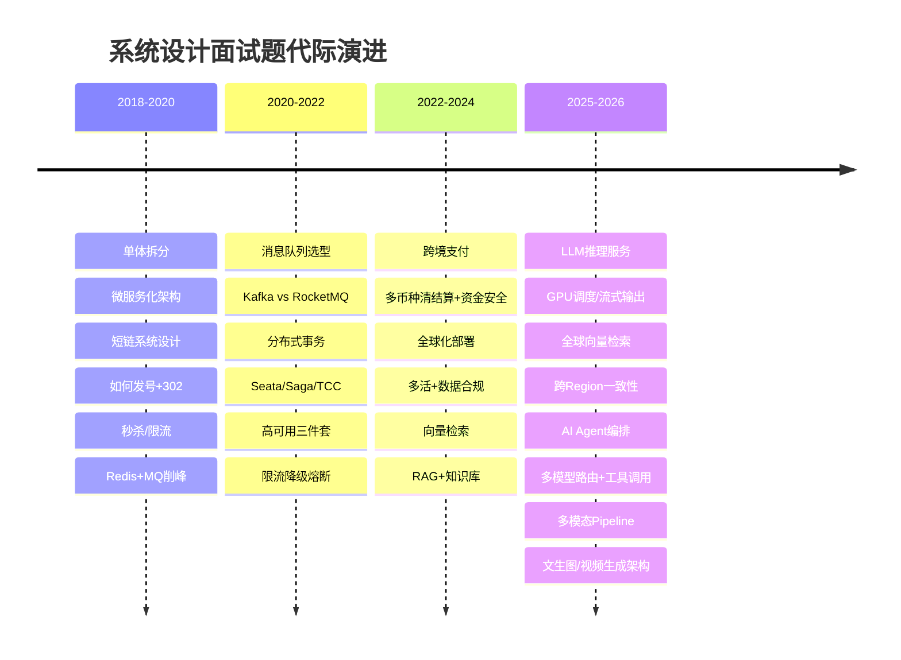

**变化本质**：
- **2018 时代**：考你有没有"分布式意识"——缓存、队列、分库分表三板斧。
- **2022 时代**：考你到底做没做过"高并发 + 强一致"的硬核场景——秒杀扣减的原子性、支付状态机的不可逆性。
- **2026 时代**：考你能否从"软件工程师"视角升级到"基础设施工程师"视角——**GPU 显存管理抽象、高计算延迟处理、模型调度与资源复用**。

### 1.2 2026 核心风向

| 风向 | 典型问题 | 考察层次 |
|------|---------|---------|
| **LLM 推理服务** | 设计一个支持 100 万 DAU 的 LLM 推理平台 | GPU 资源调度、批处理、流式输出、模型路由 |
| **向量检索** | 设计全球分布式向量检索系统 | 索引选型、分片策略、一致性权衡、混合检索 |
| **RAG 后端架构** | 设计企业级 RAG 知识库系统 | 文档解析→分块→Embedding→检索→重排→生成全链路 |
| **流式对话** | 设计高并发对话系统 | SSE vs WebSocket、连接管理、上下文管理 |
| **AI Agent** | 设计多 Agent 协作编排引擎 | 工具调用、状态管理、安全沙箱、超时链 |

### 1.3 考察本质

面试官不再满足于你知道 Redis Cluster 怎么部署——他们在测试你：

1. **GPU 显存管理抽象**：你是否理解 KV Cache 占用、Continuous Batching 对吞吐的影响？
2. **高计算延迟处理**：单次推理 2-5 秒，你怎么做超时/重试/异步化？
3. **模型调度服务**：多模型、多版本、热加载——你如何设计一个不重启的路由器？
4. **资源成本意识**：推理 1 个 token 多少钱？你怎么控制成本同时保证 SLA？

---

## 第二部分：新题型深度拆解

### 2.1 大模型推理服务设计（LLM Inference Service）

> 面试题：「设计一个支持 100 万 DAU、峰值 5000 QPS 的 LLM 推理平台，支持多模型切换、流式输出、Token 计费限流。」

#### 标准回答

**架构图**：

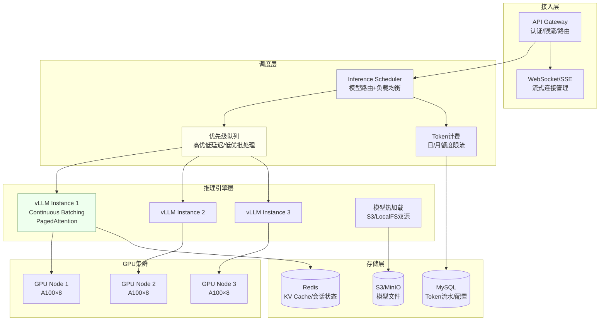

**核心模块拆解**：

**① GPU 资源调度**
- 使用 **vLLM** 作为推理引擎，核心能力是 **PagedAttention + Continuous Batching**：
  - PagedAttention 把 KV Cache 像操作系统一样分页管理，避免显存碎片，利用率从 40% → 80% 以上。
  - Continuous Batching 不等一批全部完成再发下一批，而是"动态插队"——A 请求生成完了马上把槽位给新请求 B。
- 调度策略：**按模型分组 + GPU 独占/共享混合**。热门小模型（7B/13B）共享 GPU 多实例；大模型（70B+）独占多卡。

**② 批处理优化吞吐**
- **静态 Batching**（等一批凑够了再推理）= 延迟高、吞吐低 ×
- **Dynamic/Continuous Batching** = 延迟和吞吐双优 √
- 关键参数调优：`max_batch_size`、`max_num_seqs`——越大，吞吐越高，但单请求 P99 延迟也会上升。
- 补充手段：**Prefix Caching**（相同 prompt 前缀共享 KV Cache），聊天场景 system prompt 复用，首次 Token 延迟降 50%+。

**③ 流式输出——SSE vs WebSocket**

| 维度 | SSE（推荐） | WebSocket |
|------|------------|-----------|
| 协议 | HTTP/1.1, 单向 | 全双工 |
| 实现复杂度 | 低（浏览器原生支持） | 高（需额外保活/心跳） |
| 代理兼容性 | 好（标准 HTTP 代理） | 差（部分代理不支持升级） |
| 适用场景 | 单向流式（服务端→客户端） | 双向交互 |

**为什么 SSE 是主流选择**：LLM 推理是典型的**服务端单向推送**场景——用户发 prompt，模型逐 token 返回。SSE 完全够用，且 HTTP 生态成熟（CDN、网关、日志）。**代码示例**：

```java
// SSE 流式响应核心实现
@GetMapping(value = "/chat/stream", produces = MediaType.TEXT_EVENT_STREAM_VALUE)
public Flux<ServerSentEvent<String>> streamChat(@RequestParam String prompt) {
    return inferenceService.generateStream(prompt)
        .map(token -> ServerSentEvent.<String>builder()
            .data(token)
            .event("token")
            .build())
        .concatWith(Mono.just(ServerSentEvent.<String>builder()
            .data("[DONE]")
            .event("done")
            .build()));
}
```

**④ 模型热加载**
- 目标：上线新模型版本不中断服务、不回滚已有连接。
- 方案：**S3 + 本地文件系统双源**——启动时优先从本地加载（<100ms 预热），本地不存在则从 S3 拉取（分钟级）。新版本模型推送到 S3 → 新实例从 S3 加载 → 流量逐步从旧实例切到新实例（滚动更新）。

**⑤ 多模型路由**
- 路由规则：`请求参数(model, max_tokens) → 调度器 → 最优 GPU 节点`。
- 关键决策：**按模型名路由 OR 按资源空闲度路由**？
  - 小集群（<10 模型）：按模型名绑定实例，预加载避免冷启动。
  - 大集群（>50 模型）：按资源空闲度，配合模型缓存淘汰策略（LRU/LFU）。

**⑥ Token 计费限流**
- **计费维度**：`input_tokens + output_tokens`（GPT 式）。
- 限流维度：
  - **用户级**：日/月 Token 配额，用 Redis 滑动窗口实现。
  - **模型级**：新模型优先给付费用户。
  - **全局级**：GPU 资源上限对应的最大并发，用信号量控制。

#### 考察点

- 是否理解 GPU 显存管理（PagedAttention 不是死记名词，而是理解为什么 GPU 内存碎片是核心问题）。
- 能否区分 IO 密集型（传统微服务）vs **计算密集型**（推理服务）在架构上的本质差异。
- 流式场景下**连接管理和资源回收**的意识（一个 SSE 连接 30 秒没数据该不该断？）。

#### 常见坑

- **坑 1：把 vLLM 当黑盒**——面试官追问"PagedAttention 怎么解决显存碎片？"答不出来。
- **坑 2：忽视 GPU 冷启动**——模型加载 5-30 分钟，缓存策略是必答题。
- **坑 3：token 计费做成同步**——每次推理都去 DB 扣减额度，拉高延迟。正确做法：异步批量扣减 + Redis 缓存当前额度。

#### 深度拓展

- **Speculative Decoding**：用小模型（draft model）快速生成候选 token，再让大模型（target model）验证。2-3 倍加速，但需要两个模型对齐 tokenizer。
- **Model Quantization**：INT8/INT4 量化对推理性能的影响——降低显存 50-70%，但精度可能受损。面试时提一句"我们需要根据业务场景的可接受失真度选择量化等级"即可。
- **GPU 池化/Kubernetes + GPU Operator**：生产级调度可以考虑 Ray Serve、KServe 等框架。

#### 项目支撑

XTransfer 2.0 重构中的异步任务调度经验可类比——推理任务的"提交 → 排队 → 执行 → 回调"与支付风控的"交易 → 风控评估 → 结果回调"是类似的异步流水线模式。核心都是：**任务状态机 + 优先级队列 + 超时兜底 + 可观测**。

若面试官追问是否有直接的 AI 项目落地经验，可以参考《准备-AI与LLM工程落地探索》中的实践——RAG 知识库的检索层本质上就是一个"低延迟的向量检索服务"，同样涉及请求路由、缓存预热、超时降级。

#### vLLM vs TensorRT-LLM vs Triton 深度对比

| 维度 | vLLM | TensorRT-LLM | Triton Inference Server |
|------|------|-------------|------------------------|
| 定位 | 开源推理引擎 | NVIDIA 官方优化 | 通用推理服务器 |
| 核心优势 | PagedAttention + Continuous Batching | 极致性能（NVIDIA 深度优化） | 多框架统一（TensorRT/PyTorch/ONNX） |
| 模型格式 | HuggingFace 原生 | 需转 TensorRT Engine | 多格式支持 |
| 易用性 | 高（pip install） | 低（需编译 Engine） | 中（需配置文件） |
| 社区活跃 | 活跃（Berkeley 团队） | NVIDIA 内部+生态 | 活跃 |
| 典型场景 | **LLM 推理首选** | 极致性能追求 | 多模型多框架混合部署 |

**【深度拓展】vLLM 核心技术原理**
- **PagedAttention**：把 KV Cache 按"页"管理（类似 OS 虚拟内存分页），解决了"预分配连续显存导致碎片"的问题。利用率从 40% → 80%+，同时支持更多并发请求。
- **Continuous Batching**：传统 Static Batching 等一批全完成才发下一批，短请求被长请求拖累；Continuous Batching 在每个 token 生成后检查"有没有请求完成了"——完成的立刻返回，新请求立刻插队。这让 GPU 利用率从 30% → 70%+。
- **Prefix Caching**：相同 prompt 前缀（如 system prompt）的 KV Cache 可以跨请求复用，首次 Token 延迟降 50%+。聊天场景特别有效（同一轮对话的 system prompt + 历史不变）。

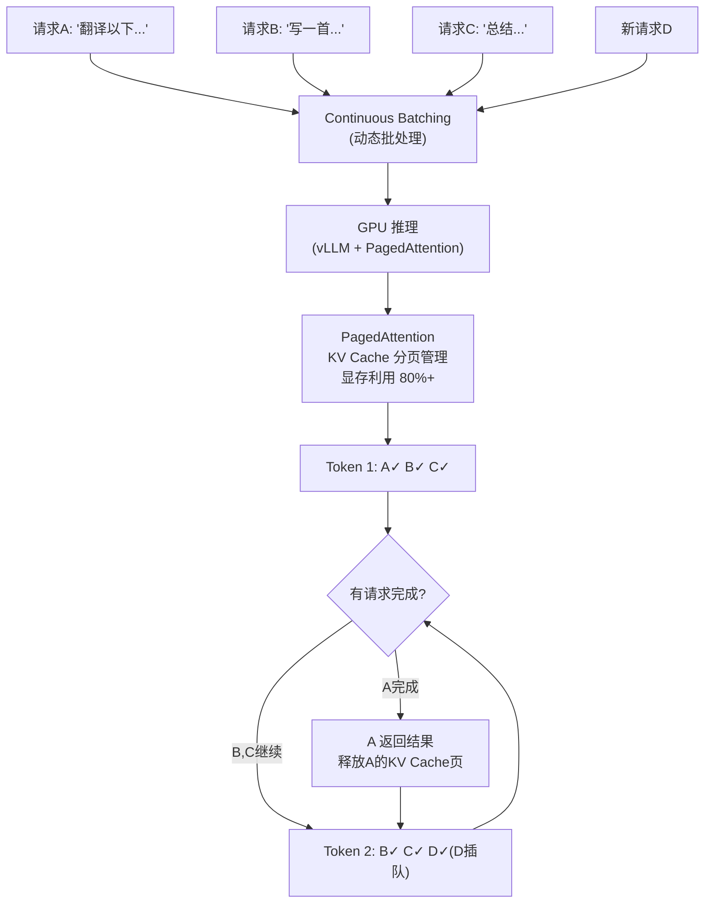

**【面试官追问】**
- "vLLM 为什么比 HuggingFace transformers 快？" → PagedAttention（显存利用率翻倍）+ Continuous Batching（GPU利用率翻倍）+ 前缀缓存，三个技术叠加。
- "Continuous Batching 和 Static Batching 的区别？" → Static 等一批全完成才换（短请求被拖累），Continuous 每步检查完成情况（短请求先返回、新请求插队）。
- "GPU 显存怎么算？" → `模型参数 + KV Cache + 激活值`。70B 模型 FP16 需 ~140GB 参数，A100 80GB 单卡放不下，需张量并行（TP）切到多卡。
- "推理服务的成本怎么控制？" → 量化（INT8/INT4 降显存50-70%）+ 批处理（提高吞吐）+ 弹性伸缩（闲时缩容）+ 缓存（相同 prompt 复用）。

---

### 2.2 全球分布式向量检索系统

> 面试题：「设计一个支持全球 100 亿向量的向量检索系统，P99 检索延迟 <100ms，支持混合检索（向量+关键词），支持多租户。」

#### 标准回答

**向量数据库选型对比**：

| 选型 | 适用场景 | 索引类型 | 分布式能力 | 混合检索 |
|------|---------|---------|-----------|---------|
| **Milvus** | 十亿级生产集群 | IVF/HNSW/DiskANN | 存算分离，原生分布式 | 丰富（标量过滤+向量） |
| **FAISS** | 嵌入式/小规模 | IVF/HNSW/PQ | 需自行封装 | 仅元数据过滤 |
| **Pinecone** | SaaS/快速启动 | 封闭（基于 IVF/HNSW） | 托管服务 | 有限（元数据过滤） |
| **Qdrant** | 中规模/多租户 | HNSW | 自托管/云 | 支持全文本+向量 |
| **Elasticsearch** | 混合检索强需求 | HNSW（及 BM25） | 原生分布式 | BM25+向量（LRR） |

**推荐**：10 亿级选 **Milvus**；混合检索强需求可选 **Elasticsearch** 或 **Qdrant**；研究/小规模用 FAISS 自建。

**向量数据库选型决策图**：

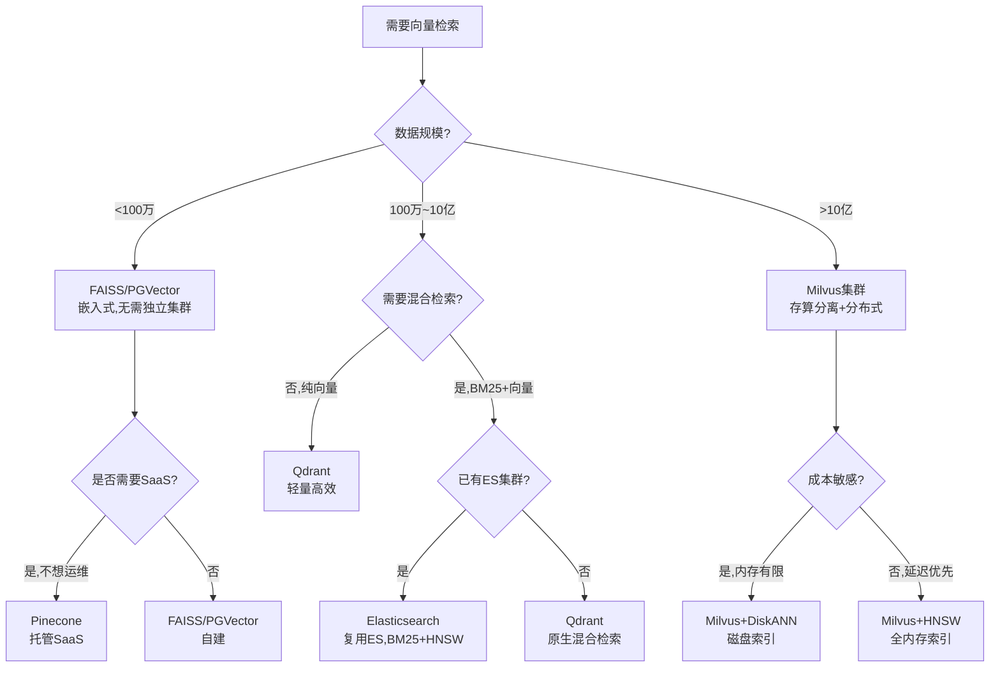

**【深度拓展】向量数据库选型的工程考量**
- **PGVector vs Milvus**：PGVector 复用现有 PostgreSQL，运维成本零，但性能和规模受限（百万级可接受、千万级开始慢）；Milvus 专为向量设计、十亿级可扩展，但需独立集群运维。选型原则：能复用就别新增组件。
- **Milvus 存算分离架构**：Query Node（查询）和 Data Node（写入）分离，各自独立扩缩容。存储用 S3/MinIO，计算用无状态 Query Node——这和"微服务+云原生"理念一致。
- **多租户隔离**：Qdrant 用 Collection 级隔离（一个租户一个 Collection），Milvus 用 Partition/Partition Key。大租户独立 Collection，小租户共享 Collection+Partition Key 过滤。

**【面试官追问】**
- "向量数据库的瓶颈在哪？" → 内存（HNSW 需全量向量驻内存）、构建速度（十亿级构建需小时级）、GPU（部分库支持 GPU 加速但成本高）。
- "向量检索的 P99 怎么保证 <100ms？" → HNSW 全内存 + 合理 efSearch + 标量过滤先缩小范围 + 缓存热点查询。
- "向量写入和检索同时做怎么办？" → 写入走 Data Node（异步建索引），检索走 Query Node（读已有索引）——存算分离让写入不阻塞检索。

**索引类型选择**：

```
HNSW（分层导航小世界图）
- 构建速度：慢
- 查询速度：最快（logN 级别）
- 内存占用：高（需存储图结构）
- 适用场景：对延迟敏感、内存充足

IVF（倒排索引+聚类）
- 构建速度：快
- 查询速度：快（nprobe 调优）
- 内存占用：中
- 适用场景：通用场景首选

DiskANN（磁盘索引）
- 构建速度：慢
- 查询速度：中
- 内存占用：低
- 适用场景：成本敏感、向量不必全在内存
```

**推荐策略**：在线集群用 **IVF+PQ**（精度/速度/内存平衡）；热门索引加一层 **HNSW** 缓存加速；冷数据用 **DiskANN**。

**全球分片策略**：

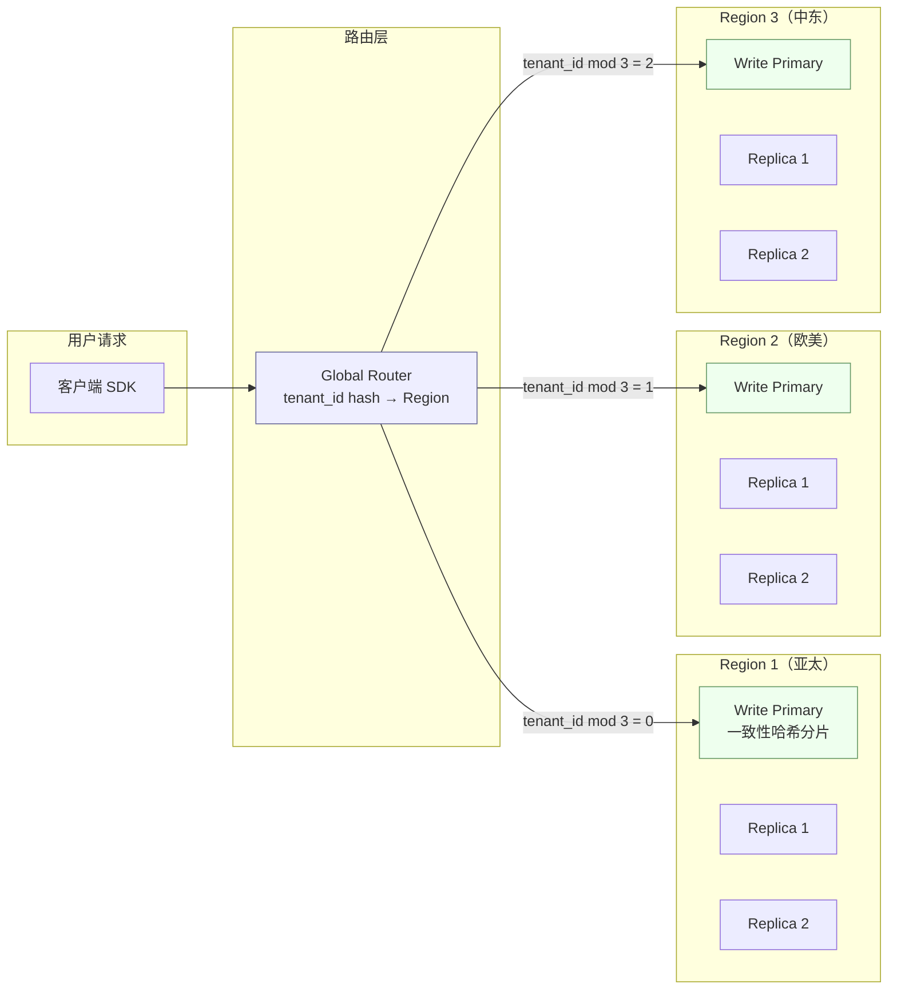

**分片设计**：
- **按 collection（租户）分片**：租户数据天然隔离，简单有效。P99 延迟可控——因为搜索范围固定在单个 collection 内。
- **跨 Region 复制**：对延迟不敏感的租户可以用异步复制；对全球延迟要求 <200ms 的，部署**每个 Region 一个全量只读副本**，通过一致性协议保证最终一致。
- **一致性权衡**：向量检索天然对"片刻不完整"容忍度高——写入后 1-3 秒不被搜到是可接受的。所以默认用**最终一致**，强一致需求加 `consistency=STRONG` 参数。

**混合检索**：

向量检索解决"语义相似"，但不擅长"精确匹配"。混合检索 = **向量 + 全文**：

```
过滤 → 粗筛（向量 Top-K）→ 精排（BM25 关键词 + RRF 融合）→ 最终结果
```

实现：Milvus + Elasticsearch 双写——Milvus 存向量 + 标量过滤，ES 存原始文本 + BM25 索引。检索时两面同查，通过 **RRF（倒数排名融合）** 合并排序。

#### 考察点

- 是否知道不同向量索引的适用边界（HNSW 内存大但快 / IVF 平衡 / DiskANN 省内存）。
- 是否能区分**标量过滤 + 向量检索**（Milvus 原生支持）和**全文本 + 向量混合检索**（需双引擎）。
- 全球部署是否考虑了**数据合规**（GDPR 要求欧盟数据不出境）。

#### 常见坑

- **坑 1："我选 FAISS，因为它是 Meta 开源的"**——FAISS 是嵌入式库，不是分布式系统。面试官追问"你怎么做故障转移？"直接翻车。
- **坑 2：忽视向量维度爆炸**——768 维文本 Embedding + 1024 维图片 Embedding 混合存储，数据结构要看清楚。`dim` 不同 → 不同 collection。
- **坑 3：nnprobe 参数魔数**——面试官问"nprobe 设 16 还是 64？"说不出依据。答：**越大精度越高，延迟也越高。生产要基准测试出准确率-延迟曲线，业务方选点**。

#### 深度拓展

- **多模态向量**：CLIP 模型同时编码文本和图片到一个向量空间，跨模态搜图（文本搜图、以图搜图）的核心能力。
- **动态索引更新**：大量实时写入时索引频繁重建——用 **分段式索引（Segment-based）**：新数据写入小段，后台合并到大段；读取时并发查询所有段后合并结果。
- **Embedding 成本优化**：对 100 亿向量做 Embedding，一次模型调用不算大，但 100 亿次就是百万美元级成本。可以考虑对低频查询向量做量化压缩（PQ/Scalar Quantization）。

#### 项目支撑

XTransfer 跨境支付中的 **对账匹配** 场景——银行流水与内部订单的模糊匹配，本质上是一个文本相似度匹配问题，可类比向量检索思路：用 Semantic Embedding 计算"银行备注"与"内部订单号"的相似度。虽然当时主要用规则 + 编辑距离，但 Embedding 方案是后期演进方向。

配合《准备-向量检索与RAG实践》中的 RAG 检索层实践——构建企业知识库时，对 Milvus Collection 按部门（租户）分片、配置 IVF+PQ 索引、混合检索（向量+BM25 关键词）的实际调优经验。

---

### 2.3 高并发流式对话系统

> 面试题：「设计一个支持 50 万并发连接的 AI 对话系统，支持多轮会话上下文、流式输出、故障自动恢复。」

#### 标准回答

**SSE vs WebSocket 决策树**：

```
是否需要客户端主动推送？
├── 否 → SSE（ChatGPT 的选择）
│   ├── 优点：HTTP/2 多路复用、代理友好、断线重连内置
│   └── 缺点：单向后端→前端，前端新问题需新请求
└── 是 → WebSocket
    ├── 优点：全双工、低延迟、连接复用
    └── 缺点：需心跳保活、代理兼容性好但复杂
```

**架构设计**：

```
                     API Gateway
                   (连接管理+认证)
                         │
             ┌───────────┼───────────┐
             │           │           │
         SSE Conn     SSE Conn    SSE Conn
          Pool 1       Pool 2      Pool 3
             │           │           │
             └───────────┼───────────┘
                         │
              Conversation Manager
          (会话状态 + 上下文管理)
                         │
              ┌──────────┼──────────┐
              │          │          │
         Redis Cluster  DB        LLM
        (会话KV/最近N轮) (历史)  (推理服务)
```

**连接管理**：
- API Gateway 层用 **Netty** 或 **Spring WebFlux** 管理长连接，每个 SSE 连接是一个 `SseEmitter`。
- 连接池化：预先分配 `maxConnections` 个 SseEmitter 槽位，超出走排队/降级。
- 心跳：SSE 默认有 keep-alive，额外每 15 秒发一帧 `: heartbeat\n\n`（SSE comment 被浏览器忽略但保持连接）。

**超时/重试/熔断**：
- **连接超时**：客户端 30 秒无数据 → 断开重连。重连时带上 `Last-Event-ID`，服务端从上次断开点继续推送。
- **推理超时**：单次推理 > 60 秒 → 返回 `[TIMEOUT]` 事件 + 已生成的 token，让用户重新提交。
- **熔断**：推理服务错误率 > 10% → Circuit Breaker 打开 → 返回缓存响应（有相似问题的历史回答）或纯降级文本。

**上下文管理**：

多轮对话本质是**提示词拼接**：

```
第1轮: [User: "什么是分布式事务？"] → [Assistant: "..." (512 tokens)]
第2轮: [系统提示] + [第1轮全量] + [User: "Saga 怎么做补偿？"] → [Assistant: "..." (1024 tokens)]
...
第N轮: [系统提示] + [第1~N-1轮摘要] + [最近3轮全量] + [User当前问题]
```

核心策略：**滑动窗口 + 摘要压缩**。

```java
public class ContextManager {
    private static final int MAX_WINDOW = 5;          // 最近 5 轮保留全量
    private static final int MAX_TOKENS = 8000;       // 上下文总 Token 上限

    public List<Message> buildContext(String sessionId, String userMsg) {
        // 1. 从 Redis 获取会话历史
        List<Message> history = redis.lrange(sessionId + ":messages", 0, -1);

        // 2. 超过窗口 → 取最近 5 轮全量 + 更早的摘要
        if (history.size() > MAX_WINDOW * 2) {
            String summary = getOrGenerateSummary(sessionId, history);
            history = history.subList(history.size() - MAX_WINDOW * 2, history.size());
            history.add(0, new SystemMessage("对话历史摘要: " + summary));
        }

        // 3. Token 预算控制 → 超过上限则截断
        history = truncateByTokenBudget(history, MAX_TOKENS);
        history.add(new UserMessage(userMsg));

        return history;
    }
}
```

**多轮对话状态设计**：
- 会话状态 = `(session_id, model, max_tokens, temperature, 最近 n 轮消息)`
- 存储：**Redis（热）+ MySQL（冷）**。
  - Redis：存最近 20 轮的完整对话，TTL 30 分钟。
  - MySQL：归档全量历史，异步写入。
- 状态恢复：SSE 断开后客户端用 `session_id` 重连，服务端从 Redis 恢复上下文。

#### 考察点

- 是否意识到 **SSE 连接是有限资源**（每个连接占用一个 TCP 连接 + 一个线程/协程）。
- 上下文管理的核心矛盾：**越长越准 vs 越贵（Token 费用）**。答出"滑动窗口 + 摘要压缩"是两个矛盾的缝合方案。
- **Last-Event-ID 重新订阅**机制：这个细节证明你真的在生产中用过 SSE。

#### 常见坑

- **坑 1："我用 WebSocket 因为大家都用 WebSocket"**——ChatGPT、Claude 都用 SSE。不要从众，要说出选择理由。
- **坑 2：上下文无限增长**——10 轮后对话回复明显变慢，因为没有做上下文裁剪。实际上 50 万并发下，每个多存 2000 tokens，Redis 内存多占 50G+。
- **坑 3：重连后上下文丢失**——没设计 session_id 恢复机制。

#### 深度拓展

- **Prompt Caching**：系统提示（system prompt）在多轮对话中重复出现——在推理引擎层缓存其 KV Cache（Prefix Caching），只用算新消息部分，首次 Token 延迟降 50%+。
- **对话分支**：用户在对话中途可以编辑/撤销某条消息，生成"对话树"——本质上是 `parent_id` 链，实现类似 Notion 的块引用。

#### 项目支撑

XTransfer 2.0 重构中的异步任务系统——大文件的异步导出/报表生成也是一种"长连接等待"场景：用户提交任务 → 服务端异步执行 → 进度通知（相当于 SSE token 流）。这套"提交任务 → 状态查询/推送 → 结果获取"的流水线模式与流式对话的"提交 → 流式返回 → 完成"异曲同工。

#### 流式对话系统 Mermaid 架构图

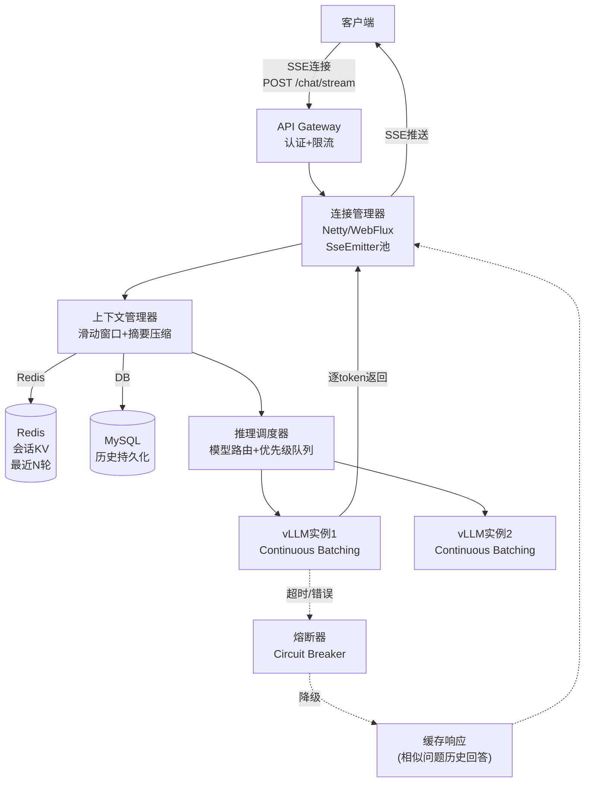

**【深度拓展】流式对话的工程难点**
- **连接资源管理**：50万并发 SSE 连接 = 50万 `SseEmitter` 对象驻留内存。每个连接占 ~4KB 内存 = ~2GB。要监控连接数、内存使用、及时清理超时连接。
- **推理排队**：GPU 资源有限（如 8 张 A100），50万连接不可能同时推理。用优先级队列管理——付费用户优先、免费用户排队。
- **断线重连**：网络抖动导致 SSE 断连，客户端重连时带 `Last-Event-ID`，服务端从断点继续推送。这需要服务端缓存"已生成但未推送完"的 token。
- **上下文 Token 超限**：多轮对话 token 越来越多，超过模型上下文窗口（如 32K）。策略：滑动窗口（保留最近N轮）+ 摘要压缩（更早的对话用 LLM 生成摘要）。

### 2.4 AI Agent 编排引擎设计

> 面试题：「设计一个多 Agent 协作编排引擎，支持工具调用、状态管理、安全沙箱。」

**Agent 编排架构**：

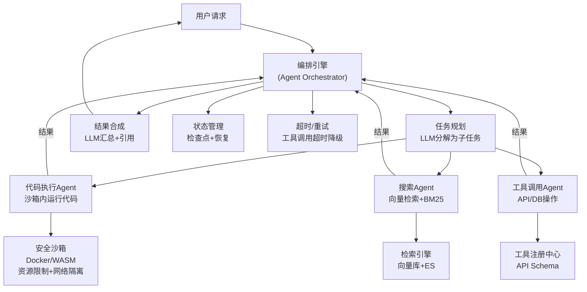

**核心设计要点**：

**① 任务规划（Planning）**
- LLM 接收用户请求 → 分解为子任务序列（如"查数据→分析→写报告"）。
- 子任务并行/串行执行，结果汇总给 LLM 生成最终回答。
- 失败的子任务可以重试或降级（如"搜索失败了，用缓存回答"）。

**② 安全沙箱（Sandboxing）**
- Agent 执行代码/调用工具时必须在沙箱内——Docker 容器或 WASM runtime。
- 资源限制：CPU/内存/执行时间上限。
- 网络隔离：只允许白名单 API 访问，防止 SSRF。
- 文件系统隔离：临时目录，执行完清理。

**③ 工具调用（Tool Use）**
- 工具注册中心：每个工具有 API Schema（OpenAPI/JSON Schema），LLM 按需选择调用。
- 参数校验：LLM 生成的参数必须通过 Schema 校验才能执行。
- 结果解析：工具返回值喂回 LLM 继续推理（ReAct 模式：Reason → Act → Observe → Repeat）。

**④ 状态管理与恢复**
- Agent 执行过程有检查点（checkpoint），中途失败可从最近检查点恢复。
- 超时控制：单个工具调用超时 → 降级或跳过；整个 Agent 执行超时 → 终止并返回部分结果。

**【面试官追问】**
- "Agent 编排和 Workflow 引擎（如 Airflow/XXL-JOB）的区别？" → Agent 的执行路径是 LLM 动态决策的（非确定性），Workflow 的路径是预定义的（确定性）。Agent 更灵活但更难调试。
- "怎么防止 Agent 执行危险操作？" → 沙箱隔离 + 白名单工具 + 人工审批（高危操作需确认）+ 审计日志。
- "多 Agent 协作的通信怎么做？" → 共享状态（黑板模式）或消息传递（Actor 模型）。简单场景用共享 DB/Redis，复杂场景用消息队列。

---

## 第三部分：经典题 2026 高阶答法

> 经典题不是不能用，而是**答法要进入 2026 版本**——不再背八股，要展示你在真实亿级业务中手撕过这些坑、踩过这些点。

### 3.1 QPS 翻 10 倍（系统容量规划）

> 面试题：「公司现有架构 QPS 峰值 5000，业务扩张 QPS 将达 50000。现有架构遇到瓶颈，怎么规划？」

#### 标准回答

用**小林 coding 两阶段法**：

**阶段一：紧急止血（0-1 周）**

1. **限流**：网关层 + Nginx 层双重限流——令牌桶固定 QPS 上限，超出直接 429。
2. **降级**：非核心功能（推荐/广告/日志详情）切开关——返回静态数据或空列表。
3. **扩容**：核心服务水平扩展——加机器、加 Pod，K8s HPA 自动伸缩。

**阶段二：架构演进（1-3 月）**

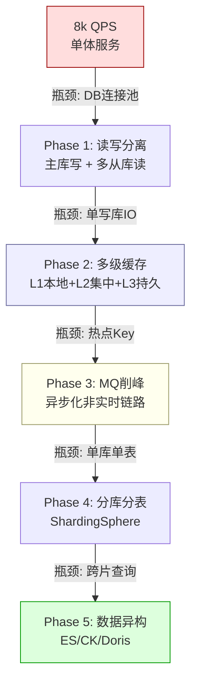

**逐层展开**：

**Phase 1：读写分离**
- 主库写 + N 个从库读。数据延迟 < 1s。
- 主键/唯一键写入后马上读 → 强制走主库（hint 路由）。
- 瓶颈：主库仍是单点写入瓶颈。

**Phase 2：多级缓存**
- **Caffeine（本地/进程内）**：极限场景高 QPS 小数据，无网络开销，但一致性难以降级 → **一致性靠短 TTL + 通知失效**。
- **Redis Cluster（集中式）**：热点数据、计数器、分布式锁 → **cluster 模式 + 数据分槽**。
- **缓存策略**：先改 DB 再删缓存（Cache-Aside 变体）；缓存失效用 **双删**——写 DB 前删一次、写完后延迟 500ms 再删一次（防止"读老值覆盖"）。
- **防缓存击穿**：热点 Key 失效 → 互斥锁（SETNX）只让一个线程回源 DB。
- **防缓存穿透**：布隆过滤器——不存在的数据直接拦截。
- **防缓存雪崩**：过期时间加随机因子（`TTL = 3600 + Random(0, 600)`，避免同时大批失效）。

**Phase 3：MQ 削峰**
- 记账/发通知/数据报表等非实时链路，改为"先接收请求 → 落库 → 返回受理成功 → 异步处理"。
- 消息队列 + 消费幂等 + 死信队列兜底。

**Phase 4：分库分表**
- 订单表 5000 万行+ → 按 `user_id % N` 分库、按 `order_date` 分表（避免单库单表过大）。
- ShardingSphere-JDBC 中间件，外键/复杂 Join 迁移到业务层组装。
- 分片键选择：选择 **WHERE 条件最高频的字段** 作为分片键。

**Phase 5：数据异构**
- 跨片查询 → ES（近实时）或 ClickHouse/TiDB（实时分析）。

#### 考察点

- 能否清晰说明**每个 phase 的瓶颈点**和**触发阈值**（为什么 QPS 到 5 万而不是 5000 才分库分表？答：单库连接数上限 2000，QPS 5000 时连接数才 ~200，还有余量）。
- 能否把**限流/降级/扩容/监控**在紧急止血阶段打包完成（证明有应急经验）。
- 是否知道每种方案的**适用场景和代价**（缓存带来一致性问题、MQ 削峰带来异步延迟、分库分表带来运维复杂度）。

#### 常见坑

- **坑 1：上来就分库**——5000 QPS 根本不需要分库，读写分离+缓存已经能撑到好几万。
- **坑 2：把缓存当成银弹**——缓存能解决读，解决不了写。写入的瓶颈要分库分表或 MQ。
- **坑 3：没有容量规划数字**——面试官问"你说 Redis 能扛 10 万 QPS，单机够吗？"需要答"单机 8-10 万 QPS，保险起见 3 主 3 从集群轻松 30 万+读"。

#### 深度拓展

- **全链路压测**：不是单个服务压测，而是在生产隔离环境把整条链路都压满。需要 Mock 外部依赖。
- **容量的非线性**：QPS 翻 10 倍不是 CPU 翻 10 倍——因为锁竞争/GC/线程池排队等非线性开销，CPU 可能翻 20-50 倍。安全系数 3x。
- **成本计算**：扩展方案对应的硬件成本——50000 QPS 各阶段每个月多少钱？Back-of-the-envelope。

#### 项目支撑

**XTransfer 2.0 重构**：收款平台从老架构迁移到新架构时，QPS 预期增长就是这套思路——先做了容量评估（当前 TPS 300 → 目标 TPS 3000），紧急阶段用了限流降级（Sentinel），演进阶段拆了"查/改/通知"三条异步链路，落地了分库分表（用户维度分片）+ ES 异构 + 多级缓存。

**欧凡电商秒杀**：库存扣减是高并发写入场景的典型——异步削峰（库存扣减 MQ 化）在 QPS 翻 10 倍时是必做的一步。

---

### 3.2 秒杀系统层层漏斗

> 面试题：「设计一个 100 万人在线抢 100 件商品的秒杀系统。」

#### 标准回答

**漏斗模型**：

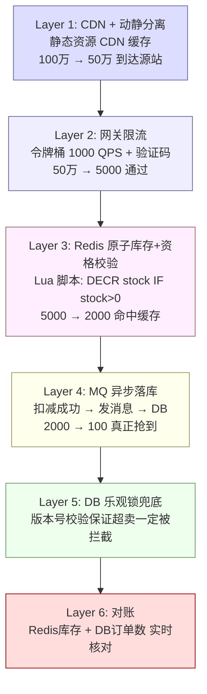

**逐层详解**：

**Layer 1：CDN + 动静分离**
- 商品图片/页面 HTML 全部走 CDN，源站只处理 API 请求。
- 秒杀按钮**在开抢前 10 秒才显示**（JS 控制），减少无效请求。

**Layer 2：网关限流**
- Nginx 令牌桶：`limit_req_zone $binary_remote_addr zone=seckill:10m rate=10r/s`——单 IP 10 次/秒。
- 验证码：区分人机流量（滑块验证码），防止脚本抢购。人机比校验也是流量整形。

**Layer 3：Redis 原子扣减**

这是秒杀的核心——**Lua 脚本保证原子性**：

```lua
-- Redis Lua 秒杀脚本
local key_stock = KEYS[1]          -- seckill:goods:1001:stock
local key_success = KEYS[2]        -- seckill:goods:1001:success:userId
local userId = ARGV[1]
local limit_per_user = tonumber(ARGV[2]) -- 每人限购数量

-- 1. 校验用户是否已抢过
local user_count = redis.call('SCARD', key_success)
local user_got = redis.call('SISMEMBER', key_success, userId)
if user_got == 1 then
    return -1  -- 已抢过
end
if user_count >= limit_per_user then
    return -2  -- 该用户已达限购上限
end

-- 2. 原子扣减库存
local stock = tonumber(redis.call('GET', key_stock))
if stock and stock > 0 then
    redis.call('DECR', key_stock)
    redis.call('SADD', key_success, userId)
    return 1  -- 抢购成功
else
    return 0  -- 库存不足
end
```

**关键细节**：
- `DECR` 本身是原子的，但 **先检查 + 后扣减 = 两个操作 ≠ 原子**，所以用 Lua 捆在一起。
- 为什么 SET 而不用 INCR 记录成功用户？因为要支持查询"用户是否已抢"——Redis SMEMBERS/SISMEMBER O(1)。

**Layer 4：MQ 异步落库**
- 扣减成功 → 发消息到 RocketMQ/Kafka → 消费端生成订单写入 DB。
- 消息体：`(goodsId, userId, timestamp, requestId)`。
- 消费端用 **requestId 去重**保证幂等——同一条秒杀成功消息不能被重复下单。

**Layer 5：DB 乐观锁兜底**
- 下单时 `UPDATE ... SET version = version + 1 WHERE id = ? AND version = ?`。
- 如果 Redis 因网络分区/主从切换导致库存"膨胀"（以为自己还有库存），到 DB 这层最终兜底——**版本号冲突 → 回滚**。

**Layer 6：对账**
- 定时任务（每分钟）：`Redis 扣减的库存数` vs `DB 中的成功订单数`。
- 不一致 → 告警 + 人工介入。

#### 考察点

- 能否讲清楚**漏斗各层削峰比例**（100 万 → 5000，是怎么算出来的）。
- **Redis Lua 脚本原子性**作为秒杀扣减的标配方案。
- 乐观锁"兜底"的语义——不是主力，是最后一道防线。

#### 常见坑

- **坑 1：库存预热没做**——服务重启后 Redis 库存丢了，得有个预热机制（DB 加载到 Redis）。
- **坑 2：Lua 脚本里调用 KEYS**——生产环境禁用 `KEYS`，应用 `SCAN` 或预定义 Key。
- **坑 3：MQ 消息丢失**——没做生产者确认和持久化。

#### 深度拓展

- **本地库存预扣**：Java 应用本地内存中预先扣减 `stock_local = 1000`，Redis 全局库存 20000，每个实例分 500 个。这样 >90% 流量不过 Redis——极致优化方案。但要处理实例宕机后的库存回收。
- **Redis 异步扣减**：Lua 的 Lua 脚本仍是串行的（Redis 单线程），单实例 QPS 有限。可以考虑 **Redis Cluster 分片**：每个商品热点 Key 打散到多个分片上，分散压力。

#### 项目支撑

**欧凡直播电商秒杀**：欧洲直播间秒杀场景——1000 人在线抢 50 件商品。落地了 Redis Lua 脚本库存扣减 + RocketMQ 异步落库订单 + 乐观锁兜底。关键踩坑：MQ 消费者积压时要把扣减成功的消息优先消费（不同 topic 分流），否则用户等 30 秒还没看到订单。

#### 秒杀系统完整架构图

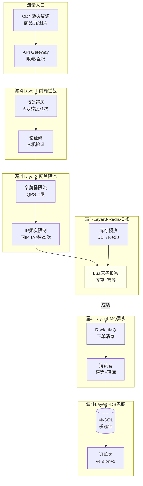

**漏斗削峰效果（100万请求 → 5000订单）**：

| 层 | 进入量 | 拦截量 | 机制 |
|---|--------|--------|------|
| 前端按钮 | 100万 | 70万 | 5s置灰+验证码 |
| 网关限流 | 30万 | 25万 | 令牌桶 QPS上限 |
| IP频次 | 5万 | 3万 | 同IP 1分钟≤5次 |
| Redis扣减 | 2万 | 1.5万 | 库存不足/已抢过 |
| MQ落库 | 5000 | 0 | 全部成功落库 |

**【深度拓展】秒杀的热点问题**
- **热点 Key**：秒杀商品的库存 Key 是全局热点，所有请求打同一个 Redis 分片。解法：**库存分片**（把 1000 库存拆成 10 个 Key 各 100，请求哈希到不同分片）或**本地缓存**（每个实例预分配一定本地库存）。
- **热点行**：DB 里同一行库存记录被大量 `UPDATE` 并发。解法：MySQL 前面有 Redis 兜底，DB 只处理 MQ 消费者的事务化落库，并发度可控。
- **缓存穿透**：恶意请求不存在的商品 ID。解法：布隆过滤器（不存在的 ID 直接拦截）+ 空值缓存（短 TTL）。

**【面试官追问】**
- "如果 Redis 挂了怎么办？" → 降级到 DB 乐观锁扣减（慢但保数据一致），同时告警抢修 Redis。不能"Redis 挂了就停止秒杀"。
- "超卖怎么防？" → 三道防线：Redis Lua 原子扣减（不超卖）+ MQ 消费幂等（不重复下单）+ DB 乐观锁兜底（最终防线）。
- "如何做秒杀的容量规划？" → 峰值 QPS × 3 倍冗余，各层（Gateway/Redis/MQ/DB）分别压测找瓶颈。

---

### 3.3 RPC 框架设计

> 面试题：「请设计一个高性能 RPC 框架，支持异步调用、服务发现、负载均衡、熔断。」

#### 标准回答

**RPC 全链路**：

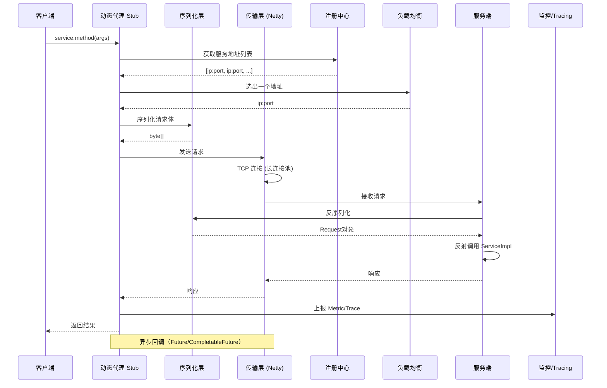

**逐层展开**：

**① 动态代理（Stub）**
- 客户端通过 **JDK 动态代理** 或 **ByteBuddy/Javassist** 生成接口代理类。
- 调用 `orderService.createOrder()` → 代理类拦截 → 构造 RPC 请求 → 发送 → 返回。

**② 序列化协议**
- 选型矩阵：

| 序列化协议 | 大小 | 速度 | 跨语言 | 适用 |
|-----------|------|------|--------|------|
| Hessian2 | 小 | 快 | 一般 | Dubbo 默认 |
| Protobuf | 最小 | 最快 | 强 | gRPC |
| JSON | 大 | 慢 | 强 | 调试/网关 |
| Kryo | 小 | 快 | 差 | Java-only 高性能 |

- 推荐：Dubbo 默认 Hessian2；跨语言选 Protobuf；纯内网高性能选 Kryo。

**③ 传输层（Netty）**
- 长连接池：复用 TCP 连接，避免三次握手开销。
- Reactor 模式：`Boss Group` 接受连接 → `Worker Group` 处理 IO → `Handler Pipeline` 编解码。
- 粘包/拆包：用 Netty 的 `LengthFieldBasedFrameDecoder`——消息头带 length 字段。

**④ 注册中心**
- 服务提供者启动 → 注册到 ZooKeeper/Nacos → 服务消费者 Watch 节点变化 → 自动更新本地列表。
- 心跳保活：Provider 每 30s 向注册中心发心跳，超时则踢出。
- CAP 取舍：注册中心崩溃 → 消费者用本地缓存的服务列表继续工作（可用性优先）。

**⑤ 负载均衡**
- 轮询/Random/LeastActive/一致性 Hash。
- 一致性 Hash：常用于有状态服务（如缓存亲和），当节点增删时只有受影响的数据迁移。

**⑥ 熔断/容错**
- Sentinel/Hystrix：监控错误率 → 超过阈值 → 熔断打开 → 快速失败或降级。
- 故障转移（Failover）：失败重试另一个节点（幂等场景）。
- 快速失败（Failfast）：非幂等场景直接返回错误。

#### 考察点

- 是否能把 RPC 调用的全链路打通（代理→序列化→网络→服务发现→负载均衡→容错）。
- 长连接 vs 短连接的选择依据（RPC 用长连接因为频繁调用，短连接给低频/CDN）。
- 序列化协议的**大小/速度/可读性**三角权衡。

#### 常见坑

- **坑 1："注册中心用 Eureka，因为它支持 AP"**——Eureka 2.0 已停更，面试中应该提 Nacos（国内主流）或 Consul。
- **坑 2：没提负载均衡的**有状态 vs 无状态**——一致性 Hash 用于有状态场景，轮询用于无状态。**
- **坑 3：序列化只说 JSON**——未考虑 Protobuf 的大小优势（5 倍压缩）和跨语言需求。

#### 深度拓展

- **协议设计**：magic number + version + messageType + requestId + serialization + length + body。这个"协议头"的设计体现了你对二进制协议的理解。
- **NIO Epoll**：Netty 底层是 epoll 事件驱动——一个线程管理数千连接。面试时说出"Boss Group + Worker Group 各占多少线程"是加分项。

#### 项目支撑

**XTransfer 六边形端口/SPI**：收款平台的微服务间 RPC 调用通过 SPI 解耦——不是直接调 Dubbo Service，而是通过 SPI 接口定义能力契约，底层实现可以换 Dubbo/gRPC/HTTP。这种设计保证**核心域不依赖基础设施选型**，也是开闭原则（OCP）在分布式调用中的体现。

---

### 3.4 短链系统

> 面试题：「设计一个短链系统，支持 1 亿条短链，QPS 10 万读取，P99 < 10ms。」

#### 标准回答

**核心链路**：`长 URL → 生成的唯一 ID → Base62 编码 → 返回短链` / `短链 → 解码 Base62 → 查缓存 → 302 重定向`

**① 分布式 ID 生成**
- 雪花算法或美团 Leaf 段模式——生成全局唯一递增 ID。

**② Base62 编码**
- `ID → 62 进制`（0-9, a-z, A-Z）。
- 100 亿的 ID 用 Base62 只需 6 位字符（62^6 ≈ 568 亿 > 100 亿）。

```java
private static final char[] BASE62 = "0123456789abcdefghijklmnopqrstuvwxyzABCDEFGHIJKLMNOPQRSTUVWXYZ".toCharArray();

public static String encode62(long id) {
    StringBuilder sb = new StringBuilder();
    while (id > 0) {
        sb.append(BASE62[(int) (id % 62)]);
        id /= 62;
    }
    return sb.reverse().toString();
}
```

**③ 302 重定向**
- `GET /aB3xYk → 查 Redis → 获取长 URL → 302 Location: long_url`。
- 为什么 302 不 301：301 被浏览器缓存后无法统计真实访问量。

**④ 缓存 + 布隆过滤器防穿透**
- L1：Caffeine 本地（热点短链，10000 条）。
- L2：Redis（全量，TTL 7 天）。
- L3：布隆过滤器（防穿透——恶意请求随机短链时，先判断"短链可能存在吗？"→ 不存在直接返回 404）。

**⑤ 分库分表**
- 按短链 ID Hash % N 分库，保证数据均匀分布。

#### 考察点

- **为什么 301 vs 302**——这个细节展示了你的 HTTP 功底。
- **布隆过滤器的误判如何处理**——"可能存在"时去 Redis 查，"一定不存在"时直接拦截。

#### 项目支撑

XTransfer 支付链接分享（收银台链接）就是短链的一种变体——给商户生成唯一收款链接，客户点击后 302 到收银台页面。

---

### 3.5 分布式 ID 发号器

> 面试题：「设计一个分布式唯一 ID 生成系统，要求全局唯一、趋势递增、高性能（单机 10 万+ TPS）。」

#### 标准回答

**方案一：雪花算法（Snowflake）**

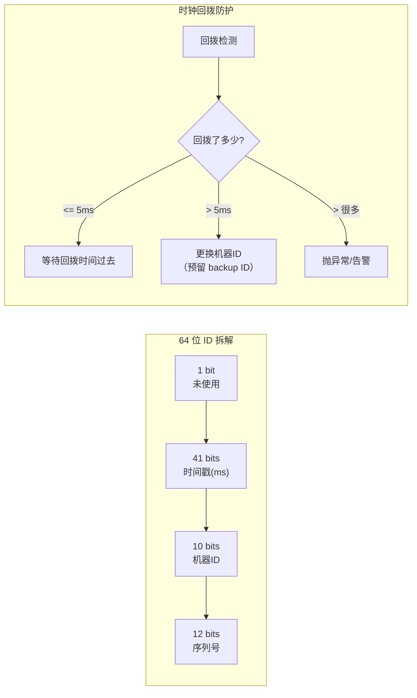

- **时间戳 41 bits**：`(1L << 41) / (1000 * 3600 * 24 * 365)` ≈ 69 年。
- **机器 ID 10 bits**：支持 1024 个节点（可以拆为 5 bits 数据中心 + 5 bits 机器）。
- **序列号 12 bits**：单机每毫秒 4096 个 ID，即 409.6 万 TPS。

**时钟回拨防护**：
- **问题**：如果服务器时钟被手动修改或 NTP 同步导致"时间倒退"，会生成重复 ID。
- **解法**：
  1. 记录上一次生成 ID 的时间戳，检测到回拨时 < 5ms→等待，> 5ms→切换备用机器 ID。
  2. 美团 Leaf 的做法：用 Zookeeper 持久顺序节点生成 workerId，机器重启时复用原 ID。
  3. 超大回拨 → 抛异常 + 人工介入（理论上 NTP 不会回拨太多）。

```java
public synchronized long nextId() {
    long current = System.currentTimeMillis();
    if (current < lastTimestamp) {
        // 时钟回拨
        long offset = lastTimestamp - current;
        if (offset <= 5) {
            // 小范围回拨，等待即可
            Thread.sleep(offset + 1);
            current = System.currentTimeMillis();
        } else if (offset <= 60_000) {
            // 中范围回拨，换备用机器ID
            workerId = backupWorkerId;
        } else {
            throw new RuntimeException("时钟回拨过大: " + offset + "ms");
        }
    }

    if (current == lastTimestamp) {
        sequence = (sequence + 1) & maxSequence;
        if (sequence == 0) {
            // 当前毫秒内序列号用完，等到下一毫秒
            current = waitNextMillis(lastTimestamp);
        }
    } else {
        sequence = 0;
    }
    lastTimestamp = current;

    return (current - epoch) << TIMESTAMP_SHIFT
         | workerId << WORKER_SHIFT
         | sequence;
}
```

**方案二：美团 Leaf 段模式（数据库号段 + 双 Buffer）**

- 数据库维护 `biz_tag + max_id + step`。
- 服务启动时，DB 分配一个号段（如 `[1, 1000]`），本地内存消费完后再取下一个号段 `[1001, 2000]`。
- **双 Buffer**：当前号段消费到 90% 时，异步预加载下一个号段。这样永远不会因为取号段而阻塞。
- TPS 是雪花算法的 2-3 倍（无需每毫秒自旋），但 ID 不是单调递增的（只是趋势递增）。

**适用场景**：

| 需求 | 推荐方案 |
|------|---------|
| 全局唯一 + 趋势递增 | 雪花算法 |
| 全局唯一 + 极致 TPS | 数据库号段（美团 Leaf） |
| 全局唯一 + 单调递增（严格） | 不需要，有 Redis INCR 就行 |

#### 考察点

- **时钟回拨**的识别和处理——这是雪花算法的面试必问题。
- 能否说出**趋势递增 vs 单调递增**的区别（分布式场景趋势递增够用，单调递增需要中心化发号器）。
- 号段模式的内存使用和**双 Buffer 设计**。

#### 项目支撑

**XTransfer 跨境支付单号生成**：用雪花算法的变体实现——机器 ID 用 Pod IP 的 Hash 自动分配。关键优化：多业务线用不同 `biz_tag` 区分——收款订单、付款订单、账户流水各自独立计数器，排查问题时一眼看出是哪个业务域的。

---

## 第四部分：面试框架与策略

### 4.1 BOE 容量估算（Back-of-the-Envelope）

> 面试官给你一个场景，你要**30 秒内**给出关键数字，并说明计算过程。

**核心数字（背下来）**：

| 资源 | 近似值 | 备注 |
|------|--------|------|
| 单机 MySQL 读 | 5000-10000 QPS | 有索引/SSD |
| 单机 MySQL 写 | 1000-3000 QPS | 根据事务复杂度 |
| 单机 Redis 读写 | 80000-100000 QPS | 单线程，管道可更高 |
| 单机 Nginx | 50000-100000 QPS | 静态/反向代理 |
| 单台 Kafka 写入 | 10 万+ msg/s | 批量刷盘模式 |
| 网络延时 | CDN 1ms / 同城 5ms / 跨国 150-300ms | |
| SSD 随机读 | ~100 MB/s | 4K 随机读 ~25K IOPS |
| 千兆网卡带宽 | ~125 MB/s | |

**计算模板**：

```
1. 日活/峰值 = DAU × 峰值系数(2~5)
2. 读/写 QPS = 日活 × 人均请求数 / 86400 × 峰值系数
3. 存储 = 每条数据量 × 条数 × 副本数 × (1 + 额外索引)
4. 带宽 = QPS × 平均请求体大小
```

**示例**：「100 万 DAU 的 LLM 推理平台」

```
- QPS: 100万 × 日均 5 次推理 = 500万次/天 ÷ 86400 ≈ 58 QPS（均值）
- 峰值: 58 × 5 = 290 QPS（午餐时间峰值）
- 每请求 2000 输出 tokens，每 token 生成 ~50ms → 单请求 ~100s CPU bound
- GPU 数量: 290 QPS × 0.2s（batch 后） ÷ 1 个 GPU 可处理 ≈ 58 并发
  → 单个 A100 可同时处理 ~10 个推理 → 需要 ~6 个 GPU

// 关键是展示计算过程，不是精确数字
```

#### 面试技巧

- **先假设再计算**：$10^2$ 基础数据不要犹豫，合理假设即可。
- **最后一步给出成本意识**："如果用 A100 做，6 张卡月成本 ≈ $8 × 24 × 30 × 6 = $34,560。对于百万 DAU 是合理的。"
- **留一步**："以上是均值估计，实际需要 2-3 倍冗余应对突发。"

---

### 4.2 模块化画图沟通法

系统设计面试中，**代码写得再好不如一张图**。但图要模块化地画：

**原则**：

1. **先画模块，再连线**——阅读顺序从左到右、从上到下。
2. **每个模块不超过 5 秒看懂**——标题、核心职责、输入输出。
3. **异步用虚线、同步用实线**——面试官一眼看出关键路径。
4. **颜色编码**：
   - 蓝色框：核心逻辑/领域层
   - 黄色框：异步/缓冲（MQ）
   - 绿色框：数据存储（DB/Redis）
   - 红色框：安全边界（限流/风控）
5. **从最简版本开始**，面试官追问才加细节——不要一上来就画 20 个框。

**推荐模板**：

```
┌──────────────┐     ┌──────────────┐     ┌──────────────┐
│  接入层       │────▶│  业务层       │────▶│  数据层       │
│  (GW/限流)    │     │  (核心逻辑)   │     │  (DB/Cache)   │
└──────────────┘     └──────────────┘     └──────────────┘
        │                    │
        ▼                    ▼
  ┌──────────┐        ┌──────────┐
  │  监控     │        │  MQ(异步) │
  └──────────┘        └──────────┘
```

---

### 4.3 Trade-off 表述（延迟 vs 吞吐 / 强一致 vs 最终一致 / 完美架构 vs 商业成本）

系统设计面试的**最高段位**不是"我能设计这个系统"，而是 **"我能在多个合理方案中做决策"**。

**常用 Trade-off 模板**：

**① 延迟 vs 吞吐**
> "在这个场景下，我们更关注吞吐——因为用户对毫秒级延迟不敏感（后台对账系统），但数据量极大（日 5000 万条）。所以选择内存批处理而非逐条实时处理，吞吐可提升 5-10 倍，代价是数据延迟增加 30 秒。"

**② 强一致 vs 最终一致**
> "对于资金流水，我们选择强一致——用 MySQL 主库 + CAS 乐观锁保证每一笔写入不可逆。代价是写入 QPS 受限于单库性能（~3000 TPS），但资金场景的 0 资损要求高于写入吞吐。对于运营报表/统计分析，我们选择最终一致——通过 MQ 异步同步到 ES，延迟 < 3s 但写入吞吐提升了 20 倍。"

**③ 完美架构 vs 商业成本**
> "从纯技术角度，全球 10 个 Region 各自部署全量向量索引是最低延迟方案。但从商业角度，一个 Region 全量部署成本 $50 万/年，10 个 Region = $500 万/年。折中方案——核心市场（亚太/欧美）部署全量索引，其他市场走跨 Region 查询（延迟增加 100ms 但成本降低 60%）。"

**④ 性能 vs 可维护性**
> "用 Kryo 序列化比 JSON 快 8 倍，但调试时二进制不可读——我们选择默认用 JSON，只在内部 Service 间启用 Kryo。并且通过 SPI 机制使序列化协议可配置——未来可根据需要切换而无需改业务代码。"

#### 面试加分表述

- "这里有两个方案：A（低延迟）和 B（高吞吐）。在当前场景我选择 B，原因是…"
- "如果业务量再增长 10 倍，下一步的优化是在这里引入异步处理——但目前暂不需要，保持简单。"
- "这个方案牺牲了 100ms 延迟，但换来了 0 资损保障——因为这是支付系统，核心约束是资金安全而非秒级响应。"

---

## 第五部分：AI + 支付融合系统设计案例

### 5.1 智能支付风控系统设计

> 面试题：「设计一个基于 AI 的支付风控系统，支持实时规则引擎 + ML 模型评分 + LLM 归因分析，P99 <200ms。」

**架构图**：

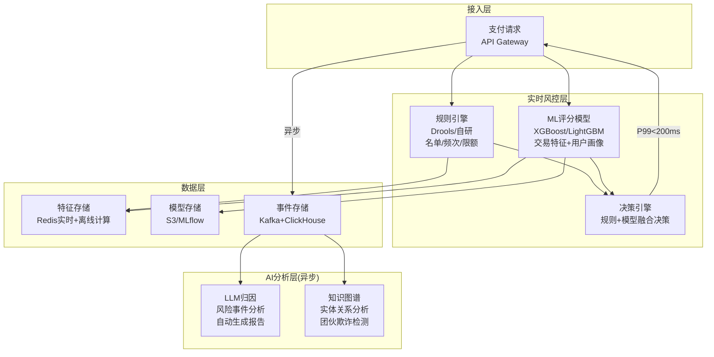

**核心设计要点**：

**① 实时风控（同步链路，P99 <200ms）**
- **规则引擎**：名单匹配（黑名单/灰名单）、频次控制（同商户/IP/卡号 1分钟内 ≤N次）、金额限额（单笔/累计/日累计），用 Drools 或自研 DSL 配置化。延迟 <10ms。
- **ML 评分**：提取实时特征（交易金额、时间间隔、设备指纹、历史交易频率等）→ XGBoost 模型评分（0-1风险分）→ 阈值判断（>0.8 拦截、0.5-0.8 人审、<0.5 放行）。延迟 <50ms。
- **特征计算**：实时特征从 Redis 读取（用户画像、近N分钟交易统计），离线特征预计算后导入。延迟 <20ms。
- **决策融合**：规则 + ML 评分 → 决策引擎做最终裁决。"规则一票否决"（命中黑名单直接拦截）+ "ML评分加权"。

**② AI 归因分析（异步链路，秒级/分钟级）**
- **LLM 归因**：对被拦截的高风险交易，用 LLM 分析"为什么被拦截"——综合规则命中情况、ML 特征贡献度、历史案例，生成人类可读的风险报告。
- **知识图谱**：构建"用户-设备-IP-银行卡-商户"关系图，检测团伙欺诈（多个账户共用同一设备/IP、短时间内大量小额测试）。

**【深度拓展】实时风控的延迟优化**
- **特征预计算**：用户画像、历史统计等"慢特征"离线计算好存 Redis，实时只算"增量特征"（如最近1分钟交易次数）。
- **模型在线推理优化**：XGBoost 的预测是树遍历，本身很快（<10ms），瓶颈通常在特征拉取 → 用 Redis Pipeline 批量获取特征，减少 RTT。
- **降级策略**：ML 模型超时 → 降级为纯规则判断（"保底放行 + 事后核查"或"保守拦截"），不能让风控阻塞支付主链路。

**【项目支撑】**
XTransfer 风控体系：实时规则引擎（名单/频次/限额）+ ML 评分模型（交易特征评分）+ 事后 T+1 对账兜底。风控评分是异步的（不阻塞主链路），异常交易进人工审核队列。RAG 归因是"可借鉴落地"方向——把历史风险案例 + 根因做成知识库供 LLM 分析归因。

### 5.2 全球化系统设计（多 Region + 数据合规）

> 面试题：「设计一个全球化支付系统，支持多国合规（GDPR/PCI-DSS）、多币种、多时区对账。」

**全球架构图**：

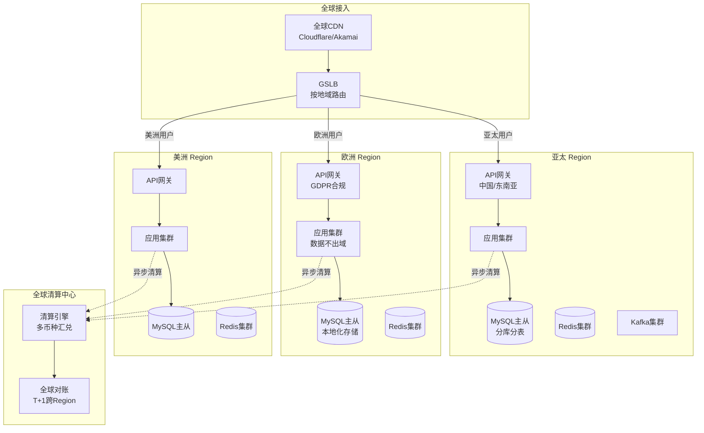

**数据合规设计**：

| 法规 | 要求 | 架构影响 |
|------|------|---------|
| **GDPR**（欧盟） | 用户数据不出欧洲、可删除权 | 欧洲 Region 独立部署，数据本地化存储 |
| **PCI-DSS** | 支付卡数据加密、隔离 | 敏感数据 Token化，不入业务库 |
| **中国数据安全法** | 重要数据不出境 | 中国 Region 独立，跨境走审批 |
| **PSD2**（欧洲支付） | 强客户认证(SCA) | 3D Secure 集成 |

**【深度拓展】GDPR 对架构的影响**
- **数据本地化**：欧盟用户数据必须存在欧洲 Region，不能跨域复制到其他 Region。所以架构上欧洲 Region 必须"自包含"（应用+DB+缓存全在本地）。
- **被遗忘权（Right to be Forgotten）**：用户要求删除时，所有关联数据（含备份数据库、日志、分析库）都要删除或脱敏。工程上需要"数据血缘追踪"——知道某个用户的数据在哪些系统里。
- **Token 化**：信用卡号/敏感信息不直接存业务库，用 Token（如 Stripe 的 `card_token`）替代，满足 PCI-DSS。

**【面试官追问】**
- "多 Region 数据怎么同步？" → 业务数据不跨 Region（数据本地化），只同步"全局配置"（汇率、规则）和"跨域清算数据"（异步）。
- "多时区对账怎么算 T+1？" → 以"清算中心"所在时区为准，各 Region 按清算中心的"T+1"时间点切数据。跨境天然跨时区，对账口径要统一。
- "汇率怎么实时？" → 接入汇率源（如 ECB/路透），缓存在 Redis，定期刷新。结算时用交易时刻的汇率（锁定汇率，不做实时汇兑）。

**【项目支撑】**
XTransfer 是跨境支付——天然多币种（USD/EUR/GBP/CNY 等）、多时区、跨多国合规。架构上中国/海外分离部署，数据不跨境；汇兑走"交易时刻锁定汇率 + 清算时按锁定价结算"；对账以清算中心时区的 T+1 为准。这正是"全球化系统设计"的真实落地。

---

## 总结：2026 系统设计面试的"三个阶段"

| 阶段 | 考察内容 | 答题关键 | 2026 新要求 |
|------|---------|---------|-----------|
| **第一阶段：基础知识** | 缓存策略、MQ 选型、分库分表 | 能画出架构图、说出适用边界 | 加上 GPU/模型管理的基础概念 |
| **第二阶段：深度思考** | 一致性权衡、容量规划、故障处理 | 能解释"为什么选 A 不选 B" | 能解释"Prompt Caching 为什么比 Redis Cache 更难" |
| **第三阶段：商业意识** | 成本核算、演进路线、组织落地 | 能把技术方案翻译成商业价值 | 能把"GPU 利用率 40%→80%"翻译成"月省 $15 万" |

> **终极建议**：2026 年系统设计面试的最大变化，不是多了几道 AI 题，而是**面试官期待你把基础设施思维（资源管理、容量核算、成本意识）嵌入到每一个回答中**——不管是 LLM 推理还是秒杀扣减。这种"基础设施意识"是 10 年+候选人最有区分度的标签。

---

*推荐阅读：《准备-大厂后端高频面试题汇总（2026）》、《准备-AI与LLM工程落地探索》、《准备-向量检索与RAG实践》、《准备-资深后端开放式场景设计题（10年+）》*

---

## 第六部分：【故障复盘】真实事故案例库

> 2026 的 AI 基础设施与全球化架构，故障模式比传统微服务更"硬核"——GPU 显存、向量召回、合规违规都是新坑。下面五个案例统一用「背景 → 触发原因 → 影响面 → 定位 → 止血 → 根因修复 → 长效预防」。

### 案例一：LLM 推理服务 GPU 显存 OOM（vLLM 集群）

- **背景**：vLLM 推理集群，A100×8，Continuous Batching + PagedAttention。
- **触发原因**：长上下文（32K）请求突增，KV Cache 分页占满显存；`max_num_seqs` 设得过高，并发请求把显存吃满后 OOM 杀进程。
- **影响面（量化）**：推理节点全挂 4 分钟；约 1.2 万次对话请求失败；GPU 利用率从 80% 跌到 0。
- **定位**：节点重启日志 + Prometheus 显存曲线发现 OOM 前 KV Cache 占用 99%；`max_num_seqs` 与上下文长度乘积超显存。
- **止血**：临时下调 `max_num_seqs`、对超长上下文请求排队/拒识；扩容 2 节点分流。
- **根因修复**：按上下文长度分级限流（短请求高并发、长请求低并发）；显存水位触发主动驱逐低优请求。
- **长效预防**：显存利用率 >85% 自动降并发；长上下文走独立低成本实例池。

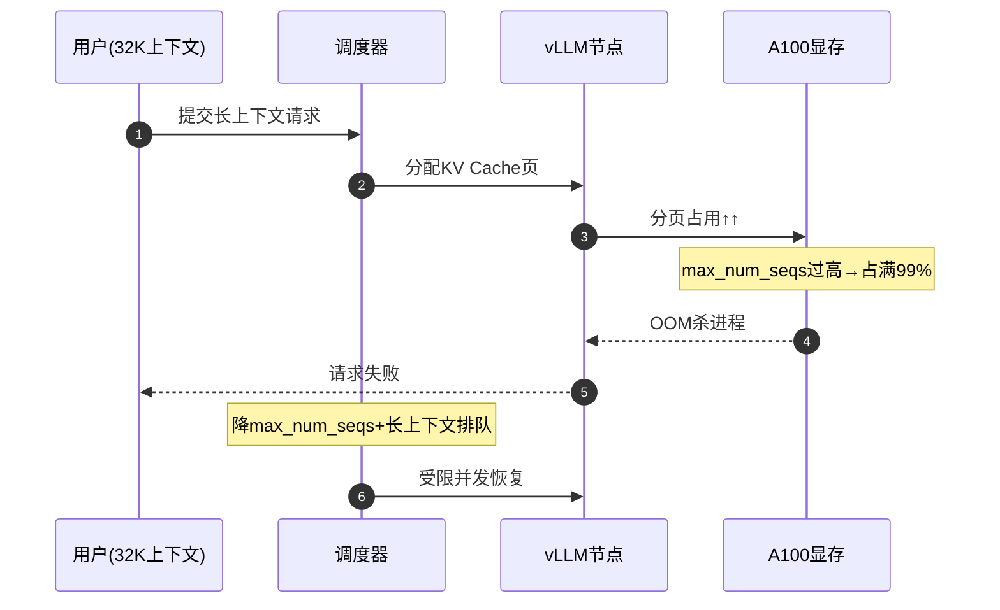

### 案例二：向量检索召回不准（RAG 知识库）

- **背景**：Milvus + HNSW，企业知识库 RAG。
- **触发原因**：`efSearch` 设得过低（追求延迟），召回 Top-K 精度不足；新文档写入后索引未及时合并，检索不到。
- **影响面（量化）**：RAG 回答准确率从 88% 跌到 61%；召回率@10 从 0.92 跌到 0.55；用户投诉"答非所问"。
- **定位**：离线评测集跑召回率曲线，发现 efSearch=16 时精度断崖；写入监控显示段未合并。
- **止血**：上调 efSearch 到 64；触发后台索引合并；热点查询加缓存。
- **根因修复**：efSearch 按业务档位配置（精度优先 vs 延迟优先）；写入后定时段合并 + 一致性读参数。
- **长效预防**：召回率@K 纳入线上监控；RAG 答案做幻觉检测（답변与检索片段一致性校验）。

### 案例三：RAG 幻觉（生成层）

- **背景**：企业制度问答 RAG，检索 + LLM 生成。
- **触发原因**：检索召回的片段与问题弱相关，但 LLM 仍"自信编造"了制度条款；无引用校验。
- **影响面（量化）**：约 7% 回答含事实性幻觉；2 起员工按错误制度操作。
- **定位**：抽样评测 + 人工标注发现无引用约束的生成。
- **止血**：强制生成带引用（citation），无来源的句子标记"待核实"；低置信度走人工审核。
- **根因修复**：生成层加"检索片段约束解码" + 引用一致性校验；答案可溯源到原文。
- **长效预防**：幻觉率指标纳入 SLA；高风险域（制度/合规）强制人审。

### 案例四：秒杀超卖（欧凡直播间）

- **背景**：Redis Lua 原子扣减 + MQ 异步落库 + DB 乐观锁兜底。
- **触发原因**：Redis 主从切换瞬间，库存 Key 在切换窗口被"读旧值"，Lua 扣减基于过期库存，多发了 30 件。
- **影响面（量化）**：100 件库存卖出 130 单；超卖 30 笔；客诉 + 补发成本。
- **定位**：Redis 切换日志时间点 vs 超卖订单时间对齐；DB 乐观锁没拦住（因为 Redis 侧已"成功"）。
- **止血**：DB 层加库存非负约束 + 真实库存回查，超卖订单转补偿（退款 + 致歉）。
- **根因修复**：Redis 切换期间降级到 DB 扣减（慢但一致）；库存 Key 加版本防旧值；DB 最终防线加"库存下限校验"。
- **长效预防**：库存双写校验（Redis + DB 实时对账）；切换窗口禁止扣减。

### 案例五：全球化数据合规违规（跨境支付）

- **背景**：欧洲用户数据存欧洲 Region，GDPR 合规。
- **触发原因**：全局配置中心误把欧洲用户画像同步到了亚太 Region 的分析库，触发数据出境。
- **影响面（量化）**：约 1.8 万欧洲用户数据违规出境；GDPR 审计风险；潜在罚款。
- **定位**：数据血缘追踪发现跨 Region 复制通道未做地域过滤。
- **止血**：立即切断复制通道，亚太侧违规数据脱敏 + 删除（被遗忘权）。
- **根因修复**：跨 Region 复制加地域标签过滤（合规字段禁止出境）；数据血缘强校验。
- **长效预防**：合规扫描常态化；出境数据走审批 + 自动阻断。

---

## 第七部分：【横向对比】技术选型决策

### 7.1 推理引擎对比

| 维度 | vLLM | Triton | TensorRT-LLM |
|------|------|--------|-------------|
| 定位 | 开源 LLM 推理 | 通用推理服务器 | NVIDIA 极致性能 |
| 显存管理 | PagedAttention | 依赖后端 | 极致优化 |
| 易用性 | 高 | 中 | 低 |
| 多模型 | 强 | 最强 | 需编译 |

**trade-off**：通用 LLM 推理首选 vLLM（易用 + 高吞吐）；多框架混合（TensorRT/PyTorch/ONNX）用 Triton；极致延迟用 TensorRT-LLM（但编译成本高）。XTransfer 类场景选 vLLM 平衡运维与性能。

### 7.2 向量数据库对比

| 维度 | Milvus | Qdrant | Pinecone |
|------|--------|--------|----------|
| 规模 | 十亿级 | 中规模 | SaaS 托管 |
| 混合检索 | 强 | 原生支持 | 有限 |
| 运维 | 需自建集群 | 轻量 | 零运维 |
| 成本 | 中 | 低 | 高（按量） |

**trade-off**：10 亿级 + 混合检索选 Milvus；中规模多租户选 Qdrant；不想运维选 Pinecone（但锁厂商 + 成本高）。原则：能复用现有 ES 就别新增组件。

### 7.3 单体 LLM vs Agent 对比

| 维度 | 单体 LLM | Multi-Agent |
|------|---------|------------|
| 可控性 | 高（确定性链路） | 低（LLM 动态决策） |
| 复杂度 | 低 | 高（状态/沙箱/超时） |
| 适用 | 单轮/固定流程 | 多步推理/工具调用 |

**trade-off**：能单体 LLM + 固定 Pipeline 解决就别上 Agent（调试地狱）；只有"路径动态、需工具调用"才上 Agent，且必须加沙箱 + 超时 + 检查点。

### 7.4 全球化部署方案对比

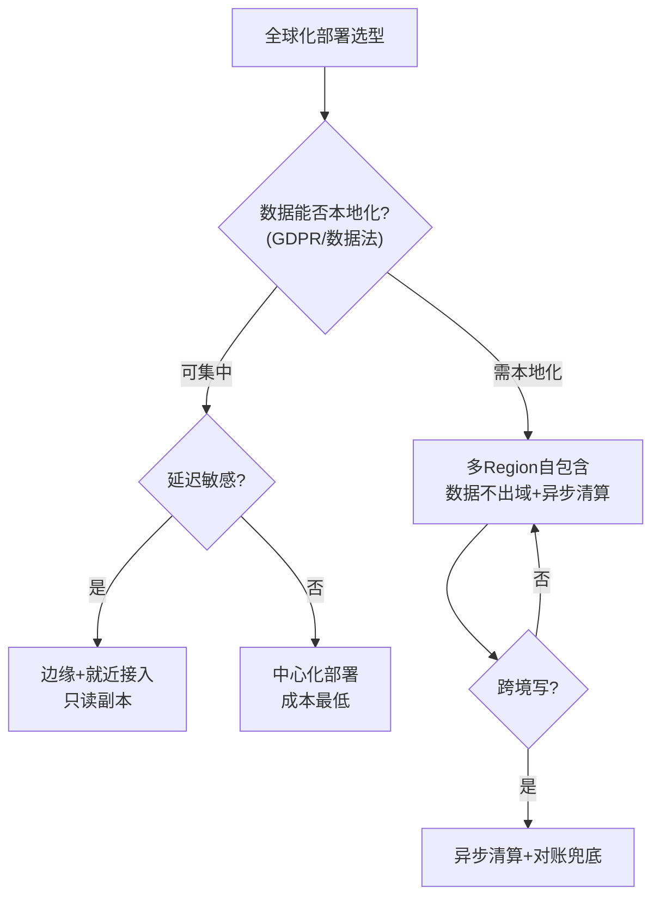

**trade-off**：全球化不是"全球一份数据"。合规强制本地化时，每个 Region 必须自包含，跨域只走异步清算 + T+1 对账——牺牲实时一致换合规与可用性。

---

## 第八部分：【量化指标】SLA 设计与成本收益

### 8.1 Token 吞吐与显存占用

| 指标 | 公式 / 经验值 | 目标 |
|------|--------------|------|
| 显存占用 | 参数 + KV Cache + 激活 | A100 80G：70B FP16 ≈ 140G 需 TP 切多卡 |
| Token 吞吐 | 并发 × 每请求 tokens / 生成时长 | 单 A100 ≈ 2000-3000 tokens/s（batch 后） |
| 成本 | $/1M tokens（GPU 时租 ÷ 产出 token） | 量化 + 批处理降 50-70% 显存 |

**容量评估示例**：100 万 DAU × 日均 5 次 × 2000 out tokens = 1e10 tokens/天。单 A100 日产出 ≈ 2.6e8 tokens → 需 ≈ 40 张 A100 日产出；峰值 ×3 → 约 120 张。月成本 ≈ 120 × $8 × 24 × 30 ≈ $69 万，量化后约减半。

### 8.2 P99 延迟预算（端到端）

| 环节 | P99 预算 |
|------|---------|
| 网关路由 + 认证 | 20ms |
| 调度 + 排队 | 50ms（闲）/ 秒级（峰） |
| 首 Token（TTFT） | <800ms（Prefix Caching 优化后） |
| 每 Token 间隔（TPOT） | <50ms |
| 总（短回答） | <2s |

### 8.3 向量检索召回率@K

| 指标 | 定义 | 目标 |
|------|------|------|
| Recall@10 | 前 10 命中相关比例 | ≥0.90 |
| efSearch | HNSW 探索宽度 | 精度优先 64 / 延迟优先 16 |
| P99 检索延迟 | 单次向量查 | <100ms |

**成本收益**：RAG 知识库上线后，人工客服工时 -35%；但 Embedding 100 亿向量一次性成本约 $XX 万，需量化压缩（PQ）降本。

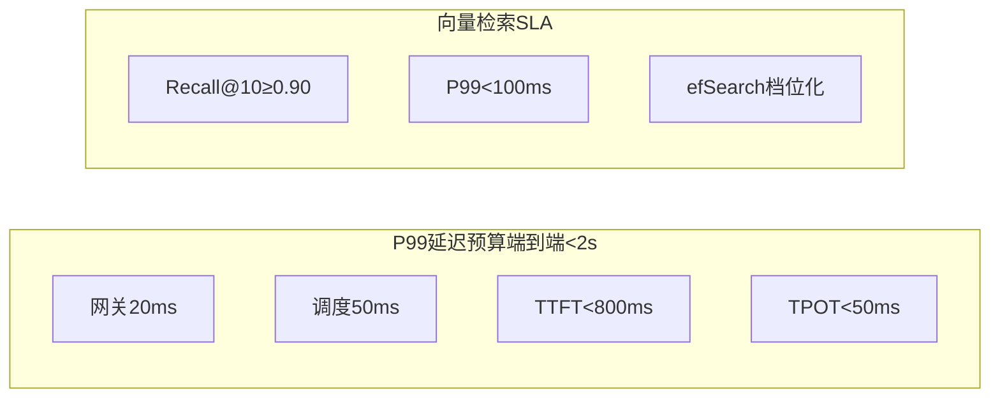

---

## 第九部分：【答题框架】面试表达模板

### 9.1 分层回答套路（定调 → 原理 → 落地 → 边界权衡）

1. **定调（15s）**："2026 系统设计考的是基础设施思维——GPU/显存/模型调度的资源抽象，以及全球化合规意识。"
2. **原理（60s）**：推理（PagedAttention + Continuous Batching）、检索（HNSW + 混合检索）、全球化（单元化 + 合规本地化）。
3. **落地（90s）**：以 RAG Pipeline / 秒杀漏斗 / 全球化架构任一为例讲全链路。
4. **边界权衡（30s）**："精度 vs 延迟（efSearch）、成本 vs 性能（量化）、合规 vs 实时（异步清算）。"

### 9.2 STAR 叙事（针对"RAG 怎么设计"）

- **S**：企业制度问答，需准确可溯源。
- **T**：召回率@10 ≥0.9、P99 检索 <100ms、答案可引用溯源。
- **A**：Milvus 分片 + IVF+PQ + 混合检索（向量+BM25/RRF）+ 生成层强制 citation + 幻觉检测。
- **R**：召回率 0.92、幻觉率 <3%、答案全溯源。

### 9.3 白板表达结构（先画什么图）

```
第一步：画 RAG Pipeline（30s）
  文档→分块→Embedding→向量库→检索→重排→LLM生成→引用

第二步：画秒杀漏斗（30s）
  CDN→网关限流→Redis Lua扣减→MQ→DB乐观锁→对账

第三步：画全球化架构（30s）
  GSLB→多Region自包含→异步清算→T+1对账→合规本地化

第四步：点 trade-off（20s）
  精度/延迟/成本/合规 四组权衡
```


### 9.4 逃生话术

- **没真做过 LLM 推理部署**："我们内部用 vLLM 跑过 RAG 检索层，本质是低延迟向量服务 + 调度；GPU 显存/PagedAttention 的原理我清楚，但生产级千卡调度用的是 KServe/Ray Serve，这块我理解为…"
- **被问 efSearch 设多少**："没有固定值，看准确率-延迟曲线。精度优先 64、延迟优先 16；生产用基准测试让业务方选点，别拍脑袋。"
- **被问全球化合规**："核心是数据本地化——欧洲用户数据不出欧洲 Region，跨域只走异步清算 + T+1 对账，靠合规字段过滤防出境。这是 GDPR 对架构的硬约束。"
- **万能收口**："这块我们受 XX 约束没全量落地，但最优解是 YY，代价 ZZ；业务再涨 10 倍我会优先推这个。"

<!-- EXPANDED -->
