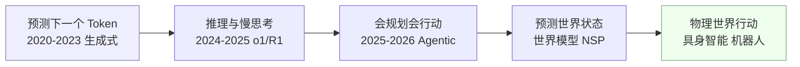
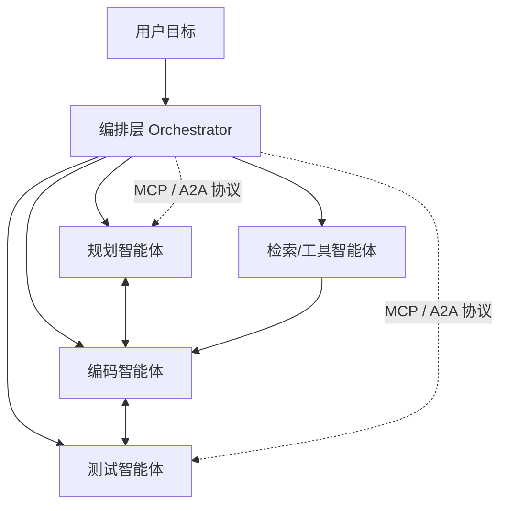
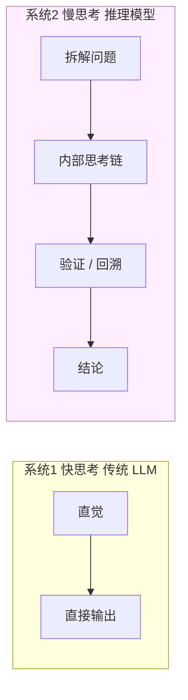
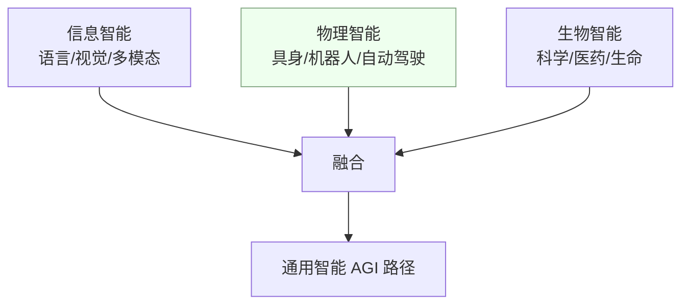
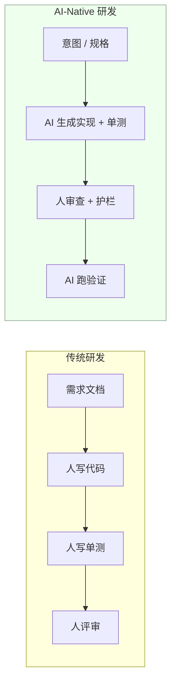
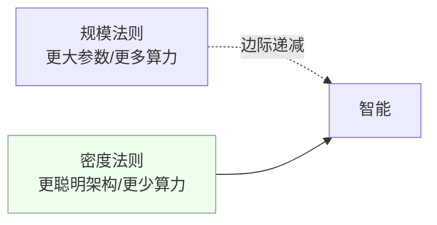
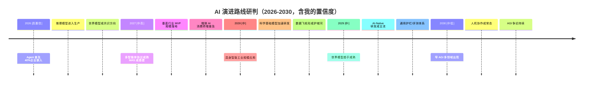
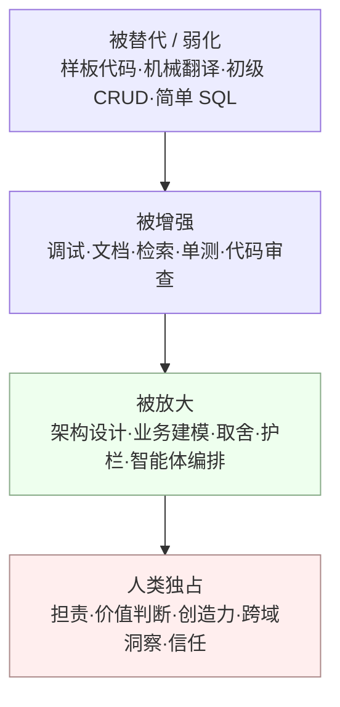

> 本文是 [AI 认知与未来](/post/准备-AI认知与未来（是什么·能做什么·问题·未来工作与生活）) 的**姊妹篇**。
> 那篇回答「AI 是什么、能做什么、有什么问题、未来工作生活什么样」；本篇只回答一个问题：**AI 未来往哪走、走到哪、我作为架构师怎么看、又该怎么办**。
> 立场延续：增强而非替代、工具而非拐障、建议而非决策；能力越强，越要设护栏。

## 0. 先说结论（怕你没耐心读完）

如果只让我用三句话概括未来 3-5 年 AI 的走向，会是：

1. **主线不是「更大的语言模型」，而是「会规划、会行动、会推理、能理解物理世界」的系统**。从「预测下一个词」到「预测世界下一个状态（NSP）」，是这一轮范式转移的内核。
2. **Agentic（智能体）会成为软件的新常态**，但瓶颈不在「能不能动」，而在「动得可不可靠、能不能被信任、出错了怎么补偿」——这恰恰是架构师的老本行。
3. **AI 不会突然变成 AGI 把人取代，而是以「窄能力」逐步渗透每个岗位**。真正被重构的是「人怎么与 AI 组队」，而不是「人会不会失业」。

下面把九大方向逐一展开，每个方向都给**我的判断**和**支付实战反思**。

---

## 1. 总览：我们正在经历的范式转移

过去三年，AI 的主叙事是「生成」——生成文字、代码、图片、视频。下一个阶段的主叙事是「**行动与认知**」：让 AI 从「会说话」变成「会干活、会想事、会理解真实世界」。

**我的判断**：这一转移不是线性的「模型越训越大」，而是「能力维度在升维」。语言是数字世界的投影，物理世界才是真实经济的载体。谁能把 AI 从数字空间推进到物理空间、从感知推进到认知与规划，谁就拿到下一阶段的船票。智源研究院把 2026 年定义为「从数字世界迈入物理世界、从技术演示走向规模价值的关键分水岭」，我认同这个判断。

**支付实战反思**：我们做跨境支付，本质是「数字世界里的状态机 + 资金流」。但资金流背后是真实的贸易、物流、供应链——这些「物理 world 的状态」恰恰是未来世界模型能帮上忙的地方（比如预测某条供应链的回款风险）。AI 的边界正在从「屏幕内」扩张到「屏幕外」，这对金融系统是利好也是新风险。

---

## 2. 方向一：从「会生成」到「会规划会行动」——Agentic AI 成为主线

行业共识已经很清晰：以对话为核心的「Chat」范式终结，AI 竞争转向「能办事」的智能体时代。Gartner 预测 **2026 年 40% 的企业应用将嵌入任务型 AI 智能体**（2025 年还不足 5%）；高德纳、智源、腾讯等多方口径一致。

智能体的演进分两段：
- **反应式智能体**（今天大多数）：你问我答、你指令我执行。
- **主动式智能体**（趋势）：始终在线、在后台自主完成目标，主动为人工作（如根据订单变化实时优化生产排程）。

更复杂的任务依赖**多智能体系统（MAS）**：规划、编码、测试、检索等不同专长的智能体像团队一样协作。MCP、A2A 等通信协议正在标准化——有人把它叫「Agent 时代的 TCP/IP」。

**我的判断**：
- 单智能体很快会成为「标配组件」，真正拉开差距的是**多智能体的编排与可靠性**。这跟微服务时代从「写单个服务」到「治理一堆服务」的演进一模一样。
- Agent 当前的硬伤是**长程任务、上下文记忆、可靠性**——魏凯（中国信通院）也明确说「距离大规模应用仍有距离」。这些问题靠「堆模型」解决不了，要靠工程（重试、补偿、幂等、可观测）解决。

**支付实战反思**：我在 XTransfer 做的「任务编排 + 补偿 + 幂等 + 对账」，本质上就是 Agent 系统需要的那套东西。一个自主编码智能体如果改坏了账务逻辑，它得知道怎么回滚、怎么对账、怎么告警——**Agent 的「事务性」和「可观测性」会是下一个架构热点**。谁先把分布式系统的那套工程纪律搬进 Agent 框架，谁就赢。

---

## 3. 方向二：推理与「慢思考」——Test-time Compute 成为新 Scaling Law

o1、R1 一类推理模型的出现，把 AI 从「快直觉」推向「慢思考」：在回答前先做内部思考链、自我验证、必要时回溯。对应的新范式是 **test-time compute**——不仅训练时算力重要，推理时「多想一会儿」也能换来更强的智能。

**我的判断**：
- 推理能力对**工程、数学、规划、多步决策**是质变，不是量变。它对「有明确对错、可验证」的任务收益最大——而这正是程序员/架构师的主场。
- 但**成本和时延是现实约束**。慢思考意味着更多 token、更高费用、更慢响应。所以未来不是「所有请求都走推理」，而是像缓存分层一样：**简单请求走快模型，复杂决策走慢模型**。这又是一个架构师的经典取舍。

**支付实战反思**：我们的渠道路由、风控决策本来就是「多步推理 + 规则引擎 + 人工终审」。AI 推理模型可以承担其中「可验证的复杂推理」部分，但**最终拍板与担责的必须人**（资金、安全、生命三件事 AI 只给建议分）。护栏理念不变：能力上移，责任不下放。

---

## 4. 方向三：世界模型与物理智能——从数字世界迈向物理世界

智源研究院提出的 **Next-State Prediction（NSP）** 范式很关键：从「预测下一个词」跨越到「预测世界的下一个状态」。这意味着 AI 开始学习物理规律（时空连续性、因果关系），为自动驾驶仿真、机器人训练提供「认知」基础。

行业正在从「信息智能」走向「信息 + 物理 + 生物」三智能融合：

**我的判断**：
- 「世界模型成为 AGI 共识方向」不是口号，而是因为**纯语言模型触到了天花板**——语言是世界的压缩描述，理解世界本身需要几何、物理、因果。谁能建好世界模型，谁就掌握自动驾驶、机器人、工业仿真的话语权。
- 具身智能正脱离实验室：人形机器人进入真实工业/服务场景（中国一款具身智能模型已在全球统一标准下拿第一）。2026 被视为具身智能「出清」、迈向规模应用之年。

**支付实战反思**：支付是纯数字世界，但「物理 world 的状态」无处不在——一笔跨境收款背后是真实货物的流转、物流状态、海关清关。未来世界模型若能预测「这条供应链下周的回款违约概率」，就是风控的核武器。**数字金融的下一站，是把物理世界的状态接进来**。

---

## 5. 方向四：多模态统一与「超级入口」

文本、图像、音视频、3D 正在走向统一表征；C 端则在争夺「All in One」的超级应用入口（ChatGPT/Gemini 一体式助手，国内字节、阿里、蚂蚁等依托生态布局）。

**我的判断**：
- **入口之争是巨头的，垂直场景的深度智能体是工程师的**。李彦宏的判断我认同：「未来只会剩下少数几个基础模型，但应用层会出现许多成功参与者，那里才是机会最多的地方。」
- 对普通开发者而言，与其幻想做一个「超级入口」，不如在**一个真实、高频、有数据闭环的垂直场景**里做深做透。

**支付实战反思**：支付场景天然垂直、高频、强数据。把「收款/对账/风控」做成深度智能体，比做一个通用聊天机器人价值大得多。场景深度 > 模型广度。

---

## 6. 方向五：AI-Native 软件工程——开发方式的范式重构

「氛围编程（Vibe Coding）」入选《柯林斯词典》2025 年度词汇；腾讯披露超 90% 工程师在用 AI 编码。Cursor、Codex、Devin 一类工具正在把研发从「写实现」推向「写意图 + 审查」。

**我的判断**：
- 编码会从「手写每一行」转向「描述意图、审查结果、设护栏」。**人的重心上移**：系统设计、模块边界、一致性、安全、取舍，这些反而更重要。
- 「AI 生成 + 人审查」会成为主流节奏，但**可测试性、可观测性、契约边界**会比以前更关键——因为 AI 生成的代码你更要能验证它没写错。

**支付实战反思**：XTransfer 收款领域 2.0 重构里，AI 完全可以承担样板代码、DTO 转换、单测骨架；但**领域建模、聚合边界、事务一致性、资金安全**必须由人来定。AI 是「高级初级工程师」，不是「架构师替代者」。

---

## 7. 方向六：算力、能源与「密度法则」

两个相反的力在拉扯：
- 一边是需求爆炸：IEA 预测 2030 年全球数据中心用电翻倍到约 945 TWh，AI 是主因；苏姿丰说要把全球算力提升 100 倍才能支撑「AI 无处不在」。
- 一边是「**密度法则**」崛起：从「拼参数规模」转向「拼智能密度」——用更少算力、更聪明架构得到更多智能（DeepSeek 的 NSA 稀疏注意力、MoBA 等是代表）。

**我的判断**：
- AI 的瓶颈越来越是**能源与系统协同**，不是单一模型。绿色数据中心、算电协同、液冷、异构计算会成为基建竞争点。
- **端侧/边缘 AI 会崛起**：消费电子的「端侧 AI 时代」已来临，很多推理会下沉到手机、车、设备本地——这既能省算力又能保隐私。

**支付实战反思**：金融系统对时延和合规极敏感。未来「实时风控推理」很可能一部分下沉到边缘（如就近机房），敏感数据不出域——这正是「算力靠近业务、数据留在本地」的工程取向。

---

## 8. 方向七：高质量数据、合成数据与数据飞轮

当算法因规模扩张而边际递减、算力因开源而普及时，**竞争焦点回到最难复制的要素——高质量数据**。行业从「堆量」转向「质量 + 专业化」：医疗、工业、教育等垂直高质量数据集成为金矿；当现实数据不足或涉隐私时，**合成数据**被用来突破瓶颈。

**我的判断**：
- **数据飞轮（业务→数据→AI→业务）是中国工业场景的护城河**。全门类工业体系 + 海量应用 = 别人抄不走的「数据金矿」。
- 合成数据会普及，但它必须「符合物理规律和业务逻辑」，否则就是 garbage in garbage out。

**支付实战反思**：支付场景完美契合数据飞轮——**业务产生数据、数据训练 AI、AI 反哺业务**（如用历史交易训练风控模型，模型又提升拦截率产生更干净的数据）。我们在 XTransfer 的风控/反欺诈就是这样转起来的。未来谁的数据飞轮转得快，谁的 AI 就强。

---

## 9. 方向八：AI4S 与科学基础模型（简）

AI 在科研中的角色从「辅助工具」升级为「自主研究的 AI Scientist」。科学基础模型 + 自动化实验室，正在加速新材料、新药研发。智源将其列为「AI4S 北极星」。

**我的判断**：这是离「通用智能」最近的一条路之一——因为科学有最严格的「可验证性」，正好契合推理模型的长处。对架构师而言，值得关注的是「AI + 自动化实验闭环」会催生一类新的数据密集型系统。

---

## 10. 方向九：治理、安全与对齐——「方向盘和刹车片」

能力越强，越要护栏。2026 被视为全球 AI 治理加速落地之年：欧盟《人工智能法案》大部分规则 2026 年 8 月生效；中国「人工智能+」行动、新修改的网络安全法同步强调伦理与安全。年度词「slop（AI 泔水）」警示内容公害。

**我的判断**：
- **AI 安全会从「道德话题」变成「工程刚需」**：红队测试、自动评测、输出护栏、责任界定，会像「鉴权、限流、审计」一样成为系统的标准件。
- 我在支付系统落地的「建议而非决策、AI 给分人终审」护栏理念，对通用 AI 同样适用——**不要因为模型很强就去掉护栏，就像不会因为数据库很快就去掉事务**。

**支付实战反思**：支付系统的「零资损」目标，本质就是一套极致的 AI 安全工程。未来任何严肃的 AI 系统，都得有等效的「资损防控」思维。

---

## 11. 我的综合研判：2026-2030 演进路线

把上面九条收拢成一张路线图，附我的**置信度**：

**我的核心判断（值得划线）**：
- **AGI 不会在某天「砰」地到来**，而是能力以「窄 AGI」形式逐步渗透每个领域。2030 年前不会出现通用 AGI，但会在医疗、代码、设计、风控等单点出现「比绝大多数人强」的 AI。
- **真正的分水岭不是「模型多强」，而是「系统多可信」**。未来赢家是能把安全、合规、能耗、产业落地整合成一个系统的人/公司/国家（新华社的结语，我深以为然）。

---

## 12. 对程序员 / 架构师的影响与应对（落到职业）

把能力分成四类，看清什么被替代、什么被增强、什么被放大：

**我的判断**：
- **会被替代的是「可被验证、低判断」的体力活**（样板代码、CRUD 骨架），这部分占比不小但不致命。
- **会被放大的是「高判断、高责任」的能力**——系统设计、业务建模、在约束下做取舍、设护栏、编排人机协作。这些恰恰是 10 年架构师的积淀，AI 反过来让我们的杠杆更大。
- **担责与价值判断永远是人独占**。AI 可以给方案，但「这个方案上线后资损谁担」只能人答。

**架构师的新护城河**：
1. 把模糊需求翻译成清晰系统与边界（建模能力）。
2. 在性能/成本/安全/可维护性之间做有依据的取舍。
3. 给 AI 系统设护栏（可观测、可回滚、可审计、可补偿）。
4. 设计「人 + 多智能体」的协作编排。
5. 在垂直场景里转数据飞轮。

---

## 13. 给 10 年架构师的五条未来行动清单

1. **把 AI 当「数字员工」纳入团队**：从今天起，让 AI 承担单测、文档、检索、样板代码，你腾出手做建模与取舍。先在小任务上建立信任。
2. **补「AI 工程化」短板**：RAG、Agent 框架、MCP、评测、护栏——这些是架构师的新工具箱，不是算法同学的专利。可参考 [AI / LLM 工程落地探索](/post/准备-AI与LLM工程落地探索)、[向量检索与 RAG 实践](/post/准备-向量检索与RAG实践)。
3. **练「提问与审查」胜过「手写实现」**：未来核心竞争力是「把意图说清 + 把结果审对」。Vibe Coding 不是躺平，是更高密度的审查。
4. **在垂直场景转数据飞轮**：别追通用大模型，在你最懂的领域（如支付/风控），用业务数据训出别人抄不走的深度智能体。
5. **永远保留「方向盘和刹车片」**：任何 AI 介入资金、安全、生命的系统，必须建议而非决策、可回滚、可审计。这是工程常识，也是职业底线。

---

## 14. 相关阅读（本博客 AI 体系）

- [AI 认知与未来（是什么·能做什么·有什么问题·未来工作与生活）](/post/准备-AI认知与未来（是什么·能做什么·问题·未来工作与生活）) — 姊妹篇：认知地基
- [AI / LLM 工程落地探索](/post/准备-AI与LLM工程落地探索) — 工程化工具箱
- [向量检索与 RAG 实践](/post/准备-向量检索与RAG实践) — 检索增强落地
- [2026 系统设计面试演进（AI 基础设施 + 全球化高并发）](/post/准备-2026系统设计面试演进（AI基础设施+全球化高并发）) — AI 对系统设计的反向塑造

> 本文所有趋势判断综合自新华社/智源研究院/中国信通院/高德纳等 2026 年公开前瞻，结合作者 10 年支付与分布式系统实战。观点为作者独立研判，欢迎在面试与工作中反驳、验证、迭代。
