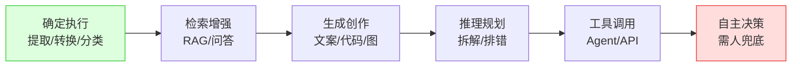
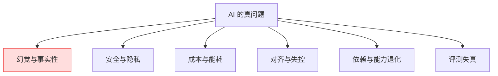
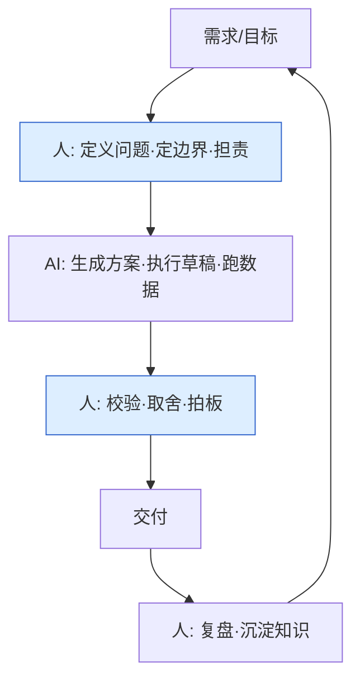

> 这是一篇「认知文」，不是工程文。它回答五个问题：**AI 是什么、能做什么、有什么问题、未来能怎么帮我们、未来工作生活是什么样**。
> 工程细节（LLM 原理、RAG、MCP、Agent、推理优化）请移步 [AI / LLM 工程落地探索](/post/准备-AI与LLM工程落地探索)、[向量检索与 RAG 实践](/post/准备-向量检索与RAG实践)、[2026 系统设计面试演进（AI 基础设施）](/post/准备-2026系统设计面试演进（AI基础设施+全球化高并发）)。本文只谈「想清楚」。

## 0. 先说立场（10 年架构师视角）

我做了 10 年+ 后端，经历过 XTransfer 0 资损的支付系统、哈啰/欧凡/携程的规模化系统。**我对 AI 的态度是「增强而非替代、工具而非拐杖、建议而非决策」**——这不是保守，是工程常识：

- 凡是涉及**资金、安全、生命**的结论，AI 只能给"建议分"，最终拍板与担责的必须人。我在支付风控里就是这么落地的（AI 给评分建议，规则引擎+人工终审）。
- 凡是**可验证、可回滚、低成本试错**的事，AI 应该尽可能多地接管，把人释放到判断与创造上。
- **能力越强，越要设护栏**。这和分布式系统一个道理：你不会因为"数据库很快"就去掉事务和幂等，AI 也是。

下面所有判断都落在这三条上。

---

## 1. AI 是什么：别被"智能"两个字带偏

### 1.1 一句话本质

**今天的 AI（特指大模型 LLM）本质是一个「超大规模的概率预测器」：给定一段上下文，预测「下一个 token」最该是什么。** 它不"理解"世界，它是对人类已有语料的统计压缩与重组。

> 一个很妙的比方（出自学者 Andrej Karpathy）：**LLM 是一个"模糊的、有损的、可通过自然语言查询的数据库"**——你用提示词当 SQL，它从压缩过的全体人类知识里"近似检索"出答案。

### 1.2 它"像懂"但不"真懂"

- 它能写出正确的 Java 代码，是因为训练语料里有无数优质代码；它能在面试里对答如流，是因为面试题和题解早就海量存在。
- 它**没有内部世界模型、没有持续记忆、没有目标**——你关掉对话，它的"思考"归零。它不在"想"，它在"接龙"。
- 这带来一个关键推论：**AI 的回答质量，强依赖你给的上下文和约束**。会问、会给边界，比"模型够不够大"更影响结果。这正是工程师的核心价值从"写"转向"定义与校验"的原因。

### 1.3 和上一轮 AI 浪潮的区别

| 维度 | 传统 AI（规则/ML 模型） | 大模型 LLM |
| --- | --- | --- |
| 输入 | 结构化特征 | 自然语言/多模态 |
| 能力 | 单任务（分类/回归） | 多任务通才 |
| 门槛 | 需标注+训练 | 会说话就能用 |
| 可解释 | 较易（特征权重） | 难（黑盒） |
| 泛化 | 弱（换场景要重训） | 强（上下文即适配） |

> 这一波真正的颠覆不是"更准"，而是**「自然语言成为编程接口」**——任何人都能用话指挥软件。这是生产力接口的代际变化，类比从命令行到 GUI。

### 1.4 三个常被误解的点

1. **"AI 会自己思考"** —— 不会，它每次都从零预测，没有心智。
2. **"模型越大越对"** —— 规模提升的是「覆盖」不是「正确」，幻觉不会随规模消失。
3. **"它知道自己在说什么"** —— 不知道，它是流畅地"编"出最可能的下一句，包括错的。

---

## 2. AI 能做什么：一张能力光谱

我把 AI 的能力按「确定性 → 创造性」排成一条光谱，越往左越可验证、越适合直接落地，越往右越依赖人把关。

### 2.1 已经在生产环境稳稳能干的（左三段）

- **确定执行**：信息抽取（发票/合同/日志结构化）、格式转换、翻译、分类打标。这类输出可校验、错了易发现，适合全自动。
- **检索增强（RAG）**：把"企业私有知识"喂给模型，让它基于事实回答。**我在 XTransfer 把"对账差异归因"做成 RAG**——模型从差异日志+案例库里找相似根因，给运维"建议原因"，准确率比纯规则高，且可审计（每个结论标了来源 chunk）。
- **生成创作**：写文档初稿、生成代码、SQL、测试用例、图表。注意是"初稿"——**人审是关键一环**。

### 2.2 能显著提效、但要人把关的（中段）

- **推理规划**：拆解需求、定位 bug 方向、设计备选方案。模型能给你"思路清单"，但方案对错、取舍仍需工程师判断。
- **工具调用（Agent）**：模型决定调哪个 API（查订单、发消息），按结果继续。本质是"带手的大脑"。风险在于**它真去执行了**——所以必须限权、限预算、可回滚。

### 2.3 现在别轻易托付的（右端）

- **自主决策**：比如"自动批准一笔跨境付款"。**资金这类不可逆、高后果的动作，必须人终审**。我的底线是：AI 只建议，不决策（详见 [AI 工程落地探索 §6.1](/post/准备-AI与LLM工程落地探索)）。

### 2.4 一张"能不能直接用"的判断表

| 任务 | 可否全自动 | 前提 |
| --- | --- | --- |
| 文本翻译/摘要 | ✅ | 领域术语词典兜底 |
| 代码补全 | ✅ | 有单测+评审 |
| 日志归因建议 | ✅(建议) | 标注来源、可复核 |
| 风控评分 | ⚠️(建议) | 只给分，人/规则终审 |
| 资金支付决策 | ❌ | 必须人拍板 |
| 医疗诊断 | ❌ | 辅助，医生负责 |

---

## 3. AI 有什么问题：六大类真问题

这是我认为最该写清楚的一节。**AI 的问题不是"还不够强"，而是"强但不可控、不可信、不可持续"**。

### 3.1 问题全景

### 3.2 逐类讲

**① 幻觉（Hallucination）—— 最致命的日常问题**
模型会自信地编造看起来合理但错误的内容（错的 API 名、不存在的文献、算错的账）。在**严肃场景**（支付、医疗、法律）这就是事故。我的工程做法：
- 关键结论**必须可溯源**（RAG 标 chunk 编号、代码必须编译跑通）；
- 用"自洽/交叉验证"降低单点幻觉；
- 永远**不让模型在无人复核下做不可逆动作**。

**② 安全与隐私**
- 提示注入（Prompt Injection）：用户数据里藏一句"忽略上面指令"，模型可能被劫持。我在 [工程落地探索 §5.4](/post/准备-AI与LLM工程落地探索) 强调"系统指令与用户数据必须在网关层隔离"。
- 数据泄露：把客户数据喂进公共大模型 = 合规事故。金融场景**一律私有化/隔离部署**。

**③ 成本与能耗**
- 大模型推理很贵（GPU 小时计费）、很耗能。不是所有任务都值得上大模型——**能用小模型/规则解决的，别调 LLM**。这跟架构"能缓存就别查库"是同一思维。

**④ 对齐与失控（长远风险）**
- 模型目标若和人的真实意图错位，越强越危险（"把钉子钉好"的机器人可能把人钉住）。当前靠 RLHF/DPO 对齐，但**对齐是开放难题**。我的态度：能力开放速度 ≤ 护栏成熟度。

**⑤ 依赖与能力退化**
- 团队一旦"AI 写、人不读"，会出现**集体能力空心化**：没人能 review、没人懂原理，出事没人救。这和"所有系统都上云但没人懂运维"一样危险。**人必须保留"不依赖 AI 也能做对"的底线能力**。

**⑥ 评测失真**
- "刷榜高分"不等于"线上好用"。很多基准被污染、被过拟合。**评测要贴近真实分布、要含对抗样本、要可复现**——我做 RAG 就坚持"用真实差异日志做回归集"，而不是拿公开 QA 集自嗨。

---

## 4. 未来 AI 能怎么帮我们：我的判断

> 核心判断：**AI 最大的价值不是"替人干活"，而是"把人的认知带宽释放到更难的事上"**。下面按场景说。

### 4.1 个人与研发提效（已发生）

- **编程**：从"写每一行"到"描述意图、审 AI 的产出"。10 年后初级 CRUD 会大量由 AI 生成，**工程师时间转向架构、边界、可靠性**。
- **学习**：AI 当"私人导师"，用你能懂的方式讲难点、出针对性练习。比搜博客高效一个数量级。
- **信息处理**：长文摘要、多文档对比、会议纪要——把"读"的时间压缩到"确认"的时间。

### 4.2 决策辅助（正在发生，需护栏）

- **商业/运维决策**：AI 汇总指标、给出"可能原因清单 + 建议动作"，人拍板。XTransfer 的智能路由、AI 预警都在这条线上（见 [XTransfer 复盘 §10.4-10.5](/post/准备-XTransfer跨境支付收款平台深度复盘)）。
- **医疗/科研**：辅助读片、文献综述、假设生成——**加速发现，不替代专家**。

### 4.3 组织与协作（将发生）

- **知识不再随人走**：把专家经验沉淀成企业知识库+Agent，**新人问 Agent 就能拿到老手的判断路径**，降低"关键人离职"风险。
- **流程自愈**：监控→AI 定位→建议预案→人确认执行，故障恢复从"分钟级人工"到"秒级半自动"。

### 4.4 一个架构师的提醒

> AI 帮我们的前提是**我们先把系统/流程"结构化"好**。垃圾知识喂进去，出来的是更流利的垃圾。AI 放大你的能力，也放大你的混乱。所以"整理知识、定义边界、建可验证闭环"这些"苦活"，反而比以前更重要。

---

## 5. 未来工作与生活是什么样：我的想象

> 这是"想象"但不是科幻，是基于当前趋势的外推。**关键变量不是技术，而是"人如何重新定位自己"。**

### 5.1 工作形态：从"岗位"到"任务 + 人机组队"

- **"写代码"不再是核心竞争力**，["定义对的问题 + 验证结果 + 为后果负责"](/post/准备-架构师高频面试题深度解析（10年+思维版）)才是。
- 新岗位会出现：**AI 训练师/对齐工程师/评测工程师/人机协作设计师/AI 合规官**。
- 旧岗位不会"消失"，但**工作内容重写**：会计从记账变"审 AI 的账+管规则"；程序员从写变"审+设计+兜底"。

### 5.2 人的能力重构：四种"机器难替"的能力

1. **提问与定义**：把模糊目标拆成可验证的子问题（Prompt 工程本质是"需求工程"）。
2. **判断与取舍**：在不确定中拍板、为后果负责（AI 不给免责牌）。
3. **审美与品味**：什么是"好"的设计、好的体验——主观且高价值。
4. **跨域整合**：把支付、风控、组织、人性连起来看（架构师的核心）。

> 这四类恰恰是我这 10 年反复打磨的。所以我的结论很乐观：**AI 不会让"会思考的人"失业，会让"只会执行的人"重新定价。**

### 5.3 教育：从"记知识"到"用知识"

- 考试式教育会失效（AI 随时满分），**培养提问、批判、创造、协作**的教育升值。
- 终身学习变成默认：技术半衰期变短，人+AI 的学习回路要常态化。

### 5.4 生活：更省心，也更需自律

- 日常事务（行程、采购、信息筛选）被 Agent 接管，**注意力更贵**。
- 风险：信息茧房加剧、深度思考退化、对 AI 过度依赖。**"人要保持不依赖 AI 也能活好的能力"**——这是我给自己的底线，也是给所有人的建议。

### 5.5 一个"2030 年典型一天"的快照（架构师视角）

> 早上：AI 把昨晚的告警聚类成 3 条根因建议，我 10 分钟确认 1 条真问题并指派。
> 上午：我口述一个需求，AI 生成服务骨架+单测，我 review 架构边界与幂等设计（而非逐行写）。
> 下午：和 AI 模拟一场架构评审，它扮演"挑剔的面试官"逼我补全异常路径；新人通过企业 Agent 拿到了当年我踩坑才懂的选型经验。
> 傍晚：AI 起草周报，我改成"决策与风险"而不是"流水"。
> **全天我做的是：定义、判断、负责、沉淀——正是 AI 做不了的那部分。**

---

## 6. 给工程师/架构师的六条建议

1. **把 AI 当"超强初级搭档"，不当"黑盒答案机"**：它的产出你必须能解释、能验证。
2. **守住"不依赖 AI 也能做对"的底线能力**：原理、排错、数学——这些是你在 AI 失效时的救生绳。
3. **在严肃场景设护栏**：建议不决策、限权、可回滚、可审计（金融/医疗/安全铁律）。
4. **让评测贴近真实**：别被刷榜骗，用你自己的分布数据做回归。
5. **把知识结构化**：AI 放大你的能力也放大混乱，先整理再喂。
6. **培养"机器难替"的能力**：提问、判断、审美、跨域整合——越早越好。

> 最后一句：**AI 是这代工程师遇到的最好的杠杆，但杠杆不决定你撬向哪边——方向、边界、责任，永远是人来定。** 这和我做支付系统 0 资损是一个道理：工具越强，越要把"正确性"攥在自己手里。

---

## 7. 相关阅读（本博客 AI 体系）

- [AI / LLM 工程落地探索（最新技术）](/post/准备-AI与LLM工程落地探索) —— 原理、RAG、MCP、Agent、推理优化、支付落地
- [AI 探索：向量检索与 RAG 实践](/post/准备-向量检索与RAG实践) —— Embedding、向量库、混合检索、GraphRAG
- [2026 系统设计面试演进（AI 基础设施+全球化高并发）](/post/准备-2026系统设计面试演进（AI基础设施+全球化高并发）) —— AI 时代架构师要补的能力
- [架构师高频面试题深度解析（10 年+ 思维版）](/post/准备-架构师高频面试题深度解析（10年+思维版）) —— "定义问题/取舍/担责"的面试表达

<!-- EXPANDED -->
