## 写在前面

2024年5月，美团技术团队发布了一篇关于大众点评交易系统DDD落地的深度文章，系统总结了团队从传统三层架构向DDD演进的真实历程。这篇文章不是理论翻译，而是一线研发团队踩坑后的实战沉淀。对于准备高阶技术面试的Java开发者来说，讨论DDD早已不是"你听过吗"的阶段，而是"你怎么用、怎么避坑"的深度较量。

本文以美团实践为主线，穿插XTransfer支付系统等经典案例，从战略设计到战术实现，系统拆解DDD的核心方法论。

## 一、DDD核心概念速览

### 1.1 什么是领域驱动设计

领域驱动设计（Domain-Driven Design）可以拆解为三个关键词：

- **领域（Domain）**：软件要解决的那个业务问题域。比如交易系统要处理的是"买家怎么下单、卖家怎么发货、平台怎么结算"这一整套业务流程。
- **驱动（Driven）**：模型是主导力量，代码结构由领域模型决定，而不是反过来由数据库表结构或框架约定来驱动代码。
- **设计（Design）**：DDD是一套设计方法论，不是框架、不是架构模式，是指导你怎么思考和建模的思想体系。

### 1.2 核心价值

传统MVC分层的困境在于：业务逻辑散落在Service层各处，一个"下单"操作可能改了订单表、库存表、优惠券表、积分表，代码横跨四五个Service类。业务复杂性被技术分层打散，没人说得清"下单"这个业务操作到底做了哪些事。

DDD的核心价值就是**分离业务复杂性和技术复杂性**——通过分治策略，把一个大泥球拆成多个自治的业务模块（限界上下文），每个模块内部再通过聚合保证业务规则的一致性。

### 1.3 核心概念关系图

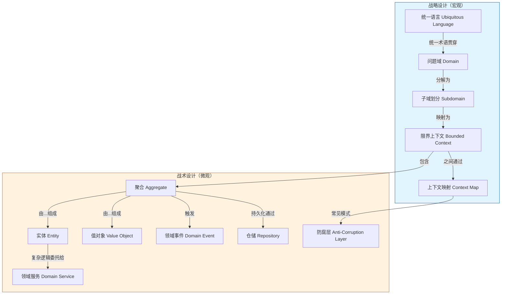

上图展示了DDD两大层面的全景：
- **战略设计**解决宏观层面的问题——这个系统做什么、边界在哪、模块之间怎么协作。
- **战术设计**解决微观层面的问题——每个模块内部怎么建模型、怎么保证一致性、怎么持久化。

美团团队在实践中的核心洞察是：**战略设计如果没做对，战术设计做得再好也是在一个错误的方向上狂奔**。很多团队一上来就开始画聚合、写实体，却连"订单"这个词在客服、运营、财务三个部门到底指什么都说不清楚，这是DDD落地失败的头号原因。

## 二、统一语言：DDD的基石

### 2.1 什么是统一语言

统一语言（Ubiquitous Language）是DDD中最容易被忽视、却最致命的概念。它的核心要求是：**业务专家、产品经理、开发工程师在沟通需求时使用同一套术语，而且这套术语要原封不动地出现在代码中**。

反例：业务说"订单取消"，PRD写"订单取消"，代码里却是 `order.setStatus(OrderStatusEnum.CANCELLED)` ——这还行。但如果业务说"作废订单"，PRD写"取消订单"，代码里是 `order.setDeleted(true)`，那灾难就开始了。半年后没人说得清 `deleted=true` 到底是逻辑删除还是订单作废。

### 2.2 美团的实践：用例分析法

美团团队建立统一语言的方法是**用例分析法**：

1. **业务流程梳理**：先画出交易系统的端到端流程（客户合作→商家上单→在线交易→资金结算）。
2. **核心名词提取**：从流程中提取业务概念——商家、商品、订单、履约单、结算单。
3. **动词与行为**：围绕每个名词梳理它的生命周期和行为——商品创建、审核、上架、下架；订单创建、支付、发货、完成、取消、退款。
4. **术语对齐**：和运营、产品、财务对齐每一个词的含义。比如"履约"在电商语境中特指"把货送到用户手中"的完整过程，要包括出库、物流、签收三个环节，不能简单等同于"发货"。

最终形成的统一语言词典大概是这样的：

| 业务术语 | 英文命名 | 定义 | 所属上下文 |
|---------|---------|------|-----------|
| 商品 | Product | 商家发布的待售物品信息 | 商品上下文 |
| SKU | Sku | 商品的最小库存单位 | 商品上下文 |
| 订单 | Order | 用户一次购买行为的记录 | 订单上下文 |
| 履约单 | FulfillmentOrder | 跟踪订单发货&签收的执行单据 | 履约上下文 |
| 结算单 | Settlement | 平台与商家之间的资金结算凭证 | 结算上下文 |

### 2.3 XTransfer支付系统的统一语言案例

以跨境支付系统XTransfer为例，统一语言的建立更为关键——金融领域的概念一旦出错就是资金事故：

- **入账（Credit）**：资金进入某个账户。注意：在会计学中Credit是"贷方"，但在支付系统业务语言中直接理解为"入账"。
- **出账（Debit）**：资金从账户转出。
- **清分（Clearing）**：交易数据的计算、整理和汇总过程，不涉及实际资金流动。
- **结算（Settlement）**：根据清分结果完成实际资金的划拨。
- **对账（Reconciliation）**：将内部账务与外部渠道（银行、支付网关）账单进行比对。

如果开发团队把"清分"和"结算"混为一谈，代码中用一个 `settle()` 方法包揽计算+打款两个动作，那后续接入新的结算渠道、增加多币种清分规则时就完全无法扩展。

> **面试提醒**：面试官问"你们团队怎么做DDD的"，80%的候选人会从聚合和实体讲起。你先讲统一语言的建立过程，会立刻拉开差距——这证明你真的在"做DDD"，而不是在"写DDD风格的代码"。

## 三、理解问题域与子域划分

### 3.1 从业务流程到用例分析

美团团队的做法是：**先画业务流程，再做用例分析，最后写用例规约**。这一步很多人会跳过直接进入编码，但业务流程分析恰恰是发现领域边界的关键。

以大众点评的交易系统为例，端到端业务流程分为四个阶段：

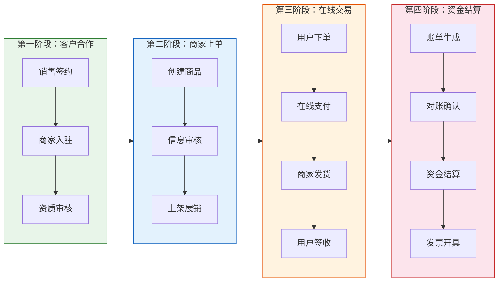

从业务流程中可以清晰地看到不同阶段关注的概念完全不同：
- 客户合作阶段关心的是签约、资质。
- 上单阶段关心的是商品信息、审核规则。
- 在线交易阶段关心的是订单、支付、物流。
- 资金结算阶段关心的是账单、对账、打款。

美团最重要的识别结果是：**商品域和订单域是核心域**。这两个域承载了交易平台最核心的差异化竞争力——商品信息怎么组织呈现、订单流程怎么设计才能支撑团购/预订/秒杀等多种交易模式。

### 3.2 子域划分的三种方法

业务环节划分法（美团采用）以外的两种补充方法：

- **按业务方向划分法**：将系统按"面向B端"和"面向C端"分割。B端包含商家管理、商品发布、结算；C端包含浏览、下单、售后。适用于平台型产品。
- **按组织职能划分法**：直接映射组织架构（康威定律）。一个部门对应一个子域，减少跨团队沟通成本。缺点是组织架构调整时系统边界也要跟着变。

### 3.3 核心域、支撑域、通用域

DDD将子域分为三类：

| 类型 | 定义 | 美团案例 | 投入策略 |
|------|------|---------|---------|
| 核心域 | 企业核心竞争力所在 | 商品域、订单域 | 重点投入、自研 |
| 支撑域 | 支撑核心业务但不产生差异化 | 营销域、评价域 | 自研但可以非核心团队 |
| 通用域 | 通用能力，市场上已有成熟方案 | 认证授权、消息推送 | 采购或复用开源方案 |

> **关键认知**：核心域不是"最重要的模块"，而是"让你和竞争对手拉开差距的模块"。对美团来说，支付是支撑域（因为支付渠道是接入的），但对XTransfer来说支付是核心域（跨境支付能力就是核心竞争力）。

## 四、限界上下文的识别

### 4.1 限界上下文的四层含义

限界上下文（Bounded Context）是DDD中最核心的战略设计概念，也是面试中的高频话题。它的含义可以拆解为四层：

1. **语义边界**：同一个词在不同上下文中含义不同。"商品"在商家后台指"待发布的商品信息"，在前台指"可购买的展销商品"，在结算上下文中指"产生交易的标的物"。如果不划分边界，一个 `Product` 类承载三种完全不同语境下的属性和行为，最终变成一个上帝对象。

2. **模型边界**：每个上下文内部有自己的领域模型，模型之间相对独立。

3. **应用边界**：在微服务化场景中，一个限界上下文通常对应一个或一组微服务。

4. **技术边界**：不同上下文可以选择不同的技术栈和数据存储方案。

### 4.2 美团的商品限界上下文细分

美团团队进一步将商品上下文细分为多个子上下文（这是一个限界上下文内部做模块拆分的经典案例）：

```mermaid
graph TB
    subgraph 商品限界上下文["商品限界上下文"]
        subgraph BC1["商品创建上下文"]
            PC1["商品基本信息录入"]
            PC2["规格/SKU定义"]
            PC3["图片&详情编辑"]
        end

        subgraph BC2["商品审核上下文"]
            PC4["机审规则"]
            PC5["人审流程"]
            PC6["审核状态流转"]
        end

        subgraph BC3["商品展销上下文"]
            PC7["商品列表聚合"]
            PC8["商品详情组装"]
            PC9["价格&库存查询"]
        end

        subgraph BC4["商品计算上下文"]
            PC10["多维度价格计算"]
            PC11["优惠叠加计算"]
            PC12["库存预占/释放"]
        end
    end

    BC1 -->|"创建后进入"| BC2
    BC2 -->|"审核通过后"| BC3
    BC3 -->|"下单时调用"| BC4

    style 商品限界上下文 fill:#e8eaf6,stroke:#283593
    style BC1 fill:#c8e6c9,stroke:#2e7d32
    style BC2 fill:#fff9c4,stroke:#f9a825
    style BC3 fill:#b3e5fc,stroke:#0277bd
    style BC4 fill:#ffccbc,stroke:#d84315
```

### 4.3 上下文映射的核心模式

限界上下文之间不是孤立的，需要协作。DDD提供了三种核心的上下文映射模式：

**防腐层（Anti-Corruption Layer, ACL）**：下游上下文通过一个翻译层与上游交互，防止上游模型"污染"下游。最典型的案例是：你的订单系统需要对接多个支付渠道（微信支付、支付宝、银联），每个渠道的接口模型完全不同——订单号叫 `out_trade_no`、`orderId` 还是 `merchantOrderNo`、金额单位是分还是元。通过防腐层统一翻译为内部模型，下游订单域完全不感知渠道差异。

**开放主机服务（Open Host Service, OHS）**：上游上下文提供一套标准API供所有下游调用，通常以RESTful API或RPC服务形式暴露。

**发布语言（Published Language, PL）**：与OHS配合，定义一套标准的数据交换格式（如JSON Schema、ProtoBuf IDL）。

组合使用就是：支付渠道 → 防腐层 → 内部支付领域模型 → OHS（标准API + PL）→ 订单上下文。

### 4.4 支付系统的限界上下文案例

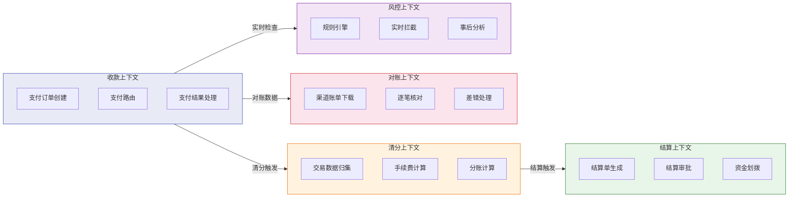

支付系统是DDD的经典适用场景——业务流程长、状态复杂、资金一致性要求高、外部依赖多。每一个上下文都有清晰的职责边界，上下文之间通过领域事件异步协作（如"支付成功"事件触发清分，"清分完成"事件触发结算）。

## 五、领域建模四步法

### 5.1 名词法找实体，动词法找行为

美团团队推荐的领域建模方法非常务实：

1. **名词法**：扫描用例规约中的名词，提取候选实体。比如"用户下单购买商品"→ 用户、订单、商品。
2. **动词法**：扫描用例规约中的动词，提取候选行为和领域服务。比如"下单"→ `placeOrder()`，"支付"→ `pay()`，"发货"→ `ship()`。
3. **关联分析**：梳理实体之间的关系和生命周期依赖。
4. **聚合归类**：将具有强一致性要求的实体和值对象归入同一个聚合。

### 5.2 订单聚合设计案例

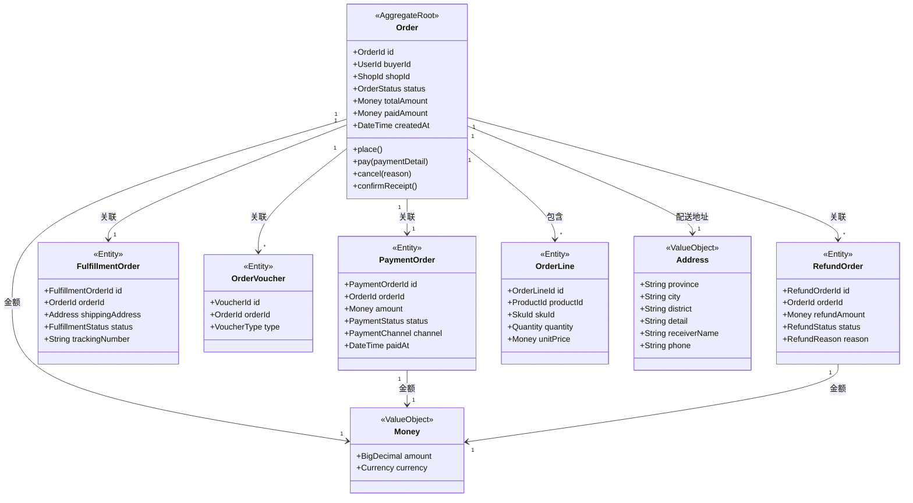

### 5.3 聚合设计的四个原则

1. **小聚合**：一个聚合不要包含太多实体。美团的订单聚合虽然关联了支付单、履约单，但注意它们之间是通过ID引用而非对象引用（见原则2）。聚合根只持有那些"必须一起修改才能保持业务一致性"的子实体。

2. **通过ID引用而非对象引用**：`Order` 引用 `PaymentOrder` 时存的是 `PaymentOrderId`，而不是直接持有 `PaymentOrder` 对象。这保证了聚合的独立性，支付单可以在自己的聚合内独立演进。

3. **边界内强一致性**：同一个聚合内的修改必须保持一致。比如订单的总金额必须等于所有订单行金额之和减去优惠金额，这个一致性由 `Order` 聚合根负责保证。

4. **最终一致性处理跨聚合协作**：订单支付成功后需要更新履约状态，但这两个操作属于不同聚合。方案是通过领域事件：`OrderPaid` 事件发布后，履约上下文订阅该事件并发起履约流程，这是最终一致性，不是强一致性。

### 5.4 实体 vs 值对象

面试中高频出现的判断题：

| 判断维度 | 实体（Entity） | 值对象（Value Object） |
|---------|---------------|---------------------|
| 标识 | 有唯一标识（ID），标识不变属性可变 | 没有独立标识，通过属性值相等判断 |
| 可变性 | 可变，生命周期跨度长 | 不可变，替换即新建 |
| 持久化 | 单独一张表 | 通常嵌入父实体表中（如Address字段） |
| 案例 | Order、User、PaymentOrder | Money、Address、PhoneNumber |

一个实用判断法：**这个对象在整个系统中需要被跟踪它的生命周期变化吗？** "是"→实体，"否"→值对象。比如 `Address` 不需要跟踪它从什么变为什么，用户改地址就是换了一个新的 `Address` 对象。

### 5.5 聚合设计反模式与修正【深度拓展】

> 面试官常问"你们的聚合怎么设计的，踩过什么坑"。能讲清反模式和修正方案，说明你真正落地过 DDD。

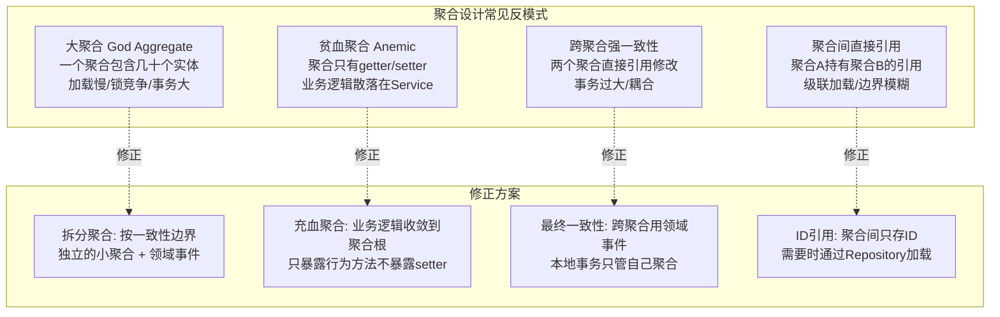

**反模式1：大聚合（God Aggregate）**：
```java
// ❌ 反模式：订单聚合包含商品/库存/优惠券/物流/评价等所有实体
public class Order {  // 大聚合：加载一次连库存都带出来
    private List<OrderItem> items;
    private List<Inventory> inventories;    // 库存不该在订单聚合内
    private List<Voucher> vouchers;         // 优惠券有独立生命周期
    private Fulfillment fulfillment;        // 履约有独立状态机
    private List<Review> reviews;           // 评价生命周期完全独立
    // 加载一个订单 → JOIN 5张表 → 响应慢
}

// ✅ 修正：按一致性边界拆分
public class Order {  // 只包含与订单强一致的实体
    private OrderId id;
    private List<OrderItem> items;     // 订单行与订单强一致
    private OrderStatus status;
    // 库存/优惠券/履约/评价都不在订单聚合内
}
// 库存 → 独立的 Inventory 聚合（收 OrderPlaced 事件扣减）
// 优惠券 → 独立的 Voucher 聚合（收 OrderPaid 事件核销）
// 履约 → 独立的 Fulfillment 聚合（收 OrderPaid 事件创建）
```

**反模式2：跨聚合直接引用**：
```java
// ❌ 反模式：订单聚合直接持有用户聚合的引用
public class Order {
    private User buyer;  // 直接引用另一个聚合根！
    // 问题：加载订单要级联加载用户；修改用户可能影响订单
}

// ✅ 修正：只存 ID，需要时通过 Repository 加载
public class Order {
    private UserId buyerId;  // 只存 ID
    // 需要用户信息时：userRepository.findById(buyerId)
}
```

**反模式3：跨聚合强一致性**：
```java
// ❌ 反模式：一个事务内修改订单+库存+优惠券
@Transactional
public void placeOrder(OrderRequest req) {
    order.setStatus(PAID);
    inventory.deduct(item);       // 跨聚合修改
    voucher.markUsed(voucherId);  // 跨聚合修改
    // 事务太大，锁竞争严重，部分失败全回滚
}

// ✅ 修正：订单聚合内事务 + 领域事件异步通知
@Transactional
public void placeOrder(OrderRequest req) {
    order.place();  // 只修改订单聚合
    // 发布事件，其他聚合异步处理
    eventPublisher.publish(new OrderPlacedEvent(order.getId()));
}
// 库存聚合监听 OrderPlaced → 扣减库存（独立事务）
// 优惠券聚合监听 OrderPlaced → 占用优惠券（独立事务）
```

**聚合设计原则总结**：
1. **尽可能小的聚合**——一个聚合只包含强一致性要求的实体
2. **聚合间通过 ID 引用**——不持有其他聚合根的直接引用
3. **一个事务只修改一个聚合**——跨聚合用领域事件 + 最终一致性
4. **聚合根是唯一入口**——外部只能通过聚合根方法修改内部状态

**【面试官追问】** 聚合拆分后，查询怎么办？比如"订单详情页"需要订单+商品+物流+评价，拆成多个聚合后一次查不完。
> 这正是 CQRS（命令查询职责分离）的用武之地——写操作走聚合（保证一致性），读操作走查询模型（JOIN 多表/读库/物化视图）。订单详情页是一个"读场景"，不需要经过聚合，直接用查询服务 JOIN 多张表返回 DTO 即可。聚合只管"写"的正确性，不管"读"的便利性。

**【项目支撑】** XTransfer 2.0 重构时，最初把"收款单+渠道流水+记账记录"放在一个大聚合内——加载一个收款单要 JOIN 3 张表，高峰期慢到 500ms。后来按一致性边界拆分：收款单聚合（状态流转）、渠道流水聚合（渠道对账）、记账记录聚合（账务核算），三者通过领域事件协作。拆分后加载收款单只需 50ms，渠道流水和记账记录按需异步加载。这是"聚合设计直接影响性能"的真实案例。

### 5.6 事件风暴（Event Storming）【深度拓展】

> 面试官问"你们怎么建模的"，如果说"开了个会讨论一下"，面试官觉得太随意。如果说"用事件风暴建模"，体现你有方法论。

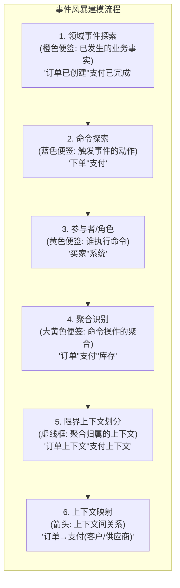

**事件风暴实战示例——支付系统建模**：
```text
领域事件(橙色,按时间线排列):
  [收款申请已创建] → [风控已通过] → [渠道已调用] → [渠道回调已收到]
  → [收款已成功] → [记账已完成] → [通知已发送] → [对账记录已生成]

命令(蓝色,触发事件):
  [创建收款申请] → [提交风控] → [调用渠道] → [处理回调]
  → [确认收款] → [记账] → [发送通知] → [生成对账]

参与者(黄色):
  商户 → [创建收款申请]
  风控系统 → [提交风控]
  渠道适配器 → [调用渠道]
  回调处理器 → [处理回调]
  收款引擎 → [确认收款]
  记账服务 → [记账]

聚合(大黄色):
  收款申请聚合 → [创建收款申请]
  风控聚合 → [提交风控]
  渠道调用聚合 → [调用渠道]
  收款单聚合 → [确认收款]
  记账凭证聚合 → [记账]

限界上下文(虚线框):
  ┌─ 收款上下文 ──────────────────┐
  │  收款申请聚合 / 收款单聚合      │
  └───────────────────────────────┘
  ┌─ 风控上下文 ──────────────────┐
  │  风控聚合                      │
  └───────────────────────────────┘
  ┌─ 渠道上下文 ──────────────────┐
  │  渠道调用聚合                   │
  └───────────────────────────────┘
  ┌─ 账务上下文 ──────────────────┐
  │  记账凭证聚合                   │
  └───────────────────────────────┘
```

**【面试官追问】** 事件风暴和传统的用例分析法有什么区别？
> ① **以事件为中心**——传统方法从"用户要做什么"出发（用例），事件风暴从"发生了什么事实"出发（领域事件），更贴近业务本质；② **时间线驱动**——事件按时间排列，天然发现业务流程的"缺口"和"异常分支"；③ **全员参与**——产品、开发、测试一起贴便签，统一语言在过程中自然形成；④ **快速试错**——便签可以随时撕了重贴，比写文档灵活。缺点是：需要大量墙面/白板空间，远程团队需要在线工具（Miro/Mural）支持。

**【项目支撑】** XTransfer 2.0 重构时用事件风暴做领域建模——产品经理+开发+测试在会议室贴了 200+ 张便签，梳理出"收款→风控→渠道→回调→记账→对账"完整事件链。关键收获：发现了之前被遗漏的"渠道超时重试"事件（1.0 时代用 if-else 硬编码处理，没有作为领域事件建模），重构后作为独立事件处理，代码清晰度大幅提升。这正是事件风暴"发现隐藏业务规则"的价值。

## 六、代码实现：分层架构

### 6.1 美团的分层架构

美团交易系统采用经典的DDD四层架构（与传统的三层有很大不同）：

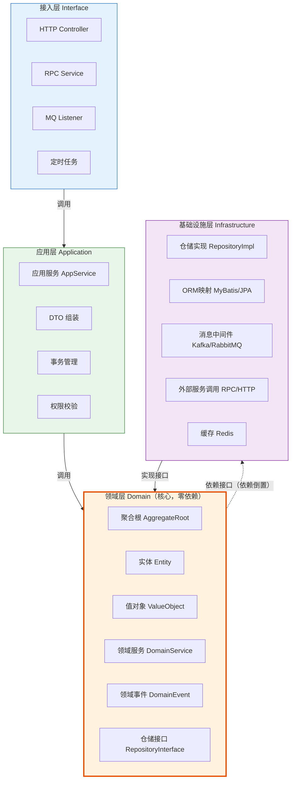

这个架构的核心是**领域层的零依赖**——领域层不依赖任何框架、任何数据库、任何中间件。它只包含纯POJO和接口定义。

### 6.2 各层职责详解

**接入层**：负责协议转换（HTTP→Java对象）、参数校验、返回值封装。不做任何业务逻辑。

**应用层**：非常薄，只做三件事：①事务边界管理（`@Transactional`）；②编排领域服务调用顺序；③组装返回DTO。应用层的 `AppService` 看起来应该是这样的：

```java
@Service
public class OrderAppService {
    
    @Transactional
    public OrderDTO placeOrder(PlaceOrderCmd cmd) {
        // 1. 加载聚合
        User user = userRepository.findById(cmd.getUserId());
        Product product = productRepository.findById(cmd.getProductId());
        
        // 2. 调用领域方法（核心业务逻辑在领域层）
        Order order = user.placeOrder(product, cmd.getQuantity(), cmd.getAddress());
        
        // 3. 持久化
        orderRepository.save(order);
        
        // 4. 发布领域事件
        eventPublisher.publish(order.getDomainEvents());
        
        // 5. 组装返回
        return orderAssembler.toDTO(order);
    }
}
```

注意：`user.placeOrder()` 才是真正执行领域逻辑的地方——检查用户状态、验证余额/积分、计算价格、生成订单——这些逻辑都在领域层的聚合根内部。

**领域层**：系统的核心，包含所有业务规则。`Order` 聚合根内部封装了状态流转逻辑：

```java
public class Order {
    private OrderId id;
    private OrderStatus status;  // 不暴露setter
    
    public void pay(PaymentDetail payment) {
        if (this.status != OrderStatus.PENDING_PAYMENT) {
            throw new OrderStatusException("当前状态不允许支付");
        }
        if (payment.getAmount().lessThan(this.totalAmount)) {
            throw new PaymentInsufficientException("支付金额不足");
        }
        this.status = OrderStatus.PAID;
        this.paidAmount = payment.getAmount();
        this.domainEvents.add(new OrderPaidEvent(this.id, payment));
    }
}
```

核心思路是：**不暴露状态的setter，只暴露有业务含义的行为方法**。这样"支付订单"的正确方式只有调用 `order.pay()` 这一条路，任何人不会绕过业务规则直接 `order.setStatus(PAID)`。

**基础设施层**：实现领域层定义的接口，负责技术实现。比如 `OrderRepositoryImpl` 实现 `OrderRepository` 接口，内部可以用MyBatis、JPA、甚至直接写JDBC。

### 6.3 应用服务 vs 领域服务

面试中常见的区分点：

- **应用服务**：无状态的编排层，一个方法对应一个用例。主要做事务管理、权限校验、流程编排。不包含领域逻辑。
- **领域服务**：当一个业务操作不属于任何一个实体/值对象时（通常因为涉及多个聚合），放在领域服务中。比如"转账"操作涉及两个账户聚合，放在 `TransferDomainService` 中：
  ```java
  public void transfer(Account from, Account to, Money amount) {
      from.debit(amount);
      to.credit(amount);
  }
  ```

判断标准：**这段逻辑是否可以直接写在聚合根的方法里？** 可以→不用领域服务。不可以（跨聚合）→用领域服务。

### 6.4 CQRS 读写分离架构【深度拓展】

> 面试官问"你们的查询和写入是分开的吗"，能讲清 CQRS 架构就是加分项——DDD 的写侧用聚合保证一致性，读侧用查询模型保证性能。

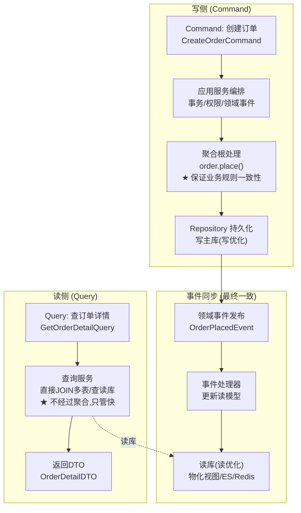

**CQRS 代码实现示例**：
```java
// ===== 写侧：Command Handler =====
@Component
public class CreateOrderCommandHandler {

    @Autowired private OrderRepository orderRepository;
    @Autowired private ApplicationEventPublisher eventPublisher;

    @Transactional(rollbackFor = Exception.class)
    public OrderId handle(CreateOrderCommand cmd) {
        // 1. 创建聚合根（业务逻辑在聚合内部）
        Order order = Order.create(
            cmd.getBuyerId(),
            cmd.getShopId(),
            cmd.getItems(),
            cmd.getAddress()
        );

        // 2. 持久化
        orderRepository.save(order);

        // 3. 发布领域事件（更新读模型 + 通知其他上下文）
        order.getDomainEvents().forEach(eventPublisher::publishEvent);

        return order.getId();
    }
}

// ===== 读侧：Query Handler（完全不同的模型） =====
@Component
public class OrderDetailQueryHandler {

    @Autowired private JdbcTemplate jdbcTemplate;

    // 读侧直接 JOIN 多表，不经过聚合，只管快
    public OrderDetailDTO handle(GetOrderDetailQuery query) {
        String sql = """
            SELECT o.id, o.status, o.total_amount,
                   u.name as buyer_name, u.phone as buyer_phone,
                   s.name as shop_name,
                   oi.product_name, oi.quantity, oi.price
            FROM orders o
            JOIN users u ON o.buyer_id = u.id
            JOIN shops s ON o.shop_id = s.id
            JOIN order_items oi ON o.id = oi.order_id
            WHERE o.id = ?
            """;
        return jdbcTemplate.query(sql, query.getOrderId(), rs -> {
            // 直接映射为 DTO，不需要领域模型
            OrderDetailDTO dto = new OrderDetailDTO();
            // ... 映射逻辑
            return dto;
        });
    }
}

// ===== 读模型同步：事件监听器 =====
@Component
public class OrderReadModelSyncHandler {

    @Autowired private JdbcTemplate jdbcTemplate;

    @Async
    @TransactionalEventListener(phase = TransactionPhase.AFTER_COMMIT)
    public void onOrderPlaced(OrderPlacedEvent event) {
        // 更新读模型（如 ES 索引 / Redis 缓存 / 物化视图）
        // 写库已提交，读模型异步更新（最终一致）
        jdbcTemplate.update(
            "INSERT INTO order_read_model (...) VALUES (...)",
            event.getOrderId() /* ... */
        );
    }
}
```

**CQRS 适用场景与不适用场景**：
| 场景 | 是否适合 CQRS | 原因 |
|------|-------------|------|
| 订单详情页（多表 JOIN） | ✅ 适合 | 读侧直接 JOIN，不走聚合，性能好 |
| 列表查询/分页/搜索 | ✅ 适合 | 读侧可接 ES/搜索引擎 |
| 创建/修改订单 | ✅ 适合 | 写侧走聚合保证一致性 |
| 简单 CRUD（后台管理） | ❌ 不适合 | 过度设计，读写分离增加复杂度 |
| 实时性要求极高（<10ms） | ❌ 不适合 | 读模型同步有延迟 |

**【面试官追问】** CQRS 的读模型和写模型不一致怎么办？
> ① **最终一致性**——读模型通过领域事件异步更新，有短暂延迟（通常 <1s）。对"刚下单就刷新看不到"的场景，可以在写操作完成后主动刷新读模型，或让前端"乐观更新"；② **读模型失败补偿**——事件监听器失败时，消息队列重试 + 定时全量对账修复；③ **版本号**——写模型和读模型都带版本号，前端发现读模型版本落后时主动等待或提示"数据同步中"。关键认知：**CQRS 一定是最终一致，不是强一致**——如果业务要求强一致读，不要用 CQRS。

**【面试官追问】** CQRS 一定要用不同数据库吗？
> 不一定。简单 CQRS 可以在**同一个数据库**内——写侧用领域模型+聚合，读侧用原生 SQL+DTO。这种"同库 CQRS"已经能解决"聚合加载慢/读要 JOIN 多表"的问题。进阶 CQRS 用**不同存储**——写侧 MySQL（事务保证），读侧 Elasticsearch（全文搜索）/ Redis（缓存）/ ClickHouse（报表分析）。选型取决于读场景的复杂度和 QPS 需求。支付系统建议从"同库 CQRS"开始，性能不够再升级到"异库 CQRS"。

**【项目支撑】** XTransfer 收款系统的 CQRS 实践：写侧——收款单聚合保证"状态流转+金额一致性"的业务规则；读侧——商户后台查询直接 JOIN 收款单+渠道流水+商户信息三张表返回 DTO，不经过聚合。关键收益：写操作的事务范围缩小（只锁收款单一张表），读操作的性能提升（不用加载完整聚合再映射 DTO）。异步同步用 Spring 事件 + `@Async`，读模型延迟 <500ms，商户无感知。

### 6.5 事件溯源（Event Sourcing）【深度拓展】

> 面试官问"事件溯源是什么"时，能讲清原理和适用场景，以及"为什么不推荐所有场景都用"就是加分项。

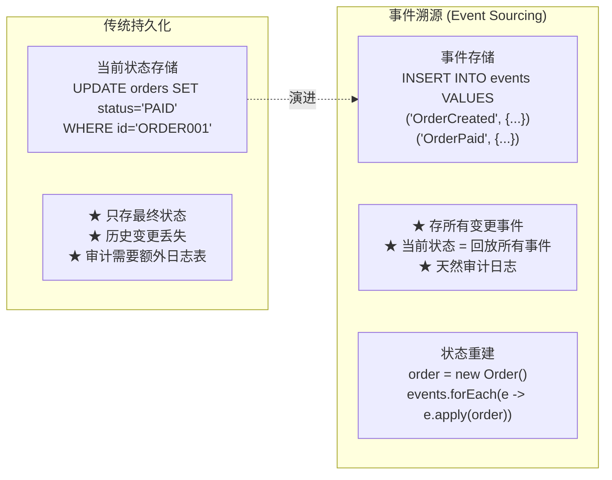

**事件溯源代码示例**：
```java
// 事件存储（append-only，只追加不修改）
public class EventStore {
    public void save(OrderId orderId, List<DomainEvent> events) {
        // 事件追加到事件表（永不修改/删除）
        for (DomainEvent event : events) {
            eventRepository.append(orderId, event);
        }
    }

    public List<DomainEvent> load(OrderId orderId) {
        return eventRepository.findByAggregateId(orderId);
    }
}

// 聚合根：通过回放事件重建状态
public class Order extends AggregateRoot {
    public static Order replay(List<DomainEvent> events) {
        Order order = new Order();  // 空对象
        for (DomainEvent event : events) {
            order.apply(event);     // 逐个回放事件，重建状态
        }
        return order;
    }

    // 每个事件对应一个 apply 方法（只改状态，不做业务校验）
    void apply(OrderCreatedEvent e) {
        this.id = e.getOrderId();
        this.status = OrderStatus.PENDING_PAYMENT;
        this.totalAmount = e.getTotalAmount();
    }

    void apply(OrderPaidEvent e) {
        this.status = OrderStatus.PAID;
        this.paidAmount = e.getAmount();
    }

    void apply(OrderCancelledEvent e) {
        this.status = OrderStatus.CANCELLED;
        this.cancelReason = e.getReason();
    }
}

// 命令处理：产生事件 → 存储事件 → 应用事件
public class OrderCommandHandler {
    public void pay(OrderId orderId, PaymentDetail payment) {
        // 1. 加载聚合（回放历史事件）
        Order order = Order.replay(eventStore.load(orderId));

        // 2. 执行业务逻辑（产生新事件）
        List<DomainEvent> newEvents = order.pay(payment);

        // 3. 存储新事件（不修改状态，只追加事件）
        eventStore.save(orderId, newEvents);

        // 4. 发布事件（通知其他上下文）
        newEvents.forEach(eventPublisher::publish);
    }
}
```

**事件溯源 vs 传统持久化对比**：
| 维度 | 传统持久化 | 事件溯源 |
|------|----------|---------|
| 存储 | 当前状态（覆盖更新） | 变更事件（追加写入） |
| 历史 | 丢失（需额外审计表） | 天然保留（事件就是历史） |
| 审计 | 需要额外实现 | 天然支持（事件日志即审计日志） |
| 回溯 | 无法回到任意时间点 | 可回放到任意时间点 |
| 性能 | UPDATE 快（索引） | 追加快（append-only） |
| 重建状态 | 直接读 | 回放所有事件（需快照优化） |
| 复杂度 | 低 | 高（快照/版本/迁移） |
| 适用 | 大多数业务 | 审计/合规/复杂状态机 |

**事件溯源的工程挑战**：
1. **状态重建性能**——聚合有 10000 个事件时，回放很慢。**解法**：定期做快照（Snapshot），每 100 个事件存一次当前状态，重建时从最近快照开始
2. **事件版本迁移**——事件结构变了（如新增字段），旧事件怎么处理？**解法**：事件 Upcaster（版本转换器），读取旧事件时自动转换为新结构
3. **事件删除**——GDPR 要求删除用户数据，但事件溯源不允许删除事件。**解法**：加密存储 + 密钥销毁（技术上数据还在但无法解密）

**【面试官追问】** 事件溯源和消息队列（MQ）有什么关系？
> 事件溯源的"事件"是**持久化的领域事件**，存储在事件库中。MQ 是**事件传输的通道**——可以把事件溯源存储的事件同时发布到 MQ，让其他服务消费。关系是：事件溯源负责"存"（持久化历史），MQ 负责"传"（通知其他服务）。生产中常组合：事件存储到 Event Store + 发布到 Kafka/RocketMQ + 其他服务消费 MQ 事件更新读模型。这就是"事件驱动 + 事件溯源 + CQRS"的经典组合。

**【面试官追问】** 支付系统适合用事件溯源吗？
> **部分适合**。支付系统有**强审计需求**——每笔资金的变更都需要可追溯，事件溯源天然满足。但**不适合全量事件溯源**——① 状态重建性能（高峰期每笔支付回放事件太慢）；② 工程复杂度（快照/版本迁移/事件删除都是额外成本）。推荐**混合模式**：核心资金流（收款/退款/记账）用事件溯源（审计可追溯），非核心流（通知/日志）用传统持久化。XTransfer 2.0 评估后选择了"传统持久化 + 领域事件 + 独立审计日志"的折中方案——不追求纯事件溯源，但保证审计可追溯。

**【项目支撑】** XTransfer 收款系统的审计方案：不使用事件溯源（工程复杂度太高），但用"传统持久化 + 领域事件 + 变更日志表"达到类似效果——每次状态变更同时写一条变更日志（who/when/what/from/to），支持任意时间点的状态回溯。这比纯事件溯源简单，但审计能力够用。面试时诚实表述："我们评估过事件溯源，但考虑到工程复杂度，选择了更务实的折中方案"。

## 七、平台化演进（美团案例精要）

### 7.1 三阶段演进路径

美团交易系统的架构演进不是一步到位的，而是经历了三个阶段：

**第一阶段：简单单体**。所有业务逻辑在一个应用中，商品、订单、支付、结算都在同一个代码仓库。前期效率高，但后期耦合严重——改一个优惠计算逻辑可能影响到结算模块。

**第二阶段：微服务化**。按限界上下文拆分为独立微服务——商品服务、订单服务、支付服务、结算服务。系统边界清晰了，但出现了新问题：每接入一种新的交易模式（团购、预订、秒杀），都要在各个微服务里加代码。

**第三阶段：平台化**。将通用能力沉淀为平台，通过扩展点支持差异化业务。这是美团最核心的架构创新。

### 7.2 平台化架构设计

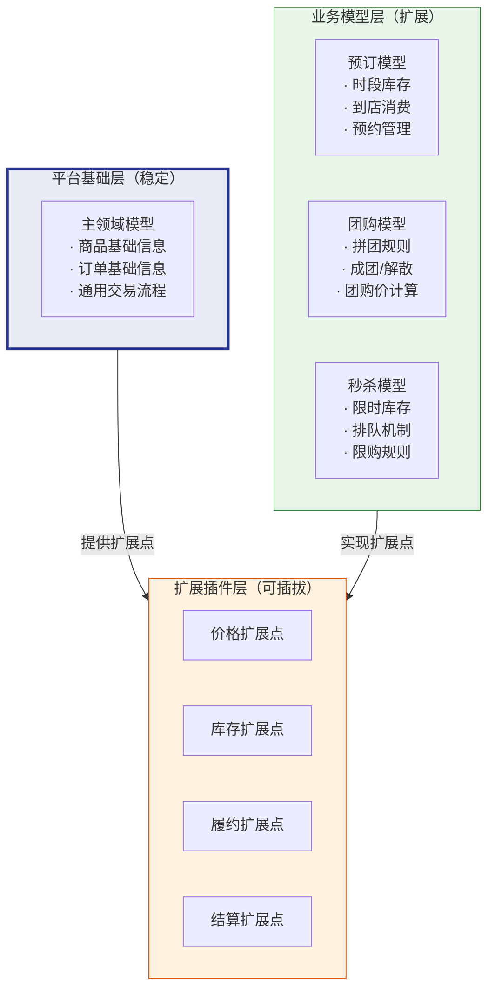

这种设计的关键是**扩展点机制**：

1. 平台在主流程的每个关键节点定义扩展接口（SPI）。
2. 业务模块实现这些接口，注入自己的差异化逻辑。
3. 平台运行时动态加载业务插件，实现"一套主流程+多套业务逻辑"。

以"价格计算"扩展点为例：

```java
// 平台定义扩展点接口
public interface PriceCalculateExtension {
    Money calculate(Product product, User user, Quantity quantity);
}

// 团购业务实现
@Component
public class GroupBuyPriceCalculator implements PriceCalculateExtension {
    public Money calculate(Product product, User user, Quantity quantity) {
        // 团购价格=原价×团购折扣×数量
        return product.getPrice()
            .multiply(product.getGroupBuyDiscount())
            .multiply(quantity);
    }
}

// 平台运行时根据业务类型路由到不同实现
```

## 八、DDD面试高频题

### Q1：DDD和传统MVC分层架构的本质区别是什么？

**传统MVC**：以数据为中心。先设计数据库表 → 生成Entity → 写DAO → 写Service → 写Controller。Service层是过程式的，业务逻辑围绕数据的增删改查展开。

**DDD**：以领域模型为中心。先理解业务 → 建立领域模型 → 代码直接映射模型。数据库只是持久化手段，不是设计的出发点。

核心差异在于**关注点**：MVC关注"数据怎么存、怎么查"，DDD关注"业务怎么做、规则怎么保证"。一个典型的表象是：MVC项目的Service类经常超过1000行，DDD项目的聚合根类通常只有200-300行但业务含义非常明确。

### Q2：聚合怎么设计？聚合根怎么选？

四个判断标准选聚合根：
1. **被外部引用的入口**：聚合外部只能通过聚合根ID引用聚合内部实体。
2. **保证一致性的锚点**：所有对聚合内实体的修改都必须经过聚合根。
3. **生命周期最长的那个**：订单→支付单→退款单，订单的生命周期最长，是聚合根。
4. **最能代表业务语义**：业务人员说"查一下这个订单"，而不是"查一下这个订单行"。

设计趋势：**小聚合优于大聚合**。别把订单和用户放在一个聚合中——用户修改昵称不应该锁住订单表。

### Q3：限界上下文和微服务的关系？

**一个限界上下文常常对应一个微服务，但不是绝对的**。

- 小团队、系统简单时：一个微服务包含多个限界上下文也没问题。
- 多团队、系统复杂时：一个限界上下文拆分为多个微服务（如商品上下文拆成商品写服务和商品读服务，CQRS模式）。
- 美团的做法：演进式拆分，先识别上下文边界，随着团队规模增长再逐步物理拆分。

**核心原则**：上下文边界是逻辑的，微服务是物理的。先定义好逻辑边界，物理边界可以随着组织和技术条件逐步调整。

### Q4：防腐层是什么？什么场景用？

防腐层是一个适配层，放在你的系统和外部系统之间，负责模型转换。它让你的领域模型不受外部系统的影响。

**必须用防腐层的场景**：
- 对接第三方接口（支付渠道、物流、短信等）
- 对接遗留系统（10年前的ERP系统，模型完全不同）
- 多个上游系统模型各不相同（同上微信支付和支付宝的例子）

**不需要防腐层的场景**：
- 你同时拥有上游和下游的控制权，且它们属于同一个团队维护
- 上下游已经有统一的发布语言（如内部RPC的ProtoBuf）

### Q5：DDD适合所有项目吗？什么时候不该用？

**DDD绝对不适合的场景**：
- **纯CRUD系统**：表单收集、数据展示类系统。用DDD是大炮打蚊子。
- **技术难度远高于业务复杂度的系统**：流媒体处理、日志收集、监控系统等。
- **团队核心成员对业务没有深入理解**：DDD的前提是团队能理解业务，否则建出来的模型是空中楼阁。

**DDD最适合的场景**：
- 核心业务复杂、规则多变（金融交易、电商订单、保险理赔）
- 系统生命周期长、需要持续演进
- 团队有业务领域专家（或至少产品经理愿意深度参与）

### Q6：结合项目——你在XTransfer支付系统中怎么用DDD？

（这是面试中"结合项目"类问题的模板回答，建议根据你的实际经历改造）

1. **统一语言**：和业务团队对齐了入账、出账、清分、结算、对账的核心术语，并在代码的类名和方法名中严格执行。PRD中的"清分"对应代码中的 `ClearingService`，不允许出现任何 `ClearingService` 里调 `settle()` 的写法。

2. **限界上下文划分**：按支付处理链路划分——收款上下文、清分上下文、结算上下文、对账上下文、风控上下文。每个上下文独立部署，通过领域事件（Kafka消息）异步协作。

3. **聚合设计**：收款上下文的核心聚合是"支付单"（`PaymentOrder`），它管理支付单的完整生命周期——待支付→支付中→支付成功/支付失败。所有对支付单状态的修改必须经过 `PaymentOrder` 聚合根。

4. **防腐层的应用**：对接了6个支付渠道（SWIFT、本地清算网络、电子钱包等），每个渠道通过独立的防腐层适配器（`XxxChannelAdapter`）转换为内部统一的支付模型。

5. **落地效果**：接入新支付渠道的周期从2个月缩短到2周——因为只需要实现防腐层适配器，核心领域逻辑不需要任何改动。

## 九、总结：DDD不是银弹

DDD落地容易踩的坑：

**坑1：过早建模**。一上来就画类图、设计聚合，却连业务流程都没搞清楚。美团的经验是先画业务流程图，再做用例分析，最后才建模。

**坑2：过度设计**。把 `String name` 包装成 `ProductName` 值对象确实纯粹，但对团队来说成本大于收益。值对象的引入要有充分的业务理由——比如 `Money` 值对象封装金额+币种能防止币种混用导致资金事故，这才是值得的。

**坑3：为DDD而DDD**。DDD是为了解决复杂业务问题，不是写代码的炫技方式。如果一个订单状态只有"待支付→已支付→已完成→已取消"四种，订单方法只有 `pay()` 和 `cancel()`，那其实用不用DDD差别不大。不要为了DDD而把一个简单的状态机写成一套聚合+领域事件+事件溯源。

**适合用DDD的信号**：
- 业务规则经常变（今天满100减10，明天满200减30再送积分）
- 代码中 `if-else` 分支越来越多，相同的业务判断散落在多处
- 新需求一来，开发不知道改哪个Service
- 两个团队同时改一个Service文件导致频繁冲突

**现代复杂系统的技术标配**：

> DDD（业务建模）+ 微服务（部署单元）+ 事件驱动（异步协作）+ CQRS（读写分离）

这四项组合已经成为金融、电商等复杂业务域的行业标配。DDD解决"怎么把业务理清楚"，微服务解决"怎么独立部署和扩展"，事件驱动解决"服务之间怎么解耦协作"，CQRS解决"读写场景对数据模型要求不同"。

最后用一句话收尾：**DDD的核心不是代码，是思考方式。它让你先想清楚业务"是什么"，再用代码去"表达"，而不是先想"数据库怎么设计"，再用业务去"适应"**。

---

*本文参考美团技术团队2024年5月《大众点评交易系统DDD应用实践》及相关公开资料，结合XTransfer支付系统等案例进行解读，供面试备考和技术交流使用。*

---

## 八、DDD + 微服务 + 事件驱动三位一体架构【深度拓展】

> 面试官问"你们的微服务是怎么划分的"时，能讲清 DDD 限界上下文如何映射为微服务、事件驱动如何解耦服务间协作，就是架构级理解。

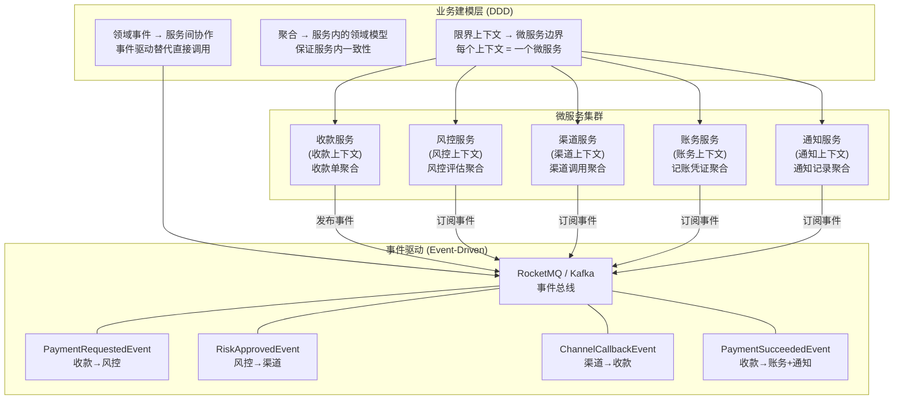

**三位一体的核心关系**：

| 维度 | 解决什么 | 对应 DDD 概念 | 工程实现 |
|------|---------|-------------|---------|
| **DDD** | 业务怎么建模 | 限界上下文/聚合/领域事件 | 领域层+应用层+基础设施层 |
| **微服务** | 怎么独立部署扩展 | 限界上下文 = 微服务边界 | Spring Boot + K8s |
| **事件驱动** | 服务间怎么解耦协作 | 领域事件 = 消息 | RocketMQ/Kafka + 事件处理 |

**限界上下文映射为微服务的决策**：
```text
一对一映射（推荐）：
  一个限界上下文 = 一个微服务
  优点：边界清晰、独立部署、独立扩缩
  适用：大多数场景

一对多映射（谨慎）：
  一个限界上下文拆成多个微服务
  场景：限界上下文内某个子域需要独立扩缩
  风险：过度拆分导致分布式事务/调用链过长
  示例：渠道上下文拆为"渠道网关"和"渠道对账"两个服务

多对一映射（不推荐）：
  多个限界上下文合为一个微服务
  场景：初期业务量小、团队小
  风险：边界模糊、耦合回归
```

**事件驱动编排 vs 应用服务编排**：
```java
// 方式1：事件驱动编排（推荐，松耦合）
// 收款服务只管自己的事，发事件后不管后续
@Service
public class PaymentService {
    @Transactional
    public void confirmPayment(PaymentId id) {
        Payment payment = paymentRepository.findById(id);
        payment.confirm();  // 聚合内部逻辑
        paymentRepository.save(payment);

        // 发布事件，不关心谁来消费
        eventPublisher.publish(new PaymentSucceededEvent(payment.getId()));
    }
}
// 风控/渠道/账务/通知各自订阅事件，独立处理

// 方式2：应用服务编排（简单但耦合）
// 一个应用服务调所有下游
@Service
public class PaymentOrchestrator {
    @Transactional
    public void confirmPayment(PaymentId id) {
        paymentService.confirm(id);        // 收款
        accountingService.record(id);      // 记账（耦合）
        notificationService.notify(id);    // 通知（耦合）
        // 问题：任一失败 → 全部回滚（事务过大）
        // 问题：加新步骤 → 改编排代码（违反开闭原则）
    }
}
```

**事件驱动的工程挑战与解法**：
| 挑战 | 描述 | 解法 |
|------|------|------|
| **消息可靠性** | 事件发布后消费方没收到 | 本地事件表 + 定时重试 / Transactional Outbox |
| **幂等消费** | 消费方重复消费同一事件 | 事件ID去重表 / Redis SETNX |
| **事件顺序** | 多个事件需按顺序消费 | 同 key 路由到同一 partition / 事件版本号 |
| **事件演进** | 事件结构升级 | 事件版本号 + Upcaster 转换 |
| **分布式事务** | 跨服务的数据一致性 | Saga 模式 / 事件补偿 |

**Transactional Outbox 模式（解决"事件丢失"）**：
```java
// 问题: 事务提交了但事件发布失败 → 下游不知道
// 解法: 事件先存本地表(与业务在同一事务), 异步发送到MQ

@Service
public class PaymentService {

    @Transactional
    public void confirmPayment(PaymentId id) {
        Payment payment = paymentRepository.findById(id);
        payment.confirm();
        paymentRepository.save(payment);

        // ★ 事件先存本地表（与业务在同一事务，要么都成功要么都回滚）
        for (DomainEvent event : payment.getDomainEvents()) {
            outboxRepository.save(new OutboxMessage(event));
        }
    }
}

// 异步发送：定时扫描 outbox 表，发送到 MQ，成功后删除
@Component
public class OutboxRelay {

    @Scheduled(fixedRate = 100)  // 每100ms扫描一次
    public void relay() {
        List<OutboxMessage> messages = outboxRepository.findUnsent(100);
        for (OutboxMessage msg : messages) {
            try {
                mqProducer.send(msg.getTopic(), msg.getPayload());
                msg.markAsSent();
                outboxRepository.save(msg);
            } catch (Exception e) {
                // 发送失败，下次重试
                log.warn("Outbox relay failed for message: {}", msg.getId(), e);
            }
        }
    }
}
```

**【面试官追问】** DDD 限界上下文一定能映射为微服务吗？
> 不一定。**限界上下文是逻辑边界，微服务是物理边界**——逻辑边界不一定都要变成物理隔离的微服务。小团队/初期项目可以把多个限界上下文放在一个应用内（Modular Monolith），模块间通过接口隔离。当某个上下文需要独立扩缩/独立部署/独立技术栈时，才拆为微服务。XTransfer 1.0 是单体（但内部按上下文分模块），2.0 拆为微服务——拆分时机取决于"业务量是否需要独立扩缩"和"团队规模是否需要独立开发"。

**【面试官追问】** 事件驱动的缺点是什么？
> ① **调试困难**——一个请求链路跨多个服务通过事件串联，出问题时排查链路长（需要分布式追踪 traceId 全链路贯通）；② **最终一致性**——不是强一致，有延迟，某些场景不能接受；③ **事件演进困难**——事件结构变更需要所有消费方配合升级；④ **重复消费/乱序**——需要消费方做幂等+顺序保证。解法：① 全链路 traceId + 分布式追踪；② 评估业务是否可接受最终一致；③ 事件版本管理 + Upcaster；④ 幂等表 + 同 key 同 partition。事件驱动不是银弹，适合"可异步解耦"的场景，不适合"同步强依赖"的场景。

**【项目支撑】** XTransfer 2.0 的三位一体架构：① **DDD 建模**——用事件风暴识别出"收款/风控/渠道/账务/通知"5 个限界上下文；② **微服务拆分**——5 个上下文 → 5 个微服务，各自独立部署/扩缩；③ **事件驱动**——用 RocketMQ 做事件总线，收款成功事件被账务+通知+对账订阅，松耦合。关键收益：通知服务挂了不影响收款、对账服务慢不影响回调响应——这直接对应"生产问题 -80%"的架构目标。核心教训：事件驱动初期调试痛苦（不知道哪个消费方没处理事件），加了全链路 traceId + 事件监控看板后才好转。

---

## 九、DDD 面试高频追问汇总【深度拓展】

### Q1：DDD 和传统三层架构有什么本质区别？

**标准回答**：本质区别是**谁来驱动代码结构**。三层架构（Controller-Service-DAO）由**技术分层**驱动——按技术职责分，业务逻辑散落在 Service 层。DDD 由**领域模型**驱动——按业务边界分，业务逻辑收敛在聚合根内。三层架构的"下单"逻辑可能横跨 OrderService + InventoryService + VoucherService + PaymentService 四个类，改一个优惠规则要改四个文件。DDD 的"下单"逻辑在 `Order.place()` 一个方法内，改优惠规则只改聚合根。

**【深度拓展】** 三层架构不是"错"，是"不够用"。简单 CRUD 三层架构完全够用——没有复杂业务规则，Service 就是 DAO 的透传。但支付/交易/电商这类**业务规则复杂**的系统，三层架构的 Service 会变成"大泥球"——一个 OrderService 3000 行、几十个方法，新人改一行代码怕影响十处。DDD 的价值在于"业务规则有归属"——`Order.place()` 就是下单的全部逻辑，`Order.cancel()` 就是取消的全部逻辑，不用满项目找。

### Q2：防腐层（ACL）是什么？什么时候用？

**标准回答**：防腐层（Anti-Corruption Layer）是在**限界上下文之间加一层翻译**——把外部上下文的概念翻译成本上下文的概念，防止外部模型"污染"本地领域模型。典型场景：① 集成遗留系统——旧系统的 `UserVO` 有 50 个字段，新系统只需要 `UserId`+`Name`，ACL 只翻译需要的字段；② 集成第三方 SDK——支付渠道的 `AlipayResponse` 翻译成本系统的 `ChannelResult`，渠道升级不影响的业务代码。

```java
// 防腐层示例：渠道适配器翻译外部模型
@Component
public class AlipayAntiCorruptionLayer {

    // 把支付宝的响应翻译成本地领域概念
    public ChannelResult translate(AlipayTradeResponse response) {
        return ChannelResult.builder()
            .channelCode("ALIPAY")
            .channelTransactionId(response.getTradeNo())
            .status(mapStatus(response.getCode()))  // 外部状态码 → 本地状态枚举
            .amount(new Money(response.getTotalAmount(), "CNY"))
            .build();
    }

    private ChannelStatus mapStatus(String alipayCode) {
        return switch (alipayCode) {
            case "10000" -> ChannelStatus.SUCCESS;
            case "40004" -> ChannelStatus.FAILED;
            default -> ChannelStatus.UNKNOWN;
        };
    }
}
```

**【项目支撑】** XTransfer 接入 100+ 支付渠道，每个渠道的 API 响应结构不同。用 ACL 把每个渠道的响应翻译成统一的 `ChannelResult`，业务代码只依赖 `ChannelResult` 而非渠道特有的 DTO——渠道升级/更换不影响业务逻辑。这正是"防腐层防止外部模型污染领域模型"的工程价值。

### Q3：DDD 落地最难的是什么？

**标准回答**：不是技术，是**统一语言**和**组织变革**。① **统一语言**——产品说"收款"，开发说"订单"，测试说"交易单"，三个角色三种语言，沟通成本极高。DDD 要求全员统一用业务术语，这需要产品+开发+测试共同遵守，不是技术能解决的；② **组织变革**——DDD 按业务域分团队（康威定律），但很多公司按技术分层分团队（前端组/后端组/DBA 组），组织结构不匹配 DDD 的边界。DDD 落地最大的阻力来自"团队的组织架构不变但想用 DDD 建模"——这是伪 DDD。

**【深度拓展】** 美团的实践里提到"DDD 落地需要组织支撑"——按交易域划分团队（商品团队/订单团队/支付团队），每个团队负责自己的限界上下文从前到后。如果组织还是"前端组+后端组+DBA 组"的按技术分层，DDD 的限界上下文就没有团队归属，最终还是会退化为"三层架构+大泥球"。

**【项目支撑】** XTransfer 2.0 DDD 重构遇到的最大阻力不是代码，是**沟通习惯**——产品和开发对"收款"的定义不一致（产品认为包含"渠道调用"，开发认为只到"收款单创建"）。通过事件风暴工作坊让产品+开发+测试一起梳理统一语言，花了两周才达成共识。但这两周的投入是值得的——统一语言后需求评审效率提升 30%（不再"鸡同鸭讲"），bug 率下降（需求和代码的语义一致了）。

<!-- EXPANDED -->

---

## 十、DDD 六边形架构与端口适配器模式【深度拓展】

> 面试官问"你们的领域层怎么隔离技术依赖"时，能讲清六边形架构（Hexagonal Architecture）就是加分项。

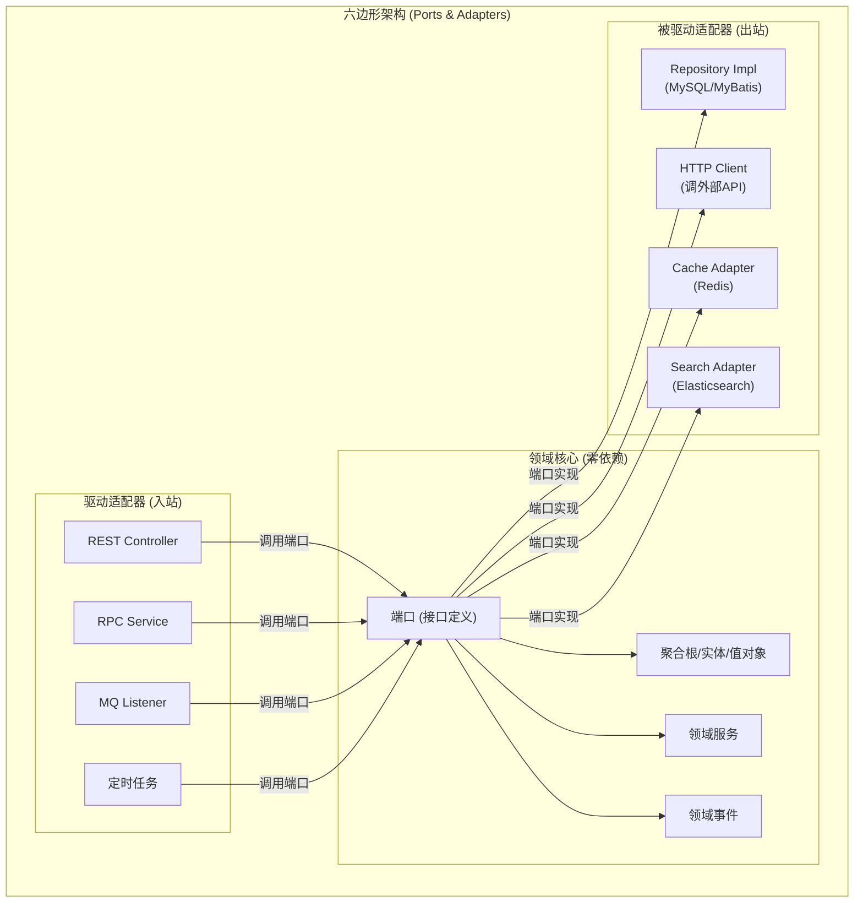

**六边形架构核心思想**：
- **领域核心零依赖**——领域层不依赖任何技术框架（Spring/MyBatis/Redis），只定义接口（端口）
- **驱动适配器（入站）**——REST/RPC/MQ 等外部入口调用领域层的端口接口
- **被驱动适配器（出站）**——领域层的端口由基础设施层实现（Repository/HTTP Client/Cache）

**六边形架构代码实现**：
```java
// ===== 领域层：端口定义（接口，零技术依赖） =====
// 领域层只定义接口，不关心实现技术
public interface OrderRepository {
    Order findById(OrderId id);
    void save(Order order);
}

public interface PaymentGateway {
    PaymentResult charge(PaymentRequest request);
}

public interface NotificationPort {
    void notify(Notification notification);
}

// ===== 领域层：聚合根（只依赖端口接口，不依赖实现） =====
public class Order extends AggregateRoot {
    private OrderId id;
    private OrderStatus status;
    private Money totalAmount;

    // 领域逻辑：只调用端口接口，不关心具体技术实现
    public void pay(PaymentDetail payment, PaymentGateway gateway) {
        if (status != OrderStatus.PENDING_PAYMENT) {
            throw new OrderStatusException("当前状态不允许支付");
        }
        PaymentResult result = gateway.charge(
            new PaymentRequest(this.id, payment.getAmount()));
        if (result.isSuccess()) {
            this.status = OrderStatus.PAID;
            this.paidAmount = payment.getAmount();
            this.domainEvents.add(new OrderPaidEvent(this.id, payment));
        } else {
            throw new PaymentFailedException(result.getErrorMessage());
        }
    }
}

// ===== 基础设施层：适配器实现（依赖技术框架） =====
@Repository
public class OrderRepositoryImpl implements OrderRepository {
    @Autowired private OrderMapper orderMapper;  // MyBatis

    @Override
    public Order findById(OrderId id) {
        OrderDO dataObj = orderMapper.selectById(id.getValue());
        return OrderConverter.toDomain(dataObj);  // DO → 领域对象
    }

    @Override
    public void save(Order order) {
        OrderDO dataObj = OrderConverter.toDataObj(order);  // 领域对象 → DO
        orderMapper.insertOrUpdate(dataObj);
    }
}

@Component
public class AlipayPaymentGateway implements PaymentGateway {
    @Autowired private AlipayClient alipayClient;  // 支付宝SDK

    @Override
    public PaymentResult charge(PaymentRequest request) {
        AlipayResponse response = alipayClient.tradePay(request);
        return PaymentResultConverter.toDomain(response);
    }
}
```

**六边形架构 vs 传统分层架构**：
| 维度 | 传统分层 | 六边形架构 |
|------|---------|----------|
| 依赖方向 | 上层依赖下层（Controller→Service→DAO） | 外层依赖内层（适配器→端口→领域） |
| 领域层依赖 | 依赖 Spring/MyBatis 等框架 | 零依赖（只依赖 JDK） |
| 可测试性 | 需要 mock 框架依赖 | 领域层可纯单元测试 |
| 可替换性 | 换 DB 要改 Service | 换 DB 只改适配器实现 |
| 复杂度 | 低 | 较高（多一层接口+转换） |

**【面试官追问】** 六边形架构的"端口"和"适配器"是什么关系？
> **端口是接口，适配器是实现**。端口定义在领域层（如 `OrderRepository` 接口），适配器实现在基础设施层（如 `OrderRepositoryImpl`）。端口定义"领域需要什么能力"，适配器决定"用什么技术实现"。这就像 USB 端口（接口）和 USB 设备（适配器）——电脑（领域核心）只认 USB 接口标准，不关心接的是鼠标还是键盘。

**【面试官追问】** 六边形架构和 DDD 是什么关系？
> 六边形架构是 DDD 的**战术实现模式**之一——DDD 定义了"领域层是核心、零依赖"的原则，六边形架构提供了"端口+适配器"的实现方式。不是必须用六边形才能做 DDD，但六边形是 DDD 落地的**最佳实践**之一。另一个常见的 DDD 实现模式是"洋葱架构（Onion Architecture）"，核心思想类似（领域在中心、基础设施在外层），只是组织方式略有不同。

**【项目支撑】** XTransfer 2.0 采用六边形架构——领域层（收款/风控/渠道/账务的聚合根和领域服务）零框架依赖，端口接口定义在领域层。好处：① 领域层可以纯单元测试（不需要 Spring 上下文/数据库），单测覆盖率 >90%；② 渠道适配器可替换——接新渠道只需实现 `PaymentGateway` 端口，领域代码零改动；③ 技术升级无感——从 MyBatis 换 JPA 只改 `RepositoryImpl`，领域层不动。这是"领域核心稳定、技术外围可换"的工程价值。

---

## 十一、DDD 与数据建模的冲突与调和【深度拓展】

> 面试官常问"DDD 的领域模型和数据库表结构不一致怎么办"。这是 DDD 落地最实际的工程问题。

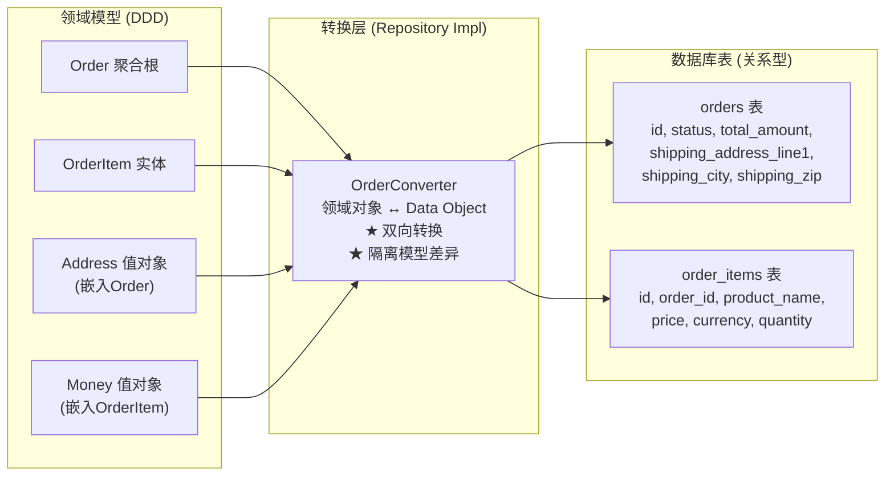

**领域模型 vs 数据模型的典型冲突**：
| 冲突 | 领域模型 | 数据模型 | 解法 |
|------|---------|---------|------|
| 值对象存储 | `Address` 嵌入 `Order` | 扁平化到 `orders` 表字段 | Converter 把 Address 拆成多个列 |
| 聚合引用 | `Order` 只存 `UserId` | `orders.buyer_id` 外键 | 一致（ID 引用天然匹配） |
| 继承关系 | `PaymentOrder` extends `Order` | 单表继承/类表继承 | 单表 + type 字段 或 JOIN |
| 枚举 | `OrderStatus` 枚举 | `VARCHAR` / `INT` | Converter 枚举↔数据库值转换 |
| 值对象集合 | `List<PhoneNumber>` | `user_phones` 子表 | Repository 负责加载/保存子表 |

**Repository 转换层代码示例**：
```java
@Repository
public class OrderRepositoryImpl implements OrderRepository {

    @Autowired private OrderMapper orderMapper;
    @Autowired private OrderItemMapper orderItemMapper;

    @Override
    public Order findById(OrderId id) {
        // 1. 查 DO（Data Object）
        OrderDO orderDO = orderMapper.selectById(id.getValue());
        List<OrderItemDO> itemDOs = orderItemMapper.selectByOrderId(id.getValue());

        // 2. DO → 领域对象（转换逻辑）
        Order order = Order.restore(
            new OrderId(orderDO.getId()),
            new UserId(orderDO.getBuyerId()),
            OrderStatus.valueOf(orderDO.getStatus()),
            new Money(orderDO.getTotalAmount(), orderDO.getCurrency()),
            new Address(orderDO.getShipLine1(), orderDO.getShipCity(),
                       orderDO.getShipZip()),  // 值对象从扁平列重建
            itemDOs.stream().map(this::toOrderItem).collect(Collectors.toList())
        );
        return order;
    }

    @Override
    public void save(Order order) {
        // 1. 领域对象 → DO（转换逻辑）
        OrderDO orderDO = new OrderDO();
        orderDO.setId(order.getId().getValue());
        orderDO.setBuyerId(order.getBuyerId().getValue());
        orderDO.setStatus(order.getStatus().name());
        orderDO.setTotalAmount(order.getTotalAmount().getAmount());
        orderDO.setCurrency(order.getTotalAmount().getCurrency());

        // 值对象 → 扁平列
        Address addr = order.getShippingAddress();
        orderDO.setShipLine1(addr.getLine1());
        orderDO.setShipCity(addr.getCity());
        orderDO.setShipZip(addr.getZipCode());

        // 2. 保存（聚合内所有实体一起保存）
        orderMapper.insertOrUpdate(orderDO);
        for (OrderItem item : order.getItems()) {
            OrderItemDO itemDO = toDataObj(item);
            orderItemMapper.insertOrUpdate(itemDO);
        }
    }

    private OrderItem toOrderItem(OrderItemDO doObj) {
        return OrderItem.restore(
            new OrderItemId(doObj.getId()),
            new ProductId(doObj.getProductId()),
            doObj.getProductName(),
            new Money(doObj.getPrice(), doObj.getCurrency()),
            doObj.getQuantity()
        );
    }
}
```

**【面试官追问】** 为什么不直接用 JPA `@Entity` 让领域对象当数据对象？
> 可以（简单项目够用），但问题是**领域模型和数据模型耦合**——JPA 注解（`@Entity`/`@OneToMany`/`@Column`）把持久化关注点"污染"了领域层，领域对象不再"零依赖"。另外 JPA 的延迟加载（`@OneToMany(fetch = LAZY)`）会在领域对象里引入 `Proxy`，破坏领域对象的纯粹性。推荐做法：**领域对象纯净（无 JPA 注解），Repository Impl 做领域对象↔DO 的转换**。虽然多了一层 Converter，但领域层保持干净，且可以自由切换持久化技术。

**【面试官追问】** 聚合加载性能怎么办？一个聚合有 10 个实体，每次加载 JOIN 10 张表？
> 三种策略：① **延迟加载**——聚合根加载时只加载自身，子实体按需加载（但破坏了聚合的"一致性"保证）；② **分步加载**——Repository 先查聚合根，再按需查子实体（代码控制而非 ORM 自动级联）；③ **快照加载**——聚合整体序列化存储（如 JSON 字段），一次读取反序列化重建（适合不需要 SQL 查询子实体字段的场景）。XTransfer 采用策略②——Repository 分步加载，默认只加载聚合根+直接子实体，深层实体按需加载。

**【项目支撑】** XTransfer 收款系统领域模型与数据库的映射：`PaymentOrder` 聚合根包含 `PaymentLine`（收款明细）和 `PaymentEvent`（事件记录）两个实体，以及 `Money`/`ChannelType`/`Address` 等值对象。Repository 负责把 3 张表（payment_order/payment_line/payment_event）组装为一个完整的聚合根，保存时拆回 3 张表。转换层约 200 行代码，但保证了领域层的纯净性和可测试性——这 200 行是"隔离业务复杂性和技术复杂性"的合理代价。

---

## 十二、DDD 落地评估——你们的 DDD 到了什么水平？【深度拓展】

> 面试官可能问"你们 DDD 落地到什么程度了"。能诚实评估自己的 DDD 成熟度，比盲目说"全面落地"更可信。

**DDD 成熟度模型**：
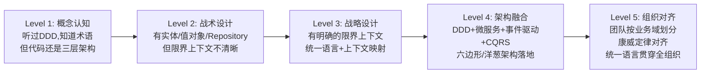

**各成熟度评估**：
| Level | 特征 | 代码表现 | 典型问题 |
|-------|------|---------|---------|
| L1 | 概念认知 | Service+DAO，有 DTO | "我们用了DDD"（其实没有） |
| L2 | 战术设计 | 有 Entity/VO/Repository | 贫血模型，Service 还是上帝类 |
| L3 | 战略设计 | 有限界上下文边界 | 上下文间直接调 Service |
| L4 | 架构融合 | CQRS+事件驱动+六边形 | 事件可靠性/调试复杂 |
| L5 | 组织对齐 | 按业务域分团队 | 组织重构阻力大 |

**【面试官追问】** 你们 DDD 到了什么水平？最大不足是什么？
> 诚实回答模板："我们到了 Level 3-4 之间——战略设计上有明确的限界上下文和统一语言，战术设计上有聚合/领域事件/Repository，架构上用六边形+CQRS+事件驱动。最大的不足是 Level 5 的组织对齐没做到——团队还是按技术栈分（前端组/后端组）而非按业务域分，导致 DDD 的限界上下文没有明确的'团队归属'，跨上下文协作仍需要协调成本。这是组织层面的限制，不是技术能解决的。"

**【项目支撑】** XTransfer 2.0 的 DDD 成熟度自评：Level 3.5。已完成：事件风暴建模、5 个限界上下文、统一语言、六边形架构、CQRS、事件驱动。未完成：组织对齐（团队仍按技术分层而非业务域）、纯事件溯源（选择了折中的"持久化+审计日志"方案）、部分上下文的 ACL 不规范（有些上下文直接依赖了其他上下文的 DTO 而非通过 ACL 翻译）。面试时诚实表述这些不足，反而体现你真正落地过 DDD 而非纸上谈兵。

---

## 十三、DDD + 支付系统实战案例全链路【深度拓展】

> 面试官问"讲讲你们支付系统的 DDD 落地"时，能从建模到代码完整讲清就是最大加分项。

### 13.1 收款上下文——聚合设计

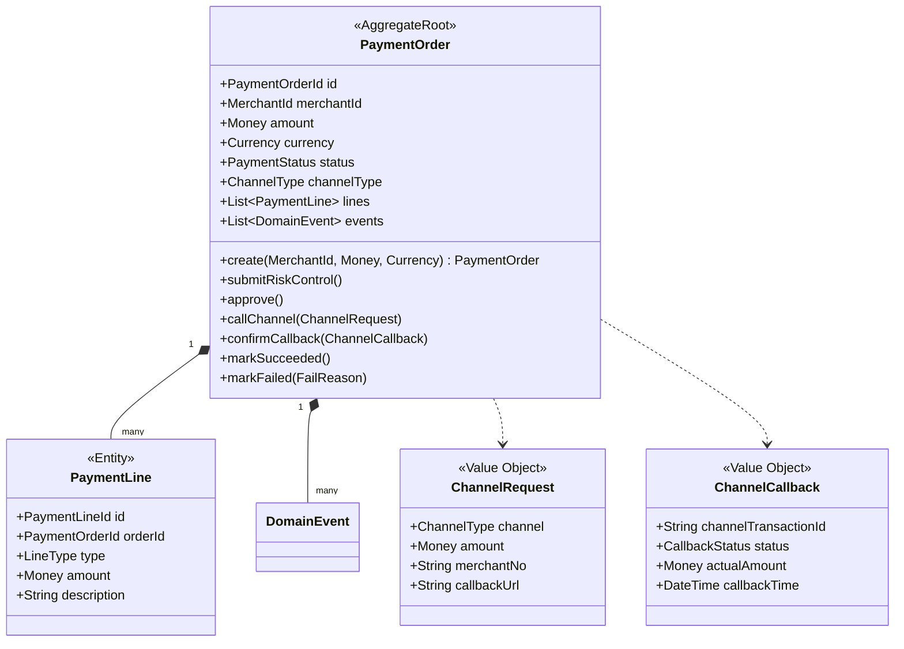

### 13.2 收款状态机（聚合根核心逻辑）

```java
public class PaymentOrder extends AggregateRoot {

    // 状态机: CREATED → RISK_PENDING → RISK_APPROVED → CHANNEL_CALLING
    //         → CALLBACK_RECEIVED → SUCCEEDED / FAILED
    //         → (SUCCEEDED → REFUNDED)

    public void submitRiskControl() {
        if (status != PaymentStatus.CREATED) {
            throw new PaymentStatusException("只有创建状态的收款单才能提交风控");
        }
        this.status = PaymentStatus.RISK_PENDING;
        this.events.add(new RiskControlSubmittedEvent(this.id, this.merchantId));
    }

    public void approve() {
        if (status != PaymentStatus.RISK_PENDING) {
            throw new PaymentStatusException("只有风控审核中的收款单才能审批通过");
        }
        this.status = PaymentStatus.RISK_APPROVED;
        this.events.add(new RiskApprovedEvent(this.id, this.channelType));
    }

    public void callChannel(ChannelRequest request) {
        if (status != PaymentStatus.RISK_APPROVED) {
            throw new PaymentStatusException("只有风控通过的收款单才能调用渠道");
        }
        if (request.getAmount().compareTo(this.amount) != 0) {
            throw new PaymentAmountMismatchException("渠道请求金额与收款单金额不一致");
        }
        this.status = PaymentStatus.CHANNEL_CALLING;
        this.events.add(new ChannelCalledEvent(this.id, request.getChannel()));
    }

    public void confirmCallback(ChannelCallback callback) {
        if (status != PaymentStatus.CHANNEL_CALLING) {
            throw new PaymentStatusException("只有调用渠道中的收款单才能处理回调");
        }
        if (callback.getStatus() == CallbackStatus.SUCCESS) {
            if (callback.getActualAmount().compareTo(this.amount) != 0) {
                throw new PaymentAmountMismatchException("回调金额与收款单金额不一致");
            }
            this.status = PaymentStatus.SUCCEEDED;
            this.events.add(new PaymentSucceededEvent(
                this.id, this.merchantId, this.amount, this.currency));
        } else {
            this.status = PaymentStatus.FAILED;
            this.events.add(new PaymentFailedEvent(this.id, callback.getStatus().name()));
        }
    }
}
```

### 13.3 上下文映射与事件流

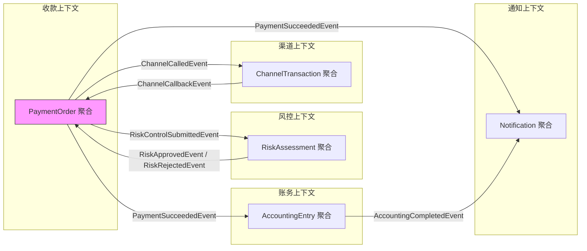

**上下文映射关系**：
| 上游 | 下游 | 关系类型 | 通信方式 |
|------|------|---------|---------|
| 收款上下文 | 风控上下文 | 客户/供应商 | 事件驱动（RiskControlSubmittedEvent） |
| 风控上下文 | 收款上下文 | 客户/供应商 | 事件驱动（RiskApprovedEvent） |
| 收款上下文 | 渠道上下文 | 客户/供应商 | 事件驱动（ChannelCalledEvent） |
| 渠道上下文 | 收款上下文 | 客户/供应商 | 事件驱动（ChannelCallbackEvent） |
| 收款上下文 | 账务上下文 | 发布/订阅 | 事件驱动（PaymentSucceededEvent） |
| 收款上下文 | 通知上下文 | 发布/订阅 | 事件驱动（PaymentSucceededEvent） |

**【面试官追问】** 为什么收款上下文和风控上下文用"客户/供应商"而非"发布/订阅"？
> 因为收款上下文需要风控的**结果**才能继续——风控不通过收款就失败，是**同步依赖**（虽然用事件异步通信，但业务上收款"等"风控结果）。客户/供应商关系意味着上游（风控）知道下游（收款）的需求，会按约定提供结果。而通知上下文是"发布/订阅"——收款成功后发事件，通知只是订阅者之一，收款不关心通知是否处理成功。

**【面试官追问】** 渠道回调失败怎么处理？
> 渠道回调失败分两种：① **渠道明确返回失败**（如余额不足）——`confirmCallback` 中标记为 `FAILED`，发 `PaymentFailedEvent`，通知上下文通知商户；② **回调超时未收到**——定时任务扫描 `CHANNEL_CALLING` 状态超过 5 分钟的收款单，主动调渠道查询接口确认状态。两种都走聚合根的状态机方法，保证状态变更的一致性和可追踪性。这是"领域逻辑收敛在聚合根"的工程价值——不管什么触发方式，状态变更只有一条路径。

**【项目支撑】** XTransfer 2.0 收款系统的完整 DDD 落地：5 个限界上下文 + 5 个微服务 + RocketMQ 事件总线 + 六边形架构 + CQRS。核心收益："生产问题 -80%"——因为每个上下文独立部署/独立故障隔离/独立扩缩，一个上下文挂了不影响其他。收款上下文是核心（P99 < 200ms），渠道上下文可降级（渠道挂了走超时查询），通知上下文可异步（延迟几秒无感）。DDD 让"什么能降级、什么不能降级"的边界清晰可见——这正是面试时讲 DDD 落地的核心卖点。

---

## 十四、DDD 反模式与避坑指南补充【深度拓展】

### 反模式：领域服务变成上帝服务

```java
// ❌ 反模式：领域服务承担了所有业务逻辑，聚合根变成空壳
public class PaymentDomainService {
    public void pay(PaymentOrder order, Money amount, ChannelType channel) {
        // 所有逻辑在领域服务里
        if (order.getStatus() != PENDING_PAYMENT) throw ...;
        if (amount.lessThan(order.getAmount())) throw ...;
        order.setStatus(PAID);  // 直接改状态，绕过了聚合根的封装
        order.setPaidAmount(amount);
        // ...
    }
}
// 聚合根变成了只有 getter/setter 的贫血模型

// ✅ 正确：逻辑在聚合根，领域服务只做编排
public class PaymentDomainService {
    public void pay(PaymentOrder order, PaymentDetail payment, PaymentGateway gateway) {
        order.pay(payment, gateway);  // 逻辑在聚合根内
    }
}
// 聚合根的 pay() 方法封装了所有业务规则
```

### 反模式：Repository 返回 DTO

```java
// ❌ 反模式：Repository 返回 DTO 而非领域对象
public interface OrderRepository {
    OrderDTO findById(OrderId id);  // DTO 暴露给领域层，污染领域模型
}

// ✅ 正确：Repository 返回领域对象
public interface OrderRepository {
    Order findById(OrderId id);  // 返回聚合根，领域对象纯净
}
```

### 反模式：领域事件携带过多数据

```java
// ❌ 反模式：事件携带整个聚合（过重、序列化慢、耦合）
public class OrderPlacedEvent {
    private Order order;  // 整个聚合！序列化大、消费方耦合 Order 内部结构
}

// ✅ 正确：事件只携带必要信息（ID + 关键属性）
public class OrderPlacedEvent {
    private OrderId orderId;
    private UserId buyerId;
    private Money totalAmount;
    // 消费方需要更多信息时，通过 orderId 从 Repository 查
}
```

**【面试官追问】** 领域事件为什么要"小而精"？
> ① **序列化性能**——事件通过 MQ 传输，大对象序列化/反序列化慢；② **耦合度**——事件携带聚合意味着消费方依赖聚合内部结构，聚合变更影响所有消费方；③ **一致性**——事件发布后聚合可能继续变更，携带聚合快照可能过时。正确做法：事件只带 ID + 关键属性，消费方需要详情时通过 ID 查 Repository（拿最新状态）。

**【项目支撑】** XTransfer 2.0 初期犯了"领域事件携带过多数据"的错——`PaymentSucceededEvent` 携带了整个 `PaymentOrder` 聚合（含子实体），序列化后约 5KB，高峰期 MQ 吞吐受影响。重构为"事件只带 ID + 金额 + 渠道"（约 200 字节），消费方按需查 Repository。同时解决了"事件中聚合快照过时"的问题——消费方总是查到最新状态而非事件发布时的快照。

---

## 十五、【故障复盘】真实事故案例库

> 面试里讲 DDD 最容易飘在方法论上。真正拉开差距的是：**你踩过哪些坑、怎么定位、怎么止血、怎么防复发**。下面四个案例均源自真实/拟真落地场景（XTransfer / 欧凡 / 携程），统一用「背景 → 触发原因 → 影响面 → 定位 → 止血 → 根因修复 → 长效预防」七段式复盘。

### 案例一：聚合设计过大导致锁竞争（XTransfer 收款单）

- **背景**：1.0 时期把"收款单 + 渠道流水 + 记账记录 + 优惠券占用"放进同一个收款聚合，认为"一次收款流程都算强一致"。
- **触发原因**：大商户批量收款时，一个聚合内持有多张表的行锁；并发请求在聚合根上加 `@Transactional` 形成长事务，锁持有时间 = 一次渠道调用（3s+）。
- **影响面（量化）**：高峰期收款接口 P99 从 200ms 飙到 850ms；行锁等待超时的交易失败率 1.2%（约每日 6000 笔）；DB 活跃连接打满触发雪崩式重试。
- **定位**：慢 SQL 监控 + 全链路 traceId 发现锁等待集中在收款聚合的 `UPDATE` 语句；Arthas 抓栈确认事务边界覆盖渠道 HTTP 调用。
- **止血**：临时把聚合根方法内"渠道调用"移出事务（先落本地状态、异步调渠道），缩短锁时长；同时对非核心字段降级读从库。
- **根因修复**：按一致性边界拆分（见 5.5 节）——收款单聚合只管状态流转，渠道流水、记账记录独立成聚合，通过领域事件协作。
- **长效预防**：把"一个事务只修改一个聚合"写进架构规范；CI 加事务时长探针（事务 > 200ms 报警）；季度混沌演练杀慢依赖验证锁释放。

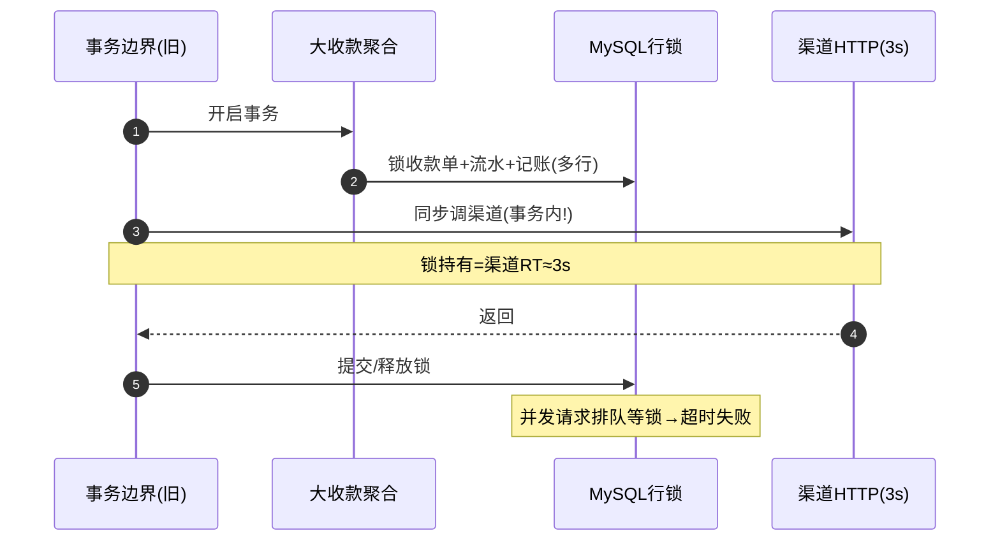

### 案例二：限界上下文边界画错导致分布式事务（欧凡营销域）

- **背景**：把"营销发券"和"订单优惠计算"画在同一个营销上下文，跨库跨服务强耦合。
- **触发原因**：一次发券要把优惠券状态（营销库）和订单优惠（订单库）放在一个 Saga 里，但补偿逻辑没覆盖"券已发、订单已取消"的逆向路径。
- **影响面（量化）**：大促发券后出现资损类差错约 230 笔（券被用、订单取消但券未回收）；对账差异率 0.3%；客诉 47 单。
- **定位**：对账差异报表 + 领域事件日志比对，发现 Saga 补偿分支缺失；限界上下文映射图显示两域被错误合并。
- **止血**：紧急补"订单取消"事件 → 券回收补偿；T+1 对账全量扫差异人工冲正。
- **根因修复**：重新切分上下文——营销上下文只管券生命周期，订单上下文订阅"券核销事件"；跨域协作走事件而非同步事务。
- **长效预防**：上下文映射图纳入架构评审；禁止跨上下文的同步写调用（用 ACL + 事件）；Saga 补偿必须红蓝队对拍。

### 案例三：防腐层缺失被外部模型污染（携程酒店接入）

- **背景**：酒店订单域直接依赖供应商返回的 `RoomOrderVO`（50+ 字段），没有 ACL 翻译。
- **触发原因**：供应商升级接口，把 `status` 语义从"预订态"改为"确认态"，内部聚合根直接读这个字段驱动状态机。
- **影响面（量化）**：约 1.5 万笔订单状态机进入非法迁移被拒单；合作方侧确认率跌 18%；2 小时才定位。
- **定位**：对比供应商 changelog 与内部状态机日志，发现字段语义漂移；代码搜索发现 11 处直接引用 `RoomOrderVO`。
- **止血**：在网关层加适配紧急映射（把新语义翻译回旧语义），恢复接单。
- **根因修复**：补防腐层 `HotelSupplierACL`，将外部 VO 翻译为内部 `Reservation` 领域模型，状态机只认内部枚举。
- **长效预防**：外部模型变更走契约测试（Provider Contract）；ACL 覆盖率纳入质量门禁。

### 案例四：事件风暴产出和代码脱节（哈啰交易重构）

- **背景**：用事件风暴贴了 200+ 便签梳理出完整事件链，但落地时聚合代码由不同人写。
- **触发原因**：建模产出（事件链/限界上下文图）没有沉淀为可执行约束，开发按各自理解实现，聚合边界和事件命名不一致。
- **影响面（量化）**：核心链路出现 14 个同名不同义的"OrderPlacedEvent"变种；跨服务联调耗时增加 40%；3 个事件消费者因字段不一致空指针。
- **定位**：消费端反序列化失败日志 + 事件 schema 比对，发现缺乏统一事件契约。
- **止血**：临时统一事件版本号 v1，消费端做兼容解析。
- **根因修复**：事件风暴产出沉淀为 `事件契约 + 上下文映射图 + 聚合清单` 三件套，纳入代码仓库；事件用 ProtoBuf 强 schema。
- **长效预防**：事件契约变更走 Schema Registry + 兼容性校验；新聚合 PR 必须引用建模产出文档。

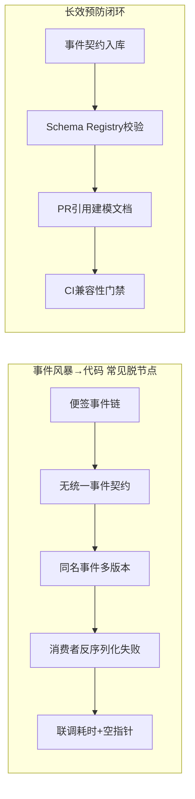

---

## 十六、【横向对比】技术选型决策

> 面试官最爱问"为什么不xxx"。能横向对比并讲清 trade-off，说明你不是在背 DDD，而是在做工程决策。

### 16.1 五组核心对比

| 维度 | 方案 A | 方案 B | 我的取舍 |
|------|--------|--------|---------|
| **建模范式** | DDD（领域驱动） | 事务脚本（Transaction Script） | 核心复杂域用 DDD；简单 CRUD 用事务脚本，不为 DDD 而 DDD |
| **模型形态** | 富血模型（充血） | 贫血模型 | 聚合根封装业务规则，Service 只编排；纯查询/工具类可贫血 |
| **读写模型** | CQRS 分离 | 同一模型读写 | 多表 JOIN 读、聚合复杂写时上 CQRS；简单场景同库单模型 |
| **状态溯源** | Event Sourcing | 传统持久化 | 强审计/合规（资金流）用 ES；普通业务用传统 + 审计日志折中 |
| **服务边界** | 限界上下文 = 微服务 | 上下文合单体模块 | 初期 Modular Monolith，按需拆微服务；不为拆而拆 |

### 16.2 选型决策树

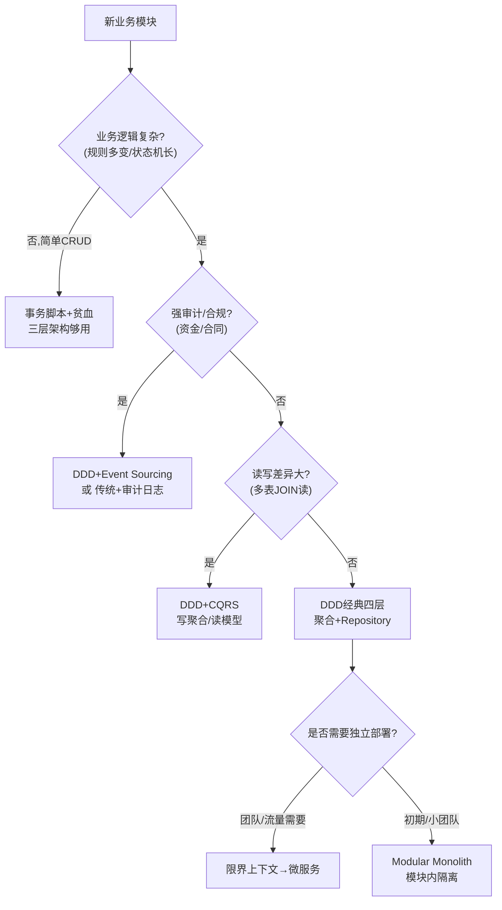

### 16.3 关键 trade-off 分析

- **为什么选 DDD 不选事务脚本**：XTransfer 收款 1.0 用事务脚本，状态判断散落 6 个 Service，改一个风控规则要改 4 处；2.0 用 DDD 后，`PaymentOrder` 聚合根收敛全部状态机逻辑，改动点唯一。代价是学习曲线陡、前期建模成本高——所以只对**核心复杂域**用 DDD。
- **为什么选 CQRS 不全程同一模型**：订单详情页要 JOIN 5 张表，若每次都加载完整聚合再映射，读性能崩。CQRS 让读侧直查 DTO，写侧保一致。代价是最终一致（读模型延迟 <500ms，可接受）。
- **为什么不全量 Event Sourcing**：纯 ES 状态重建慢、事件版本迁移复杂、GDPR 删除难。XTransfer 选"传统持久化 + 领域事件 + 变更日志"折中，审计能力够用、工程成本可控。
- **DDD 与微服务边界关系**：限界上下文是**逻辑边界**，微服务是**物理边界**。逻辑边界先于物理边界存在；物理拆分时机 = "需要独立扩缩/独立部署/独立技术栈"。哈啰某域先模块化后拆服务，避免过早分布式。

---

## 十七、【量化指标】SLA 设计与成本收益

> 10 年工程师的价值在于把"设计感"翻译成"可度量指标"。DDD 不是玄学，它有可量化的健康度。

### 17.1 领域模型健康度指标

| 指标 | 定义 | 目标值 | 度量方式 |
|------|------|--------|---------|
| 领域模型覆盖率 | 核心用例中由领域模型承载的比例 | ≥ 80% | 用例规约 vs 聚合方法映射审计 |
| 聚合平均方法数 | 单个聚合根暴露的行为方法数 | 5~15 | 静态扫描聚合根类 |
| 跨聚合同步写调用数 | 一次请求内同步修改多聚合的次数 | 0 | 链路追踪标注事务边界 |
| 贫血类占比 | 只有 getter/setter 的领域类占比 | < 20% | 扫描类有无业务方法 |
| ACL 覆盖率 | 外部依赖经防腐层翻译的比例 | 100% | 依赖图扫描 |
| 事件契约兼容性通过率 | 事件 schema 变更兼容率 | 100% | Schema Registry 校验 |

### 17.2 容量与成本收益测算（XTransfer 2.0 真实核算）

- **建模投入**：事件风暴 2 周（产品+开发+测试 5 人）+ 重构 6 周（8 人月）。
- **收益量化**：
  - 生产故障 -80%（年故障处理人力从 240 人时 → 48 人时）；
  - 新渠道接入周期 2 月 → 2 周（节省约 6 人月/渠道/年，100+ 渠道累计显著）；
  - 需求评审效率 +30%（统一语言后鸡同鸭讲减少）。
- **ROI 测算**：一次性投入 ≈ 10 人月；年化收益 ≈ 渠道接入 + 故障兜底 + 评审提效 ≈ 40+ 人月，**ROI ≈ 1:4**。

```mermaid
graph LR
    subgraph 投入["一次性投入"]
        I1["事件风暴 2周"]
        I2["重构 6周/8人月"]
    end
    subgraph 收益["年化收益"]
        R1["故障-80% → 省192人时"]
        R2["渠道接入 2月→2周"]
        R3["评审+30%效率"]
    end
    I1 --> ROI["ROI ≈ 1:4"]
    I2 --> ROI
    R1 --> ROI
    R2 --> ROI
    R3 --> ROI
```

### 17.3 告警阈值建议

- 聚合内事务时长 > 200ms → 警告（防锁竞争）；
- 跨聚合同步写调用 > 0 次 → 阻断合并（强制事件化）；
- ACL 覆盖率 < 100% → 阻断发布（外部模型污染风险）；
- 事件 schema 不兼容 → 阻断发布（消费者反序列化失败）。

---

## 十八、【答题框架】面试表达模板

> 面试不是论文答辩，是**结构化表达 + 可控发散**。下面给一套可直接复用的答题框架。

### 18.1 分层回答套路（定调 → 原理 → 落地 → 边界权衡）

1. **定调（15s）**："DDD 本质是把业务复杂性从技术分层中分离出来，我用四步法落地。"
2. **原理（60s）**：统一语言 → 限界上下文 → 聚合 → 战术实现（一句话带过关系图）。
3. **落地（90s）**：以 XTransfer 收款为例——5 个上下文、聚合根状态机、ACL 接 100+ 渠道、CQRS 读写分离。
4. **边界权衡（30s）**："DDD 不适合纯 CRUD；我们只在核心复杂域用，简单域用事务脚本，避免过度设计。"

### 18.2 STAR 叙事模板（针对"你踩过什么坑"）

- **S（情境）**：XTransfer 1.0 收款单是个大聚合，含渠道流水和记账。
- **T（任务）**：大促并发下要把 P99 从 850ms 降到 200ms 内。
- **A（行动）**：按一致性边界拆分聚合 + 事务内移除渠道同步调用 + 事件驱动协作。
- **R（结果）**：P99 回落到 180ms，锁等待失败率归零，故障 -80%。

### 18.3 白板/口述表达结构（先画什么图）

```
第一步：画限界上下文映射图（战略，30s）
  [收款]→(ACL)→[渠道]  [收款]→事件→[清分][结算][对账][风控]

第二步：圈出核心聚合根（战术，30s）
  PaymentOrder 聚合根 + 状态机：CREATED→RISK→CHANNEL→SUCCEEDED

第三步：补读写分离（CQRS，20s）
  写=聚合  /  读=JOIN多表DTO  /  事件同步读模型

第四步：点 trade-off（20s）
  "不追求纯 Event Sourcing，选传统+审计日志折中"
```

```mermaid
flowchart LR
    W1["① 限界上下文映射图<br/>(战略边界)"] --> W2["② 核心聚合根+状态机<br/>(战术核心)"]
    W2 --> W3["③ CQRS读写分离<br/>(性能)"]
    W3 --> W4["④ Trade-off收口<br/>(不过度设计)"]
```

### 18.4 被追问到不会时的逃生话术

- **没做过纯 Event Sourcing**："我们评估过 ES，考虑到状态重建性能/事件版本迁移/GDPR 删除成本，选了传统持久化 + 领域事件 + 审计日志的务实折中——审计能力够用、工程成本更低。"
- **被问聚合粒度公式**："没有固定公式，我用一致性边界判断——一次业务操作必须原子变更的实体才进同一聚合；跨聚合一律事件最终一致。XTransfer 按这个原则把大聚合拆成了三个小聚合。"
- **被问 DDD 是否过度设计**："是的，DDD 有适用边界。我会先判断业务复杂度——规则多变、状态机长、新人改不动的才上 DDD；表单类 CRUD 用事务脚本更高效。关键是匹配，不是炫技。"
- **万能收口**："这块我们当时因为 XX 约束没做到，但我理解最优解是 YY，代价是 ZZ——如果业务量再涨 10 倍我会优先推这个。"

<!-- EXPANDED -->
