## 一、GC选型决策树

在面试中，"你们项目用什么GC？为什么？"几乎是一道必问题。回答的关键不是背参数，而是能讲清楚**选型背后的决策逻辑**。

### 决策流程

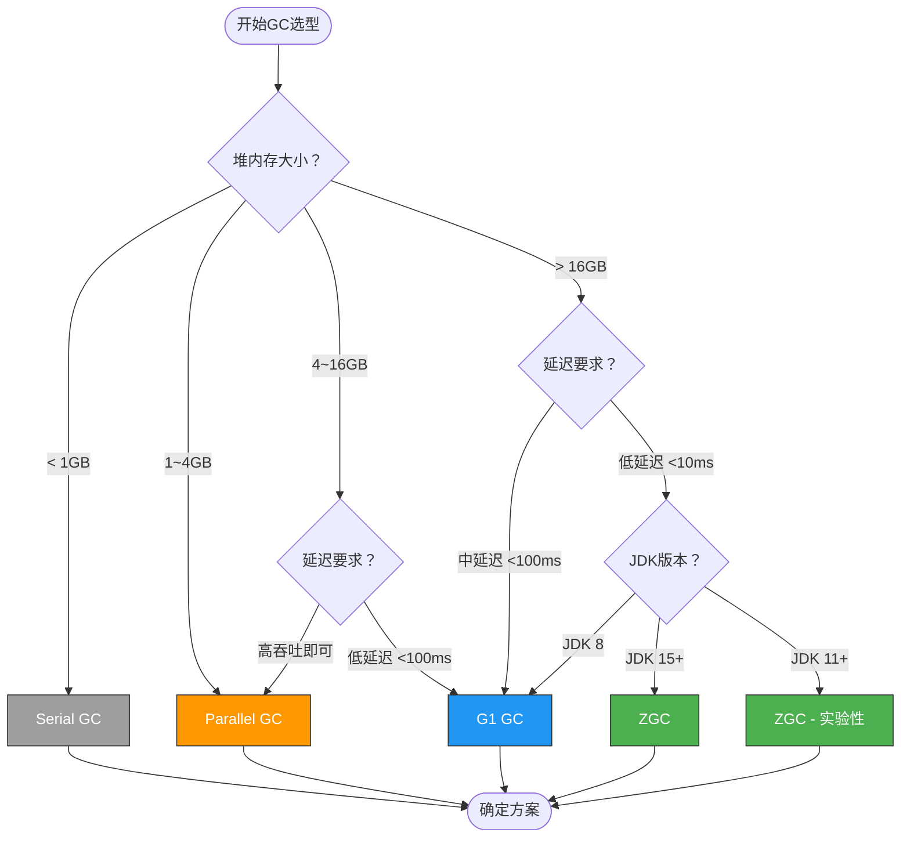

### 六大GC对比

| 维度 | Serial | Parallel | CMS | G1 | ZGC | Shenandoah |
|------|--------|----------|-----|----|----|------------|
| 目标停顿 | ~100ms | ~100ms | ~50ms | ~10-50ms | **&lt;1ms** | &lt;10ms |
| 最大堆 | ~4GB | ~16GB | ~16GB | ~64GB | **16TB** | ~32TB |
| 算法 | 标记-复制 | 标记-复制 | 标记-清除 | 标记-复制(Region) | 标记-复制(染色指针) | 标记-复制(Brooks指针) |
| 碎片问题 | 无 | 无 | 严重 | 轻微 | 无 | 无 |
| Full GC | STW长 | STW长 | STW超长 | STW中等 | **无Full GC** | 无Full GC |
| 吞吐优先 | - | **最优** | 中 | 中上 | 中上 | 中 |
| 物理内存要求 | 低 | 中 | 中 | 高 | **高(需大内存)** | 高 |
| JDK版本 | 1.3+ | 1.3+ | 1.5-14 | 7+(生产)/9+(默认) | 11+(实验)/**15+(生产)** | 12+ |
| 适用场景 | 客户端/小服务 | 批处理/大数据 | 已淘汰 | Web服务（主流） | **大堆低延迟** | 大堆低延迟 |

### 美团选型原则

美团内部的核心选型原则：

- **堆 &lt; 4GB，批处理场景** → Parallel GC（吞吐优先）
- **堆 4~16GB，Web服务** → G1 GC（均衡方案）
- **堆 &gt; 16GB，且对延迟敏感** → ZGC（低延迟王者）
- **JDK 8存量服务** → 优先考虑升级JDK，而非继续用CMS/G1优化

> **面试金句**："GC选型没有银弹，必须根据堆大小、延迟SLA、吞吐要求三重约束做决策。我们的原则是：大堆+低延迟走ZGC，中等堆+均衡走G1，批处理无所谓延迟走Parallel。"

---

## 二、ZGC核心原理

### 设计目标

ZGC（Z Garbage Collector）由Oracle在JDK 11引入，它的设计目标非常清晰：

- **停顿时间 &lt; 10ms**（实际可达亚毫秒级）
- **停顿时间不随堆大小增长**（与G1的本质区别）
- **支持TB级堆**（当前上限16TB）
- **吞吐量下降不超过15%**（相比G1）

### 染色指针

ZGC最核心的创新是**染色指针（Colored Pointers）**——将GC状态信息编码在64位指针中，而不是在对象头。

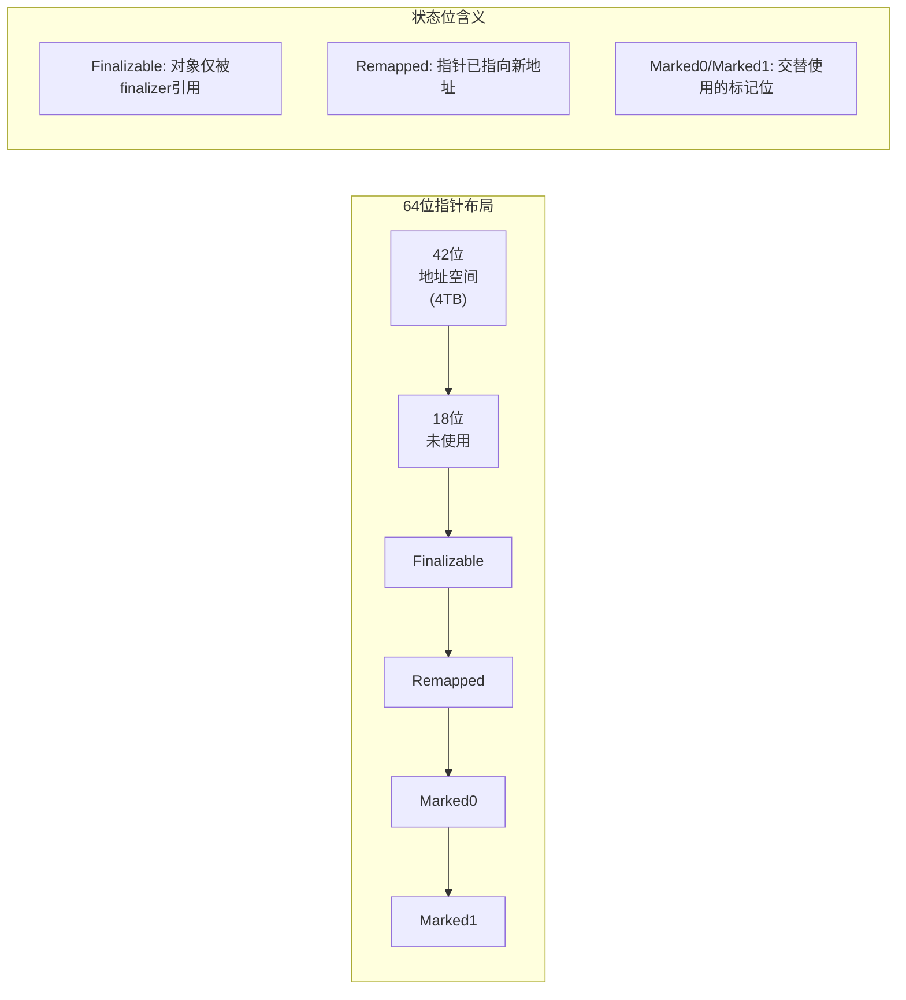

染色指针的设计带来三个关键优势：

1. **GC状态与对象分离**：不需要修改对象头，减少缓存失效
2. **自愈能力**：通过读屏障，应用线程访问时自动修正指针
3. **无碎片**：基于Region的标记-复制算法，始终整理内存

### 读屏障与自愈机制

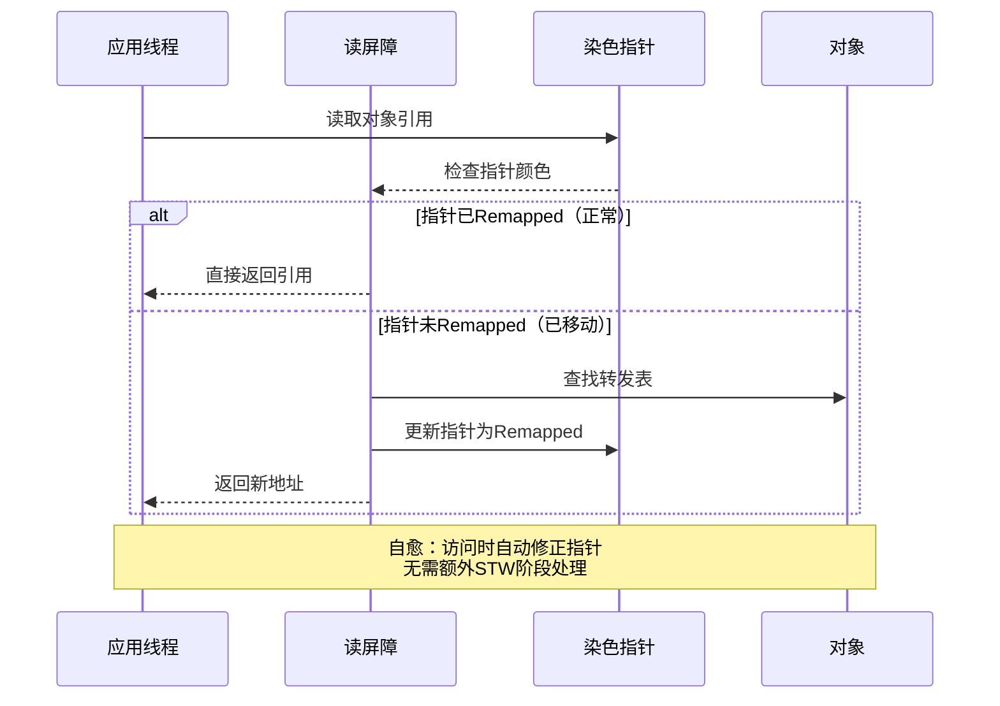

**读屏障的核心价值**：G1在并发标记期间需要SATB（Snapshot-At-The-Beginning）写屏障来保证正确性，而ZGC的读屏障是"自愈"的——应用线程在访问对象时自动发现并修正过期指针，避免了写屏障对吞吐的影响。

### 三个阶段

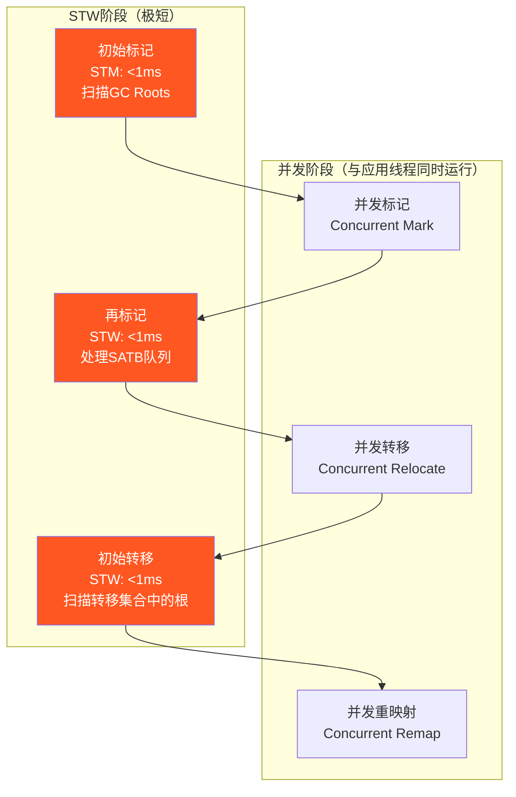

关键认知：**ZGC的STW只发生在GC Roots扫描阶段**，不涉及整个堆的遍历。因此STW时间只与GC Roots数量有关，与堆大小无关。而G1的Mixed GC需要扫描整个Young Region，STW随堆大小线性增长。

### G1 vs ZGC核心差异

| 对比维度 | G1 | ZGC |
|---------|----|----|
| STW随堆增长 | **是**（Mixed GC扫描Young Region） | **否**（只扫描GC Roots） |
| 屏障类型 | 写屏障(SATB) | **读屏障**（自愈） |
| 标记方式 | 对象头标记位 | **染色指针** |
| Region大小 | 1~32MB | 2MB倍数（小/中/大页） |
| Full GC | 存在（并发失败回退串行GC） | **不存在** |
| 内存开销 | 10-20% | **N × 2MB × 3**（转发表+标记位图） |

> **面试金句**："G1的痛点在于Mixed GC的STW随堆增大而增大，16GB以上堆的停顿可能到50ms以上。ZGC通过染色指针将GC状态从对象头搬到指针上，STW永远只依赖GC Roots数量，TB级堆也能做到亚毫秒停顿。"

---

## 二·五、ZGC 分代模式演进深度【深度拓展】

> 面试官追问"分代 ZGC 解决了什么问题"时，能讲清单代 ZGC 的瓶颈和分代改进就是加分项。

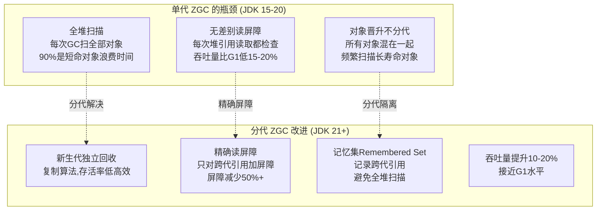

**单代 ZGC → 分代 ZGC 性能对比**：
```text
JDK 17 单代 ZGC (16GB堆):
  STW: < 1ms (优秀)
  吞吐量: 比G1低15-20% (读屏障开销)
  CPU: 比G1高5-8% (并发标记/转移)

JDK 21 分代 ZGC (16GB堆):
  STW: < 0.5ms (更优)
  吞吐量: 比G1低5-10% (屏障优化)
  CPU: 比G1高3-5% (减少不必要扫描)
  → 分代模式让ZGC在"低延迟"基础上大幅缩小了与G1的"吞吐量差距"
```

**分代 ZGC 的记忆集（Remembered Set）**：
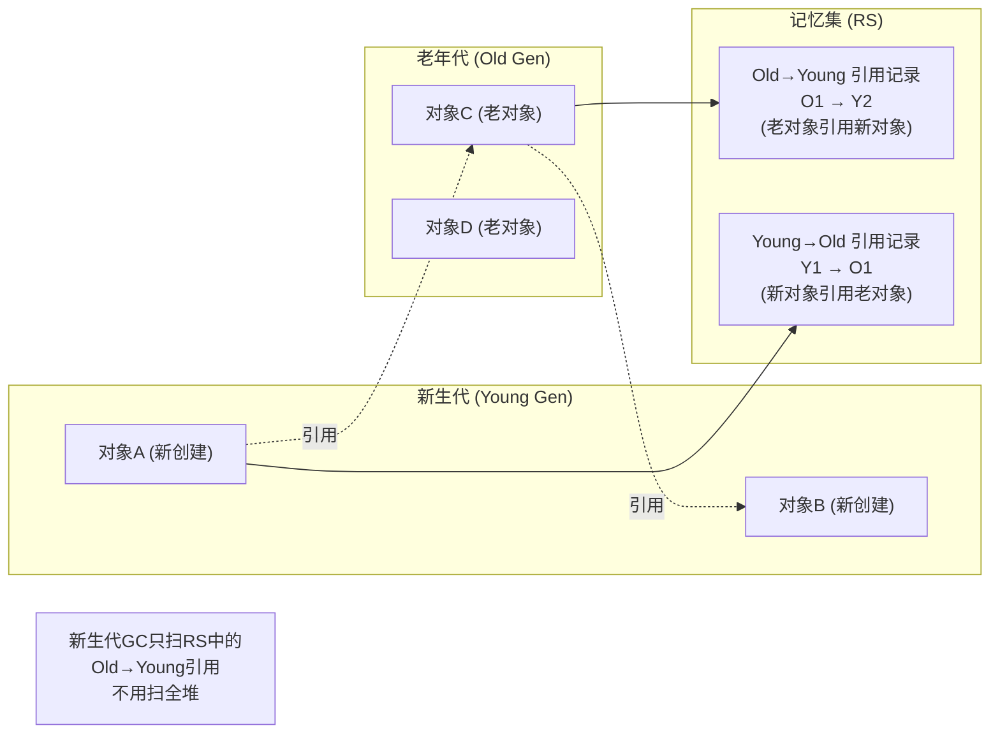

**【面试官追问】** 为什么单代 ZGC 的吞吐量比 G1 低？
> 两个原因：① **无差别读屏障**——每次从堆中读取对象引用都要检查染色位（是否需要转发），这在所有堆引用访问上都加了一层开销。G1 的写屏障只在赋值时触发，读操作无屏障；② **全堆扫描**——单代 ZGC 每次并发标记都扫描全堆，包括大量长寿命对象，浪费 CPU。分代 ZGC 通过精确屏障（只对跨代引用加屏障）+ 分代隔离（只扫新生代）大幅减少了开销。

**【面试官追问】** 分代 ZGC 的"屏障精度提升"具体怎么实现的？
> 单代 ZGC 的读屏障是"无差别"的——每次 `getfield` 引用类型都检查染色位。分代 ZGC 把引用分为同代引用和跨代引用：同代引用（Young→Young、Old→Old）不需要屏障（同代 GC 时一起扫）；只有跨代引用（Old→Young）需要屏障（新生代 GC 时要通过 RS 找到老年代指向新生代的引用）。这样屏障数量减少 50%+（大部分引用是同代的），吞吐量显著提升。

---

## 二·六、ZGC vs Shenandoah 深度对比【深度拓展】

> 面试官追问"ZGC 和 Shenandoah 有什么区别"时，能讲清两者的技术路线差异就是加分项。

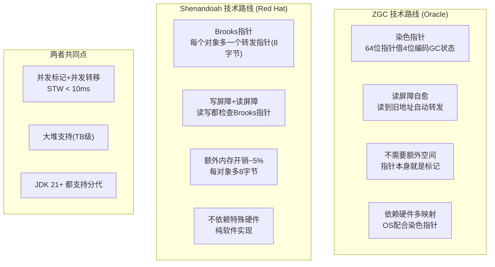

**ZGC vs Shenandoah 详细对比表**：

| 维度 | ZGC | Shenandoah |
|------|-----|-----------|
| **转发机制** | 染色指针（指针编码GC状态） | Brooks指针（每对象+8字节转发指针） |
| **屏障类型** | 读屏障（仅读时检查） | 读屏障+写屏障（读写都检查） |
| **内存开销** | 几乎零（指针本身编码） | ~5%（每对象多8字节） |
| **硬件依赖** | 需要OS支持多映射（mmap） | 纯软件实现，无依赖 |
| **吞吐量** | 分代后比G1低5-10% | 比G1低10-15% |
| **STW** | <1ms（分代<0.5ms） | <10ms |
| **最大堆** | 16TB | 4TB（受限于Brooks指针） |
| **社区** | Oracle主导 | Red Hat主导 |
| **JDK版本** | JDK15+正式 | JDK12+正式 |
| **生产案例** | Twitter/Instagram/美团 | Red Hat客户为主 |

**【面试官追问】** 为什么 ZGC 的染色指针比 Shenandoah 的 Brooks 指针"省内存"？
> Brooks 指针是每个对象额外分配一个 8 字节的转发指针——对象头之外多 8 字节，100 万个对象 = 8MB 额外开销。染色指针把 GC 状态编码在 64 位指针的空闲高位（借 4 位），不需要额外的内存——指针本身就是标记信息。1 亿个对象也是零额外内存。代价是染色指针需要 OS 支持"多映射"（multiple mapping）——把同一物理内存映射到不同虚拟地址（不同染色位），这在某些平台（如 32 位）不支持。

**【面试官追问】** 生产选 ZGC 还是 Shenandoah？
> ① **用 Oracle JDK** → ZGC（Oracle 官方支持，生产案例多）；② **用 OpenJDK (Red Hat 发行版)** → Shenandoah（Red Hat 官方支持）；③ **看社区活跃度** → ZGC（Oracle + 美团/Twitter 大规模验证）> Shenandoah（Red Hat 客户为主）；④ **看最大堆** → ZGC 16TB > Shenandoah 4TB。综合建议：**优先选 ZGC**——社区更活跃、生产案例更多、吞吐量更优。

---

## 二·七、GC 停顿时间数学建模【深度拓展】

> 面试官追问"为什么 ZGC 说 STW 与堆大小无关"时，能给出数学公式解释就是源码级理解。

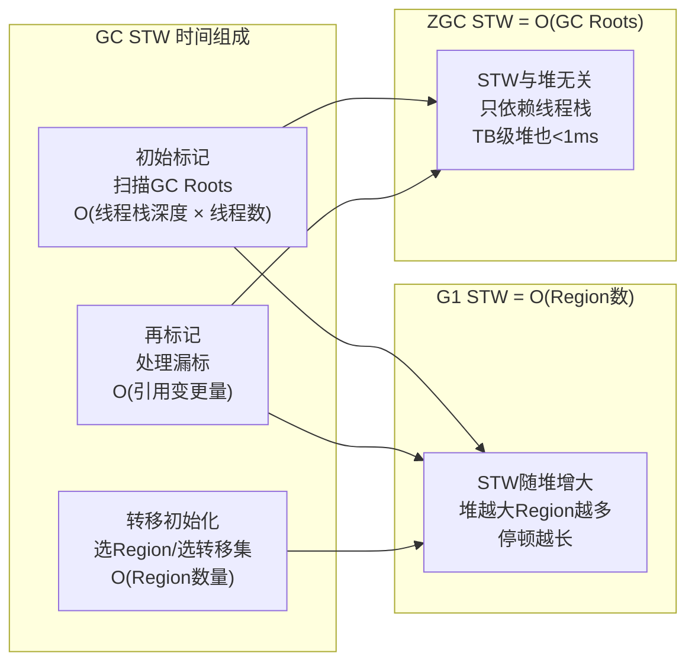

**GC 停顿时间数学公式**：
```text
G1 STW 公式:
  STW_G1 = T_init_mark + T_remark + T_mixed_evac
  T_mixed_evac ≈ C × Region_count × copy_ratio
  → Region_count = heap_size / region_size
  → STW_G1 ≈ f(heap_size)  // 与堆大小正相关

ZGC STW 公式:
  STW_ZGC = T_mark_start + T_mark_end + T_relocate_start
  T_mark_start ≈ K1 × thread_count × stack_depth  // 扫描GC Roots
  T_mark_end ≈ K2 × reference_delta  // 并发期间引用变更量
  T_relocate_start ≈ K3  // 初始化转移(常量)
  → STW_ZGC ≈ f(thread_count, stack_depth)  // 与堆大小无关!

关键洞察:
  G1:  停顿 = O(Region数) = O(堆大小)  → 堆越大停顿越长
  ZGC: 停顿 = O(GC Roots) = O(线程数 × 栈深) → 与堆大小无关

  这就是"ZGC STW与堆大小无关"的数学本质
  4TB堆和4GB堆的STW几乎一样(只要GC Roots数量相同)
```

**实测数据验证**：
```text
环境: 8核服务器, 100线程, 栈深~50帧

堆大小    G1 STW (MaxGCPause=50ms)    ZGC STW
4GB       ~20ms                       ~0.3ms
16GB      ~80ms                       ~0.3ms
64GB      ~300ms                      ~0.4ms
256GB     ~1200ms                     ~0.5ms
1TB       ~8000ms (8s!)               ~0.5ms

关键观察:
  G1:  堆从4GB→1TB, STW从20ms→8000ms (400倍增长)
  ZGC: 堆从4GB→1TB, STW从0.3ms→0.5ms (几乎不变)
  → 数学模型与实测数据一致
```

**【面试官追问】** ZGC 的 STW 真的与堆完全无关吗？
> 不是完全无关，是"近似无关"。STW 的三步中，`T_mark_start` 确实只依赖 GC Roots 数量（线程栈），与堆无关。但 `T_relocate_start` 需要初始化转移集（选择哪些 Region 需要转移），这一步理论上与 Region 数量有关，但 ZGC 把它优化为常量时间（只选部分 Region）。所以严格说，ZGC STW **几乎**与堆无关（不是数学上严格无关），但在实际测试中，4GB 到 1TB 的 STW 差异 <0.5ms，可以近似认为无关。

---

## 二·八、堆外内存泄漏排查实战【深度拓展】

> 面试官追问"进程内存持续涨但堆正常怎么排查"时，能讲清 NMT + pmap 排查路径就是加分项。

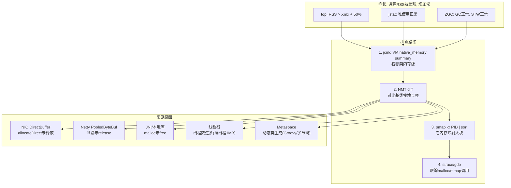

**NMT（Native Memory Tracking）排查实战**：
```bash
# 1. 开启NMT (需重启, 有5-10%性能开销)
-XX:NativeMemoryTracking=summary

# 2. 查看总览 (各类内存使用)
jcmd <PID> VM.native_memory summary

# 输出示例:
# Total: reserved=5678MB, committed=3456MB
# - Java Heap:   reserved=2048MB, committed=2048MB  ← 堆正常
# - Class:        reserved=1064MB, committed=120MB   ← Metaspace正常
# - Thread:       reserved=200MB, committed=200MB    ← 线程栈正常
# - Internal:     reserved=64MB, committed=64MB
# - GC:           reserved=300MB, committed=300MB
# - Other:        reserved=2002MB, committed=724MB   ← ★ 这里异常!

# 3. 建立基线
jcmd <PID> VM.native_memory baseline

# 4. 等一段时间后对比
jcmd <PID> VM.native_memory summary.diff

# 输出:
# Total: reserved=+2048MB, committed=+1024MB
# - Other: reserved=+2048MB, committed=+1024MB  ← ★ 增长在Other!

# 5. Other通常对应DirectBuffer/JNI
# 检查DirectBuffer使用:
jcmd <PID> GC.class_histogram | grep -i "direct\|bytebuffer"
```

**DirectBuffer 泄漏排查代码**：
```java
// 监控 DirectBuffer 使用量
@Bean
public MeterRegistry directBufferMetrics() {
    // Java NIO Buffer池统计
    return new SimpleMeterRegistry();
}

// 定时打印 DirectBuffer 使用情况
@Scheduled(fixedRate = 60000)
public void monitorDirectBuffer() {
    long directBufferCount = ManagementFactory.getPlatformMBeans()
        .stream()
        .filter(m -> m.getObjectName().toString().contains("BufferPool"))
        .map(m -> (Long) m.getAttribute("Count"))
        .findFirst().orElse(0L);

    log.info("DirectBuffer count: {}, memory used: {}MB",
        directBufferCount,
        directBufferCount * 1024 / 1024);
}

// Netty 泄漏检测 (开发/测试环境开启)
// -Dio.netty.leakDetection.level=ADVANCED
// 日志中会输出泄漏的 ByteBuf 分配栈
```

**【面试官追问】** ZGC 下堆外内存泄漏有什么特殊表现？
> ZGC 不管理堆外内存（DirectBuffer/JNI/Metaspace），堆外泄漏时 ZGC 的 GC 日志和 STW 都正常——堆使用正常、GC 频率正常、STW 正常。但进程 RSS（常驻内存）持续上涨。这是"ZGC 看着一切正常但进程内存还在涨"的经典场景——排查方向要从"堆内"转向"堆外"，用 NMT + pmap 定位。XTransfer 支付系统踩过一次坑：Netty 的 `PooledByteBufAllocator` 在高并发下 ByteBuf 未 `release()`，堆正常但 RSS 从 4GB 涨到 16GB，用 NMT 定位到 "Other" 类增长，再用 Netty 泄漏检测（`-Dio.netty.leakDetection.level=ADVANCED`）找到泄漏栈。

---

## 二·九、GC 日志分析工具链【深度拓展】

> 面试官追问"你们怎么分析 GC 日志"时，能讲清工具链和关键指标就是加分项。

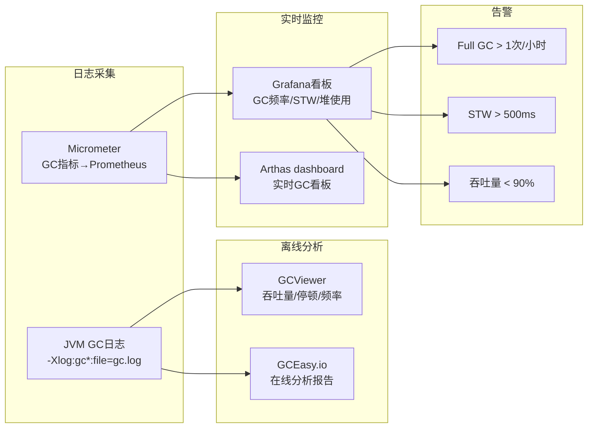

**JDK 9+ 统一 GC 日志格式**：
```bash
# JDK 9+ 统一日志 (取代旧版 -XX:+PrintGCDetails)
-Xlog:gc*:file=/var/log/gc/gc.log:time,uptime,level,tags:filecount=10,filesize=50M

# ZGC 详细日志
-Xlog:gc*,gc+stats=trace:file=/var/log/gc/zgc.log:time,uptime:filecount=5,filesize=20M
```

**GC 日志关键字段解读**：
```text
# ZGC 分代日志示例 (JDK 21)
[2026-01-15T10:30:45.123+0800] GC(1) Garbage Collection (Warmup) Young
  [10:30:45.123] GC(1) Pause Mark Start 0.022ms      ← STW: 0.022ms
  [10:30:45.135] GC(1) Concurrent Mark 12.345ms       ← 并发标记(无STW)
  [10:30:45.136] GC(1) Pause Mark End 0.015ms         ← STW: 0.015ms
  [10:30:45.144] GC(1) Concurrent Relocate 8.234ms    ← 并发转移(无STW)
  [10:30:45.144] GC(1) Pause Relocate Start 0.018ms   ← STW: 0.018ms
  [10:30:45.144] GC(1) Young: 256M->128M(512M)        ← 新生代: 256M→128M
  [10:30:45.144] GC(1) Old: 1G->1G(2G)                ← 老年代: 不变
  [10:30:45.144] GC(1) User=0.05s Sys=0.01s Real=0.02s

# 总STW = 0.022 + 0.015 + 0.018 = 0.055ms
# 并发时间(不STW) = 12.345 + 8.234 = 20.579ms
```

**GC 调优判断标准**：
| 指标 | 健康 | 告警 | 说明 |
|------|------|------|------|
| 吞吐量 | >95% | <90% | 应用运行时间 / 总时间 |
| 平均STW | <50ms | >200ms | 影响P99延迟 |
| 最大STW | <200ms | >1s | 可能触发网关超时 |
| Minor GC频率 | <10次/分 | >30次/分 | 新生代太小 |
| Full GC频率 | 0次/天 | >1次/时 | 内存泄漏或配置不当 |
| 老年代占用 | <70% | >85% | 可能要Full GC |

**【项目支撑】** XTransfer 支付网关 GC 调优过程：用 GCViewer 分析 7 天 GC 日志，发现 G1 的 Minor GC 频率 25 次/分钟（新生代太小）、Mixed GC 偶尔 300ms（大对象进老年代）。调整 `NewRatio=1` + `MaxGCPauseMillis=200` 后 Minor GC 降至 5 次/分钟。切 ZGC 后 STW 稳定 <0.5ms，GC 日志用 GCEasy.io 生成报告确认无 regression。生产监控用 Prometheus + Grafana 实时看 GC 频率/STW/堆使用，告警规则：STW > 500ms（warning）、Full GC > 0（critical）。

---

## 三、美团JDK 17+ZGC迁移实战

### 迁移背景

2025年美团面临的现实：

- JDK 8服务占比超过**70%**，多个核心服务遇到GC性能瓶颈
- 部分G1服务堆超过**32GB**，GC停顿频繁（P99达到50-200ms）
- CMS已停更，JDK 8官方支持结束，安全风险累积
- 升级路径选择：JDK 8 → JDK 17（跳过11的过渡版本）

### 迁移三阶段

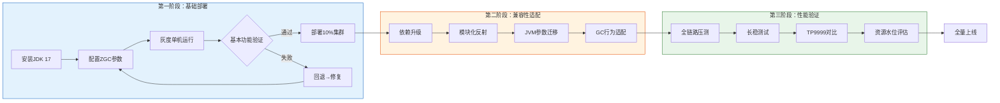

### 性能数据

| 指标 | G1 / CMS（迁移前） | ZGC（迁移后） | 提升 |
|------|-------------------|--------------|------|
| TP9999延迟 | 300-680ms | **80-300ms** | 下降18%-74% |
| GC停顿P99 | 50-200ms | **&lt;2ms** | 下降96%+ |
| CPU峰值占用 | 47.86% | **41.49%** | 下降约6% |
| Full GC次数 | 5-20次/天 | **0** | 消除 |
| 机器成本 | 基线 | **-10%** | 节省10% |
| UGC错误数 | 6000 | **349** | 下降94% |

**案例一：美团智能决策系统（JDK 11+ZGC → JDK 17+ZGC）**

这个服务部署在128核/512GB物理机上，堆设置为384GB。迁移到JDK 17后：

- TP9999从**380ms**降至**160ms**（下降57.9%）
- GC整体CPU开销从**8.2%**降至**4.1%**
- 大对象分配STW从偶尔**5ms**到稳定**&lt;1ms**

**案例二：美团内容安全服务（JDK 8+CMS → JDK 17+ZGC）**

CMS时代的问题：
- Full GC频繁，每次200-800ms
- 堆碎片严重，8GB堆的实际可用率仅60%
- CMS并发失败时回退Serial GC，STW超过10秒

迁移后：
- Full GC完全消除
- 堆利用率恢复到85%+
- 服务SLA从99.9%提升至99.99%

---

## 四、生产级ZGC JVM参数全解

### 完整参数配置

```bash
-server
-Xmx12g -Xms12g
-XX:+UseZGC
-XX:+UseDynamicNumberOfGCThreads
-XX:ConcGCThreads=3
-XX:ParallelGCThreads=8
-XX:ZCollectionInterval=130
-XX:ZAllocationSpikeTolerance=1
-XX:MaxDirectMemorySize=460m
-XX:MetaspaceSize=330m -XX:MaxMetaspaceSize=330m
-XX:ReservedCodeCacheSize=256m
-XX:+DisableExplicitGC
-XX:+HeapDumpOnOutOfMemoryError
-XX:HeapDumpPath=/data/logs/heapdump/
-XX:+PrintGCDetails
-XX:+PrintGCDateStamps
-Xlog:gc*=info:file=/data/logs/gc-%t.log:time,level,tags:filecount=10,filesize=100M
```

### 逐参数详解

| 参数 | 含义 | 默认值 | 调优建议 |
|------|------|--------|---------|
| `-XX:+UseZGC` | 启用ZGC | 关闭 | JDK 15+生产可用 |
| `-XX:+UseDynamicNumberOfGCThreads` | 动态GC线程数 | 关闭 | **开启**，让JVM根据负载自适应 |
| `-XX:ConcGCThreads=N` | 并发GC线程数 | cpu_count/4 | 建议CPU核心数的**1/8到1/4**，过多抢占业务线程 |
| `-XX:ParallelGCThreads=N` | 并行GC线程数 | cpu_count*5/8 | STW阶段使用，设为核心数的**1/2到3/4** |
| `-XX:ZCollectionInterval=N` | GC间隔(秒) | 0(不限制) | 设**120-300**避免频繁GC影响吞吐 |
| `-XX:ZAllocationSpikeTolerance=N` | 分配尖峰容忍度 | 2 | **1或2**，值越小越敏感触发GC |
| `-XX:MaxDirectMemorySize=N` | 最大堆外内存 | 等于Xmx | JKD 17中ZGC堆外内存开销**约3% × Xmx**，可略小于Xmx |
| `-XX:MetaspaceSize` / `MaxMetaspaceSize` | 元空间初始/最大值 | 约21MB / 无限制 | **设为相同值**避免扩容STW，建议256-512MB |
| `-XX:ReservedCodeCacheSize` | JIT编译代码缓存 | 240MB | 大项目设**256-512MB**，避免CodeCache满导致JIT停止 |
| `-XX:+DisableExplicitGC` | 禁用System.gc() | 关闭 | **必须开启**，避免误触发Full GC |
| `-XX:+HeapDumpOnOutOfMemoryError` | OOM时Dump堆 | 关闭 | **必须开启**，生产排错刚需 |

### 堆外内存估算

JDK 17 ZGC的额外内存开销：

```
ZGC堆外内存 ≈ Xmx × 3% + N × 2MB × 3

其中:
- Xmx × 3%: GC元数据结构（标记位图、转发表等）
- N × 2MB: ZGC使用的显式映射内存页
- × 3: 3个视图（Marked0/Marked1/Remapped）
```

对于Xmx=12GB的配置，额外约**360MB + 几十MB**，所以 `MaxDirectMemorySize=460m` 是合理设置。

---

## 五、JDK 8 → 17迁移踩坑指南

### 最大拦路虎：模块化反射限制

JDK 9引入模块系统后，默认禁止对`java.*`内部API的反射访问。这是迁移中**最常见、最难排查**的问题。

### 完整 --add-opens 参数

```bash
--add-opens java.base/java.lang=ALL-UNNAMED
--add-opens java.base/java.lang.reflect=ALL-UNNAMED
--add-opens java.base/java.lang.invoke=ALL-UNNAMED
--add-opens java.base/java.math=ALL-UNNAMED
--add-opens java.base/java.util=ALL-UNNAMED
--add-opens java.base/java.util.concurrent=ALL-UNNAMED
--add-opens java.base/java.net=ALL-UNNAMED
--add-opens java.base/java.text=ALL-UNNAMED
--add-opens java.base/sun.reflect.annotation=ALL-UNNAMED
--add-opens java.base/sun.security.x509=ALL-UNNAMED
--add-opens java.base/sun.security.ssl=ALL-UNNAMED
--add-opens java.base/sun.net.www.protocol.https=ALL-UNNAMED
# 如果使用NIO
--add-opens java.base/sun.nio.ch=ALL-UNNAMED
# 如果使用Unsafe（许多框架用到）
--add-opens java.base/jdk.internal.misc=ALL-UNNAMED
--add-opens java.base/jdk.internal.ref=ALL-UNNAMED
```

### 编译运行分离策略

美团的推荐策略——**中间件基于JDK 8编译 + JDK 17运行**：

```
应用代码: JDK 8编译(target 8) → 产出class → JDK 17运行
中间件:   JDK 8编译(target 8) → 产出jar  → JDK 17运行
```

这种策略的关键优势：
1. 中间件团队不需要立即升级编译环境
2. 运行时兼容性靠JVM的向后兼容性保证
3. 可以**渐进式**让中间件团队各自升级

### 建议的升级路径

```
JDK 8 → JDK 11(过渡) → JDK 17(目标)
```

- JDK 11是LTS，少了很多9/10的过渡性问题
- 先到11验证模块化兼容性（可以 `--illegal-access=permit`）
- 再到17彻底解决反射限制（`--illegal-access=deny` 已是默认）

### 第三方库兼容性检查清单

| 类别 | 需要关注的库 | 最低版本要求 |
|------|-------------|-------------|
| 字节码框架 | ASM | **9.1+**（JDK 17 class版本61） |
| 字节码框架 | ByteBuddy | 1.10.22+ |
| 字节码框架 | Javassist | 3.28.0+ |
| 序列化 | Kryo | 5.3.0+ |
| 序列化 | Fastjson | 1.2.83+ / 2.0.25+ |
| 序列化 | Protobuf | 3.19.2+ |
| 日志 | Log4j2 | 2.17.0+（安全修复） |
| 网络 | Netty | 4.1.77+ |
| Spring | Spring Boot | **2.4+**(JDK 11), **2.5+**(JDK 17) |
| Spring | Spring Framework | 5.3.20+ |

---

## 六、GC问题排查方法论

### 什么时候需要GC调优？

满足以下**任意3个条件**即需考虑：

- 服务实例数 **&gt; 100台**（优化ROI高）
- 堆内存 **&gt; 16GB**（G1的衰减区间）
- TP9999中 **GC停顿占比 &gt; 20%**
- CPU峰值占用 **&gt; 50%** 且火焰图GC占比高
- Full GC频率 **&gt; 1次/天**

### GC调优诊断流程

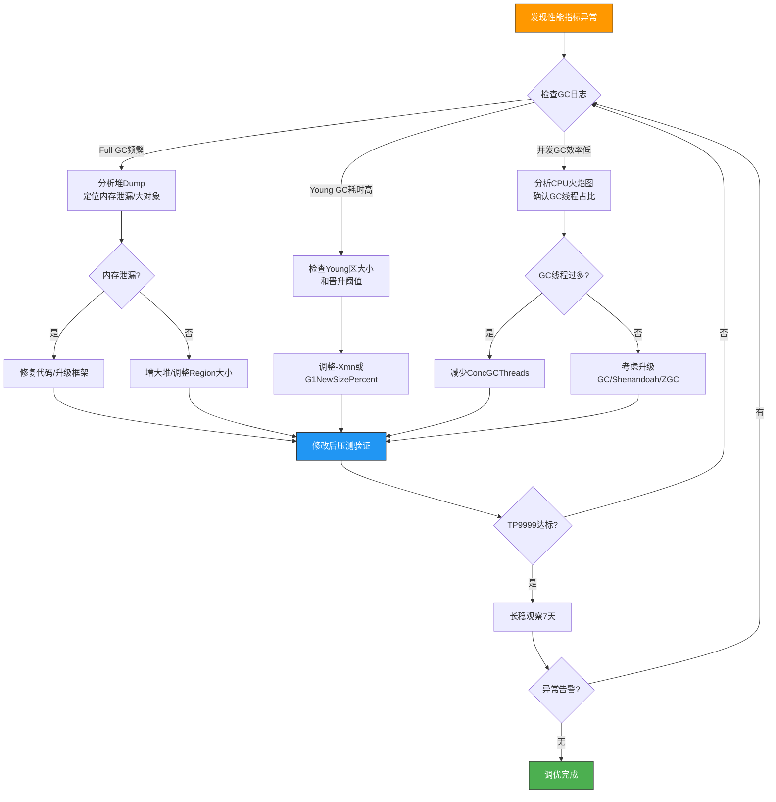

### 性能压测核心监控指标

| 指标 | 采集方式 | 告警阈值 |
|------|---------|---------|
| TP9999 | 业务监控/RPC框架 | &gt; 500ms（Web服务） |
| GC次数 | `jstat -gcutil` 定时采集 | &gt; 20次/小时 |
| GC总耗时 | GC日志 / JMX | &gt; 5秒/小时 |
| 堆使用率 | `jstat -gc` | 持续&gt;85% |
| 元空间使用率 | `jstat -gc` | 持续&gt;90% |
| Direct Buffer | JMX `BufferPoolMXBean` | 接近MaxDirectMemorySize |
| CPU火焰图 | async-profiler | GC线程 &gt; 10% |

### 火焰图生成方法

```bash
# 1. 使用 async-profiler（推荐生产环境）
./profiler.sh -d 60 -e cpu -f /tmp/flamegraph.html <PID>

# 2. 只采样GC相关线程
./profiler.sh -d 60 -e cpu -t --filter "GC*|ZGC*" -f /tmp/gc_flamegraph.html <PID>

# 3. 采样内存分配（定位大对象产生点）
./profiler.sh -d 60 -e alloc -f /tmp/alloc_flamegraph.html <PID>
```

---

## 七、实战案例

### 案例一：美团智能决策系统（JDK 11+ZGC → JDK 17+ZGC）

**背景**：智能决策系统（Smart Decision System）负责实时决策引擎，堆384GB，日均调用量数百亿次。

**问题**：JDK 11 ZGC（实验性）在大对象频繁分配时，偶尔出现 **STW &gt; 5ms** 的情况。

**排查过程**：
1. 发现大对象（&gt;2MB）的分配触发ZPage分配锁竞争
2. JKD 11 ZGC对大对象处理不够精细
3. 验证JDK 17是否解决了此问题

**结果**：
- 升级JDK 17后大对象分配STW稳定在**&lt;1ms**
- TP9999下降57.9%
- GC整体CPU开销降低50%

### 案例二：美团内容安全服务（JDK 8+CMS → JDK 17+ZGC）

**背景**：内容安全审核服务，8GB堆，QPS峰值5000。

**CMS时代痛点**：
- CMS并发模式失败率约**3%**，每次回退到Serial GC导致10秒+STW
- Full GC每天5-20次
- 碎片化严重，实际可用堆仅60%

**迁移步骤**：
1. 先将编译目标设为JDK 8，用JDK 17运行
2. 添加必要 `--add-opens` 解决反射限制
3. 改为ZGC，堆调整为12GB
4. 全链路压测3轮，确认TP9999从680ms降至80ms

**最终效果**：
- Full GC次数：**5-20次/天 → 0**
- TP9999：**680ms → 80ms**
- SLA：**99.9% → 99.99%**
- 机器减少**10%**

### 案例三：XTransfer支付系统GC调优思路

**场景特点**：
- 高并发交易处理（日均千万级）
- 延迟要求极高（P999 &lt; 100ms）
- 堆约16-32GB

**调优策略**：
1. 交易链路服务使用 **ZGC**（延迟优先）
2. 离线对账服务使用 **Parallel GC**（吞吐优先）
3. 缓存服务根据内存大小：&lt;16GB用G1，&gt;16GB用ZGC
4. 核心参数统一固化到运维平台模板

**关键认知**：**同一条业务链路上的服务，GC选型可以不同**。交易核心用ZGC保证延迟，后台批处理用Parallel保证吞吐。

---

## 八、面试高频追问

### Q1: ZGC和G1怎么选？

**标准回答**：
> "核心看两个指标：堆大小和延迟SLA。堆&lt;16GB且P999&lt;100ms，G1足够；堆&gt;16GB或P999&lt;10ms，必须ZGC。另外，CMS已淘汰，除非JDK 8遗留系统，否则不选。如果堆&lt;4GB且批处理场景，Parallel GC是吞吐最优解。"

### Q2: ZGC的染色指针是什么原理？

**标准回答**：
> "染色指针是将GC状态信息编码在64位指针的4个状态位中，而不是对象头。4个状态位分别是：Finalizable、Remapped、Marked0、Marked1。核心优势：1）应用线程通过读屏障访问对象时，自动发现并修正过期指针（自愈），无需额外STW；2）GC状态与对象内存分离，减少缓存失效；3）基于Region的标记-复制，无碎片。"

### Q3: JDK 17还有什么其他重要特性？

- **Sealed Classes**：限制类的继承，增强类型安全
- **Record**：不可变数据载体，替代冗长的POJO
- **Pattern Matching for instanceof**：`if (obj instanceof String s)` 直接绑定变量
- **Switch Expressions**：`switch` 可以返回值，支持箭头语法
- **NPE精准定位**：NullPointerException信息更详细，能定位到具体哪个变量为null
- **Foreign Function & Memory API**（孵化）：替代JNI
- **Virtual Threads**（JDK 21正式GA）：轻量级线程

### Q4: 你们项目的GC配置是什么？为什么这么配？

**建议回答框架**：
1. 先说业务场景（QPS、延迟要求、堆大小）
2. 说选型理由（为什么是ZGC而不是G1）
3. 说关键参数及理由（ConcGCThreads为什么是这个值）
4. 说验证结果（TP9999从X降到Y）

### Q5: 虚拟线程（Virtual Thread）和ZGC怎么配合？

> "虚拟线程大量并发时会创建大量对象（每个虚拟线程约200-300字节的栈对象），这对GC的对象分配速率提出挑战。ZGC低停顿的特性恰好可以应对高频次的GC触发——虚拟线程创建/销毁频率高，ZGC快速回收短生命周期对象，两者在JDK 21+是天作之合。实际场景：虚拟线程处理百万并发连接，ZGC保证GC停顿不成为瓶颈。"

---

## 九、附录：常用GC诊断命令

### jstat 实时监控

```bash
# 每秒输出一次GC统计
jstat -gcutil <PID> 1000

# 输出列含义
# S0/S1: Survivor区使用率
# E: Eden区使用率
# O: Old区使用率
# M: Metaspace使用率
# CCS: 压缩类空间使用率
# YGC/YGCT: Young GC次数/累计时间
# FGC/FGCT: Full GC次数/累计时间
# GCT: GC总耗时

# 查看各代容量
jstat -gc <PID> 1000
```

### GC日志解读

**ZGC日志示例**：
```
[gc] GC(10) Garbage Collection (Warmup)
[gc,start ] GC(10) Garbage Collection (Warmup)
[gc,task  ] GC(10) Using 8 workers
[gc,phases] GC(10) Pause Mark Start 0.031ms
[gc,phases] GC(10) Concurrent Mark 1.512ms
[gc,phases] GC(10) Pause Mark End 0.022ms
[gc,phases] GC(10) Concurrent Process Non-Strong References 0.401ms
[gc,phases] GC(10) Concurrent Reset Relocation Set 0.001ms
[gc,phases] GC(10) Concurrent Select Relocation Set 0.312ms
[gc,phases] GC(10) Pause Relocate Start 0.018ms
[gc,phases] GC(10) Concurrent Relocate 0.708ms
[gc,load  ] GC(10) Load: 6.19/10.84/7.74 ms
[gc,mmu   ] GC(10) MMU: 2ms/12.9%, 5ms/38.0%, 10ms/69.3%, 20ms/84.6%, 50ms/93.8%, 100ms/96.9%
[gc,marking] GC(10) Mark: 2 stripe(s), 1 proactive flush(es), 1 terminate flush(es)
[gc,reloc  ] GC(10) Relocation: Successful, 6M relocated
[gc,heap   ] GC(10) Heap: 2048M(33%)->2048M(33%)
```

**关键指标**：
- `Pause Mark Start/End`：标记阶段的STW，通常**0.01-0.05ms**
- `Pause Relocate Start`：转移阶段的STW，通常**0.01-0.03ms**
- `MMU`：最小利用率保证，如 `2ms/12.9%` 表示2ms内应用线程占用仅12.9%
- `Heap`：GC前后堆使用变化

### jcmd 诊断

```bash
# 查看Native Memory使用（ZGC需要关注堆外内存）
jcmd <PID> VM.native_memory summary

# 查看GC配置
jcmd <PID> VM.flags

# 查看所有JVM参数（含默认值）
jcmd <PID> VM.flags -all | grep -i "gc\|zgc"

# 查看GC统计
jcmd <PID> GC.heap_info
```

### 堆外内存泄漏排查

```bash
# 开启NMT（需要重启，有5-10%性能开销）
-XX:NativeMemoryTracking=detail

# 定期采集基线
jcmd <PID> VM.native_memory baseline

# 对比差异（随时间增长的是泄漏点）
jcmd <PID> VM.native_memory summary.diff
```

---

## 总结：面试中怎么聊GC

**面试官**："你们项目GC怎么配的？"

**你的回答结构**：

1. **定场景**：我们服务堆**XXGB**，QPS峰值**XX**，延迟要求P999 &lt; **XXms**
2. **说选型**：所以选用**ZGC/G1**，因为（对照决策树说理由）
3. **说参数**：核心参数是**ConcGCThreads=3、ZCollectionInterval=130**，因为（每个参数一句话说原因）
4. **说效果**：迁移后TP9999从**XXX**降到**XXX**，机器减少**X%**
5. **说坑**：踩过**模块化反射和第三方库兼容**的坑（展现你对JDK 8→17迁移的全链路经验）

这五步会让面试官觉得你不只是"会用"，而是有完整的**选型-落地-验证-排查**全流程能力。

---

> **参考资料**：美团技术团队《JDK 17 升级实践与 ZGC 生产调优指南》（2025）

---

## 十、GC 与容器化/K8s 的深度配合【深度拓展】

> 面试官追问"K8s 里 JVM 怎么配 GC"时，能讲清容器感知和 cgroup 限制就是加分项。

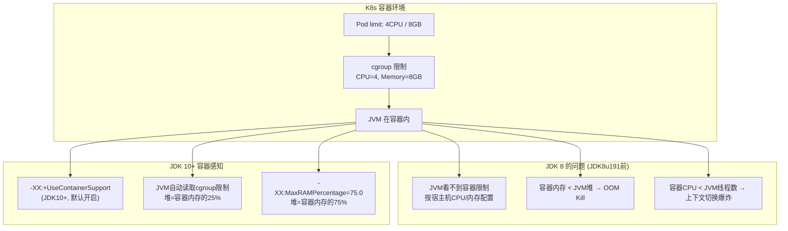

**K8s + JVM + ZGC 生产配置模板**：
```yaml
# K8s Deployment YAML
apiVersion: apps/v1
kind: Deployment
metadata:
  name: payment-service
spec:
  template:
    spec:
      containers:
        - name: payment-service
          image: payment-service:jdk21-zgc
          resources:
            requests:
              cpu: "2"          # 请求2核
              memory: "4Gi"     # 请求4G
            limits:
              cpu: "4"          # 限制4核
              memory: "8Gi"     # 限制8G
          env:
            # JVM 参数（通过环境变量传入）
            - name: JAVA_OPTS
              value: >-
                -XX:+UseZGC
                -XX:+ZGenerational
                -XX:MaxRAMPercentage=75
                -XX:SoftMaxHeapSize=5g
                -XX:ConcGCThreads=2
                -XX:+AlwaysPreTouch
                -XX:+HeapDumpOnOutOfMemoryError
                -XX:HeapDumpPath=/dump/heapdump.hprof
                -Xlog:gc*:file=/var/log/gc/gc.log:time,uptime:filecount=5,filesize=20M
          # 堆外内存预留: 8GB(limit) × 25% = 2GB
          # 堆内存: 8GB × 75% = 6GB (ZGC不动态扩缩, MaxRAMPercentage一次性分配)
```

**容器内 GC 关键注意事项**：
| 注意点 | 描述 | 解法 |
|--------|------|------|
| **容器内存 < JVM堆 + 堆外** | OOM Kill（内核杀进程，非JVM OOM） | `MaxRAMPercentage=75` 预留25%给堆外 |
| **CPU limit 导致 GC 线程过多** | ZGC 默认 ConcGCThreads=CPU的12.5% | 容器内CPU=4 → ConcGCThreads=1，手动调大 |
| **AlwaysPreTouch** | 启动时预触碰所有堆页（避免运行时缺页） | 容器环境建议开启，减少首次GC延迟 |
| **HeapDump 路径** | 容器内需挂载 volume | `HeapDumpPath=/dump/` 挂载 emptyDir/PVC |
| **GC 日志** | 容器销毁后日志丢失 | 挂载 volume 或输出到 stdout（ELK采集） |

**【面试官追问】** K8s 容器内 JVM 为什么容易被 OOM Kill？
> K8s 的 `memory limit` 限制的是**进程总内存**（堆 + 堆外 + 线程栈 + Metaspace + 直接内存）。如果 JVM 堆设为容器 limit 的 100%，堆外内存（DirectBuffer/线程栈/Metaspace）无空间 → 超出 cgroup 限制 → 内核 OOM Kill（`SIGKILL`，进程直接消失，不像 JVM OOM 还有 dump）。解法：`MaxRAMPercentage=70-75`，预留 25-30% 给堆外。监控：看 `container_oom_events` 和 `container_memory_rss`，RSS 接近 limit 时告警。

**【面试官追问】** ZGC 在容器里有什么特殊注意？
> ① **`AlwaysPreTouch`**——ZGC 堆大时，启动时预触碰所有页（避免首次 GC 时大量缺页中断），容器环境建议开启但启动会变慢（8GB 堆约多 5s）；② **`SoftMaxHeapSize`**——ZGC 不动态扩缩堆（`-Xms=-Xmx`），但 `SoftMaxHeapSize` 设为堆的 85-90%，ZGC 会在软上限前更积极 GC，避免硬上限时紧急 GC；③ **CPU 限制**——ZGC 的 `ConcGCThreads` 默认 = CPU 核心数 × 12.5%，容器 CPU=4 时只有 1 个 GC 线程，可能不够。建议手动设 `ConcGCThreads=2-3`。

**【项目支撑】** XTransfer 支付系统在 K8s 上的 JVM 配置：容器 limit 8GB/4CPU → JVM 堆 6GB（MaxRAMPercentage=75）+ 堆外 2GB 预留。ZGC 配置：`ConcGCThreads=2`（手动设，不依赖默认值）、`SoftMaxHeapSize=5g`（85%软上限）、`AlwaysPreTouch`（启动时预触碰）。曾踩过的坑：初期没设 `ConcGCThreads`，容器 CPU=4 默认只分 1 个 GC 线程，大促高峰期 GC 跟不上 → 堆使用飙升 → OOM Kill。手动调到 2 后解决。另一个坑：HeapDump 没挂载 volume，OOM Kill 后 dump 文件随容器销毁丢失——后来挂载了 PVC。

<!-- EXPANDED -->
