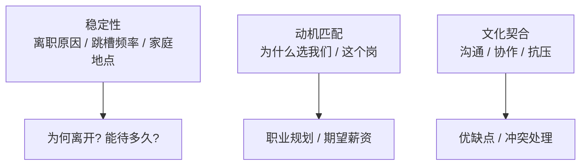
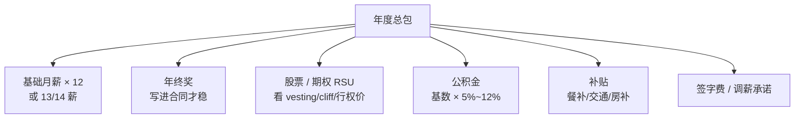
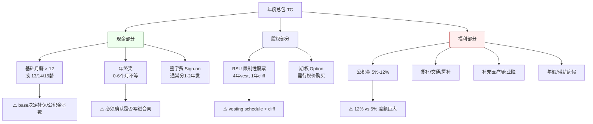
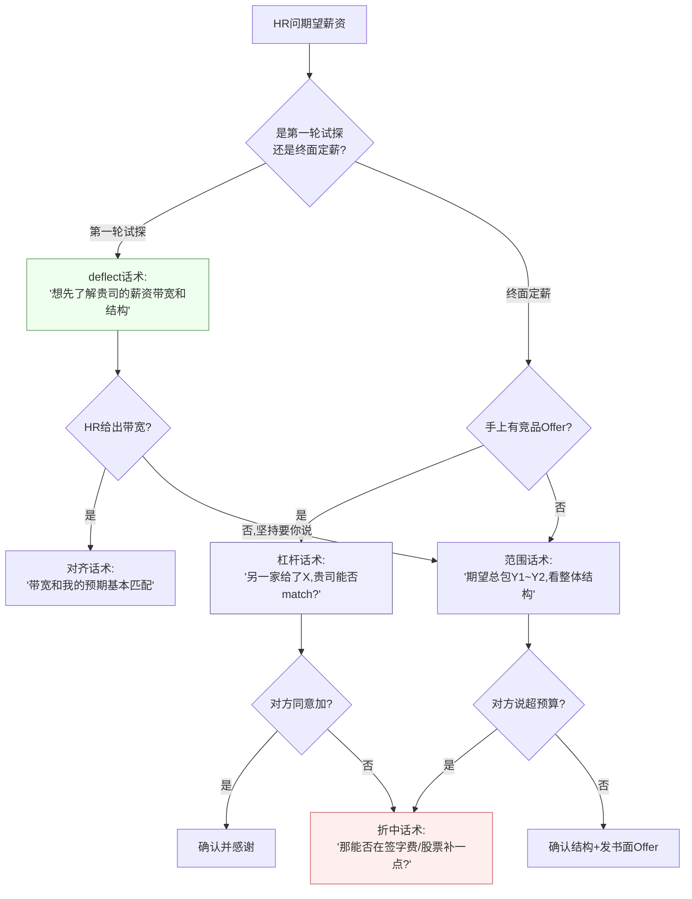
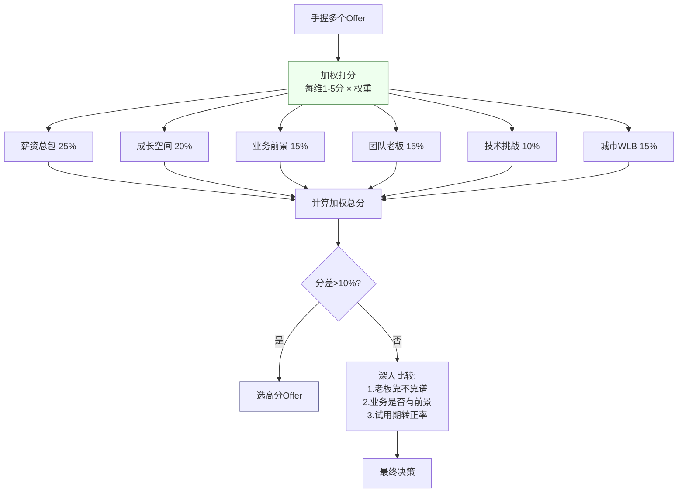

> 这是本博客最初的主题——**面试前的准备、面试中的反馈、面试后 Offer 的选择**。技术面决定"进不进得去"，HR 面与谈薪决定"去不去得成、去得值不值"。很多人技术面满分，却栽在"期望薪资说个数字把自己卖便宜了"或"离职原因一句话踩雷"。这篇把行为面 + 谈薪 + Offer 选择一次讲透。

## 一、先搞懂 HR 面的本质

> HR 面筛选的不是技术，是"**这人稳不稳定、会不会来、来了待得住**"。三个关注点，对应三类问题。



HR 面筛的不是技术，是三件事：**稳定性、动机、文化匹配**。

- **稳定性**：你干得长不长？频繁跳槽（<1 年）是大忌。
- **动机**：你为什么来？是奔着业务/成长，还是只因为钱？
- **匹配**：你的预期（薪资/职级/地点）和公司能不能对上，对不上白搭。

**核心心法**：HR 不是考官，是"帮你完成 KPI 的合作伙伴"。他最想要的是"合适的人"，不是"最便宜的人"。所以开诚布公地谈，比躲避或讨好更有效。

## 二、HR 高频题标准话术（考察点 + 怎么答）

### Q1：请做个自我介绍（90% 开场）
- **考察点**：表达概括能力、抓重点。
- **标准回答**：30 秒结构——「经验年限 + 技术方向 + 一个量化亮点」。
- **我的版本**：「我有 X 年 Java 后端经验，主要做跨境支付与高并发交易系统；最近在 XTransfer 主导跨境收款平台重构，资金成功率 99.2%、实现 0 资损；擅长把复杂的资金流用状态机 + 事件驱动做成可观测、可补偿的管道。」（技术面用技术版，HR 面用更"人话"的版本）

### Q2：你的优缺点是什么？
- **考察点**：自我认知、是否影响岗位。
- **答法**：优点贴岗位（严谨/抗压/owner 意识），用事例佐证；缺点说"真实但可改进、且不致命"的，并讲**改进动作**。
- **我的版本**：「优点是偏 owner、对资金安全有洁癖（举 0 资损例子）；缺点是早期不爱授权、什么都自己上，后来在带人过程中有意识地把任务拆细、定标准，团队吞吐量上来了。」（缺点 + 改进，体现成长）

**【深度拓展】** 优缺点题的底层逻辑是「**自我认知 + 风险可控**」。好的缺点必须满足：真实存在、正在改进、且**不触及岗位红线**。资金/支付岗的红线是「粗心、推诿、情绪化」，所以缺点绝不能选这些。进阶做法是把缺点包装成「过度优点」——「对资金安全有洁癖导致有时过度 review」，既诚实又不减分。HR 还会从你的缺点里看**自我改进力**：只说缺点不给改进动作，等于承认「我有问题但没打算改」。

**【项目支撑】** 我的缺点「早期不爱授权」是真实经历：在 XTransfer 做收款领域 Owner 时，前期习惯自己把核心链路（状态机/补偿）写完才放心，结果自己成瓶颈、团队成长慢。后来在带「预入账」从 0 到 1 时，刻意把任务拆细、定好接口标准和验收，让成员各自 owner 子模块，不仅交付更快，还带出了能独当一面的梯队——这正好把缺点变成了「有改进、有结果」的故事。

### Q3：你为什么离职？（最敏感）
- **考察点**：稳定性、离职动机是否健康。
- **雷区**：骂前公司/前老板、只说"钱少"、说"加班太多"。
- **标准回答**：用"发展/业务匹配"叙事，不否定过去。
- **我的版本**：「上一份在 XTransfer 把跨境收款核心做扎实了，下一步想找一个能把支付能力 + AI/出海结合得更深的平台，贵司的（业务/技术方向）正好和我想深耕的方向一致。」（肯定过去 + 指向未来，不踩雷）

**【深度拓展】** 离职原因的本质是「**判断你的稳定性与动机健康度**」。HR 真正怕的是三类人：裸辞迷茫型、负能量型（骂前司）、骑驴找马型（只看钱）。安全叙事的公式是「**肯定过去的价值 + 指出个人成长的边界 + 指向和新平台的契合**」，全程不否定任何人。进阶：把「离职」说成「**主动选择下一阶段**」而非「逃离」，语气越平静越可信。若是被裁/业务线砍，要诚实但聚焦「客观原因 + 我做了什么交接 + 反而看清了方向」，别遮掩（背调会露）。

**【项目支撑】** 我的叙事完全真实：XTransfer 4 年里我把收款领域从「散落 if/else」治理成「状态机+事件+补偿」的可演进架构，人效 +30%、生产问题 -80%、0 资损，并独立主导了预入账子领域——这已经是我在这段经历里能拿到的旗舰成果。下一步想找「支付能力 + 出海/AI 结合更深」的环境，是顺理成章的能力延伸，不是逃避。这套说法经得起「那你为什么不在 XTransfer 继续做」的追问（因为想换赛道纵深）。

### Q4：你的职业规划？
- **考察点**：目标感、和公司路径是否契合。
- **答法**：短期（1–2 年把岗位吃透、出成绩）+ 中期（3–5 年成为某领域 owner/带小团队）+ 长期（技术专家或技术管理双通道任选其一，别飘）。

### Q5：你的期望薪资是多少？
- **考察点**：薪资预期是否在预算内（试探，不是压价）。
- **雷区**：报一个死数字（被锚定下限）；或说"看公司给"（显得没数）。
- **标准回答**：**给范围而非数字**，用市场对标 + 当前总包锚点。
- **话术**：「基于市场同级别和我现在的总包（base X + 年终 + 股票约 Y），我的期望总包在 Z1~Z2 之间，具体看整体结构（base/年终/股票/职级）。」
- **注意**：HR 先问期望，通常你先报会吃亏；可以说"想先了解贵司这个级别的薪资带宽和结构，再对齐"，把球轻轻打回去。

### Q6：为什么选择我们 / 这个岗位？
- **考察点**：动机真实性。
- **答法**：业务契合 + 技术契合 + 成长契合，具体到公司某条产品线或技术栈（提前做功课）。

### Q7：能接受加班 / 出差 / 地点吗？
- **答法**：诚实 + 边界。「项目攻坚期加班没问题，但我更倾向用流程和工具把事做在前面，减少无效加班。」别硬刚也别无底线。

### Q7.1：你遇到过的最大挫折是什么？

**考察点**：抗压能力、复盘能力、是否真实。

**标准回答**：用 STAR 讲一个真实挫折——重点是**怎么应对**和**学到了什么**，而不是抱怨。

**我的版本**：「在 XTransfer 早期做收款时，有一次渠道升级导致部分交易状态不一致——虽然资金没有损失（事后对账闭合），但用户感知到了延迟。当时我连夜排查，发现是状态机缺少一个中间态的幂等保护。这次挫折让我深刻认识到：资金系统不能靠事后补，必须事前设计好幂等+状态约束+告警。后来重构时我把这三道防线作为核心设计原则，才做到了 0 资损。」

**【深度拓展】** 挫折题的底层逻辑是「**你能不能从失败中学习**」。差的回答是「我没有遇到过什么大挫折」（显得没经历或不诚实），好的回答是「遇到 X 挫折 → 我做了 Y → 学到了 Z」。关键是**不推卸责任**——别说「是产品需求不清晰」「是测试没测到」，要说「我在设计时没考虑到这个边界」。面试官想看的是 ownership——出了事你先看自己哪里没做好。

### Q7.2：你最有成就感的一件事？

**考察点**：价值观、成就动机、表达能力。

**我的版本**：「最有成就感的是在 XTransfer 主导预入账子领域从 0 到 1——从产品研讨解决『钱先到、贸易背景后补』的场景，到架构设计、项目管理、落地交付全流程。这个项目不仅交付了功能，还建立了一套可复用的状态机+补偿框架，后续新增收款产品几乎零改核心。最让我满足的不是技术本身，而是看到团队用这套框架越来越高效地交付新业务——这是『通过团队拿结果』的真正体现。」

### Q7.3：你怎么处理和同事的技术分歧？

**考察点**：沟通协作、冲突处理、技术判断力。

**标准回答**：「我会先理解对方的方案和理由，然后摆出我的方案和数据对比——通常用 POC 或原型验证而不是争论。如果对方方案确实更好，我欣然接受；如果我的更优但对方不服，我会找 TL 或架构师评审。一旦决策定了，即使我不同意也 disagree and commit。」

### Q7.4：你对我们公司了解多少？

**考察点**：是否做了功课、动机真实性。

**标准回答**：提前做功课——公司主营业务、近期动态、技术栈、竞品。答到「具体某条产品线或技术决策」比泛泛而谈「贵司是行业领先」强 10 倍。

**我的版本**：「贵司在跨境支付/出海领域最近做了 [具体业务动作]，技术栈上用 [具体技术]，我注意到你们近期在招 [具体方向] 的人才——这和我想深耕的支付+出海方向高度契合。我之前在 XTransfer 做的跨境收款 2.0 重构经验，应该能直接复用。」

### Q8：你还有什么问题？（反问）
- **必问，别答"没有"**。问成长/业务/团队：「这个岗位前 3 个月最希望我解决什么？」「团队当前最大的技术挑战？」「晋升周期和路径？」

**反问话术模板（按场景）**：

| 场景 | 好反问 | 差反问 |
| --- | --- | --- |
| HR 面 | 「这个岗位的晋升路径和周期？」「团队规模和构成？」 | 「几点下班？」「加班多吗？」 |
| 技术面 | 「团队最大的技术挑战？」「技术栈选型为什么这么选？」 | 「你们用什么语言？」（查得到） |
| 总监面 | 「业务未来 1-2 年的方向？」「我来了能怎么贡献业务？」 | 「公司估值多少？」 |
| 谈薪时 | 「年终奖是否写进合同？」「公积金比例？」 | 「能给我加多少？」 |

## 三、谈薪实战（2026）

### 1. 先破除心理障碍
"谈钱俗气"是最大魔障。**你不开口，永远不知道空间有多大。** 连自己薪资都不会谈，HR 凭什么信你能替公司对外谈判？把谈薪当面试的一部分，接受这场考验。

### 2. 薪资结构全貌（千万别只盯 base）

> 谈薪要算"总包"不是"月薪"。下面把总包拆成 6 块，任何一块漏算都可能少要几万。


完整薪资包 = **基本工资（12 薪 or 13 薪）+ 年终奖（能否写进合同？比例多少？）+ 股票/期权（RSU/期权）+ 补贴（房补/餐补/交通）+ 公积金基数（5%~12%，这影响你的实得和贷款）+ 个税优化**。

| 组成 | 看什么 | 坑 |
| --- | --- | --- |
| 基本工资 | 12 薪还是 13 薪 | base 决定社保/公积金基数，长期影响大 |
| 年终奖 | 写进合同吗？几个月？ | 口头"13-15薪"可能变 0 |
| 股票/期权 | 几年 vest？cliff（断崖期）？行权价？稀释？ | 一半是股票、3 年后才兑现，别被大总包唬住 |
| 补贴 | 房补/餐补/交通 | 有的算税前有的算税后 |
| 公积金 | 基数和比例（5%~12%） | 比例高低直接影响到手和房贷额度 |
| 个税 | 年终奖单独计税 or 合并 | 计税方式影响实得 |

**薪酬构成拆解图（详细版）**：



**各线城市薪酬对标表（2026 Java 后端 P6/T6 级别参考）**：

| 城市 | base 范围（月薪） | 年终奖 | 股票/年 | 总包范围（年） | 代表公司 |
| --- | --- | --- | --- | --- | --- |
| 北京 | 30K-45K | 3-6 个月 | 15-30W | 60-100W | 字节/百度/美团 |
| 上海 | 28K-42K | 3-5 个月 | 12-25W | 55-90W | 拼多多/B站/蚂蚁 |
| 杭州 | 28K-40K | 3-6 个月 | 15-30W | 55-95W | 阿里/网易 |
| 深圳 | 28K-42K | 3-5 个月 | 12-25W | 55-90W | 腾讯/华为 |
| 广州 | 22K-35K | 2-4 个月 | 8-15W | 40-65W | 微信/网易 |
| 成都 | 18K-28K | 2-4 个月 | 5-12W | 30-55W | 字节/腾讯分部 |
| 武汉 | 16K-25K | 2-3 个月 | 3-8W | 25-45W | 小米/金山 |
| 南京 | 18K-28K | 2-4 个月 | 5-10W | 30-50W | 华为/中兴 |

> **注意**：以上为 2026 年市场参考值，实际因公司/部门/个人面评而异。使用时取中位数对标，别拿最高值锚定自己。

**公积金基数 vs 比例影响实得对比**：

| base | 公积金比例 | 月公积金（个人+公司） | 年公积金差额 |
| --- | --- | --- | --- |
| 30K | 5% | 3,000 元/月 | 基准 |
| 30K | 7% | 4,200 元/月 | +14,400 元/年 |
| 30K | 12% | 7,200 元/月 | +50,400 元/年 |

> 同样 30K base，公积金 12% 比 5% 每年多 50,400 元（个人+公司各半），这还不算公积金可低息贷款的间接收益。**谈薪时务必问清公积金比例**，5% 和 12% 的差距可能让你的实际收入差 5 万+/年。

**RSU / 期权必问条款**：授予数量、归属期（通常 4 年）、cliff（常见第 1 年末归属 25%）、行权价（期权才有）、离职/被裁时的处理、稀释风险。看不懂找个懂股权的朋友帮看。

### 3. 信息来源（避免盲报）
- 招聘 App：同城市、同职级、同技术栈的薪资范围，取中位。
- 职场社区：脉脉 / Levels.fyi / 看准，看 base、年终比例、职级对应薪资。
- 同行：目标公司在职朋友最准。

### 4. 谈薪时机与杠杆
- **拿到书面 offer 再谈**，口头承诺不算数。
- **多家对比**是最强杠杆：有竞品 offer，谈空间立刻打开。
- **先肯定后谈**：「很感谢贵司的 offer，我也非常想来；基于市场对标和我的能力，希望总包能到 Z，主要想拉齐 base 和年终的结构。」

### 5. 被压价怎么应对
- 「理解公司有预算，但我的预期是基于市场同级别，能不能在 sign-on bonus / 股票上补一点？」
- 底线思维：低于某个数不接。谈崩不可怕，可怕的是为拿 offer 不断妥协最后委屈自己。

### 5.1 谈薪话术模板（按场景分类）

**谈薪全流程话术决策图**：



| 场景 | 话术 | 注意 |
| --- | --- | --- |
| HR 第一轮试探期望 | 「我更想先了解贵司这个级别的薪资带宽和结构，再和我的预期对齐，这样更准确」 | 别急着报数，把球打回去 |
| HR 坚持要你说数字 | 「基于市场同级别和我现在的总包，我的期望总包在 Y1~Y2 之间，具体看整体结构」 | 给范围不给死数 |
| 有竞品 Offer 做杠杆 | 「很感谢贵司的 offer，我也非常想来。另一家给了 X，贵司能否在 base 或股票上 match 一下？」 | 真诚不是威胁 |
| 被压价说超预算 | 「理解公司有预算。我的预期是基于市场同级别——能不能在签字费或股票上补一点来弥补差距？」 | 退一步换结构 |
| 被问当前薪资 | 「我目前的总包大约是 X（base + 年终 + 股票），但我更希望基于这个岗位的复杂度和我的能力来对齐」 | 别虚报但别被锚定 |
| 被问最低能接受 | 「我还没有设最低线，主要是看整体 package 和发展空间。不过如果总包低于 Y 的话我可能需要更多时间考虑」 | 给底线但不把话说死 |
| 对方说"就这个数了" | 「我理解。那我想确认一下：年终奖是否写进合同？公积金比例是多少？股票的 vesting 是怎样的？」 | 谈不动总包就谈结构 |
| 想拖时间等别的 Offer | 「我正在做最终决定，需要 X 天和家人商量一下，X 号前给您确切回复」 | 别超过 1 周 |

### 5.2 背对背 Offer 博弈策略

> 背对背 Offer（Counter-offer）是指：你有 A 公司 offer，用 A 去谈 B，再用 B 去谈 A，反复博弈拉高总包。这是最强杠杆但有风险。

**背对背博弈流程图**：

```mermaid
sequenceDiagram
    participant C as 候选人
    participant A as A公司HR
    participant B as B公司HR
    A->>C: 书面Offer: 总包X
    C->>B: "A公司给了X,贵司能否match?"
    B-->>C: 加到X+10%
    C->>A: "B公司给了X+10%,能否再聊聊?"
    A-->>C: 加到X+15%
    C->>B: "A公司调到X+15%了"
    Note over C,B: 最多2-3轮,见好就收
    B-->>C: 最终X+18% 或 不再加
    C->>C: 决策: 选A还是B
    Note over C: ⚠️ 原则: 1.只用书面offer; 2.别无限博弈; 3.最终选一个,别全拒
```

**背对背博弈原则**：
1. **只用书面 offer 做杠杆**——口头 offer 不算数，用口头 offer 去谈等于虚张声势。
2. **最多 2-3 轮**——无限博弈会让两家都觉得你「贪心」或「犹豫不决」，可能双双撤回。
3. **见好就收**——每轮加 5-10% 是正常空间，加不动了就选最优的。
4. **最终必须选一个**——别两家都拖着，最后可能鸡飞蛋打。
5. **态度真诚**——「我很想去你们这，但另一家确实给得更多」，不是「你们不加我就去别人家」。
6. **别透露对方公司名**——除非对你有利（如用字节的 offer 谈阿里），否则模糊说「另一家也是头部」。

**【面试官追问】**：
- **追问1**：「你同时面了好几家，是不是不太专一？」→ 答：「面多家是正常的市场行为。我对贵司意向很高，但作为求职者同时评估多个机会是合理的决策过程。最终选择贵司是因为方向最匹配。」
- **追问2**：「你能把另一家的 offer 给我看吗？」→ 答：「抱歉，offer 包含保密条款不方便分享具体数字，但我可以口头告知总包范围供参考。」
- **追问3**：「如果你接受了我们，另一家又加价呢？」→ 答：「一旦确认接受就不会再反复。我做决定看重的不只是钱，更是方向和团队。」

### 5.3 期权 / RSU 评估方法

> 股票/期权是总包中「最不透明」的部分——不评估清楚，可能纸面总包很高实际一文不值。

**RSU vs 期权对比表**：

| 维度 | RSU（限制性股票） | 期权（Option） |
| --- | --- | --- |
| 本质 | 公司给你股票（免费） | 公司给你以固定价格买股票的权利 |
| 行权价 | 无（0 元获得） | 有（需按约定价格购买） |
| 价值 | 股票市价 × 数量 | (市价 - 行权价) × 数量 |
| 税务 | 归属时按市价交个人所得税 | 行权时按差额交税 |
| 风险 | 股价跌了也亏不到本金（反正免费给的） | 股价低于行权价时期权一文不值 |
| 适用 | 上市公司（字节/阿里/腾讯） | 未上市公司（创业公司） |
| 流动性 | 上市公司可直接卖出 | 未上市公司很难变现 |

**RSU 评估必问 5 个问题**：

| 问题 | 为什么重要 | 典型答案 |
| --- | --- | --- |
| 授予数量是多少？ | 算股票价值的基础 | 如 1000 股 |
| vesting schedule？ | 多久能拿到 | 通常 4 年，1 年 cliff（第 1 年末 25%） |
| 当前股价/估值？ | 算当前价值 | 上市公司看市价，未上市看最新估值 |
| 归属时怎么交税？ | 影响实得 | 归属时按市价交个税（可由公司代扣部分股票） |
| 离职时未归属的怎么办？ | 离职风险 | 通常未归属的作废，已归属的可保留/卖出 |

**期权评估必问 5 个问题**：

| 问题 | 为什么重要 | 典型答案 |
| --- | --- | --- |
| 行权价是多少？ | 低于市价才有价值 | 如 $1/股 |
| 当前每股公允价值？ | 算期权价值 | 如 $5/股，则每股权值 $4 |
| vesting schedule？ | 多久能拿到 | 通常 4 年，1 年 cliff |
| 上市/退出预期？ | 不上市期权等于废纸 | 看公司融资阶段和 IPO 预期 |
| 离职后行权窗口？ | 离职后多久必须行权 | 通常 90 天内不行权则作废 |

**RSU 价值计算示例**：

```text
假设: 阿里 P6 offer 授予 1000 股 RSU
- 当前股价: $80（港股 9988）
- vesting: 4年, 1年cliff
- 每年归属: 第1年末250股, 之后每季度62.5股

第1年归属价值: 250 × $80 = $20,000（约14万人民币）
4年总价值: 1000 × $80 = $80,000（约56万人民币）
但需扣除归属时个税（约20%-45%累进）
到手估计: 4年约 30-45万人民币（取决于股价和税率）

⚠️ 股价波动风险: 如果跌到$40, 4年只剩28万;
   如果涨到$120, 4年可达84万.
```

**【深度拓展】** 期权/RSU 评估的核心原则是「**别把纸面总包当真金白银**」。未上市公司期权的风险极高——90% 的创业公司不会 IPO，期权可能一文不值。即使上市公司，股价波动也让 RSU 的实际价值不确定。所以评估 offer 时：① 把 RSU 按 60-70% 折价算（考虑股价波动和税务）；② 创业公司期权按 10-30% 折价（考虑退出不确定性）；③ **现金为王**——base 和年终奖才是确定性的收入，股票是锦上添花。

**【项目支撑】** 我的锚点非常硬：XTransfer 收款领域 Owner，负责超 1000w 笔对客结算，域内 0 资损直接对我负责——这是「专家+局部 owner」双属性。谈薪时我会说：「我的定价不是按年限，是按扛过多少资金风险、交付过多少可量化结果定的。支付/资金系统能交付 0 资损的人在市场上比普通 CRUD 后端稀缺，这天然支撑更高职级带宽。」

### 6. 总包思维 vs 现金为王
- 创业/成长期公司：股票占比高、兑现晚，看业务确定性。
- 稳定大厂：现金厚、股票稳。
- 具体问题具体分析，但**先看清全貌**再决策。

## 四、Offer 选择（原博客初心主题）

> 钱重要，但不是全部。德鲁克说"把工作当事业经营，工作就会为你服务"。真正赢家是既拿到应得回报、又没丢长远成长的人。

**决策框架（加权打分）**，每维 1–5 分 × 权重：

| 维度 | 权重 | 说明 |
| --- | --- | --- |
| 薪资总包 | 25% | 看结构不是看数字 |
| 成长空间 | 20% | 能不能学到东西、能不能升 |
| 业务前景 | 15% | 赛道、公司在行业的位次 |
| 团队/老板 | 15% | 老板靠不靠谱、团队氛围 |
| 技术挑战 | 10% | 是不是自己想深耕的方向 |
| 城市/WLB | 15% | 通勤、加班强度、生活 |

**其他注意**：
- **接 offer 礼仪**：书面回复、表达感谢、确认到岗时间、及时。
- **拒 offer 礼仪**：尽早、书面、简短感恩，**留好口碑**（圈子很小，尤其支付/跨境圈）。
- **背调**：提前和前同事打招呼当证明人；简历时间线和社保别对不上。
- **竞业协议 / 保密**：看前东家签没签，敏感行业（支付/金融）竞业常见，影响下家入职。
- **试用期陷阱**：试用期目标、是否真能转正、薪资是否打折要问清。
- **离职交接**：做好交接文档，体面离开，前东家也是人脉。

**Offer 选择决策树（加权打分法实操）**：



**Offer 打分实操示例**：

| 维度 | 权重 | A公司(字节) | B公司(阿里) | C公司(创业) |
| --- | --- | --- | --- | --- |
| 薪资总包 | 25% | 5分×25%=1.25 | 4分×25%=1.0 | 5分×25%=1.25 |
| 成长空间 | 20% | 4分×20%=0.8 | 5分×20%=1.0 | 4分×20%=0.8 |
| 业务前景 | 15% | 4分×15%=0.6 | 5分×15%=0.75 | 3分×15%=0.45 |
| 团队老板 | 15% | 3分×15%=0.45 | 4分×15%=0.6 | 5分×15%=0.75 |
| 技术挑战 | 10% | 4分×10%=0.4 | 5分×10%=0.5 | 4分×10%=0.4 |
| 城市WLB | 15% | 3分×15%=0.45 | 3分×15%=0.45 | 5分×15%=0.75 |
| **加权总分** | 100% | **3.95** | **4.30** | **4.40** |

> 上表示例中 C 公司（创业）加权得分最高，但分差不到 12%——此时需要深入比较：老板是否靠谱（面谈感受）、创业公司存活率、期权退出预期等定性因素。

**试用期注意事项清单**：

| 事项 | 必问 | 为什么重要 |
| --- | --- | --- |
| 试用期时长 | 社招一般 3-6 个月 | 超过 6 个月不合法 |
| 试用期薪资 | 是否打折（如 80%） | 打折影响这几个月收入 |
| 转正标准 | 什么标准算通过？ | 避免模糊标准被卡 |
| 转正率 | 上一个这个岗位的人转正了吗？ | 判断是否有「试用期白嫖」风险 |
| 试用期社保 | 是否正常缴纳 | 试用期也必须缴社保 |
| 试用期离职 | 试用期离职需提前几天？ | 法律规定提前 3 天 |

**接/拒 Offer 邮件模板**：

**接受 Offer**：
```text
Subject: 接受 Offer - XXX 岗位

XXX 您好，

非常感谢贵司的认可，我接受 [公司名] [岗位名] 的 offer。
确认到岗时间：2026 年 X 月 X 日。

如有需要我提前准备的资料或手续，请随时告知。

期待加入团队！

此致
XXX
```

**拒绝 Offer（留后路版）**：
```text
Subject: 感谢贵司的 Offer

XXX 您好，

非常感谢贵司的认可和这段时间的沟通。经过慎重考虑，
因为 [方向/时机/个人规划] 的原因，这次暂时无法加入贵司。

我对贵司的 [具体业务/技术] 印象深刻，希望未来有机会再合作。
也感谢您在面试中给我的专业建议，对我很有帮助。

祝团队一切顺利！

此致
XXX
```

## 五、结合我的背景

- 我做**跨境支付（XTransfer）+ 海外电商（欧凡）**，外企/出海团队概率高，HR 面可能夹带**英文**（见《英文面试与技术英语表达》）。
- 薪资谈判时，可以把"支付资金安全经验 + 0 资损结果 + 跨境多币种"作为差异化筹码——这是稀缺能力，值溢价。
- Offer 选择上，优先看"支付/出海/AI 结合度"高的平台，让每段经历成为下一段的资本。

**【深度拓展】** 谈薪的核心不是「报一个数」，而是**建立职级锚点 + 稀缺性定价**。很多人把「期望薪资」当成「我想要多少」，其实应该当成「我值多少」——锚点来自你过去承担的**责任量级**和**结果稀缺度**。支付/资金系统的核心 KPI 是「0 资损」，能交付 0 资损的人，市场上本就比普通 CRUD 后端稀缺，这天然支撑更高职级带宽。进阶打法：用「**职责对标**」而非「**当前薪资对标**」谈——我是领域 Owner、主导过从 0 到 1 子领域，对标的是「T 线专家 / 小团队 leader」带宽，而不是「高级工程师」带宽。

**【项目支撑】** 我的锚点非常硬：
- **责任量级**：XTransfer 收款领域 Owner，负责超 1000w 笔对客结算、数百万客户的资金链路，域内稳定性与 0 资损直接对我负责——这是「专家 + 局部 owner」双属性。
- **结果稀缺度**：主导 2.0 重构做到人效 +30%、生产问题 -80%、0 资损；从 0 到 1 主导预入账子领域（产品研讨→架构→项目管理→落地全包）。
- **稀缺组合**：「跨境支付 + 海外电商（欧凡多币种/多时区）+ 数据平台（携程）」三段叠加，出海团队要的就是这种「国际化 + 资金安全」复合背景。

谈薪时我会把这三层挂在嘴边，让 HR 明白：我的定价不是按年限，是按「扛过多少资金风险、交付过多少可量化结果」定的。

**谈薪话术（我的实战版）**：

> 「我目前总包大约是 X（base Y + 年终 Z + 股票 W）。基于市场同级别和我承担的责任量级——我是 XTransfer 收款领域 Owner，负责超 1000w 笔对客结算的资金链路，做到 0 资损——我的期望总包在 X1~X2 之间。我更看重整体结构：base 扎实、年终写进合同、股票 vesting 合理。具体也可以看贵司的带宽一起对齐。」

**【面试官追问】**：
- **追问1**：「你说 0 资损，怎么证明？」→ 答：「0 资损是对客结算的资金账实一致——每一笔客户的钱都和渠道对账闭合，没有差额。我们有 T+1 对账机制，每日对账差异为 0 就证明。另外生产问题下降了 80%，也可以从工单系统查到。」
- **追问2**：「你的总包里股票占比多少？怎么算的？」→ 答：「股票约占 20-30%，按 4 年 vesting。我会把已归属的算入当前总包，未归属的按 70% 折价（考虑股价波动）。所以我报的总包是保守估计。」
- **追问3**：「如果另一家给你加 30% 你会走吗？」→ 答：「薪资是重要因素但不是唯一。我看重方向匹配、团队氛围和成长空间。如果贵司的方向和我最匹配，即使另一家多 30% 我也会选择贵司——毕竟 3 年后的发展空间比眼前的 30% 更值钱。」

## 六、标准回答示例（可直接套）

**期望薪资（范围版）**：
> 「我目前总包大约是 X，基于市场同级别和这个岗位的复杂度，我的期望总包在 Y1~Y2 之间。我更看重整体结构——base 扎实、年终稳定、股票能兑现，而不是单一数字。具体也可以看贵司的带宽一起对齐。」

**离职原因（安全版 + 进阶版）**：
> 「上一段在 XTransfer 把跨境收款核心链路做扎实了，也拿到了不错的结果（0 资损、成功率 99.2%）。下一步我希望找一个能把支付能力、出海和 AI 结合得更深的环境，贵司在这块的方向和我想深耕的方向高度一致，所以想来交流。」

**离职原因（被裁/业务调整版）**：
> 「上一段经历因为公司业务方向调整，我所在的业务线进行了整合优化。我在交接期间完成了所有文档和知识转移，并帮助团队平稳过渡。这段经历反而让我看清了自己想深耕的方向——支付+出海，所以才来和贵司交流。」

**优点（贴合岗位版）**：
> 「我的优点是偏 owner 意识和对资金安全的洁癖——在 XTransfer 做收款领域 Owner 时，我对每一笔资金的状态都追踪到底，做到了 0 资损。这种严谨也延伸到了代码层面——状态机约束、幂等设计、对账兜底都是我主动建的三道防线。」

**缺点（真实+改进版）**：
> 「我早期不太爱授权，总觉得核心代码自己写才放心——结果自己成了团队的瓶颈。后来在带预入账项目时，我刻意把任务拆细、定好接口标准和验收标准，让成员各自 owner 子模块。结果不仅交付更快，还带出了能独当一面的梯队——这让我真正理解了『通过他人拿结果』。」

**职业规划（短中长版）**：
> 「短期 1-2 年：把岗位的核心业务吃透，交付可量化的结果。中期 3-5 年：成为某领域（支付/跨境）的专家+带一个小团队，从『自己做好』到『带团队做好』。长期：看是在技术专家路线（架构师）还是技术管理路线（技术总监）上走，取决于哪个更能发挥我的价值——但核心都是在支付+出海这个领域深耕。」

**为什么选我们（具体版）**：
> 「我注意到贵司最近在 [具体业务动作]，技术栈上用了 [具体技术]，团队也在扩 [具体方向]——这和我过去在 XTransfer 做跨境收款、在欧凡做海外电商的经验高度匹配。我特别看好 [具体业务前景]，觉得我的支付+出海复合背景能直接贡献价值。」

**【深度拓展】** 以上话术不是"背稿"，而是"框架"——面试时要根据 HR 的具体追问灵活调整。核心原则是：① **每句话都是真的**（经得起背调和追问）；② **每句话都指向你的卖点**（支付/资金安全/出海复合背景）；③ **不踩雷**（不否定过去、不报死数、不暴露致命缺点）。

**HR 面雷区速查表**：

| 雷区 | 错误说法 | 安全说法 |
| --- | --- | --- |
| 骂前公司 | "前公司管理混乱/老板傻" | "想找更大平台/更匹配的方向" |
| 只为钱 | "你们给多少" | "看重方向和成长，薪资希望和市场对标" |
| 加班硬刚 | "我不接受加班" | "项目攻坚期没问题，更重效率" |
| 说没缺点 | "我没什么缺点" | 给真实缺点+改进动作 |
| 离职频率高 | "随便跳" | 讲清每跳的逻辑（业务/成长） |
| 反问说没有 | "没有问题" | 至少问 1-2 个好问题 |
| 虚报薪资 | 总包报高 50% | 如实报，但可以说"含股票/年终" |
| 说"看情况" | "薪资看公司给" | 给范围，展示你做过市场调研 |

> 谈薪是一门「**让对方觉得值**」的艺术——你不是在要钱，而是在让 HR 用合理的价格买到一个「能扛资金风险、能交付 0 资损」的稀缺人才。这个叙事框架比任何话术都管用。

---

> 相关阅读：[面试全流程场景准备（从笔试到入职）](/post/准备-面试全流程场景准备（从笔试到入职）) · [英文面试与技术英语表达](/post/准备-英文面试与技术英语表达) · [面试高频考点深度追问](/post/准备-面试高频考点深度追问) · [Java 面试网站大全（50+）](/post/准备-Java面试网站大全（50+）)

<!-- EXPANDED -->
