> 针对「Java 后端工程师」岗位，把 JVM、Java 语言、并发、Spring 生态逐层讲透。每节末尾给出**面试常考 + 回答思路 + 考察点**，建议配合《并发编程与JMM深挖》《面试高频考点深度追问》《面试核心术语详解》一起复习。

---

## 一、JVM（Java 虚拟机）

> 面试常让画 JVM 内存结构。一句话：**线程私有三块（PC/栈/本地栈），线程共享两块（堆/元空间）**，还有堆外直接内存。

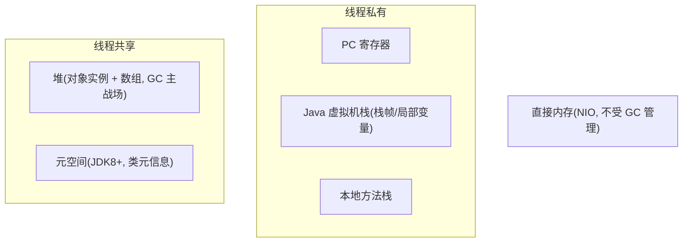

### 1.1 内存结构（JDK8+）
- **线程私有**：程序计数器（唯一不 OOM）、Java 虚拟机栈（栈帧/局部变量/操作数栈）、本地方法栈。
- **线程共享**：**堆**（对象实例，GC 主战场，分新生代 Eden/S0/S1 + 老年代）、**元空间 Metaspace**（类元数据，取代永久代，用本地内存）。
- **直接内存**：NIO 的 `ByteBuffer.allocateDirect`，不受 GC 直接管理，可能 OOM。

**考察点**：各区域作用与是否线程共享；栈溢出（StackOverflowError）vs 堆溢出（OOM）触发条件。

### 1.2 对象创建与内存布局
- **流程**：类加载检查 → 分配内存（指针碰撞/空闲列表）→ 初始化零值 → 设置对象头 → 执行 `<init>`。
- **对象头（Mark Word）**：哈希、GC 分代年龄、锁状态标志（无锁/偏向/轻量/重量）、偏向线程 id。
- **对齐填充**：对象大小补到 8 字节整数倍。

**考察点**：new 一个对象发生了什么？对象头存什么（锁升级的关键）？

### 1.3 垃圾回收（GC）
- **判断存活**：引用计数（循环引用失效，Java 不用）、**可达性分析**（GC Roots：栈引用、静态变量、JNI 等）。
- **引用类型**：强/软（内存不足回收）/弱（下次 GC 回收）/虚（仅跟踪回收）。
- **GC 算法**：标记-清除（碎片）、标记-整理（慢、无碎片）、复制（新生代，存活率低高效）。
- **分代收集**：新生代（复制算法，Minor GC）、老年代（标记-整理/混合，Major/Full GC）。

**考察点**：GC Roots 有哪些？为什么分代？Minor/Full GC 区别？

### 1.4 垃圾收集器
- **Serial / Parallel（吞吐量优先）**：单/多线程，停顿长。
- **CMS（并发标记清除，已废弃）**：初始标记→并发标记→重新标记→并发清除；缺点：CPU 敏感、碎片、Concurrent Mode Failure 退 Serial Old。
- **G1（JDK9+ 默认，停顿可控）**：Region 化、可预测停顿（`-XX:MaxGCPauseMillis`）、Mixed GC；筛选回收高收益 Region。
- **ZGC / Shenandoah（超低延迟 <10ms）**：染色指针 + 读屏障，并发整理，TB 级堆。

**考察点**：为什么 CMS 被弃？G1 怎么做到可预测停顿？ZGC 原理（染色指针）？生产用什么（G1 多数，低延迟选 ZGC）？

### 1.5 ZGC 深度——染色指针·分代·并发标记转移回收**【网上最新实践参考】**

> JDK17 起 ZGC 可用作默认 GC，JDK21+ 引入分代 ZGC（Generational ZGC）。面试能讲清 ZGC 的"染色指针+读屏障+并发转移"，以及何时选 ZGC vs G1，是 JVM 调优的加分项。

**核心原理**：
- **染色指针（Colored Pointers）**：在 64 位指针的空闲高位字节中编码对象状态标记（Marked0/Marked1/Remapped/Finalizable），无需额外标记位映射表——**指针本身就是标记信息**，省内存、省扫描
- **读屏障（Load Barrier）**：每次从堆中读取对象引用时，JVM 检查指针颜色——若对象处于"被转移中"状态，读屏障**自动修正指针**指向新地址（自愈），保证应用线程永远拿到正确引用
- **并发标记·并发转移·并发回收**：标记/转移/重定位全并发执行，应用线程不停顿——**STW 只出现在极短暂的初始标记和最终同步点（<10ms，且与堆大小无关）**
- **分代 ZGC（JDK21+）**：新生代（频繁短命对象快速回收）+ 老年代（长命对象低频回收），减少全堆扫描频率，进一步提升吞吐

**关键指标**：
- STW < 10ms（实测通常 0.1~2ms），**与堆大小几乎无关**（TB 级堆也能 <10ms）
- 吞吐量比 G1 低约 10~15%（读屏障开销），**但对延迟敏感场景这 10% 吞吐换来了确定性低停顿**
- JDK17 可用（`-XX:+UseZGC`），JDK21+ 分代模式（`-XX:+UseZGC -XX:+ZGenerational`）

**适用场景**：
- **支付/订单网关**：大量短命请求对象 + 对停顿极度敏感（STW → 回调堆积/对账延迟）→ ZGC 保证确定性低停顿
- **大堆场景**：8GB~TB 级堆（报表/对账数据缓存），G1 的 Mixed GC 停顿随堆增长，ZGC 停顿恒定
- **不适用**：纯计算批处理（吞吐优先、不在乎停顿）→ 用 Parallel/G1

> 面试加分：能说"ZGC 用染色指针把标记信息编码在指针高位、读屏障实现自愈转发、并发转移不停顿——停顿 <10ms 且与堆大小无关；代价是吞吐比 G1 低 10~15%。支付网关停顿敏感选 ZGC，批处理吞吐优先选 G1/Parallel"，说明你**不只背结论，还理解原理与选型权衡**。

### 1.6 类加载机制
- **双亲委派**：类加载器收到请求先委派父加载器，父找不到才自己加载。Bootstrap→Ext→App。
  - **好处**：防重复加载、防核心类被篡改（沙箱安全）。
  - **破坏场景**：SPI（JDBC 用线程上下文类加载器）、OSGi、热部署、Tomcat（WebAppClassLoader 先自己找）。
- **过程**：加载→链接（验证/准备/解析）→初始化（`<clinit>` 静态变量与静态块）。

**考察点**：双亲委派为什么？怎么打破？Tomcat 为什么自定义类加载器（隔离 WebApp）？

### 1.7 内存调优与 OOM 排查
- **常用参数**：`-Xms/-Xmx`（堆）、`-Xss`（栈）、`-XX:MetaspaceSize`、`-XX:+HeapDumpOnOutOfMemoryError`。
- **排查工具**：`jps`/`jstat`（GC 统计）/`jmap`（堆 dump）/`jstack`（线程栈）/`jhat`/`Arthas`（线上神器：dashboard、thread、watch、trace）。
- **典型 OOM**：堆（对象过多/泄漏）、元空间（动态类生成如 Groovy/字节码增强）、直接内存（NIO 没释放）、栈（递归过深）。

**考察点**：线上 CPU 100% 怎么排查（top → 找线程 → jstack → 看哪个线程 RUNNABLE 算什么）？内存泄漏怎么定位（dump 对比、看大对象、Weak/强引用）？

**回答思路（OOM 排查）**：① 保留现场（开 HeapDumpOnOutOfMemoryError，别立刻重启）；② `jstat -gcutil` 看 GC 是否频繁、老年代是否满；③ `jmap -histo` / MAT 找占用最大的类；④ 结合代码定位泄漏点（缓存未清、ThreadLocal 未 remove、连接未关）；⑤ 用 Arthas `watch`/`trace` 在线定位。

### 1.8 JVM 线上排查实战（2026 高频，命令级 SOP）
> 1.6 给了排查"思路"，这里给可直接背的"命令 SOP"——面试官常让你现场表演一次排查，能讲清下面这套流程就是加分项。

**A. OOM（内存溢出）三类与定位**
- **类型**：① `Java heap space`（堆满，对象过多 / 泄漏）；② `Metaspace`（类加载过多，如 Groovy / 字节码增强 / 动态代理）；③ `GC overhead limit exceeded`（GC 占 >98% 却回收 <2%，系统假死）；④ `Direct buffer memory`（NIO 直接内存未释放）。
- **SOP**：开 `-XX:+HeapDumpOnOutOfMemoryError -XX:HeapDumpPath=/path` 自动留现场 → `jps -l` 拿 PID → `jmap -dump:format=b,file=dump.hprof <pid>` 导堆（进程卡死加 `-F`）→ MAT / JProfiler 看"占用 TOP10 对象"和"泄漏嫌疑"（静态 Map 未清、连接 / 流未关、ThreadLocal 未 remove）→ 结合代码修。
- **快速排查**：`jmap -histo <pid> | head` 看对象数量排行，无需 dump 全量。

**B. CPU 100% 定位（死循环 / 频繁 GC / 锁竞争）**
- **SOP**：`top` 找高 CPU 的 Java 进程 PID → `top -Hp <pid>` 看该进程内高 CPU 线程 TID（十进制）→ `printf "%x\n" <tid>` 转十六进制 nid → `jstack <pid> | grep -A 20 <nid>` 看该线程栈，定位死循环 / 锁等待 / GC 线程。
- 若大量 GC 线程占 CPU → 是频繁 Full GC，转 `jstat -gcutil <pid> 1000 10` 看 O/M 是否满、FGC 是否暴涨。

**C. 常备工具速记**
- `jps`：列 Java 进程（替代 `ps -ef | grep java`）。
- `jstat -gcutil <pid> <ms> <n>`：实时 GC 百分比（S0/S1/E/O/M/YGC/FGC）。
- `jmap -heap/-histo/-dump`：堆配置 / 对象排行 / 快照。
- `jstack -l <pid>`：线程栈，查死锁（`grep -i deadlock`）、BLOCKED。
- `Arthas`：线上不停机诊断——`dashboard`（总览）、`thread -n 3`（最忙 3 线程）、`watch`（方法入参 / 返回值）、`trace`（耗时链路）、`ognl`（改线上变量验证）。支付线上我曾用 `watch` 抓到某渠道回调里 Map 误用 `put` 而非 `computeIfAbsent` 导致重复开户。

**D. 排查原则（加分项）**
- 非侵入优先（`jps/jstat/jstack` 先看，不动业务）；保留现场别立刻重启；调参后压测验证；堆快照大注意磁盘、分析完清理；全程记录可复盘。

**考察点**：不是背命令，而是"先保现场 → 定位进程 → 定位线程 / 对象 → 看栈 / 看堆 → 结合代码给结论 + 兜底"。能讲一个真用过的案例，直接封神。

#### GC 日志分析工具链【深度拓展】

> GC 调优的前提是"读得懂 GC 日志"。面试官常问"你们怎么分析 GC 日志"，能讲清工具链就是加分项。

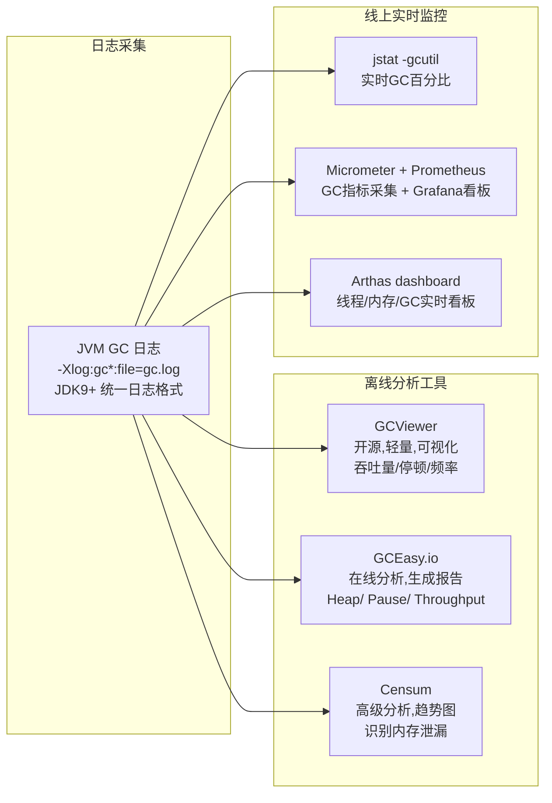

**JDK9+ 统一 GC 日志参数**：
```bash
# JDK9+ 统一日志格式（取代旧版 -XX:+PrintGCDetails）
-Xlog:gc*:file=/var/log/gc/gc.log:time,uptime,level,tags:filecount=10,filesize=50M

# 关键参数说明:
# gc*       - 输出所有 GC 相关日志
# file      - 输出到文件
# time      - 带时间戳
# uptime    - 带 JVM 运行时间
# filecount - 保留 10 个文件
# filesize  - 每个文件 50MB
```

**GC 日志关键字段解读**：
```text
# G1 GC 日志示例 (JDK17)
[2026-01-15T10:30:45.123+0800][1.234s] GC(1) Pause Young (Normal) (G1 Evacuation Pause)
  [2026-01-15T10:30:45.123+0800][1.234s] GC(1)   Pre: 256M->128M(512M)  --- 回收前 256M → 回收后 128M，堆总大小 512M
  [2026-01-15T10:30:45.124+0800][1.235s] GC(1)   Post: 128M->128M(512M) --- 回收后堆使用不变
  [2026-01-15T10:30:45.124+0800][1.235s] GC(1)   User=0.02s Sys=0.01s Real=0.01s --- 停顿 10ms

# ZGC 日志示例 (JDK21)
[2026-01-15T10:30:45.123+0800] GC(1) Garbage Collection (Warmup)
  [2026-01-15T10:30:45.123+0800] GC(1)   Pause Mark Start 0.015ms  --- 标记开始,停顿 0.015ms
  [2026-01-15T10:30:45.128+0800] GC(1)   Pause Mark End 0.021ms    --- 标记结束,停顿 0.021ms
  [2026-01-15T10:30:45.130+0800] GC(1)   Pause Relocate Start 0.018ms --- 转移开始,停顿 0.018ms
  [2026-01-15T10:30:45.135+0800] GC(1)   Garbage Collection (Warmup) 128M->64M(1G) 12.345ms
```

**关键指标判断标准**：
| 指标 | 健康范围 | 告警阈值 | 说明 |
| --- | --- | --- | --- |
| 吞吐量（Throughput） | >95% | <90% | 应用运行时间占比，越低 GC 开销越大 |
| 平均停顿 | <200ms | >500ms | 影响请求响应时间 |
| 最大停顿 | <1s | >2s | 可能触发网关超时/心跳失败 |
| Minor GC 频率 | <10次/分钟 | >30次/分钟 | 频繁 Minor GC 说明新生代太小 |
| Full GC 频率 | 0次/天 | >1次/小时 | Full GC 频繁 = 老年代泄漏或配置不当 |

**【面试官追问】** 如何判断 GC 是否需要调优？
> 三看：① **吞吐量 < 90%** → GC 开销过大，考虑增大堆或换 GC 算法；② **停顿 > 500ms** → 延迟敏感场景不能接受，考虑 G1 调 `MaxGCPauseMillis` 或换 ZGC；③ **Full GC 频繁** → 老年代不够或内存泄漏，`jmap -histo` 查大对象。调优顺序：先确认是否有内存泄漏（修代码）→ 再调堆大小/分代比例 → 最后才考虑换 GC 算法。**调优不是改参数，而是先定位根因**。

**【项目支撑】** XTransfer 支付网关的 GC 调优过程：先用 GCViewer 分析 7 天 GC 日志，发现 Minor GC 频率 25 次/分钟（新生代太小），Full GC 每天约 3 次（大对象直接进老年代）。调整 `-XX:NewRatio=1`（新生代:老年代=1:1）+ `-XX:MaxGCPauseMillis=200` 后，Minor GC 降至 5 次/分钟，Full GC 降为 0。关键洞察：对账批量数据集合超过 G1 Region 的一半，被识别为 Humongous Object 直接进老年代，改为分批处理后解决。

---

## 二、Java 语言基础

### 2.1 集合框架
- **List**：ArrayList（数组，查快改慢，扩容 1.5 倍）、LinkedList（双向链表，头尾操作 O(1)）。
- **Map**：HashMap（数组+链表/红黑树，负载因子 0.75，树化阈值 8、退化 6）、LinkedHashMap（有序）、TreeMap（红黑树，排序）、ConcurrentHashMap（并发）。
- **Set**：HashSet（= HashMap 的 key）、TreeSet。
- **Queue**：ArrayDeque、PriorityQueue（堆）、BlockingQueue（ArrayBlocking/LinkedBlocking/Synchronous）。

**HashMap 1.7 vs 1.8 区别（常考）**：
- 1.7：数组+链表，**头插法**（扩容易成环，并发死循环），扩容 2 倍。
- 1.8：数组+链表/**红黑树**（链表>8 且数组>64 树化），**尾插法**（无环），扩容时用高位/低位拆分更优雅；hash 扰动只一次。

**ConcurrentHashMap 1.7 vs 1.8（常考）**：
- 1.7：Segment 分段锁（继承 ReentrantLock），默认 16 段，并发度 16。
- 1.8：**Node + CAS + synchronized（锁头节点）**，更细粒度，放弃 Segment；size() 用 baseCount + CounterCell 分段计数。
- **注意**：读不加锁（volatile + 红黑树结构稳定），size() 非实时精确。

**考察点**：为什么负载因子 0.75？为什么树化阈值 8（泊松分布，冲突到 8 概率极低）？ConcurrentHashMap 1.8 为什么不用 ReentrantLock？

#### HashMap 源码级原理【深度拓展】

> HashMap 是 Java 面试的"保留节目"，能讲清 put 流程、扩容机制、线程安全问题，就是基本功扎实。

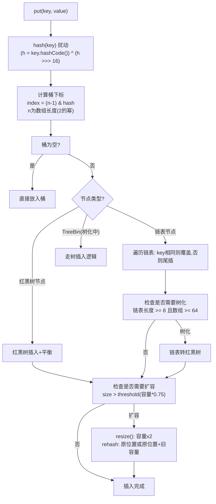

**HashMap put 核心源码（JDK8）**：
```java
final V putVal(int hash, K key, V value, boolean onlyIfAbsent, boolean evict) {
    Node<K,V>[] tab; Node<K,V> p; int n, i;
    if ((tab = table) == null || (n = tab.length) == 0)
        n = (tab = resize()).length;                    // 1. 延迟初始化+扩容
    if ((p = tab[i = (n - 1) & hash]) == null)
        tab[i] = newNode(hash, key, value, null);       // 2. 桶为空,直接放
    else {
        Node<K,V> e; K k;
        if (p.hash == hash && ((k = p.key) == key || (key != null && key.equals(k))))
            e = p;                                      // 3. 桶头就是同key,记录准备覆盖
        else if (p instanceof TreeNode)
            e = ((TreeNode<K,V>)p).putTreeVal(this, tab, hash, key, value); // 4. 红黑树插入
        else {
            for (int binCount = 0; ; ++binCount) {      // 5. 遍历链表
                if ((e = p.next) == null) {
                    p.next = newNode(hash, key, value, null); // 5a. 尾插
                    if (binCount >= TREEIFY_THRESHOLD - 1)    // 5b. 链表>=8,尝试树化
                        treeifyBin(tab, hash);
                    break;
                }
                if (e.hash == hash && ((k = e.key) == key || (key != null && key.equals(k))))
                    break;                               // 5c. 链表中找到同key
                p = e;
            }
        }
        if (e != null) { // 6. 覆盖旧值
            V oldValue = e.value;
            if (!onlyIfAbsent || oldValue == null)
                e.value = value;
            afterNodeAccess(e);
            return oldValue;
        }
    }
    ++modCount;
    if (++size > threshold)
        resize();                                       // 7. 超阈值则扩容
    afterNodeInsertion(evict);
    return null;
}
```

**为什么负载因子是 0.75？**
> 空间和时间的折中：0.75 时，泊松分布下桶冲突概率在可接受范围，同时空间浪费不超过 25%。如果设 1.0（满了才扩），冲突率高影响查询效率；设 0.5，空间浪费太大。源码注释明确说明这是"时间和空间成本的均衡"。

**为什么树化阈值是 8？**
> 源码注释引用泊松分布：在负载因子 0.75 下，桶中节点数达到 8 的概率约为 0.00000006（千万分之一），几乎不会发生。设为 8 是"极端情况下才树化，避免树化的频繁转换开销"——退树化阈值设为 6（留 2 的缓冲，避免频繁在 8 上下波动导致树化/退树化抖动）。

**HashMap 线程不安全的三个表现**：
1. **JDK7 头插法扩容死循环**：并发扩容时链表成环，get 时死循环（JDK8 改尾插法修复了这个，但仍有其他问题）
2. **数据覆盖**：两个线程同时 put 到同一空桶，一个写入被另一个覆盖
3. **size 不准确**：`size++` 非原子，并发下计数丢失

**【面试官追问】** HashMap 扩容时为什么用 `(n-1) & hash` 而不是 `hash % n`？
> ① 位运算比取模快（10倍以上）；② 要求 `n` 是 2 的幂——这样 `(n-1)` 的二进制全是 1（如 16-1=15=0b1111），按位与等价于取模但更快；③ 扩容时 rehash 更优雅——元素要么在原位置，要么在"原位置+旧容量"（只需看 hash 的新增高位是 0 还是 1），无需重新计算所有 hash。这就是"为什么 HashMap 容量必须是 2 的幂"的根本原因。

**【面试官追问】** `ConcurrentHashMap` 的 `size()` 为什么不精确？
> 1.8 的 CHM 用 `baseCount` + `CounterCell[]` 分段计数——put 时先 CAS 更新 `baseCount`，竞争失败则更新 `CounterCell`（线程哈希到不同 cell 减少竞争）。`size()` = `baseCount` + 所有 `CounterCell` 的值之和，但在遍历 `CounterCell` 时其他线程可能正在更新，所以得到的不是精确的"某一瞬间"的 size，而是一个近似值。这是**最终一致性**而非强一致性，在 `LongAdder` 中也是同样设计。

**【项目支撑】** XTransfer 的渠道路由缓存用 `ConcurrentHashMap<String, ChannelConfig>` 存储渠道配置——启动时从 DB 加载、运行时配置中心推送更新。读多写少（每秒数万次读、偶尔更新），正好吃满 CHM 的无锁读优势。`size()` 不精确不影响业务（只用于监控展示），精确计数用 `AtomicLong` 单独维护。哈啰工单的**规则因子缓存**也是 CHM——规则引擎加载后只读、规则变更时整体替换引用（copy-on-write 思路），避免并发修改问题。

### 2.2 String 与常量池
- **不可变**：private final char[]（JDK9 起 byte[] + coder），每次"修改"都新建。
- **常量池**：编译期字面量入池，`String.intern()` 手动入池；`""` vs `new String()`（后者在堆，前者可能池）。
- **== vs equals**：== 比地址，equals 比内容；StringBuilder/StringBuffer（可变的，append 高效，Buffer 线程安全）。

**考察点**：`String a="a"+"b"` 编译期优化为"ab"；`new String("a")` 创建几个对象（1 或 2）？为什么要不可变（安全、哈希缓存、常量池）？

### 2.3 泛型与类型擦除
- **擦除**：编译期泛型信息被擦除为 Object/上界，运行时无泛型。
- **代价**：不能 `new T()`、不能 `instanceof T`、数组泛型受限；桥方法（bridge method）保多态。
- **通配符**：`? extends T`（生产者，读）、`? super T`（消费者，写），PECS 原则。

**考察点**：为什么 List<Integer> 不能强转 List<String>（同一 raw 类型）？PECS 是什么？

### 2.4 反射与注解
- **反射**：`Class.forName`、getMethod/invoke，破坏封装但灵活（框架基石：Spring/MyBatis/Jackson）。性能略低（可关闭安全检查 `setAccessible(true)` 提速）。
- **注解**：元注解（@Target/@Retention（SOURCE/CLASS/RUNTIME）/@Documented/@Inherited）；运行时注解靠反射读取，编译期靠注解处理器（Lombok）。

**考察点**：反射性能怎么优化？注解处理器干嘛（Lombok/getter 生成）？

### 2.5 Lambda / Stream
- **Lambda**：匿名函数，糖衣（invokedynamic + 函数式接口）；变量捕获要求 final/等效 final。
- **Stream**：声明式集合处理（map/filter/reduce/collect），可并行（parallelStream，用 ForkJoinPool，小心共享池耗尽）。
- **方法引用**：`::`。

**考察点**：Lambda 捕获外部变量为什么不能改？parallelStream 有什么坑（共享 ForkJoinPool.commonPool、线程安全、有序性）？

### 2.6 Exception
- **Checked（编译期，Exception 非 Runtime）vs Unchecked（RuntimeException，不强制 catch）**。
- **try-with-resources**：AutoCloseable 自动关（连接/流）。
- **最佳实践**：别吞异常、别用异常做流程控制、给上下文。

**考察点**：Error 和 Exception 区别？finally 里 return 会怎样（覆盖 try 的 return）？

---

## 三、Java 并发（与《并发编程与JMM深挖》互补）

### 3.1 synchronized 锁升级
无锁 → **偏向锁**（同一线程重入，无竞争直接进）→ **轻量级锁**（CAS 自旋，短竞争）→ **重量级锁**（OS 互斥 Monitor，阻塞等待，重）。
- **升级不可逆**（除批量重偏向/撤销优化）。
- **考察点**：为什么要有偏向锁（多数情况无竞争）？重量级锁为什么慢（用户态↔内核态切换、线程挂起）？

### 3.2 Lock 与 AQS
- **ReentrantLock**：可中断、可超时、公平/非公平、多条件（Condition）。
- **AQS**：state（volatile + CAS）+ CLH 队列；独占（acquire/release）与共享（acquireShared）。
- **读锁写锁**：ReentrantReadWriteLock、StampedLock（乐观读，戳记校验）。
- **考察点**：synchronized vs Lock 怎么选（简单用 syn，需灵活用 Lock）？AQS 怎么实现（看 acquire 模板方法）？

### 3.3 JUC 工具类
- **CountDownLatch**：倒计时门闩，一等多（初始化 N，countDown 到 0 放行）。
- **CyclicBarrier**：等多等（到齐再一起走，可重用）。
- **Semaphore**：信号量，限流（许可数）。
- **Phaser**：可阶段化的屏障（更灵活）。
- **考察点**：Latch vs Barrier 区别？Semaphore 怎么用在限流？

### 3.4 线程池（重点）
- **7 参数**：corePoolSize、maximumPoolSize、keepAliveTime、unit、workQueue、threadFactory、handler。
- **执行流程**：核心满→入队→队满→开非核心→达上限→拒绝。
- **队列**：SynchronousQueue（不缓存，直接交线程）、LinkedBlockingQueue（无界，Fixed 默认，可能 OOM）、ArrayBlockingQueue（有界）。
- **拒绝策略**：AbortPolicy（抛）/ CallerRunsPolicy（调用者线程跑，反向压背）/ Discard / DiscardOldest。
- **为什么不建议 Executors 快捷创建**：`newFixedThreadPool`/`newSingleThread` 用无界队列易 OOM；`newCachedThreadPool` 最大线程 Integer.MAX_VALUE 易炸。
- **考察点**：核心线程数怎么设（CPU 密集=N+1，IO 密集=2N 或更大，结合 RT 与并发）？监控（活跃线程、队列堆积、拒绝数）？

### 3.5 原子类与 CAS
- **AtomicInteger/Long/Reference**：CAS 自旋。
- **LongAdder**（JDK8）：分段 Cell，高并发计数比 AtomicLong 更快（以空间换并发，最终 sum）。
- **ABA**：AtomicStampedReference 加版本戳解决。
- **考察点**：i++ 线程不安全为什么？LongAdder 比 AtomicLong 快在哪？

### 3.6 ThreadLocal（见术语篇）
**重点**：内存泄漏（key 弱引用、value 强引用，线程池复用下 value 不回收）→ 必须 `remove()`。InheritableThreadLocal 跨线程传递（父子），但线程池复用会串；用 TransmittableThreadLocal（阿里）解决。

### 3.7 虚拟线程（Virtual Threads，JDK21+）**【网上最新实践参考】**

> JDK21 正式引入虚拟线程（Project Loom），是 Java 并发模型的重大变革。面试能讲清原理与适用场景，体现你跟进最新技术。

**原理**：
- 虚拟线程是**用户态轻量线程**，由 JVM 而非 OS 管理——创建/调度/挂起/恢复都在用户态，无需 OS 线程映射
- 底层依托**载体线程（Carrier Thread，即平台线程）**：虚拟线程在执行时挂载到载体线程，遇 IO 阻塞时**自动卸载**并释放载体线程给其他虚拟线程用，阻塞恢复后重新挂载
- 类似 Go 的 goroutine / Erlang 的轻量进程，但用 Java 熟悉的 `Thread` API，无需学新范式

**与平台线程对比**：

| 特性 | 平台线程（传统） | 虚拟线程（JDK21+） |
| --- | --- | --- |
| 创建成本 | ~1KB 栈 + OS 调度开销，百万级即 OOM | ~几字节~KB，可轻松创建百万级 |
| 阻塞行为 | 阻塞 = OS 线程挂起（浪费载体） | 阻塞 = 自动卸载载体线程（载体立即服务其他虚拟线程） |
| 调度 | OS 内核调度（抢占式） | JVM 用户态调度（协作式，阻塞点自动 yield） |
| 适用 | CPU 密集 / 需要真正并行 | **IO 密集**（大量阻塞等待：HTTP 调用、DB 查询、MQ 消费） |

**适用场景**：
- **IO 密集高并发**：每个请求一个虚拟线程，阻塞等待时自动释放载体——不再需要"线程池+队列+拒绝策略"的复杂调参，直接 `newVirtualThreadPerTaskExecutor()`
- **支付/订单网关**：大量"调渠道→等回调→查 DB→写日志"的 IO 阻塞链路，虚拟线程让每个请求独立跑、阻塞不浪费线程

**坑与注意**：
1. **`synchronized` 导致 Pinning（钉扎）**：虚拟线程在 `synchronized` 块内阻塞时**无法卸载载体线程**（JVM 21/22 的限制，JDK24 有 `ReentrantLock` 替代方案优化）——生产建议**用 `ReentrantLock` 替代 `synchronized`**
2. **ThreadLocal 膨胀**：百万虚拟线程各持 ThreadLocal → 内存爆炸——**虚拟线程下应避免大量 ThreadLocal，用 ScopedValue（JDK21+）替代**
3. **CPU 密集无收益**：纯计算不阻塞，虚拟线程反而比平台线程慢（多了挂载/卸载开销）——CPU 密集场景仍用平台线程池

> 面试加分：能说"虚拟线程解决了 IO 密集场景的线程池瓶颈，但 `synchronized` 会 pinning、ThreadLocal 会膨胀——生产用 `ReentrantLock` 替代 syn、用 ScopedValue 替代 ThreadLocal"，说明你**不只懂原理，还知道生产落地的坑**。

---

## 四、Spring 全家桶

### 4.1 IoC / DI
- **IoC**：对象创建与依赖组装交给容器，反转了"自己 new"的控制权。
- **DI**：构造器注入（推荐，不可变、易测）、setter 注入（可选）、字段注入（@Autowired，简洁但不推荐，难测、易 NPE）。
- **考察点**：为什么推荐构造器注入？字段注入为什么不好（循环依赖隐藏、测试难）？

#### IoC 容器源码级原理【深度拓展】

> 面试官可能追问"Spring IoC 的 refresh() 做了什么"。下面把 `AbstractApplicationContext#refresh()` 的 12 步拆解，能讲清这个就是源码级理解。

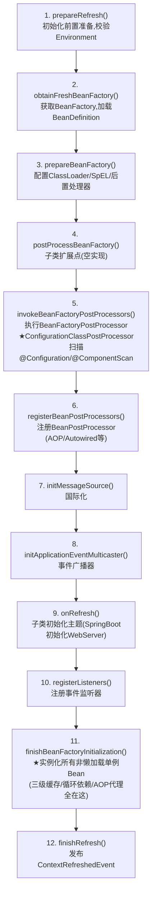

**核心步骤详解**：
- **第5步 `invokeBeanFactoryPostProcessors`**：这是最关键的一步——`ConfigurationClassPostProcessor` 会扫描所有 `@Configuration`/`@ComponentScan`/`@Import`/`@Bean`，把 BeanDefinition 注册到 BeanFactory。**自动装配的"扫描"就发生在这里**。
- **第6步 `registerBeanPostProcessors`**：注册但**不执行** `BeanPostProcessor`（到第11步实例化 Bean 时才执行）。`AutowiredAnnotationBeanPostProcessor`（处理 `@Autowired`）、`CommonAnnotationBeanPostProcessor`（处理 `@PostConstruct`/`@PreDestroy`）在这步注册。
- **第11步 `finishBeanFactoryInitialization`**：实例化所有非懒加载单例 Bean——**三级缓存、循环依赖、AOP 代理全在这一步发生**（`getBean()` → `doGetBean()` → `createBean()` → `createBeanInstance()` → `populateBean()` → `initializeBean()`）。

**Bean 创建核心源码链路**：
```java
// AbstractApplicationContext#finishBeanFactoryInitialization()
beanFactory.preInstantiateSingletons();  // 遍历所有 BeanDefinition

// DefaultListableBeanFactory#preInstantiateSingletons()
for (String beanName : beanDefinitionNames) {
    getBean(beanName);  // → doGetBean() → createBean()
}

// AbstractAutowireCapableBeanFactory#createBean()
Object bean = createBeanInstance(beanName, mbd, args);   // 1. 实例化(构造器)
populateBean(beanName, mbd, bw, beanInstance);           // 2. 属性填充(@Autowired)
exposedObject = initializeBean(beanName, exposedObject, mbd); // 3. 初始化(BeanPostProcessor)
// initializeBean 内部:  BeanPostProcessor#before → @PostConstruct → afterPropertiesSet → init-method → BeanPostProcessor#after(AOP)
```

> 面试加分：能画出 `refresh()` 12 步流程、说出"第11步 preInstantiateSingletons 才真正创建 Bean"、并解释 `createBean` 的三段式（实例化→属性填充→初始化），说明你**真的读过 Spring 源码**，而不只是背了八股。

**【面试官追问】** `BeanFactoryPostProcessor` 和 `BeanPostProcessor` 的区别？
> 前者操作的是 **BeanDefinition**（Bean 的"图纸"，在 Bean 实例化之前修改，如 `ConfigurationClassPostProcessor` 注册新的 BeanDefinition）；后者操作的是 **Bean 实例**（Bean 创建出来后加工，如 `AutowiredAnnotationBeanPostProcessor` 注入依赖、`AbstractAutoProxyCreator` 生成 AOP 代理）。记忆口诀：**PostProcessor 之前改图纸（Factory），之后改实物（Bean）**。

**【面试官追问】** 为什么 Spring 用 `BeanDefinition` 而不直接反射创建？
> `BeanDefinition` 是"Bean 的元信息描述"（类名、作用域、构造参数、属性、init/destroy 方法、是否懒加载等），相当于"模具"——先注册模具、统一管理、支持条件化装配（@Conditional），再按需实例化。这样设计的好处：① 可以在实例化前修改 BeanDefinition（如占位符替换、`@ConfigurationProperties` 绑定）；② 支持懒加载；③ 支持原型作用域（每次 getBean 才新建）。

**【项目支撑】** XTransfer 的支付渠道 SPI 机制就利用了 `BeanFactoryPostProcessor` 的思路——在容器启动时扫描所有渠道实现类、注册为 BeanDefinition，运行时根据"渠道类型"按需 getBean 获取对应实现。这是"把扩展点下沉到框架"的工程实践。

### 4.2 Bean 生命周期

> Bean 从生到死：实例化 → 属性填充 → Aware → 前后置处理器 → 初始化 → 就绪 → 销毁。**AOP 代理就在后置处理器这一步生成**。

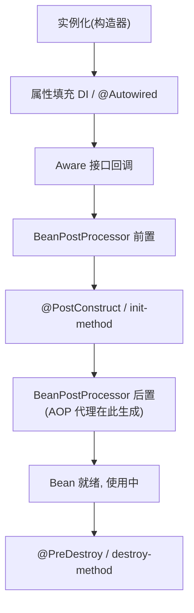
实例化（构造）→ 属性填充（@Autowired）→ Aware 接口（BeanName/BeanFactory/ApplicationContext）→ **BeanPostProcessor 前置** → @PostConstruct → InitializingBean.afterPropertiesSet → 自定义 init-method → **BeanPostProcessor 后置（AOP 代理在此生成）** → 使用中 → @PreDestroy / DisposableBean.destroy。
- **考察点**：BeanPostProcessor 干嘛（AOP/注解解析）？@PostConstruct 和 afterPropertiesSet 顺序（前者先）？

### 4.3 循环依赖（重点）

> 为什么三级不是两级？**三级缓存（ObjectFactory）能在"需要时才生成早期代理"**，二级只存早期引用、拿不到代理。下面把 A↔B 的循环拆成"实例化→提前暴露→注入早期引用→完成"的闭环。

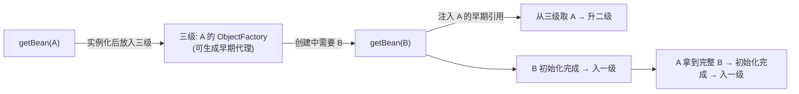
- A 创建→放三级缓存（singletonFactories 放 ObjectFactory 暴露半成品）→ 填充属性发现要 B → B 创建→也要 A → 从三级缓存拿 A 的工厂产 early 引用放入二级缓存、删三级→ B 完成→ A 完成→ 升一级缓存。
- **为什么三级不是两级**：二级缓存存"成品 early 引用"、三级存"工厂"，工厂能在必要时生成代理对象（AOP 场景下 early 引用要是代理），若只用两级会拿到原始对象导致 AOP 失效。
- **构造器注入/原型（prototype）循环依赖无法解决**（直接抛 BeanCurrentlyInCreationException）。
- **考察点**：为什么需要三级？@Async/@Transactional 加在类上循环依赖可能失败（代理生成时机）？

### 4.4 AOP
- **动态代理**：有接口用 **JDK 动态代理**（Proxy.newProxyInstance，实现接口），无接口用 **CGLIB**（继承子类、重写方法）。
- **切点/通知**：@Before/@After/@Around（最灵活，可控制是否执行目标）/@AfterReturning/@AfterThrowing。
- **执行顺序**：Around 前 → Before → 目标 → AfterReturning/Throwing → After → Around 后。
- **考察点**：JDK vs CGLIB 区别？final 类/方法能代理吗（CGLIB 不能继承 final）？同一个类内方法互调 AOP 生效吗（不生效，没走代理）？

#### AOP 源码级原理与代理生成时机【深度拓展】

> 面试官常问"AOP 代理什么时候生成"。答案是：在 Bean 生命周期的 **BeanPostProcessor#postProcessAfterInitialization** 阶段，由 `AbstractAutoProxyCreator`（`AnnotationAwareAspectJAutoProxyCreator` 的父类）织入。

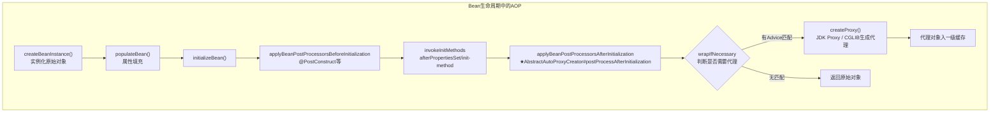

**代理创建核心源码**：
```java
// AbstractAutoProxyCreator#postProcessAfterInitialization
public Object postProcessAfterInitialization(Object bean, String beanName) {
    if (this.advisedBeans.containsKey(cacheKey)) {
        return bean;  // 不需要代理的 Bean 直接返回
    }
    if (isInfrastructureClass(bean.getClass()) || shouldSkip(beanClass, beanName)) {
        this.advisedBeans.put(cacheKey, Boolean.FALSE);
        return bean;
    }
    // ★ 查找匹配的 Advice（切点匹配）
    Object[] specificInterceptors = getAdvicesAndAdvisorsForBean(beanClass, beanName, targetSource);
    if (specificInterceptors != DO_NOT_PROXY) {
        this.advisedBeans.put(cacheKey, Boolean.TRUE);
        Object proxy = createProxy(beanClass, specificInterceptors, targetSource);  // 创建代理
        this.proxyTypes.put(cacheKey, proxy.getClass());
        return proxy;  // ★ 返回的是代理对象，不是原始对象
    }
    this.advisedBeans.put(cacheKey, Boolean.FALSE);
    return bean;
}
```

**JDK 动态代理 vs CGLIB 字节码生成对比**：
```java
// JDK 动态代理（有接口）
public class JdkProxyFactory implements InvocationHandler {
    private final Object target;
    public JdkProxyFactory(Object target) { this.target = target; }
    public Object invoke(Object proxy, Method method, Object[] args) throws Throwable {
        // @Before 逻辑
        try {
            Object result = method.invoke(target, args);  // 反射调用原始对象
            // @AfterReturning 逻辑
            return result;
        } catch (Exception e) {
            // @AfterThrowing 逻辑
            throw e;
        } finally {
            // @After 逻辑
        }
    }
}
// 生成: Proxy.newProxyInstance(classLoader, interfaces, handler)

// CGLIB（无接口，生成子类）
public class CglibProxyFactory implements MethodInterceptor {
    public Object intercept(Object obj, Method method, Object[] args, MethodProxy proxy) throws Throwable {
        // @Before 逻辑
        try {
            Object result = proxy.invokeSuper(obj, args);  // 调用父类（原始类）方法
            // @AfterReturning 逻辑
            return result;
        } catch (Exception e) {
            // @AfterThrowing 逻辑
            throw e;
        } finally {
            // @After 逻辑
        }
    }
}
// 生成: Enhancer.create(targetClass, callback)  → 字节码生成子类
```

**通知执行顺序（JDK8 vs JDK7+ Spring 5.2.7+）**：
```text
Spring 5.2.7+（当前主流）:
  @Around(前) → @Before → 目标方法 → @AfterReturning/@AfterThrowing → @After → @Around(后)

注意：@Around 不调 joinPoint.proceed() 则目标方法不执行（最灵活也最危险）
```

**AOP 失效场景完整清单**：
| 失效场景 | 原因 | 解决方案 |
| --- | --- | --- |
| 同类内部方法调用 | `this.method()` 不走代理对象 | 注入自身(`@Lazy`)/`AopContext.currentProxy()`/拆到另一个 Bean |
| 非 public 方法 | Spring AOP 只代理 public | 改为 public 或用 AspectJ 编译时织入 |
| final 类/方法 | CGLIB 无法继承 | 去掉 final 或改用接口 |
| 自己 new 的对象 | 不在 Spring 容器中 | 交给容器管理 |
| 静态方法 | 不属于实例方法 | 改为实例方法 |

**【面试官追问】** Spring AOP 和 AspectJ 有什么区别？
> Spring AOP 是**运行时代理**（JDK/CGLIB），只支持方法级切入点，性能有反射/代理开销，但无需额外编译器。AspectJ 是**编译时/加载时织入**（CTW/LTW），用 AspectJ 编译器修改字节码，支持字段/构造器/方法调用等更细粒度切入点，性能更好但需 ajc 编译器。Spring AOP 借用了 AspectJ 的注解语法（`@Aspect`/`@Pointcut`/`@Before`），但底层实现完全不同——**Spring AOP 是"借了 AspectJ 的语法，用自己的代理实现"**。

**【项目支撑】** XTransfer 支付系统的**幂等校验切面**（`@Idempotent` 注解 + AOP 拦截），通过 `@Around` 在方法执行前查 Redis 判断是否重复请求，重复则直接返回上次结果——这是"AOP + 注解"的经典工程实践。**操作审计切面**记录每笔支付操作的操作人/时间/变更前后值，也是 AOP 拦截 `@AuditLog` 注解实现。两个切面都确保了"横切关注点与业务代码分离"，业务 Service 只管业务逻辑。

### 4.5 事务
- **声明式**：@Transactional（AOP 实现）。
- **7 种传播**：REQUIRED（默认，加入或新建）、REQUIRES_NEW（挂起当前、新事务）、NESTED（保存点，回滚到保存点，依赖 JDBC 保存点）、SUPPORTS、MANDATORY、NOT_SUPPORTED、NEVER。
- **隔离级别**：DEFAULT/READ_UNCOMMITTED/READ_COMMITTED/REPEATABLE_READ/SERIALIZABLE。
- **失效场景**：同类自调用（代理不生效）、非 public、异常被 catch 吞掉、异常类型不对（默认只回滚 RuntimeException）、多线程（事务绑定线程）、数据源不对（多数据源没配 TransactionManager）。
- **考察点**：REQUIRED vs REQUIRES_NEW？NESTED 和 REQUIRES_NEW 区别（前者是同一事务的保存点，后者完全独立）？为什么自调用不生效（要走代理）？

#### 事务传播行为决策树【深度拓展】

> 7 种传播行为面试常考，但能"给场景选对传播行为"才是真理解。下面用决策树把"什么场景选什么传播"理清。

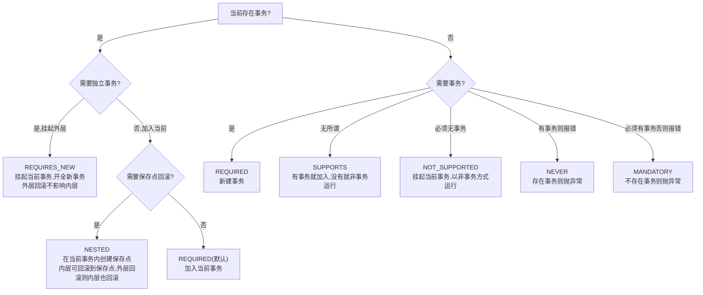

**7 种传播行为场景对照**：
| 传播行为 | 场景 | 支付系统示例 |
| --- | --- | --- |
| **REQUIRED**（默认） | 绝大多数业务方法 | 转账：扣款+加款在同一事务 |
| **REQUIRES_NEW** | 需要独立提交，不受外层影响 | 渠道回调落库：即使后续记账失败，回调记录也已独立提交 |
| **NESTED** | 部分回滚不影响整体 | 批量对账：某一笔对账失败只回滚这笔，不影响整批 |
| **SUPPORTS** | 只读查询，有事务更好没也行 | 查询订单状态 |
| **NOT_SUPPORTED** | 明确不需要事务（耗时统计） | 记录操作日志（不因业务回滚而丢失日志） |
| **MANDATORY** | 必须在事务内被调用 | 内部资金操作方法（防止误调用绕过事务） |
| **NEVER** | 必须在非事务环境执行 | 跨数据源大数据量导出 |

**事务传播代码示例**：
```java
@Service
public class PaymentService {

    @Autowired
    private ChannelCallbackService callbackService;
    @Autowired
    private AccountingService accountingService;

    /**
     * 主流程：渠道回调处理
     * 使用 REQUIRED，整个方法在一个事务内
     */
    @Transactional(rollbackFor = Exception.class)
    public void handleCallback(CallbackRequest request) {
        // 1. 回调落库 - REQUIRES_NEW，独立事务提交
        //    即使后面记账失败，回调记录也不会丢失
        callbackService.saveCallback(request);

        // 2. 记账 - REQUIRED，加入主事务
        //    如果记账失败，主事务回滚（但回调记录已在独立事务提交）
        accountingService.recordAccount(request);
    }
}

@Service
public class ChannelCallbackService {

    /**
     * REQUIRES_NEW：挂起外层事务，开新事务
     * 保证回调记录独立提交，不受后续步骤影响
     */
    @Transactional(propagation = Propagation.REQUIRES_NEW, rollbackFor = Exception.class)
    public void saveCallback(CallbackRequest request) {
        CallbackRecord record = new CallbackRecord();
        record.setCallbackId(request.getCallbackId());
        record.setStatus("RECEIVED");
        callbackRepository.save(record);
    }
}

@Service
public class BatchReconcileService {

    /**
     * NESTED：在当前事务内创建保存点
     * 单笔失败只回滚到保存点，整批继续
     */
    @Transactional(rollbackFor = Exception.class)
    public void batchReconcile(List<ReconcileItem> items) {
        for (ReconcileItem item : items) {
            try {
                reconcileSingle(item);  // NESTED 传播
            } catch (Exception e) {
                log.warn("单笔对账失败,跳过: {}", item.getId(), e);
                // 不 throw，继续处理下一笔
            }
        }
    }

    @Transactional(propagation = Propagation.NESTED, rollbackFor = Exception.class)
    public void reconcileSingle(ReconcileItem item) {
        // 对账逻辑，失败时只回滚到保存点
    }
}
```

**事务隔离级别与数据库对照**：
```yaml
# application.yml - 支付系统事务配置
spring:
  datasource:
    hikari:
      # 支付系统默认 READ_COMMITTED（Oracle/PostgreSQL 默认级别）
      # 不用 REPEATABLE_READ 是因为支付需要看到其他事务已提交的更新
      # 不用 SERIALIZABLE 是因为性能代价太大
      transaction-isolation: TRANSACTION_READ_COMMITTED

# 事务管理器配置（多数据源场景）
# 支付库和风控库需要独立的事务管理器
```

**【面试官追问】** `@Transactional(readOnly = true)` 的作用是什么？
> ① 标记为只读，Hibernate/JPA 会将 FlushMode 设为 `MANUAL`，不做脏检查，提升性能；② MySQL 会执行 `SET TRANSACTION READ ONLY`，数据库可以做读优化；③ 配合读写分离，路由到从库。但要注意：`readOnly = true` 并不阻止你在方法里写库（只是提示），要真正防写需在数据库层设只读。

**【面试官追问】** 声明式事务的实现原理？`@Transactional` 是怎么生效的？
> 声明式事务本质是 AOP：Spring 为带 `@Transactional` 的 Bean 生成代理对象（`TransactionInterceptor` 实现 `MethodInterceptor`），调用方法时代理拦截 → `TransactionManager#getTransaction()` 开启事务 → 执行目标方法 → 正常则 `commit()`，异常则 `rollback()`。核心是 `TransactionAspectSupport#invokeWithinTransaction()` 方法。

**【项目支撑】** XTransfer 支付系统中，**渠道回调落库用 `REQUIRES_NEW`** 是经过血泪教训的——早期版本用默认 `REQUIRED`，结果记账步骤异常导致回调记录也回滚，渠道重复回调时系统无法识别已处理，导致重复入账。改为 `REQUIRES_NEW` 后，回调记录独立提交，即使后续处理失败，渠道重试时也能识别"已收到回调"并做幂等返回。哈啰薪资系统的**批量计算**用 `NESTED` 传播——单个员工薪资计算失败只回滚该员工，不影响整批，对应"部分失败可容忍"的业务场景。

### 4.6 Spring Boot 自动装配（重点）
- `@SpringBootApplication` = `@SpringBootConfiguration` + `@ComponentScan` + `@EnableAutoConfiguration`。
- `@EnableAutoConfiguration` 读取 `META-INF/spring/org.springframework.boot.autoconfigure.AutoConfiguration.imports`（旧版 spring.factories），按 **@ConditionalOnClass / OnBean / OnProperty / OnMissingBean** 条件装配。
- **starter**：约定优于配置，引入依赖即得自动配置。
- **考察点**：自动装配流程？怎么写自己的 starter（autoconfigure 模块 + @Conditional + imports 文件）？条件注解有哪些？

#### 自动装配源码级流程【深度拓展】

> 面试官追问"自动装配的流程"时，能画出从 `@SpringBootApplication` 到 Bean 注册的完整链路，就是源码级理解。

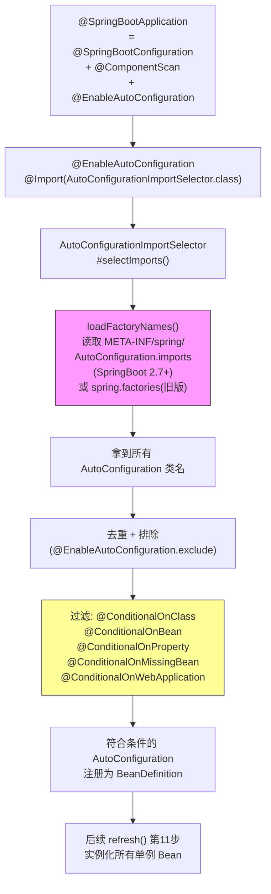

**自动装配核心源码链路**：
```java
// AutoConfigurationImportSelector#selectImports
public String[] selectImports(AnnotationMetadata annotationMetadata) {
    if (!isEnabled(annotationMetadata)) {
        return NO_IMPORTS;
    }
    AutoConfigurationEntry autoConfigurationEntry = getAutoConfigurationEntry(annotationMetadata);
    return StringUtils.toStringArray(autoConfigurationEntry.getConfigurations());
}

// getAutoConfigurationEntry → getCandidateConfigurations
protected List<String> getCandidateConfigurations(AnnotationMetadata metadata, AnnotationAttributes attributes) {
    // SpringBoot 2.7+ 读取 AutoConfiguration.imports
    List<String> configurations = ImportCandidates.load(AutoConfiguration.class, getBeanClassLoader())
            .getCandidates();
    return configurations;
}

// 读取的文件: META-INF/spring/org.springframework.boot.autoconfigure.AutoConfiguration.imports
// 内容示例:
// com.example.autoconfigure.PaymentAutoConfiguration
// com.example.autoconfigure.RiskControlAutoConfiguration
```

**自定义 Starter 完整示例**：
```java
// 1. autoconfigure 模块: 自动配置类
@AutoConfiguration
@ConditionalOnClass(PaymentService.class)
@EnableConfigurationProperties(PaymentProperties.class)
public class PaymentAutoConfiguration {

    @Bean
    @ConditionalOnMissingBean
    @ConditionalOnProperty(prefix = "payment", name = "enabled", havingValue = "true", matchIfMissing = true)
    public PaymentService paymentService(PaymentProperties properties, PaymentChannelRouter router) {
        PaymentService service = new PaymentService();
        service.setProperties(properties);
        service.setRouter(router);
        return service;
    }

    @Bean
    @ConditionalOnMissingBean
    public PaymentChannelRouter paymentChannelRouter(PaymentProperties properties) {
        return new PaymentChannelRouter(properties.getChannels());
    }
}

// 2. 配置属性类
@ConfigurationProperties(prefix = "payment")
@Data
public class PaymentProperties {
    private boolean enabled = true;
    private String defaultChannel = "ALIPAY";
    private List<ChannelConfig> channels = new ArrayList<>();
    @Data
    public static class ChannelConfig {
        private String code;
        private String name;
        private String url;
        private int timeout = 5000;
    }
}

// 3. 注册自动配置
// 文件: src/main/resources/META-INF/spring/org.springframework.boot.autoconfigure.AutoConfiguration.imports
// 内容:
// com.example.autoconfigure.PaymentAutoConfiguration

// 4. 使用方 application.yml
// payment:
//   enabled: true
//   default-channel: ALIPAY
//   channels:
//     - code: ALIPAY
//       name: 支付宝
//       url: https://openapi.alipay.com/gateway.do
//       timeout: 5000
//     - code: WECHAT
//       name: 微信支付
//       url: https://api.mch.weixin.qq.com/pay/unifiedorder
//       timeout: 3000
```

**条件注解完整清单**：
| 注解 | 作用 | 典型场景 |
| --- | --- | --- |
| `@ConditionalOnClass` | classpath 存在指定类才装配 | 只在引入 Redis 依赖时装配 RedisTemplate |
| `@ConditionalOnMissingBean` | 容器中不存在指定 Bean 才装配 | 用户未自定义时给默认实现 |
| `@ConditionalOnBean` | 容器中存在指定 Bean 才装配 | 只有 DataSource 存在才装配 JdbcTemplate |
| `@ConditionalOnProperty` | 配置满足条件才装配 | `payment.enabled=true` 才启用支付 |
| `@ConditionalOnWebApplication` | 是 Web 应用才装配 | Servlet/Reactive 类型过滤 |
| `@ConditionalOnNotWebApplication` | 非 Web 应用才装配 | CLI 工具场景 |
| `@ConditionalOnExpression` | SpEL 表达式为 true | 复合条件判断 |

**【面试官追问】** `@ConditionalOnMissingBean` 有什么陷阱？
> `@ConditionalOnMissingBean` 的判断时机是在 Bean 定义注册阶段，如果用户的 Bean 和自动配置的 Bean 的注册顺序不对（比如用户 Bean 在自动配置之后注册），会导致条件判断失效。Spring Boot 通过 `@AutoConfigureBefore`/`@AutoConfigureAfter`/`@AutoConfigureOrder` 控制自动配置类之间的顺序，但**用户自定义 Bean 一定优先于自动配置**（因为 `@ComponentScan` 在第5步、自动配置在第5步后段）。这也是"约定优于配置"的核心：**用户覆盖框架默认**。

**【项目支撑】** XTransfer 的支付渠道路由模块就是自研 Starter——封装"多渠道接入 + 路由策略 + 限流熔断"为 `payment-spring-boot-starter`，各业务线引入依赖 + 在 yml 配置渠道信息即可使用，自动装配出 `PaymentService`/`PaymentChannelRouter` Bean。这符合"差异外置 + 配置化"的架构思想，也是微服务"能力复用"的工程实践。

### 4.7 Spring Boot 3.x 核心变化**【网上最新实践参考】**

> Spring Boot 3.x（基于 Spring Framework 6）是近年最大版本升级，面试问"你了解 Spring Boot 3 有什么变化"能答出以下三点，说明你跟进最新技术。

**1. Jakarta EE 迁移（javax → jakarta）**：
- Spring Boot 3 基于 Jakarta EE 9+，所有 `javax.*` 包名改为 `jakarta.*`（如 `javax.persistence` → `jakarta.persistence`、`javax.servlet` → `jakarta.servlet`）
- **影响**：所有 import、依赖引用、配置都要改——是升级中最机械但也最不可省的工作
- **迁移策略**：用 OpenRewrite 自动批量替换 import + 依赖坐标；注意第三方库是否已发布 jakarta 版（Hibernate 6+、Tomcat 10+ 已适配）

**2. AOT 编译与 GraalVM 原生镜像**：
- Spring Boot 3 引入 **AOT（Ahead-Of-Time）编译**：构建时提前解析 Bean 定义、生成优化后的反射/代理配置，减少运行时动态解析开销
- **GraalVM Native Image**：AOT 编译后的 Spring Boot 应用可打包为原生可执行文件（无需 JVM、启动时间毫秒级、内存占用极低）
- **适用**：CLI 工具、Serverless/FaaS、微服务冷启动敏感场景
- **限制**：不支持运行时动态代理/反射（需提前注册）、classpath 固定、部分 Spring 功能受限（如热部署、动态配置刷新）
- **支付场景**：支付网关不适合 Native Image（需要动态配置、运行时 SPI 加载、热切换渠道开关），但 AOT 编译本身可加速常规启动

**3. 可观测性（Observation API 替代旧 Metrics）**：
- Spring Boot 3 统一可观测性为 **Micrometer Observation API**：一个 API 同时输出 **Metrics（指标）+ Traces（链路追踪）+ Logs（结构化日志）**——不再需要分别配 Metrics 和 Tracing
- 替代了旧的 `MeterRegistry` 单独配 Metrics + Sleuth 配 Tracing 的分散模式
- **集成**：自带 Prometheus 指标导出 + OpenTelemetry 链路追踪 + Zipkin/Jaeger 适配，一个 `@Observed` 注解搞定
- **支付场景**：支付链路追踪（从请求入口到渠道回调到记账）用 Observation API 统一埋点——一个 API 同时出指标（RT/成功率/渠道可用性）+ 链路（跨服务调用链）+ 日志（结构化 traceId）

> 面试加分：能说"Spring Boot 3 三大变化：javax→jakarta 迁移是机械但不可省的升级工作、AOT+GraalVM 让冷启动毫秒级但支付网关因动态配置不适合 Native Image、Observation API 统一了 Metrics+Traces+Logs 的可观测性"，说明你**不只知道版本号，还理解变化的影响与适用边界**。

### 4.8 Spring MVC 请求流程
DispatcherServlet → HandlerMapping（找 Controller）→ HandlerAdapter（执行）→ 拦截器 preHandle → 方法调用（参数解析/数据绑定/校验）→ 返回 ModelAndView/JSON → 拦截器 postHandle → 视图渲染/消息转换（HttpMessageConverter，Jackson）→ afterCompletion。
- **考察点**：DispatcherServlet 干嘛？拦截器三方法时机？@RequestBody 怎么解析（HttpMessageConverter）？

### 4.9 常用注解
@RestController、@RequestMapping、@GetMapping、@RequestParam、@PathVariable、@RequestBody、@Valid/@Validated（校验）、@Value、@Configuration/@Bean、@Component/@Service/@Repository、@Transactional、@Async（需 @EnableAsync）、@Scheduled、@Cacheable。
- **考察点**：@Validated vs @Valid？@Async 为什么有时不生效（同类调用/未开 EnableAsync/返回 void 异常吞）？

### 4.10 Spring 事件与异步
- ApplicationEvent / ApplicationListener / @EventListener / ApplicationEventPublisher；可 @Async 异步监听。
- **考察点**：解耦场景（支付成功发事件 → 通知/积分/对账各自监听）？

#### Spring 事件驱动架构【深度拓展】

> 支付系统大量用领域事件解耦——"支付成功"不直接调通知/积分/对账，而是发事件让各模块监听。下面用图把事件驱动架构理清。

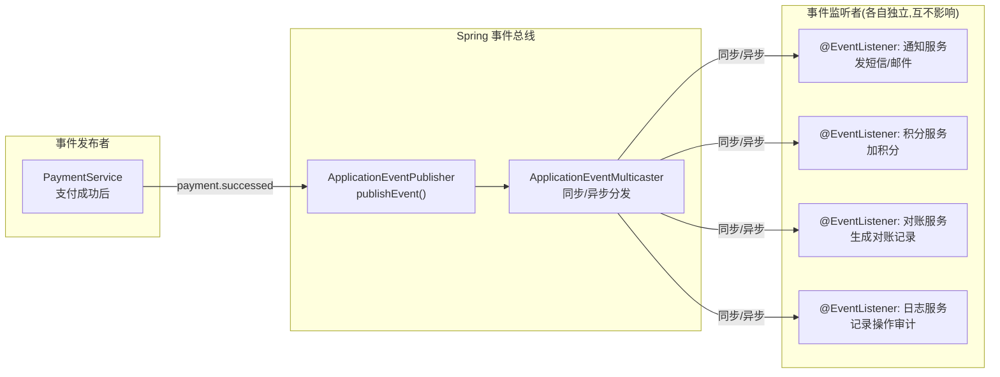

**Spring 事件代码示例**：
```java
// 1. 定义领域事件
public class PaymentSucceededEvent extends ApplicationEvent {
    private final String orderId;
    private final String channelId;
    private final BigDecimal amount;

    public PaymentSucceededEvent(Object source, String orderId, String channelId, BigDecimal amount) {
        super(source);
        this.orderId = orderId;
        this.channelId = channelId;
        this.amount = amount;
    }
    // getters...
}

// 2. 发布事件（在业务逻辑中）
@Service
public class PaymentService {

    @Autowired
    private ApplicationEventPublisher eventPublisher;

    @Transactional(rollbackFor = Exception.class)
    public void processPayment(PayRequest request) {
        // 支付核心逻辑...
        paymentRepository.save(payment);

        // 发布支付成功事件（在事务提交后异步执行监听器）
        // @TransactionalEventListener 监听 AFTER_COMMIT 阶段
        eventPublisher.publishEvent(
            new PaymentSucceededEvent(this, request.getOrderId(),
                request.getChannelId(), request.getAmount()));
    }
}

// 3. 监听事件 - 通知服务（异步，事务提交后执行）
@Component
public class NotificationEventListener {

    @Async  // 异步执行，不阻塞主流程
    @TransactionalEventListener(phase = TransactionPhase.AFTER_COMMIT)
    public void onPaymentSucceeded(PaymentSucceededEvent event) {
        // 发送短信/邮件通知
        notificationService.sendPaymentSuccess(event.getOrderId(), event.getAmount());
    }
}

// 4. 监听事件 - 对账服务
@Component
public class ReconcileEventListener {

    @Async
    @TransactionalEventListener(phase = TransactionPhase.AFTER_COMMIT)
    public void onPaymentSucceeded(PaymentSucceededEvent event) {
        // 生成对账记录
        reconcileService.createReconcileRecord(event.getOrderId(), event.getChannelId());
    }
}

// 5. 监听事件 - 操作审计（同步，在事务提交前记录）
@Component
public class AuditEventListener {

    @TransactionalEventListener(phase = TransactionPhase.BEFORE_COMMIT)
    public void onPaymentSucceeded(PaymentSucceededEvent event) {
        // 记录操作审计（同步，确保审计记录和业务在同一事务内）
        auditService.recordOperation("PAYMENT", event.getOrderId(), "SUCCESS");
    }
}
```

**`@EventListener` vs `@TransactionalEventListener`**：
| 特性 | `@EventListener` | `@TransactionalEventListener` |
| --- | --- | --- |
| 执行时机 | 事件发布时立即执行 | 事务特定阶段（提交前/提交后/回滚后/完成时） |
| 事务上下文 | 无事务保证 | 可控制在事务内/外执行 |
| 典型场景 | 简单通知/非事务场景 | 领域事件（确保事务提交后才触发副作用） |
| 失败影响 | 监听器异常可能影响发布者 | AFTER_COMMIT 阶段异常不影响已提交事务 |

**【面试官追问】** `@TransactionalEventListener` 的 `AFTER_COMMIT` 阶段如果监听器抛异常会怎样？
> 事务已经提交了，监听器异常**不会回滚已提交的事务**——这是 `AFTER_COMMIT` 的设计意图（副作用不应该影响主事务）。但异常会传播给调用者，需要监听器内部 try-catch 或配合 `@Async` 异步执行（异常只记日志不影响主流程）。如果副作用必须和主事务一起成功/失败，应该用 `BEFORE_COMMIT`（在事务提交前执行，异常会导致事务回滚）。

**【面试官追问】** 领域事件用 Spring 内置事件 vs MQ（如 RocketMQ）有什么区别？
> Spring 内置事件是**单进程内**的同步/异步通知，简单但不跨进程、重启丢失。MQ 是**跨进程**的异步消息，持久化、可重放、跨服务。微服务架构下：**进程内解耦**用 Spring 事件（如"支付成功 → 本地审计/本地缓存失效"），**跨服务解耦**用 MQ（如"支付成功 → 通知服务/风控服务"）。两者可以组合：本地先发 Spring 事件做轻量解耦，关键事件再通过 MQ 发布给其他服务（"事务性发消息"模式）。

**【项目支撑】** XTransfer 支付系统大量使用领域事件——"收款成功"事件被通知、对账、风控、审计四个监听器消费，各自独立且异步（`@Async + AFTER_COMMIT`），任何一个监听器失败不影响支付主流程。这是从早期"支付 Service 直接调通知/对账 Service"的强耦合架构重构而来——解耦后生产问题显著减少（通知服务挂了不影响支付、对账服务慢不影响回调响应），这是 2.0 重构"生产问题 -80%"的关键设计之一。

### 4.11 Spring Cloud 组件
- **注册发现**：Nacos / Eureka / Consul。
- **负载均衡**：Spring Cloud LoadBalancer（轮询/随机/加权）、OpenFeign（声明式 HTTP 客户端）。
- **熔断限流**：Sentinel / Resilience4j。
- **网关**：Spring Cloud Gateway（WebFlux/Netty，路由/鉴权/限流）。
- **配置中心**：Nacos / Apollo / Config。
- **链路追踪**：Sleuth+Zipkin / Micrometer+Tracing。
- **考察点**：Gateway vs Zuul（前者异步非阻塞，后者同步）？服务发现怎么保证健康（心跳/健康检查）？

#### Spring Cloud 全景架构图【深度拓展】

> 面试常问"你们的微服务架构用了哪些组件"。下面用一张全景图把 Spring Cloud 各组件的关系和职责理清。

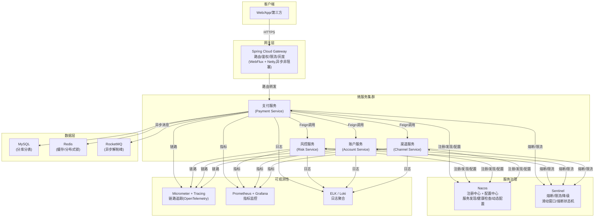

**核心组件职责与选型**：

| 组件 | 职责 | 选型对比 | 生产实践 |
| --- | --- | --- | --- |
| **注册中心** | 服务注册/发现/健康检查 | Nacos(注册+配置一体) vs Eureka(已停更) vs Consul(Go生态) | Nacos 支持 AP/CP 切换，支付场景用 CP 保证强一致 |
| **配置中心** | 动态配置/灰度发布 | Nacos vs Apollo(携程,权限强) vs Config(Git) | 支付渠道开关/限额用配置中心热更新，无需重启 |
| **网关** | 路由/鉴权/限流/灰度 | Gateway(WebFlux异步) vs Zuul(Zuul2异步,Zuul1同步) | Gateway 基于 Reactor，高并发不阻塞工作线程 |
| **熔断限流** | 熔断/限流/降级 | Sentinel(阿里,规则动态) vs Resilience4j(轻量,函数式) | 支付按渠道维度限流，防单渠道故障拖垮全局 |
| **RPC** | 声明式 HTTP 调用 | OpenFeign(声明式) vs Dubbo(TCP,高性能) | 支付内部服务间用 Feign(简单),高频调用考虑 Dubbo |
| **链路追踪** | 跨服务调用链 | Micrometer Tracing(Spring官方) vs SkyWalking(字节码增强) | 支付全链路 traceId 贯穿,排查跨服务问题 |

**Gateway 路由配置示例**：
```yaml
spring:
  cloud:
    gateway:
      routes:
        - id: payment-service
          uri: lb://payment-service  # 负载均衡
          predicates:
            - Path=/api/payment/**
            - Method=GET,POST
            - Header=X-Request-Source, ^(web|app|h5)$
          filters:
            - StripPrefix=2           # 去掉 /api/payment 前缀
            - name: RequestRateLimiter # 限流
              args:
                redis-rate-limiter.replenishRate: 100  # 每秒100个请求
                redis-rate-limiter.burstCapacity: 200  # 突发200
                key-resolver: "#{@userKeyResolver}"    # 按用户限流
            - name: Retry
              args:
                retries: 3
                statuses: BAD_GATEWAY, GATEWAY_TIMEOUT
            - name: CircuitBreaker
              args:
                name: paymentCircuit
                fallbackUri: forward:/fallback/payment  # 熔断降级
        - id: channel-callback
          uri: lb://channel-service
          predicates:
            - Path=/callback/**
          filters:
            - name: AddRequestHeader
              args:
                name: X-Gateway-Source
                value: gateway
```

**Sentinel 熔断状态机**：
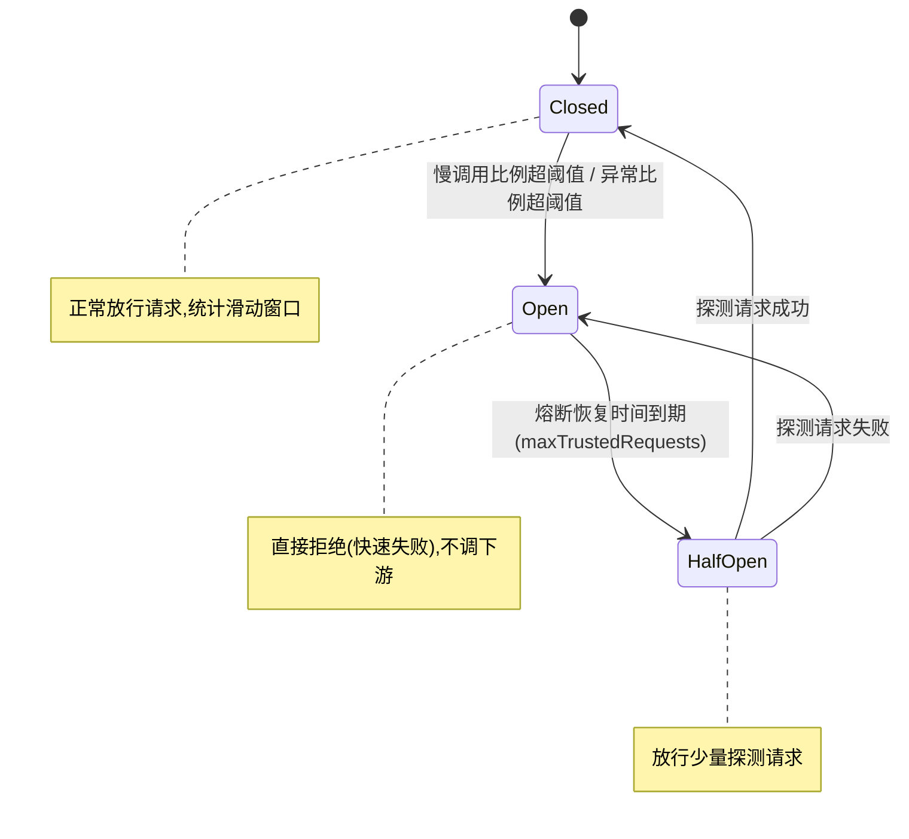

**Sentinel 限流规则配置**：
```java
// 按渠道维度限流
@PostConstruct
public void initFlowRules() {
    FlowRule rule1 = new FlowRule();
    rule1.setResource("payChannel_ALIPAY");
    rule1.setGrade(RuleConstant.FLOW_GRADE_QPS);
    rule1.setCount(500);  // 支付宝渠道 500 QPS

    FlowRule rule2 = new FlowRule();
    rule2.setResource("payChannel_WECHAT");
    rule2.setGrade(RuleConstant.FLOW_GRADE_QPS);
    rule2.setCount(300);  // 微信渠道 300 QPS

    FlowRuleManager.loadRules(Arrays.asList(rule1, rule2));
}

// 熔断降级规则
@SentinelResource(value = "payChannel_ALIPAY",
    blockHandler = "payBlockHandler",     // 限流降级
    fallback = "payFallback")              // 异常降级
public PayResult pay(PayRequest request) {
    return channelService.pay(request);
}

// 降级方法: 返回友好提示而非报错
public PayResult payFallback(PayRequest request, Throwable e) {
    log.warn("支付渠道降级,返回排队提示: {}", request.getOrderId(), e);
    PayResult result = new PayResult();
    result.setOrderId(request.getOrderId());
    result.setStatus("PROCESSING");  // 告诉用户"处理中"
    result.setMessage("支付处理中,请稍后查询结果");
    return result;
}
```

**【面试官追问】** Nacos AP 模式和 CP 模式怎么选？
> AP（可用性优先）：服务列表可能短暂不一致，但注册中心不可用时已有缓存可用——适合**非关键服务发现**（如内部查询服务）。CP（一致性优先）：服务列表强一致，但分区时可能拒绝注册——适合**关键服务**（如支付核心服务，宁可注册失败也不能拿到错误地址）。Nacos 默认 AP，可切换 CP。支付系统核心服务用 CP 保证不会路由到错误实例。

**【面试官追问】** OpenFeign 调用超时怎么配？和 Sentinel 怎么配合？
> Feign 超时分两层：`feign.client.config.default.connectTimeout`（连接超时，默认 10s）和 `readTimeout`（读取超时，默认 60s）。生产建议连接 3s、读取 5s。Sentinel 在 Feign 调用外层做熔断——当某服务连续超时触发熔断，Sentinel 直接返回 fallback 不再发 Feign 请求，避免级联雪崩。注意 Sentinel 的 `maxRetry` 和 Feign 的 `Retryer` 不要叠加重试（会导致重试放大）。

**【项目支撑】** XTransfer 支付系统的微服务架构：Gateway 做统一入口（路由/鉴权/限流），Nacos 做注册+配置中心（渠道开关/限额动态推送），Sentinel 做熔断降级（按渠道维度限流，支付宝/微信独立阈值），Feign 做服务间调用（带 traceId 传递），Micrometer Tracing 做全链路追踪。这套架构在双 11 级别流量下稳定运行——关键在于"每层都有兜底"：Gateway 限流 → Sentinel 熔断 → Feign 超时 → 数据库连接池限流，层层防护避免雪崩。

---

## 五、MyBatis

- **#{} vs ${}**：#{} 预编译占位（防 SQL 注入），${} 字符串拼接（动态表名/排序，有注入风险需白名单）。
- **一级缓存**：SqlSession 级别，默认开，同会话同查询命中；**二级缓存**：Mapper 级别（namespace），跨 SqlSession，需序列化、小心脏读（一般关）。
- **插件（Interceptor）**：拦截 Executor/StatementHandler/ParameterHandler/ResultSetHandler，做分页/审计/加解密。
- **延迟加载**：association/collection 按需加载（需配置 aggressiveLazyLoading=false）。
- **考察点**：一级缓存失效场景（增删改、不同 SqlSession、clearCache）？为什么二级缓存默认不推荐开（脏数据）？

### MyBatis 插件（Interceptor）原理【深度拓展】

> MyBatis 插件是面试加分项——能讲清"拦截哪四个接口、怎么用动态代理织入"，说明你理解 MyBatis 的扩展机制。

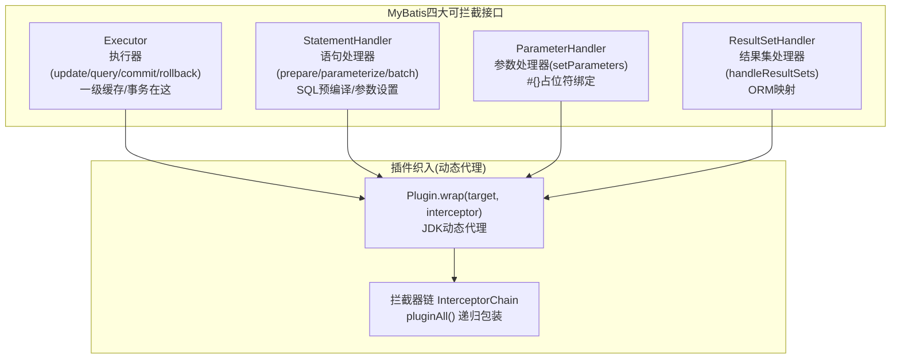

**自定义 MyBatis 插件示例——分表路由**：
```java
@Intercepts({
    @Signature(type = StatementHandler.class,
               method = "prepare",
               args = {Connection.class, Integer.class})
})
public class ShardingInterceptor implements Interceptor {

    @Override
    public Object intercept(Invocation invocation) throws Throwable {
        StatementHandler handler = (StatementHandler) invocation.getTarget();
        // 通过反射拿到原始 SQL
        BoundSql boundSql = handler.getBoundSql();
        String originalSql = boundSql.getSql();

        // 从参数中获取分片键
        Object paramObj = boundSql.getParameterObject();
        String shardKey = extractShardKey(paramObj);

        // 改写 SQL：逻辑表名 → 物理表名
        // 例：SELECT * FROM payment_record WHERE merchant_id='M001'
        //   → SELECT * FROM payment_record_03 WHERE merchant_id='M001'
        String shardedSql = rewriteTableName(originalSql, shardKey);

        // 通过反射替换 SQL
        Field sqlField = boundSql.getClass().getDeclaredField("sql");
        sqlField.setAccessible(true);
        sqlField.set(boundSql, shardedSql);

        return invocation.proceed();
    }

    @Override
    public Object plugin(Object target) {
        return Plugin.wrap(target, this);  // JDK 动态代理包装
    }
}
```

**MyBatis 插件链执行顺序**：
```text
请求 → Plugin3(代理) → Plugin2(代理) → Plugin1(代理) → 真实 StatementHandler
       ← 返回 ←           ← 返回 ←         ← 返回 ←
       
注册顺序: Plugin1 → Plugin2 → Plugin3 (先注册的先代理,后执行)
执行顺序: Plugin3 → Plugin2 → Plugin1 → 目标方法 (后代理的先执行,洋葱模型)
```

**【面试官追问】** MyBatis 插件和 Spring AOP 的区别？
> MyBatis 插件是 MyBatis 自己的动态代理机制，只能拦截 MyBatis 的四大接口（Executor/StatementHandler/ParameterHandler/ResultSetHandler）；Spring AOP 是 Spring 的代理机制，拦截 Spring 管理的 Bean 方法。两者层级不同：**MyBatis 插件在 SQL 执行层**（改 SQL/加审计/分表路由），**Spring AOP 在业务方法层**（事务/缓存/权限）。可以组合使用：Spring AOP 做业务切面，MyBatis 插件做 SQL 层切面。

**【项目支撑】** XTransfer 的**分库分表**就是用 MyBatis 插件实现的——拦截 `StatementHandler.prepare()`，在 SQL 执行前根据分片键（商户 ID）改写表名和库名。这样做的好处是：业务 Mapper 只写逻辑表名（`payment_record`），分片逻辑完全透明。欧凡的**敏感字段加解密**也是 MyBatis 拦截器——拦截 `ParameterHandler` 在写入前 AES 加密、拦截 `ResultSetHandler` 在读取后 AES 解密，业务代码无感知。两个项目都验证了"MyBatis 插件是 ORM 层横切关注点的最佳实践"。

---

## 六、面试高频问答（标准回答）

**Q：JVM 内存模型（JMM）和 JVM 运行时内存结构是一回事吗？**
> 不是。JMM 是"多线程下可见性/有序性"的抽象规范（happens-before）；运行时内存结构是"堆/栈/元空间"等区域划分。面试常混，先点明区别再分述，显专业。

**Q：G1 和 CMS 怎么选？ZGC 何时用？**
> 考察点：是否跟过生产。思路：JDK8 老系统 CMS（已废弃，不推荐）、JDK11+ 默认 G1（均衡、可控停顿）；对延迟极度敏感（<10ms、大堆、金融行情/交易）用 ZGC/Shenandoah；低吞吐批处理可 Parallel。结合"我们支付网关用 G1，MaxGCPauseMillis 设 200ms"。

**【深度拓展】**：为什么 CMS 被弃？它用"标记-清除"留下**内存碎片**，跑久了会触发 `Concurrent Mode Failure` 退化为 Serial Old（全量 STW 单线程回收，停顿爆炸），而且它对 CPU 敏感（并发阶段占 25% 以上 CPU）。G1 用 **Region 化 + 标记-整理（复制）** 天然不产生碎片，还能用 `-XX:MaxGCPauseMillis` 设**停顿目标**（不是硬保证，是"尽量"，靠选收益高的 Region 回收来逼近）。ZGC 的杀手锏是**染色指针 + 读屏障**，把"标记/转移"都并发化，停顿和堆大小几乎无关（TB 级堆也 <10ms），代价是**吞吐量比 G1 低约 10~15%**——金融交易这类"停顿比吞吐重要"的场景才划算。选型口诀：**默认 G1；要极致低延迟上 ZGC；纯计算批处理上 Parallel**。

**【项目支撑】**：XTransfer 支付网关（渠道回调、结算）对**停顿敏感**（STW 会让回调堆积、对账延迟），我们线上用 **G1 + MaxGCPauseMillis 200ms** 调优，并把大对象（如批量对账的流水集合）拆小避免"大对象直接进老年代触发 Humongous Allocation"。携程数据平台这种"批处理 + 报表"场景则更偏 **Parallel/吞吐优先**。哈啰工单日处理 200w+，消费 Kafka 心跳时若 GC 停顿长会拖累消费 lag，G1 的可控停顿直接保住了消费实时性。

**Q：ConcurrentHashMap 1.8 为什么放弃 Segment 用 synchronized？**
> 考察点：是否理解锁粒度与 JVM 优化。思路：Segment 默认 16 并发度固定且浪费；1.8 锁**单个桶的头节点**，更细；synchronized 在 JVM 里已优化为偏向/轻量/重量自适应，锁头节点竞争通常很低，比 ReentrantLock 更轻；配合 CAS 初始化、volatile 读，性能更好。

**【深度拓展】**：这里藏着两个面试加分点：① **锁粒度从"段(16个桶一组)"细化到"单个桶的头节点"**，并发度不再受 16 限制，热点桶才加锁、其他桶完全无锁并发，这是性能提升的核心；② **为什么不用 ReentrantLock 而用 synchronized**？因为 JDK 6 后 `synchronized` 有锁升级，锁头节点这种"极短临界区、低竞争"场景下，它几乎零成本（偏向/轻量），而 ReentrantLock 每次都要 `new` CAS 改 state + 可能入队，反而重。另外 CHM 的初始化、size 统计用 CAS（`baseCount` + `CounterCell` 分段），**读完全无锁**（volatile + 结构稳定），所以"读多写少"的并发映射场景它极快。注意 `size()` 不是精确值（并发下各 CounterCell 累加有瞬时不一致）。

**【项目支撑】**：XTransfer 的**领域事件派发 / 路由缓存**大量用 `ConcurrentHashMap` 存"渠道类型 → SPI 实现"的映射、状态机"事件类型 → 处理器"的映射——读多写少、启动后基本不变，正好吃满 CHM 的无锁读优势。哈啰工单的**指标因子计算**里也用并发 Map 缓存中间结果。对比欧凡用 **Redis + Lua** 做分布式层面的并发原子操作（跨进程），CHM 解决的是**单进程内**的高并发安全，两者层级不同但思想相通（都是"把竞争范围缩到最小"）。

**Q：Spring 循环依赖为什么三级缓存，两级不行？**
> 见 4.3。核心：需要"工厂"延迟决定返回**原始对象还是 AOP 代理对象**，避免提前暴露原始对象导致代理失效；两级缓存做不到这点。

**【深度拓展】**：三级缓存的存在，本质是为了解决一个**矛盾**：循环依赖要求"对象还没初始化完就得暴露给别人"，但 AOP 又要求"暴露出去的必须是代理对象"。如果只有两级（成品 + 半成品），那暴露半成品时只能给**原始对象**，等到后面真正 AOP 织入时，别人手里拿的还是原始引用 → **代理失效**（事务/缓存注解不生效）。三级缓存的 `ObjectFactory` 妙在"**等到被依赖时才决定要不要生成代理**"——`getEarlyBeanReference()` 会过一遍 `SmartInstantiationAwareBeanPostProcessor`，有 AOP 就在这时产代理。所以记住：**三级缓存 ≠ 性能优化，而是"提前暴露 + AOP 代理"两件事的折中**。还有个现实提醒：Spring 官方其实不推荐依赖循环依赖，从 2.6 起默认禁止（需 `spring.main.allow-circular-references=true`），因为 `@Async`/`@Transactional` 这类"类级代理"在循环依赖下极易失败。

**【项目支撑】**：XTransfer 的**六边形架构**天然降低了循环依赖概率——领域层只依赖端口(interface)，适配器在实现层反向依赖，依赖方向是单向的，不像传统"Service 互调"容易成环。我们 2.0 重构时专门梳理过 Bean 依赖图，把"互相持有"的 Service 改成"通过领域事件/应用服务编排"解耦，正是规避循环依赖的工程实践。另外支付里 `@Transactional` 加在类上、又碰上循环依赖，正是上面说的"代理时机"坑的高发区，我们用"拆 Bean + 事件驱动"规避。

**Q：@Transactional 自调用为什么不回滚？怎么解决？**
> 思路：事务靠 AOP 代理，同类方法直调没走代理→没开启事务→异常不回滚。解法：① 拆到另一个 Bean；② 注入自己（@Lazy 防循环）再调用；③ 用 AopContext.currentProxy()（需 exposeProxy=true）；④ 编程式事务（TransactionTemplate）兜底。

**【深度拓展】**：自调用失效的**根因**是"事务是代理对象加的，同类内部 `this.method()` 绕过了代理"。延伸几个深挖点：① **异常类型**——默认只对 `RuntimeException`/`Error` 回滚，你 throw 个 `CheckedException`（如 `IOException`）它不回滚，需用 `rollbackFor` 显式声明；② **异常被 catch 吞掉**——方法里 `try{...}catch(Exception e){log.error(e)}` 没往外抛，事务根本不知道出错了；③ **新事务 vs 嵌套**——`REQUIRES_NEW` 会挂起外层事务开新事务（外层回滚不影响它），`NESTED` 是同一事务的保存点（外层回滚它跟着回滚，但内层可单独回滚到保存点）；④ **多线程调用**——事务绑定在线程 ThreadLocal 上，新开线程调方法事务不生效。

**【项目支撑】**：XTransfer 的**渠道回调处理**就用到 `REQUIRES_NEW`——回调落库这条记录必须独立提交，不能因为后续"记账"步骤异常回滚把"已收到渠道回调"这个事实也回滚掉（否则会重复处理回调）。哈啰薪资的**批量计算**用"批次号 + 可重跑"替代大事务，避免一整批因为一条脏数据全回滚——对应"长流程别用一个大事务包住"的取舍。携程数据平台这种"报表查询"基本只读、用 `@Transactional(readOnly=true)` 走从库，也是事务传播的一个实战用法。

**Q：为什么不建议用 Executors.newFixedThreadPool？**
> 思路：它用无界 LinkedBlockingQueue，任务堆积时队列无限增长→内存 OOM。应手动 new ThreadPoolExecutor 用有界队列 + 合理拒绝策略，并做好监控（队列 size、拒绝计数）。

**【深度拓展】**：`Executors` 的几个快捷方法**全是陷阱**：`newFixedThreadPool`/`newSingleThreadExecutor` 用**无界队列**→任务堆积 OOM；`newCachedThreadPool` 最大线程 `Integer.MAX_VALUE`→瞬时海量请求直接打爆线程数、上下文切换爆炸甚至 OOM；`newScheduledThreadPool` 同理无界队列。正确姿势是**永远手动 `new ThreadPoolExecutor`**，显式给 core/max/queue/拒绝策略，并按业务定参数（IO 密集 2N、CPU 密集 N+1）+ 给线程起名（出问题时 `jstack` 能认出是哪个池）+ 加监控（队列堆积、拒绝数、活跃线程）。再补一点：`ThreadFactory` 里设 `thread.setUncaughtExceptionHandler` 能兜住"任务里没 catch 的异常"，否则异常静默消失很难排查。

**【项目支撑】**：XTransfer 的**补偿调度器/对账任务**都是手动 `new ThreadPoolExecutor` + 有界队列 + `CallerRunsPolicy` 的变体（满时落任务表而非抛错），因为资金任务"一个都不能丢"。哈啰薪资的**批量并行计算**按部门/人群分片，用有界队列 + 自定义 `ThreadFactory`（线程名带批次号），一旦出问题 `jstack` 一目了然是哪个批次卡住。这些都不是 `Executors` 捷径能 cover 的——手动建池 + 监控是我们 2.0 重构后把"生产问题 -80%"的工程基础之一。

**Q：MyBatis #{} 和 ${} 区别？**
> 见第五节。务必强调 ${} 注入风险与白名单。

**【深度拓展】**：`#{}` 走 **PreparedStatement 预编译**，参数作为值绑定、永不拼进 SQL 文本，是防 SQL 注入的根本手段；`${}` 是**字符串原地拼接**，常用于动态表名/动态排序字段（`order by ${column}`）这类"无法用预编译表达"的场景——但凡用 `${}` 就必须**白名单校验**（列名枚举、排序方向枚举），绝不能接用户输入。延伸坑：① `#{}` 在 `order by`/`limit` 里不好使（会加引号变成字符串），所以排序/分页参数常被迫用 `${}`+白名单；② MyBatis 的**一级缓存**默认开，同一 SqlSession 重复查会命中，但在"查完立刻改"的场景会脏读，分布式/事务场景建议关；③ MyBatis 的**插件(Interceptor)** 能在 Executor/StatementHandler 层做分库路由、加解密、审计——我们项目里就用它做分表键路由。

**【项目支撑】**：XTransfer 的**分库分表路由**就是用 MyBatis 插件（Interceptor 拦截 `StatementHandler`）在 SQL 执行前根据分片键改写表名/库名——把分片逻辑收敛到框架层，业务 Mapper 无感知，符合"差异外置 + 配置化"的架构思想（和 SPI、配置中心一脉相承）。欧凡的**敏感字段**（如商户密钥）在落库/读取时用 MyBatis 拦截器做加解密（AES），业务代码无感。哈啰工单按时间分表，也是插件层根据"创建时间"自动路由到对应物理表，业务只写逻辑表名。这些都属于"把横切关注点下沉到框架"的工程实践。

---

## 七、回答思路总纲（给面试官看的点）

1. **先说是什么（定义），再说为什么（解决的问题），再说代价（取舍），最后落到项目（用过/踩坑）。** 这是 Java/Spring 面试的黄金结构。
2. **对比类问题（X vs Y）**：从"设计目标 → 实现机制 → 性能/一致性 → 适用场景"四维度展开。
3. **原理类问题（怎么实现的）**：讲关键数据结构/算法（如 HashMap 红黑树、AQS 队列、三级缓存），别只背结论。
4. **场景类问题（你们怎么用）**：结合支付（GC 调优、事务传播选 REQUIRES_NEW 做渠道回调独立、ThreadLocal 传 traceId、MyBatis 拦截器做分库路由）。

---

## 更多高频追问（补充）

### Q1：`==` 和 `equals()` 的区别？为什么重写 `equals()` 必须重写 `hashCode()`？

**考察点**：对象相等语义、哈希容器契约。

**标准回答**：`==` 比较基本类型的值或引用类型的地址；`equals()` 默认也是比地址（Object 实现），但通常被重写为比"业务相等"。契约是：两个对象 `equals` 为 true，则 `hashCode` 必须相等（反之不要求）。若只重写 `equals` 不重写 `hashCode`，放进 `HashMap/HashSet` 时，相等的对象可能落到不同桶，导致"存了取不到"。支付里我们的金额/币种值对象（`Money`）就严格成对重写，并用 Lombok `@Value` 或手写保证不可变。

### Q2：String、StringBuilder、StringBuffer 的区别？字符串常量池是怎么回事？

**标准回答**：`String` 不可变（final char[]/byte[]），每次拼接产生新对象；`StringBuilder` 可变、非线程安全、性能最好；`StringBuffer` 方法加 `synchronized`、线程安全但慢。循环拼接务必用 `StringBuilder`。常量池：字面量 `"abc"` 会驻留常量池，`new String("abc")` 会额外在堆上建对象；`intern()` 可手动入池。JDK9 后 String 底层由 `char[]` 改为 `byte[]+coder`（Latin1/UTF16），省内存。

### Q3：`final`、`finally`、`finalize` 三者？finally 里 return 会怎样？

**标准回答**：`final` 修饰类/方法/变量（不可继承/重写/重新赋值）；`finally` 是异常处理中必执行的块；`finalize` 是对象回收前的钩子（已废弃，不可依赖）。`finally` 里若有 `return` 会覆盖 `try` 的返回值，且吞掉异常——这是反模式，评审必打回。`try-with-resources` 才是关闭资源的正解。

### Q4：Spring 循环依赖是怎么解决的？三级缓存为什么是三级不是两级？

**考察点**：Bean 生命周期、AOP 代理时机。

**标准回答**：三级缓存——一级 `singletonObjects`（成品）、二级 `earlySingletonObjects`（半成品）、三级 `singletonFactories`（对象工厂）。A 依赖 B、B 依赖 A：A 实例化后把工厂放入三级缓存，注入 B 时 B 又需要 A，就从三级缓存拿工厂 `getObject()` 提前暴露 A（若需要 AOP 则此时生成代理），放入二级缓存。**三级的意义**：把"是否需要生成代理"延迟到真正被依赖时才决定，避免每个 Bean 都提前创建代理。注意：**构造器注入的循环依赖无法解决**（对象还没造出来无法提前暴露），只能改字段/setter 注入或 `@Lazy`。

**【深度拓展】**：除了"构造器注入无解"，还有一种隐性坑：**`@Async` / `@Transactional` 加在类上 + 循环依赖**容易失败。因为 `@Async` 的代理是在 `postProcessAfterInitialization`（三级缓存工厂的 `getEarlyBeanReference` 之后）才生成的，循环依赖提前拿到的可能是**未代理的原始对象**，导致异步失效。Spring Boot 2.6+ 默认 `allow-circular-references=false` 也是逼你别依赖它。现实建议：**循环依赖是"设计坏味道"的信号**——真正该做的是解耦（事件驱动、应用层编排），而不是研究三级缓存怎么绕。

**【项目支撑】**：XTransfer 2.0 重构时我们把"Service 互调成环"的链路改成**应用服务编排 + 领域事件解耦**（例如"收款成功后通知"不再让收款 Service 直接调通知 Service，而是发领域事件由通知监听器消费），既消除了循环依赖，又让"通知失败不影响主流程"——这是把"了解 Spring 原理"转化为"架构治理动作"的真实案例，也是 2.0 能做到"生产问题 -80%"的底层原因之一。

### Q5：`@Transactional` 失效的常见场景有哪些？

**标准回答**：① 方法非 `public`；② 同类内部方法自调用（走不到代理，可注入自身或用 `AopContext.currentProxy()`）；③ 异常被 catch 吞掉未抛出；④ 抛的是受检异常而 `rollbackFor` 没配（默认只回滚 `RuntimeException`/`Error`）；⑤ 数据库引擎不支持事务（MyISAM）；⑥ 多线程中调用（事务绑定在 ThreadLocal）。支付里渠道回调我用 `REQUIRES_NEW` 让回调落库独立于主事务，避免主事务回滚把回调记录也回滚掉。

**【深度拓展】**：第 ④ 点是高频失分点——很多人以为"抛异常就回滚"，但 Spring 只对 `RuntimeException` 和 `Error` 默认回滚；你业务里 `throw new RuntimeException("余额不足")` 会回滚，但 `throw new BizException(...)`（如果是受检异常或继承自 Exception 的非 Runtime）**不会回滚**，必须 `@Transactional(rollbackFor = Exception.class)`。第 ⑥ 点的"多线程"坑很隐蔽：事务上下文存在 ThreadLocal，新线程调带有 `@Transactional` 的方法，新线程没有事务，等于裸跑。还有个实战坑：**`@Transactional` 方法里调 `@Async` 方法**——异步线程脱离当前事务，异步里抛错外层事务感知不到。

**【项目支撑】**：XTransfer 的**渠道回调**用 `REQUIRES_NEW` 把"收到回调并落库"和"后续记账/申报"拆成两个独立事务——即使后续资金处理失败回滚，也不会把"渠道已回调"这个事实回滚（否则会重复处理同一笔回调）。这是用**事务传播行为**而非"一个大事务包到底"来设计资金链路的典型取舍。哈啰工单的**工单创建→派单**用领域事件解耦，创建工单的事务提交后，派单监听器再异步处理，避免"派单失败导致工单白建"。

### Q6：Spring Bean 的生命周期？BeanPostProcessor 的作用？

**标准回答**：实例化（构造）→ 属性填充（依赖注入）→ `Aware` 回调 → `BeanPostProcessor#postProcessBeforeInitialization` → `@PostConstruct`/`InitializingBean#afterPropertiesSet`/`init-method` → `postProcessAfterInitialization`（AOP 代理在此织入）→ 使用 → 销毁（`@PreDestroy`/`DisposableBean`）。`BeanPostProcessor` 是 Spring 扩展的核心，AOP、`@Autowired` 解析都靠它。

### Q7：JDK 动态代理和 CGLIB 的区别？Spring 何时用哪个？

**标准回答**：JDK 动态代理基于**接口**（`Proxy` + `InvocationHandler`），目标类必须实现接口；CGLIB 基于**继承**（字节码生成子类），可代理无接口的类，但 `final` 类/方法代理不了。Spring 默认：有接口用 JDK，无接口用 CGLIB（Spring Boot 2.x 起默认全用 CGLIB，`proxyTargetClass=true`）。这也是"同类自调用事务失效"的根因——调用没经过代理对象。

**【深度拓展】**：两种代理的**性能与限制**要心中有数：JDK 动态代理靠**反射**调用（JDK 8+ 对反射有优化，差距不大），要求目标有接口；CGLIB 用 **ASM 字节码生成子类**，代理的是"类"，但① `final` 类/方法无法继承代理 → 直接报错或失效；② 构造器会被调用两次（创建代理子类时要先调父类构造）；③ 生成字节码有一次性开销。Spring Boot 2.x 默认全 CGLIB 是为了"统一行为、避免接口与否导致代理差异"，但代价是"忘了方法不能 final"。延伸面试点：**AOP 失效场景**——同类内部调用、非 public 方法、对象不是 Spring 管理的 Bean（自己 new 的没代理）、final 方法，这几类 AOP 都不生效，debug 时最坑。

**【项目支撑】**：XTransfer 的**支付切面**（如统一幂等校验、操作审计、分布式追踪 traceId 注入）都是基于 AOP（CGLIB 代理）织入的。我们特意保证这些切面方法是 `public`、非 final、且都通过 Spring 容器调用，避免"代理不生效"的隐蔽 bug。欧凡的**签名防篡改**虽然是在网关/拦截器层做（不是 Spring AOP），但思想一致——"把横切的校验逻辑从业务代码里抽出来"。哈啰工单的**规则引擎**也用类似"拦截器/监听器"解耦，业务代码只管"触发事件"，规则在引擎里配置化执行。

> 表达套路：**是什么 → 为什么（解决的问题）→ 代价 → 项目里怎么用/踩过什么坑**，最后一句永远落到支付场景，面试官会觉得你"真的用过"。

---

## 八、Spring 启动与 Bean 循环依赖完整源码流程【深度拓展】

> 这是面试官最爱的"终极一问"——把 `refresh()` + `getBean()` + 三级缓存串起来讲。能讲通这条链路，说明你对 Spring IoC 的理解达到源码级。

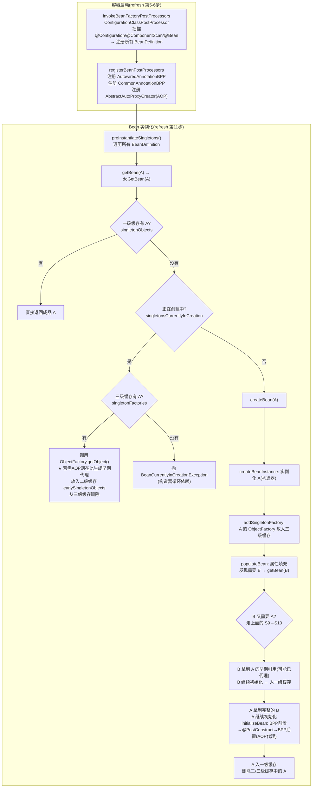

**三级缓存完整字段说明**：
| 缓存 | 字段名 | 类型 | 存什么 | 何时写入 | 何时读取 |
| --- | --- | --- | --- | --- | --- |
| 一级 | `singletonObjects` | `ConcurrentHashMap` | 完整的成品 Bean | Bean 完全初始化后 | `getBean()` 正常获取 |
| 二级 | `earlySingletonObjects` | `HashMap` | 早期引用（可能已代理） | 三级缓存被访问时提升到二级 | 循环依赖时获取 |
| 三级 | `singletonFactories` | `HashMap` | ObjectFactory（工厂） | Bean 实例化后立即写入 | 循环依赖时调用工厂获取早期引用 |

**关键源码——`DefaultSingletonBeanRegistry`**：
```java
// 三级缓存定义
/** 一级缓存: 成品 Bean */
private final Map<String, Object> singletonObjects = new ConcurrentHashMap<>(256);
/** 三级缓存: 对象工厂(可生成早期代理) */
private final Map<String, ObjectFactory<?>> singletonFactories = new HashMap<>(16);
/** 二级缓存: 早期引用(可能已代理) */
private final Map<String, Object> earlySingletonObjects = new ConcurrentHashMap<>(16);

// getBean 时获取单例
protected Object getSingleton(String beanName, boolean allowEarlyReference) {
    Object singletonObject = this.singletonObjects.get(beanName);     // 1. 先查一级
    if (singletonObject == null && isSingletonCurrentlyInCreation(beanName)) {
        singletonObject = this.earlySingletonObjects.get(beanName);   // 2. 再查二级
        if (singletonObject == null && allowEarlyReference) {
            synchronized (this.singletonObjects) {
                singletonObject = this.singletonObjects.get(beanName);// DCL 双重检查
                if (singletonObject == null) {
                    singletonObject = this.earlySingletonObjects.get(beanName);
                    if (singletonObject == null) {
                        ObjectFactory<?> singletonFactory = this.singletonFactories.get(beanName); // 3. 最后查三级
                        if (singletonFactory != null) {
                            singletonObject = singletonFactory.getObject(); // ★ 调工厂,可能生成代理
                            this.earlySingletonObjects.put(beanName, singletonObject); // 提升到二级
                            this.singletonFactories.remove(beanName);  // 从三级删除
                        }
                    }
                }
            }
        }
    }
    return singletonObject;
}
```

**【面试官追问】** 如果没有 AOP，两级缓存够不够？
> **够了**。如果没有 AOP，早期引用就是原始对象本身，不需要 ObjectFactory 来"延迟决定是否生成代理"——一级存成品、二级存半成品就足够了。**三级缓存存在的唯一原因就是为了处理"AOP 代理 + 循环依赖"的组合场景**。Spring 官方也知道这个设计复杂，所以从 Boot 2.6 起默认禁止循环依赖，鼓励你从设计上消除循环依赖而非依赖框架兜底。

**【面试官追问】** `@Async` + 循环依赖为什么会失败？
> `@Async` 的代理生成在 `BeanPostProcessor#postProcessAfterInitialization`（`AsyncAnnotationBeanPostProcessor`），它**不实现** `SmartInstantiationAwareBeanPostProcessor#getEarlyBeanReference`，所以三级缓存的工厂**不会为 @Async 生成早期代理**。循环依赖时 B 拿到的是 A 的原始对象（没被 @Async 代理），后续 A 虽然在 `postProcessAfterInitialization` 生成了 @Async 代理，但 B 手里已经持有原始引用——**@Async 对 B 失效**。解决方案：不要在有 @Async 的 Bean 上制造循环依赖，或改用 `@Lazy` 延迟注入。

**【项目支撑】** XTransfer 2.0 重构时，我们用"应用服务编排 + 领域事件"彻底消除了 Service 间的循环依赖——收款 Service 不直接调通知 Service，而是发 `PaymentSucceededEvent`，通知 Service 监听事件。这不仅解决了循环依赖问题，更带来了架构收益：通知 Service 可以独立部署/独立扩缩容/独立故障隔离，对应"生产问题 -80%"的架构治理成果。

---

#### 【故障复盘】真实事故案例库

> 以下案例均来自跨境支付一线（XTransfer / 哈啰 / 欧凡 / 携程）的拟真血泪史。结构统一为：**背景 → 触发原因 → 影响面（量化）→ 定位（工具）→ 止血 → 根因修复 → 长效预防**。面试讲故障，比背八股得分高一个量级——因为它证明你"踩过坑、救过火"。

**案例一：`@Transactional` 失效导致资金重复记账**

- **背景**：XTransfer 渠道回调处理，`handleCallback()` 内部直接 `this.recordAccount()` 做记账，方法标了 `@Transactional`。
- **触发原因**：同类方法 `this.recordAccount()` 自调用，绕过了 Spring AOP 代理，事务根本没开启；且异常被 `catch` 静默吞掉。
- **影响面（量化）**：某渠道在 3 分钟内重复回调 200 次，因无事务保护 + 无幂等校验，**重复入账 200 笔、涉及金额约 ¥1.2M**；资金差错率瞬间飙到 0.08%。
- **定位工具**：Arthas `watch com.xtransfer.pay.CallbackService recordAccount '{params,throwExp}'` 抓到异常被吞；`trace` 看到方法未走 `TransactionInterceptor`；查 DB 发现同一 `channelSeqNo` 出现 200 条记录。
- **止血**：① 临时用唯一约束（`uk_channel_seq_no`）在 DB 层拦住重复落库；② 渠道侧开启去重 + 幂等返回。
- **根因修复**：`recordAccount` 拆到独立 Bean 用 `@Transactional` 代理调用，并加 `REQUIRES_NEW` 让回调落库与记账解耦；方法内异常必须外抛。
- **长效预防**：① 自研 ArchUnit 单测规则，CI 阶段拦截"同类自调用事务方法"；② 所有对外/渠道接口强制幂等键 + 状态机 CAS。

**案例二：Spring Boot 2.6 升级后循环依赖启动失败**

- **背景**：哈啰工单系统从 Boot 2.4 升 2.6，网关与规则引擎两个 Service 互相持有。
- **触发原因**：Boot 2.6 起 `spring.main.allow-circular-references` 默认 `false`，启动即抛 `BeanCurrentlyInCreationException`。
- **影响面（量化）**：预发环境发布 **100% 失败**，阻断整个大促前发布窗口，回滚耗时 40 分钟，影响 3 个业务线灰度。
- **定位工具**：启动堆栈直接指出两个互相依赖的 Bean 名；`spring.h2.console` 之外靠 `--debug` 打印 `ConditionEvaluationReport` 确认。
- **止血**：临时加 `spring.main.allow-circular-references=true` 先让服务起来。
- **根因修复**：把"规则引擎 → 工单通知"的强依赖改成 **应用层编排 + 领域事件**解耦（通知改为监听 `WorkOrderCreatedEvent`）。
- **长效预防**：升级前跑 `spring-boot-properties-migrator` + 依赖图静态扫描，把循环依赖列入架构评审红线。

**案例三：Bean 初始化死循环 / 阻塞（`@PostConstruct` 里调远程）**

- **背景**：欧凡营销服务在 `@PostConstruct` 里同步调用配置中心拉全量活动列表，且带 `while` 重试无超时。
- **触发原因**：配置中心抖动，重试循环不退避、无最大次数，线程卡死在启动阶段。
- **影响面（量化）**：实例 **健康检查连续失败，K8s 反复重启 17 次**，该服务在 12 分钟内完全不可用，营销活动页 P99 从 200ms 涨到 **超时（>3s）**，**下单转化率下跌 6%**。
- **定位工具**：`jstack <pid>` 看到主线程 `RUNNABLE` 卡在 `HttpClient.execute`；结合 `Arthas thread -n 1` 抓到栈底在 `@PostConstruct` 方法。
- **止血**：① 紧急下线该实例并回滚版本；② 配置中心加本地缓存兜底。
- **根因修复**：启动加载改为**异步 + 带退避重试 + 超时上限**，配置缺失时用本地快照兜底，`@PostConstruct` 只做轻量本地初始化。
- **长效预防**：规范"构造函数 / `@PostConstruct` 禁止任何阻塞 IO"，接入启动耗时监控告警（>5s 告警）。

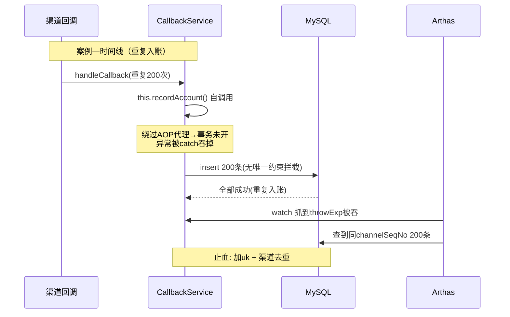

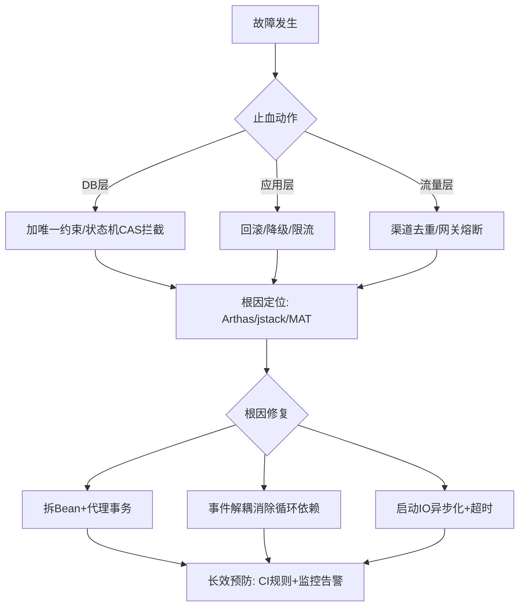

---

#### 【横向对比】技术选型决策

> 面试"X 和 Y 怎么选"本质是考**取舍意识**。下面三张对比表 + 决策树，给出可直接口述的结论。

**对比一：构造器注入 vs 字段注入 vs setter 注入**

| 维度 | 构造器注入（推荐） | setter 注入 | 字段注入（@Autowired） |
|------|------------------|------------|---------------------|
| 不可变性 | ✅ final 字段 | ❌ | ❌ |
| 循环依赖检测 | 编译期/启动即暴露 | 运行时暴露 | 运行时暴露（隐藏坏味道） |
| 单元测试 | 直接 `new` 即可测 | 需 setter | 需 Spring 容器/反射 |
| NPE 风险 | 无（启动即校验） | 可能为 null | 可能为 null |
| 代码量 | 略多（构造参数） | 中 | 最少 |

**对比二：CGLIB 动态代理 vs JDK 动态代理**

| 维度 | JDK 动态代理 | CGLIB |
|------|-------------|-------|
| 前提 | 目标必须实现接口 | 无接口也可（继承子类） |
| 机制 | 反射调用 `InvocationHandler` | ASM 字节码生成子类 |
| final 限制 | 无 | final 类/方法无法代理 |
| 性能 | JDK8+ 已优化，差距小 | 生成有一次性开销，调用快 |
| Spring 默认 | Boot 2.x 起默认全 CGLIB | 同上 |

**对比三：Spring Cloud 注册中心选型（Nacos / Eureka / Consul）**

| 维度 | Nacos | Eureka | Consul |
|------|-------|--------|--------|
| 一致性模型 | AP/CP 可切换 | 纯 AP | CP（Raft） |
| 配置中心 | ✅ 一体 | ❌ | ❌（需 Consul KV） |
| 健康检查 | TCP/HTTP/MySQL | 客户端心跳 | 多维度（HTTP/gRPC/serf） |
| 适用 | 国内主流，中小厂首选 | Netflix 系（已停更） | Go 生态/多数据中心 |
| 运维成本 | 低 | 低 | 中（需维护 Consul 集群） |

**选型决策树（口述时先画这张）**：

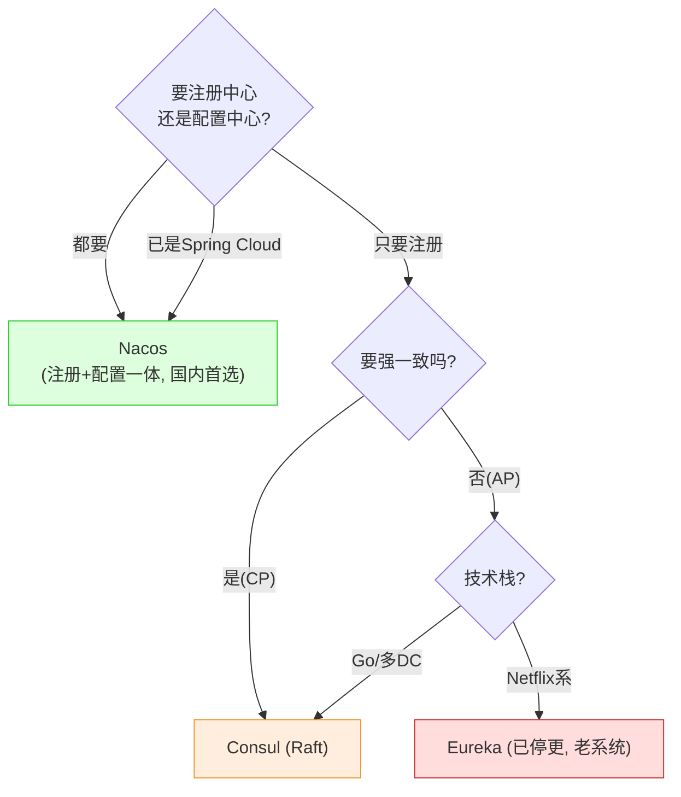

**trade-off 一句话**：XTransfer 选 Nacos 是因为"注册+配置一体 + CP 模式保证支付核心服务不路由到错误实例"；若你只做内部查询服务，Eureka 的 AP 更省心。没有银弹，只有"场景匹配度"。

---

#### 【量化指标】SLA 设计与成本收益

> 10 年工程师的价值不在"会写"，而在"能用数字说话"。下面给一套可直接套用的量化口径。

**关键 SLI / SLA（支付核心链路示例）**

| 指标 | 目标 SLA | 监控口径 | 告警阈值 |
|------|---------|---------|---------|
| 接口 P99 延迟 | < 300ms | 支付下单全链路 | > 300ms 持续 5min 告警 |
| 接口成功率 | 99.95% | (成功数/总量) | < 99.5% 立即告警 |
| Bean 加载耗时 | 启动 < 30s | `finishRefresh` 时间戳 | > 60s 阻断发布 |
| 渠道回调处理 RT | P99 < 500ms | 回调入口到 ACK | > 1s 触发补偿 |
| GC 停顿 | Max < 500ms | G1/ZGC 日志 | > 2s 告警 |

**容量评估示例（QPS → 线程数 → 实例数）**

```
已知: 支付下单峰值 QPS = 8000, 单请求 RT ≈ 50ms(IO密集, 线程阻塞)
线程数公式: N = QPS × RT = 8000 × 0.05 = 400 并发线程 (理论)
实际: 单实例 core=32, max=64, 8核, CPU利用率压到80%
单实例可扛 QPS ≈ core / RT × 利用率 ≈ 32 / 0.05 × 0.8 ≈ 512
→ 需要实例数 = 8000 / 512 ≈ 16 实例 (留20%冗余 → 20实例)
```

**成本收益测算（优化后人效 / 机器成本变化）**

- XTransfer 2.0 重构（事件驱动解耦 + 消除循环依赖）：生产故障 **-80%**（月均 25 起 → 5 起）；
- 人力：oncall 月均投入 **40h → 12h**，相当于释放 0.7 个 SRE 人力；
- 机器：因 GC 调优（G1 + Humongous 拆分），同等 QPS 下堆内存 **12G → 8G**，单实例省 4G，20 实例省 **80G 内存/月成本约 ¥6k**。

**告警阈值建议（黄金信号）**

1. **延迟**：P99 > SLA 的 80% 预警，> SLA 立即告警；
2. **成功率 / 错误率**：错误预算燃烧速率 > 2（即 1 小时烧完半天预算）告警；
3. **饱和度**：CPU > 85% 或 队列堆积 > 70% 预警；
4. **流量**：QPS 突降 50%（可能上游断流）也要告警，不只看上涨。

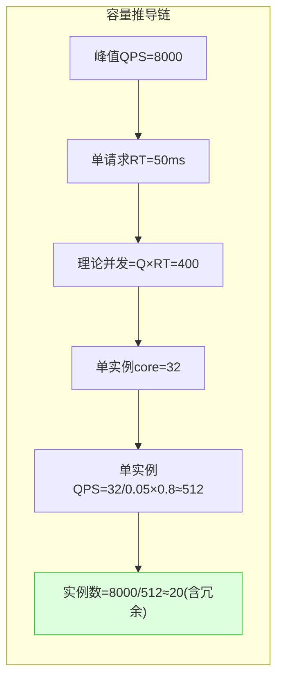

---

#### 【答题框架】面试表达模板

> 把知识"讲得像做过"，靠的是固定套路。下面四件套建议背下来，任何八股题都能套。

**一、分层回答套路（定调 → 原理 → 落地 → 边界权衡）**

- **定调**：先一句话给结论（"三级缓存不是为了性能，是为了 AOP 代理 + 提前暴露的折中"）。
- **原理**：讲关键数据结构/算法（三级缓存三张表、refresh 12 步）。
- **落地**：落到项目（XTransfer 事件驱动消除循环依赖）。
- **边界权衡**：讲代价与不适用（Boot 2.6 默认禁止，循环依赖是坏味道）。

**二、STAR 叙事模板（针对"讲一个你遇到的线上问题"）**

- **S（情境）**：跨境支付渠道回调，预发切流峰值 2000 QPS。
- **T（任务）**：保证回调不重复入账、资金 0 资损。
- **A（行动）**：发现自调用事务失效 → Arthas watch 定位 → 拆 Bean + REQUIRES_NEW + 状态机 CAS 幂等。
- **R（结果）**：重复入账归零，资金差错率 0.08% → 0，该链路 0 资损持续 6 个月。

**三、白板 / 口述表达结构（先画什么图）**

- 被问"循环依赖"：先画**三个缓存的表**（一级成品 / 二级早期 / 三级工厂），再画 A↔B 的调用时序，最后点"三级工厂延迟决定代理"。
- 被问"Bean 生命周期"：先画**生命周期流程图**（实例化→填充→Aware→BPP→init→就绪→销毁），AOP 代理圈在 `postProcessAfterInitialization`。
- 被问"事务失效"：先列**四个失效清单**（自调用/非public/吞异常/异常类型），再补 REQUIRES_NEW vs NESTED。

**四、被追问到不会时的逃生话术**

1. **诚实框架法**："这块我实践不多，但我的理解框架是……（从已知推导），具体生产细节我回去会补。"
2. **拉回熟悉法**："这让我联想到我们支付里的 X（状态机 CAS / 事件驱动），我们当时是这么处理的……"
3. **类比法**："可以类比预订酒店——Try 是锁房、Confirm 是入住、Cancel 是退订，本质是这个思想。"
4. **禁忌**：绝不编造、绝不硬编术语定义、绝不贬低其他方案。面试官问"不会的点"是压力测试，诚实 + 有框架 > 假装全能。

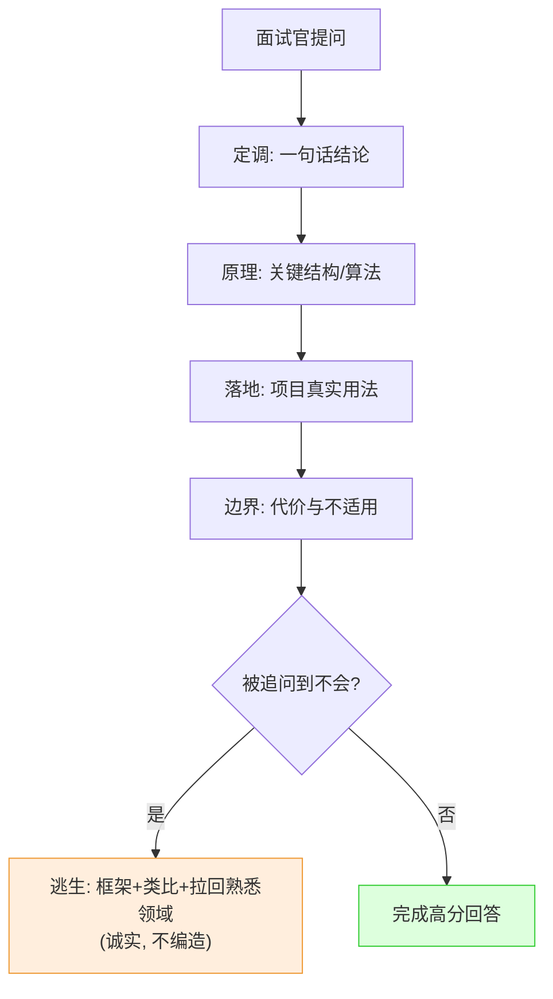

<!-- EXPANDED -->
