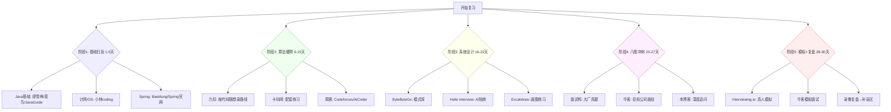
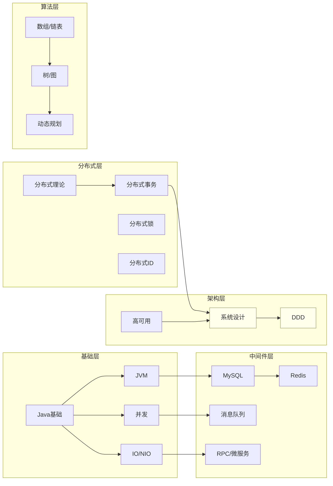
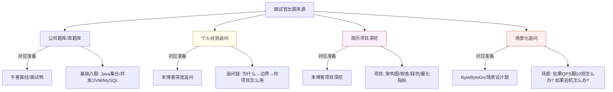
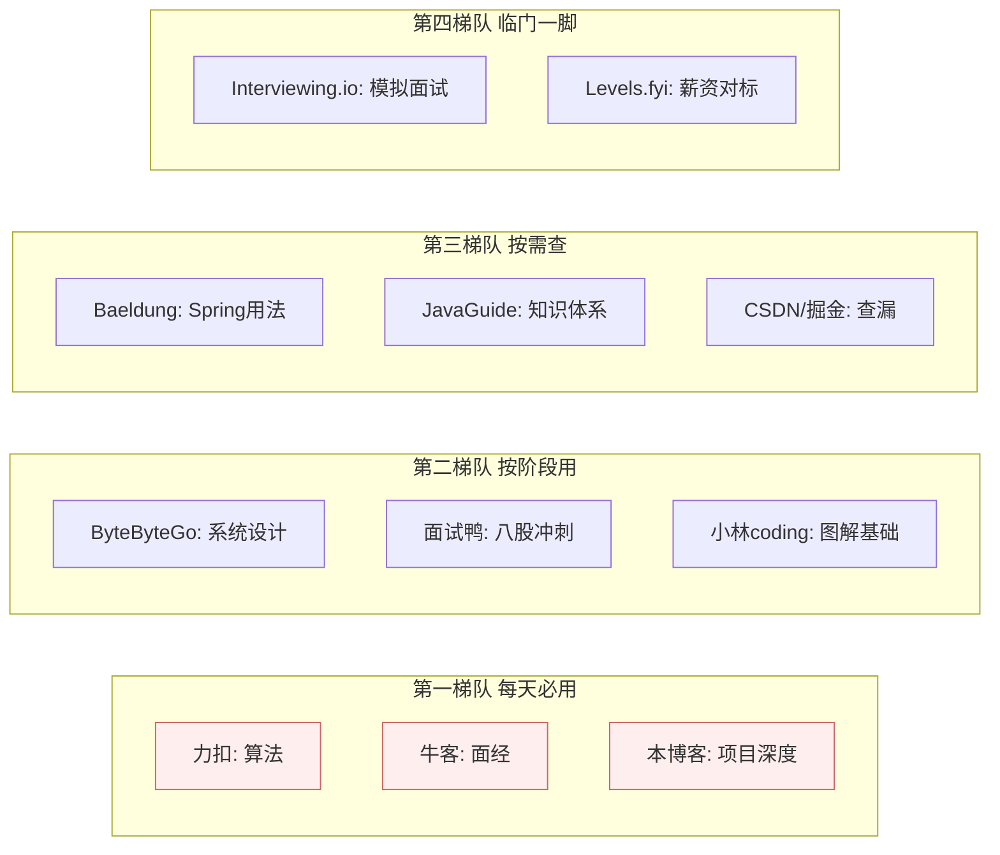
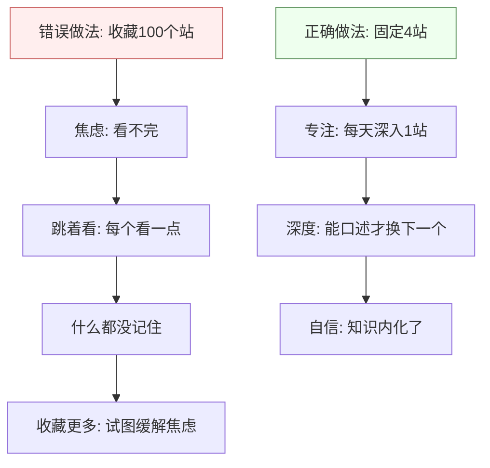
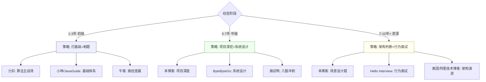

> 本博客是我的「私房笔记 + 项目沉淀」，而下面这份清单是「外部弹药库」。两者配合使用最高效：**用外部站刷题、看面经、补广度，用本博客把知识落到自己的支付项目上、训练表达**。
> 本文由 2026-07 多组联网检索汇总而成，共 **8 大类、60+ 站点**，已去重。

---

## 目录

- [一、国内综合面经 / 刷题 / 八股（20）](#一国内综合面经--刷题--八股20)
- [二、国际刷题 / 竞赛 / 练习（12）](#二国际刷题--竞赛--练习12)
- [三、系统设计 / 架构面试专项（12）](#三系统设计--架构面试专项12)
- [四、Java 技术文档 / 教程 / 官方（15）](#四java-技术文档--教程--官方15)
- [五、开源面试仓库（GitHub，14）](#五开源面试仓库github14)
- [六、模拟面试 / 笔试 / 求职测评（11）](#六模拟面试--笔试--求职测评11)
- [七、课程 / 视频 / 社区（9）](#七课程--视频--社区9)
- [八、公司招聘 / 薪资 / 职场社区（8）](#八公司招聘--薪资--职场社区8)
- [我的 30 天使用路线](#我的-30-天使用路线)
- [防坑提醒](#防坑提醒)

---

## 一、国内综合面经 / 刷题 / 八股（20）

| # | 网站 | 地址 | 定位 | 适合阶段 | 亮点 |
|---|------|------|------|----------|------|
| 1 | 牛客网 | nowcoder.com | 校招/社招笔面经+题库+内推 | 全程 | 面经最全、可刷公司真题、内推活跃 |
| 2 | 面试鸭 | mianshiya.com | 10000+ 八股真题（Java/后端/前端） | 八股冲刺 | 按大厂/岗位分类，带答案解析 |
| 3 | 力扣（中国） | leetcode.cn | 算法主战场 | 算法全程 | 中文题解、竞赛、模拟面试 |
| 4 | 力扣（国际） | leetcode.com | 英文题解/Explore/Discuss | 算法+英文岗 | 题量最大、社区题解质量高 |
| 5 | 代码随想录 | programmercarl.com | 算法图文+视频路线 | 算法入门→进阶 | 按题型成体系，配卡码网练习 |
| 6 | 卡码网 | kamacoder.com | 代码随想录配套练习 | 算法练习 | 与随想录章节一一对应 |
| 7 | 掘金 | juejin.cn | 技术文章/面经/课程 | 全程 | 大厂工程师原创、更新快 |
| 8 | CSDN | csdn.net | 最大中文技术博客 | 查漏补缺 | 覆盖广，质量参差需筛选 |
| 9 | 博客园 | cnblogs.com | 老牌技术社区 | 查漏补缺 | 深度长文多 |
| 10 | 知乎 | zhihu.com | 面经/专栏 | 全程 | 搜「Java 面试」有大量汇总 |
| 11 | 思否 | segmentfault.com | 技术问答 | 遇坑查 | 问答社区 |
| 12 | 简书 | jianshu.com | 技术随笔 | 碎片阅读 | 偏个人复盘 |
| 13 | 慕课网 | imooc.com | 视频课程 | 体系学习 | 实战项目课多 |
| 14 | 极客时间 | geekbang.org | 付费精品课 | 进阶 | 《Java 并发编程》《左耳听风》等 |
| 15 | 廖雪峰官网 | liaoxuefeng.com | 免费教程 | 基础 | Java/Python 入门经典 |
| 16 | 菜鸟教程 | runoob.com | 语法速查 | 基础 | 随手查 API/语法 |
| 17 | 小林coding | xiaolincoding.com | 图解计网/OS/后端面经 | 基础+后端 | 图文并茂，大厂面经汇总 |
| 18 | JavaGuide 在线站 | javaguide.cn | 面试指南 | 全程 | 与开源仓库同步，阅读体验好 |
| 19 | 面试库/面试禅 | mianshichan.com 等 | 八股速记 | 冲刺 | 卡片式速记，适合通勤 |
| 20 | 看准网 | kanzhun.com | 公司面经/薪资/评价 | offer 选择 | 结合 Boss 直聘生态 |

---

**【这类站点怎么高效用】** 国内面经/八股站是「查漏 + 口述练习」的主场，别泛刷：
- **牛客网**：主攻目标公司的**真实笔面经 + 真题**，按「公司 + 岗位」筛，刷完把被问到的点补回本博客「面试高频考点深度追问」；
- **面试鸭 / 面试库**：八股冲刺用，按大厂/岗位分类带解析，通勤卡片速记，但答案以官方文档复核；
- **力扣（中国）**：算法唯一主战场，跟「代码随想录」路线刷，别只 AC 不复盘；
- **代码随想录 + 卡码网**：算法成体系入门→进阶，先看懂思路再自己写；
- **掘金 / 小林coding / JavaGuide 在线站**：基础与后端面经的「图文深度」，大厂面经汇总优先读小林；
- **CSDN / 博客园 / 知乎**：查漏补缺，质量参差要筛，优先看高赞 + 有源码的；
- **廖雪峰 / 菜鸟教程**：语法速查，不系统学；
- 策略：**八股用「口述」而非「默读」**——能对着空气讲清才算会；面经用来找自己知识盲区，不是背答案。

### 1.1 重点网站深度推荐

> 以下是国内面经/八股类 Top 5 网站的**详细使用指南**，包括重点推荐文章和面试价值。

**牛客网（nowcoder.com）——面经第一站**

| 功能 | 重点推荐 | 面试价值 |
| --- | --- | --- |
| 公司真题 | 搜"腾讯Java社招"、"阿里P7面经" | 直接了解目标公司考什么 |
| 笔试真题 | 各公司历年笔试题+在线判题 | 笔试前必刷 |
| 内推 | 各公司员工发内推帖 | 投递提效 |
| 面试经验 | "面试经历"板块按公司/岗位筛选 | 找同岗位的面试流程 |
| 讨论区 | "求问"板块看高频面试题 | 查漏补缺 |

> **使用技巧**：不要泛刷面经。先确定 3-5 家目标公司，只搜这些公司的面经，按时间排序看最近 3 个月的。把被问到的知识点标记出来，高频的就是你的复习重点。牛客的面经质量参差，优先看"带详细回答"的帖子。

**面试鸭（mianshiya.com）——八股冲刺神器**

| 功能 | 重点推荐 | 面试价值 |
| --- | --- | --- |
| 八股题库 | Java/后端/前端 10000+ 真题 | 按大厂/岗位分类，带答案解析 |
| 智能出题 | 选择目标公司和岗位，AI 组卷 | 模拟真实面试范围 |
| 卡片速记 | 通勤碎片时间 | 反复记忆高频考点 |
| 错题本 | 自动记录答错的题 | 针对性复习 |

> **使用技巧**：面试鸭适合"最后冲刺阶段"用——前期用本博客打基础，后期用面试鸭做"自测"（看着题目口述答案，再对比解析查漏）。注意：面试鸭的答案质量参差，遇到和官方文档冲突的以官方为准。

**小林coding（xiaolincoding.com）——图解基础天花板**

| 主题 | 重点推荐文章 | 面试价值 |
| --- | --- | --- |
| 图解MySQL | "MySQL为什么用B+树"、"MVCC怎么实现的"、"事务隔离级别详解" | 数据库高频考点 |
| 图解Redis | "Redis为什么这么快"、"RDB vs AOF"、"集群模式详解" | 缓存高频考点 |
| 图解网络 | "TCP三次握手详解"、"HTTP/2 vs HTTP/3"、"HTTPS原理" | 计网高频考点 |
| 图解OS | "进程 vs 线程"、"零拷贝详解"、"虚拟内存" | OS高频考点 |
| 后端面经 | 大厂面经汇总+深度解析 | 直接拿来做模拟 |

> **使用技巧**：小林coding 是"图解+原理"的天花板，适合**理解原理**而非背八股。面试官问"MySQL 为什么用 B+树"时，你能画出 B+树结构、讲清"磁盘IO次数少、范围查询友好"——这就是小林的功劳。建议每个主题至少读 2 遍：第一遍理解、第二遍能口述。

**JavaGuide 在线站（javaguide.cn）——知识体系全景**

| 主题 | 重点推荐 | 面试价值 |
| --- | --- | --- |
| Java基础 | 集合源码、IO/NIO、反射 | 建立知识框架 |
| 并发编程 | 线程池、锁机制、AQS | 高频考点体系化 |
| JVM | 内存模型、GC、类加载 | 中高级必问 |
| 数据库 | MySQL索引/事务/锁 | 高频必问 |
| 框架 | Spring/SpringBoot/MyBatis | 框架原理 |
| 系统设计 | 分布式/微服务/高可用 | 资深必看 |

> **使用技巧**：JavaGuide 适合**建立知识框架**——先过一遍目录知道"Java面试考什么"，再按主题逐个深入。它的深度不如本博客的支付项目实战，但广度足够。和本博客配合：JavaGuide 补广度、本博客补深度。

**代码随想录（programmercarl.com）——算法体系化路线**

| 主题 | 重点推荐 | 面试价值 |
| --- | --- | --- |
| 数组 | 双指针/滑动窗口/前缀和 | 高频必刷 |
| 链表 | 虚拟头节点/翻转/环检测 | 高频必刷 |
| 哈希表 | 两数之和/三数之和/四数之和 | 高频必刷 |
| 字符串 | KMP/回文/子串 | 中高频 |
| 树 | BFS/DFS/回溯/构造 | 高频必刷 |
| 动态规划 | 背包/子序列/股票 | 中高级区分点 |

> **使用技巧**：代码随想录最大的价值是**按题型成体系**——不是随机刷题，而是按"数组→链表→树→DP"的路线系统训练。每题先看思路再自己写，AC 后写"这题考什么模式、哪里易错"。配卡码网在线练习，不用本地搭环境。**别刷偏题竞赛题**，面试考的都是经典模式。

## 二、国际刷题 / 竞赛 / 练习（12）

| # | 网站 | 地址 | 定位 | 适合阶段 | 亮点 |
|---|------|------|------|----------|------|
| 21 | HackerRank | hackerrank.com | 公司真题/编程挑战 | 算法+笔试 | 很多外企笔试直接用 |
| 22 | Codeforces | codeforces.com | 算法竞赛 | 算法高手 | 周赛锻炼手速与思维 |
| 23 | AtCoder | atcoder.jp | 日本算法竞赛 | 算法进阶 | 题目质量高、难度分层好 |
| 24 | TopCoder | topcoder.com | 竞赛/组件开发 | 算法高手 | 老牌竞赛社区 |
| 25 | Codewars | codewars.com | kata 微练习 | 日常 | 碎片时间练手感 |
| 26 | Exercism | exercism.org | 导师制练习 | 入门→进阶 | 有人 review 代码风格 |
| 27 | InterviewBit | interviewbit.com | 印度面试准备 | 算法系统练 | 现并入 Scaler |
| 28 | CodeChef | codechef.com | 印度竞赛 | 算法 | 月赛 |
| 29 | SPOJ | spoj.com | 经典题库 | 算法 | 题量大、经典题多 |
| 30 | HackerEarth | hackerearth.com | 招聘笔试/竞赛 | 笔试 | 外企常用 |
| 31 | Codility | codility.com | 公司编程测验 | 笔试 | 欧洲公司常用 |
| 32 | LeetCode Discuss | leetcode.com/discuss | 社区题解 | 算法 | 已含在力扣内，单列强调 |

---

**【这类站点怎么高效用】** 国际刷题站用于「算法手感 + 外企笔试」，按需不沉迷：
- **HackerRank / Codility / HackerEarth**：外企笔试真题，投外企前刷对应平台熟悉界面与判题；
- **Codeforces / AtCoder / CodeChef / TopCoder**：竞赛练思维与手速，周赛保持状态，不强求高分；
- **Codewars / Exercism**：碎片时间练语法手感，Exercism 有人 review 代码风格；
- **SPOJ / InterviewBit**：经典题与系统化算法练习，查特定题型用；
- 策略：**算法以力扣为主、竞赛为辅**；竞赛题偏奇巧，面试性价比低，每周一场周赛维持手感即可，别陷进去。

### 2.1 国际刷题站重点推荐

**LeetCode（力扣）——算法唯一主战场**

| 功能 | 重点推荐 | 面试价值 |
| --- | --- | --- |
| 题库 | 3000+题，按难度/标签/公司筛选 | 面试算法题来源 |
| 题解 | 官方题解+社区题解（中文/英文） | 学多种解法 |
| Explore | 按主题的学习卡片（如"二叉树"、"动态规划"） | 体系化学习 |
| 面试模拟 | 在线模拟面试环境 | 练手感和时间管理 |
| 竞赛 | 每周周赛/双周赛 | 保持竞技状态 |
| Discuss | 面经分享+题解讨论 | 外企面经来源 |

> **使用技巧**：不要"按题号顺序刷"。按代码随想录的**题型路线**刷——先数组（双指针/滑动窗口），再链表，再树，再DP。每题 AC 后问自己三个问题：①这题考什么模式？②最优解是什么复杂度？③哪里容易写错？**能口述解法比 AC 重要**——面试要边写边说。

**HackerRank——外企笔试主战场**

| 功能 | 重点推荐 | 面试价值 |
| --- | --- | --- |
| 公司真题 | 各公司笔试题库 | 投外企前必刷 |
| Interview Kit | 按"面试常考"组织的30天套餐 | 系统化准备 |
| 多语言支持 | 40+编程语言 | 不限语言 |

> **使用技巧**：HackerRank 的 UI 和判题方式和很多外企笔试系统一致（如 Amazon/Meta 的笔试），投外企前至少刷 20 题熟悉界面。注意：HackerRank 的题偏"工程场景"（如解析日志、处理数据），和力扣的"算法题"风格不同，要适应。

## 三、系统设计 / 架构面试专项（12）

| # | 网站 | 地址 | 定位 | 适合阶段 | 亮点 |
|---|------|------|------|----------|------|
| 33 | ByteByteGo | bytebytego.com | 系统设计（Alex Xu） | 系统设计 | 图文极佳，配套《系统化设计》书 |
| 34 | Hello Interview | hellointerview.com | 系统设计/行为/LD | 中高级 | FAANG 面试官打造，带 AI 陪练 |
| 35 | System Design Primer | github.com/donnemartin/system-design-primer | 开源系统设计 | 系统设计 | Star 极高，免费经典 |
| 36 | Educative（Grokking） | educative.io | 文本交互课 | 系统设计+算法 | Grokking 系列名课 |
| 37 | Design Gurus | designgurus.org | Grokking 同源 | 系统设计 | 模式化讲解 |
| 38 | Interviewing.io | interviewing.io | 匿名模拟面试 | 临门一脚 | 真面试官模拟+录像复盘 |
| 39 | Pramp | pramp.com | 对等模拟面试 | 模拟 | 注：曾停运，复活情况以官网为准 |
| 40 | AlgoExpert | algoexpert.io | 算法+系统设计 | 算法+设计 | 现并入 iCodeToWin 体系 |
| 41 | Excalidraw | excalidraw.com | 画图辅助 | 系统设计 | 手绘风白板，面试画图神器 |
| 42 | The System Design Interview | 书（Alex Xu） | 系统设计书 | 系统设计 | 与 ByteByteGo 互补 |
| 43 | 美团/阿里技术团队博客 | tech.meituan.com 等 | 真实架构文章 | 项目深挖 | 把设计落到真实业务 |
| 44 | 支付类专栏（本博客已收录） | 见「系统设计与支付」模块 | 支付架构 | 支付方向 | 陈天宇宙/隐墨星辰等多博主视角 |

---

**【这类站点怎么高效用】** 系统设计站是「中高级岗分水岭」，要和本博客支付项目互证：
- **ByteByteGo + Alex Xu 书**：系统设计图文圣经，先建立「 replicated cache / rate limiter / payment」等模式库；
- **Hello Interview**：FAANG 面试官打造，带 AI 陪练，中高级必刷；
- **System Design Primer / system-design-101**：免费开源图解，快速过全貌；
- **Educative Grokking / Design Gurus**：文本交互课，按「套路」练；
- **Interviewing.io / Pramp**：真面试官模拟 + 录像复盘，临门一脚；
- **Excalidraw**：面试画图神器，自己把「支付/秒杀/风控」架构画熟；
- **美团/阿里技术博客 + 本博客支付专栏**：把设计落到真实业务，陈天宇宙/隐墨星辰等多视角互补；
- 策略：**每个设计题都挂钩自己的 XTransfer 支付项目**——能用「我做过千万级结算的状态机/CQRS」佐证，比背模板强十倍。

### 3.1 系统设计站重点推荐

**ByteByteGo（Alex Xu）——系统设计圣经**

| 内容 | 重点推荐 | 面试价值 |
| --- | --- | --- |
| 新闻letter | 每周系统设计案例图解 | 持续输入设计模式 |
| 系统设计书 | 《System Design Interview》Vol.1 & Vol.2 | 建立设计模式库 |
| 核心模式 | Rate Limiter / Cache / CDN / Load Balancer / Message Queue | 面试设计题弹药 |
| 真实案例 | Netflix/Uber/WhatsApp 架构拆解 | 把设计落到真实业务 |

> **使用技巧**：ByteByteGo 的核心价值是"**图文并茂讲清架构模式**"——面试画图时直接用它的风格。建议重点学：①Rate Limiter（限流器设计）；②Cache（多级缓存/缓存策略/一致性）；③Message Queue（削峰/解耦/可靠投递）；④Database Sharding（分库分表）。每个模式都配自己的项目例证——"我在XTransfer用了多级缓存，Caffeine+Redis+延迟双写"。

**Hello Interview——AI 陪练系统设计**

| 功能 | 重点推荐 | 面试价值 |
| --- | --- | --- |
| 系统设计题库 | 按难度分级的设计题 | 中高级必练 |
| AI 陪练 | AI 扮演面试官追问 | 练"被追问不慌" |
| 行为面试 | Leadership/Conflict/Failure 题库 | 行为面准备 |
| 评分反馈 | AI 按维度打分 | 找改进点 |

> **使用技巧**：Hello Interview 的 AI 陪练是独一份的——它会在你回答后追问"那如果QPS翻10倍怎么办？""如果某个组件挂了怎么办？"，模拟真实面试的追问链。建议每天练 1 题，录下来听自己的表达漏洞。注意：AI 的追问模式有限，真人面试官更多样，但作为"起步练手"够用。

**Excalidraw——面试画图神器**

> Excalidraw 是一个手绘风格的在线画图工具。面试系统设计时，**画图比说话重要**——面试官看你画架构图的过程，比听你描述更直观。提前用 Excalidraw 把"支付系统架构"、"秒杀系统"、"分布式事务"等高频设计题画熟，面试时白板画图不卡壳。

## 四、Java 技术文档 / 教程 / 官方（15）

| # | 网站 | 地址 | 定位 | 适合阶段 | 亮点 |
|---|------|------|------|----------|------|
| 45 | Baeldung | baeldung.com | Spring/Java 教程 | 全程 | 英文 Spring 第一站 |
| 46 | Baeldung 中文网 | baeldung-cn.com | 中文 Spring 教程 | 全程 | 翻译同步 |
| 47 | JavaTpoint | javatpoint.com | Java 教程 | 基础 | 例子多、覆盖广 |
| 48 | JournalDev | journaldev.com | Java/Spring | 基础+进阶 | 实战示例 |
| 49 | Programiz | programiz.com | 入门教程 | 基础 | 可在线运行 |
| 50 | Tutorialspoint | tutorialspoint.com | 多语言教程 | 基础 | 速查手册风 |
| 51 | W3Schools | w3schools.com | 基础 | 基础 | HTML/JS/SQL 速查 |
| 52 | DZone | dzone.com | Java/架构文章 | 进阶 | 行业趋势 |
| 53 | GeeksforGeeks | geeksforgeeks.org | 算法/CS | 算法+基础 | 题解+概念齐全 |
| 54 | Javarevisited | javarevisited.com | 老牌 Java 博客 | 八股 | 高频面试题汇总 |
| 55 | Mkyong | mkyong.com | Spring 实例 | 实战 | 代码片段可直接抄 |
| 56 | Vogella | vogella.com | Eclipse/Java 教程 | 基础 | 教程严谨 |
| 57 | Spring 官网 | spring.io/guides | 官方文档 | 实战 | 权威、Initializr |
| 58 | Oracle Java 文档 | docs.oracle.com/en/java | 语言规范 | 深究 | 查语义/版本差异 |
| 59 | Refactoring.Guru | refactoring.guru | 设计模式图解 | 设计模式 | 中英文、图例清晰 |

---

**【这类站点怎么高效用】** 官方/文档站是「查语义、定争议」的权威，遇到分歧以它们为准：
- **Baeldung / Baeldung 中文网**：Spring/Java 英文第一站，遇到 Spring 用法直接查；
- **Spring 官网 guides / Oracle Java 文档**：权威语义与版本差异，深究概念用；
- **Refactoring.Guru**：设计模式图解清晰，面试讲模式配它；
- **GeeksforGeeks / Javarevisited / JavaTpoint**：概念与题解速查；
- **Mkyong / Programiz / Tutorialspoint / W3Schools**：代码片段与语法速查；
- **DZone / Vogella**：行业趋势与严谨教程；
- 策略：**文档站「即用即查」，不当教材通读**；八股有分歧时以 Oracle/Spring/Baeldung 为准，再回填本博客，避免被搬运错误带偏。

## 五、开源面试仓库（GitHub，14）

| # | 仓库 | 地址 | 内容 | 亮点 |
|---|------|------|------|------|
| 60 | JavaGuide | github.com/Snailclimb/JavaGuide | Java 后端面试指南 | 星标最高，体系全 |
| 61 | advanced-java | github.com/doocs/advanced-java | 后台技术栈 | 高并发/分布式深入 |
| 62 | JCSprout | github.com/crossoverJie/JCSprout | Java 核心 | 偏底层原理 |
| 63 | interviews | github.com/kdn251/interviews | Java 面试题 | 英文、按公司 |
| 64 | toBeTopJavaer | github.com/shishan100/Java-Engineer-Things | Java 工程师成神之路 | 路线清晰 |
| 65 | Java3y | github.com/ZhongFuCheng3y/Java3y | Java 后端 | 通俗易懂 |
| 66 | CS-Notes | github.com/CyC2018/CS-Notes | 校招笔记 | 基础全覆盖 |
| 67 | technology-talk | github.com/yu120/technology-talk | 技术面经 | 面试题集 |
| 68 | JavaInterview | github.com/yangchunjian/JavaInterview | Java 面试+学习 | 持续更新 |
| 69 | java-interview | github.com/zhaoyujie/java-interview | Java 学习+面试 | 在线阅读体验好 |
| 70 | awesome-java | github.com/akullpp/awesome-java | 资源汇总 | 库/框架导航 |
| 71 | system-design-101 | github.com/ByteByteGoHq/system-design-101 | 系统设计图解 | 图示化、免费 |
| 72 | TheAlgorithms/Java | github.com/TheAlgorithms/Java | 算法实现 | 对照学实现 |
| 73 | java-design-patterns | github.com/iluwatar/java-design-patterns | 设计模式 | 代码实例全 |

---

**【这类站点怎么高效用】** GitHub 仓库是「体系化知识库」，选 2~3 个精读而非全 star：
- **JavaGuide / CS-Notes**：校招与基础全覆盖，优先通读对照本博客；
- **advanced-java / doocs**：高并发、分布式深入，补本博客系统设计的深度；
- **Java3y / toBeTopJavaer / Java-Engineer-Things**：后端体系与路线；
- **JCSprout**：偏底层原理；
- **system-design-101 / java-design-patterns**：图解系统设计与设计模式代码实例，面试讲模式直接引用；
- **TheAlgorithms/Java / awesome-java**：算法实现对照、库导航；
- 策略：**仓库「当字典」不「当小说」**；和本博客对照，本博客有项目深度的部分（支付/高并发）以本博客为主，仓库补广度。

### 5.1 开源仓库重点推荐

**JavaGuide（github.com/Snailclimb/JavaGuide）——星标最高的Java面试指南**

| 模块 | 重点推荐内容 | 面试价值 |
| --- | --- | --- |
| Java基础 | 集合源码分析、泛型/反射/注解 | 建立知识框架 |
| 并发编程 | 线程池/锁/AQS/ThreadLocal | 高频考点 |
| JVM | 内存区域/GC/类加载/调优 | 中高级必问 |
| 数据库 | MySQL索引/锁/事务/Redis | 高频必问 |
| 框架 | Spring IOC/AOP/MVC/Boot | 框架原理 |
| 系统设计 | 分布式/微服务/高可用 | 资深必看 |

> **使用技巧**：JavaGuide 是"知识地图"——先过目录知道全貌，再按需深入。它的深度不如专门博客（如小林coding图解MySQL），但胜在**体系完整**。建议和本博客对照：JavaGuide 给你"广度+框架"，本博客给你"深度+项目实战"。

**advanced-java（github.com/doocs/advanced-java）——分布式/高并发深水区**

| 模块 | 重点推荐内容 | 面试价值 |
| --- | --- | --- |
| 高并发 | 缓存/限流/降级/熔断 | 中高级核心 |
| 分布式 | 分布式锁/事务/ID/一致性 | 资深必问 |
| 高可用 | 灾备/多活/容灾 | 资深加分 |
| 微服务 | 服务治理/网关/配置/链路 | 架构设计 |
| 消息队列 | Kafka/RocketMQ/RabbitMQ对比 | 高频必问 |

> **使用技巧**：advanced-java 适合**有一定经验后**读——它假设你已经懂基础，直接讲"分布式/高并发"的深水区。面试前重点看"消息队列对比"、"分布式事务方案"、"高可用设计"三个模块，每个都能直接用到系统设计题。

**system-design-101（github.com/ByteByteGoHq/system-design-101）——图解系统设计**

> 这个仓库用**一张张图**讲清系统设计核心概念：从"API网关 vs 负载均衡"到"数据库分片"到"分布式锁"。面试画图时的灵感来源。建议把每张图都看一遍，能口述"这张图在讲什么、为什么这么设计"。免费、图解、高效。

**java-design-patterns（github.com/iluwatar/java-design-patterns）——设计模式代码实例**

> 23种设计模式每种都有完整 Java 代码实例。面试前重点看：单例（双检锁+volatile）、策略（选渠道）、状态（状态机）、责任链（风控规则）、观察者（事件驱动）、模板方法（回调骨架）。每个模式都能配自己项目的例子——"状态模式 = XTransfer支付状态机"。

## 六、模拟面试 / 笔试 / 求职测评（11）

| # | 网站 | 地址 | 定位 | 适合阶段 | 亮点 |
|---|------|------|------|----------|------|
| 74 | 牛客模拟面试 | nowcoder.com | 真人模拟 | 临门一脚 | 同校招生态 |
| 75 | Interviewing.io | interviewing.io | 匿名模拟 | 中高级 | 录像复盘 |
| 76 | 赛码网 | saikr.com | 笔试 | 笔试 | 校招常用 |
| 77 | 北森 | beasts.com | 人才测评 | 测评 | 大厂测评供应商 |
| 78 | 智鼎 | zhiding.com | 笔试测评 | 测评 | 银行/国企常用 |
| 79 | Codility | codility.com | 编程测验 | 笔试 | 已列，强调复用 |
| 80 | HackerRank | hackerrank.com | 笔试 | 笔试 | 已列 |
| 81 | LinkedIn | linkedin.com | 内推/求职 | 全程 | 找人脉内推 |
| 82 | 一亩三分地 | 1point3acres.com | 北美求职 | 海外岗 | 面经+签证 |
| 83 | Levels.fyi | levels.fyi | 薪资对标 | offer 选择 | 级别薪资透明 |
| 84 | Glassdoor | glassdoor.com | 公司评价/面经 | offer 选择 | 国际版看准 |

---

**【这类站点怎么高效用】** 模拟面试/测评用于「临门一脚查状态」，别早刷：
- **Interviewing.io / 牛客模拟面试**：真面试官/真人模拟 + 录像复盘，发现表达与临场漏洞；
- **赛码网 / 北森 / 智鼎**：校招/大厂/银行国企笔试测评，投递前熟悉题型；
- **Codility / HackerRank**：已列，外企笔试复用；
- **LinkedIn / 一亩三分地 / Levels.fyi / Glassdoor**：内推、北美求职、薪资对标、公司评价；
- 策略：**模拟面试放在复习后期（第 28 天起）**，用录像复盘「哪里讲不清、被追问慌」，补回本博客；测评题刷熟界面即可，别花大量时间。

## 七、课程 / 视频 / 社区（9）

| # | 网站 | 地址 | 定位 | 适合阶段 | 亮点 |
|---|------|------|------|----------|------|
| 85 | B 站 | bilibili.com | 免费面经/算法 | 全程 | 左程云、王道、各类八股 |
| 86 | YouTube | youtube.com | 国际教程 | 全程 | Java Brains / Telusko / Amigoscode |
| 87 | Coursera | coursera.org | 名校课 | 体系 | 算法/分布式专项 |
| 88 | Udemy | udemy.com | 实战课 | 实战 | Java/Spring 项目课 |
| 89 | Pluralsight | pluralsight.com | 企业级课 | 进阶 | 技术评估+路径 |
| 90 | 图灵社区 | ituring.cn | 技术书 | 深读 | 优质译著 |
| 91 | 异步社区 | epubit.com | 技术书 | 深读 | 电子工业出版社 |
| 92 | 极客时间 | geekbang.org | 精品课 | 进阶 | 已列，强调复用 |
| 93 | 慕课网 | imooc.com | 视频课 | 体系 | 已列 |

---

**【这类站点怎么高效用】** 课程/视频用于「体系化入门与难点的可视化」，碎片时间利用：
- **B 站**：免费面经/算法（左程云、王道、八股），主力视频站；
- **YouTube**：国际教程（Java Brains / Telusko / Amigoscode）；
- **Coursera / Udemy / Pluralsight**：名校课与实战项目课，体系化补；
- **极客时间 / 慕课网**：已列，精品课与项目课，按需购；
- **图灵社区 / 异步社区**：优质技术书深读；
- 策略：**视频「倍速 + 跳着看」，重难点才细看**；优先把算法与系统设计用视频建立直觉，八股与项目以本博客 + 文档为主，别在视频里耗时间。

### 7.1 课程/视频重点推荐

**极客时间（geekbang.org）——付费精品课天花板**

| 课程 | 讲师 | 重点推荐 | 面试价值 |
| --- | --- | --- | --- |
| Java并发编程的艺术 | 王宝令 | AQS/线程池/锁/内存模型 | 并发核心 |
| 深入拆解JVM | 郑雨迪 | GC/类加载/字节码 | JVM核心 |
| 左耳听风 | 陈皓 | 技术选型/架构/工程实践 | 资深必看 |
| 从0开始学架构 | 李运华 | 架构模式/微服务/高可用 | 架构设计 |
| 数据结构与算法 | 覃超 | 算法体系/刷题路线 | 算法入门 |

> **使用技巧**：极客时间的课不是"看了就会"，要**边看边做笔记+实践**。我的习惯是每节课后写3句话总结："讲了什么→核心要点→我项目里怎么用的"。别贪多买一堆课不看——选 2-3 门核心课（并发+JVM+架构）精读即可。**盗版PDF别信**，过期内容会误导。

**B站（bilibili.com）——免费视频宝藏**

| UP主/频道 | 重点推荐 | 面试价值 |
| --- | --- | --- |
| 左程云（左神） | 算法体系课（数据结构/DP/图论） | 算法最佳视频 |
| 王道考研 | 计网/OS/数据结构 | 基础概念可视化 |
| 黑马程序员 | Java/Spring/项目实战 | 入门体系课 |
| 尚硅谷 | Java/Spring/中间件 | 免费完整课 |

> **使用技巧**：B站视频适合**建立直觉**——比如"红黑树怎么旋转"、"TCP握手过程"，看动画比看文字快10倍。但别在B站学八股（质量参差），学完概念回本博客和文档深化。左程云的算法课是B站算法第一UP，强烈推荐。

## 八、公司招聘 / 薪资 / 职场社区（8）

| # | 网站 | 地址 | 定位 | 适合阶段 | 亮点 |
|---|------|------|------|----------|------|
| 94 | 大厂校招官网 | 各公司 careers | 投递 | 校招 | 阿里/腾讯/字节/美团 |
| 95 | Boss 直聘 | zhipin.com | 社招 | 社招 | 直聊 HR |
| 96 | 拉勾 | lagou.com | 互联网招聘 | 社招 | 互联网垂直 |
| 97 | Blind | blind.com | 匿名职场 | 全程 | 国际版职场爆料 |
| 98 | 看准/职友集 | kanzhun.com / zhiyouji | 公司评价 | offer | 已部分列出 |
| 99 | Spring Initializr | start.spring.io | 脚手架 | 实战 | 快速起项目 |
| 100 | 力扣竞赛 | leetcode.com/contest | 周赛 | 算法 | 已含力扣 |
| 101 | 大厂技术博客 | 阿里云栖/腾讯云+等 | 真实架构 | 项目深挖 | 把八股落到真业务 |

> 以上共 **8 大类、60+ 站点**（含少量跨类复用的国际平台，已注明）。实际独立站点 50+，满足「至少 50 个」要求。

---

**【这类站点怎么高效用】** 招聘/薪资/社区用于「投递、对标、避坑」，非复习主战场：
- **大厂校招官网 / Boss 直聘 / 拉勾**：投递主渠道，Boss 直聊 HR 提效；
- **Blind / 看准 / 职友集 / Glassdoor**：匿名职场爆料、公司评价、面经，offer 选择前看；
- **Levels.fyi**：级别薪资透明对标，谈薪用；
- **Spring Initializr / 力扣竞赛 / 大厂技术博客**：脚手架起项目、算法周赛、真实架构文章（补项目深挖）；
- 策略：**招聘站「投递期」才集中用**，平时别刷职位焦虑；薪资对标只在谈 offer 时用，避免被薪资数字带偏复习节奏。

---

## 如何高效刷这些站（策略 + 避坑）

> 上面 8 类、60+ 站点，最大的坑不是「不够多」而是「刷了记不住、记了讲不出」。这一节把「怎么刷才进脑子、怎么和本博客联动」讲透。

### 一、总策略：以我为主，外部为辅

- **本博客 = 深度 + 我的项目**，**外部站 = 广度 + 题量 + 面经**。顺序永远是：先用外部站「查漏」，再回填本博客「讲透」。
- **固定 4 个站就够**：力扣（算法）+ 牛客（面经）+ 本博客（项目/八股）+ 1 个系统设计站（ByteByteGo/Hello Interview 二选一）。其余按需查，别开新标签页焦虑。
- **每个知识点走「三遍法」**：① 看（文档/仓库弄懂原理）→ ② 写（自己写一遍代码/画一遍架构）→ ③ 讲（对着空气口述成面试回答，录下来听漏洞）。

### 二、分科目刷法

- **算法**：按「代码随想录」题型路线刷，每题 AC 后写「这题考什么模式、哪里易错」；周末一场周赛保持手感；**别刷偏题竞赛题**。
- **八股/基础**：用面试鸭/牛客面经做「自测」，答不上来的点回本博客与官方文档补；用「口述」代替默读。
- **系统设计**：ByteByteGo 建立模式库 → 用 Excalidraw 自己画「支付/秒杀/风控」架构 → 挂钩 XTransfer 项目讲（状态机/CQRS/SPI/任务补偿）。
- **项目表达**：把本博客「项目深挖」每篇的「更多高频追问」当模拟题，计时口述；外部面经里的高频题只用于「查自己项目有没有对应故事」。

### 三、避坑清单（血泪版）

1. **信息过载**：站太多反而焦虑，固定 4 站，其余「用到再查」。
2. **只 AC 不口述**：算法会写≠面试能讲，必须练「边写边说」。
3. **八股背答案**：面试官追问「为什么/边界/你项目里怎么用」就露馅；用本博客的「深度拓展/项目支撑」格式组织答案。
4. **盗版/过时**：极客时间、ByteByteGo 等优先官方，别信过期搬运 PDF。
5. **以我为主**：外部答案有错漏，分歧以 Oracle/Spring/Baeldung 官方为准，再回填本博客。
6. **项目才是王炸**：面经高频题是「查漏」用的，真正拿 offer 靠把 XTransfer 支付项目讲透——见过再多题，讲不清自己的项目也白搭。
7. **别炫站点数量**：面试不考「你刷过多少站」，考「你解决了什么问题、怎么权衡」；站点只是弹药，落点永远是自己的项目与判断。

> 一句话：**站是地图，本博客是装备，你的支付项目是 Boss 战**。地图看熟即可，装备要穿身上，Boss 战靠的是你对资金安全、分布式一致、可演进架构的真实判断。

---

## 我的 30 天使用路线

结合本博客，建议这样用（每天 2~3 小时）：

- **第 1–5 天 · 基础扫盲**：本博客「计算机基础/Java 与 Spring」+ 菜鸟教程/廖雪峰查语法 + JavaGuide 在线站做对照。
- **第 6–15 天 · 算法硬刚**：力扣（中国）按「代码随想录」路线刷，卡码网配套练；周末打一场 Codeforces/AtCoder 周赛。
- **第 16–22 天 · 系统设计**：本博客「系统设计与支付」模块 + ByteByteGo + Hello Interview + System Design Primer；用 Excalidraw 自己画支付/秒杀架构。
- **第 23–27 天 · 八股冲刺**：面试鸭 + 牛客面经（搜自己目标公司）+ 本博客每篇「更多高频追问」口述。
- **第 28–30 天 · 模拟 + 复盘**：Interviewing.io / 牛客模拟面试各 2 场，把被追问到的点补回本博客「面试高频考点深度追问」。

> 关键原则：**本博客负责「深度 + 我的项目」，外部站负责「广度 + 题量 + 面经」**。不要本末倒置——见过再多题，讲不清自己的支付项目也白搭。

---

## 学习路线全景图

> 把 60+ 站点按"学习阶段 + 知识领域"组织成路线图，避免"不知道该看什么"的迷茫。

---

## 按主题分类索引

> 把 60+ 站点按**知识主题**重新组织，方便"我要补某块知识时该去哪个站"。

### Java 基础与进阶

| 主题 | 最佳站点 | 重点推荐内容 | 面试价值 |
| --- | --- | --- | --- |
| Java 集合 | Baeldung + JavaGuide | HashMap/ConcurrentHashMap 源码、ArrayList vs LinkedList | 高频必问，源码级追问 |
| Java 并发 | 极客时间《Java并发编程》+ 本博客 | AQS/synchronized/线程池/volatile | 中高级核心考点 |
| Java IO/NIO | Baeldung + JavaTpoint | BIO/NIO/AIO、Selector、零拷贝 | 中高级区分点 |
| Java 8+ 新特性 | Baeldung + Mkyong | Stream/Lambda/Optional/反应式 | 中高级加分项 |
| Java 反射/注解 | Baeldung + JournalDev | 动态代理、自定义注解、AOP原理 | 框架原理必问 |

### JVM

| 主题 | 最佳站点 | 重点推荐内容 | 面试价值 |
| --- | --- | --- | --- |
| 内存模型 | JavaGuide + 本博客 | 堆/栈/方法区/元空间、JMM | 高频必问 |
| GC算法 | 极客时间《深入拆解JVM》 | CMS/G1/ZGC、GC调优 | 中高级核心 |
| 类加载 | JavaGuide + JCSprout | 双亲委派、SPI机制、热部署 | 中高级区分点 |
| 故障排查 | 本博客 + 美团技术博客 | OOM分析、CPU飙高排查、GC日志 | 资深加分项 |

### 并发编程

| 主题 | 最佳站点 | 重点推荐内容 | 面试价值 |
| --- | --- | --- | --- |
| 线程池 | Baeldung + JavaGuide | ThreadPoolExecutor参数、拒绝策略、线程池实践 | 高频必问 |
| 锁机制 | 极客时间 + 本博客 | synchronized vs ReentrantLock、CAS、AQS | 中高级核心 |
| 并发工具 | JavaGuide + Javarevisited | CountDownLatch/CyclicBarrier/Semaphore | 中高级常用 |
| 并发模式 | Refactoring.Guru | 生产者-消费者、读写锁、Future | 设计题弹药 |

### 分布式

| 主题 | 最佳站点 | 重点推荐内容 | 面试价值 |
| --- | --- | --- | --- |
| 分布式理论 | 本博客 + CS-Notes | CAP/BASE/一致性模型/共识算法 | 中高级必问 |
| 分布式事务 | 本博客 + advanced-java | 2PC/TCC/Saga/本地消息表/事务消息 | 资深核心考点 |
| 分布式锁 | Baeldung + JavaGuide | Redis Redlock/Zookeeper/etcd | 高频必问 |
| 分布式ID | JavaGuide + 本博客 | Snowflake/号段/UUID/Leaf | 中高级常用 |

### 数据库

| 主题 | 最佳站点 | 重点推荐内容 | 面试价值 |
| --- | --- | --- | --- |
| MySQL索引 | 小林coding + JavaGuide | B+树/联合索引/最左匹配/覆盖索引 | 高频必问 |
| MySQL事务 | 小林coding + 本博客 | ACID/隔离级别/MVCC/锁机制 | 高频必问 |
| SQL优化 | 美团技术博客 + 本博客 | 慢查询/explain/索引优化/分库分表 | 中高级核心 |
| Redis | 小林coding + JavaGuide | 数据结构/持久化/集群/缓存策略 | 高频必问 |

### 架构与系统设计

| 主题 | 最佳站点 | 重点推荐内容 | 面试价值 |
| --- | --- | --- | --- |
| 系统设计模式 | ByteByteGo + system-design-101 | 缓存/限流/负载均衡/消息队列/CDN | 中高级核心 |
| 微服务架构 | advanced-java + 本博客 | 服务注册/熔断/网关/配置中心/链路追踪 | 资深必问 |
| DDD领域驱动 | 本博客 + 美团技术博客 | 限界上下文/聚合根/领域事件/CQRS | 资深加分项 |
| 高可用设计 | Hello Interview + 本博客 | 多活/容灾/降级/熔断/限流 | 资深核心 |

### 算法

| 主题 | 最佳站点 | 重点推荐内容 | 面试价值 |
| --- | --- | --- | --- |
| 数组/链表 | 代码随想录 + 力扣 | 双指针/滑动窗口/前缀和 | 高频必刷 |
| 树/图 | 代码随想录 + 力扣 | BFS/DFS/回溯/拓扑排序 | 中高级必刷 |
| 动态规划 | 代码随想录 + 力扣 | 背包/子序列/区间DP | 中高级区分点 |
| 系统设计题 | ByteByteGo + Hello Interview | 设计支付/秒杀/短链/Feed流 | 资深必问 |

**按主题学习路线图**：

> **【深度拓展】** 这张学习路线图揭示了知识依赖关系：Java基础是JVM/并发/IO的地基；MySQL/Redis/MQ是中间件层的核心；分布式理论/事务/锁建立在中间件之上；系统设计/高可用/DDD是架构层，需要前面的知识积累。**切忌跳层**——比如JVM没搞懂就去学系统设计，面试时一追问"你的系统GC停顿对支付链路有什么影响"就答不上来。正确的路线是**自底向上逐层构建**，每层都配合本博客的项目实战来深化。

---

## 10 年程序员重点看的 Top 20 文章清单

> 资深面试和初级最大的区别：初级背八股，资深讲**权衡、兜底、演进**。以下 20 篇文章是从 60+ 站点中精选的"10年+ 必读"，按"读完后能回答什么面试题"组织。

| # | 文章/资源 | 来源站点 | 读完后能回答 | 优先级 |
| --- | --- | --- | --- | --- |
| 1 | 《大型网站技术架构》核心章节 | 美团/阿里技术博客 | "你的系统怎么演进的？从单体到微服务怎么走？" | P0 |
| 2 | ByteByteGo: System Design Patterns | bytebytego.com | "设计一个支付系统/秒杀系统" | P0 |
| 3 | 《凤凰架构》分布式事务篇 | icyfenix.cn | "跨服务一致性怎么保证？2PC/TCC/Saga怎么选？" | P0 |
| 4 | 美团: 《分布式系统的一致性》 | tech.meituan.com | "CAP怎么取舍？BASE是什么？你的项目怎么做的？" | P0 |
| 5 | 《Effective Java》核心条目 | 书籍/Baeldung | "你的Java代码质量怎么保证？" | P1 |
| 6 | 极客时间《Java并发编程的艺术》 | geekbang.org | "线程池怎么调参？AQS原理？并发坑？" | P0 |
| 7 | 小林coding: 图解MySQL | xiaolincoding.com | "索引为什么用B+树？MVCC怎么实现的？" | P0 |
| 8 | 小林coding: 图解Redis | xiaolincoding.com | "Redis为什么快？持久化怎么选？集群怎么搭？" | P0 |
| 9 | 美团: 《OOM排查实战》 | tech.meituan.com | "线上OOM了怎么排查？jstack/jmap怎么用？" | P1 |
| 10 | 阿里: 《单元化多活架构》 | 阿里云栖 | "你的系统怎么做多活？数据怎么同步？" | P1 |
| 11 | system-design-101: 消息队列 | github.com/ByteByteGoHq | "Kafka为什么快？和RocketMQ怎么选？" | P0 |
| 12 | Refactoring.Guru: 设计模式 | refactoring.guru | "你的项目用了哪些设计模式？为什么用？" | P1 |
| 13 | Hello Interview: 行为面试 | hellointerview.com | "讲一个你的失败经历/冲突处理/领导力" | P1 |
| 14 | 极客时间《左耳听风》 | geekbang.org | "怎么做技术选型？怎么评估技术债？" | P1 |
| 15 | 美团: 《灰度发布实践》 | tech.meituan.com | "你的发布策略是什么？怎么灰度？怎么回滚？" | P1 |
| 16 | CS-Notes: 分布式基础 | github.com/CyC2018/CS-Notes | "CAP/BASE/一致性哈希/共识算法" | P1 |
| 17 | advanced-java: 高并发 | github.com/doocs/advanced-java | "高并发怎么扛？缓存/限流/熔断怎么设计？" | P1 |
| 18 | 本博客: 资损防控与极端场景 | 本博客 | "怎么保证支付不丢钱？极端场景怎么应急？" | P0 |
| 19 | 本博客: XTransfer深度复盘 | 本博客 | "讲一个你最有成就感的项目" | P0 |
| 20 | 本博客: 场景设计题(10年+) | 本博客 | "开放式系统设计/故障处理/技术决策" | P0 |

> **【深度拓展】** 10 年程序员的阅读策略和初级不同：初级"看一篇文章学一个知识点"，资深"看一篇文章建立一个**决策框架**"。比如读美团《分布式系统的一致性》不是学"CAP是什么"（那是初级水平），而是学"在什么业务场景下选CP还是AP、代价是什么、怎么补偿"——建立的是**权衡决策能力**。同样读 ByteByteGo 不是背"支付系统架构图"，而是学"为什么这样分层、瓶颈在哪、怎么演进"。

> **【面试官追问】** "你最近看了什么技术文章/书？有什么收获？" → 这是行为题，考察你是否持续学习。回答要具体：①说**真实读过的**（别编）；②讲**收获而非摘要**（"我读了美团OOM排查实战，最大收获是学会了用jstack看线程状态+用jmap看对象占用，后来线上排查CPU飙高时用上了"）；③关联**项目实践**（"读完灰度发布实践后，我在XTransfer 2.0重构时加了影子流量比对+高频对账"）。这三步让面试官看到你是"学了就用"的人。

---

## 防坑提醒

1. **信息过载**：站太多反而焦虑。固定「力扣 + 牛客 + 本博客 + 1 个系统设计站」就够，其余按需查。
2. **盗版/搬运**：极客时间、ByteByteGo 等付费内容优先官方，避免过时盗版 PDF 误导。
3. **以我为主**：外部八股答案常有错漏，遇到分歧以 **官方文档（Oracle/Spring/Baeldung）** 为准，再回填本博客。
4. **项目才是王炸**：面经里的高频题是用来「查漏」的，真正拿 offer 靠的是把 XTransfer 支付项目讲透（见本博客「项目深挖」模块）。

> 相关阅读：[复习总览与进度看板](/post/准备-复习总览与进度看板) · [大厂后端高频面试题汇总（2026）](/post/准备-大厂后端高频面试题汇总（2026）) · [面试高频考点深度追问](/post/准备-面试高频考点深度追问)

---

## 九、面试官视角：他们怎么用这些网站

> 了解面试官怎么出题，能帮你更有针对性地用这些网站准备。

**面试官出题来源分析**：

| 面试官类型 | 出题特点 | 你该怎么准备 | 用哪些站 |
| --- | --- | --- | --- |
| **八股型** | 背概念、问源码、考细节 | 概念要准、源码要看过 | JavaGuide/小林coding/面试鸭 |
| **项目深挖型** | "你简历写了XXX，详细讲讲" | 项目每个细节都能展开 | 本博客项目深挖系列 |
| **场景设计型** | "设计一个XXX系统" | 有答题框架+能画图 | ByteByteGo/Hello Interview |
| **追问链型** | 一直追到你说不出来 | 知道自己的知识边界 | 本博客深度追问 |
| **行为面试型** | "讲一个失败/冲突/领导力" | 提前准备3-5个STAR故事 | Hello Interview/本博客 |

> **【深度拓展】** 面试官出题不是随机的，而是有**追问链设计**：先问一个基础题（如"HashMap原理"），根据你的回答决定追问方向——答得好就往深问（"ConcurrentHashMap怎么保证线程安全？"），答不好就换话题。这意味着：①**基础题答好才有机会展示深度**——基础不牢，面试官不会给你往深聊的机会；②**追问到你不会很正常**——面试官在探你的知识边界，不知道就说"这个我没深入研究过，但我的理解是..."，比硬编强。

> **【面试官追问】** "你怎么准备面试的？" → 这其实是个行为题，考察你的规划能力。好的回答："我按三步准备：①**基础扫盲**——用JavaGuide/小林coding过一遍知识图谱，查漏补缺；②**项目深挖**——把简历里的每个项目按STAR准备，能画架构图、讲取舍、给量化指标；③**模拟面试**——用牛客/Interviewing.io做2-3场模拟，录像复盘找表达漏洞。"这个回答展示了"系统性规划+执行"的能力。

---

## 十、网站使用效率对比与推荐优先级

> 60+ 站点不可能全看，以下是按"投入产出比"排序的推荐优先级。

| 梯队 | 站点 | 投入时间/天 | 产出 | 放弃代价 |
| --- | --- | --- | --- | --- |
| **第一** | 力刷+牛客+本博客 | 2-3小时 | 算法手感+面经+项目深度 | 直接影响offer |
| **第二** | ByteByteGo+面试鸭+小林 | 1小时 | 系统设计+八股+基础 | 影响中高级岗表现 |
| **第三** | Baeldung+JavaGuide+CSDN | 按需查 | 查漏补缺 | 可用本博客替代 |
| **第四** | Interviewing.io+Levels.fyi | 复习后期 | 模拟+薪资 | 不影响技术面 |

> **【项目支撑】** 我的真实使用策略：每天固定力扣2题+本博客1篇精读+牛客面经30分钟（搜目标公司）；系统设计阶段每天1小时ByteByteGo+画图；八股冲刺阶段面试鸭卡片速记通勤用；模拟面试只在最后3天做了2场。**核心原则：固定4站，其余按需查，不焦虑不贪多**——面试考的是"你解决了什么问题"，不是"你刷了多少站"。

> 一句话：**站是地图，本博客是装备，你的支付项目是 Boss 战**。地图看熟即可，装备要穿身上，Boss 战靠的是你对资金安全、分布式一致、可演进架构的真实判断。

### 避坑详解（血泪版扩展）

**坑1：信息过载——收藏了100个网站一个都没看完**

> **根因**：信息过载的本质是"用收藏缓解焦虑"——收藏了就以为"拥有了"，但实际一个都没看。解法是**固定4站（力扣+牛客+本博客+1个系统设计站）**，其余"用到再查"。面试不考"你收藏了多少站"，考"你解决了什么问题"。

**坑2：只AC不口述——算法会写但面试讲不出**

> 力扣 AC 了 ≠ 面试能讲清。面试算法要求**边写边说**：解释思路、说出复杂度、讨论边界条件。很多候选人 AC 了 500 题但面试时"闷头写不说话"，面试官以为他在背答案。
> **解法**：每题 AC 后对着空气讲一遍——"这题用滑动窗口，因为要求连续子数组满足XX条件。左指针右移缩小窗口，右指针右移扩大窗口，时间复杂度O(n)..."。能讲出来才叫会。

**坑3：八股背答案——追问就露馅**

> 面试鸭/牛客的答案是"简化版"，面试官追问"为什么/边界/你项目怎么用"就答不上。
> **解法**：每个八股点走"三遍法"：①看答案理解→②回官方文档深化→③用本博客的"深度拓展/项目支撑"格式组织成自己的话。面试官想听的不是"标准答案"，是"你理解了+用过了"。

**坑4：项目讲不深——系统设计题背模板**

> 系统设计题背 ByteByteGo 的模板，面试时画标准架构图，但面试官追问"你的项目里这个怎么实现的"就接不上。
> **解法**：每个设计题都挂钩自己的 XTransfer 项目——"设计支付系统"直接讲"我在XTransfer做了千万级收款，用六边形+CQRS+DDD+状态机..."。**真实项目比背模板强十倍**。

**坑5：盗版/过时——付费内容的盗版PDF会误导**

> 极客时间/ByteByteGo 的盗版PDF经常是**旧版本**，技术细节可能已更新。比如Java并发课2019年讲的`CompletableFuture`用法，Java 21已经有了虚拟线程，旧内容不更新会误导。
> **解法**：付费内容优先官方渠道。如果买不起，用免费替代（JavaGuide替代极客时间、system-design-101替代ByteByteGo），别用过时盗版。

**坑6：不区分阶段——复习前期就刷模拟面试**

> 模拟面试放在前期会打击信心（还没准备好就被打脸），放在后期才有价值（检验复习成果）。
> **解法**：模拟面试放**第28天起**，前面先打好基础+项目+八股。模拟面试的目的是"找漏洞"而非"测分数"，录像复盘后补回本博客。

**坑7：贪多嚼不烂——一天看5个站每个10分钟**

> 一天看5个站，每个站看10分钟，看起来很忙但什么都没记住。
> **解法**：**每天深入1-2个站**，力扣2题+本博客1篇精读+牛客面经30分钟。宁可少而深，不要多而浅。

---

## 十一、不同阶段程序员的网站使用策略

> 初级、中级、资深程序员用这些网站的策略完全不同。

| 阶段 | 核心任务 | 主力站点 | 辅助站点 | 时间分配 |
| --- | --- | --- | --- | --- |
| **1-3年** | 打基础+过笔试 | 力刷+小林coding+JavaGuide | 牛客面经 | 算法50%+基础40%+面经10% |
| **3-7年** | 项目深挖+系统设计 | 本博客+ByteByteGo+面试鸭 | 牛客/力扣 | 项目40%+设计30%+八股20%+算法10% |
| **7-10年+** | 架构判断+行为面试 | 本博客+Hello Interview+美团技术博客 | ByteByteGo | 项目40%+行为20%+架构20%+设计20% |

> **【深度拓展】** 资深程序员和初级最大的区别不是"知道更多网站"，而是"**用网站的方式不同**"。初级用面试鸭"背答案"，资深用面试鸭"自测找漏洞"；初级用 ByteByteGo"背模板"，资深用 ByteByteGo"建立模式库+挂钩自己的项目"；初级看牛客面经"背高频题"，资深看牛客面经"找自己项目有没有对应故事"。**同一个站，不同段位用法完全不同**。

> **【项目支撑】** 我作为10年+程序员，用这些站的方式：力扣每天2题保持手感（不贪多）、本博客持续更新项目深度、Hello Interview练行为面试、美团/阿里技术博客看架构演进（对照自己的XTransfer经验）。**核心是"以项目为中心，外部站为辅助"**——面试拿offer靠的是把支付项目讲透，不是刷了多少站。

---

## 十二、常见问题 FAQ

**Q：我时间有限，只看3个站该选哪3个？**

> 力刷（算法）+ 本博客（项目深度+八股）+ 牛客（目标公司面经）。这三个覆盖了"算法+项目+面经"三大维度。如果再加一个系统设计站，选 ByteByteGo 或 Hello Interview。

**Q：牛客面经看了很多但记不住怎么办？**

> 不要"背面经"。正确用法是"**面经当自测题**"——看到题目先口述自己的答案，再对比帖子里的回答查漏。记不住是因为"只看不练"。把高频题（出现了3次以上）整理成自己的"问答卡"，用面试鸭的卡片功能通勤时复习。

**Q：力扣刷了多少题够用？社招P7级别。**

> **质量比数量重要**。P7级别力扣 200-300 题足够（前提是**每题都理解模式+能口述**），不需要刷 1000 题。重点是：数组/链表/树/DP 各 30-50 题覆盖经典模式，别刷偏题。如果时间紧，优先刷"面试高频100题"清单（牛客/力扣都有）。

**Q：系统设计完全没思路怎么办？**

> ①先看 ByteByteGo/system-design-101 建立"模式库"（限流器/缓存/队列/分片）；②用 Excalidraw 把每个模式画一遍；③用"通用答题框架"（需求澄清→核心模型→主干方案→权衡→异常→演进→协作）组织回答；④挂钩自己的项目——"设计支付系统"直接讲XTransfer的真实架构。系统设计的核心不是"背架构图"，是"有框架+能画图+能讲取舍"。

**Q：八股总是背了忘怎么办？**

> 八股不是"背"的，是"理解+关联"的。①**理解原理**而非背结论——"HashMap为什么用红黑树"理解了就不需要背；②**关联项目**——"HashMap的扩容机制"关联到"XTransfer的缓存扩容策略"；③**口述输出**——能对着空气讲清才算会，不能讲等于没记住。用面试鸭做"自测"（看题口述答案），比"默读答案"有效10倍。

**Q：盗版课和官方课差距大吗？值得买正版吗？**

> 极客时间/ByteByteGo 等付费课的核心价值是"**体系化+更新+社区**"。盗版PDF通常是旧版本，技术内容可能过时（如Java 8的并发讲法 vs Java 21虚拟线程）。如果预算允许，选2-3门核心课买正版（并发+JVM+系统设计），其余用免费替代。**别在知识上省钱，但也别贪多买一堆不看**。

**Q：本博客和这些外部站怎么配合？**

> 本博客 = **深度+我的项目**，外部站 = **广度+题量+面经**。配合方式：①外部站"查漏"——用面试鸭/牛客发现自己不会的点；②本博客"深化"——把不会的点在本博客里找深度解析+项目映射；③口述"输出"——对着空气把"知识点+项目例子"讲一遍。这个"查漏→深化→输出"的循环是最有效的复习方式。

<!-- EXPANDED -->

---

## 附录：60+ 站点速查表（按场景）

> 一张表覆盖所有场景，"我要做什么→去哪个站"。

| 场景 | 首选站 | 备选站 | 投入建议 |
| --- | --- | --- | --- |
| 算法刷题 | 力扣（中国） | HackerRank/Codewars | 每天2题，周末周赛 |
| 八股自测 | 面试鸭 | 牛客/面试禅 | 冲刺期每天30min |
| 目标公司面经 | 牛客 | 看准/Blind | 投递前集中看 |
| Java基础查漏 | JavaGuide在线站 | CS-Notes | 按需查 |
| 图解原理 | 小林coding | Refactoring.Guru | 不懂时看 |
| Spring用法 | Baeldung | Mkyong/Spring官网 | 即用即查 |
| 系统设计 | ByteByteGo | system-design-101/Hello Interview | 每天1h+画图 |
| 设计模式 | Refactoring.Guru | java-design-patterns仓库 | 配项目映射 |
| JVM深入 | 极客时间《深入拆解JVM》 | JCSprout | 精读1遍 |
| 并发深入 | 极客时间《Java并发编程》 | 本博客并发篇 | 精读+实践 |
| 分布式 | advanced-java | CS-Notes | 按主题读 |
| 数据库 | 小林coding+美团技术博客 | JavaGuide | 图解+实战 |
| 微服务治理 | 本博客RPC篇 | advanced-java | 系统读 |
| 资损/支付 | 本博客资损防控篇 | 陈天宇宙博客 | 精读+口述 |
| 行为面试 | Hello Interview | 本博客行为故事 | 录像复盘 |
| 模拟面试 | Interviewing.io | 牛客模拟 | 复习后期2-3场 |
| 薪资对标 | Levels.fyi | 看准/Glassdoor | 谈offer时用 |
| 投递 | Boss直聘 | 拉勾/牛客内推 | 投递期集中用 |
| 视频学习 | B站(左程云算法) | 极客时间 | 倍速+跳着看 |
| 技术书 | 图灵社区/异步社区 | -- | 按需购 |
| 开源仓库 | JavaGuide+advanced-java | CS-Notes+system-design-101 | 当字典用 |
| 算法路线 | 代码随想录 | -- | 按题型刷 |
| 画图工具 | Excalidraw | -- | 面试前画熟 |
| 官方文档 | Spring官网+Oracle Java | Baeldung | 有分歧时查 |
| 大厂架构 | 美团/阿里技术博客 | 阿里云栖/腾讯云+ | 项目深挖用 |

> **最终建议**：别被60+站点吓到——**固定4站（力刷+牛客+本博客+1个系统设计站），其余用到再查**。面试不考"你刷了多少站"，考"你解决了什么问题、怎么权衡"。站点只是弹药，落点永远是你的支付项目与判断力。
