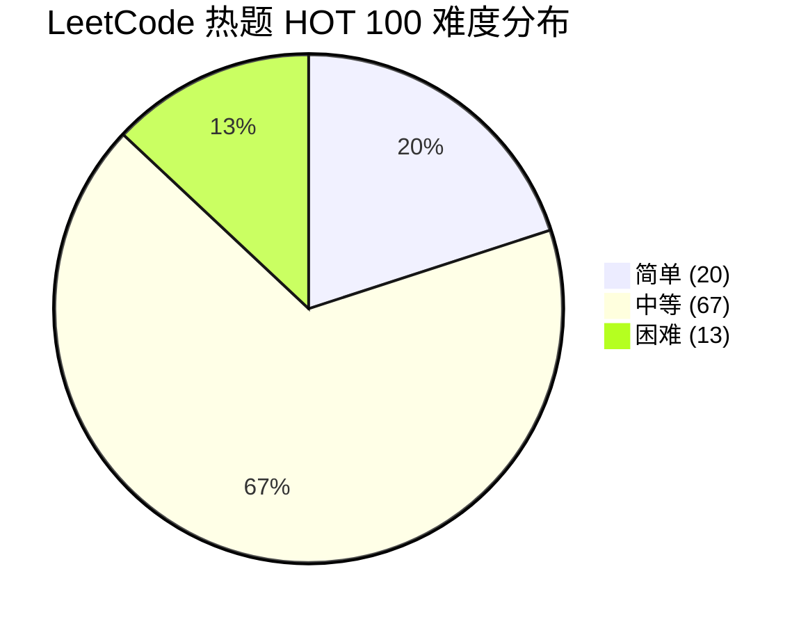
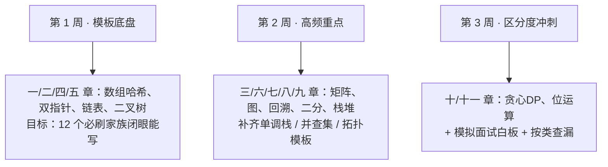

## 使用说明

- 题单来源：LeetCode 热题 HOT 100（2025 版），按题型重排，便于"按类覆盖"。
- 链接格式：`https://leetcode.cn/problemset/?search=<题号>` 点击直达 LeetCode 并定位该题（避免 slug 变动导致死链）。
- 难度分布：**简单 20 / 中等 67 / 困难 13**——HOT 100 明显"中等为主"，印证了"先把中等模板刷透"的策略。

## 一、数组与哈希（基础必会）

| 题号 | 题目 | 难度 | 核心标签 | 一句话思路 / 考点 | 链接 |
| --- | --- | --- | --- | --- | --- |
| 1 | 两数之和 | 简单 | 数组、哈希 | 边遍历边存 `target-x` 下标，O(n) | [↗](https://leetcode.cn/problemset/?search=1) |
| 49 | 字母异位词分组 | 中等 | 数组、哈希、字符串 | 排序后的词作 key 分组 | [↗](https://leetcode.cn/problemset/?search=49) |
| 128 | 最长连续序列 | 中等 | 并查集、数组、哈希 | HashSet 判 `x-1` 避免重复起点 | [↗](https://leetcode.cn/problemset/?search=128) |
| 283 | 移动零 | 简单 | 数组、双指针 | 快慢指针把非 0 前移 | [↗](https://leetcode.cn/problemset/?search=283) |
| 560 | 和为 K 的子数组 | 中等 | 数组、哈希、前缀和 | 前缀和 + HashMap 计数 `(presum,次数)` | [↗](https://leetcode.cn/problemset/?search=560) |
| 238 | 除自身以外数组的乘积 | 中等 | 数组、前缀积 | 左右前缀积两次扫描 | [↗](https://leetcode.cn/problemset/?search=238) |
| 189 | 轮转数组 | 中等 | 数组、数学、双指针 | 三次反转法 | [↗](https://leetcode.cn/problemset/?search=189) |
| 41 | 缺失的第一个正数 | 困难 | 数组、哈希 | 原地哈希：把数放回对应下标 | [↗](https://leetcode.cn/problemset/?search=41) |
| 169 | 多数元素 | 简单 | 数组、哈希、分治 | Boyer-Moore 投票法 O(n) | [↗](https://leetcode.cn/problemset/?search=169) |
| 75 | 颜色分类 | 中等 | 数组、双指针、排序 | 三指针（荷兰国旗）一趟分区 | [↗](https://leetcode.cn/problemset/?search=75) |
| 31 | 下一个排列 | 中等 | 数组、双指针 | 找拐点→反转右侧→交换 | [↗](https://leetcode.cn/problemset/?search=31) |

## 二、双指针 / 滑动窗口

| 题号 | 题目 | 难度 | 核心标签 | 一句话思路 / 考点 | 链接 |
| --- | --- | --- | --- | --- | --- |
| 11 | 盛最多水的容器 | 中等 | 贪心、数组、双指针 | 对撞指针，短板内移 | [↗](https://leetcode.cn/problemset/?search=11) |
| 15 | 三数之和 | 中等 | 数组、双指针、排序 | 排序 + 双指针 + 去重 | [↗](https://leetcode.cn/problemset/?search=15) |
| 3 | 无重复字符的最长子串 | 中等 | 哈希、字符串、滑动窗口 | 哈希维护窗口合法性，超界移 left | [↗](https://leetcode.cn/problemset/?search=3) |
| 438 | 找到字符串中所有字母异位词 | 中等 | 哈希、字符串、滑动窗口 | 定长窗口字符计数比对 | [↗](https://leetcode.cn/problemset/?search=438) |
| 239 | 滑动窗口最大值 | 困难 | 队列、滑动窗口、堆 | 单调队列维护窗口最大值 | [↗](https://leetcode.cn/problemset/?search=239) |
| 76 | 最小覆盖子串 | 困难 | 哈希、字符串、滑动窗口 | 双指针 + 需求计数，合法时缩 left | [↗](https://leetcode.cn/problemset/?search=76) |
| 763 | 划分字母区间 | 中等 | 贪心、哈希、双指针 | 记录字符最后位置，贪心切分 | [↗](https://leetcode.cn/problemset/?search=763) |
| 287 | 寻找重复数 | 中等 | 位运算、数组、双指针 | 数组作链表 + Floyd 快慢指针 | [↗](https://leetcode.cn/problemset/?search=287) |
| 42 | 接雨水 | 困难 | 栈、数组、双指针、DP | 双指针按 `min(左max,右max)-h` 累加 | [↗](https://leetcode.cn/problemset/?search=42) |

## 三、矩阵 / 模拟 / BFS 扩散

| 题号 | 题目 | 难度 | 核心标签 | 一句话思路 / 考点 | 链接 |
| --- | --- | --- | --- | --- | --- |
| 73 | 矩阵置零 | 中等 | 数组、哈希、矩阵 | 首行首列作标记位 | [↗](https://leetcode.cn/problemset/?search=73) |
| 54 | 螺旋矩阵 | 中等 | 数组、矩阵、模拟 | 按层收缩边界遍历 | [↗](https://leetcode.cn/problemset/?search=54) |
| 48 | 旋转图像 | 中等 | 数组、数学、矩阵 | 先转置再翻转每行 | [↗](https://leetcode.cn/problemset/?search=48) |
| 240 | 搜索二维矩阵 II | 中等 | 数组、二分、分治 | 从右上角向左/下排除 | [↗](https://leetcode.cn/problemset/?search=240) |
| 994 | 腐烂的橘子 | 中等 | BFS、数组、矩阵 | 多源 BFS 计层数 | [↗](https://leetcode.cn/problemset/?search=994) |

## 四、链表

| 题号 | 题目 | 难度 | 核心标签 | 一句话思路 / 考点 | 链接 |
| --- | --- | --- | --- | --- | --- |
| 160 | 相交链表 | 简单 | 哈希、链表、双指针 | 双指针走两遍消除长度差 | [↗](https://leetcode.cn/problemset/?search=160) |
| 206 | 反转链表 | 简单 | 递归、链表 | 三指针迭代 / 递归 | [↗](https://leetcode.cn/problemset/?search=206) |
| 234 | 回文链表 | 简单 | 栈、递归、链表 | 快慢找中点 + 后半反转比对 | [↗](https://leetcode.cn/problemset/?search=234) |
| 141 | 环形链表 | 简单 | 哈希、链表、双指针 | Floyd 快慢指针相遇 | [↗](https://leetcode.cn/problemset/?search=141) |
| 142 | 环形链表 II | 中等 | 哈希、链表、双指针 | 相遇后一指针回 head 同步走 | [↗](https://leetcode.cn/problemset/?search=142) |
| 21 | 合并两个有序链表 | 简单 | 递归、链表 | 递归取较小头 | [↗](https://leetcode.cn/problemset/?search=21) |
| 2 | 两数相加 | 中等 | 递归、链表、数学 | 进位迭代/递归 | [↗](https://leetcode.cn/problemset/?search=2) |
| 19 | 删除链表的倒数第 N 个结点 | 中等 | 链表、双指针 | 快慢指针间距 N | [↗](https://leetcode.cn/problemset/?search=19) |
| 24 | 两两交换链表中的节点 | 中等 | 递归、链表 | 递归交换相邻 | [↗](https://leetcode.cn/problemset/?search=24) |
| 25 | K 个一组翻转链表 | 困难 | 递归、链表 | 分段反转 + 接回 | [↗](https://leetcode.cn/problemset/?search=25) |
| 138 | 随机链表的复制 | 中等 | 哈希、链表 | 哈希映射旧→新，再连 random | [↗](https://leetcode.cn/problemset/?search=138) |
| 148 | 排序链表 | 中等 | 链表、分治、排序 | 归并排序（自底向上更稳） | [↗](https://leetcode.cn/problemset/?search=148) |
| 23 | 合并 K 个升序链表 | 困难 | 链表、分治、堆 | 小顶堆 / 两两归并 | [↗](https://leetcode.cn/problemset/?search=23) |
| 146 | LRU 缓存 | 中等 | 设计、哈希、链表 | 双向链表 + 哈希，维护最近使用 | [↗](https://leetcode.cn/problemset/?search=146) |

## 五、二叉树 / 二叉搜索树

| 题号 | 题目 | 难度 | 核心标签 | 一句话思路 / 考点 | 链接 |
| --- | --- | --- | --- | --- | --- |
| 94 | 二叉树的中序遍历 | 简单 | 栈、树、DFS | 递归 / 迭代（栈） | [↗](https://leetcode.cn/problemset/?search=94) |
| 104 | 二叉树的最大深度 | 简单 | 树、DFS、BFS | 后序 `1+max(左,右)` | [↗](https://leetcode.cn/problemset/?search=104) |
| 226 | 翻转二叉树 | 简单 | 树、DFS | 前序交换左右子树 | [↗](https://leetcode.cn/problemset/?search=226) |
| 101 | 对称二叉树 | 简单 | 树、DFS | 递归比"对称位置"两节点 | [↗](https://leetcode.cn/problemset/?search=101) |
| 543 | 二叉树的直径 | 简单 | 树、DFS | 后序维护"经过节点的最大路径" | [↗](https://leetcode.cn/problemset/?search=543) |
| 102 | 二叉树的层序遍历 | 中等 | 树、BFS | 队列按层出队 | [↗](https://leetcode.cn/problemset/?search=102) |
| 108 | 将有序数组转换为二叉搜索树 | 简单 | 树、BST、分治 | 中点为根，左右递归 | [↗](https://leetcode.cn/problemset/?search=108) |
| 98 | 验证二叉搜索树 | 中等 | 树、DFS、BST | 中序递增 / 上下界递归 | [↗](https://leetcode.cn/problemset/?search=98) |
| 230 | BST 中第 K 小的元素 | 中等 | 树、DFS、BST | 中序第 K 个 | [↗](https://leetcode.cn/problemset/?search=230) |
| 199 | 二叉树的右视图 | 中等 | 树、DFS、BFS | 层序取每层最右 / DFS 优先右 | [↗](https://leetcode.cn/problemset/?search=199) |
| 114 | 二叉树展开为链表 | 中等 | 栈、树、DFS、链表 | 前序展开（找前驱接右） | [↗](https://leetcode.cn/problemset/?search=114) |
| 105 | 从前序与中序遍历序列构造二叉树 | 中等 | 树、数组、哈希、分治 | 前序定根，中序定左右区间 | [↗](https://leetcode.cn/problemset/?search=105) |
| 437 | 路径总和 III | 中等 | 树、DFS | 双重递归 / 前缀和（路径和） | [↗](https://leetcode.cn/problemset/?search=437) |
| 236 | 二叉树的最近公共祖先 | 中等 | 树、DFS | 左右各返一个则当前为 LCA | [↗](https://leetcode.cn/problemset/?search=236) |
| 124 | 二叉树中的最大路径和 | 困难 | 树、DFS、DP | 后序取 `max(左,右,0)+val` | [↗](https://leetcode.cn/problemset/?search=124) |

## 六、DFS / BFS / 图 / 并查集 / Trie

| 题号 | 题目 | 难度 | 核心标签 | 一句话思路 / 考点 | 链接 |
| --- | --- | --- | --- | --- | --- |
| 200 | 岛屿数量 | 中等 | DFS、BFS、并查集 | 遇 '1' 淹没相连陆地（DFS/BFS/并查集） | [↗](https://leetcode.cn/problemset/?search=200) |
| 207 | 课程表 | 中等 | DFS、BFS、图 | 拓扑排序（Kahn / 三色 DFS 判环） | [↗](https://leetcode.cn/problemset/?search=207) |
| 208 | 实现 Trie（前缀树） | 中等 | 设计、字典树、哈希 | 多叉孩子 + 结尾标记 | [↗](https://leetcode.cn/problemset/?search=208) |
| 79 | 单词搜索 | 中等 | DFS、数组、字符串、回溯 | 回溯 + 方向数组，访问标记 | [↗](https://leetcode.cn/problemset/?search=79) |

## 七、回溯 / 递归

| 题号 | 题目 | 难度 | 核心标签 | 一句话思路 / 考点 | 链接 |
| --- | --- | --- | --- | --- | --- |
| 46 | 全排列 | 中等 | 数组、回溯 | 路径-选择-撤销模板 | [↗](https://leetcode.cn/problemset/?search=46) |
| 78 | 子集 | 中等 | 位运算、数组、回溯 | 每个元素选/不选；位掩码变体 | [↗](https://leetcode.cn/problemset/?search=78) |
| 17 | 电话号码的字母组合 | 中等 | 哈希、字符串、回溯 | 映射 + 逐位回溯 | [↗](https://leetcode.cn/problemset/?search=17) |
| 39 | 组合总和 | 中等 | 数组、回溯 | 可重复选，start 去重序 | [↗](https://leetcode.cn/problemset/?search=39) |
| 22 | 括号生成 | 中等 | 字符串、DP、回溯 | 左< n 加左，右<左 加右 | [↗](https://leetcode.cn/problemset/?search=22) |
| 131 | 分割回文串 | 中等 | 字符串、DP、回溯 | 先预处理回文，再回溯切分 | [↗](https://leetcode.cn/problemset/?search=131) |
| 51 | N 皇后 | 困难 | 数组、回溯 | 按行放，列/对角线冲突检查 | [↗](https://leetcode.cn/problemset/?search=51) |

## 八、二分查找

| 题号 | 题目 | 难度 | 核心标签 | 一句话思路 / 考点 | 链接 |
| --- | --- | --- | --- | --- | --- |
| 35 | 搜索插入位置 | 简单 | 数组、二分 | 标准二分找下界 | [↗](https://leetcode.cn/problemset/?search=35) |
| 74 | 搜索二维矩阵 | 中等 | 数组、二分、矩阵 | 拉平为一维二分 | [↗](https://leetcode.cn/problemset/?search=74) |
| 34 | 在排序数组中查找元素的区间 | 中等 | 数组、二分 | 找左右边界（两次二分） | [↗](https://leetcode.cn/problemset/?search=34) |
| 33 | 搜索旋转排序数组 | 中等 | 数组、二分 | 判哪半有序再二分 | [↗](https://leetcode.cn/problemset/?search=33) |
| 153 | 寻找旋转排序数组中的最小值 | 中等 | 数组、二分 | 右半有序时收缩左边界 | [↗](https://leetcode.cn/problemset/?search=153) |
| 4 | 寻找两个正序数组的中位数 | 困难 | 数组、二分、分治 | 在短数组上二分切割 | [↗](https://leetcode.cn/problemset/?search=4) |
| 300 | 最长递增子序列 | 中等 | 数组、二分、DP | `tails` 数组 + 二分（O(n log n)） | [↗](https://leetcode.cn/problemset/?search=300) |

## 九、栈 / 单调栈 / 堆

| 题号 | 题目 | 难度 | 核心标签 | 一句话思路 / 考点 | 链接 |
| --- | --- | --- | --- | --- | --- |
| 20 | 有效的括号 | 简单 | 栈、字符串 | 栈匹配，遇右弹栈比对 | [↗](https://leetcode.cn/problemset/?search=20) |
| 155 | 最小栈 | 中等 | 栈、设计 | 同步栈或存 `(val,min)` | [↗](https://leetcode.cn/problemset/?search=155) |
| 394 | 字符串解码 | 中等 | 栈、递归、字符串 | 栈处理嵌套 `k[...]` | [↗](https://leetcode.cn/problemset/?search=394) |
| 739 | 每日温度 | 中等 | 栈、数组、单调栈 | 单调栈存"下一个更高温度" | [↗](https://leetcode.cn/problemset/?search=739) |
| 84 | 柱状图中最大的矩形 | 困难 | 栈、数组、单调栈 | 单调栈找左右第一个更矮 | [↗](https://leetcode.cn/problemset/?search=84) |
| 215 | 数组中的第 K 个最大元素 | 中等 | 数组、分治、快速选择、堆 | 快速选择 / 小顶堆 | [↗](https://leetcode.cn/problemset/?search=215) |
| 347 | 前 K 个高频元素 | 中等 | 数组、哈希、分治、堆 | 哈希计数 + 小顶堆 | [↗](https://leetcode.cn/problemset/?search=347) |
| 295 | 数据流的中位数 | 困难 | 设计、双堆 | 大顶堆（左）+ 小顶堆（右） | [↗](https://leetcode.cn/problemset/?search=295) |
| 56 | 合并区间 | 中等 | 数组、排序 | 按起点排序后合并重叠 | [↗](https://leetcode.cn/problemset/?search=56) |

## 十、贪心 / 动态规划

| 题号 | 题目 | 难度 | 核心标签 | 一句话思路 / 考点 | 链接 |
| --- | --- | --- | --- | --- | --- |
| 121 | 买卖股票的最佳时机 | 简单 | 数组、DP | 维护最低价 + 最大利润 | [↗](https://leetcode.cn/problemset/?search=121) |
| 55 | 跳跃游戏 | 中等 | 贪心、数组、DP | 维护最远可达 | [↗](https://leetcode.cn/problemset/?search=55) |
| 45 | 跳跃游戏 II | 中等 | 贪心、数组、DP | 贪心跳到"能跳最远"的位置 | [↗](https://leetcode.cn/problemset/?search=45) |
| 70 | 爬楼梯 | 简单 | 记忆化、数学、DP | `dp[i]=dp[i-1]+dp[i-2]` | [↗](https://leetcode.cn/problemset/?search=70) |
| 118 | 杨辉三角 | 简单 | 数组、DP | 逐行生成 | [↗](https://leetcode.cn/problemset/?search=118) |
| 198 | 打家劫舍 | 中等 | 数组、DP | `dp[i]=max(抢,不抢)` | [↗](https://leetcode.cn/problemset/?search=198) |
| 279 | 完全平方数 | 中等 | BFS、数学、DP | 完全背包 / BFS 最短路 | [↗](https://leetcode.cn/problemset/?search=279) |
| 322 | 零钱兑换 | 中等 | BFS、数组、DP | 完全背包（凑最小硬币数） | [↗](https://leetcode.cn/problemset/?search=322) |
| 139 | 单词拆分 | 中等 | 字典树、记忆化、数组、DP | `dp[i]` = 某词结尾于 i 且前段可拆 | [↗](https://leetcode.cn/problemset/?search=139) |
| 152 | 乘积最大子数组 | 中等 | 数组、DP | 同时维护最大/最小（负号翻面） | [↗](https://leetcode.cn/problemset/?search=152) |
| 416 | 分割等和子集 | 中等 | 数组、DP | 0/1 背包（能否凑 sum/2） | [↗](https://leetcode.cn/problemset/?search=416) |
| 32 | 最长有效括号 | 困难 | 栈、字符串、DP | 栈存下标 / DP 状态转移 | [↗](https://leetcode.cn/problemset/?search=32) |
| 62 | 不同路径 | 中等 | 数学、DP、组合 | `dp[i][j]=上+左` 或组合数 | [↗](https://leetcode.cn/problemset/?search=62) |
| 64 | 最小路径和 | 中等 | 数组、DP、矩阵 | 左上到右下最小和 | [↗](https://leetcode.cn/problemset/?search=64) |
| 5 | 最长回文子串 | 中等 | 双指针、字符串、DP | 中心扩展（更简）/ 区间 DP | [↗](https://leetcode.cn/problemset/?search=5) |
| 1143 | 最长公共子序列 | 中等 | 字符串、DP | `dp[i][j]` 两序列 LCS | [↗](https://leetcode.cn/problemset/?search=1143) |
| 72 | 编辑距离 | 困难 | 字符串、DP | 增/删/改三操作取最小 | [↗](https://leetcode.cn/problemset/?search=72) |
| 53 | 最大子数组和 | 中等 | 数组、分治、DP | Kadane 算法 | [↗](https://leetcode.cn/problemset/?search=53) |

## 十一、位运算 / 其他技巧

| 题号 | 题目 | 难度 | 核心标签 | 一句话思路 / 考点 | 链接 |
| --- | --- | --- | --- | --- | --- |
| 136 | 只出现一次的数字 | 简单 | 位运算、数组 | 全员异或，成对抵消 | [↗](https://leetcode.cn/problemset/?search=136) |

> 位运算在 HOT 100 中题量很少（仅 136 与 287/78 的交叉标签），但"异或消重""`n & (n-1)` 去最低位 1"是高频小技巧，建议单独记。287（Floyd 指针）与 78（位掩码子集）虽带位运算标签，已归入对应主类。

## 三阶段攻坚路线

**优先级映射（结合《算法面试高频题型拆解与频率优先级》）：**

- 与 **P0** 高度对应的章节：一（数组哈希）、二（双指针）、四（链表）、五（二叉树）、十中的基础 DP（53/70/121/198/322）。**先刷这些。**
- 与 **P1** 对应的章节：三（矩阵）、六（图）、七（回溯）、八（二分）、九（栈堆）、十中的序列 DP（300/1143/72）。
- 与 **P2** 对应的：十一（位运算）、十中的困难 DP（32/72）、四中的困难（25/23）、五中的困难（124）。

**可适度跳过的"奇技"题（时间极紧时）：** 25（K 个一组翻转，递归易错）、4（两数组中位数，边界繁琐）、72（编辑距离，属高阶 DP）、51（N 皇后，回溯天花板）、295（数据流中位数，双堆易错）。这些区分度极高但投入产出比低，建议放在最后或目标高阶岗时再攻。

## 与已有文档的衔接

- 本文是"**题单**"：给出 HOT 100 全部 100 题的分类索引与路线。
- 先读《[算法面试高频题型拆解与频率优先级（基于公开面经统计）](/post/准备-算法面试高频题型拆解与频率优先级（基于公开面经统计）)》确定"**先刷哪类**"。
- 再读《[算法刷题路线](/post/准备-算法刷题路线)》拿到"**每类题型模板 + 支付场景映射 + 白板四步法**"。
- 三者构成闭环：**频率优先级 → 题型模板 → 题单路线**。
