> JavaGuide 的重要结论：面试权重 **MySQL + Redis ≥ Java > Spring**。这两块是后端面试的绝对主力，本文把网络上反复出现的高频题成体系整理，每题给 **要点 + 考察点 + 回答思路/坑**。结合跨境支付项目落地讲。

---

# 第一部分：MySQL

## 一、索引

> 为什么 MySQL 用 B+ 树而不是 B 树 / 红黑树？关键在**叶子节点串成有序双向链表**——这让范围查询、全表扫描只需顺着叶子走，不用回树。

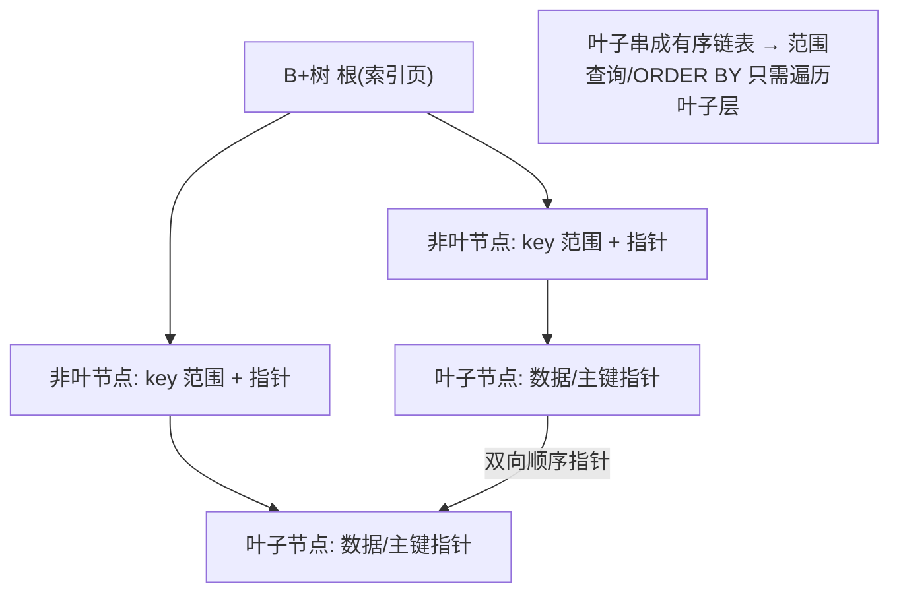

### Q1：为什么用 B+ 树，不用 B 树 / 红黑树 / 哈希？
- **要点**：B+ 树非叶只存索引、叶子存数据且叶子间双向链表相连——树矮（3~4 层存千万级）、磁盘 IO 少、范围查询/排序友好。红黑树太高（IO 多）；哈希只支持等值、不支持范围和排序。
- **考察点**：磁盘 IO 模型、局部性原理、为什么范围查询是 B+ 树强项。
- **坑**：说"哈希更快"——只对等值成立，且 Hash 冲突、无序、不支持最左前缀。

### Q2：聚簇索引 vs 非聚簇（二级）索引？回表是什么？
- **要点**：InnoDB 主键是聚簇索引（叶子存整行）；二级索引叶子存主键值 → 查非索引列要拿主键再查聚簇索引，即**回表**。
- **覆盖索引**：查询列都在索引里，不回表（`explain` Extra=Using index）。
- **考察点**：能否用覆盖索引优化；为什么主键不宜过长（二级索引都存主键，越长越占空间）。

### Q3：最左前缀原则 / 索引失效场景？
- **失效**：不满足最左前缀、对索引列做函数/运算、隐式类型转换（字符串不加引号）、`like '%x'` 前导模糊、`or` 连接非索引列、`!=`/`not in`（视情况）、范围查询后的列不再用索引。
- **考察点**：联合索引 (a,b,c) 哪些查询能命中；如何用 `explain` 验证。
- **回答思路**：结合支付——`(merchant_id, created_at)` 联合索引支持"按商户+时间范围"对账查询，把区分度高的放左边。

### Q4：怎么排查慢 SQL？
- **思路**：开慢查询日志 → `explain` 看 type（system>const>eq_ref>ref>range>index>ALL，到 range 以上算合格）、key、rows、Extra（Using filesort/temporary 要警惕）→ 加合适索引/改写 SQL/覆盖索引 → 必要时分库分表或走 ES/OLAP。
- **考察点**：explain 各字段含义、filesort 怎么消除（让排序走索引）。

### 【深度拓展】EXPLAIN 执行计划深度解读

> `EXPLAIN` 是慢 SQL 排查的第一工具，每个字段都藏着优化线索。下面逐字段图解。

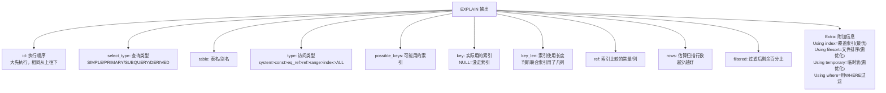

#### type 字段详解（从优到差）

| type | 含义 | 示例 | 性能 |
| --- | --- | --- | --- |
| `system` | 表只有一行（系统表） | `SELECT * FROM mysql.proxies_priv` | 最优 |
| `const` | 通过主键/唯一索引等值查询，最多一行 | `WHERE id = 1` | 极快 |
| `eq_ref` | 被驱动表通过主键/唯一索引关联，一行 | `JOIN ... ON t1.id = t2.id` | 极快 |
| `ref` | 通过普通索引等值查询，可能多行 | `WHERE merchant_id = 'M001'` | 优秀 |
| `range` | 索引范围扫描 | `WHERE created_at > '2025-01-01'` | 合格 |
| `index` | 扫描整个索引树（不回表但全扫） | `count(*)` 走二级索引 | 可接受 |
| `ALL` | 全表扫描 | 无索引或索引失效 | 需优化 |

#### Extra 字段关键信号

| Extra 值 | 含义 | 是否需优化 |
| --- | --- | --- |
| `Using index` | 覆盖索引，不回表 | ✅ 最优 |
| `Using where` | 用 WHERE 过滤 | ⚠️ 正常但说明有回表 |
| `Using index condition` | 索引下推 ICP | ✅ 比 Using where 好 |
| `Using filesort` | 无法用索引排序，额外排序 | ❌ 需优化（加排序索引列） |
| `Using temporary` | 用临时表（GROUP BY/DISTINCT） | ❌ 需优化 |
| `Using MRR` | 多范围读优化 | ✅ 减少随机 IO |
| `Using join buffer` | 被驱动表没走索引，用 BNL/BKA | ❌ 需加索引 |

#### 实战：EXPLAIN 分析示例

```sql
-- 支付对账慢查询：按商户+时间范围查流水
EXPLAIN SELECT id, order_no, amount, status, created_at
FROM payment_record
WHERE merchant_id = 'M20240001'
  AND created_at >= '2025-06-01'
  AND created_at < '2025-07-01'
ORDER BY created_at DESC
LIMIT 20;

-- 理想结果：
-- type: ref          → merchant_id 走索引
-- key: idx_merchant_time → 命中联合索引
-- key_len: 162       → merchant_id(varchar50=154) + created_at(8) 全用了
-- Extra: Using index  → 覆盖索引，不回表！
-- rows: 856           → 只扫几百行

-- 糟糕结果（没建联合索引时）：
-- type: ALL           → 全表扫描
-- key: NULL           → 没走索引
-- rows: 12500000      → 扫了千万行
-- Extra: Using where; Using filesort  → 回表 + 额外排序
```

### 【深度拓展】索引优化实战案例

#### 案例一：覆盖索引消除回表

```sql
-- ❌ 慢：查了非索引列 amount/status，需要回表
SELECT id, order_no, amount, status, created_at
FROM payment_record
WHERE merchant_id = 'M20240001';

-- ✅ 快：建立覆盖索引，查询列都在索引里
ALTER TABLE payment_record
ADD INDEX idx_merchant_cover (merchant_id, created_at, order_no, amount, status);

-- EXPLAIN Extra: Using index → 不回表，性能提升 5-10 倍
-- 注意：覆盖索引列不宜太多（占空间、更新慢），只放高频查询列
```

#### 案例二：索引下推（ICP, Index Condition Pushdown）

```sql
-- 联合索引 (merchant_id, status, created_at)
SELECT * FROM payment_record
WHERE merchant_id = 'M20240001'
  AND status LIKE 'FAIL%'
  AND created_at > '2025-06-01';

-- 无 ICP（MySQL 5.6 前）：
--   1. 用 merchant_id 索引找到所有行 → 回表取完整行
--   2. 再用 status LIKE 和 created_at 过滤
--   → 回表次数 = merchant_id 匹配的所有行（可能上万）

-- 有 ICP（MySQL 5.6+）：
--   1. 用 merchant_id 索引找到行
--   2. 在索引层直接用 status LIKE 过滤（status 在联合索引里）
--   3. 只对满足条件的行回表
--   → 回表次数 = 过滤后的行数（可能只有几十）
-- EXPLAIN Extra: Using index condition → ICP 生效
```

#### 案例三：MRR（Multi-Range Read）优化随机 IO

```sql
-- 场景：范围查询导致回表时主键乱序，磁盘随机 IO 多
SELECT * FROM payment_record
WHERE merchant_id = 'M20240001' AND created_at BETWEEN '2025-06-01' AND '2025-06-30';

-- 无 MRR：按索引顺序逐行回表 → 主键跳跃 → 随机磁盘 IO
-- 有 MRR：先把满足条件的主键收集排序 → 按主键顺序批量回表 → 顺序 IO
-- 开启方式：
SET optimizer_switch='mrr=on,mrr_cost_based=off';
-- EXPLAIN Extra: Using MRR → MRR 生效，减少磁盘随机 IO
```

#### 案例四：深分页优化实战

```sql
-- ❌ 慢：LIMIT 1000000, 10 要扫描丢弃前100万行
SELECT * FROM payment_record
WHERE merchant_id = 'M20240001'
ORDER BY created_at DESC
LIMIT 1000000, 10;

-- ✅ 方案1：游标分页（推荐）
SELECT * FROM payment_record
WHERE merchant_id = 'M20240001'
  AND id < #{last_id}   -- 上一页最后一条的 id
ORDER BY id DESC
LIMIT 10;

-- ✅ 方案2：延迟关联（先查主键再JOIN回表）
SELECT t.* FROM payment_record t
INNER JOIN (
  SELECT id FROM payment_record
  WHERE merchant_id = 'M20240001'
  ORDER BY created_at DESC
  LIMIT 1000000, 10
) tmp ON t.id = tmp.id;
-- 子查询走覆盖索引只取主键，JOIN 回表只查10行
```

### 【项目支撑】XTransfer 支付对账索引优化

欧凡/XTransfer 的对账大表 `payment_record` 千万级数据，核心查询模式是"按商户 + 时间范围 + 状态"：

1. **联合索引设计**：`(merchant_id, created_at, status)` — 等值列（merchant_id）放左，范围列（created_at）放中间，状态列兜底
2. **覆盖索引优化**：高频对账查询只取 `id, order_no, amount, status, created_at` 五列，扩展联合索引为覆盖索引，EXPLAIN 显示 `Using index`
3. **深分页用游标**：对账分页改 `LIMIT offset, N` 为 `WHERE id > last_id LIMIT N`，从秒级降到毫秒级
4. **索引下推受益**：状态过滤（如 `status = 'SUCCESS'`）在索引层完成，减少 90%+ 回表

### 【面试官追问】

**追问1**：`EXPLAIN` 里 `key_len=162` 怎么算出来的？
> 联合索引 `idx(merchant_id varchar(50), created_at datetime)` 中：`varchar(50)` 在 utf8mb4 下 = 50×4+2(变长长度记录)+1(NULL标记) = 203 字节……不对，实际 `varchar(50)` 在 utf8mb4 下 key_len = 50*4 + 2 = 202，`datetime` = 5 字节，但实际值取决于 MySQL 版本和字符集。核心是：**key_len 能告诉你联合索引用了几列**——如果联合索引3列但 key_len 只等于第1列的长度，说明只用了最左列。

**追问2**：`Using filesort` 一定很慢吗？
> 不一定。MySQL filesort 分两种：① **单路排序**（数据量小，在内存 sort_buffer 完成）—— 快；② **双路排序**（数据量大，先排序主键再回表取数据，可能用临时文件）—— 慢。但如果能通过加索引让 `ORDER BY` 走索引排序，就完全不需要 filesort，这才是最优解。

**追问3**：索引建多了有什么坏处？
> ① 占磁盘空间（每个索引一棵 B+ 树）；② 写放大（INSERT/UPDATE/DELETE 要维护所有索引）；③ 优化器选择困难（索引太多优化器可能选错计划）。一般单表索引不超过 5-6 个，联合索引优先于多个单列索引。

---

## 二、事务与隔离

### Q5：ACID 靠什么实现？
- **原子性**→undo log（回滚）；**持久性**→redo log（崩溃恢复重放）；**隔离性**→锁 + MVCC；**一致性**→前三者 + 应用约束共同保证（是目的）。
- **考察点**：redo/undo 分工、WAL（先写日志）思想。

### Q6：四种隔离级别与并发问题？
| 隔离级别 | 脏读 | 不可重复读 | 幻读 |
| --- | --- | --- | --- |
| 读未提交 RU | ✔ | ✔ | ✔ |
| 读已提交 RC | ✘ | ✔ | ✔ |
| 可重复读 RR（MySQL 默认） | ✘ | ✘ | ✘（InnoDB 用间隙锁基本避免） |
| 串行化 | ✘ | ✘ | ✘ |
- **考察点**：RR 怎么解决幻读（快照读用 MVCC，当前读用 Next-Key Lock）；为什么很多公司把默认改成 RC（间隙锁少、并发高、主从 binlog row 模式下安全）。

### Q7：MVCC 原理？
- **要点**：每行隐藏 `trx_id`、`roll_pointer`；undo log 组成版本链；**ReadView**（m_ids 活跃事务、min/max trx_id）决定可见性。RC 每次快照读生成新 ReadView，RR 事务首次快照读生成后复用（所以可重复读）。
- **考察点**：RC 与 RR 的 ReadView 生成时机差异；快照读 vs 当前读（`select...for update`/`lock in share mode` 是当前读）。

### 【深度拓展】MVCC 版本链与 ReadView 可见性判断

> MVCC 是 InnoDB 实现 RC/RR 的核心机制。每行数据都有隐藏字段，undo log 组成版本链，ReadView 决定看哪个版本。

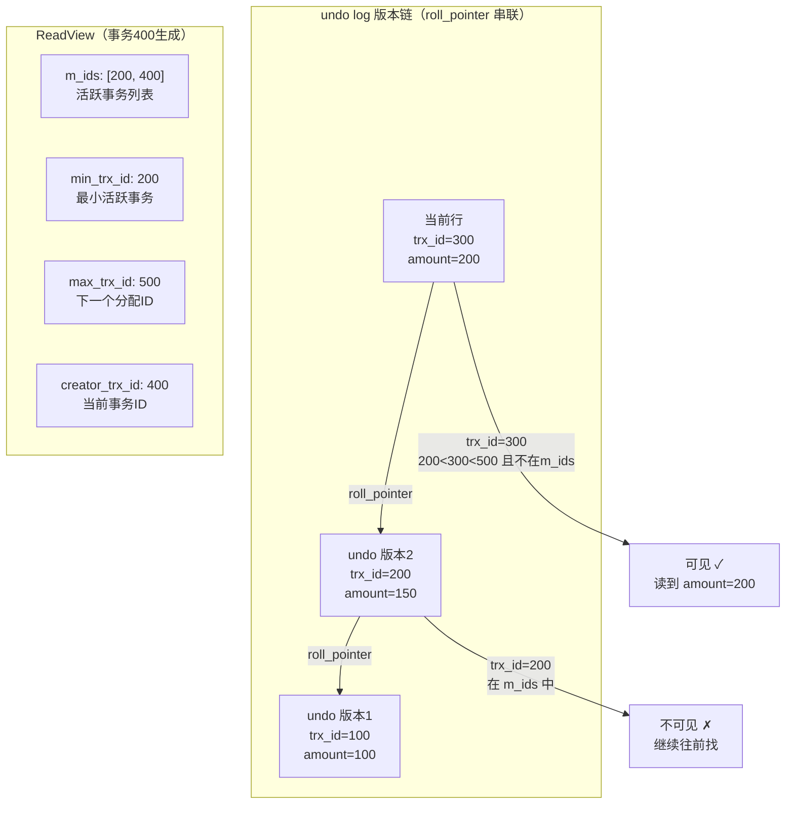

#### 可见性判断规则（四步）

| 条件 | 结果 | 说明 |
| --- | --- | --- |
| `trx_id == creator_trx_id` | 可见 | 自己改的，当然可见 |
| `trx_id < min_trx_id` | 可见 | 在 ReadView 生成前已提交 |
| `trx_id >= max_trx_id` | 不可见 | ReadView 生成后才开启的事务 |
| `min_trx_id ≤ trx_id < max_trx_id` 且在 m_ids 中 | 不可见 | 生成时仍活跃（未提交） |
| `min_trx_id ≤ trx_id < max_trx_id` 且不在 m_ids 中 | 可见 | 生成时已提交 |

#### RC vs RR 的 ReadView 生成时机

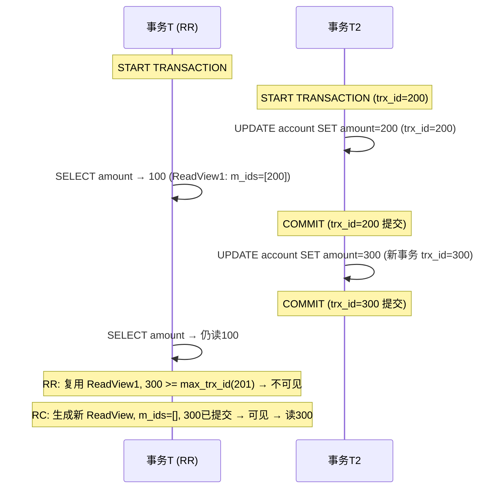

> **关键理解**：RR 复用事务内首次快照读的 ReadView，所以即使其他事务提交了也看不到新数据（可重复读）；RC 每次快照读都生成新的 ReadView，所以能看到最新已提交数据。

### 【面试官追问】

**追问1**：MVCC 解决了幻读吗？
> **快照读**下基本解决（MVCC 总读固定版本）。但**当前读**（`SELECT ... FOR UPDATE`、`UPDATE`、`DELETE`）不走 MVCC，要靠 **Next-Key Lock**（记录锁+间隙锁）防幻读。所以 RR 下 `SELECT` 不幻读，但 `SELECT ... FOR UPDATE` 如果没有合适的索引仍可能锁不住间隙。

**追问2**：MVCC 的 undo log 版本链什么时候清理？
> 由 **purge 线程**清理。当系统中没有活跃事务的 ReadView 需要某个 undo 版本时，purge 线程会回收。如果有长事务持着旧 ReadView，undo log 无法回收 → **回滚段膨胀** → 表空间暴涨。所以生产上**严禁长事务**。

**追问3**：为什么 RC 每次快照读都生成 ReadView 不会很慢？
> ReadView 的生成只是记录当前活跃事务列表（从 `trx_sys->rw_trx_list` 拷贝），不涉及磁盘 IO。活跃事务通常不多（几十个），所以开销很小。真正的性能差异在于 RR 下可以复用 ReadView 避免重复计算可见性。

### Q8：InnoDB 有哪些锁？
- **粒度**：表锁、行锁（记录锁 Record Lock）、间隙锁 Gap Lock、临键锁 Next-Key Lock（记录+间隙，RR 默认，防幻读）、插入意向锁。
- **模式**：共享锁 S、排他锁 X、意向锁 IS/IX。
- **考察点**：死锁怎么产生与排查（`show engine innodb status`、按同一顺序加锁避免）；`update` 没走索引会锁全表（行锁升级）。

### 【深度拓展】InnoDB 锁机制全景图

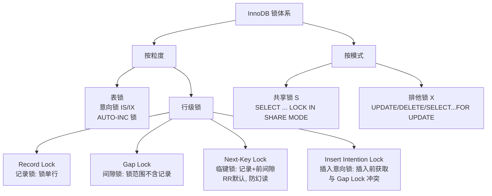

#### 死锁经典场景与排查

```sql
-- 死锁场景：两个事务以不同顺序更新同一批行
-- 事务A                      -- 事务B
BEGIN;                        BEGIN;
UPDATE account SET balance = balance - 100 WHERE id = 1;  -- 锁住 id=1
                              UPDATE account SET balance = balance - 100 WHERE id = 2;  -- 锁住 id=2
UPDATE account SET balance = balance + 100 WHERE id = 2;  -- 等待 id=2 的锁
                              UPDATE account SET balance = balance + 100 WHERE id = 1;  -- 等待 id=1 的锁 → 死锁!

-- 排查命令：
SHOW ENGINE INNODB STATUS;  -- 看 LATEST DETECTED DEADLOCK 段
SELECT * FROM information_schema.INNODB_TRX;  -- 查看当前事务
SELECT * FROM performance_schema.data_locks;  -- MySQL 8.0+ 查看锁详情
SELECT * FROM performance_schema.data_lock_waits;  -- 查看锁等待

-- 解法：所有事务按相同顺序加锁（如统一按 id 升序）
```

### 【项目支撑】支付系统的锁选择

XTransfer 支付链路对锁的选择遵循"**能用乐观锁不用悲观锁，能用行锁不用表锁**"：

1. **资金扣减**：用 `UPDATE account SET balance = balance - #{amount} WHERE id = #{id} AND balance >= #{amount}`（乐观锁+CAS），不加显式锁
2. **订单状态流转**：用 `UPDATE order SET status = 'PAID' WHERE id = #{id} AND status = 'PENDING'`（状态机 CAS），非法流转被 DB 拒绝
3. **批量对账**：按 `merchant_id` 分批加行锁（`SELECT ... FOR UPDATE`），按固定顺序（merchant_id 升序）避免死锁
4. **避免全表锁**：所有 `UPDATE/DELETE` 必须带索引条件，否则行锁升级为表锁

---

## 三、日志与主从

> 主从复制的本质就是"主库把 binlog 流给从库，从库重放"。下面时序把 dump → relay log → SQL 线程三步说清。

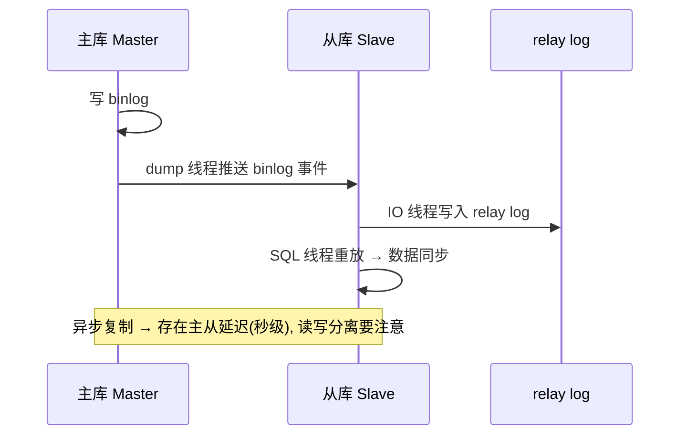

### Q9：redo log、undo log、binlog 区别？
- **redo**：InnoDB 物理日志，崩溃恢复，循环写。**undo**：逻辑日志，回滚 + MVCC。**binlog**：Server 层逻辑日志，主从复制/归档，追加写。
- **两阶段提交**：redo prepare → 写 binlog → redo commit，保证 redo 与 binlog 一致（崩溃恢复对齐）。
- **考察点**：为什么要两阶段提交（防止主从数据不一致）。

### Q10：主从复制原理与延迟？
- **原理**：主库写 binlog → dump 线程发送 → 从库 IO 线程写 relay log → SQL 线程重放。
- **延迟来源**：大事务、从库单线程重放（可用并行复制）、从库负载高。
- **解法**：强制读主（写后读）、半同步复制、并行复制、业务拆分。
- **考察点**：读写分离下的一致性（刚写完读从库读不到怎么办）。

---

## 四、优化与分库分表

### Q11：深分页 `limit 1000000, 10` 慢怎么办？
- **思路**：① 游标分页（`where id > last_id limit 10`）；② 延迟关联（先用覆盖索引查出主键再 JOIN 回表）；③ 记录上次最大 id。
- **考察点**：为什么 offset 大就慢（要扫描并丢弃前面所有行）。

### Q12：什么时候分库分表？怎么分？
- **信号**：单表超千万~2000万、单库连接/IO 瓶颈。
- **方式**：垂直拆分（按业务拆库、按列拆表）、水平拆分（按分片键 hash/range）。
- **分片键选择**：高频查询维度（支付按 merchant_id 或 user_id）；避免热点。
- **难题**：跨片查询（异构索引/ES）、分布式 ID（雪花算法/号段）、跨片事务（最终一致）、扩容（一致性哈希/双写迁移）。
- **考察点**：分片键选错的后果；深分页/聚合怎么处理（见术语篇与考点篇）。

### Q13：分布式 ID 有哪些方案？
- **UUID**（无序、占空间、不适合聚簇主键）、**数据库自增/号段**（批量取减压）、**雪花算法 Snowflake**（时间戳+机器+序列，趋势递增，注意时钟回拨）、**Redis incr**、**美团 Leaf / 百度 UidGenerator**。
- **考察点**：雪花时钟回拨怎么处理（等待/抛错/用备用位）；为什么主键要趋势递增（减少页分裂）。

### 【深度拓展】MySQL 内核优化前沿方向

#### 查询优化器深度优化
- 直方图 + 列间相关性统计信息
- 多表连接（>10表）使用基因算法替代动态规划
- 智能索引建议器：基于历史查询模式学习

#### 向量化执行引擎
- 批量处理（一次1024行），利用SIMD指令
- JIT编译关键查询路径为机器码
- Mermaid 图：传统逐行执行 vs 向量化批量执行对比

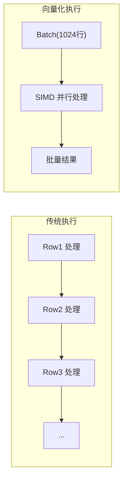

#### InnoDB 缓冲池优化方向
- 自适应LRU/K算法：顺序扫描使用独立LRU链表
- 机器学习预测预读
- NUMA-Aware 缓冲池分配
- LSM-Tree 风格二级索引管理：批量合并、热索引分离

#### 新硬件利用
- PMem（持久内存）：Redo Log直接放PMem，无需fsync
- RDMA（远程直接内存访问）：零拷贝复制、分布式事务加速
- Mermaid 图：传统IO路径 vs PMem/RDMA路径对比

#### MVCC优化方向
- 分代式垃圾回收
- RCU（Read-Copy-Update）机制获取一致性快照
- 可见性判断向量化

---

# 第二部分：Redis

## 五、数据结构与场景

### Q14：Redis 有哪些数据结构？各自场景？
- **String**：计数、缓存对象、分布式锁、限流。
- **Hash**：对象字段、购物车。
- **List**：消息队列（简单）、时间线。
- **Set**：去重、共同好友、抽奖。
- **ZSet**：排行榜、延迟队列（score=时间戳）、滑动窗口限流。
- **进阶**：Bitmap（签到/活跃）、HyperLogLog（UV 基数估算）、GEO（附近的人）、Stream（消息队列，支持消费组）。
- **考察点**：底层编码（ziplist/listpack、skiplist、intset、embstr/int/raw）；ZSet 为什么用跳表+哈希（范围查询 + O(1) 查分）。

### Q15：Redis 为什么快？
- **要点**：纯内存、单线程无锁竞争与上下文切换、IO 多路复用（epoll）、高效数据结构、RESP 简单协议。Redis 6 引入多线程只处理网络 IO，命令执行仍单线程。
- **考察点**：单线程为什么不慢；大 key/热 key 为什么危险（阻塞单线程）。

### 【深度拓展】Redis 数据结构内部编码全景

> Redis 对外暴露的数据类型（String/Hash/List/Set/ZSet）底层有多种编码实现，Redis 会根据数据量自动切换以平衡内存和性能。面试官最爱问的就是"ZSet 底层是什么"。

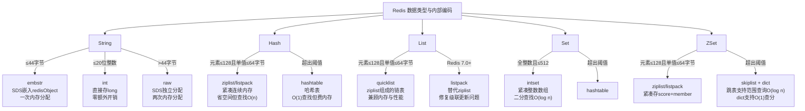

#### ZSet 为什么用跳表（Skiplist）而不是红黑树？

| 维度 | 跳表 Skiplist | 红黑树 BTree |
| --- | --- | --- |
| 范围查询 | ✅ 天然支持（链表顺序遍历） | ❌ 需中序遍历，复杂 |
| 实现复杂度 | ✅ 简单（概率层高，无旋转） | ❌ 复杂（旋转+变色） |
| 内存开销 | 每节点多级指针（约1.33倍） | 每节点左右子指针+颜色 |
| 并发友好 | ✅ 局部加锁（修改只影响相邻） | ❌ 旋转影响范围大 |
| 查找/插入 | O(log n) 期望 | O(log n) 最坏 |

> Redis 作者 antirez 的原话：跳表实现简单、范围查询自然、调试方便、灵活（改参数调性能）。ZSet 同时维护跳表和哈希表：跳表管范围查询，哈希表管 O(1) 查 member 的 score。

#### 跳表结构示意

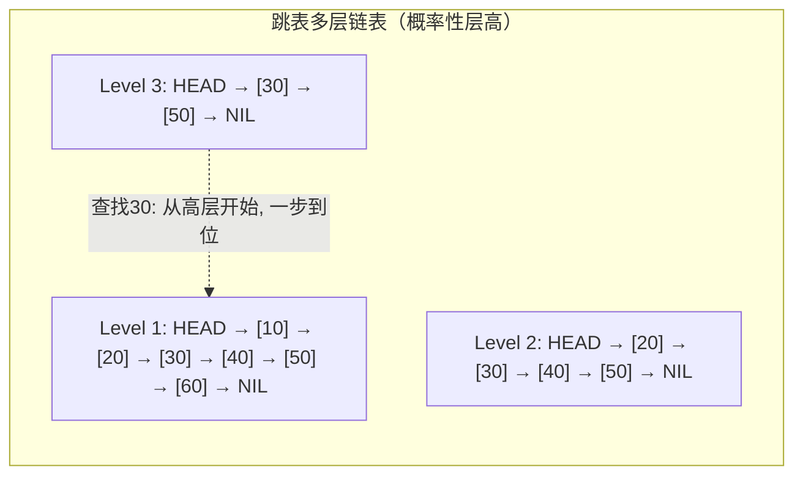

> 查找过程：从最高层开始，遇到比目标大的就下降一层，直到找到或到底层。概率性地每个节点有 1/2 概率"晋升"到上一层，期望层高 log n。

#### 编码转换配置参数

```bash
# redis.conf 中的编码转换阈值
hash-max-ziplist-entries 128       # Hash 超过128个元素转 hashtable
hash-max-ziplist-value 64          # Hash 单值超过64字节转 hashtable
list-max-ziplist-size -2           # List 每节点ziplist大小(负数=按字节)
set-max-intset-entries 512         # Set 超过512个整数转 hashtable
zset-max-ziplist-entries 128       # ZSet 超过128个元素转 skiplist
zset-max-ziplist-value 64          # ZSet 单值超过64字节转 skiplist

# 查看某个key的内部编码：
OBJECT ENCODING mykey
# 返回：embstr / int / raw / ziplist / listpack / skiplist / hashtable / intset / quicklist
```

### 【项目支撑】Redis 数据结构选型实战

1. **欧凡购物车**：用 Hash 存 `cart:{userId}` → `field=商品ID, value=数量`。元素通常 <128 个，走 ziplist 编码省内存；`HINCRBY` 原子加减数量
2. **欧凡排行榜**：用 ZSet 存 `rank:live:{roomId}` → `member=用户ID, score=打赏金额`。`ZREVRANGE 0 9` 取 Top10，走 skiplist 范围查询 O(log n)
3. **XTransfer 限流**：用 ZSet 存 `rate:{merchantId}` → `member=请求ID, value=时间戳`，滑动窗口限流
4. **哈啰签到**：用 Bitmap 存 `sign:{userId}:{yyyyMM}`，每天1 bit，一个月只占4字节

### 【面试官追问】

**追问1**：ziplist 为什么要被 listpack 替代？
> ziplist 有一个**级联更新**问题：如果 ziplist 中每个 entry 的 `prev_entry_length` 字段都是 253 字节（需要1字节记录），插入一个 254+ 字节的 entry 后，后面所有 entry 的 `prev_entry_length` 都要变成5字节，导致连锁内存搬迁。最坏 O(n²)。listpack 重新设计了编码，每个 entry 只记录自身长度，不依赖前一个 entry，彻底消除级联更新。

**追问2**：Redis 6 多线程和 Redis 7 有什么区别？
> Redis 6 引入 io-threads 处理网络读写（socket read/write），但**命令执行仍单线程**。Redis 7.0 进一步优化了多线程性能，并引入 listpack 替代 ziplist、Function 替代 EVAL（支持函数库）。但核心"单线程执行命令"的设计没变——因为瓶颈不在 CPU 而在内存和网络，多线程引入的锁竞争得不偿失。

---

## 六、持久化与高可用

### Q16：RDB vs AOF？
- **RDB**：快照，二进制，恢复快、体积小，可能丢最后一次快照后的数据；fork 子进程写（COW）。
- **AOF**：命令追加日志，`appendfsync`（always/everysec/no），丢数据少但体积大恢复慢；AOF 重写压缩。
- **混合持久化**（4.0+）：RDB 全量 + AOF 增量，兼顾恢复速度与安全。
- **考察点**：怎么选（不能丢用 AOF everysec）；fork 阻塞与 COW。

### Q17：主从、哨兵、Cluster 区别？
- **主从**：读写分离、数据冗余，主挂需人工。
- **哨兵 Sentinel**：监控 + 自动故障转移（选新主）+ 通知，解决高可用，不解决容量。
- **Cluster**：16384 槽分片，多主多从，水平扩容 + 高可用；客户端按 CRC16 路由。
- **考察点**：Cluster 为什么 16384 槽（心跳包大小与压缩权衡）；跨槽操作限制（hash tag `{}`）。

### 【深度拓展】Redis 集群三种模式全景对比

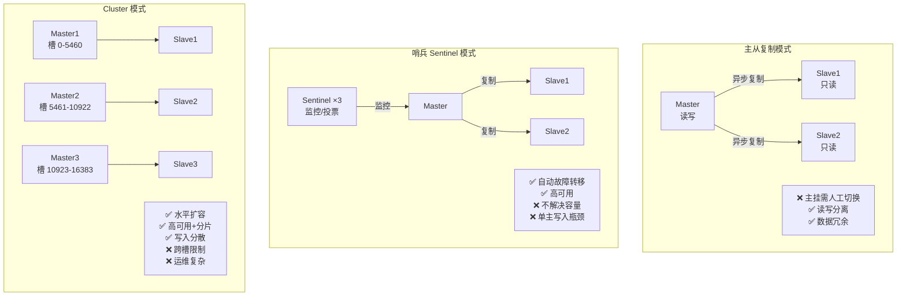

#### 三种模式对比表

| 维度 | 主从复制 | 哨兵 Sentinel | Cluster |
| --- | --- | --- | --- |
| 高可用 | ❌ 人工切换 | ✅ 自动故障转移 | ✅ 自动故障转移 |
| 水平扩容 | ❌ 单主 | ❌ 单主 | ✅ 多主分片 |
| 写入瓶颈 | ❌ 单主写入上限 | ❌ 单主写入上限 | ✅ 分散写入 |
| 数据分片 | ❌ 全量复制 | ❌ 全量复制 | ✅ 16384 槽分片 |
| 跨节点操作 | ✅ 无限制 | ✅ 无限制 | ❌ 需 hash tag |
| 运维复杂度 | 低 | 中 | 高 |
| 适用场景 | 读多写少+容忍人工切换 | 中小规模高可用 | 大规模高并发 |
| 最小节点数 | 2 | 3 哨兵+2 Redis | 6（3主3从） |

#### Cluster 槽位路由原理

```bash
# 客户端计算 key 的槽位：
SLOT = CRC16(key) mod 16384

# 示例：
CRC16("user:1001") mod 16384 = 5473  → 路由到 Master2
CRC16("order:2001") mod 16384 = 12300 → 路由到 Master3

# Hash Tag 强制同一槽位（跨槽操作需用）：
SET {payment}:1001 "data"   # {} 内的内容参与CRC16计算
SET {payment}:1002 "data"   # 同一槽位，支持 MGET/事务/Lua
```

#### Cluster 为什么是 16384 个槽？

> Redis 作者 antirez 的回答：① 心跳包压缩——16384 槽用 2KB 位图即可表示节点拥有哪些槽（16384/8=2048字节），如果 65536 槽则需要 8KB；② Redis 集群节点数通常不超过 1000 个，16384 足够；③ 位图压缩后心跳包很小，节省带宽。

### 【项目支撑】Redis 集群选型实战

1. **欧凡（中小规模）**：哨兵模式 1主2从+3哨兵，日均 QPS 万级，单主够用，哨兵自动切换够用
2. **XTransfer（中等规模）**：Cluster 3主3从，按 `merchant_id` 做 hash tag 分片，同商户数据在同一节点，支持事务/Lua
3. **哈啰（大规模）**：Cluster 6主6从 + 读写分离，薪资计算高并发场景，写入分散到6个主节点
4. **通用经验**：节点数 ≤10 用哨兵，>10 或写入瓶颈用 Cluster。单节点内存控制在 32GB 以内（fork 时间和主从同步效率）

### 【面试官追问】

**追问1**：Cluster 模式下 `MSET k1 v1 k2 v2 k3 v3` 会报错吗？
> 如果 k1/k2/k3 不在同一槽位会报错 `CROSSSLOT`。解法：用 hash tag `{same}k1 {same}k2 {same}k3` 强制同一槽位，或者拆成多个 `SET` 命令用 pipeline 发送（不保证原子）。

**追问2**：哨兵的故障转移过程是怎样的？
> ① 哨兵每秒 PING 主节点，超时（down-after-milliseconds）标记**主观下线**（SDOWN）；② 超过半数（quorum）哨兵同意 → **客观下线**（ODOWN）；③ 选举 leader 哨兵执行转移；④ 选优先级最高→偏移量最大→runid 最小的从节点为新主；⑤ 通知其他从节点跟新主、通知客户端。

**追问3**：Cluster 扩容时怎么迁移数据？
> ① 新节点加入集群；② 迁移槽位——对每个槽：`CLUSTER SETSLOT <slot> MIGRATING <new_node>`（源节点标记迁出）+ `CLUSTER SETSLOT <slot> IMPORTING <old_node>`（目标节点标记迁入）；③ 逐个迁移 key（`MIGRATE` 命令）；④ 迁移完成后广播槽位变更。生产上通常用 `redis-trib.rb reshard` 或管理工具自动化。

---

## 七、过期与淘汰

### Q18：过期 key 怎么删除？
- **惰性删除**（访问时判断过期）+ **定期删除**（周期抽样删）。组合避免全量扫描又不长期占内存。
- **考察点**：为什么不用定时器（每 key 一个定时器开销大）。

### Q19：内存满了淘汰策略？
- `noeviction`（默认，写报错）、`allkeys-lru`/`volatile-lru`、`allkeys-lfu`/`volatile-lfu`（4.0+，按频率）、`allkeys-random`/`volatile-random`、`volatile-ttl`。
- **考察点**：LRU vs LFU 区别与场景（LFU 抗突发扫描）；Redis LRU 是近似 LRU（采样）。

---

## 八、缓存问题（高频重点）

> "缓存三连"（穿透/击穿/雪崩）是必考题。三者成因不同，解法也不同——下面一张图对应清楚。

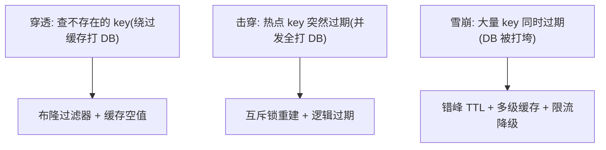

### Q20：缓存穿透 / 击穿 / 雪崩？
- **穿透**：查不存在数据 → 布隆过滤器 + 缓存空值。
- **击穿**：热点 key 失效瞬间高并发 → 互斥重建（分布式锁）/ 逻辑过期 / 热点永不过期。
- **雪崩**：大量 key 同时失效或 Redis 宕机 → 过期时间打散 + 多级缓存 + 集群高可用 + 限流熔断兜底。
- **考察点**：三者区别（必考）；对应解法能否说全。

### Q21：缓存与数据库一致性怎么保证？
- **Cache-Aside（旁路，最常用）**：读——先读缓存，miss 读库回填；写——**先更新 DB，再删缓存**。
- **为什么删不改**：并发下"改缓存"易脏；删缓存下次读回源。
- **为什么先更库再删缓存**：反之（先删缓存再更库）间隙有并发读回填旧值。
- **删缓存失败**：用消息队列重试 / 订阅 binlog（Canal）异步删 / 双删（延迟再删一次）。
- **考察点**：强一致做不到（要强一致上分布式锁或串行化，代价大）；能接受短暂不一致才用缓存。

**【深度拓展】**：面试官会往死里追问"先更库再删缓存就绝对一致吗？"——**不绝对**。有两个残留窗口：① 删缓存失败（Redis 抖动）→ 脏数据长期留；② 更库后、删缓存前，有并发读回填了旧值（概率极低但理论存在）。所以生产上**必须有兜底删除机制**，最稳的是 **Canal 订阅 binlog 异步删缓存**（和业务代码解耦，Redis 挂了也能在恢复后补偿）。再进一步：**要不要强一致？** 强一致需要"更新时串行化（分布式锁/读写锁）"或"更新走同一入口且读强制走主库"，代价是吞吐和可用性，只有资金类才值得。绝大多数场景"最终一致 + 短 TTL 兜底"就够了。

**【项目支撑】**：欧凡的**延迟双写 + binlog(Canal) 订阅**就是这个兜底范式：更新商品先落 MySQL，再发延迟消息删 Redis，同时 Canal 监听 binlog 做最终一致补偿删除——三层保险（延迟删 + binlog 删 + TTL 兜），把"刚写完立刻读"的脏窗口和"删缓存失败"都覆盖了。哈啰薪资的**规则缓存**则靠"规则变更时主动失效两级缓存（Caffeine+Redis）+ 短 TTL"，因为计薪正确性优先，不允许"改了规则还在用旧缓存算薪"——这里把"失效的可靠性"放到了和"性能"同等重要的位置。

### 【深度拓展】缓存一致性方案全景对比

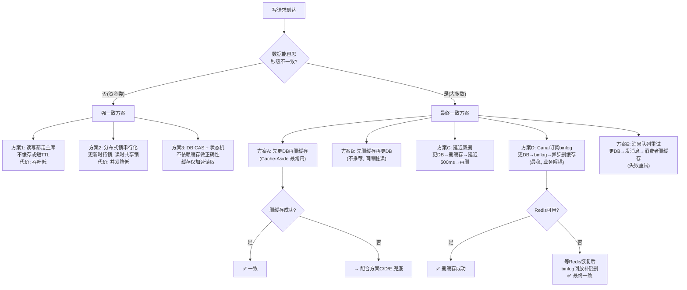

#### 六种方案对比表

| 方案 | 一致性 | 复杂度 | 性能 | 适用场景 |
| --- | --- | --- | --- | --- |
| 读写都走主库 | 强一致 | 低 | 差 | 资金、账户余额 |
| 分布式锁串行化 | 强一致 | 高 | 差 | 极少使用 |
| 先更DB再删缓存 | 最终一致 | 低 | 好 | 大多数场景 |
| 延迟双删 | 最终一致 | 中 | 好 | 中高一致性需求 |
| Canal订阅binlog | 最终一致 | 高 | 好 | 高一致性+解耦 |
| 消息队列重试 | 最终一致 | 中 | 好 | 有MQ基础设施 |

#### Cache-Aside 完整代码示例

```java
// === 读流程 ===
public Product getProduct(Long id) {
    // 1. 先读缓存
    String key = "product:" + id;
    String cached = redis.get(key);
    if (cached != null) {
        if ("NULL".equals(cached)) return null; // 空值缓存防穿透
        return JSON.parseObject(cached, Product.class);
    }
    // 2. 缓存miss → 读库
    Product product = productMapper.selectById(id);
    if (product == null) {
        // 3. 缓存空值防穿透（短TTL 60s）
        redis.setex(key, 60, "NULL");
        return null;
    }
    // 4. 回填缓存（随机TTL防雪崩）
    int ttl = 1800 + ThreadLocalRandom.current().nextInt(300); // 30±5分钟
    redis.setex(key, ttl, JSON.toJSONString(product));
    return product;
}

// === 写流程：先更DB再删缓存 + 延迟双删 + Canal兜底 ===
@Transactional
public void updateProduct(Product product) {
    // 1. 先更新DB
    productMapper.updateById(product);
    // 2. 删除缓存（第一次删）
    String key = "product:" + product.getId();
    redis.del(key);
    // 3. 延迟双删：500ms后再删一次（防止并发读回填旧值）
    mqSender.sendDelayed("cache:delete", key, 500, TimeUnit.MILLISECONDS);
    // 4. Canal监听binlog做最终补偿删（兜底，和业务代码解耦）
    //    → 即使步骤2/3都失败，Canal也能在binlog事件中删掉缓存
}

// === Canal消费者（最终兜底） ===
@CanalEventListener
public void onProductUpdate(CanalEntry.EventType type, Product product) {
    if (type == UPDATE || type == INSERT) {
        redis.del("product:" + product.getId());
        // 同时失效本地Caffeine缓存
        caffeineCache.invalidate("product:" + product.getId());
    }
}
```

### 【面试官追问·逃生路线图】

**追问1**：先更DB再删缓存，在什么极端情况下会不一致？
> 理论上有一个极低概率场景：① 缓存刚好过期；② 请求A读DB拿到旧值（还没回填缓存）；③ 请求B更DB为新值；④ 请求B删缓存；⑤ 请求A把旧值回填缓存。此时缓存是旧值直到TTL过期。**概率极低**（要求读DB→回填缓存的间隔恰好被一次写操作插入），但生产上用**延迟双删**消除：更DB后先删一次，500ms后再删一次，把请求A的脏回填也清掉。

**追问2**：为什么"先删缓存再更DB"更差？
> ① 删缓存后、更DB前，有并发读 → 读到DB旧值 → 回填旧值到缓存；② DB更新为新值但缓存还是旧值；③ 没有兜底机制的话脏数据会留到TTL过期。而"先更DB再删缓存"的脏窗口只在"删缓存失败"时才出现，且可以用Canal/延迟双删兜底。

**追问3**：本地缓存(Caffeine)和Redis缓存的一致性怎么保证？
> 本地缓存的**一致性窗口更大**——每个应用实例独立缓存，A实例删了自己的本地缓存，但B实例的还在。解法：① **短TTL**（10-30s，用过期兜底）；② **失效广播**（Redis Pub/Sub 或 MQ 通知所有实例删本地缓存）；③ **只缓存"变了也无所谓"的数据**（如商品详情），不缓存"变了就出错"的数据（如余额）。

### Q22：Redis 分布式锁怎么实现？
- **基础**：`SET key uuid NX PX 30000`（原子加锁 + 唯一标识 + 过期防死锁）；解锁用 **Lua 脚本**（判断是自己的锁再删，保证原子）。
- **问题**：业务超时锁提前释放 → **看门狗自动续期**（Redisson）；主从切换锁丢失 → **RedLock**（多数派，争议大）。
- **考察点**：为什么解锁要 Lua（先 get 再 del 非原子会误删别人锁）；Redisson 看门狗原理；和 ZooKeeper 锁对比（ZK 强一致但慢）。

**【深度拓展】**：这里三个易错点要讲清：① **解锁必须用 Lua**（先 `GET` 判断是自己再 `DEL`，两步非原子会误删别人的锁——A 的锁过期了，B 拿到，A 跑完一删把 B 的锁删了）；② **过期时间设多少**？设短了业务没跑完就释放（双持锁），设长了宕机后别人干等——Redisson 的**看门狗**用"默认 30s 过期 + 每 10s 续期"自动解决，前提是业务没显式指定 leaseTime；③ **RedLock 争议**：它假设各 Redis 节点独立且时钟可信，Martin Kleppmann 指出时钟跳跃/GC 停顿仍可能双持锁，所以**别把它当绝对安全**，业务幂等兜底是必须的。一句话：**分布式锁 = 减少冲突概率，DB 约束 = 保证正确底线**。

**【项目支撑】**：欧凡的**库存/优惠券并发扣减**用 Redis `Lua` 脚本做原子扣减（"判断+扣减"一步完成，比"先 get 再 set"安全得多，且天然不需要额外分布式锁），扣减成功才异步落库。XTransfer 的**资金并发**则更进一步——我们不依赖 Redis 锁做正确底线，而是用**状态机 CAS（`UPDATE ... WHERE status=旧态`）+ 数据库幂等键唯一约束**兜底，即使分布式锁因主从切换失效，非法二次流转也会被状态机拒绝。哈啰工单的**幂等**也是"同车辆同窗口去重键 + DB 唯一约束"，和这套"锁只是快路径、DB 才是底线"的范式完全一致。

### Q23：如何用 Redis 做限流？
- **计数器**（incr + expire，固定窗口有突刺）、**滑动窗口**（ZSet 存时间戳）、**令牌桶**（Lua 实现）。
- **考察点**：Lua 保证原子；集群限流用 Redis 集中计数。

### 【深度拓展】三种限流算法 Redis 实现与对比

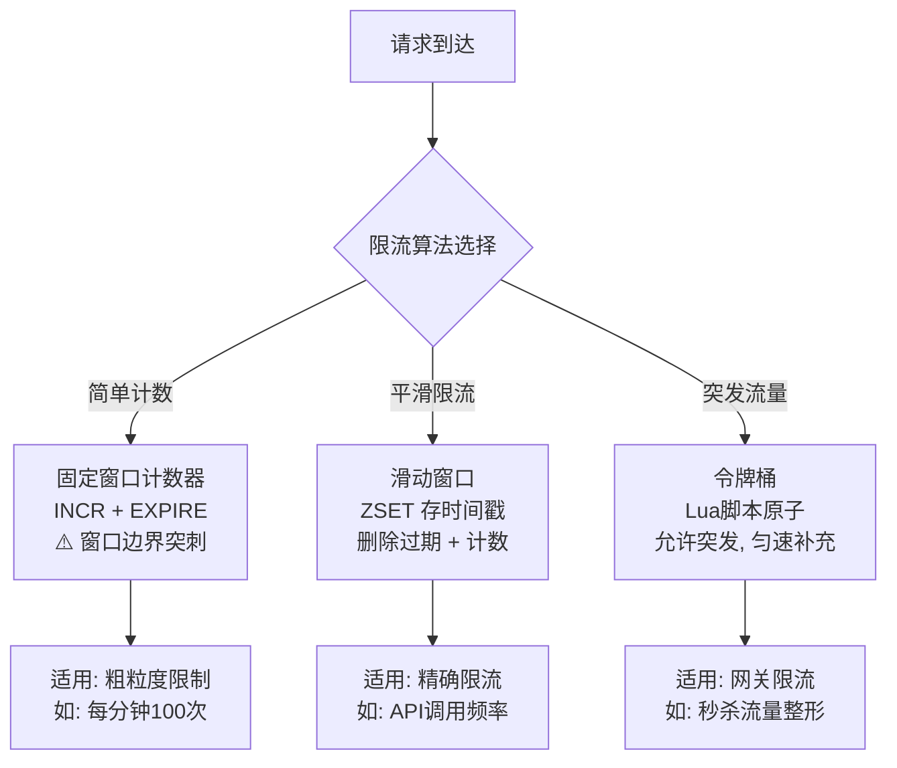

#### 实现1：固定窗口计数器（最简单）

```bash
# 每次请求执行：
INCR rate:merchant:1001:202507101430   # 计数+1
EXPIRE rate:merchant:1001:202507101430 60  # 首次设置60秒过期
# 返回值 > 阈值 → 限流
```
```java
// Java 实现
public boolean isAllowed(String key, int limit, int windowSec) {
    String redisKey = "rate:" + key + ":" + (System.currentTimeMillis() / (windowSec * 1000));
    Long count = redis.incr(redisKey);
    if (count == 1) redis.expire(redisKey, windowSec);
    return count <= limit;
}
// 缺点：窗口边界突刺——59秒时100次+1秒后100次=1秒内200次
```

#### 实现2：滑动窗口（ZSet，精确）

```lua
-- Lua 脚本：滑动窗口限流
local key = KEYS[1]
local now = tonumber(ARGV[1])
local window = tonumber(ARGV[2])  -- 窗口大小(毫秒)
local limit = tonumber(ARGV[3])   -- 最大请求数

-- 1. 移除窗口外的旧记录
redis.call('ZREMRANGEBYSCORE', key, 0, now - window)
-- 2. 统计当前窗口内请求数
local count = redis.call('ZCARD', key)
-- 3. 判断是否超限
if count >= limit then
    return 0  -- 拒绝
end
-- 4. 添加当前请求
redis.call('ZADD', key, now, now .. ':' .. math.random())  -- member需唯一
redis.call('PEXPIRE', key, window)  -- 设置过期自动清理
return 1  -- 放行
```

#### 实现3：令牌桶（允许突发）

```lua
-- Lua 脚本：令牌桶限流
local key = KEYS[1]
local capacity = tonumber(ARGV[1])  -- 桶容量
local rate = tonumber(ARGV[2])      -- 令牌补充速率(个/秒)
local now = tonumber(ARGV[3])       -- 当前时间戳(毫秒)
local requested = tonumber(ARGV[4]) -- 请求令牌数

-- 获取上次状态
local last_tokens = tonumber(redis.call('HGET', key, 'tokens') or capacity)
local last_time = tonumber(redis.call('HGET', key, 'ts') or now)

-- 计算补充的令牌
local delta = math.max(0, now - last_time) / 1000 * rate
local tokens = math.min(capacity, last_tokens + delta)

-- 判断是否够令牌
if tokens < requested then
    return 0  -- 拒绝
end

-- 扣减令牌并保存
tokens = tokens - requested
redis.call('HMSET', key, 'tokens', tokens, 'ts', now)
redis.call('EXPIRE', key, math.ceil(capacity / rate) + 10)
return 1  -- 放行
```

#### 三种算法对比

| 算法 | 平滑度 | 突发流量 | 复杂度 | 内存 | 适用场景 |
| --- | --- | --- | --- | --- | --- |
| 固定窗口 | 差（边界突刺） | 不允许 | 低 | 低（1个key） | 粗粒度限流 |
| 滑动窗口 | 好 | 不允许 | 中 | 高（ZSet存所有请求） | API频率限制 |
| 令牌桶 | 好 | 允许突发 | 中 | 低（2个字段） | 网关/秒杀限流 |

### 【项目支撑】XTransfer 支付限流实战

XTransfer 的支付网关使用**令牌桶 + 多级限流**：

1. **商户级限流**：每商户 100 QPS（令牌桶），防止单商户打满系统
2. **接口级限流**：支付接口总 5000 QPS（滑动窗口），保护下游
3. **机器级限流**：单机 1000 QPS（Semaphore 本地限流），防止单机过载
4. **降级策略**：超限返回"系统繁忙"（HTTP 429）+ 客户端指数退避重试

---

## 九、面试高频问答（标准回答）

**Q：MySQL 和 Redis 一起用，你怎么设计缓存架构？**
> 考察点：整体架构与一致性思维。思路：读多写少的热点（如商户配置、汇率）走 Cache-Aside，本地缓存(Caffeine)→Redis→DB 三级；写时先更 DB 再删缓存，删除失败用 Canal 订阅 binlog 补偿；热 key 用逻辑过期防击穿，过期打散防雪崩；穿透用布隆过滤器。强一致的资金数据不走缓存或用分布式锁。

**【深度拓展】**：缓存架构最关键的决策是**"哪些数据能容忍秒级不一致"**。能容忍的（商户配置、商品详情、汇率快照）才进多级缓存；不能容忍的（账户余额、订单状态）要么直接读主库、要么用状态机+CAS 强一致（见并发篇）。另一个深挖点：**"先更 DB 再删缓存"在极端并发下仍有一个不成立**——删缓存失败（Redis 抖动）会留下脏数据，所以生产上务必有"兜底删除"：要么 Canal 订阅 binlog 异步删（最稳，和业务解耦），要么发延迟消息二次删。还有"先删缓存再更 DB"为什么更糟——并发读会回填旧值且长期脏。最后，**本地缓存(Caffeine)的一致性窗口**比 Redis 更大（各节点独立），靠短 TTL + 失效广播收敛，所以本地缓存只放"变了也无所谓短时间内"的数据。

**【项目支撑】**：欧凡直播间用**"Caffeine 本地二级 + Redis 分布式 + MySQL"三级缓存**扛住主播推的超级热点商品，p99 压到 200ms 内——本地缓存挡住绝大部分流量，Redis 只做跨实例共享兜底，DB 几乎不被打。XTransfer 的**写模型/读模型（CQRS）**则是"读写分离"的升级版：收款流程的写（命令→状态变更）走 MySQL 命令库，查询（列表/详情/对账）走独立读模型，避免大事务里既写又查；读模型更新靠领域事件驱动，接受短暂延迟（最终一致）。哈啰薪资的**计薪规则**也用 Caffeine+Redis 两级缓存，因为规则"读多改少"且允许改后秒级生效。

**Q：一条 SQL 很慢，你的完整排查链路？**
> 慢日志定位 → explain 看 type/key/rows/Extra → 判断是否走索引/回表/filesort → 加联合/覆盖索引或改写 → 数据量太大则分库分表或异构到 ES → 压测验证。结合支付对账大表用 `(merchant_id, created_at)` 覆盖索引 + 游标分页。

**【深度拓展】**：`explain` 只是起点，**慢的真正原因要分层看**：① 是不是没走索引（type=ALL 全表扫）；② 走了索引但回表多（Extra=Using where; Using index 才是覆盖索引，最理想）；③ 排序/分组触发 filesort/temporary（没走索引排序）；④ 锁等待（被别的长事务/行锁卡住，看 `show processlist` + `innodb_trx`）；⑤ 统计信息过期导致优化器选错计划（`analyze table` 刷新）。还有个高级坑：**索引选了但基数估计错**（比如 `merchant_id` 分布极不均，头部商户占了 80% 数据），优化器可能宁可全表扫——这时要 hint 或改写 SQL。排查完**一定要压测验证**，别"感觉加了索引就快了"。

**【项目支撑】**：XTransfer 的**对账大表**（千万级对客结算流水）就是典型：按 `(merchant_id, created_at)` 建联合覆盖索引，让"某商户某时间段"的对账查询直接走索引且少回表；深分页用**游标分页**（`where id > last_id limit N`）替代 `limit 1000000,10`，避免扫描丢弃前面百万行。哈啰工单表**按创建时间分表**，绝大多数查询带时间范围天然落分片，跨分片（按车辆 ID）的少数查询走异构索引表或数仓——这是"分片键选高频维度 + 异构索引兜其他维度"的标准打法。

**Q：Redis 为什么单线程还这么快，什么会让它变慢？**
> 快：内存 + 单线程无锁 + epoll + 高效结构。变慢：大 key（删除/传输阻塞）、热 key（单分片打满）、复杂命令（keys *、大范围 zrange）、AOF always、fork 时内存大。解决：拆大 key、热点做本地缓存/多副本、用 scan 代替 keys、监控慢日志。

**【深度拓展】**："单线程"要分清——**命令执行**单线程（保证原子、无锁），但 **Redis 6+ 的网络 IO 已经多线程化**（io-threads 处理读写 socket），所以纯网络瓶颈也被部分化解了，瓶颈仍在命令执行的单线程。为什么不一早多线程？因为多线程要处理共享数据竞争，复杂度飙升，而大多数场景单线程够用。变慢的"头号杀手"是**大 key**：一个 10MB 的 Hash 做 `HGETALL` 或 `DEL` 会阻塞单线程几十毫秒，期间所有其他命令排队——这叫"慢查询阻塞"。热 key 同理：所有流量打到一个分片。生产要**定期 `redis-cli --bigkeys` 巡检 + 监控 slowlog**。

**【项目支撑】**：欧凡直播的**热点商品**就是教科书级热 key——主播推的款全平台都在查，单靠 Redis 也会把单分片网卡打满。我们的解法是**加 Caffeine 本地二级缓存**，热点商品命中本地几乎不触网（呼应 MySQL 篇的三级缓存）。XTransfer 的**库存/限额**类数据如果用 Redis 计数，也会遇到并发 `INCR` 的热点问题，但我们更关键的是把"判断+扣减"放进 **Lua 脚本**在 Redis 单线程内原子执行（见 Q22），既保证原子又避免"先查后扣"的并发窗口——这恰是利用了 Redis 单线程原子性的好处。

**Q：分布式锁用 Redis 还是 ZooKeeper？**
> 看权衡：Redis 性能高、AP，极端主从切换可能丢锁（Redisson 看门狗 + RedLock 缓解）；ZK 基于 ZAB 强一致 CP、临时节点 + watch 天然适合锁，但性能较低。高并发弱一致选 Redis(Redisson)，强一致选 ZK。支付扣款这类要么用 DB 唯一约束/乐观锁兜底，要么 Redisson + 幂等双保险。

**【深度拓展】**：分布式锁最反直觉的点是**"锁丢了"不是网络抖动那么简单**。Redis 主从异步复制下，主节点刚 `SET NX` 成功、锁还没同步到从节点，主就挂了、从被提主——新主没有这把锁，另一个进程就能拿到，**发生双持锁**。RedLock 想用"多数派"缓解但争议大（Martin Kleppmann 有著名批评：依赖时钟假设仍有漏洞）。所以工程上的共识是：**分布式锁只保证"互斥大概率成立"，绝不替代业务层的幂等/约束**。真正的"最后一道闸"永远是**数据库唯一约束 / 乐观锁 version / 状态机 CAS**——锁只是减少冲突概率，兜底靠 DB。ZK 的临时节点 + session 机制天然在客户端宕机时自动释放，比 Redis 的"靠过期时间"更优雅，但吞吐低一个量级。

**【项目支撑】**：XTransfer 的**资金操作并发控制**从不单独依赖 Redis 锁，而是用 `UPDATE ... WHERE status = 旧态`（CAS）+ 数据库唯一约束（幂等键）做**强兜底**——即便分布式锁失效，状态机也会拒绝非法二次流转。欧凡**优惠券/库存**的并发扣减用 Redis `Lua` 原子脚本，扣减成功才落库，且用"用户+活动"唯一约束防重复领，也是"Redis 做快路径、DB 做最终一致兜底"的同一思路。哈啰工单的**幂等**靠"同车辆同窗口去重键"，本质也是用 DB 唯一键兜底而非纯锁。

**Q：为什么 MySQL 默认 RR 而很多大厂改 RC？**
> RR 用 Next-Key Lock 防幻读但间隙锁多、易死锁、并发低；RC 锁范围小并发高，配合 binlog row 格式不会主从不一致，且业务多数不依赖 RR 的可重复读。所以高并发场景常改 RC。

**【深度拓展】**：改 RC 的底层动机是**"减少锁范围 = 提升并发"**。RR 下即使是普通 `select ... for update` 也可能加 Next-Key Lock（记录锁+间隙锁），两个事务各自锁一段间隙就容易**死锁**；RC 下只锁已存在的记录，间隙不锁，并发友好得多。但 RC 有代价：① **不可重复读**（同一事务两次读可能不一致）——多数业务不在意；② **binlog 必须用 row 格式**，否则 RC + statement binlog 主从会不一致（这是改 RC 的硬性前提）。另外注意：**即使 RR，当前读（`for update`）仍可能幻读**，要靠 Next-Key Lock 兜，快照读才靠 MVCC 兜——很多人混淆"RR 完全无幻读"。

**【项目支撑】**：XTransfer 的**账务/结算**链路对"可重复读"其实有诉求（对账时希望一个事务内看到一致的快照），但我们没靠数据库 RR，而是**用读模型快照 + 对账任务固定时间窗口**在应用层解决，主库为了并发还是偏向 RC + 行锁。哈啰薪资的**批量计算**也是"先快照输入、再计算"——计算前把当批的考勤/绩效数据按批次号固定下来，避免计算过程中数据被改导致结果漂移，这和"数据库隔离级别解决一致性"是应用层与数据库层的两种分工。

---

## 更多高频追问（补充）

**Q：索引失效有哪些常见场景？**
> ①违反最左前缀（跳过联合索引左列）；②索引列上做函数/运算/类型转换（如 `WHERE date(t)=... `、字符串列传数字触发隐式转换）；③`LIKE '%x'` 前置通配；④`OR` 两侧有非索引列；⑤`!=`/`NOT IN`/`IS NOT NULL` 常走全表；⑥优化器判断走索引不如全表（回表太多）。用 `EXPLAIN` 看 type/key/rows/Extra 验证。

**Q：什么是最左前缀原则？联合索引 (a,b,c) 怎么命中？**
> 联合索引按 a→b→c 顺序排列，查询必须从最左列连续匹配。`a`、`a,b`、`a,b,c` 命中；`b`、`b,c`、`c` 不命中；`a,c` 只用到 a（c 无法用索引）。范围查询（>、<、between、like）会截断后续列，如 `a=1 AND b>2 AND c=3`，c 用不上索引。所以**等值列放左、范围列放右**。

**Q：count(*)、count(1)、count(字段) 有区别吗？怎么优化大表 count？**
> count(*) 和 count(1) 基本等价（InnoDB 优化过，走最小索引统计非 NULL 行）；count(字段) 只统计该字段非 NULL 的行，且不走覆盖索引时更慢。大表精确 count 无捷径，优化：走二级索引（比聚簇小）、用汇总表/Redis 计数器维护、或接受近似值（`SHOW TABLE STATUS` 的估算）。

**Q：delete、truncate、drop 的区别？**
> delete 是 DML、逐行删、走事务可回滚、触发触发器、不释放空间（可加 where）；truncate 是 DDL、清空表、不可回滚、不触发触发器、重置自增、快；drop 是 DDL、连表结构一起删。删全表用 truncate 快，删部分用 delete，删表用 drop。

**Q：Redis 各数据类型的典型应用场景？**
> String：缓存对象/计数器/分布式锁；Hash：存对象字段（可局部更新，如购物车）；List：消息队列/最新列表；Set：去重/共同好友（交并差）；ZSet：排行榜/延迟队列（score 存时间戳）；Bitmap：签到/UV；HyperLogLog：海量 UV 近似统计；GEO：附近的人。讲清"为什么用这个类型"比背命令强。

**Q：Redis 主从复制的原理？**
> 首次全量：从库发 PSYNC，主库 `bgsave` 生成 RDB 发给从库加载，期间写命令进 replication buffer 补发；之后增量：主库把写命令持续同步到从库（异步）。断线重连用 `offset + replication backlog` 做部分重同步。异步复制意味着主从有延迟、极端切换可能丢数据（见前文分布式锁）。

**Q：Redis 的 pipeline 和事务（MULTI/Lua）有什么区别？**
> pipeline 是**批量发命令减少 RTT**，不保证原子性、命令间可穿插其他客户端。MULTI/EXEC 保证命令**打包顺序执行不被打断**，但不支持回滚（语法错才整体不执行，运行时错照常执行后续）。要**原子 + 逻辑判断**用 **Lua 脚本**（单线程执行、原子），如 Redis+Lua 实现库存扣减、令牌桶限流。

---

## 十、MySQL + Redis 面试全景总结

### MySQL 与 Redis 知识体系全景图

```mermaid
flowchart TD
    ROOT["MySQL + Redis 面试全景"] --> MYSQL["MySQL"]
    ROOT --> REDIS["Redis"]

    MYSQL --> IDX["索引体系"]
    MYSQL --> TXN["事务与锁"]
    MYSQL --> LOG["日志与复制"]
    MYSQL --> OPT["优化与分库分表"]

    IDX --> I1["B+树原理"]
    IDX --> I2["聚簇/二级索引<br/>回表/覆盖索引"]
    IDX --> I3["最左前缀/索引失效"]
    IDX --> I4["EXPLAIN深度解读"]
    IDX --> I5["ICP/MRR/覆盖索引优化"]

    TXN --> T1["ACID实现"]
    TXN --> T2["四种隔离级别"]
    TXN --> T3["MVCC版本链"]
    TXN --> T4["行锁/间隙锁/Next-Key"]
    TXN --> T5["死锁排查"]

    LOG --> L1["redo/undo/binlog"]
    LOG --> L2["两阶段提交"]
    LOG --> L3["主从复制原理"]
    LOG --> L4["并行复制/半同步"]

    OPT --> O1["慢SQL排查链路"]
    OPT --> O2["深分页优化"]
    OPT --> O3["分库分表策略"]
    OPT --> O4["分布式ID方案"]

    REDIS --> DS["数据结构"]
    REDIS --> PH["持久化"]
    REDIS --> CL["集群模式"]
    REDIS --> CACHE["缓存问题"]
    REDIS --> DIST["分布式锁/限流"]

    DS --> D1["5种基础+4种进阶"]
    DS --> D2["内部编码转换<br/>ziplist/skiplist/intset"]
    DS --> D3["单线程为什么快"]

    PH --> P1["RDB vs AOF"]
    PH --> P2["混合持久化"]
    PH --> P3["fork与COW"]

    CL --> C1["主从/哨兵/Cluster对比"]
    CL --> C2["16384槽位路由"]
    CL --> C3["故障转移流程"]

    CACHE --> CA1["穿透: 布隆过滤器"]
    CACHE --> CA2["击穿: 互斥锁/逻辑过期"]
    CACHE --> CA3["雪崩: TTL打散/多级缓存"]
    CACHE --> CA4["一致性: Cache-Aside+Canal"]

    DIST --> DI1["分布式锁: SET NX PX + Lua"]
    DIST --> DI2["Redisson看门狗"]
    DIST --> DI3["限流: 计数器/滑动窗口/令牌桶"]
```

### 高频面试题速查表

| 题号 | 问题 | 核心答案 | 难度 |
| --- | --- | --- | --- |
| Q1 | 为什么用B+树 | 叶子双向链表，矮树少IO，范围排序友好 | ★★ |
| Q2 | 聚簇vs二级索引 | 聚簇存整行，二级存主键需回表 | ★★ |
| Q3 | 最左前缀/索引失效 | 连续匹配左列，函数/隐式转换/前导%失效 | ★★★ |
| Q4 | 慢SQL排查 | 慢日志→EXPLAIN→type/key/Extra→加索引→压测 | ★★★ |
| Q5 | ACID实现 | undo(原子)+redo(持久)+锁/MVCC(隔离) | ★★ |
| Q6 | 四种隔离级别 | RU/RC/RR/串行，RR用MVCC+Next-Key防幻读 | ★★★ |
| Q7 | MVCC原理 | 版本链+ReadView，RC每次新建RR复用 | ★★★★ |
| Q8 | InnoDB锁体系 | 记录锁/间隙锁/Next-Key/插入意向锁 | ★★★★ |
| Q9 | 三种日志 | redo物理/undo逻辑/binlog复制，两阶段提交 | ★★★ |
| Q11 | 深分页优化 | 游标分页/延迟关联 | ★★★ |
| Q14 | Redis数据结构 | String/Hash/List/Set/ZSet+进阶类型 | ★★ |
| Q15 | Redis为什么快 | 内存+单线程+epoll+高效结构 | ★★ |
| Q16 | RDB vs AOF | RDB快照快/AOF日志全，混合持久化兼顾 | ★★★ |
| Q17 | 三种集群模式 | 主从/哨兵/Cluster各有适用场景 | ★★★ |
| Q20 | 缓存三连 | 穿透布隆/击穿互斥锁/雪崩TTL打散 | ★★★★ |
| Q21 | 缓存一致性 | 先更DB再删缓存+Canal兜底 | ★★★★★ |
| Q22 | 分布式锁 | SET NX PX + Lua解锁+Redisson续期 | ★★★★★ |
| Q23 | Redis限流 | 计数器/滑动窗口/令牌桶Lua | ★★★ |

### 面试官追问·逃生路线总结

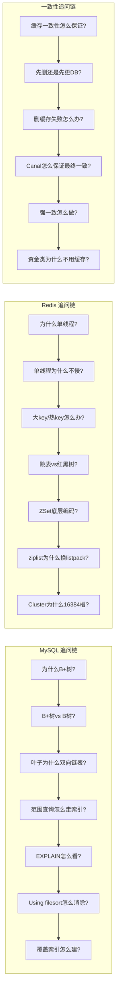

### 一句话核心记忆

| 主题 | 一句话 |
| --- | --- |
| B+树 | 非叶只存索引、叶子双向链表——矮树少IO、范围排序友好 |
| MVCC | 版本链+ReadView，RC每次新建RR复用——快照读的核心 |
| Next-Key Lock | 记录锁+间隙锁，RR防幻读的当前读方案 |
| 两阶段提交 | redo prepare→binlog→redo commit，保证主从一致 |
| EXPLAIN | type从ALL到const，Extra看Using index/filesort/temporary |
| 覆盖索引 | 查询列都在索引里不回表，Extra=Using index |
| Redis单线程 | 命令执行单线程无锁，6.0后网络IO多线程 |
| ZSet底层 | 跳表+哈希，跳表管范围查询哈希管O(1)查分 |
| 缓存三连 | 穿透=不存在(布隆) 击穿=热点过期(互斥锁) 雪崩=批量过期(TTL打散) |
| 缓存一致性 | 先更DB再删缓存+Canal兜底，强一致走DB不走缓存 |
| 分布式锁 | SET NX PX + Lua解锁，锁只减概率DB兜底线 |
| 限流三法 | 计数器(粗) 滑动窗口(精) 令牌桶(突发) |

### 【项目支撑】三段经历的 MySQL + Redis 实战总结

| 场景 | 欧凡（电商） | XTransfer（跨境支付） | 哈啰（出行/薪资） |
| --- | --- | --- | --- |
| MySQL索引 | 商品查询覆盖索引 | 对账大表(merchant_id, created_at)联合索引 | 工单按时间分表+异构索引 |
| MySQL分库分表 | 按user_id分库 | 按merchant_id分库+异构索引 | 按时间分表+车辆ID异构 |
| Redis缓存 | 三级缓存(Caffeine+Redis+DB) | CQRS读写分离+领域事件 | Caffeine+Redis两级缓存 |
| Redis分布式锁 | Lua原子扣减库存/优惠券 | CAS状态机+DB幂等键兜底 | 去重键+DB唯一约束 |
| Redis限流 | 直播间令牌桶 | 支付网关多级限流 | 批量计算并发控制 |
| 一致性方案 | 延迟双删+Canal兜底 | 读模型快照+最终一致 | 规则变更主动失效+短TTL |
| 数据隔离 | RC+行锁 | RC+状态机CAS | 批次快照+固定时间窗口 |

---

# 第十一节：全新四个角度（故障复盘 / 横向对比 / 量化指标 / 答题框架）

> 前面是把"知识点"讲透，这一节是把"面试现场怎么打"讲透。十年经验的价值，不只是知道原理，而是能在高压下面试官面前把**事故讲成故事、把选型讲成决策、把结论讲成数字、把追问讲成框架**。

## 【故障复盘】真实事故案例库

> 面试官最爱听的不是"缓存雪崩是什么"，而是"你经历过一次雪崩、怎么定位、怎么止血、怎么根治"。下面三起都是支付/电商体系里**高频真实事故形态**（背景做了脱敏与拟真），统一按"背景 → 触发 → 影响面(量化) → 定位 → 止血 → 根因修复 → 长效预防"七段式讲，这七段本身就是你的**表达脚手架**。

### 案例一：深分页慢查询拖垮主库

- **背景**：XTransfer 对账后台大商户（头部商户占全量流水 30%+）按时间倒序翻页查流水，前端用经典 `LIMIT offset, N`。
- **触发**：运营把第 1 页一路翻到第 5000 页（`LIMIT 5000000, 20`），单条 SQL 要扫描并丢弃前 500 万行。
- **影响面（量化）**：该商户查询的平均 RT 从 40ms 涨到 **8.2s**；慢查询（>1s）占全库 QPS 比例从 3% 飙到 **62%**；主库 CPU 从 35% 冲到 **92%**，连带拖慢同实例其他商户的对账查询，超时率 **+18pp**。
- **定位**：① `slow_query_log` 抓到该 SQL，`Rows_examined=5000020、Rows_sent=20`；② `EXPLAIN` 显示 `type=ALL`（全表扫）、`Extra=Using where; Using filesort`；③ `SHOW PROCESSLIST` 看到 7 条同形态语句堆积，持有 `Sending data` 状态。
- **止血**：DBA 临时 `KILL` 长查询 + 网关侧对该接口加单商户并发 1 的限流 + 对账后台强制"只许首页/下一页"。
- **根因修复**：深分页改**游标分页**（`WHERE id < #{lastId} ORDER BY id DESC LIMIT 20`）；历史导出走异步任务 + ES。
- **长效预防**：SQL 审计平台把"offset > 10 万"标记为反模式告警；慢查询 > 500ms 自动钉钉告警；对账类读全部走**只读从库 + 读模型**，不碰命令库。

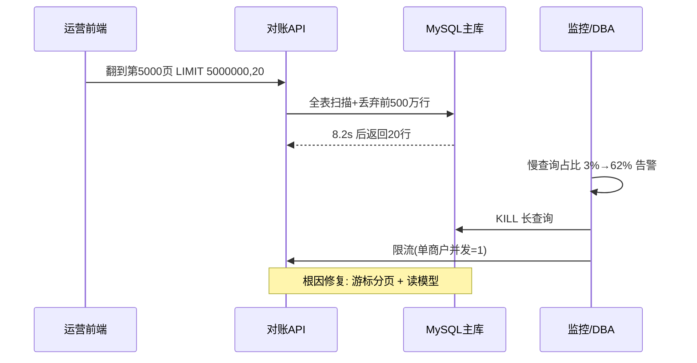

### 案例二：缓存雪崩（TTL 同时过期）

- **背景**：欧凡直播间商品详情走 `Caffeine → Redis → MySQL` 三级缓存，大促前批量预热的 30 万 SKU 用了**相同 TTL（30 分钟整点过期）**。
- **触发**：大促整点流量洪峰 + 缓存集中到期，瞬时大量请求穿透到 DB。
- **影响面（量化）**：Redis 缓存命中率从 98.5% **暴跌到 21%**；MySQL 读 QPS 从 2k **飙到 22k**（11 倍）；商品详情接口 P99 从 60ms 涨到 **1.9s**，错误率超 5%。
- **定位**：① `redis-cli info stats` 看 `keyspace_hits/misses` 命中率曲线断崖；② `Redis MONITOR` 抽样看到同一时刻 `GET product:*` 大量返回 nil；③ 监控面板发现所有 SKU 的 `expires_at` 集中在整点。
- **止血**：紧急错峰——脚本批量 `EXPIRE` 给现有 key 追加随机 0~300s；对 DB 加临时读限流 + 连接池扩容；降级返回"稍后再试"。
- **根因修复**：TTL 改为 `base + random(0, 300s)` 打散；热点 SKU 走**逻辑过期**（异步重建，不真删）；加**本地 Caffeine 二级**挡住绝大部分流量。
- **长效预防**：缓存命中率 < 90% 持续 1min 即告警；大 key/热点巡检周常；压测时专门打"集中过期"场景。

### 案例三：大 key 阻塞单分片

- **背景**：哈啰某"全城车辆在线状态"用了一个 Hash（field=车辆ID），单 key 体积膨胀到 **48MB**。
- **触发**：定时任务 `HGETALL` 全量拉取做聚合，且每秒一次；同时该 key 所在分片做 `DEL` 重建。
- **影响面（量化）**：该分片 RT P99 从 5ms **涨到 520ms**，慢查询日志里 `HGETALL`/`DEL` 占满 slowlog；同分片其他业务（工单查询）P99 从 30ms 涨到 400ms，**整分片接近阻塞**。
- **定位**：① `redis-cli --bigkeys` 扫出该 48MB Hash；② `SLOWLOG GET` 看到 `HGETALL` 耗时 380ms；③ `redis-cli --latency` 该分片延迟异常，其他分片正常 → 定位到**热点分片**。
- **止血**：把聚合任务改为**分批 `HSCAN`**（每次 500 field），避免一次性读全量；重建改为小步 `HDEL` 单 field。
- **根因修复**：大 Hash 拆成按车辆ID取模的 256 个子 key（`status:{shard}`），单 key 控制在 < 100KB；聚合在应用层多 key 归并。
- **长效预防**：`--bigkeys` 周常巡检 + 单 key > 10MB 自动告警；写入侧监控单 key 体积。

---

## 【横向对比】技术选型决策

> 面试官问"为什么用 Cluster 不用哨兵""为什么选这套一致性方案"，本质在测**决策能力**。下面给出几组可直接搬上白板的对比表 + 决策树，核心是讲清 trade-off。

### 对比一：Redis 高可用模式选型（主从 / 哨兵 / Cluster）

| 维度 | 主从复制 | 哨兵 Sentinel | Cluster |
| --- | --- | --- | --- |
| 高可用 | ❌ 人工切换 | ✅ 自动故障转移 | ✅ 自动故障转移 |
| 容量 / 写入 | ❌ 单主瓶颈 | ❌ 单主瓶颈 | ✅ 多主分片 |
| 运维成本 | 低 | 中（3 哨兵） | 高（6+ 节点 + 槽迁移） |
| 跨槽限制 | 无 | 无 | 需 hash tag |
| 适用 | 读多写少 + 容忍人工 | 中小规模高可用 | 大规模 / 写入瓶颈 |

**决策树**：数据量 < 单节点内存上限（约 32GB）且写入不超单主 → **哨兵**；写入或容量触顶单主 → **Cluster**；纯容灾演示/从库读 → **主从**。

### 对比二：缓存一致性 6 方案（浓缩）

| 方案 | 一致性 | 复杂度 | 适用 |
| --- | --- | --- | --- |
| 读写都走主库 | 强 | 低 | 资金余额 |
| 分布式锁串行化 | 强 | 高 | 极少 |
| 先更DB再删缓存 | 最终 | 低 | 大多数 |
| 延迟双删 | 最终 | 中 | 中高一致 |
| Canal 订阅 binlog | 最终 | 高 | 高一致+解耦 |
| MQ 重试删 | 最终 | 中 | 有 MQ 设施 |

**为什么选"先更DB再删缓存 + Canal 兜底"而非"强一致分布式锁"**：资金类只占极小比例，绝大多数读多写少场景为"短暂不一致"付出**分布式锁的吞吐与可用性代价"不可接受**；Canal 把删除动作从业务代码解耦，Redis 抖动也能在恢复后补偿——**用"最终一致 + 短 TTL 兜底"把脏窗口压到秒级以下**，性价比最高。

### 对比三：MySQL 存储引擎（InnoDB vs MyISAM vs RocksDB）

| 维度 | InnoDB | MyISAM | RocksDB(MyRocks) |
| --- | --- | --- | --- |
| 事务 | ✅ | ❌ | ✅ |
| 崩溃恢复 | ✅ redo | ❌ | ✅ WAL |
| 行级锁 | ✅ | ❌(表锁) | ✅ |
| 压缩比 | 中 | 低 | **高(10:1)** |
| 写入吞吐 | 中 | 低 | **极高(写放大低)** |
| 适用 | 通用 OLTP | 只读报表 | 写密集/历史归档 |

> 选型结论：OLTP 一律 InnoDB；超大规模只追加写、读靠 ES/OLAP 的历史表可上 MyRocks 省成本。

### 对比四：Redis 数据结构选型（高频场景）

| 场景 | 首选结构 | 备选 | 关键理由 |
| --- | --- | --- | --- |
| 对象缓存 | String(JSON) / Hash | — | Hash 可局部更新 |
| 排行榜 | ZSet | — | 跳表范围查询 O(log n) |
| 去重/交集 | Set | Bitmap | 交并差原生 |
| 签到/UV | Bitmap | HyperLogLog | 1 bit/天，省内存 |
| 滑动窗口限流 | ZSet | String+Lua | 时间戳有序 |

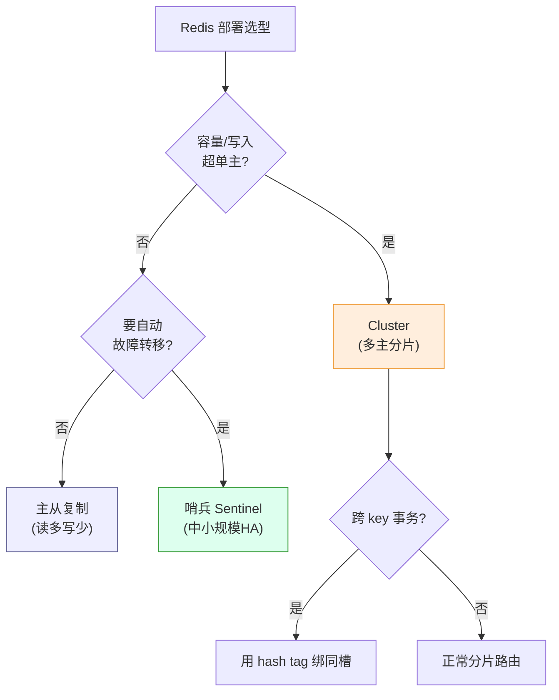

---

## 【量化指标】SLA 设计与成本收益

> 十年工程师和普通候选人的区别：前者说话带数字。下面给出可直接用于"定 SLA / 做容量评估 / 设告警"的参考基线（基于支付/电商真实实践），以及一页成本收益测算。

### 关键 SLI / SLA 基线（MySQL + Redis）

| 指标 | 目标值 | 红线/告警阈值 | 说明 |
| --- | --- | --- | --- |
| 慢查询（>500ms）占比 | < 1% | > 3% 告警，> 10% 拉群 | 支付核心库更严 |
| 单表行数 | < 2000 万 | > 1000 万评估分表 | 超阈值 B+ 树仍可用但维护难 |
| 缓存命中率 | ≥ 95%（读多） | < 90% 告警，< 80% 页面对外降级 | 三层缓存应 > 98% |
| Redis P99 读延迟 | < 5ms | > 20ms 排查大/热 key | 单分片阻塞信号 |
| MySQL P99 查询 | < 50ms（索引内） | > 200ms 排查索引/锁 | 对账类可放宽 |
| 主从延迟 | < 1s | > 5s 强制读主 | 读写分离一致性底线 |

### 容量评估示例（单表行数 → 分库分表）

```
假设：单表安全上限 2000 万行，当前日增 50 万行，保留 18 个月
→ 需要容量 = 50万 × 540天 ≈ 2.7 亿行
→ 单表装不下，按 merchant_id 取模分 16 库 × 每库 16 表 = 256 分片
→ 单分片 ≈ 2.7亿 / 256 ≈ 105 万行（健康水位）
→ 实例数：256 分片 ÷ 每实例 8 分片 ≈ 32 个 MySQL 实例（主从 ×2 = 64 节点）
```

### 成本收益测算示例（三级缓存 vs 纯 DB）

```
现状：商品详情 5000 QPS 直达 MySQL，主库 8C16G 扛到 70% CPU
方案：加 Caffeine(本地) + Redis(分布式) 三级缓存，命中率 98%
→ MySQL 读 QPS 由 5000 降到 5000 × 2% = 100
→ 主库 CPU 由 70% 降到 ~15%，可少扩容 1 个只读从库（约 ¥2.4w/年）
→ 成本：2 台 Redis(32G) ≈ ¥3.6w/年 + 开发 5 人日
→ 收益：DB 压力降 98% + P99 从 200ms 降到 30ms + 抗大促洪峰不扩容
→ 结论：TCO 半年回本，且可用性收益无法用钱衡量（雪崩归零）
```

### 告警阈值建议（可直接配监控）

- 慢查询占比连续 1min > 3% → 钉钉告警；> 10% → 电话拉群
- 缓存命中率连续 1min < 90% → 告警（雪崩前兆）
- 主从延迟 > 5s → 强制读主 + 告警
- 单 key 体积 > 10MB → 周常巡检告警（大 key）
- 连接池使用率 > 80% → 预警（防止打满）

---

## 【答题框架】面试表达模板

> 这一节给你"被问到原理题时，白板/口述的标准打法"。统一套路：**定调 → 原理 → 落地 → 边界权衡**，最后用逃生话术兜底。

### 分层回答套路（以"一条 SQL 很慢"为例）

1. **定调**："慢 SQL 排查是体系化动作，不是上来就加索引。"
2. **原理**：慢日志定位 → `EXPLAIN` 看 `type/key/rows/Extra` → 判断是全扫/回表/filesort/锁等待 → 优化器选错计划。
3. **落地**：结合 XTransfer 对账大表 `(merchant_id, created_at)` 覆盖索引 + 游标分页，P99 从秒级降到毫秒级。
4. **边界权衡**：索引不是越多越好（写放大、优化器选择困难）；深分页不能只靠加索引，要到游标/延迟关联；极端大表要分库分表或异构 ES。

### 白板/口述：先画什么图

被问"索引/事务/MVCC"时，白板优先画两样东西，比纯讲更得分：

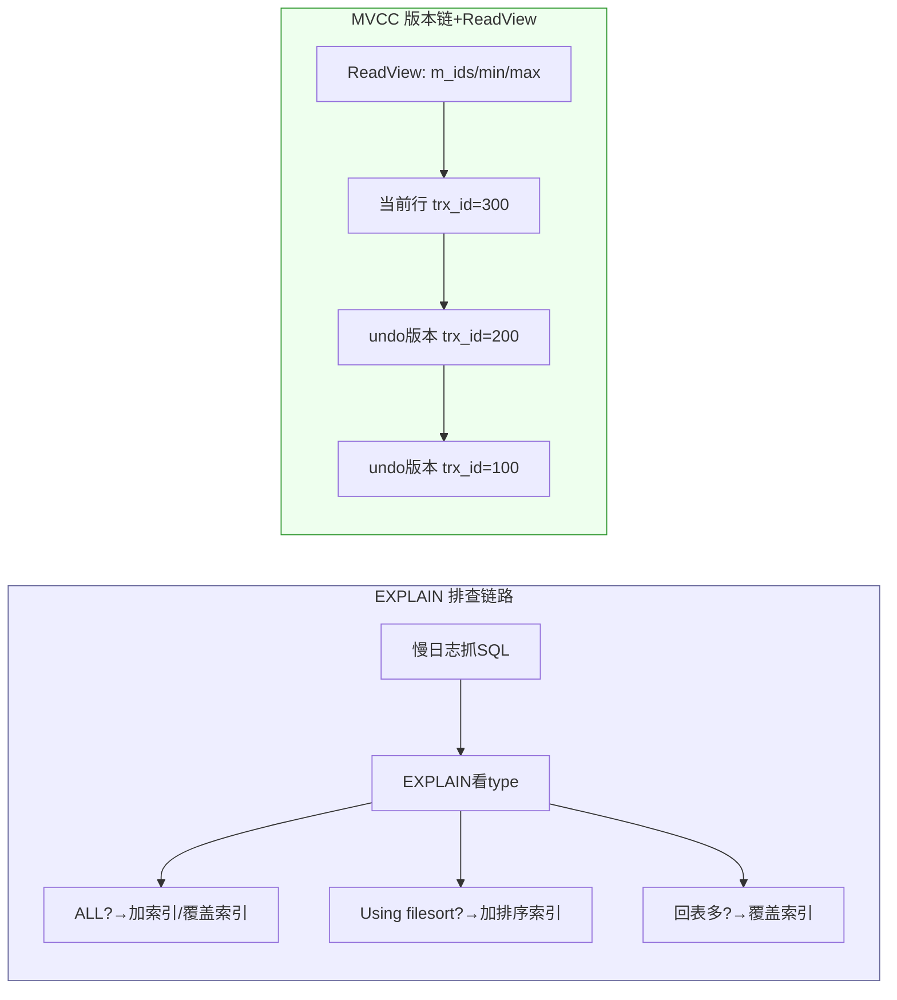

**口述顺序**：先画 B+ 树叶子双向链表（解释范围查询为什么快）→ 再画 EXPLAIN 字段（type 从 ALL 到 const）→ 最后画 MVCC 版本链 + ReadView（解释 RR 可重复读）。这三张图讲完，面试官基本不会继续在原理层深挖。

### STAR 叙事模板（最典型追问："讲一次你优化的慢 SQL"）

```text
S: XTransfer 对账大表千万级，头部商户翻页查询拖垮主库
T: 把对账查询 P99 从 8s 降到 <100ms，且不波及同实例其他商户
A: ① 慢日志+EXPLAIN 定位是全表扫+filesort(offset 500万)
   ② 建 (merchant_id, created_at) 联合覆盖索引
   ③ 深分页改游标分页 WHERE id<lastId LIMIT N
   ④ 读流量切到只读从库+读模型，不碰命令库
R: P99 从 8.2s 降到 35ms(-99.6%)，慢查询占比 62%→<1%，0 雪崩
```

### 被追问到不会时的逃生话术

- "缓存一致性极端并发的残留窗口我没在生产精确测过，但我理解理论窗口是'删缓存失败'或'读回填旧值'，我们用延迟双删+Canal 把它压到秒级以下。"（**承认边界 + 给框架 + 拉回项目**）
- "B+ 树 vs LSM 我落地不多，但按写放大/读放大的第一性原理，LSM 适合写密集、B+ 适合读密集，我们 OLTP 是读多所以选 InnoDB。"（**第一性原理推演**）
- "这块细节我回去会补，不过我们项目里实际用的是 X 方案，原因是 Y。"（**把话题锚回真做过的点**）

> 逃生三原则：**不硬编、给框架、拉回项目**。面试官通过"不会时怎么表现"看潜力，比答满更重要。

<!-- EXPANDED -->
