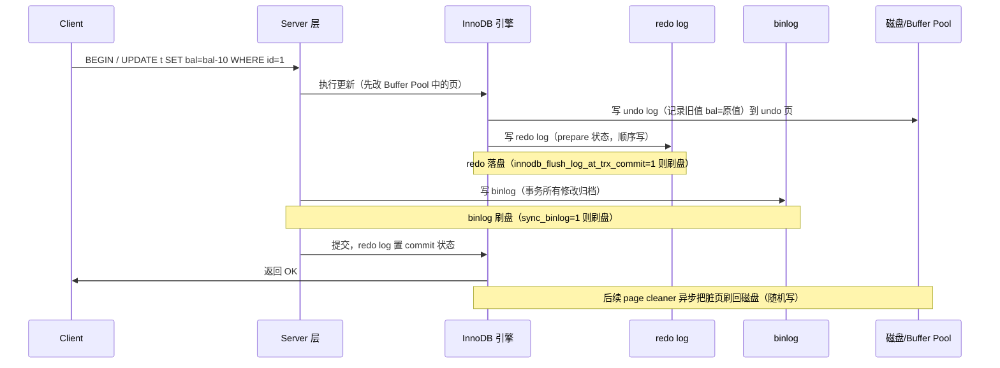
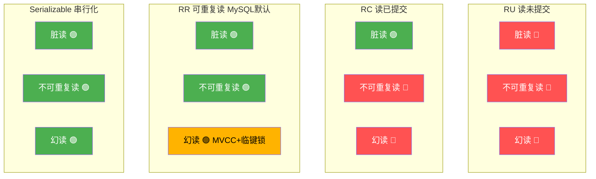
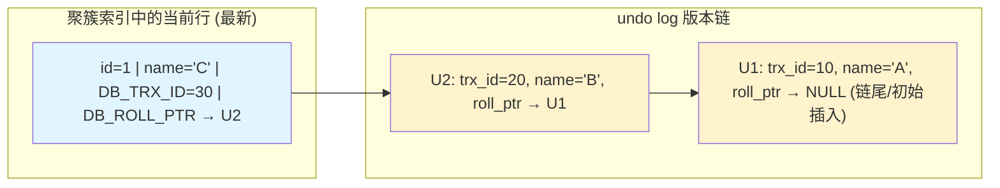
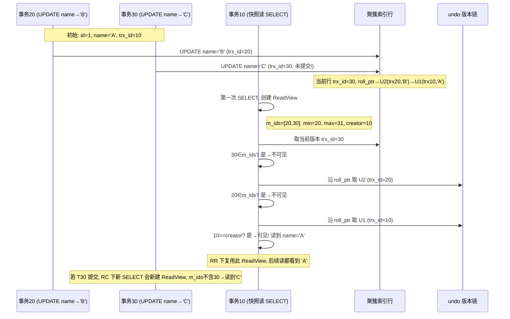
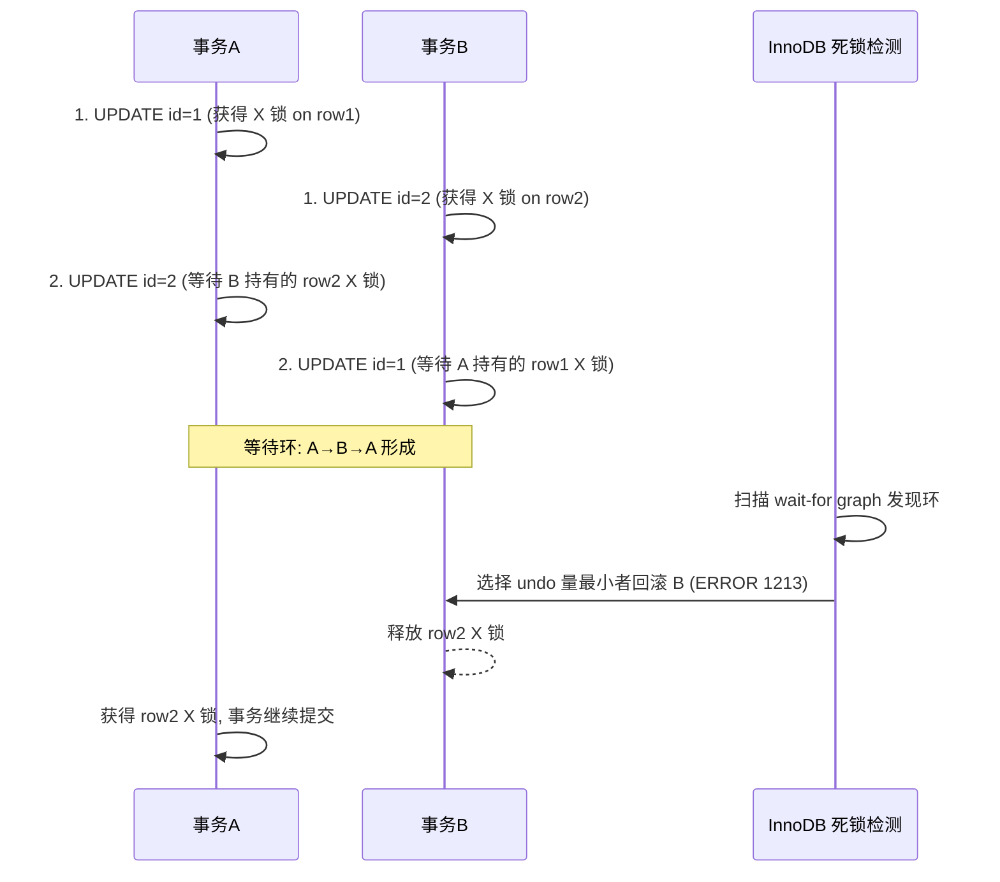
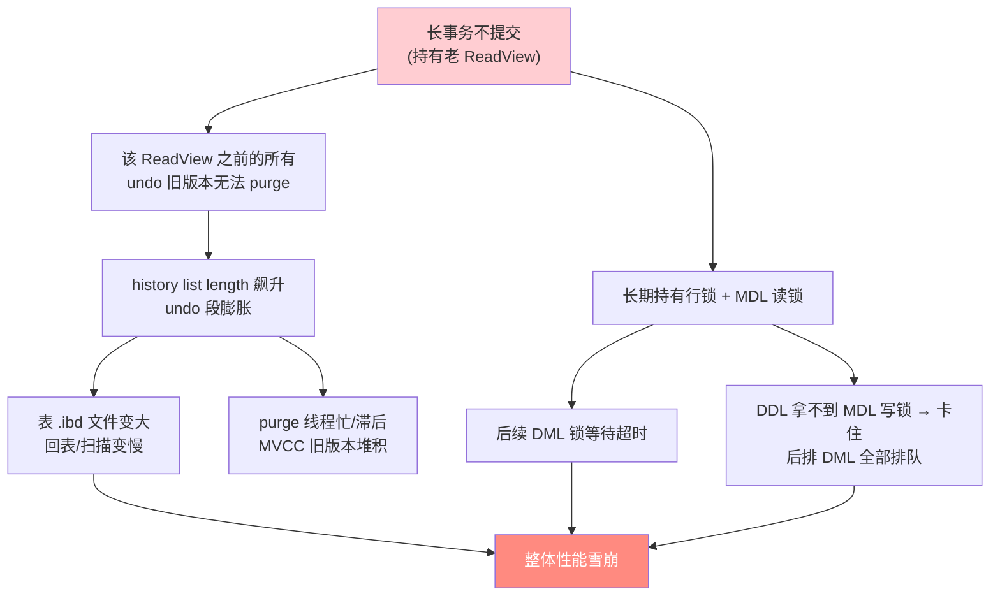

> 作者 ｜ 10 年 Java 后端工程师，内容基于多个一线互联网公司的真实项目实战沉淀。
> 本文是《MySQL与Redis高频面试》《MySQL索引原理与查询优化实战》的**事务/锁/MVCC 专项深化篇**。不重复合并文里"事务是什么、隔离级别哪四种"的基础问答，而是把**隔离级别如何被 MVCC 与锁共同实现**、**锁到底锁了什么区间**、**死锁如何从代码里长出来**、**长事务怎么把一张表拖垮**这些只有踩过坑的人才讲得清的细节，从内核机制一路讲到 XTransfer 支付账务的实战治理。适合准备在面试里把"事务/锁"这条线聊穿、聊到面试官换题的工程师。

---

## 写在前面：事务这道题，90% 的人只答到了第一层

面过很多十年经验的候选人，问"MySQL 怎么保证事务"，回答基本是："ACID，靠 undo/redo log，隔离级别有四种"。这个回答没有错，但也**完全没有信息量**——它没说清楚：

- undo 到底怎么支撑原子性和隔离性？
- redo 和 binlog 的写入顺序为什么不能乱？
- RR（可重复读）号称"防幻读"，到底是 MVCC 防的，还是锁防的？各管哪一段？
- `UPDATE` 没走索引，真的是"锁全表"吗？锁的是记录还是间隙？
- 死锁发生时，MySQL 到底回滚谁？依据什么？

合并文给你的是**名词**，这篇给你的是**机制之间的咬合关系**。下面所有内容，都建议你带着"这几样东西是怎么配合工作的"去读。

---

## 一、ACID 与 InnoDB 的实现映射

先建立一张"理论名词 → 工程实现"的映射表，这是理解后面所有内容的根。

| ACID 属性 | 想要保证什么 | InnoDB 的实现手段 |
|-----------|-------------|------------------|
| **原子性 Atomicity** | 事务要么全做，要么全不做 | **undo log**（回滚日志）+ 回滚指针 |
| **一致性 Consistency** | 数据从一种合法状态变到另一种 | 约束（PK/FK/唯一/CHECK）+ 应用层逻辑（如借贷平衡） |
| **隔离性 Isolation** | 并发事务互不干扰 | **锁（Lock）+ MVCC（多版本并发控制）** |
| **持久性 Durability** | 提交后数据不丢 | **redo log（物理日志）+ double write buffer + binlog** |

这里要纠正一个常见误解：**一致性不是靠某个单一机制实现的，而是原子性+隔离性+持久性+应用约束共同凑出来的结果**。数据库只能保证"原子、隔离、持久"三件硬承诺，而"业务一致性"（比如转账两边金额相等）必须由你和约束一起兜底。

### 1.1 三条日志的分工：undo / redo / binlog

这是面试里被反复追问、也最容易讲乱的一块。三者职责完全不同：

- **undo log**：记录"修改前的值"，用于事务回滚和 MVCC 旧版本读取。逻辑日志（记录"把 id=1 的 balance 从 100 改成 50"）。
- **redo log**：记录"页的物理修改"，用于崩溃恢复（crash recovery），保证已提交事务不丢。循环写、顺序写，固定大小（默认 2 个 48MB 文件）。
- **binlog**：Server 层归档日志，用于主从复制（replication）和点对点恢复（PITR）。逻辑日志，追加写，文件可滚动。

### 1.2 一条 UPDATE 的写入时序（WAL 与两阶段提交）

为什么 redo 和 binlog 都要写？因为 InnoDB 自己要崩溃恢复（redo），而主从复制要用 binlog。二者必须一致，所以引入了**两阶段提交（2PC）**。



几个关键结论，面试一定要能讲清楚：

1. **脏页先驻留 Buffer Pool，落盘是异步的**。所以"持久性"不靠"数据页立刻落盘"，而靠"redo 已经记录了我改了什么"。崩溃重启后，用 redo 把没落盘的数据页重做出来。
2. **redo 是 prepare + commit 两阶段**。如果 binlog 写完了、redo 还是 prepare，崩溃恢复时会去 binlog 校验这个事务是否完整提交，完整则补齐 commit——这就是"用 binlog 来裁决 redo 一致性的最终状态"。
3. **WAL（Write-Ahead Logging）原则**：任何数据页修改前，必须先把日志落盘。这是所有数据库的共性设计。

### 1.3 double write buffer：redo 救不了的那 1%

redo 能恢复"已记录的逻辑/物理修改"，但如果**数据页本身因为部分写（partial write）损坏**（一个 16KB 页只写了前 4KB 就断电），redo 重放的是"基于这个损坏页的修改"，结果还是错的。double write 先把脏页顺序写到一个连续备份区，再写真正的位置。万一中间崩溃，从备份区恢复完整页，再用 redo 重放。**double write 是 redo 的"前置保险"**，专治"页断裂"。

> 注：double write 本身的开销很小——它是**顺序写**到一个 2MB 的连续区（相比脏页原本也要随机刷盘，多一次顺序写几乎不可感知）。在 8.0 + 支持原子写的存储（Fusion-io / 部分 NVMe）上可关闭 `innodb_doublewrite`。

### 1.4 组提交（Group Commit）：把多次落盘合并成一次

如果每个事务提交都触发一次 fsync，高并发下磁盘 fsync 次数 = 事务数，吞吐会被 IO 卡死。InnoDB 用**组提交**优化：在 `redo log` 落盘阶段，把同一时间窗口内多个事务的 redo 合并成**一次 fsync** 一起写。binlog 提交阶段同样有组提交（依赖 `binlog_group_commit_sync_delay` / `binlog_group_commit_sync_no_delay_count`）。

记忆：**WAL 保证"提交必落日志"，组提交保证"落日志不成为瓶颈"**。这是 MySQL 高 TPS 的隐形功臣之一。

### 1.5 崩溃恢复（Crash Recovery）完整流程

实例异常重启后，InnoDB 的启动恢复分三步：

1. **Redo 前滚（Roll-forward）**：从 checkpoint 开始重放 redo，把数据页恢复到崩溃前的最新物理状态（包括已提交和未提交事务的修改）。
2. **Undo 回滚（Roll-back）**：扫描 undo，把 redo 前滚后仍然"未提交"的事务（其 redo 处于 prepare、binlog 不完整）的修改回滚掉。
3. **binlog 裁决**：对处于 `prepare` 状态的 redo 事务，去 binlog 查该事务 XID 是否完整存在；存在则补 `commit`（说明事务已落 binlog，视为提交），不存在则回滚。

这就是"两阶段提交 + binlog"如何保证 **InnoDB 与 binlog 最终一致**：任何一侧的不一致，都在重启那一刻被裁决修平。

---

## 二、事务隔离级别与并发问题

### 2.1 四级隔离与四类并发问题

隔离级别定义的是"一个事务能看到另一个未提交/已提交事务的哪些修改"。标准 SQL 定义了四级，MySQL InnoDB 全部支持，但**默认是 RR（REPEATABLE READ）**，这与很多资料说"默认 RC"不同（Oracle 默认 RC）。

| 隔离级别 | 脏读 | 不可重复读 | 幻读 | 丢失更新 | 并发性能 |
|----------|:----:|:---------:|:----:|:-------:|:-------:|
| RU 读未提交 | ❌ 可能 | ❌ 可能 | ❌ 可能 | ❌ 可能 | 最高 |
| RC 读已提交 | ✅ 杜绝 | ❌ 可能 | ❌ 可能 | ❌ 可能 | 高 |
| **RR 可重复读（MySQL 默认）** | ✅ 杜绝 | ✅ 杜绝 | ✅ 基本杜绝（靠 MVCC+临键锁） | ❌ 可能（需应用层乐观锁/写锁） | 中 |
| Serializable 串行化 | ✅ 杜绝 | ✅ 杜绝 | ✅ 杜绝 | ✅ 杜绝 | 最低 |

四类问题定义：

- **脏读（Dirty Read）**：读到别的事务**未提交**的修改。该事务若回滚，你读到的就是"幽灵数据"。
- **不可重复读（Non-repeatable Read）**：同一事务内两次读同一行，结果不同（因为别的事务**提交了**对该行的 UPDATE/DELETE）。
- **幻读（Phantom Read）**：同一事务内两次范围查询，第二次多了/少了"之前不存在的行"（因为别的事务**提交了 INSERT**）。注意：幻读强调的是**新插入的行**，不是已有行的修改。
- **丢失更新（Lost Update）**：两个事务都基于旧值读后写，后写覆盖先写，导致其中一个更新"丢失"。**任何 SQL 标准隔离级别都不天然防止丢失更新**，必须靠 `SELECT ... FOR UPDATE` 或乐观锁 version。

### 2.2 为什么 MySQL 的 RR 能"防幻读"（特殊之处）

这是 MySQL 面试的**经典加分题**。在标准 SQL 定义里，RR 是**不保证防幻读**的（SQL 标准把防幻读留给 Serializable）。但 InnoDB 的 RR 通过两把武器做到了"基本防幻读"：

1. **快照读（Snapshot Read，普通 SELECT）靠 MVCC**：事务第一次读时建立 ReadView 快照，之后整个事务都读这个快照。即使别的事务插入了新行并提交，本事务的快照里也没有这些新行——**从读的角度，幻读被快照隔离掉了**。
2. **当前读（Current Read，`SELECT ... FOR UPDATE` / `UPDATE` / `DELETE` / `INSERT`）靠临键锁（Next-Key Lock）**：锁定扫描到的记录和它们之间的间隙，让别的事务无法在锁范围内插入新行——**从写的角度，堵死了幻读的产生路径**。

一句话记忆：**MVCC 解决"快照读"下的幻读，临键锁解决"当前读"下的幻读**。两者分工明确。

> 注意措辞"基本防幻读"。在 RR 下，如果你**先快照读、再当前读**，由于当前读会读到最新已提交版本，会"看到"之前快照里没有的新行，这在严格意义上仍可能出现"同一事务内前后看到不一致"。但标准定义的"幻读"通常指纯读场景，所以业界普遍说"RR 防幻读"。

### 2.3 隔离级别 × 并发问题 矩阵热力图



（🔴 不能避免 / 🟢 已避免 / 🟡 特殊机制避免）

### 2.4 那么隔离级别怎么选？

- 普通业务：**RR 是默认且安全的**，除非有强理由否则不要动。
- 对"读到最新已提交"有强需求（如报表、计数）又能接受不可重复读：可降到 **RC**。RC 下 `binlog_format=ROW` 配合主从更安全。
- 支付、账务类：强烈建议 **RR**，因为"可重复读"对账、防误读是刚需，配合行锁保证写入一致。
- Serializable：几乎不用，性能太差，只在极端正确性要求场景临时开启。

---

## 三、MVCC 核心原理

MVCC（Multi-Version Concurrency Control，多版本并发控制）是 InnoDB 实现"读不加锁、读写不阻塞"的核心。它的本质是：**为每行数据保留多个历史版本，读的时候按规则挑一个"对自己可见"的版本**。

### 3.1 隐藏列：你看不到，但它一直在

InnoDB 每行记录除了你定义的列，还有几个隐藏列：

| 隐藏列 | 含义 |
|--------|------|
| `DB_TRX_ID` | 最后一次**修改**该行的事务 ID（6 字节） |
| `DB_ROLL_PTR` | **回滚指针**，指向 undo log 中该行上一个版本的地址（7 字节） |
| `DB_ROW_ID` | 行 ID，无显式主键且无可用的 NOT NULL 唯一索引时，InnoDB 隐式生成（6 字节） |

注意：`DB_TRX_ID` 只记录"写"事务。只读事务不会修改这个字段。

### 3.2 undo log 版本链：每次更新都"链"到旧版本

当一行被 UPDATE 时，InnoDB 不会直接覆盖旧值，而是：

1. 把旧值写入 undo log，形成一条 undo 记录；
2. 新行的 `DB_ROLL_PTR` 指向这条 undo 记录；
3. 新行的 `DB_TRX_ID` 改成当前事务 ID。

于是多个版本的 undo 记录通过 `DB_ROLL_PTR` 串成一条**版本链**，链头是最新版本，链尾是最老版本。



读的时候，事务顺着 `DB_ROLL_PTR` 一路往旧版本找，直到找到"对自己可见"的那一版。

### 3.3 ReadView：可见性判断的"裁判"

ReadView（读视图）是某一时刻**所有未提交事务的快照**，用来判断版本链上的某个版本"我能不能看见"。它包含四个关键字段：

| 字段 | 含义 |
|------|------|
| `m_ids` | 生成 ReadView 时，**当前活跃（未提交）的事务 ID 列表** |
| `min_trx_id` | `m_ids` 中的最小值（活跃事务中最小 ID） |
| `max_trx_id` | 生成 ReadView 时，系统**下一个**将被分配的事务 ID（注意不是 max，是"下一个"） |
| `creator_trx_id` | 创建这个 ReadView 的**本事务** ID |

> 小细节：`max_trx_id` 不是活跃列表最大值，而是"未来要分配的最小 ID"。因为事务 ID 是递增分配的，任何 `>= max_trx_id` 的版本，一定是 ReadView 生成**之后**才产生的，本事务铁定看不见。

### 3.4 可见性判断算法（逐版本比较）

拿到版本链上的某个版本（其 `DB_TRX_ID = X`），按以下规则判断：

1. 如果 `X == creator_trx_id` → **可见**（自己改的自己当然能看见）。
2. 如果 `X < min_trx_id` → **可见**（该版本由"在 ReadView 生成前就已提交"的事务产生）。
3. 如果 `X >= max_trx_id` → **不可见**（该版本在 ReadView 之后才产生）。
4. 如果 `min_trx_id <= X < max_trx_id`：
   - 若 `X` 在 `m_ids` 中 → **不可见**（这个事务当时还活跃，未提交，是"脏读"对象，必须屏蔽）；
   - 若 `X` 不在 `m_ids` 中 → **可见**（这个事务在 ReadView 生成前已提交）。

对不可见的旧版本，顺着 `DB_ROLL_PTR` 找上一个版本，重复上述判断，直到找到可见版本或无版本可读（则该行对本事务不可见，返回"不存在"）。

### 3.5 RC vs RR 的本质差异：ReadView 的创建时机

这是 MVCC 里**最核心、面试必考**的区别：

- **RC（读已提交）**：**每次 SELECT 都会新建一个 ReadView**。所以每次读都能"看到"最新已提交的版本 → 同事务内两次读可能结果不同 → 不可重复读。
- **RR（可重复读）**：**只在事务第一次 SELECT 时创建 ReadView，之后整个事务复用同一个**。所以无论别的事务怎么提交，本事务看到的始终是第一次读的那个快照 → 可重复读。

代码层面记忆：RR 下 ReadView 是"事务级"的（首次快照读生成，持续到事务结束）；RC 下是"语句级"的（每次读重新生成）。

### 3.6 版本链 + ReadView 判断的完整时序图



> 在 RR 下，即便事务 30 之后提交，事务 10 因为复用第一次的 ReadView（m_ids 仍含 30），依然读到 `'A'`——这就是可重复读。在 RC 下，事务 10 第二次 SELECT 会新建 ReadView（m_ids 不含已提交的 30），于是读到 `'C'`——这就是不可重复读的来源。

### 3.7 当前读 vs 快照读：MVCC 只管一半

面试常混淆"SELECT 到底加不加锁"。关键区分：

| 读取方式 | 语句 | 是否用 MVCC 快照 | 是否加锁 | 看到的数据 |
|---------|------|:--------------:|:-------:|-----------|
| **快照读** | 普通 `SELECT`（不加锁） | ✅ 用 ReadView | ❌ 不加锁 | 快照版本（可能非最新） |
| **当前读** | `SELECT ... LOCK IN SHARE MODE` | ❌ 读最新 | ✅ 加 S 锁 | 最新已提交 |
| **当前读** | `SELECT ... FOR UPDATE` | ❌ 读最新 | ✅ 加 X 锁 | 最新已提交 |
| **当前读** | `UPDATE` / `DELETE` / `INSERT` | ❌ 读最新 | ✅ 加 X 锁 | 最新已提交 |

要点：

- **快照读完全无锁、读写不阻塞**，这是 MVCC 的价值峰值场景（绝大多数 OLTP 读都是快照读）。
- **当前读必须读"最新已提交版本"并保证互斥**，所以它不走 ReadView，而是**读最新版本 + 加锁**。这也就是为什么"RR 下先普通 SELECT 再 FOR UPDATE 同一行，会看到不同结果"——前者用快照，后者用最新。
- 一个易错点：`INSERT ... SELECT` 里，**SELECT 部分是快照读**（不加锁），但若想保证"读到的数据不会被并发改掉"，要显式 `FOR UPDATE`，否则 RC 下可能读到一个正在被别的事务修改、随后又回滚的中间态。

### 3.8 一个完整的可见性判定手算示例

假设当前活跃事务列表为 `[15, 18]`（都未提交），下一个待分配事务 ID `max=22`，本事务 `creator=10`。某行版本链从新到旧为：

| 版本 | DB_TRX_ID | 内容 |
|------|-----------|------|
| V3（当前） | 20 | name='C' |
| V2 | 18 | name='B' |
| V1 | 12 | name='A' |
| V0 | 8  | name='初' |

逐版本判断：

- V3：`X=20`，`min=15 ≤ 20 < max=22` 且 `20 ∈ m_ids?` 否（m_ids 是 `[15,18]`）→ **可见**。本事务读到 `name='C'`。

换一个场景：若 `m_ids=[18, 20]`，`max=22`：

- V3：`X=20 ∈ m_ids` → 不可见（事务 20 未提交，脏读屏蔽）；
- V2：`X=18 ∈ m_ids` → 不可见；
- V1：`X=12 < min=18` → **可见**（12 在 ReadView 生成前已提交）→ 读到 `name='A'`。

这个手算过程，就是 ReadView 可见性算法在数据库内部的真实执行路径。

---

## 四、锁体系全景

讲完"读不加锁"的 MVCC，必须讲"写要加锁"的 Lock。InnoDB 的锁分两个维度看：**粒度**和**模式**。

### 4.1 按粒度：全局锁 / 表锁 / 行锁

| 粒度 | 典型命令 | 加锁对象 | 说明 |
|------|---------|---------|------|
| 全局锁 | `FLUSH TABLES WITH READ LOCK` (FTWRL) | 整个实例 | 全库只读，用于全量逻辑备份（mysqldump --single-transaction 可避免）。危险，基本不用。 |
| 表锁 | `LOCK TABLES t READ/WRITE` | 整张表 | MyISAM 时代主力；InnoDB 下一般不用，会阻塞所有行操作。 |
| 元数据锁 MDL | 自动 | 表结构 | DDL 与 DML 互斥，长事务持有 MDL 会卡住 DDL（见第七章）。 |
| **行锁** | 自动（DML）/ `FOR UPDATE` | 索引记录 | InnoDB 核心，锁加在**索引记录**上，不是锁数据行本身。 |

> 关键认知：**InnoDB 的行锁是加在索引上的**。如果 `UPDATE` 的 WHERE 条件**没命中索引**（或索引失效），InnoDB 只能全表扫描，于是会**对所有扫描过的记录加行锁**——这常被误传为"锁全表"。它锁的仍是行锁（默认临键锁），但由于扫描了全部行，等价于"锁住了整张表的全部记录 + 间隙"，表现为"像锁了全表"。而且如果最终没找到行，在 RR 下还会锁住所有间隙。

### 4.2 按模式：S / X / IS / IX

| 锁模式 | 全称 | 含义 |
|--------|------|------|
| **S（共享锁）** | Shared | 读锁，允许多个事务同时读，阻塞 X。`SELECT ... LOCK IN SHARE MODE` |
| **X（排他锁）** | Exclusive | 写锁，独占，阻塞 S 和 X。`UPDATE/DELETE/INSERT` 自动加，或 `SELECT ... FOR UPDATE` |
| **IS（意向共享）** | Intention Shared | 表级意向锁，表示"事务打算在某些行上加 S" |
| **IX（意向排他）** | Intention Exclusive | 表级意向锁，表示"事务打算在某些行上加 X" |

意向锁的意义：在加行锁前，先对表加意向锁，这样**表级锁（如 `LOCK TABLES WRITE`）就能快速判断"表内是否有人持有行锁"**，而不用逐行扫描。它是"对表说一声我要锁行"的协议层信号。

### 4.3 行锁的三大算法

这是 InnoDB 行锁的精髓，面试高频：

| 算法 | 锁住范围 | 作用 |
|------|---------|------|
| **Record Lock（记录锁）** | 锁定**具体的索引记录**（某行） | 防止别的事务改/删这一行 |
| **Gap Lock（间隙锁）** | 锁定**记录之间的间隙**（开区间，不含记录本身） | 防止别的事务往间隙里**插入**新记录 → 防幻读 |
| **Next-Key Lock（临键锁）= Record + Gap** | 锁定"记录 + 它前面的间隙"（左开右闭 `[prev, cur]`） | 默认行锁算法，既防改当前行又防前间隙插入 |

**默认行为**：InnoDB 在 RR 隔离级别下，对通过索引的当前读（UPDATE/DELETE/SELECT...FOR UPDATE）使用**临键锁**。RC 隔离级别下只使用 Record Lock（**RC 没有 Gap Lock，所以 RC 不防幻读**）。

举例：索引上有值 `10, 20, 30`，则记录的间隙划分为：`(-∞, 10)`, `(10, 20)`, `(20, 30)`, `(30, +∞)`。临键锁锁的是 `[前一个值, 当前值]`，比如锁住 `20` 的临键锁覆盖 `(10, 20]`。

### 4.4 插入意向锁（Insert Intention Lock）与隐式锁

- **插入意向锁**：事务 INSERT 时，在插入位置之前，会先申请一个"插入意向锁"——它是一种**特殊的 Gap Lock**，表示"我打算在这个间隙的某个位置插入"。多个事务可以在**同一间隙的不同位置**同时持有插入意向锁（不冲突），但如果间隙已被 Gap Lock 锁住，插入意向锁就要等待 → 这就是"间隙锁阻塞插入"的机制。
- **隐式锁（Implicit Lock）**：INSERT 新行时，InnoDB **不会立刻加显式锁**，而是靠新行的 `DB_TRX_ID` 来"隐式"表达"这行被我这个未提交事务占有"。当别的事务要改/锁这行时，才会"按需"把这个隐式锁转成显式锁并触发等待。省去了每次插入都加锁的开销。

### 4.5 自增锁（AUTO-INC Lock）

`INSERT` 带自增列时，要防止并发插入拿到相同自增值，靠自增锁。8.0 默认 `innodb_autoinc_lock_mode=2`（interleaved，轻量，基于互斥量而非表锁），性能最好且主从安全（配合 ROW binlog）。1.0 之前默认是 1（consecutive，语句级表锁），0 是 2（traditional，表锁）。

### 4.6 锁兼容矩阵

| 请求\持有 | IS | IX | S | X |
|-----------|:--:|:--:|:--:|:--:|
| **IS** | ✅ | ✅ | ✅ | ❌ |
| **IX** | ✅ | ✅ | ❌ | ❌ |
| **S**  | ✅ | ❌ | ✅ | ❌ |
| **X**  | ❌ | ❌ | ❌ | ❌ |

记忆要点：

- 意向锁之间**全部兼容**（IS 与 IX 兼容）——因为意向锁只是"预告"，不真正锁行。
- **S 与 S 兼容**（共享读可并发）。
- **X 与任何锁都不兼容**（写独占）。
- S 与 X 互斥，IX 与 S/X 互斥。

### 4.7 锁兼容矩阵 + 临键锁区间示意图

```mermaid
graph TD
    subgraph MAT["锁兼容矩阵"]
      direction LR
      A[""] 
    end
    MAT2["兼容: IS-IS ✅ IS-IX ✅ IS-S ✅ IX-IX ✅ S-S ✅ | 互斥: X-任何 ❌ S-IX ❌ S-X ❌ IX-S ❌"]

    subgraph GAP["索引 10 / 20 / 30 的间隙与临键锁范围"]
      G0["(-∞, 10)"]
      N10["[ , 10] 临键锁(Gap+Record10)"]
      G1["(10, 20)"]
      N20["(10, 20] 临键锁"]
      G2["(20, 30)"]
      N30["(20, 30] 临键锁"]
      G3["(30, +∞)"]
    end
    style MAT2 fill:#e8f5e9
    style N10 fill:#ffe0b2
    style N20 fill:#ffe0b2
    style N30 fill:#ffe0b2
    style G0 fill:#e1f5ff
    style G1 fill:#e1f5ff
    style G2 fill:#e1f5ff
    style G3 fill:#e1f5ff
```

> 当你执行 `SELECT * FROM t WHERE id=20 FOR UPDATE`（RR），InnoDB 会在 `id=20` 这条记录上加 Record Lock，并对 `(10,20]` 加 Gap Lock（即临键锁），同时对 `(20,30)` 也加 Gap Lock 防止插入 21~29。所以 RR 下"当前读"会把命中和相邻间隙都锁住，是防幻读的物理保障。

### 4.8 怎么预判一条 SQL 加的是什么锁？用 EXPLAIN 看访问路径

锁加在**索引**上，所以"SQL 走哪条索引、是否回表"直接决定锁范围。预判口诀：

| 访问方式（EXPLAIN type） | 走的索引 | 加锁情况（RR 当前读） |
|------------------------|---------|---------------------|
| `const` / `ref`（主键/唯一索引等值） | 聚簇或唯一索引 | **Record Lock** 单条记录（唯一索引等值命中退化为行锁，不含 Gap） |
| `range`（范围扫描） | 二级/聚簇索引 | **Next-Key Lock**（锁范围 + 间隙） |
| `ALL`（全表扫描，没走索引） | 无 | **锁所有扫描行 + 全部间隙** → "像锁全表" |
| `index`（全索引扫描） | 二级索引全扫 | 锁该索引全部记录 + 间隙 |

关键细节：**唯一索引等值命中时，临键锁会"退化为"纯 Record Lock**（因为唯一性保证不会有其他事务插入相同值，无需 Gap）。这是 `UPDATE ... WHERE pk=?` 只锁一行的底层原因。而**非唯一索引 / 范围查询**才真正保留 Gap Lock → 锁间隙。

```sql
-- 例：唯一主键等值 → 只锁 id=20 这一行（退化 Record Lock）
SELECT * FROM t WHERE id=20 FOR UPDATE;

-- 例：非唯一索引 status 等值 → 锁住 status=20 的记录 + 周围间隙（Next-Key）
SELECT * FROM t WHERE status=20 FOR UPDATE;   -- status 是二级非唯一索引

-- 例：范围 → 锁整个 (10,30] 及相邻间隙
SELECT * FROM t WHERE id BETWEEN 10 AND 30 FOR UPDATE;
```

想精确看运行时的锁，8.0 用：

```sql
-- 开一个会话执行 FOR UPDATE 不提交，另一个会话查：
SELECT ENGINE, ENGINE_LOCK_ID, OBJECT_NAME, INDEX_NAME,
       LOCK_TYPE, LOCK_MODE, LOCK_STATUS, LOCK_DATA
FROM performance_schema.data_locks;
-- LOCK_MODE 如 'X,REC_NOT_GAP' = 记录排他锁; 'X,GAP' = 间隙锁; 'X' = 临键锁
```

---

## 五、死锁（重点，面试高频）

死锁是两个或多个事务**互相持有对方需要的锁并循环等待**。它是高并发写入系统几乎必然遇到的问题，尤其支付、账务场景。

### 5.1 死锁四条件（必要条件，缺一不可）

1. **互斥（Mutual Exclusion）**：资源（锁）一次只能被一个事务占用。
2. **持有并等待（Hold and Wait）**：事务已持有至少一个锁，同时还在等待别的锁。
3. **不可剥夺（No Preemption）**：事务已获得的锁不能被强行夺走，只能自己释放。
4. **循环等待（Circular Wait）**：存在事务等待环 `T1 → T2 → ... → T1`。

死锁的破局思路，就是对这四个条件"至少破坏一个"。实战中最常用的是**破坏循环等待**（固定加锁顺序）和**破坏持有等待**（缩短事务、减少持锁时间）。

### 5.2 MySQL 的死锁检测：wait-for graph

InnoDB 内置**死锁检测（deadlock detection）**，默认开启（`innodb_deadlock_detect=ON`）。它维护一张**等待图（wait-for graph）**：节点是事务，边是"事务 A 等待事务 B 持有的锁"。当图中出现**环**时，判定死锁发生。

检测到死锁后，InnoDB 会选择**回滚"undo 量最小"的事务**（即改动最少、回滚代价最小的那一个，通常是最后加入死锁环的事务），让其他事务继续。被回滚的事务收到错误 `ERROR 1213 (40001): Deadlock found when trying to get lock; try restarting transaction`。

> 注意：因为有死锁检测，**业务代码必须对 1213 错误做重试**（捕获异常后短暂退避再试）。不做重试的业务会在死锁时报错失败。

### 5.3 真实案例一：交叉更新（最经典的死锁）

两个事务以**相反顺序**更新两行：

```
事务A: UPDATE account SET bal=bal-10 WHERE id=1;   -- 持 id=1 的 X 锁
事务A: UPDATE account SET bal=bal+10 WHERE id=2;   -- 等 id=2 的 X 锁
事务B: UPDATE account SET bal=bal+10 WHERE id=2;   -- 持 id=2 的 X 锁
事务B: UPDATE account SET bal=bal-10 WHERE id=1;   -- 等 id=1 的 X 锁
```

→ 形成 `A(持1等2) → B(持2等1)` 的环，死锁。

**解法**：全局约定"**所有事务都按 id 升序加锁**"。把事务 B 改成先更新 id=1 再更新 id=2，就不会形成环（都先抢 1，谁先抢到谁做完，另一个等）。

### 5.4 真实案例二：间隙锁导致的"意外死锁"

在 RR 下，两个事务做**范围更新**时，会互相持有 Gap Lock，可能"谁也插不进谁要的间隙"：

```
事务A: UPDATE t SET v=1 WHERE id BETWEEN 10 AND 20; -- 锁住 (10,20] 及间隙
事务B: UPDATE t SET v=2 WHERE id BETWEEN 15 AND 25; -- 需要 (15,25] 的间隙, 与A重叠等待
同时 B 先持有一部分间隙, A 又要扩到 25 侧 ... → 环
```

这种死锁非常隐蔽，因为没更新同一行，但间隙范围重叠。

**解法**：

- 把隔离级别降到 RC（RC 无 Gap Lock），但会失去防幻读能力，需评估；
- 缩小范围更新的粒度（按主键逐条更新，避免大范围 Gap 重叠）；
- 控制并发，错峰执行批量更新。

### 5.5 死锁时序图 + wait-for graph




> 上面的 wait-for graph 中，A 指向 B 表示"A 等 B 的锁"，B 指向 A 表示"B 等 A 的锁"，双向箭头即环。InnoDB 回滚其中一方（默认回滚回滚代价小的，即持有锁少/改动少的事务），打破环。

### 5.6 减少死锁的工程化清单

把前面所有案例归纳成可落地的工程规范：

1. **固定加锁顺序**：所有事务按同一顺序访问多行资源（如统一"先主单后明细""按主键升序"）。这是破坏"循环等待"的最有效手段。
2. **缩短事务、减少持锁时间**：事务里不做远程调用、不 sleep、不处理大循环；能拆的批量操作拆成小事务。
3. **尽量用主键/唯一索引精确更新**：避免范围更新带来的大 Gap Lock 重叠（见 4.8）。
4. **降低隔离级别（谨慎）**：RC 无 Gap Lock，可消除大部分"间隙锁意外死锁"，但失去防幻读，需业务补偿。
5. **用乐观锁替代部分悲观锁**：状态流转类用 `version` 字段，冲突时重试，减少写锁竞争。
6. **业务层捕获 1213 重试**：所有写事务必须对 `Deadlock` 异常做带退避重试，且操作幂等。
7. **控制并发写热点**：热点行引入缓冲记账/分片（见 9.4），避免单行锁成为全局瓶颈。

> 经验法则：死锁在测试环境往往复现不了（并发度不够），所以**生产监控 + 1213 告警 + 自动重试**比"上线前消灭所有死锁"更现实。目标是"死锁发生也不影响业务"（靠重试），而不是"永远不死锁"。

---

## 六、锁监控与诊断

出了锁等待/死锁，要能**快速定位**。InnoDB 提供了多层诊断接口。

### 6.1 information_schema 三张表（5.7 及之前常用）

| 表 | 看什么 |
|----|-------|
| `INNODB_TRX` | 当前所有活跃事务：trx_id、trx_state（RUNNING/LOCK WAIT）、trx_started、trx_requested_lock_id、trx_weight（回滚代价，越大越优先被回滚） |
| `INNODB_LOCKS`（8.0 已弃用） | 当前持有的锁和等待的锁 |
| `INNODB_LOCK_WAITS`（8.0 已弃用） | 锁等待关系：谁等谁 |

### 6.2 sys.innodb_lock_waits（最常用，一行看清谁阻塞谁）

这是**诊断锁等待的首选视图**，直接给出"被阻塞的 SQL、阻塞者的 SQL、等了多久"：

```sql
SELECT 
  waiting_trx_id, waiting_query, 
  blocking_trx_id, blocking_query,
  wait_age, sql_kill_blocking_query
FROM sys.innodb_lock_waits;
```

输出示例字段含义：

- `waiting_query`：正在卡住的 SQL；
- `blocking_query`：谁在阻塞它；
- `wait_age`：已经等了多久（揪出长事务持有锁的元凶）；
- `sql_kill_blocking_query`：直接 kill 阻塞者的现成语句。

### 6.3 SHOW ENGINE INNODB STATUS

执行后看 **TRANSACTIONS** 段，能看到：

- 当前事务列表、每个事务的状态（ACTIVE / LOCK WAIT）；
- `LOCK WAIT` 事务在等什么锁、`HOLDS THE LOCK(S)` 持有者持有哪些锁；
- 最近一次死锁的**完整详情**（`LATEST DETECTED DEADLOCK` 段）包括两个事务各自执行的 SQL、持有的锁、等待的锁——**复盘死锁的第一手资料**。

### 6.4 performance_schema.data_locks / data_lock_waits（8.0 新接口）

MySQL 8.0 把锁信息搬到了 `performance_schema`：

- `data_locks`：当前所有锁（含锁类型、锁模式、锁定对象、索引名、page/heap 号）；
- `data_lock_waits`：锁等待关系。

比旧的 `information_schema` 表更细（能看到 GAP / RECORD / NEXT-KEY 的具体类型），是 8.0 诊断锁的**标准姿势**。

```sql
SELECT * FROM performance_schema.data_locks 
WHERE THREAD_ID = (SELECT THREAD_ID FROM performance_schema.threads 
                   WHERE PROCESSLIST_ID = <被阻塞的连接ID>);
```

### 6.5 一套可复用的锁等待诊断 SQL 包

拿到"系统变慢/大量超时"告警时，按下面顺序跑：

```sql
-- ① 当前所有活跃事务（揪长事务 + LOCK WAIT）
SELECT trx_id, trx_state, trx_started,
       TIMESTAMPDIFF(SECOND, trx_started, NOW()) AS trx_age_sec,
       trx_weight, trx_query
FROM information_schema.INNODB_TRX
ORDER BY trx_age_sec DESC;

-- ② 谁阻塞谁（一眼定位）
SELECT waiting_trx_id, waiting_query,
       blocking_trx_id, blocking_query, wait_age
FROM sys.innodb_lock_waits;

-- ③ 8.0 看具体锁类型/区间
SELECT OBJECT_NAME, INDEX_NAME, LOCK_TYPE, LOCK_MODE, LOCK_DATA
FROM performance_schema.data_locks
WHERE LOCK_STATUS = 'WAITING';

-- ④ 一键 kill 阻塞源（把上面查到的 blocking_trx_id 转成连接 ID）
SELECT CONCAT('KILL ', p.ID, ';') AS kill_sql
FROM information_schema.INNODB_TRX t
JOIN information_schema.PROCESSLIST p ON t.trx_mysql_thread_id = p.ID
WHERE TIMESTAMPDIFF(SECOND, t.trx_started, NOW()) > 30;  -- 跑超过 30s 的长事务
```

这套 SQL 在 XTransfer 生产排查"凌晨对账跑批卡住白天交易"时屡试不爽：先用 ① 找到那个跑了几小时的对账长事务，再用 ④ kill 掉，白天写入立刻恢复。

---

## 七、长事务危害与治理

长事务（Long Transaction）指**执行时间很长、长期不提交**的事务。它在生产环境是"隐形炸弹"，危害比死锁更隐蔽、持续时间更长。

### 7.1 危害一：拖长 undo 版本链，purge 无法清理 → 表膨胀

MVCC 依赖 undo log 保存旧版本。但 undo 不是无限制保留——InnoDB 有个 **purge 线程**，负责清理"已经没有任何活跃 ReadView 需要"的旧版本。

**关键**：只要有一个老事务一直不提交，它的 ReadView 就一直"活在当下"，那么**在这个 ReadView 之前产生的所有 undo 旧版本都不能被 purge**（因为老事务随时可能要读它们）。于是：

- undo 日志越堆越长；
- `history list length`（history list 长度）持续飙升；
- 表数据和索引因为大量旧版本堆积而**物理膨胀**（`.ibd` 文件涨、回表慢、Buffer Pool 被旧版本挤占）。

### 7.2 危害二：长期持有锁 + 阻塞 MDL → 连锁超时

长事务会**一直持有它拿过的所有锁**（行锁、Gap 锁、MDL 元数据锁）。后果：

- 后续 UPDATE/DELETE 在等它的行锁 → 大量 `LOCK WAIT` 超时；
- 有人想 `ALTER TABLE`（DDL）要拿 MDL 写锁，被长事务的 MDL 读锁挡住 → **DDL 卡住**，而 DDL 后面排队的所有 DML 也跟着卡 → 全线吞吐骤降。

这往往是"为什么突然整个表都写不进去了"的元凶。

### 7.3 治理手段

1. **监控 trx_age**：定时扫 `INNODB_TRX`，把运行超过阈值（如 10s / 30s）的事务告警、kill。
2. **拆分大事务为短事务**：把"一个事务干完所有事"改成"分批小事务 + 幂等"，每批提交释放锁和 ReadView。
3. **对账/跑批改为游标分段提交**：不要 `BEGIN ... 跑 200 万行 ... COMMIT`，而是按主键游标每 1000 行提交一次。
4. **避免事务里做远程调用 / 外部 IO**：事务内调用 HTTP、RPC、消息发送，会极大拉长事务时间。先做完外部交互，最后只包一个最短的 DB 事务。

### 7.4 长事务 → undo 堆积 → purge 阻塞 因果链



---

## 八、【深度拓展】内核与新特性

面向十年经验，面试官会往内核和新版本特性挖。下面几块是"拉开差距"的内容。

### 8.1 purge 线程与 history list length

- InnoDB 有多个 **purge 线程**（8.0 默认 `innodb_purge_threads=4`），专门回收 undo 旧版本和标记为删除的索引项。
- **history list length** 衡量"还不能被 purge 的旧版本数量"。正常应是个小常数；持续上涨说明有长事务挡着或 purge 跟不上写入。
- 调优参数：`innodb_max_purge_lag`（purge 滞后阈值，超过会限流写入）、`innodb_purge_batch_size`。

> 实战经验：监控 `SHOW ENGINE INNODB STATUS` 里的 `History list length`，> 几千就值得警惕，> 几万基本说明有长事务或 purge 瓶颈。

### 8.2 MySQL 8.0 原子 DDL（Atomic DDL）

5.7 及之前，`DROP TABLE` / `ALTER TABLE` 是**非原子**的——执行到一半崩溃，可能数据字典和实际数据不一致。8.0 引入**数据字典原子化**：DDL 的元数据变更写入 redo log，配合新的 Data Dictionary（DD）存储引擎，做到 DDL 要么全成功要么全回滚，彻底消除"崩溃后表在字典里没了但文件还在"这类脏状态。

### 8.3 8.0 不可见锁 / 跳过锁：`NOWAIT` 与 `SKIP LOCKED`

8.0 支持在 `SELECT ... FOR UPDATE` 后加：

```sql
SELECT * FROM orders WHERE status='PAID' 
FOR UPDATE SKIP LOCKED;   -- 跳过已被其他事务锁住的行，只拿没锁的
-- 或
SELECT * FROM orders WHERE id=1 
FOR UPDATE NOWAIT;        -- 拿不到锁立刻报错，不等待（避免 LOCK WAIT 堆积）
```

- **SKIP LOCKED**：典型用于**任务队列表/抢单场景**——多个 worker 并发取"待处理任务"，各自拿到互不重叠的一批，天然避免重复消费。
- **NOWAIT**：用于"拿不到锁就别等了"的实时接口，把等待转化为快速失败，避免连接池被锁等待占满。

### 8.4 乐观锁 vs 悲观锁在应用层落地

| 维度 | 悲观锁（Pessimistic） | 乐观锁（Optimistic） |
|------|---------------------|---------------------|
| 思想 | 假设会冲突，先加锁再改 | 假设不冲突，改时校验版本 |
| 实现 | `SELECT ... FOR UPDATE` | 表加 `version` 字段，`UPDATE ... SET version=version+1 WHERE version=旧` 看影响行数 |
| 适用 | 冲突频繁、强一致（账务扣减） | 冲突少、读多写少（状态流转） |
| 风险 | 锁等待/死锁、长事务 | 重试开销、ABA 问题（version 递增可缓解） |

支付账务里**核心余额扣减用悲观锁（行锁保证互斥）**，而**订单状态流转（如支付中→已支付）用乐观锁 version**，因为状态变更冲突概率低，没必要长期持锁。

---

## 九、【项目支撑】XTransfer 支付并发实战

下面把前面所有机制，落到我在 XTransfer 跨境支付账务系统的真实问题。这些都是面试题里"你有没有真做过"的硬证据。

### 9.1 账务记账的并发写入：账户维度行锁 + 幂等

**问题**：一笔跨境收款入账，要同时更新"用户余额账户"和"平台汇总账户"，且同一用户可能并发多笔入账/出账。若不加控制，会出现"超扣""余额对不上"。

**方案**：

1. **账户维度行锁**：记账 SQL 一律 `UPDATE account SET balance=balance+? WHERE account_no=? FOR UPDATE`（或在事务内先 `SELECT ... FOR UPDATE` 锁住账户行），保证同一账户的余额变更**串行化**，杜绝并发写交错。
2. **幂等**：每笔流水带全局唯一 `request_id`，入账前先查流水表是否已存在该 `request_id`，存在则跳过——防止渠道重复回调导致**重复入账**（这是支付最致命的资损来源之一）。
3. **复式记账**：借贷两笔必须同事务，配合 `innodb_flush_log_at_trx_commit=1` + `sync_binlog=1` 双一配置，保证账务持久性与一致性。

**效果**：余额变更无超扣、无丢失更新；即使渠道重复推送，幂等层拦截，账户不被二次加钱。

### 9.2 对账窗口的"长事务"问题：T+1 跑批改造

**问题（真实踩坑）**：早期 T+1 对账跑批，把"读取全部待对账流水 + 逐笔比对 + 写对账结果"包在**一个大事务**里，一次跑几百万行。结果：

- 事务几小时不提交 → ReadView 一直挂着 → undo 旧版本无法 purge → `history list length` 涨到几十万 → 表膨胀、回表变慢；
- 大事务一直持有行锁和 MDL 读锁 → 白天业务 DML 锁等待、偶尔 DDL 被卡；
- 一旦中途报错回滚，几百万行回滚代价巨大，耗时更长。

**改造**：

1. 改为**游标分段提交**：按主键 `WHERE id > ? ORDER BY id LIMIT 1000` 循环拉取，每 1000 行一个独立短事务提交，立刻释放锁和 ReadView；
2. 对账结果**增量写入**对账结果表，支持断点续跑（记录上次游标位点）；
3. 把对账窗口放到**低峰期**，并监控 `trx_age` 自动 kill 异常长事务。

**效果**：`history list length` 回落到正常水平，白天业务不再被跑批阻塞，单批失败可重试不影响整体。

### 9.3 渠道回调并发更新订单状态：临键锁死锁复盘

**问题**：渠道异步回调同时更新"主订单状态"和"订单明细状态"。早期代码是"先更新明细、再更新主单"，且明细与主单的更新顺序在不同回调路径里不一致。在高并发下，两个回调事务对主单和明细的**加锁顺序相反**，又因 RR 下更新会触临键锁，互相持有对方需要的记录/间隙锁 → 死锁频发（`ERROR 1213`）。

**复盘与修复**：

1. **统一加锁顺序**：全局约定"**先更新主单，再更新明细**"（按主键升序也是一种特例），消除循环等待；
2. **缩小锁范围**：明细更新改为按 `detail_id` 精确主键更新（走 Record Lock，不碰大范围 Gap），减少临键锁重叠；
3. **业务层重试**：捕获 1213 后做带退避的重试，单笔回调最终一致；
4. 把状态流转改为**乐观锁 version**：`UPDATE order SET status=?, version=version+1 WHERE id=? AND version=?`，冲突时重试，进一步降低写锁竞争。

### 9.4 热点账户（平台汇总账户）的行锁竞争

**问题**：每笔交易都要更新"平台汇总账户"（记录全平台应收/应付汇总），它是**超级热点行**。所有交易事务都 `FOR UPDATE` 这一行 → 行锁成为全局串行点，TPS 上限被这一行锁死，出现大量 `LOCK WAIT`。

**方案**：

1. **缓冲记账 + 异步汇总**：引入"记账缓冲表"，每笔交易先**只插入一条流水**（INSERT 不锁热点行，插入意向锁之间不冲突），后台异步任务按周期（如每秒）批量把缓冲流水汇总更新到汇总账户。把"每笔都锁热点行"变成"每秒锁一次"。
2. **账户分片**：把汇总账户按币种/业务线拆成多个子账户，降低单点竞争；
3. **最终一致对账兜底**：缓冲记账是最终一致，靠 T+1 对账与明细总额校验保证汇总账户最终准确。

**效果**：热点行锁竞争从"每笔"降到"每批"，TPS 提升一个量级，且通过幂等和对账保证不丢不错。

### 9.5 跨项目对照：哈啰/欧凡/携程踩过的"同类坑"

同一套锁与事务原理，在不同业务里的表现形态不同：

- **哈啰（工单/薪资系统）**：薪资批量算薪是一个大事务，月初并发高时频繁出现 `LOCK WAIT`。解法同 9.2——把"算薪"拆成"按部门游标分段 + 每批小事务"，并把"最终发薪"做成幂等的补偿任务。
- **欧凡（海外直播电商）**：直播间秒杀导致"库存行"成为超级热点，和 9.4 平台汇总账户一模一样。用"库存预扣缓冲表 + 异步落地"把行锁竞争降下来，配合 Redis 做前置库存扣减、MySQL 做最终落地。
- **携程（数据化运营平台）**：运营跑大查询 + 分析师同时建物化视图（DDL），长事务持有 MDL 读锁卡住 DDL（见第七章 7.2）。治理方式是给分析查询加 `max_execution_time` 上限 + 把 DDL 放到低峰 + 监控 MDL 等待。

**共性结论**：凡是"一个事务要干很多事"或"一行被很多人同时写"的场景，都逃不开"拆事务 / 削热点 / 加监控"这三板斧。原理一样，只是换个业务壳。

---

## 十、【面试官追问】

这一节是"防追问"弹药库，每条都要能张口就答。

### Q1：RR 怎么防幻读？MVCC 和临键锁分别管什么？
**答**：RR 防幻读是两套机制配合。① 快照读（普通 SELECT）靠 **MVCC**：事务第一次读建立 ReadView，之后一直复用，别的事务插入的新行不在本快照里 → 读不到，自然无幻读。② 当前读（`FOR UPDATE` / `UPDATE` / `INSERT` / `DELETE`）靠 **临键锁（Next-Key Lock = Record + Gap）**：锁住命中的记录和它前面的间隙，别的事务无法在锁范围内插入新行 → 从源头堵死幻读。一句话：**MVCC 防快照读幻读，临键锁防当前读幻读**。

### Q2：一个 UPDATE 没加索引会锁全表吗？为什么？
**答**：不会"锁表锁"（那是表锁），但会**对所有扫描到的行加临键锁 + Gap Lock**，实际效果等价于锁住了整张表的所有记录和间隙。原因：InnoDB 行锁加在**索引**上，没命中索引就全表扫描，每扫一行就给那行加锁；RR 下还会锁住所有间隙，最终表现为"像锁了全表"且阻塞所有写入和插入。这也是为什么"UPDATE 必须走索引"是铁律。

### Q3：死锁一定会回滚吗？回滚哪个？
**答**：InnoDB 默认开启死锁检测（`innodb_deadlock_detect=ON`），检测到环后会**回滚其中 undo 量最小（改动最少、trx_weight 最小）的事务**，抛出 `ERROR 1213`，其他事务继续。所以死锁通常会"自动解除"，但被回滚方需要**重试**。若关闭死锁检测，则靠 `innodb_lock_wait_timeout` 超时回滚等待方（不保证选代价最小者）。

### Q4：RC 和 RR 在 MVCC 上到底差在哪？
**答**：唯一本质差异是 **ReadView 的创建时机**。RC 每次 SELECT 都新建 ReadView → 总能看到最新已提交 → 不可重复读/幻读（RC 无 Gap Lock）。RR 只在事务首次 SELECT 建一次 ReadView、全程复用 → 看到的一直是同一快照 → 可重复读。MVCC 版本链和可见性算法二者完全一样，差别只在"裁判什么时候上岗"。

### Q5：怎么排查一个锁等待超时？
**答**：五步。① `SHOW PROCESSLIST` 看谁 State 是 `Waiting for table metadata lock` 或 `Locked`；② 查 `sys.innodb_lock_waits` 拿到 `waiting_query` 和 `blocking_query`、等了多久；③ 8.0 查 `performance_schema.data_locks` 看具体锁类型/索引/区间；④ `SHOW ENGINE INNODB STATUS` 看 TRANSACTIONS 段定位持有者；⑤ kill 阻塞源（长事务）并修复 SQL（加索引/缩短事务）。

### Q6：间隙锁有什么副作用？能关掉吗？
**答**：副作用是**降低并发写入**（插入会被 Gap Lock 阻塞，容易引发"意外死锁"，见第五章案例二）。它不能被单独"关闭"——Gap Lock 是 RR 隔离级别临键锁的一部分。要消除 Gap Lock 只能**把隔离级别降到 RC**（`READ-COMMITTED` 下只用 Record Lock），但代价是失去防幻读能力，需要业务层（如唯一约束 + 重试）补偿。生产上一般**保留 RR + Gap Lock**，通过优化 SQL 和加锁顺序来规避副作用，而不是降级。

---

## 十一、速查与实战

### 11.1 隔离级别选择决策表

| 场景 | 推荐级别 | 理由 |
|------|---------|------|
| 支付/账务核心 | **RR** | 可重复读保障对账一致；行锁+临键锁防并发写错与幻读 |
| 普通 OLTP 读多写少 | **RR**（默认） | 安全、MVCC 读写不阻塞 |
| 报表/计数需读最新 | RC | 接受不可重复读，换取更顺的并发 |
| 强一致批处理临时 | Serializable（临时） | 正确性压倒性能，跑完即恢复 |
| 缓存/统计无强一致 | RC | 减少 Gap 锁争用 |

### 11.2 死锁排查 SOP（5 步）

1. **捕获**：监控 `ERROR 1213` 或 `SHOW ENGINE INNODB STATUS` 的 `LATEST DETECTED DEADLOCK` 段，记录死锁双方 SQL 与锁。
2. **定位**：从死锁日志看出两个事务各持有什么锁（`HOLDS`）、等什么锁（`WAITING FOR`），确定加锁顺序。
3. **分析顺序**：画出事务的加锁顺序图，找"反向加锁"或"范围 Gap 重叠"。
4. **修复**：统一加锁顺序 / 缩小锁范围（按主键精确更新）/ 降隔离级别 / 加乐观锁。
5. **兜底**：业务层对 1213 做带退避重试，幂等保证重试安全。

### 11.3 锁相关参数速查

| 参数 | 默认 | 作用 |
|------|------|------|
| `innodb_lock_wait_timeout` | 50s | 锁等待超时时间，超时回滚等待方 |
| `innodb_deadlock_detect` | ON | 死锁检测开关（关掉则靠超时，高并发写建议保持 ON） |
| `transaction_isolation` (8.0) / `tx_isolation` (5.7) | REPEATABLE-READ | 全局默认隔离级别 |
| `innodb_autoinc_lock_mode` | 2 (8.0) | 自增锁模式，2=轻量交错 |
| `innodb_rollback_on_timeout` | OFF | 超时是否回滚整个事务（OFF 只回滚最后一条语句） |
| `innodb_purge_threads` | 4 (8.0) | purge 线程数，影响 undo 清理速度 |
| `innodb_max_purge_lag` | 0 | purge 滞后限流阈值 |

### 11.4 高频认知误区（考官最爱挑的坑）

| 误区 | 真相 |
|------|------|
| "RR 完全防幻读，绝不会看到新行" | 快照读防幻读；但"先快照读再当前读"会看到新提交行，且 RC 下更典型 |
| "UPDATE 没走索引就锁全表" | 是给**所有扫描行 + 间隙**加行锁（RR 下），表现等同锁全表，但锁类型仍是行锁/临键锁，不是表锁 |
| "死锁会回滚所有参与事务" | 只回滚 undo 量最小的一方，其余继续 |
| "长事务只是慢一点" | 会卡住 purge 导致表膨胀 + 卡住 DDL + 阻塞所有写 |
| "MVCC 不需要锁" | MVCC 解决快照读；当前读/写仍需锁，二者互补 |
| "隔离级别越高越安全，用 Serializable 最稳" | 串行化性能崩，生产极少用；RR 已是事务安全与性能的甜点 |
| "间隙锁能单独关掉" | 不能，它是 RR 临键锁的一部分；只能降级到 RC 才消失 |
| "redo log 和 binlog 重复，留一个就行" | 职责不同（崩溃恢复 vs 复制/归档），缺一不可，靠 2PC 对齐 |

### 11.5 最后一句总结

事务、锁、MVCC 三者不是孤立名词：**MVCC 让你"读不加锁"地拿到一致快照，锁让你"写有互斥"地保持正确，二者在 RR 下联手实现"可重复读且防幻读"**。而死锁和长事务，是这套机制在高并发真实系统里给你出的"代价题"——理解它、监控它、用固定顺序和短事务去驯服它，才是十年工程师和八股选手的分水岭。

> 本文完。下一篇建议衔接《MySQL与Redis高频面试》《分布式事务与一致性》，把单库 ACID 推向跨服务的"最终一致"战场。

---

*作者 ｜ 10 年 Java 后端工程师，内容基于多个一线互联网公司的真实项目实战沉淀。*