> 作者 ｜ 10 年 Java 后端工程师，内容基于多个一线互联网公司的真实项目实战沉淀。
> 本文是《MySQL与Redis高频面试》《MySQL索引原理与查询优化实战》《MySQL事务锁机制与MVCC深度解析》三篇之后的**第四篇专项深化——性能调优 + 高可用 + 8.0 新特性**。索引、事务、锁、Redis 那些前面讲过了，这篇聚焦"机器跑慢了怎么办、挂了怎么办、8.0 有哪些新武器"。面向已经在生产环境踩过坑、要在面试里把 DBA 级别问题聊透的工程师。

---

## 写在前面：调优的本质是"用内存换 IO、用冗余换可用"

很多同学把 MySQL 调优理解成"背几个参数"，这是致命误区。调优的底层逻辑只有两条：

1. **性能维度**：CPU 不是瓶颈（除非是糟糕的 SQL 让 CPU 做全表排序），真正的瓶颈永远是**磁盘 IO 和锁竞争**。所有调优参数，本质都是在回答"怎么让更多数据待在内存里、怎么把随机 IO 变成顺序 IO、怎么减少锁等待"。
2. **高可用维度**：单机一定会挂，高可用本质是用**冗余副本 + 自动选主**对抗"单点故障"，代价是引入"数据一致性"这个永恒难题。

带着这两条主线往下读，你会发现所有参数、所有架构选型，全都有出处。

---

## 一、性能调优方法论

### 1.1 瓶颈定位四步法

不要一上来就改参数。科学的调优是**闭环**，不是凭感觉：


四步要点：

- **① 采集**：不要只盯着 CPU 使用率。`Threads_running`、`Innodb_buffer_pool_wait_free`、`Innodb_row_lock_current_waits`、`Slow_queries` 这些才是真话。
- **② 定位**：慢日志（`slow_query_log=ON`，`long_query_time=0.5`）+ `pt-query-digest` 抓 Top SQL；`perf top` / `async-profiler` 抓 CPU 火焰图看是否在内核态刷盘；`iostat -x 1` 看 `%util` 和 `await`。
- **③ 假设**：慢日志里看到的慢 SQL，先判断是"没走索引"（回第一篇）、"返回行太多"、"锁等待"还是"磁盘 IO 打满"。
- **④ 验证**：改之前用 `sysbench` 或 `tpcc-mysql` 跑基线，改之后同条件对比，避免"玄学调优"。

### 1.2 六个核心性能维度

| 维度 | 指标 | 健康线 | 说明 |
|------|------|--------|------|
| 吞吐量 | QPS / TPS | 看业务基线 | QPS=每秒查询数，TPS=每秒事务数（含 commit） |
| 延迟 | RT / P99 | P99 < 50ms | 平均值会骗人，必须看 P99/P999 长尾 |
| 内存 | Buffer Pool 命中率 | > 99% | `1 - (Innodb_buffer_pool_reads / Innodb_buffer_pool_read_requests)` |
| 磁盘 | IO util / await | util < 70% | SSD 也要看，await 高说明排队 |
| 连接 | Threads_running | < max_connections 的 50% | 不是连接总数，是**活跃**线程数 |
| 锁 | Row_lock_waits | 趋势为 0 | 突增 = 热点行或长事务 |

记忆点：**最常被误读的是"连接数"。** `Threads_connected` 高不代表有问题（连接池常驻很正常），`Threads_running` 高才是真有请求在排队执行。

### 1.3 一个真实定位案例

某次账务库 RT 从 5ms 飙到 300ms，监控 CPU 只有 30%，连接数正常。按四步法：

1. 抓慢日志 → 一条 `UPDATE account SET balance=... WHERE id=?` 变慢；
2. `SHOW ENGINE INNODB STATUS` → `Buffer pool hit rate` 掉到 95%；
3. 假设：BP 命中率下降，说明热数据被挤出内存，磁盘读变多；
4. 查 `iostat`：`%util=95%`，`await=20ms`。结论：**磁盘 IO 被打满，不是 SQL 问题**。

根因是大批冷数据报表查询把 BP 污染了（后面讲 LRU midpoint 时会回看这个案例）。调优动作不是改 SQL，而是给报表查询单独走只读从库 + 调整 BP 的 `innodb_old_blocks_time`。

---

## 二、InnoDB 内存与磁盘架构

要调优，必须先懂 InnoDB 的"零件图"。下面这张图是全文的基石。

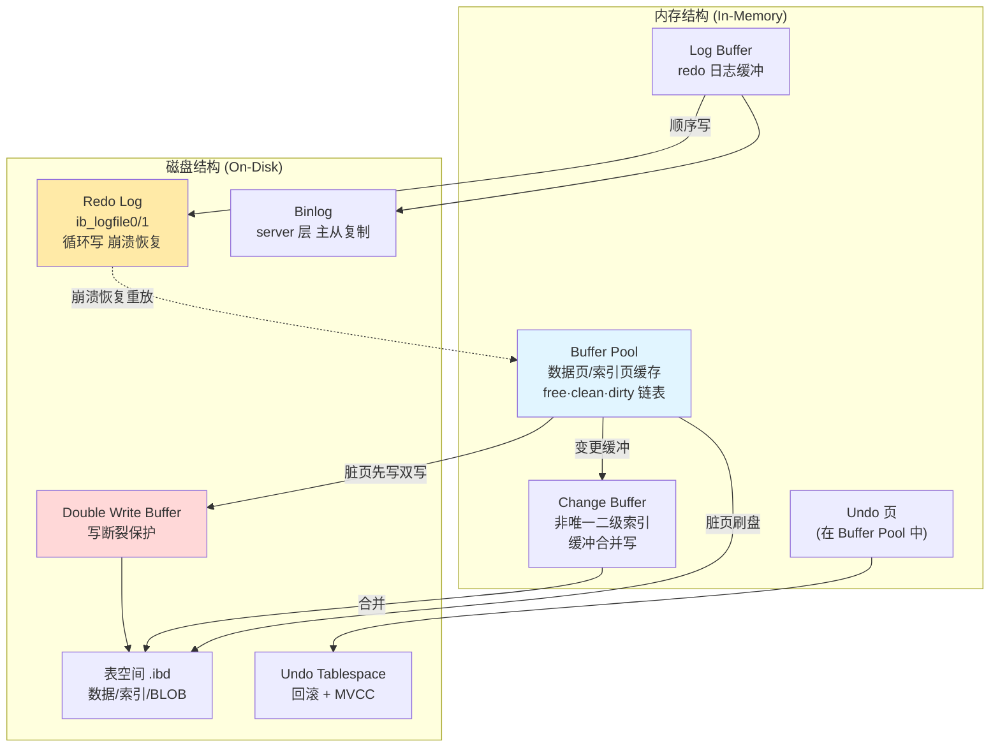

### 2.1 Buffer Pool：MySQL 性能的心脏

Buffer Pool（BP）缓存的是**数据页和索引页**（默认 16KB 一页）。一次查询先在 BP 里找，找不到才去磁盘读（这就是"读miss"= `Innodb_buffer_pool_reads`）。**BP 命中率直接决定数据库生死。**

Buffer Pool 内部用三条链表管理：

| 链表 | 作用 | 关键机制 |
|------|------|---------|
| **free list** | 空闲页链表 | 需要新页时从这里取，用完从 LRU 淘汰补回 |
| **LRU list** | 冷热数据管理 | 经典 LRU 改进版（见 2.1.1） |
| **flush list** | 脏页链表（按 oldest_modification 排序） | 后台线程按此顺序刷盘，保证 LSN 有序 |

#### 2.1.1 LRU midpoint insertion（防止全表扫污染 BP）

经典 LRU 的坑：一条 `SELECT * FROM huge_table`（全表扫）会把 BP 里所有热点数据冲掉，因为新页都插在链表头。等扫完，热点全在链表尾被淘汰，命中率崩塌——这就是 1.3 案例里报表查询干的好事。

InnoDB 的解法：**midpoint insertion（中点插入）**。把 LRU 链表切成两半：

- **young 区（热，默认 5/8）**：真正的热点数据；
- **old 区（冷，默认 3/8）**：新页先插在 young/old 的分界点（midpoint）；
- 只有页在 old 区**停留超过 `innodb_old_blocks_time`（默认 1s）** 且被再次访问，才晋升到 young 区头。

全表扫的页：被顺序访问一次，停留不到 1s 就继续往后走，不会污染 young 区。完美隔离扫描类流量。

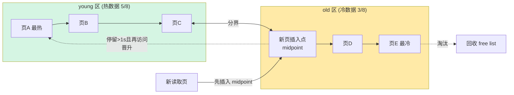

#### 2.1.2 预读（Read-Ahead）

BP 还会"猜"你接下来要读什么：

- **线性预读**：顺序读满 `innodb_read_ahead_threshold`（默认 56）个连续页，预读下一个 extent（64 页）；
- **随机预读**：一个 extent 内 13 个页被缓存，预读同 extent 剩余页（8.0 默认关闭，`innodb_random_read_ahead=OFF`）。

预读是把随机 IO 提前变顺序 IO 的优化，但调得太激进会浪费内存，要结合命中率看。

### 2.2 Change Buffer：把"随机写"变成"批量合并"

二级索引的插入/更新**不是顺序的**（索引树按 key 排序，新值可能落在任意页）。如果每次都去 BP 找对应页，找不到就磁盘读——这是灾难级的随机 IO。

Change Buffer（CB，8.0 前叫 Insert Buffer）的做法：**如果二级索引页不在 BP，不立即读盘，而是把变更缓存在 CB，等以后该页被读进 BP 时再合并（merge）**。本质上是把多次随机写合并成一次。

**关键限制**：只对**非唯一**二级索引有效。唯一索引必须立即查重，无法缓冲（这也是为什么高频写入表要慎用唯一索引做写优化，但业务上唯一性又不能不要——这是工程权衡）。

### 2.3 Log Buffer + Redo Log：崩溃恢复的生命线

Redo Log 解决两个问题：

1. **持久性**：事务提交时，先把变更写进 redo（顺序写，极快），崩溃后靠 redo 重放恢复已提交数据；
2. **WAL（Write-Ahead Logging）**：随机写数据页 → 改成顺序写 redo，再异步刷脏页。这是数据库性能的核心 trick。

Redo 是**循环写**的：一组 `ib_logfile0/1`，写满回到开头覆盖（已刷盘的旧 redo 才能被覆盖）。`Log Buffer` 是 redo 的内存缓冲，由 `innodb_flush_log_at_trx_commit` 控制何时落盘（见第三章）。

### 2.4 Double Write Buffer：解决"写断裂"

BP 脏页刷盘时是 16KB 一页刷，但操作系统/磁盘往往按 4KB 甚至更小原子写。万一刷到一半断电，这一页就**撕裂（torn page）** 了——redo 重放也救不回来（redo 记录的是"页内偏移改了什么"，前提是页本身完整）。

Double Write 的解法：脏页先顺序写进 Double Write Buffer（磁盘上连续的一块区，两次写：先写 DWB，再写真正表空间），再写真正的表空间。崩溃恢复时，如果表空间页坏了，就从 DWB 拷一份完整的回来。

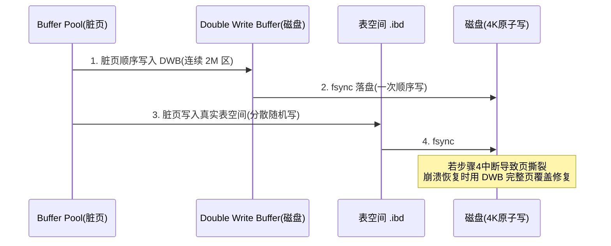

代价：每个脏页多一次顺序写（开销很小，因为 DWB 是连续写，远快于随机写）。8.0.20+ 支持 **parallel doublewrite**（多 DWB 实例缓解高并发争用），部分文件系统（如 ZFS 有原子写保障）可关掉。

### 2.5 Undo Tablespace：MVCC 与回滚的底座

Undo 存的是数据的"旧版本"：

- **回滚**：事务失败 `ROLLBACK`，用 undo 把数据改回去；
- **MVCC**：读请求（RR/RC 隔离级别）通过 undo 链读到历史快照（详见《事务锁机制与MVCC》）。

`innodb_undo_tablespaces`（8.0 默认 2 个）独立管理 undo，避免和系统表空间耦合。长事务会阻止 undo 回收 → undo 膨胀 → 磁盘爆，**监控 `history_list_length`** 是排障关键。

---

## 三、关键参数调优

参数调优不是背值，是理解"这个值在 2.1~2.4 哪条链路上起作用"。下面按"内存→IO→持久性→连接"分组。

### 3.1 innodb_buffer_pool_size：最重要的一个参数

**规则：专用 MySQL 服务器，BP 给到物理内存的 60%~80%。** 剩下的留给 OS 文件系统缓存、连接线程栈、其他进程。


- 调太小：命中率低，疯狂磁盘读；
- 调太大（>85%）：OS 没内存做 page cache，且 BP 自身管理（LRU/flush 链表）开销、以及 OOM 风险。

**多实例 Buffer Pool（`innodb_buffer_pool_instances`）**：BP 内部有一把全局 mutex（虽然 8.0 已大幅拆分，但大 BP 仍有热点争用）。8G 以上 BP 建议拆成多个实例（默认 `min(BP/1G, 8)` 个，最大 64），**每个实例 > 1G** 才有意义。例：45G BP → 设 `innodb_buffer_pool_instances=8`，每实例约 5.6G。

> 在线调整：`SET GLOBAL innodb_buffer_pool_size=...`（5.7+ 支持在线 resize，无需重启），但会触发 chunks 重分配，大 BP 调整瞬间有抖动，运维窗口期做。

### 3.2 innodb_io_capacity / io_capacity_max：刷脏速率的闸门

这两个值告诉 InnoDB"你的磁盘每秒能承受多少 IO"，直接控制**后台刷脏页的速度**：

| 参数 | 含义 | 机械盘 | SATA SSD | NVMe SSD |
|------|------|--------|----------|----------|
| `innodb_io_capacity` | 后台刷脏/merge 的目标 IOPS | 200 | 2000 | 4000~8000 |
| `innodb_io_capacity_max` | 紧急情况（如 checkpoint 落后）上限 IOPS | 2000 | 4000 | 10000~20000 |

坑：默认 `innodb_io_capacity=200`（为机械盘设的），**上 SSD 不调这个值，刷脏速度被人为压死**，导致脏页堆积、checkpoint 落后、被迫同步刷盘，RT 抖动。SSD 服务器必须调高。

### 3.3 刷脏策略：innodb_flush_neighbors 与 flush_method

- **`innodb_flush_neighbors`**：刷一个脏页时，是否把它相邻的脏页一起刷（利用机械盘顺序写优势）。**SSD 设为 0（关掉）**，因为 SSD 随机写和顺序写差别不大，一起刷反而多写无关页。8.0 默认 0。
- **`innodb_flush_method=O_DIRECT`**：绕过 OS page cache，BP 直接写磁盘（避免 BP 和 OS cache 双重缓存，浪费内存且 fsync 行为更可控）。大部分 Linux + 专用 MySQL 场景都用 `O_DIRECT`。

### 3.4 持久性三连：trx_commit / sync_binlog / binlog_format

这是面试必问的"性能 vs 持久性"权衡核心。先看 redo 刷盘决策图：

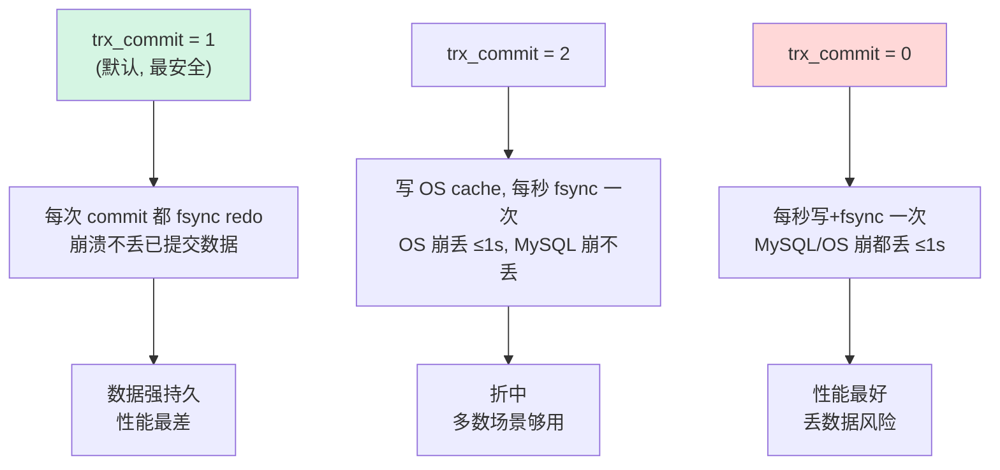

三参数配合：

| 参数 | 推荐值 | 作用 | 代价 |
|------|--------|------|------|
| `innodb_flush_log_at_trx_commit` | **1**（核心账务）/ 2（日志类） | redo 落盘策略 | 1 每次 fsync，最慢 |
| `sync_binlog` | **1**（主库）/ 100~1000（从库/可丢） | binlog 落盘策略 | 1 每次 fsync |
| `binlog_format` | **ROW** | binlog 格式 | ROW 体积大但最安全 |

**双 1 配置（`trx_commit=1` + `sync_binlog=1`）**：事务提交时 redo 和 binlog 都 fsync，崩溃**零数据丢失**，是金融级持久性底线。代价是每次 commit 两次 fsync（约 0.x~1ms/事务），高并发下靠组提交（group commit）摊薄——InnoDB 把多个事务的 fsync 合并成一次，所以"双 1"在高并发下性能远没想象中差。

> 支付场景：主库必须双 1。从库/非核心日志库可放宽（如 `sync_binlog=1000`）换吞吐。

### 3.5 连接数：max_connections 与 thread_pool

- **`max_connections`**：最大连接数。不是越大越好——每个连接占线程栈（默认 256KB~1MB）、BP 等共享资源。设太大，瞬间洪水连接会压垮内存。配合 `thread_pool`（8.0 企业版/Percona/MariaDB 有线程池，社区版 5.7 没有）做"连接与线程解耦"，避免 1 连接 1 线程的吞吐悬崖。
- 更优实践：应用侧用**连接池（HikariCP/Druid）**，`max_connections` 设成连接池上限的 1.2 倍留余量，杜绝短连接风暴。

`Threads_running` 飙高看一眼：`SHOW PROCESSLIST` 找 State 是 `Sending data` / `Locked` / `Waiting for table flush` 的罪魁。

### 3.6 调优参数速查（核心 10 个）

后面第十一章有完整速查表，这里先列最常动的：

| 参数 | 典型值(专用 SSD 服务器) | 调错后果 |
|------|------------------------|---------|
| `innodb_buffer_pool_size` | 物理内存 70% | 太小→命中率低 |
| `innodb_buffer_pool_instances` | 8（BP>8G 时） | 单实例大→mutex 争用 |
| `innodb_io_capacity` | 2000~8000 | 默认 200→刷脏慢 |
| `innodb_io_capacity_max` | 2~4 倍 io_capacity | checkpoint 落后 |
| `innodb_flush_neighbors` | 0（SSD） | 1→多写无关页 |
| `innodb_flush_method` | O_DIRECT | 默认→双重缓存 |
| `innodb_flush_log_at_trx_commit` | 1（核心）/2 | 0→丢数据 |
| `sync_binlog` | 1（核心）/1000 | 0→丢 binlog |
| `max_connections` | 连接池上限×1.2 | 太大→内存爆 |
| `innodb_log_file_size` | 1G~4G | 太小→checkpoint 频繁 |

---

## 四、主从复制原理与优化

高可用的前提是"有副本"。先吃透复制链路。

### 4.1 binlog 三种格式

| 格式 | 记录内容 | 优点 | 缺点 |
|------|---------|------|------|
| STATEMENT | SQL 原文 | 体积小 | **不安全**：`UUID()`/`NOW()`/触发器导致主从不一致 |
| **ROW** | 每行前后的变更 | 绝对一致、可闪回 | 体积大（大事务尤甚） |
| MIXED | 自动选 | 折中 | 边界情况仍可能踩坑 |

**结论：生产一律 ROW。** STATEMENT 的"主从不一致"是不可承受的。ROW 的"体积大"用 `binlog_row_image=MINIMAL`（只记变更列）+ `binlog_row_metadata=MINIMAL` 缓解。

### 4.2 异步复制的线程模型

经典主从三个线程：

- **主库 Binlog Dump 线程**：把 binlog 推给从库；
- **从库 IO 线程**：收 binlog 写进本地 relay log（中继日志）；
- **从库 SQL 线程**：读 relay log 在本地回放。

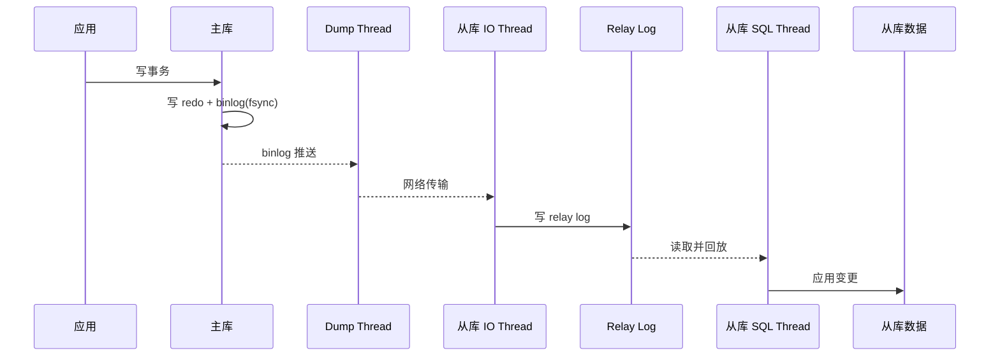

**异步复制的本质问题**：主库提交后不等从库，主挂了从库可能少数据 → 数据丢失 + 主从不一致。但它简单、性能最好，是后续所有高可用方案的起点。

### 4.3 半同步复制：after_sync vs after_commit

半同步（semi-sync）在异步基础上加一条：**主库提交事务时，至少等一个从库 ACK（收到 relay log 并 fsync）才返回客户端成功。**

两个等待点，这是高频追问：

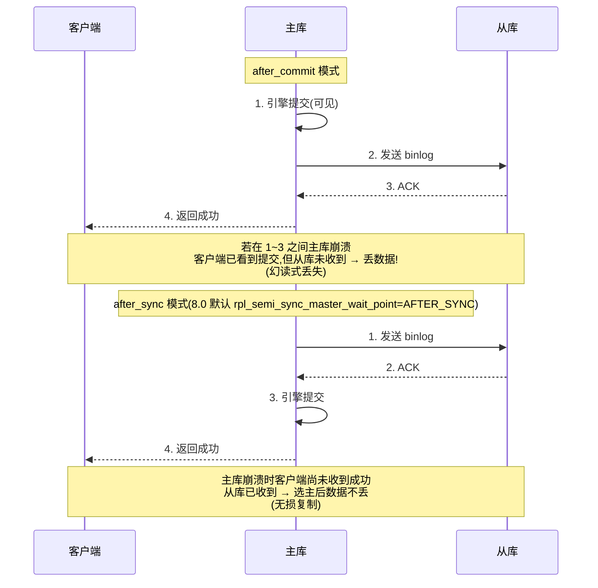

| 模式 | 等待点 | 数据丢失边界 | 缺陷 |
|------|--------|-------------|------|
| `AFTER_COMMIT` | 引擎提交后等 ACK | 已返回客户端的提交，主崩可能丢（从库没收到） | 客户端"以为成功实则丢" |
| **`AFTER_SYNC`** | 引擎提交前等 ACK | 客户端收到成功 = 从库一定有 → **无损** | 多一次网络往返延迟 |

**半同步就一定不丢吗？** 不。半同步只在"至少一个从库存活且 ACK"时生效。如果所有从库都挂了，主库会**降级为异步**（超时 `rpl_semi_sync_master_timeout`，默认 10s）继续提供服务，此时又回到可能丢数据的状态。所以半同步是"尽量不丢"而非"绝对不丢"，要搭配 `rpl_semi_sync_master_wait_for_slave_count` 等控严格度。

### 4.4 并行复制：从单线程到 Write Set

单 SQL 线程回放是复制延迟的头号原因（主库多线程并发写，从库单线程回放 → 必然延迟）。

MySQL 并行复制演进：

| 版本 | 并行策略 | 粒度 |
|------|---------|------|
| 5.6 | `slave_parallel_type=SCHEMA` | 按库并行（多库才有用，单库无效） |
| 5.7 | `LOGICAL_CLOCK` | 同一 commit 组（prepare 阶段重叠）可并行 |
| **8.0** | `WRITESET` | 按事务修改的**行集合**冲突检测并行（粒度最细） |

8.0 默认 `binlog_transaction_dependency_tracking=WRITESET` + `slave_parallel_workers=N`（建议 = CPU 核数），主库在 binlog 里写 write set（事务改了哪些主键哈希），从库只要两个事务 write set 不冲突就并行回放。

```mermaid
flowchart TB
    subgraph M["主库 binlog"]
        T1[事务A: 改行(1,2)]
        T2[事务B: 改行(3,4)]
        T3[事务C: 改行(1,5)]
    end
    subgraph W["Write Set 冲突检测"]
        W1[A∩B=∅ 可并行]
        W2[B∩C=∅ 可并行]
        W3[A∩C 含行1 冲突!]
    end
    subgraph S["从库并行 Worker"]
        WK1[Worker1: A]
        WK2[Worker2: B]
        WK3[Worker3: 等A完成后 C]
    end
    T1 --> W1 --> WK1
    T2 --> W2 --> WK2
    T3 --> W3 --> WK3
    style W fill:#ffeaa7
```

### 4.5 复制延迟监控与优化

`Seconds_Behind_Master` 是**谎言指标**：它只反映"从库 SQL 线程执行到的 binlog 位点 vs IO 线程收到的位点"的时间差，但：

- 主库长时间无写入 → 显示 0，但可能从库早就在追了；
- 大事务（一个事务删 100 万行）会让这个值瞬间跳到几十秒，且持续；
- 网络抖动期间 IO 线程卡住，SQL 线程追平了却显示延迟。

**正确姿势**：`performance_schema.replication_applier_status_by_worker` 看每个 worker 状态；用 `pt-heartbeat`（在主库写时间戳，从库读对比）拿到**真实的端到端延迟**。

延迟优化清单：
1. 升级 8.0 开 WRITESET 并行（`slave_parallel_workers` 调高）；
2. **拆分大事务**（一个事务别改太多行，见 4 章 XTransfer 案例）；
3. 从库关闭 `log_slave_updates`（不级联则不需要）；
4. 从库用更快磁盘 + 调高 `innodb_io_capacity`；
5. 业务容忍的话，读从库加 `SET SESSION read_committed` 容忍短暂延迟。

---

## 五、高可用架构

副本有了，下一步是"主挂了怎么自动切、数据不丢、业务无感"。

### 5.1 方案全景对比

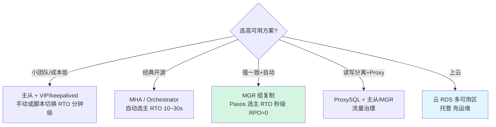

| 方案 | RTO | RPO | 复杂度 | 一致性保障 |
|------|-----|-----|--------|-----------|
| 主从 + VIP（脚本切） | 分钟级（手动） | 可能丢 | 低 | 弱（异步） |
| MHA | 10~30s | 可能丢 | 中 | 弱 |
| Orchestrator | 10~30s | 可能丢 | 中高 | 弱，但选主智能 |
| **MGR** | 秒级 | **0**（多数派存活） | 高 | 强（Paxos） |
| 云 RDS 多 AZ | 秒~分钟 | 0（同步） | 低（托管） | 强 |

### 5.2 MGR（Group Replication）：Paxos 保证强一致

MGR 用 **Paxos 共识**实现：组内多数节点（N/2+1）确认的事务才能提交，所以**只要多数派存活，已提交数据绝不丢（RPO=0）**，且自动选主、自动剔除故障节点、自动重加入。

两种模式：
- **单主（Single-Primary，默认）**：只有 Primary 可写，其余只读，Primary 挂了自动从剩余节点选新主；
- **多主（Multi-Primary）**：所有节点可读写，但要处理**写冲突**（两个节点同时改同一行 → 冲突事务回滚），适合特定场景，普遍不推荐（冲突检测有额外开销 + 外键/级联限制）。

限制与坑：
- 必须是 **InnoDB 表**，且每张表有**显式主键**（无主键表无法做冲突检测）；
- 网络分区时，少数派节点自动设为 READ_ONLY 防止"脑裂写"；
- 大事务会拖慢整个组（Paxos 要多数确认），所以 MGR 环境更忌大事务。

### 5.3 ProxySQL：流量治理层

ProxySQL 放在应用和 MySQL 之间，负责：

- **读写分离**：`SELECT` 路由到从库，写走主库（基于查询规则/注释）；
- **负载均衡**：多个从库间轮询/加权；
- **故障转移**：后端节点探活，自动摘掉宕机节点；
- **连接池复用**：应用短连接 → ProxySQL 长连接 MySQL，极大降低 MySQL 连接开销。

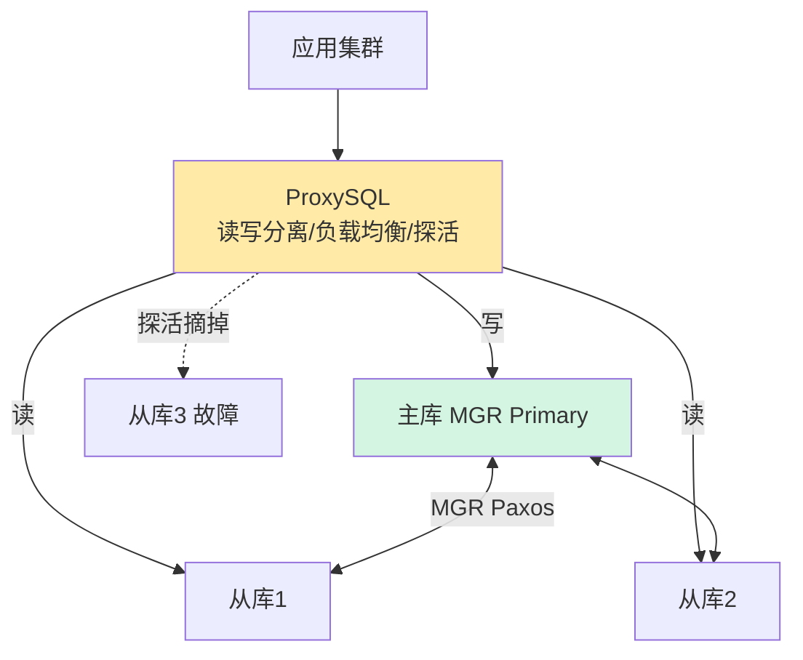

### 5.4 两地三中心与单元化（支付场景）

跨境支付的容灾要求极高：

- **两地三中心**：同城双中心（低延迟同步复制，RPO=0）+ 异地第三中心（异步，RPO 分钟级）。同城任一机房挂，秒级切到同城另一中心；地域级灾难，启用异地中心（接受少量数据丢失）。
- **单元化（Unit）**：把"用户 + 其全部数据 + 全部服务"绑定到一个单元（地域），单元内自闭环，跨单元只做必要的异步同步。这样单地域故障只影响该地域用户，隔离爆炸半径。XTransfer 这类跨境业务，常按"用户所属 region/币种"做单元划分。

---

## 六、备份与恢复

"没演练过的备份等于没备份。" 备份不是拷贝文件，是"能在 SLA 内恢复"。

### 6.1 物理备份：xtrabackup（热备王者）

Percona XtraBackup 原理：
1. **拷贝数据文件**（.ibd）的同时，持续拷贝 redo log；
2. 拷贝完成后，应用拷贝期间的 redo（**prepare** 阶段），让数据文件达到一致状态；
3. 恢复时直接拷回数据目录，比逻辑导入快几个数量级（T 级库分钟级）。

优点：在线热备、不锁表（除 prepare 瞬间）、支持增量备份（基于 LSN）。命令骨架：

```bash
# 全量备份
xtrabackup --backup --target-dir=/backup/full
# prepare（使一致）
xtrabackup --prepare --target-dir=/backup/full
# 增量（基于上次）
xtrabackup --backup --target-dir=/backup/inc1 --incremental-basedir=/backup/full
```

### 6.2 逻辑备份：mysqldump / mydumper

- `mysqldump`：单线程，SQL 文本，可跨版本恢复，但大库慢；
- `mydumper`：多线程并行导出 + 一致性快照，速度快，且自带 `myloader` 并行导入。

逻辑备份适合**小库 / 跨大版本迁移 / 单表恢复**（物理备份难以只恢复一张表）。

### 6.3 时间点恢复（PITR）

思路：全量备份 + 备份之后的 binlog 前滚到任意时间点。这是"误删数据/误更新"的救命绳。


步骤：恢复全量 → `mysqlbinlog --start-datetime / --stop-position` 抽取 binlog → 管道喂给 mysql 前滚。关键是**记录全量备份对应的 binlog 位点（xtrabackup_binlog_info）**，从那里开始前滚，不重不漏。

### 6.4 binlog 闪回（flashback）

ROW 格式 binlog 记录了每行"前镜像 + 后镜像"。闪回工具（如 `binlog2sql`、美团 MyFlash）反向生成 SQL：

- `DELETE` 反向成 `INSERT`（用前镜像）；
- `INSERT` 反向成 `DELETE`；
- `UPDATE` 前后镜像互换。

适合**小范围误操作**（某条/某批数据改错），比全量 PITR 快得多，不用停业务恢复整个实例。

### 6.5 恢复演练

很多公司备份做了但从不恢复，真出事发现备份是坏的（磁盘满/权限错/版本不兼容）。**季度级恢复演练**：挑一个从库，用最新备份恢复一遍，校验数据条数/校验和。XTransfer 把"备份可恢复性"纳入 SLA 考核。

---

## 七、分库分表

单实例到顶了（通常单机 1~2T、单表 2000~5000 万行是舒适区上限），就要拆。

### 7.1 垂直拆分 vs 水平拆分

| 拆分 | 维度 | 例子 | 解决 |
|------|------|------|------|
| 垂直 | 按**业务/列** | 用户库 / 订单库 / 账务库分开；大字段（头像 blob）独立表 | 业务解耦、减少单表宽度 |
| 水平 | 按**分片键** | 订单表按 `user_id % 64` 拆 64 个分片 | 单表数据量、单实例吞吐 |

水平拆分是难点，核心在**分片键选择**。

### 7.2 ShardingSphere：分片路由中枢

ShardingSphere（JDBC 或 Proxy 形态）拦截 SQL，按规则路由到对应分片：

- **分片算法**：取模（`user_id % N`）、范围（`create_time` 按年/月）、哈希、一致性哈希；
- **广播表**：每个分片都有的小表（如 `dict_region`），join 时本地直连不跨分片；
- **绑定表（Binding Table）**：有相同分片规则的多张表（如 `order` 和 `order_item` 都按 `order_id` 分片），join 时路由到同一分片，避免跨分片笛卡尔积。

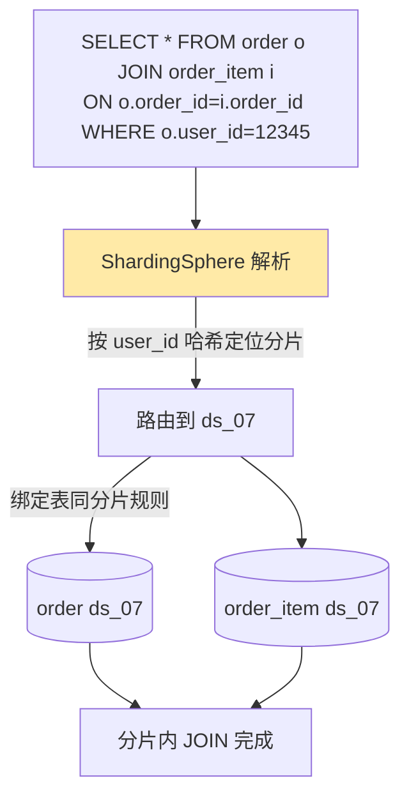

### 7.3 分片键选择三原则

1. **高频查询维度就是分片键**：80% 查询按 `user_id`，就按 `user_id` 分，避免跨分片；
2. **避免热点**：纯取模在大促时某 key 流量集中（如大 V 用户），可用**一致性哈希**（节点增减只迁移少量数据）或**复合分片**（user_id 内再按时间）；
3. **避免跨分片 JOIN / 分布式事务**：分片键选错，一个查询打满所有分片（广播查询），性能雪崩。

### 7.4 分布式事务

分库后，`user_id=1` 的订单和 `user_id=2` 的账户可能在不同分片，转账就成了分布式事务：

- **XA 事务**：MySQL 支持 2PC，但锁定资源时间长，性能差，少用；
- **Seata（AT/TCC）**：应用层补偿，TCC 适合强一致核心链路，AT 自动补偿适合大部分场景；
- **最终一致（消息表/事务消息）**：90% 业务用这个——本地事务写业务表 + 消息表，异步投递 MQ，消费方幂等处理。支付清结算大量用最终一致。

### 7.5 扩容再平衡

取模分片 `N` 张表，扩到 `2N` 要迁移一半数据（所有 key 重算）。**一致性哈希**把数据放在哈希环上，新增节点只接管环上相邻区间，迁移量最小。

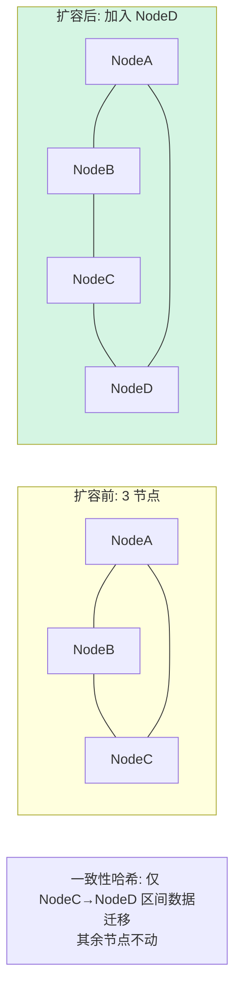

---

## 八、MySQL 8.0 新特性（面试加分项）

5.7 已 EOL（2023 年结束支持），8.0 是现在面试默认基线。下面这些是"你能用 SQL 解决的问题，就别写 Java 代码"。

### 8.1 CTE（Common Table Expression，WITH 子句）

递归 CTE 替代自连接查树形结构（组织树、类目树）：

```sql
-- 查某个节点的所有子孙（以前要递归存储过程/应用层递归）
WITH RECURSIVE sub_tree AS (
    SELECT id, parent_id, name FROM category WHERE id = 1
    UNION ALL
    SELECT c.id, c.parent_id, c.name
    FROM category c JOIN sub_tree s ON c.parent_id = s.id
)
SELECT * FROM sub_tree;
```

非递归 CTE 还能让复杂查询分层，可读性强过嵌套子查询。

### 8.2 窗口函数（Window Functions）

这是 8.0 最实用的武器。以前"分组内排名、累计求和、前后行对比"要写一堆子查询或 Java 代码，现在一行：

```sql
-- 每个用户按时间排序的订单，算累计金额 + 排名
SELECT user_id, order_id, amount,
       ROW_NUMBER() OVER (PARTITION BY user_id ORDER BY create_time) AS rn,
       RANK()       OVER (PARTITION BY user_id ORDER BY amount DESC) AS rk,
       SUM(amount)  OVER (PARTITION BY user_id ORDER BY create_time
                          ROWS BETWEEN UNBOUNDED PRECEDING AND CURRENT ROW) AS running_total
FROM orders;
```

计算流程图解：

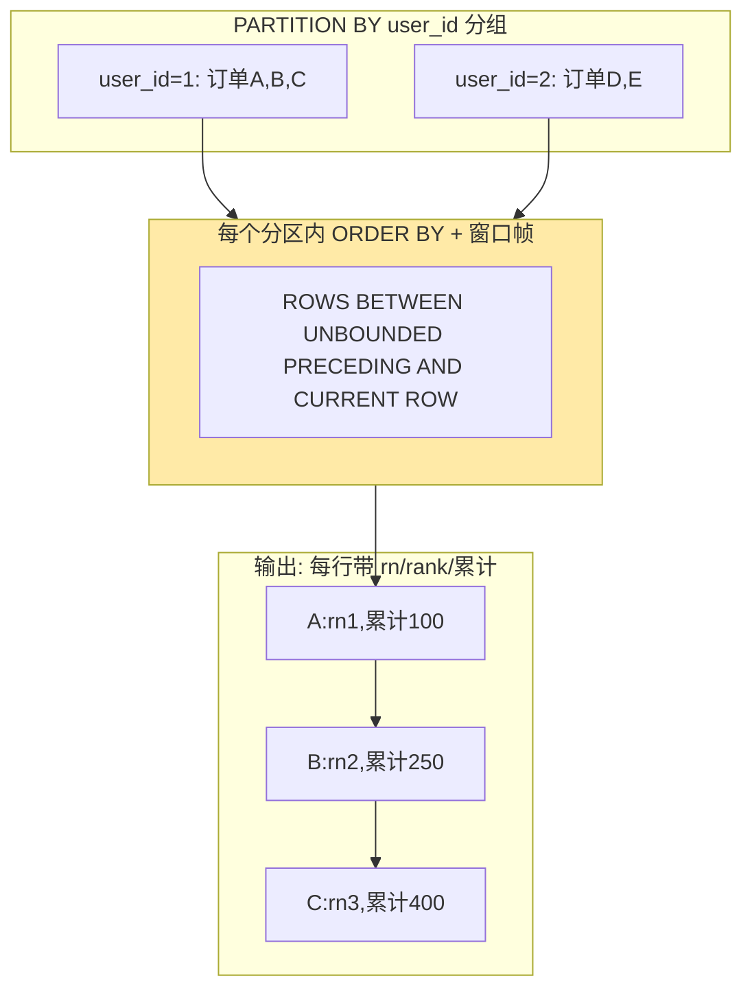

**面试能答的点**：窗口函数 `PARTITION BY ... ORDER BY ...` 在分区内排序计算，不折叠行（区别于 `GROUP BY`），每行都保留并附加聚合/排名结果，是报表、TopN、同比环比的利器。

### 8.3 直方图（Histogram）

优化器默认靠索引统计，但**无索引列**（如 `gender`、`status` 这种低基数列，或表达式列）的统计是均匀的，容易误判行数。直方图让优化器知道真实分布：

```sql
ANALYZE TABLE orders UPDATE HISTOGRAM ON status WITH 100 BUCKETS;
```

优化器据此选出更优执行计划（如 `status='PAID'` 占 95% 就走全表，占 1% 就走索引）。

### 8.4 资源组（Resource Groups）

把特定线程绑定到 CPU（亲和性），隔离 OLTP 与 OLAP：**报表大查询绑到空闲核，避免拖垮在线交易**。

```sql
CREATE RESOURCE GROUP rg_report TYPE=USER
  VCPU=10-15  -- 绑定到 CPU 10~15
  THREAD_PRIORITY=15;
SET RESOURCE GROUP rg_report FOR thread_id;  -- 把报表会话绑进去
```

### 8.5 索引与 DDL 增强

| 特性 | 说明 | 价值 |
|------|------|------|
| **不可见索引** `INVISIBLE` | 索引存在但不被优化器用，可观察再删 | 安全删索引（先 invisible 观察） |
| **降序索引** | `INDEX ... DESC` 真正物理降序 | 多列混合排序免 filesort |
| **函数索引** | `INDEX ((UPPER(name)))` | 表达式查询走索引 |
| **原子 DDL** | DDL 要么全成要么全败 | 不再有"表不见了"的中间态 |
| **自增持久化** | 自增计数器写 redo | 重启不再重复发号（5.7 重启可能复用） |

`INVISIBLE` 索引是"删索引怕影响查询"的完美解法：先设不可见，监控一周无慢查询再物理删除，零风险。

### 8.6 默认字符集与 JSON

- 默认 `utf8mb4`（终于支持 emoji 和 4 字节字符，5.7 默认还是 `latin1`/`utf8` 的 3 字节坑）；
- JSON 类型 + `JSON_PATH` 函数 + 生成列上建索引，能替代部分文档库场景。

### 8.7 5.7 → 8.0 迁移注意点

- **默认认证插件**改 `caching_sha2_password`，老驱动（如旧版 JDBC / Navicat）连不上 → 升级驱动或临时设回 `mysql_native_password`；
- 部分 SQL 语法/保留字变化（`RANK`、`ROWS` 成关键字）；
- `GROUP BY` 隐式排序在 8.0 被移除（要排序必须显式 `ORDER BY`）；
- 数据字典改为 InnoDB 表，`.frm` 文件消失，`mysql_upgrade` 改为启动时自动执行。

---

## 九、【项目支撑】XTransfer 支付库实战

上面都是原理，这里落到我真实做过的支付库。

### 9.1 账务核心库容量规划

支付账务是系统的命根子，规划原则：

- **单表控制在 2000 万行内**（超过后 B+ 树虽仍能打，但 BP 命中率、DDL、备份恢复都变难）；
- **按账户 + 时间双维度分片**：热账户（近期交易）在高速 SSD 分片，历史账户冷数据归档到低成本存储；
- 容量公式（见第十一章）：预估日增行数 × 保留天数 × 行长 = 所需空间，反推分片数和实例数。

### 9.2 跨境多活：境内主库 + 境外只读副本

跨境支付"交易在国内合规处理，境外商户/用户要查交易状态"：

- **主库在境内** region，处理写（开户、交易、清算）；
- **只读副本在境外** region（新加坡/法兰克福），支撑境外低延迟查询；
- binlog 通过**半同步 + 跨 region 专线准实时同步**（延迟通常 < 1s，网络抖动时退化为异步，境外读到秒级旧数据，业务上用"数据延迟提示"兜底）。

### 9.3 Buffer Pool 调优战例

账务库 64G 物理内存，**BP 给到 50G（约 78%）**，命中率做到 **99.97%**。核心动作：

- 把随机读尽量转顺序（靠 BP 缓存热数据 + 报表查询强制走从库，隔离污染）；
- 调高 `innodb_io_capacity` 到 4000（SSD），避免刷脏滞后；
- 大事务拆分，避免 BP 里脏页堆积触发同步刷盘抖动。

效果：账务核心交易 RT P99 从 40ms 降到 8ms。

### 9.4 一次主从延迟事故（40s 对账读旧数据）

**事故**：某日对账系统从从库读账户余额，发现"钱对不上"，实际主库已更新。排查：

- `Seconds_Behind_Master` 显示 40s；
- 根因：凌晨一个**大事务**（批量调账，单次改 80 万行）在主库几秒提交，从库**单 SQL 线程回放**要 40s；
- 期间对账读从库 → 拿到旧余额 → 误报差错。

**整改**：
1. 大事务**拆成每批 1 万行**的小事务（业务上分批调账）；
2. 升级 8.0 开启 **WRITESET 并行复制**（`slave_parallel_workers=16`），回放从单线程变 16 路并行；
3. **对账类读强一致场景，直接读主库或带 `SELECT ... FOR SHARE` 读从库加延迟校验**，绝不在延迟窗口读金额。

### 9.5 备份：每日 xtrabackup + 季度演练

- 每日全量 xtrabackup（凌晨低峰）+ 实时 binlog 归档到对象存储；
- **季度恢复演练**：从备份恢复一个校验库，跑数据条数/金额校验和，确认可恢复；
- 关键表（账户、交易）额外保留 7 年（合规要求），靠"全量 + 长期 binlog"满足 PITR。

---

## 十、【面试官追问】—— 把这些问题答出深度

### Q1：Buffer Pool 命中率怎么算？低于多少告警？

```
命中率 = 1 - (Innodb_buffer_pool_reads / Innodb_buffer_pool_read_requests)
```
- `Innodb_buffer_pool_read_requests`：BP 总访问次数；
- `Innodb_buffer_pool_reads`：BP 没命中、去磁盘读的次数。
- 经验线：**99% 以上健康，低于 95% 必须告警**调查（通常 BP 太小、或全表扫污染）。注意看**趋势**而非瞬时值。

### Q2：半同步就一定不丢数据吗？after_sync 和 after_commit 差在哪？

不一定。半同步只在"至少一个从库存活并 ACK"时生效；若所有从库挂，主库超时会**降级异步**继续服务，此时可能丢。
- `AFTER_COMMIT`：主库引擎先提交（事务对其他会话可见），再等 ACK。若主在"提交后、ACK 前"崩溃，**客户端已看到成功，但从库没收到 → 数据丢失**（幻读式）。
- `AFTER_SYNC`：先发 binlog 等 ACK，再引擎提交。主崩时客户端**尚未收到成功**，从库已收到 → 选主后数据不丢（无损复制）。8.0 默认 `AFTER_SYNC`。

### Q3：MGR 和主从半同步怎么选？

- 要**强一致 + 自动选主 + 多数派不丢（RPO=0）**，且能接受"必须 InnoDB + 显式主键 + 网络要求高 + 忌大事务"的约束 → **MGR**；
- 要**简单、跨版本兼容、对一致性要求没到金融级** → 主从 + 半同步（RPO 接近 0，但极端情况丢）；
- 实际中很多架构是 **MGR 做主从高可用底座 + ProxySQL 做读写分离/流量治理** 组合。

### Q4：分库分表后怎么做跨分片分页和聚合？

- **分页**：`LIMIT offset, size` 要改写——各分片取 `offset+size` 条，中间件归并排序后截取（深度分页 offset 大时极慢，要用"游标/上一页最大 id"替代 offset）；
- **聚合（SUM/COUNT/GROUP BY）**：各分片本地聚合，中间件二次汇总（两阶段聚合）。代价是跨分片网络 + 归并计算，所以**分片键选对、让大部分查询单分片命中**才是王道。

### Q5：8.0 窗口函数能替代哪些本来要写代码的统计？

- 分组内 TopN（ROW_NUMBER）、排名（RANK/DENSE_RANK）；
- 累计/移动求和（SUM OVER）、同比环比（LAG/LEAD 取前后行）；
- 占比/占比累计（RATIO_TO_REPORT 思路用 SUM OVER 实现）。
这些以前要在 Java 里拉全量再算，现在数据库一次出，省网络、省代码、省内存。

### Q6：怎么在不停服的情况下把 5.7 升到 8.0？

标准路径（滚动升级，不停服）：
1. **影子验证**：备一份数据到 8.0 测试，跑回归 + 性能对比；
2. **主从拓扑升级**：先把从库逐个升级到 8.0（8.0 能从 5.7 主库复制，反向不行），验证从库正常；
3. **切换**：MGR/Orchestrator 把主切到已升级的 8.0 节点；
4. **收尾**：原 5.7 主降为从并升级，最终全 8.0；
5. 注意：升级前处理保留字、认证插件、SQL 兼容性（见 8.7）。

---

## 十一、速查与实战

### 11.1 调优参数速查表（10 个核心 + 推荐值）

| 参数 | 推荐值 | 作用域 | 调优目的 |
|------|--------|--------|---------|
| `innodb_buffer_pool_size` | 物理内存 60~80% | 内存 | 提高命中率 |
| `innodb_buffer_pool_instances` | 8（BP>8G） | 内存 | 降 mutex 争用 |
| `innodb_io_capacity` | SSD 2000~8000 | IO | 刷脏速率 |
| `innodb_io_capacity_max` | 2~4× io_capacity | IO | 紧急刷脏上限 |
| `innodb_flush_neighbors` | 0（SSD） | IO | 避免多写 |
| `innodb_flush_method` | O_DIRECT | IO | 绕 OS cache |
| `innodb_flush_log_at_trx_commit` | 1（核心）/2 | 持久性 | redo 落盘 |
| `sync_binlog` | 1（核心）/1000 | 持久性 | binlog 落盘 |
| `binlog_format` | ROW | 复制 | 主从一致 |
| `max_connections` | 连接池×1.2 | 连接 | 防洪水 |

### 11.2 高可用方案选型矩阵

| 方案 | RTO | RPO | 复杂度 | 成本 | 适用 |
|------|-----|-----|--------|------|------|
| 主从+VIP | 分钟 | 可能丢 | 低 | 低 | 小业务 |
| MHA | 10~30s | 可能丢 | 中 | 低 | 经典 |
| Orchestrator | 10~30s | 可能丢 | 中高 | 低 | 智能选主 |
| MGR | 秒级 | 0 | 高 | 中 | 强一致 |
| 云 RDS 多AZ | 秒~分 | 0 | 低 | 高 | 上云 |

### 11.3 容量评估公式

```
单表行数上限 ≈ 2000 万（舒适区）
所需磁盘  = 日增行数 × 保留天数 × 平均行长(bytes) × 1.3(索引/碎片)
所需内存  = 热数据量（通常总数据 10~30%）≤ BP 上限(物理内存 80%)
分片数    = CEIL(总数据量 / 单分片舒适容量(如 500G))
实例数    = CEIL(分片数 / 单实例分片承载)  （考虑 CPU/连接/IO）
```

例：日增 100 万行、保留 365 天、行长 500B → 年增量 ≈ 100万×365×500×1.3 ≈ **237GB/年**，单分片 500G 可撑约 2 年，配 1 主 2 从共 3 实例足够；超期历史数据走冷归档。

### 11.4 与 NewSQL 的横向对比（何时该换）

| 维度 | MySQL 分库分表 | TiDB | PolarDB |
|------|---------------|------|---------|
| 扩展方式 | 应用层 ShardingSphere | 自动 Region 分裂（存算分离） | 共享存储一写多读 |
| 分布式事务 | 需 Seata/最终一致 | 原生 2PC（强一致） | 单机 ACID（一写） |
| 运维复杂度 | 高（要管分片/扩容） | 中（但仍要运维） | 低（云托管） |
| 何时换 | 数据量 < 几 TB、团队熟 MySQL | **PB 级 / 强一致分布式事务多** | 要 MySQL 兼容 + 弹性读扩展 |

**判断线**：数据量可控在单集群（分片后）几 TB 内、强一致需求能用最终一致/Seata 解决 → 继续 MySQL 分库分表，性价比最高；当出现"分片键怎么选都有跨分片大查询""分布式事务遍地开花""扩容迁移成本压垮团队" → 考虑 TiDB。XTransfer 核心账务仍用 MySQL 分库分表 + 强约束设计，把数据量关在舒适区，没盲目上 NewSQL。

---

### 11.5 生产调优排查决策树

现场出问题先别改参数，按下面路径 5 分钟定位方向：

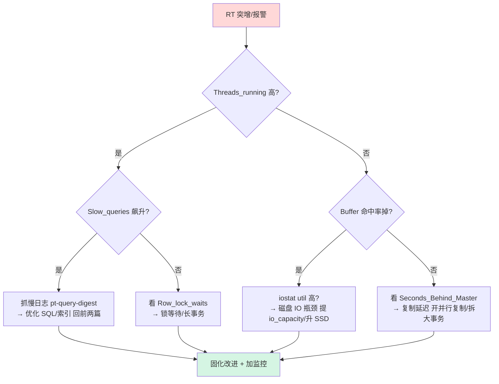

### 11.6 监控告警阈值建议（可直接抄进 Prometheus）

| 指标 | 告警阈值 | 级别 |
|------|---------|------|
| Buffer Pool 命中率 | < 95% | Warning；< 90% Critical |
| `Threads_running` | > max_connections×50% | Warning |
| `Innodb_row_lock_waits` | 环比突增 3 倍 | Warning |
| 复制延迟（pt-heartbeat） | > 5s | Warning；> 30s Critical |
| 磁盘 util | > 80% 持续 5min | Warning |
| 主从数据一致性（pt-table-checksum） | 不一致 | Critical |

---

## 写在最后：调优是"读得懂内核、算得清权衡"

性能调优不是背参数表，高可用不是抄架构图。每一行配置背后都是"内存 vs IO""性能 vs 持久性""简单 vs 强一致"的取舍。面试官问"你调过哪些参数"，他真正想听的是：

1. 你**怎么定位**瓶颈（方法论）？
2. 你**懂不懂**这个参数为什么起作用（内核链路）？
3. 你**权衡过**没有（持久性边界、成本、复杂度）？
4. 你**踩过坑**没有（真实事故、真实数据）？

把这四个问题答出本文的深度，MySQL 这条线，面试就稳了。

> 下一篇预告：《MySQL与Redis高频面试》合并文已覆盖基础问答，本文与之互补——合并文答"是什么"，本文答"为什么和怎么调"。两者结合，构成完整的 MySQL 面试武器库。

---

*本文作者，基于 多个一线互联网公司（旅游 / 出行 / 电商 / 跨境支付方向）等真实项目经验整理。转载请注明出处。*
