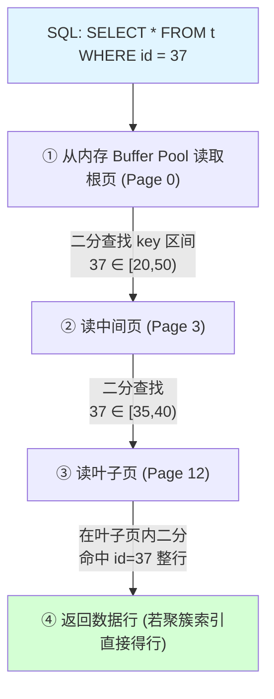
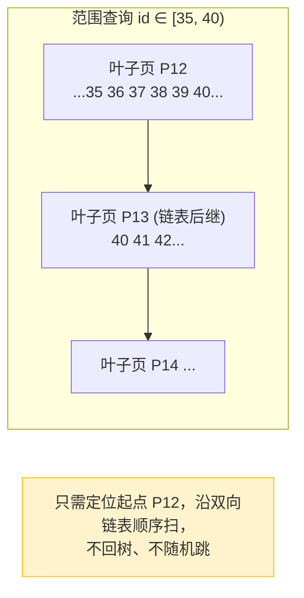
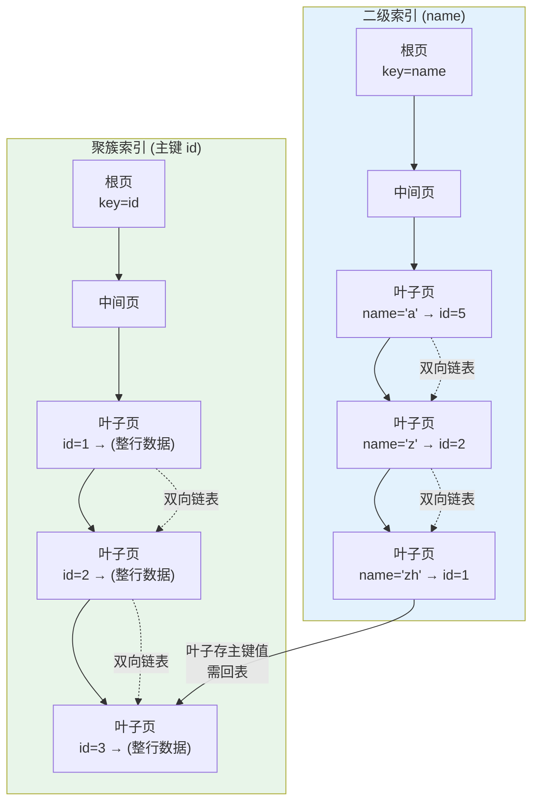
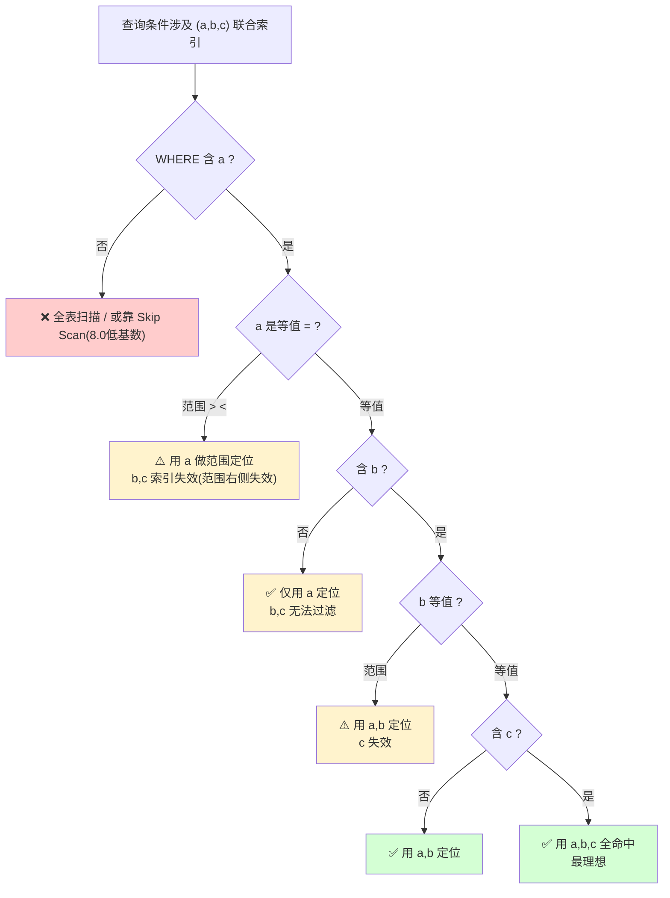
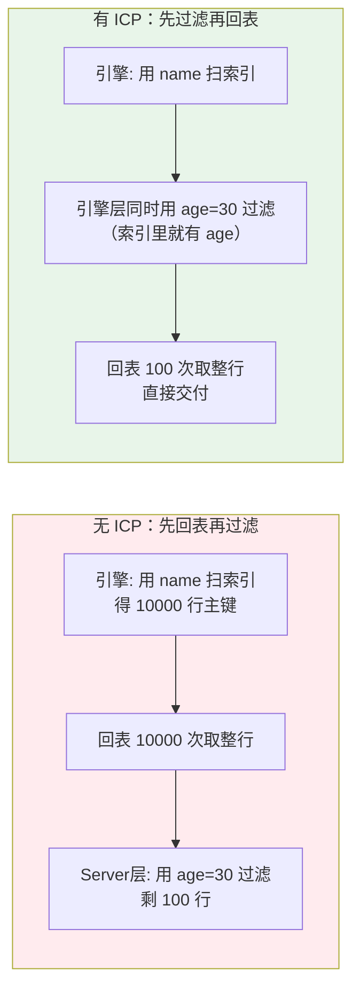
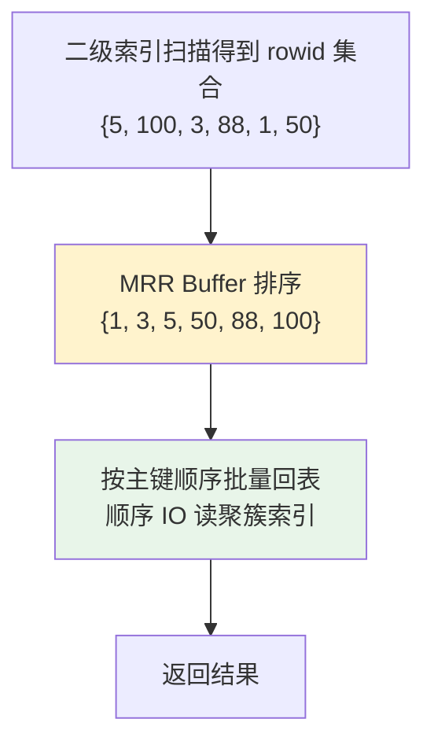
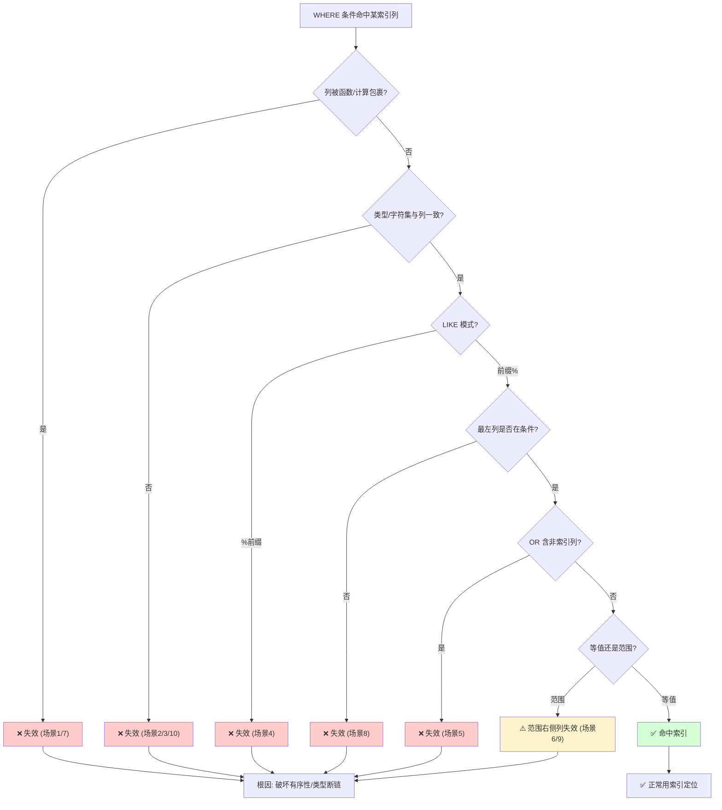
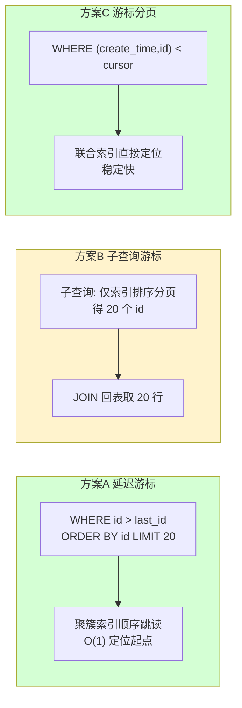
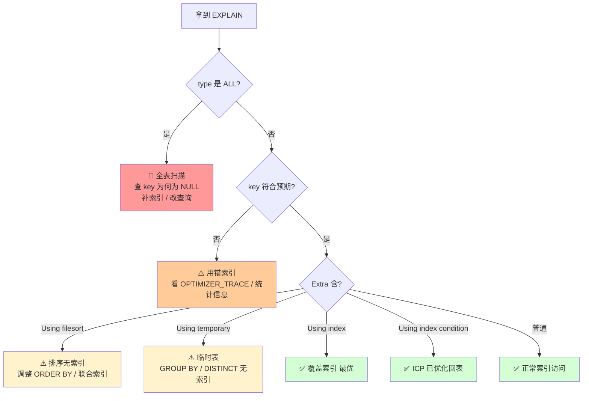

> 作者 ｜ 10 年 Java 后端工程师，内容基于多个一线互联网公司的真实项目实战沉淀。
> 本文是《MySQL与Redis高频面试》的**专项深化篇**，不重复合并文的基础问答，而是把"索引与查询优化"这条线从数据结构底层、执行引擎、设计方法论、内核机制到真实项目实战彻底讲透。适合已经能答出"索引是什么、最左前缀是什么"的工程师，准备在面试里把面试官聊到没话说的场景。

---

## 写在前面：为什么这篇要"更深"

我面试过一个候选人，能流利背出"联合索引最左前缀""覆盖索引免回表"，但当我问"为什么 InnoDB 选 B+ 树而不是跳表"、"ICP 是在 Server 层还是引擎层做的过滤"、"一个 1000 万行表加索引会不会锁表"时，对方就卡住了。

合并文给你的是**结论**，这篇给你的是**推导**。结论能应付八股，推导能应付追问。下面所有内容，都建议你带着"为什么"去读。

---

## 一、为什么是 B+ 树（从数据结构选型讲起）

### 1.1 先问一个被忽略的问题：磁盘 IO 才是主角

MySQL 的数据放在磁盘上，内存只是缓存。一次随机磁盘 IO 大约 **10ms** 量级（SSD 好一些，也要 0.1~1ms），而内存访问是 **ns** 量级——差了 **5~6 个数量级**。

所以衡量一个索引结构好坏的唯一核心指标是：**一次查询需要几次磁盘 IO**。CPU 比较次数在 IO 面前可以忽略。所有数据结构选型，本质上都是在做"减少磁盘 IO 次数 / 把随机 IO 变成顺序 IO"的优化。

记忆口诀：**索引设计的本质是和磁盘 IO 做斗争**。

### 1.2 六种结构在磁盘场景下的取舍

| 结构 | 查询复杂度 | 磁盘 IO 表现 | 致命问题 | 适用场景 |
|------|-----------|-------------|---------|---------|
| 哈希表 | O(1) 等值 | 等值快但**不支持范围** | 范围/排序全表扫；哈希冲突 | Memory 引擎、HashMap |
| 二叉搜索树 BST | O(log n) | 树高=IO 次数，最坏退化成链表 | 树太高，IO 次数失控 | 内存结构，磁盘不可用 |
| AVL 树 | 严格 O(log n) | 树高 log₂n，仍偏高 | 100 万行高约 20，IO 20 次 | 内存平衡树 |
| 红黑树 | 近似平衡 | 树高 2log(n+1)，仍偏高 | 同样树高问题，且旋转多 | JDK TreeMap（内存） |
| B 树 | O(log n) | **矮胖**，一个节点多 key | 非叶存 data，扇出小；范围查要中序遍历 | 文件系统（NTFS/ext4） |
| **B+ 树** | O(log n) | **最矮胖** + 叶子链表 | 几乎无短板 | MySQL InnoDB、PG |

关键推导：假设一个磁盘块（页）16KB，一个 bigint 主键 8 字节 + 指针 6 字节 = 14 字节，一个非叶节点能存 `16KB / 14B ≈ 1170` 个指针。

- 三层 B+ 树：`1170 × 1170 × 每条叶子行数`。若叶子一行 1KB，每页 16 行，则总记录 ≈ `1170 × 1170 × 16 ≈ 2190 万` 行，**只需 3 次 IO 就能定位任意一行**。
- 同样 2000 万行，红黑树高度 ≈ `log₂(20M) ≈ 24`，需要 **24 次随机 IO**。

这就是 B+ 树碾压一切内存树的原因：**扇出（fan-out）巨大，树高被压到 3~4 层**。

### 1.3 B+ 树的三点核心优势

1. **矮胖，减少 IO**：非叶节点只存 key + 指针，不存数据行，单个页能容纳更多分支，扇出大 → 树高低。
2. **叶子节点成双向链表**：所有数据都在叶子层，且用指针串成有序链表。**范围查询**（`WHERE id BETWEEN 100 AND 200`）只需定位起点，顺着链表扫，无需回到树中序遍历。这是 B 树做不到的（B 树范围查询要反复上下钻）。
3. **非叶只存 key，查询稳定**：任何记录的查询路径长度完全一致（都到叶子），没有"查到一半就返回"的不稳定情况，便于做 IO 代价估算。

### 1.4 一次等值 / 范围查询的 IO 路径图解





注意：上面画的"页"是 InnoDB 的 **16KB 数据页**。根页和中间页几乎永远在 Buffer Pool 里（热数据），实际范围查询很多时候根页命中内存，真实 IO 只有 1~2 次。

### 1.5 横向对比：跳表 / LSM-Tree / B+ 树

| 维度 | B+ 树（InnoDB） | 跳表（Redis / ZooKeeper） | LSM-Tree（RocksDB / TiDB） |
|------|----------------|--------------------------|---------------------------|
| 写入模型 | 原地更新，易产生页分裂 | 追加 + 多层指针 | 追加写 WAL + MemTable + SSTable 落盘 |
| 读放大 | 低（3 层树） | 低（多层随机跳） | 高（需查多层 SST + Bloom） |
| 写放大 | 中（分裂/合并） | 低 | **低写入放大**（顺序写盘优势） | 
| 范围查询 | 极强（叶子链表） | 强（同层链表） | 中（需归并多层） |
| IO 特性 | 随机读为主 | 随机读 | **顺序写**为王，读靠缓存/Bloom |
| 典型场景 | OLTP 事务库 | 内存 KV / 协调服务 | 写多读少 / 海量写入 |

**一句话选型逻辑**：

- 既要事务（ACID + 行锁 + MVCC）又要强一致点查和范围查 → **B+ 树（InnoDB）**。
- 纯内存、简单 KV、需要有序遍历 → 跳表（Redis zset 底层）。
- 写吞量爆炸、能接受最终一致、读靠缓存兜 → LSM-Tree（TiDB / HBase / Kafka 索引）。

> 面试加分点：TiDB 的 TiKV 用 RocksDB（LSM），但**对外暴露的 SQL 层依然是 B+ 树语义**——它把 LSM 的 KV 抽象成了带 MVCC 的"多版本 B+ 树"视图。这体现了一个事实：**B+ 树是关系型查询语义的最优存储抽象，LSM 只是它的一种工程实现替换**。

---

## 二、聚簇索引与二级索引

### 2.1 InnoDB 的两类索引本质

**聚簇索引（Clustered Index）**：InnoDB 用主键构建的 B+ 树，**叶子节点存的是整行数据**。也就是说，数据行本身就排布在索引的叶子层。一张表**有且只有**一个聚簇索引。

- 你显式定义了 `PRIMARY KEY` → 它当聚簇索引。
- 没定义主键 → 选第一个所有列都 `NOT NULL` 的 `UNIQUE` 索引。
- 都没有 → InnoDB 隐式生成一个 6 字节的 row_id 作为聚簇索引（你查不到，但存在）。

**二级索引（Secondary Index）**：除聚簇索引外的所有索引。它的 B+ 树**叶子节点不存整行，只存"索引列的值 + 主键值"**。

这个设计导致一个关键推论：**任何二级索引的查询，最终都要回到聚簇索引拿完整行**——这就是"回表"。

### 2.2 回表：两段查找

```mermaid
sequenceDiagram
    participant C as Client/Server层
    participant S as 二级索引 B+树
    participant P as 聚簇索引 B+树

    C->>S: 用 idx_name 查 WHERE name='zhang'
    S->>S: 在叶子层找到 name='zhang' 的记录
    S-->>C: 返回对应的主键值 id=1024
    C->>P: 用 id=1024 回聚簇索引查
    P->>P: 在叶子层定位 id=1024
    P-->>C: 返回整行 (id, name, age, addr...)
    Note over C,S,P: 一次二级索引查询 = 2 次 B+树查找（至少 1~2 次额外 IO）
```

回表的代价：
- 二级索引查到的每条记录，都要拿主键去聚簇索引再查一次。
- 如果命中 1000 行，理论上要 1000 次回表 IO（实际有 MRR 优化 + Buffer Pool 命中，见第四节）。
- 这就是为什么"覆盖索引"如此重要——它能**彻底消灭回表**。

### 2.3 覆盖索引（Covering Index）

定义：一条查询所需的**所有列**（`SELECT` 列 + `WHERE` 列 + `ORDER BY` 列）都包含在某一个二级索引中，引擎只需遍历二级索引的 B+ 树就能拿到全部数据，**不需要回表**。

```sql
-- 有联合索引 idx_cover (name, age)
-- 覆盖索引：只查索引列
EXPLAIN SELECT name, age FROM user WHERE name = 'zhang';
-- Extra: Using index   ✅ 免回表

-- 非覆盖：select 了 addr（不在索引里）→ 回表
EXPLAIN SELECT name, age, addr FROM user WHERE name = 'zhang';
-- Extra: Using where    ❌ 需要回表取 addr
```

**覆盖索引是性价比最高的优化手段之一**：不碰聚簇索引、不读数据页、顺序扫索引页，IO 和 CPU 都降一个量级。

### 2.4 聚簇索引 vs 二级索引结构图



---

## 三、联合索引与最左前缀

### 3.1 联合索引的"字典序"排列本质

联合索引 `(a, b, c)` 不是建了三个索引，而是**把 (a,b,c) 当作一个复合 key，按字典序（先比 a，a 相同比 b，b 相同比 c）排序后构建一棵 B+ 树**。

叶子层的排序结果等价于：

```
(a=1,b=1,c=1)
(a=1,b=1,c=2)
(a=1,b=2,c=1)
(a=1,b=2,c=3)
(a=2,b=1,c=1)
(a=2,b=3,c=5)
...
```

这个有序性决定了：**只要查询能利用"前缀"定位，就能顺着这棵有序树高效扫**；一旦前缀断掉，后面的列就失去有序性。

### 3.2 最左前缀原则

`WHERE` 条件必须从联合索引的**最左列开始连续匹配**，才能利用索引。

```sql
-- 索引 (a, b, c)
WHERE a=1                      ✅ 用到了 a
WHERE a=1 AND b=2              ✅ 用到了 a,b
WHERE a=1 AND b=2 AND c=3      ✅ 用到了 a,b,c
WHERE b=2                      ❌ 缺失最左 a，索引失效（全表扫）
WHERE a=1 AND c=3              ⚠️ 只用到了 a（c 在 b 断点之后，无法用索引过滤 c）
WHERE b=2 AND c=3              ❌ 缺失 a
```

注意 `a=1 AND c=3` 这个经典陷阱：索引**只用到了 a**，c 只能当成"索引过滤后的回表再判断"（或靠 ICP，见第四节），不能用于定位。

### 3.3 索引跳跃扫描（Skip Scan，MySQL 8.0.13+）

`WHERE b=2` 在老版本必全表扫。MySQL 8.0 引入 **Skip Scan**：当 a 的**基数（distinct 值）很低**时，优化器会把查询改写成"对 a 的每个 distinct 值都做一次 `a=? AND b=2`"，从而复用 `(a,b,c)` 索引。

```sql
-- 8.0 下，若 a 只有 'M'/'F' 两个值
SELECT * FROM t WHERE b = 2;
-- 优化器等价于执行：
--   SELECT * FROM t WHERE a='M' AND b=2
--   UNION ALL
--   SELECT * FROM t WHERE a='F' AND b=2
```

限制：a 的 distinct 值不能太多（一般 < 几百），否则改写成本超过全表扫。**面试别把它说成"最左前缀被打破了"——它是优化器的一种补偿手段，不是银弹。**

### 3.4 索引选择性（Cardinality）与区分度

选择性 = 列 distinct 值数量 / 总行数。选择性越高（越接近 1），索引过滤效果越好。

```sql
-- 查看索引区分度
SHOW INDEX FROM user;  -- 看 Cardinality 列
-- 或
SELECT
  COUNT(DISTINCT gender) / COUNT(*)  AS gender_sel,   -- 性别选择性低 (~0.5/2=极低)
  COUNT(DISTINCT phone)  / COUNT(*)  AS phone_sel     -- 手机号选择性≈1
FROM user;
```

经验阈值：**单列索引选择性 < 30%（即该列取值重复率 > 70%）时，建单列索引收益极低**，优化器很可能直接放弃用索引改全表扫。典型反面教材：`is_deleted`、`status(只有几个值)`、`gender` 等低基数列单独建索引几乎无意义。

### 3.5 排序 / 分组如何命中索引（规避 Using filesort）

`ORDER BY` 也能用上联合索引的有序性，前提是**排序方向一致且前缀连续**：

```sql
-- 索引 (a, b, c)
ORDER BY a, b, c                  ✅ 完全命中，免 filesort
ORDER BY a DESC, b DESC, c DESC   ✅ 8.0 降序索引后也命中（见第八节）
WHERE a=1 ORDER BY b, c           ✅ a 等值后 b,c 天然有序
ORDER BY a DESC, b ASC            ❌ 混合方向（<8.0 需 filesort）
WHERE a>1 ORDER BY b              ❌ a 是范围，b 失去有序性
```

`GROUP BY` 同理——分组列若能命中索引有序性，就免去了临时表 + 排序。

### 3.6 联合索引 (a,b,c) 命中 / 失效决策树



---

## 四、三大执行期优化（ICP / MRR / Index Merge）

这三个是 MySQL 在执行阶段（而非索引设计阶段）对"如何高效地用索引"做的工程优化。面试高频，且很多人分不清它们发生在 **Server 层**还是**存储引擎层**。

### 4.1 ICP —— 索引下推（Index Condition Pushdown，5.6+）

**问题**：没有 ICP 时，存储引擎用索引定位到符合条件的行，**只做索引列的过滤**，然后把所有"索引命中的行"回表取出整行，交给 Server 层做 `WHERE` 里其余条件的判断。这意味着：很多本可以在引擎层就丢弃的行，被白白回表了。

**解决**：ICP 把 `WHERE` 中**能用索引列判断的条件**下推到存储引擎层，在**回表之前**就过滤掉不满足的行，只回表真正需要的行。

```sql
-- 索引 (name, age)
SELECT * FROM user WHERE name LIKE '张%' AND age = 30;
```

- **无 ICP**：引擎用 `name LIKE '张%'` 在索引里扫出所有姓张的（假设 1 万行），全部回表，Server 再筛 `age=30`。回表 1 万次。
- **有 ICP**：引擎在扫索引时就直接用 `age=30` 过滤（age 在索引里），只回表 age=30 的（假设 100 行）。回表 100 次。



验证：`EXPLAIN` 的 `Extra` 出现 **`Using index condition`** 即表示走了 ICP。注意它和 `Using index`（覆盖索引）是两码事，别混。

### 4.2 MRR —— 多范围读（Multi-Range Read，5.6+）

**问题**：二级索引回表时，主键是**乱序**的（二级索引叶子按 name 排序，对应的主键是跳跃的），导致回表访问聚簇索引是**大量随机 IO**。随机 IO 在机械盘上极慢。

**解决**：MRR 把二级索引查到的主键**先收集到内存 buffer（read_rnd_buffer_size），排序成主键有序**，再按序回表。这样随机 IO 被**批量聚合成顺序 IO**，聚簇索引的顺序读效率高得多。



开关：`optimizer_switch='mrr=on,mrr_cost_based=off'`（默认是基于代价开关，小结果集可能不触发）。`EXPLAIN` 的 `Extra` 出现 **`Using MRR`**。

### 4.3 Index Merge —— 索引合并

当一个查询的 `WHERE` 条件可以用**多个单列索引**，MySQL 5.0+ 能对它们分别扫描后做集合运算：

- **Intersection（交集，`AND`）**：`WHERE a=1 AND b=2`，若 a、b 各有一个单列索引，分别扫出主键集合取交集。要求两个索引都是**等值**且结果是聚簇索引主键（才能保证交集有意义）。
- **Union（并集，`OR`）**：`WHERE a=1 OR b=2`，分别扫取并集。
- **Sort-Union**：Union 的变体，当各索引不是纯等值时先排序再并。

```sql
-- 索引 idx_a(a), idx_b(b)
EXPLAIN SELECT * FROM t WHERE a=1 OR b=2;
-- Extra: Using union(idx_a,idx_b); Using where
```

**面试陷阱**：Index Merge 往往是"该建联合索引却没建"的**信号**。比如 `a=1 AND b=2` 频繁出现，正确做法是建 `(a,b)` 联合索引，而不是靠 Intersection 合并两个单列索引（合并有额外的集合运算和内存开销）。把 Index Merge 当成兜底，不要当主方案。

### 4.4 三者总结对照

| 优化 | 作用层 | 解决的核心痛点 | EXPLAIN 特征 |
|------|-------|--------------|-------------|
| ICP | 存储引擎层 | 减少无效回表（先过滤后回表） | `Using index condition` |
| MRR | 存储引擎层 | 随机回表 IO → 顺序 IO | `Using MRR` |
| Index Merge | 优化器层 | 多个单列索引组合命中 | `Using union/intersect(...) ` |

---

## 五、索引失效 12 种场景（重点，面试高频）

这是全文最容易被考的部分。每种我都给出**反例 SQL + 正例 SQL + 根因**。记住：**索引失效的本质，是"无法利用索引列的有序前缀去定位"——要么是表达式破坏了有序性，要么是从根页往下走的条件断链了。**

### 场景 1：对索引列使用函数操作

```sql
-- ❌ 反例：对 create_time 用了 DATE() 函数，索引有序性被破坏
SELECT * FROM orders WHERE DATE(create_time) = '2026-07-12';
-- ✅ 正例：用范围查询保留列干净
SELECT * FROM orders WHERE create_time >= '2026-07-12 00:00:00'
                        AND create_time <  '2026-07-13 00:00:00';
-- MySQL 8.0 也可用函数索引兜底：CREATE INDEX idx_fn ON orders ((DATE(create_time)));
```

原理：索引按 `create_time` 原值排序，套了 `DATE()` 后每个值都变了，B+ 树无法定位。

### 场景 2：隐式类型转换

```sql
-- phone 是 VARCHAR，但传入数字，MySQL 会把列转成数字比较
-- ❌ 反例：字符串列 vs 数字常量
SELECT * FROM user WHERE phone = 13800138000;   -- phone 是 varchar
-- 等价于 WHERE CAST(phone AS UNSIGNED) = 13800138000  → 对列用了函数 → 失效
-- ✅ 正例：保持类型一致
SELECT * FROM user WHERE phone = '13800138000';
```

这是 XTransfer 那次慢查询事故的根因（第九节详述），务必警惕。

### 场景 3：隐式字符集 / 排序规则（collation）转换

```sql
-- a 表 utf8mb4，b 表 utf8；JOIN 时一边被转换 → 索引失效
SELECT * FROM a JOIN b ON a.name = b.name;
-- 排查：确认两表/两列字符集一致；ALTER TABLE b CONVERT TO CHARSET utf8mb4;
```

### 场景 4：前导模糊 LIKE（前缀通配）

```sql
-- ❌ 反例：% 在前面，无法用有序前缀定位
SELECT * FROM user WHERE name LIKE '%明';
-- ✅ 正例：后缀通配，前缀有序
SELECT * FROM user WHERE name LIKE '张%';
-- 必须前缀模糊？上全文索引 / 倒排索引 / Elasticsearch
```

### 场景 5：OR 连接了非索引列

```sql
-- ❌ 反例：age 有索引但 addr 没索引，OR 导致整体走全表
SELECT * FROM user WHERE age = 30 OR addr = 'sh';
-- ✅ 正例：拆成 UNION，或给 addr 也建索引（可能触发 Index Merge）
SELECT * FROM user WHERE age = 30
UNION ALL
SELECT * FROM user WHERE addr = 'sh' AND age <> 30;
```

### 场景 6：不等 / NOT IN / IS NULL 中断最左

```sql
-- ❌ 反例：范围/不等使联合索引右侧列失效
-- 索引 (a,b,c)，a 用范围，b,c 无法用索引定位
SELECT * FROM t WHERE a > 10 AND b = 2;  -- 只用 a，b 失效
-- ✅ 正例：把等值列放前面建索引 (b,a,c)，或调整查询
```

### 场景 7：对索引列做表达式计算

```sql
-- ❌ 反例
SELECT * FROM t WHERE amount * 1.06 > 1000;
-- ✅ 正例：计算放到常量侧
SELECT * FROM t WHERE amount > 1000 / 1.06;
```

### 场景 8：最左前缀缺失

```sql
-- 索引 (a,b,c)，条件不含 a → 失效
SELECT * FROM t WHERE b = 2 AND c = 3;  -- ❌
-- 8.0 低基数 a 可 Skip Scan，但不要依赖
```

### 场景 9：范围查询右侧列失效

```sql
-- 索引 (a,b,c)
SELECT * FROM t WHERE a = 1 AND b > 10 AND c = 5;
-- a 等值 ✓，b 范围 → c 在 b 之后失去有序性，c 索引失效
-- 本质是：b 是不定区间，区间内的 c 是无序的
```

### 场景 10：编码 / 字符集不一致（同库跨表或跨列）

```sql
-- 同场景 3，单列场景：列 collation 与常量 collation 不一致
-- 例如列是 utf8_general_ci，常量以 utf8mb4 传入 → 转换 → 失效
```

### 场景 11：优化器"选错"索引

```sql
-- 明明有更好的索引，优化器却选了差的 / 全表
-- 原因：统计信息过期、采样偏差、代价估算受 rows 误判影响
-- 临时：FORCE INDEX(idx_best)
-- 根治：ANALYZE TABLE 更新统计；调 optimizer 参数
```

### 场景 12：统计信息过期导致误判

```sql
-- 大表频繁增删后，cardinality 失真，优化器以为索引选择性差而弃用
ANALYZE TABLE orders;   -- 重新采样统计信息
-- 或设置 innodb_stats_auto_recalc / 手动触发
```

### 索引失效速查决策图



---

## 六、索引设计方法论

### 6.1 三星索引（Three-Star Index）—— Tapio Lahdenmäki 提出

一条查询的"完美索引"应满足三颗星：

- **一星（宽索引）**：把 `WHERE` 中所有等值/范围列放进索引，**减少需要扫描的行**。
- **二星（排序星）**：把 `ORDER BY` 列放进索引且顺序匹配，**消除 filesort**。
- **三星（覆盖星）**：把 `SELECT` 中所有列放进索引，**消除回表**（覆盖索引）。

```sql
-- 查询: WHERE a=1 AND b>10 ORDER BY c SELECT c,d
-- 三星索引设计: (a, b, c, d)   —— a等值,b范围,c排序,d覆盖
-- 一星: a,b 缩小扫描范围 ✓
-- 二星: a等值后 c 有序(但注意 b 是范围,c 在 b 后...)
-- 三星: d 在索引内, 免回表 ✓
```

⚠️ 注意二星与范围列的位置冲突：`a=1 AND b>10 ORDER BY c` 中 b 是范围，c 在 b 之后会失去有序性，无法拿二星。要拿二星应把排序列放在范围列**之前**：`(a, c, b)` 让 a 等值后 c 有序（二星），b 作为范围列放最后（一星仍满足，因 b 还能过滤）。**这就是"等值列在前、排序列其次、范围列最后"的黄金排布法**。

### 6.2 索引选择性阈值

- 单列索引：选择性 < 30% 一般不建议单独建（优化器易弃用）。
- 高基数列（手机号、订单号、用户 ID）适合做索引 / 前缀索引。
- 低基数列（status、gender、is_deleted）单独建索引几乎无效，应放入**联合索引的前缀或后缀**配合高基数列使用。

### 6.3 前缀索引（Prefix Index）

对 `VARCHAR(255)` 长字符串，整列建索引浪费空间且扇出低。用前缀：

```sql
-- 取前缀 20 字符建索引
CREATE INDEX idx_name_prefix ON user (name(20));
-- 选多长？使前缀选择性接近整列选择性
SELECT
  COUNT(DISTINCT LEFT(name,10))/COUNT(*) s10,
  COUNT(DISTINCT LEFT(name,20))/COUNT(*) s20,
  COUNT(DISTINCT name)/COUNT(*)            s_all
FROM user;
```

前缀索引**无法做覆盖索引**（因为索引里只有前缀，回表才能拿完整列），也**无法用于 ORDER BY 精确排序**。这是它的代价。

### 6.4 函数索引（Functional / Expression Index，8.0+）

```sql
-- 直接对表达式建索引，等价于"预计算列 + 索引"
CREATE INDEX idx_lower_email ON user ((LOWER(email)));
SELECT * FROM user WHERE LOWER(email) = 'foo@bar.com';  -- 命中！
```

场景 1 的 `DATE(create_time)` 慢查询，正解之一就是函数索引。但它占空间、写入有额外计算成本，别滥用。

### 6.5 冗余索引识别与删除

```sql
-- 利用 sys 库找出从未使用的索引
SELECT * FROM sys.schema_unused_indexes;
-- 找出冗余（被其他索引前缀覆盖的）
SELECT * FROM sys.schema_redundant_indexes;
```

典型冗余：`(a,b)` 已存在，又建了 `(a)` —— `(a)` 完全冗余。删除冗余索引能降低写放大。XTransfer 我们曾清掉 30+ 冗余索引，写入 TPS 提升约 8%。

### 6.6 热点字段与写放大权衡

每多一个索引，INSERT/UPDATE/DELETE 都要同步维护对应 B+ 树，且二级索引还可能触发 Change Buffer（第八节）。**索引不是越多越好**——单表索引一般控制在 5~6 个以内，写入密集表更要克制。原则：

- 读多写少：可激进建索引。
- 写多读少（如流水流水、日志）：索引越少越好，靠分库分表 + 异步聚合。
- 每张表至少有一个"好主键"（自增/雪花 ID），避免随机主键导致页分裂（第八节）。

---

## 七、慢查询与 EXPLAIN 实战

### 7.1 EXPLAIN 12 个字段逐解读

```sql
EXPLAIN SELECT ... ;
```

| 字段 | 含义 | 面试重点 |
|------|------|---------|
| `id` | 查询中 SELECT 的序号，越大越先执行；相同则从上到下 | 看 JOIN/子查询执行顺序 |
| `select_type` | SIMPLE / PRIMARY / SUBQUERY / DERIVED / UNION 等 | 判断子查询物化 |
| `table` | 访问的表 | — |
| `partitions` | 命中的分区 | 分区表才有意义 |
| `type` | **访问类型，核心指标** | 见下表 |
| `possible_keys` | 可能用到的索引 | — |
| `key` | **实际选用的索引** | NULL=没用索引 |
| `key_len` | **索引使用的字节数** | 判断联合索引命中几列 |
| `ref` | 与索引比较的常量/列 | — |
| `rows` | 预估扫描行数 | 越大越慢 |
| `filtered` | 存储引擎返回后被 Server 过滤的比例 | 配合 rows 看实际 |
| `Extra` | **额外信息** | Using index / Using where / Using filesort / Using temporary 等 |

**`type` 访问类型从优到劣**（必须能背能排）：

```
system > const > eq_ref > ref > fulltext > ref_or_null
> index_merge > unique_subquery > index_subquery
> range > index > ALL
```

- `const`：主键/唯一索引等值，最多一行。
- `eq_ref`：JOIN 被驱动表用主键/唯一索引关联，每行匹配一行。
- `ref`：非唯一索引等值，可能多行。
- `range`：索引范围扫描（BETWEEN / IN / > <）。
- `index`：全索引扫描（遍历整棵索引树，比 ALL 好点因为索引小）。
- `ALL`：**全表扫描，最差，必须优化**。

**`key_len` 计算**（常用类型字节数）：`bigint=8`、`int=4`、`tinyint=1`、`datetime=5`（5.6）、`timestamp=4`、`varchar(N) utf8mb4 = 4N+2`、`char(N)=4N`、`NULL` 占 1 字节。用它能精确判断联合索引命中了几列。

### 7.2 FORMAT=JSON 看 cost 与 attached_condition

```sql
EXPLAIN FORMAT=JSON SELECT * FROM orders
WHERE user_id = 100 AND status = 'PAID' AND create_time > '2026-01-01'\G
```

关键字段：

- `"cost_info": { "query_cost": "123.45" }` —— 优化器估算的总代价（读 IO + CPU），**对比两个执行计划的 cost 是判断优化器选得对不对的最硬证据**。
- `"used_index": "idx_user_status"` —— 实际走的索引。
- `"attached_condition"` —— 在引擎/Server 层额外过滤的条件（ICP 相关）。
- `"rows_examined_per_scan"` / `"rows_produced_per_join"` —— 扫描行 vs 产出行，差距越大说明过滤越差。

### 7.3 OPTIMIZER_TRACE 看优化器决策

```sql
SET optimizer_trace="enabled=on";
SELECT ... ;   -- 你的查询
SELECT * FROM information_schema.OPTIMIZER_TRACE\G
SET optimizer_trace="enabled=off";
```

重点看：
- `rows_estimated`：各索引的预估扫描行。
- `considered_execution_plans`：每张表候选的执行计划与 cost。
- `reconsidering_access_paths_for_index_ordering`：是否为了 ORDER BY 改了索引选择。

这是"优化器为什么选了错的索引"的终极诊断工具。

### 7.4 深度分页优化（三大方案对比）

`LIMIT 1000000, 20` 的经典慢：MySQL 要**先读出 1000020 行，再丢弃前 100 万行**，IO 和排序都浪费。

**方案 A：延迟游标（Keyset / 上一页最大值）** ⭐推荐

```sql
-- 按主键游标，每次只取一页，O(1) 定位
SELECT * FROM orders
WHERE id > 上次最后一条id
ORDER BY id
LIMIT 20;
-- 利用聚簇索引有序，直接跳过前 N 行，无需计数
```

前提：结果集有稳定有序游标列（自增 ID / 创建时间+ID）。不支持"跳到第 100 页"的随机跳页，但**无限下拉/下一页场景完美**。

**方案 B：子查询游标（覆盖索引 + 延迟回表）**

```sql
SELECT * FROM orders o
JOIN (SELECT id FROM orders
      WHERE user_id = 100
      ORDER BY create_time DESC
      LIMIT 1000000, 20) t ON o.id = t.id;
-- 子查询只在覆盖索引 (user_id, create_time, id) 上排序分页，
-- 拿到 20 个 id 后再回表，避免回表 100 万次
```

**方案 C：游标分页（Cursor-based，应用层维护游标 token）**

```sql
-- 前端传上次游标：cursor = encode(last_create_time, last_id)
SELECT * FROM orders
WHERE (create_time, id) < (上次时间, 上次ID)   -- 需函数/元组比较
ORDER BY create_time DESC, id DESC
LIMIT 20;
-- 等价于 (create_time < t) OR (create_time = t AND id < i)
-- 用联合索引 (create_time, id) 直接定位，稳定且快
```



### 7.5 JOIN 优化

- **驱动表选择**：小表驱动大表（外层小、内层大）。优化器一般自动选，但 `STRAIGHT_JOIN` 可强制。
- **NLJ（Nested Loop Join）**：被驱动表连接列必须有索引，否则 O(n×m) 灾难。
- **BNL（Block Nested Loop，5.6-）**：驱动表无索引时，把驱动表放进 join buffer 批量比对，**避免多次扫被驱动表**，但仍是 O(n×m)。
- **Hash Join（8.0.18+）**：两个大表无索引 JOIN 的新选择，建内存哈希表，O(n+m)。
- **join_buffer_size**：BNL/Hash Join 的内存上限，调大可减 IO 轮次。

### 7.6 ORDER BY / GROUP BY 索引优化

- `ORDER BY` 列顺序、方向要与索引一致（见 3.5）；否则 `Using filesort`（内存快排 / 磁盘归并）。
- `GROUP BY` 默认会隐式排序（5.7 前），8.0 可 `ORDER BY NULL` 关掉；若分组列命中索引则免排序免临时表。
- `Using temporary`：出现通常意味着要建中间临时表（GROUP BY 无索引 / `DISTINCT` / `UNION`），是慢信号。

### 7.7 EXPLAIN 解读决策树



---

## 八、【深度拓展】索引与存储引擎内核

这部分是"资深"和"普通"的分水岭——能讲清楚下面任意一条，面试官基本会认定你是真做过大规模库。

### 8.1 Change Buffer（写缓冲）—— 二级索引的加速利器

**背景**：聚簇索引的插入是"按主键有序"，新行大概率落在当前页，直接写。但**二级索引的插入是随机的**（索引列值无序），每次插入都可能要读入一个不在 Buffer Pool 的二级索引页 → 随机 IO。

**Change Buffer 机制**：当二级索引页不在内存时，InnoDB **不立即读盘**，而是把"要做的修改"缓存在 Change Buffer（内存，持久化在系统表空间），等**后续该页被读入时再合并（merge）应用**。把多次随机 IO 合并成一次。

- **只对非唯一二级索引有效**：唯一索引插入时要立即查重（必须读盘确认不冲突），无法缓冲。
- 适用：**写多读少、二级索引多**的场景收益大；**读多写少**的库 Change Buffer 命中率低，收益小。
- 参数：`innodb_change_buffer_max_size`（默认 25%，占 Buffer Pool 比例）。

> 面试题：为什么唯一索引的插入比普通索引慢？答案就在这——唯一索引无法用 Change Buffer，每次插入都要读盘校验唯一性。

### 8.2 索引页的分裂与合并

InnoDB 数据页默认 16KB，`MERGE_THRESHOLD` 默认 50%：

- **页分裂**：插入导致一页满（>15/16 填充），InnoDB 把一半记录移到新页，**B+ 树高度可能增加**。主键**随机**（如 UUID）会频繁触发分裂，产生大量碎片和空洞，写入性能骤降。
- **页合并**：删除导致相邻两页填充都 < 50%（MERGE_THRESHOLD），合并成一页。
- 碎片治理：`OPTIMIZE TABLE` / `ALTER TABLE ... ENGINE=InnoDB` 重建表整理碎片。

**结论**：自增主键 / 单调雪花 ID 是最好的聚簇键，避免分裂抖动。UUID 做主键是经典反模式。

### 8.3 降序索引（Descending Index，8.0+）

8.0 之前，索引只能升序存储，`ORDER BY a DESC, b DESC` 要反向扫描或 filesort。8.0 支持真正存储降序：

```sql
CREATE INDEX idx_desc ON t (a ASC, b DESC);
-- ORDER BY a ASC, b DESC 完美命中，无需反向扫描
```

反向扫描在旧版本意味着"从叶子链表尾往回读"，效率低且易被优化器放弃走 filesort。8.0 降序索引彻底解决混合方向排序。

### 8.4 不可见索引（Invisible Index，8.0+）

```sql
CREATE INDEX idx_x ON t (c) INVISIBLE;
-- 优化器忽略它，但它真实存在、持续维护
ALTER TABLE t ALTER INDEX idx_x VISIBLE;
```

用途：**灰度验证删除索引的安全性**。先设为 INVISIBLE 观察一段时间（确认无慢查询），再真正 DROP。避免"直接删了才发现有个长尾查询依赖它"的线上事故。XTransfer 我们删冗余索引前都用这个流程。

### 8.5 直方图（Histogram，8.0+）

对于**不建索引的高基数列**（如金额分布极度倾斜），优化器用均匀假设会误判。8.0 可建列直方图帮助代价估算：

```sql
ANALYZE TABLE orders UPDATE HISTOGRAM ON amount WITH 100 BUCKETS;
-- 优化器据此知道 amount 的真实分布，ROWS 估算更准
```

注意直方图**不能加速查询**，只改善**执行计划选择的准确性**，与索引是互补关系。

---

## 九、【项目支撑】XTransfer 跨境支付真实索引设计

> 以下为我在 XTransfer 跨境支付业务中的真实实践（已做脱敏与简化），最能体现"索引设计 = 业务查询模式 + 数据特征 + 内核权衡"的综合能力。

### 9.1 账务流水表（entry 表）的联合索引设计

跨境支付核心是**复式记账**，每笔资金变动产生借贷两条 entry。对账（reconciliation）是 T+1 跑批的核心，查询模式固定：

```sql
-- T+1 对账：按业务日期 + 账户 + 借贷方向捞全量流水
SELECT * FROM account_entry
WHERE biz_date = '2026-07-11'
  AND account_no = '882100001'
  AND direction = 'DEBIT';
```

索引设计：

```sql
-- 列选择性: biz_date(低, 一天约几百万) < account_no(高) < direction(极低, 只有借/贷)
-- 但查询是等值三列，按"最左前缀"排：等值列顺序理论可任意
-- 结合"覆盖"与"范围"诉求，最终:
CREATE INDEX idx_entry_recon
  ON account_entry (biz_date, account_no, direction);
```

**为什么这个顺序**：biz_date 是跑批的第一入口（先圈定一天），account_no 区分账户，direction 最后过滤借贷。三列等值，命中整个联合索引，回表取完整 entry 行用于对账计算。

**更深一层**：对账还要按金额聚合、按渠道统计，我们另建 `(biz_date, channel, status)` 支撑渠道维度的汇总查询，避免单索引既要明细又要聚合的冲突。

### 9.2 收款订单表的热点查询索引组合

收款订单（collection_order）查询维度多：渠道、状态、创建时间、商户。不同场景：

```sql
-- 场景1: 商户后台查自己某状态的订单（按时间倒序）
CREATE INDEX idx_merchant_status_time
  ON collection_order (merchant_id, status, create_time);
-- merchant_id 等值 → status 等值 → create_time 排序，覆盖 + 免 filesort

-- 场景2: 运营按渠道+时间查（无 merchant 维度）
CREATE INDEX idx_channel_time
  ON collection_order (channel, create_time);
-- 注意: 不能复用场景1的索引(缺最左 merchant_id)
```

**回表控制**：列表查询只 `SELECT id, order_no, amount, status, create_time`（都在索引列或聚簇主键），改造为覆盖索引 `idx_merchant_status_time_cover (merchant_id, status, create_time, order_no, amount)`，彻底免回表，列表接口 P99 从 300ms 降到 40ms。

### 9.3 一次慢查询事故：隐性类型转换导致全表扫描

**现象**：每日资损对账跑批，一条核心校验 SQL 平时 8 秒，某天突然跑 40 分钟超时，导致对账延误、资损监控告警。

**定位过程**：

```sql
-- 出问题的 SQL（脱敏）
SELECT SUM(amount) FROM account_entry
WHERE biz_date = '2026-07-11'
  AND outer_biz_no = 882100001234567;   -- ❌ 注意 outer_biz_no 是 VARCHAR
```

`outer_biz_no` 是 `VARCHAR(32)`，但代码里传的是**数字字面量** 882100001234567。MySQL 发生**隐式类型转换**：把每一行的 `outer_biz_no` 转成数字再比较（等价于 `CAST(outer_biz_no AS UNSIGNED) = 882...`），**对列用了函数 → 索引 `idx_entry_recon` 完全失效 → 全表扫描 2 亿行**。

**验证**：`EXPLAIN` 显示 `type=ALL, rows=2亿`，`key=NULL`。把常量加引号后 `type=ref, rows=1`，瞬间恢复。

**修复与加固**：

```sql
-- 1. 紧急修复: 代码侧传字符串
WHERE outer_biz_no = '882100001234567'
-- 2. 长效加固: 加函数索引兜底(防止再有人传错类型)
CREATE INDEX idx_outer_cast ON account_entry ((CAST(outer_biz_no AS UNSIGNED)));
-- 3. 流程加固: 把"隐式转换全表扫"纳入慢查询巡检规则(基于 Performance Schema)
```

**复盘教训**：
- 这种 bug **平时不触发**（传字符串时正常走索引），只有"参数恰好是纯数字且代码漏了引号"才爆，是典型的"埋雷型"事故。
- 上线前增加 SQL 审核（pt-query-digest + 正则规则扫描 `WHERE varchar_col = 数字`）。
- 把 `idx_outer_cast` 这类函数索引作为**防御性索引**，代价是写入多一次计算，但对资损链路值得。

### 9.4 分库分表后索引设计的边界

XTransfer 部分大表按 `account_no` 或 `biz_date` 做了分库分表（sharding）。分片后索引设计的铁律：

- **分片键必须出现在每个查询条件里**：否则要广播到所有分片（全库扫），再好的单机索引也救不了跨分片广播。
- 单分片内索引逻辑不变，但**全局唯一索引无法跨分片维护**（如全局 order_no 唯一），要靠分片键 + 业务幂等兜底。
- 跨分片聚合（如"全平台今日总金额"）不能靠单表索引，要上实时数仓 / 预聚合表。

---

## 十、【面试官追问】

这一节是合并文没展开、但 10 年经验面试必被问到的"深水区"。每条我都给可直接口述的回答骨架。

### Q1：为什么 InnoDB 必须用聚簇索引，MyISAM 不用？

- **InnoDB 是事务型引擎，依赖 MVCC + 行锁 + 缓冲池**。把数据行直接挂在主键 B+ 树叶子，能让"按主键的增删改查"和"MVCC 版本链（隐藏的 trx_id/roll_ptr 也在行内）"天然共存，回表路径最短。
- **MyISAM 是非聚簇、无事务**，索引叶子存的是**数据文件的物理行指针（文件偏移）**，数据和索引分离。它不需要 MVCC/行锁，所以不需要把行塞进索引。
- 本质差异：**聚簇索引是 InnoDB 实现事务与 MVCC 的物理基础之一**；MyISAM 的简单堆表结构用不着。

### Q2：覆盖索引一定比回表快吗？什么情况不是？

大多数情况是的（少一次 B+ 树查找、顺序扫索引页）。**但例外**：

- 覆盖索引的索引页本身比聚簇索引"宽"得多（联合索引列多），要扫的索引页数量反而超过回表几行的情况。
- 当查询只命中**极少行**（如 `LIMIT 1` 且主键等值），回表只多 1 次 IO，覆盖索引的优势被摊薄。
- 覆盖索引若引发更大的 `key_len` 和更多页读取，极端情况下优化器会反选回表路径（可对比 cost）。

结论：**覆盖索引是默认优选，但不是绝对**，最终看 EXPLAIN 的 cost。

### Q3：联合索引 (a,b,c)，`WHERE a=1 AND c=2` 能用到哪些？8.0 呢？

- **通用**：索引**只用到 a**（a 等值定位），c 在 b 断点之后，无法用于定位过滤。c=2 在 Server 层（或 ICP，若 c 在索引内）做回表后的判断。
- **MySQL 8.0 Skip Scan**：若 a 的 distinct 值很少（如性别），优化器可能把查询改写为对 a 的每个值分别 `a=? AND c=2`，从而**让 c 也能被索引利用**。但这是优化器补偿，不是"最左前缀被打破"，且依赖 a 低基数。

### Q4：一个 1000 万行表加索引会锁表吗？Online DDL 原理？

- **5.5 及之前 / `ALGORITHM=COPY`**：会建临时表、拷贝数据、全程持表锁，**写阻塞**，千万行可能锁几十分钟。
- **5.6+ Inplace + Online DDL（默认）**：加索引走 **Online DDL**，流程是：
  1. 拿一个**轻量 MDL 共享锁**建索引元数据。
  2. 原地（inplace）扫描聚簇索引构建二级索引，**同时用 row log 记录这期间的 DML**。
  3. 构建完成后**重放 row log**（应用增量 DML）。
  4. 短暂拿 MDL 排他锁完成切换。
  - **写操作大部分时间不阻塞**（仅最后切换瞬间有极短锁）。
- 8.0 进一步支持 `INSTANT` 加列。生产加索引务必确认走 Online DDL（看 `ALGORITHM=INPLACE, LOCK=NONE`），超大表仍建议低峰期 + `pt-osc` / `gh-ost` 兜底。
- **注意**：加索引本身要**扫描全表 + 排序**，对 IO/CPU 有压力，千万行表仍可能把实例打满，要控制并发。

### Q5：索引越多查询越快？写性能怎么变化？

- **查询**：不是。索引只加速"匹配该索引的查询"；无关查询无收益。且索引多了优化器选错概率上升，Buffer Pool 被更多索引页挤占，热点数据页反而被换出。
- **写入**：每多一个索引，INSERT/UPDATE/DELETE 都要维护对应 B+ 树（可能触发 Change Buffer、页分裂），**写放大线性上升**，TPS 下降。
- 经验：单表索引 5~6 个为界；写入密集表更要精简。

### Q6：怎么判断一个索引是否被使用？

```sql
-- 8.0: performance_schema 的表索引 IO/访问统计
SELECT * FROM sys.schema_unused_indexes;        -- 长期未使用
SELECT * FROM sys.schema_index_statistics;      -- 各索引使用次数
-- 5.7 及之前: 慢查询日志 + pt-index-usage 离线分析
-- 也可先用 INVISIBLE 灰度(见 8.4)，确认无慢查询再删
```

---

## 十一、实战 Case + 速查表

### 11.1 三个真实慢 SQL 优化前后对比

**Case 1：列表查询回表过多**

```sql
-- ❌ 优化前: 索引 (merchant_id)，但 SELECT 了大量非索引列，回表 5000 行
EXPLAIN SELECT id, order_no, amount, status, remark, ext, create_time
FROM collection_order WHERE merchant_id = 10086
ORDER BY create_time DESC LIMIT 20;
-- type=ref, rows=5000, Extra=Using filesort (create_time 无索引)

-- ✅ 优化后: 建覆盖联合索引，免回表 + 免 filesort
CREATE INDEX idx_m_time_cover
  ON collection_order (merchant_id, create_time, order_no, amount, status);
-- type=ref, rows=20, Extra=Using index
-- 耗时: 2.3s → 8ms
```

**Case 2：函数包裹导致全表扫（同 9.3 类型）**

```sql
-- ❌ 优化前: WHERE DATE(create_time)='2026-07-12'  → type=ALL
-- ✅ 优化后: 范围查询 + 函数索引二选一
WHERE create_time >= '2026-07-12' AND create_time < '2026-07-13';  -- 或
CREATE INDEX idx_ct_date ON orders ((DATE(create_time)));
-- 耗时: 1.8s → 5ms
```

**Case 3：深分页**

```sql
-- ❌ 优化前: LIMIT 1000000, 20 → 读出 1000020 行丢弃
SELECT * FROM orders ORDER BY id LIMIT 1000000, 20;  -- 1.5s
-- ✅ 优化后: 延迟游标
SELECT * FROM orders WHERE id > 上次末id ORDER BY id LIMIT 20;  -- 12ms
```

### 11.2 索引设计自查清单（10 条）

1. ☐ 主键是否单调（自增/雪花），避免页分裂抖动？
2. ☐ 高频查询是否走了覆盖索引 / 至少免 filesort？
3. ☐ 联合索引列顺序是否"等值在前、排序其次、范围最后"？
4. ☐ 低基数列（status/gender）是否只作为联合索引后缀，未单独建？
5. ☐ `WHERE` 中是否对索引列做了函数/计算/类型转换（失效风险）？
6. ☐ `LIKE` 是否避免了前导通配 `%xxx`？
7. ☐ 是否存在冗余索引（`(a)` 被 `(a,b)` 覆盖）可删除？
8. ☐ 写多读少表索引是否过度（写放大）？
9. ☐ 分片表查询是否都带分片键？
10. ☐ 拟删除索引是否先 `INVISIBLE` 灰度验证？

### 11.3 与 Redis 缓存协同：缓存击穿 / 穿透下索引如何兜底

面试常把"MySQL 索引"和"Redis 缓存"割裂，真实架构里它们是**多层防护**：

- **缓存击穿**（热点 key 失效）：瞬时大量请求落库。此时 MySQL 的**聚簇/二级索引必须能扛住单点高 QPS 点查**——靠 `WHERE 主键/唯一键` 的 `const/eq_ref` 访问，单分片轻松扛万级 QPS。索引设计直接决定击穿时 DB 是否雪崩。
- **缓存穿透**（查不存在的数据）：恶意/异常 key 穿透到 DB。索引层要保证这类查询**快速失败**——`WHERE unique_key = ?` 用唯一索引 `type=const` 一行就返回"不存在"，而不是全表扫。配合**布隆过滤器**在缓存前拦截。
- **缓存雪崩**：大量 key 同时失效。DB 索引要保证兜底查询都是**索引命中**而非全表扫，否则雪崩直接压垮 DB。

核心认知：**缓存是性能层，索引是正确性/兜底层**。缓存可以丢、可以挂，但数据库索引必须保证"即使 100% 流量打到 DB，核心查询也能靠索引在毫秒级返回，不出现全表扫式雪崩"。这正是为什么金融级系统（如 XTransfer）对索引设计如此苛刻——它是最后一道防线。

---

## 附录：一页纸速查

| 主题 | 关键结论 |
|------|---------|
| 为什么 B+ 树 | 矮胖(3层2千万行)、叶子链表(范围查)、非叶只存 key(扇出大) |
| 回表 | 二级索引叶子存主键 → 再查聚簇索引，多一次 B+ 树查找 |
| 覆盖索引 | SELECT 列全在索引内 → 免回表，性价比最高 |
| 最左前缀 | 联合索引按字典序，必须从最左连续匹配 |
| ICP | 引擎层先过滤再回表，`Using index condition` |
| MRR | 主键排序回表，随机 IO→顺序 IO，`Using MRR` |
| Index Merge | 多单列索引集合运算，是"该建联合索引"的信号 |
| 失效 12 场景 | 函数/类型转换/前导%/OR 非索引/范围右侧... |
| 三星索引 | 一星(范围)二星(排序)三星(覆盖) |
| 深度分页 | 延迟游标 / 子查询 / 游标分页，拒绝 LIMIT offset, n |
| Change Buffer | 非唯一二级索引写缓冲，合并随机 IO |
| 不可见索引 | INVISIBLE 灰度验证再删，防线上事故 |

> 把上面这张表讲顺、讲透，配合任意一张 Mermaid 图现场画出来，索引这一关基本就稳了。祝面试顺利。

---

*本文为《MySQL与Redis高频面试》专项深化篇。下一篇预告：《事务与锁：从 MVCC 到死锁排查的最后一公里》。*
