> 微服务落地的两大利器：**Apache Dubbo**（高性能 Java RPC）与 **Spring Cloud**（全家桶式微服务生态）。面试几乎必问"用过哪个、为什么、区别是什么"。本文从原理讲到架构，再到二者对比与高频题，并结合我真实做过的 XTransfer / 哈啰 / 欧凡微服务经验。

---

## 1. 什么是 RPC

**RPC（Remote Procedure Call，远程过程调用）**：让调用远程服务像调用本地方法一样透明。调用方只关心"接口 + 参数 + 返回值"，网络、序列化、寻址等细节被框架屏蔽。

**RPC vs HTTP/REST（面试必考）**

| 维度 | RPC（Dubbo/gRPC） | HTTP REST |
| --- | --- | --- |
| 协议 | 私有/定制（Dubbo 协议、gRPC over HTTP/2） | HTTP/1.1（文本） |
| 传输 | 长连接 + 多路复用 + 二进制 | 短连接为主（HTTP/2 才有复用） |
| 序列化 | Protobuf/Hessian/Kryo（紧凑、快） | JSON（可读、体积大） |
| 契约 | IDL / 接口强类型 | OpenAPI/Swagger |
| 性能 | 高（内部高频调用首选） | 较低但通用 |
| 跨语言 | gRPC 强，Dubbo(Java 为主) | 天然跨语言 |
| 定位 | 服务间内部通信 | 前后端 / 开放 API |

**结论**：内部服务高频调用用 RPC（省带宽、低延迟）；对外、跨团队、跨语言用 HTTP REST。

---

## 2. 一次 RPC 调用发生了什么

> 对调用方来说像本地调用，背后是"代理 → 序列化 → 网络 → 反序列化 → 调用实现 → 原路返回"。下面把这条链画出来。

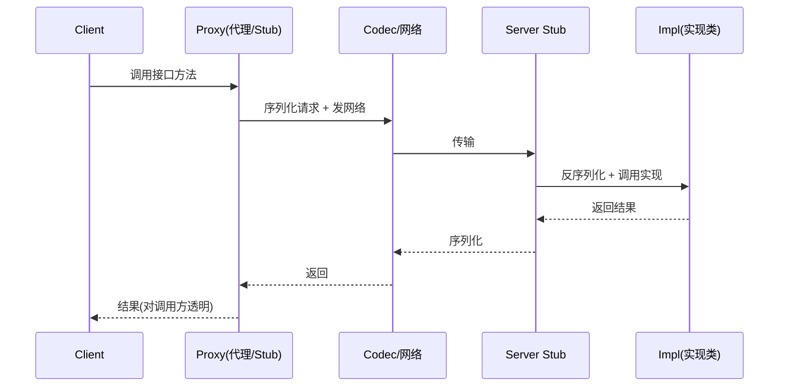

```text
Consumer                               Provider
   │                                      │
   │ 1. 调用本地代理 Stub(接口方法)         │
   │ 2. 过滤链(Cluster/容错/限流)          │
   │ 3. 负载均衡选一个 Invoker             │
   │ 4. 序列化(Request) → 网络(NIO) ──────▶│ 5. 反序列化 → 分发到真实实现
   │                                      │ 6. 执行业务方法
   │◀──────── 序列化(Response) ←───────────│ 7. 返回结果
   │ 8. 反序列化 → 结果返回调用方           │
```

关键角色：
- **Proxy（代理）**：JDK 动态代理 / 字节码增强（Dubbo 用 javassist），把接口调用转成网络请求；
- **网络 IO**：BIO → NIO（Netty），多路复用扛高并发；
- **序列化**：把对象转字节流（见第 3 节）；
- **Cluster 层**：把"多个 Provider 节点"封装成一个"逻辑 Invoker"，负责容错与负载均衡。

---

## 3. 序列化方案对比（高频）

| 方案 | 体积 | 速度 | 跨语言 | schema | 典型用途 |
| --- | --- | --- | --- | --- | --- |
| JDK Serializable | 大 | 慢 | 仅 Java | 无 | 远古遗留 |
| JSON（Jackson） | 大 | 中 | ✔ | 无 | REST、调试友好 |
| **Hessian** | 小 | 快 | ✔ | 弱 | **Dubbo 默认** |
| **Protobuf** | 最小 | 最快 | ✔ | 强(IDL) | gRPC、跨语言 |
| Kryo | 小 | 很快 | 仅 Java | 无 | 内部高性能 |
| Avro | 小 | 快 | ✔ | 强 | Hadoop 生态 |

**考察点**：RPC 为什么不用 JSON？→ 体积大（带宽贵）、序列化慢（CPU 贵）、无强类型（易出错）。Protobuf 靠 `tag` 编号做前后兼容（加字段不改旧客户端），这是它跨语言演进的杀手锏。

---

## 4. 注册中心与服务发现

**作用**：Provider 启动时把自己（`ip:port` + 接口 + 权重）注册上去；Consumer 拉取/订阅列表；节点上下线通过心跳 + 推送通知变更。

| 注册中心 | 一致性 | 特点 | 备注 |
| --- | --- | --- | --- |
| **ZooKeeper** | CP | 强一致、临时节点 + watch | Dubbo 经典搭档，选主期间不可写 |
| **Nacos** | CP+AP 双模 | 服务发现用 AP，配置用 CP；支持 DNS+gRPC | 阿里系首选，Dubbo/SC 通吃 |
| **Eureka** | AP | 自我保护机制，不踢掉失联节点 | Spring Cloud Netflix |
| **Consul** | CP | 多数据中心、健康检查强 | HashiCorp |
| **etcd** | CP | K8s 同款，强一致 | 云原生 |

**CAP 视角**：服务发现**宁愿可用不可靠**（AP）——宁可返回稍旧列表，也不能因注册中心选主而全站无法调用。所以 Eureka/Nacos(AP) 比 ZK 更适合纯发现场景；ZK 的强一致适合"配置/锁"类强约束。

### 4.1 Nacos 一致性协议深度剖析（高频追问）

Nacos 同时支持 AP（Distro）和 CP（Raft），面试官常追问"两个协议分别怎么工作"。

**Raft 协议（CP 模式）**——用于持久化实例和配置中心：

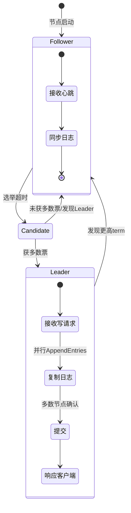

**Distro 协议（AP 模式）**——用于临时实例（服务发现）：

```text
Nacos Server A                    Nacos Server B
    │                                  │
    │ 1. Client 注册(临时实例)           │
    │ 2. 写入本地内存 + 同步给其他节点     │
    │───────────distro sync───────────▶│ 3. 接收并存储
    │                                  │ 4. 定期全量同步(补偿)
    │◀──────────distro sync────────────│ 5. B 的实例也同步给 A
    │ 6. 各节点都能独立提供完整列表       │
    │    (最终一致, 非强一致)            │
```

> **关键区别**：Raft 写请求必须过半确认才返回成功（强一致，选主期间不可写）；Distro 每个节点都能直接写入并异步同步（高可用，允许短暂不一致）。服务发现用 Distro——节点抖动不能影响注册，配置用 Raft——错配不能传播。

**【深度拓展】Nacos Raft 选举细节**
- **选举超时（election timeout）**：Follower 在 `150~300ms` 随机时间内没收到 Leader 心跳就发起选举。随机化是为了避免多个节点同时发起选举导致活锁。
- **日志复制**：Leader 收到写请求 → Append 到本地日志 → 并行发 `AppendEntries` RPC 给所有 Follower → 过半确认后 Commit → 响应客户端。未过半时 Follower 的日志处于"已 Append 未 Commit"状态。
- **脑裂处理**：Raft 通过 `term`（任期号）机制解决——旧 Leader 发现更高 term 的 Leader 立即降级。网络恢复后，少数派节点的未提交日志会被 Leader 的日志覆盖。
- **与 ZK ZAB 的区别**：ZK 用 ZAB（Zookeeper Atomic Broadcast）协议，本质也是 Leader-based 的过半复制，但 ZK 强调"顺序一致性"（写入按顺序），Raft 强调"日志一致"。两者在工程表现上几乎一样，面试时说"类似 ZAB 的过半复制"即可。

**【面试官追问】**
- "Nacos 临时实例和持久化实例的区别？" → 临时实例靠心跳保活（心跳停=下线，走 AP/Distro）；持久化实例注册后永久存在（走 CP/Raft，适合 DB 等基础设施）。
- "Nacos 集群几个节点？为什么？" → 推荐 3 或 5 节点（奇数，过半 = 2 或 3）。偶数节点不增加可用性还多一台成本。
- "如果 Nacos 全挂了怎么办？" → Consumer 有本地缓存（内存+磁盘），已注册的地址仍可调用，只是无法感知新上下线（见下文 Q5 注册中心挂了的回答）。

**【项目支撑】**
XTransfer 用 Nacos 做注册/配置中心：服务发现走临时实例（AP/Distro），保证注册中心抖动不影响调用；限流规则、渠道开关等关键配置走 CP（Raft），保证全集群配置一致——错配一个限流阈值可能导致大促时请求被拒，所以配置必须强一致。配合 Sentinel + Nacos 动态配置，不用发版就能调限流阈值和灰度路由。

### 4.2 gRPC 与 Protobuf：跨语言 RPC 的事实标准

gRPC 虽不在"Dubbo vs Spring Cloud"二元选型中，但面试常被问到"你们跨语言怎么通信"。

| 维度 | gRPC | Dubbo | Spring Cloud (Feign) |
| --- | --- | --- | --- |
| 协议 | HTTP/2 + Protobuf | Dubbo协议/Triple(HTTP/2) | HTTP/1.1 + JSON |
| IDL | .proto（强类型） | Java接口 | Java接口 |
| 流式 | Unary/Server/Client/Bidi | Triple支持 | 不原生支持 |
| 跨语言 | **一等公民**（30+语言） | Triple可，传统偏Java | HTTP天然跨语言 |
| 服务治理 | 需配xDS/Envoy | 内置 | 靠生态组件 |
| 典型场景 | 混合语言、云原生 | 纯Java高性能 | Spring生态 |

**【深度拓展】gRPC 的核心优势**
- **HTTP/2 多路复用**：单个 TCP 连接上并发多个请求/响应，用 `streamId` 区分，消除 HTTP/1.1 的队头阻塞。这和 Dubbo 的"单连接多路复用+requestId"思路一致，但 gRPC 用的是标准 HTTP/2 帧。
- **Protobuf 序列化**：用 `tag`（字段编号）而非字段名编码，加 varint 变长整数，体积比 JSON 小 3~10 倍。前后兼容靠"加新字段不改旧编号"——老客户端忽略未知字段，新客户端用默认值。
- **流式 RPC（Streaming）**：Server Streaming 适合"大结果集分批返回"（如日志流、向量检索结果）；Bidirectional Streaming 适合"实时双向通信"（如实时翻译、协作编辑）。

```protobuf
// 跨语言服务定义示例
syntax = "proto3";
package payment.v1;

service PaymentService {
  rpc CreatePayment(PaymentRequest) returns (PaymentResponse);          // Unary
  rpc StreamPayments(PaymentQuery) returns (stream PaymentRecord);        // Server Streaming
  rpc SubscribeEvents(stream SubscribeRequest) returns (stream Event);    // Bidirectional
}

message PaymentRequest {
  string merchant_id = 1;
  int64 amount_cents = 2;
  string currency = 3;
  string idempotency_key = 4;  // 幂等键
}
```

**【面试官追问】**
- "gRPC 和 Dubbo Triple 有什么关系？" → Triple 基于 HTTP/2 + Protobuf，兼容 gRPC 协议，但保留了 Dubbo 的服务治理能力（路由、限流、熔断）。Dubbo 3 用 Triple 补齐了跨语言短板。
- "Protobuf 为什么快？" → 二进制编码（varint + tag）、无字段名开销、无需文本解析（不像 JSON 要做词法分析）；但不可读、需要 `.proto` 文件做 schema。
- "HTTP/2 对比 HTTP/1.1 的改进？" → 多路复用（单连接并发）、头部压缩（HPACK）、服务端推送、二进制分帧——这些是 gRPC 性能的基础。

**【项目支撑】**
XTransfer 对外与渠道/银行交互用 HTTP + Protobuf（Triple 兼容 gRPC），跨境弱网场景吃到 HTTP/2 多路复用红利；内部 Java 服务间用 Dubbo/Triple RPC 拿强一致结果。这种"对外 gRPC/HTTP、对内 Dubbo"的分层在跨境支付里特别常见——渠道接口可能是各种语言写的，Protobuf IDL 做契约保证。

---

## 5. 负载均衡

- **随机 / 加权随机**：简单，不均匀时加权；
- **轮询 / 加权轮询**：均匀但无视节点负载；
- **最少活跃数（LeastActive）**：Dubbo 特色，挑"正在处理请求最少"的节点，最贴近真实负载；
- **一致性哈希**：同参数请求落到同一节点，**解决有状态/缓存亲和**（如按 userId 哈希做本地缓存命中）；缺点是节点变动会重新映射；
- **最短响应（P2C/WRR）**：按响应时间加权。

客户端 LB（Dubbo/OpenFeign 内置）vs 服务端 LB（Service Mesh Sidecar / Nginx）：客户端更省一跳、更灵活；Mesh 对业务无侵入。

### 5.1 六种负载均衡策略深度对比

```mermaid
graph TD
  START["收到请求"] --> CHECK{"是否有状态/亲和需求?"}
  CHECK -->|"是"| HASH["一致性哈希<br/>相同参数→同一节点"]
  CHECK -->|"否" --> LOAD{"是否有负载反馈?"}
  LOAD -->|"是"| LA["最少活跃数<br/>LeastActive"]
  LOAD -->|"是"| RT["最短响应时间<br/>P2C/WRR"]
  LOAD -->|"否" --> WEIGHT{"有权重差异?"}
  WEIGHT -->|"是"| WR["加权轮询/加权随机"]
  WEIGHT -->|"否" --> SIMPLE["轮询/随机"]
  
  HASH --> HASH_RING["一致性哈希环<br/>虚拟节点均衡"]
  LA --> LA_DETAIL["活跃数=已发-已收<br/>差值最小=最闲"]
  RT --> RT_DETAIL["统计响应时间<br/>按RT倒数加权"]
  WR --> WR_DETAIL["按机器配置分权<br/>大机器多分配"]
  SIMPLE --> SIMPLE_DETAIL["适合同构节点<br/>简单均匀"]
```

| # | 策略 | 原理 | 优点 | 缺点 | 适用场景 |
| --- | --- | --- | --- | --- | --- |
| 1 | 随机 | 随机选一个 | 实现最简单 | 短期不均匀 | 同构、QPS不高 |
| 2 | 轮询 | 依次轮流 | 均匀 | 无视负载差异 | 同构机器 |
| 3 | **加权随机/轮询** | 按权重分配概率 | 照顾异构配置 | 权重需手动维护 | 机器配置不同 |
| 4 | **最少活跃数（LeastActive）** | 选"活跃请求数最少"的 | **最贴近真实负载** | 需统计活跃数 | **Dubbo默认推荐** |
| 5 | **一致性哈希** | 同参数→同节点 | 缓存亲和、有状态友好 | 节点变动重映射 | 有状态/缓存服务 |
| 6 | **最短响应（ShortestResponse）** | 按响应时间加权 | 自适应慢节点 | 统计窗口延迟 | 对延迟敏感的场景 |

**【深度拓展】最少活跃数为什么最贴近真实负载？**
- **活跃数定义**：`活跃数 = 已发送请求数 - 已收到响应数`。活跃数为 0 说明节点空闲，活跃数大说明节点正在处理很多请求。
- **比轮询好在哪**：轮询不管节点忙不忙平均分配，但某台可能因为 GC、慢查询而堆积请求；LeastActive 会自动把新请求分给更闲的节点。
- **Dubbo 3 的 P2C（Power of Two Choice）**：不是遍历所有节点选最优，而是随机抽 2 个选更好的——在大规模集群下避免了"遍历全部 + 锁竞争"的开销，同时效果接近最优。这是从理论上证明的高效近似算法。

**【深度拓展】一致性哈希环详解**
- **哈希环**：把 0 ~ 2^32 的哈希值空间首尾相连成环，节点和请求都映射到环上，请求顺时针找最近的节点。
- **虚拟节点**：真实节点在环上只有几个点，容易分布不均（数据倾斜）。给每个真实节点配 160 个虚拟节点，让分布更均匀。
- **节点变动影响**：加一个节点只影响"前一个节点到新节点之间"的 key，不像取模（`hash % N`）加一台机器所有 key 都要重映射。这就是缓存集群用一致性哈希的原因。
- **Dubbo 的一致性哈希**：按**方法参数**哈希（可配哪些参数参与），相同参数的请求落到同一节点——适合做本地缓存命中（如按 userId 哈希，用户数据缓存在对应节点本地内存）。

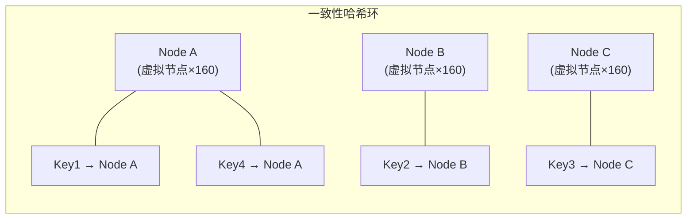

**【面试官追问】**
- "Dubbo 默认用哪种负载均衡？" → 随机（`RandomLoadBalance`），但在生产中常配成 LeastActive 或一致性哈希。
- "加权轮询的平滑加权轮询算法（SWRR）是什么？" → Nginx 用的算法，不是简单按比例轮询，而是让高权重节点的请求分散开（不会连续打到同一台），避免瞬时压力集中。
- "Service Mesh 的 LB 和客户端 LB 区别？" → Sidecar 做 LB 对业务无侵入、可跨语言统一；客户端 LB 更高效（少一跳）、更灵活（可用业务参数做路由）。

**【项目支撑】**
XTransfer 收款服务按渠道做负载均衡：核心入账链路用 LeastActive 确保不把请求堆给慢节点；渠道回调处理用一致性哈希（按 merchantId + orderId 哈希），让同一商户的请求落同一节点，本地缓存命中率更高——这和"状态亲和"是一个道理。哈啰 IOT 心跳数据按 deviceId 一致性哈希分片，保证设备数据聚合时不用跨节点。

---

## 6. 集群容错

| 策略 | 行为 | 适用 |
| --- | --- | --- |
| **Failover** | 失败自动重试其他节点（默认） | 读、幂等写 |
| **Failfast** | 立即失败，不重试 | 非幂等写 |
| **Failsafe** | 失败忽略（记日志） | 审计/日志类 |
| **Failback** | 失败后台定时重试 | 通知类 |
| **Broadcast** | 广播给所有节点 | 刷新缓存/配置 |

**铁律**：重试必须配合**幂等**（见分布式事务篇）。支付类非幂等写用 Failfast，宁可让用户重试也不要 double-charge。

### 6.1 集群容错策略 Mermaid 时序图

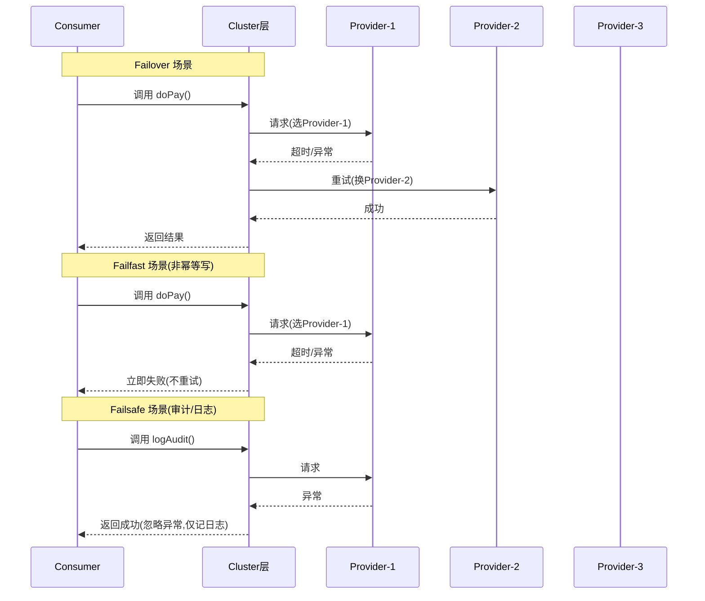

### 6.2 Sentinel 熔断降级源码级剖析

Sentinel 是阿里开源的流量治理组件，Dubbo 生态中最常用的熔断限流方案。

**Sentinel 核心架构**：

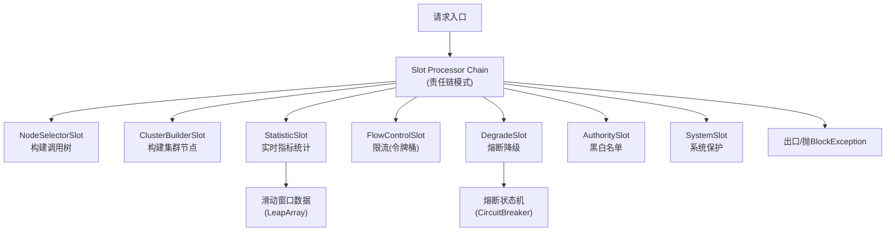

**Sentinel 熔断状态机（三种熔断策略）**：

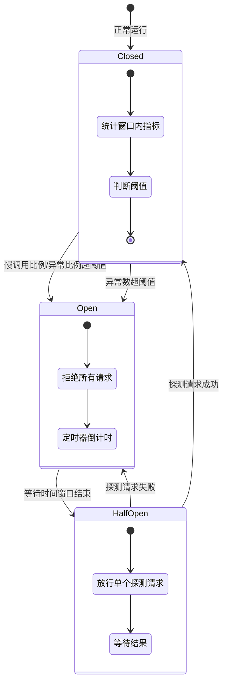

**三种熔断策略详解**：

| 策略 | 触发条件 | 恢复机制 | 适用场景 |
| --- | --- | --- | --- |
| 慢调用比例 | RT > 阈值的调用比例 > 比例阈值 | 探测请求 RT 正常 → 恢复 | 依赖慢的降级 |
| 异常比例 | 异常比例 > 比例阈值 | 探测请求成功 → 恢复 | 依赖偶发错误 |
| 异常数 | 异常数 > 阈值 | 探测请求成功 → 恢复 | 依赖频繁故障 |

**Sentinel 源码关键路径**：
```java
// 1. 入口：SphU.entry() → 进入 Slot 责任链
public Entry entry(String resource) throws BlockException {
    return sph.entry(resource, EntryType.IN);
}

// 2. StatisticSlot 统计（滑动窗口）
//    使用 LeapArray 滑动窗口，默认 1秒/2个窗口（500ms 一个）
public void pass(Node node, int count) {
    // 滑动窗口统计 QPS / RT / 异常数
    node.addPassRequest(count);
    node.rt = System.currentTimeMillis() - startTime;
}

// 3. DegradeSlot 熔断判断
//    CircuitBreaker 检查慢调用比例/异常比例
public void checkCircuitBreaker(Node node, int count) {
    if (circuitBreaker.tryPass(node)) {
        // 放行
    } else {
        throw new DegradeException(resource); // 被熔断
    }
}

// 4. 滑动窗口实现（LeapArray）
//    每个 WindowWrap 是一个时间窗口样本
private AtomicReferenceArray<WindowWrap<MetricBucket>> array;
public MetricBucket currentWindow(long timeMillis) {
    // 计算当前时间对应的窗口下标
    int idx = calculateTimeIdx(timeMillis);
    // 窗口过期则重置（滑动）
    if (windowWrap.isWindowDeprecated(timeMillis)) {
        resetWindowTo(windowWrap, timeMillis);
    }
    return windowWrap.value();
}
```

**【深度拓展】Sentinel vs Resilience4j**
- **Sentinel** 优势：阿里大规模验证、Dashboard 可视化、规则热更新（Nacos 动态规则）、Dubbo 深度整合。
- **Resilience4j** 优势：轻量（函数式、无依赖）、Spring 官方推荐、Circuit Breaker + Bulkhead + Rate Limiter + Retry 一体化。
- **选型**：Dubbo 生态优先 Sentinel；Spring Cloud 3.x + 生态优先 Resilience4j。两者理念一致（断路器模式 + 滑动窗口），API 风格不同。

**【面试官追问】**
- "Sentinel 限流算法是什么？" → 滑动窗口（LeapArray）统计 QPS，匀速排队用漏桶，默认限流用令牌桶（按 QPS 阈值匀速放行）。
- "滑动窗口和固定窗口的区别？" → 固定窗口在窗口边界可能放行 2 倍 QPS（如 1 秒限 100，窗口最后 100ms+下个窗口前 100ms 共 200 次）；滑动窗口按时间偏移统计，更精确。
- "熔断恢复后全量放行吗？" → 不是。HalfOpen 只放行**一个探测请求**，成功才恢复 Closed 全量放行，避免恢复瞬间打爆还没缓过来的服务。
- "Sentinel 规则怎么动态更新？" → 配合 Nacos 配置中心，规则写到 Nacos，Sentinel 监听 Nacos 配置变更实时生效，不用重启应用。

**【项目支撑】**
XTransfer 用 Sentinel + Nacos 做流量治理：渠道调用按 QPS 限流（令牌桶），渠道慢响应触发慢调用比例熔断（保护核心入账线程池不被渠道拖垮），异常比例熔断防止渠道持续故障扩散。规则通过 Nacos 热更新——大促时临时提高限流阈值不用发版。这和高可用篇"三板斧（限流/熔断/降级）"是同一套治理能力在 Dubbo 生态的具体落地。

---

## 7. Apache Dubbo 架构详解

### 7.1 五大角色

```text
+----------+      注册/订阅       +----------+
| Consumer |◀───────注册中心──────▶| Provider |
+----------+       (Registry)     +----------+
     │                                  │
     │          调用(Monitor 监控)       │
     └──────────▶ 监控中心 ◀─────────────┘
                 (Monitor)
```

- **Provider**：暴露服务；**Consumer**：引用服务；**Registry**：注册/发现；**Monitor**：统计调用次数/耗时；**Container**：服务运行容器（Spring）。

### 7.2 分层架构（面试爱画）

> Dubbo 十层架构自顶向下：**配置 → 代理 → 注册 → 集群(容错/监控) → 协议 → 交换 → 传输 → 序列化**。面试常让现场画，记住"上管配置、中管路由容错、下管传输编解码"。

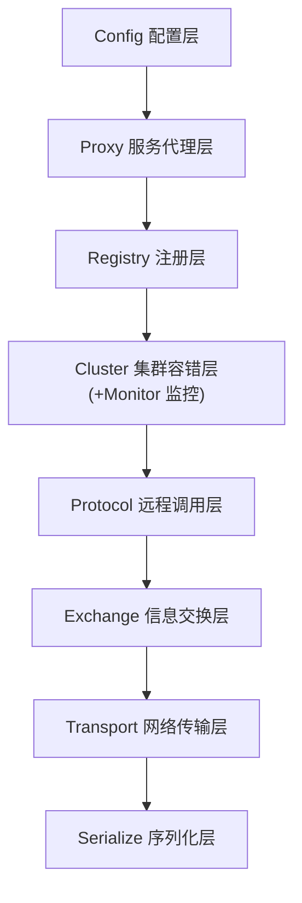

```text
config 配置层      → ServiceConfig/ReferenceConfig
  proxy 代理层     → 生成 Stub（JDK 动态代理/javassist）
    registry 注册层→ 注册与订阅
      cluster 集群层→ 容错/路由/负载均衡（把多节点合成一个 Invoker）
        protocol 远程调用层 → Invoker/Exporter（DubboProtocol）
          exchange 信息交换层 → Request/Response（默认 HeaderExchange）
            transport 网络传输层 → Netty/Minna（NIO）
              serialize 序列化层 → Hessian/Protobuf/Kryo
```

每层都是**可插拔 SPI**：协议可换、序列化可换、注册中心可换、容错可换。

### 7.3 SPI 扩展机制（Dubbo 灵魂，高频）

- 用 `@SPI` 标注扩展点接口，`@Adaptive` 标注自适应方法；
- 配置文件放 `META-INF/dubbo/接口全限定名 = 实现类`；
- 与 **JDK SPI** 区别：
  - JDK SPI 一次性加载**所有**实现（`ServiceLoader` 遍历），Dubbo SPI **按需加载**指定实现；
  - Dubbo SPI 支持 **@Adaptive 自适应扩展**（运行时按 URL 参数动态选实现，如 `protocol=dubbo`）、**IOC 依赖注入**、**AOP 包装链**（`@Activate` 按条件激活）；
  - 异常更友好，可精确获取扩展。

### 7.3.1 Dubbo SPI 机制原理深度图解

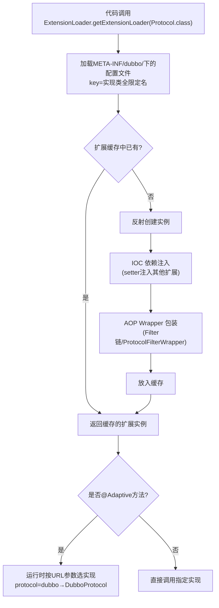

**Dubbo SPI 加载流程详解**：

```text
1. ExtensionLoader.getExtensionLoader(Protocol.class)
   └→ 扫描 META-INF/dubbo/org.apache.dubbo.rpc.Protocol
   └→ 读取配置文件内容（key=value 格式）
       dubbo=org.apache.dubbo.rpc.protocol.dubbo.DubboProtocol
       triple=org.apache.dubbo.rpc.protocol.tri.TripleProtocol
       ...

2. getExtension("dubbo")  // 按名获取指定实现
   └→ 反射创建 DubboProtocol 实例
   └→ IOC: 注入依赖（如注入注册中心扩展）
       └→ ExtensionFactory 从 Spring/SPI 获取依赖
   └→ AOP: 检查是否有 Wrapper（如 ProtocolFilterWrapper）
       └→ 有则用 Wrapper 包装，形成责任链
   └→ 缓存并返回包装后的实例

3. getAdaptiveExtension()  // 自适应扩展
   └→ 动态生成代理类（字节码增强）
   └→ 方法被调用时，从 URL 参数中取 key
   └→ 如 URL 里 protocol=dubbo → 调用 DubboProtocol
   └→ 如 URL 里 protocol=triple → 调用 TripleProtocol
```

**@Adaptive 自适应扩展原理（代码级）**：
```java
// 接口定义
@SPI("dubbo")  // 默认实现 key 为 dubbo
public interface Protocol {
    // @Adaptive 表示这个方法是自适应的
    // 运行时根据 URL 里的 protocol 参数决定用哪个实现
    @Adaptive
    <T> Exporter<T> export(Invoker<T> invoker) throws RpcException;
    
    @Adaptive
    <T> Invoker<T> refer(Class<T> type, URL url) throws RpcException;
}

// Dubbo 生成的自适应代理类（简化伪代码）
public class Protocol$Adaptive implements Protocol {
    public <T> Invoker<T> refer(Class<T> type, URL url) {
        // 从 URL 里取 protocol 参数，默认 dubbo
        String extName = url.getParameter("protocol", "dubbo");
        // 按 key 取扩展
        Protocol extension = ExtensionLoader
            .getExtensionLoader(Protocol.class)
            .getExtension(extName);
        return extension.refer(type, url);
    }
}
```

**@Activate 条件激活（Filter 链）**：
```java
// Filter 示例
@Activate(group = {CommonConstants.PROVIDER, CommonConstants.CONSUMER}, // 在 Provider 和 Consumer 都激活
          order = -1000)  // 优先级（越小越先执行）
public class ContextFilter implements Filter {
    public Result invoke(Invoker<?> invoker, Invocation invocation) {
        // 注入/透传 TraceId
        String traceId = RpcContext.getContext().getAttachment("traceId");
        MDC.put("traceId", traceId);
        try {
            return invoker.invoke(invocation);  // 调下一个 Filter
        } finally {
            MDC.remove("traceId");
        }
    }
}
```

**【深度拓展】Dubbo SPI 设计精妙之处**
- **按需加载 vs JDK SPI 全量加载**：JDK SPI 的 `ServiceLoader.load()` 一次性实例化所有实现，即使只用一个。Dubbo SPI 用 `getExtension("dubbo")` 只创建需要的那个，避免无用的实例化（有些扩展如协议创建会建连接池，实例化很重）。
- **Wrapper（AOP）机制**：实现 `Protocol` 接口且构造器接受 `Protocol` 参数的类会被识别为 Wrapper。`getExtension("dubbo")` 返回的不是裸 DubboProtocol，而是 `ProtocolFilterWrapper(ProtocolListenerWrapper(DubboProtocol))` 的责任链。这是 Dubbo Filter 链的实现基础。
- **IOC 注入**：扩展实例化后，Dubbo 会检查 setter 方法，如果参数类型是另一个扩展接口，就自动注入对应扩展。例如 Protocol 的实现可以自动注入 RegistryFactory。
- **自适应扩展的动态代理**：Dubbo 用 Javassist/字节码动态生成 `Protocol$Adaptive` 类，不是硬编码 if-else，而是从 URL 取参数名 → 查扩展 → 调用。这让"换协议"只需改配置、不用改代码。

**Dubbo SPI 扩展示例（自定义序列化）**：
```java
// 1. 实现序列化接口
@SPI("hessian2")  // 默认用 hessian2
public interface Serialization {
    byte getContentTypeId();
    String getContentType();
    ObjectOutput serialize(URL url, OutputStream output) throws IOException;
    ObjectInput deserialize(URL url, InputStream input) throws IOException;
}

// 2. 自定义实现
public class MyJsonSerialization implements Serialization {
    // ... 实现 JSON 序列化
}

// 3. 配置文件 META-INF/dubbo/org.apache.dubbo.common.serialize.Serialization
myjson=com.example.MyJsonSerialization

// 4. 使用（URL 参数指定）
<dubbo:protocol serialization="myjson" />
// 或代码层面
url = url.addParameter("serialization", "myjson");
```

**【面试官追问】**
- "如果让你用 Dubbo SPI 扩展一个负载均衡策略？" → 实现 `LoadBalance` 接口 → 在 `META-INF/dubbo/org.apache.dubbo.rpc.cluster.LoadBalance` 配置 key=类名 → 在 `@DubboService(loadbalance="mystrategy")` 使用。
- "Dubbo SPI 和 Spring SPI（@Conditional）有什么区别？" → Spring SPI 基于 Bean 条件注册，容器启动时决定；Dubbo SPI 基于运行时 URL 参数动态选，更灵活但仅限 Dubbo 框架内部。
- "为什么 Dubbo 不用 Spring 的 @Bean 扩展？" → Dubbo 的 SPI 设计先于 Spring Boot，且需要"按 URL 参数运行时选实现"的能力，Spring 的 Bean 注册是启动时静态的。

**【项目支撑】**
XTransfer 收款产品的扩展机制和 Dubbo SPI 思想同源：定义"收款产品"扩展点接口（VA/收单/A2A/电商各一个实现），通过配置（类似 SPI 的 key=value）自动发现和激活，新增产品零改核心代码。这和 Dubbo "新增序列化/协议/负载均衡只加配置不改框架"的开闭原则完全一致。欧凡活动系统也用同样的策略模式接多款活动，新增活动只加策略类。

---

## 8. Spring Cloud 生态架构详解

- **Dubbo 协议**（默认）：**单一长连接 + NIO + Hessian 二进制**。**适合小数据量、高并发**的调用（如内部方法调用）。**不适合**传大文件/大数据包（单连接会阻塞、长连接内存压力）；大数据用 `rmi`/`http` 或多连接。
- **Triple 协议**（新）：基于 **HTTP/2 + Protobuf**，**兼容 gRPC**、支持 Streaming、跨语言，是 Dubbo 3 面向云原生的主力。

### 7.5 服务治理

- 路由规则（条件路由/标签路由）、动态配置、灰度（按 tag/参数路由）；
- 限流：`tps` 限流（令牌桶）、`execute` 限流（并发数）；
- 过滤器链（TraceId、鉴权、降级 Mock）；
- Dubbo Mesh（Proxyless / Sidecar）。

---

## 8. Spring Cloud 生态架构详解

Spring Cloud 不是"一个框架"，而是**一套微服务组件的集合**，基于 HTTP（REST）+ 内嵌容器（Tomcat/Netty），与 Spring Boot 无缝集成。

### 8.1 核心组件

| 能力 | 组件 | 说明 |
| --- | --- | --- |
| 注册发现 | **Eureka / Nacos / Consul** | Eureka 已进维护模式，新项目优先 Nacos |
| 服务调用 | **OpenFeign** | 声明式 HTTP 客户端（`@FeignClient`），整合 LoadBalancer |
| 负载均衡 | **Spring Cloud LoadBalancer** | 取代 Ribbon（轮询/随机/自定义） |
| 熔断限流 | **Sentinel / Resilience4j** | Hystrix 已停更 |
| 网关 | **Spring Cloud Gateway** | WebFlux+Netty 异步非阻塞 |
| 配置中心 | **Nacos / Apollo / Config** | 动态配置、灰度发布 |
| 消息总线 | **Spring Cloud Bus** | 配合 Config 广播刷新 |
| 链路追踪 | **Sleuth+Zipkin / Micrometer** | 传播 TraceId |
| 安全 | **Spring Security / OAuth2 Resource Server** | 资源服务器鉴权 |

### 8.2 Spring Cloud Gateway（重点）

- 基于 **WebFlux + Netty**，**异步非阻塞**，比 Zuul（同步阻塞、已停更）吞吐高、资源省；
- 三要素：**Route（路由） / Predicate（断言，匹配路径/Header/时间） / Filter（过滤器，鉴权/限流/改写）**；
- 内置限流（基于 Redis 令牌桶）、熔断（整合 Sentinel）。

### 8.3 通信本质

Spring Cloud 微服务之间默认走 **HTTP/REST + JSON**（OpenFeign），通用、跨语言、易调试，但每次调用有 HTTP 头开销、JSON 序列化成本，**性能低于 Dubbo 的二进制长连接**。

---

## 9. Dubbo vs Spring Cloud 全面对比（核心）

| 维度 | Apache Dubbo | Spring Cloud |
| --- | --- | --- |
| 通信协议 | Dubbo 私有协议 / Triple(HTTP/2) | HTTP/REST(JSON) |
| 性能 | **高**（长连接 + 二进制 + NIO） | 中（文本协议 + JSON） |
| 定位 | **RPC 框架**（专注服务调用） | **微服务全家桶**（含网关/配置/链路等） |
| 服务治理 | 内置（路由/限流/灰度/SPI） | 组件拼装（Sentinel/Gateway/Nacos） |
| 注册中心 | ZK / Nacos | Eureka / Nacos / Consul |
| 容错 | 5 种集群容错策略 | 靠 Sentinel/Resilience4j |
| 跨语言 | Triple 可，传统 Dubbo 偏 Java | **天然跨语言**（HTTP） |
| 学习成本 | 中（概念多：SPI/协议/Invoker） | 低（Spring 体系熟悉即可） |
| 生态完整度 | 调用强、周边需配 | **开箱即用、组件全** |
| 版本管理 | Dubbo 自身版本 | 需对齐 **Spring Boot / Cloud / Alibaba** 版本矩阵（易踩坑） |
| 社区 | 阿里主导、活跃 | Broader（多厂商） |

### 9.1 优缺点

**Dubbo 优点**
- 性能高（二进制 + 长连接 + NIO），适合内部高并发；
- 服务治理能力强且内聚（限流/路由/灰度/SPI 可扩展）；
- 阿里大规模验证，稳定性好。

**Dubbo 缺点**
- 传统 Dubbo 协议偏 Java，异构系统接入麻烦（靠 Triple 缓解）；
- 生态"只管调用"，网关/配置/链路要自己拼；
- 版本兼容历史坑多，文档分散。

**Spring Cloud 优点**
- 生态完整、开箱即用，组件可独立替换；
- HTTP 通用、跨语言、前后端友好、易调试；
- 与 Spring Boot 无缝，上手快。

**Spring Cloud 缺点**
- HTTP + JSON 性能偏低，高频内部调用不划算；
- 组件多、版本矩阵复杂（Cloud/Alibaba/Boot 需严格对齐）；
- 部分组件停更（Hystrix、Zuul、Eureka 维护模式），需迁 Sentinel/Gateway/Nacos。

### 9.2 适用场景（怎么选）

- **纯 Java、内网高并发、追求极致性能** → **Dubbo**（如交易核心链路）；
- **多语言、快速搭建、云原生、中小企业、重生态** → **Spring Cloud / Spring Cloud Alibaba**；
- **两者共存（最主流）**：Dubbo 做**内部高性能 RPC**，Spring Cloud Gateway + Nacos 做**边界/网关/配置/发现**。很多中台就这么搭。
- **Spring Cloud Alibaba 还能直接整合 Dubbo**（`dubbo-spring-cloud`），让 Dubbo 用 Spring Cloud 的服务发现与配置，两全其美。

### 9.3 三方对比：gRPC vs Dubbo vs Spring Cloud

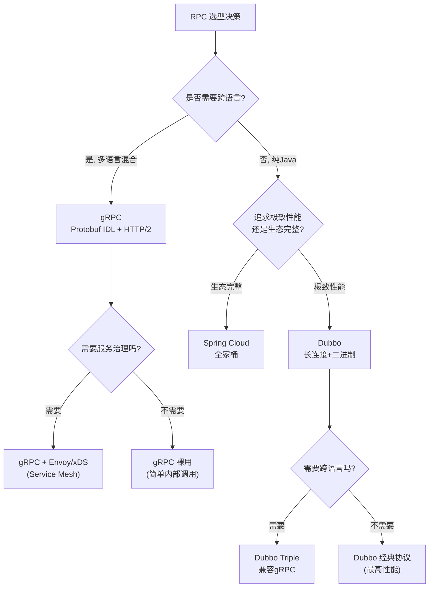

| 维度 | gRPC | Dubbo 3 (Triple) | Spring Cloud (Feign) |
| --- | --- | --- | --- |
| 协议 | HTTP/2 + Protobuf | Triple(HTTP/2) / Dubbo协议 | HTTP/1.1 + JSON |
| 序列化 | Protobuf | Hessian/Protobuf | JSON |
| IDL | .proto（必须） | Java接口（可选proto） | Java接口 |
| 跨语言 | **30+语言** | Triple可跨语言 | HTTP天然跨语言 |
| 流式 | Unary/Server/Client/Bidi | Triple支持 | 不原生 |
| 服务治理 | 需配xDS/Envoy | **内置**（路由/限流/熔断/SPI） | 靠生态组件 |
| 性能 | 高 | **最高**（经典协议） | 中 |
| 学习成本 | 低（proto+stub） | 中（SPI/十层架构） | 低（Spring风格） |
| 生态 | 云原生（Istio/Envoy） | 阿里系 | **最全** |
| 典型场景 | 混合语言、云原生Mesh | 纯Java高性能 | Spring生态快迭代 |

**【深度拓展】Dubbo 3 核心新特性**
- **Triple 协议**：基于 HTTP/2 + Protobuf，兼容 gRPC 协议（gRPC 客户端可直接调 Triple 服务端），同时保留 Dubbo 的服务治理能力。这解决了"Dubbo 偏 Java"的老问题。
- **应用级注册**：Dubbo 2 是接口级注册（每个接口一条数据），Dubbo 3 改为应用级注册（每个应用一条数据 + 元数据），与 Spring Cloud/Nacos 对齐，减少注册中心压力。
- **Service Mesh（Proxyless 模式）**：Dubbo 3 支持 Proxyless 模式——不部署 Sidecar，Dubbo 直接连控制面（Istio），兼顾 Mesh 的统一治理和 Proxyless 的性能。
- **云原生增强**：容器化部署、K8s 原生服务发现（对接 K8s Service）。

**gRPC vs Dubbo Triple 选型**：
- 纯多语言团队（Go/Python/Java 混合）→ gRPC 最直接。
- Java 为主、有少量跨语言需求 → Dubbo Triple，兼顾 Java 内部高性能和跨语言。
- 已有 Service Mesh（Istio）→ gRPC 原生支持 xDS，Mesh 整合最好。

**【面试官追问】**
- "Dubbo 3 为什么要做 Triple？" → 传统 Dubbo 协议偏 Java，跨语言接入难；Triple 基于 HTTP/2 标准，兼容 gRPC，补齐跨语言短板，同时保留 Dubbo 治理能力。
- "gRPC 为什么在云原生里流行？" → HTTP/2 天然兼容 Service Mesh（Sidecar 可解析 HTTP/2），Protobuf 是 CNCF 标准 IDL，Istio/envoy 对 gRPC 有一等支持。
- "你们公司用 gRPC 吗？" → XTransfer 内部 Java 服务用 Dubbo/Triple；对外与渠道/银行交互用 HTTP + Protobuf（Triple 兼容 gRPC），跨境弱网场景吃到 HTTP/2 多路复用红利。

**【项目支撑】**
XTransfer 的架构演进路径：早期内部 Dubbo 经典协议（Java 服务间高性能 RPC）；Dubbo 3 升级后部分服务切 Triple（兼容 gRPC，对外渠道接入更灵活）；Spring Cloud Gateway 做边界网关。这体现了"对内性能优先、对外标准优先"的分层选型——和"Cloud 做门面、Dubbo 做内功"的思路一致。

---

## 10. 二者如何共存 / 落地形态

```text
            ┌─────────────────────────────────────────┐
外部请求 ──▶│ Spring Cloud Gateway（鉴权/限流/路由）    │
            └───────────────┬─────────────────────────┘
                            │ 内部走 Dubbo RPC（长连接+二进制）
            ┌───────────────▼─────────────────────────┐
            │ Provider A ◀──Dubbo──▶ Provider B ◀──▶ ...│
            │ 注册中心 Nacos/ZK   配置中心 Nacos/Apollo │
            │ 链路追踪 Sleuth/Micrometer   熔断 Sentinel│
            └───────────────────────────────────────────┘
```

"网关用 Spring Cloud，内部用 Dubbo"是**工程上最均衡**的组合：边界统一、内部高性能。

---

## 11. 高频面试题集（标准回答 + 考察点）

**Q1：RPC 和 HTTP 有什么区别？什么时候用 RPC？**
> A：RPC 是二进制私有协议 + 长连接，省带宽低延迟，强类型契约，适合内部高频调用；HTTP REST 文本 + JSON，通用跨语言易调试，适合对外/跨团队。决策：**核心链路同步拿结果用 RPC，对外/异步/衍生动作用 HTTP 或 MQ**。
> 考察点：是否理解"性能 vs 通用性"的权衡，而不是死记定义。

**Q2：一次 Dubbo 调用全过程？**
> A：Consumer 调本地代理 → 过滤链 → 负载均衡选 Invoker → 序列化 → Netty 发往 Provider → 反序列化 → 执行业务 → 返回 → 反序列化给调用方。强调 Cluster 层把多节点封装成一个逻辑 Invoker。
> 考察点：是否真懂调用链，而非只背概念。

**Q3：Dubbo 为什么默认单一长连接？适合传大数据吗？**
> A：长连接省握手开销、NIO 复用扛高并发、小包效率高。但**单连接串行 + 大数据会阻塞、占内存**，所以只适合小数据高并发；传文件用多连接或 http/rmi。
> 考察点：理解协议设计取舍，能说出不适用场景。

**Q4：Dubbo 的 SPI 和 JDK SPI 有什么区别？为什么这么设计？**
> A：JDK SPI 一次性加载全部实现、无自适应；Dubbo SPI 按需加载、支持 @Adaptive 运行时按 URL 参数动态选实现、IOC 注入、@Activate 条件激活。设计目的是**解耦 + 按需 + 可扩展**（见 7.3）。
> 考察点：是否读过源码级设计，扩展机制是 Dubbo 灵魂。

**Q5：注册中心挂了，Dubbo 还能调用吗？**
> A：能。Consumer 本地有**服务列表缓存**，注册中心不可用只是**无法感知新上下线**，已有调用照常。这是 AP 设计的好处——注册中心不是调用链路的强依赖。
> 考察点：理解"注册中心是控制面、不是数据面"。

**Q6：Dubbo 超时和重试？为什么重试必须幂等？**
> A：超时会中断等待走容错；Failover 默认重试其他节点。但网络超时可能是"请求已到服务端只是响应慢"，重试会导致**重复执行**——所以非幂等写（如扣款）用 Failfast，或加幂等键（见分布式事务篇）。
> 考察点：超时 + 重试 + 幂等三者联动，支付场景重中之重。

**Q7：Dubbo 和 Spring Cloud 怎么选？你们怎么用的？**
> A：纯 Java 高并发内部用 Dubbo（性能 + 治理）；要生态/跨语言/快速用 Spring Cloud。我们 XTransfer 内部核心交易走 Dubbo/Triple RPC，边界用 Spring Cloud Gateway + Nacos 做发现与配置，二者配合（见第 10 节）。
> 考察点：不只背对比表，要能结合自己项目讲"为什么这么搭"。

**Q8：Eureka 自我保护机制？和 Nacos 区别？**
> A：Eureka 在网络分区时**不踢掉失联节点**（宁可返回旧列表，避免误杀健康实例），保护可用性（AP）。Nacos 同时支持 CP（配置/强一致）与 AP（服务发现），一致性哈希 + 健康探测更现代，且配置中心一体化。
> 考察点：CAP 理解 + 注册中心选型。

**Q9：Spring Cloud Gateway 和 Zuul 区别？为什么选 Gateway？**
> A：Gateway 基于 WebFlux + Netty **异步非阻塞**，高并发下资源省、吞吐高；Zuul 1.x 同步阻塞、已停更。Gateway 用 Route/Predicate/Filter 模型，内置限流熔断。
> 考察点：是否跟过生产网关选型。

**Q10：服务雪崩、熔断、降级、限流的区别？**
> A：**限流**控制入口流量（令牌桶）；**熔断**在依赖故障时快速失败（Circuit Breaker 状态机）；**降级**是熔断/异常时走兜底逻辑（返回默认值/Mock）；**雪崩**是故障因同步调用链层层放大。四者配合保稳定性（见高可用容灾篇）。
> 考察点：四个易混概念能否讲清边界。

**Q11：负载均衡有哪些策略？一致性哈希解决什么？**
> A：随机/轮询/最少活跃数/一致性哈希/最短响应。一致性哈希让**相同参数请求落到同一节点**，解决有状态服务/本地缓存命中问题（节点变动只影响部分 key）。Dubbo 的 LeastActive 最贴近真实负载。
> 考察点：是否理解"哈希环"与虚拟节点。

**Q12：你们怎么做服务治理（限流/灰度/链路追踪）？**
> A：限流用 Sentinel/Dubbo tps；灰度用标签路由（按用户/参数把流量导到新版本）；链路追踪用 Sleuth/Micrometer 传播 TraceId，接入 Zipkin/Jaeger。XTransfer 用 Nacos 动态配置 + Sentinel 规则热更。
> 考察点：治理手段是否落地过，而非纸上谈兵。

**Q13：怎么实现全链路追踪？**
> A：入口生成 TraceId，通过**请求头/上下文**在 RPC/HTTP/MQ 间透传，每个 span 上报到 Jaeger/Zipkin；Dubbo 用 Filter 注入 TraceId，MQ 用消息头传递。跨线程用 TransmittableThreadLocal 保住上下文。
> 考察点：TraceId 透传 + 异步线程上下文丢失是经典坑。

**【深度拓展】**
- **TraceId 必须"全链路无损"**：RPC（Filter 注入/透传）、HTTP（Header）、MQ（消息头/消息属性）每一跳都不能丢，否则链路断裂、无法串联。这是排查"资金卡单在哪个环节"的关键——XTransfer 每笔收款单都带 traceId 贯穿渠道→风控→账务。
- **跨线程上下文丢失是最高频的坑**：线程池/异步/MQ 消费里 ThreadLocal 不传递，要用 `TransmittableThreadLocal`（阿里 TTL）或手动在 Runnable/Callable 里拷贝。漏了就"子线程日志没有 traceId"，排查抓瞎。
- **采样率权衡**：全量上报存储/性能成本高，生产要采样（如 1%~10% 或错误全采）。但资金系统对"出问题的那笔"要能查到完整链路，所以常"正常采样 + 异常/慢请求全量"。
- **面试官追问**："链路追踪和日志/指标的关系？" → 三者是"Logs/Metrics/Traces"可观测性三支柱，TraceId 把日志和 span 串起来（见高可用篇 RED/USE 指标）。

**【项目支撑】**
XTransfer 在 Dubbo Filter 里注入 Micrometer 的 TraceId 并跨 RPC/HTTP/MQ 透传，异步线程用 TTL 保住；每笔收款单的 traceId 贯穿"渠道回调→风控→记账→对账"，出问题时能秒级定位卡在哪一环。这正是 2.0 重构后生产问题降 80% 的"可观测性"支撑之一。

**Q14：Dubbo 线程池满了会怎样？**
> A：Provider 端线程池（默认 fixed 200）耗尽 → 新请求被拒绝 → 走 **Mock/Fail** 或返回 Rejected（配合超时快速失败），避免线程堆积拖垮整个 Provider。所以线程池参数要按业务 QPS 配，并加熔断。
> 考察点：线程模型与背压意识。

**【深度拓展】**
- **线程池类型要选对**：fixed（固定，易打满）、cached（弹性，但可能无限涨）、业务隔离线程池（不同方法/接口独立池，避免一个慢接口占满全局）。XTransfer 把"渠道调用"和"核心入账"用不同线程池（舱壁隔离），慢渠道不拖垮入账主链路。
- **拒绝策略的取舍**：Abort（直接抛错，调用方走 Failfast/重试其他节点）最常用；CallerRuns（调用方线程自己跑，反向背压）适合"不能丢但要限速"；Discard 会静默丢，资金场景禁用。
- **线程耗尽的上游根因**：往往是"下游慢 + 超时设太长 + 没熔断"，线程一直被占着等。所以"超时 + 熔断 + 线程池"是一套组合拳，缺一不可。
- **面试官追问**："怎么监控线程池水位？" → 暴露活跃线程数/队列长度指标，超阈值告警（见高可用篇 RED/USE）；"IO 线程和业务线程怎么分？" → Netty IO 线程只做编解码，业务交独立业务线程池。

**【项目支撑】**
XTransfer 收款 Provider 按"渠道调用/核心入账/通知"拆分独立线程池（舱壁），渠道慢不会占满核心入账池；配合渠道熔断 + 合理超时，避免线程耗尽拖垮资金主链路。这和高可用篇"舱壁隔离"是同一套思想。

**Q15：怎么做灰度发布 / 金丝雀？**
> A：网关/路由层按**用户标签/百分比/Header** 把小部分流量导到新版本；结合注册中心的**标签路由**（Dubbo tag route / Nacos 元数据），新版本验证无碍再全量。数据库变更要向后兼容（扩容字段、双写）。
> 考察点：发布策略与可回滚意识（见高可用容灾篇）。

---

## 12. 结合我的真实项目

- **XTransfer（跨境支付，旗舰）**：微服务架构（六边形 + CQRS + DDD），**内部核心交易走 Dubbo / Triple RPC** 拿强一致结果；注册/配置用 **Nacos**；边界用 **Spring Cloud Gateway** 做鉴权/限流/路由；链路追踪接入 Micrometer。长流程（VA 入账 → 风控 → 结售汇 → 记账）用**状态机 + 任务补偿**而非同步 RPC 贯穿，失败靠 MQ 重试（见分布式事务篇、XTransfer 复盘篇）。
- **哈啰出行（两轮车运维平台）**：千万级 IOT 设备接入，内部服务高度服务化；Dubbo/Spring Cloud 用于工单、薪资等后台服务调用，Kafka 做心跳补偿（见哈啰复盘篇）。
- **欧凡网络（海外直播电商）**：**Spring Cloud 微服务**，OpenFeign 做服务间声明式调用，Nacos 做发现/配置；商品搜索、库存、商户账户跨服务用 RPC/Feign 协同（见欧凡复盘篇）。
- **携程（数据化运营平台）**：Spring MVC 单体 + 数据服务化，内部调用与可视化查询协同。

> **【深度拓展】微服务选型的"为什么"**：四段经历恰好覆盖了微服务的光谱——XTransfer 是"六边形 + DDD + Dubbo 高性能内网 RPC"的重架构；欧凡是"Spring Cloud + OpenFeign 通用异构"的快迭代；哈啰是"高度服务化 + Kafka 补偿"的 IOT 高并发；携程是"单体 + 数据服务化"的相对早期形态。选型没有银弹：**核心交易要性能/强一致 → Dubbo；要生态/跨语言/快 → Spring Cloud；长流程/衍生动作 → MQ 异步**。我会在面试里先讲清"这个业务为什么这么选"，再落到"怎么落地"。

**面试表达要点**：核心交易链路**同步 RPC 拿结果**（强一致、低延迟），交易完成后的**衍生动作（通知/记账/风控）用 MQ 异步**（解耦、削峰、最终一致）——这是 RPC 与 MQ 配合的经典范式（见 MQ 篇）。

---

## 13. 面试临场框架 + 速记

**被问"Dubbo 和 Spring Cloud"时的表达框架：**
1. 先定义：**Dubbo 是 RPC 框架，Spring Cloud 是微服务全家桶**；
2. 再对比：**性能（二进制长连接 vs HTTP JSON）/ 治理（内置 vs 拼装）/ 跨语言 / 生态**；
3. 给场景：**高并发内部用 Dubbo，要生态/跨语言用 Spring Cloud**；
4. 落地：**网关用 Cloud、内部用 Dubbo，二者共存最均衡**；
5. 收尾：**结合自己项目讲"为什么这么搭"**（最有说服力）。

**一句话速记**：
> Dubbo 快而专（Java 内网高性能 RPC），Cloud 全而通（跨语言微服务全家桶）；生产里"Cloud 做门面、Dubbo 做内功"。

---

## 14. Dubbo Filter 链源码级剖析

Filter 是 Dubbo 服务治理的核心扩展点——限流、鉴权、TraceId、日志、降级 Mock 全在 Filter 链里实现。

### 14.1 Filter 链构建过程

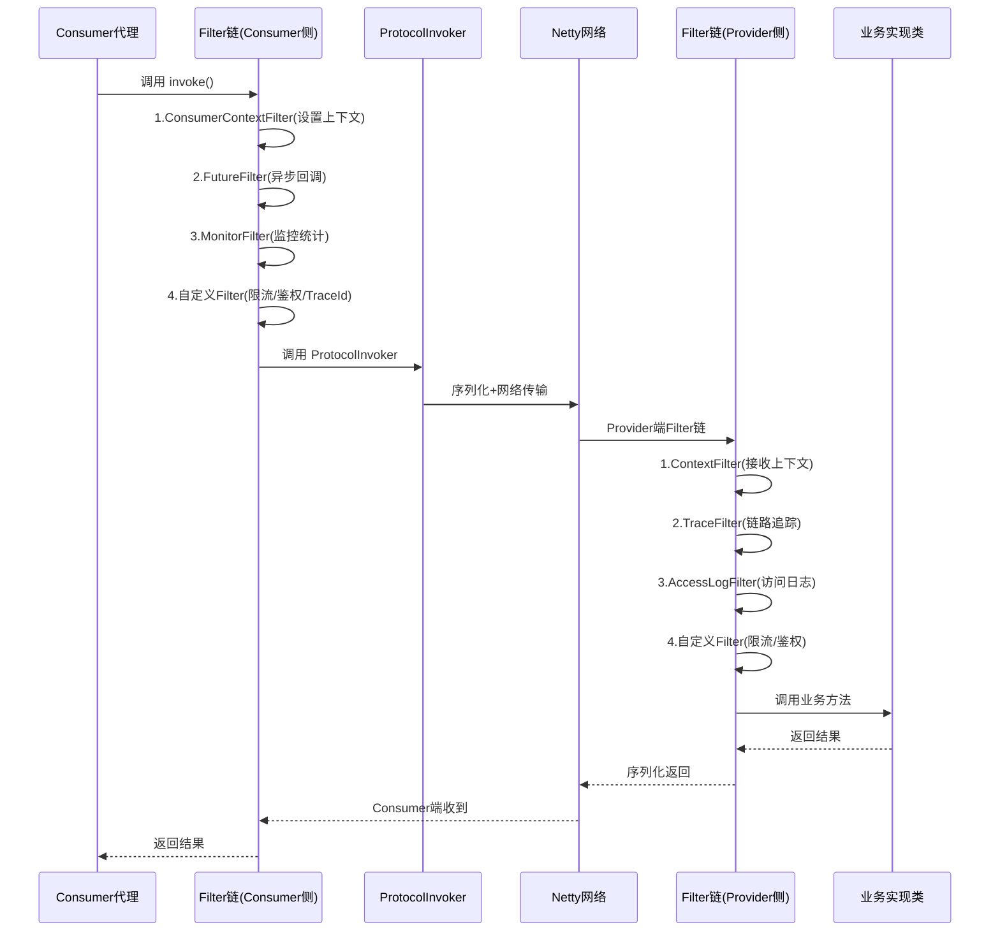

### 14.2 自定义 Filter 示例

```java
// 自定义 TraceId 透传 Filter
@Activate(group = {CommonConstants.CONSUMER, CommonConstants.PROVIDER})
public class TraceIdFilter implements Filter {
    
    @Override
    public Result invoke(Invoker<?> invoker, Invocation invocation) throws RpcException {
        // Consumer 侧：注入 TraceId 到 RPC 上下文
        if (RpcContext.getContext().isConsumerSide()) {
            String traceId = MDC.get("traceId");
            if (traceId == null) {
                traceId = generateTraceId();  // 雪花算法生成
            }
            RpcContext.getContext().setAttachment("traceId", traceId);
        }
        
        // Provider 侧：从 RPC 上下文取出 TraceId
        if (RpcContext.getContext().isProviderSide()) {
            String traceId = RpcContext.getContext().getAttachment("traceId");
            if (traceId != null) {
                MDC.put("traceId", traceId);
            }
        }
        
        try {
            return invoker.invoke(invocation);  // 调用下一个 Filter 或业务
        } finally {
            MDC.remove("traceId");
        }
    }
}

// 配置：META-INF/dubbo/org.apache.dubbo.rpc.Filter
// traceId=com.example.TraceIdFilter
// 在 dubbo.properties 或 application.yml 激活
```

**【深度拓展】Filter 链的执行顺序**
- **Consumer 侧**：`ProtocolFilterWrapper` 构建 Filter 链，`@Activate(order=...)` 决定顺序（值小先执行），自定义 Filter 通常 order=-1000~0。
- **Provider 侧**：`ProtocolFilterWrapper` 构建 Filter 链，内置 Filter（ContextFilter/ExceptionFilter/TimeoutFilter）有固定 order。
- **Filter 链是"洋葱模型"**：外层 Filter 先进入后退出，内层 Filter 后进入先退出——所以限流 Filter 要在外层（先拦截再执行），日志 Filter 可以在内层（记录执行详情）。

### 14.3 Dubbo 线程模型详解

```mermaid
graph TD
  NET["Netty IO 线程<br/>(BossGroup)"] --> ACCEPT["Accept 连接"]
  ACCEPT --> WORKER["Netty Worker 线程<br/>(NioEventLoopGroup)"]
  WORKER --> READ["读取数据/解码"]
  READ --> DISPATCH{"是否IO线程处理?"}
  DISPATCH -->|"是(默认)" --> ALLDISPATCH["AllDispatcher<br/>IO线程直接处理"]
  DISPATCH -->|"否"| BIZDISPATCH["Dispatcher策略"]
  BIZDISPATCH --> DIRECT["DirectDispatcher<br/>IO线程处理"]
  BIZDISPATCH --> MESSAGE["MessageOnlyDispatcher<br/>业务线程池处理消息"]
  BIZDISPATCH --> EXECUTION["ExecutionDispatcher<br/>业务线程池执行"]
  BIZDISPATCH --> CONNECTION["ConnectionOrderedDispatcher<br/>连接事件独立线程池"]
  
  MESSAGE --> POOL["业务线程池<br/>(fixed/cached/limited)"]
  EXECUTION --> POOL
  POOL --> BIZ["调用业务实现类"]
  BIZ --> RESULT["返回结果"]
```

**Dubbo 线程模型关键点**：
- **IO 线程 vs 业务线程分离**：Netty IO 线程只做编解码和网络 IO，不做业务逻辑——业务慢不能阻塞 IO 线程（否则所有连接的读写都卡住）。
- **默认 Dispatcher**：`AllDispatcher`——所有消息都交业务线程池处理（IO 线程最轻量）。
- **线程池类型**：`fixed`（固定 200，默认）、`cached`（弹性但可能无限涨）、`limited`（有上限的弹性）。
- **线程耗尽**：拒绝策略默认 `AbortPolicy`（抛 RejectedExecutionException），配合 Failover/熔断处理。

**【面试官追问】**
- "为什么 IO 线程不能做业务？" → IO 线程处理所有连接的网络事件，一个 IO 线程被业务阻塞，它管理的所有连接（可能几万）都卡住。
- "Dubbo 线程池满了怎么排查？" → 看监控（活跃线程数/队列长度），通常是下游慢导致线程堆积。根因是"超时太长+没熔断+没隔离"。
- "怎么做线程池隔离？" → 不同接口/方法配独立线程池（`<dubbo:protocol threadpool="..." threads="..." />`），一个慢接口不拖垮其他接口。

**【项目支撑】**
XTransfer 收款 Provider 按"渠道调用/核心入账/通知回调"拆分独立线程池（舱壁隔离）：渠道调用走慢但有限流+熔断保护的池，核心入账走独占高性能池，通知走异步异步队列——慢渠道绝不会占满核心入账池。这和高可用篇"舱壁隔离"是同一套思想，也是防止"一个慢依赖拖垮整个服务"的标准做法。

---

## 15. 微服务治理实战清单

| 治理维度 | 手段 | 工具/组件 | XTransfer 落地 |
| --- | --- | --- | --- |
| 服务发现 | 注册中心 | Nacos(AP) | 临时实例+本地缓存 |
| 配置管理 | 配置中心 | Nacos(CP) | 限流规则/渠道开关热更 |
| 负载均衡 | 客户端 LB | Dubbo LeastActive | 核心链路自适应负载 |
| 集群容错 | Failover/Failfast | Dubbo 内置 | 读 Failover, 写 Failfast |
| 限流 | 令牌桶+滑动窗口 | Sentinel | 渠道 QPS 限流 |
| 熔断 | 断路器状态机 | Sentinel | 慢调用比例熔断 |
| 降级 | 兜底/Mock | Sentinel + Mock | 渠道挂走备用渠道 |
| 链路追踪 | TraceId 透传 | Micrometer + TTL | 跨 RPC/HTTP/MQ 全链路 |
| 灰度发布 | 标签路由 | Dubbo tag route | 按商户灰度新版本 |
| 线程隔离 | 独立线程池 | Dubbo 线程模型 | 渠道/入账/通知舱壁 |
| 超时控制 | 超时+重试 | Dubbo timeout+retries | 支付写 Failfast 不重试 |

**【面试官追问】**
- "你们服务治理体系怎么搭的？" → 不只说"用了 Sentinel/Nacos"，要讲清"为什么这样分层"：注册发现用 AP（可用优先），配置用 CP（一致优先），限流熔断在 Filter 层（无侵入），链路追踪在 Filter 注入（全链路透传）。
- "微服务拆分原则？" → 按业务领域拆（DDD 限界上下文），不是按技术层拆。XTransfer 按"收款/风控/账务/渠道"领域拆分，每个域独立部署、独立演进。
- "服务间通信怎么保证不丢？" → 同步 RPC + 超时 + 重试（仅幂等）+ 熔断；异步 MQ + 本地消息表 + 消费确认。支付核心用同步拿结果，衍生动作用 MQ 异步。

---

## 面试高频问答（标准回答）

**Q：你们微服务是怎么做服务发现的？注册中心选型怎么考虑的？**
> 我们用 Nacos（兼顾 CP 配置 + AP 发现）。选 AP 型发现的理由：服务发现宁可返回稍旧列表也不能因注册中心选主而全站不可用（CAP 里 P 必然发生）。强一致诉求（如分布式锁、关键配置）才用 ZK/etcd 的 CP。

**Q：Dubbo 调用为什么要设超时？不设会怎样？**
> 不设超时会无限等待，线程一直被占，最终线程池耗尽 → 整个 Provider 不可用（雪崩）。超时 + 合理重试（仅幂等）+ 熔断，三者缺一不可。我们支付链路非幂等写用 Failfast 立即失败。

**Q：Spring Cloud 那么多组件，版本怎么管理？**
> 严格对齐 **Spring Boot ↔ Spring Cloud ↔ Spring Cloud Alibaba** 的版本矩阵（官方 release train，如 2022.0.x 配 Boot 3.x）。错配会出 `NoSuchMethodError` 等诡异问题。我们用 Dependencies BOM 统一管理，禁止散装引版本。

**Q：你们怎么防止服务雪崩？**
> 多层：**入口限流**（Gateway/Sentinel 令牌桶）→ **熔断**（依赖异常比例超阈值快速失败）→ **降级**（返回兜底/Mock）→ **超时+隔离**（线程池/信号量舱壁）。配合全链路压测和 SLO 告警（见高可用容灾篇）。

---

## 更多高频追问（补充）

**Q：一次 Dubbo 调用的完整链路是怎样的？**
> Consumer 调用接口 → 代理（`Proxy`）→ `Cluster`（集群容错）选一台 → `LoadBalance` 负载均衡 → `Router` 路由过滤 → `Filter` 链（限流/鉴权/监控）→ `Protocol` 发起远程调用 → `Serialization` 序列化 → `Transport`（Netty）→ 网络 → Provider 反向解码 → 线程池派发 → 反射调用实现类 → 结果原路返回。理解这条链是回答"Dubbo 十层架构"和"在哪扩展"的基础。

**【深度拓展】**
- **Filter 链是可插拔的"横向扩展点"**：限流、鉴权、TraceId 注入、降级 Mock 全在这里。理解"在哪扩展"比背链路更重要——面试官问"你们怎么加全链路追踪"，答案就是"在 Consumer/Provider 的 Filter 里注入/透传 TraceId"。
- **Cluster 层的"多节点→单 Invoker"抽象**：容错（Failover/Failfast）和负载均衡都在这一层，调用方完全无感。这也是为什么"重试必须幂等"——Failover 默认会换节点重试，非幂等写就 double。
- **跨线程上下文丢失是经典坑**：链路里若用线程池异步处理，ThreadLocal 里的 TraceId/租户信息会丢，要用 `TransmittableThreadLocal`（阿里开源）传递。这和 MQ 消费、异步回调是同一类问题。
- **面试官追问**："Consumer 端线程模型？" → 调用线程 vs I/O 线程分离，业务在 I/O 线程反序列化后交给业务线程池；"长连接怎么复用？" → 单连接多路复用，请求携 requestId 匹配响应。

**【项目支撑】**
XTransfer 内部核心交易用 Dubbo/Triple RPC，链路追踪就是在 Filter 里注入 Micrometer 的 TraceId 并透传；渠道调用串起"限流 Filter（Sentinel）+ 熔断 + 幂等键"，非幂等写用 Failfast 立即失败。哈啰工单/薪资、欧凡商品/库存/账户的服务间调用也都走这条标准 Dubbo/Feign 链路。

**Q：Dubbo 的 SPI 和 JDK SPI 有什么区别？**
> JDK SPI（`ServiceLoader`）会**一次性实例化所有实现**，且无法按名取用、不支持依赖注入。Dubbo SPI 改进：① **按 key 懒加载**（用到才实例化）；② 支持 **IOC/AOP**（自动注入其他扩展、Wrapper 包装）；③ 支持 **自适应扩展**（`@Adaptive`，运行时按参数选实现）；④ 支持 **激活扩展**（`@Activate` 按条件批量生效，如 Filter）。这是 Dubbo 高扩展性的基石。

**【深度拓展】**
- **懒加载为什么重要**：JDK SPI 一次性 `new` 出所有实现，哪怕你只用其中一个——重实现（如带连接池的协议）会被无辜实例化浪费资源。Dubbo 按 key 懒加载，且 Wrapper 包装链只套在真正被用的扩展上。
- **@Adaptive 是"运行期路由"**：URL 里 `protocol=dubbo` 就选 DubboProtocol，不用改代码、不用重启。这和"策略模式 + 注册表"的区别在于——注册也自动化了，连显式注册都省。
- **和我们业务 SPI 的关系**：XTransfer 收款产品的 SPI（VA/收单/A2A/电商）思想同源——都是"扩展点接口 + 自动发现 + 零改核心"。区别是业务 SPI 在领域层（六边形架构的端口适配器），Dubbo SPI 在框架层。
- **面试官追问**："如果让你设计一套扩展机制？" → 接口 + 配置文件（key=实现）+ 懒加载 + 可选自适应路由 + Wrapper 链式包装，这套就是标准答案。

**【项目支撑】**
XTransfer 收款产品用 SPI 扩展（VA/收单/A2A/电商各一个实现，新增产品零改核心），和 Dubbo SPI 的"自动发现 + 开闭原则"思想一致。欧凡活动系统也用策略模式（与 SPI 同源）接多款活动，新增活动只加策略类。两者都体现了"把变化关进扩展点"。

**Q：注册中心挂了，还能正常调用吗？**
> 能。Consumer 本地有**已订阅服务列表的缓存**（内存 + 磁盘文件），注册中心宕机期间仍可用缓存的地址继续调用，只是无法感知新上下线。这是"注册中心非强依赖"的设计——它只负责服务发现，不在调用链路上。所以注册中心可用性要求可以低于业务本身。

**【深度拓展】**
- **控制面 vs 数据面**：注册中心是"控制面"（告诉你在哪），调用是"数据面"（实际传输）。优秀的微服务设计让控制面故障不影响已建立的数据面——这正是 AP 型发现的优势。
- **缓存的"过期"问题**：注册中心挂了，新上线的节点调用方感知不到（可能流量不均），下线的节点缓存里还在（可能调到已死的实例）。后者靠"调用失败 + 重试其他节点/熔断"兜底，所以"注册中心挂"≠"调用全挂"，但会有短暂不均衡。
- **面试官追问**："如果注册中心挂了，我新发了一个版本上去，能生效吗？" → 不能，因为无法感知新地址；"这和 CAP 怎么对应？" → 服务发现选 AP，宁可返回旧列表也不因选主全不可用。
- **关联**：这和 MQ 的"本地消息表"思路一致——把"强依赖"降级为"最终一致 + 兜底"，系统更韧。

**【项目支撑】**
XTransfer 用 Nacos 做注册/配置，Consumer 端有服务列表缓存，注册中心短暂不可用期间核心交易 RPC 仍能基于缓存地址调用；配合 Dubbo 的 Failover（换节点重试）+ 熔断，单点注册中心故障不会阻断资金主链路。

**Q：Nacos 的 AP 和 CP 模式怎么选？**
> Nacos 支持两种一致性协议：**AP（Distro 协议）**用于临时实例（服务发现，追求可用性，允许短暂不一致）；**CP（Raft 协议）**用于持久化实例和配置中心（追求强一致）。服务注册默认用临时实例走 AP——服务发现场景下"多一个少一个节点"可容忍，但不能因为一致性检查拒绝服务。配置管理走 CP 保证配置准确。

**【深度拓展】**
- **为什么"发现用 AP、配置用 CP"**：服务发现偶发"多/少一个节点"最多导致短暂不均衡，可接受；但配置（如开关、限流阈值）必须全集群一致，错配可能导致大面积故障——所以配置要强一致（CP）。这是"按数据重要性选一致性"的典型权衡。
- **临时实例 vs 持久化实例**：临时实例靠心跳保活（心跳停=下线，AP）；持久化实例注册后永久存在（CP，如 DB 类基础设施）。选错类型 = 心跳抖动误删健康实例，或故障实例一直不剔除。
- **面试官追问**："ZK 和 Nacos 在一致性上的取舍？" → ZK 全程 CP（选主期间不可写，强一致但可用性略低），Nacos 分开处理（发现 AP、配置 CP），更贴合微服务；"你们配置中心怎么保证不丢？" → CP + 持久化 + 多副本。

**【项目支撑】**
XTransfer 注册/配置都用 Nacos：服务发现走临时实例（AP，注册中心抖动不影响调用），关键配置（限流规则、渠道开关）走 CP 强一致，且规则支持热更新（Sentinel + Nacos 动态配置），不用发版就能调限流阈值——这在大促应急时特别有用。

**Q：Feign 和 Dubbo 在性能上的差异根源是什么？**
> Feign（OpenFeign）基于 **HTTP + JSON**，走完整 HTTP 协议栈，文本序列化、有请求头开销；Dubbo 默认 **TCP 长连接 + 二进制（Hessian/Protobuf）**，单连接多路复用、序列化紧凑。所以同等条件下 Dubbo 吞吐更高、延迟更低。但 Feign 的 HTTP 通用性好、跨语言友好、调试直观。选型看"内部高性能 RPC"还是"通用异构互通"。

**【深度拓展】**
- **性能差在哪几处**：①序列化（JSON 文本 vs Hessian/Protobuf 二进制，体积和 CPU 差数倍）；②连接（HTTP 短连接握手 vs TCP 长连接多路复用）；③协议头（HTTP 大量文本头 vs 紧凑二进制头）；④多路复用（单连接并发 vs 每请求一连接）。
- **但"性能"不是唯一标准**：Feign/HTTP 胜在跨语言、易调试、前后端友好。所以真实架构是"网关/对外用 HTTP，内部高频用 Dubbo"共存，而非二选一。
- **面试官追问**："Dubbo 为什么不用 JSON？" → 体积大（带宽）、慢（CPU）、无强类型；"Triple 协议解决了什么？" → 基于 HTTP/2 + Protobuf，兼容 gRPC、跨语言，补齐了传统 Dubbo 偏 Java 的短板（见网络篇 Protobuf 部分）。
- **关联拓展**：这正好对应"网络篇"里 Protobuf vs JSON、HTTP/2 多路复用的底层原理。

**【项目支撑】**
XTransfer 是"Cloud 做门面（Spring Cloud Gateway 边界用 HTTP）+ Dubbo 做内功（内部核心交易走 Dubbo/Triple 二进制长连接）"的共存架构：对外渠道/商户用 HTTP 异步回调，内部收款/账务高频调用走 Dubbo 拿强一致结果，性能与通用性兼得。

**Q：如果让你从 0 设计一个 RPC 框架，要考虑哪些点？**
> 五大模块：① **协议**（自定义 header：魔数/版本/序列化类型/消息类型/请求 id/body 长度，解决粘包）；② **序列化**（可插拔，默认高性能二进制）；③ **网络传输**（Netty，长连接 + 多路复用 + 心跳）；④ **服务治理**（注册发现、负载均衡、集群容错、超时重试、熔断限流）；⑤ **动态代理**（对调用方透明）。再加上可扩展的 SPI 机制和 Filter 链。这个回答能体现你对 RPC 的整体把握，是加分题。

**【深度拓展】**
- **协议设计是地基**：header 里必须有"魔数（防粘包错乱）+ 消息类型（请求/响应/心跳）+ 请求 id（匹配异步响应）+ body 长度（解决 TCP 粘包拆包）"。这直接对应网络篇的"长度域拆包"。
- **异步化是性能关键**：调用不能阻塞 I/O 线程，用 Future/CompletableFuture 把"发请求"和"等响应"解耦，请求携 requestId，响应回来按 id 唤醒对应 Future。否则单连接无法多路复用。
- **容错要内建而非外挂**：超时、重试（仅幂等）、熔断、降级都应是框架能力（Filter/Cluster 层），业务无感。这正是 Dubbo 把容错做在 Cluster 层的原因。
- **面试官追问**："怎么防粘包？" → 长度域（Netty LengthFieldBasedFrameDecoder）；"怎么保证请求响应对应？" → requestId 映射；"跨语言怎么办？" → 用 Protobuf/IDL 定义契约（见网络篇）。

**【项目支撑】**
XTransfer 内部 RPC 用的就是这套标准模型：Dubbo/Triple 协议（魔数+版本+序列化类型+requestId）、Netty 长连接多路复用、Nacos 注册发现、Sentinel 熔断限流、Filter 注入 TraceId。我们对外渠道用 HTTP + Protobuf（Triple 兼容 gRPC），跨境弱网场景也吃到了 HTTP/2 多路复用的红利（见网络篇 QUIC 部分）。

---

## 16. 微服务通信模式全景对比

RPC 只是微服务通信的一种模式，面试官常追问"RPC vs MQ vs HTTP 怎么选"。

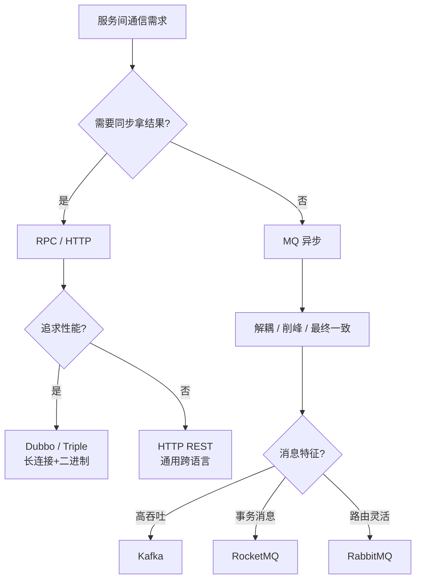

| 通信模式 | 同步/异步 | 协议 | 性能 | 解耦程度 | 典型场景 |
| --- | --- | --- | --- | --- | --- |
| Dubbo RPC | 同步 | Dubbo/Triple | **最高** | 低（直接依赖） | 核心交易拿结果 |
| HTTP REST | 同步 | HTTP/JSON | 中 | 低 | 跨语言/对外API |
| MQ 消息 | 异步 | AMQP/自定义 | 高(削峰) | **最高** | 衍生动作/最终一致 |
| 事件总线 | 异步 | 发布订阅 | 高 | 最高 | 领域事件驱动 |

**选型决策**：
- **核心链路同步拿结果** → RPC（XTransfer 收款：渠道调用→风控→记账走 Dubbo）
- **交易完成后的衍生动作** → MQ 异步（XTransfer：记账成功后发 MQ 通知/对账/报表）
- **对外/跨团队** → HTTP REST（渠道接口/商户 API）
- **跨语言混合** → gRPC/Dubbo Triple（Protobuf IDL 做契约）

**【深度拓展】"同步拿结果"为什么不能用 MQ？**
- MQ 是"发出去不管结果"的模型，要做"同步拿结果"需要 **RPC over MQ**（发消息等回执），复杂度暴增。
- MQ 的延迟不确定性（消费堆积、重试）不适合"用户等结果"的场景。
- 但 MQ 天然适合"解耦+削峰+最终一致"——支付完成后通知商户、对账、风控异步分析。

**【项目支撑】**
XTransfer 的典型通信分层：
1. **同步 RPC**：用户发起收款 → 渠道调用 → 风控评分 → 入账（Dubbo 同步拿结果，强一致）
2. **异步 MQ**：入账成功后 → 发 MQ 通知商户 → 对账数据写入 → 风控异步分析 → 报表更新（解耦+削峰+最终一致）
3. **HTTP 回调**：渠道异步回调用 HTTP（渠道是外部系统，HTTP 是通用协议）
4. **定时任务**：T+1 对账、状态补偿用 XXL-JOB 定时调度（兜底最终一致）

---

## 17. Dubbo 3 应用级注册深度分析

Dubbo 2 到 Dubbo 3 最大的架构变化之一是"接口级注册 → 应用级注册"。

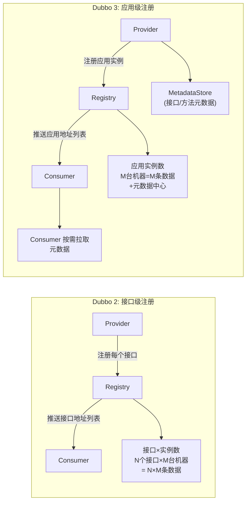

**为什么改应用级注册？**
- **注册中心压力**：接口级注册，一个应用有 100 个接口 × 100 台实例 = 10000 条数据；应用级注册只有 100 条 + 元数据。大规模集群下注册中心内存和网络推送压力指数级下降。
- **与 Spring Cloud 对齐**：Spring Cloud 一直是应用级注册，Dubbo 3 对齐后可与 SC 互发现。
- **元数据分离**：接口/方法定义放元数据中心（按需拉取），注册中心只存"应用实例地址"。

**【面试官追问】**
- "接口级注册有什么问题？" → 大规模集群下注册中心数据量爆炸，推送压力大，地址变更触发全量推送。
- "应用级注册怎么找到接口？" → Consumer 先从注册中心拿应用实例列表，再从元数据中心拉取接口定义（MetadataInfo），映射成 Invoker。
- "迁移到 Dubbo 3 痛点？" → 旧版本接口级注册和新版本应用级注册共存期间需要兼容，Dubbo 3 提供了双注册迁移方案。

---

## 18. 高级面试题深度追问

### Q16：Dubbo 的异步调用怎么实现？和同步调用有什么区别？

**标准回答**：Dubbo 支持三种调用方式：
- **同步**：调用线程阻塞等待结果（默认），内部是 NIO + `Future.get()` 阻塞。
- **异步**：`CompletableFuture` / `AsyncRpcResult`，调用线程不阻塞，结果回来后回调。
- **参数回调**：Provider 执行完后回调 Consumer 传入的 Callback 方法。

```java
// 同步调用（默认）
String result = userService.getUser(userId);

// 异步调用（Dubbo 3 推荐 CompletableFuture）
CompletableFuture<User> future = userService.getUserAsync(userId);
future.thenAccept(user -> {
    // 结果回来后处理
    System.out.println("用户: " + user);
});
// 调用线程继续做别的，不阻塞
```

**【深度拓展】**
- **同步本质也是异步**：Dubbo 底层 NIO 发出请求后用 `Future` 等结果，同步调用只是 `future.get()` 阻塞调用线程。真正的网络 IO 是非阻塞的。
- **CompletableFuture 的优势**：避免线程阻塞（节省线程池资源）、可链式组合（`thenApply/thenCompose`）、可设置超时（`future.get(timeout)`）。
- **Dubbo 3 的异步改进**：原生返回 `CompletableFuture`（不再需要 RPCContext 的异步设置），和 Java 8+ 的异步编程模型无缝集成。

**【项目支撑】**
XTransfer 收款链路中，渠道调用是异步的（`CompletableFuture<ChannelResponse>`），等渠道返回的同时可以做别的（如写入审计日志），不阻塞调用线程。风控评分也是异步的，多个风控规则并行执行后 `CompletableFuture.allOf` 合并结果——这比串行调用快几倍。

### Q17：Dubbo 和 Spring Cloud 如何混合使用？Spring Cloud Alibaba 是什么？

**标准回答**：`dubbo-spring-cloud` 项目让 Dubbo 和 Spring Cloud 无缝整合：
- **服务发现**：Dubbo 用 Spring Cloud 的注册中心（Nacos/Consul），而非自己维护一套。
- **配置管理**：Dubbo 配置用 Spring Cloud Config / Nacos 统一管理。
- **通信方式**：内部高频调用走 Dubbo RPC（高性能），边界/对外走 Spring Cloud Gateway。
- **治理组件**：用 Sentinel 做限流熔断（Dubbo 和 SC 都能接入）。

**Spring Cloud Alibaba** 是阿里基于 Spring Cloud 规范的组件集：
- Nacos（注册+配置）、Sentinel（限流熔断）、Seata（分布式事务）、RocketMQ（消息）、Dubbo（RPC）。
- 让 Spring Cloud 生态也能用阿里的中间件，不用绑定 Netflix（Eureka/Hystrix/Ribbon 已停更）。

### Q18：微服务架构中，什么时候需要 Service Mesh？

**标准回答**：Service Mesh（Istio/Linkerd）用 Sidecar 代理拦截流量，做流量治理、安全、可观测性，**对业务无侵入**。适合：
- **多语言混合**：Java/Go/Python 都需要统一的流量治理，不可能每个语言装一套 Sentinel。
- **统一治理需求**：金丝雀发布、熔断、链路追踪、mTLS 要跨所有服务统一配置。
- **存量改造**：老旧服务不想改代码但需要治理。

**但 Service Mesh 有代价**：
- **Sidecar 性能开销**：每跳多一跳 Sidecar 代理，增加 1-3ms 延迟。
- **运维复杂度高**：Istio 控制面、Envoy 配置、版本升级、排障都更难。
- **小规模不值得**：纯 Java 团队、服务数 < 50，用 Dubbo/Sentinel 更简单高效。

**Dubbo 3 的 Proxyless 模式**：不部署 Sidecar，Dubbo 直接连 Istio 控制面（xDS 协议），拿到治理规则后在 SDK 内执行——兼顾 Mesh 的统一治理和零 Sidecar 开销。

**【面试官追问】**
- "你们用 Service Mesh 吗？" → 没有大规模用，XTransfer 是纯 Java 团队，Dubbo + Sentinel 已经覆盖治理需求；但关注 Istio 的 Proxyless 模式作为未来演进方向。
- "Sidecar 模式和 Proxyless 怎么选？" → 多语言选 Sidecar（语言无关），纯 Java 选 Proxyless（性能优先）。

---

## 19. 速记卡（面试前扫一遍）

| 关键词 | 一句话记忆 |
| --- | --- |
| RPC vs HTTP | 二进制长连接 vs 文本短连接，内部高性能 vs 对外通用 |
| Dubbo 十层 | 配置→代理→注册→集群→协议→交换→传输→序列化 |
| Dubbo SPI | 按需加载+@Adaptive自适应+IOC/AOP，JDK SPI全量加载 |
| 注册中心选 AP | 宁可旧列表也不选主不可用，Nacos AP(Distro)/CP(Raft) |
| 负载6策略 | 随机/轮询/加权/最少活跃数/一致性哈希/最短响应 |
| 容错5策略 | Failover(读)/Failfast(写)/Failsafe(日志)/Failback(通知)/Broadcast |
| Sentinel三熔断 | 慢调用比例/异常比例/异常数，HalfOpen探测 |
| Dubbo Triple | HTTP/2+Protobuf，兼容gRPC，跨语言 |
| 线程模型 | IO线程只编解码，业务线程池执行，fixed默认200 |
| 通信选型 | 核心同步RPC，衍生异步MQ，对外HTTP |
| Mesh vs Proxyless | Sidecar多语言无侵入+开销，Proxyless纯Java高性能 |

> 相关阅读：[网络：TCP 与 RPC 实践](./准备-网络TCP与RPC实践.md)（粘包/Protobuf/QUIC）、[消息队列 MQ 面试准备](./准备-消息队列MQ面试准备.md)（RPC vs MQ）、[分布式事务与一致性](./准备-分布式事务与一致性.md)（Seata + Dubbo）、[高可用容灾与稳定性](./准备-高可用容灾与稳定性.md)（熔断/限流/降级）、[XTransfer 跨境支付复盘](./准备-XTransfer跨境支付收款平台深度复盘.md)。

---

# 20. 全新四个角度（故障复盘 / 横向对比 / 量化指标 / 答题框架）

> 前面把"RPC 与微服务治理"的原理与对比讲透了，这一节把"面试现场怎么打"讲透。十年经验的价值，是在高压下面试官面前把**事故讲成故事、把选型讲成决策、把容量讲成数字、把追问讲成框架**。

## 【故障复盘】真实事故案例库

> 微服务故障的共性：**单点慢 → 线程堆积 → 雪崩扩散**。下面三起是 RPC 体系里最高频的真实事故形态，统一按"背景 → 触发 → 影响面(量化) → 定位(工具) → 止血 → 根因修复 → 长效预防"七段式讲。

### 案例一：Provider 线程池打满引发雪崩

- **背景**：XTransfer 收款核心 Provider 默认 `fixed 200` 线程池，下游依赖某银行渠道（平均 RT 300ms，偶发 3s）。
- **触发**：大促期间银行渠道 RT 飙到 **8s**（渠道侧拥堵），超时设成了 10s。
- **影响面（量化）**：核心入账 Provider 活跃线程 200/200 **打满**，新请求 `RejectedExecutionException` 拒绝率 **+40%**；上游调用方（网关）超时率 **+25pp**，资金主链路 P99 从 400ms 涨到 **9s**，部分收款单卡单。
- **定位**：① Dubbo Admin / 监控看活跃线程 200、队列堆积 1200；② `Arthas` `thread -b` 抓到大量线程阻塞在渠道 HTTP 调用；③ 链路追踪（Micrometer + traceId）定位到慢在"渠道调用"这一跳；④ 渠道监控确认其 RT P99=8s。
- **止血**：临时把渠道调用超时从 10s 降到 2s + 对该渠道**限流**（令牌桶 100 QPS）+ 渠道熔断（异常比例 > 50% 走 Open）；释放被占线程。
- **根因修复**：① 渠道调用拆到**独立线程池（舱壁隔离）**，不占满核心入账池；② 超时设 2s + 非幂等写 Failfast 不重试；③ 渠道熔断 + 降级到备用渠道。
- **长效预防**：线程池活跃度 > 80% 告警；渠道 RT P99 > 1s 即评估熔断；核心/非核心链路**物理线程池隔离**。

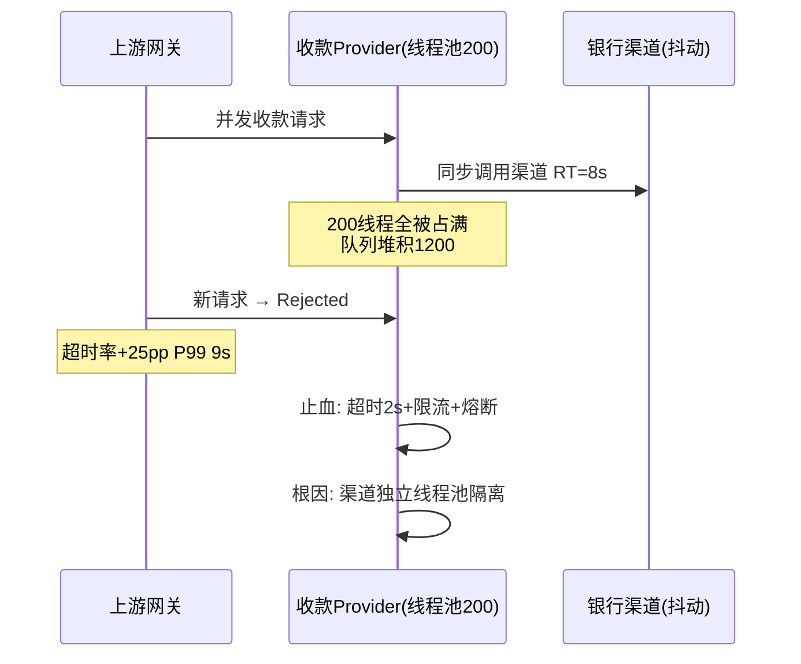

### 案例二：注册中心网络分区导致误摘除

- **背景**：Nacos 集群 3 节点（AP 模式 Distro），服务发现靠心跳保活。
- **触发**：机房网络抖动，Nacos 节点 B 与 A/C 短暂分区（持续 40s），B 上部分心跳未续约。
- **影响面（量化）**：B 误判一批 Provider **下线（SDOWN）**，把"瘦"服务列表推给部分 Consumer，导致这些 Consumer **流量倾斜到剩余节点**，热点节点 CPU 从 40% 涨到 **95%**，错误率 **+12pp**，持续约 1 分钟。
- **定位**：① Nacos 控制台看节点 B 的"不健康实例"数异常跳变；② Consumer 端日志显示订阅到的地址数骤减；③ 网络监控确认 B 与 A/C 分区。
- **止血**：网络恢复后 Nacos 自动重新推送正确列表；对热点节点临时扩容 + 限流。
- **根因修复**：① 心跳 `down-after-milliseconds` 由 5s 调到 15s（容忍短暂抖动）；② 摘除前加"连续 N 次探测失败"才判定下线（防抖）；③ Consumer 端对"服务列表骤减 > 30%"做**不采纳 + 保留旧列表**保护。
- **长效预防**：注册中心跨可用区部署；摘除保护 + 列表骤变告警；Consumer 本地缓存兜底。

### 案例三：序列化不兼容导致灰度发布失败

- **背景**：Dubbo Hessian 序列化，Provider 升级新增了一个**必填字段**（无默认值）。
- **触发**：灰度 10% 流量到新 Provider，老 Consumer（未升级）调用新 Provider。
- **影响面（量化）**：灰度机器该接口错误率 **100%**（反序列化抛 `NoSuchFieldException`/类型不匹配），10% 用户下单失败；5 分钟内自动回滚。
- **定位**：① 新 Provider 日志 `HessianProtocolException`；② 对比 `.proto`/接口定义，发现字段变更未按兼容规则（加字段应带默认值、不能改字段编号）。
- **止血**：立即回滚灰度节点，流量 100% 回老版本。
- **根因修复**：① 序列化契约纳入 **CI 兼容性校验**（加字段必须有默认值、不得复用编号）；② 灰度用**接口级双版本共存**（新旧字段都兼容）；③ 推动核心接口切 **Protobuf/Triple（强 schema + tag 兼容）**。
- **长效预防**：发布前跑"新老版本双向序列化兼容测试"；接口变更走评审。

---

## 【横向对比】技术选型决策

> 面试官问"为什么选 Dubbo 不选 gRPC""注册中心为什么用 Nacos"，本质在测**决策能力**。下面给几组对比表 + 决策树，核心是讲清 trade-off。

### 对比一：RPC 框架（Dubbo vs gRPC vs Spring Cloud Feign）

| 维度 | Dubbo 3 | gRPC | Spring Cloud(Feign) |
| --- | --- | --- | --- |
| 协议 | Dubbo/Triple(HTTP/2) | HTTP/2+Protobuf | HTTP/1.1+JSON |
| 性能 | 高（二进制长连接） | 高 | 中 |
| 跨语言 | Triple 可，传统偏 Java | **30+ 语言一等** | HTTP 天然跨语言 |
| 服务治理 | **内置**（路由/限流/熔断/SPI） | 需 xDS/Envoy | 靠生态组件 |
| 流式 | Triple 支持 | **原生 4 种流** | 不原生 |
| 适用 | 纯 Java 高性能内网 | 混合语言/云原生 | Spring 生态快迭代 |

### 对比二：注册中心（Nacos vs ZK vs etcd）

| 维度 | Nacos | ZooKeeper | etcd |
| --- | --- | --- | --- |
| 一致性 | CP+AP 双模 | CP | CP |
| 服务发现 | AP(Distro) 高可用 | 强一致但选主期不可写 | 强一致 |
| 配置中心 | ✅ 一体化 | ❌（需配） | 需配 |
| 适用 | 微服务首选 | 锁/强约束 | K8s 云原生 |

**为什么选 Nacos 而非 ZK**：服务发现是 AP 场景（宁可旧列表也不能选主全不可用），Nacos 发现走 Distro 更贴合；同时配置走 CP(Raft) 保证强一致，**一套组件覆盖发现+配置**，ZK 要另搭配置中心。代价是 Nacos 运维心智略复杂，但收益是一致性按数据重要性分层。

### 对比三：负载均衡策略对比（已在第 5 节详述，此处给决策）

| 策略 | 选它当 | 不选当 |
| --- | --- | --- |
| 最少活跃数 | 关心真实负载、异构节点 | 节点数极小（轮询足够） |
| 一致性哈希 | 有状态/本地缓存亲和 | 无状态且节点频繁变动 |
| 加权轮询 | 机器配置差异大 | 同构集群 |
| 最短响应 | 对延迟敏感 | 统计窗口抖动明显 |

### 对比四：熔断框架（Sentinel vs Hystrix vs Resilience4j）

| 维度 | Sentinel | Hystrix(停更) | Resilience4j |
| --- | --- | --- | --- |
| 限流算法 | 滑动窗口+令牌桶 | 信号量/线程池 | 令牌桶/信号量 |
| 熔断策略 | 慢调用/异常比例/异常数 | 异常比例/超时 | 异常比例/慢调用 |
| 生态 | Dubbo 深度整合+Dashboard | 已停更 | Spring 官方 |
| 可视化 | ✅ 控制台 | ❌ | ⚠️ 需接 Prometheus |

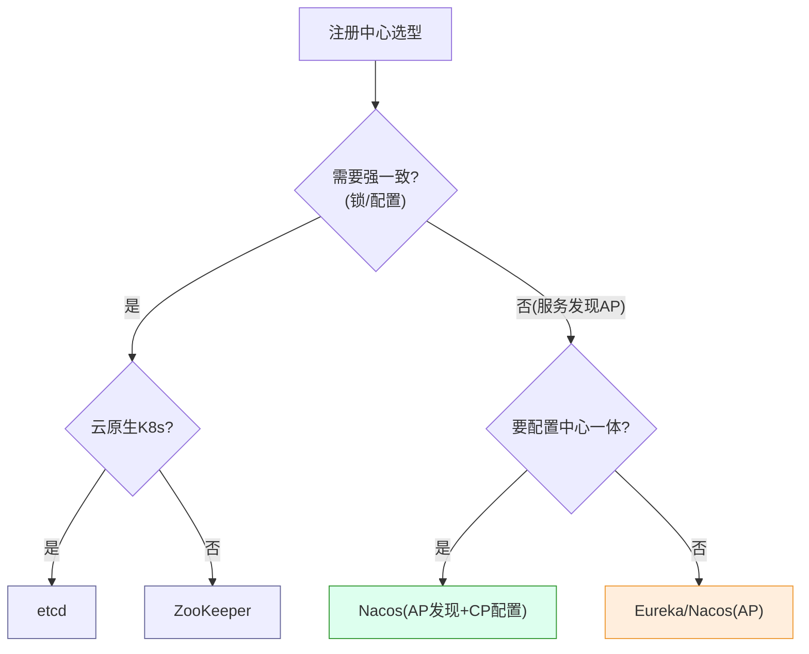

---

## 【量化指标】SLA 设计与成本收益

> 微服务治理不能拍脑袋，所有阈值都要有"预算基线"。下面给出 RPC 链路的 RT 预算、超时、线程池容量评估与告警基线。

### 一次 RPC 调用的 RT 预算分解（支付核心链路）

```
用户可接受总 RT 预算: 1s
  ├─ 网关鉴权/限流:        20ms
  ├─ 风控评分(异步并行):   150ms
  ├─ 渠道调用(外部,最慢):  400ms  ← 超时设 2s, 但预算只给 400ms
  ├─ 账务入账(本地事务):   50ms
  ├─ 序列化/网络(内网):    5ms × 跳数
  └─ 余量(抖动/重试一次):  剩余
→ 经验法则: 单跳超时 ≈ 该跳预算 × 3~5, 且总和 < 用户预算
→ 渠道 400ms 预算 → 超时设 2s(允许一次网络重传), 但不阻塞线程太久
```

### 超时设置原则（量化）

| 调用类型 | 预算 RT | 建议超时 | 重试 | 说明 |
| --- | --- | --- | --- | --- |
| 内网同机房 RPC | < 20ms | 200ms | 可(幂等) | 超时过长=线程被占 |
| 内网跨机房 RPC | < 50ms | 500ms | 可(幂等) | 容忍网络抖动 |
| 外部渠道调用 | < 400ms | 2s | 否(非幂等写) | Failfast 防 double |
| 本地方法 | < 5ms | 100ms | — | 异常即失败 |

### 线程池容量评估（Provider 端）

```
假设: 单 Provider 目标吞吐 2000 TPS, 平均处理 20ms(IO密集,含渠道等待)
→ 理想并发 = TPS × 平均RT = 2000 × 0.02 = 40 个并发
→ 为抗突发+安全余量, 线程池 core 取 40 × 3 ≈ 120, max 200, 队列 200
→ 若渠道 RT 恶化到 200ms(10倍): 并发 = 2000×0.2 = 400 > 200 → 必须靠限流/熔断而非加线程
→ 结论: 线程数治标, 超时+熔断+隔离治本
```

### 告警阈值基线（可直接配监控）

- 线程池活跃度 > 80% 持续 1min → 告警；队列堆积 > 容量 80% → 页面对外降级
- 渠道 RT P99 > 1s → 评估熔断；错误率 > 5% → 熔断 Open
- 服务列表骤减 > 30% → 不采纳 + 告警（防误摘除）
- 注册中心节点失联 → 立即告警（控制面故障）

### 成本收益示例（舱壁隔离）

```
现状: 渠道调用与核心入账共用 fixed 200 线程池
风险: 渠道抖动 → 200 线程全占 → 入账主链路雪崩(资损级)
方案: 拆 3 个池(渠道 100 / 入账 60 / 通知 40)
→ 开发成本: ~3 人日
→ 收益: 渠道雪崩被隔离, 入账 P99 稳定 < 100ms, 0 次主链路卡单
→ 结论: 隔离的代价是少量内存/线程开销, 收益是"资金主链路不被拖垮"——绝对值得
```

---

## 【答题框架】面试表达模板

> 被问 RPC/微服务题时，白板/口述的标准打法：**定调 → 原理 → 落地 → 边界权衡**，最后用逃生话术兜底。

### 白板：先画一次 RPC 调用全链路时序图

被问"一次 Dubbo 调用发生了什么"，第一件事是画下面这张图——比背文字得分高得多：

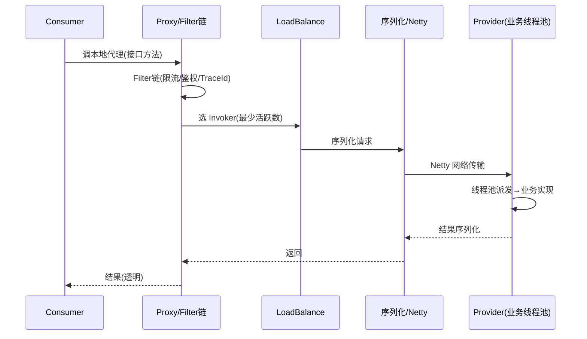

**口述顺序**：① 代理把接口调用转网络请求 → ② Cluster 层容错+负载均衡把"多节点"封装成一个逻辑 Invoker → ③ 序列化+Netty 多路复用 → ④ Provider 端 Filter 链→线程池派发→业务 → ⑤ 原路返回。讲完这张图，再展开"线程池打满怎么雪崩""超时+熔断怎么治"。

### 分层回答套路（以"怎么防服务雪崩"为例）

1. **定调**："雪崩是同步调用链层层放大，治法是'入口限流 + 熔断 + 降级 + 隔离'四件套。"
2. **原理**：限流控入口（令牌桶）、熔断在依赖故障时快速失败（Circuit Breaker 状态机）、降级走兜底、隔离（线程池/信号量舱壁）防单依赖拖垮全局。
3. **落地**：XTransfer 渠道调用独立线程池 + Sentinel 慢调用比例熔断 + 非幂等写 Failfast + Nacos 限流规则热更；每笔收款单 traceId 贯穿全链路。
4. **边界权衡**：熔断阈值不能拍脑袋（错误率+RT+最小请求数）；CallerRuns 会拖慢上游但资金任务不能丢；隔离增加内存开销但保主链路——**代价换可用性**。

### STAR 叙事模板（最典型追问："讲一次服务雪崩怎么处理的"）

```text
S: 大促某银行渠道 RT 从300ms飙到8s, 收款Provider线程池200打满
T: 防止资金主链路雪崩, 把P99从9s降回400ms内
A: ① 止血: 渠道超时10s→2s + 令牌桶限流 + 异常比例熔断
   ② 根因: 渠道调用拆独立线程池(舱壁), 不占核心入账池
   ③ 非幂等写Failfast不重试, 防double-charge
   ④ 长效: 线程活跃>80%告警 + 渠道RT P99>1s评估熔断
R: 主链路P99回400ms, 拒绝率40%→0, 0资损0卡单
```

### 被追问到不会时的逃生话术

- "Service Mesh 我们没大规模上，但我理解 Sidecar 多一跳 +1~3ms、运维复杂，纯 Java 团队用 Dubbo+Sentinel 已覆盖；未来看 Istio Proxyless。"（**承认未实践 + 给原理框架**）
- "Dubbo 3 应用级注册的元数据同步细节我落地不多，但我理解核心是把'接口×实例'降为'应用×实例+元数据分离'，注册中心压力指数级下降。"（**给大框架 + 略去细节**）
- "具体某个 Sentinel 源码分支我回去查，不过我们生产用它的慢调用比例熔断，阈值是基于错误率+RT+最小请求数配的，不是拍脑袋。"（**锚回真做过的点**）

> 逃生三原则：**不硬编、给框架、拉回项目**。RPC 题尤其要能锚定到"线程池隔离/熔断/超时/链路追踪"这些你真做过的点。

<!-- EXPANDED -->
