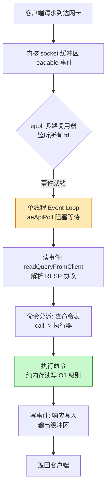
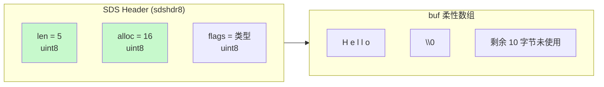
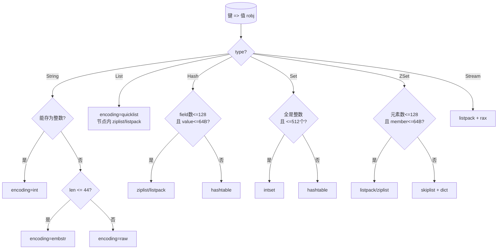
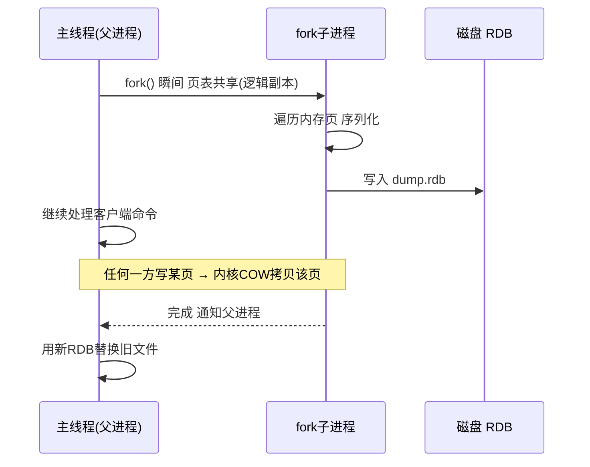
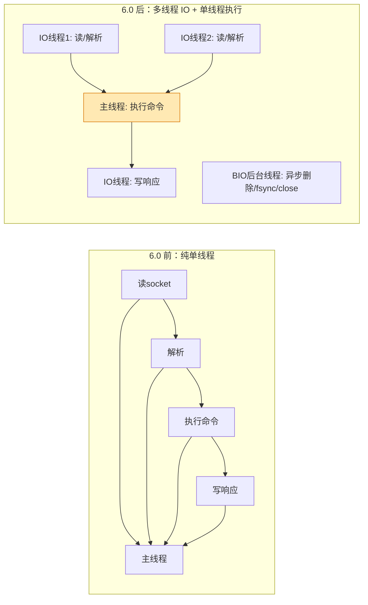
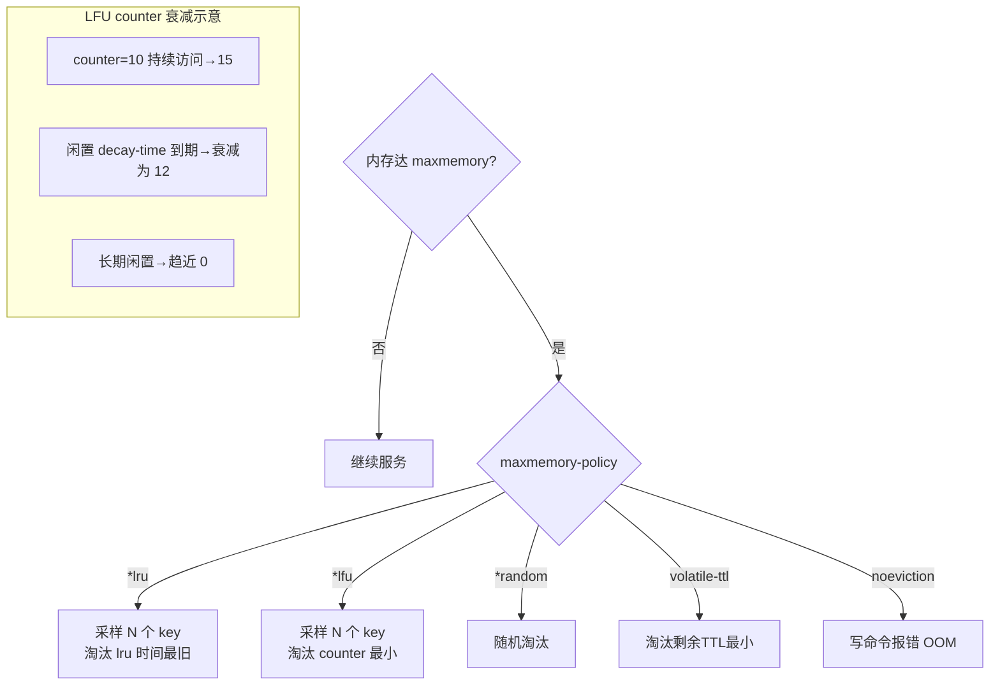
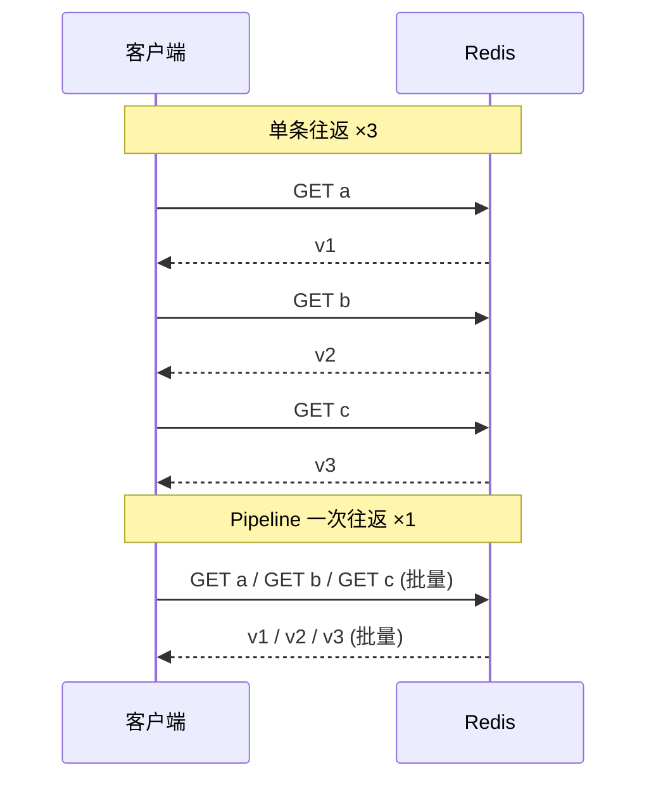

> 作者 ｜ 10 年 Java 后端工程师，内容基于多个一线互联网公司的真实项目实战沉淀。
> 定位：本篇是《MySQL 与 Redis 高频面试》合并文的 **Redis 专项深化**——聚焦底层原理与数据结构，更深、更专、带大量图解与实战，避免和合并文简单重复。

---

## 写在前面：为什么需要这篇"加深版"

在合并文里，我们把 Redis 当成一个"用得熟、知道怎么配"的缓存中间件来聊。但面试官一旦问到"**ZSet 为什么用跳表而不是红黑树？**""**ziplist 的级联更新到底有多坑？**""**RDB 的 fork + COW 在内存翻倍时到底发生了什么？**"，仅靠"会用"就不够了。

这一篇的目标，是把 Redis 从"应用层认知"拉到"内核心智模型"：

- 你知道 `SET` 存的是 `String`，但你知道它底层可能是 `int`/`embstr`/`raw` 三种编码之一吗？
- 你知道 `HASH` 快，但你知道它在 512 个 field 以内用 `ziplist/listpack`、超过就退化成 `hashtable` 吗？
- 你知道 AOF 持久化，但你知道 `BGREWRITEAOF` 为什么能"瘦身"、混合持久化为什么能同时拿到 RDB 的快速和 AOF 的安全吗？

下面我们一层一层拆。

---

## 一、Redis 为什么快（总体概览）

先给结论，再给证据。Redis 的"快"不是玄学，而是四个工程选择叠加的结果：

1. **纯内存操作**：所有数据驻留内存，避免磁盘寻道与页交换。内存随机访问延迟约 100ns 量级，SSD 随机读是微秒级，差 1~2 个数量级。
2. **单线程处理命令**：6.0 之前网络 IO 与命令执行都是单线程。没有锁竞争、没有上下文切换、没有死锁风险。CPU 不是瓶颈，瓶颈在网络 IO 与内存带宽。
3. **IO 多路复用（epoll/kqueue）**：一个线程监听上万连接，事件驱动，避免"一连接一线程"的线程爆炸。
4. **高效数据结构**：SDS、跳表、ziplist、quicklist、intset……每一个都为"在内存里又快又省"做过针对性设计，而非直接套用教科书结构。

### 1.1 单线程事件循环 + epoll 多路复用流程

下面这张图展示了一个客户端请求从"到达网卡"到"返回响应"在 Redis 单线程模型里的流转：



要点：**事件循环是单线程的，所有命令串行执行**。所以 Redis 命令本身必须是 O(1) 或可控复杂度的——任何 O(N) 的命令（如 `KEYS *`、`HGETALL` 大 Hash）都会阻塞整个实例。这也是后面"BigKey 危害"章节的底层逻辑。

### 1.2 一个常见误区

> "单线程 = 只能用一个核？"

不是。Redis 6.0 之后把**网络读写**（IO）多线程化了，但**命令执行**仍是单线程。一个 Redis 实例实际会用到多个核：主线程 + 多个 IO 线程 + 后台 BIO 线程（惰性删除、AOF fsync、关闭 fd）。只是"执行命令"这一环保持单线程，以保证命令的原子性与实现简单。详见第六章。

---

## 二、SDS 与 C 字符串的本质差异

这是 Redis 一切数据结构的基石。Redis 用 C 写的，但**没有直接用 C 原生字符串（`char*`）**，而是自己实现了一套 `SDS`（Simple Dynamic String，简单动态字符串）。

### 2.1 SDS 的结构

Redis 5 及之前，SDS 大致是这样（简化）：

```c
struct sdshdr {
    int len;     // 已使用的字节数（字符串长度）
    int alloc;   // 已分配的总容量（不含头部和 \0）
    char buf[];  // 柔性数组，存实际数据，末尾有 \0
};
```

Redis 3.2 之后为了省内存，把长度字段按实际大小分了 5 种头部（`sdshdr5/8/16/32/64`），用 `flags` 的低 3 位标记类型。以 `sdshdr8` 为例：

```c
struct __attribute__ ((__packed__)) sdshdr8 {
    uint8_t len;     // 长度 1 字节
    uint8_t alloc;   // 容量 1 字节
    uint8_t flags;   // 类型标记（低3位）
    char buf[];
};
```

### 2.2 SDS 内存布局



### 2.3 SDS 相比 C 字符串的四大优势

| 维度 | C 字符串 (`char*`) | SDS |
| --- | --- | --- |
| **获取长度** | O(N)，遍历到 `\0` | O(1)，直接读 `len` |
| **二进制安全** | 不安全的，遇 `\0` 截断 | 安全的，`len` 界定边界，可存图片/压缩数据 |
| **缓冲区溢出** | `strcat` 等易溢出 | 修改前 `sdsMakeRoomFor` 检查 `alloc`，不足先扩容 |
| **内存重分配** | 每次增长/缩短都 realloc | **预分配 + 惰性释放**，减少 realloc 次数 |

**预分配（空间换时间）**：
- 若修改后 `len < 1MB`，分配 `len * 2` 的 `alloc`（翻倍）。
- 若 `len >= 1MB`，额外多分配 1MB（`alloc = len + 1MB`）。

**惰性释放**：缩短字符串时不立即缩容，只是把 `len` 改小，多出来的空间留在 `alloc` 里，下次增长可复用，避免频繁 realloc。真正要释放时由 `sdsfree` / 惰性回收逻辑处理。

### 2.4 为什么用 C 字符串会"二进制不安全"

C 字符串以 `\0` 作为结尾标记。如果你的数据里刚好有个字节是 `0x00`（比如一张 JPEG 的前几个字节），`strlen` 会在那里截断。Redis 要存任意二进制（序列化对象、protobuf、压缩数据），必须用 `len` 来界定，这就是 SDS 的"二进制安全"。

> 面试提示：当你说"Redis 的 String 底层是 SDS"时，面试官很可能追问"那和 Java 的 `String` 一样吗？"——不一样。Java `String` 不可变且内部是 `byte[]`+`coder`，SDS 是**可变、带长度、带预分配**（类似 `StringBuilder` 的扩容策略），且为节省内存做了 5 种头部优化。

---

## 三、Redis 对象与六种类型的底层编码

Redis 并没有直接把"字符串/列表"暴露成底层结构，而是包了一层 `redisObject`，所有键值对的值都是它。

### 3.1 redisObject 结构（Redis 5 之前经典版）

```c
typedef struct redisObject {
    unsigned type:4;       // 类型：string/list/hash/set/zset/stream
    unsigned encoding:4;   // 编码：raw/int/embstr/ziplist/hashtable...
    unsigned lru:24;       // LRU/LFU 时钟或访问计数（用于淘汰）
    int refcount;          // 引用计数（共享对象）
    void *ptr;             // 指向实际底层数据结构
} robj;
```

- `type`：对外暴露的 6 种类型之一。
- `encoding`：**真正的底层实现**。同一个 `type` 可以有多种 `encoding`（例如 String 有 int/embstr/raw）。
- `lru`：24 位，记录对象最后访问时间（LRU）或 LFU 的访问频次衰减信息。
- `refcount`：引用计数，实现对象共享（如小整数 0~9999 共享）。

### 3.2 六大类型的编码全景

| 类型(type) | 可能的编码(encoding) | 说明 |
| --- | --- | --- |
| String | `int` / `embstr` / `raw` | 整数 / 短字符串 / 长字符串 |
| List | `quicklist`（3.2+，内含 `ziplist`/`listpack`） | 3.2 起废除 linkedlist，用 quicklist |
| Hash | `ziplist`/`listpack`(小) → `hashtable`(大) | 阈值控制 |
| Set | `intset`(纯整数小) → `hashtable`(大) | 纯整数优化 |
| ZSet | `listpack`/`ziplist`(小) + `skiplist+dict`(大) | 跳表+字典双结构 |
| Stream | `listpack` + `rax`(基数树) | 消费组用 `listpack` 存 pending |

### 3.3 String：int / embstr / raw 三种编码

- **int**：值是能用 `long` 表示的整数（如 `SET n 10086`），直接存整数，最省。
- **embstr**：长度 ≤ 44 字节的字符串，一次性分配 `redisObject` + SDS 连续内存，**只读**，修改时转 raw。
  - 为什么是 44？`redisObject`(16B) + `sdshdr8`(3B) + `\0`(1B) = 20B，64B 的 `jemalloc` 分配单元减去 20B 剩 44B 给 `buf`。
- **raw**：长度 > 44 字节，或 embstr 被修改后转为 raw，`redisObject` 与 SDS 分开两次分配。

### 3.4 List：quicklist（ziplist + linkedlist 的折中）

早期 List 是 `ziplist`（小数据）或 `linkedlist`（大数据）。3.2 起统一为 **quicklist**：一个双向链表，每个节点是一个 `ziplist`（7.0 后改为 `listpack`）。

```
quicklist
  ├── quicklistNode (zl bytes) -> [ziplist: entry entry entry]
  ├── quicklistNode (zl bytes) -> [ziplist: entry entry]
  └── quicklistNode (zl bytes) -> [ziplist: entry entry entry entry]
```

参数：`list-max-ziplist-size`（单个节点 ziplist 大小，可正负控制 KB/元素数）、`list-compress-depth`（两端各 N 个节点不压缩，中间压缩）。

### 3.5 Hash：ziplist/listpack → hashtable

- 满足 `hash-max-ziplist-entries`（默认 128）且 `hash-max-ziplist-value`（默认 64 字节）时用 `ziplist`/`listpack`（紧凑、省内存）。
- 任一不满足，升级为 `hashtable`（标准链式哈希表，O(1) 查找）。

### 3.6 Set：intset → hashtable

- 全是整数且元素数 ≤ `set-max-intset-entries`（默认 512）时，用 `intset`（有序整数数组，二分查找）。
- 否则升级为 `hashtable`（value 为 NULL）。

### 3.7 ZSet：skiplist + dict 双结构（重点）

ZSet 同时需要：
- **按分值排序、范围查找** → 跳表（`skiplist`）。
- **按 member 查分值（O(1)）** → 字典（`dict`，key=member, value=score）。

Redis 用**跳表 + 字典**同时维护，两者通过指针共享同一批 `member/score` 对象（不重复存数据）。

```
ZSet
├── dict:    member -> score     (O1 查分值，判重)
└── skiplist:(score, member) 有序链
        L3:  head ----------------------------> 节点
        L2:  head -------> 节点 -----> 节点 -----> 节点
        L1:  head -> 节点 -> 节点 -> 节点 -> ... -> 节点 -> NIL
```

跳表每个节点除了前向/后向指针，还有 `level[]` 数组（每层一个前进指针 + `span` 跨度）。`span` 记录两节点间跨过的节点数，支持 `ZRANK` 等排名计算 O(log N)。

### 3.8 Stream：listpack + rax

Stream 是 5.0 引入的流式类型，用于消息队列 / 事件溯源。底层：
- 消息体用 `listpack` 紧凑存储。
- 索引用 `rax`（基数树，Radix Tree）按 `streamID` 建索引，支持范围扫描。
- 消费组的 `PEL`（pending entries list）记录已读未 ACK 的消息。

### 3.8.1 Stream 消费组常用命令（实战）

```bash
# 追加消息，* 让 Redis 自动生成 streamID(毫秒时间-序号)
XADD mystream * sensor-id 1234 temperature 19.8

# 创建消费组，从最新($)或开头(0)开始
XGROUP CREATE mystream g1 $

# 消费（组内消费者 c1 读取，> 表示未投递给本组的新消息）
XREADGROUP GROUP g1 c1 COUNT 10 STREAMS mystream >

# 确认已处理
XACK mystream g1 1660000000000-0

# 查看 pending（已读未 ACK）
XPENDING mystream g1

# 消息堆积超时需要转移/认领
XCLAIM mystream g1 c2 60000 1660000000000-0
```

Stream 相比 List 做队列的优势：① 支持**消费组多消费者负载均衡**；② 消息**可持久、可按 ID 随机访问**；③ 自动维护 PEL 防丢消息。缺点是内存占用比 List 略高，且单 stream 过大也会成为瓶颈（需按业务分片）。

### 3.9 编码映射与转换决策图



> **工程提醒**：编码转换是**单向**的（升级容易、降级难），升级后即使数据变少也不会回退。所以"上线初期数据小、用 ziplist，后期变大自动升级 hashtable"是常态，但反过来不会自动瘦身——必要时手动 `debug object` 或重建。

### 3.10 实战：用 OBJECT ENCODING 观察编码转换

光看理论不够，自己开一个 Redis 验证最直观。下面是真实可复现的命令行：

```bash
# String：整数 → int
SET n 10086
OBJECT ENCODING n          # "int"

# String：短字符串(<=44B) → embstr
SET s "hello world, this is redis"
OBJECT ENCODING s          # "embstr"

# String：长字符串(>44B) → raw
SET big "这是一段超过四十四字节的中文字符串用于触发raw编码xxxxxxxxxxxxxxx"
OBJECT ENCODING big        # "raw"

# Hash：小数据 → listpack/ziplist
HSET h f1 v1 f2 v2
OBJECT ENCODING h          # "listpack"(7.0+) 或 "ziplist"

# Hash：突破阈值 → hashtable
# 循环写入 >128 个 field 或 value >64B 后
OBJECT ENCODING h          # "hashtable"

# Set：纯整数小集合 → intset
SADD ints 1 2 3
OBJECT ENCODING ints       # "intset"

# Set：混入非整数或超限 → hashtable
SADD ints "abc"
OBJECT ENCODING ints       # "hashtable"

# ZSet：小 → listpack/ziplist；大 → skiplist
ZADD z 1 a 2 b
OBJECT ENCODING z          # "listpack" / "ziplist"
```

还可以用 `DEBUG OBJECT key` 看 `serializedlength`、`lru`、`refcount` 等更底层信息（生产慎用 DEBUG，部分子命令有副作用）。这套"先看编码、再压测、再定阈值"的方法，是调优 Redis 内存的第一步。

### 3.11 为什么需要多种编码？——内存与性能的权衡

同一个 `type` 用不同 `encoding`，本质是**空间换时间**的连续谱：

- `ziplist/listpack`、`intset` 是**紧凑编码**：连续内存、无指针开销，省内存但增删改需要整体移动/重编码，复杂度偏高（O(N) 移动）。
- `hashtable`、`skiplist`、`linkedlist` 是**指针结构**：每个元素有独立节点 + 指针，内存开销大，但单点操作 O(1)/O(log N)，适合大数据量。

Redis 的聪明之处：数据量小时用紧凑编码省内存（大部分 key 其实都不大），一旦超过阈值自动升级为指针结构保性能。你**可以调大阈值**让更多 key 留在紧凑编码（更省内存、但单命令更慢），也可以调小（更快、但更费内存）——这就是 `redis.conf` 里那几个 `*-max-*-entries/value` 参数的调优意义。`- Redis 7.0 起这些参数统一前缀为 `*-max-listpack-*`，旧名 `ziplist` 仍兼容。

---

## 四、持久化：RDB

RDB（Redis Database）是某一时刻内存数据的**二进制快照**。

### 4.1 SAVE vs BGSAVE

| 命令 | 执行线程 | 是否阻塞 | 适用 |
| --- | --- | --- | --- |
| `SAVE` | 主线程 | **阻塞**整个实例 | 维护/紧急，生产禁用 |
| `BGSAVE` | fork 子进程 | 主线程不阻塞 | 生产默认 |

### 4.2 fork + 写时复制（COW）

`BGSAVE` 核心靠操作系统的 **fork + Copy-On-Write**：

- `fork()` 瞬间，子进程获得父进程内存空间的"逻辑副本"（页表共享）。
- 父子任一修改某内存页时，内核才**真正拷贝那一页**（COW），未修改的页继续共享。
- 子进程遍历自己的内存页，序列化写入 RDB 文件；父进程继续服务请求。



### 4.3 RDB 文件格式与压缩

- 二进制格式（非文本），魔数 `REDIS` 开头，含版本、辅助字段、`EOF`、校验和。
- 字符串/值经 **LZF 压缩**（小对象也可 `rdbcompression` 关闭）。
- 优点：**紧凑、体积小、恢复极快**（直接加载到内存，比 AOF 重放快得多）、适合全量备份/主从第一次同步。
- 缺点：快照是**时间点**的，**最后一次快照之后的写入会丢失**（取决于 `save` 间隔）。`fork` 时若内存大、页表复制本身有开销，且有 COW 期间内存可能短暂翻倍的风险。

### 4.4 触发策略与关键配置

- 配置文件 `save 900 1`（900 秒至少 1 次修改）、`save 300 10`、`save 60 10000`。
- `FLUSHALL` 会生成空 RDB（慎用）；主从全量同步时主节点自动 `BGSAVE`。

`redis.conf` 中与 RDB 相关的关键项：

```ini
save 900 1            # 900s 内至少 1 次写则触发 BGSAVE
save 300 10
save 60 10000
stop-writes-on-bgsave-error yes  # BGSAVE 失败则停止写入（防数据只存内存）
rdbcompression yes    # LZF 压缩字符串
rdbchecksum yes       # 文件末尾 CRC64 校验
dbfilename dump.rdb
dir /data/redis       # RDB/AOF 存放目录
```

运维补充：RDB 文件损坏可用 `redis-check-rdb dump.rdb` 校验/尝试修复；`BGSAVE` 期间可用 `INFO persistence` 看 `rdb_bgsave_in_progress`、`latest_fork_usec`（fork 耗时，大内存实例这项很关键）。

> **fork 耗时警告**：`latest_fork_usec` 在大内存实例（几十 GB）上可能达到数百毫秒甚至秒级——这段时间主线程被阻塞在 fork 上。若观察到周期性毛刺且 `latest_fork_usec` 大，需考虑拆分实例、关闭透明大页（THP，会拖慢 COW）、或降低快照频率。

---

## 五、持久化：AOF

AOF（Append Only File）记录**每一个写命令**，以 RESP 协议文本追加到文件。

### 5.1 三种 appendfsync

| 策略 | 行为 | 安全性 | 性能 |
| --- | --- | --- | --- |
| `always` | 每条命令 fsync | 最多丢 0 条 | 最慢（每次磁盘同步） |
| `everysec`（默认） | 每秒 fsync 一次 | 最多丢 1 秒 | 平衡 |
| `no` | 交给 OS 刷盘 | 不可控 | 最快 |

> 生产默认 `everysec`：后台线程每秒 fsync，即使宕机最多丢 1 秒数据，且主线程不阻塞。

### 5.2 AOF 重写（BGREWRITEAOF）

问题：AOF 会无限膨胀（比如对同一个 key `INCR` 一万次，文件里有一万条命令）。重写解决它：

- `BGREWRITEAOF` 同样 `fork` 子进程。
- 子进程**读当前内存状态**，生成"能重建当前数据集的最小命令集"（如对某 Hash 一条 `HSET` 全量字段，而非历史增量）。
- 重写期间的新写入，父进程同时写入**旧的 AOF** 与**重写缓冲区（aof_rewrite_buf）**。
- 子进程完成后，父进程把重写缓冲区追加到新 AOF，原子替换旧文件。

### 5.3 混合持久化（4.0+，推荐）

痛点：RDB 恢复快但丢数据，AOF 不丢但恢复慢（重放命令）。**混合持久化**（`aof-use-rdb-preamble yes`）把两者优点合体：

- AOF 重写时，文件**前半段是 RDB 格式**（某个时间点的全量快照）。
- **后半段是 AOF 增量**（RDB 之后产生的写命令）。
- 重启加载：先加载 RDB 部分（快），再重放 AOF 增量（少，补最后一点），兼顾速度与安全。

```mermaid
flowchart TD
    subgraph WRITE["AOF 写入流程"]
        C[客户端写命令] --> B[AOF 缓冲区]
        B -->|"everysec"| FS[后台 fsync 线程]
        FS --> F[appendonly.aof]
    end
    subgraph REWRITE["BGREWRITEAOF 重写"]
        R1[fork 子进程] --> R2[读内存生成最小命令集]
        R2 --> R3[新 AOF(含RDB头)]
        NC[重写期间新写命令] --> RB[aof_rewrite_buf]
        RB --> R3
        R3 --> R4[原子替换旧AOF]
    end
    subgraph RELOAD["重启加载（混合持久化）"]
        L1[读取 AOF 文件] --> L2{开头是 RDB?}
        L2 -->|是| L3[先加载 RDB 全量快照]
        L3 --> L4[再重放 RDB 之后的 AOF 增量]
        L2 -->|否| L5[逐条重放 AOF 命令]
    end
```

> 生产建议：**开 AOF（`appendonly yes`）+ 混合持久化 + everysec**。纯 RDB 方案用于"允许丢几分钟数据"的纯缓存场景；RDB+AOF 双开用于"不能丢数据"的核心业务（如 XTransfer 限额计数）。

### 5.4 AOF 关键配置速查

```ini
appendonly yes                 # 开 AOF
appendfilename "appendonly.aof"
appendfsync everysec           # always/everysec/no
no-appendfsync-on-rewrite no   # 重写时是否暂停 fsync( yes 省 IO 但更易丢 )
auto-aof-rewrite-percentage 100 # 体积比上次重写增长 100% 触发
auto-aof-rewrite-min-size 64mb   # 且文件至少 64MB 才触发
aof-use-rdb-preamble yes       # 混合持久化(4.0+)
aof-rewrite-incremental-fsync yes # 重写时每 32MB 增量 fsync，平滑磁盘
```

### 5.5 故障恢复与校验

- AOF 文件损坏（如宕机截断）可用 `redis-check-aof --fix appendonly.aof` 截取有效前缀恢复。
- 启动时若同时有 RDB 和 AOF（混合持久化），Redis **优先用 AOF**（AOF 数据更新），这一点容易记反——RDB 仅作 AOF 文件头部的全量快照，整体仍属 AOF 体系。

---

## 六、线程模型与 IO 多路复用

### 6.1 单线程处理命令（核心）

6.0 前，Redis 的网络 IO 与命令执行都在**一个主线程**里完成：

- **无锁**：所有命令串行执行，不需要互斥。
- **无上下文切换**：不会被调度打断，CPU 缓存命中率高。
- **实现简单**：不用考虑并发安全的复杂分支。

那为什么不用多线程加速命令执行？因为 Redis 的瓶颈通常**不在 CPU**（内存操作很快），而在网络 IO 与内存带宽；多线程引入的锁竞争、原子性保证反而会拖慢或增加复杂度。命令执行串行也保证了 Lua 脚本、事务的天然原子性。

### 6.2 6.0 多线程 IO

Redis 6.0 引入**多线程网络 IO**：把"读 socket / 解析协议 / 写响应"这些**网络处理**交给多个 IO 线程并行做，但**命令执行仍在主线程串行**。

- 配置：`io-threads 4`（IO 线程数，不含主线程）、`io-threads-do-reads yes`（默认只多线程写，开启多线程读）。
- 收益：在高并发大 Value 场景（网络吞吐瓶颈）下显著提升 QPS。
- **命令执行仍然是单线程**，所以"单线程"这个本质没变，原子性保证不变。

### 6.3 7.0 及后台线程

- 主从复制的socket读写、UNLINK/FLUSHALL 的大 key 异步删除，交给 **BIO 后台线程**，避免阻塞主线程。
- 惰性删除、close 文件描述符等也走后台线程。



> 面试提示：被问"Redis 是单线程吗？"——答"**命令执行是单线程，网络 IO 在 6.0 后多线程化，另有后台线程处理删除/刷盘**"，比一句"单线程"更专业。

---

## 七、过期删除与内存淘汰

缓存不能无限增长，Redis 用两层机制控制内存：**过期删除**（针对设了 TTL 的 key）+ **内存淘汰**（针对内存达到 maxmemory）。

### 7.1 过期删除：惰性 + 定期

- **惰性删除（访问时）**：客户端访问某 key 时，先检查 `expires` 字典是否过期，过期则删掉返回 nil。优点零开销，缺点"冷 key 永不过期、占内存"。
- **定期删除（周期采样）**：`server.hz`（默认 10，每秒 10 次）触发，每次随机抽 `ACTIVE_EXPIRE_CYCLE_LOOKUPS_PER_LOOP`（默认 20）个带 TTL 的 key，删除过期的；若过期比例 > 25% 则再循环一轮（自适应，避免堆积）。这是"折中"策略：既不全量扫描（慢），也不完全不管（内存泄漏）。

### 7.2 内存淘汰 8 大策略

当 `used_memory > maxmemory` 时，按 `maxmemory-policy` 选 key 淘汰：

| 策略 | 作用范围 | 淘汰目标 | 场景 |
| --- | --- | --- | --- |
| `noeviction` | — | 不淘汰，写报错 | 不能丢数据（默认，但生产常改） |
| `volatile-lru` | 仅设 TTL 的 | 最近最少用 | 缓存+持久混合 |
| `allkeys-lru` | 全部 key | 最近最少用 | 纯缓存（最常用） |
| `volatile-lfu` | 仅设 TTL 的 | 最少频率用 | 热点明显 |
| `allkeys-lfu` | 全部 key | 最少频率用 | 阿里推荐（见下） |
| `volatile-random` | 仅设 TTL 的 | 随机 | — |
| `allkeys-random` | 全部 key | 随机 | — |
| `volatile-ttl` | 仅设 TTL 的 | 剩余 TTL 最小 | 越快过期越先走 |

### 7.3 LRU 近似算法 vs LFU

**Redis 的 LRU 是近似 LRU（sampled LRU）**，不是精确 LRU：

- 精确 LRU 需要全局链表，淘汰时 O(1) 取尾部，但维护成本高。
- Redis 在每次淘汰时，**随机采样 `maxmemory-samples`（默认 5）个 key**，从中挑 `lru` 时间最老的淘汰。采样越大越接近精确 LRU，但越慢。

**LFU（Redis 4.0+）**：记录访问**频率**而非"最近一次时间"，更贴合"热点"语义：

- 每个对象有 8 位 `counter`（0~255）记录访问频次。
- 访问时 `counter` 按概率递增（计数器越大越难加，对数增长）。
- 随时间**衰减**（`lfu-decay-time`）：长时间不访问，counter 下降。
- 这样能区分"昨天访问 100 次、今天 0 次"和"最近 5 分钟访问 5 次"——后者更该留。



> 为什么阿里推荐 `allkeys-lfu`？在真实流量里，热点 key 的"访问频率"比"最近访问时间"更能代表价值。LRU 容易被一次大批量扫描（扫到冷 key 把它变成"最近访问"）误淘汰热点；LFU 看累积频率，抗扫描干扰更强。

---

## 八、工程实践

### 8.1 BigKey 危害与识别

**BigKey 定义**（经验值）：String > 10KB；Hash/Set/ZSet/List 的 field/element 数 > 5000（或总字节 > 几十 MB）。

**危害**：
- 单次序列化/反序列化慢，`DEL` 阻塞主线程（大 key 删除耗时 O(N)，6.0 前直接卡死）。
- 网络包过大，占用带宽、引发超时。
- 扩容/迁移（如 cluster reshard）时搬运大 key 慢，造成集群抖动。

**识别**：
- `redis-cli --bigkeys`：采样扫描，输出各类型 Top 大 key（注意是采样，不是全量）。
- `redis-cli --memkeys`（部分版本）/ `MEMORY USAGE key`：看单 key 内存占用。
- 监控：`redis-cli info` 的 `largest_key`、慢日志 `SLOWLOG`。

**拆分方案**：
- 大 Hash → 按 `hash:%d` 分片（如 `user:123:day:20260712`）。
- 大 List → 按时间/序号分多个 List。
- 大 Set → 同分片思路。
- 大 String（长 JSON）→ 业务层拆分字段，或换成 Hash 存字段。

### 8.2 热点 Key

**现象**：某个 key 访问量远超其他，单节点 CPU/带宽打满（尤其 cluster 下落在单一 slot 的节点）。

**方案**：
- **本地缓存兜底**：应用层加 Caffeine/Guava 本地缓存，热点 key 不回源 Redis（见 XTransfer 实战）。
- **多副本分散**：把热点 key 复制成 `hotkey:1`、`hotkey:2`…多个副本，客户端随机选一个读，分散到不同节点（写时多写）。
- **限流**：对该 key 的访问在应用层做令牌桶限流。

### 8.3 Pipeline 批量

单条命令往返一次网络 RTT；Pipeline 把多条命令**打包一次发送**，只付一次 RTT，大幅降低延迟、提升吞吐。



> 注意：Pipeline 不是事务，不保证原子性（仅网络批送）；且一次 Pipeline 别塞太多（避免阻塞、超大响应）。

### 8.4 Lua 脚本原子性

- `EVAL` 执行 Lua 脚本，脚本内所有命令**原子执行**（期间不被其他命令打断，相当于 `MULTI/EXEC` 但更灵活）。
- 典型：分布式锁、限流、原子扣减。
- **禁忌**：不要在 Lua 里做耗时操作（大循环、访问外部、长 `KEYS`），会长时间阻塞主线程。脚本应短小。
- 用 `KEYS`/`ARGV` 传参，别在脚本里硬编码 key（利于 cluster 路由与 `SCRIPT LOAD` 复用）。

### 8.5 客户端选型

| 客户端 | 模型 | 特点 | 适用 |
| --- | --- | --- | --- |
| **Jedis** | 阻塞 IO + 连接池 | 简单、直连；连接池（commons-pool）管理；线程不安全需池化 | 传统同步、简单项目 |
| **Lettuce** | Netty 异步/响应式 | 基于 Netty，天然异步、支持响应式、可共享连接；Spring Boot 2.x 默认 | 高并发异步、响应式 |
| **Redisson** | 分布式对象 | 提供 `RLock`/`RMap`/`RAtomicLong` 等分布式结构，封装分布式锁、信号量 | 需要分布式协调能力 |

> 选 Lettuce + Redisson 组合在 XTransfer 体验较好：Lettuce 做底层异步通信，Redisson 提供开箱即用的分布式锁与限流组件。

### 8.6 集群模式（Cluster）下 BigKey / 热点 Key 的放大效应

XTransfer 用的是 Redis Cluster（16384 个 slot，按 `CRC16(key) % 16384` 分配，再映射到各 master 节点）。这带来两个必须注意的放大效应：

**① BigKey 会卡住单个节点**：一个 10 万 field 的大 Hash，它的全部 field 落在**同一个 slot、同一个节点**（除非用了 hash tag 强制分片）。对它做 `HGETALL` 时，其它 16283 个 slot 所在节点完全空闲，唯独这个节点 CPU/带宽被打满——这就是第十章 10.3 事故的集群视角。所以集群下"按天分片"不仅是逻辑拆分，更是**把热点分散到多个 slot / 多个节点**。

**② 热点 Key 无法靠加节点解决**：某个超级热点 key 永远落在固定 slot，扩节点只能分摊"其它 key"，分摊不了这个热点。解决方式回到 8.2：应用层本地缓存 + 多副本（把热点复制成多个 key，落到不同 slot）。

```bash
# 查看 key 落在哪个 slot / 哪个节点
CLUSTER KEYSLOT user:123:orders:20260712
CLUSTER GETKEYSINSLOT <slot> 10

# 用 hash tag 强制一组 key 落同一 slot（谨慎：可能造成倾斜）
SET {user:123}:profile "..."
SET {user:123}:orders  "..."
# 花括号内容相同 → CRC16 只算花括号内 → 同 slot
```

> 警示：`{}` hash tag 用得好能让"需要一起操作的相关 key 同节点"（利于多 key 事务/Lua），用不好就是人为制造热点倾斜。非必要不要用。

### 8.7 如何定位热点 Key：redis-cli --hotkeys

`maxmemory-policy` 配置了 `lfu` 类策略后，可用：

```bash
redis-cli --hotkeys     # 扫描并按 LFU counter 输出最热 key（需 LFU 策略）
```

它内部就是采样各 key 的 `lru` 字段（LFU 模式下是 counter），按频次排序输出 Top 热点。配合 `--bigkeys` 一起用，能同时拿到"最大"和"最热"两份清单，是集群倾斜排查的黄金组合。

---

## 九、【深度拓展】内核与新特性

### 9.1 listpack 取代 ziplist 的原因

`ziplist` 有个著名毒点：**级联更新（cascade update）**。

ziplist 每个 entry 的头部有个 `prevlen` 字段记录"前一个 entry 的长度"，用于反向遍历。它用 **1 字节**（前项 < 254）或 **5 字节**（≥254）编码。问题来了：

- 如果某个 entry 前项长度从 253 变成 254，**它自己的 `prevlen` 要从 1 字节扩成 5 字节**，导致它自身长度 +4。
- 这又可能让**下一个 entry 的 `prevlen` 也溢出**，触发下下个……形成**连锁（级联）更新**，最坏 O(N²) 内存拷贝，阻塞主线程。

`listpack`（Redis 5.0 引入，7.0 起全面替代 ziplist）的解决办法：**不再用 `prevlen` 反向引用，而是每个 entry 自带 `lp_encode_backlen` 记录"本 entry 总长"**放在尾部，反向遍历时从后往前解码即可，彻底消除级联更新。代价是反向遍历稍慢一点，但换来了无级联更新的安全。

> 面试加分："List/Hash/ZSet 的小数据编码，7.0 默认都是 listpack，因为 ziplist 的级联更新在边界场景会卡主线程。"

### 9.2 Redis 7.0 的 Function（替代 Lua 脚本）

- `FUNCTION LOAD` 把函数库（支持 Lua、未来可扩展）注册到服务器，不再每次 `EVAL` 传脚本源码（省网络、防脚本膨胀）。
- 比 Lua 脚本更利于集群、可持久化（RDB/AOF 记录函数）、可版本管理。

### 9.3 multi-part AOF（7.0）

7.0 把单个 `appendonly.aof` 拆成**多文件**：基础文件（bas，RDB 头/全量）+ 增量文件（inc，按序号），管理更清晰、重写更顺、避免单文件过大。

### 9.4 客户端缓存（client-side caching / tracking，6.0+）

- 服务端主动**失效通知**：客户端本地缓存某 key 后，key 被修改时 Redis 通过 `tracking` 推失效消息，客户端清本地缓存。
- 两种模式：`normal` tracking（全量失效）、`broadcast`（按 prefix 广播）。
- 价值：把"读多写少的热点"彻底收敛到应用本地，Redis 压力再降一截（配合第八章热点 key 本地缓存是同一思路）。

### 9.5 多线程惰性删除

- `UNLINK`、`FLUSHALL ASYNC` 把删除交给 **BIO / 惰性删除线程**异步释放，主线程只做"从字典摘除"的 O(1) 操作，避免大 key 删除卡顿（对比 6.0 前的 `DEL` 同步删除）。

---

## 十、【项目支撑】XTransfer 真实实战

> 以下为作者在 XTransfer（跨境支付收款平台）的真实 Redis 应用与踩坑复盘。

### 10.1 收款订单状态缓存

**场景**：收款订单（Receive Order）状态从"待入账→审核中→已入账→可提"频繁变更，前端/下游系统高频查询。

**方案**：
- 单个订单用 `String + JSON` 缓存：`order:{orderId}` = 序列化后的订单快照，`TTL` 设 30 分钟（短于订单生命周期，防脏）。
- **热点账户分散**：某些大商户（热点账户）订单极多，若把"账户下所有订单"塞进一个大 Hash（10 万 field），就成了 BigKey（见 10.3 事故）。改用一个 Hash 只缓存"账户维度聚合视图"（余额、待结算总额等少量字段），订单明细走 `String` 按 orderId 单独缓存。
- 一致性：写订单库 → 删/更新缓存（Cache-Aside），读未命中回源 DB 并回填。

### 10.2 限额计数（接口限流 + 业务限额）

**场景**：收款通道接口需要做"单商户每分钟调用上限"限流；业务上"单笔/单日收款限额"计数。

**方案**：
- 用 `String + INCR` + `EXPIRE` 做滑动/固定窗口计数：
  ```bash
  INCR limit:merchant:{mid}:{yyyyMMddHHmm}
  EXPIRE ... 60
  ```
- 窗口对齐：key 里带分钟粒度时间戳，TTL 对齐窗口末尾，过期后自动清零，无需手动复位。
- 限额校验用 `GET` 比对阈值，原子性靠 `INCR` 单命令（单命令天然原子），避免 `GET`+`SET` 并发竞态。
- 持久化开启 AOF + 混合持久化（`appendonly yes` + `aof-use-rdb-preamble yes` + `everysec`），限额计数虽可重建，但混合持久化让重启几乎不丢窗口数据。

### 10.3 一次 BigKey 事故（用户维度大 Hash）

**故障现象**：集群某节点 CPU 周期性飙高、P99 延迟毛刺，监控显示该节点 `used_memory` 与 `cmd latency` 异常。

**定位**：
1. `redis-cli --bigkeys` + 慢日志 `SLOWLOG GET` 发现一个 `user:{uid}:orders` 大 Hash，单 key 达 **10 万 field**，占用数十 MB。
2. 业务在该 Hash 上频繁 `HGETALL` / `HSET`，单命令耗时高；且该 key 落在单一 slot、单一节点 → 节点热点。
3. 扩容 reshard 时搬运此大 key 极慢，期间节点阻塞，引发毛刺。

**解决**：
- 拆分：`user:{uid}:orders:{yyyyMMdd}` 按**天分片**为多个小 Hash，单天 field 数从 10 万降到数千。
- 读取改为按天 `HGETALL` 分页/聚合，单命令耗时从毫秒级降到亚毫秒。
- 旧大 key `UNLINK` 异步删除（避免 `DEL` 阻塞）。
- 验证：拆分后节点 CPU 平稳、P99 回落，reshard 不再卡顿；用 `MEMORY USAGE` 确认各分片体积可控。

### 10.4 热点 Key 导致单节点 CPU 打满

**故障现象**：某热门币种（如 USD 收款汇率/config）被海量查询，单节点 CPU 打满，其他节点空闲。

**解决**：
- **本地缓存兜底**：应用层加 **Caffeine 本地缓存**（TTL 5s），汇率/config 类"读多写少"直接命中本地，回源 Redis 比例下降 80%+。
- **多副本分散读**：热点 key 复制为 `hot:{slot1}`/`hot:{slot2}`/`hot:{slot3}` 三个副本（写入时多写，值相同），客户端随机选副本读，把流量分散到不同节点。
- 结合 Redis 6.0+ **client-side tracking**，源 key 更新时失效所有本地副本，保证最终一致。

---

## 十一、【面试官追问】

### Q1：为什么 Redis 单线程还这么快？6.0 为什么引入多线程？
- 快：纯内存、无锁无上下文切换、IO 多路复用（epoll）、高效数据结构。瓶颈本不在 CPU。
- 6.0 多线程：网络 IO（读/写 socket、解析协议）多线程化，缓解**网络吞吐瓶颈**（大 Value/高并发时），但**命令执行仍单线程**，原子性与实现简单性不变。

### Q2：RDB 和 AOF 怎么选？混合持久化解决了什么？
- 纯缓存、可丢数据 → 仅 RDB（小、恢复快）。
- 不能丢数据 → AOF（`everysec`）。
- 既要恢复快又要少丢 → **混合持久化**（RDB 头 + AOF 增量）：恢复时先加载 RDB 全量（快），再重放少量 AOF 增量（补最后一点），兼顾速度与安全。

### Q3：ZSet 为什么用跳表而不是平衡树？跳表查找复杂度？
- 跳表查找/插入/删除平均 **O(log N)**，与红黑树同级。
- 选跳表原因：① 范围查询（ZRANGE）跳表天然有序、遍历连续，平衡树需中序遍历更复杂；② 实现简单、易调试、易扩展（层数随机）；③ 内存友好、缓存局部性尚可；④ 支持 `span` 做排名 O(log N)。
- 红黑树范围查询和排名实现更繁琐，且并发/调试难度高。

### Q4：List/Hash 的 ziplist 有什么坑？listpack 怎么解决？
- 坑：**级联更新**——`prevlen` 1/5 字节边界翻转引发连锁内存拷贝，最坏 O(N²)，阻塞主线程。
- listpack（7.0 默认）：每个 entry 尾部自带自身长度（`backlen`），反向遍历时从后解码，**不再反向引用前项长度**，根除级联更新。

### Q5：LRU 和 LFU 区别？为什么阿里推荐 allkeys-lfu？
- LRU：淘汰"最久未访问"，易被一次性大扫描误伤热点（扫到的冷 key 变"最近访问"）。
- LFU：淘汰"访问频率最低"，记录累积频次并随时间衰减，抗扫描、更贴合热点价值。
- 阿里推荐 `allkeys-lfu`：真实流量下频率比"最近时间"更能代表 key 价值，减少热点被误淘汰。

### Q6：怎么保证缓存和数据库一致性？（引出下一篇）
- 常用 **Cache-Aside**：读穿透回源 + 更新时"先更新 DB、再删缓存"（或延迟双删）。
- 难点：并发读写、删除失败、主从延迟造成的脏读。
- 强一致需"更新 DB 与缓存的事务性"或 Canal 订阅 binlog 异步删缓存。
- 这是下一篇《缓存与数据库一致性深度》的主线，本篇先埋点。

---

## 十二、速查与实战

### 12.1 六大类型编码阈值速查表

| 类型 | 小数据编码 | 大数据编码 | 关键阈值（默认） |
| --- | --- | --- | --- |
| String | int / embstr(≤44B) | raw(>44B) | 44 字节分界 |
| List | quicklist(节点内 ziplist/listpack) | 同左（参数控节点大小） | list-max-ziplist-size |
| Hash | ziplist/listpack | hashtable | entries≤128 且 value≤64B |
| Set | intset | hashtable | 纯整数 且 ≤512 |
| ZSet | ziplist/listpack | skiplist+dict | 元素≤128 且 member≤64B |
| Stream | listpack+rax | 同左 | — |

> 阈值来自 `redis.conf`：`hash-max-ziplist-entries`(=128)、`hash-max-ziplist-value`(=64)、`set-max-intset-entries`(=512)、`zset-max-ziplist-entries`(=128)、`zset-max-ziplist-value`(=64)。7.0 起 ziplist 相关项改名 `*-max-listpack-*`。

### 12.2 八大淘汰策略选择决策表

| 你的场景 | 推荐策略 |
| --- | --- |
| 数据不能丢（DB 已持久） | `noeviction`（写报错，靠扩容） |
| 纯缓存、最近用最重要 | `allkeys-lru` |
| 纯缓存、热点频率重要 | `allkeys-lfu`（阿里推荐） |
| 缓存+持久混合、只逐出可丢的 | `volatile-lru` / `volatile-lfu` |
| 想尽快过期优先逐出 | `volatile-ttl` |
| 无所谓谁走 | `allkeys-random` |

### 12.3 Redis 内存占用估算方法

- `INFO memory` → `used_memory`、`used_memory_rss`、`mem_fragmentation_ratio`（>1.5 可能碎片高，可 `MEMORY PURGE`）。
- 单 key：`MEMORY USAGE key`。
- 粗估：对象的 `redisObject`(16B) + 底层结构开销 + 实际数据。Hash 用 listpack 时每个 field 有几字节元数据；用 hashtable 时每个 entry 有 dictEntry(≈32B) + key/value SDS 开销。
- 大 key 用 `--bigkeys` / `--memkeys` 扫描定位。

### 12.4 常见性能问题排查 SOP

1. **延迟高**：`SLOWLOG GET` 看 O(N) 命令 → 查 BigKey → 查 `INFO commandstats` 耗时 TOP。
2. **CPU 打满**：`redis-cli --hotkeys`（需 maxmemory-policy 带 lfu）找热点 key → 本地缓存/多副本。
3. **内存涨**：`INFO memory` + `--bigkeys` → 找大 key → 拆分/过期策略/淘汰策略。
4. **毛刺/阻塞**：查是否在主线程做 `DEL` 大 key（改 `UNLINK`）、AOF `always`、fork 慢（大内存 + 慢 COW）。
5. **连接数爆**：`INFO clients` → 连接泄漏 / 连接池配置；用 Lettuce 共享连接。
6. **集群倾斜**：`CLUSTER NODES` + 各节点 `INFO` 对比内存/CPU → 热点 slot 迁移或本地缓存分散。

### 12.5 Redis 版本关键演进时间线（面试常被问"用过哪个版本、有什么新特性"）

| 版本 | 关键特性 | 与本篇关系 |
| --- | --- | --- |
| 2.6 | Lua 脚本、毫秒过期 | 8.4 Lua 原子性 |
| 2.8 | 部分重同步、Redis Sentinel | 高可用基础 |
| 3.0 | **Redis Cluster** 正式版 | 8.6 slot/CRC16 |
| 3.2 | **quicklist** 取代 ziplist+linkedlist；GEO | 3.4 List 编码 |
| 4.0 | **混合持久化**、**UNLINK 异步删除**、LFU、MEMORY 命令 | 5.3 / 7.3 / 9.5 |
| 5.0 | **Stream** 类型、listpack 雏形、RDB 存 LFU | 3.8 Stream |
| 6.0 | **多线程 IO**、RESP3、**client-side caching/tracking** | 6.2 / 9.4 |
| 6.2 | 细粒度超时、ACL 增强 | 安全 |
| 7.0 | **listpack 全面替代 ziplist**、**Functions**、multi-part AOF、24 位过期时间 | 9.1 / 9.2 / 9.3 |
| 7.2+ | 主副本优化、更细资源控制 | 运维 |

> 面试话术示例："我们用的是 6.2 / 7.0。7.0 把 ziplist 替换成 listpack 解决了级联更新坑（见 9.1），并引入 Function 替代 Lua 做服务端函数库，混合持久化在 4.0 就开了。"——能报出具体版本与特性对应，是 10 年工程师应有体感。

### 12.6 一句话速记口诀

- **快**：内存 + 单线程无锁 + epoll + 好结构。
- **存**：SDS 带长、二进制安全、预分配；对象套 robj，多编码按阈值升。
- **持久**：RDB 快照快但丢，AOF 不丢但慢重，混合取所长。
- **线程**：命令单线程，IO 6.0 多线程，删除/刷盘走后台。
- **内存**：过期惰性+定期，淘汰 8 策略，LRU 抽样、LFU 看频次。
- **坑**：BigKey 拆、热点 Key 本地缓存+多副本、Lua 别耗时、Pipeline 提吞吐。

---

## 总结

本篇把 Redis 从"会用"推进到"懂内核"：

- **数据结构层**：SDS 的 O(1) 与二进制安全、5 种头部省内存；六大类型的多编码与转换阈值；ZSet 的跳表+字典双结构；listpack 对 ziplist 级联更新的根治。
- **持久化层**：RDB 的 fork+COW 内存快照、AOF 的 everysec 与重写瘦身、混合持久化取两者之长。
- **线程层**：单线程为何快、6.0 多线程 IO 的边界、BIO 后台线程。
- **内存层**：惰性+定期过期、8 大淘汰策略、近似 LRU 与 LFU 的本质差异。
- **工程层**：BigKey/热点 Key/Pipeline/Lua/客户端选型，以及 XTransfer 收款订单缓存、限额计数、两次真实事故复盘。

下一篇预告：《缓存与数据库一致性深度解析》——把第十二章埋下的"Cache-Aside vs 延迟双删 vs binlog 订阅"彻底讲透。

> 如果觉得这一篇对你有帮助，欢迎结合《MySQL 与 Redis 高频面试》合并文一起食用，本篇是其中的 Redis 原理深水区。
