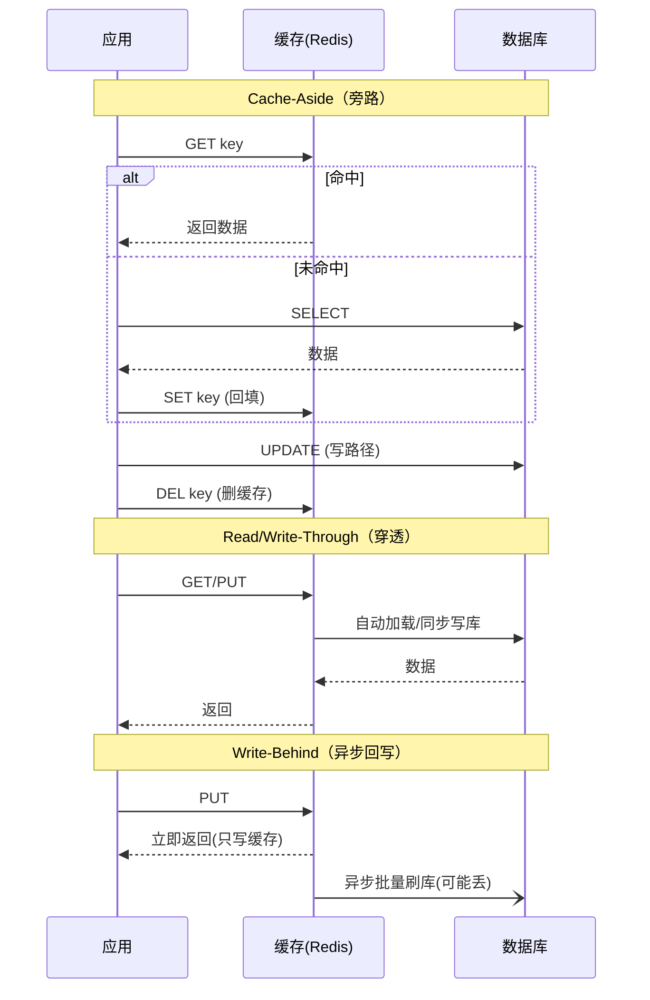
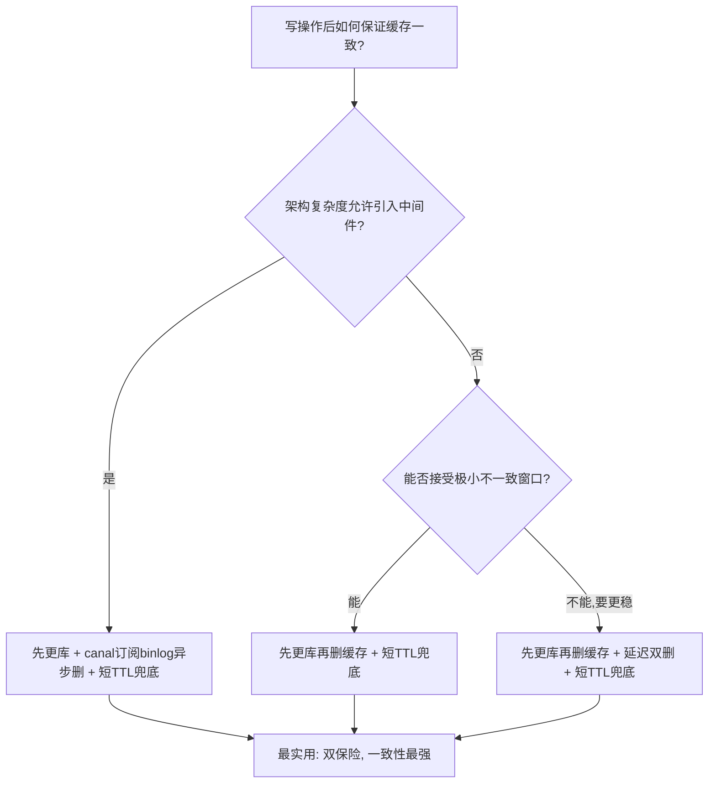
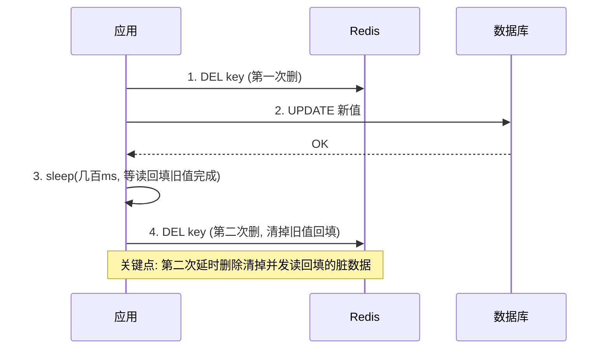
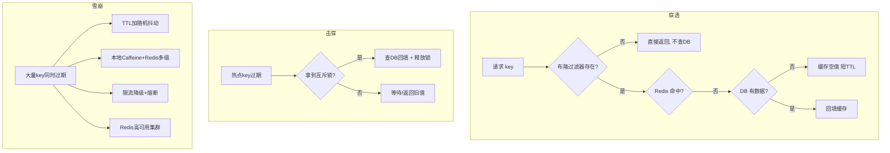
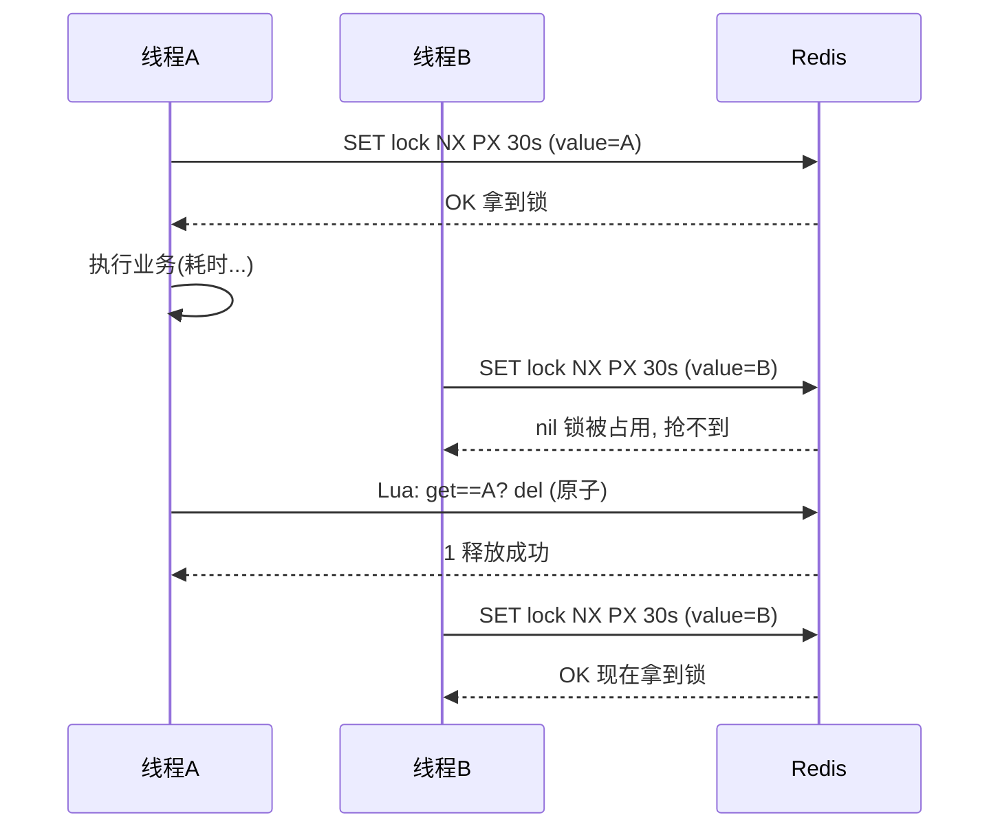
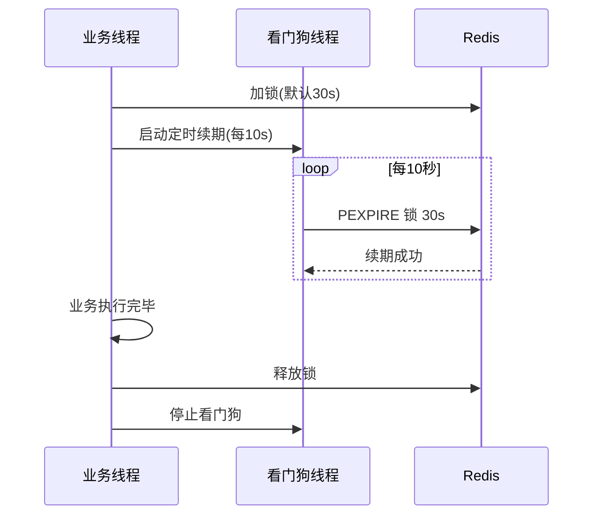
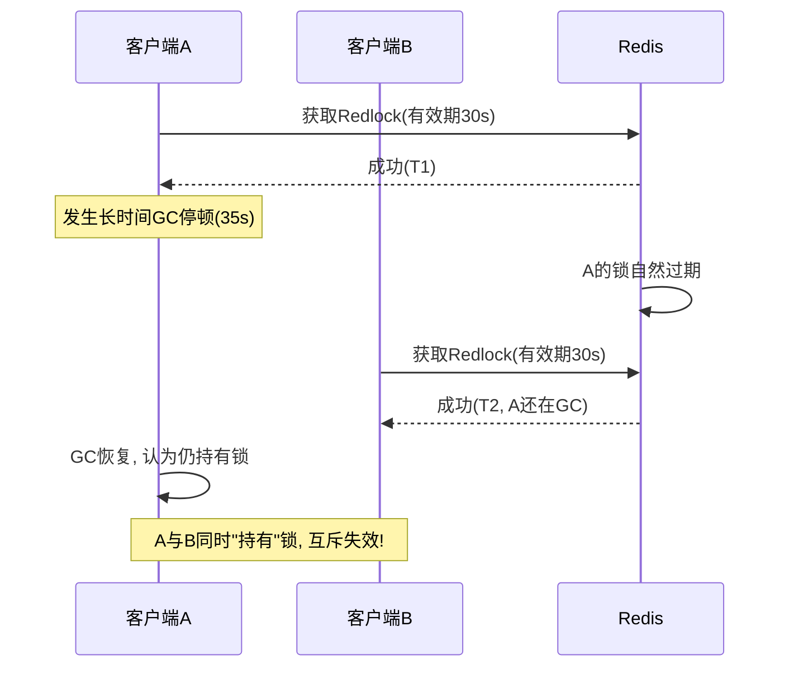
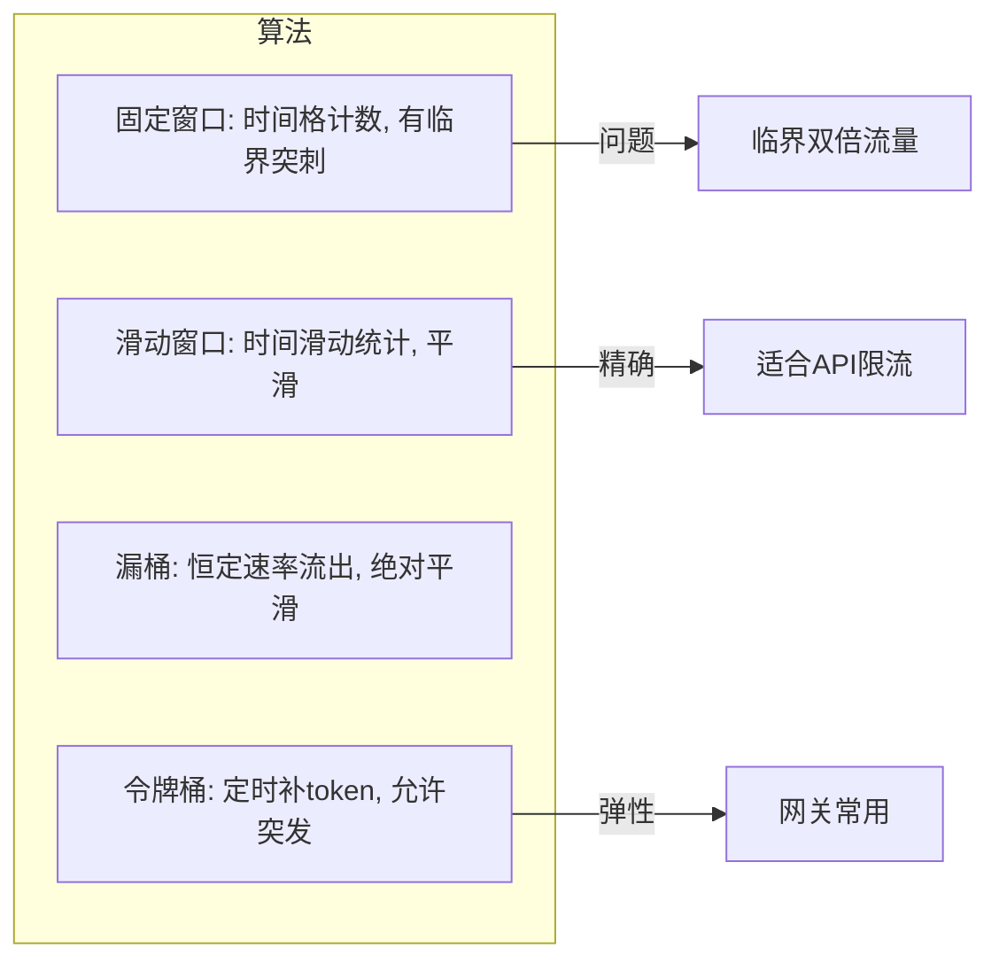
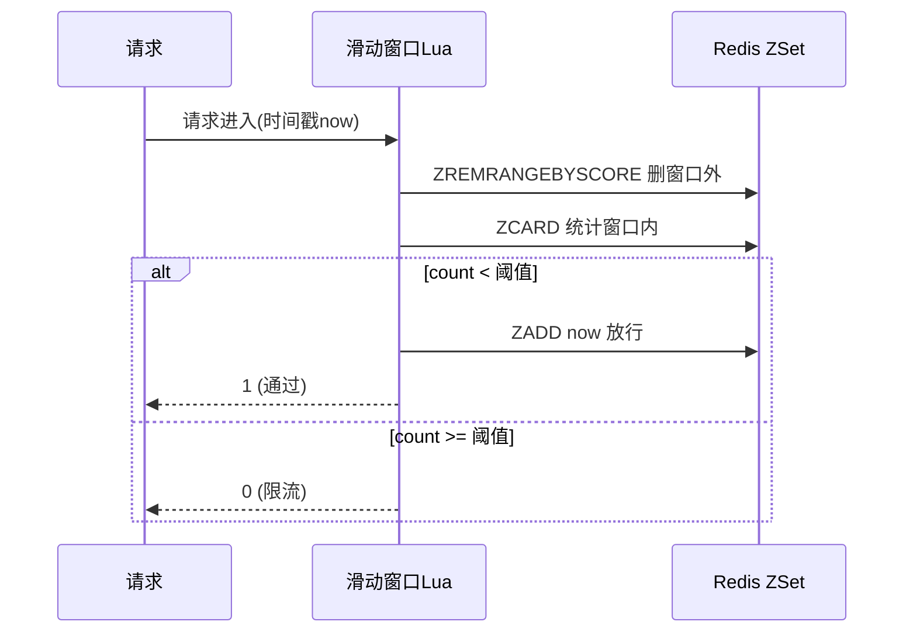
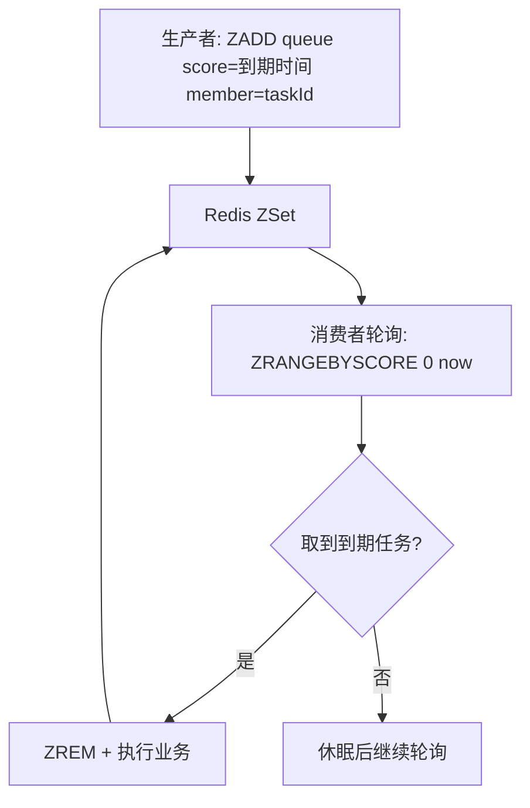

> 作者 ｜ 10 年 Java 后端工程师，内容基于多个一线互联网公司的真实项目实战沉淀。
> 本文是 Redis 专项的第三弹，聚焦**缓存一致性、三大缓存问题、分布式锁、限流、延迟队列、布隆过滤器**等工程深水区。前两篇（Redis 基础 + 高频面试题）已覆盖数据结构、持久化、高可用，本文不再赘述，直接进入"设计 + 实战 + 面试攻防"。

---

## 写在前面：为什么缓存这块值得单独成篇

做过跨境支付的同学都明白一个道理：**缓存不是提升性能的可选项，而是系统能否扛住流量的生死线。**

XTransfer 的收款订单查询峰值在节假日能到数万 QPS，如果每一次都打到账户库，MySQL 早就躺了。但缓存一旦用错，带来的不是慢，而是**数据错乱、对账不平、重复入账**——这种事故在支付场景是 P0。

我见过太多候选人把缓存当成"加个 @Cacheable 就完事"，面试时一问缓存一致性、穿透击穿雪崩、分布式锁的 Lua 释放和 Redlock 争议，立刻露馅。本文把这些坑一次性讲透，并贴出可落地的工程代码。

---

## 一、缓存读写模式

缓存不是只有"塞进去、读出来"一种玩法。业界把缓存与数据源的交互抽象成三种经典模式，理解它们能帮你判断"为什么我们项目用 Cache-Aside 而不是 Write-Behind"。

### 1.1 Cache-Aside（旁路缓存，生产最常用）

核心理念：**缓存层不主动穿透到数据库，由应用自己决定何时读写库、何时回填缓存。**

- **读路径**：先查缓存 → 命中则返回 → 未命中查库 → 回填缓存 → 返回。
- **写路径**：先更新数据库 → 再删除缓存（注意是"删"不是"更"，原因见第二章）。

这是绝大多数互联网系统的选择，简单、可控、对业务侵入小。Spring 的 `@Cacheable`/`@CacheEvict` 默认就是这一套。

### 1.2 Read-Through / Write-Through（穿透式）

把"查库 + 回填"的逻辑下沉到缓存客户端（如 CacheLoader）。应用只跟缓存打交道：

- **Read-Through**：缓存未命中时，由缓存层自动加载数据库数据并回填。
- **Write-Through**：写数据时，由缓存层同步写库，应用无需关心 DB。

好处是业务代码干净，坏处是缓存层和 DB 强耦合、灵活性差，且写路径延迟变高（同步写库）。

### 1.3 Write-Behind（异步回写，最激进）

写操作只写缓存，由缓存层**异步批量**刷回数据库。性能最高（写直接返回），但风险极大：进程挂掉、缓存宕机就会丢数据。在支付这类强一致场景基本禁用，只适合可丢失的埋点、计数类场景。

### 1.4 三种模式时序对比图



> **选型结论**：强一致业务用 Cache-Aside；想解耦读写逻辑、能接受同步写延迟用 Through；Write-Behind 仅在可丢数据场景用。

---

## 二、缓存与数据库一致性（重点）

这是面试的必考题，也是工程里最容易出事故的环节。**先说结论：缓存与数据库之间不存在绝对的强一致，只能追求"最终一致 + 业务可接受的不一致窗口"。**

### 2.1 为什么推荐"删缓存"而不是"更新缓存"

很多人写操作顺手 `SET cache = newValue`，这有两个坑：

1. **并发写导致脏数据**：两个线程 A、B 先后更新库，若 B 先写缓存、A 后写缓存，缓存里是 A 的值但 DB 里是 B 提交的结果（假设 A 的写库更晚完成），立刻不一致。
2. **写多读少时浪费**：频繁更新但没人读，每次都重写缓存纯属浪费。

而"**先更新库，再删除缓存**"从根本上规避了"缓存里是旧值"被长期读到的问题——删除后下次读自然回填最新值。

### 2.2 先更库再删缓存，仍有极小窗口不一致

经典场景（Cache-Aside 的天然缝隙）：

```text
T1: 线程 A 读 key 未命中，查库得到 V1
T2: 线程 B 更新库为 V2，删除缓存
T3: 线程 A 把读到的 V1 回填缓存  ← 此时缓存是 V1，DB 是 V2，不一致！
```

这个窗口极窄（发生在"读库"与"回填缓存"之间被"更新库+删缓存"插队），且要求读操作在写操作之前"恰好开始但未回填"。真实并发下概率很低，但**理论上存在**。工程上靠"短 TTL 兜底"把这个窗口的不一致风险压到业务可忽略。

### 2.3 六种一致性方案对比

| 方案 | 做法 | 优点 | 缺点 | 推荐度 |
|------|------|------|------|--------|
| 先删缓存再更库 | DEL 后再 UPDATE | 实现简单 | 删缓存后、更库前若有读，回填旧值 → 脏数据概率高 | ❌ 不推荐 |
| 先更库再删缓存 | UPDATE 后再 DEL | 缝隙极小，最常用 | 极端并发仍有窗口；删缓存失败会不一致 | ⭐⭐⭐⭐ 推荐 |
| 延迟双删 | 更库前删一次 + 更库后延时再删 | 降低"回填旧值"概率 | 第二次删除延迟难定；延时期间仍可能脏 | ⭐⭐⭐ 折中 |
| 订阅 binlog(canal) 异步删 | 更库后 canal 监听 binlog 发消息删缓存 | 解耦、可靠、删缓存失败可重试 | 架构重，引入中间件 | ⭐⭐⭐⭐⭐ 生产首选 |
| 事务消息 | 本地事务写库 + MQ 发删除消息 | 可靠、可重试 | 实现复杂，需事务消息组件 | ⭐⭐⭐⭐ |
| 短 TTL 兜底 | 所有缓存设过期时间 | 任何不一致最终自愈 | 存在过期期间的旧值 | 必选兜底 |

### 2.4 决策树：我该选哪个？



### 2.5 延迟双删时序图



### 2.6 canal 订阅 binlog 异步失效流程

```mermaid
flowchart LR
    A[业务写DB] --> B[(MySQL binlog)]
    B --> C[canal 伪装 slave 拉取 binlog]
    C --> D[canal 解析为 行变更事件]
    D --> E[MQ / 直接推送]
    E --> F[缓存失效服务]
    F --> G[(Redis DEL key)]
    Note over A,G: 业务代码只管写DB, 删缓存由独立组件保证, 失败可重试
```

### 2.7 最终结论

**"先更新库 → 再删缓存 + 短 TTL 兜底 + canal 订阅 binlog 双保险"** 是我在 XTransfer 落地的最实用组合：业务侧保证主路径，canal 异步补偿保证最终一致，短 TTL 是最后一道防线。

---

## 三、缓存三大坑（穿透 / 击穿 / 雪崩）

这是缓存面试的"三大名著"，必须能张口画出流程图。

### 3.1 缓存穿透：查不存在的 key

**现象**：请求的数据在 DB 里也不存在，缓存永远 miss，每次都打到 DB。攻击者用大量随机 ID 打你，DB 直接被打爆。

**解法一：空值缓存**
查不到也往缓存写个空对象（如 `NULL__`），设**短 TTL**（如 60s），防止同一 key 反复穿透。注意 TTL 要短，避免真有数据插入后长时间读到空。

**解法二：布隆过滤器（Bloom Filter）**
在缓存之前加一层布隆过滤器，key 不存在直接拦截，根本不碰缓存和 DB。原理：bit 数组 + 多个独立 hash 函数。

- 某个 key 经 k 个 hash 映射到 bit 数组的 k 个位，都为 1 才"可能存在"。
- **特性：有误判（说存在其实没有），无漏判（说不存在一定不存在）。**
- 误判率公式（m 位、n 元素、k 函数）：`p ≈ (1 - e^(-kn/m))^k`，工程上 m 给够、k≈0.7·m/n 最优。

### 3.2 缓存击穿：热点 key 过期瞬间

**现象**：某个**热点** key（如热门商户限额、爆款商品）突然过期，瞬间上千并发同时 miss，全部打到 DB 重建缓存。

**区别于穿透**：击穿是"存在的 key 过期"，穿透是"不存在的 key"。

**解法一：互斥锁（占锁重建）**
第一个线程拿到锁去查库回填，其余线程等待或短暂重试。Redis 用 `SET lock NX PX 3000` 占锁。

**解法二：逻辑过期（不物理过期）**
value 里带 `expire` 逻辑字段，key 在 Redis 里**永不过期**，读时判断是否逻辑过期，过期则由一个线程异步重建（其他线程先返回旧值）。优点：永远不阻塞；缺点：实现复杂，有一小段时间返回旧数据。

**解法三：永不过期 + 后台刷新**
对极热 key 由后台定时任务主动续期/刷新。

### 3.3 缓存雪崩：大量 key 同时失效 / Redis 宕机

**现象**：大量 key 在同一时刻过期，或 Redis 集群整体宕机，请求全部落到 DB，DB 被打死引发连锁故障。

**解法**：
1. **TTL 加随机抖动**：`expire = base + random(0, jitter)`，避免集体过期。
2. **多级缓存**：本地缓存（Caffeine） + Redis，Redis 挂了还有本地兜底。
3. **限流降级**：对 DB 做限流、熔断、返回默认值。
4. **高可用**：Redis 哨兵 / 集群，避免单点。

### 3.4 三大坑流程图



### 3.5 三大坑解法速查卡

| 问题 | 根因 | 核心解法 | 兜底 |
|------|------|----------|------|
| 穿透 | 不存在的 key | 布隆过滤器 + 空值缓存 | 接口层参数校验 |
| 击穿 | 热点 key 过期 | 互斥锁 / 逻辑过期 | 热点 key 预热 |
| 雪崩 | 大量 key 同过期 / 宕机 | 随机 TTL + 多级缓存 | 限流降级 + 高可用 |

---

## 四、分布式锁

分布式系统里，`synchronized` / `ReentrantLock` 只能锁住单 JVM，多实例部署下完全失效。分布式锁的本质是：**在分布式系统中找一个所有节点都能访问的、互斥的共享资源。**

### 4.1 基础实现：SET NX EX + 唯一值

加锁必须**原子**，否则"检查不存在"和"设置"之间有缝隙，会两个线程同时拿到锁。Redis 的 `SET key value NX EX seconds` 一条命令搞定：

```bash
# value 用唯一值(uuid + 线程id), 防止误删别人的锁
SET lock:order:1001 "uuid-abc-1" NX PX 30000
```

- `NX`：不存在才设置（互斥）。
- `EX 30000`：30s 自动过期（防死锁，进程挂了锁也能释放）。
- `value=唯一值`：释放时比对，避免删掉别人持有的锁。

### 4.2 释放锁必须用 Lua 脚本

**为什么不能直接 `DEL`？** 因为"GET 比对 value"和"DEL"两步不是原子的：

```text
线程A 锁过期(业务还没跑完) → 线程B 拿到锁
线程A 业务跑完, 执行 DEL → 把线程B的锁删了!
线程C 此时拿到锁 → B和C同时持有锁, 互斥失效
```

**正确做法：用 Lua 脚本保证"比对 + 删除"原子执行**（Redis 单线程执行 Lua，整个过程不可打断）：

```lua
-- release_lock.lua
if redis.call('get', KEYS[1]) == ARGV[1] then
    return redis.call('del', KEYS[1])
else
    return 0
end
```

Java 调用：

```java
public boolean releaseLock(String key, String value) {
    DefaultRedisScript<Long> script = new DefaultRedisScript<>();
    script.setScriptText(
        "if redis.call('get', KEYS[1]) == ARGV[1] then " +
        "return redis.call('del', KEYS[1]) else return 0 end");
    script.setResultType(Long.class);
    Long result = redisTemplate.execute(script, List.of(key), value);
    return result != null && result == 1L;
}
```

### 4.3 加锁 + Lua 释放时序图



### 4.4 锁超时问题：业务没跑完锁就过期

30s 的锁，业务跑了 40s 怎么办？这正是 4.2 里"过期 + 误删"的根源。解决方案：**锁自动续期（看门狗 Watchdog）**。

- 客户端拿到锁后，启动一个**后台守护线程**，每隔 `过期时间/3`（如 10s）检查锁是否还持有，若是则 `PEXPIRE` 续到 30s。
- 业务完成释放锁，停掉看门狗。
- 客户端宕机，看门狗停了，锁自然过期释放，不 deadlock。

**这正是 Redisson 的核心能力**——你不用手写续期逻辑。

### 4.5 Redlock 算法（多节点红锁）

单点 Redis 本身可能故障（主从切换时锁丢失：主节点写锁成功但还没同步到从节点就挂了，从节点升主后锁没了）。Redlock 用**多个独立 Redis 节点（通常 5 个）** 来降低单点风险：

算法步骤：
1. 获取当前时间 `T1`（毫秒）。
2. 依次向 N 个（如 5 个）**相互独立、无主从**的 Redis 节点申请锁（用相同 key/value，每个请求带超时，远小于锁有效期）。
3. 当且仅当**超过 N/2+1 个节点（≥3）** 加锁成功，**且总耗时 < 锁有效期**，才算真正获取锁。
4. 锁有效时间 = 设置的有效期 − 获取耗时。
5. 释放锁时，向**所有** N 个节点发释放（不管是否成功加过）。

### 4.6 Redisson 看门狗续期流程图



### 4.7 Martin Kleppmann 对 Redlock 的质疑（重点中的重点）

2016 年，剑桥的 Martin Kleppmann 发表文章《How to do distributed locking》，对 Redlock 提出尖锐批评，这篇是面试加分项。

**核心论点：Redlock 的安全性依赖系统时钟，而分布式系统中时钟不可靠。**

他举了两个致命场景：

1. **GC 停顿 / 进程暂停**：客户端 A 拿到锁，然后发生长时间 GC（Stop-The-World），从 A 的视角"时间没动"，但锁其实已过期。此时客户端 B 拿到了锁。A GC 恢复后，A 和 B 同时持有锁。
2. **时钟跳跃（clock jump）**：运维 `ntpdate` 强制校时、或虚拟机迁移导致时钟跳变，使得"锁有效期"的计时失真，Redlock 的"总耗时 < 有效期"判断失效。

Kleppmann 的结论：
- Redlock **不能**用作需要"强互斥"的场景（如金融资金安全、防止两人同时转账扣同一笔钱）。
- 他主张：锁的正确用法是"**用锁来防止重复执行某些操作（best-effort 防重）**"，而不是把它当"互斥的真理之源"。真正需要正确性时，应该用**带 fencing token 的方案**（每次加锁拿一个单调递增 token，DB 写入时校验 token 必须比已处理的大，旧 token 的写入被拒绝）。

**Redlock 作者 antirez 的反驳**：
- 场景 1 的前提是"客户端长时间暂停"——任何基于租约的锁（包括 zk/etcd）在客户端失联时都有窗口，这不是 Redlock 独有。
- 时钟跳跃可通过"只用单调时钟 + 不信任墙上时钟"缓解。
- 争论本质是：Kleppmann 要的是"正确性保证"，antirez 说的是"在合理假设下 Redlock 足够好用"。

**我的工程态度（面试可这样答）**：
- Kleppmann 说得对——**Redlock 不是绝对安全的强互斥锁**，别拿它做资金安全的唯一防线。
- 但它对"防重复执行"（如定时任务只跑一次、幂等防重）**足够实用**，且比单点 Redis 锁更可靠。
- 真要强一致，用 **ZooKeeper/etcd 的租约 + fencing token**，或干脆用数据库唯一约束兜底（这正是 XTransfer 支付幂等锁的做法，见第八章）。

### 4.8 时钟跳跃导致双持锁故障图



### 4.9 Redisson 实战

```java
// 1. 可重入锁（默认看门狗30s, 每10s续期）
RLock lock = redissonClient.getLock("order:" + orderId);
lock.lock();          // 阻塞等待, 自动续期
try {
    // 业务逻辑
} finally {
    lock.unlock();    // 释放 + 停看门狗
}

// 2. 带超时的尝试锁
boolean ok = lock.tryLock(1, 10, TimeUnit.SECONDS); // 等1s, 锁10s有效期

// 3. 红锁（多节点）
RLock lock1 = redissonClient1.getLock("res");
RLock lock2 = redissonClient2.getLock("res");
RLock lock3 = redissonClient3.getLock("res");
RedissonRedLock redLock = new RedissonRedLock(lock1, lock2, lock3);
redLock.lock();
```

Redisson 还支持：
- **读写锁** `getReadWriteLock`：读共享、写互斥。
- **公平锁** `getFairLock`：按请求顺序获取。
- **可重入**：value 里维护重入计数。

### 4.10 分布式锁方案横向对比

| 方案 | 可靠性 | 性能 | 实现复杂度 | 适用 |
|------|--------|------|-----------|------|
| Redis SET NX | 中（主从切换丢锁） | 高 | 低 | 一般防重、缓存重建 |
| Redlock | 较高 | 中 | 中 | 多节点防重 |
| ZooKeeper 临时顺序节点 | 高 | 低（写磁盘+选举） | 高 | 强一致、选主 |
| etcd 租约 | 高 | 中 | 中 | K8s 生态、强一致 |

> 共识：**ZK/etcd 可靠性最高但性能低、运维重；Redis 锁性能高但需接受"非绝对强一致"。工程上常"Redis 锁 + 业务层兜底（唯一索引/fencing）"组合。**

---

## 五、限流（Redis 实现）

限流是保护系统的利器：防止突发流量打爆下游（尤其是我们对接的银行渠道，超量会被封）。Redis 因为单线程 + 原子命令，是分布式限流的首选。

### 5.1 四种经典限流算法

| 算法 | 原理 | 优点 | 缺点 |
|------|------|------|------|
| 固定窗口 | 时间窗内计数，超过阈值拒绝 | 简单 | 临界突刺（窗口交界处双倍流量） |
| 滑动窗口 | 按时间滑动统计，平滑 | 比固定窗口精确 | 实现稍复杂 |
| 漏桶 | 请求进桶，恒定速率流出 | 绝对平滑，削峰 | 突发流量被直接丢弃，不友好 |
| 令牌桶 | 定时往桶里放 token，有 token 才放行 | 允许一定突发，弹性好 | 实现稍复杂 |

### 5.2 固定窗口的临界突刺问题

```text
窗口1 [0-1s]  窗口2 [1-2s]
在 0.9s 打 100 个(窗口1满) + 1.1s 打 100 个(窗口2满)
→ 实际 0.2s 内打了 200 个, 远超单窗口阈值 100!
```

### 5.3 滑动窗口（zset 实现，精确）

用 `zset` 的 score 存时间戳，每次请求：
1. `ZREMRANGEBYSCORE key 0 (now - window)` 删除窗口外记录。
2. `ZCARD key` 统计窗口内数量。
3. 若 `< 阈值` 则 `ZADD key now member` 放行，否则拒绝。

全部用 **Lua 脚本**保证原子（否则并发下计数不准）：

```lua
-- sliding_window_limit.lua 参数: KEYS[1]=key, ARGV[1]=窗口ms, ARGV[2]=阈值, ARGV[3]=当前时间戳
local key = KEYS[1]
local window = tonumber(ARGV[1])
local limit = tonumber(ARGV[2])
local now = tonumber(ARGV[3])
redis.call('ZREMRANGEBYSCORE', key, 0, now - window)
local count = redis.call('ZCARD', key)
if count < limit then
    redis.call('ZADD', key, now, now)
    redis.call('PEXPIRE', key, window)
    return 1  -- 放行
else
    return 0  -- 限流
end
```

### 5.4 令牌桶（INCR + 过期模拟，简单版）

```lua
-- 简化令牌桶: 用计数 + 时间差补充
-- KEYS[1]=key ARGV[1]=容量 ARGV[2]=每秒生成速率 ARGV[3]=now
local key = KEYS[1]
local capacity = tonumber(ARGV[1])
local rate = tonumber(ARGV[2])
local now = tonumber(ARGV[3])
local data = redis.call('HMGET', key, 'tokens', 'ts')
local tokens = tonumber(data[1]) or capacity
local ts = tonumber(data[2]) or now
local delta = math.min(capacity - tokens, (now - ts) / 1000 * rate)
tokens = tokens + delta
local allowed = 0
if tokens >= 1 then
    tokens = tokens - 1
    allowed = 1
end
redis.call('HMSET', key, 'tokens', tokens, 'ts', now)
redis.call('EXPIRE', key, capacity / rate + 1)
return allowed
```

### 5.5 四种限流算法对比图 + 滑动窗口 zset 流程





---

## 六、其他实战结构

### 6.1 延迟队列（zset 实现）

需求：订单 30 分钟未支付自动关闭、定时对账等。不想引入 RocketMQ 的延迟消息时，可用 Redis `zset` 做轻量延迟队列：

- `score = 执行时间戳`，`member = 任务ID`。
- 轮询线程：`ZRANGEBYSCORE key 0 now LIMIT 0 N` 取到期任务 → 处理 → `ZREM`。



> 注意：zset 延迟队列**不保证精确实时**（轮询间隔），且消费失败需自己处理重试。严肃场景还是用 RocketMQ/RabbitMQ 的延迟消息。

### 6.2 布隆过滤器（再强化）

除了防穿透，还常用于：
- 爬虫 URL 去重。
- 推荐系统"已读过滤"。
- 大数据集"是否存在"判定的内存优化（10 亿数据仅占 ~1.2GB，而 hashset 要几十 GB）。

Redis 4.0+ 有官方 `RedisBloom` 模块（`BF.ADD` / `BF.EXISTS`）。自建可用 `bitfield` + 多个 hash 模拟。

### 6.3 Bitmap：签到 / 日活

```bash
SETBIT sign:user:1001 2026-07-12 1   # 某天签到
BITCOUNT sign:user:1001              # 总签到天数
BITOP AND result u1 u2               # 两用户共同签到日
```

亿级用户标签（如"是否VIP"）用 Bitmap 只占 `1亿/8 = 12.5MB`，极其省内存。

### 6.4 HyperLogLog：UV 去重估算

```bash
PFADD uv:2026-07-12 user1 user2 user3
PFCOUNT uv:2026-07-12        # 估算独立访客
PFMERGE uv:week uv:1 uv:2 ... # 合并多日
```

- 12KB 内存可估算**上亿**基数，误差 **0.81%**。
- 适合"大概多少 UV"这类统计，不适合精确计数（精确请用 SET 或 Bitmap）。

---

## 七、【深度拓展】内核与新特性

### 7.1 Redis 6.0 ACL（账号权限隔离）

Redis 6.0 之前只有一个 `requirepass` 全局密码，所有操作同权。ACL 支持多账号、按命令/key 授权：

```bash
ACL SETUSER lockuser on >lockpass ~lock:* +set +get +del +eval
```

**实战价值**：分布式锁用独立账号 `lockuser`，只能操作 `lock:*` 前缀的 key 和执行指定命令，避免业务 bug 误删锁、或滥用 `FLUSHALL`。这是生产加固的标配。

### 7.2 锁粒度设计

错误示范：锁整个用户 `lock:user:1001`，导致该用户所有订单操作串行。
正确做法：**锁到最小资源**，如锁订单号 `lock:order:8888`，让不同订单并行，只有同一订单的并发被互斥。锁粒度越细，并发度越高。

### 7.3 Redisson 锁的底层原理

- **可重入**：value 为 `uuid:threadId`，hash 结构存重入计数 `HINCRBY`，unlock 时递减到 0 才删。
- **读写锁**：基于 Redis 的 `hash + pub/sub`，写锁独占、读锁共享，用 `mode` 字段区分。
- **公平锁**：用 `list` 队列 + 序号，按申请顺序分配，避免饥饿（但性能略低）。

---

## 八、【项目支撑】XTransfer 真实实战

（以下为脱敏后的真实架构复盘）

### 8.1 支付幂等锁：渠道回调用分布式锁防重复入账

**场景**：银行渠道异步回调通知支付结果，网络抖动会**重复推送**同一笔。如果没幂等，会重复入账，造成资金多记——这是资损。

**双层防护**：
1. **分布式锁**：收到回调先用"渠道流水号"加锁 `SET lock:channel:cb:{serialNo} uuid NX PX 10000`，抢不到说明在处理中，直接返回成功（让渠道别重试）。
2. **数据库唯一索引**：流水号字段建唯一索引，最后一道防线。即使锁失效，DB 也会因唯一约束抛异常，事务回滚。

```java
public void handleChannelCallback(CallbackDTO dto) {
    String lockKey = "lock:cb:" + dto.getChannelSerialNo();
    String uuid = UUID.randomUUID().toString();
    // 抢锁, 抢不到说明重复推送, 直接ack
    if (!redis.setNxPx(lockKey, uuid, 10000)) {
        log.warn("重复回调, 已忽略: {}", dto.getChannelSerialNo());
        return;
    }
    try {
        // 插入入账流水(唯一索引兜底) + 更新订单状态
        paymentService.handle(dto);
    } finally {
        redis.releaseByLua(lockKey, uuid); // Lua原子释放
    }
}
```

> 这里**没有用 Redlock**——因为我们有 DB 唯一索引兜底，Redis 单点锁 + 唯一约束已足够。强一致交给数据库，这正是 Kleppmann 思路的工程化：锁用于"防重复执行"，正确性靠 DB 约束。

### 8.2 渠道限流：对银行下游做滑动窗口限流

**场景**：每个银行渠道有自己每秒最大吞吐（如某行限 50 TPS），我们超量调用会被渠道拒绝甚至封禁。需在调用前按渠道维度限流。

**实现**：用 5.3 的滑动窗口 zset 脚本，key 为 `ratelimit:channel:{bankCode}`：

```java
public boolean tryAcquire(String bankCode, int limit, long windowMs) {
    String key = "ratelimit:channel:" + bankCode;
    long now = System.currentTimeMillis();
    Long r = redis.evalSlidingWindow(key, windowMs, limit, now);
    return r != null && r == 1L;
}
// 被限流时: 进入队列缓冲 / 返回"系统繁忙" / 按渠道优先级降级
```

### 8.3 收款订单缓存一致性：先更库再删 + canal 兜底

**场景**：收款订单状态（待入账/已入账/已对账）被前端高频查询。用 Cache-Aside，但单纯"先更库再删"担心删缓存失败导致对账读到旧状态。

**方案**：
- 主路径：业务更新订单库后 `DEL order:{id}`。
- 兜底：canal 订阅订单表 binlog，任何变更都发 MQ，缓存服务消费后 `DEL`，失败重试。
- 所有订单缓存设 5 分钟 TTL 兜底。

这样即便主路径删缓存失败，canal 也会在秒级内补删，对账系统不会长时间读到旧状态。

### 8.4 一次击穿事故复盘

**事故**：某热门收款商户（日收款千万级）的"单笔限额"缓存 key 设置了固定 30 分钟过期。某日凌晨该 key 同时过期，瞬间 ~5000 QPS 直接打到账户库查限额，账户库 CPU 飙到 100%，部分查询超时，影响到该商户下游的收款下单。

**根因**：
1. 限额缓存 **TTL 固定且集中过期**（雪崩苗头 + 热点击穿叠加）。
2. 没有对"限额查询"做互斥锁或本地缓存兜底。

**修复**：
1. 加**本地缓存（Caffeine）** 作为第一层，Redis 为第二层，多级缓存。
2. 热点限额 key 加**互斥锁重建**：第一个线程查库回填，其余等待。
3. TTL 改为 `30min + random(0,5min)` 随机抖动，避免集体过期。
4. 限额变更时主动 `DEL` + 推送本地缓存失效。

修复后同类场景 QPS 回落到 Redis + 本地缓存层，账户库零压力。

---

## 九、【面试官追问】

### Q1：缓存和 DB 一致性到底怎么保证？先删还是先更？
**答**：没有完美方案，只能最终一致。推荐"**先更新库 → 再删缓存**"，因为先删后更在并发下更易产生脏数据回填。极端不一致窗口用"短 TTL 兜底 + canal 订阅 binlog 异步补删"双保险压到业务可忽略。

### Q2：布隆过滤器有误判，怎么降低误判率？误判了会怎样？
**答**：误判率 `p ≈ (1-e^(-kn/m))^k`，降低方法：增大 bit 数组 m、控制元素数 n、选最优 hash 数 k≈0.7·m/n。误判的后果是"本来不存在的 key 被放行去查 DB"——只是多一次无害查询，**不会漏判**（不会放过真正存在的数据被错误拦截）。所以它适合"拦截绝大部分穿透"，不能替代空值缓存。

### Q3：分布式锁用 SET NX 就够了吗？为什么释放要用 Lua？
**答**：不够。SET NX EX 只解决"互斥加锁"。释放时必须用 Lua 脚本"先 GET 比对 value 再 DEL"原子执行，否则在"锁过期 + 业务未完"的竞态下可能误删别人的锁，导致两个客户端同时持锁。value 用唯一 uuid 是为了只对"自己加的锁"负责。

### Q4：Redlock 安全吗？Kleppmann 说的时钟问题你怎么看？
**答**：Redlock 比单点 Redis 锁更可靠，但**不是绝对强一致锁**。Kleppmann 指出它依赖系统时钟，GC 长停顿或时钟跳跃会让两个客户端同时持锁。我的看法：Redlock 适合"防重复执行"（如定时任务、幂等防重），不适合做资金安全的唯一防线；强一致场景用 ZK/etcd 租约 + fencing token，或 DB 唯一约束兜底（我们支付场景就是这么做的）。

### Q5：锁超时但业务没跑完怎么办？
**答**：用**看门狗自动续期**（Redisson 默认锁 30s、每 10s 续一次）。客户端宕机看门狗停，锁自然过期释放，避免死锁。手写的话就是后台定时线程 `PEXPIRE`，释放时停掉。关键原则：锁有效期必须 > 业务最大执行时间 + 续期间隔余量。

### Q6：滑动窗口限流和令牌桶区别？为什么 API 网关多用令牌桶？
**答**：滑动窗口是"统计最近时间窗内请求数"，平滑但限制的是"窗口内总量"；令牌桶是"恒定速率生成 token，有 token 才放行"，**允许一定突发**（桶里攒的 token 可瞬间消耗）。网关用令牌桶是因为真实流量有突发（如整点抢购），令牌桶既能限制平均速率又能平滑吸收突发，比"硬卡窗口内总数"更友好。漏桶则相反，恒定速率流出、突发直接丢弃，适合后端保护。

---

## 十、速查与实战

### 10.1 缓存一致性方案选择表

| 业务诉求 | 推荐方案 |
|----------|----------|
| 简单业务、能接受极小窗口 | 先更库再删缓存 + 短 TTL |
| 高一致、有中间件能力 | 先更库再删 + canal 订阅 binlog + 短 TTL |
| 写后立刻要读新值 | 延迟双删 |
| 强一致（金融） | 缓存 + DB 事务 + 唯一约束兜底 |

### 10.2 三大坑解法速查卡

- **穿透**：布隆过滤器（前置拦截）+ 空值缓存（短 TTL）+ 参数校验。
- **击穿**：互斥锁（占锁重建）/ 逻辑过期（异步重建）/ 热点预热。
- **雪崩**：TTL 随机抖动 + 多级缓存 + 限流降级 + Redis 高可用。

### 10.3 分布式锁实现 Checklist

- [ ] 加锁原子：`SET key uuid NX PX seconds`
- [ ] 唯一 value：防误删别人的锁
- [ ] 释放原子：Lua 脚本"比对 + 删除"
- [ ] 自动续期：看门狗（防业务超时被误删）
- [ ] 可重入：记录持有线程 + 重入计数
- [ ] 权限隔离：Redis 6.0 ACL 独立锁账号
- [ ] 兜底：DB 唯一索引 / fencing token（资金场景必加）

### 10.4 限流算法选型决策表

| 场景 | 选哪个 |
|------|--------|
| 简单接口保护、不计较临界 | 固定窗口 |
| 需要平滑、精确限流 | 滑动窗口（zset + Lua） |
| 保护脆弱下游、绝对削峰 | 漏桶 |
| API 网关、允许突发 | 令牌桶 |
| 对银行/三方渠道限流 | 滑动窗口 / 令牌桶（按渠道维度 key） |

### 10.5 常用命令速记

```bash
# 分布式锁
SET lock:order:1 uuid NX PX 30000
# 限流 - 滑动窗口(zset)
ZREMRANGEBYSCORE k 0 (now-1000) / ZCARD k / ZADD k now now
# 延迟队列
ZADD delayq score taskId / ZRANGEBYSCORE delayq 0 now
# Bitmap
SETBIT sign:u:1 200 1 / BITCOUNT sign:u:1
# HyperLogLog
PFADD uv:day u1 u2 / PFCOUNT uv:day
# Bloom(RedisBloom)
BF.ADD bf:keys x / BF.EXISTS bf:keys x
# ACL
ACL SETUSER lockuser on >pwd ~lock:* +set +del +eval
```

---

### 10.6 热点 key 与大 key 治理（高并发实战）

高并发系统绕不开两个隐性炸弹，面试也常追问。

**热点 key（Hot Key）**：某个 key 被海量请求集中访问（如爆款商品、顶流商户限额），单分片被打满，集群其他节点闲着。XTransfer 跨境大促时某热门收款渠道的配置 key 就是典型。

- **识别**：Redis 监控 `hotkeys`（Redis 4.0+ `redis-cli --hotkeys`）、代理层统计、业务埋点。
- **解法**：
  1. **本地缓存兜底**（Caffeine/Guava）：热点 key 在应用本地也存一份，扛掉绝大部分流量，Redis 只做"二级 + 失效推送"。
  2. **key 分片**：把 `hot:1001` 拆成 `hot:1001:0` ~ `hot:1001:9`，请求随机/取模打到不同分片，分散压力。
  3. **限流 + 多副本**：从库读扩展，或把只读热点复制到多个 Redis 实例。

**大 key（Big Key）**：单个 key 体积过大（如 MB 级 String、几十万成员的 Hash/Set/ZSet、巨长 List）。危害：DEL/序列化阻塞单线程、网络拥塞、迁移卡顿。

- **识别**：`redis-cli --bigkeys`、定期扫描 `MEMORY USAGE key`。
- **解法**：
  1. **拆分**：大 Hash 按 `field hash 取模`拆成多个小 Hash。
  2. **压缩**：value 用 GZIP/Protobuf 压缩后再存。
  3. **异步删除**：Redis 4.0+ 用 `UNLINK` 替代 `DEL`，后台线程回收，不阻塞。
  4. **设置合理 TTL**，避免无限增长（如日志型 List 定期 `LTRIM`）。

### 10.7 Redisson 读写锁 / 公平锁实战代码

```java
// 读写锁: 读共享, 写互斥 —— 适合"读多写少 + 写时不能脏读"
RReadWriteLock rwLock = redissonClient.getReadWriteLock("config:" + configId);
rwLock.readLock().lock();        // 多个读可并发
try { /* 读配置 */ } finally { rwLock.readLock().unlock(); }

rwLock.writeLock().lock();        // 写时独占, 阻塞所有读
try { /* 改配置 + 删缓存 */ } finally { rwLock.writeLock().unlock(); }

// 公平锁: 按申请顺序获取, 防饥饿(性能略低, 非必要不用)
RLock fairLock = redissonClient.getFairLock("fair:task");
fairLock.lock();
try { /* 严格顺序处理 */ } finally { fairLock.unlock(); }
```

> 读写锁在"配置变更后必须删缓存且不能脏读"的场景很有用：写锁持有时所有读都阻塞，保证读到的一定是最新值（或已删缓存后回填的新值）。

### 10.8 缓存预热与监控告警

- **预热**：大促/发布前，把预计热点 key（热门商户限额、爆款商品）提前加载进 Redis，避免冷启动瞬间击穿。
- **监控三件套**：
  1. 命中率（`keyspace_hits / (hits+misses)`）—— 低于 90% 要警惕。
  2. 内存 & 逐出（`evicted_keys`、`used_memory`）—— 频繁逐出说明容量不足。
  3. 慢命令（`slowlog`）—— 定位大 key / 复杂命令。
- **告警**：命中率骤降、内存逼近 `maxmemory`、某个 key QPS 异常飙升，都应上告警。

## 十一、常见踩坑清单（避坑用）

1. **用 `EXPIRE` 分开设置过期**：`SET key val` 后 `EXPIRE key 30` 不是原子的，中间崩溃 key 变永久 → 用 `SET key val EX 30` 一条命令。
2. **释放锁用 DEL 不用 Lua**：见第四章，会误删别人锁。
3. **锁 value 用固定字符串**：进程 A 锁过期后 B 拿到，A 用固定 value 仍能 DEL 掉 B 的锁 → 必须用唯一 uuid。
4. **key 不加业务前缀**：锁、限流、缓存混在一起难治理、难 ACL → 统一 `lock:*` / `ratelimit:*` / `cache:*` 前缀。
5. **缓存和 DB 双写都用"更新"**：导致并发脏数据 → 坚持"删除"而非"更新"缓存。
6. **限流计数不用 Lua**：`INCR`+`EXPIRE` 非原子，临界不一致 → 限流逻辑必须 Lua 包裹。
7. **把 Redis 当数据库用**：Redis 是缓存，持久化不是 100% 可靠，核心数据必须落库。
8. **大 key 直接 DEL**：阻塞单线程 → 用 `UNLINK` 或分批删除。

## 结语

缓存、分布式锁、限流这三件套，是后端工程师从"会用 Redis"到"懂 Redis 工程"的分水岭。面试时能把"先更库再删缓存的缝隙""布隆过滤器的误判""Redlock 的时钟争议""Lua 释放锁的必要性"讲清楚，就已经超越了 80% 的候选人。

但真正落地，永远记住一句话：**缓存是性能优化，不是正确性来源；任何涉及资金、对账、幂等的强一致，最后都要回到数据库约束兜底。** 这是 XTransfer 跨境支付几年踩坑换来的最贵经验。

下一篇计划写《Redis 集群、热点 key 与大规模实战调优》，敬请期待。

---

*本文所有项目示例均基于作者真实经历脱敏整理。转载请注明出处。*
