> 作者 ｜ 10 年 Java 后端工程师，内容基于多个一线互联网公司的真实项目实战沉淀。
> 适用场景：面试备考 + 一线架构设计复盘
> 难度定位：**进阶专项深化**，假设你已掌握 Redis 核心数据结构、持久化（RDB/AOF）、过期淘汰、缓存一致性等基础，本文不再展开，聚焦**复制、哨兵、集群、故障转移、扩缩容**四条主线。

---

## 写在前面：为什么要把"高可用"单独拎出来讲

在 XTransfer 做跨境支付缓存、在哈啰做工单与调度缓存时，我反复踩过同一个坑：**缓存"单点挂掉"对支付链路的杀伤力，远大于数据库慢查询。** 数据库挂了至少有主从、有降级，缓存如果只有一个节点，雪崩一来直接把支付核心链路打穿。

所以 Redis 的"高可用"从来不是一道面试题，而是支付/交易系统能不能扛住资损演练的生死线。本文按"单机 → 主从 → 哨兵 → 集群 → 多活"的演进路线，把每一层的**设计动机、内核机制、运维陷阱、客户端改造**讲透，并尽量用图解代替文字。

> 注：本文与《MySQL 与 Redis 高频面试》合并文、《Redis 核心原理》是递进关系——合并文讲"怎么用、怎么避免缓存穿透/击穿/雪崩"，核心原理讲"单实例内核（线程模型/持久化/过期）"，本文讲"多实例协同（复制/哨兵/集群）"。三者不重复，建议配合阅读。

---

## 一、高可用演进路线总览

### 1.1 演进动机：单机 Redis 的四个天花板

| 维度 | 单机 Redis 的瓶颈 | 演进诉求 |
| --- | --- | --- |
| 可用性 | 进程/OOM/宕机即全量不可用 | 冗余副本，故障自动切换 |
| 容量 | 单机内存上限（通常 32~64G 实用），大 value 风险 | 数据分片，横向扩内存 |
| 性能（写） | 单线程写，单节点 QPS 天花板 ~10w | 分片把写分散到多主 |
| 性能（读） | 单节点连接/带宽有上限 | 读写分离，从库扛读 |

演进路径本质是**先解决"挂了怎么办"（主从 + 哨兵），再解决"不够用怎么办"（集群分片）**。

### 1.2 四种方案的能力边界

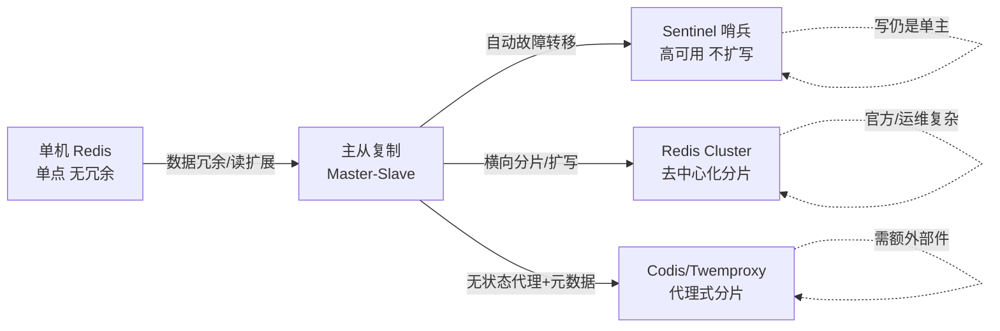

**取舍速记：**
- **主从复制**：只解决"读扩展 + 数据冗余"，不解决"主挂了谁顶上"（要人工）。
- **Sentinel**：在主从之上加"自动故障转移"，**写能力仍是单主**，不能扩写。
- **Redis Cluster**：官方原生、**去中心化、可扩写**，但运维心智负担重，客户端要"聪明"。
- **Codis / Twemproxy**：代理式分片，**对客户端透明**，但需额外组件（ZK/etcd），写能力取决于分片主数。

> 面试金句：**"Sentinel 让你主挂了不用半夜爬起来手动切，Cluster 让你主写满了还能加机器扩。"**

### 1.3 方案选型决策树

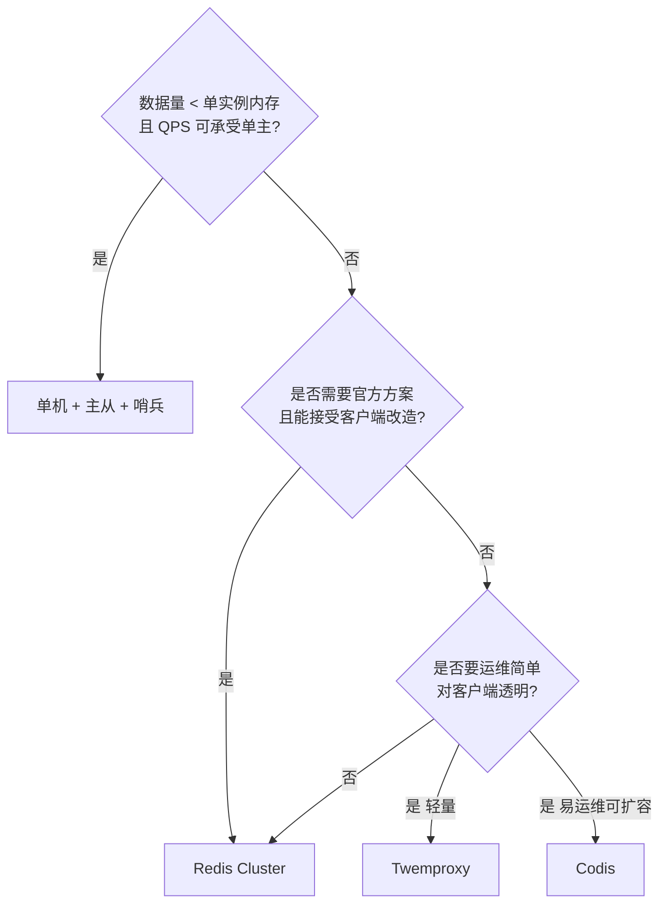

---

## 二、主从复制原理

主从复制（Replication）是所有高可用方案的基石——哨兵、集群都是在"主从"之上叠加控制面。理解复制，必须先理解**全量复制**和**增量复制（部分重同步）**两条路径。

### 2.1 核心概念三件套

| 概念 | 含义 | 作用 |
| --- | --- | --- |
| `run_id` | 每个 Redis 实例启动时生成的 40 位随机 ID | 标识"主库身份"，从库据此判断是否换主 |
| `offset`（复制偏移量） | 主/从各自维护的字节流偏移 | 衡量主从数据同步进度，判增量窗口 |
| `replication backlog` | 主库维护的**环形复制缓冲区** | 断线重连后，offset 落在区间内即可部分重同步 |

> 关键认知：**`run_id` 变了 = 主库换了或重启了（RDB 重建），必须全量；`run_id` 没变但 `offset` 落后 = 只补增量。**

### 2.2 全量复制流程（PSYNC 时代）

旧版用 `SYNC` 命令——**只要一连接就无脑全量**，断线重连也全量，非常浪费。Redis 2.8 引入 `PSYNC`，支持**部分重同步**。

全量复制触发条件：
1. 从库第一次连接主库（无历史 `run_id`）。
2. 从库记录的 `run_id` 与主库当前 `run_id` 不一致（主重启 / 主从切换）。
3. 从库 `offset` 落在主库 `backlog` 之外（断线太久，增量被覆盖）。

全量复制时序（`PSYNC ? -1` 首次 / `PSYNC <runid> <offset>` 重连）：

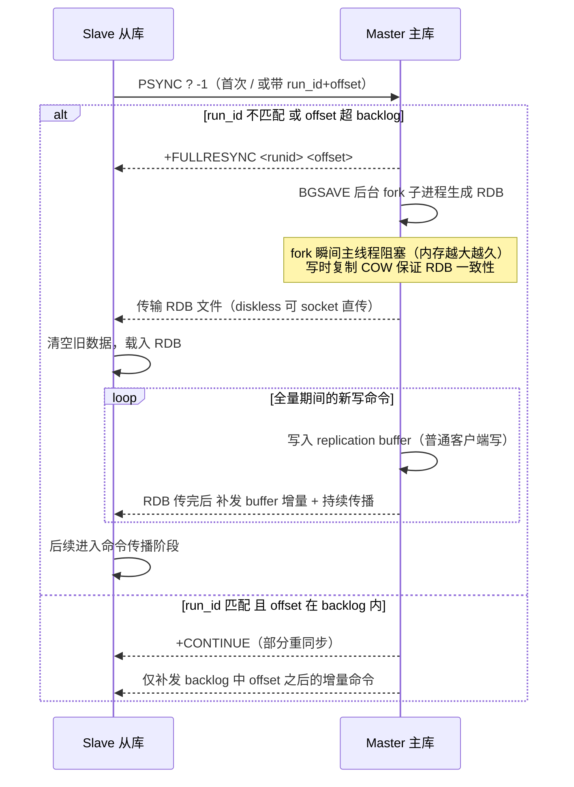

**几个工程细节（面试高频）：**
- **`BGSAVE` 的 fork 代价**：fork 不拷贝内存，但内核要复制页表；实例内存越大、页表越大，fork 越慢（百 GB 实例可能几十 ms ~ 几百 ms 主线程停顿）。XTransfer 曾因单实例 40G 内存，fork 抖动导致支付链路 RT 尖刺——后来强制拆分实例 + 调大 `repl-backlog-size`。
- **diskless replication（无盘复制）**：`repl-diskless-sync yes`，主库不落盘，直接通过 socket 把 RDB 发给从库，避免磁盘 IO 成为瓶颈（适合 SSD 慢、网络快的场景）。
- **`replication buffer` vs `replication backlog`**：前者是"每个从库独立"的发送缓冲（从库慢会涨，撑爆会断开），后者是"主库全局共用"的环形重同步缓冲。别混淆。

### 2.3 增量复制：backlog 与 offset 的舞蹈

从库断线重连后，关键判定逻辑：

```mermaid
flowchart TD
    A[从库重连 发 PSYNC runid offset] --> B{run_id == 主库当前 run_id?}
    B -->|否| C[+FULLRESYNC 全量复制]
    B -->|是| D{offset 在 backlog<br/>[master_offset - backlog_size, master_offset]?}
    D -->|是| E[+CONTINUE 部分重同步<br/>补发 offset 之后增量]
    D -->|否 被新命令覆盖| C
```

**backlog 满了会怎样？**
环形缓冲区，固定大小（`repl-backlog-size`，默认 1MB，生产建议按断线时长 × 写入速率估算，常设 64MB~1GB）。如果从库断线时间太长，期间主库写的字节数超过 backlog 容量，从库的 `offset` 被"覆盖"，重连时只能**退化成全量复制**。

> 实战经验：网络抖动频繁的机房，`repl-backlog-size` 一定要调大，否则"抖动→断线→全量→fork 抖动→再抖动"形成**复制风暴**（见 2.5）。

### 2.4 命令传播与复制延迟

全量完成后，主库每执行一条写命令，异步传播给所有从库。从库用 `offset` 记录已接收字节，主库用 `INFO replication` 的 `master_repl_offset` 记录已发送字节。

**`repl lag`（复制延迟）**：`master_repl_offset - slave_repl_offset` 即滞后字节数；再除以写入速率可估算滞后秒数。监控上很重要——读从库可能读到旧数据（最终一致性）。

### 2.5 读写分离与三个经典坑

**坑一：从库延迟导致"读已改"失效**
下单后立刻查（打从库）却读到旧库存。解法：关键读强制走主，或读前判断 `lag`；或业务上"写后读"场景走主。

**坑二：复制风暴（replication storm）**
一台主挂了或多个从同时全量重连，主库瞬间 fork 多个 RDB + 带宽打满，进一步拖垮主库。**缓解**：
- 从库级联复制：`slaveof` 从库再挂从库（树状），减轻主库压力（代价是延迟链更长）。
- 调大 backlog 减少全量概率。
- 控制单主从库数量（建议 ≤ 3 直连）。

**坑三：从库只读但客户端误写**
`replica-read-only yes`（默认）保证从库拒绝写，避免主从数据分歧。务必开启。

### 2.6 主从关键配置速查

```bash
# 从库配置
replicaof 10.0.0.1 6379          # 指定主库（老版本 slaveof）
replica-read-only yes            # 从库只读
repl-backlog-size 256mb          # 增量复制环形缓冲，按断线时长调
repl-timeout 60                  # 复制超时，避免假死
min-replicas-to-write 1          # 主库至少 N 个从才允许写（防脑裂，见六）
min-replicas-max-lag 10          # 从库延迟超此值不算"健康从库"
```

---

## 三、Sentinel 哨兵

主从解决了"冗余 + 读扩展"，但**主挂了还得人工切**。Sentinel 就是来干"自动发现主挂、自动选新主、自动通知客户端"这活的。

### 3.1 哨兵是干什么的（四个职责）

1. **监控（Monitoring）**：Sentinel 定期 PING 主/从/其他哨兵，判断存活。
2. **通知（Notification）**：实例异常时通过 pub/sub 或脚本告警。
3. **自动故障转移（Automatic failover）**：主客观下线后，选最优从库升主，并让其他从复制新主。
4. **配置提供（Configuration provider）**：客户端问 Sentinel "当前主库是谁"，拿到最新地址。

> Sentinel 本身也是**分布式**部署（建议 3/5 个奇数节点），防止"哨兵自己挂了"导致误判或无法选举。

### 3.2 主观下线（SDOWN）与客观下线（ODOWN）

这是面试必问的区分点：

- **SDOWN（Subjectively Down，主观下线）**：**单个** Sentinel 在 `down-after-milliseconds` 内没收到主库有效回复（PING 无 PONG/超时/返回错误），它**自己**认为主库挂了。这是"个人判断"，可能误判（网络抖动）。
- **ODOWN（Objectively Down，客观下线）**：**多个** Sentinel 都对同一主库报 SDOWN，且达到 `quorum`（法定票数）后，升级为 ODOWN——"大家一致认为主库真挂了"，才触发故障转移。

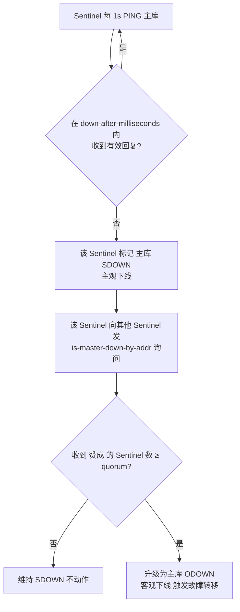

**为什么要分主观/客观？** 防止单个哨兵因自身网络分区误判，盲目切主造成"不必要的切换 + 连接风暴"。`quorum` 是"确认人数门槛"，通常设哨兵数的 minority+1（如 3 哨兵设 2）。

> 注意：`quorum` 只决定"能不能判定 ODOWN / 能不能发起选举"，**不等于**故障转移需要的"投票多数派"。两者独立。

### 3.3 领导者选举：基于 Raft 思想的 Sentinel 选举

确定主库 ODOWN 后，**不是所有哨兵一起切主**，而是先选一个 **leader Sentinel** 来独家执行故障转移（避免多个哨兵同时操作造成混乱）。

选举思想来自 Raft 的"任期（epoch）+ 先到先得投票"：

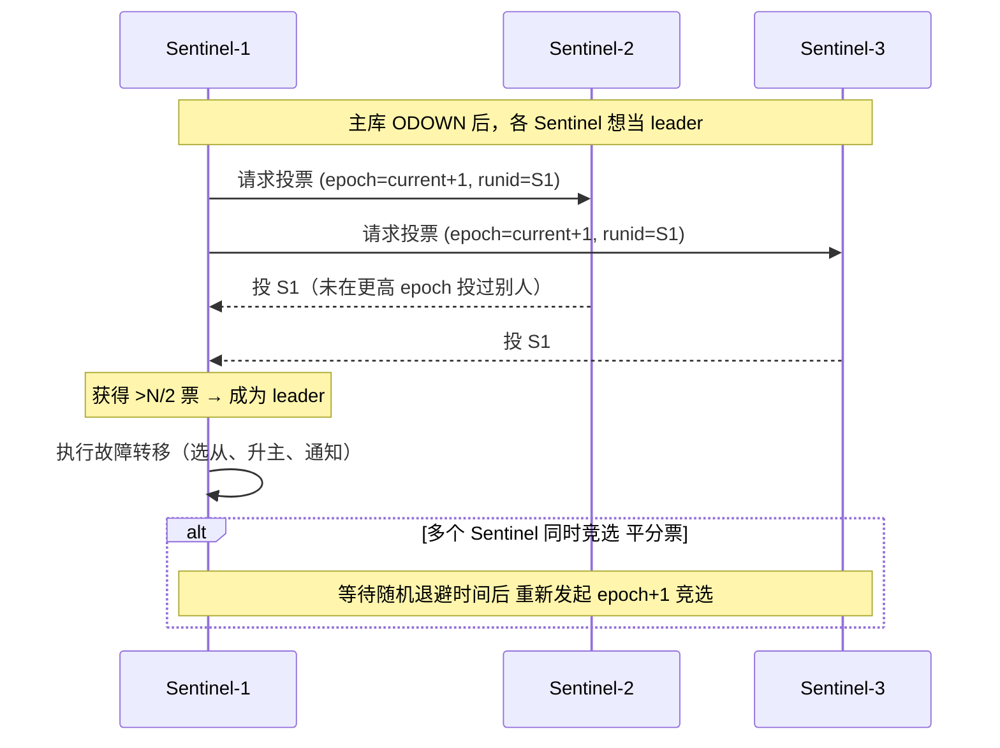

**要点：**
- 每个 Sentinel 在**每个 epoch 只投一票**（先到先得），且只投给自己支持的、epoch 更高的请求。
- 想当选 leader 需要 **超过半数**（majority）哨兵支持，所以哨兵数必须奇数（3/5），否则可能选不出。
- 若一轮没人过半（平票），**随机退避后重新竞选**（epoch+1），类似 Raft 的选举超时随机化，避免活锁。

> **为什么不用单纯"多数派确认就直接切"？** 因为多个哨兵若都去执行"选从升主 + 让其他从改主"，会出现"多个新主争抢""从库被反复重定向"。先收敛出唯一执行者（leader），把"决策"和"执行"分离，是分布式系统常见套路（Raft leader、ZK leader 同理）。

### 3.4 故障转移五步

leader Sentinel 当选后执行：

1. **选最优从库**：优先级（`replica-priority`，小优先）→ 复制偏移最大（数据最新）→ `run_id` 字典序最小。
2. **晋升**：对选中的从库发 `REPLICAOF NO ONE`（老 `SLAVEOF NO ONE`），使其成为主。
3. **其他从改主**：让剩余从库 `REPLICAOF` 新主，开始全量/增量同步。
4. **旧主降级**：若旧主复活，让它成为新主的从（避免脑裂双主）。
5. **通知客户端**：通过 pub/sub 频道 `__sentinel__:hello` / `switch-master` 推新主地址，客户端（Jedis/Sentinel 连接池）重连。

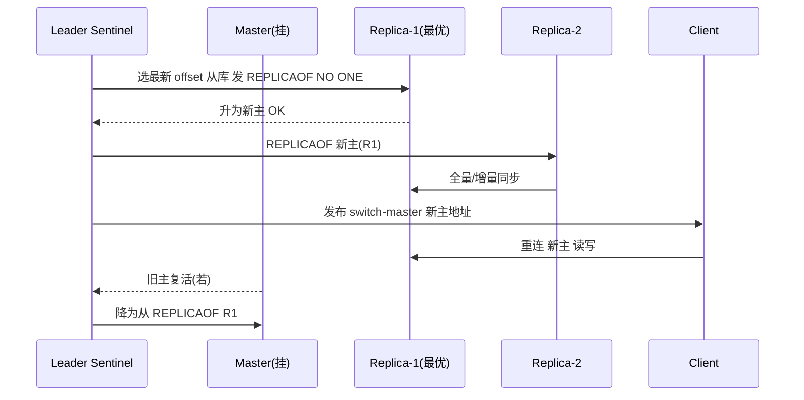

### 3.5 Sentinel 的不足

- **写不扩**：主仍是单点写，QPS/容量天花板没解决，只解决"挂了自动切"。
- **客户端改造**：应用要接 Sentinel 获取主地址（JedisSentinelPool / Lettuce 的 Sentinel 模式），不再直连固定 IP。
- **误判切换**：网络抖动 + `down-after-milliseconds` 过小 + `quorum` 过低，会误切主，引发连接风暴（XTransfer 真实事故，见八）。
- **配置繁琐**：哨兵数、quorum、各实例 `replica-priority` 都要规划。

### 3.6 Sentinel 关键配置

```bash
# sentinel.conf
sentinel monitor mymaster 10.0.0.1 6379 2   # 监控主库，quorum=2
sentinel down-after-milliseconds mymaster 30000   # 30s 无响应判 SDOWN
sentinel parallel-syncs mymaster 1          # 故障转移时 同时向新主同步的从库数（小=稳，大=快）
sentinel failover-timeout mymaster 180000   # 故障转移超时
sentinel auth-pass mymaster <pwd>           # 主库有密码时
```

---

## 四、Redis Cluster 集群

当数据量/写 QPS 超过单主极限，必须用**分片（sharding）**把数据打散到多主。Redis Cluster 是官方**去中心化**分片方案，3.0 引入，生产主力。

### 4.1 数据分片：16384 槽位（slot）

Cluster 把**整个 keyspace 切成 16384 个 hash slot**（槽）：

- **映射规则**：`slot = CRC16(key) & 16383`（即 `CRC16(key) mod 16384`）。
- **归属**：每个节点负责其中一部分槽。集群状态 = 16384 个槽**全部被分配**且**无冲突**。
- **为什么是 16384？** 见九的追问。简答： gossip 心跳里槽位图用 `16384/8 = 2048` 字节（2KB） bitmap 即可表达全集群槽分配，足够用且消息紧凑；太多槽消息膨胀，太少则迁移颗粒度粗。

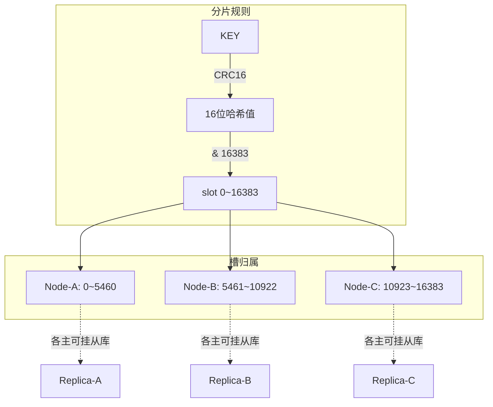

> 每个主节点可挂多个从（高可用），但从**不负责写**，只做主挂时的升主候选。

### 4.2 节点握手与 gossip

新节点加入集群不是"注册到中心"，而是**去中心化 gossip 传播**：

- `CLUSTER MEET <ip> <port>`：让节点 A 认识节点 B，A 把 B 信息存入自己的节点表。
- 之后 A、B 通过**集群总线端口（数据端口 + 10000，如 6379→16379）**互相发 gossip 消息（ping/pong），把"我认识的节点""槽分配""节点疑似故障"传播开来。
- 最终**每个节点都有全集群的节点视图 + 槽映射**（最终一致，无需中心元数据服务）。

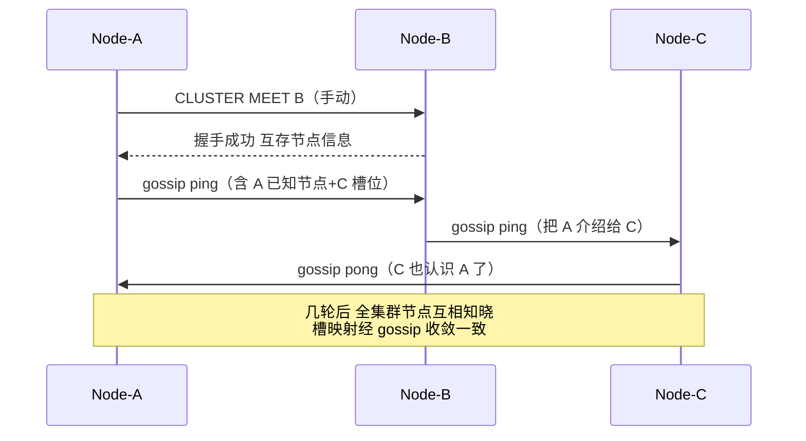

**gossip 四种消息**：`MEET`（邀请入群）、`PING`（探活 + 传播）、`PONG`（应答/广播）、`FAIL`（广播某节点已 FAIL）。

### 4.3 请求路由：smart client + MOVED/ASK

**smart client（智能客户端）**：如 JedisCluster / Lettuce，**本地缓存 slot→node 映射表**，计算 key 的 slot 后直接连对应节点，不必每次问集群。节点信息变化（槽迁移）时通过 MOVED 刷新本地表。

**两种重定向：**

| 类型 | 触发 | 含义 | 客户端处理 |
| --- | --- | --- | --- |
| **MOVED** | 槽已**永久**迁移到别的节点 | "这个槽现在归新节点，以后都去那" | 更新本地 slot→node 映射，重试新节点 |
| **ASK** | 槽**正在迁移中**（部分 key 还在旧节点） | "这个 key 正在搬，临时去新节点取一次" | 仅本次带 `ASKING` 去新节点，**不更新**本地映射（下次仍按旧映射问） |

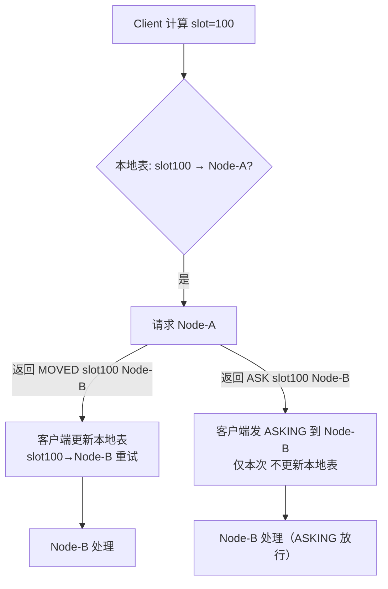

**为什么 ASK 不更新本地表？** 因为迁移是渐进的，还有很多 key 在旧节点。如果 ASK 也更新映射，会让本该去旧节点的请求误打到新节点。ASK 是"这一次的临时指引"，MOVED 才是"永久归属变更"。客户端必须区分二者。

### 4.4 故障检测与转移（PFAIL → FAIL → 选主）

集群内节点互相 PING，发现某主节点不可达：

1. **PFAIL（Possible Fail）**：单个节点在 `cluster-node-timeout` 内没收到某节点 PONG，标记它为 PFAIL（疑似）。
2. **FAIL**：当**多数主节点**都标记该节点 PFAIL 并通过 gossip 确认，升级为 FAIL（确认宕机），广播 `FAIL` 消息。
3. **从库竞选升主**：该故障主的所有从库参与选举，**epoch（任期）递增 + 拉票**，获得多数主节点投票的从库升为新主，接管原主的所有槽。
4. 若故障主**没有任何从库**，它负责的槽将**永久不可用**（集群拒绝这些槽的读写）。

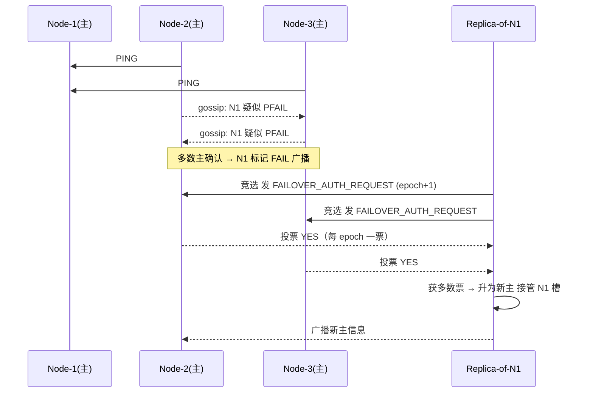

> 与 Sentinel 区别：**Cluster 的选主是"从库向其他主节点拉票"，无需单独的 Sentinel 进程**——集群自带故障检测与转移控制面。

### 4.5 副本与可用性边界

- 每个主可挂 0~N 个从。主挂 → 从升主。
- **主无副本 = 该主槽不可用**（单点故障即丢可用性）。所以生产务必"每个主至少 1 从"，且从库**跨机架/AZ**部署。
- `cluster-require-full-coverage`：默认 `yes`，**任一个槽不可用，整个集群拒绝写**（防部分数据丢失但看起来正常）。若设 `no`，则只有不可用槽拒绝，其他槽照常（按业务容忍度选择）。

### 4.6 扩缩容 resharding（槽迁移）

加节点扩容、减节点缩容，本质是**把部分槽从旧节点迁到新节点**，期间集群照常服务：

1. 新节点 `CLUSTER MEET` 加入集群（此时无槽）。
2. `CLUSTER SETSLOT <slot> IMPORTING <source>`（目标节点标记"准备接收某槽"）。
3. `CLUSTER SETSLOT <slot> MIGRATING <target>`（源节点标记"正在迁出某槽"）。
4. 用 `MIGRATE` 命令把该槽下的 key 逐批迁到目标节点（原子迁移，key 在目标节点存在前从源删除）。
5. 迁移期间：源节点收到该槽请求，若 key 已迁走 → 返回 **ASK** 重定向新节点；若 key 还在 → 本地处理。
6. 槽内 key 全迁完 → `CLUSTER SETSLOT <slot> NODE <target>` 正式把槽归属改到目标（广播 MOVED）。

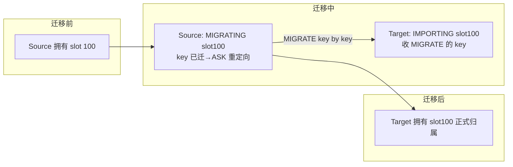

> 大 KEY 是 resharding 的噩梦：`MIGRATE` 是逐 key 原子的，**一个几百 MB 的 big key 迁移会阻塞源/目标节点很久**，甚至触发 cluster-node-timeout 误判。XTransfer 强制 big key 巡检（见八）。

### 4.7 多 key 操作与 hash tag

Cluster 要求**一个命令涉及的所有 key 必须在同一个 slot**，否则报错 `CROSSSLOT Keys in request don't hash to the same slot`。典型场景：`MSET`、`Lua 脚本`、`事务 MULTI`、`RPOPLPUSH`。

**解法 hash tag**：用 `{}` 强制只对括号内内容做哈希。例如 `user:{1001}:name` 和 `user:{1001}:age` 都只对 `1001` 算 CRC16，必落在同一槽，可一起操作。

> 但 hash tag 是双刃剑：**大量 key 用同一个 tag 会制造热点槽**（都落同一节点）。XTransfer 用 hash tag 把"同一账户的限额/余额/流水"绑同槽以便事务，但又用"账户 ID 打散 + 子分片"避免热点（见八）。

### 4.8 客户端路由实战（JedisCluster / Lettuce）

**JedisCluster**：
- 启动时给定若干 seed 节点，自动发现全集群节点 + 槽映射，缓存在 `JedisCluster` 内部。
- 遇到 MOVED 自动刷新映射并重试；遇到 ASK 自动带 `ASKING` 重试。
- 默认 `maxAttempts=5` 重试（含重定向）。

```java
Set<HostAndPort> seeds = Set.of(
    new HostAndPort("10.0.0.1", 6379),
    new HostAndPort("10.0.0.2", 6379));
JedisCluster cluster = new JedisCluster(seeds, 2000, 2000, 5, "pwd",
    new GenericObjectPoolConfig<>());
cluster.set("user:{1001}:name", "zhanghao");  // hash tag 保同槽
String v = cluster.get("user:{1001}:name");
```

**Lettuce**（基于 Netty，线程安全、异步友好，Spring Boot 2.x 默认）：
```java
RedisClusterClient client = RedisClusterClient.create(
    RedisURI.create("redis://10.0.0.1:6379"));
StatefulRedisClusterConnection<String,String> conn = client.connect();
RedisAdvancedClusterCommands<String,String> cmd = conn.sync();
cmd.set("order:{8899}:status", "PAID");
```
Lettuce 的 smart routing 同样本地缓存拓扑，并通过 `TopologyRefresh` 周期性/事件触发刷新（建议开 `enablePeriodicRefresh` + `enableAdaptiveRefreshTriggers` 应对网络分区后拓扑变化）。

---

## 五、Proxy 方案：Codis 与 Twemproxy

不是所有人都愿意改造客户端去接 Cluster 的"smart client"。**代理式方案**把分片逻辑放在 Proxy 层，对客户端**完全透明**（客户端当单实例 Redis 用）。

### 5.1 Twemproxy（nutcracker）

- Twitter 开源，**极轻量单进程代理**，C 写，性能高。
- **静态分片**：启动前配好分片规则（一致性哈希 / 取模 / 随机），**不支持在线扩容**——加节点要停服重分配数据。
- **单线程转发**（新版本可配多实例），代理本身可能成瓶颈/单点（需 LVS/HAProxy 前置）。
- 不支持多 key 跨分片、不支持事务（部分）。

### 5.2 Codis（豌豆荚）

Codis 是一套**完整的中间件体系**，专治 Twemproxy "不能在线扩容"的痛点：

```
codis-proxy（无状态，对客户端透明，多实例）
      ↑ 路由/转发
      │
codis-dashboard（控制面，管理 slot 迁移）
      ↑ 读写元数据
      │
zookeeper / etcd（存 槽→group 映射、proxy 列表）
      ↑
codis-server（基于 Redis 改版，支持 slot 迁移命令）
      ↑
codis-fe（Web 管理界面）/ codis-admin（CLI）
```

- **slot 默认 1024**（比 Cluster 的 16384 粗，迁移颗粒度更大但元数据更小）。
- **无状态 proxy**：客户端连 proxy 像连单 Redis；proxy 查 ZK 拿到 slot→group 映射，转发到对应 codis-server 组（每组一主多从）。
- **平滑扩容**：`codis-admin` 或 dashboard 触发 slot 迁移（类似 Cluster 的 MIGRATE，但由控制面编排），**业务无感**。
- **代价**：依赖 ZK/etcd、要维护 dashboard/fe 等组件；codis-server 是改版 Redis，**版本跟进慢于官方**（这是最大隐患）。

### 5.3 三者横向对比

| 维度 | Sentinel + 主从 | Redis Cluster | Codis | Twemproxy |
| --- | --- | --- | --- | --- |
| 扩写能力 | ❌ 单主写 | ✅ 多主分片 | ✅ 多主分片 | ⚠️ 分片但静态不扩 |
| 客户端透明 | ⚠️ 需 Sentinel 感知 | ❌ 需 smart client | ✅ 完全透明 | ✅ 完全透明 |
| 中心元数据 | 无（哨兵分布式） | 无（gossip 去中心） | 有（ZK/etcd） | 无（静态配置） |
| 在线扩容 | ❌ | ✅ resharding | ✅ slot 迁移 | ❌ |
| 运维复杂度 | 中 | 高（心智重） | 中高（组件多） | 低 |
| 官方原生 | ✅ | ✅ | ❌ 第三方 | ❌ 第三方 |
| 多 key/事务 | ✅（同主） | ⚠️ 需 hash tag | ⚠️ 同 slot | ⚠️ 同分片 |
| 故障转移 | Sentinel 自动 | 集群自动 | dashboard/HA | 需外部 HA |

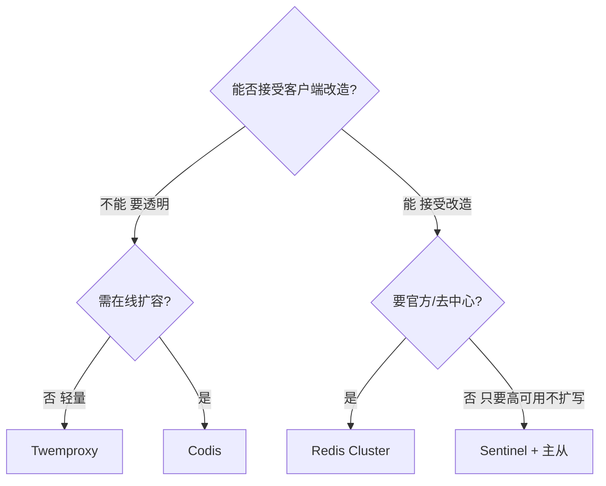

> 选型金句：**"要省心透明 → Codis/Twemproxy；要官方去中心、不怕改造 → Cluster；只是要挂了能自动切、不扩写 → Sentinel 足矣。"**

---

## 六、多活与跨机房

Redis 原生是**单主复制模型**，不支持多主双向写。跨机房"多活"需要额外设计。

### 6.1 同城双活 vs 异地多活

- **同城双活（同 Region 多 AZ）**：Cluster/Sentinel 跨 AZ 部署，从库在另一 AZ，主挂自动升从。延迟低（ms 级），**官方方案即可支撑**。
- **异地多活（跨 Region，如 上海 ↔ 新加坡）**：网络延迟 50~200ms，**同步复制不可行**（写 RT 爆炸）。Redis 原生不支持多主写，需：
  - **CRDT 方案**（如 Redis Enterprise 的 CRDB / 阿里 Tair）：合并冲突，成本高。
  - **同步组件**：业务层或中间件做双向同步（如 Canal + 自研、Redis-shake）。
  - **业务层单向/读写分离**：境外只读副本，写回境内（XTransfer 做法，见下）。

### 6.2 XTransfer 跨境多活缓存实战

XTransfer 是跨境支付，境内（上海）为主集群，境外（新加坡/香港）有**只读副本（replica）**：

- **读多写少**：境外用户查"限额/汇率/账户状态"等，走本地只读副本，**RT 从 200ms 降到 20ms**。
- **写回境内**：任何写（限额变更、订单状态）一律回境内主集群，境外副本通过**主从复制 + 准实时同步**（受跨洋延迟，秒级延迟可接受，因为是展示型缓存）。
- **同步保障**：用 `replicaof` 拉境内主 + 监控 `repl lag`；若 lag 超阈值（如 >5s）触发告警，境外降级"直连境内读"（牺牲 RT 保正确）。
- **冲突规避**：设计上**境外不写缓存**，从根源消灭多主写冲突。

> 这张图是 XTransfer 真实拓扑的简化：

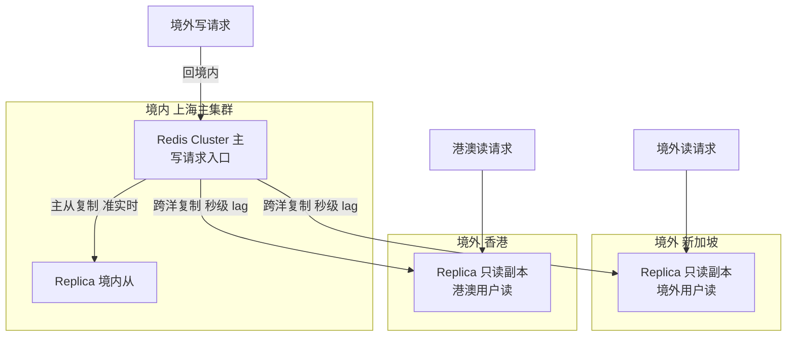

### 6.3 集群脑裂（split-brain）防护

**脑裂**：网络分区导致原主与多数从/哨兵失联，但原主仍对外服务（客户端还能写它），同时另一侧选举出新主——出现**双主同时写**，数据分歧，分区恢复后原主被降从、数据被丢弃 → **丢写**。

**Redis 防护：`min-replicas-to-write` + `min-replicas-max-lag`**

```bash
min-replicas-to-write 2        # 至少要有 2 个从库
min-replicas-max-lag 10        # 且这些从库延迟 ≤ 10s
```

含义：**主库只有在"健康从库数 ≥ 2 且延迟 ≤10s"时才接受写**。网络分区后，原主若与从库失联（从库数不足），**它直接拒绝写入**——宁可写失败，也不产生"双主写"的脏数据。分区恢复后无冲突，安全。

> 代价：牺牲了"分区期间原主可用性"换"一致性"。对支付场景，这正合适——**宁可拒绝交易，不可产生资损数据**。这是 CAP 里 C 优先于 A 的取舍。

---

## 七、【深度拓展】内核与运维

### 7.1 pub/sub、事务、Lua 在集群下的 slot 限制

- **pub/sub**：集群下 `PUBLISH`/`SUBSCRIBE` 是**节点本地**的，不会跨节点广播（除非用 `PUBSUB CHANNELS` 配合客户端或在所有节点订阅）。多节点发布需客户端对每个节点发，或用独立 pub/sub 集群。
- **事务（MULTI/EXEC）**：事务内所有 key 必须同槽，否则 `EXEC` 报 CROSSSLOT。要用 hash tag 绑同槽。
- **Lua 脚本**：`EVAL` 脚本里访问的所有 key 必须同槽（Redis 会检查 `cluster keyslot` 一致性），否则拒绝执行。脚本应尽量小、快，避免阻塞集群总线心跳（脚本执行期间节点无法响应 PING，可能被判 PFAIL）。

### 7.2 cluster-require-full-coverage

```bash
cluster-require-full-coverage yes   # 默认。任一个槽不可用→整个集群拒绝写
# 设 no：只有不可用的槽拒绝，其余槽正常（适合"部分降级仍可用"业务）
```
取舍：支付核心缓存建议 `yes`（宁可全拒，不漏写导致脏读）；非核心（如计数、排行榜）可 `no` 保可用。

### 7.3 节点通信开销（gossip 消息）

每个节点每秒随机 PING 部分节点（不是全量），被 PING 的节点回复 PONG。消息体含：
- 自身节点信息 + 部分已知节点信息（gossip 携带"我对别人的看法"）。
- 自身负责的槽 bitmap（2KB）。
- 故障节点标记。

**开销随节点数增长**：N 个节点，每节点维护 N 个节点视图，心跳总带宽约 O(N²/某常数)。**Cluster 节点数建议控制在几百内**（官方说最大 1000 节点但推荐 ≤ 几百）。超大规模应分多个 Cluster 而非单集群塞上千节点。

### 7.4 客户端缓存一致性

smart client 本地缓存 slot→node。**一致性靠**：
- MOVED 时强制刷新整张映射（因槽迁移是批量、可能连续多槽变动）。
- 连接异常 + 拓扑刷新（Lettuce 的 adaptive refresh）兜底。
- 周期性 refresh 兜底（防 gossip 收敛期间的短暂不一致）。

> 隐患：若客户端很久没刷新且拓扑变了，会把请求发错节点 → 收到 MOVED → 重试。这只是多一次 RTT，不丢数据，但**热点 key 集中重试**可能放大（客户端重试风暴）。JedisCluster 的 `maxAttempts` 和退避要配好。

---

## 八、【项目支撑】XTransfer 真实实战

### 8.1 热点账户：Cluster 打散 + hash tag 平衡

跨境支付里"限额缓存"按账户维度（如 `quota:{accountId}`）。早期用单实例，大商户账户（高频查限额/改额度）成为热点，单节点 CPU 打满。

**方案：**
1. 上 **Redis Cluster**，账户 ID 自然哈希分散到多节点，热点账户不再挤一个节点。
2. 但需要"同一账户的多笔操作原子"（限额扣减 + 余额校验），用 **hash tag**：`quota:{acct_8899}`、`balance:{acct_8899}` 同槽，保证 Lua 原子扣减可执行。
3. **防 hash tag 制造新热点**：对超大型商户，把账户 ID 再做"子分片"（如 `quota:{acct_8899_0}`~`quota:{acct_8899_7}` 8 个子 key 轮询），把单账户热点再打散到 8 个槽/节点。
4. 监控：Grafana 看各节点 CPU/内存/连接数，设置"节点间内存差异 >30% 告警"，防倾斜。

```mermaid
graph TD
    A[商户账户 acct_8899 高频] -->|单实例| H[热点 单节点 CPU 100%]
    A -->|Cluster + 子分片| S0[quota:{acct_8899_0} → Node-A]
    A -->|Cluster + 子分片| S1[quota:{acct_8899_1} → Node-B]
    A -->|Cluster + 子分片| S7[quota:{acct_8899_7} → Node-H]
    S0 -->|8 个子 key 轮询分散| S1
    S1 --> S7
```

### 8.2 一次主从切换抖动事故（Sentinel 误判）

**现象**：某次网络偶发抖动（交换机闪断 2s），Sentinel 把主库判 SDOWN 并快速（quorum 低 + down-after 短）触发 ODOWN 故障转移，主从切换。切换瞬间：
- 客户端连接池大量重连新主 → **连接风暴**，新主瞬时连接数飙到上限。
- 部分客户端缓存旧主地址重试 → 短暂写失败。
- 旧主恢复后被降从，期间双写风险（靠 min-replicas 兜住）。

**根因**：`down-after-milliseconds 5000` 偏小 + `quorum 1`（单哨兵即可判 ODOWN）+ 客户端无重试退避。

**优化：**
```bash
# sentinel.conf 调稳
down-after-milliseconds mymaster 15000   # 拉长，容忍短闪断
quorum 2                                  # 至少 2 哨兵确认才 ODOWN
```
- 客户端加重试退避（指数退避 + jitter），且"切换窗口"内降级（写失败转本地队列/异步补偿）。
- 哨兵与数据节点**分机架部署**，避免同交换机故障同时误判。
- 加 `parallel-syncs 1` 让从库逐个同步新主，避免带宽尖峰。

> 教训：**"高可用系统最怕的不是真故障，是误判故障"**。阈值保守一点，比频繁切换更稳。

### 8.3 大促前 resharding 扩容

大促前预估缓存容量 ×1.5，提前加 2 个节点并 resharding：
1. 新节点 MEET 入集群。
2. 用 `redis-cli --cluster reshard` 把约 1/3 槽从旧节点迁到新节点（官方工具自动编排 IMPORTING/MIGRATING/MIGRATE）。
3. 迁移期间监控 `cluster_state:ok`、各节点 `migrating/importing` 状态、`repl lag`。
4. **大 key 预巡检**：`redis-cli --bigkeys` / 自研扫描，提前拆分 >10MB 的 key，避免迁移卡住。
5. 迁移完验证槽全分配、无 `fail` 节点，再放开大促流量。

> 关键：**迁移要"低峰 + 限速"**。`--cluster-threshold` / 控制并发迁移槽数，避免迁移流量挤占业务带宽。

---

## 九、【面试官追问】

### Q1：PSYNC 为什么能部分重同步？backlog 满了会怎样？
**答**：从库重连时带 `run_id + offset`。若主库 `run_id` 未变（说明主没重启/没换），且从库 `offset` 还落在主库 `replication backlog`（环形缓冲）区间内，主库只需把 `offset` 之后的增量命令补发给从库即可，无需全量 RDB。backlog 是固定大小的环形缓冲，**若从库断线太久、期间主库写入字节超过 backlog 容量，从库的 offset 被新数据覆盖**，重连时只能**退化成全量复制**。

### Q2：Sentinel 怎么选 leader？为什么不用单纯多数派？
**答**：基于 Raft 思想——每个 Sentinel 发现 ODOWN 后，在递增的 epoch 内向其他哨兵"请求投票"，每个哨兵每 epoch 只投一票（先到先得），获得**超过半数**支持的成为 leader，独家执行故障转移。若平票则随机退避后 epoch+1 重选。**不用单纯多数派直接切**是因为多个哨兵同时执行"选从升主 + 让其他从改主"会冲突（多新主争抢、从库反复重定向），先收敛出唯一执行者（leader）是把"决策"与"执行"分离的标准做法。

### Q3：Cluster 的 16384 槽能不能改？为什么是 16384？
**答**：源码里 `CLUSTER_SLOTS = 16384` 是常量，改了不兼容（节点间槽 bitmap 大小、迁移协议都依赖它）。选 16384 的原因：
1. **消息紧凑**：gossip 心跳里槽分配用 bitmap，16384/8 = 2048 字节（2KB）即可表达全集群槽状态，消息不大。
2. **足够颗粒度**：16384 个槽对几百节点的集群，每节点分几十~上百槽，迁移颗粒度合理（太少如 4096 则迁移粒度粗，单槽数据可能过大）。
3. **CRC16 是 16 位**（最大 65535），16384 是其 1/4，取模运算快且留有余量。再多（如 65536）则心跳 bitmap 翻倍到 8KB，节点多时网络开销显著上升。

### Q4：MOVED 和 ASK 区别？客户端怎么处理？
**答**：**MOVED** = 槽已**永久**迁移到新节点，客户端应**更新本地 slot→node 映射**并永久重试新节点。**ASK** = 槽**正在迁移中**、该 key 已在新节点，是**临时**重定向，客户端要发 `ASKING` 后去新节点取，**但不更新本地映射**（下次仍按旧映射问旧节点，因为其他 key 可能还在旧节点）。区分二者是 smart client 正确性的关键。

### Q5：集群脑裂怎么防？min-replicas-to-write 原理？
**答**：脑裂是网络分区导致"原主仍服务 + 另一侧选出新主"双主写，分区恢复后原主降从、数据被丢弃 → 丢写。Redis 用：
```bash
min-replicas-to-write 2
min-replicas-max-lag 10
```
主库**仅在"健康从库数 ≥2 且延迟 ≤10s"时才接受写**。分区后原主若与从库失联（从库不足），直接拒绝写——宁可写失败也不产生双主脏数据。这是用"分区期间可用性"换"一致性"（CAP 里 C 优先），对支付合适。

### Q6：Codis 和 Cluster 怎么选？
**答**：
- 选 **Cluster**：要官方原生、去中心化、不想依赖 ZK/etcd 等额外组件；能接受客户端改造为 smart client；规模中等（节点数百内）。
- 选 **Codis**：要**对客户端完全透明**（不动业务代码）、要**平滑在线扩容**且运维有平台化诉求；能接受引入 ZK/etcd + dashboard 等组件；注意 codis-server 是改版 Redis，版本跟进慢于官方，有技术债风险。
- 都不选 Sentinel：仅当**不需要扩写**、只要高可用自动切换时用。

---

## 十、速查与实战

### 10.1 三种高可用方案选型矩阵

| 评估维度 | Sentinel + 主从 | Redis Cluster | Codis | Twemproxy |
| --- | --- | --- | --- | --- |
| 扩写能力 | ❌ | ✅ | ✅ | ❌（静态） |
| 数据一致性 | 强（单主） | 最终一致（gossip） | 最终一致 | 最终一致 |
| 运维复杂度 | 中 | 高 | 中高 | 低 |
| 客户端改造成本 | 中（Sentinel 感知） | 高（smart client） | 低（透明） | 低（透明） |
| 故障转移自动化 | ✅ | ✅ | ✅（依赖组件） | ❌（需外部） |
| 适用规模 | 中小 | 中（≤数百节点） | 中 | 小 |
| 单点组件 | 无 | 无 | ZK/etcd 中心 | 代理本身 |

### 10.2 集群常用命令

```bash
# 节点与槽
redis-cli -c -h 10.0.0.1 -p 6379 cluster meet 10.0.0.2 6379   # 握手
redis-cli cluster addslots {0..5460}                            # 分配槽（手动）
redis-cli cluster nodes                                        # 查看节点
redis-cli cluster slots                                        # 查看槽分布
redis-cli cluster info                                         # 集群状态

# 故障与切换
redis-cli -h <replica> cluster failover                        # 从库手动升主（优雅切换）
redis-cli cluster failover force                               # 强制（不顾主存活）

# 扩缩容（官方工具，推荐）
redis-cli --cluster add-node 10.0.0.4:6379 10.0.0.1:6379      # 加节点
redis-cli --cluster reshard 10.0.0.1:6379                     # 交互式迁移槽
redis-cli --cluster rebalance 10.0.0.1:6379                   # 再平衡槽
redis-cli --cluster del-node 10.0.0.4:6379 <node-id>          # 删节点（先迁走槽）

# 健康与排查
redis-cli cluster check 10.0.0.1:6379                         # 检查槽完整性
redis-cli --cluster fix 10.0.0.1:6379                         # 修复（如槽冲突）
redis-cli info replication                                    # 复制状态/offset/lag
redis-cli --bigkeys                                           # 大 key 巡检（迁移前必做）
```

### 10.3 故障排查 SOP

**SOP-1：集群不可写**
```
1. cluster info → cluster_state 是否为 fail？
2. 若 fail：cluster slots 看是否有槽未分配 / 节点 fail。
3. cluster-require-full-coverage=yes 时，任一槽无主即从拒写 → 恢复 fail 节点或 reshard 补槽。
4. 检查是否有节点内存打满（maxmemory + 淘汰策略）导致写入被拒。
```

**SOP-2：槽迁移卡住**
```
1. cluster nodes 看源节点是否 MIGRATING / 目标 IMPORTING 卡住。
2. 是否遇 big key？--bigkeys 排查，拆分大 key 后重迁。
3. 网络/带宽是否瓶颈？限速、低峰迁移。
4. 卡死可用 cluster setslot <slot> NODE <target> 强制归属（仅确认数据已迁完时）。
```

**SOP-3：脑裂 / 双主**
```
1. 确认网络分区恢复。
2. 旧主恢复后会被降从（Sentinel/Cluster 自动）；检查其数据是否被丢弃（看是否有写丢失告警）。
3. 防再发：配 min-replicas-to-write + min-replicas-max-lag。
4. 业务侧：写失败要有补偿（本地队列/对账），不依赖"切换瞬间不丢"。
```

**SOP-4：复制延迟过大（从库滞后）**
```
1. info replication → master_repl_offset - slave_repl_offset 差值。
2. 从库是否慢（大查询/持久化阻塞）？检查从库 CPU/IO。
3. 主库写入是否突增？replication buffer 是否撑爆导致从断线重全量。
4. 网络是否拥塞？跨机房尤甚，调 repl-backlog-size。
```

---

## 附录：本文与系列文章的关系

- 《MySQL 与 Redis 高频面试》合并文：缓存穿透/击穿/雪崩、一致性、基础数据结构 → 打基础。
- 《Redis 核心原理》（计划）：单实例线程模型、RDB/AOF、过期淘汰、内存管理 → 内核基础。
- **本文**：复制 / 哨兵 / 集群 / 故障转移 / 扩缩容 / 多活 → 高可用专项深化。

> 面试时按"单实例可靠性（持久化/淘汰）→ 多实例冗余（主从/哨兵）→ 横向扩展（Cluster/Codis）→ 跨机房（多活/脑裂）"的脉络讲，能从"会用"讲到"能设计"，正是 10 年工程师该有的深度。

---

*—— 本文基于一线跨境支付架构实战复盘*