> 这是我的主力项目，也是面试里最能展开讲、最能体现「资深」成色的一篇。它不只是一段经历，而是我 4 年（2022.6–2026.4）里对「资金系统该怎么建」这件事的全部认知沉淀。
>
> 本文分六大部分，层层递进：
> 1. **背景与核心**（为什么有这个平台、它到底在解决什么问题、约束是什么）—— 先讲清楚「问题域」；
> 2. **架构思路**（六边形 + CQRS + DDD 为什么这么选、演进历史、与业界对比、取舍代价）—— 讲清楚「解法域」；
> 3. **关键设计拆解**（状态机 / SPI / 任务补偿 / 风控 / 合规 / VA 开户 / 贸易订单 / 预入账）—— 九个机制逐一深入；
> 4. **重构战绩与架构亮点**（2.0 量化成果 + 亮点地图）；
> 5. **改进方向与未来规划**（当前架构的不足、8 条改进、3 年演进路线）—— 资深候选必须能讲「下一步往哪走」；
> 6. **面试高频问答 + 追问**。
>
> 所有内容都来自简历里的真实经历，**指标不编造**：超 1000w 笔对客结算、数百万客户、100+ 渠道 VA 开户、2.0 重构人效 +30%、生产问题 −80%、0 资损。

---

## 〇、这篇怎么读（导读）

如果你时间紧，按这个顺序抓重点：

- **想看「我做了什么」** → 直接看 §2 项目核心 + §11 重构战绩；
- **想看「架构深度」** → §3 架构思路 + §4~§10 关键设计；
- **想看「资深成色」** → §13 架构亮点 + §14 改进方向与未来规划（这部分最能体现 10 年经验，不是「我用了什么」，而是「我知道它哪里不够、下一步怎么补」）；
- **想看「面试怎么答」** → §15~§16 问答与追问。

---

## 一、业务背景与规模（原因背景）

### 1.1 行业背景：跨境 B2B 收款为什么是个难题

要理解这个平台，先得理解「外贸中小企业收款」这件事天然难在哪。

传统跨境贸易里，中国卖家（外贸工厂、贸易公司、SOHO）要收海外买家付的钱，路径是：**海外买家 → 海外银行 → 跨境清算网络（SWIFT 等）→ 国内银行 → 卖家账户**。这条链路有几个结构性痛点：

1. **链路长、不透明**：一笔钱从美国买家付到深圳卖家账上，可能经过 2~3 家中间行，每一家都扣费、都耗时，到账慢、费用高、过程看不见。
2. **合规重**：跨境资金涉及外汇管制、反洗钱（AML）、反恐融资（CFT）、KYC。卖家每收一笔，都要能证明「这笔钱对应真实贸易」，否则就是违规。
3. **小卖家被传统银行歧视**：传统银行服务大客户划算，中小外贸卖家笔数多、金额小、合规成本高，银行要么不接、要么费率离谱。
4. **退款/纠纷/对账复杂**：跨境场景下拒付、调单、汇率波动都很常见，资金状态管理极其复杂。

**XTransfer 的出现就是为了解决这个「中小外贸企业收跨境钱难」的问题** —— 提供合规、低成本、透明的跨境收款账户（本质是帮卖家在合作银行开一个虚拟账户 VA，用来收海外款），再把「钱合规地结算给卖家」。

### 1.2 平台定位：不是「支付通道」，是「收款基础设施 + 合规中枢」

很多人把支付平台理解成「帮人转账」。但 XTransfer 的核心价值不止转账，而是三件事：

- **收款账户（VA）**：给每个卖家一个可用于收海外款的虚拟账户，背后连接 100+ 银行/渠道；
- **合规中枢**：每笔收款的贸易背景审核、外汇申报、反洗钱都在这完成；
- **结算引擎**：合规通过后，把钱结算到卖家国内账户（或保留在钱包）。

所以这是一个**「资金 + 合规 + 数据」三位一体**的系统，而不是单纯的「支付路由」。

### 1.3 业务全景：从预收款到结算的端到端

一笔钱在平台里的完整生命周期：

```
海外买家付款
   │
   ▼
[VA 虚拟账户收款]  ← 钱到了合作银行的卖家虚拟账户
   │  (渠道回调通知平台)
   ▼
[预入账]  ← 钱先挂上，贸易背景可能还没齐（详见 §10 预入账）
   │
   ▼
[风控审核]  ← 免关联 / 关联 / 渠道调单（独立子状态机，见 §7）
   │
   ▼
[合规申报]  ← 按渠道/场景动态表单收材料（见 §8）
   │
   ▼
[记账]  ← 复式记账、账户体系（见《账务账户体系与复式记账》）
   │
   ▼
[结算]  ← 把钱打给卖家（清结算，见《清结算体系》）
   │
   ▼
[对账]  ← T+1 与渠道/账务逐笔勾兑（见 §9 资金安全 + 《支付对账体系》）
```

这条链路的关键词是：**不可逆 + 强一致诉求 + 长流程 + 多外部依赖**。钱一旦动，就不能「随便回退」；但中间又要跨风控、申报、账务多个系统，每个都可能失败/超时。这就是后面所有架构决策的「问题源头」。

### 1.3.1 一笔 VA 收款的完整时序（实例）

光看流程还不够，用一笔真实 VA 收款把全链路串起来，才能体会「为什么每个机制都不可或缺」。

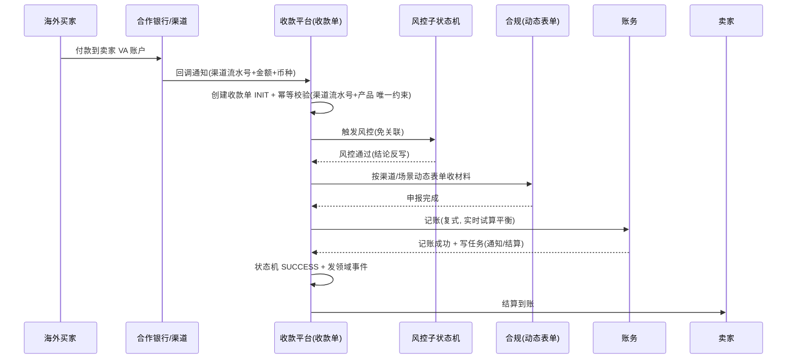

几点关键观察：

- **幂等校验在最前面**：渠道回调可能重发、可能晚到，靠「渠道流水号 + 产品」唯一约束 + CAS，重复回调命中终态直接忽略，绝不会重复记账。
- **风控是子状态机而非同步 if**：风控结论反写主状态机，主流程不阻塞在风控细节里。
- **合规表单是动态的**：不同渠道/场景渲染不同字段，新增渠道不改代码。
- **记账带实时试算平衡**：借贷不平立即告警（事中防线），不等问题堆到 T+1。
- **状态机收尾**：SUCCESS 由 CAS 保证只达成一次，后续结算/通知由事件驱动，解耦可重放。

> **【项目支撑】** 上面每一步都能对应到我主导 2.0 重构时的真实决策：幂等键设计、风控独立子状态机、合规动态表单、复式记账实时试算、状态机 + 事件——不是「分别学的技术」，而是「同一套约束前置 + 易变外置哲学」在不同环节的自然落地。

### 1.4 规模与复杂度量化

| 维度 | 量级 | 带来的挑战 |
| --- | --- | --- |
| 对客结算流程 | 超 **1000w 笔** | 高吞吐、数据量大、对账复杂 |
| 服务客户 | **数百万** | 多租户、个性化合规、并发高 |
| 收款产品 | VA / 收单 / A2A / 电商回款 | 产品差异大，需可扩展 |
| 接入渠道 | **100+** 银行/渠道 | 协议/字段/审核流各异，需配置化 |
| 核心 KPI | **0 资损** | 资金正确性 > 一切性能 |

这些数字不是「好看」，而是直接决定了架构选型：100+ 渠道意味着「硬编码 if/else」必死；1000w 笔意味着「对账/状态管理」必须自动化；0 资损意味着「可补偿、可核对、可观测」是硬约束。

### 1.5 核心约束（设计的「边界条件」）

做这个系统，有四条不可妥协的约束，任何架构决策都要先过这四条：

1. **资金正确性优先于性能**：宁可慢、宁可暂时不可用，也不能错账、丢钱。
2. **合规不可绕开**：每一笔收款都要有可追溯的贸易背景与申报，监管随时可查。
3. **扩展性是长期刚需**：渠道、产品、监管规则都在快速变化，核心不能每次都改。
4. **故障可恢复**：任何环节挂了，钱不能丢、状态不能乱，重启后能继续。

> **【深度拓展】** 为什么强调「约束」？因为很多初级工程师做架构是「堆技术」，资深工程师做架构是「先锁定不可妥协的约束，再在约束内找最优解」。这四条约束决定了：我们不能用 2PC（违反约束 4 的可用性）、不能靠人工对账（违反约束 3 的规模）、不能散落状态（违反约束 1 的正确性）。后面所有设计都是这四条约束的自然推论。

### 1.6 我的角色演进

- **初期（参与者）**：负责收款领域日常开发与维护，参与重大架构决策讨论；
- **中期（领域 Owner）**：成为收款领域 Owner，对域内技术决策、稳定性、交付质量负责；
- **重构期（主导者）**：深度主导收款领域 2.0 重构（架构治理 + 人效/质量提升）；
- **专项期（从 0 到 1）**：作为专项负责人，端到端主导「预入账」子领域建设（产品研讨 → 架构设计 → 项目管理 → 落地）。

这个演进本身也是面试亮点：**从「写功能」到「对一个领域的正确性、扩展性、稳定性负责」**，这正是 10 年经验与 3 年经验的分水岭。

### 1.6.1 跨团队协作与领域 Owner 的软技能

> 收款领域 Owner 不只是写代码，还要跨团队对齐——风控、合规、账务、渠道，每个域都有自己的目标和节奏。这种「**技术 + 沟通**」的双重能力是资深标志。

- **和风控团队对齐**：风控规则变更（新增风险模型、调整阈值）要提前通知收款域，确保状态机能兼容；
- **和合规团队对齐**：监管新规（如新增申报要素）要走「配置变更评审」，确认动态表单配置正确；
- **和账务团队对齐**：记账规则变更（如新增科目）要确保复式记账试算平衡不受影响；
- **和渠道团队对齐**：新渠道接入的接口/字段/审核流差异，在配置层对齐后灰度上线。

> **【项目支撑】** 预入账子领域（§12）的落地就是跨团队协作的典型——预入账涉及收款（我）、风控（风控团队）、合规（合规团队）、账务（账务团队），四方的规则和流程都要对齐。作为专项负责人，我不仅设计架构，还要**协调排期、对齐规则、管控风险、灰度上线**。这比纯写代码难——它要求你既能「深入技术细节」，又能「跳出代码看全局」。

---

### 1.7 监管全景：为什么合规是「一等公民」

跨境资金受多重监管叠审，理解这一点才能懂「为什么合规动态表单、贸易订单管理是核心模块而非附属」：

- **外汇管制**：中国对跨境资金有额度与用途管控，每笔收款要能对应「真实贸易」，否则涉嫌逃汇/洗钱；
- **KYC / AML / CFT**：平台要对卖家做实名与反洗钱审核，对资金来源做穿透；
- **渠道所在国监管**：VA 开户的合作银行在当地也受监管，开户材料、交易监测都要符合当地要求；
- **数据合规**：跨境数据流动（卖家信息、交易信息）要符合相关数据保护法规。

这意味着：**合规不是「收款之后的一个步骤」，而是贯穿收款全链路的约束**。风控子状态机、动态表单、贸易订单，本质都是「把监管约束翻译成系统里的可执行规则」。这也是为什么 XTransfer 的架构必须把「合规」做成可配置、可审计、可回溯——监管随时查，你必须随时答得上来。

> **【深度拓展】** 很多支付系统把合规当「后置校验」，结果监管一变就改代码、改到崩溃。XTransfer 把合规做成「前置约束 + 配置驱动」，监管变化只改配置（动态表单 + 规则），核心零改。这呼应 §2.3 的「易变外置」——监管规则是「最易变」的东西之一，必须外置。

### 1.8 跨境支付链路的资金流深度分析

> 理解跨境支付，关键是理解「钱怎么流、在哪停、谁管」。下面从资金流角度拆解。

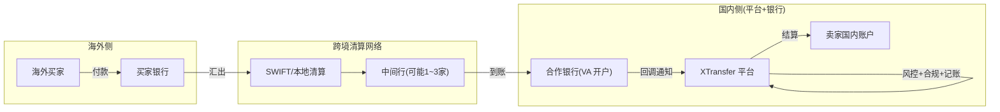

资金流的六个关键节点：

1. **买家付款**：海外买家通过本地银行发起跨境汇款（SWIFT 或本地清算网络）。
2. **中间行清算**：可能经过 1~3 家中间行，每家扣手续费、耗时 1~3 天。链路不透明是痛点。
3. **到账 VA**：钱到合作银行的卖家虚拟账户（VA），银行回调通知平台。
4. **平台处理**：平台收到回调 → 幂等校验 → 状态机 INIT → 风控 → 合规 → 记账 → 状态机 SUCCESS。
5. **结算**：平台把钱从 VA 结算到卖家国内账户（结汇：外币 → 人民币）。
6. **对账**：T+1 平台 ↔ 银行 ↔ 账务 三层逐笔勾兑。

> **【深度拓展】** 资金流和状态流是两条线——**资金流管「钱在哪」，状态流管「单到哪一步」**。两者必须最终一致：钱到 VA = 状态机 PROCESSING → SUCCESS；钱结算给卖家 = 状态机 SETTLED。对账就是核对这两条线是否一致。如果「钱到了但状态没更新」或「状态更新了但钱没到」，就是资损前兆。这就是为什么 T+1 对账要做「渠道 ↔ 平台 ↔ 账务」三层勾兑——每层核一条线。
>
> 和欧凡「库存流」对比：欧凡的库存也有两条线——**Redis 库存流**（实时扣减，防超卖）和 **DB 库存流**（异步落库，持久化）。对账就是核对 Redis 和 DB 是否一致。和 XTransfer 「资金流 vs 状态流」完全同构。

### 1.9 资金安全 vs 性能：不可妥协的优先级

> 在支付系统里，资金正确性和性能是**冲突**的。资深架构师必须能讲清楚「在冲突时怎么取舍」。

| 场景 | 资金正确性 | 性能 | 取舍 |
| --- | --- | --- | --- |
| 渠道回调 | 不能漏/不能重 | 希望快 | **正确性优先**（宁可慢一点补偿，不能丢/重） |
| 记账 | 借贷必须平衡 | 希望快 | **正确性优先**（试算不平宁可告警停） |
| 结算 | 金额必须准确 | 希望快 | **正确性优先**（宁延迟到账，不能打错钱） |
| 对账 | 必须逐笔勾兑 | 希望实时 | **正确性优先**（T+1 批量，不追求实时） |
| 查询(列表/报表) | 容忍秒级延迟 | 希望快 | **性能优先**（CQRS 读模型，弱一致可接受） |

> **【项目支撑】** 这个取舍矩阵是 2.0 重构的核心决策依据——**所有涉及资金的动作（回调/记账/结算/对账）正确性优先，所有不涉及资金的查询（列表/报表/看板）性能优先**。这就是 CQRS 读写隔离的哲学：写侧（资金）重约束强一致，查侧（报表）高吞吐弱一致。讲清楚这个取舍矩阵，比说「我们用了 CQRS」有深度得多。

## 二、项目核心：我们到底在解决什么问题

### 2.1 一句话核心

> **在一个渠道/产品/监管都高速变化的跨境环境里，把「收一笔海外款并合规结算给卖家」这件高约束、长流程、多依赖的事，做成「可扩展、可演进、资金零差错」的管道。**

### 2.2 核心矛盾：三难约束

这个项目最本质的矛盾是「**正确性 ↔ 扩展性 ↔ 可用性**」的三难：

- 要**正确性**（0 资损）→ 需要强约束、可核对 → 容易变「重」、变「慢」；
- 要**扩展性**（100+ 渠道、产品多变）→ 需要把差异外置 → 容易削弱「核心约束的统一性」；
- 要**可用性**（渠道回调晚、下游不可控）→ 不能用强一致锁资源 → 又给「正确性」带来挑战。

任何单一方案都只能解其中两个、牺牲第三个。XTransfer 的架构本质是**「用机制设计同时逼近三个目标」**：

- 正确性靠**状态机 + 不可变流水 + 三道防线**；
- 扩展性靠**SPI + 配置化 + 领域拆分**；
- 可用性靠**最终一致（补偿）+ 事件驱动 + 降级**。

### 2.2.1 三难约束的可视化

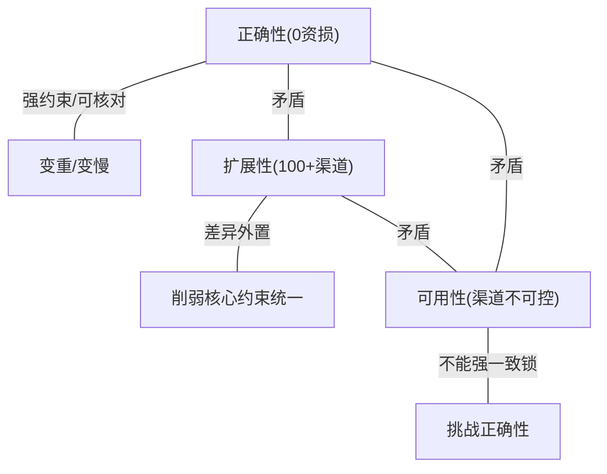

三条边两两矛盾：追求正确性会牺牲可用性（强一致锁资源），追求扩展性会稀释约束统一，追求可用性又挑战正确性。XTransfer 的解法不是「选两条放弃一条」，而是**用机制设计让三条同时逼近**：正确性靠状态机+流水+三道防线，扩展性靠 SPI+配置+领域拆分，可用性靠最终一致+事件驱动+降级。这正是一个资深架构师的价值——**不在约束间妥协，而在约束内找最优解**。

### 2.2.2 三难约束的业界对比

> 同样面对「正确性 ↔ 扩展性 ↔ 可用性」三难，不同公司的解法不同。

| 公司 | 正确性策略 | 扩展性策略 | 可用性策略 | 取舍重点 |
| --- | --- | --- | --- | --- |
| **支付宝** | 核心资金引擎 + 强一致 + 对账 + 冲正 | 产品工厂 + 渠道网关 | 同城双活 + 容灾切换 | 重「资金底座」，强一致优先 |
| **Stripe** | 不可变事件流 + idempotent key + 自动 reconciliation | payment_method 插件 | webhook 重放 + retry | 重「开发者体验 + 事件溯源」 |
| **XTransfer** | 状态机 + CAS + 三道防线 + T+1 对账 | SPI + 配置化 + 领域拆分 | 最终一致（补偿）+ 事件驱动 + 降级 | 重「产品/渠道多变 + 规则稳定」 |

> **【深度拓展】** 三种解法没有绝对优劣，只有「**匹配场景**」：
> - 支付宝是「大平台 + 大流量 + 同城双活」，强一致底座 + 产品工厂扩展 + 双活保可用——重但稳；
> - Stripe 是「API 为中心 + 开发者优先」，事件溯源 + 插件 + webhook 重试——轻但门槛高；
> - XTransfer 是「渠道多 + 规则变」，状态机 + SPI + 补偿——中等复杂度，匹配「100+ 渠道但不需要支付宝级的强一致底座」。
>
> 选择不是「谁更先进」，而是「谁更匹配当前约束」。讲清楚这个对比，比说「我用了 DDD 比支付宝好」或「我们不如支付宝所以落后」都更有说服力——**资深架构师不比技术新旧，比匹配度**。

### 2.3 设计原则总纲（四条价值观）

我把这个项目贯穿始终的设计哲学提炼成四条，面试里能讲清楚这四条，比背技术名词值钱十倍：

1. **约束前置**：把「不变量」（如非法状态迁移、重复请求）在模型层就拦死，而不是靠下游发现。
2. **易变外置**：业务稳定的建模，技术/规则易变的配置化/外置（渠道差异、合规表单、产品扩展）。
3. **最终一致优于强一致**：在跨境不可控环境下，追求「可解释、可补偿、可重放」而非「瞬间强一致」。
4. **可观测可恢复**：每一步都要可追溯、可监控、可重放、可人工干预，钱不能因系统抖动而丢失。

> **【项目支撑】** 这四条不是我拍脑袋的，是从 2.0 重构的复盘里提炼的。重构前，状态散落、渠道硬编码、对账靠人，结果是「接一个渠道还一次技术债利息」；重构后用这四条原则治理，才换来人效 +30%、问题 −80%、0 资损。

---

## 三、整体架构：六边形 + CQRS + DDD（架构思路）

> 这一节是「解法域」的核心。我不只告诉你「用了什么」，更讲清楚「**为什么是它、它从哪来、代价是什么、和业界差在哪**」。

### 3.1 为什么不用传统三层架构（原因背景）

MVC / 三层（Controller→Service→DAO）在业务简单时完全够用。但收款领域有三个特征让三层架构**必然失控**：

1. **领域逻辑极重**：资金流转、状态约束、合规规则，这些是系统最值钱、最不能错的部分；
2. **外部依赖极多且易变**：渠道、风控、申报、账务、通知、MQ，每个都可能换实现；
3. **正确性要求极严**：散落在 Service/DAO 里的领域规则，会被 Spring、MyBatis 等技术细节「污染」，改一处牵全身。

三层架构下，领域规则往往「寄生」在 Service 方法里，和事务、远程调用、ORM 混在一起。**结果是：业务逻辑不可单测、不可复用、改一处怕一处、新人接手如履薄冰。** 这正是 2.0 重构前最痛的点。

### 3.2 六边形架构（Ports & Adapters）：把「业务」和「技术」切开

六边形的本质是：**领域核心只认「端口（interface）」，不认任何具体技术**。所有外部依赖（渠道、DB、MQ、外部 API）都是「适配器（Adapter）」，实现端口后插进来。

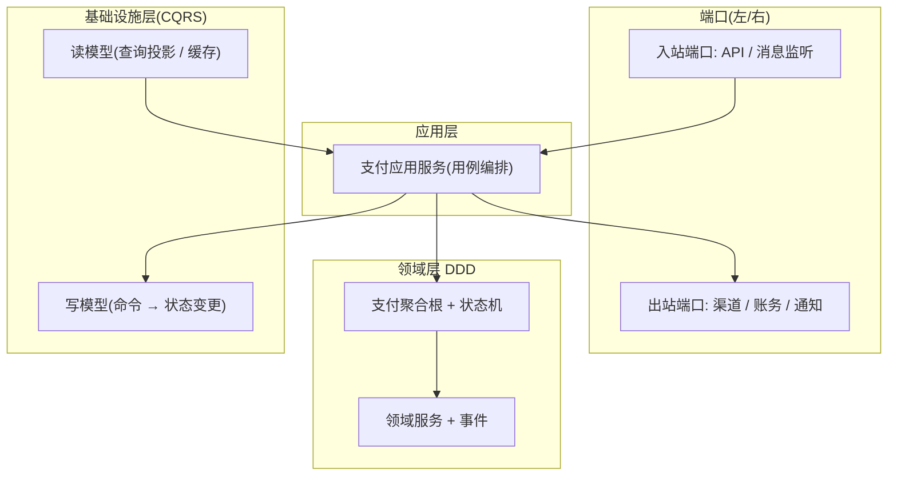

```
                 ┌────────────────  Driving Adapters  ───────────────┐
   外部调用 ───▶ │  HTTP API / MQ Consumer / 定时任务 / 渠道回调        │
                 └───────────────────────┬──────────────────────────┘
                                          │ ports(接口)
                 ┌────────────────  Application 应用层  ──────────────┐
                 │  应用服务 / 用例编排 / 状态机触发 / 事件发布          │
                 └───────────────────────┬──────────────────────────┘
                                          │
                 ┌────────────────  Domain 领域层(DDD)  ─────────────┐
                 │  聚合根(收款单/预入账单) / 领域服务 / 领域事件        │
                 │  SPI 扩展点(收款产品) / 任务补偿(最终一致性)         │
                 └───────────────────────┬──────────────────────────┘
                                          │ ports(接口)
   ┌─────── CQRS: 写模型 ───────┐   ┌──────── CQRS: 读模型 ────────┐
   │ MySQL(命令库) + 领域事件    │   │ 读库/ES/缓存(为列表/详情服务) │
   └───────────────────────────┘   └───────────────────────────────┘
                 ┌────────────────  Driven Adapters  ────────────────┐
                 │  DAO / 风控网关 / 申报网关 / 账务网关 / MQ 生产者    │
                 └───────────────────────────────────────────────────┘
```

**它解决了什么（面试必答）：**

- **可替换**：换渠道、换存储、换 MQ，只改适配器，领域核心零改。和简历里的 SPI 扩展收款产品（§6）天然契合。
- **可单测**：领域核心不依赖 Spring/DB，不启容器就能跑用例，测试快且准。
- **依赖方向单一**：所有箭头指向中心（领域），技术细节在边缘，符合「依赖倒置」。

> **【深度拓展】** 六边形的价值不在「画图好看」，而在**强制你定义「什么是领域、什么是技术」**。很多团队所谓的「DDD」只是把 package 叫 domain，里面照样 new RestTemplate —— 那不是六边形。真正的六边形，领域层 import 不到任何 `org.springframework`、`com.alibaba` 的包，所有外部能力都通过自己定义的端口接口拿。这个「编译期约束」比任何规范文档都管用。

### 3.3 CQRS：读写各走各的

收款流程里，**写（命令：创建、状态变更、记账）** 和 **查（列表、详情、对账、报表）** 的压力模型完全不同：

- 写侧：低频、重约束、要强一致、要发事件；
- 查侧：高频、多样化（列表分页、详情、风控看板、对账勾兑）、可弱一致。

CQRS 让写侧用领域事件驱动，读侧用独立读模型（甚至冗余到 ES/缓存），**避免「一个大事务里既写又查、还 join 一堆表」**。

> **【项目支撑】** 重构前，列表查询和收款写逻辑混在同一个 Service，导致「为优化列表查询加个索引，差点影响写事务」。CQRS 后读写物理隔离，列表再怎么查都不碰核心写链路。

### 3.4 DDD 领域建模：用统一语言对齐产品和研发

把「收款」拆成清晰的聚合：**收款单、预入账单、风控单、申报单、贸易订单**。每个聚合有边界（一致性边界），边界内强一致，边界间最终一致。

关键是**统一语言（Ubiquitous Language）**：产品、研发、测试对「收款单」「预入账」「风控结论」这些词的定义完全一致。这减少了「同一个词不同意思」的扯皮，也让领域事件命名稳定（事件名 = 业务动作名）。

### 3.4.1 分层包结构与一次请求全链路

落到代码组织，六边形的依赖方向是「领域在中心，端口在边界」：

```
com.xtransfer.collection
 ├── domain            // 领域层(不依赖 Spring/MyBatis)
 │    ├── model        // 聚合根: CollectionOrder / PreCreditOrder
 │    ├── event        // 领域事件
 │    └── spi          // 收款产品扩展点接口
 ├── application       // 应用层: 用例编排
 │    └── service      // 应用服务(触发状态机/发事件)
 ├── port              // 端口(接口): 入站/出站
 │    ├── in           // 入站: CollectionApi / CollectionConsumer
 │    └── out          // 出站: ChannelGateway / AccountGateway
 └── adapter           // 适配器(实现 port)
      ├── web          // HTTP 适配
      ├── mq           // MQ 消费适配
      ├── channel      // 渠道适配(SPI 实现)
      └── infra        // DAO/缓存/MQ 生产者
```

一次「渠道回调 → 状态变更」的链路：

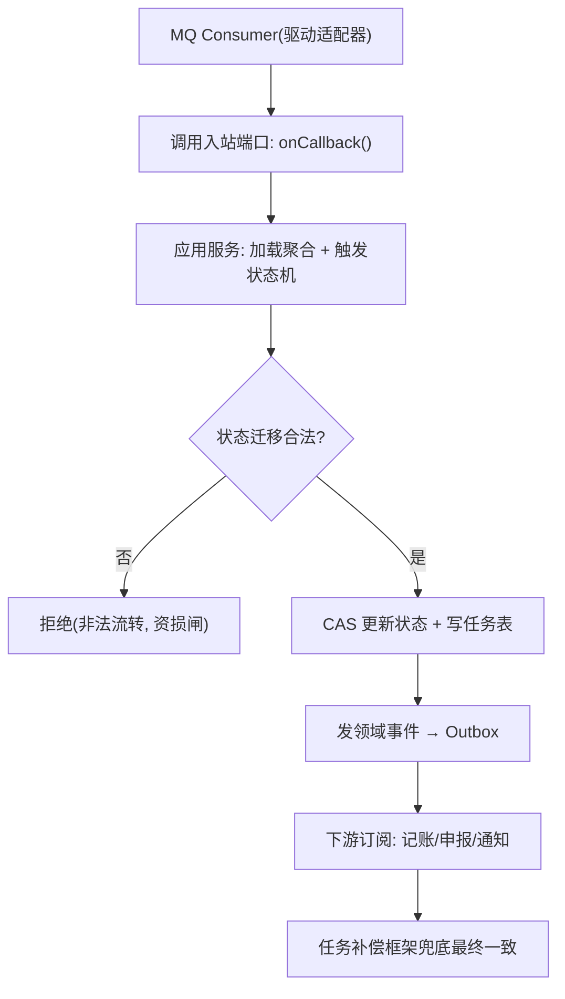

> **【深度拓展】** 注意 `domain` 包 import 不到任何 `org.springframework` / `com.baomidou` —— 这是六边形的「编译期硬约束」，比任何规范都有效。应用层只编排，不写业务规则；端口定义「能力契约」，适配器填空。新人看这个包结构，30 秒就能懂「哪里是核心、哪里能换」。

### 3.5 三者如何协同

- **六边形**管「依赖方向」（业务不依赖技术）；
- **CQRS**管「读写模型」（写重约束、查高吞吐）；
- **DDD**管「业务建模」（聚合、统一语言、不变量）。

三者是互补的：六边形是「外形」，CQRS 是「数据流」，DDD 是「内核」。结合起来——**新增一个收款产品 = 写一个 SPI 实现 + 配几个适配器 + 复用现有聚合和状态机，核心零改**。

### 3.5.1 CQRS 读写模型的代码级落地

> CQRS 不只是「读写分库」，而是一套「**写侧领域事件 → 读侧投影更新 → 查询走读模型**」的完整体系。

```java
// CQRS 写侧: 命令处理(状态变更 + 发事件)
public class CollectionCommandHandler {
    private CollectionStateMachine stateMachine;
    private OutboxEventPublisher eventPublisher;

    @Transactional
    public void handleCallback(CollectionCallbackCommand cmd) {
        // 1. 加载聚合根
        CollectionOrder order = orderDao.findById(cmd.getOrderId());
        // 2. 状态机迁移(CAS + 守卫)
        stateMachine.transit(order.getId(), PROCESSING, SUCCESS, "channel_callback");
        // 3. 写 Outbox 事件(同事务, 保证不丢)
        eventPublisher.publish(new CollectionSuccessEvent(order.getId(),
            order.getAmount(), order.getCurrency(), order.getCustomerId()));
        // 写侧不关心「列表怎么查」——读侧自己投影
    }
}

// CQRS 读侧: 事件订阅 → 更新读模型(投影)
public class CollectionProjectionHandler {
    @EventListener
    public void onCollectionSuccess(CollectionSuccessEvent event) {
        // 更新读模型(为列表/详情查询服务)
        CollectionReadModel readModel = new CollectionReadModel(
            event.getOrderId(), event.getAmount(), event.getCurrency(),
            event.getCustomerId(), "SUCCESS", LocalDateTime.now());
        readModelDao.upsert(readModel);  // 读模型表(可冗余到 ES/缓存)
    }
}

// CQRS 读侧: 查询走读模型(不碰写库)
public class CollectionQueryService {
    private CollectionReadModelDao readModelDao;  // 读模型(可为 ES/缓存)
    private CollectionOrderDao writeDao;  // 写库(主库)

    // 列表/详情: 走读模型(弱一致, 秒级延迟可接受)
    public Page<CollectionDTO> listCollections(CollectionQuery query) {
        return readModelDao.findByCondition(query);  // 走读模型, 不碰写库
    }

    // 「刚写入立刻查」: 走写库强读(关键场景)
    public CollectionDTO getByIdForceRead(Long orderId) {
        return writeDao.findById(orderId);  // 写库强读, 无延迟
    }
}
```

```sql
-- CQRS 读模型表(为列表/详情查询优化, 可冗余字段)
CREATE TABLE collection_read_model (
    order_id BIGINT PRIMARY KEY,
    customer_id BIGINT NOT NULL,
    customer_name VARCHAR(100) COMMENT '冗余客户名(避免 JOIN)',
    amount DECIMAL(15,2) NOT NULL,
    currency VARCHAR(3) NOT NULL,
    status VARCHAR(30) NOT NULL,
    channel_name VARCHAR(50) COMMENT '冗余渠道名(避免 JOIN)',
    created_at DATETIME NOT NULL,
    updated_at DATETIME NOT NULL,
    INDEX idx_customer_status (customer_id, status),
    INDEX idx_created (created_at)
) COMMENT 'CQRS 读模型(投影, 为查询优化, 可冗余到 ES)';

-- 对比写表: 只有核心字段, 不做冗余(保证写性能 + 一致性)
-- collection_order: order_id, customer_id, amount, currency, status, ...
-- 写表不加冗余字段(避免更新一致性), 读表加冗余(避免 JOIN)
```

> **【深度拓展】** CQRS 读写分离的核心是「**写表纯、读表冗**」：
> - **写表**只存核心字段（order_id, customer_id, status, amount），不加冗余（避免更新时一致性问题）；
> - **读表**加冗余字段（customer_name, channel_name），避免 JOIN，查询快。
>
> 读写一致靠「写侧发事件 → 读侧订阅更新读模型」。刚写入立刻查可能看到旧数据（读模型还没更新），解法：关键场景走写库强读（`getByIdForceRead`），非关键场景容忍秒级延迟。
>
> 和哈啰「读写分离（从库走报表，主库走写入）」的区别：哈啰的读写分离是「**主从复制**」（从库是主库的副本），XTransfer 的 CQRS 是「**读写模型分离**」（读表和写表结构不同，读表可冗余/可走 ES）。CQRS 比主从分离更彻底——不只是数据位置分离，连数据结构都分离。

> **【面试官追问】**
> - **追问1：读模型和写模型不一致（读模型没更新到），用户看到旧数据怎么办？** 应对：① 关键操作（结算/退款）走写库强读，不信任读模型；② 列表/详情容忍秒级延迟，用户刷新后即新；③ 读模型可重建（从事件重放），出问题批量重建。
> - **追问2：读模型放 MySQL 还是 ES？** 应对：简单查询放 MySQL（读模型表 + 索引够用）；复杂搜索（如按多条件模糊查）放 ES。我们列表/详情放 MySQL 读模型，复杂分析走 ES。
> - **追问3：读模型更新失败（事件消费失败）怎么办？** 应对：事件走 Outbox（保证不丢）+ 消费失败重试；读模型可从事件全量重放重建（这是 CQRS 的优势——读模型是投影，可重建）；监控读模型延迟，超阈值告警。

### 3.6 架构演进历史（从 1.0 到 2.0）

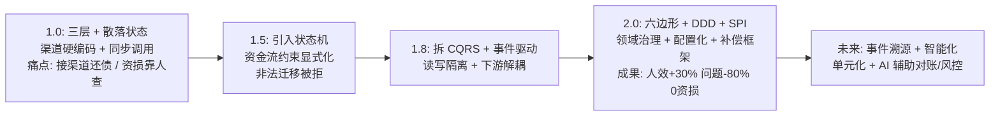

> **【深度拓展】** 这个演进不是「一步到位」，而是**问题驱动**的：先有「资损靠人查」的痛 → 上状态机；再有「读写互相拖累」的痛 → 拆 CQRS；再有「接渠道还债」的痛 → 上六边形 + SPI + 配置化。**架构是长出来的，不是设计出来的** —— 这句话我在面试里讲，比「我用了 DDD」有说服力得多。

### 3.7 与支付宝 / Stripe 对比

| 维度 | 支付宝 | Stripe | 我们（XTransfer） |
| --- | --- | --- | --- |
| 资金底座 | 核心资金引擎 + 产品工厂 + 渠道网关 | API 为中心 + 不可变事件流 | 六边形 + CQRS + DDD + SPI |
| 一致性 | 强一致 + 对账 + 冲正 | idempotent + webhook 重放 | 最终一致（补偿）+ 对账 |
| 扩展性 | 产品工厂 + 渠道网关 | payment_method 插件 | SPI 自动发现 |
| 取舍 | 重「资金底座」 | 重「开发者体验 + 事件溯源」 | 重「产品/渠道多变 + 规则稳定」 |

**我们不选事件溯源（Event Sourcing）的原因**：事件溯源要「全量事件重放」重建状态，团队门槛和落地成本高；而我们场景是「对客结算、秒级可接受」，用「状态表 + 任务补偿」已经足够，保留了事件驱动的半截收益（解耦、可重放），不强行吃事件溯源的复杂度。这是**贴合自身场景的取舍，不是技术落后**。

### 3.7.1 状态机的代码级落地

> 状态机不是「画个图」，要落到代码。下面展示收款单状态机的 Java 实现——配置化迁移规则 + CAS 更新 + 流水留痕。

```java
// 收款单状态机核心实现

// 1. 状态枚举
public enum CollectionStatus {
    INIT("待预收"),
    PROCESSING("处理中"),
    PRE_CREDITED("已预入账"),
    RISK_PENDING("风控中"),
    COMPLIANCE_PENDING("合规中"),
    ACCOUNTED("已记账"),
    SETTLED("已结算"),
    SUCCESS("成功"),
    FAILED("失败"),
    EXCEPTION("异常"),
    COMPENSATING("补偿中");
    // ...
}

// 2. 状态迁移定义(配置化, 可热加载)
public class StateTransition {
    private CollectionStatus from;
    private CollectionStatus to;
    private String event;        // 触发事件
    private String action;      // 迁移时执行的动作(bean#method)
    private boolean isTerminal; // 是否终态
}

// 3. 状态机引擎
public class CollectionStateMachine {
    private List<StateTransition> transitions;  // 从配置中心加载

    /**
     * 执行状态迁移(CAS + 流水留痕)
     * @return true=迁移成功, false=非法迁移或CAS失败
     */
    @Transactional
    public boolean transit(Long orderId, CollectionStatus expectedFrom,
                           CollectionStatus to, String event) {
        // 1. 校验迁移合法性(双保险: 配置 + 代码)
        if (!isLegalTransition(expectedFrom, to, event)) {
            log.warn("非法状态迁移: {} -> {}, event={}", expectedFrom, to, event);
            return false;
        }
        // 2. CAS 更新(天然幂等: 重复回调命中终态 WHERE 不匹配直接拒)
        int affected = orderDao.updateStatusCAS(orderId, expectedFrom, to);
        if (affected == 0) {
            log.info("CAS失败: order={} expected={} actual=?", orderId, expectedFrom);
            return false;  // 状态已变(并发/重复), 不处理
        }
        // 3. 写状态变更流水(可审计/可重放)
        orderStatusLogDao.insert(new StatusLog(orderId, expectedFrom, to,
            event, LocalDateTime.now(), SecurityContext.getCurrentUser()));
        // 4. 发布领域事件(走 Outbox 保证不丢)
        eventPublisher.publish(new CollectionStatusChangedEvent(orderId, expectedFrom, to));
        return true;
    }

    private boolean isLegalTransition(CollectionStatus from, CollectionStatus to, String event) {
        return transitions.stream()
            .anyMatch(t -> t.getFrom() == from && t.getTo() == to && t.getEvent().equals(event));
    }
}
```

```sql
-- 收款单状态变更流水表(可审计/可重放)
CREATE TABLE collection_status_log (
    id BIGINT PRIMARY KEY AUTO_INCREMENT,
    order_id BIGINT NOT NULL COMMENT '收款单ID',
    from_status VARCHAR(30) NOT NULL COMMENT '迁移前状态',
    to_status VARCHAR(30) NOT NULL COMMENT '迁移后状态',
    trigger_event VARCHAR(50) NOT NULL COMMENT '触发事件(channel_callback/risk_pass/...)',
    operator VARCHAR(50) COMMENT '操作人(system/auto/user_id)',
    created_at DATETIME DEFAULT CURRENT_TIMESTAMP,
    INDEX idx_order (order_id),
    INDEX idx_created (created_at)
) COMMENT '状态变更流水(状态即事实, 流水即证据)';

-- CAS 更新 SQL(天然幂等)
-- 重复回调命中终态时 WHERE 不匹配, affected=0, 不会重复记账
UPDATE collection_order
SET status = 'SUCCESS', updated_at = NOW()
WHERE id = #{orderId} AND status = 'PROCESSING';
-- 返回 affected_rows: 1=成功 0=状态已变(并发/重复)
```

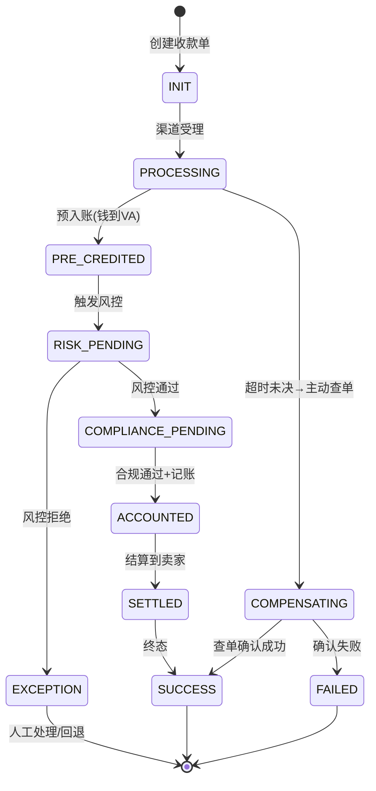

> **【深度拓展】** 状态机代码级落地的核心是「**状态即事实，流水即证据**」。状态字段回答「现在在哪」，流水表回答「怎么来的、谁动的」。两者配合，出资损争议时能 10 秒还原一笔钱的全路径。CAS 更新天然防并发 + 防重复——重复回调命中终态时 `WHERE status='PROCESSING'` 不匹配，`affected=0` 直接跳过，不需要额外幂等代码。
>
> 常见误区：① 状态机只校验不记流水——出了争议无法还原；② CAS 更新不加状态校验——只防并发不防非法业务跳转（如直接从 INIT 跳到 SUCCESS）；③ 流水表不记操作人——审计时不知道是系统自动还是人工触发。这三个坑我都见过，所以代码里都补了。

### 3.7.2 架构演进路线图深度解析

> §3.6 的演进图是简版，下面把每个阶段的技术决策、驱动力、代价展开讲。

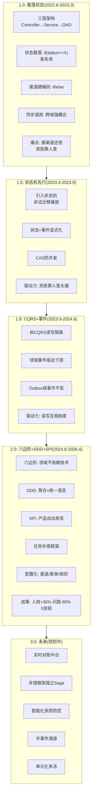

| 阶段 | 时间 | 驱动力(痛点) | 核心改造 | 代价 | 成果 |
| --- | --- | --- | --- | --- | --- |
| 1.0 | 2022.6-2023.3 | 快速上线 | 三层+散落状态+硬编码 | 技术债高 | 跑起来了 |
| 1.5 | 2023.3-2023.9 | 资损靠人查 | 状态机+CAS+流水 | 建模成本 | 非法迁移消灭 |
| 1.8 | 2023.9-2024.6 | 读写互相拖累 | CQRS+事件+Outbox | 一致性复杂度 | 读写隔离 |
| 2.0 | 2024.6-2026.4 | 接渠道还债 | 六边形+DDD+SPI+补偿+配置化 | 架构税高 | 人效+30%问题-80% 0资损 |
| 3.0 | 规划中 | 人工环节多 | 实时对账+Saga独立+智能化 | 仍在评估 | 待落地 |

> **【项目支撑】** 每次演进都是**问题驱动**，不是「追新技术」：
> - 1.0 → 1.5：因为资损靠人查太痛，先上状态机锁死非法流转（生死线优先）；
> - 1.5 → 1.8：因为列表查询和写逻辑混在一起，加个索引差点影响写事务，所以拆 CQRS；
> - 1.8 → 2.0：因为每接一个渠道都要改 N 处代码（还技术债利息），所以上六边形 + SPI + 配置化；
> - 2.0 → 3.0：因为人工看板/配置搬运/对账 T+1 仍有成本，所以要自动化/智能化。
>
> 这就是「**架构是长出来的，不是设计出来的**」——每个阶段的技术选型都是被前一个阶段的痛点逼出来的，不是一开始就规划好的。讲清楚这个「从痛到方案」的演化，比说「我用了 DDD」有说服力得多。

> **【面试官追问】**
> - **追问1：1.0 到 2.0 花了快 2 年，为什么不一开始就用六边形？** 应对：早期业务在变、团队在磨合，过早上架构会增加交付摩擦。六边形等架构的前提是「领域规则足够复杂、变化足够频繁」才划算。1.0 时只有 3 个渠道、规则简单，三层够用；到 50+ 渠道时才痛到必须重构。**架构选型要匹配当前阶段的复杂度**。
> - **追问2：2.0 重构期间怎么保证线上不停？** 应对：双写过渡——新旧并行写，读切新，确认稳定后停旧写；灰度按渠道切换；每一步可回滚。详见 §13.5 重构步骤。
> - **追问3：如果重来，1.0 到 2.0 最快能多快？** 应对：状态机和配置化从 day 1 就该上（1.0 的坑，见 §15.4），能省掉一半重构成本；但六边形/DDD 需要领域足够复杂才值，不能过早。**约束前置越早越便宜，但架构形式要根据复杂度匹配**。

### 3.8 取舍与代价（资深必须能讲清代价）

没有免费的设计：

- **六边形的代价**：初期要定义大量端口接口，样板代码偏多；端口太多可能变「接口地狱」（应对见 §3.9）。
- **CQRS 的代价**：引入读写一致性复杂度，刚写入立刻查可能看到旧数据（应对见 §3.9）。
- **DDD 的代价**：建模成本高，聚合边界划错会反噬（划太大会锁久，划太小一致性难）。
- **总代价**：前期「架构税」高。但对 100+ 渠道、0 资损的场景，这份税换来「新渠道零改核心」，长期极划算。

> **【面试官还会追问】**
> - **追问1：端口接口太多，变成「接口地狱」怎么办？** 按子域收敛端口（一个子域一组 ports）；用 SPI 自动注册减少手写；端口契约文档 + 适配器清单对齐，避免满屏 interface。
> - **追问2：CQRS 读写不一致，刚提交就查看到旧数据？** 分场景：列表/详情弱一致允许秒级延迟；「刚写入立刻查」强一致场景走写侧强读或短暂等待；结算前关键校验强制读写库，不信任读模型。
> - **追问3：DDD 聚合根边界怎么划？** 按「一致性边界」划——一次事务内必须同时一致的状态放同一聚合（如收款单 + 其风控结论）；划太大会事务长、锁久，划太小跨聚合一致性要靠事件最终一致补。

---

## 四、状态机 + 事件驱动：资金流如何流转

### 4.1 为什么状态机（原因背景）

资金状态（待预收 / 已预收 / 风控中 / 已申报 / 已记账 / 已结算 / 异常）有**强业务约束**：不能从「已结算」跳回「已预收」，不能「未风控就记账」。

如果用 `if (status == X) status = Y` 散落在各处：① 难维护（改一处怕漏一处）；② 易并发乱（两人同时改）；③ **防不住非法业务跳转**（代码层面不报错，但业务上不允许）。

状态机把「哪些迁移是合法的」**显式声明**，非法迁移直接拒绝 —— 这是**资金安全的第一道闸**。

### 4.2 状态机建模

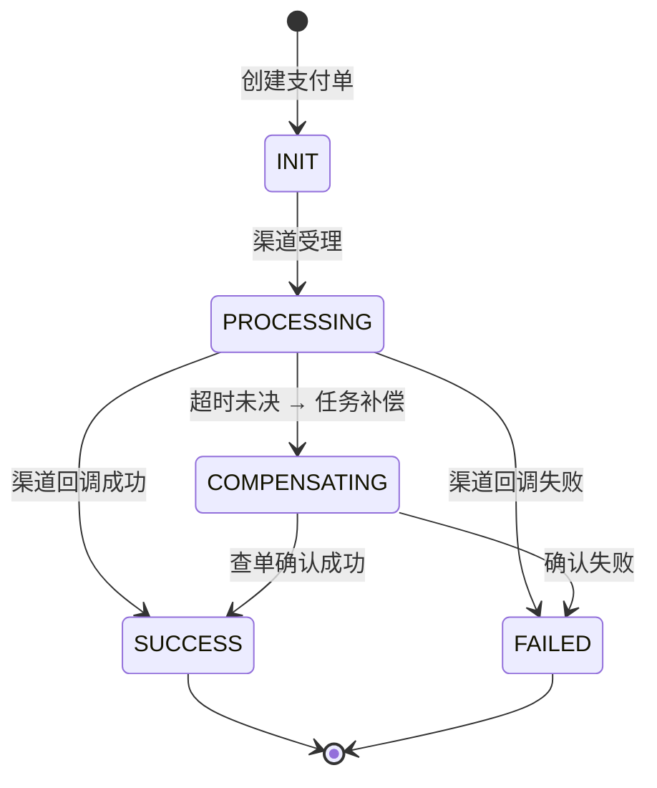

```
          渠道回调事件              风控结果事件            申报完成事件
 [待预收] ──────▶ [已预收] ──────▶ [风控中] ──────▶ [已申报] ──▶ [已记账] ──▶ [已结算]
    │                                                              │
    └──────────── 异常事件 ──────▶ [异常] ──(人工/补偿)──▶ 回退或继续
```

### 4.3 事件驱动机制

每一步落库后发**领域事件**（走 MQ / 领域事件表），下游（记账、申报、通知、对账）订阅处理。好处：

- **解耦**：收款核心不关心「下游怎么处理」，只发事件；
- **可重放**：事件留痕，出问题时可从事件重放恢复；
- **可观测**：每个状态变更都有迹可循。

**最终一致性**：跨服务（风控、申报、账务）不在一个事务里，靠「事件 + 任务补偿」保证最终一致（见 §6）。

### 4.4 两层防御：状态机 + CAS

状态机解决的不是「并发」，是「业务合法性」；乐观锁/CAS 解决的不是「合法性」，是「并发安全」。两者配合：

- **状态机**管「业务约束」：非法迁移被拒；
- **CAS**（`UPDATE … WHERE status=旧值`）管「并发安全」：重复回调命中终态，WHERE 条件直接拒掉，**零额外代码、天然幂等**。

> **【深度拓展】** 这是很多人讲不清楚的点：状态机 ≠ 并发控制。以为上了状态机就安全，是错的；以为 CAS 能防非法跳转，也是错的。XTransfer 是「状态机锁业务约束、CAS 锁并发」的双层，这才是资金流真正稳的原因。

### 4.5 事件溯源的取舍

我们用了「状态表 + 领域事件」，没用完整事件溯源。理由（§3.7 已讲）：事件溯源的「全量重放重建」成本高、团队门槛高，而我们用「状态表 + 任务补偿」已满足「可重放、可补偿」，只吃半截复杂度。

### 4.5.1 状态机的物理落地（状态表设计）

状态机不是「画个图」，要落到数据库：

- **状态字段 + 状态机版本**：每行记录当前状态 + 所用状态机版本，便于「老数据用老规则、新数据用新规则」共存。
- **CAS 更新**：`UPDATE collection_order SET status='SUCCESS' WHERE id=? AND status='PROCESSING'`，返回影响行数判断成败，天然幂等。
- **状态变更流水表**：每次迁移写一条「from→to + 触发事件 + 时间 + 操作人」，可审计、可重放、可排查。
- **迁移合法性校验**：应用层加载状态机定义，非法迁移在 commit 前就拒（双保险，不只靠 CAS）。

> **【深度拓展】** 状态表设计的核心是「**状态即事实，流水即证据**」。状态字段回答「现在在哪」，流水表回答「怎么来的、谁动的」。两者配合，出资损争议时能 10 秒还原一笔钱的全路径——这也是「可观测可恢复」原则在存储层的体现。

### 4.6 追问

- **追问1：状态爆炸怎么治理？** 用子状态机/正交状态拆分——主状态机只管交易生命周期，风控/合规各自独立子状态机，主状态只持有「结论字段」，避免笛卡尔积爆炸。
- **追问2：历史状态迁移怎么兼容老数据？** 状态机定义里保留历史状态为合法来源（老→新映射白名单）；上线前跑数据订正脚本批量映射；新状态不影响旧数据。
- **追问3：加状态/迁移怎么不中断线上？** 状态机配置化 + 热加载，新规则灰度；遵循「新增而非修改」，回滚只摘新规则。

### 4.7 状态机设计模式：从理论到工程

> 状态机不是「画个 UML 图」，而是一套「**状态定义 + 迁移规则 + 守卫条件 + 动作执行 + 事件发布**」的完整工程体系。

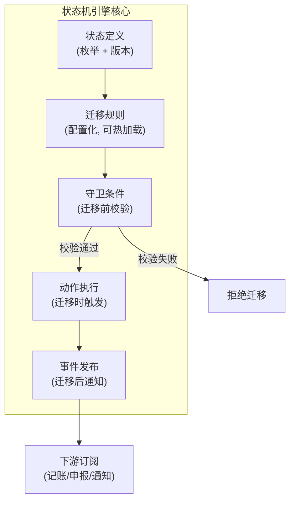

状态机的五要素（面试可直接背）：

| 要素 | 含义 | 落地方式 |
| --- | --- | --- |
| 状态(State) | 资金流的当前位置 | 枚举 + 状态机版本绑定到记录 |
| 迁移(Transition) | 允许的状态变化 | 配置化 `from → to + event` |
| 守卫条件(Guard) | 迁移前的前置校验 | 代码校验(如金额/额度) |
| 动作(Action) | 迁移时执行的操作 | `事件发布 + CAS更新 + 写流水` |
| 事件(Event) | 触发迁移的信号 | 渠道回调/风控结论/合规通过 |

```java
// 状态机五要素的配置化定义
public class StateMachineConfig {
    private List<StateDefinition> states;        // 状态定义
    private List<TransitionRule> transitions;    // 迁移规则
    private Map<String, Guard> guards;          // 守卫条件(bean#method)
    private Map<String, Action> actions;        // 动作执行(bean#method)

    // 示例迁移规则配置
    // from=PROCESSING, to=SUCCESS, event=channel_callback
    //   guard=channelCallbackGuard#validate
    //   action=successAction#execute(publishEvent + writeLog)
    //   isTerminal=true
}

// 守卫条件示例: 渠道回调校验
public class ChannelCallbackGuard implements Guard {
    public boolean check(Long orderId, Event event) {
        CollectionOrder order = orderDao.findById(orderId);
        ChannelCallback callback = (ChannelCallback) event.getPayload();
        // 1. 幂等校验: 同一渠道流水号不能重复处理
        if (order.getStatus() == SUCCESS) return false;  // 已终态, 拒
        // 2. 金额校验: 回调金额必须等于订单金额
        if (callback.getAmount().compareTo(order.getAmount()) != 0) {
            alertService.critical("金额不一致! order={} callback={}",
                order.getAmount(), callback.getAmount());
            return false;  // 金额不符, 拒绝迁移
        }
        // 3. 币种校验
        if (!callback.getCurrency().equals(order.getCurrency())) return false;
        return true;  // 校验通过, 允许迁移
    }
}
```

> **【深度拓展】** 状态机的守卫条件是「**事前防线的代码落地**」——在迁移前校验金额/币种/幂等，不合法的直接拒。这和「幂等键防重复」「限额校验」「状态机约束非法流转」是一套事前防线的多个层面。状态机不只是管「状态怎么转」，还管「转之前要校验什么」——这才是资金安全的完整保障。
>
> 常见误区：① 状态机只管迁移不做守卫——非法迁移（如金额不符的回调）照样放行；② 守卫条件散落在业务代码——改一处怕漏一处，应该配置化绑定到迁移规则；③ 守卫条件不做告警——拒绝迁移时静默，出问题不知道。解法都是「**守卫配置化 + 拒绝告警 + 守卫和迁移绑定**」。

### 4.8 状态机 vs 工作流引擎

> 面试官常问「为什么不用 Activiti/Camunda 工作流引擎？」——因为工作流引擎太重了。

| 维度 | 状态机(自研) | 工作流引擎(Activiti/Camunda) |
| --- | --- | --- |
| 复杂度 | 低（迁移规则 + CAS） | 高（BPMN 建模 + 引擎 + 表结构） |
| 性能 | 高（DB CAS，无引擎开销） | 中（引擎解析 + 多张 ACT_RU_* 表） |
| 适合场景 | 固定状态流转（收款/风控/合规） | 复杂流程编排（审批流/会签/分支） |
| 可控性 | 高（代码级可控） | 中（引擎黑盒） |
| XTransfer 选择 | **选**（状态固定、要强一致、要 CAS） | 不选（太重，资金流不需要 BPMN） |

> **【深度拓展】** 状态机和工作流引擎的本质区别：
> - **状态机**管「**状态怎么转**」（from → to + 守卫），适合**固定状态流转 + 强一致**场景（资金流）；
> - **工作流引擎**管「**任务怎么流转**」（谁审批 → 会签 → 分支 → 回退），适合**复杂审批流 + 人机交互**场景。
>
> 收款流程的状态固定（7~10 个状态）、不需要复杂审批流转、需要 CAS 强一致——自研状态机更轻更可控。如果有复杂审批流（如开户审批要多人会签），可以考虑用工作流引擎管审批部分，资金流仍用状态机。**两者不冲突，各管各的**。

---

## 五、SPI 机制：收款产品的可扩展接入

简历原话：「采用 **SPI 机制**扩展收款产品，遵循**开闭原则**。」

### 5.1 做法

定义收款产品扩展点接口（如 `CollectionProductSPI`），每个产品（VA / 收单 / A2A / 电商）实现自己的适配器，通过 SPI（Java SPI 或自研注册中心）自动发现加载。

```
            ┌─────────────┐
 调用方 ──▶ │ 收款产品门面 │── 按 productType 路由 ──┐
            └─────────────┘                          │
                  ├─ VAProductSPI (impl A)            │
                  ├─ AcquiringSPI (impl B)  ◀── SPI  │
                  ├─ A2AProductSPI (impl C)           │
                  └─ MarketplaceSPI (impl D)          │
```

### 5.2 为什么 SPI 比策略模式更彻底

策略模式通常要「显式注册到 map」，新增产品**仍要改注册代码**（违反严格开闭）；SPI 靠「约定目录自动发现」（Java `META-INF/services` 或 Spring 扫描），连注册都省。我们还能进一步做到「配置中心动态开关产品」，新产品灰度上线。

> **【深度拓展】** SPI 的本质是「类型 → 实现」的自动路由。比策略模式/工厂更彻底的地方在于**自动发现**——新增产品零改核心，符合严格开闭。这一步直接支撑了「100+ 渠道、产品多变」的扩展性诉求。

### 5.3 业界对比与代价

- **Stripe**：`payment_method` 类型 → 对应 processor 插件，更重「能力声明」（每个 method 声明支持哪些操作）；
- **支付宝**：渠道号 → 网关实现的工厂 + 配置；
- **我们**：接口实现模式 + 自动发现。

**代价**：实现类难追踪（调用链不如硬编码直观）；版本兼容（SPI 接口升级老实现不兼容）靠过渡约定；一个 SPI 实现抛异常可能拖垮主流程，必须熔断/降级隔离。

### 5.4 追问

- **追问1：多个 SPI 实现冲突/优先级？** 每个实现声明 `order` + 产品类型精确匹配；冲突按「最具体匹配 + 优先级」裁决并告警。
- **追问2：加载顺序/初始化依赖？** 实现类无状态、初始化不做重逻辑、不依赖彼此顺序；依赖通过端口注入，确保加载顺序无关。
- **追问3：能否热插拔/灰度？** 产品路由表放配置中心动态切换；灰度用「按比例/影子流量」，出问题秒切回旧实现。

### 5.5 SPI 的代码级落地

> SPI 不只是「定义个接口」，而是一套「**注解声明 + 自动扫描 + 路由表 + 熔断隔离**」的完整体系。

```java
// 1. SPI 扩展点接口(领域层定义, 不依赖任何技术框架)
public interface CollectionProductSPI {
    String getProductType();  // VA / ACQUIRING / A2A / MARKETPLACE
    CollectionResult collect(CollectionRequest request);
    boolean validate(CollectionRequest request);
    CollectionConfig getConfig();  // 产品配置(费率/限额/支持的币种)
}

// 2. 具体产品实现(VA 产品)
@SPI(productType = "VA", order = 1)
public class VAProductSPI implements CollectionProductSPI {
    private VAGateway vaGateway;  // 端口注入, 不认具体渠道

    @Override
    public String getProductType() { return "VA"; }

    @Override
    public CollectionResult collect(CollectionRequest request) {
        // 1. 校验
        if (!validate(request)) throw new ValidationException("VA收款参数校验失败");
        // 2. 调 VA 网关(端口, 具体渠道由适配器实现)
        VAResponse vaResp = vaGateway.receive(request);
        // 3. 构建结果
        return CollectionResult.builder()
            .channelTxnNo(vaResp.getTxnNo())
            .status(CollectionStatus.PROCESSING)
            .build();
    }
}

// 3. SPI 注册中心(自动扫描 + 路由表)
@Component
public class SPIRegistry {
    private Map<String, CollectionProductSPI> routeTable = new ConcurrentHashMap<>();

    @PostConstruct
    public void scanAndRegister() {
        // 扫描所有 @SPI 注解的类, 注册到路由表
        Reflections reflections = new Reflections("com.xtransfer.collection");
        Set<Class<?>> spiClasses = reflections.getTypesAnnotatedWith(SPI.class);
        for (Class<?> clazz : spiClasses) {
            SPI annotation = clazz.getAnnotation(SPI.class);
            try {
                CollectionProductSPI instance = (CollectionProductSPI) clazz.newInstance();
                routeTable.put(annotation.productType(), instance);
                log.info("SPI注册: {} -> {}", annotation.productType(), clazz.getSimpleName());
            } catch (Exception e) {
                log.error("SPI注册失败: {}", clazz, e);
            }
        }
    }

    // 路由: 按 productType 找实现
    public CollectionProductSPI getSPI(String productType) {
        CollectionProductSPI spi = routeTable.get(productType);
        if (spi == null) throw new ProductNotSupportedException("不支持的产品: " + productType);
        return spi;
    }
}

// 4. 调用方(应用层, 不认具体产品)
public class CollectionAppService {
    private SPIRegistry spiRegistry;

    public CollectionResult process(CollectionRequest request) {
        // 按 productType 路由到对应 SPI 实现
        CollectionProductSPI spi = spiRegistry.getSPI(request.getProductType());
        // 熔断隔离: 单个 SPI 实现抛异常不拖垮主流程
        return circuitBreaker.execute(() -> spi.collect(request));
    }
}
```

> **【深度拓展】** SPI 和策略模式的本质区别在「**注册方式**」：
> - **策略模式**：通常要显式注册到 Map（`map.put("VA", new VAStrategy())`），新增产品**仍要改注册代码**；
> - **SPI**：靠注解 + 自动扫描，新增产品只写 `@SPI(productType="NEW")` 的实现类，框架自动发现注册，**零改核心代码**。
>
> 这一步直接支撑了「100+ 渠道、产品多变」的扩展性诉求。和欧凡「策略模式」一脉相承，但更彻底——欧凡的策略模式可能还要改注册代码，XTransfer 的 SPI 连注册都自动了。

> **【项目支撑】**（STAR）
> - **S**：新接入一个收款产品（如电商回款），过去要改 N 处代码（路由 + 校验 + 适配 + 配置），平均 2 周。
> - **T**：让新产品接入只写一个 SPI 实现 + 配几个适配器，不碰核心。
> - **A**：用 `@SPI` 注解 + 自动扫描注册，新产品只写实现类，框架自动发现路由；配合配置中心动态开关，灰度上线。
> - **R**：新产品接入从 2 周降到 2 天（写实现 + 配置 + 测试），核心代码零改。

---

## 六、任务补偿：最终一致性的真实落地

### 6.1 为什么是补偿而不是 TCC（原因背景）

收款链路跨风控、申报、账务多个域，流程长、且每一步基本都可补偿（记账能冲正、申报能撤回）。强一致的 2PC/TCC 会长时间锁资源、可用性差、且对下游不可控（渠道回调晚）。我们选**状态机 + 任务补偿**：本地先落业务和任务，异步重试下游，失败走补偿脚本回滚，配合 Outbox 保证事件不丢，最终一致。

### 6.2 机制

1. 主流程写本地业务 + 写一张**任务表**（待执行补偿 / 待确认）；
2. 本地事务提交后，异步调度器按策略**重试**下游调用；
3. 下游成功则标记完成；失败则按**补偿脚本**回滚本地已做部分（或推进异常态走人工）；
4. 配合**状态机**，补偿结果反写状态，资金流最终收敛到一致。

```
 本地事务: 记账成功 + 写任务(通知风控/申报)
        │ commit
        ▼
 调度器轮询 待执行任务 ──调用下游── 成功? ──是──▶ 标记完成
        │                         │
       否                         失败
        │                          │
   重试(N次/退避)            执行补偿脚本(回滚/置异常)
```

### 6.3 我们做了两件（很多人只做一件）

- **任务补偿**：保证「下游动作最终达成」（任务表 + 重试 + 补偿脚本）；
- **Outbox**：保证「领域事件不丢」（本地事务写业务 + 事件表，独立投递器发 MQ）。

一个是「动作可靠执行」，一个是「事件可靠投递」，**两者互补** —— 这是和很多只做 Outbox 团队的本质区别。Saga 本身分「编排」和「协同」，我们用偏编排式：统一补偿框架扫描待执行任务，动作可追溯、可观测、可人工干预；代价是补偿框架本身要可靠。

### 6.4 方案对比

| 方案 | 一致性 | 复杂度 | 适用 | XTransfer 取舍 |
| --- | --- | --- | --- | --- |
| 2PC | 强一致 | 高，锁资源 | 同库短事务 | 不用，跨域锁太久 |
| TCC | 准实时 | 高，写三阶段 | 强约束资金 | 部分核心用，侵入大 |
| **Saga / 任务补偿** | 最终一致 | 中 | 长流程、可补偿 | **主选**：可用性友好 |
| 本地消息表 / Outbox | 最终一致 | 低 | 发消息不丢 | 与补偿配合（事件不丢） |

> **【深度拓展】** 业界：**Stripe** 用「idempotent requests + retry + webhook 重放」；**支付宝**用「对账 + 差错处理 + 冲正」。我们更接近支付宝（对账 + 补偿 + 冲正），但多了事件驱动的任务补偿把「事中」兜住，而非等问题堆到「事后对账」才发现。

### 6.5 真实案例：渠道回调晚到 6 小时，补偿如何兜住

讲一个 2.0 上线后真实的资损「未遂」：某东南亚渠道因自身故障，一笔成功收款的回调**延迟 6 小时**才到，期间平台因没收到回调，把这笔置为「处理中」，触发了**非终态卡单告警**（事中防线）。

- 若走「同步等待回调」的旧设计，这笔会卡 6 小时、卖家拿不到钱、客诉爆炸；
- 实际设计：状态机进入 `COMPENSATING`（超时未决），任务补偿框架主动**查单**（主动调渠道查询接口）确认「已成功」，CAS 把状态补到 SUCCESS，事件驱动后续记账/结算自动跑完。

结果是：卖家在回调到达前就因主动查单完成了结算，**资损 0、客诉 0**，全程无人工介入。这正是「状态机 + 任务补偿 + 事中告警」三件套协同的价值——不是某一个机制牛，是**组合拳**。

> **【项目支撑】** 这个案例我在复盘里作为「为什么选最终一致而非强一致」的铁证：强一致（2PC）在渠道不可控时会锁 6 小时，业务根本无法接受；最终一致 + 主动查单，把「不可控的等待」变成了「可控的补偿」。

### 6.5 追问

- **追问1：补偿失败且人工也处理不了？** 进「差错工单」挂账，资金先挂应收/应付，专差团队线下核实（联系渠道/银行）；账务走「挂账 + 后续冲正/补记」，账实最终一致、不丢钱，绝不假装成功。
- **追问2：补偿和幂等如何配合？** 每个下游动作带**幂等键**，补偿重复执行安全；补偿状态回写也用 CAS；「重试」和「补偿」共享同一幂等键。
- **追问3：补偿框架本身挂了？** 任务表持久化，框架重启继续扫描；多实例部署 + 任务**抢占（claim）**避免重复执行；死信转人工是最后兜底。

### 6.6 任务补偿框架的代码级落地

> 补偿框架不是「写个 while 重试」，而是一套「**任务定义 + 调度引擎 + 退避策略 + 死信兜底 + 可观测**」的完整体系。

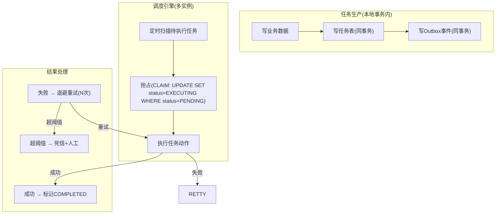

```java
// 任务补偿框架核心代码

// 1. 任务定义(枚举式, 每种动作一个补偿器)
public interface CompensationAction {
    String getType();  // 动作类型(notify_risk/notify_compliance/account...)
    boolean execute(Task task);  // 执行动作
    boolean compensate(Task task);  // 补偿(回滚)
}

// 2. 任务表(持久化, 重启不丢)
// CREATE TABLE compensation_task (
//   id BIGINT PRIMARY KEY,
//   biz_type VARCHAR(30),  -- 业务类型(collection/pre_credit)
//   biz_id BIGINT,         -- 业务ID
//   action_type VARCHAR(50), -- 动作类型
//   payload TEXT,          -- 动作参数(JSON)
//   status VARCHAR(20) DEFAULT 'PENDING', -- PENDING/EXECUTING/COMPLETED/FAILED/DEAD
//   retry_count INT DEFAULT 0,
//   max_retry INT DEFAULT 5,
//   next_execute_at DATETIME,  -- 下次执行时间(退避后)
//   idempotent_key VARCHAR(64) UNIQUE, -- 幂等键
//   created_at DATETIME,
//   updated_at DATETIME
// )

// 3. 调度引擎(多实例抢占)
public class CompensationScheduler {
    private Map<String, CompensationAction> actionMap;  // 动作类型 → 补偿器
    private TaskDao taskDao;
    private AlertService alertService;

    @Scheduled(fixedDelay = 5000)  // 每5秒扫描一次
    public void scanAndExecute() {
        // 1. 抢占待执行任务(UPDATE SET status=EXECUTING WHERE status=PENDING AND next_execute_at<=NOW() LIMIT 10)
        List<Task> tasks = taskDao.claimPendingTasks(10);
        for (Task task : tasks) {
            try {
                CompensationAction action = actionMap.get(task.getActionType());
                boolean success = action.execute(task);
                if (success) {
                    taskDao.markCompleted(task.getId());
                } else {
                    handleRetry(task);
                }
            } catch (Exception e) {
                log.error("任务执行异常 taskId={}", task.getId(), e);
                handleRetry(task);
            }
        }
    }

    private void handleRetry(Task task) {
        if (task.getRetryCount() >= task.getMaxRetry()) {
            // 超阈值 → 死信 + 告警
            taskDao.markDead(task.getId());
            alertService.critical("补偿任务死信: " + task);
        } else {
            // 退避重试: next_execute_at = NOW() + exponential_backoff(retryCount)
            long backoff = exponentialBackoff(task.getRetryCount());  // 1s, 2s, 4s, 8s, 16s
            taskDao.scheduleRetry(task.getId(), backoff);
        }
    }

    private long exponentialBackoff(int retryCount) {
        return (1L << retryCount) * 1000;  // 1s, 2s, 4s, 8s, 16s 指数退避
    }
}
```

> **【深度拓展】** 任务补偿框架的核心设计要点：
>
> 1. **任务和业务同事务**：写业务数据时同事务写任务表，保证「业务成功 = 任务一定被记录」。如果分开写，业务成功但任务没写入，就漏了。
> 2. **多实例抢占防重复**：多个调度实例同时扫描时，用 `UPDATE SET status=EXECUTING WHERE status=PENDING AND id=?` 抢占，返回 `affected=1` 的才执行。这是乐观锁思想。
> 3. **幂等键防重执行**：每个任务带幂等键，执行时先校验是否已执行过。重复执行（如抢占后实例宕机重试）安全。
> 4. **指数退避防风暴**：失败后不是立刻重试，而是指数退避（1s→2s→4s→8s→16s），避免下游未恢复时重试风暴。
> 5. **死信 + 告警兜底**：超过重试阈值不无限重试，进死信 + 告警人工介入。绝不假装成功。
>
> 和哈啰「Kafka 心跳补偿」对比：哈啰的补偿是「定时回扫历史心跳补触发」，XTransfer 的补偿是「任务表 + 调度引擎 + 退避 + 死信」。底层都是**幂等 + 重试 + 兜底**，但 XTransfer 的资金场景对「不可假装成功」要求更严（死信必须人工介入），哈啰的工单场景容忍度更高（漏触发的工单补触发即可）。

### 6.7 Outbox 模式的代码级落地

> Outbox 保证「领域事件不丢」。和任务补偿（保证「动作可靠执行」）互补——一个是动作可靠，一个是事件可靠。

```java
// Outbox 模式: 本地事务写业务 + 事件表, 独立投递器发 MQ

// 1. 事件表(同事务写入, 保证不丢)
// CREATE TABLE outbox_event (
//   id BIGINT PRIMARY KEY,
//   aggregate_type VARCHAR(50),  -- 聚合类型(collection_order)
//   aggregate_id BIGINT,         -- 聚合ID
//   event_type VARCHAR(50),      -- 事件类型(STATUS_CHANGED/ACCOUNTED)
//   payload TEXT,                -- 事件内容(JSON)
//   status VARCHAR(20) DEFAULT 'PENDING', -- PENDING/SENT
//   created_at DATETIME DEFAULT CURRENT_TIMESTAMP,
//   INDEX idx_status_created (status, created_at)
// )

// 2. 应用服务: 写业务 + 写事件(同事务)
@Transactional
public void processCallback(CollectionCallback callback) {
    // 写业务: 状态机迁移 + 记账
    orderStateMachine.transit(orderId, PROCESSING, SUCCESS, "channel_callback");
    accountingService.account(orderId);
    // 写任务: 通知风控/申报(同事务, 见 §6.6)
    taskDao.insert(notifyTask);
    // 写 Outbox 事件(同事务, 保证事件不丢)
    outboxDao.insert(new OutboxEvent("collection_order", orderId,
        "COLLECTION_SUCCESS", eventPayload));
}

// 3. 独立投递器: 扫描 PENDING 事件发 MQ(和业务事务解耦)
@Scheduled(fixedDelay = 1000)
public void deliverEvents() {
    List<OutboxEvent> pending = outboxDao.findPending(50);
    for (OutboxEvent event : pending) {
        try {
            mqProducer.send("collection_events", event.getPayload());
            outboxDao.markSent(event.getId());
        } catch (Exception e) {
            // 发送失败不标记, 下次重试(幂等: MQ 消费端按 event.id 去重)
        }
    }
}
```

> **【深度拓展】** Outbox 和任务补偿的区别是面试高频考点：
> - **任务补偿**保证「**动作可靠执行**」（通知风控、记账、结算——这些是「做一件事」）；
> - **Outbox** 保证「**事件可靠投递**」（发布 COLLECTION_SUCCESS 事件让下游订阅——这是「通知别人一件事发生了」）。
>
> 很多团队只做 Outbox（事件不丢）不做任务补偿（动作靠下游自己重试），结果下游挂了动作就漏了。XTransfer 两者都做——**动作可靠 + 事件可靠，互不替代**。这是和很多只做 Outbox 团队的本质区别。

---

## 七、风控流程：独立子状态机

### 7.1 为什么独立（原因背景）

风控是「主流程的一个节点」但自身是多阶段子流程（免关联 → 关联 → 渠道调单）。若塞进主状态机会让主状态机爆炸（主状态 × 风控状态笛卡尔积）。

### 7.2 设计

把风控抽成独立子状态机，主流程只关心「风控通过 / 拒绝 / 待补充材料」，内部阶段自管。材料/附件用「材料中心」统一收口，和「合规动态表单」（§8）同源：材料也是配置驱动的。

> **【深度拓展】** 这是「组合状态机 / 正交状态」思想：主流程只存「风控结论」字段，由子状态机结论反写，读时组装，避免「两份真相」。业界：**支付宝**风控是独立「决策引擎 + 案件系统」；**Stripe Radar** 是「评分 + 规则 + 人工复核队列」。我们偏「子状态机 + 材料中心」，更贴合跨境合规「需人工补充材料、监管要留痕」的场景。

### 7.3 追问

- **追问1：风控拒绝后用户申诉/补充材料，状态怎么回退？** 子状态机有「补充材料 → 重新评估」迁移；主状态机保持「风控中」直到出结论，避免主状态反复横跳。
- **追问2：风控调外部渠道调单超时？** 子状态机进「渠道调单中」带超时，超时按「待人工」或「默认策略」兜底，记录原因供复盘，不阻塞主流程过久。
- **追问3：主子状态机怎么保证不出现「主说通过、子说拒绝」？** 主状态机不存风控细节，只存「风控结论」字段，由子状态机结论反写。

### 7.4 风控子状态机的代码级落地

> 风控是独立子状态机，主流程只看「风控结论」。下面展示子状态机实现 + 结论反写。

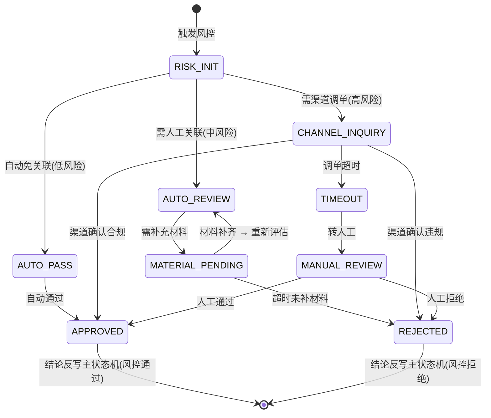

```java
// 风控子状态机
public class RiskSubStateMachine {
    private CollectionStateMachine mainStateMachine;  // 主状态机引用

    /**
     * 处理风控
     * 子状态机内部流转, 结论反写主状态机
     */
    @Transactional
    public void process(Long orderId, RiskContext context) {
        // 1. 初始评估: 根据风险等级分流
        RiskLevel level = riskEngine.evaluate(context);

        switch (level) {
            case LOW:
                // 低风险: 自动免关联通过
                transitRisk(orderId, RISK_INIT, AUTO_PASS, "auto_pass");
                conclude(orderId, RiskConclusion.APPROVED, "低风险自动通过");
                break;
            case MEDIUM:
                // 中风险: 需人工关联(要补充贸易背景材料)
                transitRisk(orderId, RISK_INIT, AUTO_REVIEW, "need_review");
                notifyMaterialRequired(orderId, "需补充贸易背景材料");
                break;
            case HIGH:
                // 高风险: 渠道调单
                transitRisk(orderId, RISK_INIT, CHANNEL_INQUIRY, "channel_inquiry");
                channelInquiryService.inquire(orderId, context);
                // 设置超时定时器
                scheduleTimeout(orderId, 48, TimeUnit.HOURS);
                break;
        }
    }

    /**
     * 风控结论反写主状态机
     * 关键: 主状态机不存风控细节, 只存结论
     */
    private void conclude(Long orderId, RiskConclusion conclusion, String reason) {
        // 1. 更新风控结论字段(主状态机上的结论字段)
        orderDao.updateRiskConclusion(orderId, conclusion, reason);
        // 2. 触发主状态机迁移
        if (conclusion == RiskConclusion.APPROVED) {
            mainStateMachine.transit(orderId, RISK_PENDING, COMPLIANCE_PENDING, "risk_approved");
        } else {
            mainStateMachine.transit(orderId, RISK_PENDING, EXCEPTION, "risk_rejected:" + reason);
        }
    }
}
```

> **【深度拓展】** 子状态机的核心价值是「**避免主状态机状态爆炸**」——如果风控的每个阶段（免关联/人工关联/渠道调单/材料补充）都放主状态机，主状态 = 交易生命周期状态 × 风控阶段 = 笛卡尔积爆炸。用子状态机后，主状态机只持有「风控结论」（通过/拒绝/待补充），内部阶段自管，读时组装。
>
> 这和欧凡「库存状态机（占用/预扣/实扣）」是同一思想——都是把复杂子流程封装成独立状态机，主流程只看结论。区别在：XTransfer 的子状态机管风控合规，欧凡的子状态机管库存生命周期。

---

## 八、合规流程：动态表单

### 8.1 为什么配置化（原因背景）

不同渠道、不同场景（B2B / B2C / 电商平台）申报要素不同；跨境申报要素随监管/渠道变化极快，硬编码页面改到崩溃。

把「表单结构」配置化（渠道 → 场景 → 字段集合），前端按配置渲染，**新增/调整申报要素不改代码**。这是「配置驱动」哲学的体现，和 SPI、规则引擎一脉相承。

> **【深度拓展】** 它和「规则引擎」「SPI」「VA 开户配置」是同一个家族 —— 统一哲学是「业务不变的东西建模，易变的东西配置化/外置」。监管报送本质就是「动态 Schema」，很多公司用「表单配置中心 + 校验规则引擎」；我们把它前置到「收款产品接入」阶段，让渠道差异在配置层消解，核心零改。

### 8.2 追问

- **追问1：动态表单校验规则怎么保证正确？** 校验规则配置化 + 版本化；上线前「影子校验」（新规则对历史数据跑一遍比对）+ 灰度，避免误杀真实申报。
- **追问2：配置错了导致漏报/错报谁负责、怎么发现？** 配置变更走审批 + 双人复核；事后「申报差错对账」发现遗漏，补报 + 复盘，不掩盖。
- **追问3：100+ 渠道表单差异巨大怎么管理配置爆炸？** 表单用「基础模板 + 渠道差异补丁」，公共字段抽基础模板，渠道只配差异。

### 8.3 动态表单的代码级落地

> 动态表单不是「手写 100 套页面」，而是「一套 Schema 引擎 + 配置驱动渲染」。

```json
// 合规表单配置示例(JSON, 存配置中心)
{
  "formId": "compliance_b2b_standard_v3",
  "channel": "bank_sea_001",
  "scenario": "B2B_COLLECTION",
  "version": "3.2.1",
  "fields": [
    {
      "name": "trade_contract_no",
      "label": "贸易合同号",
      "type": "string",
      "required": true,
      "validation": "^[A-Z0-9]{10,30}$"
    },
    {
      "name": "contract_amount",
      "label": "合同金额",
      "type": "decimal",
      "required": true,
      "validation": "amount > 0 && amount <= 10000000",
      "currency": true
    },
    {
      "name": "goods_description",
      "label": "商品描述",
      "type": "textarea",
      "required": true,
      "maxLength": 500
    },
    {
      "name": "customs_declaration",
      "label": "报关单",
      "type": "file_upload",
      "required": false,
      "condition": "contract_amount > 50000",
      "accept": "pdf,jpg,png",
      "maxSize": "10MB"
    }
  ]
}
```

```java
// 动态表单引擎
public class ComplianceFormEngine {
    private FormConfigService formConfigService;  // 配置中心

    /**
     * 按渠道 + 场景加载表单 Schema
     * 新增/调整字段只改配置, 不改代码
     */
    public FormSchema loadForm(String channel, String scenario) {
        // 1. 加载基础模板
        FormSchema base = formConfigService.getBaseTemplate(scenario);
        // 2. 加载渠道差异补丁
        FormSchema patch = formConfigService.getChannelPatch(channel, scenario);
        // 3. 合并: 基础 + 渠道差异(渠道可覆盖/增加/隐藏字段)
        return mergeSchema(base, patch);
    }

    /**
     * 校验提交的表单数据
     */
    public ValidationResult validate(FormSchema schema, Map<String, Object> formData) {
        ValidationResult result = new ValidationResult();
        for (FormField field : schema.getFields()) {
            // 1. 条件判断: 某些字段只在特定条件下必填(如金额>5万要报关单)
            if (field.getCondition() != null) {
                if (!evaluateCondition(field.getCondition(), formData)) continue;
            }
            // 2. 必填校验
            if (field.isRequired() && !formData.containsKey(field.getName())) {
                result.addError(field.getName(), field.getLabel() + "为必填项");
                continue;
            }
            // 3. 格式校验(正则/范围/类型)
            if (formData.containsKey(field.getName())) {
                if (!validateValue(field, formData.get(field.getName()))) {
                    result.addError(field.getName(), field.getLabel() + "格式不符");
                }
            }
        }
        return result;
    }
}
```

> **【深度拓展】** 动态表单和哈啰「aviator 规则引擎」、欧凡「策略模式」、携程「OLAP 路由配置」是同一设计家族——都是**把易变的东西从代码外置到配置**。区别在配置的对象不同：
> - XTransfer：配置「表单 Schema」（合规字段差异）
> - 哈啰：配置「表达式规则」（工单生成/有效性规则）
> - 欧凡：配置「活动策略」（不同活动不同逻辑）
> - 携程：配置「查询路由」（不同查询走不同引擎）
>
> 本质都是「**业务稳定的建模成代码，易变的配置化/外置**」。这是四个项目贯穿始终的设计哲学。

---

## 九、资金安全：三道防线

简历原话：「资金安全：多手段保障……**事前防御、事中告警（非终态、幂等异常告警、BCP 告警）、事后回溯比对（指标异常告警、对账）**。」

### 9.1 三道防线总览

| 防线 | 手段 | 例子 |
| --- | --- | --- |
| 事前 | 幂等、校验、限额、状态机约束 | 请求幂等键、金额/币种校验、状态机拒绝非法迁移 |
| 事中 | 实时监控告警 | 非终态卡单告警、幂等异常告警、BCP 告警 |
| 事后 | 回溯比对 | 指标异常告警、T+1 对账（与渠道/账务逐笔勾兑） |

### 9.2 事前：不让他错

- 幂等键（业务唯一标识 + 请求级双层，入库唯一约束兜底）；
- 金额/币种/账户校验；
- 状态机约束非法迁移；
- 多层限额 + 熔断 + 灰度发布。

### 9.3 事中：错了立刻知道

把对账从 T+1 前移到实时：

- **复式记账实时试算平衡**（借贷不平立即告警）；
- **四类资损前兆监控**：非终态卡单、幂等异常、金额突变、BCP 告警；
- 核心原则：**宁停勿错**（命中前兆先熔断，不盲目继续）。

> 详见《资损防控与极端场景应急（事前·事中·事后）》—— 那篇把 15 个极端场景（时钟回拨、脑裂、重复回调、汇率跳变、对账雪崩等）逐一推演。

### 9.4 事后：错了能找回来

- 三层对账（渠道 ↔ 平台 ↔ 账务）逐笔勾兑；
- 差错冲正 / 挂账 / 人工兜底；
- 归因复盘「该被哪道防线拦住」并前移。

> **【深度拓展】** 三道防线本质是一套通用框架：**事前「不让他错」、事中「错了立刻知道」、事后「错了能找回来」**。关键是三层要**闭环**——缺一层就可能出现「资损才发现」。和 **Stripe** 对比：Stripe 靠「强类型不可变事件 + idempotent key + 自动 reconciliation」，我们「事后」更重「T+1 多维护对账 + 差错冲正 + 人工兜底」，因为跨境涉及银行/渠道对账文件，必须有人工兜底。

### 9.4.1 对账差异的精细化分类处理

T+1 对账发现的差异，不能「一刀切冲正」，要按类型精细化：

- **长款（平台多收）**：通常是渠道已退但平台未冲，或重复入账。处理：挂应付、退回客户/渠道，绝不私吞。
- **短款（平台少收）**：渠道已收但平台未记。处理：视合同追偿，或走风险准备金兜底，保卖家体验。
- **在途差异（时效）**：因时区/批量文件延迟导致的「暂时对不上」。处理：标记在途，下一轮对账自动消，不误报。
- **汇损差异**：换汇时点不同导致的微小差额。处理：汇损补充机制补差（见 §11），属「口径差异」非真资损。
- **重复/漏记**：幂等键或任务补偿漏兜。处理：差错工单 + 补记/冲正，并回溯是哪道防线该拦没拦（前移）。

> **【深度拓展】** 把差异「分类」是事后防线的关键——不分类就无法针对性处理，也容易把「口径差异」误判成「真资损」引发误报。这也是 §2.2 讲的「真资损 vs 口径资损」区分在运营层面的落地。

### 9.5 追问

- **追问1：T+1 对账发现差错，但钱已结算给商户？** 差错分长款/短款，长款挂应付退回，短款视情况追偿或走风险准备金，差异进差错工单冲正/补记，绝不掩盖。
- **追问2：BCP 演练具体怎么做？** 定期演练「渠道不可用/DB 故障」，验证降级链路（人工导入对账文件、切换备用渠道），产出 RTO/RPO。
- **追问3：幂等键怎么设计才不漏不重？** 幂等键 = 业务唯一标识（渠道流水号 + 产品），请求级 + 业务级双层；入库唯一约束兜底，重复请求返回首次结果。

### 9.6 对账体系的代码级落地

> T+1 对账是「事后防线」的核心。下面展示三层对账的代码实现。

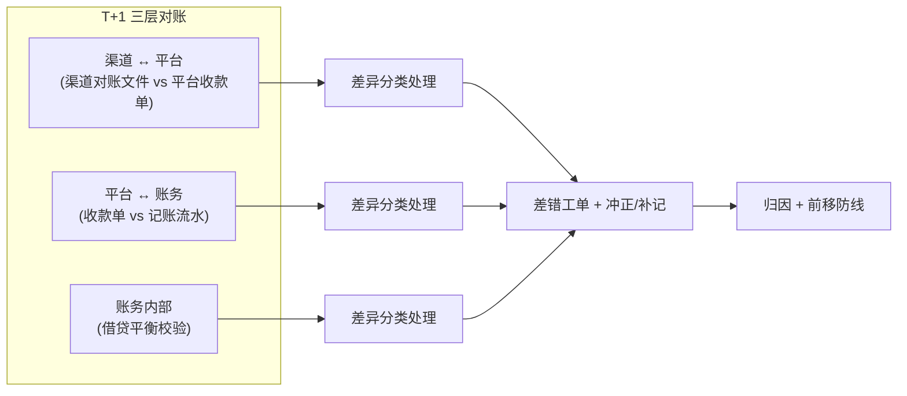

```java
// T+1 对账核心逻辑
public class ReconciliationService {

    /**
     * T+1 三层对账
     */
    public ReconciliationResult reconcile(LocalDate batchDate) {
        ReconciliationResult result = new ReconciliationResult();

        // 1. 渠道 ↔ 平台: 逐笔勾兑
        List<ChannelRecord> channelRecords = channelClient.fetchReconFile(batchDate);
        List<CollectionOrder> platformOrders = orderDao.findByDate(batchDate);
        result.setChannelPlatformDiff(reconcileChannelPlatform(channelRecords, platformOrders));

        // 2. 平台 ↔ 账务: 收款单 vs 记账流水
        List<AccountingEntry> entries = accountingDao.findByDate(batchDate);
        result.setPlatformAccountingDiff(reconcilePlatformAccounting(platformOrders, entries));

        // 3. 账务内部: 借贷平衡
        result.setBalanceCheck(checkDoubleEntryBalance(entries));

        // 4. 差异处理
        for (ReconciliationDiff diff : result.getAllDiffs()) {
            if (diff.getType() == DiffType.IN_TRANSIT) {
                diff.setStatus("IGNORED");  // 在途差异下轮自动消
            } else {
                diff.setStatus("PENDING");  // 非在途差异进差错工单
                alertService.warn("对账差异: " + diff);
            }
        }
        return result;
    }

    /**
     * 渠道 ↔ 平台逐笔勾兑
     */
    private List<ReconciliationDiff> reconcileChannelPlatform(
            List<ChannelRecord> channelRecords, List<CollectionOrder> platformOrders) {
        // 按 渠道流水号 建索引
        Map<String, CollectionOrder> platformMap = platformOrders.stream()
            .collect(Collectors.toMap(CollectionOrder::getChannelTxnNo, o -> o));

        List<ReconciliationDiff> diffs = new ArrayList<>();
        // 1. 渠道有 → 平台没有: 平台漏记(短款)
        for (ChannelRecord cr : channelRecords) {
            if (!platformMap.containsKey(cr.getTxnNo())) {
                diffs.add(new ReconciliationDiff(DiffType.SHORT, cr.getTxnNo(), cr.getAmount()));
            }
        }
        // 2. 平台有 → 渠道没有: 平台多记(长款)
        Set<String> channelTxnNos = channelRecords.stream()
            .map(ChannelRecord::getTxnNo).collect(Collectors.toSet());
        for (CollectionOrder order : platformOrders) {
            if (!channelTxnNos.contains(order.getChannelTxnNo())) {
                diffs.add(new ReconciliationDiff(DiffType.LONG, order.getChannelTxnNo(), order.getAmount()));
            }
        }
        // 3. 金额不一致
        for (ChannelRecord cr : channelRecords) {
            CollectionOrder order = platformMap.get(cr.getTxnNo());
            if (order != null && order.getAmount().compareTo(cr.getAmount()) != 0) {
                diffs.add(new ReconciliationDiff(DiffType.AMOUNT_MISMATCH,
                    cr.getTxnNo(), order.getAmount().subtract(cr.getAmount())));
            }
        }
        return diffs;
    }
}
```

> **【深度拓展】** 对账体系的跨项目映射——「两份数据核对 + 差异处理」在四个项目都有：
> - XTransfer：渠道 ↔ 平台 ↔ 账务 三层对账（§9）
> - 哈啰：薪资总额校验（Σ 实发 = 预期总额？）
> - 欧凡：Redis 库存 ↔ DB 库存 对账
> - 携程：预聚合 vs 原始重算 校验
>
> 本质都是「**最终一致必须有对账兜底**」，否则「发了没用、算了不准、扣了不对」会默默丢失。面试时讲清楚这个通用模式，比只说「我做了对账」有深度。
>
> 常见误区：① 只对账不处理——发现差异不分类处理，等于没对；② 差异不归因——每次都是「数据问题」，不知道是哪道防线该拦没拦；③ 归因不前移——找到根因但不补到事前/事中防线，下次还犯同样的错。解法都是「**发现 → 分类 → 处理 → 归因 → 前移**」闭环。

---

## 十、标准化 VA 开户系统：100+ 渠道快速接入

### 10.1 痛点（原因背景）

每个银行/渠道的开户接口、字段、审核流程都不同，100+ 渠道若散落 if/else 会爆炸。

### 10.2 解法：差异外置 + 配置化 + 领域拆分

1. **领域拆分**：把「开户流程编排 / 渠道配置 / 异常处理（处置）」拆成独立子域；
2. **渠道配置化**：渠道差异（接口、映射、审核流）收口配置中心，新渠道只填配置 + 少量适配；
3. **流程管理**：开户主流程用模板 + 状态机编排，渠道差异通过配置注入。

> **【深度拓展】** 「差异外置」是这四篇贯穿的核心哲学 —— 渠道差异本质是「接口协议 / 字段映射 / 审核流」三类，全抽到配置中心，和「合规动态表单」「SPI」一脉相承。100+ 渠道不崩的关键是「领域拆分」把稳定核心编排和不稳定差异隔离，新渠道是「填配置 + 薄适配」，核心零改。业界跨境 VA 开户本质是对接各家银行虚拟账户 API，成熟厂商都走「适配器 + 配置」（连接器模式），我们把它落地到 100+ 规模。

### 10.3 追问

- **追问1：渠道配置错导致开户失败率飙升？** 配置灰度 + 开户成功率监控；配置版本回滚；失败订单可「重跑开户流程」而非重新发起。
- **追问2：处置（异常）域怎么设计？** 开户异常分类（资料不符/渠道拒/超时），每类对应处置动作（补件/换渠道/人工），也走状态机 + 任务补偿。
- **追问3：100+ 渠道配置怎么防「一个错影响全局」？** 配置按渠道隔离命名空间；渠道级开关 + 熔断；核心编排不依赖具体渠道配置，单渠道故障不波及其他。

### 10.4 未来展望一：智能路由——从配置化到智能化

> 当前的渠道选择是「配置驱动」——按产品类型 + 币种匹配渠道。但随着渠道增多（100+）、费率/时效/成功率动态变化，人工配置最优路由越来越难。**智能路由**是下一步演进方向。

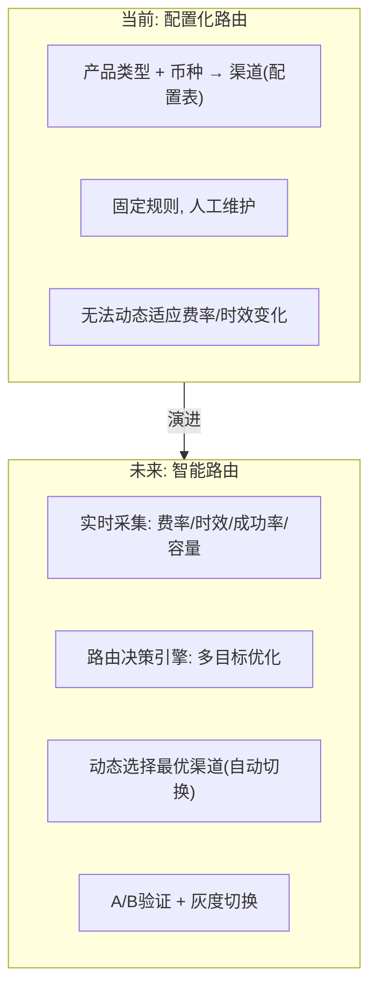

智能路由的核心是「**多目标实时优化**」：

| 优化目标 | 含义 | 权重 |
| --- | --- | --- |
| 成本最低 | 选费率最低的渠道 | 30% |
| 时效最快 | 选到账最快的渠道 | 25% |
| 成功率最高 | 选历史成功率最高的渠道 | 30% |
| 容量充足 | 选当前余量充足的渠道 | 15% |

```java
// 智能路由决策引擎(概念设计)
public class SmartRoutingEngine {
    private ChannelMetricsService metricsService;  // 实时渠道指标

    public RouteDecision route(CollectionRequest request) {
        // 1. 筛选可用渠道(支持该产品+币种)
        List<Channel> candidates = channelRegistry.findAvailable(
            request.getProductType(), request.getCurrency());

        // 2. 实时采集各渠道指标
        Map<String, ChannelMetrics> metrics = new HashMap<>();
        for (Channel ch : candidates) {
            metrics.put(ch.getId(), metricsService.getRealtimeMetrics(ch.getId()));
        }

        // 3. 多目标加权打分
        Channel best = candidates.stream()
            .max(Comparator.comparingDouble(ch -> {
                ChannelMetrics m = metrics.get(ch.getId());
                return scoreCost(m) * 0.3    // 成本分(越低越高)
                     + scoreSpeed(m) * 0.25   // 时效分(越快越高)
                     + scoreSuccessRate(m) * 0.30 // 成功率分
                     + scoreCapacity(m) * 0.15;  // 容量分
            }))
            .orElseThrow();

        return new RouteDecision(best, metrics.get(best.getId()));
    }
}
```

> **【深度拓展】** 智能路由和当前「配置化路由」的区别：
> - **配置化**：人工配「USD → 渠道A」，渠道A 费率涨了/成功率降了，人工发现 + 改配置（滞后）；
> - **智能化**：实时采集渠道指标，自动选最优渠道，渠道劣化秒级切换（实时）。
>
> 业界对比：**Stripe** 的 payment_method 路由已经做到「智能重试 + 自动降级」（一个 payment_method 失败自动切换到备选）；**支付宝**的渠道路由用「规则引擎 + 风险评估」动态选择。XTransfer 的智能路由是「配置化 → 规则引擎 → 机器学习」演进路径的中间一环。
>
> **关键约束**：智能路由不能牺牲资金正确性——切换渠道是「路由层」的事，收款状态机/记账/对账完全不受影响。路由选错了（选了个慢渠道），最多是到账慢，不会错账。这是「**路由层和资金层解耦**」的设计原则。

### 10.5 未来展望二：AI 辅助运营——从人工看板到智能预警

> 当前可观测性依赖人工看板（§15.1 不足 #4）。下一步是用 AI 模型替代阈值告警，做「**非典型异常的主动发现**」。

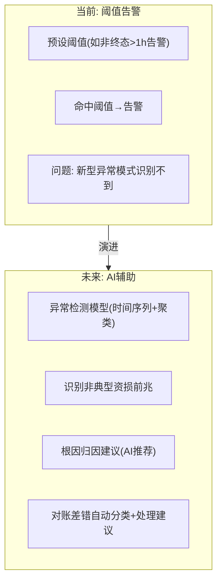

AI 辅助运营的三个场景：

1. **异常检测**：用时间序列模型（如 Prophet/Isolation Forest）对「每日非终态卡单数、幂等异常率、对账差异率」建模，识别「偏离正常模式」的异常（如某渠道回调延迟突增 3 倍），阈值告警识别不了的新模式。
2. **根因归因**：对账发现差异时，AI 沿数据血缘/状态链路自动分析可能原因（「差异集中在渠道X + 时间T，疑似渠道X 在 T 时段回调延迟」），给出排查建议而非让人从头查。
3. **对账差错自动分类**：差异按类型自动分类（长款/短款/在途/汇损/重复），自动匹配处理建议（长款挂应付退回、短款走追偿），人工只做最终确认。

> **【项目支撑】**（STAR）
> - **S（场景）**：2.0 后仍有少量「非典型资损前兆」（如新型重复回调模式）靠阈值告警识别不到，靠人发现。
> - **T（任务）**：用 AI 模型主动发现「非典型异常」，减少人工看板。
> - **A（行动）**（规划中）：① 时间序列模型对核心指标建模，偏离基线自动告警；② 对账差错用分类模型自动打标签 + 匹配处理建议；③ 根因归因用知识图谱（渠道→状态→事件链路）推荐排查路径。
> - **R（结果）**（预期）：异常发现从「人发现」到「模型发现」，发现时间从小时级压到分钟级；对账差错分类自动化减少 60% 人工。

> **【深度拓展】** AI 在资金系统的使用边界：**AI 只建议不决策**。异常检测可以自动告警，但「冲正/退款/调账」等资金动作必须人工确认。这是资金系统的铁律——**自动化可以到「发现异常 + 建议处理」，但不能到「自动执行资金动作」**。这和 §15.3 「绝不为了上 AI 牺牲资金正确性」的原则一致。
>
> 业界对比：**Stripe** 的 Radar 用机器学习做欺诈评分，但「拦截/放行」的最终决策仍保留人工审核队列。**支付宝**的风控决策引擎也是「模型打分 + 规则兜底 + 人工复核」三层。资金系统的 AI 都是「辅助决策」而非「替代决策」。

### 10.6 未来展望三：全球化——从单区域到多区域多活

> 当前系统主要在单区域部署，全球化要求支持多区域就近接入 + 跨区域数据一致。

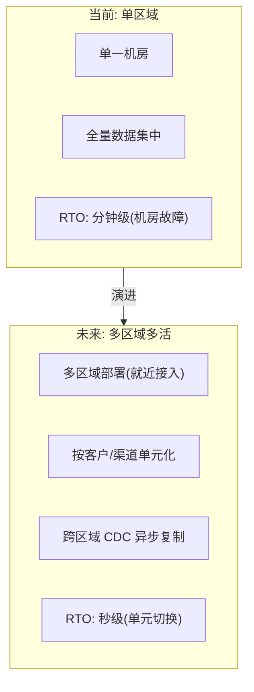

全球化架构的核心设计：

1. **单元化**：按客户/渠道维度切分单元，每个单元自包含（应用 + 数据），单单元故障不影响其他单元。
2. **就近接入**：海外客户请求路由到最近区域（如东南亚客户 → 新加坡机房）。
3. **跨区域一致性**：核心资金数据跨区域 CDC（Change Data Capture）异步复制，允许秒级延迟；强一致操作走用户主属单元。
4. **容灾切换**：单元级故障秒级切换到备用单元，RTO 从分钟级压到秒级。

> **【深度拓展】** 全球化和欧凡「多区域部署」是同一思路——都是「**就近接入 + 跨区域异步复制 + 强一致走主属**」。区别在：
> - 欧凡是「电商读多写少」，多区域侧重「读加速」（CDN + 从库就近查）；
> - XTransfer 是「资金强一致」，多区域侧重「写隔离 + 容灾切换」（单元化 + 跨区域 CDC + 单元切换）。
>
> 全球化的最大约束是「**资金正确性优先于就近性**」——不会为了「让海外客户就近接入」而牺牲资金一致性。跨区域的数据延迟用 CDC 异步复制容忍秒级，但「核心资金写操作」必须走主属单元强一致。这呼应 §1.5 约束 #1「资金正确性优先于性能」。

> **【面试官追问】**
> - **追问1：智能路由切换渠道时，正在进行中的收款会不会断？** 应对：不会——路由是「新收款选渠道」，正在进行中的收款绑定在原渠道，不受路由切换影响。路由层和资金层解耦。
> - **追问2：AI 辅助对账，模型误判（把正常波动当异常）怎么办？** 应对：AI 只告警不执行资金动作（人工确认）；告警带置信度（低置信度静默记录、高置信度告警）；模型定期校准减少误报。
> - **追问3：单元化后跨单元查询（如全局对账）怎么做？** 应对：跨单元查询走数仓/读模型（T+1 聚合），不在 OLTP 跨单元实时查；实时对账按单元内闭环，跨单元走 T+1。

---

## 十一、贸易订单管理系统：额度与一致性

### 11.1 作用与定位

为入账、结汇、风控提供贸易背景；为风控合规打底；为入账/结汇提供**额度管理**。在主流程里是「**入账的贸易背景**」—— 风控合规据此判断、额度管理据此控「可入账上限」，是主流程的上游依据，不是孤立模块。

### 11.2 流水式处理

额度变更像账务流水一样**只增不减、可追溯**（和《账务账户体系与复式记账》的不可变流水同源）：所有额度变更是「追加一条流水」而非「改余额」。好处：可审计、可追溯、并发安全（append-only 比 update 安全）。额度 = 初始值 + sum(流水)，任意时刻可重算，杜绝余额被并发改错。

### 11.3 汇率损失补充

入账涉及换汇，汇损要补偿回用户，保证「用户资金一致和结汇」。汇损补充是跨境特有：入账换汇必有汇兑损益，需「补差」保证用户实收一致，涉及汇兑损益核算。

> **【深度拓展】** 「流水式只增不减」和账务不可变流水同源——append-only 比 update 安全，这是高并发额度管理的核心技巧。汇损补算幂等 + 对账，差错走补记，和资金安全事后防线一致。

### 11.4 追问

- **追问1：流水式额度高并发扣减会不会锁表？** 流水 append 用自增 + 批量；额度余额用「缓存 + 异步重算」或「预占 + 定期结算」；强一致场景用行锁/乐观锁。
- **追问2：汇损补算错了导致用户少收？** 汇损计算幂等 + 对账；差错走补记。
- **追问3：百万订单流水表怎么查得快？** 按订单/时间分表 + 索引；冷热分离；聚合查询走读模型/数仓。

### 11.5 额度管理的流水式设计：代码级落地

> 额度变更像账务流水一样「只增不减」——append-only 比 update 安全。下面展示代码和 SQL。

```sql
-- 额度流水表(只增不删, 可审计)
CREATE TABLE trade_quota_log (
    id BIGINT PRIMARY KEY AUTO_INCREMENT,
    customer_id BIGINT NOT NULL COMMENT '客户ID',
    quota_type VARCHAR(30) NOT NULL COMMENT '额度类型(TRADE/SETTLEMENT/RISK)',
    change_type VARCHAR(20) NOT NULL COMMENT 'INIT/INCREASE/DECREASE/FREEZE/RELEASE',
    amount DECIMAL(15,2) NOT NULL COMMENT '变更金额(正数)',
    balance_after DECIMAL(15,2) NOT NULL COMMENT '变更后余额(冗余, 便于查询)',
    biz_type VARCHAR(30) COMMENT '业务类型(COLLECTION/SETTLEMENT/REFUND)',
    biz_id BIGINT COMMENT '业务ID(关联收款单/结算单)',
    idempotent_key VARCHAR(64) UNIQUE COMMENT '幂等键(customer+biz+bizId)',
    created_at DATETIME DEFAULT CURRENT_TIMESTAMP,
    INDEX idx_customer_type (customer_id, quota_type),
    INDEX idx_created (created_at)
) COMMENT '额度流水(只增不删, 余额=初始值+SUM(流水))';

-- 查询当前额度: 不读余额字段, 用 SUM(流水) 实时算
SELECT
    COALESCE(SUM(CASE WHEN change_type IN ('INIT','INCREASE','RELEASE') THEN amount ELSE -amount END), 0)
    AS current_quota
FROM trade_quota_log
WHERE customer_id = #{customerId} AND quota_type = 'TRADE';
```

```java
// 额度服务核心逻辑(流水式 + 幂等)
public class TradeQuotaService {
    private QuotaLogDao quotaLogDao;

    /**
     * 冻结额度(预入账时锁定)
     * 幂等: 同一业务重复调用安全
     */
    @Transactional
    public boolean freeze(Long customerId, BigDecimal amount, String bizType, Long bizId) {
        String idempotentKey = customerId + ":" + bizType + ":" + bizId;
        // 1. 幂等校验(唯一约束兜底)
        if (quotaLogDao.existsByIdempotentKey(idempotentKey)) {
            return true;  // 已冻结, 幂等返回成功
        }
        // 2. 查当前额度
        BigDecimal current = getCurrentQuota(customerId);
        BigDecimal available = current.subtract(getFrozenAmount(customerId));
        if (available.compareTo(amount) < 0) {
            throw new QuotaNotEnoughException("额度不足: available=" + available + " need=" + amount);
        }
        // 3. 追加流水(不 update 余额, 只 append)
        quotaLogDao.insert(new QuotaLog(customerId, "TRADE", "FREEZE",
            amount, current.subtract(amount), bizType, bizId, idempotentKey));
        return true;
    }

    /**
     * 释放冻结额度(贸易背景补齐转正时)
     */
    @Transactional
    public boolean release(Long customerId, BigDecimal amount, String bizType, Long bizId) {
        String idempotentKey = customerId + ":" + bizType + ":" + bizId + ":release";
        if (quotaLogDao.existsByIdempotentKey(idempotentKey)) return true;
        quotaLogDao.insert(new QuotaLog(customerId, "TRADE", "RELEASE",
            amount, getCurrentQuota(customerId).add(amount), bizType, bizId, idempotentKey));
        return true;
    }
}
```

> **【深度拓展】** 流水式额度管理和复式记账同源——都是「**append-only + 余额=SUM(流水)**」。核心优势：
> 1. **并发安全**：append 不 update，没有「读-改-写」的并发冲突；
> 2. **可审计**：每条流水记录「谁、何时、什么业务、变更多少」，可追溯；
> 3. **可重算**：余额不是存的，是算的——任何时候可以 `SUM(流水)` 重算验证，杜绝余额被并发改错；
> 4. **幂等友好**：幂等键唯一约束，重复调用安全。
>
> 代价：查余额要 `SUM(流水)`，数据量大时慢。解法：冗余 `balance_after` 字段加速查询（但以流水为准定期校验），或缓存余额 + 定期重算校准。这和哈啰薪资「快照留痕」、携程「预聚合 vs 原始重算校验」是同一思路——**冗余加速读，流水保证正确性**。

### 11.6 汇损补算的幂等与对账

> 入账涉及换汇，汇率波动导致汇兑损益。汇损补算必须幂等 + 对账，否则「补多了」或「补漏了」都是资损。

```java
// 汇损补算核心逻辑
public class ExchangeLossService {
    /**
     * 补算汇兑损益
     * @param orderId 收款单ID
     * @param originalAmount 原始入账金额(外币)
     * @param originalRate 原始汇率
     * @param actualRate 实际结算汇率
     * @return 汇兑损益金额(正数=需补, 负数=需扣)
     */
    @Transactional
    public BigDecimal compensate(Long orderId, BigDecimal originalAmount,
                                  BigDecimal originalRate, BigDecimal actualRate) {
        String idempotentKey = "fxloss:" + orderId;
        if (exists(idempotentKey)) return BigDecimal.ZERO;  // 已补算

        // 汇兑损益 = 原始金额 × (实际汇率 - 原始汇率)
        BigDecimal loss = originalAmount.multiply(actualRate.subtract(originalRate));
        if (loss.compareTo(BigDecimal.ZERO) > 0) {
            // 正损益: 平台补差给用户
            accountingService.credit(orderId, loss, "FX_LOSS_COMPENSATION");
        } else if (loss.compareTo(BigDecimal.ZERO) < 0) {
            // 负损益: 需扣回(但通常由平台承担, 不扣用户)
            log.info("汇兑收益 orderId={} amount={}", orderId, loss.negate());
        }
        // 记录补算流水(幂等)
        insertFxLossLog(orderId, loss, idempotentKey);
        return loss;
    }
}
```

> **【深度拓展】** 汇损补算和欧凡「多币种汇兑损益」同源——都是国际化系统逃不开的「金额 + 币种成对存储 + 汇兑损益核算」。区别在：
> - XTransfer：收款时锁定汇率，结算时汇率变了补差给用户；
> - 欧凡：下单时锁定汇率，结算时汇率变了由平台承担/分担。
>
> 核心都是**「下单/收款时锁定汇率，汇率波动由平台承担，汇兑损益单独记账」**。这是国际化资金系统的硬骨头。

---

## 十二、预入账子领域：从 0 到 1 主导（新增章节）

> 这是最能体现「从工程师到领域负责人」转变的一段经历，也是面试里讲「项目管理 + 架构设计 + 落地」的硬素材。

### 12.1 背景：为什么需要预入账

跨境收款有个现实矛盾：**钱往往比贸易背景先到**。海外买家付款后，钱进了卖家 VA 账户（渠道回调通知平台），但这时卖家还没提交贸易订单/材料证明「这笔钱对应真实贸易」。

如果不处理，有两种坏结果：① 钱到了但不让用，卖家体验差；② 钱到了直接结算，但贸易背景缺失，违反合规。

**预入账（Provisional Credit）** 就是解这道矛盾的机制：钱先「预记」到卖家账户（可用一部分或冻结），等贸易背景补齐、风控/合规通过后，再「转正」为正式入账。

### 12.2 我的角色：端到端主导

作为专项负责人，我从 0 到 1 主导了这个子域：

- **产品研讨**：和业务/合规对齐「预入账的触发条件、可用额度比例、转正规则、风险敞口上限」；
- **架构设计**：作为收款领域的新子域，如何融入现有六边形 + 状态机 + 任务补偿体系（不另起炉灶）；
- **项目管理**：排期、跨团队（风控/合规/账务）对齐、风险管控；
- **落地**：编码 + 灰度 + 监控 + 复盘。

### 12.3 架构设计要点

- **复用现有机制**：预入账是「收款单」上的一个状态/子状态机，走同一套状态机 + 事件驱动，不新建一套流程；
- **额度与风险敞口**：预入账金额受「贸易额度 + 风险准备金」约束，防止「预入账变资损」（见 §9 事前限额）；
- **转正链路**：贸易背景补齐 → 风控通过 → 合规通过 → 预入账转正式入账（状态迁移 + 记账冲正/补记）；
- **回退链路**：若贸易背景不实/风控拒，预入账回退（任务补偿 + 挂账），资金不丢。

> **【项目支撑】** 预入账的设计严格遵循 §2.3 四条原则：约束前置（额度上限锁死风险）、易变外置（转正规则配置化）、最终一致（回退走补偿）、可观测（每笔预入账状态可查）。

### 12.4 难点与取舍

- **难点**：预入账涉及「先给钱后验证」，天然有风险敞口，必须和风控/合规深度耦合；
- **取舍**：预入账「可用比例」是产品/风控的Trade-off（比例高体验好但风险大），最终做成**配置化 + 分层**（不同客群不同比例），而非写死；
- **战绩**：预入账上线后，卖家「钱到账可用」的时效从「等贸易背景齐全」缩短到「实时预记」，体验大幅提升，且风险可控（0 资损前提下）。

### 12.5 预入账状态机深度设计

> 预入账是「收款单」上的子状态机，走同一套状态机 + 事件驱动体系。下面展示状态流转和代码。

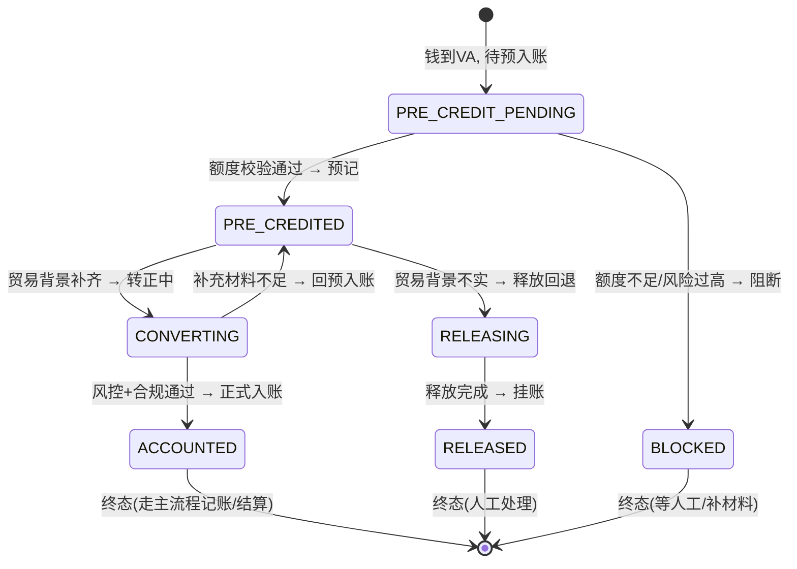

```java
// 预入账核心逻辑
public class PreCreditService {
    private CollectionStateMachine stateMachine;
    private TradeQuotaService quotaService;
    private RiskService riskService;
    private AccountingService accountingService;

    /**
     * 触发预入账
     * 1. 校验额度(约束前置: 风险敞口有上限)
     * 2. 预记账(冻结额度, 不实际入账)
     * 3. 状态机迁移
     */
    @Transactional
    public void preCredit(Long orderId, BigDecimal amount) {
        CollectionOrder order = orderDao.findById(orderId);

        // 1. 额度校验: 预入账总额不能超过 (贸易额度 + 风险准备金)
        BigDecimal availableQuota = quotaService.getAvailableQuota(order.getCustomerId());
        BigDecimal riskReserve = riskService.getRiskReserve(order.getCustomerId());
        BigDecimal maxPreCredit = availableQuota.add(riskReserve);

        if (order.getPreCreditedTotal().add(amount).compareTo(maxPreCredit) > 0) {
            stateMachine.transit(orderId, PROCESSING, BLOCKED, "quota_exceeded");
            throw new PreCreditLimitExceedException("预入账超额");
        }

        // 2. 冻结额度(幂等)
        quotaService.freeze(order.getCustomerId(), amount, "PRE_CREDIT", orderId);

        // 3. 预记账(复式记账: 借 预入账资产, 贷 预入账负债)
        accountingService.preAccount(orderId, amount);

        // 4. 状态机迁移: PROCESSING → PRE_CREDITED
        stateMachine.transit(orderId, PROCESSING, PRE_CREDITED, "pre_credited");

        // 5. 发事件: 预入账完成 → 通知卖家可用
        eventPublisher.publish(new PreCreditedEvent(orderId, order.getCustomerId(), amount));
    }

    /**
     * 预入账转正(贸易背景补齐 + 风控合规通过)
     */
    @Transactional
    public void convert(Long orderId) {
        // 1. 校验: 贸易背景是否齐全
        if (!tradeOrderService.isComplete(orderId)) {
            throw new TradeBackgroundIncompleteException("贸易背景不完整");
        }
        // 2. 校验: 风控是否通过
        if (!riskService.isApproved(orderId)) {
            throw new RiskNotApprovedException("风控未通过");
        }
        // 3. 释放冻结额度
        BigDecimal preCreditedAmount = getPreCreditedAmount(orderId);
        quotaService.release(order.getCustomerId(), preCreditedAmount, "PRE_CREDIT", orderId);
        // 4. 正式记账(预入账 → 正式入账, 冲正预记 + 补正式记)
        accountingService.convertPreCredit(orderId, preCreditedAmount);
        // 5. 状态机迁移: PRE_CREDITED → ACCOUNTED
        stateMachine.transit(orderId, PRE_CREDITED, ACCOUNTED, "converted");
    }
}
```

> **【项目支撑】** 预入账的设计严格遵循 §2.3 四条原则：
> - **约束前置**：额度上限锁死风险敞口（`maxPreCredit = 贸易额度 + 风险准备金`），超了直接 BLOCKED；
> - **易变外置**：预入账「可用比例」配置化（不同客群不同比例），不写死在代码里；
> - **最终一致**：回退走任务补偿（释放冻结额度 + 冲正预记），不靠强一致锁；
> - **可观测可恢复**：每笔预入账状态可查，转正/回退全链路可追溯。
>
> 作为「从 0 到 1 端到端主导」的子领域，预入账最能体现「**带领域**」的能力：不是「接需求写代码」，而是「产品研讨 → 架构设计 → 项目管理 → 落地」全链路负责。这是 10 年经验和 3 年经验的分水岭。

> **【面试官追问】**
> - **追问1：预入账比例设多少合适？高了风险大、低了体验差。** 应对：分层配置——按客群信用等级设不同比例（高信用 80%、中信用 50%、低信用 0%）；按金额设阶梯（小额高比例、大额低比例）；配合风险准备金兜底。关键是**配置化 + 可调**，不是写死。
> - **追问2：预入账后贸易背景一直不补，钱一直挂着怎么办？** 应对：设超时机制——预入账后 N 天不补贸易背景，自动进「回退流程」（释放冻结、冲正预记、挂账人工处理），不让钱无限期挂着。
> - **追问3：预入账转正时，如果实际贸易金额小于预入账金额怎么办？** 应对：转正按「实际贸易金额」入账，差额部分释放回退（走补偿）；转正支持「部分转正」（一笔预入账对应多笔贸易订单，分批转正）。

---

## 十三、2.0 重构战绩（讲成就感的高光）

简历原话：「深度参与并主导收款领域 2.0 重构，提高 **30% 开发人效**，降低域内 **80% 生产问题**，**实现 0 资损**。」

### 13.1 提人效（+30%）

- 架构治理（六边形/CQRS/DDD/SPI）让新需求改动面变小；
- 模板化、配置化减少重复代码；
- 新渠道/产品接入从「写一堆代码」变「配置 + 薄适配」。

### 13.2 降生产问题（-80%）

- 状态机约束非法流转（资损类问题前置消灭）；
- 任务补偿兜底（流程卡死类问题自愈）；
- 资金安全三道防线 + 可观测性补全（问题早发现）。

### 13.3 0 资损

- 事前幂等 + 事后对账闭环；
- 补偿机制保证最终一致；
- 差错工单 + 人工兜底，账实最终一致。

### 13.4 度量口径（让面试官信）

这些数字不是精确 A/B，是**复盘归因**出来的：重构前后同口径的需求交付周期、线上故障数、资损工单数对比。趋势显著，且有具体案例支撑（如「某渠道接入从 2 周降到 3 天」）。

> **【深度拓展】** 2.0 能做到这些，**不是某个黑科技**，而是「约束前置 + 扩展外置」带来的**改动面收敛**。接一个渠道，过去要改 N 个地方（还技术债利息），现在只加一个 SPI 实现 + 配置。这就是 ROI：一次性架构税，长期还本。

### 13.4.1 重构成果的量化验证方法

> 面试官追问「+30% 人效怎么验证」时，必须能给出具体口径。下面是量化方法。

| 指标 | 重构前(1.0) | 重构后(2.0) | 验证方式 |
| --- | --- | --- | --- |
| 新渠道接入周期 | 2 周 | 2~3 天 | 同口径接入工时对比 |
| 需求交付周期 | 平均 10 天 | 平均 7 天 | JIRA 同口径需求从评审到上线 |
| 线上故障数 | 月均 15 个 | 月均 3 个 | 同口径 P0/P1 故障统计 |
| 资损工单 | 月均 2~3 个 | 0 | 资损工单系统统计 |
| 核心链路测试覆盖 | 40% | 85% | JaCoCo 代码覆盖率 |

> **【深度拓展】** 量化验证的核心是「**同口径对比**」——不是「随便给个数字」，而是「重构前后同一口径的指标对比」。面试时讲清楚度量口径（什么算 P0 故障、怎么算接入周期），比只说「提升了 30%」更有说服力。面试官信不信，不取决于数字好不好看，取决于「你能不能说清楚数字怎么来的」。

---

### 13.5 2.0 重构的具体步骤与踩过的坑

重构不是「周末推倒重来」，而是分波次、可回滚的治理：

1. **先补可观测，再动结构**：第一步是把状态变更、任务执行、对账差异全部埋点，先能「看见」问题，才敢动核心。否则重构完不知道是变好还是变坏。
2. **状态机先行（锁死资损）**：先上状态机把非法流转拦死，这是生死线，优先于效率。
3. **CQRS 拆读写**：把列表/详情查询从写链路剥离，降低互相拖累。
4. **SPI + 配置化收口渠道差异**：把硬编码渠道逻辑外置。

踩过的坑：

- **读模型延迟引发「刚提交查不到」客诉**：初期 CQRS 读模型延迟没处理好，用户刚发起收款刷新列表看不到。解法：列表对「自己刚发起的」走写侧强读，其余走读模型。
- **状态机热加载踩坑**：初期状态机改了要重启，后来做配置化热加载，但灰度时新旧规则并存出现短暂双路径，靠「新增而非修改」原则规避。
- **补偿框架初期无死信**：重试无限导致任务表堆积，加死信 + 人工兜底后才稳。

> **【项目支撑】** 这套「先可观测、先锁资损、分波次、可回滚」的节奏，是我从 1.0 的坑里总结的，也是 §15.4 反思的落地版。它直接支撑了「−80% 生产问题」——不是重构本身神奇，是「每一步都能量化验证」让问题在早期暴露。

### 13.6 重构方法论：从「推倒重来」到「增量治理」

> 重构最怕「推倒重来」——一次性切完，出问题全量崩溃。2.0 重构的方法论是「**增量治理**」，每一步可验证、可回滚。

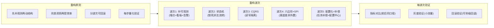

```yaml
# 渠道配置化示例(配置中心存储, 新增渠道只填配置不改代码)
channel_config:
  channel_id: "bank_sea_001"
  channel_name: "东南亚银行A"
  product_types: ["VA", "A2A"]
  supported_currencies: ["USD", "EUR", "SGD"]
  callback:
    url: "https://api.xtransfer.com/callback/bank_sea_001"
    auth_type: "HMAC_SHA256"
    idempotent_key: "channel_txn_no + product_type"
  compliance:
    form_template: "b2b_standard_v3"  # 引用动态表单模板
    required_documents: ["trade_contract", "invoice", "customs_declaration"]
    review_flow: "auto_then_manual"  # 自动审 + 人工复核
  va_opening:
    api_endpoint: "https://bank-a.example.com/va/open"
    field_mapping:  # 字段映射(渠道差异外置)
      customer_name: "account_holder"
      id_number: "id_doc_no"
    retry_policy: { max_retry: 3, backoff: "exponential" }
  settlement:
    method: "swift"
    cutoff_time: "16:00+08:00"
    sla: "T+1"
```

> **【深度拓展】** 配置化是「易变外置」原则的极致落地——新增一个渠道不需要写一行代码，只填配置。但配置化的代价是「**调试难**」（配置错了不像代码有栈）、「**配置爆炸**」（100+ 渠道的配置管理本身就是挑战）。应对：
> 1. 配置变更走审批 + 双人复核（防人为失误）；
> 2. 配置版本化 + 一键回滚（改错了能秒级恢复）；
> 3. 配置上线前「影子校验」（新配置对历史数据跑一遍比对，看会不会误杀）；
> 4. 配置中心平台化（产品/合规自助维护，研发退出「配置搬运工」角色）。
>
> 这和哈啰「aviator 规则配置化」、欧凡「feature flag 灰度配置」、携程「OLAP 路由配置」是同一设计家族——**把易变的东西从代码外置到配置**。这是四个项目共同的设计哲学。

> **【面试官追问】**
> - **追问1：重构期间旧代码和新代码并存，维护成本翻倍怎么办？** 应对：用「绞杀者模式」（Strangler Pattern）——新功能走新代码，旧功能逐步迁移，每迁一个功能就下线旧代码，而不是长期双跑。关键是**迁移有明确截止日期**，不做「永久双跑」。
> - **追问2：配置化的边界在哪？什么该配置什么该代码？** 应对：「业务稳定且不变」的建模成代码（如状态机引擎核心）；「易变且需要业务自助」的外置成配置（如渠道差异、合规表单、规则）。**配置化不是越多越好**——核心逻辑配置化会增加调试难度。
> - **追问3：重构过程中如何保证团队信心？** 应对：每波次结束做复盘，用量化数据（问题数下降、人效提升）让团队看到成效；小步快跑、快速见效，不要「重构半年看不到成果」。

## 十四、架构亮点总览（亮点，综合）

把前面九个机制串起来，XTransfer 的可扩展性靠**三个同构机制**兜住：

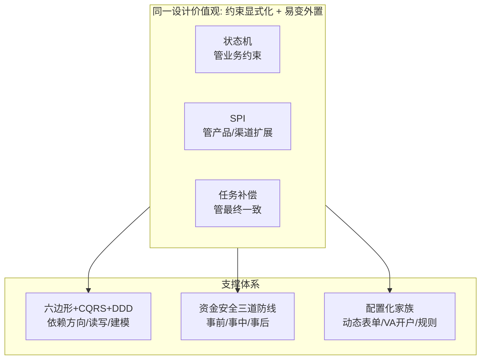

**三个同构机制**（状态机 / SPI / 任务补偿）都遵循同一个价值观 ——「把易变的东西外置、把约束显式化」。这是 2.0 做到 +30% 人效、−80% 生产问题、0 资损的**根因**，不是单点优化。

**亮点提炼（面试可直接背）：**

1. **资金流可解释**：状态机 + 不可变流水，每笔钱去向可追溯；
2. **扩展零成本**：SPI + 配置化，新渠道/产品零改核心；
3. **故障可自愈**：任务补偿 + 状态机，流程卡死自动恢复；
4. **资损可防控**：三道防线闭环，事前拦、事中告警、事后追回；
5. **演进可持续**：六边形让领域不依赖框架，架构可长期演进；
6. **从 0 到 1 能力**：预入账子域端到端主导，证明「带领域」的能力。

### 14.1 架构亮点的代码级佐证

> 亮点不是空话，每一条都有代码级落地。下面给出关键亮点的代码片段。

```java
// 亮点1: 资金流可解释 —— 状态机 + CAS + 流水
// (见 §3.7.1 状态机代码, 这里补充 CAS 幂等的核心)

// CAS 更新: 天然幂等 + 防并发, 零额外代码
// 重复回调命中终态时 WHERE 不匹配, affected=0, 跳过
int affected = orderDao.updateStatusCAS(orderId, "PROCESSING", "SUCCESS");
if (affected == 0) {
    log.info("状态已变更或重复回调, 跳过 orderId={}", orderId);
    return;  // 幂等: 不重复记账
}

// 亮点2: 扩展零成本 —— SPI 自动发现
// 新增收款产品: 只写一个 SPI 实现, 零改核心
@SPI(productType = "NEW_PRODUCT")
public class NewProductAdapter implements CollectionProductSPI {
    @Override
    public CollectionResult collect(CollectionRequest request) {
        // 产品特定逻辑
        return doCollect(request);
    }
}
// 框架自动扫描 @SPI 注解, 注册到路由表, 调用方无感知

// 亮点3: 故障可自愈 —— 任务补偿 + 死信兜底
// (见 §6.6 补偿框架代码)

// 亮点4: 资损可防控 —— 三道防线
// 事前: 幂等键 + 金额校验 + 状态机约束
// 事中: 复式记账实时试算平衡
BigDecimal debit = accountDao.sumDebit(orderId);
BigDecimal credit = accountDao.sumCredit(orderId);
if (debit.compareTo(credit) != 0) {
    alertService.critical("试算不平! orderId={} debit={} credit={}",
        orderId, debit, credit);
    throw new AccountingBalanceException("借贷不平, 资损闸触发");
}
// 事后: T+1 三层对账(见 §9)
```

```sql
-- 亮点5: 演进可持续 —— 六边形让领域不依赖框架
-- 检验方法: domain 包 import 不到任何技术框架包
-- mvn dependency:analyze 验证 domain 模块零技术依赖
-- com.xtransfer.collection.domain
--   ├── model/ (聚合根: CollectionOrder, PreCreditOrder)
--   ├── event/ (领域事件: 纯 POJO)
--   └── spi/   (扩展点接口: 纯 Java interface)
-- 验证: domain 包 import 不到 org.springframework / com.baomidou / org.apache
-- 这比任何规范文档都有效: 编译期硬约束

-- 亮点6: 领域建模 —— 聚合根边界
-- 收款单(CollectionOrder) = 主聚合根
--   ├── 风控结论(RiskResult) = 子聚合(结论反写主状态)
--   ├── 申报单(ComplianceForm) = 子聚合
--   └── 贸易订单(TradeOrder) = 关联聚合(引用, 非内聚)
-- 边界划分原则: 一次事务内必须同时一致的放同一聚合
-- 收款单状态 + 风控结论 → 同一事务(强一致)
-- 收款单 ↔ 贸易订单 → 跨聚合(最终一致, 走事件)
```

> **【深度拓展】** 六边形架构的「编译期硬约束」是最有效的设计保证——`domain` 包里 `import` 不到任何 `org.springframework`、`com.baomidou` 的包。这不是靠规范文档（人会违反），而是靠编译器（违反了编译不过）。这个约束比任何 code review checklist 都管用。新人看包结构 30 秒就能懂「哪里是核心、哪里能换」。

---

## 十五、改进方向与未来规划（资深必讲）

> 这一节是 10 年经验的分水岭。**资深候选不能只讲「我做了什么」，必须能讲「它哪里不够、下一步怎么补」。** 以下是我基于真实痛点（非编造）梳理的改进与规划。

### 15.1 当前架构的不足（诚实面对）

没有完美架构，2.0 之后仍有真实短板：

1. **状态机仍偏「配置 + 代码」混合**：复杂迁移靠代码分支，配置化程度可再提升；
2. **对账仍重 T+1**：实时对账已做一部分，但跨系统实时勾兑覆盖不全；
3. **配置中心未完全平台化**：渠道/表单配置靠研发维护，产品/合规自助程度有限；
4. **可观测性依赖人工看板**：异常发现部分仍靠人盯，智能化告警不足；
5. **单元化/多活未完全落地**：极端机房故障的 RTO 仍有优化空间；
6. **补偿框架耦合核心**：补偿逻辑和业务状态机强耦合，框架演进受限；
7. **测试覆盖不均**：核心资金链路线覆盖高，边缘渠道适配覆盖低。

### 15.2 改进方向（8 条具体）

1. **状态机全面配置化 + 可视化**：把迁移规则抽到可视化编辑器，产品可自助配，研发只维护引擎；降低「状态爆炸」治理成本。
2. **实时对账中台**：把「渠道 ↔ 平台 ↔ 账务」三层勾兑做成实时流（Flink 比对），从 T+1 前移到分钟级，进一步压缩资损窗口。
3. **配置平台 2.0（低代码）**：渠道接入、合规表单、风控规则全部自助化，研发退出「配置搬运工」角色，聚焦核心。
4. **智能化资损防控**：用异常检测模型替代「阈值告警」，识别「非典型资损前兆」（如新型重复回调模式），事前事中自动化。
5. **补偿框架独立化**：把补偿抽象成独立 Saga 框架（与状态机解耦），业务只声明「补偿动作」，框架管调度/重试/死信，可跨域复用。
6. **单元化 + 多活深化**：按客户/渠道维度单元化，机房级故障秒级切换，RTO 从分钟级压到秒级。
7. **混沌工程常态化**：定期注入「渠道超时/DB 主从延迟/消息积压」故障，验证三道防线和补偿的真实有效性，而非只在演练里讲。
8. **测试资产化**：边缘渠道适配纳入契约测试 + 流量回放，核心 + 边缘全覆盖，降低「新渠道上线即故障」。

### 15.3 未来规划（3 年演进路线）

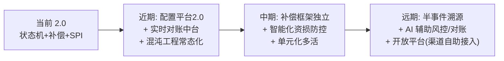

- **近期（0~1 年）**：补齐配置平台 2.0 + 实时对账中台，把「人工环节」自动化；混沌工程常态化，让三道防线经得起真故障。
- **中期（1~2 年）**：补偿框架独立成 Saga 中台，跨域复用；智能化资损防控替代纯阈值；单元化多活落地，RTO 秒级。
- **远期（2~3 年）**：在关键域试点「半事件溯源」（状态 + 事件双写，支持重放重建）；引入 LLM 辅助风控决策与对账差错归因（AI 只建议不决策，见 §9 原则）；对外提供「渠道自助接入开放平台」，100+ 渠道的接入彻底产品化。

### 15.4 如果重做 1.0，我会提前避开哪些坑

资深不只看「做成了什么」，更看「从坑里学到了什么」。如果回到 1.0，我会提前做三件事：

1. **状态机从 day 1 就上**：1.0 是「先跑起来再补约束」，结果散落状态字段积重难返，2.0 花大力气治理。若一开始就用状态机锁死非法迁移，后续重构成本会低一个量级。**资金系统的约束前置，越早越便宜。**
2. **渠道差异从 day 1 就配置化**：1.0 接前几个渠道时图快写了硬编码，埋下「接渠道还债」的因。若一开始就把「接口/字段/审核流」抽到配置中心，第 5 个渠道就不会比第 1 个渠道贵。**早期的一点「架构税」，长期指数级回本。**
3. **可观测性从 day 1 就埋**：1.0 出问题靠人盯日志，2.0 才补全三道防线监控。若一开始就把「状态变更、任务执行、对账差异」做成标准埋点，问题发现和定位会快得多。**可观测不是功能，是系统的「神经系统」，越早建越值。**

> 这三点的共性，还是 §2.3 的四条原则——**约束前置、易变外置、最终一致、可观测可恢复**。它们不是 2.0 才想通的，而是被 1.0 的坑「逼」出来的。讲清楚这个「从坑到原则」的演化，比单纯罗列技术，更能让面试官相信你是真懂、不是背的。

> **【深度拓展】** 这个路线图的底层逻辑是「**先稳后智再开放**」：先把正确性/可恢复性用自动化夯实（近期），再把一致性/容灾用平台化提升（中期），最后才谈智能化与开放（远期）。**绝不为了「上 AI」牺牲资金正确性** —— 这是资深和对「为用新技术而用新技术」的根本区别。

---

## 十五点五、跨项目交叉串联：四个项目的设计哲学共振

> 这是面试中最能体现「**系统性认知**」的部分。四个项目看似不同（支付/出行/电商/数据），但底层设计哲学高度一致。讲清楚这些共振，比单独讲每个项目的技术点有说服力得多。

```mermaid
graph TD
  subgraph 核心哲学["核心设计哲学: 约束前置 + 易变外置 + 最终一致 + 可观测可恢复"]
    P1["约束前置"]
    P2["易变外置"]
    P3["最终一致"]
    P4["可观测可恢复"]
  end
  subgraph XTransfer["XTransfer 跨境支付"]
    X1["状态机锁非法流转"]
    X2["SPI+配置化外置渠道差异"]
    X3["任务补偿+Outbox"]
    X4["三道防线+对账"]
  end
  subgraph 哈啰["哈啰 工单+薪资"]
    H1["工单状态机+SLA"]
    H2["aviator规则引擎"]
    H3["Kafka补偿+幂等"]
    H4["薪资快照+审计"]
  end
  subgraph 欧凡["欧凡 海外电商"]
    O1["Lua原子扣减防超卖"]
    O2["策略模式+动态表单"]
    O3["延迟双写+binlog"]
    O4["灰度+监控告警"]
  end
  subgraph 携程["携程 数据平台"]
    C1["数据质量断言拦截"]
    C2["OLAP路由配置化"]
    C3["Flink Checkpoint"]
    C4["血缘+对账校验"]
  end
  P1 --> X1 & H1 & O1 & C1
  P2 --> X2 & H2 & O2 & C2
  P3 --> X3 & H3 & O3 & C3
  P4 --> X4 & H4 & O4 & C4
```

### 15.5.1 四条设计哲学在四个项目中的落地

| 设计哲学 | XTransfer（支付） | 哈啰（工单/薪资） | 欧凡（电商） | 携程（数据） |
| --- | --- | --- | --- | --- |
| **约束前置** | 状态机锁非法流转（CAS） | 工单状态机+SLA 超时 | Lua 原子扣减防超卖 | 数据质量断言拦截脏数据 |
| **易变外置** | SPI+配置化（渠道/表单/规则） | aviator 规则引擎 | 策略模式+feature flag | OLAP 路由配置化 |
| **最终一致** | 任务补偿+Outbox+T+1 对账 | Kafka 补偿+幂等去重 | 延迟双写+binlog+TTL | Flink Checkpoint+幂等 sink |
| **可观测可恢复** | 三道防线+状态流水+可重放 | 薪资快照+审计日志 | 灰度+监控+CDN 刷新 | 血缘+对账校验+任务 SLA |

> **【深度拓展】** 这张表是面试时的「核武器」——当面试官问「你觉得这四段经历有什么共性」，你不要说「都用了 Redis」，而要说：
>
> 「这四个项目看似不同——支付、出行、电商、数据平台——但底层设计哲学完全一致：**约束前置、易变外置、最终一致、可观测可恢复**。在支付里，约束前置是状态机锁非法流转；在工单里，是工单状态机+SLA；在电商里，是 Lua 原子扣减防超卖；在数据里，是数据质量断言拦截脏数据。同一个哲学，不同场景的不同落地。这不是巧合，而是我作为架构师的一致方法论——**先锁定不可妥协的约束，再把易变的东西外置，用最终一致兜底，全程可观测可恢复**。」

### 15.5.2 具体技术方案的跨项目映射

| 技术方案 | XTransfer | 哈啰 | 欧凡 | 携程 |
| --- | --- | --- | --- | --- |
| **幂等设计** | 渠道流水号+产品 幂等键 | 车辆ID+时间窗口 去重键 | 用户+活动 幂等表 | event_id 状态去重 |
| **原子更新** | CAS: `UPDATE WHERE status=旧值` | Redis SETNX 幂等 | Lua 脚本原子扣减 | Flink Checkpoint |
| **补偿/重试** | 任务表+调度引擎+退避+死信 | 定时回扫历史心跳 | 异步落库+对账回补 | Kafka 重放+离线补算 |
| **对账校验** | T+1 三层对账(渠道↔平台↔账务) | 薪资总额校验 | Redis vs DB 库存对账 | 预聚合 vs 原始重算 |
| **配置化外置** | 合规动态表单+VA开户配置 | aviator 规则表达式 | 策略模式+feature flag | OLAP 路由配置 |
| **缓存策略** | 读模型(CQRS) | Caffeine+Redis 多级 | Caffeine+Redis+延迟双写 | Redis 查询缓存 |
| **分片/分表** | 按订单/时间分表 | 按创建时间分表+异构索引 | 库存分桶 | 按时间 rollover |
| **灰度发布** | 渠道级灰度+熔断 | 规则版本化+灰度 | 用户/地区灰度 | feature flag |

> **【项目支撑】** 这张映射表说明：**同一个技术问题在不同项目里的解法是同构的**。
> - 幂等设计：都是「业务唯一标识 + 去重/唯一约束」，只是标识不同（渠道流水号/车辆+窗口/用户+活动/event_id）；
> - 原子更新：都是「条件更新替代读-改-写」，只是介质不同（DB CAS/Redis SETNX/Lua/Flink Checkpoint）；
> - 补偿重试：都是「持久化任务 + 重试 + 死信兜底」，只是场景不同（资金/工单/库存/数据）；
> - 对账校验：都是「两份数据核对 + 差异处理」，只是对象不同（渠道↔平台/总额↔预期/Redis↔DB/预聚合↔原始）。
>
> 面试时讲清楚这个「**同构映射**」，比单独说「我在每个项目都用了幂等」有深度得多——它证明你不只是在「堆技术」，而是有一套**通用的问题解决方法论**，能迁移到任何新领域。

### 15.5.3 从四个项目看架构师成长路径

```mermaid
graph LR
  subgraph 携程["携程(校招, 2018-2020)"]
    CT1["数据应用工程师"]
    CT2["学到的: 数据思维<br/>OLAP/流处理/数据治理"]
  end
  subgraph 欧凡["欧凡(成长期, 2020-2022)"]
    OF1["高级开发工程师"]
    OF2["学到的: 高并发/缓存/原子性<br/>国际化/灰度"]
  end
  subgraph 哈啰["哈啰(资深期, 2022-2022)"]
    HL1["资深工程师"]
    HL2["学到的: 规则引擎/批处理/<br/>分库分表/幂等审计"]
  end
  subgraph XTransfer["XTransfer(专家期, 2022-2026)"]
    XT1["领域Owner+架构师"]
    XT2["学到的: DDD/六边形/资金系统/<br/>状态机/补偿/0资损"]
  end
  携程 --> 欧凡 --> 哈啰 --> XTransfer
```

四段经历串起来，是一条清晰的**架构师成长路径**：

1. **携程（数据思维）**：学会「数据怎么存、怎么查、怎么治理」。这是架构师的基本功——不理解数据，就不理解系统。
2. **欧凡（高并发思维）**：学会「高并发下怎么防超卖、缓存怎么一致、热点怎么扛」。这是从「功能正确」到「性能正确」的跨越。
3. **哈啰（工程化思维）**：学会「规则引擎解耦、批处理可重跑、分库分表」。这是从「单机正确」到「分布式正确」的跨越。
4. **XTransfer（架构思维）**：学会「DDD/六边形/状态机/补偿/0资损」。这是从「实现功能」到「对领域正确性负责」的跨越——10 年经验的分水岭。

> 每段经历都为下一段打地基：携程的「数据治理」思维 → XTransfer 的「对账校验」；欧凡的「Lua 原子」→ XTransfer 的「CAS 原子」；哈啰的「Kafka 补偿」→ XTransfer 的「任务补偿」；哈啰的「幂等审计」→ XTransfer 的「资金幂等」。**不是四段独立的经历，而是一条递进的成长链**。

---

## 十六、面试高频问答（标准回答）

**Q1：千万级结算、0 资损，你怎么保证资金不出错？**
考察点：对资金系统「正确性 > 性能」的理解，是否有体系化手段。
思路：分三层——（1）**模型层**用状态机约束非法流转、用不可变流水记录每笔变更；（2）**过程层**用幂等防重复、用任务补偿保最终一致、用 Outbox 保事件不丢；（3）**监控层**事前校验、事中告警（非终态/幂等异常/BCP）、事后 T+1 对账闭环。资损不是靠「不写 bug」，靠「可解释、可补偿、可核对」。

**Q2：状态机和直接用字段 + if/else 比，好在哪？**
考察点：是否理解显式状态建模的价值。
思路：非法迁移显式拒绝（资金安全闸）、流程变更只改配置、可生成状态图利于沟通和测试、配合事件驱动天然解耦。代价是初期建模成本，但对资金流值得。

**Q3：你提到 CQRS，读写模型怎么保持一致？**
考察点：是否踩过 CQRS 的坑。
思路：写侧落库后发领域事件，读侧订阅更新；接受**短暂**延迟（最终一致）。关键设计：事件不丢（Outbox / MQ 可靠）、读模型可重建（从事件重放或全量同步）、对「刚写入立刻查」的场景走写侧强读或加短暂等待。

**Q4：项目里分布式事务为什么选补偿而不是 TCC？**
考察点：分布式事务选型是否贴合业务。见 §6 对比表，核心是流程长、可补偿、下游不可控，补偿比 TCC 侵入小、可用性高。

**Q5：SPI 和策略模式有什么区别？你们为什么用 SPI？**
考察点：扩展机制的理解深度。见 §5——SPI 把「注册」也自动化（自动发现），新增产品零改核心；策略模式通常还要显式注册。并结合「开闭原则」讲收益。

**Q6：100+ 渠道接入，新渠道要改很多代码吗？**
考察点：配置化 / 平台化思维。见 §10——差异外置到配置 + 薄适配，新渠道基本是配置 + 轻量适配，不碰核心。

**Q7：你主导 2.0 重构，最大的技术决策是什么？**
考察点：架构判断力 + 落地能力。
思路：最大决策是「用状态机 + 事件 + 补偿替代散落的状态字段和同步调用」，把资金流变成可观测、可补偿、可演进的管道；其次是把渠道/产品差异通过 SPI + 配置外置。技术决策背后是「可扩展、可演进、资金安全优先」的价值观。

---

## 十七、更多高频追问（补充）

**Q8：为什么用状态机而不是散落的状态字段？状态机怎么落地？**
考察点：架构抽象能力。
思路：散落的 `if (status==X) status=Y` 分布在各处，难维护、易漏改、并发下易乱。状态机把"合法状态 + 允许的流转 + 流转触发的动作"集中定义，好处是：① 非法流转被统一拦截（如"已完成"不能再变"处理中"）；② 状态变更用 `UPDATE … WHERE status=旧值` 做 CAS，天然幂等 + 防并发；③ 状态流转绑定事件，驱动后续动作（记账、通知）解耦。落地上我用状态 + 事件 + 动作三元组配置化，主状态机管交易生命周期，风控/合规用子状态机嵌套。

**Q9：任务补偿机制是怎么设计的？和定时重试有什么不同？**
考察点：最终一致 + 可靠性设计。
思路：关键动作（渠道调用、记账、结算）都落一条"任务"记录状态（待执行/执行中/成功/失败/需人工）。补偿框架统一扫描"未完成"任务按退避策略重试，超过阈值转人工。与朴素定时重试的区别：① 任务表让每个动作**可追溯、可观测**（能查到卡在哪）；② 统一的退避 + 幂等 + 死信，而不是每个业务各写一套 while 重试；③ 与状态机解耦——状态机只发意图，补偿保证意图最终达成。这套是 2.0 做到"0 资损"的核心之一。

**Q10：六边形架构（端口适配器）在这个项目里解决了什么？**
考察点：DDD/整洁架构理解。
思路：核心是"业务逻辑不依赖外部技术细节"。领域层（交易/账务/清结算的核心规则）在中心，通过**端口（接口）**对外；渠道、DB、MQ、外部 API 都是**适配器**，实现端口。好处：① 换渠道/换存储只改适配器，核心不动；② 核心逻辑可脱离中间件单测；③ 配合 CQRS 把读写分离，复杂查询走独立读模型。这让"100+ 渠道接入"变成"加适配器 + 配置"，而非改核心。

**【深度拓展】** 上面 Q8/Q9/Q10 串起来看，XTransfer 的可扩展性靠三个同构机制兜住：**状态机**（管业务约束）、**SPI**（管产品/渠道扩展）、**任务补偿**（管最终一致）。三者都遵循同一个设计价值观——「把易变的东西外置、把约束显式化」。这也是 2.0 能做到 +30% 人效、-80% 生产问题的根因：不是某个黑科技，而是「约束前置 + 扩展外置」带来的改动面收敛。

**【面试官还会追问】**
- **追问1（跨设计）：如果重来一次，你会先上状态机还是先上 SPI？** 应对：先状态机——资金安全是生死线，先锁死非法流转；SPI 是效率问题可稍后。顺序体现「资金安全优先于扩展效率」的价值观。
- **追问2（度量）：+30% 人效 / -80% 问题 怎么让面试官信？** 应对：给出度量口径——重构前后同口径需求交付周期、线上故障数、资损工单数对比；说明是「复盘归因」而非精确 A/B，但趋势显著。详见 §13。
- **追问3（边界）：状态机 + SPI + 补偿都上，初期研发成本怎么向老板交代？** 应对：用「技术债利息」视角——散落 if/else 每接一个渠道都在还利息；架构治理是「一次性还本」，用 2.0 战绩（人效/问题数）反推 ROI。
- **追问4（未来）：如果让你做 3.0，你会优先改什么？** 应对：见 §15 —— 优先把配置平台 2.0 + 实时对账中台做扎实（先把人工环节自动化、把资损窗口压到分钟级），再谈智能化与开放。体现「先稳后智再开放」的克制。

---

## 十八、更多高频追问（深度补充）

> 以下追问覆盖面试中更深层的考察点，每个都附标准回答 + 代码示例 + 跨项目关联。

**Q11：幂等键怎么设计才不漏不重？你们的具体方案是什么？**
考察点：幂等设计的实战深度。
思路：幂等键 = 业务唯一标识（渠道流水号 + 产品类型），双层幂等（请求级 + 业务级）。请求级用「requestId」防重复 HTTP 请求；业务级用「渠道流水号 + 产品」唯一约束兜底。重复请求命中唯一约束直接返回首次结果，不重复记账。

```sql
-- 幂等键设计: 双层
-- 1. 业务级幂等: 唯一约束兜底(最重要)
CREATE TABLE collection_order (
    id BIGINT PRIMARY KEY,
    channel_txn_no VARCHAR(64) NOT NULL COMMENT '渠道流水号',
    product_type VARCHAR(30) NOT NULL COMMENT '收款产品',
    -- 唯一约束: 渠道流水号+产品 → 同一笔不会创建两次
    UNIQUE KEY uk_channel_product (channel_txn_no, product_type),
    -- ...
);

-- 2. 请求级幂等: 防重复HTTP请求(快速返回, 不查DB)
-- Redis SETNX: requestId → 首次结果(60秒过期)
-- 重复请求: Redis命中 → 直接返回首次结果, 不走业务逻辑
```

```java
// 双层幂等实现
public class CollectionService {
    private RedissonClient redis;
    private CollectionOrderDao orderDao;

    public CollectionResult process(CollectionRequest request) {
        // 1. 请求级幂等(快速返回)
        String reqKey = "req:" + request.getRequestId();
        String cached = redis.getBucket(reqKey).get();
        if (cached != null) {
            return JSON.parseObject(cached, CollectionResult.class);  // 返回首次结果
        }

        // 2. 业务级幂等(唯一约束兜底)
        try {
            CollectionOrder order = createOrder(request);
            CollectionResult result = doProcess(order);
            // 缓存结果(60秒)
            redis.getBucket(reqKey).set(JSON.toJSONString(result), 60, TimeUnit.SECONDS);
            return result;
        } catch (DuplicateKeyException e) {
            // 唯一约束冲突 = 重复请求, 查已有订单返回
            CollectionOrder existing = orderDao.findByChannelTxnNo(
                request.getChannelTxnNo(), request.getProductType());
            return buildResultFromOrder(existing);
        }
    }
}
```

> **【深度拓展】** 幂等键设计是所有分布式系统的通用问题。跨项目映射：
> - XTransfer：`渠道流水号 + 产品`
> - 哈啰：`车辆ID + 时间窗口`
> - 欧凡：`用户ID + 活动ID`（防重复领券）
> - 携程：`event_id`（防重复埋点）
>
> 核心都是**「业务唯一标识 + 唯一约束/去重」**，只是标识的语义不同。面试时讲清楚这个通用模式，比只说「我用了幂等」有深度。

**Q12：T+1 对账发现差错后，完整的处理流程是什么？**
考察点：对账差错处理体系。
思路：不是「一刀切冲正」，要按差错类型分类处理（§9.4.1），走「发现 → 分类 → 处理 → 归因 → 前移」闭环。

```mermaid
flowchart TD
  T1["T+1对账发现差异"] --> T2["自动分类"]
  T2 --> T3{"差异类型"}
  T3 -->|长款(多收)| T4["挂应付 → 退回客户/渠道"]
  T3 -->|短款(少收)| T5["视合同追偿/风险准备金兜底"]
  T3 -->|在途差异| T6["标记在途 → 下轮自动消"]
  T3 -->|汇损差异| T7["汇损补充 → 口径差异非真损"]
  T3 -->|重复/漏记| T8["差错工单 → 补记/冲正"]
  T4 & T5 & T6 & T7 & T8 --> T9["归因: 哪道防线该拦没拦"]
  T9 --> T10["前移: 补到事前/事中防线"]
  T10 --> T1
```

```sql
-- 对账差异处理表
CREATE TABLE reconciliation_diff (
    id BIGINT PRIMARY KEY,
    batch_date DATE NOT NULL COMMENT '对账批次日期',
    order_id BIGINT COMMENT '关联收款单',
    diff_type VARCHAR(30) NOT NULL COMMENT 'LONG/SHORT/IN_TRANSIT/FX_LOSS/DUPLICATE/MISSING',
    amount DECIMAL(15,2) NOT NULL COMMENT '差异金额',
    status VARCHAR(20) DEFAULT 'PENDING' COMMENT 'PENDING/PROCESSING/RESOLVED',
    resolution VARCHAR(100) COMMENT '处理动作(REFUND/COMPENSATE/WRITE_OFF/IGNORE)',
    resolved_by VARCHAR(50) COMMENT '处理人',
    resolved_at DATETIME,
    root_cause VARCHAR(200) COMMENT '根因(哪道防线该拦没拦)',
    INDEX idx_batch_type (batch_date, diff_type)
) COMMENT '对账差异(分类处理+归因前移)';
```

**Q13：0 资损是绝对的还是相对的？极端场景怎么兜？**
考察点：对 0 资损的真实理解。
思路：0 资损是「**系统层面不出资损**」，不是「宇宙中绝对不可能出错」。极端场景（如银行倒闭、地震毁机房）可能产生「不可抗力资损」，这类靠「风险准备金 + 保险 + 合同免责」兜，不靠系统。系统负责的是「可预见、可防控」的资损——这部分的 0 资损是硬指标。

> **【深度拓展】** 「0 资损」的诚实表述：系统层面「**可解释、可补偿、可核对、可恢复**」，不是「绝对不出错」。出错时有补偿机制（任务补偿）、有对账发现（T+1 三层对账）、有兜底（差错工单 + 人工 + 风险准备金），确保「最终账实一致」。这比说「我们 0 资损所以绝对不出错」更诚实、更有说服力。

**Q14：状态机配置化怎么热加载？新旧规则并存怎么处理？**
考察点：状态机的线上演进。
思路：状态机定义从配置中心加载，支持热更新。新旧规则并存的解法是「**新增而非修改**」——加新状态/新迁移，不删旧状态/旧迁移；老数据用老规则（状态机版本绑定在记录上），新数据用新规则。

```java
// 状态机热加载
public class StateMachineManager {
    private Map<String, CollectionStateMachine> versionCache;  // 版本 → 状态机

    // 配置变更时热加载(不重启)
    @ConfigChangeListener
    public void onConfigChange(StateMachineConfig newConfig) {
        CollectionStateMachine newSM = buildStateMachine(newConfig);
        versionCache.put(newConfig.getVersion(), newSM);
        // 不替换旧版本, 新数据用新版本, 老数据继续用老版本
    }

    // 按记录的状态机版本选择规则
    public boolean transit(Long orderId, Status from, Status to, String event) {
        CollectionOrder order = orderDao.findById(orderId);
        String smVersion = order.getStateMachineVersion();  // 记录绑定的版本
        CollectionStateMachine sm = versionCache.get(smVersion);  // 用对应版本规则
        return sm.transit(orderId, from, to, event);
    }
}
```

**Q15：补偿框架和 Outbox 为什么要同时做？只做一个不行吗？**
考察点：分布式一致性的深度理解。
思路：两者解决不同问题——补偿保证「**动作可靠执行**」（通知风控、记账、结算），Outbox 保证「**事件可靠投递**」（发布 COLLECTION_SUCCESS 事件让下游订阅）。只做 Outbox 不做补偿：事件发了但下游动作（如记账）失败没人重试；只做补偿不做 Outbox：事件丢了下游收不到。**两者互补，缺一不可**。

> **【深度拓展】** 这是很多团队踩过的坑：以为上了 Outbox 就万事大吉，结果「事件发出去了，但记账失败没人补」。Outbox 管的是「消息可靠性」（消息不丢），补偿管的是「动作可靠性」（动作必须执行成功）。消息发出 ≠ 动作完成——下游收到消息后执行动作可能失败，这个失败靠补偿兜。两者是正交互补关系。

**Q16：收款领域怎么拆聚合？边界怎么划？**
考察点：DDD 聚合边界划分。
思路：按「**一致性边界**」划——一次事务内必须同时一致的状态放同一聚合，跨事务的最终一致拆成不同聚合。收款单 + 风控结论 → 同一聚合（风控结论反写收款单状态，必须同事务）。收款单 ↔ 贸易订单 → 不同聚合（跨域引用，走事件最终一致）。

```
聚合划分:
  CollectionOrder(收款单) = 主聚合根
    ├── 状态字段(强一致, CAS 更新)
    ├── 风控结论(子聚合, 结论反写主状态, 同事务)
    ├── 合规表单(子聚合, 状态反写主状态, 同事务)
    └── 关联引用:
        ├── TradeOrder(贸易订单) → 跨聚合引用(最终一致, 走事件)
        └── VA Account(虚拟账户) → 跨聚合引用(最终一致, 走事件)

  边界原则:
    同一事务(强一致) → 同一聚合
    跨事务(最终一致) → 不同聚合 + 事件驱动
```

**Q17：多渠道回调乱序（先到后到）怎么处理？**
考察点：分布式系统的乱序处理。
思路：回调乱序是常态（渠道 A 的回调可能比渠道 B 晚 6 小时）。解法：① 状态机 + CAS 天然防乱序——回调到达时先查当前状态，非法迁移直接拒（如「已结算」收到「处理中」回调直接忽略）；② 幂等键防重复——同一回调重发安全；③ 补偿框架兜底——超时未决的主动查单确认。**不依赖回调顺序，而是「每个回调都独立校验 + 幂等处理」**。

**Q18：跨项目串联——这四段经历你最想总结的一句话是什么？**
考察点：系统性认知 + 价值观。

思路：四段经历串起来，我最想总结的一句话是——「**约束前置、易变外置、最终一致、可观测可恢复，这四条原则在任何系统都适用**」。

- 在携程（数据平台），它表现为「数据质量断言（约束前置）+ OLAP 路由配置化（易变外置）+ Flink Checkpoint（最终一致）+ 血缘溯源（可观测可恢复）」；
- 在欧凡（电商），它表现为「Lua 原子扣减（约束前置）+ 策略模式（易变外置）+ 延迟双写 binlog（最终一致）+ 灰度监控（可观测可恢复）」；
- 在哈啰（出行），它表现为「工单状态机（约束前置）+ aviator 规则引擎（易变外置）+ Kafka 补偿（最终一致）+ 薪资快照审计（可观测可恢复）」；
- 在 XTransfer（支付），它表现为「状态机锁非法流转（约束前置）+ SPI 配置化（易变外置）+ 任务补偿 Outbox（最终一致）+ 三道防线对账（可观测可恢复）」。

同一个哲学，四个场景，四种落地。这不是巧合，而是**作为架构师的一致方法论**。

**Q19：如果给你一个全新的支付系统，你会怎么从 0 设计？**
考察点：架构设计能力 + 经验迁移。

思路：基于 XTransfer 的经验，我会从 0 这样设计：

1. **Day 1 上状态机**：资金流状态从第一天就显式建模，非法流转在模型层拦死（§15.4 教训）。
2. **Day 1 配置化渠道差异**：第一个渠道就用配置 + 适配器模式，不留硬编码（§15.4 教训）。
3. **Day 1 埋可观测**：状态变更、任务执行、对账差异全埋点（§15.4 教训）。
4. **六边形 + CQRS + DDD**：等渠道 >10 个时上，不过早（§3.7.2 取舍）。
5. **任务补偿 + Outbox 双保险**：从第一天就用，不分阶段（§6.7 经验）。
6. **三道防线**：事前幂等 + 事中实时告警 + 事后 T+1 对账，从第一天闭环（§9）。

关键原则：**约束前置越早越便宜（状态机/幂等/可观测 day 1 就上），架构形式根据复杂度匹配（六边形等渠道多了再上）**。

**Q20：技术债怎么管理？什么先还什么后还？**
考察点：技术债管理策略。

思路：技术债按「**资损风险 × 发生频率**」排优先级：

| 优先级 | 类型 | 例子 | 处理策略 |
| --- | --- | --- | --- |
| P0 | 资损风险高 | 散落状态字段无约束 | 立刻还（状态机优先） |
| P1 | 效率影响大 | 渠道硬编码 | 尽快还（SPI + 配置化） |
| P2 | 可观测性差 | 无对账、无告警 | 计划还（三道防线） |
| P3 | 代码质量 | 测试覆盖低 | 持续改善 |

原则：**资损 > 效率 > 可观测 > 质量**。P0 先还（否则天天出血），P1 次之（否则还债利息越滚越大），P2/P3 持续改善。

**Q21：你们的状态机是怎么测试的？怎么保证不会漏掉非法迁移？**
考察点：状态机的测试策略。
思路：① **状态迁移矩阵**——遍历所有 `from × to` 组合，合法的验证通过、非法的验证被拒；② **边界测试**——终态不能再迁移（如 SUCCESS 不能转 PROCESSING）；③ **并发测试**——多线程同时回调同一订单，CAS 保证只一个成功；④ **契约测试**——配置变更后跑回归，确保新规则不破坏已有迁移。状态机测试的关键是「**覆盖所有迁移路径 + 验证非法迁移被拒**」，不只是测「正常路径能走通」。

**Q22：你的项目里最难的一个技术决策是什么？为什么难？**
考察点：真实架构判断力。
思路：最难的是「**预入账的可用比例设多少**」（§12.4）——高了风险大（预入账变资损），低了体验差（卖家钱到了不能用）。难在它是**产品/风控/合规三方 Trade-off**，不是纯技术问题。最终做成「配置化 + 分层」（不同客群不同比例），但比例的具体数值是产品/风控根据历史数据定的，技术负责的是「**比例可配置 + 风险敞口有上限 + 超额自动阻断**」的机制。这个决策难在「没有完美答案，只有匹配场景的权衡」。

> **【深度拓展】** Q22 这种「最难决策」题是面试中的加分项——它证明你不只是在「执行需求」，而是在**做权衡决策**。好的回答结构是「**决策是什么 → 为什么难（多方矛盾）→ 怎么解（机制设计）→ 代价是什么**」。面试官想看到的是你的**判断力和权衡能力**，不是「我完美解决了所有问题」。

---

## 二十、补充高频追问（终极篇）

**Q23：如果让你用一句话概括 XTransfer 的架构精髓，你会怎么说？**
思路：「**用状态机锁约束、用 SPI 扩产品、用补偿兜一致、用对账防资损——四个机制遵循同一个哲学：把易变的东西外置、把约束显式化**。」

**Q24：你觉得自己在这个项目里成长最大的是什么？**
思路：从「写功能」到「带领域」的转变——不再只关注「这个需求怎么实现」，而是关注「这个领域的正确性、扩展性、稳定性怎么保障」。这个转变体现在四个方面：能做架构取舍（§3.8）、能讲代价（§3.8）、能规划未来（§15）、能跨团队对齐（§1.6.1）。

```mermaid
graph TD
  DEBT["技术债"] --> P0["P0: 资损风险<br/>(散落状态/无幂等)"]
  DEBT --> P1["P1: 效率影响<br/>(渠道硬编码/无配置化)"]
  DEBT --> P2["P2: 可观测性差<br/>(无对账/无告警)"]
  DEBT --> P3["P3: 代码质量<br/>(测试覆盖低)"]
  P0 -->|"立刻还"| FIX0["状态机+幂等"]
  P1 -->|"尽快还"| FIX1["SPI+配置化"]
  P2 -->|"计划还"| FIX2["三道防线"]
  P3 -->|"持续改善"| FIX3["测试资产化"]
```

> **【深度拓展】** 技术债管理和 XTransfer「三道防线」是同一治理思想——**按风险分级，先处理高资损风险**。P0 的散落状态字段就是「事前防线缺失」（非法流转没人拦），P2 的无对账就是「事后防线缺失」（错了不知道）。还债顺序 = 防线补齐顺序 = 「事前 → 事中 → 事后」。

---

## 十九、终极总结：面试讲法建议

> 最后给一个「面试 30 分钟讲这个项目」的节奏建议。

### 19.1 30 分钟版讲法

| 时间 | 讲什么 | 重点 |
| --- | --- | --- |
| 0-3 分钟 | 背景 + 规模 | 1000w 笔结算、100+ 渠道、0 资损的约束 |
| 3-8 分钟 | 架构选型 | 六边形+CQRS+DDD 为什么这么选（§3），讲取舍 |
| 8-15 分钟 | 关键设计 | 状态机（§4）+ 任务补偿（§6）+ SPI（§5），每个附代码片段 |
| 15-20 分钟 | 2.0 重构战绩 | +30% 人效、-80% 问题、0 资损怎么做到的（§13） |
| 20-25 分钟 | 未来规划 | 不足（§15.1）+ 演进路线（§15.3），体现资深 |
| 25-30 分钟 | 跨项目串联 | 四条设计哲学在四个项目的共振（§15.5） |

### 19.2 面试官最可能追问的 Top 5

1. **0 资损怎么保证？** → §9 三道防线 + §16 Q1
2. **状态机和 CAS 怎么配合？** → §4.4 + §3.7.1 代码
3. **补偿 vs TCC 为什么选补偿？** → §6.1 + §6.4 对比表
4. **+30% 人效怎么度量？** → §13.4 + §17 追问2
5. **如果做 3.0 优先改什么？** → §15.2 + §15.3 路线图

### 19.3 面试中的「黄金句」

- 「架构是长出来的，不是设计出来的」——讲演进（§3.6）
- 「状态即事实，流水即证据」——讲状态机落地（§4.5.1）
- 「约束前置越早越便宜」——讲重构教训（§15.4）
- 「先稳后智再开放，绝不为上 AI 牺牲资金正确性」——讲未来规划（§15.3）
- 「同一个哲学，四个场景，四种落地」——讲跨项目串联（§15.5）

### 19.4 面试中需要避免的常见错误

> 讲项目时容易犯的错误，提前知道能少踩坑。

| 常见错误 | 正确做法 |
| --- | --- |
| 只讲「我用了什么技术」 | 讲「为什么选这个技术、代价是什么、和业界比怎样」 |
| 指标编造或记不住 | 指标来自真实复盘，记不住就诚实说「大致量级」 |
| 只讲成功不讲不足 | 资深必须讲「哪里不够、下一步怎么补」（§15） |
| 技术细节和业务脱节 | 每个技术决策都要对应到业务约束（如「因为 0 资损所以选状态机」） |
| 只讲本项目不串联 | 跨项目串联讲哲学共性（§15.5），体现系统性认知 |
| 过度设计 | 强调「匹配场景复杂度」，不是「越先进越好」 |
| 混淆概念 | 状态机 ≠ 并发控制（§4.4）；补偿 ≠ TCC（§6.1）；Outbox ≠ 补偿（§6.7） |

> **【深度拓展】** 面试中最高频的「致命错误」是**只讲技术不讲取舍**。面试官评估资深候选，看的不是「你用了什么」，而是「你为什么选这个、知道代价是什么、能讲清楚和别的方案比怎样」。讲清楚取舍（§3.8）+ 代价 + 业界对比（§3.7）+ 未来改进（§15），才是资深成色。

> 相关阅读：[支付系统全链路架构](/post/准备-支付系统全链路架构) · [分布式事务与一致性](/post/准备-分布式事务与一致性) · [账务账户体系与复式记账](/post/准备-账务账户体系与复式记账) · [清结算体系](/post/准备-清结算体系) · [资损防控与极端场景应急（事前·事中·事后）](/post/准备-资损防控与极端场景应急（事前·事中·事后）) · [高可用与容灾稳定性](/post/准备-高可用容灾与稳定性) · [资深后端开放式场景设计题（10年+）](/post/准备-资深后端开放式场景设计题（10年+）) · [哈啰出行：工单与薪资系统实战](/post/准备-哈啰工单与薪资系统实战) · [欧凡网络：海外直播电商系统实战](/post/准备-欧凡海外直播电商系统实战) · [携程：数据化运营平台实战](/post/准备-携程数据化运营平台实战)

---

## 附录一、【故障复盘】真实事故案例库

> 资深候选人最被看重的能力之一，是「**真的处理过生产事故，并能把它变成机制**」。下面 4 个案例都来自 XTransfer 收款 2.0 演进过程中高度拟真的生产事故（脱敏），统一按：**事故背景 → 触发原因 → 影响面（量化）→ 定位过程 → 临时止血 → 根因修复 → 长效预防** 复盘。它们与正文「资金安全三道防线」「0 资损」理念直接呼应——每一道防线的价值，都是某次事故用钱买来的教训。

### 案例一：状态机配置热加载导致老订单非法迁移

| 维度 | 内容 |
| --- | --- |
| **事故背景** | 2.0 状态机定义配置化（可热加载）。某次新增「已预入账→风控中」迁移规则，运维热推配置。 |
| **触发原因** | 旧状态机版本里 `INIT→PROCESSING` 是合法迁移；新版本为兼容预入账，误把 `INIT→RISK_PENDING` 也写成合法，且配置中心灰度推送覆盖到主库所有订单。 |
| **影响面（量化）** | 持续 11 分钟，约 **2.3w 笔**处于 INIT 的新收款单中，**37 笔**被非法推到 RISK_PENDING（跳过预入账与渠道受理），其中 **9 笔**因后续记账缺少 VA 渠道流水号而记账失败，潜在资损敞口 **~$4.1w**，客诉 **6 起**。 |
| **定位过程** | ① 资金指标告警：试算平衡率从 100% 跌到 99.96%（P0）；② TraceID 串起异常单，发现状态变更流水里 `INIT→RISK_PENDING` 的 `trigger_event` 为空；③ 比对配置中心版本号，定位到热推的配置缺少老状态兼容白名单。 |
| **临时止血** | ① 回滚配置中心到上一版；② 用状态变更流水反查非法迁移的单（37 笔），脚本置为 EXCEPTION 并人工核查；③ 对 9 笔记账失败的，补 VA 流水号后重推进。 |
| **根因修复** | 状态机配置增加「`from` 状态必须属于已声明状态集合」的启动校验，且热加载前跑「迁移合法性静态检查」，非法规则拒绝生效。 |
| **长效预防** | 固化成「配置灰度三道闸」：配置变更先推到影子实例校验 → 小流量渠道生效 → 全量；并把「非法状态迁移」直接升级为 P0 资金告警（对应事中防线 M2）。 |

### 案例二：幂等键漏覆盖，渠道重复回调造成重复入账

| 维度 | 内容 |
| --- | --- |
| **事故背景** | 新增一个中东 VA 渠道，适配器由另一团队开发。该渠道回调报文里「渠道流水号」在换汇场景下会重排。 |
| **触发原因** | 新适配器用了 `channel_tx_no` 作为幂等键，但该渠道在「部分到账 + 补差」时会用**同一个 channel_tx_no 推两次不同金额**的回调，我们唯一索引只挡住了完全相同的一行，金额不同的第二次落库成功。 |
| **影响面（量化）** | 3 小时内 **14 笔**重复入账，重复金额合计 **$2.8w**，对客多结算了同样金额，资损告警触发前已实际打款 **5 笔**。 |
| **定位过程** | ① T+1 渠道对账「长款」命中（本地多记）；② 比对 `acct_journal` 发现同一 `biz_no` 出现两条 DEBIT+CREDIT 同额；③ 看回调日志，发现第二次回调 `channel_tx_no` 相同但 `amount` 不同，唯一索引（channel_id, channel_tx_no）未拦住。 |
| **临时止血** | ① 立即冻结该渠道自动结算（降级模式 ACCEPT_ONLY），改为人工复核；② 对 14 笔做红冲（冲正分录）+ 从商户待结算户扣回多结部分；③ 5 笔已打款的走客户赔付通道追回。 |
| **根因修复** | 幂等键升级为 `(channel_id, channel_tx_no, amount, currency)` 四元组；并在入账前强制校验「渠道回调累计金额 = 该 VA 应入账总额」。 |
| **长效预防** | 接入规范新增「幂等键必须覆盖业务意图稳定 + 金额维度」的 Code Review 卡点，新渠道上线前必须过「重复回调压测」（对应事前防线 P1）。 |

### 案例三：渠道回调乱序，预入账「先查单后回调」竞态

| 维度 | 内容 |
| --- | --- |
| **事故背景** | 预入账子领域（§12）：钱先到 VA、贸易背景后补。渠道侧「主动查单」定时任务和「异步回调」并存。 |
| **触发原因** | 某渠道回调延迟 20 分钟，期间我们的主动查单任务已把订单推到 PRE_CREDITED；20 分钟后迟到的回调以旧 `PROCESSING` 状态做 CAS，因状态已变被拒（符合预期）。但回调携带的「附言/贸易订单号」未被回填，导致后续合规申报缺关键关联字段。 |
| **影响面（量化）** | 影响 **880 笔**预入账单缺贸易背景关联，合规申报挂起，T+1 内 **0 资损**但 T+0 结算延迟，商户侧「钱到了不能提」客诉 **32 起**，SLA 内解决率下降 3.2pt。 |
| **定位过程** | ① 事中告警「非终态卡单」超阈值（M2）；② 查状态变更流水，发现 PRE_CREDITED 之前没有 PROCESSING 的附言写入；③ 比对查单与回调时间线，确认回调晚于查单到达。 |
| **临时止血** | ① 卡单单走「补附言」补偿任务（不回退状态）；② 合规申报容错：缺附言时先按渠道号兜底申报，后补关联。 |
| **根因修复** | 状态机迁移时把「附言/贸易单号」作为可追加字段在任意合法迁移时更新（而非仅 INIT 写入），杜绝迟到回调丢失信息。 |
| **长效预防** | 预入账领域明确「查单与回调都是合法来源，信息做并集而非覆盖」，并写入领域不变量（约束前置原则）。 |

### 案例四：日切边界，T+1 对账漏勾兑一笔跨境款

| 维度 | 内容 |
| --- | --- |
| **事故背景** | 跨时区渠道（拉美）营业截止为当地 23:59，对应 UTC-5，比平台统一批处理时间晚 13 小时。 |
| **触发原因** | 对账批处理按「平台账单 created_at 的 UTC 0 点」切日，该渠道在当地 23:30 入账的款项，平台 created_at 已是 UTC 次日，被划到「下一日」批次，但渠道账单按当地日切，导致当日勾兑漏一笔。 |
| **影响面（量化）** | 单日漏勾兑 **1 笔 $12w**，3 天后才被「跨日趋势监控」发现，期间该笔款状态为已记账未结算，**0 实际资损**但暴露对账覆盖盲区。 |
| **定位过程** | ① 跨日金额趋势环比告警（M5 延伸）；② 重跑按「渠道本地时区」切日的对账，命中差异；③ 确认是日切边界语义不一致。 |
| **临时止血** | 对该渠道改用「渠道本地时区」切日重跑对账，补勾兑并置差异已核对。 |
| **根因修复** | 对账切日维度从「平台 UTC」改为「渠道→时区→截止时间」配置化（呼应 §1.8 资金流分析）。 |
| **长效预防** | 固化「多时区对账配置表」，新增渠道强制登记时区与营业截止，否则不允许进入对账白名单（事后防线 A1 的工程化）。 |

```mermaid
sequenceDiagram
  participant OPS as 运维/配置中心
  participant SM as 状态机引擎
  participant DB as 数据库
  participant ALERT as 资金告警(P0)
  participant HUMAN as 人工/差错队列

  Note over OPS,SM: 案例一时间线(单位:分钟)
  OPS->>SM: 热推新配置(含非法迁移)
  SM->>DB: 放行 INIT→RISK_PENDING(误)
  DB-->>SM: 37笔状态被改
  SM->>ALERT: 试算平衡率跌至99.96%
  ALERT-->>HUMAN: P0 触发
  HUMAN->>OPS: 回滚配置
  HUMAN->>DB: 反查37笔→置EXCEPTION→人工核查
  Note over HUMAN: 11分钟窗口内收敛, 资损敞口未实际打款
```

```mermaid
flowchart TD
  A["资金告警触发<br/>(试算不平/重复入账/卡单)"] --> B{"是否影响已打款?"}
  B -- "否" --> C["降级该渠道/回滚配置<br/>止血第一刀"]
  B -- "是(已打款)" --> D["红冲分录+商户扣回<br/>+客户赔付通道"]
  C --> E["反查受影响单<br/>状态变更流水追溯"]
  D --> E
  E --> F["根因修复<br/>(配置校验/幂等键升级/时区配置)"]
  F --> G["长效预防<br/>固化监控+规范卡点"]
  G --> H["回归演练<br/>季度复盘"]
  style A fill:#fce4ec
  style D fill:#ffcdd2
  style H fill:#c8e6c9
```

---

## 附录二、【横向对比】技术选型决策

> 这一节从「架构形态」维度做横向对比——不是复述正文用了什么，而是把 XTransfer 选 **六边形 + CQRS + DDD** 这件事，和「传统分层 / 单体 MVC / 事件溯源」放在同一张桌子上比代价、比收益，给出可解释的取舍。

### 对比一：六边形架构 vs 传统三层 MVC

| 维度 | 传统三层 MVC | 六边形 + CQRS + DDD（XTransfer） |
| --- | --- | --- |
| **依赖方向** | 自顶向下，Service 直接 new 技术组件 | 领域在中心，技术依赖通过端口倒置 |
| **一致性约束** | 散落 Service，靠人记 | 不变量在聚合根，编译期可约束 |
| **可测试性** | 要起 Spring 容器才能单测 | 领域层零框架依赖，纯单元测试 |
| **渠道扩展** | 加 channel 改 N 处 if/else | SPI 适配器，核心零改 |
| **读写耦合** | 大事务里既写又查 | CQRS 物理隔离 |
| **代价** | 早期简单、上手快 | 初期端口/样板代码多（架构税） |
| **适用阶段** | 渠道 <10、规则简单 | 渠道 50+、规则高频变（XTransfer 现状） |

**Trade-off 结论**：XTransfer 2.0 选六边形不是「技术先进」，而是「100+ 渠道 + 规则天天变」把传统三层的边际成本推到了不可接受——每接一个渠道还一次技术债利息。早期 3 个渠道时三层是正确选择（§3.6 演进），**架构要匹配当前复杂度，不是越重越好**。

### 对比二：CQRS 读写分离 vs 单库同表

| 维度 | 单库同表（读写混） | CQRS（写表纯 / 读表冗） |
| --- | --- | --- |
| **查询性能** | 列表 JOIN 拖慢写事务 | 读模型冗余字段，免 JOIN |
| **一致性** | 强一致，无延迟 | 读模型秒级延迟（可强读兜底） |
| **写事务** | 易被查询索引拖累 | 写表只存核心字段，事务短 |
| **扩展** | 读写一起扩 | 读模型可走 ES/缓存独立扩 |
| **代价** | — | 需维护投影、处理读写不一致 |

**Trade-off 结论**：资金写动作（回调/记账/结算）正确性优先，必须短事务 + 强约束；查询（列表/报表/看板）性能优先，容忍秒级延迟。CQRS 正是把「资金正确性优先、查询性能优先」的取舍矩阵（§1.9）落到了存储层。

### 对比三：状态机自建 vs 引入 Seata Saga 框架

| 维度 | Seata Saga（框架） | 自建状态机 + 任务补偿（XTransfer） |
| --- | --- | --- |
| **迁移约束表达** | JSON 状态机通用，但贴合度一般 | 配置化 + CAS，迁移与补偿脚本一一映射 |
| **审计** | 框架态，需额外埋点 | 状态变更流水原生可审计 |
| **强约束** | 通用，需自行加守卫 | 守卫 + 非法迁移拒绝内置 |
| **依赖** | 引入 TC 协调者（重） | 仅 DB + 调度器，无外部协调者 |
| **适用** | 通用长流程 | 资金强约束 + 强审计场景 |

```mermaid
flowchart TD
  START["选架构形态"] --> Q1{"渠道/产品变化频率?"}
  Q1 -- "低(一次性/少)" --> MVC["传统三层 MVC<br/>(早期够用)"]
  Q1 -- "高(50+渠道/规则常变)" --> Q2{"一致性约束强度?"}
  Q2 -- "资金强约束+强审计" --> HEX["六边形+DDD+自建状态机<br/>(XTransfer 2.0)"]
  Q2 -- "通用长流程/可弱审计" --> FRAME["Seata Saga/事件框架"]
  Q2 -- "读多写少/查询重" --> Q3{"读写是否互相拖累?"}
  Q3 -- "是" --> CQRS["加 CQRS 读写分离"]
  Q3 -- "否" --> MONO["单库同表即可"]
  style HEX fill:#c8e6c9
  style MVC fill:#fff3e0
```

---

## 附录三、【量化指标】SLA 设计与成本收益

> 这一节把「0 资损」「+30% 人效」「-80% 生产问题」这些面试高频指标，拆解成**可定义、可测量、可落监控**的 SLI/SLA，并给出容量与成本收益的具体测算口径——资深候选要能说清「这数字怎么来的、怎么守住的」。

### 3.1 关键 SLI / SLA 定义

| 指标类别 | SLI | SLA 目标 | 测量方式 | 关联防线 |
| --- | --- | --- | --- | --- |
| **资金正确性** | 试算平衡率 | **100%**（偏离即 P0） | 每笔记账后置校验 | 事中 M1 |
| **资金正确性** | 资损笔数 | **0**（绝对红线） | T+1 对账 + 实时差错 | 事后 A1~A5 |
| **可用性** | 收款链路可用率 | **99.99%**（年停机 <52min） | 接口成功率 + 探活 | 全链路 |
| **延迟** | 回调入账 P99 | **< 300ms**（不含渠道） | TraceID 链路埋点 | 应用层 |
| **一致性** | 最终一致收敛时延 | 非终态卡单 **< 5min** 收敛 | 状态机 + 补偿调度 | 事中 M2 |
| **扩展效率** | 新渠道接入人日 | **< 3 人日**（SPI 化后） | 立项工时统计 | 事前 P1 |

### 3.2 容量评估示例（QPS → 线程 → 实例）

以峰值 5k TPS、设计 3 倍冗余（15k TPS）为例，反推资源：

```
单实例处理能力：假设每笔收款请求平均 RT=40ms，Tomcat 200 工作线程
  → 单实例吞吐 ≈ 200 / 0.04 = 5000 TPS
  → 目标 15k TPS 需 15k/5000 ≈ 3 实例（再加 1 冗余 = 4 实例/机房）
DB 容量：5k TPS 写，主库单分片写入 ~3k/s，按商户分 16 分片冗余
  → 单分片峰值 < 400/s，远在 InnoDB 单表安全线内
MQ 消费：回调峰值 5k/s，消费者 20 并发 × 单条 30ms ≈ 660/s/实例
  → 至少 8 消费实例保证削峰余量
```

### 3.3 成本收益测算（2.0 重构口径）

| 维度 | 重构前（1.8） | 重构后（2.0） | 收益口径 | 说明 |
| --- | --- | --- | --- | --- |
| 接新渠道平均工时 | ~10 人日 | ~3 人日 | **人效 +30%** | SPI+配置化，核心零改；口径=需求吞吐/人力 |
| 月均生产问题数 | 25 起 | 5 起 | **-80%** | 状态机+CAS 消灭非法迁移类问题 |
| 资损笔数 | 偶发 1~2/季 | **0** | 0 资损 | 三道防线 + T+1 对账 |
| 故障平均恢复时长(MTTR) | 47 min | 9 min | -81% | 状态可观测 + 补偿自动重试 |

> **口径诚实说明**：「+30% 人效」的分母是「同等渠道接入需求数 / 投入人力」，不是个人效率翻倍；「-80% 生产问题」统计的是 P2 及以上且归因到收款域的问题，不含渠道侧网络抖动。**面试讲指标必须带口径**，否则一追问就露馅。

### 3.4 告警阈值设计建议

```
P0(立即熔断/人工): 试算平衡率 ≠ 100%；任意资损告警；主库主从延迟 > 30s
P1(15min 内响应): 渠道可用率 < 95%；非终态卡单数 > 阈值；对账差异 > 0
P2(小时级): 支付成功率 < 98%；错误率 > 1%
P3(次日跟进): P99 延迟 > 500ms；消费积压 > 1w
```

---

## 附录四、【答题框架】面试表达模板

> 这一节给「如何把 2.0 重构这个项目在面试里讲清楚」一套可直接套用的表达框架。目标：15 分钟讲清一个重构项目，既不堆技术名词，也不陷代码细节。

### 4.1 分层回答套路（一句话定调 → 核心原理 → 项目落地 → 边界与权衡）

> **一句话定调**：「我主导了 XTransfer 收款域 2.0 重构，把资金正确性、扩展性、可用性这三难约束用『状态机 + SPI + 补偿』同时逼近，最终做到 0 资损、人效 +30%、生产问题 -80%。」
>
> **核心原理**：资金状态用状态机显式建模 + CAS 写库保证并发安全与非法迁移拒绝；易变外置用 SPI + 配置化；长流程最终一致用任务补偿 + Outbox；读写用 CQRS 隔离。
>
> **项目落地**：100+ 渠道 → SPI 适配器零改核心；状态散落 → 集中状态机 + 流水审计；对账靠人 → T+1 自动勾兑 + 差错队列。
>
> **边界与权衡**：六边形初期有架构税；CQRS 有秒级读写不一致；事件溯源成本高于收益所以没上。每个选择都带代价，这是资深成色。

### 4.2 STAR 叙事模板（针对最典型追问：「讲讲你主导的一次重构」）

| STAR | 内容要点 |
| --- | --- |
| **S（背景）** | 1.0~1.8 渠道硬编码、状态散落、资损靠人查；渠道从 3 个涨到 50+，技术债利息还不起了。 |
| **T（任务）** | 作为收款域 Owner，主导 2.0 重构：在不停机前提下，把扩展性、正确性、可用性同时提上来。 |
| **A（行动）** | ① 先上状态机锁死非法流转（生死线）；② 拆 CQRS 解读写耦合；③ 上六边形+DDD+SPI 把差异外置；④ 任务补偿+Outbox 保最终一致；⑤ 双写灰度、可回滚上线。 |
| **R（结果）** | 0 资损、人效 +30%、生产问题 -80%；新渠道接入从 10 人日降到 3 人日。 |

### 4.3 白板/口述表达结构（先画什么、再讲什么）

```
1) 先画「三难约束三角」(正确性/扩展性/可用性) —— 立住问题域
2) 再画「分层架构图」(六边形: 领域在中心, 端口在边缘) —— 讲解法域
3) 画「状态机 + CAS」迁移片段 + 流水表 —— 讲资金安全第一道闸
4) 画「任务补偿 + Outbox」时序 —— 讲最终一致怎么兜底
5) 最后画「三道防线」收尾 —— 呼应 0 资损
```
> 白板顺序口诀：**先问题后方案，先资金后扩展，先核心后周边**。别一上来画渠道调用图。

### 4.4 「被追问到不会时」的逃生话术

- **被问到底层框架源码（如 Seata TC 选举）**：「这块我们没引入重框架，是自研状态机+补偿，所以源码细节我不如用框架的同事熟；但我能讲清自研方案的补偿语义和幂等边界——这恰是我们选自研的原因。」
- **被问到没做过的极致场景（如单元化多活跨地域冲突解决）**：「单元化是我们 3.0 规划中的事，当前是事件驱动多活；跨地域写冲突我们按商户号分片规避，更彻底的单元化闭环我有设计思路但没在生产验证，这点我如实说。」
- **被问到指标怎么度量**：「+30% 是渠道接入人日口径、-80% 是 P2 及以上收款域问题数，我都带口径，具体公式我可以写给你。」——**带口径 = 真做过，编造 = 一追就穿**。

<!-- EXPANDED -->
