> 作者 ｜ 10 年 Java 后端工程师，内容基于多个一线互联网公司的真实项目实战沉淀。
> 本文是事务这条线的**全景总览与收口篇**。它不重复《MySQL 事务锁机制与 MVCC 深度解析》《Java 与 Spring 深度准备》《分布式事务与一致性》三篇里的基础问答，而是把这三层**串成一条演进主线**：
>
> - **第一层 · MySQL 本地事务**：ACID 在内核里到底靠什么实现（undo / redo / MVCC / 锁）；
> - **第二层 · Spring 声明式事务**：框架如何把"本地事务"管起来（AOP 代理、连接绑定、传播行为、失效场景）；
> - **第三层 · 分布式事务**：当原子性必须跨越库 / 服务边界，ACID 如何退化为 BASE（2PC / TCC / Saga / 事务消息）。
>
> 并最终落到 **XTransfer 跨境收款 2.0** 的真实架构：本地事务兜底账务原子性、Spring 统一管理领域方法、分布式最终一致 + 对账补偿兜 0 资损。建议配合上述三篇一起复习，本文负责"建立框架 + 打通三层 + 给出书单与标准回答"。

---

## 〇、先建立认知框架：三层事务的本质区别

很多人把"事务"当成一个词背，但面试能聊穿的人，一定分得清**"事务在哪一层发生、原子性由谁保证"**。三层事务的根本差异只有一句话：

> **本地事务的原子性由数据库内核（undo/redo + 锁）保证；Spring 事务是"管理本地事务的抽象"，本身不产生原子性；分布式事务是把本地事务的原子性，用协议和补偿在更上层拼回来。**

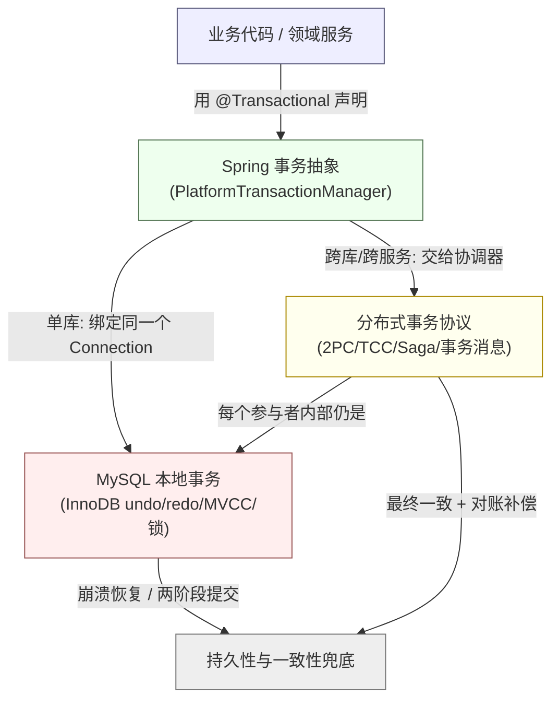

**三层事务横向对比（先有这张表，后面每一层都在填它）：**

| 维度 | 第一层：MySQL 本地事务 | 第二层：Spring 声明式事务 | 第三层：分布式事务 |
|------|----------------------|--------------------------|-------------------|
| 原子性由谁保证 | **InnoDB 引擎**（undo log 回滚 + redo log 持久） | 不产生原子性，只是**调用**本地/分布式事务的抽象 | 由各方案拼回（锁 / 补偿 / 消息） |
| 作用边界 | **单库单连接** | 一次方法调用（可跨多个 DAO，但同库） | **跨库 / 跨服务 / 跨进程** |
| 核心机制 | MVCC + 行锁 + 间隙锁 + 两阶段提交 | AOP 代理 + ThreadLocal 连接绑定 + 传播行为 | 2PC / TCC / Saga / 本地消息表 / 事务消息 |
| 一致性强度 | 强一致（ACID） | 跟随底层（本地=强一致） | 多为**最终一致**（BASE） |
| 典型失效 | 长事务拖垮、死锁、丢失更新 | 自调用、吞异常、异常类型错配 | 协调者单点、部分提交、脑裂 |
| 学习权威 | 姜承尧《InnoDB 存储引擎》、Jim Gray《事务处理》 | 计文柯《Spring 技术内幕》、Craig Walls《Spring 实战》 | Kleppmann《DDIA》、Chris Richardson《微服务设计模式》 |

> **关键洞察（面试加分）**：Spring 的 `PlatformTransactionManager` 是一个**统一抽象**——单库时用 `DataSourceTransactionManager`（底层就是 JDBC 的 `Connection.setAutoCommit(false)`），分布式时用 `JtaTransactionManager` 或 Seata 的实现。业务代码写 `@Transactional` 不变，变的只是底层管理器。**这正是 Spring 把"事务"从数据库细节里解耦出来的价值**，也是本文第四层要讲的重点。

---

## 一、第一层：MySQL 本地事务——ACID 的工程实现

> 本节是"补充 MySQL 事务相关内容"。更细的 MVCC 版本链、临键锁、死锁案例见《MySQL 事务锁机制与 MVCC 深度解析》；这里聚焦**机制之间的咬合关系 + 隔离级别的真相 + 长事务治理**，并补齐书单视角。

### 1.1 ACID → InnoDB 实现映射（根表）

| ACID 属性 | 想保证什么 | InnoDB 的工程实现 |
|-----------|-----------|------------------|
| 原子性 A | 要么全做，要么全不做 | **undo log** + 回滚指针（`roll_ptr`） |
| 一致性 C | 从一种合法状态变到另一种 | 约束（PK/FK/唯一/CHECK）+ 应用层逻辑（借贷平衡） |
| 隔离性 I | 并发事务互不干扰 | **MVCC（快照读）+ 锁（当前读）** 双轨 |
| 持久性 D | 提交后不丢 | **redo log + double write + binlog（两阶段提交）** |

**一致性不是靠单一机制实现的**，而是 A+I+D + 应用约束共同凑出的结果。数据库只硬承诺"原子、隔离、持久"三件，业务一致性（如转账两边金额相等）必须由你和约束一起兜底——这是面试第一层最容易答错的点。

### 1.2 三条日志的分工（面试必考，最易讲乱）

- **undo log**：逻辑日志，记"修改前的值"，支撑回滚与 MVCC 旧版本读取。
- **redo log**：物理日志，记"页的物理修改"，用于崩溃恢复；循环写、顺序写（默认 2×48MB）。
- **binlog**：Server 层逻辑日志，用于主从复制与点对点恢复（PITR）；追加写、可滚动。

为什么 redo 和 binlog 都要写？因为 InnoDB 自己要崩溃恢复（redo），而主从复制要用 binlog。二者必须一致，故引入**两阶段提交（2PC）**：

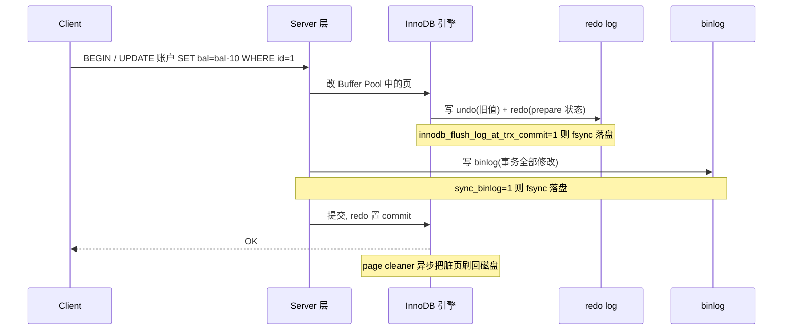

三个结论必须能讲清：① 脏页先驻 Buffer Pool，落盘异步，"持久性"靠 redo 已记录而非数据页立刻落盘；② redo 是 prepare+commit 两阶段，崩溃后用 binlog 裁决最终状态；③ WAL（Write-Ahead Logging）是所有数据库的共性设计。

### 1.3 隔离级别与并发问题——"防幻读"的 MySQL 真相

| 隔离级别 | 脏读 | 不可重复读 | 幻读 | 丢失更新 | 并发性能 |
|----------|:----:|:---------:|:----:|:-------:|:-------:|
| RU 读未提交 | ❌可能 | ❌可能 | ❌可能 | ❌可能 | 最高 |
| RC 读已提交 | ✅杜绝 | ❌可能 | ❌可能 | ❌可能 | 高 |
| **RR 可重复读（MySQL 默认）** | ✅杜绝 | ✅杜绝 | ✅基本杜绝 | ❌可能 | 中 |
| Serializable | ✅杜绝 | ✅杜绝 | ✅杜绝 | ✅杜绝 | 最低 |

**经典加分题：为什么 MySQL 的 RR 能"防幻读"，而 SQL 标准说 RR 不防？**

标准 SQL 把防幻读留给 Serializable，但 InnoDB 的 RR 用两把武器做到"基本防幻读"：

1. **快照读（普通 SELECT）靠 MVCC**：事务首次读建 ReadView，之后整事务读同一快照，别的事务插入并提交的新行不在快照里——读的角度幻读被隔离。
2. **当前读（SELECT ... FOR UPDATE / UPDATE / INSERT）靠临键锁（Next-Key Lock）**：锁住记录 + 间隙，阻止别的事务插入。

```mermaid
graph TD
    Q["同一事务内的查询"] --> R{"是普通 SELECT?<br/>(快照读)"}
    R -->|"是"| M["走 MVCC<br/>读事务开始时的 ReadView 快照<br/>→ 别的事务新插入的行不可见 (防幻读·读侧)"}
    R -->|"否: FOR UPDATE / UPDATE / INSERT<br/>(当前读)"| L["走临键锁 Next-Key Lock<br/>锁记录+间隙<br/>→ 别的事务无法 INSERT (防幻读·写侧)"]
    style M fill:#efe,stroke:#575
    style L fill:#fee,stroke:#955
```

**RR vs RC 的 ReadView 差异（面试高频追问）**：RC 每次**快照读都生成新 ReadView**，所以能看到别的事务已提交的最新值（不可重复读）；RR 只在**事务第一次读时生成 ReadView**，之后复用，所以可重复读。这一点直接决定了"不可重复读是否被杜绝"。

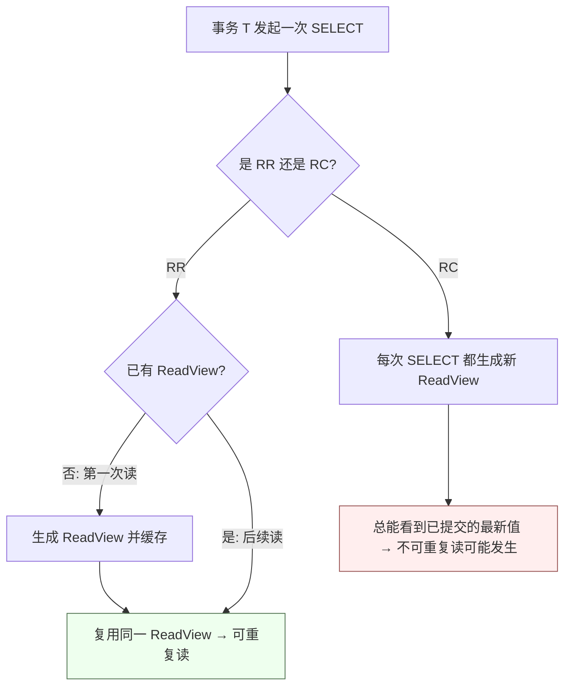

### 1.4 MVCC 核心：隐藏列 + undo 版本链 + ReadView 可见性

InnoDB 每行有隐藏列：`DB_TRX_ID`（最后修改的事务 id）、`DB_ROLL_PTR`（回滚指针指向 undo 中的旧版本）。快照读时，顺着 undo 版本链找到"对当前 ReadView 可见"的版本。`DB_TRX_ID` 与 `DB_ROLL_PTR` 是 MVCC 成立的两块基石——前者标识版本归属，后者串联起版本历史。

**ReadView 可见性算法（四判，按顺序）**：

1. 若 `DB_TRX_ID == 当前事务 id` → 可见（自己改的自己看）；
2. 若 `DB_TRX_ID < up_limit_id`（ReadView 中最小活跃事务 id）→ 可见（修改在 ReadView 建立前已提交）；
3. 若 `DB_TRX_ID >= low_limit_id`（ReadView 建立时下一个将分配的事务 id）→ 不可见（修改在 ReadView 之后）；
4. 若在 `[up_limit_id, low_limit_id)` 区间内 → 看 `DB_TRX_ID` 是否在 ReadView 的活跃事务集合里：在则不可见（未提交），不在则可见（已提交）。

> **补充书单视角**：MVCC 的"多版本 + 可见性判断"思想，在 Jim Gray《事务处理：概念与技术》（*Transaction Processing: Concepts and Techniques*）第 7 章有形式化论述；而"无锁快照读"的工程落地，姜承尧《MySQL 技术内幕：InnoDB 存储引擎》第 7 章讲得最贴近源码。两本互补：一本给理论自洽，一本给实现落地。

### 1.5 长事务——本地事务最隐蔽的杀手（含 XTransfer 治理）

长事务的危害不是"慢"，而是**连锁拖垮**：

- 持有 trx_id 不释放 → ReadView 一直保留 → undo 版本链无法 purge → **undo 表空间膨胀、回滚段暴涨**；
- 长事务持锁不释放 → 后续事务被阻塞 → 连接池打满 → 雪崩；
- RR 下长事务的 ReadView 老，要回溯的 undo 版本多 → **快照读变慢**。

**XTransfer 实战**：收款对账场景曾有"对账窗口长事务"——一个事务包住整批对账（数万笔），运行数分钟。结果：undo 膨胀、对账期间账务写入被间隙锁阻塞、偶发死锁。治理方式：

1. **拆批**：对账按"渠道 + 日期分片"拆成小事务，每批 ≤ 500 笔；
2. **显式提交点**：用 `SAVEPOINT` 做断点续做，失败仅回滚到保存点；
3. **读用 RC + 快照隔离**：对账读用 `START TRANSACTION READ ONLY` + RC，避免长 RR 快照；
4. **监控**：`information_schema.innodb_trx` 中 `TIMESTAMPDIFF(SECOND, trx_started, NOW()) > 5` 即告警。

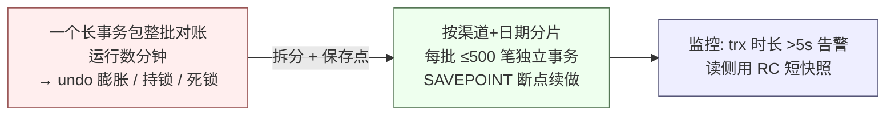

---

## 二、第二层：Spring 声明式事务——把本地事务用框架管好

> 本节是"补充 Spring 事务相关内容"。Spring 全家桶与 `@Transactional` 基础见《Java 与 Spring 深度准备》；这里聚焦**原理内核（连接绑定 / 同步管理器）+ 传播行为的工程语义 + 失效根因 + 与本地事务的衔接**，并补齐书单视角。

### 2.1 声明式事务的本质：AOP + 事务管理器

`@Transactional` 不是魔法，本质是 **AOP 代理 + `PlatformTransactionManager`**。调用带注解的方法时：

1. Spring 生成代理对象（`TransactionInterceptor` 实现 `MethodInterceptor`）；
2. 进入方法前，`TransactionManager.getTransaction()` 按属性开启事务（底层 `Connection.setAutoCommit(false)`）；
3. 执行目标方法；
4. 正常 → `commit()`；抛异常且匹配回滚规则 → `rollback()`。

核心入口：`TransactionAspectSupport.invokeWithinTransaction()`。

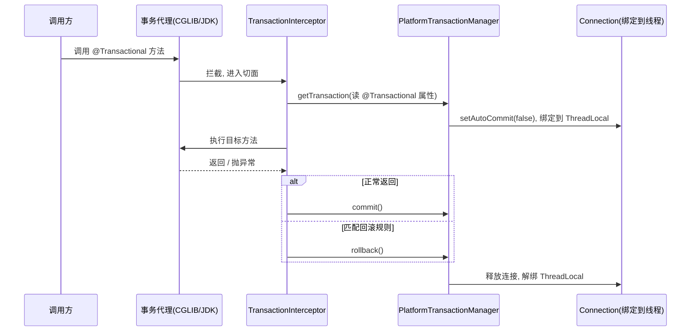

### 2.2 事务管理器架构：统一抽象的关键

`PlatformTransactionManager` 是 Spring 事务的**核心抽象接口**，定义了 `getTransaction / commit / rollback`。不同场景有不同的实现，而业务代码只写 `@Transactional`：

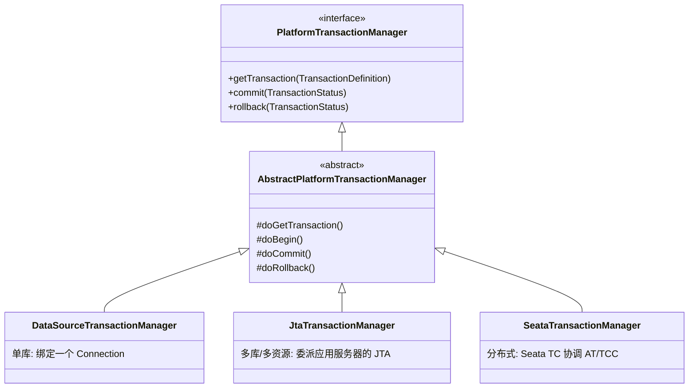

**连接绑定的真相（面试高分点）**：单库场景下，`DataSourceTransactionManager` 通过 `TransactionSynchronizationManager` 把同一个 `Connection` 绑定到当前线程的 `ThreadLocal`。同一个事务内的多个 DAO 调用 `DataSourceUtils.getConnection()`，拿到的都是**同一个 Connection**——这正是"一个 `@Transactional` 方法里多次 CRUD 共享一个事务"的实现原理。一旦跨线程（如 `@Async`），连接绑定失效，事务自然也失效。

> **补充书单视角**：`PlatformTransactionManager` 这套抽象源自 Rod Johnson《Expert One-on-One J2EE Development without EJB》中对"声明式事务"的原始设计；计文柯《Spring 技术内幕：深入解析 Spring 架构与设计原理》第 7 章逐行讲了 `DataSourceTransactionManager.doBegin` 如何把 Connection 绑进 `TransactionSynchronizationManager`；郝佳《Spring 源码深度解析》则从代理生成角度补全了 CGLIB 代理的创建链路。三本连读，能从"为什么这么设计"到"代码怎么跑"打通。

### 2.3 七种传播行为——给场景选对行为才是真理解

| 传播行为 | 有外层事务时 | 无外层事务时 | 支付系统真实示例 |
|----------|-------------|-------------|----------------|
| **REQUIRED**（默认） | 加入外层 | 新建事务 | 转账：扣款+加款同事务 |
| **REQUIRES_NEW** | 挂起外层，开全新 | 新建 | 渠道回调落库（独立提交，不被业务回滚牵连） |
| **NESTED** | 在外层内建保存点 | 新建 | 批量对账：单笔失败回滚到保存点，不影响整批 |
| **SUPPORTS** | 加入外层 | 非事务运行 | 查询订单状态 |
| **NOT_SUPPORTED** | 挂起外层，非事务 | 非事务运行 | 记操作日志（业务回滚日志也不丢） |
| **MANDATORY** | 加入外层 | **抛异常** | 内部资金操作（防止绕过事务误调用） |
| **NEVER** | **抛异常** | 非事务运行 | 跨数据源大数据量导出 |

**NESTED vs REQUIRES_NEW（最易被混淆，必考）**：

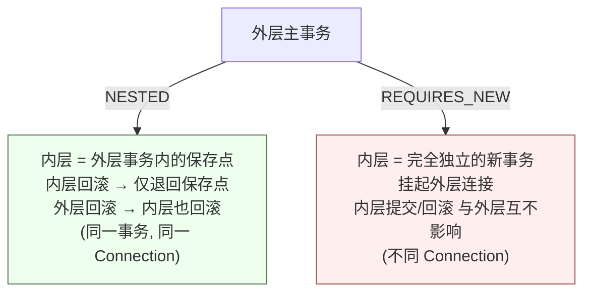

一句话区分：**NESTED 是"同一事务里的断点"，REQUIRES_NEW 是"另开一个完全独立的事务"**。支付里"渠道回调落库"用 REQUIRES_NEW——即使后面记账失败主事务回滚，回调记录也已独立落库，便于对账追溯；而"批量对账单笔失败"用 NESTED——单笔回滚不影响整批继续。

### 2.4 `@Transactional` 六大失效场景（对比表 + 根因）

| 失效场景 | 根因 | 后果 | 解法 |
|----------|------|------|------|
| 同类自调用 `this.method()` | 绕过 AOP 代理，没走拦截器 | 事务根本没开 | 拆到另一 Bean / `@Lazy` 注入自己 / `AopContext.currentProxy()` / 编程式 |
| 方法非 `public` | Spring AOP 默认只拦截 public | 注解被忽略 | 改为 public 或用 AspectJ 模式 |
| 异常被 `catch` 吞掉 | 拦截器收不到异常 | 不回滚 | 异常外抛或 `TransactionAspectSupport.setRollbackOnly()` |
| 异常类型不匹配 | 默认只回滚 `RuntimeException` | 受检异常不回滚 | `rollbackFor = Exception.class` |
| 跨线程（`@Async`/新线程） | 连接绑定在 ThreadLocal，线程一换就丢 | 子线程无事务 | 传上下文 / 子线程自行开事务 |
| 多数据源未配对管理器 | 用的 Connection 与 TM 不是同一个库 | 回滚错库 | 指定 `transactionManager` + `@Primary`/限定 |

**XTransfer 真实教训（来自渠道回调）**：`handleCallback()` 内部 `this.recordAccount()` 自调用 + 异常被 catch 吞掉 → 事务未开、无幂等 → 某渠道 3 分钟内重复回调 200 次，**重复入账 200 笔、涉及约 ¥1.2M，资金差错率飙到 0.08%**。修复：`recordAccount` 拆独立 Bean + `REQUIRES_NEW` + 状态机 CAS 幂等；长效在 CI 用 ArchUnit 规则拦截"同类自调用事务方法"。

### 2.5 编程式事务兜底 & 事务边界事件

- **`TransactionTemplate`**：当声明式不够灵活（如需要在循环里对每笔独立提交、或需要手动控制回滚点），用 `transactionTemplate.execute(status -> { ... status.setRollbackOnly(); })`。
- **`@TransactionalEventListener(phase = AFTER_COMMIT)`**：事务**提交后**才触发领域事件——保证"副作用（发通知 / 写 ES / 推消息）只在业务真正成功后发生"。`AFTER_COMMIT` 阶段监听器抛异常**不会回滚已提交事务**（这是设计意图），故副作用失败需自己 try-catch 或 `@Async`。

> **书单**：`@TransactionalEventListener` 与事务同步机制在 Craig Walls《Spring 实战》（*Spring in Action*）事务章节有端到端示例；更深的事务同步（`TransactionSynchronization` 回调点）见《Spring 技术内幕》。

---

## 三、第三层：分布式事务——ACID 跨越边界后的退化

> 本节"结合分布式事务一起补充"。完整方案对比与 Seata 落地见《分布式事务与一致性》；这里在"全景"视角下**把六类方案压成一张选型总表 + 各自时序图 + 与本地/Spring 层的衔接**，并补齐书单。

### 3.1 为什么本地事务不够

当一次"业务操作"必须写**两个库**或调用**两个服务**，单库本地事务的原子性边界就被打破了：库 A 提交成功、库 B 因网络失败，数据就不一致。CAP 里网络分区不可避免，分布式系统通常选 **AP + 最终一致**（BASE），把强一致的原子性，用"协议 + 补偿 + 对账"在更上层拼回来。

### 3.2 六大方案全景对比表

| 方案 | 一致性 | 侵入性 | 性能/吞吐 | 隔离性 | 典型适用 |
|------|--------|-------|----------|-------|---------|
| **2PC / XA** | 强一致 | 低（DB 原生） | 低（全程持锁） | 强 | 同栈跨库、短事务、传统金融 |
| **TCC** | 强一致 | **高（三套接口）** | 高（无长锁） | 强（业务预留） | 跨账户资金调拨、锁库存 |
| **Saga** | 最终一致 | 中（补偿接口） | 高（无长锁） | 弱（中间态可见） | 跨多系统长流程 |
| **本地消息表** | 最终一致 | 中 | 高 | 弱 | 业务库 + 消息解耦 |
| **事务消息（RocketMQ）** | 最终一致 | 低 | 高 | 弱 | 下游可异步、能容忍延迟 |
| **最大努力通知** | 弱最终一致 | 低 | 高 | 最弱 | 跨机构通知（如银行结果回调） |

### 3.3 关键方案时序图

**TCC（Try-Confirm-Cancel，资金强一致）**

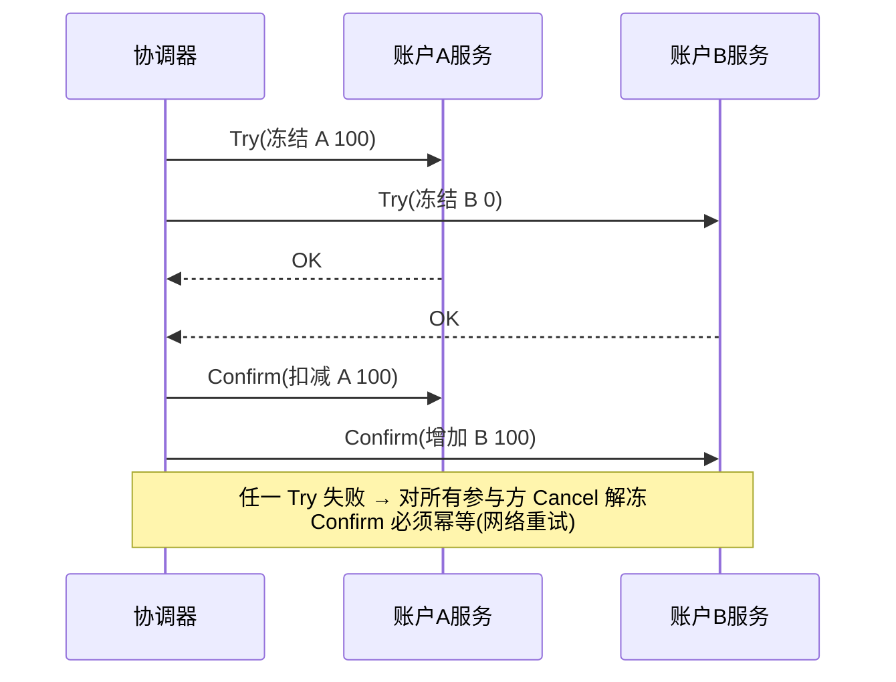

**Saga（编排式，长流程最终一致）**

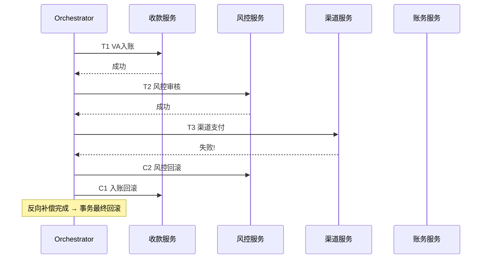

**本地消息表 / 事务消息（业务库与消息同库则本地事务保证）**

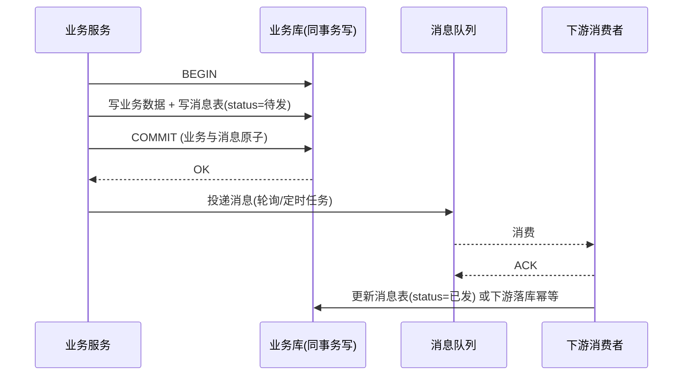

### 3.4 XA vs TCC vs Saga 深度对比（面试追问常客）

| 对比维度 | XA(2PC) | TCC | Saga |
|----------|---------|-----|------|
| 原子性来源 | 数据库锁 + 协调者 | 业务层资源预留 | 补偿逆向执行 |
| 锁持有时间 | 长（全程） | 短（Try 后即释放） | 无（各本地事务独立提交） |
| 一致性 | 强一致 | 强一致 | 最终一致 |
| 代码侵入 | 几乎无 | 高（Try/Confirm/Cancel） | 中（需补偿） |
| 隔离性 | 强 | 强（预留态） | 弱（可见中间态） |
| 协调者单点 | 是（痛点） | 可无（本地驱动） | 编排式有中心 |
| 适用 | 同栈短事务 | 高价值强一致 | 长流程跨多系统 |

### 3.5 选型决策树

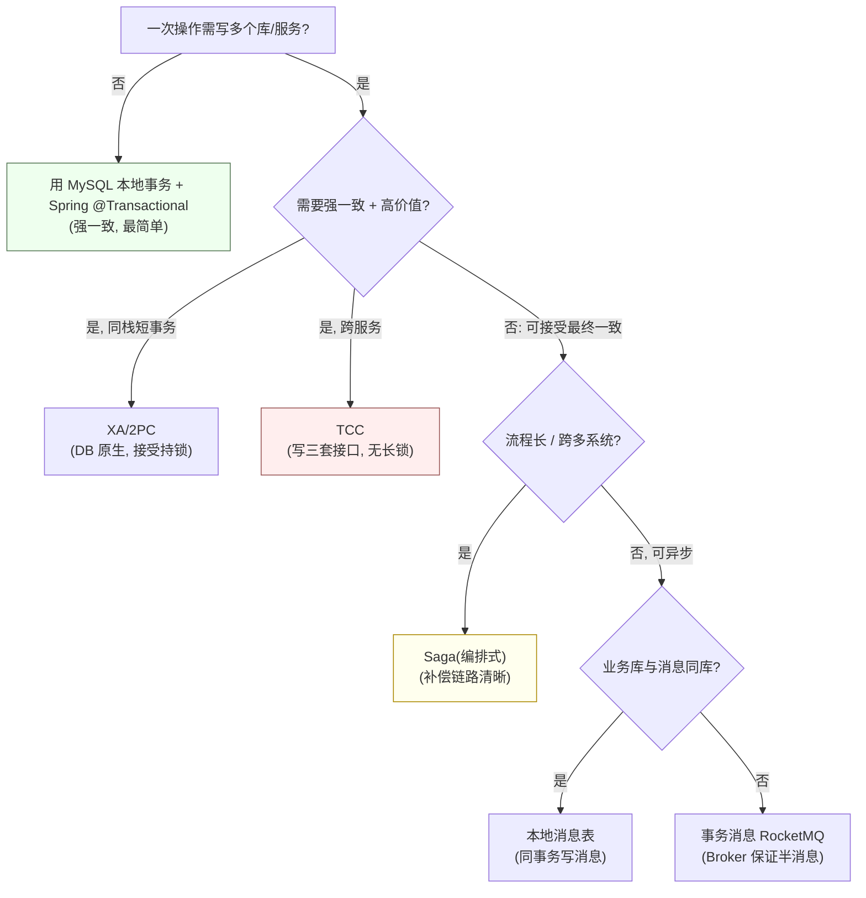

> **书单视角**：Saga 模式的权威出处是 Chris Richardson《微服务设计模式》（*Microservices Patterns*）第 4 章，唯一把 Saga 的协同式/编排式、空补偿、隔离性缺失讲透的工程书；2PC 的形式化与缺陷在 Jim Gray《事务处理：概念与技术》第 7、8 章；"最终一致为什么是分布式唯一现实选择"在 Martin Kleppmann《数据密集型应用系统设计》（*Designing Data-Intensive Applications*, DDIA）第 7、9 章；消息最终一致的通道设计在 Gregor Hohpe《企业集成模式》（*Enterprise Integration Patterns*）；CAP 的理论边界看 Gilbert & Lynch 2002 论文 *Brewer's Conjecture and the Feasibility of Consistent, Available, Partition-Tolerant Web Services*。

---

## 四、整合：Spring 如何桥接本地事务与分布式事务

这是三层事务真正的"接缝"。**业务代码不变，只换 `PlatformTransactionManager`**，就能从单库强一致升级到分布式：

- 单库：`DataSourceTransactionManager` + 普通 `@Transactional`；
- 分布式（Seata AT）：引入 `SeataAutoDataSourceProxy` + `SeataTransactionManager`，`@Transactional` 或 `@GlobalTransactional` 即触发全局事务，Seata TC 用 undo_log 做分支回滚；
- 多资源 JTA：`JtaTransactionManager` 委派容器 JTA。

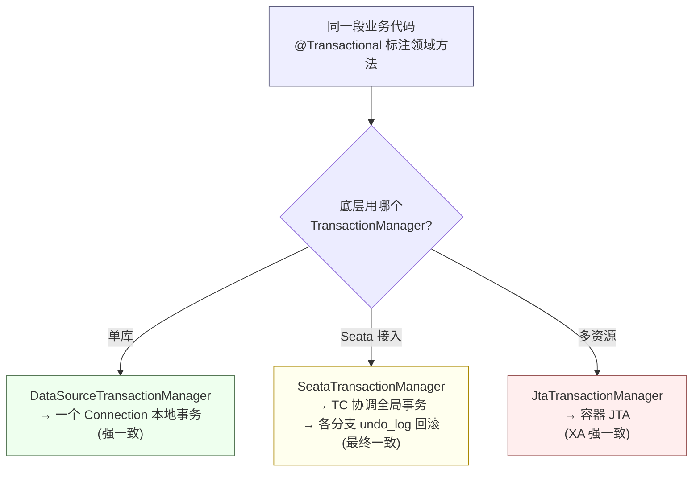

**面试高分表述**："Spring 把事务抽象成 `PlatformTransactionManager`，业务只声明 `@Transactional`。单库时它绑定一个 Connection 做本地事务；一旦接入 Seata 或 JTA，同样的注解背后变成全局事务协调。所以**分布式事务不是推翻本地事务，而是在本地事务之上加了一层协调与补偿**，每个参与者内部仍然是普通的 MySQL 本地事务。"

---

## 五、XTransfer 实战：三层事务贯穿的真实架构

> 这是"结合我 XTransfer 项目一起讲"的核心。XTransfer 跨境支付收款平台，我做**收款领域 Owner**，主导了**收款领域 2.0 重构**（六边形架构 + CQRS + DDD，SPI 扩展 100+ 渠道 VA 开户，任务补偿机制），上线后 **+30% 人效、-80% 生产问题、0 资损**。下面看三层事务如何贯穿。

### 5.1 三层事务在收款链路中的位置

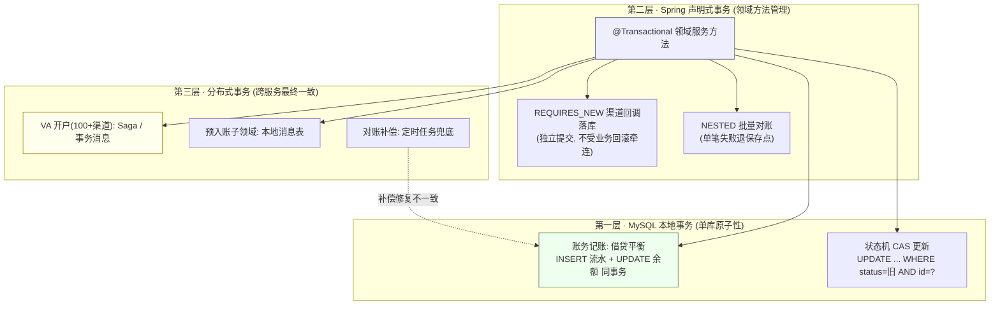

### 5.2 场景一：本地事务兜底账务原子性（借贷必平）

收款入账时，`记账领域服务` 在一次 `@Transactional` 内：① `INSERT` 一条借贷流水；② `UPDATE` 账户余额。两条语句在同一个 Connection、同一个本地事务里——**要么都成，要么都败**。再加数据库 `DECIMAL` 精度约束 + 应用层"借贷平衡校验"，保证账务不强依赖上层逻辑也能自洽。这正是第一层 MySQL 本地事务的价值。

### 5.3 场景二：Spring 管理领域方法，REQUIRES_NEW 救回渠道回调

渠道异步回调（银行通知到账）处理流程用 `REQUIRES_NEW` 把"回调记录落库"独立出来：即使后续记账主事务因风控拒绝而回滚，**回调原始报文已持久化**，对账与排查有据可查。这正是前文 2.3 / 2.4 失效案例的"正向解法"——把"必须留痕"的操作与"可能回滚"的业务解耦。

### 5.4 场景三：跨服务分布式事务——VA 开户与预入账

- **VA 开户（100+ 渠道）**：给每个企业客户在合作银行开虚拟账户，涉及"核心系统建户 + 银行渠道调用 + 渠道状态回写"，跨多服务且渠道响应慢、易超时。采用 **Saga / 事务消息**：先本地落"开户中"状态，发消息驱动渠道开户，渠道结果回来再正向推进或补偿回滚；对强一致要求高的渠道子步骤用 **TCC** 冻结额度。
- **预入账子领域（0→1 建设）**：从"资金落地"到"可被客户使用"之间引入预入账，用**本地消息表**保证"资金已到"与"通知客户可用"最终一致，避免资金到了客户却看不到。

### 5.5 场景四：0 资损 = 三层事务 + 对账补偿共同保证

XTransfer 的 0 资损不是靠某一层，而是**三层叠防**：

1. **第一层兜底**：单笔记账靠本地事务原子性，绝不会出现"流水有、余额没改"；
2. **第二层管理**：Spring 让领域方法边界清晰、REQUIRES_NEW 保证关键留痕不被业务回滚带崩；
3. **第三层最终一致**：跨服务的开户/预入账用 Saga + 事务消息保证最终对齐；
4. **对账补偿兜底（最后一道网）**：T+1 三层对账（渠道 ↔ 内部 ↔ 客户）发现任何不一致，**定时任务 + 任务补偿机制**自动或人工修复。**任何一层漏掉的，对账兜回来**——这是金融系统"宁可最终一致，不可资损"的工程哲学。

> **量化结果**：2.0 重构后生产问题 **-80%**（很大一部分正是事务边界不清、自调用失效类问题被架构与规范根除），人效 **+30%**，资损 **0**。

---

## 六、综合对比与选型速查

### 6.1 原子性保证维度总览（把三层再压成一张表）

| 你想保证什么 | 用什么 | 一致性强度 | XTransfer 落点 |
|-------------|--------|-----------|---------------|
| 单库多语句原子 | MySQL 本地事务 + Spring `@Transactional` | 强一致 | 记账借贷平衡 |
| 关键操作不被业务回滚牵连 | Spring `REQUIRES_NEW` | 强一致（独立） | 渠道回调留痕 |
| 单笔失败不影响整批 | Spring `NESTED` | 强一致（保存点） | 批量对账 |
| 跨库同栈短事务 | XA / 2PC | 强一致 | 内部多库强一致场景 |
| 跨服务高价值强一致 | TCC | 强一致（预留） | 渠道额度冻结 |
| 跨服务长流程 | Saga / 事务消息 | 最终一致 | VA 开户 100+ 渠道 |
| 消息与业务解耦 | 本地消息表 / RocketMQ 事务消息 | 最终一致 | 预入账通知 |
| 任何遗漏的修复 | 对账 + 任务补偿 | 最终一致（兜底） | 0 资损最后一道网 |

### 6.2 面试标准回答："事务这道题怎么答穿三层"

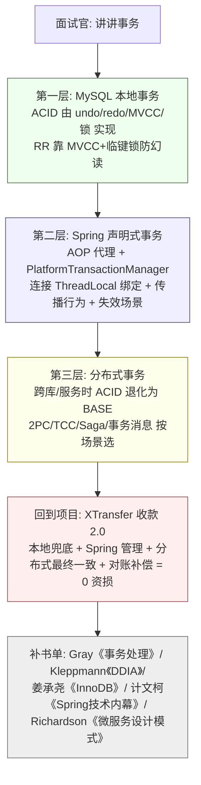

**口述模板**（可用于任何"讲讲事务"的 Opening）："事务我习惯分三层讲。最底层是 MySQL 本地事务，ACID 由 undo 回滚、redo 持久、MVCC+锁做隔离实现，RR 之所以能防幻读是靠快照读 MVCC 加当前读临键锁。中间层是 Spring 声明式事务，本质是用 AOP 把本地事务管起来，通过 `PlatformTransactionManager` 把同一个 Connection 绑到线程，再靠传播行为控制事务边界，典型坑是自调用失效。但一旦原子性要跨库跨服务，本地事务就不够了，就得上分布式事务——按一致性要求选 2PC/TCC/Saga/事务消息。在我们 XTransfer 收款 2.0 里，单笔记账靠本地事务兜底原子性，渠道回调用 REQUIRES_NEW 独立留痕，VA 开户 100+ 渠道用 Saga/事务消息保最终一致，最后再靠对账补偿兜 0 资损。"

---

## 七、权威书单（按层组织，含原名 / 中文名 / 重点章）

> "有详细书名"是本文硬要求。下面每一本都标注作者、英文原名（若有）、中文版、以及"为什么读、读哪章"，方便面试引用与系统学习。

### 7.1 第一层 · MySQL 与数据库事务理论

| 书名（作者） | 原名 / 中文 | 重点章节 | 为什么读 |
|-------------|-----------|---------|---------|
| 姜承尧《MySQL 技术内幕：InnoDB 存储引擎（第 2 版）》 | *MySQL Internals* | 第 7 章 事务 / 第 8 章 锁 / 第 9 章 MVCC | 最贴近 InnoDB 源码的 MVCC、undo/redo、锁实现，面试讲"机制"的靠山 |
| Jim Gray, Andreas Reuter《事务处理：概念与技术》 | *Transaction Processing: Concepts and Techniques* | 第 7 章 事务模型 / 第 8 章 2PC / 第 9 章 恢复 | 事务处理"圣经"，形式化定义 ACID、2PC、恢复，分布式事务的理论根 |
| Abraham Silberschatz 等《数据库系统概念（第 6/7 版）》 | *Database System Concepts* | 第 14 章 Transactions / 第 15 章 并发控制 | 教材级严谨，并发控制（锁 / 时间戳 / MVCC）的理论全貌 |
| Hector Garcia-Molina 等《数据库系统实现》 | *Database Systems: The Complete Book (实现卷)* | 锁协议 / 多版本 / 恢复 | 锁与 MVCC 的"实现视角"，补足理论到代码的 gap |
| Baron Schwartz 等《高性能 MySQL（第 4 版）》 | *High Performance MySQL* | 事务与隔离级别 / 复制 | 工程调优视角，隔离级别代价、长事务危害的实战数据 |
| Martin Kleppmann《数据密集型应用系统设计》 | *Designing Data-Intensive Applications* | 第 7 章 事务 / 第 9 章 一致性与共识 | 现代视角讲"为什么分布式只能最终一致"，CAP/BASE 的最佳讲解 |

### 7.2 第二层 · Spring 事务

| 书名（作者） | 原名 / 中文 | 重点章节 | 为什么读 |
|-------------|-----------|---------|---------|
| Craig Walls《Spring 实战（第 5/6 版）》 | *Spring in Action* | 事务管理章节 | 端到端示例最友好，`@Transactional` / 事件监听讲得能直接抄 |
| 计文柯《Spring 技术内幕：深入解析 Spring 架构与设计原理（第 2 版）》 | — | 第 7 章 事务 | 逐行讲 `DataSourceTransactionManager.doBegin` 如何把 Connection 绑进 `TransactionSynchronizationManager` |
| Rod Johnson《Expert One-on-One J2EE Development without EJB》 | 中文《J2EE 设计开发编程指南》 | 声明式事务设计 | `PlatformTransactionManager` 抽象的思想源头，理解"为什么这么设计" |
| 郝佳《Spring 源码深度解析（第 2 版）》 | — | AOP / 事务代理 | CGLIB/JDK 代理生成链路，补全"自调用失效"的根因 |
| Rob Harrop 等《Pro Spring（第 6 版）》 | *Pro Spring 6* | 事务抽象 | 偏底层配置，`JtaTransactionManager` 多资源场景参考 |

### 7.3 第三层 · 分布式事务与一致性

| 书名 / 论文（作者） | 原名 / 中文 | 重点 | 为什么读 |
|-------------------|-----------|------|---------|
| Chris Richardson《微服务设计模式》 | *Microservices Patterns* | 第 4 章 事务与查询（Saga） | 唯一把 Saga 协同式/编排式、空补偿、隔离缺失讲透的工程书 |
| George Coulouris 等《分布式系统：概念与设计（第 5 版）》 | *Distributed Systems: Concepts and Design* | 事务与一致性 | 分布式事务与共识的教材级全貌 |
| Gregor Hohpe, Bobby Woolf《企业集成模式》 | *Enterprise Integration Patterns* | 事务性消息 / 通道 | 消息最终一致的通道设计模式，RocketMQ 事务消息的理论母本 |
| 论文：Gilbert & Lynch (2002) | *Brewer's Conjecture and the Feasibility of Consistent, Available, Partition-Tolerant Web Services* | CAP 证明 | CAP 猜想的形式化证明，面试引用显专业 |
| 论文：Lamport (2001) | *Paxos Made Simple* | 共识 | 强一致协调器的理论底座（与 2PC 协调者单点对照） |
| 论文：Ongaro & Ousterhout (2014) | *In Search of an Understandable Consensus Algorithm (Raft)* | 共识 | 现代协调器（etcd/TiKV）选主与日志复制基础 |

---

## 八、面试高频追问（跨三层）

**Q1：Spring 的 `@Transactional` 能跨库保证事务吗？**
不能。`@Transactional` 默认只绑定一个 `DataSource` 的一个 Connection，只保证**单库**本地事务。跨库要么用 JTA/XA（强一致但持锁），要么上分布式事务框架（Seata/TCC/Saga，最终一致）。这是"第二层管不了第三层"的边界。

**Q2：`@Transactional` 方法里调用另一个服务的接口，失败会回滚远程吗？**
不会。本地回滚只回滚本地数据库，远程服务已经执行的副作用（如对方已扣减）不会自动回滚——除非远程也参与同一分布式事务（TCC 的 Cancel / Saga 的补偿）。这正是对账补偿存在的理由。

**Q3：RR 下我用 `SELECT ... FOR UPDATE` 还会幻读吗？**
快照读（普通 SELECT）靠 MVCC 防；当前读（`FOR UPDATE`/写操作）靠**临键锁**锁住记录+间隙，别的事务无法插入，所以从"当前读"角度也防住幻读。RR 的"基本防幻读"是 MVCC + 临键锁双轨的结果。

**Q4：为什么支付不用 XA 而用最终一致？**
XA 全程持锁、协调者单点、吞吐低，支付追求高可用不会为强一致牺牲可用性（CAP 选 AP）。高价值短流程（如账户间调拨）才用 TCC 强一致；长流程（VA 开户）用 Saga/事务消息最终一致，最后靠对账兜底。

**Q5：本地消息表和事务消息（RocketMQ）怎么选？**
业务库与消息队列**同库** → 本地消息表（同事务写消息，最简单可靠）；**不同库** → RocketMQ 事务消息（半消息 + 回查，Broker 保证投递）。本质都是"把本地事务的成功，作为发消息的前提"，避免"业务提交了消息却没发 / 消息发了业务却回滚"。

---

<!-- EXPANDED -->
