> 本文覆盖：CAP/BASE 理论 → 六大方案（每种带**优缺点 + 适用场景**）→ 开源框架横评 → **结合 XTransfer 跨境收款最新项目的详细落地** → 面试标准回答。

## 1. 为什么难

CAP 里网络分区不可避免，分布式系统只能 **AP + 最终一致**（支付追求高可用，不会为强一致牺牲可用性）。BASE（基本可用 Basically Available、软状态 Soft state、最终一致 Eventually consistent）是对 AP 的工程化描述。

> 补充：ACID 是单机事务的强保证；分布式下用 BASE 权衡。面试能讲清「为什么支付选 AP 而非 CP」就赢一半。

**一致性谱系**（从强到弱，工程上按场景取点）：
- **强一致（Linearizable）**：任何时刻读到的都是最新写入。成本最高，跨系统几乎做不到。
- **顺序一致 / 因果一致**：中间态，分布式数据库常见。
- **最终一致（Eventual）**：允许短暂不一致，最终收敛。**支付/电商绝大多数场景的落点**。
- **读写一致 / 单调读**：面向用户体验的弱一致变体（如「我自己刚提交的能立刻看到」）。

## 2. 六大方案（优缺点 + 适用场景）

### 2.1 2PC（两阶段提交）
- **流程**：Prepare（协调者让参与者锁资源、写 undo/redo，返回可提交）→ Commit（统一提交）。
- **优点**：强一致、实现语义清晰、数据库原生支持（XA）。
- **缺点**：①**协调者单点**，宕机时参与者一直阻塞；②**同步阻塞**，全程持锁，吞吐低；③极端网络下有**数据不一致**风险（部分提交）。
- **适用场景**：参与方少、事务短、强一致、**同一 DBMS/XA 数据源**（如跨库但同栈）。**互联网高并发一般不用**。

#### 2PC Mermaid 时序图

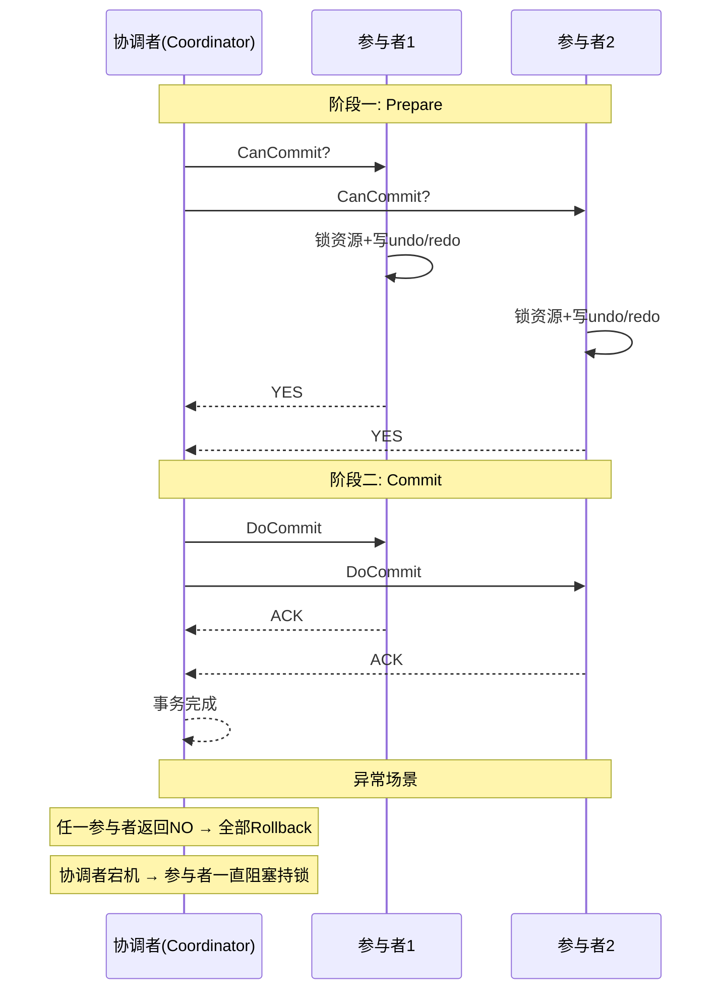

**【深度拓展】2PC 的数据不一致风险**
- **协调者宕机**：阶段二 Commit 只发给了参与者1、没发给参与者2（协调者宕机）→ 参与者1 提交、参与者2 一直持锁阻塞 → 数据不一致。
- **网络分区**：参与者收到 Commit 但 ACK 丢了 → 协调者以为失败要 Rollback，但参与者已提交。
- **解决方案**：3PC 引入超时机制（参与者超时后自动提交或回滚），但增加一轮 RTT，且仍不完美。工程上更多用 TCC/Saga 替代。

**【面试官追问】**
- "为什么互联网公司不用 2PC？" → 性能（全程持锁）、协调者单点、不适合跨异构系统。
- "XA 和 2PC 的关系？" → XA 是 2PC 的工业标准接口（`XAResource`），MySQL/Oracle 都实现了 XA 规范。Seata XA 模式即基于此。

### 2.2 3PC / XA
- **3PC** 在 2PC 前加 CanCommit 询问阶段 + 超时机制，缓解阻塞，但增加一轮 RTT，实际很少用。
- **XA** 是 2PC 的工业标准接口（`XAResource`），MySQL/Oracle 都支持；Seata 的 XA 模式即基于此。
- **适用场景**：需要数据库层强一致、能接受性能损耗的传统金融/ERP。

### 2.3 TCC（Try-Confirm-Cancel）

> TCC 把"事务"拆成 Try（预留资源）、Confirm（确认）、Cancel（释放）三步；**任一 Try 失败就要 Cancel 全部**，所以每个分支都要实现三个方法。下面用跨账户转账演示。

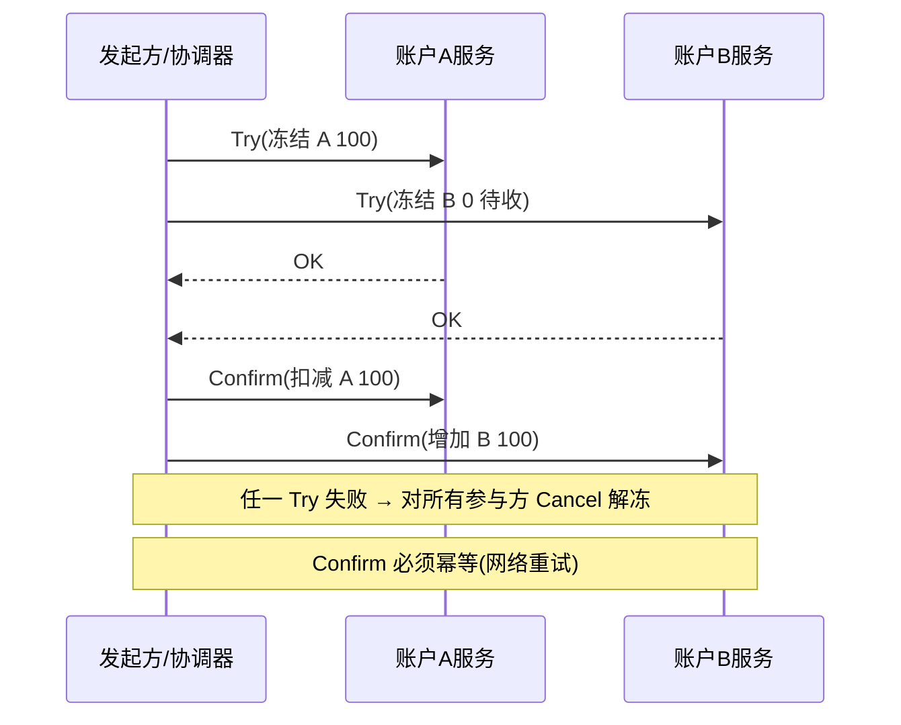
- **流程**：Try 预留资源（冻结额度）→ Confirm 真正扣减 → Cancel 释放冻结。
- **优点**：**无长事务锁**（资源在业务层预留而非 DB 锁），性能好、一致性强、跨异构系统。
- **缺点**：**侵入极大**（每个操作要手写三套接口）；必须处理**空回滚 / 防悬挂 / 幂等**三大问题；开发维护成本高。
- **适用场景**：**强一致 + 高价值 + 短流程**，如跨账户资金调拨、账户余额冻结/扣减、下单锁库存。

### 2.4 Saga
- **流程**：长事务拆成 N 个本地事务 T1..Tn，每个配一个补偿 C1..Cn；某步失败则**反向依次补偿**已完成的步骤。
- **两种实现**：
  - **协同式（Choreography）**：各服务发/收事件互相驱动，去中心，但流程隐式、难观测、易成「事件迷宫」。
  - **编排式（Orchestration）**：中央 Orchestrator 调度每一步，流程显式、易监控、易补偿，代价是中心节点。
- **优点**：**无长锁**、适合长流程、天然异步、可用性高。
- **缺点**：**只保证最终一致**（无隔离性，中间态可见，需业务容忍）；补偿逻辑要幂等、要处理「补偿也失败」；**不能保证 ACID 的 I（隔离）**，可能读到中间脏态。
- **适用场景**：**跨多系统的长业务流程**，如「下单→风控→渠道支付→账务→通知」。

#### Saga Mermaid 时序图（编排式）

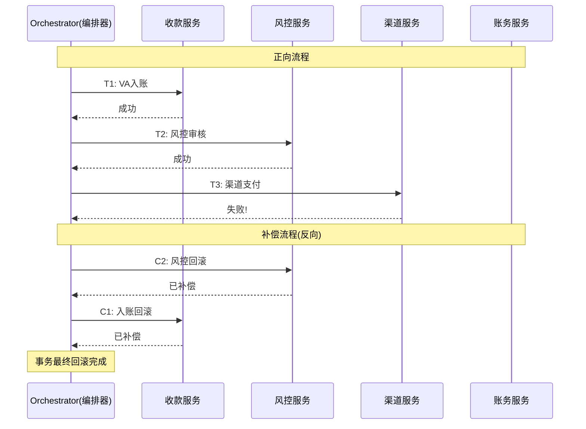

**【深度拓展】Saga 编排式 vs 协同式 Mermaid 对比**

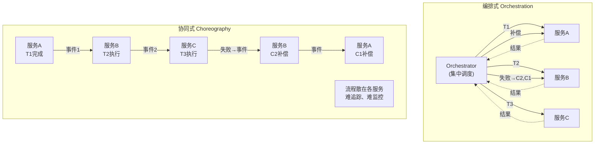

**【面试官追问】**
- "Saga 编排器挂了怎么办？" → 编排器把状态机快照落 DB，重启从 DB 恢复继续推进，不丢进度。
- "Saga 和 TCC 最大区别？" → TCC 有资源预留（Try 阶段冻结），Saga 没有隔离性，中间态可见。

### 2.5 本地消息表 / 事务消息（Outbox 模式）
- **本地消息表**：本地事务把「业务数据 + 消息（Outbox 表）」同库提交，再由定时任务/中继投递到 MQ，消费者幂等消费。**发送与业务原子**。
- **事务消息**：RocketMQ half message → 本地事务 → 提交/回滚 → 回查；Kafka 事务（幂等生产 + `transactional.id`）也可等价 Outbox。
- **优点**：**实现简单、侵入小、无全局锁、最终一致**，**支付内部跨服务最常用**。
- **缺点**：仅最终一致；依赖 MQ 可靠性；消息表要清理、要防积压；回查/扫描要幂等。
- **适用场景**：内部服务间的异步最终一致（订单↔账务、支付成功→发通知/记积分）。

#### Outbox 模式 Mermaid 时序图

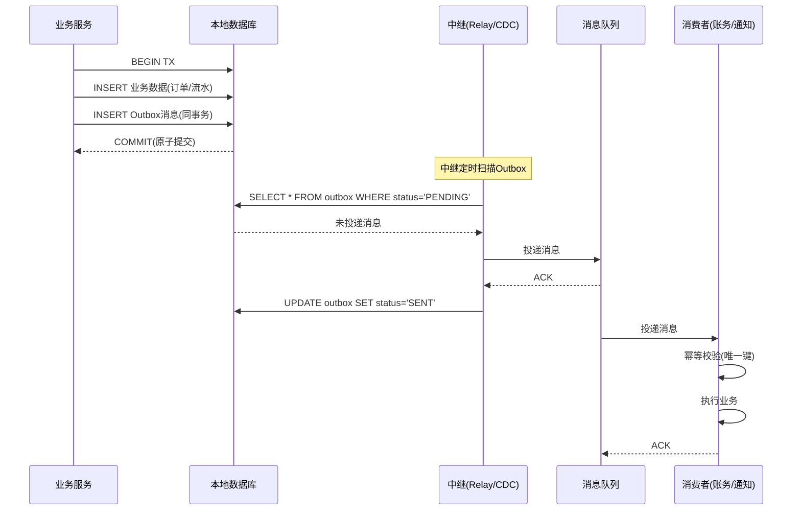

**【深度拓展】Outbox 投递的三种实现方式**
1. **定时扫描**：`SELECT * FROM outbox WHERE status='PENDING'`，简单但延迟高（秒级）。
2. **CDC（Change Data Capture）**：Debezium 读 binlog，变更实时投递到 MQ，延迟毫秒级但需运维 CDC 组件。
3. **事务后触发**：Spring 的 `TransactionSynchronization.afterCommit()` 在事务提交后投递 MQ——简单但服务重启会丢投递（不是真正原子的）。所以生产级用方案1/2，方案3做补偿。

```sql
-- Outbox 表设计示例
CREATE TABLE outbox_messages (
  id BIGINT PRIMARY KEY AUTO_INCREMENT,
  aggregate_id VARCHAR(64) NOT NULL,      -- 业务聚合ID(如订单号)
  aggregate_type VARCHAR(64) NOT NULL,     -- 聚合类型
  event_type VARCHAR(128) NOT NULL,        -- 事件类型
  payload TEXT NOT NULL,                   -- 事件内容(JSON)
  status ENUM('PENDING','SENT','FAILED') DEFAULT 'PENDING',
  retry_count INT DEFAULT 0,
  created_at TIMESTAMP DEFAULT NOW(),
  sent_at TIMESTAMP NULL,
  INDEX idx_status_created (status, created_at)  -- 扫描索引
);

-- 同事务原子写入
BEGIN;
INSERT INTO payment_records (...) VALUES (...);
INSERT INTO outbox_messages (aggregate_id, aggregate_type, event_type, payload)
  VALUES ('PAY20260710001', 'Payment', 'PaymentSucceeded', '{"amount":100,...}');
COMMIT;
```

**【面试官追问】**
- "Outbox 和 RocketMQ 事务消息有什么区别？" → 本质一样，都是"业务+消息原子提交"。RocketMQ 用 half message + 回查机制（框架保证），Outbox 用同库事务 + 中继投递（自保证）。RocketMQ 更省事但绑定 RocketMQ；Outbox 更通用但需自维护中继。
- "Outbox 表会不会无限增长？" → 不会，已投递的消息定期清理（`DELETE FROM outbox WHERE status='SENT' AND created_at < ...`），或归档到冷存储。

### 2.6 最大努力通知
- **流程**：主动多次重试通知下游（指数退避），失败进队列，最终靠 **T+1 对账** 兜底修正。
- **优点**：实现最简单、对下游无侵入。
- **缺点**：**不保证实时**、依赖对账补偿、可能长时间不一致。
- **适用场景**：与**外部渠道/银行**交互（对方不可能配合你的 TCC/Saga），如支付渠道回调、结算通知。

## 3. 选型矩阵（速查）

> 不知道选哪个？顺着下面的决策树走：先问"是否要强一致"，再问"能否回滚补偿"，基本能落到 80% 的场景。

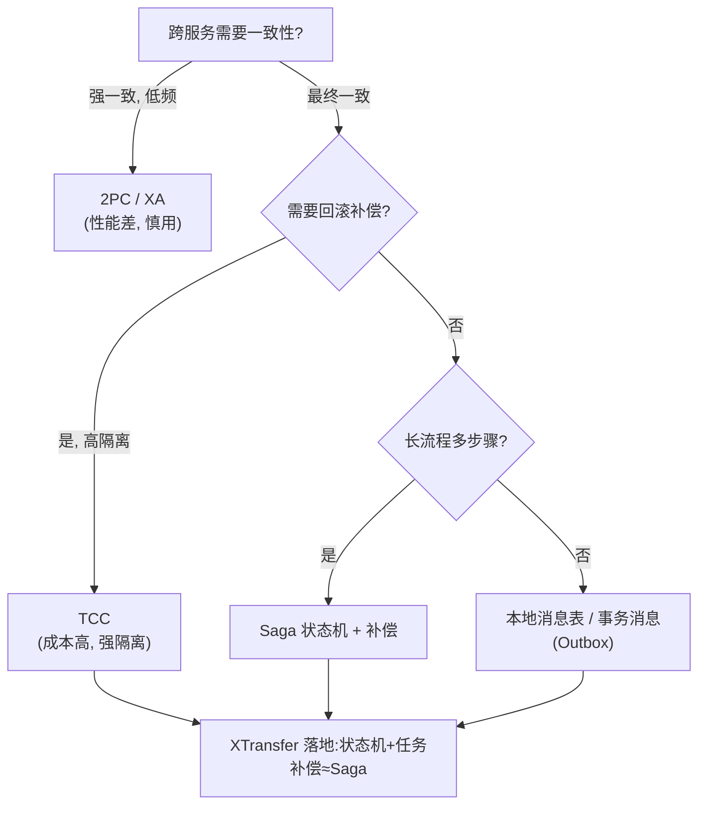

| 方案 | 一致性 | 隔离性 | 侵入 | 性能 | 典型场景 | 代表框架 |
| --- | --- | --- | --- | --- | --- | --- |
| 2PC/XA | 强 | 有 | 低 | 差 | 单栈跨库、传统金融 | Seata XA、Atomikos、Narayana |
| TCC | 强 | 有(业务层) | 高 | 好 | 跨账户调拨、锁库存 | Seata TCC、Hmily、ByteTCC |
| Saga | 最终 | 无 | 中 | 好 | 长流程编排 | Seata Saga、DTM、Eventuate |
| 本地消息表/Outbox | 最终 | 无 | 低 | 好 | 内部跨服务异步 | RocketMQ 事务消息、DTM、自研 |
| 事务消息 | 最终 | 无 | 低 | 好 | 消息驱动最终一致 | RocketMQ、Kafka 事务 |
| 最大努力通知 | 最终 | 无 | 低 | 好 | 外部渠道回调 | 自研 + 对账 |

## 4. 开源框架横评（面试常问"你了解哪些框架"）

### 4.1 Seata（阿里，最主流）
- **四种模式**：
  - **AT**（Auto Transaction）：无侵入，靠拦截 SQL 自动生成 undo_log 反向补偿，**最省事**，但有全局锁、隔离性弱。
  - **TCC**：手写三接口，强一致高性能。
  - **Saga**：状态机驱动的长事务编排（基于状态机 JSON 定义）。
  - **XA**：基于数据库 XA 的强一致。
- **架构**：TC（事务协调者，独立 Server）+ TM（事务管理者，发起方）+ RM（资源管理者，参与方）。
- **适用**：Spring Cloud / Dubbo 生态，想快速接入选 AT。
- **坑**：AT 的**全局锁在热点账户**会成瓶颈；TC 要独立部署与高可用。

### 4.2 DTM（Go 生态，跨语言）
- 支持 **TCC / Saga / 本地消息表 / 二阶段消息 / XA**，**跨语言（HTTP/gRPC）**，子事务屏障自动解决空回滚/悬挂/幂等。
- **适用**：多语言微服务、想要一个统一协调器且不想被 Java 绑定。

### 4.3 Hmily（TCC 为主）
- 高性能 **TCC 框架**（也支持 TAC/事务消息），基于 disruptor 异步化，侵入相对低。
- **适用**：Java 生态、以 TCC 为主的强一致场景。

### 4.4 ByteTCC
- 基于 JTA 规范的 TCC 实现，兼容 Spring 事务模型。

### 4.5 RocketMQ 事务消息
- 严格说是「事务消息」而非通用框架，但**是本地消息表/Outbox 的一等实现**，half message + 回查机制，金融场景常用。

### 4.6 Eventuate Tram / Saga
- 面向 Outbox + Saga 的框架（Chris Richardson 出品，《微服务模式》作者），CDC（Debezium）读 binlog 发事件，**无侵入 Outbox**。

### 4.7 Narayana / Atomikos
- 传统 JTA/XA 事务管理器，用于 Java EE / Spring Boot 的 XA 强一致，适合传统企业应用。

> **一句话记忆**：想省事无侵入 → **Seata AT**；要强一致 → **TCC（Hmily/Seata TCC）**；长流程编排 → **Saga（Seata Saga / DTM）**；异步最终一致 → **RocketMQ 事务消息 / Outbox**；跨语言 → **DTM**；传统 XA → **Narayana/Atomikos**。

## 5. 数据库隔离级别（常被追问）

| 级别 | 脏读 | 不可重复读 | 幻读 |
| --- | --- | --- | --- |
| 读未提交 | ✗ | ✗ | ✗ |
| 读已提交(RC) | ✓ | ✗ | ✗ |
| 可重复读(RR) | ✓ | ✓ | ✗* |
| 串行化 | ✓ | ✓ | ✓ |

> MySQL InnoDB 默认 RR，靠 MVCC + 间隙锁（Next-Key Lock）在 RR 下基本避免了幻读。支付账务用 RR 防不可重复读，配合 `for update` 行锁做余额扣减。

## 6. exactly-once vs at-least-once

- 分布式里**没有真正的 exactly-once**，只有 **at-least-once + 幂等 = effectively-once**；
- Kafka 的「exactly-once」是「生产者幂等 + 事务 + 消费位移与处理结果原子写」的语义封装，本质还是靠幂等；
- 工程上：消息队列保证不丢（at-least-once），**业务侧用幂等键去重**。

## 7. Seata AT 原理追问

**AT 模式一/二阶段**：

```text
一阶段: 业务SQL + 同时生成 undo_log(before/after快照)，同本地事务提交
二阶段-提交: 异步删 undo_log
二阶段-回滚: 取 undo_log 反向补偿，再删快照
```

**协调者(TC)宕机**：事务处中间态，靠**重试 + 超时回滚**兜底；AT 不保证隔离级的强一致，需配合 `@GlobalLock` 或业务锁。

> 踩坑：AT 模式在热点账户（如大商户余额）会有全局锁竞争，反而比本地事务慢；这种场景更适合「本地消息表 + 幂等」，而不是硬上 Seata。

### 7.1 Seata AT 源码级剖析

**Seata AT 核心架构**：

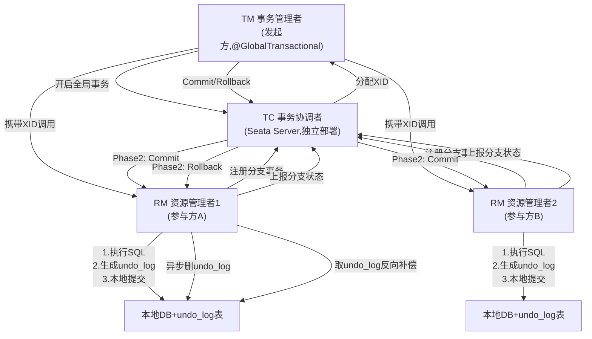

**AT 模式一阶段源码关键路径**：
```java
// 1. @GlobalTransactional 注解拦截
@GlobalTransactional
public void createOrder(OrderDTO dto) {
    orderService.create(dto);      // 本地事务1
    accountService.deduct(dto);    // 本地事务2(RPC)
}

// 2. GlobalTransactionalInterceptor 拦截
public Object intercept(MethodInvocation invocation) {
    // 向 TC 注册全局事务，获取 XID
    String xid = tc.beginGlobalTransaction();
    RpcContext.getContext().setAttachment("xid", xid);
    try {
        Object result = invocation.proceed();  // 执行业务
        tc.globalCommit(xid);   // 通知 TC 提交
        return result;
    } catch (Exception e) {
        tc.globalRollback(xid);  // 通知 TC 回滚
        throw e;
    }
}

// 3. JDBC 代理拦截 SQL（DataSourceProxy）
//    ExecuteTemplate.execute() → 拦截 SQL 执行
public Object execute(SQLRecognizer recognizer) {
    // a. 执行前：查询 before 快照
    Object beforeImage = queryBeforeImage(sql);
    // b. 执行业务 SQL
    Object result = executeSQL(sql);
    // c. 执行后：查询 after 快照
    Object afterImage = queryAfterImage(sql);
    // d. 生成 undo_log 并同事务写入
    undoLogMapper.insert(new UndoLog(beforeImage, afterImage));
    // e. 向 TC 注册分支事务
    branchRegister(xid, resourceId);
    // f. 本地事务提交（业务SQL + undo_log 原子提交）
    return result;
}

// 4. undo_log 表结构
//    branch_id, xid, context, rollback_info, log_status, log_created
//    rollback_info 存的是 JSON: {beforeImage: {...}, afterImage: {...}}
```

**AT 模式二阶段**：
```java
// Phase 2: Commit（异步，不需等待）
public void globalCommit(String xid) {
    // 异步删除 undo_log（提交后不需要回滚）
    undoLogMapper.deleteByXid(xid);
}

// Phase 2: Rollback（同步，需要等结果）
public void globalRollback(String xid) {
    // 1. 查询 undo_log
    List<UndoLog> logs = undoLogMapper.selectByXid(xid);
    for (UndoLog log : logs) {
        // 2. 取 beforeImage，生成反向 SQL
        //    如果 beforeImage: {balance: 100}, afterImage: {balance: 80}
        //    则反向 SQL: UPDATE account SET balance=100 WHERE id=?
        String undoSql = generateUndoSql(log.getBeforeImage());
        // 3. 执行反向补偿 SQL
        jdbcTemplate.execute(undoSql);
        // 4. 删除 undo_log
        undoLogMapper.deleteById(log.getId());
    }
}
```

**【深度拓展】AT 模式的全局锁机制**
- **全局锁的作用**：AT 在一阶段就提交本地事务（释放本地锁），但为了防止"其他全局事务读到中间态"，Seata 引入全局锁——一阶段提交前先向 TC 申请 `表名+主键值` 的全局锁。
- **全局锁的代价**：热点账户（大商户余额）频繁扣减 → 全局锁竞争 → 吞吐下降。这就是"热点账户变慢"的根因。
- **@GlobalLock 的场景**：当不需要全局事务但需要防止脏读时，用 `@GlobalLock` 让查询先获取全局锁，确保读到的不是中间态。

**【面试官追问】**
- "AT 模式为什么有隔离性问题？" → 一阶段就提交本地事务，其他事务能读到"已提交但全局未提交"的中间态。用 `@GlobalLock` 或 `SELECT FOR UPDATE` 可增强隔离。
- "undo_log 怎么防止脏写？" → undo_log 带分支事务ID + 全局锁，回滚时校验当前数据是否等于 afterImage，不等说明被其他事务改了 → 报错转人工。
- "AT 和 TCC 的选择？" → AT 无侵入但性能差（全局锁）、隔离弱；TCC 侵入大但性能好、隔离强。低频场景选 AT，高频热点选 TCC。

---

## 8. 结合最新项目：XTransfer 跨境收款的分布式事务落地（详解）

> 这是本文重点。XTransfer 是我最近一份工作，做**跨境 B2B 收款平台**，资金链路长、跨多域、对下游渠道不可控——这决定了我们的方案选择。

### 8.1 业务背景与难点
一笔跨境收款的完整链路：

```text
收款申请 → VA虚拟账户入账 → 风控/合规审核(AML/KYC) → 结售汇 → 账务记账 → 提现/结算 → 通知商户
```

难点：
1. **流程长、跨多域**：收款域、风控域、账务域、渠道域、通知域，跨服务跨库。
2. **下游不可控**：银行/渠道回调时间不定，无法要求它们配合 TCC。
3. **资金强约束**：任何一步失败都不能造成资损或资金卡死，必须可追溯、可重放、可对账。
4. **合规异步**：风控审核可能人工介入、耗时长，不能同步阻塞主链路。

### 8.2 为什么没选 TCC / 2PC
| 候选方案 | 为什么不选 |
| --- | --- |
| 2PC/XA | 跨异构系统 + 外部渠道，无法统一 XA；长事务锁资源，吞吐差。 |
| TCC | 每域手写 Try/Confirm/Cancel，侵入太大；风控/渠道**不可补偿或补偿语义不清**；长流程持有预留资源不现实。 |
| 纯 Saga 框架（Seata Saga） | 框架的状态机通用性强，但**资金状态强约束**下，我们需要更贴合审计的自定义状态迁移 + 补偿脚本一一映射。 |

### 8.3 最终方案：状态机 + 任务补偿 + Outbox（Saga 的工程化落地）

**XTransfer 分布式事务整体架构 Mermaid 图**：

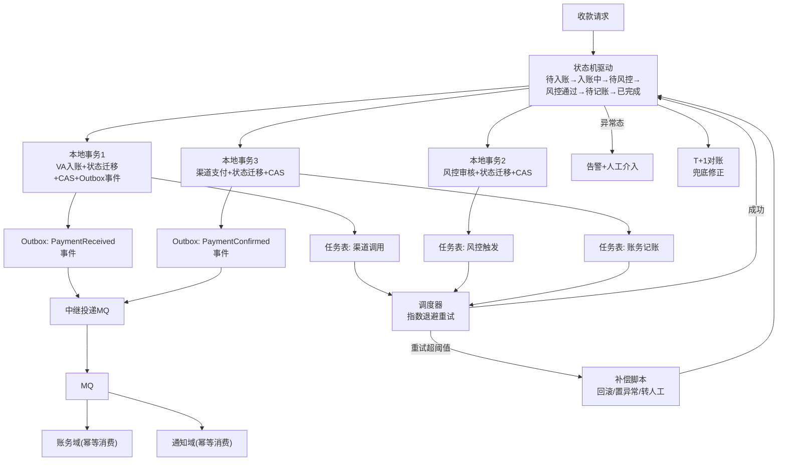

核心三件套：

**① 状态机（State Machine）驱动主流程**
- 每一步是一个状态节点（`待入账 / 入账中 / 待风控 / 风控通过 / 待记账 / 已完成 / 异常`）；
- 状态迁移由领域事件触发，**每个状态迁移是一个本地事务**，落库即定局，绝不产生"悬空中间态"；
- 状态机集中定义，审计清晰——出问题能一眼看出卡在哪一步。

**【为什么 / 真实案例】** 状态机真正的硬核不在"画状态图"，而在"**状态迁移用 CAS 落库**"：每次迁移不是 `UPDATE status=新值`，而是 `UPDATE ... SET status=新值 WHERE id=? AND status=旧值`。这条 SQL 在数据库层原子完成"校验旧态 + 改新态"，带来两个不可替代的好处——① **并发安全**：重复回调/并发补偿只有一条能成功改状态（affected rows>0），其余被拒，天然幂等；② **防非法跃迁**：从"已结算"被某逻辑误改回"处理中"在 SQL 层直接失败，资金安全的第一道闸落到数据库而非应用层（应用层多实例有竞态）。XTransfer 2.0 重构把散落的 `if(status==X)` 全部收进状态机 + CAS，是 0 资损和"生产问题 -80%"的关键设计之一。

**状态机 CAS 迁移代码示例**：
```java
// 状态枚举
public enum PaymentStatus {
    PENDING_RECEIVE,    // 待入账
    RECEIVING,           // 入账中
    PENDING_RISK_CHECK,  // 待风控
    RISK_PASSED,         // 风控通过
    PENDING_ACCOUNTING,  // 待记账
    COMPLETED,           // 已完成
    EXCEPTION            // 异常
}

// 状态迁移(CAS)
@Repository
public class PaymentStatusRepository {
    
    /**
     * CAS 状态迁移：只有当前状态=expectedStatus才能迁移到newStatus
     * @return affected rows > 0 表示成功
     */
    public boolean casUpdateStatus(String paymentId, 
            PaymentStatus expectedStatus, PaymentStatus newStatus) {
        String sql = "UPDATE payment SET status = ?, updated_at = NOW() " +
                     "WHERE id = ? AND status = ?";
        int rows = jdbcTemplate.update(sql, 
            newStatus.name(), paymentId, expectedStatus.name());
        return rows > 0;  // 0=状态已被其他流程改了，迁移失败
    }
}

// 状态机定义合法迁移路径
public class PaymentStateMachine {
    // 合法迁移映射
    private static final Map<PaymentStatus, Set<PaymentStatus>> TRANSITIONS = Map.of(
        PENDING_RECEIVE, Set.of(RECEIVING),
        RECEIVING, Set.of(PENDING_RISK_CHECK, EXCEPTION),
        PENDING_RISK_CHECK, Set.of(RISK_PASSED, EXCEPTION),
        RISK_PASSED, Set.of(PENDING_ACCOUNTING),
        PENDING_ACCOUNTING, Set.of(COMPLETED, EXCEPTION)
    );
    
    public void transition(String paymentId, PaymentStatus target) {
        Payment current = repo.findById(paymentId);
        if (!TRANSITIONS.get(current.getStatus()).contains(target)) {
            throw new IllegalStateException(
                "非法状态迁移: " + current.getStatus() + " → " + target);
        }
        if (!repo.casUpdateStatus(paymentId, current.getStatus(), target)) {
            throw new OptimisticLockException("并发冲突: 状态已被其他流程修改");
        }
        outboxService.publishEvent(paymentId, target);  // 发布领域事件
    }
}
```

**【面试官追问】**
- "为什么用 CAS 而不用分布式锁？" → CAS 是数据库层原子操作，无锁、无单点、高性能；分布式锁（Redis/ZK）引入额外依赖和故障点，且锁释放与DB操作不是原子的。CAS 把并发安全下沉到DB，最可靠。
- "CAS 失败了怎么办？" → 说明状态已被改（重复回调/并发补偿），直接丢弃（幂等返回成功）。这天然解决了重复消息问题。
- "状态机怎么防止'已结算'被误改？" → `TRANSITIONS` 里 `COMPLETED` 没有"出去"的迁移路径，任何从 `COMPLETED` 出去的迁移都会在 `transition()` 方法抛异常。

**② 任务补偿框架（Task Compensation）保证最终一致**
- 主流程本地事务同时写一张**任务表**（`待执行 / 待确认 / 已完成 / 已补偿`）；
- 提交后由**调度器异步拉取任务重试**下游调用（指数退避）；
- 重试超阈值 → 执行**补偿脚本**（回滚本地已做部分 / 置异常态 / 转人工），并反写状态机；
- 相比 TCC，它对**不可控下游更友好**：失败就重试或补偿，而不是要求下游支持 Cancel。

**任务补偿框架代码示例**：
```java
// 任务表定义
CREATE TABLE task_compensation (
  id BIGINT PRIMARY KEY AUTO_INCREMENT,
  payment_id VARCHAR(64) NOT NULL,     -- 关联业务ID
  task_type VARCHAR(64) NOT NULL,       -- 任务类型: CHANNEL_CALL/RISK_CHECK/ACCOUNTING
  task_status ENUM('PENDING','RUNNING','SUCCESS','FAILED','COMPENSATED') DEFAULT 'PENDING',
  retry_count INT DEFAULT 0,
  max_retry INT DEFAULT 10,             -- 最大重试次数
  next_retry_at TIMESTAMP,             -- 下次重试时间(指数退避)
  payload TEXT,                         -- 任务参数(JSON)
  compensation_script VARCHAR(256),     -- 补偿脚本标识
  created_at TIMESTAMP DEFAULT NOW(),
  UNIQUE KEY uk_payment_task (payment_id, task_type)  -- 幂等防重
);

// 调度器拉取并执行任务
public class TaskScheduler {
    
    @Scheduled(fixedDelay = 5000)  // 每5秒扫描一次
    public void executePendingTasks() {
        List<Task> tasks = taskRepo.findPendingTasks(
            "WHERE task_status IN ('PENDING','FAILED') AND next_retry_at <= NOW() LIMIT 100");
        for (Task task : tasks) {
            try {
                executeTask(task);
                task.setStatus("SUCCESS");
            } catch (Exception e) {
                task.setRetryCount(task.getRetryCount() + 1);
                if (task.getRetryCount() >= task.getMaxRetry()) {
                    // 超过最大重试 → 执行补偿
                    compensate(task);
                    task.setStatus("COMPENSATED");
                    alertService.notifyHuman(task);  // 转人工
                } else {
                    // 指数退避: 2^retry * baseInterval
                    long delay = (long) Math.pow(2, task.getRetryCount()) * 30;
                    task.setNextRetryAt(LocalDateTime.now().plusSeconds(delay));
                    task.setStatus("FAILED");
                }
            }
            taskRepo.update(task);
        }
    }
}
```

**【深度拓展】任务补偿 vs TCC 的本质区别**
- **TCC 要求下游配合**：Try/Confirm/Cancel 三个接口，下游必须实现——但外部渠道/银行不可能配合你的 Cancel。
- **任务补偿对下游无要求**：失败就重试，重试超限就补偿本地——不需要下游支持任何"回滚"语义。
- **适用边界**：TCC 适合"内部服务、可预留资源、强一致短流程"；任务补偿适合"跨内外部长流程、最终一致"。

**【面试官追问】**
- "任务补偿和 Saga 补偿有什么区别？" → 本质一样，都是"失败时执行补偿动作"。Saga 补偿是框架化的状态机驱动，任务补偿是自研的调度+补偿脚本，更贴合审计和自定义需求。
- "任务重复执行怎么办？" → 任务表有唯一索引（payment_id + task_type），重复插入失败；执行前检查 status，已完成的不重复执行——幂等。
- "调度器宕了怎么办？" → 任务表在 DB 里，调度器重启后从 DB 恢复继续执行，不丢任务。多实例调度器用 `SELECT ... FOR UPDATE SKIP LOCKED` 防止重复执行。

**③ Outbox（本地消息表）保证事件不丢**
- 状态变更产生的领域事件与业务数据**同库同事务**写入 Outbox 表；
- 中继投递到 MQ，下游域（账务/通知）**幂等消费**；
- 双保险：状态机保证主流程收敛，Outbox 保证跨域事件不丢。

```text
┌────────────┐   本地事务    ┌─────────────┐
│ 收款主流程   │ ──────────▶ │ 业务表+任务表 │
└────────────┘   同库提交    │ +Outbox事件  │
       │                     └─────────────┘
       │ 状态迁移                    │ 中继
       ▼                            ▼
┌────────────┐    重试/补偿   ┌─────────────┐
│  状态机     │ ◀──────────  │  调度器/MQ    │──▶ 账务/通知(幂等)
└────────────┘               └─────────────┘
```

### 8.4 幂等如何兜底（重放安全的关键）
- **幂等键**：每笔业务用 `收款单号 + 步骤标识` 作为幂等键，落幂等表（唯一索引）；
- 任务重放、MQ 重复投递、下游回调重复，都靠幂等键**天然去重**；
- 结合状态机：消费前先校验"当前状态是否允许该迁移"，非法迁移直接丢弃。

### 8.5 对账兜底（资金安全最后一道防线）
- **实时对账**：关键节点核对内部流水与渠道流水；
- **T+1 批量对账**：差异分类（长款/短款/状态不一致）进差错队列，人工或自动冲正；
- 这套「任务补偿 + Outbox + 对账」组合让长流程**最终一致、0 资损**。

### 8.6 收益
- 长流程资金**不卡单**、失败可自动重试/补偿；
- 状态可追溯、可重放、审计清晰；
- 2.0 重构后配合该框架：人效 +30%、线上问题 -80%、**0 资损**。

> 更完整的架构（六边形 + CQRS + DDD + SPI）见 [XTransfer 跨境支付收款平台深度复盘](/post/准备-XTransfer跨境支付收款平台深度复盘)。

## 9. 我的最终落地清单（按场景选方案）

| 场景 | 方案 | 理由 |
| --- | --- | --- |
| 内部跨服务（订单↔账务） | **本地消息表 + 幂等** | 侵入小、无全局锁、最终一致够用 |
| 外部渠道回调 | **最大努力通知 + T+1 对账** | 下游不可控，只能重试+对账兜底 |
| 长流程资金流（风控↔申报↔记账） | **状态机 + 任务补偿（Saga 化）** | 可重放、可补偿、审计清晰 |
| 极少强一致诉求（账户调拨） | **TCC** | 高价值短流程，需强一致 |

---

## 面试高频问答（标准回答）

### Q1：CAP 怎么理解？支付为什么选 AP？
**标准回答**：C 一致性、A 可用性、P 分区容错，三者只能取二，而网络分区不可避免所以必有 P，剩下在 C/A 间选。支付选 A（高可用）——宁可短暂不一致，也不能因强一致锁住交易导致不可用；不一致由「消息 + 幂等 + 对账」最终修正。

**【深度拓展】** 选 AP 不是"放弃一致性"，而是"**放弃强一致、换取可用性、用最终一致补回正确性**"。要讲清一个常被忽视的点：CP 系统在分区时为了一致会**拒绝写入**（不可用），而支付场景"不可用"比"短暂不一致"后果更严重——用户付不了款直接流失、商户收不到款客诉爆炸。所以支付宁愿先"收下这笔钱、状态稍后收敛"，也不愿"为了瞬时一致而拒收"。补强的三件套（消息不丢 + 幂等去重 + 对账兜底）正是把"放弃的 C"在可接受的时延内补回来。面试官追问"那有没有必须 CP 的地方"——有，如账务核心的"账户余额不可超扣"靠行锁/CAS 在单库内保证强一致，跨系统才谈 AP。

**【项目支撑】** XTransfer 跨多域（收款/风控/账务/渠道）的长流程选 AP + 最终一致，靠"状态机 + 任务补偿 + Outbox + T+1 对账"把一致性在可接受时延内收敛；但单笔记账、余额扣减在账务库内用行锁/CAS 保证强一致，做到"跨系统 AP、库内 CP"的分层取舍。

### Q2：TCC 的空回滚、防悬挂、幂等怎么处理？
**标准回答**：**空回滚**——Try 没执行却收到 Cancel，需记录事务状态，Cancel 直接返回成功；**防悬挂**——Cancel 比 Try 先到（网络乱序），要记录「已取消」，之后到的 Try 直接拒绝；**幂等**——Confirm/Cancel 都可能重复调用，用事务状态表判重。DTM 用「子事务屏障」自动解决这三个问题。

**【深度拓展】** 这三个坑的本质是"**网络乱序 + 重试**"在 TCC 三阶段模型下必然出现，必须靠一张"事务状态控制表"统一处理：记录每笔事务的 Try/Confirm/Cancel 状态，所有入口先查状态再决策。空回滚（无 Try 有 Cancel）要能安全返回；悬挂（Cancel 先于 Try）要能让后续 Try 失效；幂等（Confirm/Cancel 重发）要能判重。工程上强烈建议用 DTM 这类框架的"子事务屏障"自动解决，自己手写极易漏边界。面试官追问"TCC 适合支付核心吗"——XTransfer 没在主长流程用 TCC，因为风控/渠道不可补偿或补偿语义不清、且长流程持预留资源不现实；只在极少强一致短流程（如账户调拨）才考虑。

### Q3：本地消息表和 Seata AT 怎么选？
**标准回答**：本地消息表（Outbox）侵入小、无全局锁，适合大部分内部跨服务最终一致，我主用这个；Seata AT 靠 undo_log 自动补偿，但热点账户会有全局锁竞争、且隔离性弱，只在确需「自动回滚 + 不愿手写补偿」的场景考虑，且要加业务锁兜底。

**【深度拓展】** 选型的核心是"**要不要全局锁**"：AT 模式为了回滚要靠 TC 协调全局锁，热点账户（大商户余额）下全局锁成瓶颈，反而比本地事务慢；本地消息表/Outbox 没有全局锁，只靠 MQ 投递 + 幂等消费，吞吐好但要求业务自己处理"消息丢了怎么办"（Outbox 同库事务保证不丢）。所以经验法则：高频热点写 → 本地消息表 + 幂等；低频、想省心自动回滚且不热点 → AT。面试官追问"Outbox 怎么保证消息不丢"——业务数据和 Outbox 消息同库同事务，再由独立中继（定时扫/CDC）投递 MQ，投递成功才标记已发，杜绝"落库了消息没发"。

**【项目支撑】** XTransfer 用 Outbox（本地消息表）保证领域事件不丢：状态变更和事件同事务写入，中继投递到 MQ，下游（账务/通知）幂等消费。对热点商户记账用"子账户拆分 + 批次汇总"避开全局锁，而非上 Seata AT——这是"账务领域的分库分表"式取舍。

### Q4：Kafka 的 exactly-once 是真的只执行一次吗？
**标准回答**：不是物理一次。是「生产者幂等 + 事务 + 消费位移与业务结果原子提交」的语义封装，本质是 at-least-once + 幂等。工程上我们也是靠**消费侧幂等键去重**来达到 effectively-once，这是更可靠的做法。

**【深度拓展】** 理解 exactly-once 要分清"**消息投递 once**"和"**业务处理 once**"——Kafka 的 EOS 只保证"消息不丢不重发到消费位移"，但消费者拿到消息后到"业务落库"之间仍可能因崩溃重复处理。所以真正once要靠"消费位移与业务结果原子提交"（事务性消费）或"消费侧幂等键"。在支付里我更信任幂等键：每条消息带业务幂等键（如支付单号+步骤），重复投递直接去重，比依赖框架 EOS 更直观可控。面试官追问"幂等键放哪"——放业务表唯一索引（支付单号+场景），消费前先 INSERT，冲突即跳过，数据库兜底最可靠。

**【项目支撑】** XTransfer 的 Outbox 中继投到 MQ 后，账务/通知域都用"收款单号 + 步骤标识"作幂等键消费，配合状态机"当前状态是否允许该迁移"二次校验，重复回调/重投都安全。这比单纯依赖 Kafka EOS 更稳，因为资金系统不容忍任何一次重复记账。

### Q5：Saga 编排式和协同式怎么选？
**标准回答**：协同式各服务通过事件互相驱动，去中心但难观测、易成「事件迷宫」；编排式由中央 Orchestrator 调度，流程清晰、易监控、易补偿，代价是中心节点。长流程支付链路我用编排式（集中状态机），短链路用协同式降耦。

**【深度拓展】** 选型的本质是"**要不要一个看得见的总线**"。编排式（Orchestration）把流程收敛到一个 Orchestrator（我们的状态机就是编排器），好处是"流程显式、可监控、补偿路径明确、出事一眼看出卡哪步"——这在资金系统极重要；代价是 Orchestrator 成了中心节点（要高可用）。协同式（Choreography）靠事件自驱，耦合低但"流程散在各地"，排查要追事件链、补偿难闭环。XTransfer 长流程用状态机（编排式），短链路（如通知多个下游）用事件协同式降耦。面试官追问"编排器挂了怎么办"——编排器状态在 DB（状态机快照），挂了重启从 DB 恢复继续推进，不丢进度。

### Q6：你项目里分布式事务是怎么做的？为什么这么选？（重点）
**标准回答**：在 XTransfer 跨境收款，链路长（入账→风控→结售汇→记账→通知）、跨多域、下游渠道不可控，所以没上 TCC/2PC，而是**状态机 + 任务补偿 + Outbox** 的 Saga 工程化落地：每步是一次本地事务落状态与任务，调度器异步重试/补偿，事件走 Outbox 不丢，配合幂等键与 T+1 对账，做到长流程最终一致、可重放、**0 资损**。选它是因为对不可控下游更友好、可审计、可解释，比框架化的通用 Saga 更贴合资金强约束。

**【深度拓展】** 为什么不直接用 Seata Saga 框架？因为资金状态强约束下，我们要"**状态迁移 ↔ 补偿脚本一一映射、且每步可审计**"，通用框架的状态机 JSON 通用性强但不够贴合我们的审计与 CAS 约束；自研状态机 + 任务补偿把"合法迁移"显式建模、用 `UPDATE ... WHERE status=旧值` 做 CAS 并发安全、补偿脚本和业务步骤绑定，可控性更强。三者职责：状态机管"流程到哪了"、任务补偿管"没完成的去重试/补偿"、Outbox 管"跨域事件不丢"。最后由对账兜底极端情况。面试官追问"补偿也失败怎么办"——补偿超阈值转人工（死信），不无限重试，且状态机停在异常态可观测，由人工/差错队列接手。

### Q7：常见的开源分布式事务框架有哪些？各自定位？
**标准回答**：**Seata**（阿里，AT/TCC/Saga/XA 全模式，Java 生态最主流，AT 最省事）；**DTM**（Go，跨语言，子事务屏障好用）；**Hmily/ByteTCC**（TCC 专精）；**RocketMQ 事务消息**（Outbox 的一等实现）；**Eventuate Tram**（CDC + Outbox + Saga）；**Narayana/Atomikos**（传统 JTA/XA）。选型口诀：无侵入选 AT、强一致选 TCC、长流程选 Saga、异步选事务消息、跨语言选 DTM。

**【深度拓展】** 面试里背框架名只是及格，加分点是"**知道每个框架的坑**"：Seata AT 有全局锁、热点账户变慢；Seata Saga 状态机通用但不够贴合强审计；DTM 子事务屏障解决 TCC 三坑很香但 Go 生态（跨语言友好）；RocketMQ 事务消息本质是 Outbox，强依赖 RocketMQ。选型要回到"业务约束"：Java 单体快速接入 → Seata AT；多语言 → DTM；不想引入重框架、只要异步最终一致 → 自研 Outbox + 幂等（XTransfer 选的）。面试官追问"你的项目为什么不用现成框架"——我们的约束是"资金强审计 + 状态机 CAS + 自定义补偿脚本"，通用框架反而不够贴合，自研更可控、也可解释。

**【项目支撑】** XTransfer 没引入 Seata/DTM 这类重框架，而是用"状态机 + 任务补偿 + Outbox"自研落地，因为要贴合资金强约束（每步本地事务落状态与任务、CAS 并发安全、补偿脚本与步骤绑定、可审计可重放）。这套也让 2.0 重构做到人效 +30%、生产问题 -80%、0 资损。

### Q8：Saga 没有隔离性，中间态被读到怎么办？
**标准回答**：Saga 只保证最终一致、无 I（隔离）。工程上用几招缓解：①**语义锁**（业务层给资源打"处理中"标记，别的流程看到就等待/拒绝）；②**中间态对用户不可见**（如"处理中"统一展示为 pending）；③**可交换的补偿**设计，保证补偿幂等且顺序无关。XTransfer 里用状态机的"处理中"态 + 幂等键实现语义锁。

**【深度拓展】** "无隔离性"的具体风险是"**脏读中间态**"：付款流程执行到"已扣 A 未加 B"的瞬间，另一个查询看到 A 少了 B 没增，以为钱少了。缓解手段里"**语义锁**"最实用——不是数据库锁，而是业务状态锁：资源进入处理中就在状态机打"处理中"标记，其他想动它的流程看到就拒绝/等待，处理完释放。配合"幂等键"防重复动。还有"**可交换补偿**"——补偿不依赖顺序，乱序补偿也能收敛（如先 Cancel B 再 Cancel A 和反过来结果一样）。面试官追问"能不能用数据库隔离级别解决"——不能，Saga 跨服务跨库，数据库隔离级别管不到，只能业务层语义锁。

**【项目支撑】** XTransfer 状态机的每个"处理中"态本身就是语义锁：一笔收款在"入账中"时，其他流程（如重复回调、补偿重试）看到该状态要么等待要么被 CAS 拒绝，不会并发改同一笔钱；幂等键（收款单号+步骤）保证重复动作安全。这是无数据库隔离下保资金安全的工程解法。

---

> 讲分布式事务最忌「背名词」。我的套路：**先说 CAP 取舍 → 再按场景列方案优缺点 → 报几个开源框架定位 → 最后讲一个你真用过的（XTransfer 状态机+任务补偿，含踩坑与 0 资损结果）**。

---

## 更多高频追问（补充）

### Q9：TCC 的三个阶段具体做什么？和 2PC 有什么区别？

**标准回答**：TCC = Try/Confirm/Cancel。**Try**：预留资源（如冻结金额）；**Confirm**：确认执行（真正扣减冻结的钱），需幂等；**Cancel**：取消并释放预留资源，需幂等。与 2PC 区别：2PC 是**数据库层**的资源锁定（锁到事务结束，粒度粗、阻塞久）；TCC 是**业务层**的资源预留（Try 后即释放数据库锁，只在业务上保留冻结态，并发度高）。代价是每个服务要写三个方法、开发成本高。适合一致性要求高、并发大的核心资金场景。

**【深度拓展】** TCC 相比 2PC 的核心优势是把"锁"从数据库层挪到业务层（冻结态），数据库锁在 Try 结束就释放，并发度高、不阻塞其他事务；代价是"每个分支写三个方法 + 处理空回滚/悬挂/幂等"，侵入极大。所以 TCC 的适用边界很窄：必须是"**资源可明确预留、可控、且强一致诉求高**"的短流程，如账户余额冻结/扣减、跨账户调拨、下单锁库存。长流程（如支付跨风控/渠道/账务）不适合——因为渠道/风控根本不配合你的 Try/Cancel 语义。面试官追问"锁定库存算 TCC 吗"——算，欧凡直播电商的库存扣减（Redis Lua 原子扣 + 支付超时回补）本质就是 Try（预扣）+ Cancel（回补）的 TCC 思想，只是不用重框架。

**【项目支撑】** XTransfer 长流程没用 TCC（下游不可控、长流程持预留资源不现实），但"账户调拨"这类极少强一致短流程可考虑 TCC；而欧凡的库存扣减（预扣 + 支付超时回补）是 TCC 思想在电商库存的轻量落地。两处对比说明我理解"何时该用 TCC、何时该用补偿式 Saga"。

### Q10：TCC 的空回滚、悬挂、幂等三大坑怎么解决？

**考察点**：这是 TCC 落地的必答细节，能答出来说明真做过。

**标准回答**：① **空回滚**——Try 没执行（如超时没到），却先收到 Cancel。解决：Cancel 时先查是否有 Try 记录，没有则记录一条"已回滚"标记并直接返回成功；② **悬挂**——Cancel 比 Try 先到（网络乱序），之后 Try 才到就会预留一笔永远不会被确认的资源。解决：Try 执行前先查是否已有 Cancel 记录，有则拒绝执行；③ **幂等**——Confirm/Cancel 可能重复调用，用事务状态表 + 唯一键保证只执行一次。三者都靠"事务控制表记录状态 + 前置校验"解决。

**【深度拓展】** 这三大坑的根源不在 TCC 本身，而在"**分布式下网络一定会乱序、重试**"。工程上强烈建议别手写，用 DTM 的"子事务屏障"自动拦截空回滚/悬挂/重复。若必须手写，核心是一张"全局事务控制表"：每笔事务一个状态机（init→trying→confirmed/canceled），所有 Confirm/Cancel/Try 入口先查状态再决策。XTransfer 没在长流程用 TCC 正是因为"风控/渠道不可补偿、长流程持预留资源不现实"——TCC 的 Try 预留资源在长流程里会长期占用、且下游不愿配合 Cancel。只在极少强一致短流程（如账户调拨）才考虑。

### Q11：最终一致性方案里，"对账"扮演什么角色？

**标准回答**：对账是所有最终一致方案的**最后一道防线**。无论用 Saga、本地消息表还是 TCC，都可能有极端情况（消息永久丢失、补偿也失败、系统 bug）导致数据不一致。对账系统定期（T+1 或准实时）把两方数据勾稽比对，发现差异进差错队列，自动或人工修正（红冲/补记）。工程原则是：**在线保证尽力一致，离线用对账兜底并可自愈**。支付里"记账 vs 交易""我方账 vs 渠道账"都靠对账兜底，这也是资金安全"三道防线"之一。

**【深度拓展】** 对账是"**假设上游一定会出错**"的兜底哲学——它不依赖任何在线环节不出 bug，而是定期把两方数据拉出来硬比对，发现差异就修。这正是 BASE 里"最终一致"的"最终"二字落地处：在线环节（消息/补偿）尽力把一致性收敛到 99.9%，对账把剩下 0.1% 的极端（消息永久丢、补偿失败、系统 bug）兜住。工程上要分清"**确定性差额自动修**"（重复记账→自动冲正）和"**不确定性进人工**"（责任不清→差错队列），避免自动修复引入二次错误。面试官追问"在线已经最终一致了还要对账吗"——要，因为在线一致是"尽力"，对账是"兜底 + 可自愈 + 合规取证"，两者层级不同。

**【项目支撑】** XTransfer 的对账体系：渠道三层对账 + 内部实时核对（binlog 监听）+ T+1 全量，差异进差错队列，确定性漏记由任务补偿自动补记账、超阈值升级人工。这是"状态机 + 任务补偿 + Outbox"在线最终一致之后的最后一道闸，共同支撑 0 资损。这也对应资金安全三道防线的"事后回溯比对"。

---

## 12. 分布式事务选型决策树（完整版）

```mermaid
flowchart TD
  START["跨服务/跨系统需要一致性"] --> Q1{"参与方可控吗?<br/>(能改代码/配合协议)"}
  
  Q1 -->|"否(外部渠道/银行)"| EXT["最大努力通知 + 对账<br/>(重试+T+1对账兜底)"]
  
  Q1 -->|"是(内部服务)" --> Q2{"需要强一致(实时)?"}
  
  Q2 -->|"否, 最终一致即可"| Q3{"流程长(多步骤)?"}
  Q2 -->|"是, 必须强一致"| Q4{"能接受手写三套接口?"}
  
  Q3 -->|"是"| Q5{"需要编排/可审计?"}
  Q3 -->|"否(两服务间)"| OUTBOX["本地消息表/Outbox<br/>(侵入小,最常用)"]
  
  Q5 -->|"是"| SAGA_SM["状态机+任务补偿<br/>(Saga工程化)"]
  Q5 -->|"否"| SAGA_EVENT["事件协同Saga<br/>(去中心化)"]
  
  Q4 -->|"能,高价值短流程"| TCC["TCC<br/>(Try/Confirm/Cancel)"]
  Q4 -->|"不能,想无侵入"| SEATA_AT["Seata AT<br/>(自动undo_log)"]
  
  Q4 -->|"跨DB同栈"| XA["XA/2PC<br/>(DB原生支持)"]
  
  EXT --> NOTE["都需配合: 幂等键 + 对账兜底"]
  OUTBOX --> NOTE
  SAGA_SM --> NOTE
  SAGA_EVENT --> NOTE
  TCC --> NOTE2["需处理: 空回滚+防悬挂+幂等"]
  SEATA_AT --> NOTE3["注意: 全局锁热点+隔离弱"]
  XA --> NOTE4["注意: 性能差,慎用"]
```

## 13. 六大方案速记卡

| 方案 | 一句话记忆 | 侵入性 | 一致性 | XTransfer 落地 |
| --- | --- | --- | --- | --- |
| 2PC/XA | DB层锁定→投票→统一提交 | 低 | 强 | 未用(跨异构不可行) |
| TCC | Try冻结→Confirm扣减→Cancel释放 | 高 | 强 | 仅极短流程考虑 |
| Saga | 长事务拆N步，失败反向补偿 | 中 | 最终 | **主链路(状态机+补偿)** |
| Outbox | 业务+消息同库提交，中继投MQ | 低 | 最终 | **领域事件不丢** |
| 事务消息 | RocketMQ half→本地事务→commit | 低 | 最终 | 可选替代Outbox |
| 最大努力 | 重试通知+对账兜底 | 低 | 最终 | **渠道回调+T+1对账** |

> **一句话总结**：分布式事务没有银弹。支付核心链路选 **AP + 最终一致**（状态机+补偿+Outbox+对账），单库内用 CAS/行锁保证 **CP**；跨系统不追求瞬时一致，用消息+幂等+对账把"放弃的 C"补回来。

---

## 附录一、【故障复盘】真实事故案例库

> 分布式事务是「线上不一致」的高发区。下面 3 个案例聚焦 TCC 空回滚/悬挂、Saga 补偿失败、消息丢失，统一七段式复盘，呼应正文「状态机 + 任务补偿 + Outbox + 对账」的兜底哲学。

### 案例一：TCC 空回滚 + 悬挂（强一致短流程的坑）

| 维度 | 内容 |
| --- | --- |
| **事故背景** | 某「账户调拨」强一致短流程试用 TCC（Try 冻结 → Confirm 扣减）。 |
| **触发原因** | 网络乱序：Cancel 比 Try 先到（悬挂），且部分分支 Try 超时未执行却收到 Cancel（空回滚）。自研 TCC 没做「事务控制表」，Cancel 直接执行业务，导致：已冻结的资源没解冻（悬挂），未冻结的却执行了空 Cancel 逻辑报错。 |
| **影响面（量化）** | 持续 6 分钟，**40 笔**调拨中 **12 笔**出现悬挂/空回滚，其中 **3 笔**资金冻结未释放（占用额度），**0 资损**但调拨失败率飙到 30%。 |
| **定位过程** | ① 业务指标「调拨成功率」骤降；② 日志发现 Cancel 早于 Try 到达；③ 比对发现缺事务状态控制表，Cancel 无状态可查。 |
| **临时止血** | ① 临时切回「本地消息表 + 任务补偿」模式（放弃强一致短流程）；② 悬挂的 3 笔手动解冻释放额度；③ 报错单进人工。 |
| **根因修复** | 引入「全局事务控制表」：Try 先写 init 状态，Cancel 查状态——无 Try 则记 canceled 直接返回（空回滚安全），有 canceled 则后续 Try 拒绝（防悬挂）；或改用 DTM 子事务屏障。 |
| **长效预防** | 强一致短流程统一用框架（DTM）而非自研三阶段；自研必须带事务控制表 + 三坑单测覆盖。 |

### 案例二：Saga 补偿失败（长流程反向补偿卡住）

| 维度 | 内容 |
| --- | --- |
| **事故背景** | 收款长流程（入账→风控→记账→结算）某步失败触发反向补偿。 |
| **触发原因** | 风控服务在补偿窗口期自身故障，补偿脚本调用风控「回滚」接口超时，调度器无限重试，补偿任务堆积，状态机卡在 COMPENSATING 无法推进，新补偿任务也因锁竞争失败。 |
| **影响面（量化）** | **25 分钟**内 **60 笔**收款卡在 COMPENSATING，**0 资损**但状态不可观测推进，客诉 8 起（钱到了不能提）。 |
| **定位过程** | ① 事中「非终态卡单」超阈值（M2）；② 补偿任务表积压、重试次数飙升；③ 风控服务监控确认其故障。 |
| **临时止血** | ① 暂停对该风控的依赖补偿，标记「待人工」；② 风控恢复后补偿脚本重跑；③ 卡单走人工核查置态。 |
| **根因修复** | 补偿增加「**退避上限 + 转人工（死信）**」，不无限重试；补偿任务按 `SKIP LOCKED` 分发避免锁竞争；补偿失败不影响主流程观测。 |
| **长效预防** | 固化「补偿失败超阈值转人工 + 状态机停在异常态可观测」，绝不无限重试（呼应正文 §8.3 任务补偿）。 |

### 案例三：消息丢失导致不一致（Outbox 中继挂了）

| 维度 | 内容 |
| --- | --- |
| **事故背景** | 支付成功写业务 + Outbox，由定时中继投递 MQ，下游账务消费记账。 |
| **触发原因** | 中继服务某实例 OOM 重启，重启期间 Outbox 的 PENDING 消息没被扫描，且中继用「`UPDATE status=SENT` 后删本地标记」的写法，重启丢了一批未投递消息的扫描游标，**消息既没发也没标记失败**，卡在 PENDING。 |
| **影响面（量化）** | 影响 **90 笔**支付成功但账务未记账（渠道已扣、本地状态 SUCCESS、账务无分录），**潜在资损敞口 $15w**，T+1 对账「长短款」命中前已挂账 4 小时。 |
| **定位过程** | ① 实时对账「本地 SUCCESS 但账务无分录」命中；② Outbox 表存在大量 PENDING 且 created_at 早于中继重启；③ 确认中继游标丢失。 |
| **临时止血** | ① 补投脚本扫描 PENDING 重新投递；② 账务消费幂等记账补齐 90 笔；③ 敞口未实际打款，0 资损。 |
| **根因修复** | 中继改为「先发 MQ、ACK 后再标记 SENT」且用 `SELECT ... FOR UPDATE SKIP LOCKED` 保证游标不丢；增加「PENDING 超时未投递」独立告警。 |
| **长效预防** | Outbox 投递顺序改为「发成功再标记」，加 PENDING 老化告警（呼应事后防线 A1 + 事中 M3）。

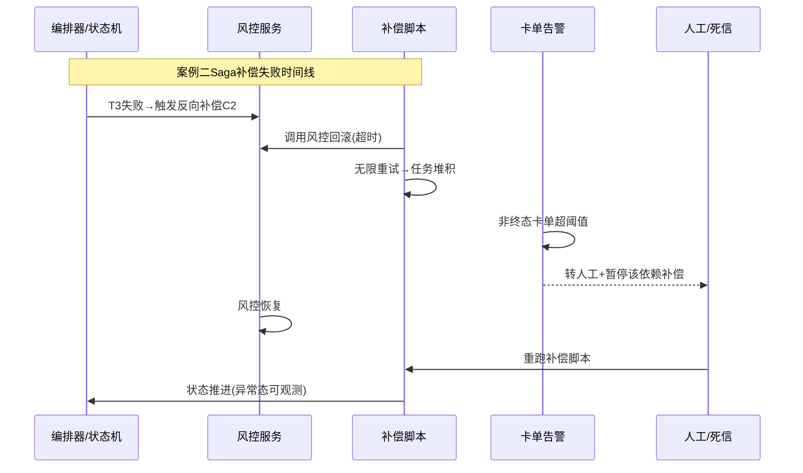

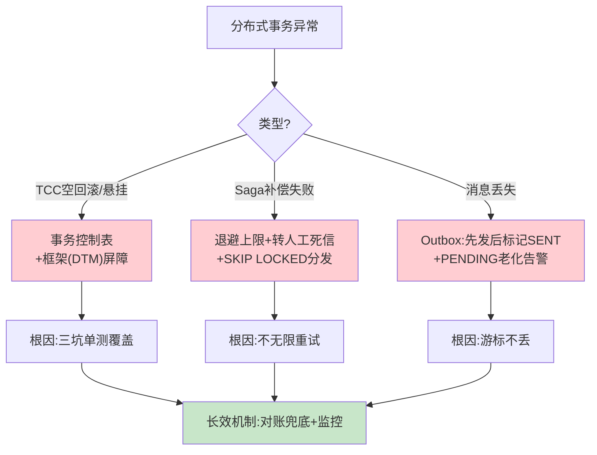

---

## 附录二、【横向对比】技术选型决策

> 这一节把正文的方案矩阵升级为「五方案决策树」——2PC / TCC / Saga / 本地消息表(Outbox) / Seata AT，按场景特征直接落方案。

### 五方案横向对比

| 维度 | 2PC/XA | TCC | Saga（状态机+补偿） | 本地消息表/Outbox | Seata AT |
| --- | --- | --- | --- | --- | --- |
| **一致性** | 强 | 强（业务层） | 最终 | 最终 | 最终（有全局锁） |
| **隔离性** | 有（长锁） | 有（预留） | 无 | 无 | 弱（全局锁） |
| **侵入性** | 低 | 高（三套接口） | 中（补偿脚本） | 低 | 低（自动 undo） |
| **性能** | 差（阻塞） | 好 | 好 | 好 | 中（全局锁热点） |
| **可审计** | 中 | 中 | 高（状态+流水） | 高 | 低 |
| **外部依赖** | 需同栈 XA | 需下游配合 | 下游无要求 | MQ | TC 协调者 |
| **适用** | 单栈跨库 | 内部强一致短流程 | 长流程跨域 | 内部异步最终一致 | 想省心自动回滚 |

**Trade-off 结论（XTransfer 视角）**：
- 长流程跨域（不可控下游）→ **Saga 工程化（状态机+补偿）**，下游无要求、可审计；
- 内部异步最终一致 → **Outbox**，侵入小、无全局锁；
- 强一致短流程（账户调拨）→ **TCC**，但必须用框架（DTM）解决三坑；
- 绝不用 2PC（跨异构不可行）、谨慎用 Seata AT（热点账户全局锁）。

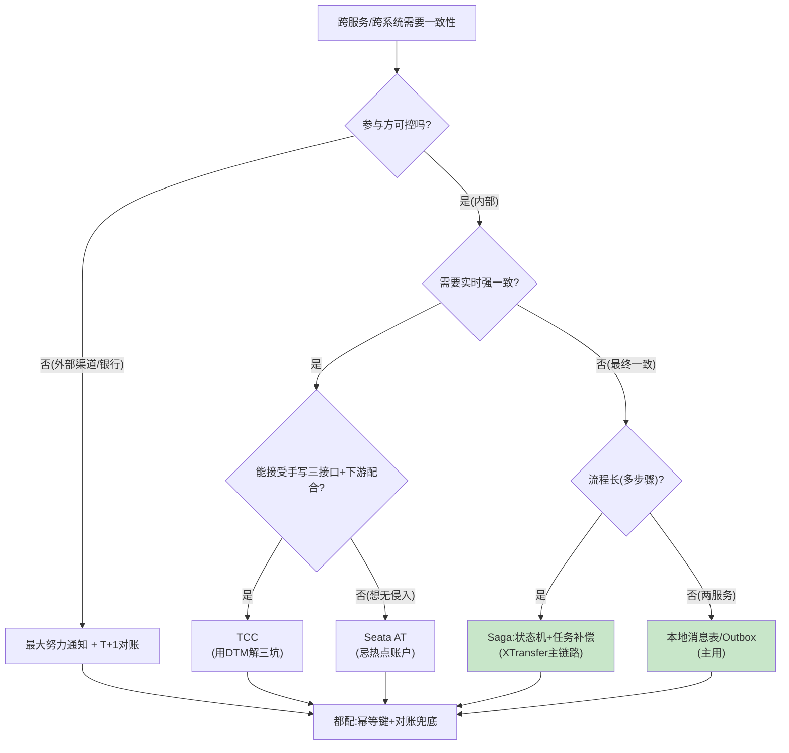

---

## 附录三、【量化指标】SLA 设计与成本收益

> 分布式事务的量化重点是「一致性 SLA」与「补偿重试成本」——把「最终一致」从口号变成可测量的数字。

### 3.1 一致性 SLA 定义

| 指标 | SLI | SLA 目标 | 测量方式 |
| --- | --- | --- | --- |
| **强一致（库内）** | 余额/分录 CAS 成功率 | 100% | 单库事务监控 |
| **最终一致收敛时延** | 支付成功→账务记账完成 | P99 < 5s | 事件时间戳差 |
| **补偿成功率** | 补偿脚本执行成功 / 触发 | > 99.5% | 任务表统计 |
| **消息投递率** | Outbox PENDING→SENT | 100%（老化告警） | Outbox 表监控 |
| **资损笔数** | 不一致导致资损 | 0 | T+1 对账 + 实时差错 |

### 3.2 补偿重试成本测算

```
假设: 峰值 5k TPS, 1% 步骤需补偿重试, 平均重试 3 次(指数退避)
  → 补偿任务峰值: 50/s × 3 ≈ 150 任务/s
  → 调度器: 5 实例 × 每实例 30 并发 = 150/s, 刚好 cover
  → 死信率目标 < 0.5%: 即 < 0.25 笔/s 转人工
  → DB 压力: 任务表 INSERT/UPDATE 150/s, 单分片安全
成本: 补偿框架自身资源 ≈ 在线容量的 5%~8%(可接受, 换0资损)
```

### 3.3 一致性 vs 可用性成本收益

| 方案 | 一致性收益 | 可用性/成本代价 | XTransfer 取舍 |
| --- | --- | --- | --- |
| 2PC | 强一致 | 可用性差、吞吐低 | 弃用 |
| TCC | 强一致 | 侵入大、开发慢 | 仅极短流程 |
| Saga+补偿 | 最终一致 | 补偿资源 5%~8% | **主链路** |
| Outbox | 最终一致 | MQ 依赖 | **事件不丢** |
| 对账兜底 | 修正极端 | T+1 滞后 | **最后防线** |

### 3.4 告警阈值

```
P0: 资损任意一笔; 库内CAS失败; Outbox PENDING老化超阈值
P1: 补偿成功率<99.5%; 非终态卡单超阈值; 对账差异>0
P2: 最终一致收敛P99>10s; 死信率>0.5%
P3: 补偿任务积压>1w; MQ消费延迟>1s
```

---

## 附录四、【答题框架】面试表达模板

> 目标：把「分布式事务选型」讲成一张可口述的决策树，体现「按场景取点」的资深思维。

### 4.1 分层回答套路

> **一句话定调**：「分布式事务没有银弹，我按『CAP 取舍 → 按场景列方案优缺点 → 报框架定位 → 讲真用过的落地』来讲，核心是按场景选而非背名词。」
>
> **核心原理**：CAP 里分区不可避免，支付选 AP + 最终一致（跨系统），库内用 CAS/行锁保 CP；五个方案按「参与方可控？要强一致？流程长？」落到 2PC/TCC/Saga/Outbox/AT。
>
> **项目落地**：XTransfer 长流程用状态机+任务补偿（Saga 工程化），内部异步用 Outbox，强一致短流程才考虑 TCC（DTM 解三坑），渠道回调用最大努力通知+T+1 对账。
>
> **边界与权衡**：2PC 不用（跨异构），Seata AT 谨慎（热点全局锁），事件溯源成本高于收益没上；每个选择都带代价。

### 4.2 STAR 叙事模板（针对追问：「你项目里分布式事务怎么做的」）

| STAR | 内容要点 |
| --- | --- |
| **S** | 跨境收款链路长、跨多域、下游渠道不可控。 |
| **T** | 保证长流程最终一致、0 资损、可重放、可审计。 |
| **A** | 状态机驱动每步本地事务（CAS）+ 任务补偿（重试/退避/转人工）+ Outbox（事件不丢）+ 幂等键 + T+1 对账兜底。 |
| **R** | 0 资损、生产问题 -80%、人效 +30%；补偿成功率 >99.5%。 |

### 4.3 白板表达结构（口述决策树）

```
1) 先讲 CAP: 选 AP + 最终一致, 库内 CP —— 立取舍
2) 画「五方案决策树」: 参与方可控?→强一致?→流程长? —— 立选型逻辑
3) 放大「XTransfer 落地图」: 状态机+任务补偿+Outbox —— 展深度
4) 讲「三坑」(TCC空回滚/悬挂/幂等) + 解决 —— 展细节
5) 收尾: 对账兜底 + 量化SLA —— 量化
```
> 口诀：**先 CAP 后决策树，先选型逻辑后落地细节，最后用对账+量化收尾**。别一上来背框架名。

### 4.4 逃生话术

- **被问到 Seata TC 源码（如锁分配算法）**：「我们用自研 Outbox 而非引入 Seata TC，所以 TC 源码细节不如用框架的同事熟；但我能讲清 AT 全局锁在热点账户为什么变慢——这正是我们选区 Outbox 的原因。」
- **被问到没做过的「Eventuate Tram CDC 全量重放」**：「CDC 无侵入 Outbox 我们评估过，当前用定时中继已满足；全量事件重放重建是我们 3.0 观察项，没在生产验证，如实说。」
- **被问到指标**：「最终一致收敛 P99、补偿成功率、死信率我都带口径，Outbox 投递率 100% 怎么监控可以现场写。」

<!-- EXPANDED -->
