> 作者 ｜ 10 年 Java 后端工程师，内容基于多个一线互联网公司的真实项目实战沉淀。
> 项目背景：多个一线互联网公司（旅游 / 出行 / 电商 / 跨境支付方向）
> 定位：面试备考博客 · 分布式共识协议专项深化
> 说明：本文聚焦"共识算法本身"，与《分布式事务与一致性》《RPC 微服务治理》是兄弟篇——事务篇讲"数据一致性语义 + 2PC/TCC/Saga"，本文讲"节点如何在故障下对某个值/一串日志达成一致"。

---

## 写在前面：为什么 10 年工程师还要抠共识协议

到这个年限，你大概率已经用烂了 ZK、etcd、Consul，甚至 Kafka、Redis Sentinel 背后的选主你也"知道"。但面试到 P7+ / 技术专家，考官不会再问"Raft 是什么"，而是：

- "FLP 说异步网络下共识不可能，那 etcd 的 Raft 是怎么绕过去的？"
- "Raft 日志复制里 nextIndex 回退的工作过程，画一下。"
- "ZAB 和 Raft 本质都是单 Leader + 多数派，为什么 ZooKeeper 不用 Raft？"
- "脑裂时少数派分区如果还在写会怎样？你的调度系统怎么防重复跑批？"

这些问题背后是一整套**可工程化的容错理论**。本文目标就是把这套理论从数学定义一路打到源码级实现与落地决策，让你在白板上能画、在 code review 里能怼、在架构评审里能拍板。

---

## 一、共识问题引论

### 1.1 什么是"共识"（Consensus）

共识问题（Consensus Problem）的最经典定义来自 Lamport、Shostak、Pease 以及后来的 Paxos 论文：

> 一组节点（进程），在部分节点可能崩溃、消息可能丢失/乱序/重复的**不可靠异步网络**中，需要对某个**数据值（value）**达成一致的决议，且一旦决议达成，所有正确节点都必须认同该值。

注意三个关键词：

1. **不可靠异步网络**：没有全局时钟，消息延迟无上界，消息可能丢、可能重复、可能乱序。这是共识问题难的根本原因。
2. **对"某个值"达成一致**：可以是单个值（Paxos 的 single-decree），也可以是一串有序日志（Raft / ZAB 的状态机复制）。
3. **容错**：即便有 f 个节点挂了，剩下的 N-f 个节点还能继续工作并达成一致。

一个正确的共识算法必须满足三个性质：

| 性质 | 含义 | 直觉 |
|------|------|------|
| **Termination（终止性）** | 所有正确的节点最终都会达成决议 | 不能永远算下去（活着就要有结果） |
| **Agreement（一致性）** | 任何两个正确节点达成的决议相同 | 不能各说各话 |
| **Validity（有效性）** | 决议的值必须是某个节点真正提议过的值 | 不能凭空产生一个鬼值 |

> 工程上还有一个隐含但极其重要的：**只在我们信任的节点之间达成共识**。一旦引入"恶意节点伪造消息"，故障模型就从 Crash 升级到 Byzantine，算法从 Paxos/Raft 升级到 PBFT/BFT。

### 1.2 故障模型（Failure Models）

理解共识协议前先明确"敌人"是谁。按攻击力排序：

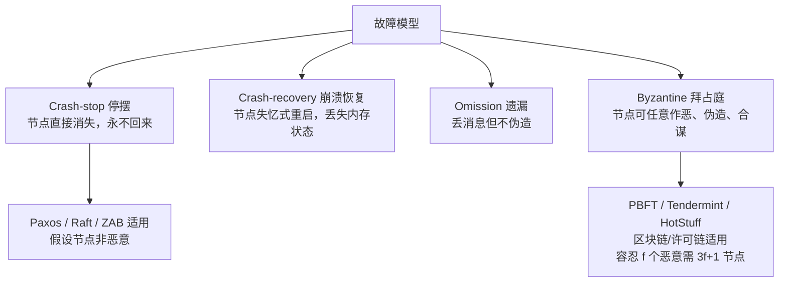

- **Crash-stop**：节点死了就死了，不再复活。最简单的模型，Paxos 原始论文假设的就是这个。
- **Crash-recovery**：节点崩溃后重启，磁盘数据还在，内存丢失。Raft/ZAB 都在这个模型下工作——它们的持久化（term、votedFor、日志）就是为恢复准备的。
- **Byzantine（拜占庭）**：节点可能**主动作恶**：给你发假消息、伪造投票、篡改日志。这是 PBFT、区块链的战场。注意：拜占庭容错需要 3f+1 个节点才能容忍 f 个恶意节点（因为要把 f 个作恶的和 f 个可能失联的"嫌疑"区分开）。

> 实战提醒：绝大多数后端系统（ZK/etcd/你的调度器）面对的是 Crash-recovery，不是拜占庭。别一上来就说"我们用 PBFT"，那叫杀鸡用牛刀，性能还差一个数量级。

### 1.3 FLP 不可能定理（Impossibility of Distributed Consensus）

这是共识领域的"哥德尔不完备定理"。1985 年 Fischer、Lynch、Paterson 证明：

> **在完全异步的网络模型中，只要有一个进程可能崩溃（crash），就不存在一个确定性的算法能保证在有限时间内达成一致性共识。**

为什么？核心矛盾在于：**异步网络下你无法区分"一个节点挂了"和"一个节点只是网络慢"**。

想象：节点 A 提议一个值，等待多数派响应。如果超时，A 不知道是"多数派挂了"还是"只是网络慢"。如果 A 假设"挂了"就跳过并提议新值，可能违反 Agreement；如果 A 一直等，又违反 Termination。无论怎么设计，总有一种时序（一个进程在"关键时刻"崩溃）让算法卡死或分裂。

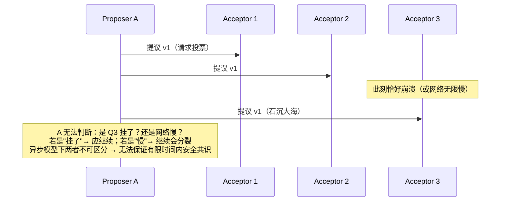

**那工程上怎么"绕过"FLP？**

FLP 的前提是"完全异步 + 确定性算法"。工程上的破解点：

1. **引入超时（partial synchrony / 部分同步假设）**：我们假设"网络最终会恢复且有上界"，用随机超时打破对称。这把模型从"完全异步"变成"部分同步"（DLS 模型：经过未知但有限的时间后网络变同步）。Raft / ZAB 的随机选举超时就是干这个的。
2. **随机化（Randomization）**：用随机值而非确定性策略，让"最坏时序"的概率趋于 0。Paxos 的活锁用"退避重试"缓解，Raft 用随机选举超时杜绝平票。
3. **弱化终止性为"最终终止"**：允许在极端分区下不提供服务（CP 取舍），而不是硬要在有限步内出结果。

> 一句话总结给面试官：**FLP 说的是"完全异步下不可能有确定性的、保证有限步终止的共识"，工程界用"超时/随机 + 接受分区时拒绝服务（CP）"把这把锁撬开了。这恰恰是 CAP 中 C 与 A 不可兼得的数学根源。**

### 1.4 CAP 与共识的关系

CAP 定理：分布式系统无法同时满足 Consistency（线性一致）、Availability（每个请求都有响应）、Partition tolerance（容忍网络分区）。网络分区 P 是物理必然，所以实质是在 C 和 A 间选。

共识协议（Paxos/Raft/ZAB）本质上是**用共识来实现强一致（C）的引擎**：

- 选主期间、脑裂少数派分区：**牺牲 A（拒绝写请求）**，保 C。
- 正常运行、多数派存活：**既能 C 又能 A**。

所以共识协议 = CP 系统的心脏。你之所以用 etcd 存配置而不是用 Redis 主从，就是因为 etcd 的 Raft 保证了"读到的一定是最新已提交值"，而 Redis 异步复制在主从切换瞬间可能丢数据/读旧值（AP 或弱一致）。

### 1.5 共识问题抽象模型（Proposer / Acceptor / Learner）

Lamport 在 Paxos 里把角色拆成三类，后面所有协议都是这个骨架的变种：

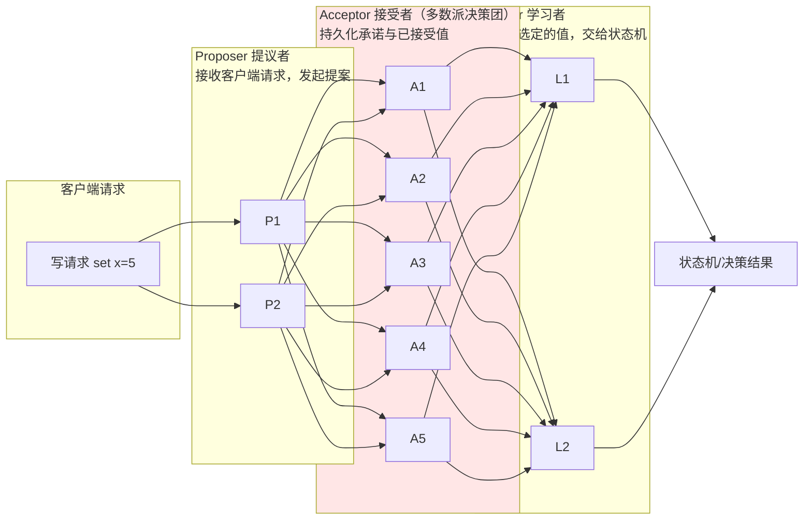

- **Proposer**：客户端入口，把请求变成"提案（proposal）"，带唯一递增的提案号。
- **Acceptor**：真正的决策团，通常 2f+1 个，只要 f+1 个响应就能形成多数派（quorum）。持久化是其生命线。
- **Learner**：把"被选定（chosen）"的值通知出去，通常就是 Acceptor 自己兼职，或者单独角色广播给状态机。

> 关键不变量：**只要任意两个多数派（quorum）至少有一个公共 Acceptor，决议就不会分裂。** 数学上 |Q1| + |Q2| > N ⇒ Q1 ∩ Q2 ≠ ∅。这是 Paxos 系列所有正确性的基石。

---

## 二、Paxos（Basic Paxos）

### 2.1 角色与核心思想

Basic Paxos 解决的是"**单一决策值**"的共识——只就一个值达成一致（比如"谁是 Leader"或"这一条日志是什么"）。它由 Lamport 在 1998 年《The Part-Time Parliament》提出（希腊 Paxos 岛寓言），2001 年又写了《Paxos Made Simple》"通俗版"，但仍然被认为难懂。

核心思想（一句话）：**用"两阶段锁 + 编号抢占"保证：一旦某个值被多数派接受，后续更高编号的提案只能沿用这个值，不能推翻它。**

### 2.2 两阶段协议

#### Phase 1a — Prepare（准备）
Proposer 选择一个**全局唯一且单调递增**的提案编号 n（注意不是值本身），向所有 Acceptor 发送 `Prepare(n)`。

#### Phase 1b — Promise（承诺）
Acceptor 收到 `Prepare(n)`，如果 n 比它见过的**所有** Prepare 编号都大，则：
1. 承诺：**不再接受任何编号 < n 的提案**（持久化 n 为 minProposal）。
2. 返回它**已经接受过（accepted）的编号最大**的提案 `(acceptedProposal, acceptedValue)`，如果没有则为空。

> 注意这是一个"两阶段锁"：Promise 相当于 Acceptor 对 n 上了锁，低编号提案被挡在门外。

#### Phase 2a — Accept（接受）
Proposer 收到**多数派**的 Promise 后：
- 如果 Promise 里带了某个 `(acceptedProposal, acceptedValue)`，则 Proposer **必须**把自己的值改成这些返回值中**提案编号最大**的那个（这是 Paxos 正确性最关键的一步——"尊重历史"）。
- 如果所有 Promise 都返回空，Proposer 才可以用自己最初想提议的值 v。
- 然后向所有 Acceptor 发送 `Accept(n, v)`。

#### Phase 2b — Accepted（已接受）
Acceptor 收到 `Accept(n, v)`：
- 如果 n ≥ 它当前承诺的最小编号（minProposal），则**接受**这个值，持久化 `(n, v)`，并返回 Accepted 给 Proposer。
- 否则拒绝（因为期间来了更高编号的 Prepare）。

当 Proposer 收到**多数派**的 Accepted，这个值就**被选定（chosen）**了，Learner 可以学习它。

### 2.3 Basic Paxos 时序图（含已接受值被带入）

下图展示一个关键场景：**Acceptor 已经接受了某个值，后来的提案必须把该值"带进来"**，从而保证一致性。

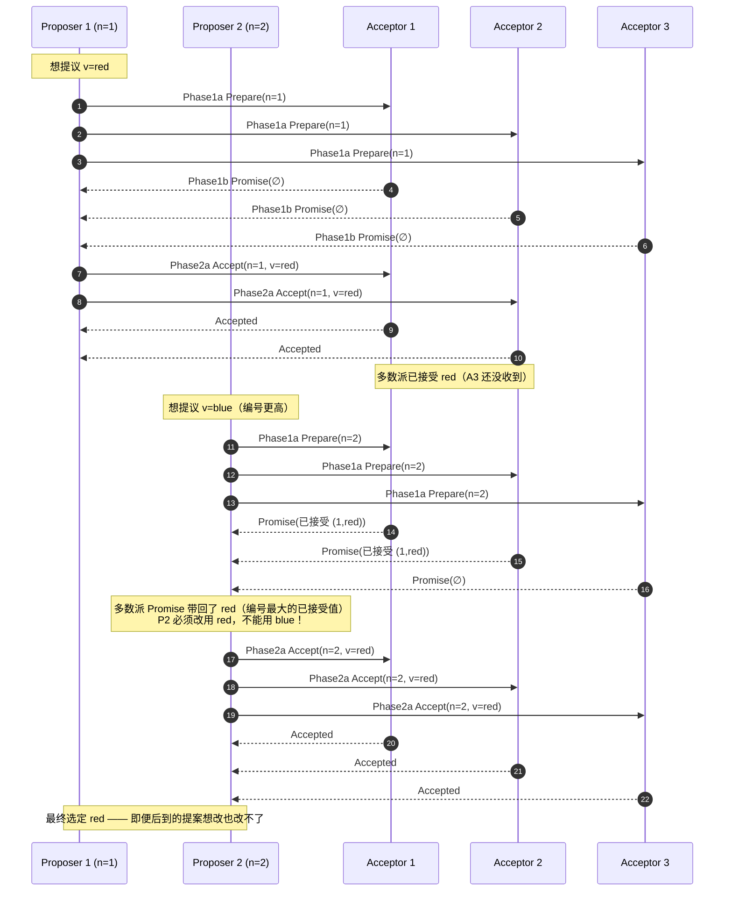

### 2.4 核心约束的数学直觉

Basic Paxos 正确性靠两个约束：

1. **Promise 约束**：Acceptor 一旦 Promise(n)，就拒绝所有 < n 的 Accept。⇒ 低编号无法再写入。
2. **值继承约束**：Proposer 在 Phase 2a 必须用"多数派 Promise 中编号最大的已接受值"。⇒ 一旦某个值被多数派接受，它就成了"已选定的事实"，任何后续更高编号提案只能"确认"它，不能覆盖。

结合 quorum 相交性质（任意两个多数派必有公共 Acceptor），可以严格证明：**一旦一个值被选定，所有后续提案都会继承它**。这就是 Paxos 的 Safety（一致性）。

### 2.5 单值与活锁（Livelock）

Basic Paxos 只解决"单个值"。要达成多个决策（一串日志），就得串行跑很多个 Basic Paxos 实例，每个实例一个 slot。

而且 Basic Paxos 有个著名缺陷：**多个 Proposer 并发时会产生活锁**。

想象：
- P1 发 Prepare(n=1)，拿到多数派 Promise；
- 还没发 Accept，P2 发 Prepare(n=2)，Acceptor 全部 Promise(2)，导致 P1 的 Accept(1) 被拒绝；
- P1 不甘心，发 Prepare(n=3)，又把 P2 的 Accept(2) 干掉；
- 无限循环，谁都提交不了 → **活锁（livelock）**。

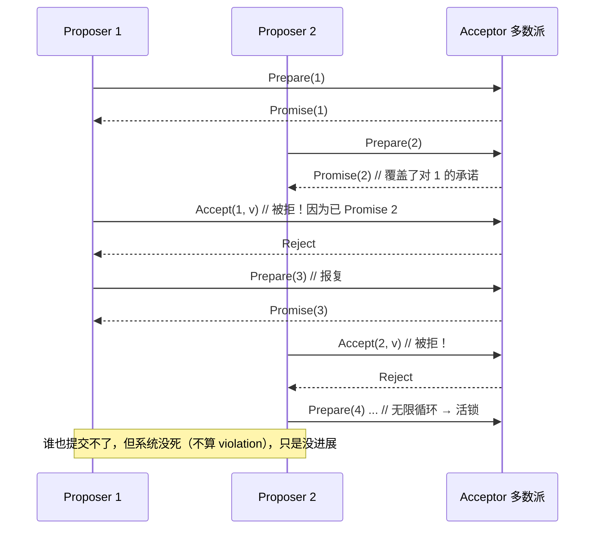

解决活锁的唯一正道：**选一个稳定的 Leader（Distinguished Proposer），所有提案都由它发起**。这正是 Multi-Paxos 的由来。

---

## 三、Multi-Paxos

### 3.1 从 Basic 到 Multi：选一个 Leader

Multi-Paxos 不是 Lamport 一篇独立论文，而是"把 Basic Paxos 工程化跑成状态机复制"的通用做法。核心改动：

1. **选一个稳定 Leader**（用一次 Basic Paxos 选主，或用其他机制）。此后所有提案都由 Leader 提出。
2. Leader 当选后，Phase 1 只跑**一次**（Prepare 拿到多数派 Promise），之后每个 slot（日志槽）只需跑 Phase 2（Accept）。延迟从 2 RTT 降到 1 RTT。
3. 每个 slot 有单调递增的 instance id，串联成**有序日志**，Apply 到状态机就是"复制状态机（Replicated State Machine）"。

### 3.2 工程化细节

- **Prepare 阶段一次性**：Leader 发 `Prepare(n)` 给所有 Acceptor，拿到 Promise 后，n 成为它的"领导编号"。后续 Accept 都用这个 n（或更大）。
- **日志序列**：instance id = 1, 2, 3, ... 每个 instance 对应一条日志。Leader 按顺序填槽，Follower/Acceptor 按顺序接受。
- **空洞（gap）处理**：如果某个 slot 的 Accept 丢失或 Leader 切换，可能出现空洞。需要"补齐"机制：新 Leader 接管后，对未确定的 slot 重新跑 Paxos 直到填满，且**填的值必须沿用该 slot 已选定的值**（如果有）。

### 3.3 Multi-Paxos 单阶段提交流程 + 日志序列

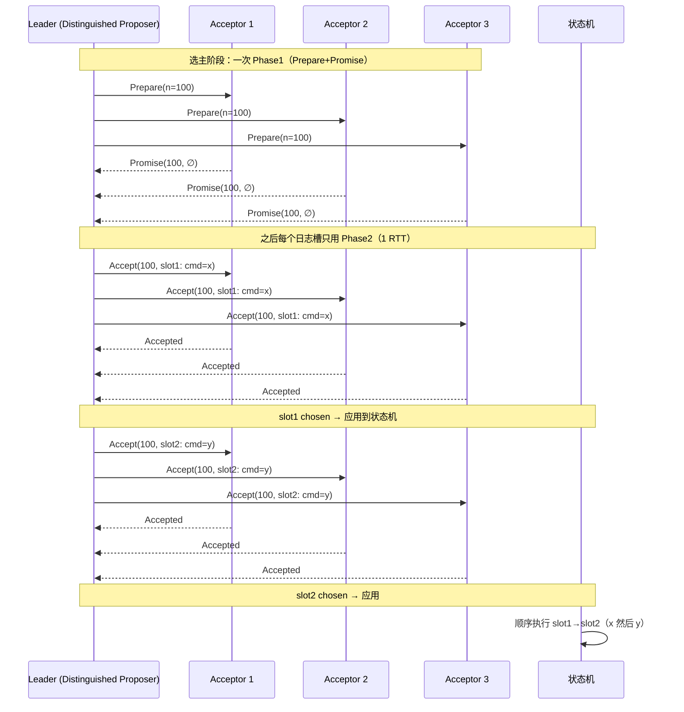

### 3.4 Multi-Paxos 与 Raft 的渊源

Raft 论文原话（Diego Ongaro, 2014）：

> "Raft is a consensus algorithm designed to be easy to understand... We hypothesize that Raft is more understandable than Paxos... Raft is a kind of **decentralized** version of **Multi-Paxos** with more structure."

直白说：**Raft = 把 Multi-Paxos 强行结构化、约束死，让你不需要"自由发挥"就能正确实现**。

Multi-Paxos 留给实现者一堆开放问题：Leader 怎么选？日志空洞怎么补？成员怎么变？读要不要走一遍 Paxos？这些问题每个都是坑。Raft 把这些全部规定死：强 Leader、日志必须连续、只能提交当前 term 的日志、成员变更用联合共识、读用 ReadIndex。所以它"易理解、不易错"。

> 面试金句：**Multi-Paxos 是理论 + 一堆工程判断题；Raft 是 Multi-Paxos 把判断题全选了标准答案后的"教科书实现"。**

---

## 四、Raft（重点）

Raft 是本文的重中之重。它把共识拆成三个相对独立的子问题：**领导者选举（Leader Election）、日志复制（Log Replication）、安全性（Safety）**，再加上两个运维级问题：**成员变更（Membership Change）、日志压缩（Log Compaction）**。我们逐一拆解。

### 4.1 设计目标：可理解性

Ongaro 的博士论文核心论点是：Paxos 难懂导致大家实现时各写各的、bug 一堆。Raft 用三个手段降复杂度：

1. **问题分解**：选举、日志复制、安全性分开。
2. **弱化 Leader 角色但强化约束**：一切以 Leader 为中心，Follower 只听 Leader 的，状态机一致性由 Leader 保证。
3. **更少的"自由选项"**：Multi-Paxos 里你需要自己决定的，Raft 都定死了。

### 4.2 任期（Term）—— 逻辑时钟

Raft 引入 `term`（任期），一个**单调递增的整数**，相当于分布式系统的逻辑时钟：

- 每个节点维护 `currentTerm`。
- 节点间任何 RPC 都携带 term。如果对方的 term 更大，本地节点**立即更新自己的 term 并降级为 Follower**（"识时务"机制）。
- term 只在**选举**时递增。一个 term 内最多一个 Leader（正常情况）。
- 一个 term 可能选不出 Leader（平票），那就进入下一个 term 重新选。

> term 的作用：给所有事件一个"全局可比较的时间轴"，用于检测过期 Leader、拒绝旧 term 的消息。它比物理时钟更可靠（没有时钟漂移问题）。

### 4.3 节点三状态

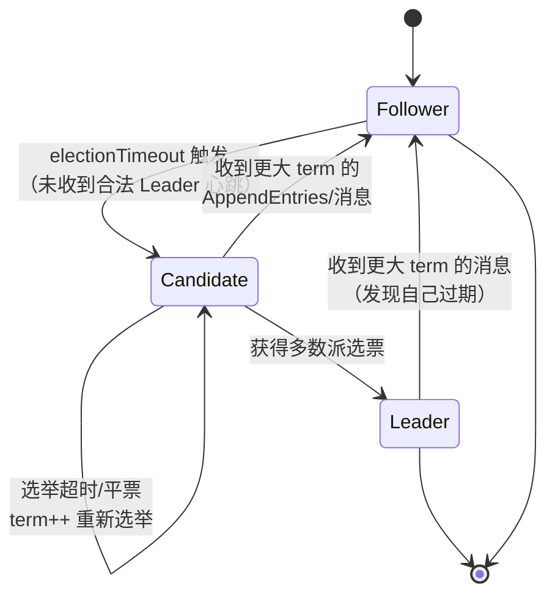

- **Follower**：被动。响应 Candidate 和 Leader 的 RPC；靠"选举超时"定时器触发自己参选。
- **Candidate**：主动。自增 term、投自己一票、向其他节点拉票。
- **Leader**：唯一。处理所有客户端写请求，靠心跳（空的 AppendEntries）维持地位。

### 4.4 领导者选举：随机超时 + 投票

选举流程（关键细节全在这）：

1. **Follower 的选举超时（election timeout）**：每个 Follower 有一个随机的超时时间（Raft 论文建议 150–300ms）。在超时前若收到合法 Leader 的心跳/AppendEntries，就重置定时器。
2. **超时 → 转 Candidate**：自增 `currentTerm`，把自己的状态设为 Candidate，**先给自己投一票**（`votedFor = self`），重置选举定时器，向所有其他节点发 `RequestVote` RPC（携带 term、候选人的最后日志 index 和 term）。
3. **投票规则**（Follower 收到 RequestVote）：
   - 只有 `request.term >= currentTerm` 才考虑（否则拒绝）。
   - **每个 term 一票**（first-come-first-served，`votedFor` 持久化，不能改投）。
   - **日志完整性检查（Election Restriction）**：候选人的日志必须"至少和自己一样新"——即候选人的 `(lastLogTerm, lastLogIndex)` **不小于**自己的。否则拒绝投票。（这是安全性关键，见 4.7）
4. **成为 Leader**：Candidate 收到**多数派**（> N/2）的同意票 → 立即转 Leader，向所有人发心跳宣告即位。
5. **平票（split vote）**：如果多个 Candidate 同时参选，可能没人拿到多数派 → 选举超时 → 各自 term++，重新选。靠**随机超时**让它们错开，避免永远平票。

为什么用**随机**超时而非固定？因为固定超时会让所有节点同一时刻超时、同一时刻参选 → 必然平票 → 必然反复重选 → 系统长时间无主。随机化让"谁先超时"有先后，先超时者先拉票，大概率先成为 Leader，快速收敛。

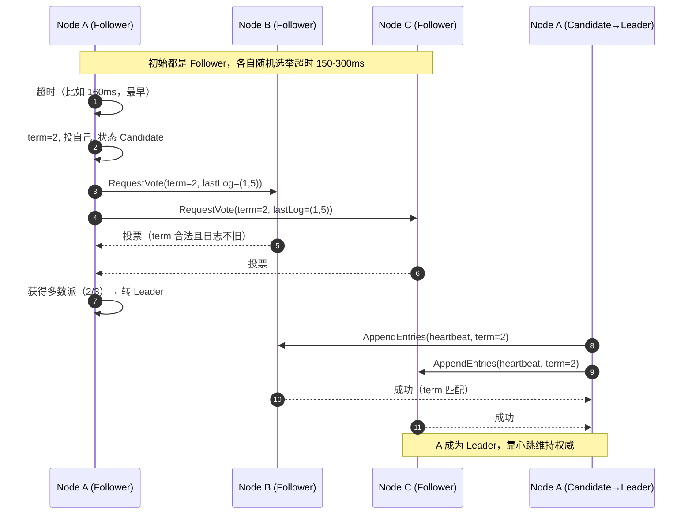

### 4.5 日志复制：AppendEntries / nextIndex / matchIndex

#### 4.5.1 正常复制流程

1. 客户端发写请求给 Leader。
2. Leader 把命令作为**新日志条目**追加到本地日志（此时**未提交**）。
3. Leader 通过 `AppendEntries` RPC 把该条目（及之前的日志）广播给所有 Follower。
4. Follower 校验日志连续性（见 4.5.2），成功则追加本地，回 ACK。
5. 当该条目被**多数派**复制成功，Leader 将其标记为**已提交（committed）**。
6. Leader 把已提交条目**应用到状态机**，并通知 Follower 也应用。
7. 返回客户端。

#### 4.5.2 日志匹配特性（Log Matching Property）

Raft 保证两条铁律：

- **一致性**：如果两个节点的日志在相同的 index 和 term 上有相同条目，则它们**之前的所有条目**也完全相同。（由 AppendEntries 的"一致性检查"保证：Follower 收到条目时，必须已有相同 index+term 的前驱，否则拒绝。）
- **冲突修复**：Follower 日志和 Leader 不一致时，Leader 强制用**自己的日志覆盖** Follower 冲突部分。

#### 4.5.3 nextIndex 与 matchIndex

Leader 为每个 Follower 维护两个指针：

- `nextIndex[i]`：Leader 认为 Follower 下一个该接收的日志 index（初始 = Leader 最后一条 + 1）。
- `matchIndex[i]`：Leader 已知 Follower 已复制的最高日志 index。

**冲突时 nextIndex 回退**（这是面试高频）：

- 当 Follower 拒绝 AppendEntries（因为它的 index 处日志和 Leader 不一致），Leader 就把该 Follower 的 `nextIndex--`（回退一格），重试。
- 优化：Follower 拒绝时返回**自己的冲突 term 及该 term 的起始 index**，Leader 可一次性把 `nextIndex` 跳到该 term 起点，而非逐格回退（避免一条条退，太慢）。

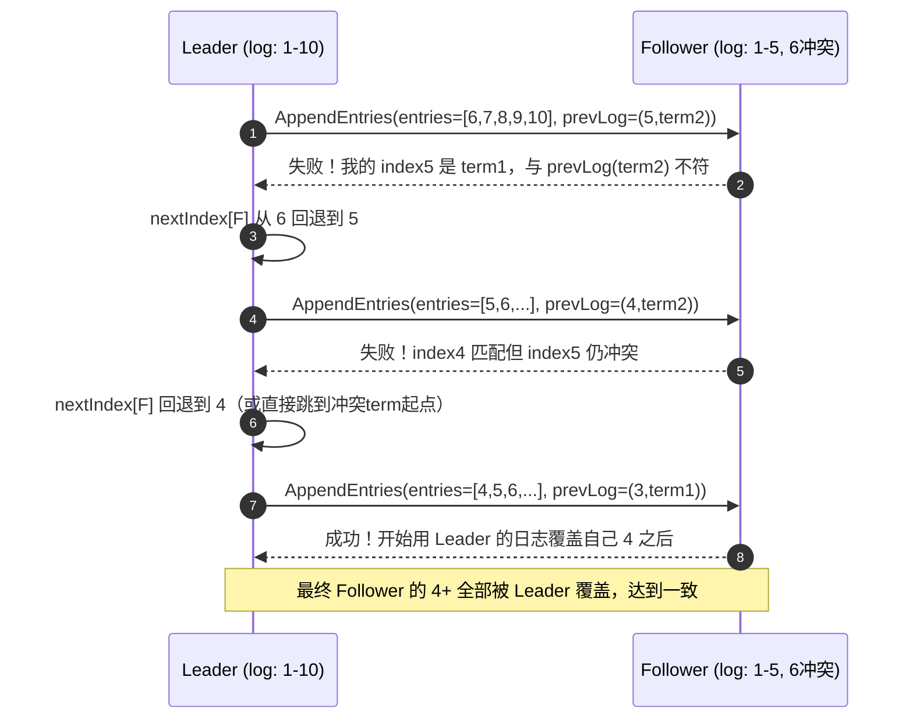

#### 4.5.4 提交规则（Commitment）—— 一个极其隐蔽的坑

Raft 的提交**不能**简单"多数派复制就算提交"。安全做法是：

> **Leader 只能提交"当前 term 的"日志条目；一旦当前 term 的条目被多数派复制并提交，根据日志匹配特性，所有之前的条目（哪怕来自旧 term）也自动被提交。**

为什么不能直接提交旧 term 的条目？看 Raft 论文 Figure 8 的经典反例：

```mermaid
graph TD
    subgraph S1["时刻 a: term2, S1是Leader"]
        A["S1: [1,2]"]
        B["S2: [1]"]
        C["S3: [1]"]
    end
    subgraph S2["时刻 b: S1崩溃, S5用term3当选(Leader日志只有[1])"]
        D["S5: [1]"]
        E["S2: [1]"]
        F["S3: [1]"]
        G["S4: [1,2]"]
        H["S1: [1,2] 已停"]
    end
    subgraph S3["时刻 c: S5复制index2? 不! S5只复制自己的. 然后S5崩溃"]
        I["S5崩溃"]
    end
    subgraph S4["时刻 d: S1重启, term4当选, 把index2复制到多数派→ 若直接提交旧term2的index2会丢!"]
        J["S1重新当选, 若误提交旧 [2]"]
        K["S3: [1,2]? 不, S3从未有2"]
    end
    Note1[危险: 如果 S1 在 term4 仅把旧 term2 的 index2 复制到 S1/S2/S3 多数派<br/>并"直接提交", 但 S3 此前(时刻b)其实没这值 → 若允许直接提交旧term, 会矛盾]
    Note2[正确做法: S1 必须先提交一条"当前term4的新日志"(如index3),<br/>连带把 index2 一并提交, 且期间若 S1 崩溃, 新Leader必须包含index2]
```

简洁版讲解：若允许 Leader 提交"旧 term 的日志"，可能出现——旧日志被多数派复制后，一个**没有该日志**的节点当选新 Leader（因为它有更高 term 且日志"够新"的定义只看最后一条），然后新 Leader 用自己的日志覆盖了那条已"提交"的旧日志，导致已提交日志丢失。Raft 用"只能提交当前 term + 连带提交"绕开这个坑。

### 4.6 安全性（Safety）：三个不变量

Raft 的安全性由三条铁律保证，面试能背出来就是加分项：

1. **选举限制（Election Restriction / Up-to-date check）**：只有日志"至少和多数派一样新"的节点才能当选 Leader。⇒ 保证"已提交的日志一定在当选 Leader 上"（否则它凑不齐多数派——因为已提交意味着多数派有该日志，而它若没这日志，必然和那多数派中至少一个冲突，那一个不会投它）。
2. **Leader 完整性（Leader Completeness）**：一旦某条日志在任期 T 被提交，它在所有更高任期的 Leader 的日志中**必然存在**。⇒ 这是上一条的直接推论，是状态机安全的前提。
3. **状态机安全（State Machine Safety）**：如果两个节点在**相同 index 和 term**上应用了日志条目，那么它们的命令**一定相同**。⇒ 由日志匹配特性 + Leader 唯一性保证。

> 把这三句串起来：**选举限制保证"好日志"不被漏掉 → Leader 完整性保证它永远在 Leader 上 → 状态机安全保证大家应用出来的结果一致。** 这才是 Raft 不怕脑裂、不怕切换的数学根基。

### 4.7 成员变更：联合共识（Joint Consensus）

**问题**：直接改集群成员列表（比如 3 节点扩到 5 节点）有风险——在变更过程中，可能同时存在两个"多数派"（旧配置的多数派和新配置的多数派互不相交），导致**脑裂**（两个 Leader 同时存在）。

**Raft 的解法：联合共识（Joint Consensus / Cold,new）**，分两阶段：

1. **Cold,new 阶段（过渡）**：Leader 提交一条 `Cold,new` 配置日志。进入此阶段后，**任何决策（包括选主、提交）都需要 Cold 的多数派 AND Cnew 的多数派同时同意**。此时 Cold 和 Cnew 的多数派必然有重叠（因为都要和对方交叠），杜绝脑裂。
2. **Cnew 阶段**：当 `Cold,new` 被联合多数派提交后，Leader 再提交一条 `Cnew` 配置日志。之后只用 Cnew 的多数派。

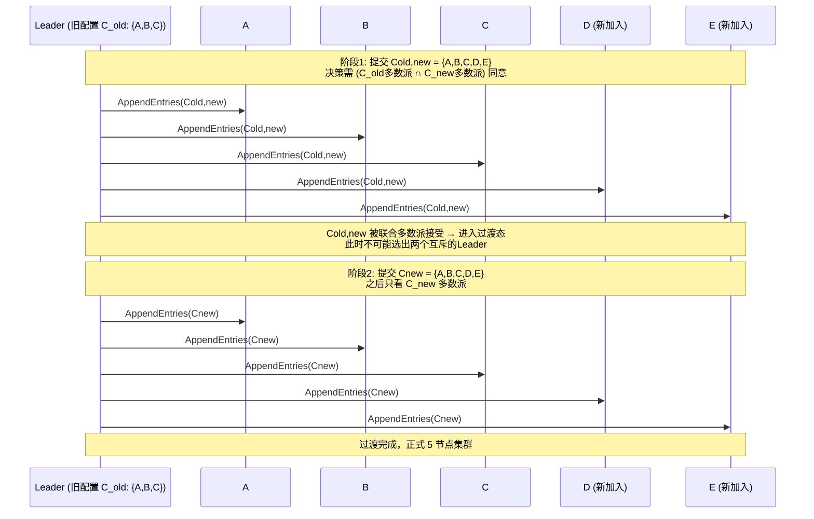

> 实战提醒：成员变更是 Raft 实现里最容易写错的部分。etcd 早期就踩过单步变更（每次只加减一个节点）的坑。生产环境如果做扩缩容，**一定要用支持联合共识或单步安全变更的实现**，别自己手搓。

### 4.8 日志压缩：Snapshot + InstallSnapshot

日志无限增长会撑爆磁盘、拖慢重启回放。Raft 用**快照（Snapshot）**压缩：

- 状态机定期把"当前状态"序列化成一个快照文件，并记下快照覆盖到的最后一条日志的 `(lastIncludedIndex, lastIncludedTerm)`。
- 快照点之前的日志可以删除。
- **InstallSnapshot RPC**：当 Follower 落后太多（它的 `nextIndex` 已经小于 Leader 的快照起点），Leader 直接把快照发给它，Follower 用快照替换自己的旧日志。

```mermaid
graph LR
    subgraph LeaderLog[Leader 日志]
        Snap[Snapshot<br/>lastIncluded=(100, term5)] --> L101[101] --> L102[102] --> L103[103]
    end
    subgraph FollowerLog[落后 Follower 日志]
        F50[...50] --> F60[...60] --> F70[...70]
    end
    Snap == InstallSnapshot RPC ==> FFollow[Follower 直接用快照<br/>替换 1-100, 起点跳到 100]
    L101 --> FFollow
    Note[Follower 落后到 nextIndex < 100, 无法用 AppendEntries 补齐<br/>改用 InstallSnapshot]
```

### 4.9 脑裂下的行为

Raft 在脑裂（网络分区）时的行为，是它"CP 系统"本质的体现：

- **少数派分区**：节点收不到 Leader 心跳，超时后不断尝试选举，但因为凑不齐多数派，**永远选不出 Leader** → 该分区**拒绝写请求**（牺牲 A）。
- **多数派分区**：Leader 仍在多数派里（或在多数派里选出新 Leader），正常服务。
- **恢复后**：少数派分区的"假 Leader"（如果有过任期更大的）发现自己的 term < 新 Leader 的 term，立即降级为 Follower，并通过 nextIndex 回退把自己冲突的日志覆盖掉，**追平**多数派。

> 关键结论：**Raft 脑裂不会导致"双写/数据不一致"，只会导致"少数派不可用"。这正是 CP 系统的正确行为。** 反观异步主从（如某些Redis部署），脑裂时两个主都写，恢复时数据冲突需要人工介入——这是 Raft 碾压它的地方。

---

## 五、ZAB（ZooKeeper Atomic Broadcast）

### 5.1 ZAB 是什么

ZooKeeper 用的是自研的 **ZAB（ZooKeeper Atomic Broadcast）** 协议，不是 Raft 也不是标准 Paxos。它和 Raft 是"表兄弟"——都基于"单 Leader + 多数派 + 有序日志复制"，但 ZAB 更强调**原子广播（Atomic Broadcast）**语义：所有事务**全局有序**地广播到所有节点。

ZAB 论文（Junqueira et al., 2011）明确说 ZAB 是"为 ZK 设计的崩溃恢复的原子广播协议"，思想上借鉴了 Paxos，但面向"主备（primary-backup）顺序一致"。

### 5.2 三阶段：Fast Leader Election → Recovery → Broadcast

#### 阶段一：Fast Leader Election（快速选举）
- 每个节点启动时先处于 LOOKING 状态，互相发投票。
- 投票内容核心两字段：**(zxid, serverId)**。选举规则：先比 zxid（事务越大越新），再比 serverId（越大越优先）。
- 一旦某个节点拿到多数派选票（且它的 (zxid, sid) 在投票里最优），当选 Leader，进入 LEADING；其他进入 FOLLOWING。

#### 阶段二：Recovery（恢复/数据同步）
- 新 Leader 与每个 Follower 对比日志，把 Follower 缺失的事务**补齐**（diff/trunc/sync），保证所有节点数据一致。
- 关键：恢复阶段要保证"**所有已被 Leader 提交的事务都保留，所有未被提交的都丢弃**"——和 Raft 的"已提交不丢"一致。

#### 阶段三：Broadcast（正常广播）
- 类似"简化版二阶段提交"：
  1. Leader 为事务分配全局递增 zxid，发 **Proposal** 给所有 Follower。
  2. Follower 写本地事务日志（持久化）后回 **ACK**。
  3. Leader 收到**多数派 ACK** 后，发 **Commit**，Follower 应用事务到内存数据树（DataTree）。

```mermaid
graph TD
    A[集群启动/崩溃后] --> B[Fast Leader Election<br/>比 (zxid, serverId) 选最大者]
    B --> C{选出 Leader?}
    C -->|是| D[Recovery 阶段<br/>Leader 与 Follower 同步差异日志<br/>保证已提交都保留]
    C -->|否| B
    D --> E[Broadcast 阶段<br/>正常处理写请求]
    E --> F[Leader: 分配 zxid]
    F --> G[发 Proposal 给 Follower]
    G --> H[Follower 写日志 → ACK]
    H --> I{Leader 收多数派 ACK?}
    I -->|是| J[发 Commit → 应用 DataTree]
    I -->|否| K[等待/超时处理]
    J --> E
```

### 5.3 zxid：全局有序的时钟

`zxid` 是一个 64 位整数，拆成两半：

- **高 32 位 = epoch（纪元）**：每次 Leader 选举 +1，相当于 Raft 的 term。
- **低 32 位 = counter（计数器）**：当前 epoch 内每个事务 +1。

所以 zxid 的排序规则天然是"先比 epoch 再比 counter"，保证**全局严格递增且有序**。任何两个事务都能比出先后，这是 ZK 实现"顺序一致性（Sequential Consistency）"的基石。

```
 zxid (64 bits) = [ epoch (32 bits) | counter (32 bits) ]
 例: 0x00000001 0000000A  →  epoch=1, counter=10
     0x00000002 00000003  →  epoch=2, counter=3  (新 epoch 一定大于旧 epoch 所有)
```

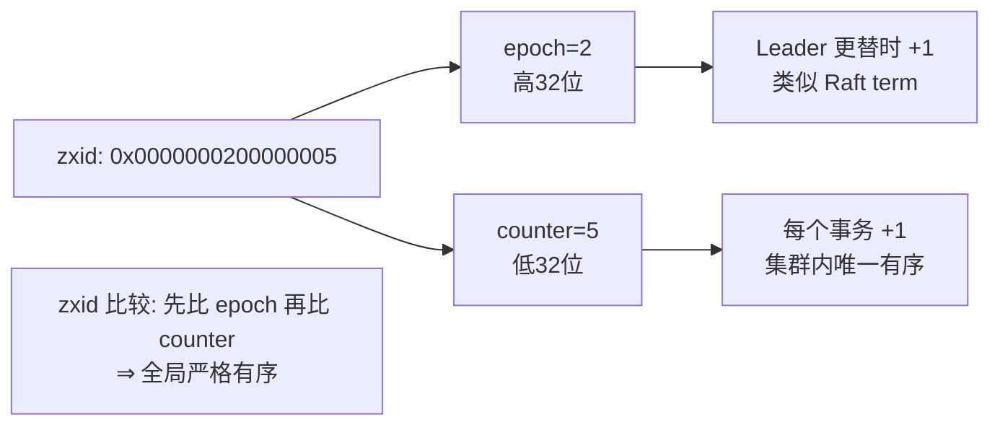

### 5.4 ZAB 消息广播（Proposal / ACK / Commit）

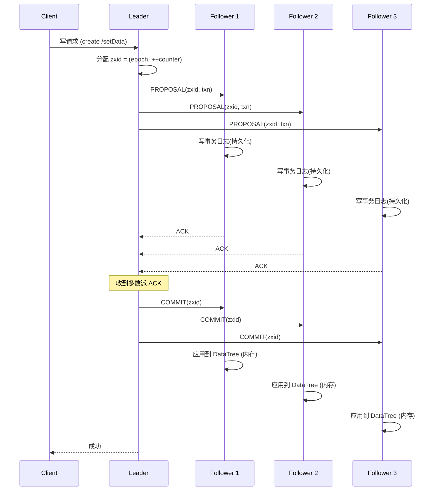

### 5.5 ZAB 与 Raft 对比（一句话）

两者本质相似（单 Leader + 多数派 + 日志顺序复制 + 崩溃恢复保已提交），差异在工程取向：

| 维度 | Raft | ZAB |
|------|------|-----|
| 设计目标 | 通用复制状态机，易理解 | ZK 专用原子广播，顺序一致 |
| Leader 产生 | 随机超时选举（term） | Fast Leader Election（比 zxid + sid） |
| 日志顺序 | 连续 index + term | zxid（epoch+counter）全局有序 |
| 读一致性 | 默认走 Leader（ReadIndex/Lease） | 客户端可连任意节点（可能读到旧值，除非 sync） |
| 成员变更 | 联合共识（明确两阶段） | 重新选举 + 配置版本，无显式联合共识原语 |

> 面试金句：**ZAB 是"为 ZK 量身定做的 Raft 近似物"，Raft 是"为所有人设计的标准化 ZAB 思路"。ZK 不用 Raft 纯粹是历史原因（ZAB 2011 早于 Raft 2014），且 ZK 的读写分离模型（客户端可读 Follower）与 Raft 的强 Leader 读有差异。**

---

## 六、其他共识与对比

### 6.1 Viewstamped Replication（VR）

VR（Oki & Liskov, 1988）是 Raft 的"前辈"，比 Paxos 论文还早，也是**主从复制 + 视图（view，类似 term）变更**的套路：

- 一个 Primary（= Leader）+ 多个 Backup。
- 客户端请求发给 Primary，Primary 排序后复制给 Backup，多数派确认后提交。
- Primary 故障 → view 切换（view number++），选新 Primary。
- 核心思想和 Raft 几乎一样，但论文表述偏"复制"而非"共识"，且当时没把"可理解性"作为卖点。

Raft 论文明确承认受 VR 启发。可以说：**Raft = VR 的现代化重写 + 把安全性讲清楚 + 加上成员变更/快照的标准化**。

### 6.2 PBFT（Practical Byzantine Fault Tolerance）

Byzantine 模型下的共识。Castro & Liskov, 1999：

- 三阶段：**Pre-Prepare → Prepare → Commit**，每阶段都要多数派（或 2f+1）签名确认。
- 容忍 f 个恶意节点需要 **3f+1** 个总节点（数学：要区分 f 个作恶 + f 个可能失联）。
- 延迟约 2–3 个 RTT，通信复杂度 O(n²)（每个节点要和所有节点通信），扩展性差。
- 适用：联盟链、许可链（Hyperledger Fabric 的排序服务、Tendermint/HotStuff 等）。
- 和 Paxos/Raft 的关系：故障模型更强（抗恶意），但性能更差、实现更复杂。**后端业务系统几乎用不到，除非你做区块链或跨机构可信协作。**

### 6.3 四维对比表

| 维度 | Basic Paxos | Multi-Paxos | Raft | ZAB |
|------|-------------|-------------|------|-----|
| **角色** | Proposer/Acceptor/Learner | 同上（多一个稳定 Leader） | Leader/Follower/Candidate | Leader/Follower/Observer |
| **选主** | 无（每个值各自提议） | 选 Distinguished Proposer | 随机超时选举（term） | Fast Leader Election（zxid+sid） |
| **日志** | 单值 | 多 slot 串联 | 连续 index + term | zxid（epoch+counter） |
| **提交** | 多数派接受即选定 | 多数派接受 | 多数派复制 + 只提交当前 term | 多数派 ACK + Commit |
| **成员变更** | 无标准 | 无标准（坑多） | 联合共识（Cold,new） | 配置版本 + 重选 |
| **读语义** | 需查询 Learner | 走 Leader | Leader 读（ReadIndex/Lease） | 任意节点（可能旧，可 sync） |
| **脑裂** | 活锁风险 | Leader 下安全 | 少数派拒写，安全 | 少数派拒写，安全 |
| **落地系统** | —（理论） | Google Chubby(思想)、部分自研 | etcd、Consul、TiKV、CockroachDB | ZooKeeper |
| **可理解性** | 难 | 中等（留坑多） | 高（结构化） | 中（偏专用） |

### 6.4 四协议选型 / 演化关系图

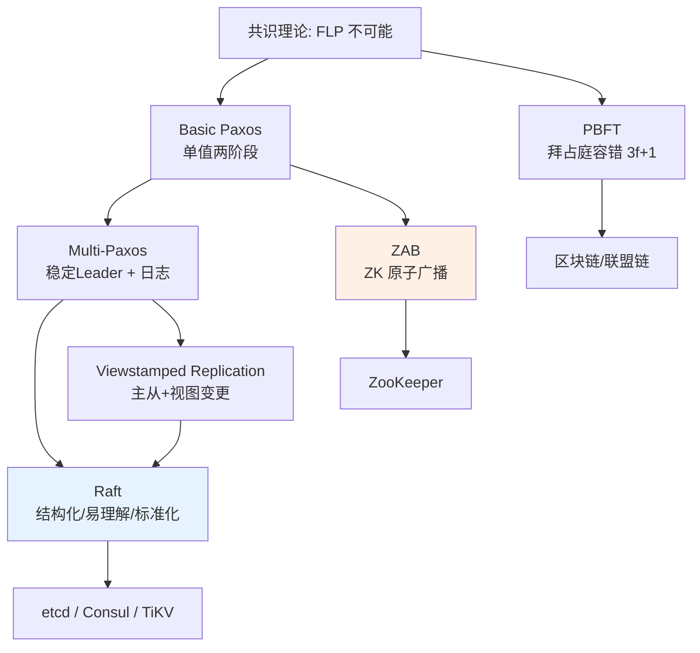

---

## 七、【深度拓展】工程细节

### 7.1 主流落地系统

#### etcd（Raft）
- Kubernetes 的"大脑"，所有元数据存储在这里。
- 基于 Raft 实现强一致 KV，外加**租约（Lease）**、**Watch（监听变更）**、**事务（Txn）**。
- 单 Raft 组（集群通常 3 或 5 节点），所有写走 Leader。
- 关键优化：**WAL（write-ahead log）+ 快照（snapshot）**持久化，重启快速回放。

#### Consul（Raft + Gossip）
- 服务发现 + KV + 多数据中心。
- 一致性层用 Raft（每个数据中心一个 Raft 组选主）。
- 成员管理与故障探测用 **Gossip 协议（SWIM）**，和 Raft 互补：Raft 管"数据一致"，Gossip 管"谁还活着"。

#### TiKV（Raft + 多 Raft 组）
- 分布式 KV，PD（Placement Driver）管调度。
- 数据按 **Region（默认 96MB 一段）**分片，每个 Region 是一个独立的 Raft 组（多 Raft 组架构）。
- Region 过大自动 **split（分裂）**成两个，过小合并（merge）。
- 每个 Region 3 副本（Leader + 2 Follower），Leader 负责读写，PD 做负载均衡和副本调度。
- 这是 Raft "横向扩展"的典范——单 Raft 组吞吐有上限，多 Raft 组把数据分片并行。

#### ZooKeeper（ZAB）
- 见第五章。配置管理、分布式锁、选主的事实标准（虽然后被 etcd 抢了不少份额）。

### 7.2 Raft 性能优化

原生 Raft 每个日志 1 RTT、串行提交，吞吐和延迟都不够极致。工程界常用以下优化：

#### (1) Batch（批量）
Leader 把短时间窗口内的多个客户端请求**打包成一个 AppendEntries** 发送。减少 RPC 次数，提升吞吐。代价：增加一点延迟（攒批）。

#### (2) Pipeline（流水线）
不等上一条 AppendEntries 的 ACK 回来就发下一条（前提是 Follower 按序接收）。把"串行 RTT"变成"窗口化"。需要 Follower 维护 in-flight 队列，且冲突回退时要正确处理。

#### (3) Pre-Vote（预投票）—— 防"惊群降级"
**这是个非常重要的稳定性优化。** 原生 Raft 在网络分区恢复瞬间，旧 Leader（或网络抖动的节点）会因为收不到心跳而 term++ 参选，导致**整个集群频繁 term 跳变、Leader 被反复推翻**，称为 "term churn / 惊群"。

Pre-Vote 在真正自增 term 之前，先发一个**不带 term 自增的 Pre-Vote 探测**：只有当能拿到多数派"愿意投你"的回应时，才真正 term++ 并参选。这样网络分区的少数派节点不会"空降"高 term 去骚扰多数派。

```
正常: 抖动节点 term++ → RequestVote(高term) → 全网被迫降级 → 重新选举(震荡)
Pre-Vote: 抖动节点先 PreVote → 拿不到多数派回应 → 不term++ → 安静地等恢复
```

#### (4) ReadIndex / Lease Read（读优化）
原生 Raft 每次读都走一遍日志复制（为了确认自己是 Leader 且日志最新），太慢。优化：
- **ReadIndex**：Leader 在响应读之前，先确认自己还是 Leader（向多数派发一个轻量心跳确认 "我还是主吗"，并记录当前 commitIndex 为 readIndex），等状态机应用到 readIndex 后再返回读结果。避免走完整写流程。
- **Lease Read（租约读）**：Leader 认为自己持有租约（在 election timeout 内没发生选举）时，直接本地读，连心跳确认都省了。前提是**时钟漂移可控**（否则租约失效时可能读到旧值）。

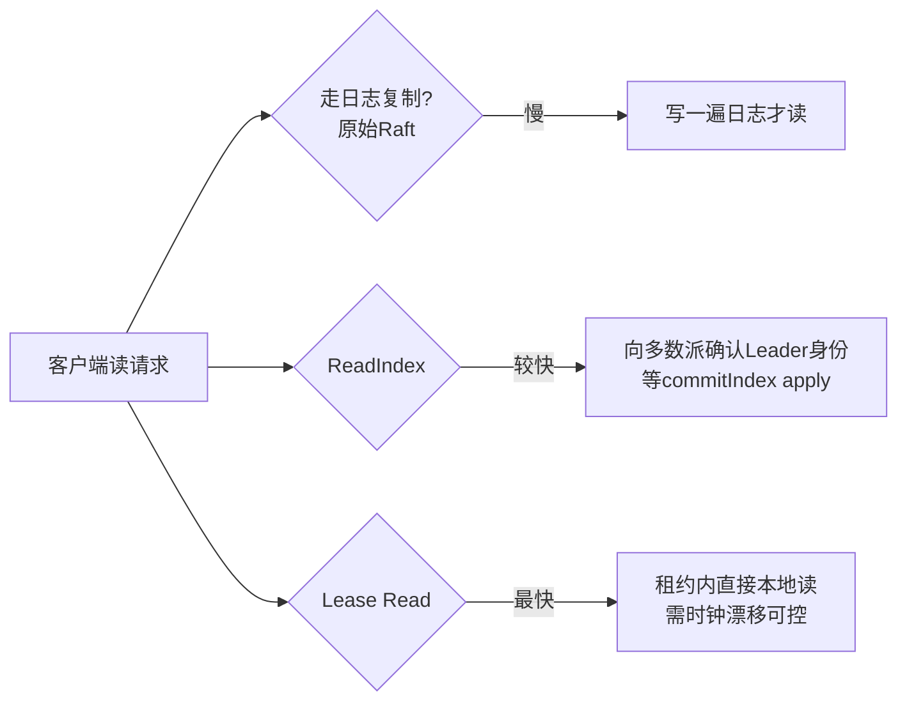

### 7.3 租约（Lease）机制

租约是一种"带期限的授权"：Leader 被授权在一段时间内（lease 时长 < election timeout）独占领导权。期间 Follower 不发起选举。

- 作用：简化读一致性（Lease Read）、避免频繁选主、给客户端"当前 Leader 可信"的保证。
- 风险：**时钟漂移**。如果 Follower 的时钟比 Leader 快，可能 Leader 租约还没到但 Follower 以为到了就发起选举，出现"双 Leader"瞬间。所以 lease 时长必须远大于时钟误差上限（通常 election timeout 设成时钟漂移的几十倍）。

> etcd 的 Lease 不仅是选举租约，还是 KV 的 TTL 机制（key 绑 lease，lease 过期 key 自动删），用于"临时节点 + 选主 + 服务注册"三位一体。

---

## 八、【项目支撑】XTransfer 真实实战

以下是结合我在 XTransfer（跨境支付）、哈啰、欧凡、携程的经历，把共识协议落到真实系统的部分。这些是可写进简历、可讲成故事的干货。

### 8.1 配置中心选主：用 etcd/ZK 做主备调度器 Leader 选举

**场景**：跨境支付对账（T+1 跑批）这类定时任务，必须"整个集群只跑一次"，不能因为部署了 3 个调度节点就跑 3 次（否则重复出款/重复对账 = 资损）。

**方案**：用 etcd 的 **Lease + 抢占式选主**：

```java
// 伪代码：基于 etcd 的 Leader 选举（思路，非完整实现）
public class EtcdLeaderElector {
    private final KV kv;
    private final Lease lease;
    private long leaseId;
    private volatile boolean isLeader = false;

    public void start() {
        // 1. 申请一个租约（如 15 秒）
        leaseId = lease.grant(15).get().getID();
        // 2. 用事务抢占 /leader 这个 key，绑定租约
        //    putIfAbsent 语义：谁先写成功谁就是 Leader
        Txn txn = kv.txn()
            .If(new Cmp(leaderKey, Cmp.Op.EQUAL, CmpTarget.version(0))) // 不存在
            .Then(Op.put(leaderKey, selfId, PutOption.newBuilder()
                .withLeaseId(leaseId).build()))
            .Else(Op.get(leaderKey));
        // 3. 心跳续租：定时 renew，保住 Leader 身份
        scheduleRenew();
        // 4. Watch /leader：若被删（Leader 挂了租约过期），重新抢
        watchLeaderKey();
    }

    private void onLeaderLost() {
        isLeader = false;
        // 重新参与选举，直到再次抢到
        tryElectAgain();
    }
}
```

**为什么不用数据库唯一索引做选主？** 因为数据库无法"自动释放"——如果主节点宕机，唯一记录还在，备节点永远抢不到（除非加超时清理逻辑，那又退化成自己实现一个脆弱的租约）。etcd 的 Lease 天然支持"节点挂了租约自动过期 → key 消失 → 备节点立刻抢"，这才是工程上稳的选法。

### 8.2 分布式调度协调：ZK 临时节点争抢分片任务

**场景**：哈啰/欧凡的定时任务或实时计算，需要把 N 个分片（shard）分配给 M 个 worker，且**每个分片只被一个 worker 执行**（避免重复跑、数据错乱）。

**方案**：基于 ZK 的**临时顺序节点（Ephemeral Sequential Node）**：

- 每个 worker 在 `/tasks/shard-X/` 下创建临时顺序节点。
- 谁创建成功谁负责该分片；节点是 ephemeral，worker 宕机会话断开 → 节点自动消失 → 其他 worker 感知（Watch）后重新争抢。
- 天然实现"故障转移 + 不重复执行"。
- 配合**幂等设计**（任务记录执行状态到 DB），即使极端情况下短暂双执行也不资损。

### 8.3 一次脑裂复盘（两机房网络分区）

**事故背景**：XTransfer 双机房部署，etcd 集群 5 节点（机房 A 3 个、机房 B 2 个）。某次专线抖动，A、B 网络分区。

**现象与处置**：

1. **分区瞬间**：机房 B（2 节点，少数派）收不到原 Leader（在 A）的心跳。但 B 只有 2/5，**凑不齐多数派（需要 3）**，所以 B 内**选不出新 Leader**，拒绝写。
2. **机房 A（3 节点，多数派）**：原 Leader 仍在，继续服务，对账跑批正常。
3. **原 Leader 若在 B 侧（假设）**：旧 Leader 在 B 侧但只有 2 节点，它的 AppendEntries 拿不到多数派 ACK，**无法提交任何新日志** → 即便它"以为"自己还是主，也写不进去（Raft 安全性保护）。
4. **恢复后**：网络恢复，B 侧节点发现 A 侧新 Leader 的 term 更高，立刻降级为 Follower，通过 `nextIndex` 回退把自己的冲突日志覆盖掉，**追平** A。无数据丢失、无重复提交。

**双保险设计（关键）**：

- **第一重**：etcd Lease 选主，保证"同一时刻只有一个调度器在跑批"。
- **第二重**：分片任务**幂等**（对账任务记录 `batch_no + status` 到 DB，重复执行直接返回"已处理"）。
- **结果**：即便选主出现极端竞态导致极短暂双主，第二重的业务幂等兜住，零资损。

> 复盘结论写进简历/汇报：**Raft 的"少数派拒写"特性在脑裂时救了我们——它不会让两个机房同时写，所以恢复后只需追平，不需要人工对账修复。这比异步主从架构（双写 + 人工合并）稳太多。**

---

## 九、【面试官追问】

这一节把 10 年+ 面试里最容易被追问的硬核问题逐条拆解，建议背诵 + 白板能画。

### Q1：FLP 不可能定理说共识不可能，那 Raft 怎么做到的？
**答**：FLP 的前提是"完全异步 + 确定性算法 + 一个进程可能崩溃"。Raft 在三个地方绕开：
1. **部分同步假设 + 超时**：Raft 假设网络最终会变同步（有上界），用 election timeout 把异步降级为"半同步"。少数派分区时直接拒绝服务（牺牲 A），不在"有限步内硬凑结果"。
2. **随机化**：随机选举超时打破平票对称，让收敛概率趋于 1（不是 100% 确定性收敛，但实践中极快）。
3. **弱化 Termination 为最终终止**：允许极端分区下不服务，而不是保证任意时序下有限步出结果。
所以 Raft 不是"违反 FLP"，而是"不在 FLP 的假设前提内运行"。

### Q2：Raft 选举为什么用随机超时？固定超时会怎样？
**答**：固定超时 → 所有 Follower 同一时刻超时 → 同一时刻变 Candidate、同一 term 拉票 → 必然平票 → 选举超时 → 再同一时刻重选 → **永久平票震荡，长时间无主**。随机化（150–300ms 抖动）让"谁先超时"有先后，先超时者先拉票、先拿多数派，快速收敛为单 Leader。

### Q3：日志复制里 nextIndex 回退怎么工作？
**答**：Leader 为每个 Follower 维护 `nextIndex`（下一个要发的日志位置）。AppendEntries 带 `prevLogIndex/prevLogTerm` 做连续性校验。Follower 若发现自己的 `prevLog` 位置和 Leader 不符（日志冲突），拒绝并**可附带冲突 term 信息**。Leader 收到拒绝就把该 Follower 的 `nextIndex` 回退（逐格或跳到冲突 term 起点），重新发从 `nextIndex` 开始的日志，直到对齐。对齐后 Leader 用自己日志**覆盖** Follower 冲突部分，最终一致。

### Q4：Raft 怎么保证已提交的日志不丢？
**答**：两层保证：
1. **选举限制**：只有日志"至少和多数派一样新"的节点能当选 Leader ⇒ 已提交的日志（存在于多数派）必然在新 Leader 上（否则它凑不齐多数派）。
2. **只提交当前 term 的日志 + 连带提交**：Leader 不跨 term 直接提交旧日志，而是先提交一条当前 term 的新日志，连带把之前的旧日志一起提交。这避免了"旧日志被多数派复制后，一个没它的节点靠更高 term 当选并覆盖它"的反例。

### Q5：ZAB 和 Raft 到底差在哪？
**答**：本质都是单 Leader + 多数派 + 顺序日志复制。差异：① ZAB 面向"原子广播"，强调全局有序（zxid），客户端可读任意 Follower（可能旧值，除非 sync）；Raft 强 Leader 读，读一致性更强。② 选举：ZAB 比 (zxid, sid) 快速选举；Raft 随机超时。③ 成员变更：Raft 有显式联合共识；ZAB 靠配置版本 + 重选。④ 历史原因：ZAB(2011) 早于 Raft(2014)，ZK 没必要换。

### Q6：为什么 Kubernetes 用 etcd（Raft）而不是 ZK？
**答**：① 历史时机：K8s(2014) 设计时 etcd 已是成熟的 Raft 实现，Raft 比 ZAB 文档更全、更易集成。② API 取向：etcd 提供简洁的 HTTP/gRPC KV + Watch + Lease，完美契合 K8s 的"声明式状态存储 + 监听变更"模式；ZK 的树形 znode + 临时节点模型偏重、学习曲线陡。③ 运维：etcd 单二进制、部署简单；ZK 依赖 JVM、调优复杂。④ 性能：etcd 的 WAL + Boltdb 在 KV 场景下足够，且 3/5 节点 Raft 满足控制面一致性需求。并非 ZK 不行，而是 etcd 更"刚刚好"。

---

## 十、速查与实战

### 10.1 共识算法选型决策表

| 你的需求 | 推荐 | 理由 |
|----------|------|------|
| 通用强一致 KV / 元数据存储 | etcd（Raft） | K8s 背书，API 友好，Lease/Watch 齐全 |
| 服务发现 + 多 DC | Consul（Raft + Gossip） | 多数据中心原生支持 |
| 海量 KV + 水平扩展 | TiKV（多 Raft 组） | Region 分片，扩缩容自动 |
| 配置管理 / 分布式锁 / 选主 | ZK（ZAB）或 etcd | 生态成熟，临时节点/Lease 好用 |
| 跨机构可信 / 联盟链 | PBFT 类（Tendermint/HotStuff） | 抗拜占庭，需 3f+1 |
| 只想自己实现一个简单选主 | Raft 库（如 JRaft/sofa-jraft） | 别手搓 Paxos，坑无穷 |

### 10.2 Raft 关键不变量速记

```
1. 选举限制:  候选人日志必须 >= 多数派中任一的"新度" → 否则不得票
2. Leader 完整性: 任期 T 提交的日志 → 所有更高任期 Leader 必含之
3. 状态机安全: 同 (index, term) → 必同命令
4. 日志匹配: 同 (index, term) 相同 → 其前所有条目全相同
5. 提交规则: 只提交"当前 term"日志，连带提交之前的
6. 任期机制: 遇更大 term 立即降级 Follower（识时务）
7. 多数派:   任意两多数派必相交 → 决议不分裂
```

### 10.3 主备系统 Leader 选举实现 Checklist

- [ ] **选主载体**：用 etcd Lease 或 ZK 临时节点，别用 DB 唯一索引（无法自动释放）。
- [ ] **自动释放**：节点宕机 → 租约过期/会话断开 → 主身份自动让出（无需人工）。
- [ ] **续租心跳**：Leader 定时 renew lease，网络抖动时短暂失主可接受，但要快恢复。
- [ ] **Watch 感知**：Follower Watch 主节点，消失即重抢。
- [ ] **业务幂等**：双保险——即使极端竞态出现短暂双主，业务层幂等（batch_no + status）兜底零资损。
- [ ] **脑裂预期**：少数派分区拒写（Raft 特性），恢复后追平，无需人工合并。
- [ ] **超时配置**：election timeout 远大于时钟漂移（建议 10–50 倍），防 Lease Read 双主。
- [ ] **监控告警**：主切换次数、选主耗时、租约剩余、term 跳变频率（Pre-Vote 防惊群）。

---

## 附录：核心术语对照表

| 术语 | 含义 | 协议 |
|------|------|------|
| term / epoch | 逻辑任期时钟 | Raft / ZAB |
| quorum | 多数派（> N/2） | 全部 |
| proposal / instance | 一次提案 / 日志槽 | Paxos / Raft |
| zxid | epoch + counter 全局有序时钟 | ZAB |
| nextIndex / matchIndex | Leader 追踪 Follower 复制进度 | Raft |
| Cold,new / Cnew | 联合共识两阶段配置 | Raft |
| Lease | 带期限的领导者授权 | etcd / 通用 |
| 3f+1 | 拜占庭容错所需节点数 | PBFT |
| Pre-Vote | 选主前探测，防惊群 | Raft 优化 |
| ReadIndex / Lease Read | 读优化，避免每次走日志 | Raft 优化 |

---

> **结语**：共识协议是分布式系统的"宪法"。Paxos 是理论原点，Multi-Paxos 是工程雏形，Raft 把它标准化成人人能实现的正确算法，ZAB 是 ZK 的专用实现。理解它们不只为面试——当你在 XTransfer 设计对账调度、在哈啰设计任务分片、在欧凡设计配置中心时，脑子里这套"多数派 + 任期 + 日志顺序 + 安全性不变量"的框架，能让你在架构评审里稳稳拍板，在故障复盘里快速定位。愿你在白板上画得出来，在 code review 里怼得回去。
