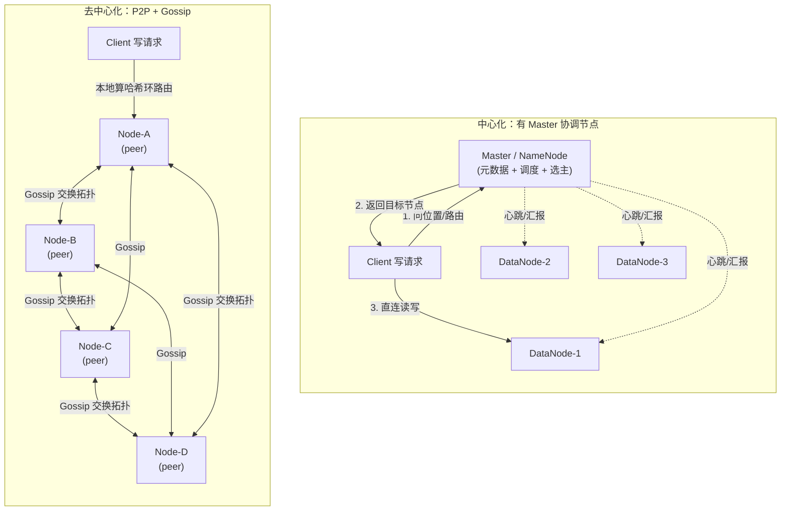
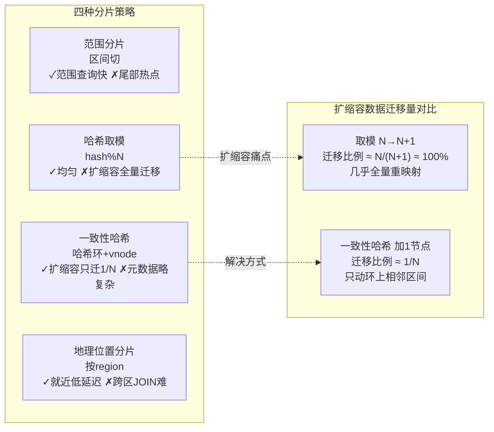
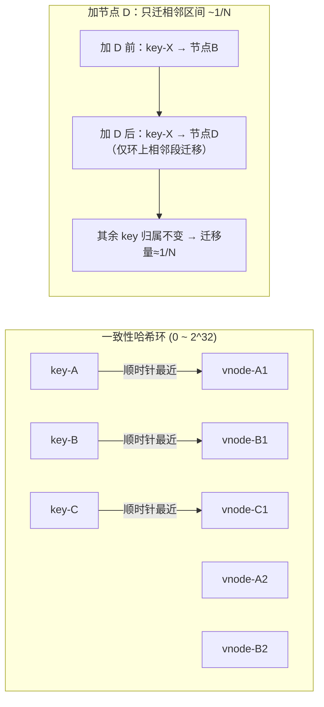
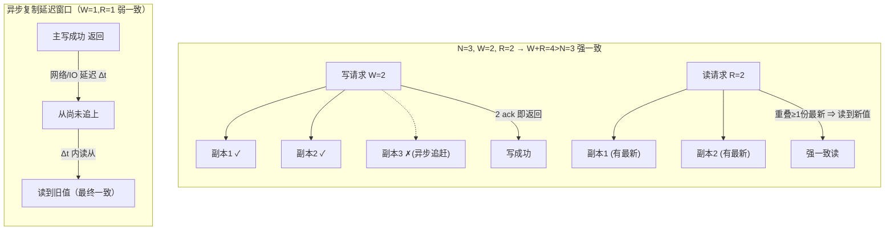
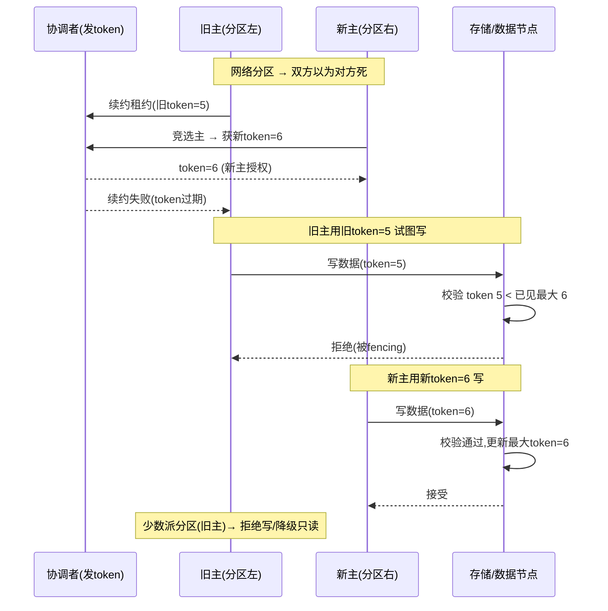
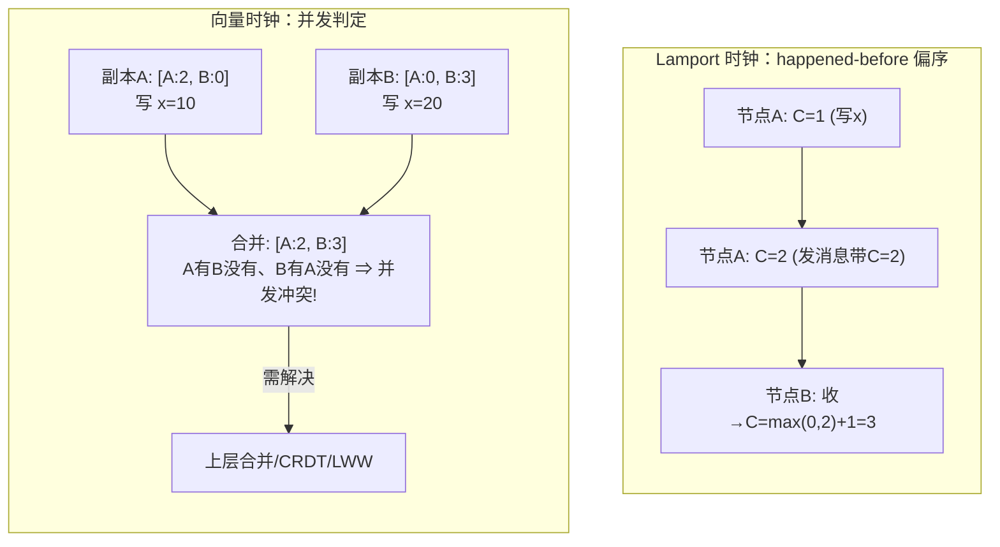
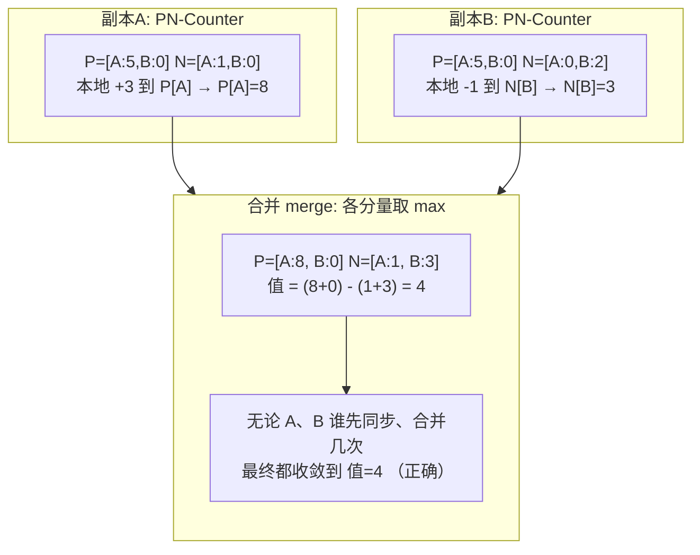
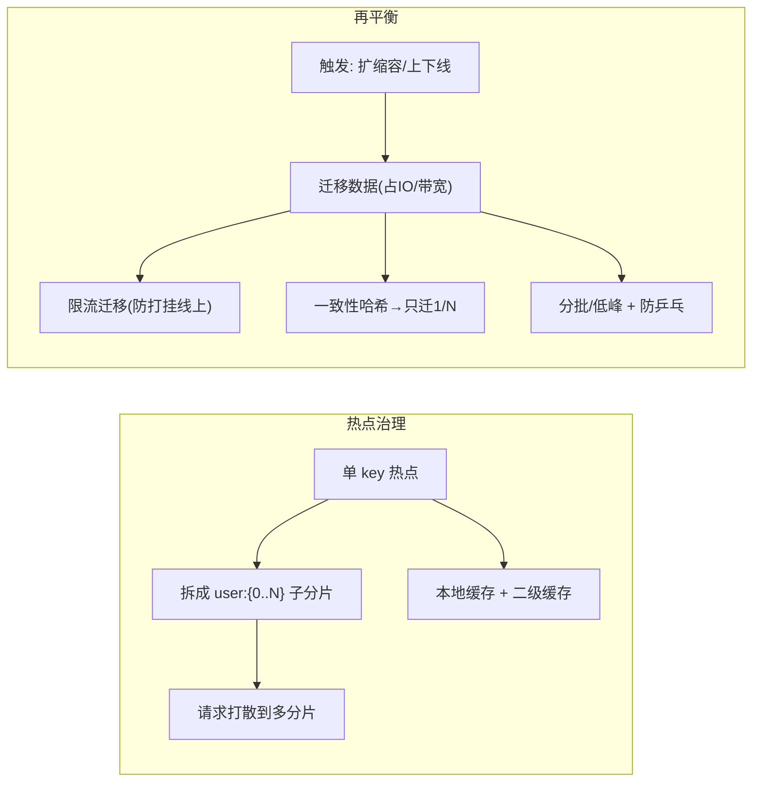
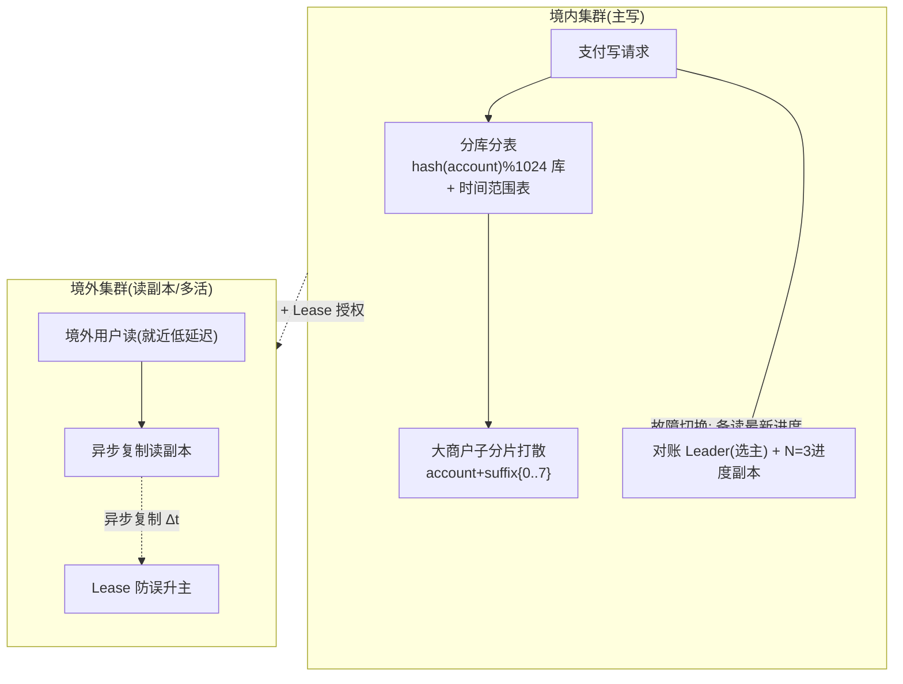

> 本文定位：**分布式集群架构专项深化**。聚焦「集群如何组织数据、如何路由、如何容错、如何保持一致」这一条工程主线。
> 不深入共识算法内部（Raft/Paxos 单列专题），而是把 **拓扑范式 / 分片 / 路由 / 一致性哈希 / 复制 / 故障处理 / 逻辑时钟 / CRDT** 这些"集群工程"主题串起来，并落到 Kafka / Elasticsearch / Redis Cluster / Cassandra 四大真实系统的设计差异上。
> 作者 ｜ 10 年 Java 后端工程师，内容基于多个一线互联网公司的真实项目实战沉淀。
---

## 0. 本文在知识体系中的位置

面试中"分布式"是个筐，但真正区分深度的，是你能不能把下面这根主线讲清楚：

```
数据如何切（分片）→ 请求如何找（路由/一致性哈希）→ 数据如何冗余（复制/NWR）
   → 节点挂了怎么办（故障检测/脑裂/fencing）→ 副本并发写怎么办（时钟/CRDT）
```

本文就是这条主线的完整工程版。它与本系列其他文章的关系是：

| 文章 | 聚焦点 | 本文与之的边界 |
|------|--------|----------------|
| 分布式事务与一致性 | 跨服务业务一致性（2PC/TCC/Saga/消息表） | 本文不谈业务事务，只谈集群内副本复制 |
| RPC 微服务治理 | 服务发现/限流/熔断/链路 | 本文只谈"数据集群"而非"服务集群" |
| Raft 与 Paxos | 共识算法内部 | 本文只把共识当作集群的"协调者选举"黑盒 |
| **本文** | **数据集群拓扑/分片/路由/复制/容错/时钟/CRDT** | — |

> 一句话边界：**本文关心"数据放在哪、怎么找、挂了怎么兜底、多副本怎么不打架"，不关心"多个微服务之间怎么保证一笔业务原子提交"。**

---

## 1. 集群架构范式：中心化 vs 去中心化

一个分布式数据集群首先要回答：**谁来决定"数据在哪个节点"？** 这决定了整个系统的拓扑形态。

### 1.1 中心化（Centralized / Master-Coordinator）

存在一个（或一组）**协调节点（Master / NameNode / Controller）**，它掌握全量元数据（哪些数据在哪些节点、节点存活状态、负载），所有读写请求先问 Master 或直接由 Master 指派。

- **代表系统**：HDFS NameNode、Elasticsearch Master、Kafka Controller、ZooKeeper（leader 即协调者）、MongoDB 副本集 Primary。
- **优点**：
  - 元数据集中，路由决策简单、一致性强（全局视图唯一）。
  - 再平衡、故障转移由 Master 统一调度，逻辑清晰、易排查。
  - 客户端协议简单（问 Master 要位置即可）。
- **缺点**：
  - **Master 是瓶颈与单点**：所有元数据操作、调度都过它；大集群下元数据规模受限。
  - **选主期间集群不可用或只读**：Master 挂 → 重新选主（秒级到分钟级）→ 期间无法变更拓扑。
  - 运维心智负担：要专门做 Master 高可用（ZK 选主、共享存储等）。

> 工程现实：**绝大多数生产系统采用"中心化 + 协调者高可用"**，因为中心化在正确性上太省心。去中心化更多是"规避单点"的极致追求。

### 1.2 去中心化（Decentralized / P2P + Gossip）

没有全局 Master，所有节点**对等（peer）**，元数据通过 **Gossip 流言协议**在节点间扩散，每个节点最终持有（近似）一致的全局视图。

- **代表系统**：Redis Cluster、Cassandra、DynamoDB、Consul（部分）、Riak。
- **Gossip 原理**：节点周期性随机挑几个邻居，交换彼此知道的"节点状态/数据分布"摘要，像病毒传播一样几跳内扩散全网。数学上约 `log(N)` 轮即可收敛。
- **优点**：
  - **无单点**，任意节点挂掉不影响集群整体拓扑可用性。
  - 水平扩展极顺滑，加节点不用动"中心"。
  - 容错域天然分散。
- **缺点**：
  - **元数据最终一致，存在窗口期**：你刚加的节点，部分节点可能还不知道 → 路由可能短期错。
  - 调试难：没有"唯一真相源"，排查"谁说数据在这"要靠各节点状态拼接。
  - 一致性保证弱（通常只保证最终收敛），强一致读需要额外 Quorum 机制。

### 1.3 两种范式拓扑对比



> 面试金句：**中心化用"一个大脑"换正确性，去中心化用"全员流言"换无单点；生产选型本质是在"正确性心智成本"和"单点风险"之间做权衡。**

---

## 2. 数据分片（Sharding）：为什么切、怎么切

### 2.1 为什么必须分片

单机在三个维度上有硬上限，跨过去只能靠"把数据摊到多台机器"：

- **容量上限**：单盘 4T/8T，百亿级订单流水、PB 级日志放不下。
- **计算/IO 上限**：单实例 CPU、连接数、IOPS 触顶，QPS 上不去。
- **可用性上限**：单实例挂 = 全量不可用，分片后单分片故障只影响 1/N 数据。

分片（Sharding）= 把逻辑上的"一张大表/一个主题"按某种规则切到 N 个物理节点，每个节点只管自己那一份。

> 关键区分：**分片（Sharding）解决"数据放哪"；分区（Partition）在很多系统里是同义词（Kafka 叫 partition，ES 叫 shard，Cassandra 叫 vnode）——本质都是"子集"。本文统一用"分片"指代这个子集概念。**

### 2.2 四种分片策略

#### (1) 范围分片（Range Sharding）

按 key 的区间切：`[0,1000)→节点A，[1000,2000)→节点B`。

- **优点**：范围查询极快（查 500~800 只落一个节点）；天然有序。
- **缺点**：**极易热点**——自增 ID / 时间字段做 key 时，新写入永远砸在最后一个区间（尾部热点）。
- **代表**：HBase Region（按 rowkey 区间）、MongoDB 早期 range shard、TiDB 的 Region（也是 range，但靠 PD 自动分裂均衡）。

#### (2) 哈希分片（Hash / 取模）

`node = hash(key) % N`。

- **优点**：分布均匀，无尾部热点。
- **缺点**：**扩缩容灾难**——N 变了，几乎所有 key 的 `hash(key) % N` 都变 → **全量数据重映射迁移**。
- **代表**：早期简单分库分表、`hash(uid) % 1024`。

#### (3) 一致性哈希（Consistent Hashing）

见第三章，专治取模的"扩缩容全量迁移"。

#### (4) 地理位置分片（Geo / Locale Sharding）

按用户属地 / region 切：`region=CN→集群A，region=US→集群B`。

- **优点**：**跨境低延迟**（用户就近读写）；满足数据主权合规（数据不出境）。
- **缺点**：**跨区 JOIN / 聚合极难**（要跨地域 shuffle）；热点取决于地区人口/业务密度。
- **代表**：多活架构、AWS 多 region 部署、本文 XTransfer 跨境多活。

### 2.3 四种策略取舍与扩缩容代价对比



| 维度 | 范围分片 | 哈希取模 | 一致性哈希 | 地理位置 |
|------|---------|---------|-----------|---------|
| 数据均匀性 | 差（易热点） | 好 | 好（vnode 后） | 取决于分布 |
| 范围查询 | 优 | 差 | 差 | 中 |
| 扩缩容迁移量 | 局部 | **全量** | **仅 1/N** | 按 region |
| 跨分片聚合 | 易 | 难 | 难 | 极难（跨地域） |
| 典型系统 | HBase | 早期分表 | Redis/Cassandra | 多活 |

> 面试逻辑链：**取模均匀但有扩缩容硬伤 → 一致性哈希用"环"把"离散取模"变"连续区间" → 加节点只切走相邻一段 → 迁移量降到 1/N。**

### 2.4 一个具体数字：取模 vs 一致性哈希迁移量

假设现有 100 个分片（N=100），要扩到 101（N=101）：

- **取模**：一个 key `k` 的归属是 `hash(k) % N`。N 从 100 变 101，只有满足 `hash(k) % 100 == hash(k) % 101` 的 key 才不迁移，而这要求 `hash(k)` 是 `lcm(100,101)=10100` 的倍数——**约 1/101 的 key 能幸免，约 99% 的 key 需重新映射并迁移**。100 个分片、百亿 key，意味着近全部数据要挪一遍。这在生产上是"停机级"事件。
- **一致性哈希**：加第 101 个节点，只把环上"顺时针紧邻它"的那段区间（约 `1/101` 的总数据量）迁过来；其余 100 个节点的数据**原地不动，路由表无需重算**。迁移量从"近 100%"降到"约 1%"，且可平滑限流完成，**无需停写**。

这就是为什么"能在线扩缩容"的分布式存储几乎都选一致性哈希或其变体（slot/vnode），而简单取模只适合"分片数永久不变"的静态场景（如固定 1024 表的库内分表）。

> 注意一个常见误区：**取模分片在"分片数不变"时是均匀的、且计算极快**，并非一无是处——它的问题是"N 可变"。所以如果你的分片数上线后永不改（如 `hash(uid) % 1024` 库的子表固定），取模完全够用，不必强行上一致性哈希。一致性哈希的价值在"N 会变"的场景。

---

## 3. 一致性哈希（重点）：环、虚拟节点、局部迁移

这是本文的硬核重点。很多工程师知道"一致性哈希能减少迁移"，但说不清**为什么是环、为什么需要虚拟节点**。下面把数学直觉讲透。

### 3.1 哈希环：把"取模"变成"连续寻址"

- 取一个固定哈希空间（通常 `2^32`，即 `0 ~ 2^32-1`），想象成**首尾相连的环（ring）**。
- **节点映射**：把每个物理节点的标识（IP/名字）哈希到环上，得到若干"节点点"。
- **数据 key 映射**：把数据 key 也哈希到环上，得到"数据点"。
- **路由规则**：**从 key 所在位置顺时针走，遇到的第一个节点点，就是该 key 的归属节点**（"顺时针最近"）。

这样设计的精妙在于：**节点数是变量，但哈希空间是常量 `2^32`**。增删节点只是在环上"增删几个点"，只会影响环上相邻区间的 key，与"总节点数 N"解耦——而取模方案里 N 直接写在公式 `hash % N` 里，N 一变全崩。

### 3.2 虚拟节点（vnode）：解决"数据倾斜"

朴素一致性哈希的致命问题：**节点在环上分布不均匀**（尤其节点少时），导致某些节点管一大片、某些管一小片 → 数据倾斜、热点。

**解法：虚拟节点**。每个物理节点映射成 `K` 个虚拟点（如 Cassandra 默认 256 个 vnode），随机打散在环上。

- 物理节点 A 的 256 个 vnode 散布在环各处，key 落到任意 vnode 都归属 A。
- vnode 越多，物理节点在环上的"覆盖弧长"越趋于相等 → **统计上均匀**。
- 同时 vnode 让**单物理节点故障的负载能被多段分担**到其他节点，而非整段砸给一个邻居。

### 3.3 扩缩容：只迁相邻区间（约 1/N）

- **加节点**：新节点在环上占几个 vnode 位置 → 只把"顺时针紧邻它"的那几个区间的 key 迁过来，**其余 key 不动**。理论迁移量 ≈ `1/(N+1)`。
- **删节点**（下线/故障）：该节点的 key 顺时针滑给下一个节点，只迁它的那一份。

对比取模：N→N+1，`hash(key)%(N+1)` 与原 `hash(key)%N` 几乎全错配 → 几乎 100% 重映射。

### 3.4 哈希环 + 路由 + 虚拟节点 + 局部迁移图



### 3.5 工业落地形态（重要：不是"裸环"）

很多系统**不直接用裸哈希环**，而是用"槽位（slot）"这种工程变体，思想同源：

- **Redis Cluster**：固定 **16384 个 slot**，每个节点负责一部分 slot；key 经 `CRC16(key) % 16384` 落到 slot，slot 再映射到节点。加节点 = 把部分 slot 从老节点 migrate 到新节点。**本质是一致性哈希的工程离散化：槽位 = 离散化的环区间，迁移粒度是 slot 而非单 key，工程上更易管理。**
- **Cassandra**：直接用 vnode（默认 256 个/节点），是真·一致性哈希 + 虚拟节点。
- **Dubbo 一致性哈希负载均衡**：对调用参数（如 userId）做一致性哈希，保证**同一用户的请求落到同一 provider**（会话粘滞、本地缓存命中），provider 扩缩容只影响 1/N 用户。

> 面试金句：**"一致性哈希的核心不是环本身，而是把节点数从路由公式里解耦出来，使扩缩容只影响局部。Redis 的 16384 slot 是它把连续环离散成 16384 个可迁移单元的工程实现。"**

### 3.6 一个人工演算：环上怎么走

设哈希空间为 `0~11`（仅为演示，真实是 `2^32`），有三个节点和一个 key：

```
环(0..11)顺时针: 0 → 1 → 2 → ... → 11 → 0
节点:  A 在 2,  B 在 5,  C 在 9
key-X hash = 7
```

- key-X(7) 顺时针走：7→8→9，遇到第一个节点点 **C(9)** → key-X 归 C。
- key-Y hash = 3：3→4→5，遇 **B(5)** → 归 B。
- **现在加节点 D 在 7**（正好插在 C[9] 之前、B[5] 之后）：key-X(7) 顺时针第一个节点点变成 **D(7)** → key-X 从 C 迁到 D。key-Y(3) 仍归 B，其余所有 key 归属不变。
- 迁移的只有"落在区间 (5, 7]"的 key（原归 C，现归 D），即环上一小段 ≈ `1/(N+1)`。

这个演算就是"局部迁移"的微观真相：**节点只是环上的"隔板"，加一块隔板只改变它左边那一段的归属**。

### 3.7 一致性哈希的工程坑

- **元数据传播**：去中心化系统里，新节点的 vnode 位置要靠 gossip 扩散，扩散完成前部分节点仍按旧环路由 → 短期可能写到"旧归属"，需读时修复或等收敛。Redis Cluster 用 `MOVED`/`ASK` 重定向协议让客户端感知 slot 迁移中。
- **vnode 数权衡**：太少仍倾斜，太多则元数据/gossip 开销大。Cassandra 默认 256 是经验值；Redis 16384 slot 也是平衡"迁移粒度"与"元数据大小"的结果。
- **删除节点的"环塌缩"**：节点下线后它管的区间顺时针滑给邻居，若该邻居本就满载，会瞬间承接双倍负载 → 需配合限流与逐步迁移。vnode 把这份负载分散成多段，缓解但不消除。

### 3.8 哈希函数与负载均匀的细节

一致性哈希的均匀性依赖两点：① 哈希函数本身质量（分布均匀、无偏）；② vnode 数量。工业界常用：

- **MurmurHash / CRC16**：Redis 用 `CRC16(key) % 16384`；Cassandra 用 Murmur3。这些函数雪崩性好、计算快、分布均匀。
- **不要用 `Object.hashCode()` / `md5`**：Java `hashCode` 在哈希环场景分布尚可但需再映射；MD5 慢且对均匀性无额外收益。
- **vnode 数经验值**：Cassandra 256、Redis 16384 slot。vnode 越多越均匀，但每个 vnode 的元数据（token 范围、归属）要存和传播，gossip 开销随 vnode 数线性增——**256 是"均匀性"与"元数据成本"的甜点**。

---

## 4. 副本与复制（Replication）：冗余、配额、Quorum

分片解决"数据放哪"，**副本解决"放几份、怎么保持一致"**。单机可靠性 ≈ 0，必须冗余。

### 4.1 主从复制（Single-Leader / Primary-Replica）

- 一个主（leader/primary）负责写，多个从（follower/replica）异步或半同步追主。
- **读**：可走从（读写分离，扩读吞吐）；**写**：只走主（避免写冲突）。
- **优点**：写模型简单，无冲突；读可水平扩展。
- **缺点**：主是写瓶颈 + 单点（需选主）；从落后时有**读旧值**窗口。

代表：MySQL 主从、Kafka partition leader、ES primary shard、Redis 主从。

### 4.2 多主复制（Multi-Leader）

- 多个节点都能写，副本间互相同步。
- **优点**：就近写（多活）、单点写瓶颈消失。
- **缺点**：**写冲突不可避免**——两个主同时改同一行 → 必须冲突解决（LWW 最后写入获胜 / 向量时钟 / CRDT）。
- 代表：Cassandra、Galera Cluster、多活数据库。

### 4.3 NWR 配额模型（核心）

Dynamo/Cassandra 提出的经典模型，用三个数描述一致性强度：

- **N**：一条数据的副本总数（如 N=3，写 3 份）。
- **W**：一次写操作需要**确认**的副本数（ack 数）。
- **R**：一次读操作需要**询问**的副本数。

**关键不等式**：

```
W + R > N   ⇒ 读写必然有副本重叠 ⇒ 读一定能见到最新写 ⇒ 强一致（线性化读）
W + R <= N  ⇒ 读写可能不重叠 ⇒ 可能读到旧值 ⇒ 最终一致
```

举例：`N=3, W=2, R=2` → `W+R=4 > 3` → 读的两个副本里至少有一个是刚被写确认的那份 → 读到最新。**`N=3, W=1, R=1` → 弱一致，写一份就算成功，读一份可能读到旧。**

> 工程直觉：**W 越大越"写安全但写慢/写可用性低"；R 越大越"读新但读慢"；用 W+R>N 换强一致，用 W+R<=N 换高可用低延迟。**

### 4.4 Quorum 读写与版本比较

即便 `W+R>N`，仍可能因并发写产生**多版本**。读时需：

1. 向 R 个副本读，取**版本号最大（或向量时钟最新）**的。
2. 若读到多个版本（并发写冲突），触发**读修复（read repair）**：把最新版回写其他副本，或交给上层（应用/CRDT）合并。

### 4.5 同步复制 vs 异步复制

| 维度 | 同步复制 | 异步复制 |
|------|---------|---------|
| 持久性 | 强（主从都落才返回） | 弱（主落即返回，从可能丢） |
| 写延迟 | 高（等从 ack） | 低 |
| 主挂丢数据 | 极少 | 可能丢未同步部分 |
| 代表 | MySQL 半同步、Kafka acks=all + min.insync | MySQL 异步、Redis 主从默认 |

### 4.6 NWR 配额与异步复制延迟窗口图



> 面试金句：**NWR 是一致性与可用性的"旋钮"：把 W、R 调大逼近 N 就强一致但慢，调小就快但最终一致。异步复制的 Δt 窗口，就是"最终一致"在现实里的时间长度。**

---

## 5. 故障处理与脑裂防护（Split-Brain / Fencing）

集群节点会挂、网络会分区。这一节讲的是**"错误发生后如何不雪崩、不双写、不数据撕裂"**。

### 5.1 故障检测：心跳 + 超时

- 节点间周期性发**心跳（heartbeat）**；超过 `timeout` 未收到 → 标记 suspect → 多数派确认后标记 dead。
- **误判防护**：不能因为自己收不到心跳就单方面的"判对方死"（可能是自己网络问题）。需要**多数派（quorum）共同确认**才真正下线某节点，避免"假性故障"触发错误再平衡。

### 5.2 脑裂（Split-Brain）：最危险的故障

**定义**：网络分区把集群切成两半，**每一半都以为另一半挂了**，于是两边都**各自选出一个主（leader）** → 出现**双主** → 两边都接受写 → 数据被撕裂成两叉，且之后无法自动合并。

典型场景：Redis Cluster 网络分区、ZK 脑裂（早期）、MySQL 双主。

### 5.3 脑裂防护：Fencing（围栏）

**核心思想：即使出现双主，也要让"旧主"无法再写数据——用一个单调递增、全局不可伪造的"围栏令牌"锁住资源。**

**fencing-token 流程**：

1. 每个 Leader 当选时，从协调者（如 ZK）获取一个**单调递增的 token**（epoch / fencing-token）。
2. 每次写存储，都带上 token；存储层（或代理）记录"已接受的最大 token"。
3. 若旧主网络恢复、试图用旧的（更小的）token 写 → 存储层拒绝（`token < 已见最大`）。
4. 于是即使旧主"以为自己还活着"，它的写也被**物理挡掉**，数据不会被撕裂。

**其他 fencing 手段**：

- **磁盘锁 / 共享存储锁**：只有持锁者能写共享盘（如 Pacemaker、DB 的 STONITH 思路）。
- **STONITH（Shoot The Other Node In The Head）**：直接给"疑似僵死"的节点断电/重启——最暴力但最可靠。
- **min-replicas-to-write（最小副本写）**：如 Redis 配置 `min-replicas-to-write 2`，主若连不上足够从节点，**拒绝写入**（宁可停写也不产生脑裂双写）。这是用"写可用性换防撕裂"。

### 5.4 租约（Lease）：带过期的时间段授权

- Leader 向协调者申请一个**租约 = "在 T 秒内我有权做主"**。
- 租约到期前必须续约；**不续约自动失效**，避免"主挂了但授权无限期有效"导致长期脑裂。
- 租约把"谁是当前主"的真相做成**带 TTL 的临时状态**，天然容错。

### 5.5 仲裁（Quorum）降级

- 多数派（> N/2）才能决策；**少数派分区自动降级为只读 / 拒绝写**，避免双写。
- ZK/Zab、etcd/Raft 都靠"少数派拒绝写"根治脑裂。

### 5.6 脑裂产生 + Fencing 防护 + 多数派降级图



> 面试金句：**脑裂的本质是"虚假的多数派各自授权"，根治手段是"让旧主的写被存储层用 fencing-token 物理拒绝 + 少数派分区禁止写"。fencing-token 单调递增且存储层记最大值，是防双写数据撕裂的终极工程手段。**

---

## 6. 因果一致性与逻辑时钟

副本并发写时代，**"谁先谁后"不能靠墙上时钟判断**——物理时钟在分布式下不可信。

### 6.1 物理时钟为什么不可靠

- **时钟漂移**：每台机器晶振速率不同，时间会越走越偏。
- **NTP 跳跃**：NTP 校时会**突然回拨或快进**，导致"后发生的事件 timestamp 反而更小"。
- 结论：用 `System.currentTimeMillis()` 给分布式事件排序 = 埋雷。

### 6.2 Lamport 逻辑时钟

Lamport（1978）提出纯计数器时钟：

- 每个节点维护一个计数器 `C`。
- **本地事件**：`C = C + 1`。
- **发消息**：带 `C`；**收消息**：`C = max(本地C, 收到的C) + 1`。
- 得到 **happened-before（→）** 偏序关系：若 `a → b` 则 `C(a) < C(b)`。**反之不成立**（`C` 大不代表一定因果在后，可能并发）。

Lamport 只能告诉你"一定在前"的事件，无法区分"并发"。

### 6.3 向量时钟（Vector Clock）

给每个节点一个**计数器分量**，向量长度 = 节点数。`VC_i[j]` 表示"节点 i 已知节点 j 发生过多少事件"。

- **本地事件**：`VC[i] += 1`。
- **发消息**：带整个向量；**收消息**：各分量取 `max`。
- **比较两事件**：
  - 所有分量 `≤` 且至少一个 `<` → **有因果关系**（一方先于另一方）。
  - 存在分量你大我小、我又大你小 → **并发（concurrent）** → 冲突，需要解决。

**用途**：Dynamo / Cassandra 用向量时钟检测"这两个写是并发冲突还是先后因果"，并发的就标记多版本让上层合并（或 CRDT 合并）。

### 6.4 一致性强度谱系（再强调，避免与事务篇混淆）

| 级别 | 含义 | 典型 |
|------|------|------|
| 线性一致 | 全局实时有序，像单机 | 单主同步复制、etcd |
| 因果一致 | 有因果关系的事件有序，并发不保证 | Cassandra（可调）、Dynamo |
| 最终一致 | 最终收敛，期间可能旧 | DNS、Redis 异步从、大部分多活 |

### 6.5 Lamport 递增 + 向量时钟合并/冲突图



> 面试金句：**物理时钟不可信（漂移+NTP跳跃）；Lamport 时钟给出因果偏序但分不清并发；向量时钟用"每节点一个分量"精确区分"有因果"还是"真并发"，是 Dynamo 系冲突检测的根基。**

---

## 7. CRDT 与无冲突复制（Conflict-free Replicated Data Type）

多活 / 离线场景下，副本并发写是常态。传统做法（锁、LWW、人工合并）要么牺牲可用，要么丢更新。**CRDT 用数学结构让并发更新"无论如何顺序、无论到达先后，合并结果都一致且正确"**。

### 7.1 核心思想

- 副本状态是某种**可交换、可结合、可幂等**的数据结构。
- 任意两个副本状态做 `merge(a, b)`，无论 a、b 谁先到、合并几次，结果都收敛到**同一个最终状态**。
- 数学保证：`merge` 满足**交换律 + 结合律 + 幂等**（一个 join-semilattice），所以"并发 / 乱序 / 重复"都不怕。

### 7.2 两类 CRDT

**状态型（CvRDT）**：直接传**全量状态**，接收方 `merge`。简单、带宽大但实现易。

- **G-Counter（增长计数器）**：每个节点一个累加分量，总和 = 各分量之和。两副本合并 = 各分量取 `max`。天然无冲突。
- **PN-Counter（正负计数器）**：两个 G-Counter（P 增、N 减），值 = P - N。支持减。
- **G-Set（只增集合）**：只能 add，合并 = 并集。

**操作型（CmRDT）**：传**操作**（如 `+1`、`add(x)`），接收方重放。带宽小，但要求操作**可靠投递且幂等**。

- **Add-Wins Set（AWSet）**：并发 add 同一元素都保留；remove 需携带"被删元素的 add 标记"才能删，避免"删了又被并发 add 复活"的歧义（add 赢）。

### 7.3 适用场景

- **多活写**（多地都能写同一份）、**离线同步**（先本地改，联网后合并）、边缘计算。
- 代表：**Redis 企业版 CRDB（Active-Active）**、**Riak**（基于 CRDT）、**SoundCloud Roshi**、协作编辑（OT/CRDT）。

### 7.4 局限

- 只适合**可数学合并**的数据结构；需要"业务语义合并"（如"库存不能超卖""金额要按规则算"）时，CRDT 不够，要配合应用逻辑。
- 状态型传全量，**大状态带宽成本高**；操作型依赖可靠投递。
- 不适合强事务约束的金融核心（但可用于"最终一致计数器/收藏数/点赞数"等非核心）。

### 7.5 PN-Counter 并发合并示例图



> 面试金句：**CRDT 把"并发冲突"变成"数学可合并"——只要数据类型满足交换律/结合律/幂等（join-semilattice），随便乱序、重复、并发，合并结果都收敛且正确。它适合多活/离线写的计数器、集合类，不适合需要业务语义强约束的金融核心。**

### 7.6 操作型 CRDT（CmRDT）示例：Add-Wins Set

状态型传全量、带宽大；操作型只传"做了什么操作"。以 AWSet 为例：

- 每个元素 `e` 被 add 时，附带一个**唯一 tag**（如 `(replicaId, 序号)`），如 `tag(e)=A@5`。
- **add(e, tag)**：把 `e` 及其 tag 加入集合。
- **remove(e)**：记录"删除的是 tag(e)"（而非简单删元素本身）。
- **并发冲突消解**：若副本 A `add(e)` 与副本 B `remove(e)` 并发（B 删的是旧 tag，而 A 带来了新 tag），**add 获胜**——因为删的是旧标记，新 tag 的元素仍保留。这避免了"我刚加的又被并发删复活/丢失"的歧义。
- **幂等**：同一操作因网络重试到达多次，因带唯一 tag，重复应用结果不变。

### 7.7 CRDT vs 传统冲突解决对比

| 方案 | 并发写结果 | 可用性 | 复杂度 | 适用 |
|------|-----------|--------|--------|------|
| LWW（最后写入获胜） | 赢家通吃，可能丢更新 | 高 | 低 | 不关心丢更新的场景 |
| 锁/事务 | 串行化，无冲突 | 低（要协调） | 高 | 强一致核心 |
| 人工/应用合并 | 业务决定 | 中 | 高 | 复杂语义 |
| **CRDT** | **数学合并，无丢失** | 高 | 中（需选对结构） | 多活/离线/计数器集合 |

### 7.8 工程落地提醒

- **Redis 企业版 CRDB（Active-Active）**：底层用 CRDT 实现多地多活，计数器/集合类天然合并；但**字符串/String 类型是 LWW 语义**（后写覆盖），不是 CRDT——别误以为所有类型都无冲突。业务要"无冲突计数"得用专门的 CRDB counter 类型。
- **Riak**：最早把 CRDT 做进 KV 存储，提供 counter/set/flag 等 CRDT 类型。
- **前端协作（OT/CRDT）**：如 Yjs、Automerge 用 CRDT 做协同编辑，思想同源——把"文档操作"做成可交换合并的结构。

---

## 8. 真实系统对照：Kafka / ES / Redis Cluster / Cassandra

把前面概念落到四大系统，看工业界怎么"组合拳"。

### 8.1 Kafka

- **分片**：**partition**，每个 topic 分多个 partition；producer 按 `key` 哈希（`hash(key) % numPartitions`）或 round-robin 决定 partition → **哈希分片**（不是一致性哈希，是简单取模，但 partition 数相对稳定，扩 partition 需手动）。
- **复制**：partition 有 **leader + ISR（in-sync replicas）followers**；写只走 leader，follower 拉取同步。
- **配额**：`acks=all` + `min.insync.replicas`（如 2）→ 保证消息写入至少 2 个 ISR 才算成功（类似 W 配额）。
- **容错**：leader 挂 → controller 从 ISR 选新 leader；unclean leader election 关掉以防丢消息。

### 8.2 Elasticsearch

- **分片**：**index → shard**（默认 `hash(routing) % num_shards`，routing 默认 `_id`）；primary shard 不可改数量（7.x 后支持 split/shrink）。
- **复制**：每个 primary 配 `replica`；写 primary，同步到 replica（可配置同步/异步）。
- **协调**：有 **Master 节点**管元数据 + **协调节点**路由请求（中心化范式）。
- **容错**：primary 挂 → Master 把某 replica 提升为 primary。

### 8.3 Redis Cluster

- **分片**：**16384 个 slot**；`CRC16(key) % 16384` 定位 slot，slot 映射到节点。增删节点 = 迁移部分 slot（**一致性哈希的工程离散化**）。
- **复制**：每个 master 可有 replica；master 挂 → replica 提升（靠 gossip + 故障检测 + 多数派投票）。
- **容错**：`cluster-require-full-coverage no` 时部分 slot 不可用不影响其他；`min-replicas-to-write` 可防脑裂双写。
- **去中心化**：纯 gossip，无中心 Master。

### 8.4 Cassandra

- **分片**：**vnode（默认 256/节点）**，真·一致性哈希 + 虚拟节点；token ring 管理。
- **复制**：可配**复制策略**（SimpleNetworkTopology）+ **副本数 N**。
- **一致性可调**：读写时指定 `ONE / QUORUM / ALL / LOCAL_QUORUM` → 即动态调 W、R 的 NWR 模型。
- **容错**：gossip 检测 + 虚节点让负载分散；使用**可调一致性**在延迟与强一致间取舍。
- **冲突**：用**向量时钟（tombstone + 版本）**标记并发写，读时多版本合并。

### 8.5 四大系统分片/复制对照可视化

```mermaid
graph TB
    subgraph KAFKA["Kafka"]
        direction TB
        K1["分片: Partition(哈希取模)"]
        K2["复制: Leader + ISR"]
        K3["配额: acks=all + min.insync.replicas"]
        K4["拓扑: Controller(类中心化)"]
    end
    subgraph ES["Elasticsearch"]
        direction TB
        E1["分片: Shard(hash(routing)%N)"]
        E2["复制: Primary + Replica"]
        E3["协调: Master + 协调节点(中心化)"]
        E4["容错: Master 提升 replica"]
    end
    subgraph REDIS["Redis Cluster"]
        direction TB
        R1["分片: 16384 slot(一致性哈希变体)"]
        R2["复制: Master + Replica"]
        R3["拓扑: 纯 Gossip(去中心化)"]
        R4["容错: 故障检测+多数派投票提主"]
    end
    subgraph CASS["Cassandra"]
        direction TB
        C1["分片: vnode 256(真一致性哈希)"]
        C2["复制: N副本 可调策略"]
        C3["一致性: ONE/QUORUM/ALL(NWR)"]
        C4["冲突: 向量时钟 + tombstone"]
    end
```



> 面试归纳：**Kafka/ES 走"中心化协调 + 哈希/区间分片 + 主从复制"；Redis Cluster/Cassandra 走"去中心化 gossip + 一致性哈希 + 可调 NWR"。设计差异本质是对"单点风险"和"强一致心智成本"的不同取舍。**

---

## 9. 【深度拓展】热点与再平衡（Rebalance）

分片不是"切完就完"。线上最痛的是**热点**和**再平衡卡住**。

### 9.1 热点分片（Hot Shard）

- **成因**：
  - 取模/一致性哈希下，某个 key 或某批 key 访问量远超其他（大 V、大商户、热点商品）。
  - 即使分布均匀，业务逻辑本身倾斜（如"双十一主会场"所有流量打同一 key）。
- **解法**：
  - **虚拟节点**缓解物理倾斜（但救不了"单 key 热点"）。
  - **key 拆分**：把单一热 key 拆成 `user:{1..N}` 多个子分片，请求随机/轮询打散（如 `hot_key_{0..99}`）。
  - **二级缓存**：本地缓存 + 读扩散；或热点 key 单独拎出来走专属集群。
  - **一致性哈希本身不均时**：调大 vnode 数、或对热 key 做"按时间/尾数二次哈希"。

### 9.2 再平衡（Rebalance）

- **触发**：扩缩容、节点上下线、负载不均。
- **代价**：迁移数据占带宽/IO/CPU → 影响线上读写（"再平衡风暴"）。
- **工程要点**：
  - **限流迁移**：控制迁移并发与带宽（如 Kafka 的 `reassignment` 限流、`throttled.replica.replicator`），避免把线上打挂。
  - **一致性哈希减少迁移量**：加 1 节点只迁 1/N，远比取模全量迁移友好。
  - **渐进式 / 分批**：先迁冷数据、低峰期迁热数据。
  - **防"乒乓再平衡"**：节点抖动导致反复迁移 → 加稳定阈值 / 冷却时间。

### 9.3 数据本地性（Data Locality）

- 跨地域多活下，**就近读副本**降延迟（如用户在欧洲读欧洲副本）。
- 代价是**副本滞后** → 读到旧值，需结合 Quorum / 版本号 / 业务容忍度决策。
- XTransfer 跨境多活即此思路（见第十章）。

### 9.4 再平衡带宽成本估算（面试可讲的数字感）

假设单分片 200GB，集群 50 分片共 10TB，扩容 10 个节点（N:50→60）：

- **取模方案**：N 变化 → 约 98% key 重映射 → 近 10TB 数据需迁移。千兆网卡（~100MB/s 有效）全量迁完 ≈ `10TB/100MB/s ≈ 100000s ≈ 28 小时`，且期间路由错乱、几乎不可用。
- **一致性哈希方案**：只迁 `10/60 ≈ 17% ≈ 1.7TB`，限流到 50MB/s → `1.7TB/50MB/s ≈ 34000s ≈ 9 小时`，且**其余 83% 数据在线可服务**，线上无感。
- **工程续命**：实际还会**分批 + 低峰 + 限流到不影响线上读写**（如迁移带宽限制在总带宽 10%），把 9 小时拉长到更温和的曲线，避免"再平衡风暴"压垮磁盘 IO。

> 数字感结论：**一致性哈希把"扩缩容"从"天级停机事件"降级为"小时级在线背景任务"，这是它成为分布式存储标配的根本原因。**

### 9.5 再平衡代价与限流迁移图



---

## 10. 【项目支撑】XTransfer 真实实战

以下来自 XTransfer 跨境支付收款平台 / 哈啰 / 欧凡 / 携程的真实工程经验，可作为面试"项目亮点"直接讲。

### 10.1 支付流水分库分表：范围 + 哈希混合

- **背景**：支付流水（收款/付款/充值）日增千万级，单库单表撑不住，且需按"账户查询"和"时间区间统计"两类查询。
- **分片键设计**：
  - **先按账户 ID 哈希**（`hash(account_id) % 1024` 库）→ 保证"某商户的所有流水落在同库"，账户维度查询不跨库。
  - **库内再按时间（月/日）范围**切表 → 时间区间统计只需扫相关表，冷热分离（热表索引小、冷表归档）。
  - **范围 + 哈希混合**：用哈希解决账户维度均匀，用范围解决时间查询与归档。
- **铁律**：**分片键必须进查询**（否则全库路由 → 广播查询，性能崩）。所有核心接口强制带 `account_id`。
- **热点大商户**：某头部商户流水占一整个分片 30% → 对该商户 ID **二次哈希打散到 8 个子分片**（`account_id + suffix{0..7}`），查询时按 uid 尾号路由，写时轮询，削平热点。

### 10.2 对账多副本：Leader 选举 + NWR 保证进度

- **背景**：T+1 对账任务（与银行/渠道对账）需多副本部署防止单点，但**任务不能跑两份**（重复对账会重复记账/重复告警）。
- **方案**：
  - 对账服务多副本，用协调者（如 ZK/etcd）做 **Leader 选举**，只有 Leader 跑对账任务（"一主多备"）。
  - 对账进度（已对账到哪个批次）写入**多副本存储（N=3）**，读用 `R=2`、写用 `W=2`（`W+R=4>3`）→ 备机接管时能读到最新对账进度，**不重不漏**。
  - Leader 挂 → 备机当选 → 从最新进度继续，避免从头对账。
- **价值点**：用 NWR 配额把"故障切换不丢进度"做成强保证，而非靠运气。

### 10.3 跨境多活：境内写、境外读副本 + Lease 防误升主

- **背景**：境内用户写、境外（如新加坡/欧洲）用户读自己的交易记录，要求低延迟；同时两地都要"活"（多活）。
- **方案**：
  - 境内主集群写，境外部署**异步复制的读副本**（就近读，降延迟）。
  - 防脑裂：**境外副本持有境内主发的 lease（带 TTL）**，lease 有效期内境外只读、不升主；lease 过期且境内确实不可达才允许境外提升为主（避免网络抖动误升主导致双写）。
  - 冲突兜底：跨境并发写极少（业务上按地域分流），偶发冲突用**幂等 + 版本号（乐观锁）**兜底，不依赖强一致。
- **价值点**：用"lease 防误升主 + 异步复制降延迟 + 幂等版本号兜底"组合，把"多活延迟"和"脑裂撕裂"都控住。

### 10.4 一次数据倾斜事故复盘

- **现象**：某大商户入驻后，相关分片 CPU/磁盘持续 90%+，其他分片闲，整体 QPS 上不去。
- **根因**：该商户流水集中在一个 `account_id` 哈希分片 → 单分片热点（上面 10.1 已预防性设计，但初期未对该商户启用子分片）。
- **应急**：临时把该商户路由加 `suffix` 二次哈希，打散到 8 个子分片；在线迁移该商户历史数据。
- **长效**：上线"**大商户自动识别 + 自动启用子分片**"机制，监控单分片 QPS/容量超阈值自动打散。

### 10.5 XTransfer 架构示意（综合）



---

## 11. 【面试官追问】（标准回答模板）

**Q1：一致性哈希解决了什么？为什么需要虚拟节点？**
> A：解决"取模分片扩缩容时几乎所有 key 重映射"的痛点。哈希环把节点数从路由公式解耦，加/删节点只迁移环上相邻区间（约 1/N）。但朴素环上节点少时分布不均→数据倾斜/热点，**虚拟节点让每个物理节点映射多个 vnode 随机散布环上，统计上打平负载，同时让单节点故障的负载被多段分担**。Redis 的 16384 slot 是其工程离散化。

**Q2：NWR 模型里 W+R>N 为什么能保证强一致？**
> A：W 是写需确认的副本数，R 是读需询问的副本数。W+R>N 意味着读集合与写集合**必有至少一个副本重叠**，于是读一定能碰到"刚被写确认的最新副本"，不会读到旧值→线性化强一致。W+R<=N 则读写可能不重叠→可能旧值→最终一致。本质是用"重叠"换正确性。

**Q3：脑裂怎么防？fencing-token 原理？**
> A：脑裂是网络分区导致双主双写、数据撕裂。防护三类：①**fencing-token**：主当选得单调递增 token，写存储带 token，存储层记"已见最大 token"，旧主用更小 token 写被拒→物理挡掉双写；②**多数派仲裁**：少数派分区禁写；③**min-replicas-to-write / STONITH** 兜底。fencing 的核心是"即使出现双主，也让旧主无法落地写"。

**Q4：向量时钟能解决什么？和 Lamport 时钟区别？**
> A：物理时钟不可信（漂移+NTP跳跃）。Lamport 时钟给因果偏序但**分不清并发**（C 大不一定真在后）。向量时钟每节点一个分量，比较可精确区分"有因果"还是"真并发"——并发就标记冲突交给上层/CRDT 合并。Dynamo/Cassandra 用它做并发写检测。

**Q5：CRDT 为什么能无冲突合并？什么场景不适合？**
> A：CRDT 的状态满足**交换律+结合律+幂等（join-semilattice）**，所以乱序、重复、并发合并都收敛到同一结果（如 G-Counter 各分量取 max，PN-Counter 增减小计）。适合多活/离线写的计数器、集合、点赞数等。不适合需要**业务语义强约束**的金融核心（库存超卖、金额规则），也不适合大状态全量同步带宽敏感场景。

**Q6：Kafka 的分区和 Redis Cluster 的槽位设计思想一样吗？**
> A：不一样。Kafka partition 是**简单哈希取模**（`hash(key)%N`），partition 数稳定、扩需手动，非一致性哈希；Redis 16384 slot 是**一致性哈希的工程离散化**（槽位=离散化的环区间，迁移粒度是 slot，扩缩容只迁部分 slot≈1/N）。思想上 Redis 借鉴了"解耦节点数"的一致性哈希，Kafka 没用环，更朴素。两者复制都是主从（leader/follower），但拓扑 Kafka 偏中心化 controller、Redis 纯 gossip。

---

## 12. 速查与实战

### 12.1 分片策略选型决策表

| 你的诉求 | 选哪种 | 注意 |
|---------|--------|------|
| 范围扫描多（时序/日志） | 范围分片 | 防尾部热点（自增 ID 要打散） |
| 追求绝对均匀、少范围查询 | 一致性哈希 | 必须配虚拟节点 |
| 跨境低延迟、数据合规 | 地理位置分片 | 跨区聚合/JOIN 难，需业务分流 |
| 简单、节点数恒定 | 哈希取模 | 扩缩容全量迁移，慎用于会变 N 的场景 |

### 12.2 NWR / Quorum 配置速查

| 目标 | 配置示例 | 效果 |
|------|---------|------|
| 强一致读 | N=3, W=2, R=2 (W+R>N) | 读写重叠，必读最新 |
| 高可用低延迟 | N=3, W=1, R=1 | 弱一致，可能旧值 |
| 写安全优先 | N=3, W=3, R=1 | 写慢但极持久，读可能旧 |
| 读新优先 | N=3, W=1, R=3 | 读慢但必最新，写快 |
| Cassandra QUORUM | LOCAL_QUORUM | 同数据中心多数派，兼顾延迟与一致 |

> 口诀：**W+R>N 强一致，调大 W 写慢更持久，调大 R 读慢更新鲜，二者皆小则快而最终一致。**

### 12.3 集群故障排查 SOP

**场景 A：疑似脑裂（双主/双写）**
1. 查协调者（ZK/etcd）当前 Leader 是谁，确认真实主。
2. 旧主是否仍持有 fencing-token / lease——若无，其写应被拒；若仍写成功→fencing 失效，立即隔离旧主网络。
3. 核对存储层"已见最大 token"，确认无新旧 token 混写。
4. 恢复后做数据对账（按版本号/时间戳扫描冲突版本）。

**场景 B：数据倾斜 / 热分片**
1. 监控确认单分片 QPS/容量/CPU 远超均值。
2. 定位热 key（大商户/大 V/热点商品）。
3. 临时：热 key 二次哈希打散到子分片 / 加本地缓存。
4. 长效：自动识别大 key + 自动子分片 + 限流。

**场景 C：再平衡卡住 / 迁移风暴**
1. 确认是否限流（Kafka reassignment throttle、Redis 迁移并发）。
2. 是否节点抖动导致乒乓再平衡——加冷却阈值。
3. 低峰期分批迁移冷数据优先。
4. 一致性哈希拓扑本就只迁 1/N，若仍卡，查网络/磁盘 IO 瓶颈。

### 12.4 一句话速记卡（面试前 30 秒过一遍）

- **拓扑**：中心化=单点换正确；去中心化=gossip 换无单点。
- **分片**：范围（热）/取模（扩缩容崩）/一致性哈希（只迁1/N）/地理（低延迟难聚合）。
- **一致性哈希**：环解耦 N、vnode 打平倾斜、slot 是工程离散化。
- **复制**：NWR，W+R>N 强一致；异步复制有 Δt 旧值窗口。
- **故障**：心跳+超时、脑裂用 fencing-token 物理拒旧主、lease 防误升主、多数派禁写。
- **时钟**：物理时钟不可信；Lamport 给偏序；向量时钟分因果/并发。
- **CRDT**：交换律+结合律+幂等 → 乱序并发都收敛；适合计数/集合，不适合金融强语义。
- **系统**：Kafka/ES 中心化+主从；Redis/Cassandra 去中心化+一致性哈希+可调 NWR。

---

## 13. 一句话总结

> **分布式集群的工程主线是"切（分片）→ 找（一致性哈希路由）→ 冗余（NWR 复制）→ 兜底（故障检测/脑裂 fencing/租约）→ 不打架（向量时钟/CRDT）"；中心化用单点换正确、去中心化用 gossip 换无单点，而 16384 slot、vnode、partition 都是这条主线在不同系统里的工程变体。**

---

*作者 ｜ 10 年 Java 后端工程师，内容基于多个一线互联网公司的真实项目实战沉淀。*