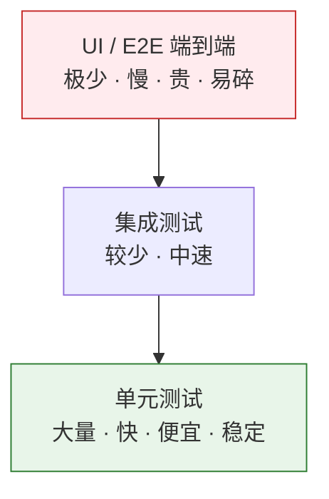
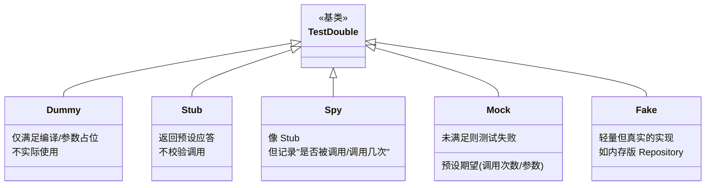
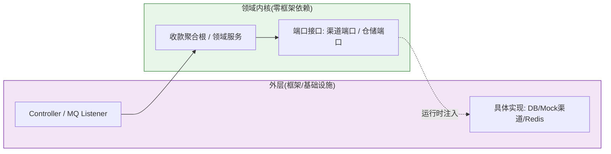
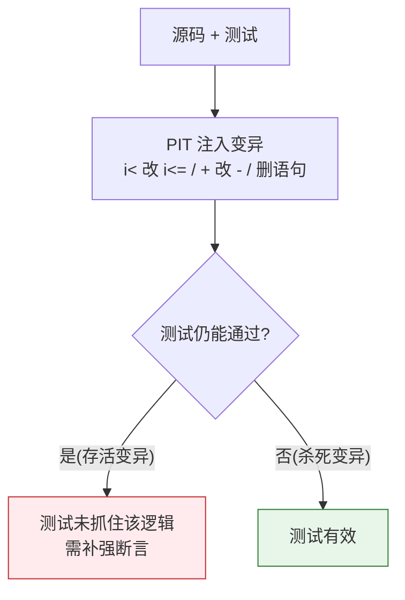
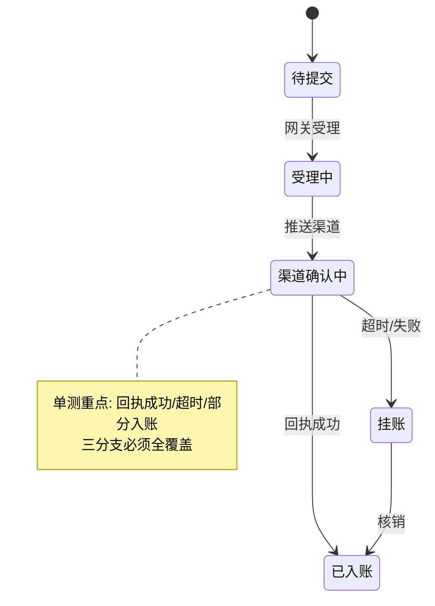
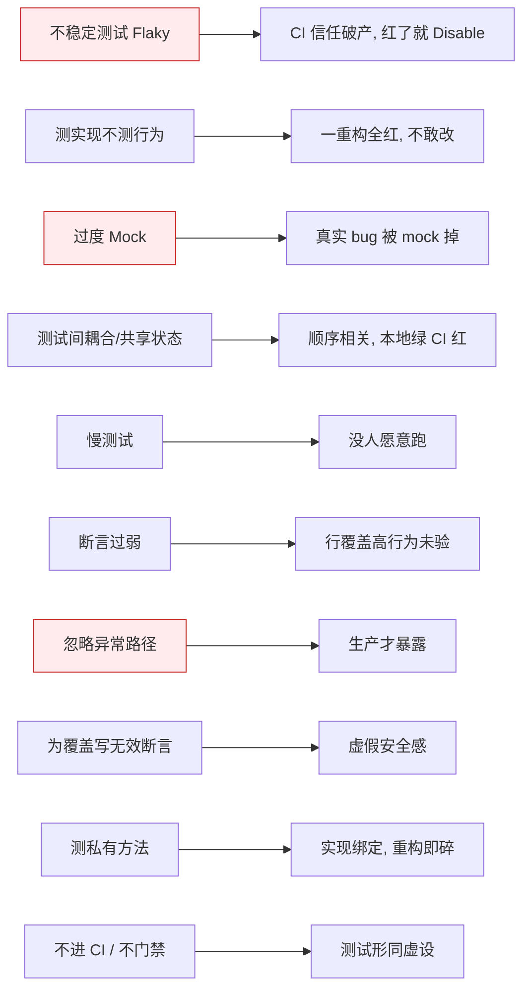
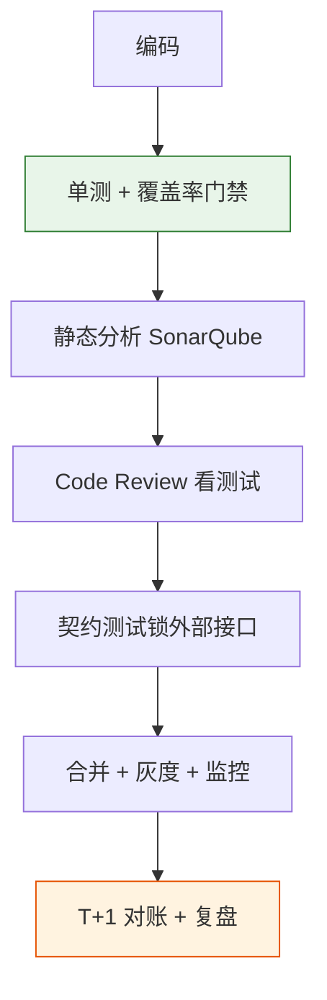

## 写在前面

很多 Senior 工程师把单元测试当成"KPI 任务"：为了覆盖率数字补一堆断言很弱的测试，CI 一跑就红，红了就 `@Disabled`。这类测试是负债，不是资产。

10 年经验的架构师看测试，视角完全不同：**测试是系统的一种属性，不是一项任务**。你没法"安排人把测试写了"，但你可以设计一套让测试自然发生的架构——依赖可注入、领域层零框架、外部依赖有端口。当可测试性内建于设计，测试就从"额外工作"变成"顺手的事"。

我在 XTransfer 做收款 2.0 重构时，把领域层彻底从 Spring 容器里剥离（六边形架构），收款聚合根可以**不启动任何容器、纯 JVM 跑单测**，状态机、幂等、金额计算的几千个用例秒级跑完。这不是"多写了测试"，而是架构本身让测试便宜到值得写。结果：生产问题下降 80%，其中相当部分来自这些单测在合并前就拦住了状态跃迁和精度类缺陷。

本文从认知、原则、替身、可测试性、覆盖率、TDD、实战、反模式、团队落地、面试十个层面，讲清楚单元测试这件事。配合《DDD 领域驱动设计实战指南》《架构建模方法论》《架构师高频面试题深度解析》食用更佳。

---

## 一、先建立认知：测试是系统属性，不是任务

### 1.1 测试金字塔与冰锥反模式

Mike Cohn 的测试金字塔是架构师定义测试策略的基准：底层是大量廉价快速的单元测试，中层是较少的集成测试，顶层是极少且贵的端到端测试。

**冰锥反模式（Ice Cream Cone）**是反面：相反，团队写了极多 E2E（因为"最接近真实"），几乎没有单测。后果是反馈慢、定位难、红绿反复。根因常是**可测试性差**——代码 new 了一堆依赖、绑死了框架，单测写不动，只能上 E2E。

> 架构师的第一责任：让金字塔的底座（单测）既快又稳，这样团队才愿意写。

### 1.2 缺陷成本曲线：越晚发现越贵

业界共识（IBM、微软等研究）：需求阶段发现一个缺陷的成本是 1，编码阶段约 5–10，测试阶段约 20–50，生产环境可达 **100+ 倍**。单元测试把缺陷拦在"编码期"，是性价比最高的拦截点。

### 1.3 架构师的职责边界

架构师不必写所有测试，但必须定义：**测试策略（金字塔比例）、可测试性标准（依赖注入/端口）、质量门禁（CI 阈值）、测试评审机制**。把"怎么测"变成团队默认能力，而非个人自觉。

---

## 二、单元测试的定义与边界

### 2.1 "单元"到底是什么

最容易错的理解："一个类 = 一个单元"或"一个方法 = 一个单元"。正确定义：**单元 = 一个可独立验证的行为（behavior）**，通常对应一个公共方法在某个条件下的预期结果。

- 一个方法在不同输入下是**多个**单元（每个用例一个）。
- 一个私有辅助方法不单独测，它通过公共方法间接被测。
- 跨多个类但属于同一行为上下文（如聚合根+值对象）可视为一个单元。

### 2.2 单元 vs 集成 vs 端到端

| 类型 | 范围 | 依赖 | 速度 | 典型工具 |
|---|---|---|---|---|
| 单元 | 单个行为 | 全 mock/fake | 毫秒 | JUnit + Mockito |
| 集成 | 多组件协作 | 真 DB/MQ（测试容器） | 秒 | Spring Boot Test + Testcontainers |
| 组件/E2E | 全链路 | 真环境 | 分钟 | Selenium/接口自动化 |

**关键判断**：凡是在单测里启动了 Spring 容器、连了真库，它就不再是"单元"测试。XTransfer 的领域层单测**零容器**，这才是真单测；涉及仓储/ACL 的才走集成测试（Testcontainers 起临时 MySQL）。

---

## 三、单元测试四件套原则

### 3.1 FIRST 原则

| 字母 | 含义 | 反例 |
|---|---|---|
| **F**ast | 快，毫秒级 | 单测里调真 RPC、睡 1 秒 |
| **I**solated | 独立，不依赖顺序/共享状态 | 测试间共用静态变量 |
| **R**epeatable | 可重复，任何环境结果一致 | 依赖当前时间/随机/网络 |
| **S**elf-Validating | 自校验，非人工看日志 | 只打印不 assert |
| **T**imely | 及时，最好先于/伴生产码 | 上线半年后补测 |

### 3.2 AAA 结构

每个用例固定三段：**Arrange（准备数据/桩） → Act（调用被测行为） → Assert（断言结果）**。一眼能看懂"给什么、调什么、期望什么"。

### 3.3 命名：method_条件_期望

`shouldXxxWhenYyy` 或 `method_conditions_expectation`：如 `createCollectOrder_whenChannelTimeout_thenPending()`。名字即文档，失败时能直接定位场景。

---

## 四、测试替身（Test Doubles）：mock/stub/fake/spy/dummy

这是面试高频且极易混淆的点。五个概念，按"替身智能程度"排序：

| 替身 | 干什么 | 何时用 | 代价 |
|---|---|---|---|
| **Dummy** | 占位，永远不被真正调用 | 方法签名需要参数但本用例不关心 | 几乎零 |
| **Stub** | 返回写死的应答 | 控制被测对象的依赖返回值 | 低 |
| **Spy** | Stub + 记录调用事实 | 想验证"是否调用了某个副作用" | 低 |
| **Mock** | 预设"应怎样被调用"，不符则失败 | 验证交互协议（如发了多少事件） | 中（易过度） |
| **Fake** | 可工作的简化实现（内存 DB） | 想跑真实逻辑但不连真库 | 高（要自己维护） |

**决策心法**：
- 只想控制输入 → **Stub**。
- 想验证"调没调用" → **Spy**。
- 想验证"按协议交互" → **Mock**（但慎用，见反模式）。
- 想测真实行为又不想连库 → **Fake**（如内存版仓储，XTransfer 单测里大量用）。
- 只想凑参数 → **Dummy**。

> **支付场景的致命坑**：过度 mock。如果在测"渠道入账"时把渠道 SDK 整个 mock 成"永远成功"，那**真实渠道的精度/超时/部分入账 bug 全被 mock 掉了**，测试绿了上线挂了。正确做法：用 **Fake 渠道**（内存实现，能模拟超时/部分入账）跑真实分支，只在验证"领域是否发了正确事件"时用 Mock/Spy。

---

## 五、可测试性（Testability）是设计属性

写不动单测，九成是**设计问题**不是态度问题。

### 5.1 破坏可测试性的信号

- 方法内 `new` 具体依赖（无法注入替身）。
- 依赖 `static` 工具类或全局单例（无法替换）。
- 直接读 `System.currentTimeMillis()` / `Random`（结果不可重复）。
- 业务逻辑散在 Controller/框架回调里（必须起容器）。
- 一个方法干十件事、无清晰返回（不知断言什么）。

### 5.2 提升可测试性的设计

- **依赖注入**：所有依赖通过构造器/端口传入，不内部 `new`。
- **端口与适配器（六边形）**：领域只依赖接口（端口），具体实现（DB、渠道、Redis）在边缘注入。单测时用 Fake 实现。
- **纯函数化核心**：金额计算、状态跃迁用纯函数（输入→输出，无副作用），可无容器、无替身直接测。
- **时间/随机可注入**：把 `Clock`、序列号生成器做成可注入，测试里固定。

> XTransfer 2.0 之所以单测能秒级跑完几千用例，正是因为这条"领域零框架依赖"的硬约束——它先是一个**架构决策**，然后才是测试收益。

---

## 六、覆盖率：行 / 分支 / 变异

### 6.1 行覆盖的谎言

"覆盖率 90%" 经常是假象：
- 只调了方法没断言（行被执行 ≠ 行为被验证）。
- 只走了 happy path，异常分支 0 覆盖。
- 断言太弱（`assertNotNull` 而非 `assertEquals`）。

### 6.2 分支覆盖比行覆盖诚实

分支覆盖看"每个 if/else、每个状态跃迁是否都走到"。对状态机类系统（如收款单），**分支覆盖才是底线**。

### 6.3 变异测试（Mutation Testing）才是真检验

变异测试（Java 用 **PIT**)的原理：自动把代码改坏（如 `>` 变 `>=`、 `+` 变 `-`、删一行），如果测试**没发现**（仍绿），说明测试没抓住这个逻辑——这叫"存活变异体"。存活越少，测试越强。

### 6.4 阈值怎么设

- **行覆盖 70%** 是合理的团队底线（如 XTransfer 作为事前质量门禁），但它是"地板不是目标"。
- **核心域（账务/状态机/金额）应追求分支覆盖 90%+**，因为这些错了就是资损。
- **反模式**：为凑数字写 `assertTrue(true)`、测私有方法、把生成代码/Getter 算进去。

---

## 七、TDD：红 - 绿 - 重构

### 7.1 是什么

先写**失败**的测试（红）→ 写**刚好够**的实现让它过（绿）→ **重构**消除重复/改善结构（保持绿）。

### 7.2 何时用、何时不用

| 适合 TDD | 不适合 TDD |
|---|---|
| 算法、纯逻辑、边界清晰 | 探索期/需求模糊 |
| 金额/状态机/规则引擎 | 强外部依赖的 UI |
| 重构旧代码（先补测试锁行为） | 性能/并发细节未明的早期 |

### 7.3 架构师视角

TDD 本质是**设计工具**——它逼你把"调用方式"先想清楚，从而自然产出可测试、低耦合的接口。它不是进度工具，别用"慢"否定它；在核心域，TDD 省下的调试时间远超写测试的时间。

---

## 八、单元测试实战：跨境收款怎么测

### 8.1 状态机测试（状态跃迁矩阵）

收款单有严格状态机（待提交→受理中→渠道确认中→已入账/挂账）。测法：**枚举合法跃迁 + 非法跃迁**，用参数化测试覆盖。

用例举例：`pushChannel_whenReceiptSuccess_thenEntered()`、`pushChannel_whenTimeout_thenPending()`、`transition_fromEntered_toSubmit_shouldReject()`（非法跃迁抛异常）。

### 8.2 幂等测试

高并发下同一笔收款可能重复推送。测法：用**同一幂等键**连续调两次，断言第二次返回首次结果且不产生重复入账。这是资金安全的第一道防线（详见《架构师高频面试题深度解析》Q7）。

### 8.3 金额计算测试

- **精度**：用 `BigDecimal` 并固定 `RoundingMode`，测 `0.1+0.2`、`除不尽的汇率换算`。
- **币种**：跨币种换算的精度与舍入，测边界（极小额、极大额）。
- **四舍五入**：明确舍入规则（Round-Half-Up vs 银行家舍入），测 `x.5` 行为。

> 这几类用**参数化测试（JUnit 5 @ParameterizedTest）**批量覆盖，比手写几十个方法便宜得多。

---

## 九、十大反模式

重点三条：
1. **过度 Mock**：把依赖全 mock 成理想态，业务 bug 被掩盖——用 Fake 跑真实分支。
2. **测实现不测行为**：断言了"调用了哪个私有方法"而不是"结果对不对"，重构就全红，团队从此怕改代码。
3. **不稳定测试不修只 Disable**：CI 红了没人看，测试彻底失效。

---

## 十、团队落地：把测试变成"默认"

架构师要让"写测试"从个人自觉变成团队机制：

1. **CI 门禁**：PR 必须跑单测 + 覆盖率门槛（如增量行覆盖 ≥ 80%），不达标不可合并。
2. **质量内建闭环**：Code Review 看测试、静态分析（SonarQube）、覆盖率趋势看板。
3. **测试评审**：复杂逻辑合并前，reviewer 先问"这个分支有测试吗"。
4. **契约测试**：对外部渠道/下游，用契约测试（如 Spring Cloud Contract / Pact）锁接口，避免联调才发现不兼容。
5. **与资金安全同构**：XTransfer 把"单测覆盖率 > 70%"作为**事前**质量保障，与"事中灰度监控、事后 T+1 对账"构成三层保障——和资金安全三道防线结构一致。

---

## 十一、面试怎么答（资深范式）

| 问题 | 低分 | 高分（资深） |
|---|---|---|
| "为什么写单测？" | "为了覆盖率/KPI" | "缺陷成本曲线：编码期拦住最便宜；是系统属性，靠架构可测试性落地" |
| "mock 和 stub 区别？" | "都是假的" | "stub 控输入、mock 验交互；支付场景过度 mock 会掩盖真实 bug，改用 fake" |
| "覆盖率 100% 好吗？" | "当然好" | "行覆盖是地板不是目标；核心域看分支覆盖，真检验用变异测试；为覆盖而覆盖是反模式" |
| "怎么测这个？" | 直接写 E2E | "先单测行为（Fake 依赖）+ 集成测边界 + E2E 只保关键链路，按金字塔分配" |

**统一心法**：先讲**策略与可测试性**（架构师视角），再讲**具体技法**（FIRST/替身/覆盖率），最后落到**团队机制**（门禁/评审）。这比背 JUnit API 高一个段位。

---

## 十二、书单与延伸阅读

- Kent Beck《Test Driven Development: By Example》——TDD 原教旨
- Gerard Meszaros《xUnit Test Patterns》——测试替身、Fixture 模式圣经
- Martin Fowler 官网 Testing 系列——测试金字塔、可变测试
- 《Google 软件测试之道》——测试左移、质量内建
- 《单元测试的艺术（The Art of Unit Testing）》——Roy Osherove，Mock/Stub/Fake 经典
- 延伸：本站《DDD 领域驱动设计实战指南》（可测试性章节）、《架构建模方法论》《架构师高频面试题深度解析》《项目管理与工程实践》

---

## 相关阅读

- [DDD 领域驱动设计实战指南](/post/准备-DDD领域驱动设计实战指南) —— 领域层零框架依赖如何带来纯单测
- [架构建模方法论：从事件风暴到 C4](/post/准备-架构建模方法论（从事件风暴到C4：10年架构师的建模心法）) —— 端口/适配器与可测试性的建模来源
- [架构师高频面试题深度解析（10 年+ 思维版）](/post/准备-架构师高频面试题深度解析（10年+思维版）) —— Q7 资金安全四道防线中的幂等测试
- [项目管理与工程实践](/post/准备-项目管理与工程实践) —— 单测覆盖率作为质量门禁的团队落地
- [XTransfer 跨境支付收款平台深度复盘](/post/准备-XTransfer跨境支付收款平台深度复盘) —— 状态机测试策略与可测试性复盘
