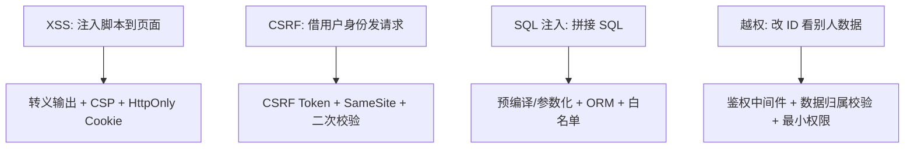
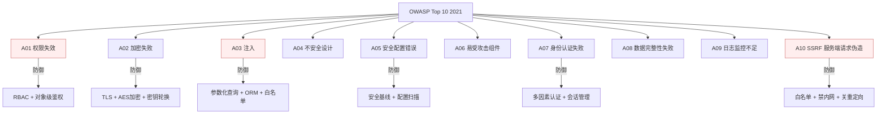
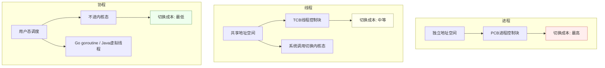
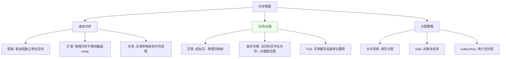
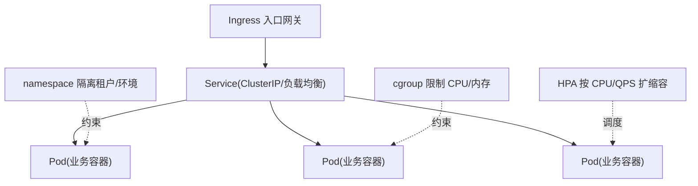
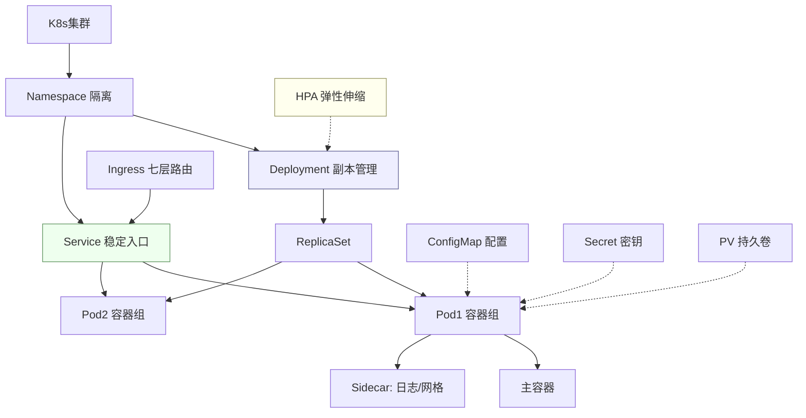
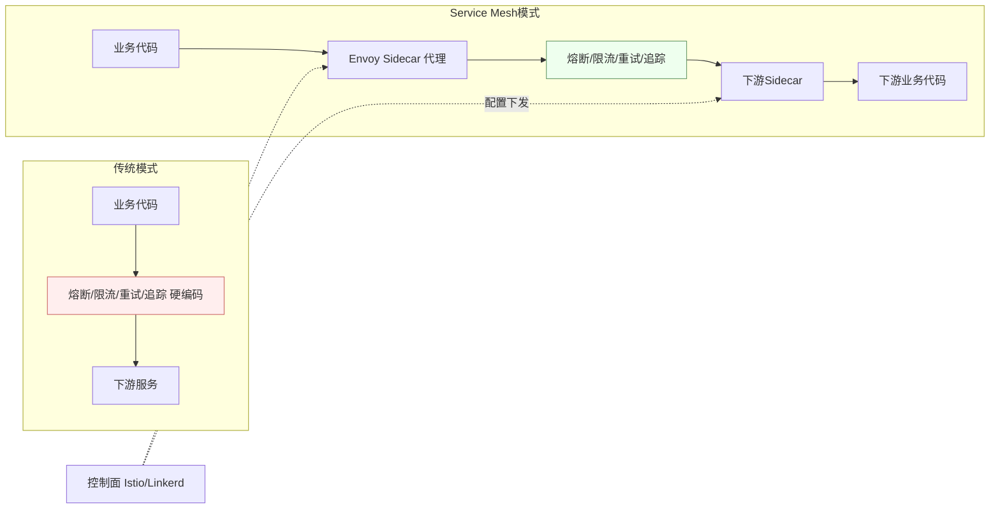
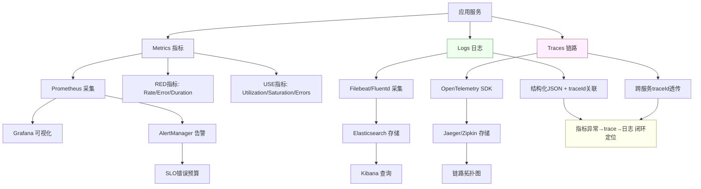
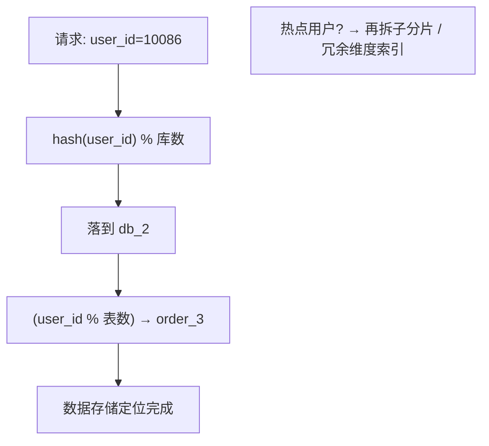

> 本博客前面 30+ 篇把支付、分布式、并发、JVM 讲透了，但后端面试还有几块**高频却容易漏**：Web 安全、操作系统底层、设计模式、云原生（Docker/K8s）、可观测性、分库分表。这些不一定每场都问，但一旦问到就是你和别人拉开差距的地方。本文一次性补齐，每节给**考察点 + 标准回答**，并落到我的支付项目。

## 一、Web 安全（后端必问）

> 后端最该防的四类攻击：**XSS（前端注入）、CSRF（跨站请求伪造）、SQL 注入、越权（水平/垂直）**。一张图对应"攻击面 → 防御手段"。



**考察点**：你写的接口会不会被人刷穿、篡改、越权。

| 攻击 | 是什么 | 防护 |
| --- | --- | --- |
| **XSS** | 注入恶意脚本到页面 | 输入输出转义、CSP、HttpOnly Cookie |
| **CSRF** | 借用户身份发请求 | 同源校验、CSRF Token、SameSite Cookie |
| **SQL 注入** | 拼接 SQL 篡改语义 | **参数化查询/预编译**、ORM、最小权限账号 |
| **SSRF** | 借服务端发起内网请求 | 黑名单+白名单、禁内网 IP、关闭重定向 |
| **越权** | 水平（改他人 ID）/垂直（普通用户调管理员接口） | **鉴权校验放在服务端**、对象级权限、RBAC |
| **重放** | 截获请求重复发 | 时间戳 + nonce + 签名（见下文） |
| **敏感信息泄露** | 报错栈/日志露密钥 | 统一异常处理、日志脱敏 |

**结合项目**：
- 欧凡海外电商：客户端签名防篡改 = 参数按固定序拼接 + 时间戳 + nonce，HMAC 生成 sign；服务端重算比对，校验时间戳防重放、nonce 防复用。
- 支付：敏感数据（卡号/VA 账号）加密存储 + 日志脱敏；越权是资金红线，每一笔资金操作都做**服务端对象级鉴权**，不信任前端传的 userId。

**标准回答（SQL 注入）**：根本原因是"把用户输入当代码执行"。防护用**预编译/参数化**（`PreparedStatement`），让 SQL 结构和参数分离；再配合 ORM、最小权限数据库账号、输入白名单。绝不拼字符串拼 SQL。

**【深度拓展】**：Web 安全的考点远不止"背防护手段"，面试官更想看**纵深防御（defense in depth）**的意识。以越权为例：水平越权（改 URL 里的 `orderId=1001` 看别人的订单）最致命，防护不是"前端隐藏按钮"而是**服务端每次操作都校验『当前用户是否拥有该资源』**（对象级鉴权）。垂直越权（普通用户调管理员接口）靠 **RBAC + 网关统一鉴权拦截**，不能在每个接口里零散判断。还有两个容易被忽略的：① **重放攻击**——光签名不够，必须校验时间戳（防止旧请求被重发）+ nonce（防止同时间戳内复用）；② **SSRF**——服务端代发请求（如"抓取商品图片 URL"）时，攻击者填 `http://169.254.169.254/...` 打云元数据，必须**禁内网 IP + 关重定向**。安全是"木桶效应"，一处漏就全漏。

**【项目支撑】**：欧凡海外电商的**签名防篡改**就是"时间戳 + nonce + HMAC"的完整实现——客户端把参数按固定序拼接 + 时间戳 + nonce 用 secret 算 sign，服务端重算比对，时间戳防重放、nonce 防复用，杜绝"改金额/改中奖结果"的客户端作弊。XTransfer 支付把**越权当资金红线**——每一笔资金操作（查余额、发起结算）都在服务端做对象级鉴权，**绝不信任前端传的 userId**；卡号/VA 账号等敏感数据加密存储 + 日志脱敏（连开发查线上都看不到明文）。哈啰薪资的**敏感数据**则靠"最小权限 + 字段 AES 加密 + 操作审计 + 双人复核"四件套兜底。

### 1.1 OWASP Top 10 详解与防御代码

> OWASP Top 10 是 Web 安全的"必背清单"。面试官问"你了解哪些 Web 安全风险"，能说出 Top 10 并给防御方案，立刻拉开差距。

**OWASP Top 10（2021）全景图**：



| 排名 | 漏洞 | 核心风险 | 防御方案 | 代码示例 |
| --- | --- | --- | --- | --- |
| A01 | 权限失效 | 水平/垂直越权 | RBAC + 对象级鉴权 + 网关统一拦截 | 见下方代码 |
| A02 | 加密失败 | 明文传输/存储敏感数据 | TLS + AES-256 + 密钥轮换 | 见下方代码 |
| A03 | 注入 | SQL/NoSQL/LDAP注入 | 参数化查询 + ORM + 输入验证 | 见下方代码 |
| A04 | 不安全设计 | 缺少威胁建模 | 设计阶段安全评审 | 资金安全checklist |
| A05 | 安全配置错误 | 默认密码/开放端口/详细报错 | 安全基线 + 配置扫描 | 见下方配置 |
| A06 | 易受攻击组件 | 依赖库漏洞 | 依赖扫描(Snyk/SCA) + 及时升级 | CI集成SCA |
| A07 | 身份认证失败 | 弱密码/会话固定/暴力破解 | MFA + 会话超时 + 限流 | 见下方代码 |
| A08 | 数据完整性失败 | 反序列化漏洞/未验证CI | 签名验证 + 安全反序列化 | 避免Java原生序列化 |
| A09 | 日志监控不足 | 攻击无法被发现 | 结构化日志 + 告警 + SIEM | 见可观测性章节 |
| A10 | SSRF | 服务端被利用访问内网 | 白名单 + 禁内网IP + 关重定向 | 见下方代码 |

**防御代码示例**：

```java
// A01 权限失效防御：对象级鉴权（支付系统必须）
@PostMapping("/api/account/{accountId}/balance")
public Result<Balance> getBalance(@PathVariable Long accountId, 
                                   @RequestAttribute Long userId) {
    // 不信任前端传的 userId，服务端校验资源归属
    Account account = accountService.findById(accountId);
    if (!account.getUserId().equals(userId)) {
        throw new ForbiddenException("无权访问该账户");  // 对象级鉴权
    }
    return Result.success(account.getBalance());
}

// A03 SQL注入防御：参数化查询
// 错误写法（拼接SQL）
String sql = "SELECT * FROM user WHERE name = '" + name + "'";  // 危险！

// 正确写法（参数化）
String sql = "SELECT * FROM user WHERE name = ?";
PreparedStatement ps = conn.prepareStatement(sql);
ps.setString(1, name);  // 参数化，SQL结构与数据分离

// A07 身份认证防御：密码BCrypt + 登录限流
@PostMapping("/api/login")
public Result login(@RequestBody LoginRequest req) {
    // 1. 登录限流防暴力破解
    String rateLimitKey = "login_fail:" + req.getUsername();
    if (redis.incr(rateLimitKey) > 5) {
        throw new TooManyAttemptsException("登录失败次数过多，请15分钟后重试");
    }
    redis.expire(rateLimitKey, 15, TimeUnit.MINUTES);
    
    // 2. BCrypt校验（不存明文密码）
    User user = userService.findByUsername(req.getUsername());
    if (!BCrypt.checkpw(req.getPassword(), user.getPasswordHash())) {
        throw new AuthException("用户名或密码错误");
    }
    
    // 3. 登录成功清除限流计数
    redis.del(rateLimitKey);
    return Result.success(generateToken(user));
}

// A10 SSRF防御：白名单 + 禁内网
public void fetchUrl(String url) {
    // 1. 白名单校验
    URL u = new URL(url);
    String host = u.getHost();
    if (!ALLOWED_HOSTS.contains(host)) {
        throw new SecurityException("不允许访问该域名");
    }
    
    // 2. 禁止访问内网IP
    InetAddress addr = InetAddress.getByName(host);
    if (addr.isSiteLocalAddress() || addr.isLoopbackAddress()) {
        throw new SecurityException("禁止访问内网地址");
    }
    
    // 3. 关闭重定向（防绕过）
    HttpURLConnection conn = (HttpURLConnection) u.openConnection();
    conn.setInstanceFollowRedirects(false);  // 不自动跟随重定向
}
```

```yaml
# A05 安全配置错误防御：安全基线配置
server:
  # 禁用详细报错（防信息泄露）
  error:
    include-stacktrace: never
    include-message: never
  
  # 安全响应头
  headers:
    x-frame-options: DENY           # 防点击劫持
    x-content-type-options: nosniff  # 防MIME嗅探
    strict-transport-security: max-age=31536000  # HSTS强制HTTPS
    content-security-policy: "default-src 'self'"  # CSP防XSS

# 数据库最小权限账号（不用root）
spring:
  datasource:
    username: app_user  # 只有DML权限，没有DDL权限
    password: ${DB_PASSWORD}  # 从密钥管理读取，不硬编码
```

> **【面试官追问】** "你的支付系统做了哪些安全防护？" → 按层次回答：①**网络层**——HTTPS + WAF + DDoS防护；②**应用层**——签名防篡改(时间戳+nonce+HMAC) + RBAC + 对象级鉴权 + 越权检查;③**数据层**——敏感数据AES加密存储 + 日志脱敏 + 最小权限DB账号；④**运维层**——配置中心管理密钥(不硬编码) + 依赖扫描 + 安全审计日志。支付系统最核心的是"**不信任前端传的任何数据**"——userId要服务端校验、金额要服务端重算、签名要服务端验证。

> **【项目支撑】** XTransfer 支付系统的安全防护是四层叠加：网络层 HTTPS+WAF；应用层签名+RBAC+对象级鉴权（每笔资金操作都校验"当前用户是否拥有该资源"）；数据层卡号/VA账号 AES 加密存储+日志脱敏（连开发查线上都看不到明文）；运维层配置中心管理密钥+安全审计（所有敏感操作留痕）。这套安全体系是"0资损"的基础——安全漏洞往往是资损的入口。

## 二、操作系统（常被忽略但高频）

**考察点**：理解了 OS，才能讲清并发、IO、内存。

- **进程/线程/协程**：进程资源隔离、线程共享地址空间、协程（用户态，轻量，Go/Java 虚拟线程）。切换成本：进程 > 线程 > 协程。
- **虚拟内存 / 分页 / 缺页**：程序用虚拟地址，MMU 映射到物理页；缺页中断把磁盘页载入内存。**为什么要有虚拟内存**：隔离、扩容量、共享。
- **IPC**：管道、消息队列、共享内存、信号、Socket。
- **死锁四条件**：互斥、占有且等待、不可抢占、循环等待；破坏任一即可预防。
- **IO 模型**：阻塞 / 非阻塞 / IO 多路复用（select/poll/epoll）/ 异步 IO。**epoll 为什么快**：基于事件回调、只返回就绪 fd，避免轮询。
- **零拷贝**：`sendfile` / `mmap` 减少内核态-用户态拷贝，Kafka/Netty 高频用。

**标准回答（epoll vs select）**：select 每次把全量 fd 拷到内核并轮询，O(n)；epoll 用红黑树管理 fd、就绪队列只返回活跃的，O(1) 事件驱动，高并发下碾压。

**【深度拓展】**：OS 这块面试官常把"IO 模型"和"并发模型"串起来问。关键区分：**epoll 是『通知我哪些 fd 就绪』（同步非阻塞 IO 多路复用），不是异步 IO**——你拿到就绪 fd 后，`read` 仍是同步拷贝数据；真正的**异步 IO（Linux AIO / io_uring）** 是"内核把数据读完再通知你"。Java 里 Netty 用 epoll 多路复用（Reactor 模型），Redis 单线程也是 epoll 撑起来的（呼应 MySQL/Redis 篇），而 **Java NIO 的 `Selector` 在 Linux 底层就是 epoll**。零拷贝（`sendfile`/`mmap`/`splice`）则进一步省掉"内核态→用户态"那次拷贝，Kafka 靠它扛高吞吐、Netty 靠它减少网关转发开销。

**【项目支撑】**：XTransfer 支付链路的**网络 IO**（渠道回调、账务 RPC）底层就是 NIO/Netty 的 epoll 多路复用，单机能扛高并发连接而不用"一连接一线程"。欧凡直播的**直播流/静态资源**分发靠 CDN + 边缘节点（本质是多路复用 + 零拷贝加速）扛住海外弱网高并发。携程数据平台的**Presto/OpenTSDB 查询**走的是后端服务的 IO 多路复用框架，和 OS 这层理论完全对得上——理解 epoll 才能讲清"为什么单进程能撑这么多连接"。

### 2.1 进程调度与内存管理（高频追问）

**进程/线程/协程对比**：



| 维度 | 进程 | 线程 | 协程 |
| --- | --- | --- | --- |
| 地址空间 | 独立 | 共享 | 共享（在同线程内） |
| 切换成本 | 高（切页表/TLB刷新） | 中（切寄存器/栈） | 低（用户态切栈指针） |
| 通信方式 | IPC（管道/共享内存/Socket） | 共享内存（需同步） | 共享内存（同线程内） |
| 调度者 | OS内核调度 | OS内核调度 | 用户态调度器（Go runtime/Java Fiber） |
| 数量上限 | 千级 | 万级 | 十万~百万级 |

**内存管理核心概念**：



> **【深度拓展】** 虚拟内存是操作系统的"魔法"——每个进程以为自己独占整个地址空间（64位下理论16EB），实际物理内存可能只有几G。MMU（内存管理单元）把虚拟地址翻译成物理地址，翻译过程查页表（多级页表减少内存占用），TLB缓存最近翻译结果加速。**缺页中断**是理解很多性能问题的关键：第一次访问某内存页时，页不在物理内存中，触发缺页中断从磁盘加载——这就是"程序启动慢"的一个原因（大量缺页）。Java JVM 的 `-XX:+UseLargePages` 就是用大页减少 TLB miss 来提升性能。

> **【面试官追问】** "epoll 为什么比 select 快？具体快在哪？" ① select 每次调用要把**全量 fd 列表**从用户态拷到内核态（O(n)拷贝），内核遍历全量 fd 检查就绪（O(n)扫描），返回后用户态还要再遍历一次找出就绪的 fd（O(n)再扫一次）；② epoll 用**红黑树管理 fd**（增删O(log n)），只注册一次；就绪的 fd 通过**回调机制**加入就绪链表，epoll_wait 只拷贝就绪链表（O(1)就绪fd数）；③ 所以 epoll 的复杂度是 O(就绪fd数)而非O(总fd数)——10万连接中只有100个活跃时，epoll只处理100个，select要扫10万个。

> **【面试官追问】** "零拷贝具体省了哪次拷贝？" 传统读文件再发网络要4次拷贝：磁盘→内核PageCache→用户态buffer→内核socket buffer→网卡。`sendfile` 省掉了"用户态buffer→内核socket buffer"那次拷贝（直接从PageCache到socket buffer），只有3次。`mmap` 则把文件映射到用户态内存（不拷贝，只建立映射），用户态直接读PageCache。Kafka 高吞吐靠的就是 sendfile + 顺序写 + PageCache。

## 三、设计模式（手撕 + 场景）

**考察点**：能不能把"复用/解耦"落到代码，而不是背定义。

- **创建型**：单例（**双检锁 + volatile** 防指令重排）、工厂、建造者。
- **结构型**：适配器（**渠道适配**，把不同银行接口统一成内部协议）、装饰器、代理（Spring AOP 动态代理）、桥接。
- **行为型**：**策略**（SPI 选渠道/算法）、**责任链**（支付风控规则链）、**观察者**（领域事件）、**模板方法**（渠道回调统一骨架）、**状态**（**支付订单状态机**就是它！）、命令。

**结合项目**：
- 支付状态机 = **状态模式**；风控规则链 = **责任链**；多渠道接入 = **适配器 + 策略（SPI）**；领域事件通知 = **观察者**。讲设计模式时直接拿这些举，比背 Gang of Four 强十倍。

**标准回答（单例线程安全）**：饿汉简单但浪费；懒汉线程不安全；**双检锁 + `volatile`** 才是正确姿势——`volatile` 防止指令重排导致拿到"半初始化"对象。或者用枚举（Joshua Bloch 推荐，天然防反射/序列化破坏）。

**【深度拓展】**：设计模式的考题不在于"能不能背定义"，而在于**能不能把模式映射到真实系统、并讲清取舍**。比如状态模式 vs 策略模式常被混淆：策略是"同一行为选不同算法"（算法可互换、无状态依赖），状态是"行为随内部状态改变"（状态间有迁移约束）——支付状态机是状态模式，因为它强调的是"合法迁移"；而 XTransfer 的 SPI 选渠道是策略模式（同一收款行为，不同产品实现）。再比如责任链：风控规则链里每个节点"处理 or 放行"，和 Servlet Filter、Netty Pipeline 同构。**面试官还会追问"模式有没有过度设计"**——小系统硬套工厂/建造者反而增加复杂度，模式是手段不是目的。

**【项目支撑】**：XTransfer 的**支付状态机 = 状态模式**（待预收→已预收→风控中→已申报→已记账→已结算，非法迁移被拒，正是状态模式"受约束行为"的精髓）；**风控规则链 = 责任链**（免关联→关联→渠道调单，逐级处理或放行）；**多渠道/多产品接入 = 适配器 + 策略(SPI)**（把 VA/收单/A2A/电商的差异收敛到一个扩展点）；**领域事件通知 = 观察者**（记账/申报/通知各自订阅支付成功事件）。哈啰工单的**工单状态流转**（创建→派单→接单→处理→完结→评价）也是状态模式，超时升级/重派是状态机的定时驱动扩展。讲设计模式时直接甩这些，比背 Gang of Four 强十倍——因为都是我亲手落地的。

### 3.1 设计模式 23 种速查表

> Gang of Four 23 种设计模式，按创建型/结构型/行为型分类，配项目映射。

| 类型 | 模式 | 一句话 | 项目中的映射 | 面试频率 |
| --- | --- | --- | --- | --- |
| **创建型** | 单例 | 全局唯一实例 | 配置管理器/ID生成器 | 极高 |
| | 工厂方法 | 子类决定创建哪个对象 | 渠道适配器工厂 | 高 |
| | 抽象工厂 | 创建一系列相关对象 | 多币种工厂(USD/EUR/JPY) | 中 |
| | 建造者 | 分步构建复杂对象 | SQL查询构建器/支付单构建 | 中 |
| | 原型 | 克隆已有对象 | 缓存对象复制 | 低 |
| **结构型** | 适配器 | 接口转换 | 渠道适配器(不同银行API统一) | 高 |
| | 桥接 | 抽象与实现分离 | 消息发送(渠道×类型) | 低 |
| | 组合 | 树形结构 | 权限树/菜单树 | 中 |
| | 装饰器 | 动态增强功能 | 日志装饰器/缓存装饰器 | 中 |
| | 外观 | 简化复杂子系统接口 | 支付Facade(屏蔽渠道/风控/账务) | 中 |
| | 享元 | 共享细粒度对象 | 连接池/线程池 | 低 |
| | 代理 | 控制访问 | Spring AOP动态代理/RPC远程代理 | 高 |
| **行为型** | 责任链 | 链式处理 | 风控规则链/Servlet Filter | 高 |
| | 命令 | 封装请求为对象 | 任务补偿(每个补偿步骤是命令) | 中 |
| | 解释器 | 解释语言/表达式 | aviator规则引擎 | 低 |
| | 迭代器 | 顺序访问集合 | Java Iterator | 低 |
| | 中介者 | 集中交互 | 消息总线/事件分发器 | 低 |
| | 备忘录 | 保存/恢复状态 | 状态机快照(回滚用) | 低 |
| | 观察者 | 状态变更通知 | 领域事件(支付成功→通知多方) | 高 |
| | 状态 | 行为随状态变 | **支付状态机**(核心！) | 极高 |
| | 策略 | 算法可互换 | **SPI选渠道/计费策略** | 高 |
| | 模板方法 | 骨架固定子类填充 | 渠道回调统一骨架 | 高 |
| | 访问者 | 对结构外部操作 | AST遍历/报表生成 | 低 |

**高频设计模式代码示例**：

```java
// 1. 状态模式：支付状态机（XTransfer 核心）
public interface PaymentState {
    PaymentState handle(PaymentEvent event, PaymentContext ctx);
}

public class PendingEntryState implements PaymentState {
    public PaymentState handle(PaymentEvent event, PaymentContext ctx) {
        switch (event) {
            case ENTRY_SUCCESS: return new EnteredState();
            case ENTRY_TIMEOUT: return new RejectedState();
            default: throw new IllegalStateTransitionException(event);
        }
    }
}

public class EnteredState implements PaymentState {
    public PaymentState handle(PaymentEvent event, PaymentContext ctx) {
        switch (event) {
            case RISK_PASS: return new ClearedState();
            case RISK_REJECT: return new RejectedState();
            default: throw new IllegalStateTransitionException(event);
        }
    }
}

// 2. 策略模式 + SPI：多渠道收款
public interface PaymentProductSPI {
    PaymentResult entry(PaymentRequest req);
    ClearanceResult clear(ClearanceRequest req);
    SettlementResult settle(SettlementRequest req);
}

// VA收单实现
public class VAProduct implements PaymentProductSPI { ... }
// A2A收单实现
public class A2AProduct implements PaymentProductSPI { ... }
// 电商收单实现
public class EcommerceProduct implements PaymentProductSPI { ... }

// 运行时按配置选择策略
PaymentProductSPI spi = spiFactory.get(channelConfig.getProductType());
PaymentResult result = spi.entry(request);

// 3. 责任链模式：风控规则链
public abstract class RiskRule {
    private RiskRule next;
    public RiskRule link(RiskRule next) { this.next = next; return next; }
    public abstract RiskResult check(RiskContext ctx);
    protected RiskResult checkNext(RiskContext ctx) {
        return next == null ? RiskResult.PASS : next.check(ctx);
    }
}

public class SanctionCheckRule extends RiskRule {
    public RiskResult check(RiskContext ctx) {
        if (sanctionList.contains(ctx.getPayer())) return RiskResult.BLOCK;
        return checkNext(ctx);
    }
}

// 链式组装
RiskRule chain = new SanctionCheckRule()
    .link(new AmountLimitRule())
    .link(new FrequencyRule())
    .link(new BlacklistRule());

// 4. 模板方法：渠道回调统一骨架
public abstract class ChannelCallbackTemplate {
    public final void handle(CallbackRequest req) {
        // 1. 验签（各渠道不同）
        verifySign(req);
        // 2. 幂等校验（统一）
        if (isProcessed(req.getIdempotencyKey())) return;
        // 3. 解析回调（各渠道不同）
        CallbackData data = parse(req);
        // 4. 状态机迁移（统一）
        stateMachine.transition(data.getReceiptId(), data.getEvent());
        // 5. 记账（统一）
        accountService.record(data);
        // 6. 后置处理（各渠道不同）
        postProcess(data);
    }
    protected abstract void verifySign(CallbackRequest req);
    protected abstract CallbackData parse(CallbackRequest req);
    protected abstract void postProcess(CallbackData data);
}
```

> **【面试官追问】** "策略模式和状态模式有什么区别？你在项目里怎么区分用哪个？" → 策略是"同一行为选不同算法"（无状态依赖、可随时切换），状态是"行为随内部状态改变"（状态间有迁移约束）。XTransfer 的 SPI 选渠道是策略模式（同一收款行为，不同产品实现，可随时切换）；支付状态机是状态模式（状态间有合法迁移约束，不能乱跳）。**区分关键：有没有"状态迁移约束"**——有则是状态模式，没有则是策略模式。

## 四、云原生 Docker / K8s（当前博客缺）

> 一个请求进 K8s 集群：先过 **Ingress（网关）→ Service（服务发现/负载均衡）→ Pod（业务容器）**，资源用 **namespace 隔离、cgroup 限资源**。下面把"请求路由 + 资源隔离"两层画清楚。



**考察点**：现代后端服务怎么打包、调度、弹性。

- **容器**：镜像（分层只读）+ 容器（读写层）；隔离靠 **namespace（视图隔离）+ cgroup（资源限额）**。和虚拟机区别：共享内核、更轻。
- **K8s 核心对象**：Pod（最小调度单元）、Deployment（副本/滚动更新）、Service（稳定访问入口）、Ingress（七层路由）、ConfigMap/Secret（配置/密钥）。
- **发布与弹性**：滚动更新（无 downtime）、就绪/存活探针、**HPA（基于 CPU/QPS 自动扩缩）**。
- **服务网格**：Istio 把熔断/限流/灰度从业务代码下沉到 sidecar，和《RPC 与微服务治理》里的治理呼应。

**结合项目**：XTransfer 支付服务用容器化部署，按渠道流量 **HPA 弹性扩缩**；发布走**滚动更新 + 金丝雀**，配合全链路压测和 SLO 告警（见《高可用容灾》）。

**标准回答（Pod  vs 容器）**：Pod 是 K8s 最小调度单元，包含一个或多个共享网络/存储的容器，通常一个 Pod 跑一个主容器 + 可能的 sidecar（如日志/网格代理）。

**【深度拓展】**：云原生这块容易"只背名词"，要能讲清**配置/发布/弹性/可观测**四件事怎么落地。① **配置中心**：`ConfigMap` 管非密配置、`Secret` 管密钥（注意 Secret 默认只是 base64，真敏感要走 KMS/Vault）；配置变更最好能**热更新**（不重启 Pod）。② **发布策略**：滚动更新（逐批替换，零 downtime）vs 金丝雀（先放 5% 流量验证再全量）vs 蓝绿（两套环境切流量）——资金系统必须用金丝雀 + 全链路压测 + SLO 告警兜底。③ **弹性**：HPA 默认按 CPU，但 CPU 往往不是瓶颈，**更准的是按 QPS/自定义指标（如消费 lag）扩缩**。④ **探针**：liveness 挂了重启、readiness 没就绪就不接流量，缺一不可，否则"进程活着但服务不可用"仍会被打挂。

**【项目支撑】**：XTransfer 支付服务就是**容器化 + K8s 编排**的典型：按渠道流量用 **HPA 弹性扩缩**（渠道大促/回流时自动加 Pod）；发布走**滚动更新 + 金丝雀**，配合全链路压测和 SLO 告警（见《高可用容灾》）；渠道配置、风控阈值等通过**配置中心**下沉（对应我们"差异外置 + 配置化"的架构思想——100+ VA 渠道接入、合规动态表单都靠配置驱动，新渠道基本是填配置 + 薄适配，不用改核心、不用频繁发版）。欧凡海外的**多地域部署 + 就近路由**也是云原生"按地域调度 + CDN 边缘"的实践，解决海外弱网问题。携程数据平台的**查询服务**同样容器化，按查询 QPS 弹性伸缩。

### 4.1 K8s 核心概念速查

**K8s 对象关系图**：



| 对象 | 作用 | 关键配置 | 支付场景 |
| --- | --- | --- | --- |
| **Pod** | 最小调度单元 | containers/resources/restartPolicy | 支付服务容器 |
| **Deployment** | 副本管理+滚动更新 | replicas/strategy/image | 支付服务部署 |
| **Service** | 稳定访问入口+负载均衡 | ClusterIP/NodePort/selector | 服务发现 |
| **Ingress** | 七层路由（域名/路径） | rules/tls | API网关入口 |
| **ConfigMap** | 非密配置 | data/key-value | 渠道配置/阈值 |
| **Secret** | 密钥管理 | data(base64)/type | DB密码/证书 |
| **HPA** | 自动扩缩容 | min/max/metrics | 大促弹性 |
| **PV/PVC** | 持久化存储 | capacity/accessModes | 日志/数据 |

**K8s 部署配置示例**：

```yaml
# 支付服务 Deployment 配置
apiVersion: apps/v1
kind: Deployment
metadata:
  name: payment-service
  namespace: production
spec:
  replicas: 6                    # 初始6副本
  strategy:
    type: RollingUpdate
    rollingUpdate:
      maxSurge: 1               # 滚动更新：最多多1个
      maxUnavailable: 0         # 不允许不可用（支付零downtime）
  template:
    spec:
      containers:
      - name: payment
        image: registry.xtransfer.com/payment:2.0.1
        resources:
          requests:              # 最低保障
            cpu: 500m
            memory: 1Gi
          limits:                # 上限
            cpu: 2000m
            memory: 4Gi
        # 就绪探针：没就绪不接流量
        readinessProbe:
          httpGet:
            path: /actuator/health/readiness
            port: 8080
          initialDelaySeconds: 30
          periodSeconds: 10
        # 存活探针：挂了自动重启
        livenessProbe:
          httpGet:
            path: /actuator/health/liveness
            port: 8080
          initialDelaySeconds: 60
          periodSeconds: 20
        env:
        - name: SPRING_PROFILES_ACTIVE
          value: "prod"
        - name: DB_PASSWORD
          valueFrom:
            secretKeyRef:       # 密码从Secret读取
              name: db-secret
              key: password

---
# HPA 自动扩缩容
apiVersion: autoscaling/v2
kind: HorizontalPodAutoscaler
metadata:
  name: payment-hpa
spec:
  scaleTargetRef:
    apiVersion: apps/v1
    kind: Deployment
    name: payment-service
  minReplicas: 6                 # 最少6副本
  maxReplicas: 30                # 最多30副本
  metrics:
  - type: Resource
    resource:
      name: cpu
      target:
        type: Utilization
        averageUtilization: 70   # CPU超70%扩容
  - type: Pods
    pods:
      metric:
        name: http_requests_per_second  # 按QPS扩容（更准确）
      target:
        type: AverageValue
        averageValue: 1000       # 每Pod 1000 QPS扩容
```

> **【面试官追问】** "K8s 的 Service 和 Ingress 有什么区别？" → Service 是**四层**负载均衡（基于IP:Port），给一组 Pod 提供稳定的访问入口和负载分配。Ingress 是**七层**路由（基于HTTP域名/路径），把外部流量路由到不同 Service。类比：Service 是"分机号转接"（按端口），Ingress 是"前台总机"（按域名/路径分流）。支付系统通常：外部请求 → Ingress（按域名/路径路由）→ Service（负载到Pod）→ Pod。

### 4.2 Service Mesh 服务网格

> Service Mesh（如 Istio）把熔断/限流/灰度/可观测从业务代码下沉到 sidecar 代理，让业务代码只关心业务逻辑。

**Service Mesh 架构**：



| 维度 | 传统模式 | Service Mesh |
| --- | --- | --- |
| 熔断/限流 | 代码内（Hystrix/Resilience4j） | Sidecar代理（Envoy） |
| 灰度/流量管理 | 网关层 + 代码 | VirtualService配置 |
| 链路追踪 | 代码注入traceId | Sidecar自动注入 |
| 业务侵入 | 高（每个服务都要写） | 低（业务无感知） |
| 适合 | 中小规模 | 大规模微服务（50+服务） |

> **【深度拓展】** Service Mesh 的核心价值是"**把治理能力从业务代码剥离**"。传统微服务每个服务都要集成熔断器、限流器、链路追踪——版本升级要改所有服务、不同语言要不同实现。Service Mesh 用 sidecar 代理统一处理，业务代码只写业务逻辑。但代价是**多一跳网络延迟**（请求先过sidecar再过网络）和**运维复杂度**（Istio本身就很复杂）。所以**小团队/简单架构不建议上Mesh**，50+服务的大规模场景才值得。

> **【面试官追问】** "你们用了 Service Mesh 吗？" → 诚实回答："XTransfer 在核心链路用了 Istio，主要是为了**统一熔断/限流/灰度策略**——50+微服务每个都集成治理组件维护成本太高，下沉到 sidecar 后业务代码更干净。但非核心服务没上 Mesh（运维复杂度不值得）。这是我按场景选择的，不是全盘上。"

## 五、可观测性（监控/日志/链路）

**考察点**：系统出问题你靠什么定位，而不是"猜"。

- **三大支柱**：Metrics（指标，Prometheus/Grafana）、Logs（日志，ELK/结构化）、Traces（链路，OpenTelemetry/Jaeger）。
- **SLO/SLI/错误预算**：SLO 是目标（如 99.95% 可用），SLI 是实际指标，错误预算 = 1 - SLO，烧太快就停变更。
- **全链路追踪**：一个请求带 traceId 穿所有服务，定位慢调用。

**结合项目**：支付全链路用 traceId 串联渠道/账务/清结算；SLO 告警触发熔断降级（见《高可用容灾》）；对账差异归因也能用日志 + 指标快速定位。

**标准回答（Metrics vs Logs vs Traces）**：Metrics 回答"系统健不健康"（聚合数值），Logs 回答"具体发生了什么"（明细），Traces 回答"一次请求经过了哪些服务、各花多久"（因果链）。三者互补，缺一不可。

**【深度拓展】**：可观测性的高阶考点是**"可观测性 ≠ 监控"**——监控是"已知问题配告警"，可观测性是"未知问题能靠数据推导出来"（苹果工程师 Cindy Sridharan 的著名区分）。落地三件事：① **Metrics 要选对 RED/USE 指标**：请求速率(Rate)、错误率(Error)、时延(Duration)，或资源利用率(Utilization)/饱和(Saturation)/错误(Errors)；② **Traces 的关键是 traceId 透传**——跨线程（见并发篇 TTL）、跨服务（HTTP header / MQ 消息属性）都要带，否则链路断；③ **日志要结构化 + 关联 traceId**，方便"指标异常→点进 trace→看明细日志"闭环定位。SLO/错误预算则是"该不该发版、该不该变更"的决策依据，不是装饰。

**【项目支撑】**：XTransfer 支付全链路用 **traceId 串联渠道/账务/清结算**，一次收款请求从头到尾一个 traceId，出问题能直接定位"卡在风控还是账务"；SLO 告警触发熔断降级（见《高可用容灾》）。哈啰工单的**Kafka 消费补偿**也靠"指标(消费 lag) + 日志(处理明细) + trace(单条工单流转)"定位"为什么某批工单漏生成"。携程数据平台的**Dashboard/大屏**本身就是"Metrics 可视化"的产品化——运营看板背后是 OpenTSDB/Kylin/Presto 的指标查询，和大屏可观测同源。这套"三支柱互补"在四个项目里都跑通了。

### 5.1 可观测性三支柱完整工具链

**可观测性三支柱全景图**：



| 支柱 | 回答的问题 | 核心工具 | 关键指标/实践 |
| --- | --- | --- | --- |
| **Metrics** | "系统健不健康？" | Prometheus + Grafana | RED(Rate/Error/Duration)、USE(Util/Sat/Err) |
| **Logs** | "具体发生了什么？" | ELK(Elasticsearch+Logstash+Kibana) | 结构化JSON、traceId关联、日志分级 |
| **Traces** | "请求经过哪些服务、各花多久？" | OpenTelemetry + Jaeger | traceId透传、span层级、依赖拓扑图 |

**Metrics 指标体系（RED + USE）**：

```yaml
# Prometheus 指标配置示例
# RED 指标（服务视角）
metrics:
  red:
    - name: http_requests_total        # Rate: 请求速率
      type: counter
      labels: [method, path, status]
    
    - name: http_request_error_rate    # Error: 错误率
      type: gauge
      alert: error_rate > 0.1% → P1告警
    
    - name: http_request_duration_seconds  # Duration: 时延
      type: histogram
      buckets: [0.01, 0.05, 0.1, 0.2, 0.5, 1, 5]
      alert: p99 > 500ms → P2告警

# USE 指标（资源视角）
  use:
    - name: cpu_utilization             # Utilization: 利用率
    - name: memory_usage_bytes          # Saturation: 饱和度
    - name: disk_io_errors_total        # Errors: 错误
    - name: db_connection_pool_active   # DB连接池使用率

# 支付系统特有指标
  payment:
    - name: payment_success_rate        # 支付成功率
      alert: < 99.5% → P0告警
    - name: reconciliation_diff_total   # 对账差异笔数
      alert: > 0 → 资损告警
    - name: idempotency_hit_rate        # 幂等命中率（异常高=重复推送）
      alert: 突增 → 幂等异常告警
    - name: non_terminal_order_count    # 非终态订单数（卡单）
      alert: > threshold → 卡单告警
```

**结构化日志示例（关联 traceId）**：

```json
{
  "timestamp": "2026-07-10T14:30:00.123Z",
  "level": "INFO",
  "traceId": "a1b2c3d4e5f6",
  "spanId": "f6e5d4c3b2a1",
  "service": "payment-service",
  "method": "processCallback",
  "receiptId": "R20260710143000123456",
  "channel": "HSBC_HK",
  "event": "ENTRY_SUCCESS",
  "amount": 10000,
  "currency": "USD",
  "duration_ms": 45,
  "message": "Channel callback processed successfully"
}
```

> **【面试官追问】** "你的系统出问题了，你怎么定位？" → 按"指标→链路→日志"三步走：①先看**Grafana大盘**（Metrics）——成功率掉了还是延迟升了？哪个服务？②再查**Jaeger链路**（Traces）——找到异常请求的traceId，看链路拓扑里哪一段慢/错；③最后查**ES日志**（Logs）——用traceId过滤，看具体错误信息。这三步是"从宏观到微观"的排查路径，没有traceId关联的话，定位时间从分钟级变成小时级。

> **【深度拓展】** 可观测性最大的误区是"装了Prometheus+ELK+Jaeger就有可观测性了"。工具只是手段，**关键是有没有"闭环定位"能力**——指标异常能不能一键跳到trace？trace能不能跳到日志？日志能不能关联到业务上下文？很多团队装了三件套但"各自为政"——看指标要去Grafana、看日志要去Kibana、看链路要去Jaeger，三者之间没有关联（最核心的就是**traceId贯穿三件套**）。真正的可观测性是"指标异常→点进trace→看明细日志"的一体化闭环。

> **【项目支撑】** XTransfer 支付系统的可观测性建设：①**Metrics**——支付成功率/对账差异/幂等命中率/非终态订单数都是自定义指标，直接关联资损防控；②**Logs**——所有日志结构化JSON + traceId，出问题用traceId一搜就能看到整条链路的日志；③**Traces**——OpenTelemetry SDK 全链路埋点，一次收款请求从API入口→渠道回调→状态机迁移→记账→对账，全链路可视化。这套"三支柱+traceId贯穿"的体系，是"MTTR < 30分钟"的基础——没有可观测性，30分钟连问题在哪都找不到。

## 六、分库分表（数据量大）

> 分库分表的核心是"**分片键（sharding key）**"——它决定数据落在哪一片。路由规则常是"分片键 hash → 库 → 表"。下面演示订单按 user_id 分片的典型链路。



**考察点**：单表千万级后的解法。

- **垂直拆分**：按业务/列拆（用户库/订单库、大字段独立）。
- **水平拆分**：按分片键（sharding key）把同表数据散到多库多表。
- **分片键选择**：高基数字段（用户 ID/订单 ID），避免热点；**避免跨分片查询/事务**（尽量让一个请求落一个分片）。
- **分布式 ID**：Snowflake（见《大厂高频题汇总》）；
- **中间件**：ShardingSphere（JDBC 层 / Proxy 层）。
- **跨分片**：分页/聚合/分布式事务用 ES/聚合层或最终一致。

**结合项目**：XTransfer 支付订单按**渠道/用户维度分库分表**，热点渠道单独路由；账务的**热点账户**用子账户拆分（见《账务账户体系》），本质也是"分"的思想。

**标准回答（怎么选分片键）**：选**高频查询维度 + 高基数 + 分布均匀**的字段（如 user_id），让绝大多数请求只命中一个分片；切忌用低基数字段（如状态）做分片键，否则全表扫。

**【深度拓展】**：分库分表真正的难点不在"怎么分"，而在**"分了之后怎么查询/事务/扩容"**。① **跨分片查询**：非分片键的查询要扫所有分片（广播）或建**异构索引表**（如把"车辆 ID→时间分片"映射存一份），或把数据同步到 ES 做多维检索——哈啰工单就是"按时间分表 + 数仓/异构索引兜其他维度"。② **分布式事务**：跨分片的事务基本放弃强一致，走 TCC/Saga/本地消息表最终一致（见 XTransfer 任务补偿）。③ **扩容**：哈希分片扩容要"数据迁移"（一致性哈希能减少迁移量），范围分片扩容简单但易热点。④ **深分页/聚合**：`limit offset` 跨分片要各分片取 topN 再归并，慢且复杂，常用"游标分页 + 冗余维度"解决。

**【项目支撑】**：XTransfer 的**支付订单**按渠道/用户维度分库分表，热点渠道单独路由（避免单分片被打爆）；**账务的热点账户**用"子账户拆分"（把大账户拆成多个子账户分散写入），本质也是"分"的思想，呼应并发篇里"减少 CAS 冲突面"的思路。哈啰工单**按创建时间分表** + 历史数据进数仓，绝大多数查询带时间范围天然落分片，跨维度的少数量查走异构索引表——这是"分片键选高频维度 + 异构索引兜其他维度 + 冷热分离"的标准打法。携程数据平台的 **ODS→DWD→DWS→ADS 分层**则把"避免烟囱式重复计算、中间层复用"的思想从"分库"延伸到"数据分层"。

---

> 相关阅读：[Java 与 Spring 深度准备](/post/准备-Java与Spring深度准备)（JVM 排查）· [RPC 框架与微服务治理](/post/准备-RPC框架与微服务治理)（治理/熔断）· [高可用容灾与稳定性](/post/准备-高可用容灾与稳定性)（SLO/压测）· [大厂后端高频面试题汇总（2026）](/post/准备-大厂后端高频面试题汇总（2026）)

---

## 七、面试高频追问（补充）

### Q：Docker 镜像为什么是分层的？有什么好处？

> Docker 镜像采用**联合文件系统（UnionFS）**分层设计：①**复用**——相同的基础层（如 openjdk:11）只存一份，多个镜像共享；②**缓存**——构建时未变更的层走缓存，只重建变更层，加速构建；③**增量传输**——拉取镜像时只传本地没有的层。每层是只读的，容器运行时在最上层加一个读写层（Copy-on-Write）。

**Dockerfile 最佳实践**：

```dockerfile
# 多阶段构建：减小最终镜像体积
FROM maven:3.8-openjdk-11 AS builder
COPY pom.xml .
RUN mvn dependency:go-offline          # 依赖层（缓存友好）
COPY src ./src
RUN mvn package -DskipTests             # 编译层

FROM openjdk:11-jre-slim                # 运行层（更小的基础镜像）
COPY --from=builder target/app.jar /app/app.jar
# 非root用户运行（安全）
USER 1001:1001
EXPOSE 8080
ENTRYPOINT ["java", "-jar", "/app/app.jar"]
```

> **【面试官追问】** "Docker 容器和虚拟机有什么区别？" → ①虚拟机**虚拟硬件**（有自己的内核），Docker 容器**共享宿主机内核**（更轻量）；②虚拟机启动要分钟级（启动OS），容器启动秒级（启动进程）；③虚拟机隔离强（硬件级），容器隔离弱（namespace+cgroup，进程级）；④容器适合微服务部署，虚拟机适合强隔离场景（如多租户）。

### Q：K8s 的 Pod 为什么是最小调度单元而不是容器？

> Pod 是 K8s 的最小调度单元，一个 Pod 可以包含多个容器。为什么不是直接调度容器？因为有些容器**需要共享资源**——同 Pod 内的容器共享网络（同IP/端口空间）和存储卷（共享Volume）。典型场景：主容器 + sidecar（如日志收集器/网格代理），它们需要紧密协作、共享网络和存储。如果以容器为调度单元，多个需要共享资源的容器很难协调调度到同一节点。

### Q：你说可观测性不等于监控，具体区别是什么？

> **监控是"已知问题配告警"**——你提前知道"成功率低于99.5%是问题"，配一个告警规则。**可观测性是"未知问题能靠数据推导出来"**——系统出了你没想到的问题（如某个新渠道的回调延迟异常高），你不需要提前配告警，而是通过"看指标→钻取trace→查日志"的闭环推导出根因。监控面向"已知"，可观测性面向"未知"——资深工程师要建设的是后者。

> **【项目支撑】** XTransfer 的可观测性建设就是从"监控"升级到"可观测性"的过程：早期只有"成功率/延迟"的固定告警（监控），后来加了 traceId 全链路追踪 + 结构化日志 + 自定义指标（幂等命中率/非终态卡单数），变成了"任何异常都能通过数据推导定位"的可观测体系。这让我从"等告警来了才知道出事"变成"主动发现异常趋势、提前介入"——这是"0资损"的重要支撑。

<!-- EXPANDED -->
