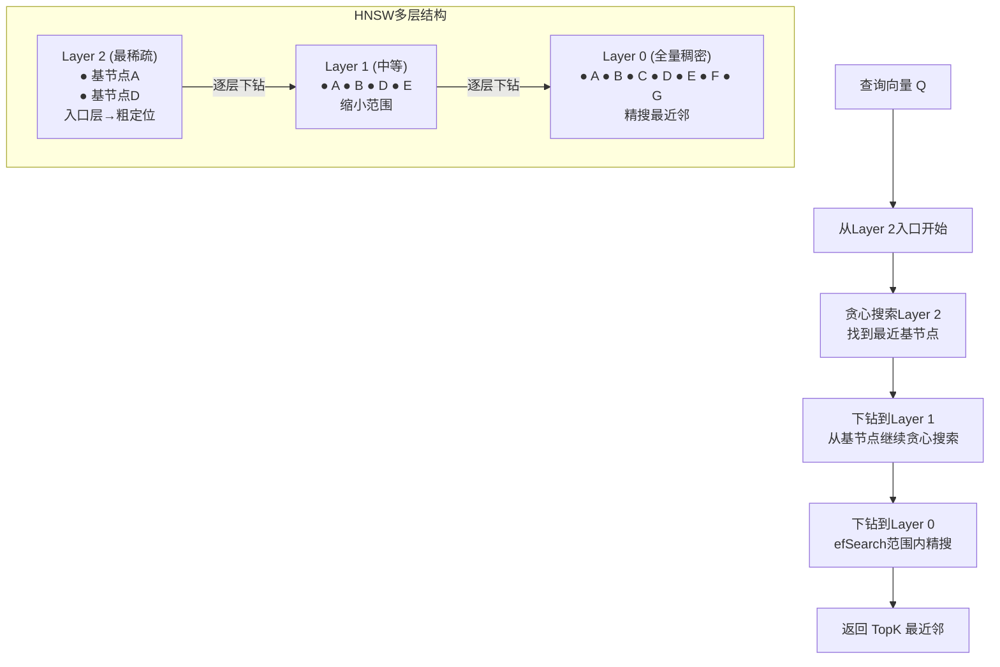
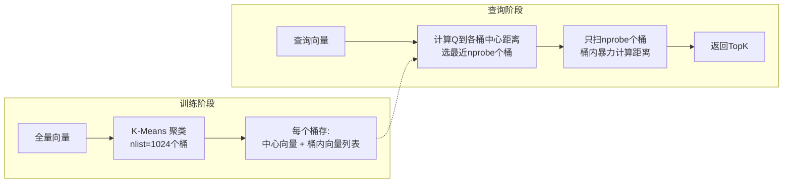
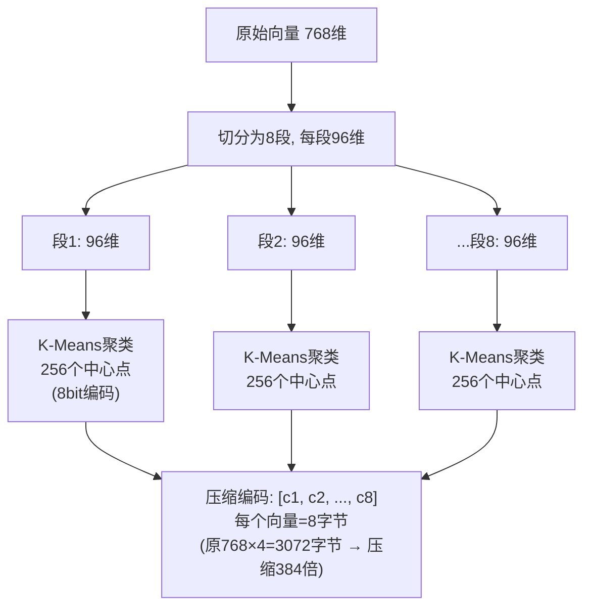
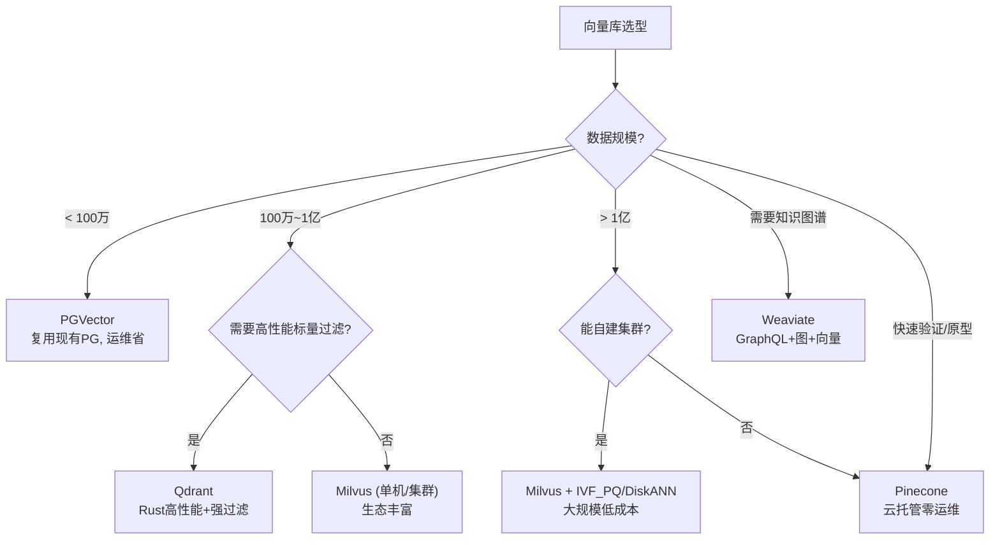
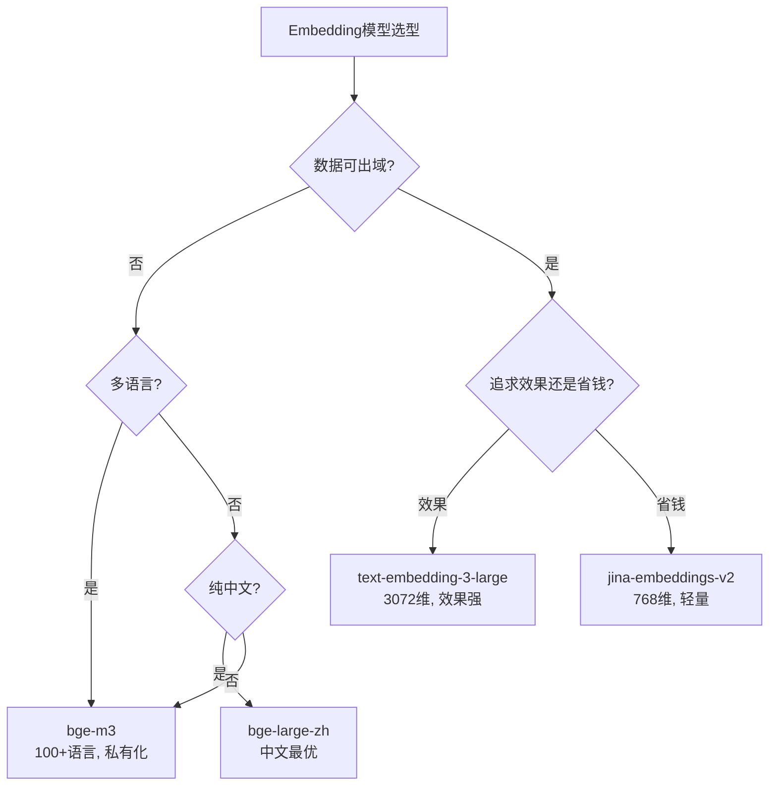
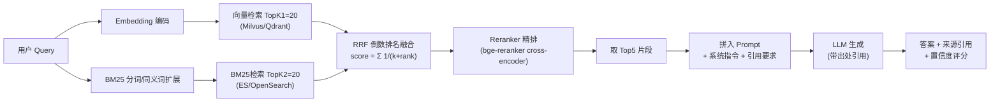
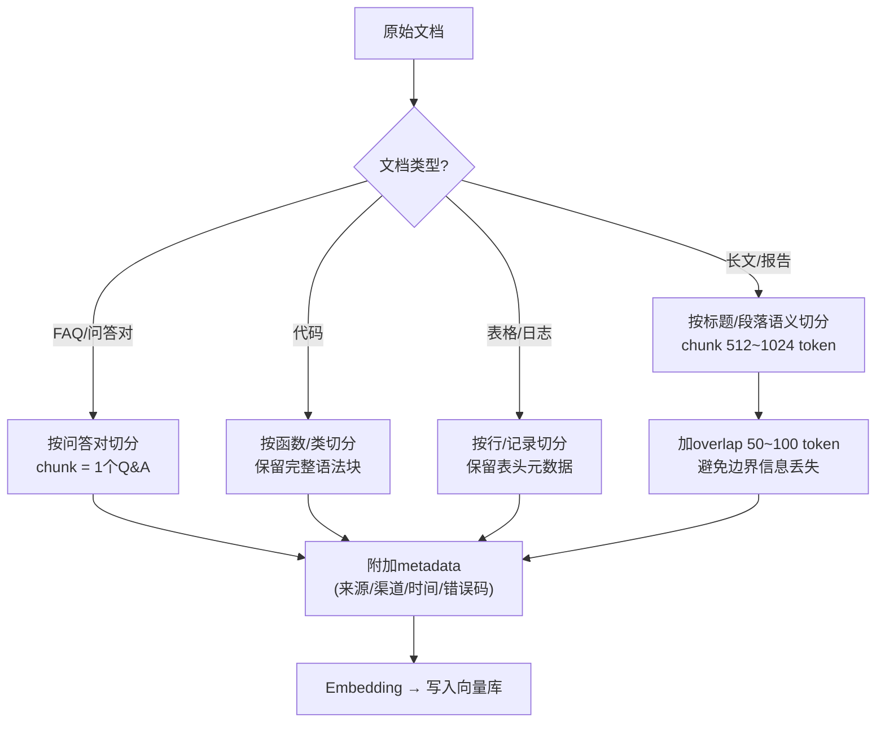

## 1. 为什么需要向量检索

传统关键词检索（BM25）匹配字面，命中不了「语义相同、措辞不同」的内容。
**Embedding** 把文本映射成向量，用 **余弦相似度** 找语义近邻——适合知识库、日志归因、推荐。

> 本质：把「检索」从字符串匹配变成「向量空间里的近邻搜索」。

**【深度拓展 · 为什么 / 真实案例】** 语义检索不是「替代」关键词检索，而是补它的盲区：BM25 搜「channel timeout」搜不到中文「渠道超时」，但向量能命中。反过来说，向量搜不到精确订单号/错误码——所以生产一定是**混合**。携程运营平台的「口径统一、数据质量、指标治理」背景，本质上也是同一类问题：不同系统对同一指标的定义要一致，检索/归因才能准；向量知识库若案例标注口径不一，召回也会偏。

## 2. 向量索引原理（被追问能答）

| 索引 | 思路 | 特点 |
| --- | --- | --- |
| 暴力（Flat） | 全量算距离 | 准但慢，小库可用 |
| IVF（倒排） | 聚类分桶，先找近桶再精算 | 快，召回略损 |
| **HNSW** | 多层可导航小世界图 | 快 + 高召回，内存换速度，主流 |
| PQ（乘积量化） | 向量压缩 | 省内存，精度略降 |

> 面试加分：能说清「HNSW 为什么快」（分层跳表式近邻图，高层粗定位、底层精搜）和「IVF 的召回-速度权衡」。

### 2.1 【深度拓展】HNSW 索引原理图解

HNSW（Hierarchical Navigable Small World）的核心思想：把向量组织成**多层图**，上层稀疏（少量节点做"粗定位"），下层稠密（全部节点做"精搜"），查询时从顶层逐层往下跳，类似跳表。



**关键参数**：
- `M`：每个节点的最大邻居数（通常 16~64），越大越准但内存越多
- `efConstruction`：构建时候选集大小，越大构建越慢但图质量越好
- `efSearch`：查询时动态候选集大小，越大越准越慢（关键调参旋钮）

**查询复杂度**：约 O(log N)，比暴力 O(N) 快几个数量级。

### 2.2 【深度拓展】IVF 索引原理图解

IVF（Inverted File）的核心：先用 K-Means 把向量聚成 `nlist` 个桶，查询时只搜索最近的 `nprobe` 个桶。



**召回-速度权衡**：`nprobe` 越大→扫的桶越多→召回越高但越慢。典型配置：`nlist=4096, nprobe=16`。

### 2.3 【深度拓展】PQ（乘积量化）原理

PQ（Product Quantization）把高维向量切成多段，每段独立聚类压缩，用"码本索引"代替原始向量。



**IVF + PQ 组合**：先用 IVF 粗筛桶，桶内向量用 PQ 压缩存储 → 既快又省内存，是十亿级向量库的主流方案。

### 2.4 【深度拓展】向量数据库选型对比

| 特性 | Milvus | Qdrant | Weaviate | Pinecone | PGVector |
|------|--------|--------|----------|----------|----------|
| 部署方式 | 自建/云 | 自建/云 | 自建/云 | 仅云 | 复用PG |
| 索引类型 | HNSW/IVF/IVF_PQ/DiskANN | HNSW | HNSW | 专有 | HNSW/IVFFlat |
| 标量过滤 | ✓ 强 | ✓ 强 | ✓ | ✓ | ✓ SQL |
| 规模 | 十亿级 | 亿级 | 亿级 | 十亿级 | 百万级 |
| 内存占用 | 高(可磁盘) | 中 | 中 | 不透明 | 低 |
| 生态 | 丰富(SDK多) | Rust高性能 | GraphQL | 简单零运维 | SQL生态 |
| 适用场景 | 大规模生产 | 中规模高性能 | 知识图谱+向量 | 快速原型 | 小规模/已有PG |



**【深度拓展】** 选型的工程考量：
1. **内存账单**——HNSW 需全量向量驻留内存，768 维 × 100 万向量 ≈ 3GB（仅向量，不含索引结构），十亿级就要考虑 IVF+PQ 或 DiskANN；
2. **标量过滤**——生产场景常需"只搜某渠道/某时间的案例"，标量过滤 + 向量近邻的混合查询性能是选型关键；
3. **运维成本**——PGVector 复用现有 PG 集群零额外运维，Milvus/Qdrant 需独立集群 + 监控 + 备份；
4. **数据安全**——支付/金融场景数据不能出域，Pinecone（仅云）不可用，必须私有化部署。

**【项目支撑】** 携程运营平台用 ES 做订单/流量聚合（精确统计），若加语义检索可先试 ES 8 的向量字段（复用现有集群），量大再引 Milvus——这是"先复用、后引入"的务实路径。XTransfer 对账知识属高敏感，Embedding 和向量库都必须私有化部署。

## 3. 组件选型

| 环节 | 选型 | 说明 |
| --- | --- | --- |
| Embedding | bge-large / m3e（中文优） | 开源可私有化，数据不出域 |
| 向量库 | Milvus / Qdrant / PGVector | PGVector 复用现有 PG，运维省 |
| 重排 | BGE-Reranker | 召回 topK 再精排，提准 |
| 生成 | 通用/私有 LLM | 基于检索片段生成答案 |

### 3.1 【深度拓展】Embedding 模型选型对比

| 模型 | 维度 | 中文 | 多语言 | 私有化 | 适用场景 |
|------|------|------|--------|--------|---------|
| **bge-large-zh** | 1024 | 优 | 一般 | ✓ | 中文知识库首选 |
| **bge-m3** | 1024 | 优 | 优(100+语言) | ✓ | 跨境/多语言 |
| **m3e-base** | 768 | 优 | 弱 | ✓ | 纯中文、轻量 |
| **text-embedding-3-large** | 3072 | 中 | 优 | ✗ | 快速原型(OpenAI) |
| **jina-embeddings-v2** | 768 | 中 | 优 | ✓ | 中等规模多语言 |
| **Cohere embed-v3** | 1024 | 中 | 优 | ✗ | 商业方案 |



**【深度拓展】** Embedding 选型的关键考量：
1. **维度影响成本**——768 维 vs 1024 维 vs 3072 维，存储和计算成本线性增长。768 维够用就别上 3072；
2. **领域适配**——通用 Embedding 在专业领域（支付/金融）效果可能不好，可用业务数据微调（contrastive learning）；
3. **多语言一致性**——跨境场景里同一概念中英文都应映射到相近向量，bge-m3 在这点上表现好；
4. **切分与 Embedding 的配合**——chunk 太长 Embedding 会"平均化"语义，太短又丢上下文，两者要联合调优。

**【项目支撑】** XTransfer 跨境场景中英文混合，若做对账知识库 RAG，Embedding 应选 bge-m3（多语言 + 私有化），维度 1024 平衡效果与成本。支付/金融术语需要少量标注数据微调（如"渠道回调延迟""汇率精度丢失"等），否则通用 Embedding 在专业术语上语义距离可能不准。

## 4. 混合检索（Hybrid Search）

纯向量容易漏「精确术语」（如订单号、错误码）。工程上用 **BM25 + 向量融合**（RRF 倒数排名融合）：

```text
query → 向量检索 TopK1 + BM25 TopK2 → RRF 融合排序 → Reranker 精排 → Prompt → LLM
```

> 这是生产级 RAG 的标配，比「只用向量」准很多。

### 4.1 【深度拓展】混合检索架构图



### 4.2 【深度拓展】RRF 融合算法代码

```python
def reciprocal_rank_fusion(
    vec_results: list,   # 向量检索结果 [(doc_id, score), ...]
    bm25_results: list,   # BM25检索结果 [(doc_id, score), ...]
    k: int = 60,          # RRF常数, 常取60
    top_n: int = 5        # 最终返回数量
) -> list:
    """
    RRF 倒数排名融合:
    对每个文档, 在两路结果中分别排名,
    融合得分 = Σ 1/(k + rank_i)
    """
    rrf_scores = {}

    # 向量检索结果排名
    for rank, (doc_id, _) in enumerate(vec_results, 1):
        rrf_scores[doc_id] = rrf_scores.get(doc_id, 0) + 1.0 / (k + rank)

    # BM25检索结果排名
    for rank, (doc_id, _) in enumerate(bm25_results, 1):
        rrf_scores[doc_id] = rrf_scores.get(doc_id, 0) + 1.0 / (k + rank)

    # 按融合得分排序
    sorted_docs = sorted(rrf_scores.items(), key=lambda x: -x[1])
    return sorted_docs[:top_n]

# 示例
vec_results = [("doc_1", 0.95), ("doc_3", 0.88), ("doc_2", 0.82)]
bm25_results = [("doc_2", 12.5), ("doc_5", 11.0), ("doc_1", 9.8)]

fused = reciprocal_rank_fusion(vec_results, bm25_results, k=60, top_n=3)
# doc_1: 1/(60+1) + 1/(60+3) = 0.0164 + 0.0159 = 0.0323
# doc_2: 1/(60+3) + 1/(60+1) = 0.0159 + 0.0164 = 0.0323
# doc_3: 1/(60+2) = 0.0161
print(fused)  # [("doc_1", 0.0323), ("doc_2", 0.0323), ("doc_3", 0.0161)]
```

**【深度拓展】** RRF 的优势：
1. **不依赖分数量纲**——向量余弦分（0~1）和 BM25 分（TF-IDF，可能 0~30+）量纲不同，直接加权无意义；RRF 只用排名，天然归一化；
2. **k 值的作用**——k 越大，不同排名间的得分差距越小（更平滑），k 越小头部排名优势越大。k=60 是经验默认值；
3. **加权 RRF**——可给不同检索器不同权重，如 `score = w_vec/(k+rank_vec) + w_bm25/(k+rank_bm25)`，术语密集场景调高 BM25 权重。

## 5. RAG 流水线

```text
文档切分 → Embedding → 写入向量库
  查询 → Embedding → 向量检索 TopK → 重排 → 拼进 Prompt → LLM 生成(带出处)
```

**切分要点**：按语义/标题切，chunk 512~1024 token，重叠避免截断；切太碎丢上下文、切太大引入噪声。

### 5.1 【深度拓展】文档切分策略对比



**切分策略对比表**：

| 策略 | chunk大小 | 优点 | 缺点 | 适用 |
|------|----------|------|------|------|
| 定长切分 | 固定512 token | 简单 | 语义可能被截断 | 快速原型 |
| 语义切分 | 按段落/标题 | 语义完整 | 长度不均 | 长文/报告 |
| 父子块 | 小块检索,大块喂模型 | 召回精度+上下文兼顾 | 实现复杂 | 生产级RAG |
| 句子窗口 | 命中句±前后句 | 上下文补充 | 可能引入噪声 | FAQ/短文 |

### 5.2 【深度拓展】完整 RAG Pipeline 代码示例

```python
from dataclasses import dataclass
from typing import List, Optional
import numpy as np

# ============================================================
# 1. 文档入库 Pipeline (离线)
# ============================================================

@dataclass
class Document:
    content: str
    metadata: dict  # {source, channel, error_code, timestamp, ...}

@dataclass
class Chunk:
    content: str
    metadata: dict
    embedding: Optional[np.ndarray] = None

class RAGIndexer:
    def __init__(self, embedder, vector_store, chunk_size=512, overlap=80):
        self.embedder = embedder
        self.vector_store = vector_store
        self.chunk_size = chunk_size
        self.overlap = overlap

    def index_documents(self, docs: List[Document]):
        """文档 → 切分 → Embedding → 写入向量库"""
        all_chunks = []
        for doc in docs:
            chunks = self._semantic_split(doc)
            for chunk in chunks:
                chunk.embedding = self.embedder.encode(chunk.content)
                all_chunks.append(chunk)

        self.vector_store.insert(all_chunks)
        print(f"Indexed {len(all_chunks)} chunks from {len(docs)} docs")

    def _semantic_split(self, doc: Document) -> List[Chunk]:
        """按语义边界切分 + overlap"""
        # 简化版: 按段落/句子切, 实际可用 langchain RecursiveCharacterTextSplitter
        paragraphs = doc.content.split("\n\n")
        chunks = []
        buffer = ""
        for para in paragraphs:
            if len(buffer) + len(para) <= self.chunk_size:
                buffer += para + "\n\n"
            else:
                if buffer:
                    chunks.append(Chunk(buffer.strip(), doc.metadata.copy()))
                buffer = para[:self.overlap] + "\n\n" + para + "\n\n"  # overlap
        if buffer.strip():
            chunks.append(Chunk(buffer.strip(), doc.metadata.copy()))
        return chunks

# ============================================================
# 2. 查询 Pipeline (在线)
# ============================================================

class RAGQueryEngine:
    def __init__(self, embedder, vector_store, bm25_search,
                 reranker, llm, top_k_recall=20, top_k_final=5):
        self.embedder = embedder
        self.vector_store = vector_store
        self.bm25_search = bm25_search
        self.reranker = reranker
        self.llm = llm
        self.top_k_recall = top_k_recall
        self.top_k_final = top_k_final

    def query(self, question: str, filter_metadata: dict = None) -> dict:
        """完整RAG查询: 向量+BM25混合 → RRF融合 → 重排 → LLM生成"""

        # Step 1: 向量检索
        q_vec = self.embedder.encode(question)
        vec_results = self.vector_store.search(
            q_vec, top_k=self.top_k_recall, filter=filter_metadata
        )

        # Step 2: BM25检索
        bm25_results = self.bm25_search.search(
            question, top_k=self.top_k_recall, filter=filter_metadata
        )

        # Step 3: RRF 融合
        fused = self._rrf_fusion(vec_results, bm25_results, k=60)

        # Step 4: Reranker 精排
        top_candidates = [r[0] for r in fused[:self.top_k_recall]]
        reranked = self.reranker.rerank(question, top_candidates)
        top_chunks = reranked[:self.top_k_final]

        # Step 5: 拼入 Prompt → LLM 生成
        prompt = self._build_prompt(question, top_chunks)
        answer = self.llm.generate(prompt)

        # Step 6: 计算置信度
        confidence = self._calc_confidence(top_chunks, answer)

        return {
            "answer": answer,
            "sources": [{"content": c.content, "metadata": c.metadata}
                        for c in top_chunks],
            "confidence": confidence,
            "needs_human": confidence < 0.6  # 低置信转人工
        }

    def _rrf_fusion(self, vec_results, bm25_results, k=60):
        scores = {}
        for rank, (doc, _) in enumerate(vec_results, 1):
            scores[doc] = scores.get(doc, 0) + 1.0 / (k + rank)
        for rank, (doc, _) in enumerate(bm25_results, 1):
            scores[doc] = scores.get(doc, 0) + 1.0 / (k + rank)
        return sorted(scores.items(), key=lambda x: -x[1])

    def _build_prompt(self, question, chunks):
        context = "\n\n".join([
            f"[参考{i+1}] (来源:{c.metadata.get('source','未知')})\n{c.content}"
            for i, c in enumerate(chunks)
        ])
        return f"""你是一个支付对账分析助手。请基于以下参考信息回答问题。
如果参考信息不足，请说明"信息不足，建议人工排查"，不要编造答案。

{context}

问题: {question}
回答(请标注引用来源):"""

    def _calc_confidence(self, chunks, answer):
        """简化版: 用top1相似度和答案长度估算"""
        if not chunks: return 0.0
        top_sim = getattr(chunks[0], 'score', 0.5)
        has_citation = "参考" in answer or "来源" in answer
        return top_sim * (1.0 if has_citation else 0.7)
```

**【深度拓展】** 生产级 RAG Pipeline 的关键工程细节：
1. **降级链路**——reranker 挂了 → 回退到 RRF 融合 topK（不阻塞）；LLM 挂了 → 返回检索片段（用户自行阅读）；
2. **metadata 过滤**——对账场景常需"只搜某渠道的案例"，向量库的标量过滤能力是刚需；
3. **缓存层**——高频 query 的结果缓存（TTL 5~30min），减少 Embedding 和 LLM 调用成本；
4. **可观测**——记录每次检索的 query、topK 相似度、置信度、是否转人工，形成"检索→生成→采纳"全链路监控；
5. **安全边界**——低置信度（< 0.6）自动转人工，不返回可能误导的答案。

**【项目支撑】** XTransfer 对账差异归因若做 RAG，Pipeline 设计是：历史差异案例（含根因分析）→ 按案例切分 + metadata（渠道/错误码/金额区间）→ bge-m3 Embedding → Milvus 私有化部署。新差异出现 → 取日志做混合检索 → reranker 精排 → LLM 归因（带引用 + 置信度）→ 低置信转人工。这和"资金安全三道防线"的事后告警一脉相承。

## 6. 支付场景：对账差异日志归因

> 痛点：T+1 对账出现差异，人工从多系统日志里找「为什么差」，平均 30 分钟/单。

**方案**：

1. 把历史「差异案例 + 根因」做成知识库，Embedding 入库；
2. 新差异出现，取相关系统日志做**混合检索**最相似历史案例；
3. 重排后拼给 LLM，输出：「订单 A 因渠道回调延迟 2 分钟导致差异，已自动平账」（带引用）。

```python
from sentence_transformers import SentenceTransformer
import numpy as np

model = SentenceTransformer("bge-large-zh")
corpus = ["渠道回调延迟导致差异", "汇率换算精度丢失", "重复通知未幂等"]
vecs = model.encode(corpus)

def search(query, top_k=1):
    q = model.encode([query])
    sims = q @ vecs.T                      # 余弦相似(已归一化)
    idx = int(np.argsort(-sims[0])[:top_k][0])
    return corpus[idx], float(sims[0][idx])

print(search("这笔钱为什么对不上，是不是渠道慢了"))
# -> ('渠道回调延迟导致差异', 0.91)
```

**【项目支撑 · XTransfer 对账背景（可借鉴落地）】** 上面的「T+1 对账差异归因」是**基于 XTransfer 真实存在的对账工作**推演的落地思路：XTransfer 资金安全的事后防线就是「指标异常告警 + T+1 对账（与渠道/账务逐笔勾兑）」，差异处理是真日常。把历史「差异案例 + 根因」做成知识库供向量检索归因，是**可借鉴 / 可落地**的方向，不是已全面上线的生产系统——面试要诚实区分「我做过的（对账、风控评分辅助）」和「可借鉴的延伸（RAG 自动归因）」。落地前提是知识库要持续维护、案例标注口径一致，这正对应携程「数据质量 / 指标治理」要持续投入的现实。

## 7. 进阶：GraphRAG 与多模态

- **GraphRAG**：把知识建成「实体-关系」图，检索时结合图遍历，适合强关联、需全局摘要的场景（如跨多系统的资损链路分析）；
- **多模态 RAG**：票据/截图先 VLM 转文本或存图文向量，再检索，适合「截图排查告警」。

## 8. 效果与边界

- **收益**：单笔归因从 30min → 约 1min，且可解释、可追溯；
- **边界**：检索质量是上限，垃圾知识库出垃圾答案（GIGO）；需持续补案例 + 评测；
- **可观测**：记录每次检索的 topK 与相似度，低于阈值转人工。

## 9. 评测怎么搞

- 准备标注集（query → 正确根因）；
- 指标：召回@K、Faithfulness（是否基于检索）、Answer Relevancy、是否有出处（RAGAS）；
- 定期回归，防止 Embedding/切分/模型变更悄悄掉点。

## 10. 工程陷阱清单

- 切分无重叠 → 关键信息被截断；
- 只用向量 → 精确术语漏召回（加 BM25 混合）；
- 不重排 → topK 噪声大；
- 不评测 → 上线后悄悄劣化不知；
- 不隔离 → 知识库被注入污染（权限 + 校验）。

---

## 面试高频问答（标准回答）

### Q1：向量检索为什么快？HNSW 是什么？

**标准回答**：近邻搜索不能暴力扫全量，需要索引。HNSW（分层可导航小世界图）把向量组织成多层图：上层稀疏做「粗定位」、下层稠密做「精搜」，查询时从顶层逐层往下跳，复杂度近对数级，又快又高召回，代价是内存占用较大。小库也可用 IVF（聚类分桶）在速度与精度间权衡。

**【深度拓展】** HNSW 的「快」来自图的多层跳跃结构，但插入时要更新多层邻居、构建成本不低；`efSearch`/`efConstruction` 是调召回与速度的关键旋钮。百万级以上要面对内存账单——常用 **IVF+PQ 压缩** 或磁盘型向量库降本。面试官还可能追问「召回率怎么测」→ 用标注集算 Recall@K，对比暴力 Flat 结果做基线。
**【项目支撑】** 携程运营平台对海量指标/订单的查询走 Kylin 预计算 Cube 与 ES 聚合，而非向量近邻——说明「语义相似检索」和「精确多维聚合」是两套不同选型，别把向量库当万能查询引擎。

### Q2：为什么 RAG 要加重排（Reranker）？

**标准回答**：向量召回（bi-encoder）为了快，用的是「双塔」独立编码，语义匹配较粗，topK 里混有噪声。Reranker（cross-encoder）把 query 和候选拼一起联合编码，判断更准，对 topK 精排能显著提升答案相关性。这是「先广后精」的两段式，生产标配。

**【深度拓展】** Reranker 是 cross-encoder，**慢且贵**，所以只对召回的 topK（如 20~50）重排，不对全量；要有**降级**：reranker 挂了回退到向量 topK，不能让整个链路阻塞。中文场景可用 `bge-reranker` 微调到业务语料提升域适应。追问「重排和向量召回权重怎么定」→ 用评测集离线调，再小流量线上验证。
**【项目支撑】** 重排本质是提升「相关性口径一致性」，和携程运营平台「口径统一、数据质量、指标治理」的思路同源——都是把「不准的中间结果」用一道质量门禁校准。

### Q3：只用向量检索够吗？

**标准回答**：不够。向量擅长语义，但会漏「精确术语」（订单号、错误码、字段名）。生产级用**混合检索**：BM25（精确）+ 向量（语义）用 RRF 融合，再重排。这样「渠道超时」和「channel timeout」都能命中。

**【深度拓展】** RRF（Reciprocal Rank Fusion）公式 `score = Σ 1/(k+rank)`，`k` 常取 60，对两路排名融合、不依赖各自分数量纲；也可按业务做加权融合。BM25 漏语义、向量漏精确词，二者互补。追问「权重怎么定」→ 用离线评测 + 线上 A/B 调；术语密集场景（日志/工单）BM25 权重应更高。
**【项目支撑】** 欧凡商品搜索用 ES（BM25）+ 分词 + 同义词 + 纠错，本质也是「精确 + 语义」互补；对账日志里订单号/错误码必须精确命中，正好映射到混合检索的 BM25 支路——XTransfer 对账差异归因若做 RAG，也必须保留精确词匹配。

### Q4：RAG 怎么防止幻觉 / 怎么评测？

**标准回答**：防幻觉靠 grounding——答案必须来自检索片段、强制带引用、低置信转人工。评测用 RAGAS 体系的 Faithfulness（是否基于检索）、Context Recall、Answer Relevancy，加人工标注集定期回归，盯 Embedding/切分变更后的掉点。

**【深度拓展】** 要分清两个独立维度：**Faithfulness（忠实，不编造）** vs **Answer Relevancy（相关，答所问）**——一个答案可能很忠实但答非所问。RAGAS 自动评测也可能误判，关键 query 仍需人工抽检。追问「知识库里有错误答案但检索命中高怎么办」→ 靠持续评测 + 人工标注发现「错误根因被高召回」，这是 GIGO，只能治本（修知识库）。
**【项目支撑】** XTransfer 对账差错处理是真实工作；用 RAG 做归因是「可借鉴落地」，但前提是「差异案例 + 根因」知识库持续维护、口径一致——这正对应携程「数据质量/指标治理」要持续投入的现实，没有治理的知识库会反噬效果。

### Q5：知识库怎么更新、怎么防污染？

**标准回答**：增量 Embedding 写入，按文档版本管理；更新用「删旧 + 写新」避免重复。防污染：知识库写入走权限 + 内容校验（防 prompt/数据注入），检索结果做可信度阈值，低于阈值转人工。支付对账知识库数据敏感，Embedding 模型私有化部署、数据不出域。

**【深度拓展】** 增量更新要注意「版本漂移」——同一知识点多版并存会召回到旧结论，所以写入带 `doc_version`，检索按最新版过滤。防投毒的止血手段：知识库要能**回滚版本 + 重建索引**，发现被注入污染立刻切回干净快照。权限上写入与检索分离，写入走审批流。
**【项目支撑】** 支付对账知识属高敏感，Embedding 必须私有化、数据不出域（XTransfer 数据安全硬约束）；携程对数据质量/血缘的重视同理——知识库也是「数据资产」，要有质量门禁与血缘，不能随便写。

> RAG 不是「接个向量库就完事」。真正值钱的是 **知识库的质与切分、混合检索、重排、评测闭环 + 防污染**——这也是我在面试里讲 AI 落地的底气。

---

## 更多高频追问（补充）

### Q6：向量数据库和传统数据库有什么区别？怎么做近似最近邻检索？

**标准回答**：传统 DB 做精确匹配/范围查询（B+树/哈希索引）；向量库存高维向量，做**相似度检索**（余弦/内积/欧氏距离），核心是 **ANN（近似最近邻）** 算法——精确 KNN 在海量高维下太慢，用近似换速度。主流索引：**HNSW**（分层可导航小世界图，查询快、精度高、内存占用大）、**IVF**（倒排 + 聚类分桶，先粗筛桶再精算）、**PQ**（乘积量化压缩向量省内存）。工程上常用 HNSW 或 IVF+PQ 组合，在召回率、延迟、内存间权衡。

**【深度拓展】** 向量库还常内建**标量过滤**（按 metadata 过滤后再算近邻），如「只看某渠道的对账案例」——这是混合「结构化过滤 + 向量近邻」，生产必备。选型还要看运维成本：PGVector 复用现有 PG、运维省但性能有限；Milvus/Qdrant 专为向量设计、规模大但要单独集群。追问「向量库和 ES 能不能二合一」→ ES 8 也支持向量字段，小场景可合并，大场景还是分开。
**【项目支撑】** 携程运营平台用 ES 做订单/流量聚合分析，若后续要加语义检索可复用 ES 的向量能力，避免再引一套集群——这是「复用现有组件降运维」的务实思路。

### Q7：文档切分（Chunking）怎么做？切太大太小分别有什么问题？

**考察点**：RAG 效果的关键往往在切分而非模型。

**标准回答**：切太大——单块含太多无关信息，检索精度下降、塞进 prompt 浪费 token；切太小——语义被割裂，丢上下文、答案不完整。实践：① 按**语义边界**切（段落/标题/句子）而非死板定长；② 设 **overlap**（块间重叠）避免边界信息丢失；③ 按文档类型定策略（代码按函数、FAQ 按问答对、长文按标题层级）；④ 保留元数据（来源/标题/章节）辅助过滤和溯源。切分质量直接决定 RAG 上限。

**【深度拓展】** 进阶切法：**父子块（parent-child）**——用小块检索、大块喂模型，兼顾召回精度与上下文完整；**句子窗口**（检索命中句 + 前后句窗口）。还要处理「表格/代码/公式」这类非连续结构，粗切会破坏。追问「chunk size 怎么定」→ 先按模型上下文窗口和评测集调，没有银弹。
**【项目支撑】** XTransfer 对账「差异案例 + 根因」知识库若做 RAG，应按「一笔差异 = 一个 case」做语义切分并带 metadata（渠道/错误码/金额区间），才能精确召回——这正对应携程「指标治理」里「一个指标一个口径」的纪律。

### Q8：怎么评测一个 RAG 系统好不好？

**标准回答**：分两段评。**检索质量**——召回率（相关文档是否被检索到）、Precision@K、MRR/NDCG（排序质量）；**生成质量**——答案的忠实度（Faithfulness，是否基于检索内容、有无幻觉）、相关性（Answer Relevance）、有无遗漏。方法：建**标注评测集**（问题-标准答案-相关文档），用 RAGAS 等框架或 LLM-as-judge 自动打分，形成"改切分/换模型/调重排 → 跑评测 → 看指标"的闭环。没有评测的 RAG 优化就是盲调。

**【深度拓展】** LLM-as-judge 本身也会漂移/有偏好，关键评测集要**人工标注且定期复核**；指标阈值要设「回归红线」，CI 里跑评测防劣化。还要评**端到端**（用户问题的真实采纳率），而非只看片段指标。追问「评测集从哪来」→ 从历史工单/真实 query 抽样，这正是 XTransfer 对账案例库能直接复用的资产。
**【项目支撑】** 携程「数据质量 + 数据血缘」体系说明：任何「自动产出」都要有质量门禁和复盘链路；RAG 评测集本质就是 AI 侧的「数据质量监控」，和运营平台对指标准确性的执着一脉相承。

---

## 【面试官追问】补充高频问题

### Q9：RAG 的延迟瓶颈在哪？怎么优化端到端延迟？

> 端到端延迟分布：Embedding 编码（~50ms）→ 向量检索（~20ms）→ BM25 检索（~10ms）→ RRF 融合（~1ms）→ Reranker 精排（~200ms）→ LLM 生成（~2~5s）。瓶颈在 LLM 生成和 Reranker。优化手段：① LLM 用流式输出（用户先看到部分答案）；② Reranker 只对 topK=20 重排，别全量；③ Embedding 缓存高频 query（TTL 5~30min）；④ 向量检索和 BM25 并行而非串行；⑤ 用更小的 LLM（如 7B 模型）做简单场景，大模型只做复杂归因。目标：简单 query < 3s，复杂归因 < 10s。

### Q10：向量库数据量大了怎么扩展？

> 三条路径：① **IVF + PQ 压缩**——把 768 维向量从 3KB 压到几十字节，十亿级也能内存承载；② **DiskANN 磁盘型**——向量存 SSD，只把索引驻留内存，牺牲一些延迟换成本；③ **分片 + 集群**——Milvus 支持分布式分片（按 collection shard），查询并行到多个 shard 再合并。选型决策：百万级用 PGVector 够了；亿级用 Milvus 单机 + HNSW；十亿级用 Milvus 集群 + IVF_PQ + DiskANN。不要一上来就上集群——先单机验证效果再扩展。

### Q11：RAG 和微调（Fine-tuning）怎么选？

> RAG 适合"知识频繁变化"的场景（对账案例每天新增）——改知识库即可，不用重训模型。微调适合"领域知识稳定但表达方式需适配"（如金融术语理解）——把领域知识"内化"到模型权重。两者不互斥：先用 RAG 做"外挂知识库"，再对 Embedding 做领域微调（用标注数据做 contrastive learning）提升检索精度，最后对 LLM 做轻量微调（如 LoRA）改善生成风格。面试官追问"为什么不直接微调 LLM"——微调成本高、周期长、知识更新要重训、且可能遗忘旧知识；RAG 改知识库即可，灵活且可解释。

### Q12：怎么防止 RAG 被注入攻击（Prompt Injection）？

> 三道防线：① **输入侧**——对用户 query 做内容过滤（检测"忽略以上指令"等注入模式）；② **知识库侧**——写入需审批流 + 内容校验，防恶意写入"毒知识"（错误根因被高召回 = GIGO）；③ **输出侧**——LLM 输出做后处理，检测是否包含注入残留、是否越界（如返回了系统 Prompt 内容）。还有版本化 + 快照回滚：发现知识库被污染立刻切回干净快照 + 重建索引。关键原则：**写入与检索分离，写入走审批**。

---

## RAG 工程速记卡

```
┌──────────────────────────────────────────────────┐
│            RAG 核心管线                           │
│  文档→切分→Embedding→向量库                     │
│  查询→Embedding→向量+BM25混合→RRF→重排→LLM      │
├──────────────────────────────────────────────────┤
│  索引选型:                                       │
│  <100万: PGVector/Flat                          │
│  100万~1亿: HNSW(Milvus/Qdrant)                 │
│  >1亿: IVF+PQ / DiskANN                        │
├──────────────────────────────────────────────────┤
│  HNSW三参数: M=16~64, efSearch越大越准越慢       │
│  IVF两参数: nlist=4096, nprobe越大越准越慢       │
│  PQ压缩: 768维→8字节, 压缩~384倍                 │
├──────────────────────────────────────────────────┤
│  混合检索: BM25(精确) + 向量(语义) → RRF融合     │
│  RRF公式: score = Σ 1/(k+rank), k=60             │
├──────────────────────────────────────────────────┤
│  切分: 语义边界 + overlap 50~100 + metadata      │
│  重排: cross-encoder只排topK(20~50), 慢但准      │
│  防幻觉: 强制引用 + 低置信转人工                  │
├──────────────────────────────────────────────────┤
│  评测: Recall@K + Faithfulness + Answer Relev   │
│  防注入: 输入过滤 + 写入审批 + 版本快照回滚       │
│  降级: reranker挂→回退RRF; LLM挂→返回片段         │
└──────────────────────────────────────────────────┘
```

<!-- EXPANDED -->
