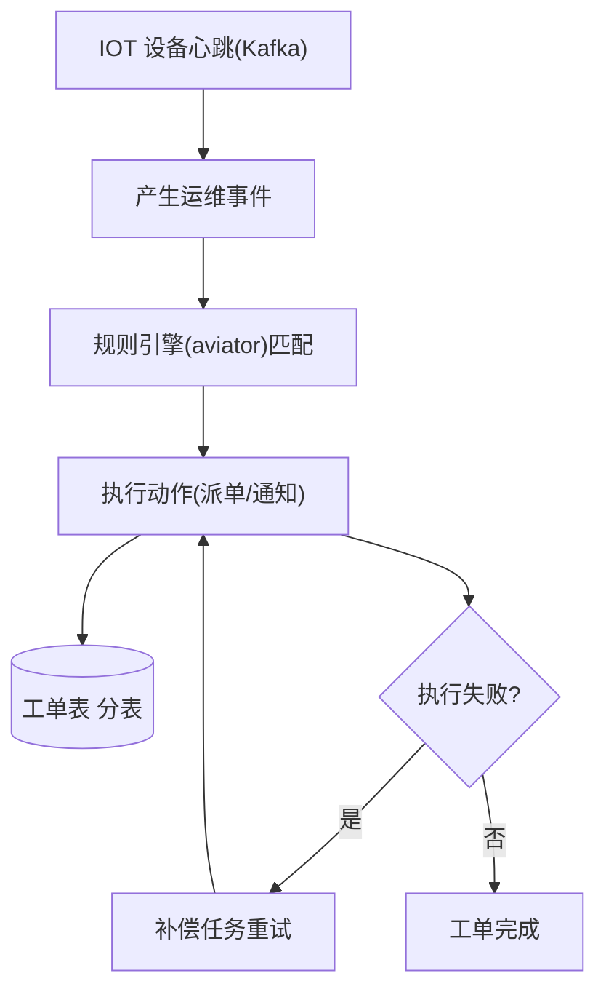
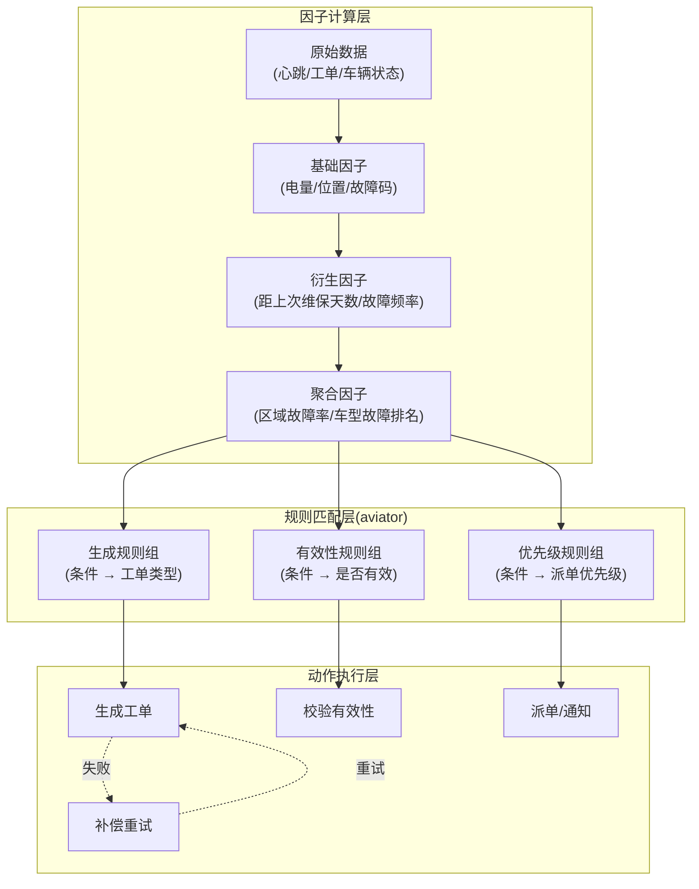
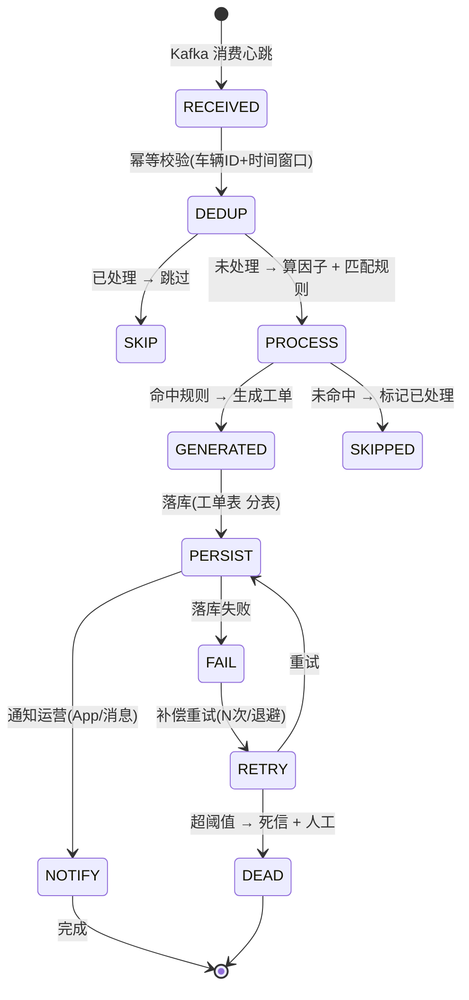
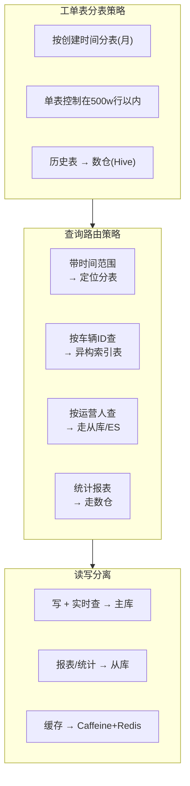
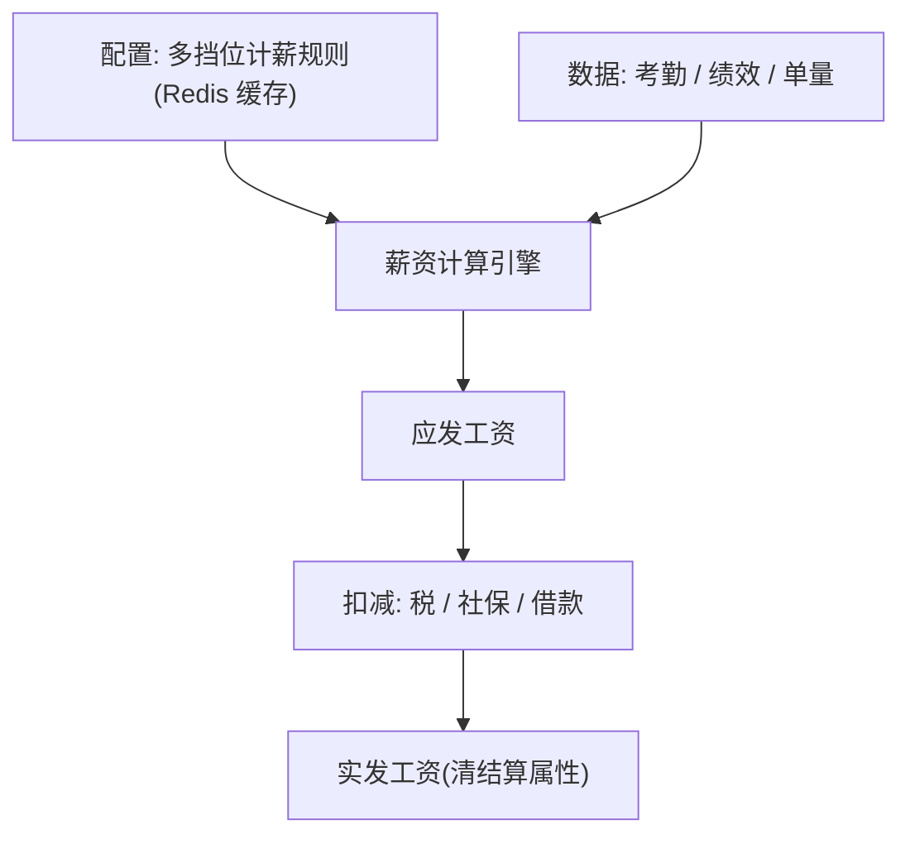
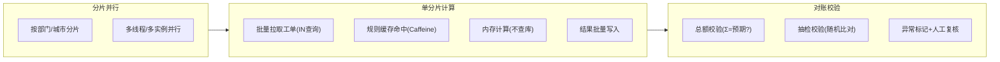

> 第二段经历。这里有大量**高并发 + 规则引擎 + 分表 + 读写分离 + 缓存**的硬核素材，是讲「工程落地能力」的好例子。

## 1. 业务背景

- **平台**：哈啰两轮车业务综合运维管理平台。
- **规模**：**1000w+ IOT 设备**的全生命周期管理，**1w+ 运营人员**的全流程跟踪与管理。
- **我做的事**：主导 / 参与开发**工单系统**与**薪资系统**两个核心子系统。

## 2. 工单系统：规则引擎驱动的运维操作平台

> 工单的本质是"**事件触发 → 规则匹配 → 动作执行 → 补偿兜底**"。下面把这套流转画清楚，Kafka 心跳丢了也能靠补偿重新派单。



一线运维在 App 上做巡检、维保、装车、接车、保养、调度等业务。核心指标：**日处理工单 200w+，工单正确率 95%+**。

### 2.1 规则引擎（aviator）抽象业务

简历原话：「消费业务侧工单数据，生成指标因子，根据**工单规则引擎**计算生成不同类型的工单。**基于 aviator 表达式引擎，将工单的生成规则与有效性规则由业务代码抽象为可配置系统**。」

- **痛点**：工单「什么条件下生成、生成哪种、是否有效」规则极多且常变，写死在代码里会改到崩溃。
- **解法**：把规则抽成 **aviator 表达式**（如 `battery < 20 && lastMaintainDays > 90`），规则存配置；业务数据算出指标因子后，引擎按配置逐条求值，命中即生成 / 校验工单。
- **收益**：产品改规则不用研发发版，**规则热更新**，研发从「写 if/else」变成「配表达式」。

```
   车辆/工单事件 ──▶ 指标因子计算 ──▶ aviator 规则引擎(配置化表达式)
                                        │ 命中
                                        ▼
                                  生成/校验工单 ──▶ 落库 + 通知运营
```

> **面试标准回答（为什么用规则引擎）**
> 「工单的生成和有效性有成百上千条易变规则。如果硬编码，每次改规则都要发版、回归、易错。我们把规则表达成 aviator 表达式配置化，引擎统一求值。好处是规则与代码解耦、可热更新、可灰度、可审计，研发专注引擎和因子计算，业务方管规则。」

**【深度拓展】** 选型 aviator 而不是自研 DSL / 写死 if/else，核心是「**规则的热更新 + 安全求值**」。aviator 是表达式引擎，比 Groovy/JS 沙箱更轻、无编译开销、可限制函数集防注入。但凡「规则多、变频繁、要业务自助」的场景，配置化规则引擎是标准解——和 XTransfer 的「合规动态表单」「SPI」、欧凡的「优惠券策略」是同一个家族：**把易变逻辑外置**。

权衡：规则引擎引入「规则调试难」（表达式出错不像代码有栈）、「性能」（每条规则都求值有开销）。应对是：① 规则加版本 + 灰度，上线前对历史数据跑影子校验；② 因子预计算缓存，规则只做轻量布尔/算术；③ 用「短路 + 规则分组」减少无效求值。

**【面试官还会追问】**
- **追问1：规则很多，全部逐条求值性能扛不住怎么办？** 应对：规则分组（按工单类型/优先级只跑相关组）+ 短路求值 + 因子缓存；高频规则前置，低频规则异步校验。
- **追问2：规则改错了导致大量误派工单，怎么止损？** 应对：规则版本化 + 一键回滚；监控派单量异常波动告警；误派工单走「批量撤回/改派」脚本兜底。
- **追问3：aviator 表达式能做复杂风控吗，比如需要查库的规则？** 应对：aviator 只做内存表达式，涉及外部数据的用「因子预计算」提前算好注入；需要调服务的走「规则→动作」解耦，规则产出意图、动作层调服务，保证引擎纯求值、可测试。

### 2.1.1 工单规则引擎深度设计

> 规则引擎不只是「写个表达式」，而是一套完整的「**因子计算 → 规则匹配 → 动作路由 → 补偿兜底**」管道。下面把设计拆开。



因子计算是规则引擎的「**数据预处理**」——把原始数据（心跳、车辆状态、历史工单）加工成规则可直接消费的「因子」。关键是：**因子预计算 + 缓存**，让规则匹配时只做轻量布尔/算术运算，不在求值过程中查库。

```java
// 工单规则引擎核心代码示例

// 1. 因子定义（预计算后注入规则引擎）
public class WorkOrderFactors {
    private String vehicleId;
    private int battery;           // 电量百分比
    private int faultCode;         // 故障码
    private int daysSinceMaintain; // 距上次维保天数
    private int areaFaultCount;    // 区域故障数（聚合因子）
    // ... getter/setter
}

// 2. 规则配置（存储在 DB / 配置中心，可热更新）
// 示例规则: "battery < 20 && daysSinceMaintain > 90" → 生成「维保工单」
//           "faultCode == 5001 && areaFaultCount > 10" → 生成「紧急维修工单」

// 3. 规则引擎执行
public class WorkOrderRuleEngine {
    private RuleConfigService ruleConfigService;  // 规则配置（DB + Caffeine 缓存）
    private AviatorEvaluator aviator;

    public List<WorkOrderIntent> evaluate(WorkOrderFactors factors) {
        List<RuleConfig> rules = ruleConfigService.getActiveRules();  // 带版本 + 灰度
        List<WorkOrderIntent> intents = new ArrayList<>();
        for (RuleConfig rule : rules) {
            try {
                Boolean hit = (Boolean) aviator.execute(rule.getExpression(), factors.toMap());
                if (hit) {
                    intents.add(new WorkOrderIntent(rule.getWorkOrderType(), rule.getPriority()));
                    if (rule.isExclusive()) break;  // 互斥规则短路
                }
            } catch (Exception e) {
                log.warn("规则求值异常 ruleId={} expr={}", rule.getId(), rule.getExpression(), e);
                // 规则异常不阻断其他规则，降级跳过 + 告警
            }
        }
        return intents;
    }
}
```

> **【项目支撑】**（STAR）
> - **S（场景）**：工单生成规则有上千条，分散在各处 if/else，每次改规则要发版 + 回归，平均 3 天上线。
> - **T（任务）**：把规则从代码抽到配置，让运营改规则不用研发发版。
> - **A（行动）**：① 用 aviator 表达式引擎替代硬编码 if/else；② 设计「因子预计算 + 规则匹配 + 动作路由」三段管道；③ 规则带版本 + 灰度，上线前对历史心跳跑影子校验；④ 规则异常降级跳过 + 告警，不阻断主流程。
> - **R（结果）**：规则热更新秒级生效，改规则不用发版；误派率下降（规则版本化 + 影子校验）；研发从「写 if/else」变成「维护引擎 + 因子计算」。

> **【深度拓展】** 工单规则引擎和 XTransfer「合规动态表单」是同一设计家族——都是**把易变逻辑从代码外置到配置**。区别在：XTransfer 配置的是「表单 Schema」，哈啰配置的是「表达式规则」。本质都是「**业务稳定的建模，易变的配置化/外置**」——这条哲学在四篇项目里反复出现。
>
> 常见误区：① 以为规则引擎能解决所有 if/else——实际上，**简单的、不变的逻辑留在代码里更好**（可读性 + 可调试），规则引擎只适合「多、易变、要业务自助」的场景；② 规则不做版本管理——改了没法回滚，出事就是大面积误派；③ 规则不灰度——新规则一上来全量，误派风险极高。这三个坑我都踩过，所以才加了「版本 + 灰度 + 影子校验」三件套。

### 2.2 Kafka 心跳消费 + 工单补偿

简历原话：「基于 **kafka 消费车辆心跳，进行工单补偿**。」

- 车辆定时上报心跳（位置、电量、故障码等），进 Kafka；
- 消费端算出指标因子、触发规则、生成工单；
- **补偿**：心跳可能丢失 / 乱序 / 重复，消费端做**幂等**（同车辆同窗口只处理一次）+ **补偿**（漏触发的工单按周期补扫历史心跳）。这保证「该生成的工单不漏」。

> 补偿思想在 XTransfer 也用（任务补偿），可对照 [XTransfer 深度复盘](/post/准备-XTransfer跨境支付收款平台深度复盘) 第 5 节。

### 2.2.1 心跳消费的幂等与补偿深度设计

> Kafka 消费心跳生成工单，核心难题是「**不漏不重**」——心跳可能丢失、乱序、重复，但工单不能漏（漏了设备没人修）也不能重（重了一个人收到多张工单）。



幂等设计的核心是**去重键**——同一车辆同一时间窗口的心跳只处理一次：

```java
// 心跳消费幂等核心逻辑
public class HeartbeatConsumer {
    private RedissonClient redisson;
    private WorkOrderRuleEngine ruleEngine;
    private WorkOrderService workOrderService;

    public void consume(HeartbeatEvent event) {
        // 1. 幂等去重: 车辆ID + 时间窗口(如5分钟) 组成去重键
        String dedupKey = String.format("heartbeat:%s:%s",
            event.getVehicleId(),
            TimeWindowUtil.windowKey(event.getTimestamp(), 5));  // 5分钟窗口

        RLock lock = redisson.getLock(dedupKey + ":lock");
        try {
            if (!lock.tryLock(0, 30, TimeUnit.SECONDS)) {
                return;  // 其他实例正在处理同一窗口，跳过
            }
            // 2. 幂等校验: Redis SETNX 标记已处理
            if (!redisson.getBucket(dedupKey).setIfAbsent("1", 10, TimeUnit.MINUTES)) {
                return;  // 已处理过，跳过
            }
            // 3. 算因子 + 匹配规则
            WorkOrderFactors factors = factorCalculator.calc(event);
            List<WorkOrderIntent> intents = ruleEngine.evaluate(factors);
            // 4. 生成工单(落库 + 通知)
            for (WorkOrderIntent intent : intents) {
                workOrderService.create(intent);  // 内部走本地事务 + CAS 幂等
            }
        } finally {
            if (lock.isHeldByCurrentThread()) lock.unlock();
        }
    }
}
```

补偿设计——**漏触发的工单按周期补扫**：

```java
// 补偿任务: 定时回扫历史心跳，补生成漏掉的工单
@Scheduled(cron = "0 0/30 * * * ?")  // 每30分钟跑一次
public void compensateMissedWorkOrders() {
    // 1. 查最近2小时未处理的心跳(Kafka offset 回溯 或 DB 审计)
    List<HeartbeatRecord> missed = heartbeatDao.findUnprocessed(
        LocalDateTime.now().minusHours(2),
        LocalDateTime.now().minusMinutes(30));  // 30分钟前的未处理
    // 2. 逐条重新消费(走幂等逻辑，已处理的会被跳过)
    for (HeartbeatRecord record : missed) {
        consume(record.toEvent());
    }
    // 3. 补偿统计 + 告警
    if (missed.size() > threshold) {
        alertService.warn("心跳补偿量大: " + missed.size());
    }
}
```

> **【深度拓展】** 心跳消费的「不漏不重」和 XTransfer「渠道回调不漏不重」本质相同——都是**外部输入可能丢/重，必须幂等 + 补偿兜底**。区别在：
> - XTransfer 用「幂等键（渠道流水号+产品）+ CAS + 主动查单」保证不漏不重；
> - 哈啰用「去重键（车辆ID+时间窗口）+ Redis SETNX + 定时补扫」保证不漏不重。
>
> 底层都是**幂等键 + 补偿重试 + 对账校验**三件套，只是幂等键的语义不同（支付幂等键=渠道流水号，心跳幂等键=车辆+时间窗口）。

> **【面试官追问】**
> - **追问1：Redis 挂了，去重失效导致重复消费怎么办？** 应对：DB 层加「车辆ID + 时间窗口」唯一约束兜底；Redis 恢复后重放；重复工单走「重复检测 + 批量撤回」脚本。
> - **追问2：补扫任务和实时消费同时处理同一条心跳，会不会重复？** 应对：不会——都走同一幂等逻辑（Redis SETNX），先到的标记已处理，后到的跳过。
> - **追问3：心跳量暴增（如设备集中上线），消费积压怎么办？** 应对：Kafka 消费者弹性扩容（增加 partition + consumer）；积压期间因子计算降级（只算基础因子，跳过聚合因子）；积压恢复后补扫补全。

### 2.3 分表 + 读写分离

简历原话：「工单表基于**创建时间分表**，历史数据对接数仓保留备份；优化 sql 执行效率，通过**读写分离**，提升系统运行效率，提高稳定性。」

- **按创建时间分表**：工单量大且按时间查询为主，按天/月分表，避免单表无限膨胀，查询走对应分片。
- **历史数据进数仓**：冷数据迁到数仓（如 Hive），主库只留热数据，减轻 OLTP 压力。
- **读写分离**：报表 / 统计类走从库，写和实时查询走主库，提升整体吞吐与稳定性。

> **面试标准回答（分表后非分片键怎么查）**
> 「我们按创建时间分表，绝大多数查询带时间范围，天然落到分片。对少量按其他维度（如车辆 ID）的查询，建异构索引表（车辆 ID → 时间分片）或走数仓。配合读写分离，报表查询打从库，主库只扛写入和实时查询。核心是『分片键选高频查询维度 + 异构索引兜其他维度 + 冷热分离』。」

**【深度拓展】** 分表键选「创建时间」的本质是**顺着业务查询模式走**——运维工单 90% 查询是「某时段 + 某区域/人员」，时间分片天然契合。这和 XTransfer「按订单/时间分表」、携程「按时间降采样」是同一思路：**分片键必须对齐最高频查询维度**，否则分了等于没分。

冷热分离（热数据留主库、冷数据进 Hive 数仓）是应对「数据只增不减」的标准姿势——和 XTransfer 贸易订单「流水式只增不减」异曲同工，都是「把历史当资产而非负担」，主库轻、数仓重分析。

**【面试官还会追问】**
- **追问1：分表后跨分片查询（如查某车辆一年工单）怎么搞？** 应对：异构索引表（车辆 ID → 涉及的分片列表）先定位再并行查；或全量走数仓/ES，OLTP 不扛跨分片聚合。
- **追问2：分表后全局唯一 ID 和跨分片排序怎么保证？** 应对：雪花 ID（趋势递增 + 分片无关）保证全局唯一；分页用「游标/scroll」而非 offset，避免跨分片排序错位。
- **追问3：读写分离下从库延迟导致运营看不到刚建的工单怎么办？** 应对：写后强读走主库（如刚创建完的详情查询）；列表/统计类容忍秒级延迟走从库；关键操作结束后的「跳转详情」强制主库。

### 2.3.1 分库分表策略深度设计

> 工单表日增 200w+，单表撑不住。分表不是「按时间切一刀」就完事，而是一套完整的「**分片键选择 + 路由策略 + 跨分片查询 + 数据迁移**」方案。



分表后的核心问题和解法：

| 问题 | 解法 | 代码/配置示例 |
| --- | --- | --- |
| 跨分片查询某车辆全年工单 | 异构索引表（车辆ID → 分表列表），先定位再并行查 | `SELECT shard FROM idx_vehicle_shard WHERE vehicle_id=?` |
| 全局唯一 ID | 雪花算法（趋势递增 + 分片无关） | `SnowflakeId.nextId()` |
| 跨分片分页 | 游标/scroll 替代 offset，避免跨分片排序错位 | `WHERE create_time > #{lastCursor} ORDER BY create_time LIMIT 20` |
| 分表数据迁移 | 双写过渡：新表双写 + 历史数据迁移 + 读切新表 + 下线旧表 | 灰度切换，可回滚 |
| 聚合统计 | 不走 OLTP，走数仓/ES 聚合 | `SELECT COUNT(*) FROM dws_workorder_daily WHERE dt=?` |

```sql
-- 异构索引表: 车辆ID → 涉及的分表列表
CREATE TABLE idx_vehicle_shard (
    vehicle_id BIGINT PRIMARY KEY,
    shards VARCHAR(500) COMMENT '逗号分隔的分表名, 如: t_workorder_202601,t_workorder_202602',
    update_time DATETIME DEFAULT CURRENT_TIMESTAMP ON UPDATE CURRENT_TIMESTAMP
);

-- 按车辆查全年工单: 先定位分表, 再并行查
-- Step 1: 查索引表
SELECT shards FROM idx_vehicle_shard WHERE vehicle_id = 100001;
-- 结果: t_workorder_202601,t_workorder_202602,...,t_workorder_202612

-- Step 2: 并行查各分表(每张表只查自己范围, 不跨分片)
SELECT * FROM t_workorder_202601 WHERE vehicle_id = 100001
UNION ALL
SELECT * FROM t_workorder_202602 WHERE vehicle_id = 100001
-- ... (应用层并行查, 结果合并)
```

> **【项目支撑】**（STAR）
> - **S（场景）**：工单表单表 5000w+，查询变慢、DDL（加索引）要锁表数小时。
> - **T（任务）**：设计分表方案让查询稳定在 100ms 内、DDL 不影响线上。
> - **A（行动）**：① 按月分表（工单 90% 查询带时间范围，天然落分片）；② 建「车辆ID→分表」异构索引表解决非分片键查询；③ 历史数据（3 个月前）迁数仓，主库只留热数据；④ 读写分离，报表打从库。
> - **R（结果）**：单表控制在 500w 内，查询 p99 < 100ms；DDL 只影响单月分表（几万行），秒级完成；冷数据迁数仓后主库写入性能提升 40%+。

> **【深度拓展】** 分片键选「创建时间」的本质是**顺着业务查询模式走**——运维工单 90% 查询是「某时段 + 某区域/人员」，时间分片天然契合。这和 XTransfer「按订单/时间分表」、携程「按时间降采样」是同一思路：**分片键必须对齐最高频查询维度**，否则分了等于没分。
>
> 常见误区：① 分表后还想用 `OFFSET` 分页——跨分片 offset 会排序错位，必须改游标；② 不建异构索引——以为分表后还能随便跨分片查，结果是全分片扫描；③ 冷数据不迁——分了表但数据还在涨，单表还是会膨胀。这三个坑都是「分了表但没分好查询」的典型。

## 3. 薪资系统：配置化清结算

> 薪资 = "**配置（挡位/规则）+ 数据（考勤/绩效）→ 计算引擎 → 结果（应发/实发）**"。配置化让 HR 改规则不用发版，下面是计算链路。



针对运维人员的**清结算系统**：构建灵活可配置的**多挡位计薪规则**，对工单做有效性判断，计算薪资。核心指标：**日维护 1w+ 人薪资，处理薪资金额 600w+，薪资正确率 95%+**。

### 3.1 配置化多挡位计薪

- 不同城市 / 车型 / 工单类型 → 不同**计薪挡位**与单价；
- 规则配置化（和工单规则引擎同源思路），**维护计薪规则**由运营在后台改，不写代码；
- 基于**工单薪资系数**做差异化计薪（如夜班系数、难度系数）。

### 3.2 缓存加速规则匹配

简历原话：「维护计薪规则，使用 **redis 和 caffeine 对规则进行缓存**，加速规则匹配与薪资计算。」

- **多级缓存**：Caffeine（本地，纳秒级）挡热点，Redis（集中，跨实例共享）兜底；
- 规则变更时**失效缓存**（或短 TTL + 主动失效），保证计薪正确性；
- 这把「每次算薪都查库 + 解析规则」变成「命中缓存直接算」，吞吐大幅提升。

```
   算薪请求 ──▶ Caffeine(本地) ─命中─▶ 直接算
                   │ miss
                   ▼
                Redis(集中) ─命中─▶ 回填 Caffeine ─▶ 算
                   │ miss
                   ▼
                 DB 加载规则 + 解析 ─▶ 回填两级缓存
```

> **面试标准回答（多级缓存怎么保证一致）**
> 「规则是『读多改少』，适合多级缓存。Caffeine 挡进程内热点，Redis 做跨实例共享，DB 兜底。一致性靠：规则变更时主动失效两级缓存（或发布失效事件），并给缓存设较短 TTL 兜底，保证最终一致。计薪正确性优先，所以失效要可靠，不允许『改了规则还在用旧缓存算薪』。」

**【深度拓展】** 多级缓存（本地 Caffeine + 分布式 Redis）是应对「**热点 + 回源风暴**」的标准架构——欧凡直播电商的二级缓存（第 2.2 节）也是同一套路。关键差异在「一致性容忍度」：欧凡商品详情允许秒级不一致，所以靠短 TTL + 失效广播；薪资规则**正确性压倒性能**，所以失效必须可靠（变更即广播 + 强失效），绝不能「改了规则还在用旧缓存算薪」导致发错工资。

和 XTransfer 对比：支付/薪资都属「高敏感 + 强一致」数据，缓存只能加速「读」，写路径必须落库 + 强校验，缓存绝不参与资金计算的正确性闭环。

**【面试官还会追问】**
- **追问1：规则变更广播，但某个节点没收到失效消息怎么办？** 应对：短 TTL 兜底（即使漏广播，秒级后也会过期重载）；失效用「可靠消息 + 确认」，失败重试；关键发布走「广播 + 版本号拉取」双保险。
- **追问2：本地缓存（Caffeine）和 Redis 数据不一致窗口内，并发算薪会不会算错？** 应对：算薪正确性不依赖缓存内容，缓存只加速「规则加载」；真正计算时用「缓存规则 + 规则版本号」，版本号不一致强制重载，且计算输入（考勤/绩效）走主库实时查，不被缓存污染。
- **追问3：大促/月底批量算薪，缓存和 DB 怎么扛？** 应对：批量算薪走分片并行（见 Q7），规则缓存预热；DB 读用从库 + 批量拉取，避免逐条查；结果写走主库 + 对账校验。

### 3.2.1 薪资计算的幂等与审计

> 薪资和支付一样是「**高敏感 + 强合规**」数据——算错就是发错工资，发错了追回极难。幂等保证「不重发」，审计保证「可追溯」。

**幂等设计**：每次算薪带「批次号 + 人员ID」组成幂等键，重复算同一批次同一人只生效一次：

```java
// 薪资计算幂等核心逻辑
public class SalaryCalculator {
    private SalaryBatchDao batchDao;
    private SalaryResultDao resultDao;

    public void calculateBatch(String batchNo, List<Long> employeeIds) {
        for (Long empId : employeeIds) {
            // 1. 幂等校验: 同一批次同一人是否已算
            String idempotentKey = batchNo + ":" + empId;
            if (resultDao.existsByIdempotentKey(idempotentKey)) {
                continue;  // 已算，跳过（可重跑不重复）
            }
            // 2. 加载规则(走多级缓存) + 加载数据(考勤/绩效 走主库实时查)
            SalaryRule rule = ruleCacheService.getRule(empId);
            AttendanceData attendance = attendanceDao.findByEmpAndBatch(empId, batchNo);
            // 3. 计算: 应发 → 扣减 → 实发
            SalaryResult result = compute(rule, attendance);
            // 4. 落库(幂等键唯一约束 + CAS 兜底)
            result.setIdempotentKey(idempotentKey);
            result.setBatchNo(batchNo);
            result.setRuleSnapshot(rule.toJson());  // 规则快照留痕
            result.setInputSnapshot(attendance.toJson());  // 输入快照留痕
            try {
                resultDao.insert(result);  // 唯一约束兜底重复
            } catch (DuplicateKeyException e) {
                continue;  // 并发重复，跳过
            }
        }
    }
}
```

**审计设计**——保存「计算时的规则和输入快照」，便于申诉追溯：

```sql
-- 薪资结果表(带快照 + 审计字段)
CREATE TABLE salary_result (
    id BIGINT PRIMARY KEY COMMENT '雪花ID',
    batch_no VARCHAR(32) NOT NULL COMMENT '批次号',
    employee_id BIGINT NOT NULL COMMENT '员工ID',
    idempotent_key VARCHAR(64) UNIQUE NOT NULL COMMENT '幂等键: batchNo:empId',
    gross_salary DECIMAL(12,2) COMMENT '应发工资',
    total_deduction DECIMAL(12,2) COMMENT '扣减合计',
    net_salary DECIMAL(12,2) COMMENT '实发工资',
    rule_snapshot TEXT COMMENT '计算时计薪规则快照(JSON)',
    input_snapshot TEXT COMMENT '计算时输入数据快照(JSON)',
    status VARCHAR(20) DEFAULT 'CALCULATED' COMMENT 'CALCULATED/AUDITED/PAID/ADJUSTED',
    created_by VARCHAR(50) COMMENT '计算人',
    created_at DATETIME DEFAULT CURRENT_TIMESTAMP,
    updated_at DATETIME DEFAULT CURRENT_TIMESTAMP ON UPDATE CURRENT_TIMESTAMP,
    INDEX idx_batch_emp (batch_no, employee_id)
) COMMENT '薪资结果表(幂等+审计)';
```

> **【深度拓展】** 薪资幂等和 XTransfer「资金幂等」是同一设计——都是**幂等键 + 唯一约束 + 快照留痕**。区别在：
> - XTransfer 幂等键 = 渠道流水号 + 产品，防「重复回调重复记账」；
> - 哈啰幂等键 = 批次号 + 人员ID，防「重复算薪重复发钱」。
>
> 审计的「快照留痕」和 XTransfer「状态变更流水表」是同一思想——都保存**「计算时的上下文」**，出争议时能还原「当时是什么规则、什么输入、算出什么结果」。这在薪资申诉时是铁证：员工说「这个月少了」，你拿快照一查「当时的规则版本 + 你的考勤数据 → 计算结果」，一秒解释。

> **【面试官追问】**
> - **追问1：规则改了，已算的薪资要重算吗？** 应对：按批次管理——已发放的批次不重算（走「补发/扣回」单独流程）；未发放的批次可「按新规则重算」（幂等键不变但覆盖结果，留版本链）。关键是**永远不直接改已发放结果**，走增量调整。
> - **追问2：批量算薪中途某个分片失败，怎么收尾？** 应对：分片状态表记录每个分片状态（待算/算中/成功/失败）；失败分片单独重跑（幂等保证已算的不重复）；全部成功才进入「发放」阶段，避免「发了一半」。
> - **追问3：薪资敏感数据怎么保证安全（防泄露/篡改）？** 应对：① 最小权限 + 数据脱敏（非授权角色看不到明细）；② 敏感字段加密存储（AES + KMS 管密钥）；③ 操作审计（谁在何时查/改了谁的薪资）；④ 调整走双人复核审批。

### 3.3 薪资系统的「清结算」属性

薪资本质是**对工单的清分 + 结算**：先按规则把工单清分（哪类工单、什么系数、是否有效），再结算出每个人的应发金额。这和 [清结算体系](/post/准备-清结算体系) 里「清算（算清楚）+ 结算（把钱给出去）」的概念一致，只是对象是「运维人员薪资」。

### 3.4 大数据量处理优化：批量算薪的工程实战

> 月底批量算 1w+ 人薪资，每人涉及数十张工单，总数据量百万级。如何跑得快又不出错？



核心优化策略：

1. **分片并行**——按部门/城市将 1w+ 人分成 N 个分片，多线程并行计算，互不干扰。每个分片独立，失败可单独重跑（幂等保证不重复）。
2. **批量拉取代替逐条查询**——一次 `SELECT * FROM work_order WHERE employee_id IN (...)` 拉一批，避免 N+1 查询。
3. **规则缓存预热**——月底算薪前预热 Caffeine（本地缓存命中率 >95%），算薪时零查库。
4. **内存计算**——规则和数据全在内存后，计算不查库，纯 CPU 运算。
5. **批量写入**——结果攒批后 `INSERT ... VALUES (...),(...),(...` 一次性写入。
6. **总额校验**——算完后先做「Σ(实发) = 预期总额？」校验，偏差超阈值全批拦截。

```java
// 批量算薪分片执行器
public class BatchSalaryExecutor {
    private int shardCount = 8;  // 8个分片并行
    private SalaryCalculator calculator;
    private SalaryAuditService auditService;

    public BatchResult executeBatch(String batchNo, List<Long> allEmployeeIds) {
        // 1. 分片: 按部门分组(同部门同分片, 便于内部对账)
        Map<String, List<Long>> shards = groupByDepartment(allEmployeeIds);

        // 2. 并行计算
        List<CompletableFuture<ShardResult>> futures = shards.entrySet().stream()
            .map(e -> CompletableFuture.supplyAsync(() -> {
                calculator.calculateBatch(batchNo, e.getValue());
                return new ShardResult(e.getKey(), e.getValue().size());
            }, salaryExecutor))
            .collect(Collectors.toList());

        // 3. 等待全部分片完成
        CompletableFuture.allOf(futures.toArray(new CompletableFuture[0])).join();

        // 4. 对账校验(全部成功才进入发放)
        BigDecimal totalNet = resultDao.sumNetByBatch(batchNo);
        BigDecimal expected = budgetDao.getExpectedTotal(batchNo);
        if (totalNet.subtract(expected).abs().compareTo(new BigDecimal("100")) > 0) {
            auditService.flagBatch(batchNo, "总额偏差超阈值: " + totalNet + " vs " + expected);
            return BatchResult.BLOCKED;  // 拦截, 人工复核
        }
        return BatchResult.OK;
    }
}
```

> **【项目支撑】**（STAR）
> - **S（场景）**：月底批量算 1w+ 人薪资，老方案串行算需 4+ 小时，且中途失败无法断点续算。
> - **T（任务）**：把算薪时间压到 30 分钟内，且支持失败重跑、断点续算。
> - **A（行动）**：① 按部门分片 + 多线程并行（8 线程）；② 规则缓存预热（命中率 >95%）；③ 批量拉取 + 批量写入（减少 N+1）；④ 分片幂等（失败分片单独重跑，已算不重复）；⑤ 总额校验拦截。
> - **R（结果）**：算薪从 4 小时压到 20 分钟；失败可断点续算；总额校验拦截了 2 次「规则配置错误导致总额偏差」的事故。

> **【深度拓展】** 大数据量批处理的通用方法论是「**可分片、可重跑、可对账、可追溯**」——这四点和 XTransfer「任务补偿」、携程「数据质量校验」是同一套思想：
> - **可分片**：数据切分并行，和携程「按查询模式分引擎」一样——分而治之；
> - **可重跑**：幂等保证不重复，和 XTransfer「补偿可重放」一样；
> - **可对账**：算完校验总额，和 XTransfer「T+1 对账」一样——事后兜底；
> - **可追溯**：快照留痕，和 XTransfer「状态变更流水」一样——出争议能还原。
>
> 常见误区：① 不分片串行跑——数据量一大就超时；② 不幂等——中途失败重跑会重复发；③ 不校验——算错了不知道，发了才发现。这三个坑都是「只管算不管验」的典型。

## 4. 面试高频问答（标准回答）

**Q1：工单规则引擎为什么不直接写 if/else？**
考察点：配置化 / 平台化思维。答：规则多且易变，硬编码导致频繁发版、易错；表达式配置化后热更新、可灰度、可审计。

**Q2：Kafka 消费心跳做工单，怎么保证不漏不重？**
考察点：消息可靠消费。答：幂等（同车辆同窗口去重键）+ 补偿（周期回扫历史心跳补触发）+ 至少一次投递 + 幂等消费。

**Q3：分表按时间，那按车辆 ID 查怎么办？**
考察点：分库分表后的查询。答：建异构索引 / 数仓，或走 ES。见 2.3。

**Q4：薪资正确率 95%+，剩下 5% 怎么处理的？**
考察点：对准确性与异常处理的诚实度。答：错误主要来自规则边界 / 数据缺失 / 人工调整；通过规则校验前置、异常工单复核队列、对账（系统算 vs 人工抽检）发现并修正，且薪资有申诉/补发通道兜底。

**Q5：多级缓存除了失效，还有什么坑？**
考察点：缓存实战经验。答：缓存穿透（空值/布隆）、击穿（热点 key 过期互斥重建）、雪崩（错峰 TTL）；本地缓存还要防「各节点不一致窗口」，靠短 TTL + 主动失效收敛。

---

## 更多高频追问（补充）

**Q6：工单系统的状态流转和 SLA 超时是怎么设计的？**
考察点：状态机 + 定时调度。答：工单也是典型状态机（待受理→处理中→待验收→已关闭/已驳回），流转做校验和权限控制。SLA 超时用**延迟消息/定时扫描**：工单创建时按优先级设定截止时间，临近超时预警、超时升级到上级或改派。关键是超时规则可配置（不同类型/优先级不同时限），并有看板统计超时率驱动改进。

**Q7：薪资计算这种批量任务，数据量大怎么跑得快又不出错？**
考察点：批处理设计。答：① **分片并行**——按部门/人群分片，多线程/多实例并行计算，互不影响；② **幂等可重跑**——每次计算带批次号，失败可重跑不重复发；③ **对账校验**——算完先做总额校验和抽检，通过才进入发放；④ **快照留痕**——保存计算时的规则和输入快照，便于申诉追溯。核心是"可分片、可重跑、可对账、可追溯"。

**Q8：薪资这种敏感数据，权限和安全怎么保证？**
考察点：数据安全意识。答：① **最小权限 + 数据脱敏**——非授权角色看不到明细，展示脱敏；② **字段加密**——敏感字段落库加密（如 AES），密钥走 KMS；③ **操作审计**——所有查询/修改留审计日志，可追溯谁在何时看了/改了什么；④ **申诉通道 + 双人复核**——调整需审批。薪资和支付一样属于"高敏感 + 强合规"数据。 · [清结算体系](/post/准备-清结算体系) · [分布式事务与一致性](/post/准备-分布式事务与一致性)

**【深度拓展】** Q6 的工单状态机、Q7 的批量算薪、Q8 的敏感数据，串起来看是哈啰篇的三条主线：**状态机驱动运维闭环、批量可重跑保证算薪正确、最小权限 + 加密 + 审计守护敏感数据**。其中「工单状态机」和 XTransfer「资金状态机」同构（都是用状态约束防乱流转），只是约束强度不同——工单允许回退/改派，资金不允许逆向跳。

**【面试官还会追问】**
- **追问1（工单）：SLA 超时升级后人工也没处理，工单堆积怎么办？** 应对：升级链路设「逐级升级 + 兜底池」，最后进「超时工单看板」由运营主管盯；积压超阈值告警，必要时自动改派外包/增援，不和资金一样卡死。
- **追问2（算薪）：批量算薪中途某个分片失败，整体怎么收尾？** 应对：批次号 + 分片状态表，失败分片单独重跑，成功分片不重复发；全部成功才进「发放」阶段，避免发一半。
- **追问3（安全）：密钥在 KMS，但 KMS 不可用导致解密失败怎么办？** 应对：密钥缓存 + 本地密钥分片兜底（不存明文）；KMS 恢复后自动续；解密失败走降级（暂缓展示敏感字段、记日志待补），不影响非敏感功能。

> 相关阅读：[XTransfer 跨境支付收款平台深度复盘](/post/准备-XTransfer跨境支付收款平台深度复盘)（状态机/任务补偿对照） · [清结算体系](/post/准备-清结算体系) · [分布式事务与一致性](/post/准备-分布式事务与一致性)

<!-- EXPANDED -->
