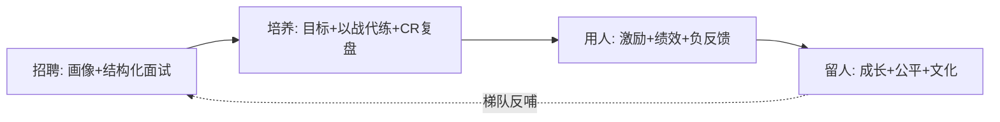
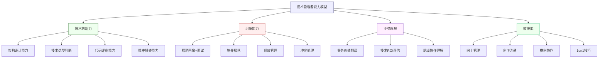
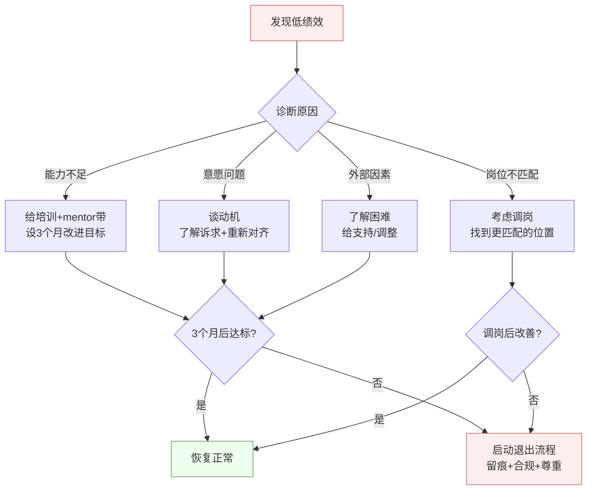
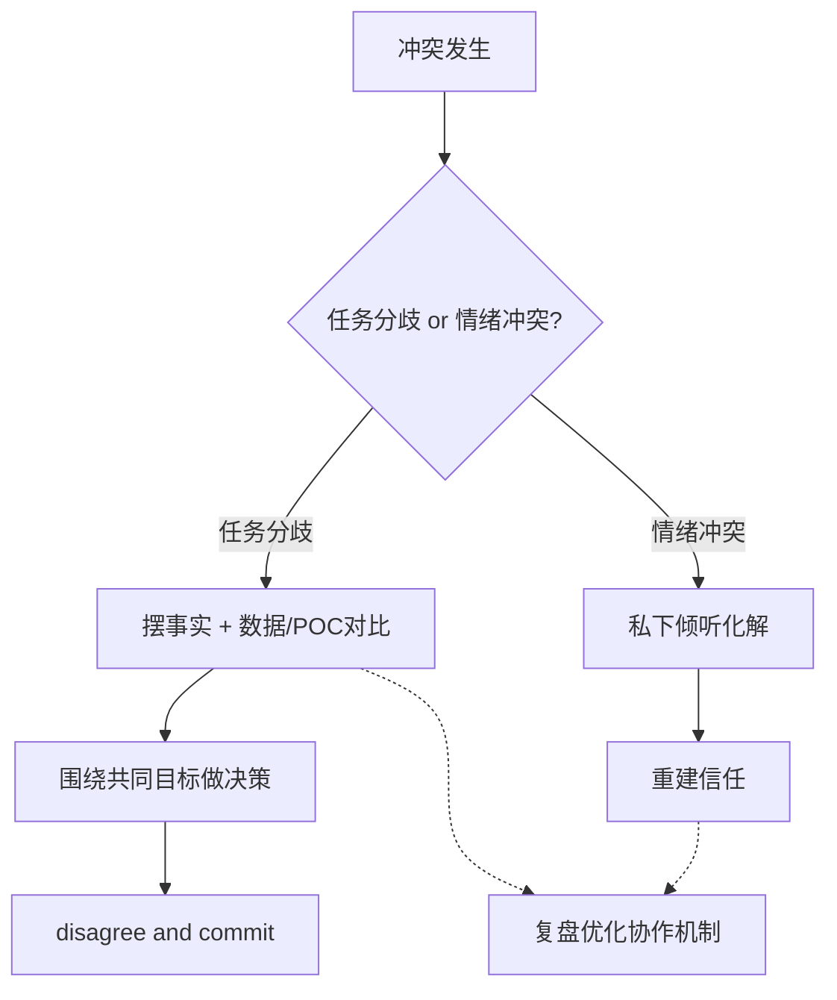
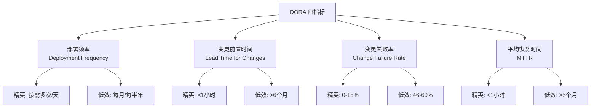
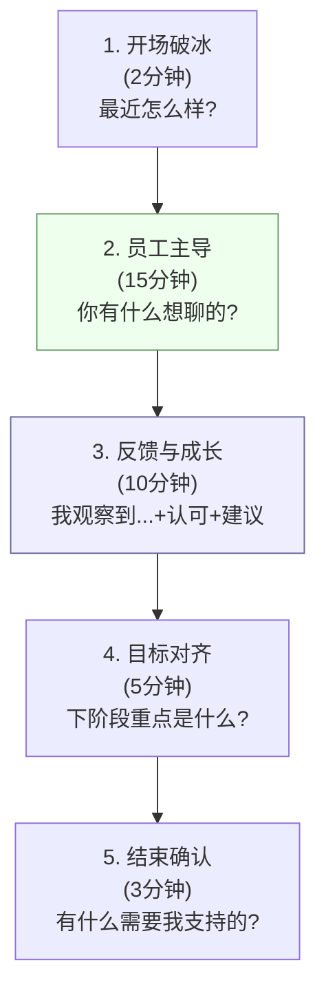
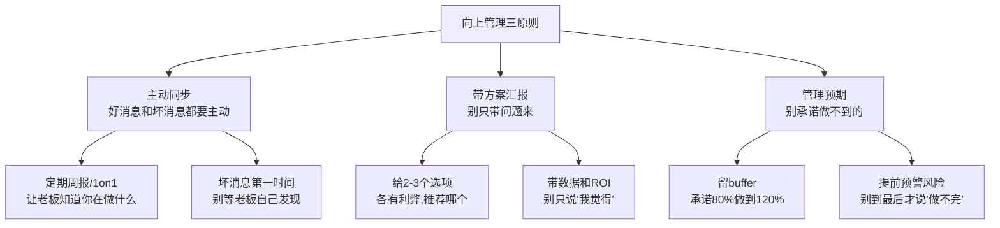
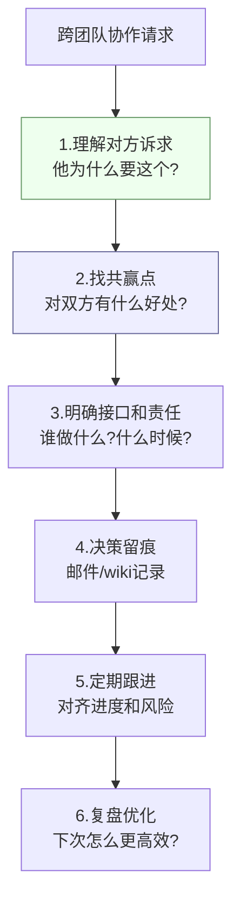

> 走技术管理路线，面试会重点问"带团队"的软硬实力。本文覆盖**招人 → 育人 → 用人（激励/绩效）→ 留人**、**冲突与决策**、**沟通（向上/向下/横向）**、**角色转型**。每节给面试**标准回答 + 考察点**。管理没有标准答案，重点是**结构化 + 有真实案例 + 有价值观**。

---

**管理闭环（选 → 育 → 用 → 留）速记图**：



## 一、从工程师到管理者的转型

- **核心转变**：从"把事做好"到"让团队把事做好"；从个人贡献者（IC）到通过他人拿结果；从技术深度到"技术判断力 + 组织能力"。
- **常见陷阱**：事必躬亲（不放权，自己成瓶颈）、只做技术不做管理、当"老好人"不敢给负反馈、忽视向上管理。
- **考察点**：是否理解管理是另一种专业能力，而非"升职奖励"；能否放手、能否面对人的复杂性。

**【深度拓展】** 转型最大的认知坑是「**把管理当升职奖励，而不是另一种专业**」。很多技术高手转型后继续抢活写代码，结果自己成瓶颈、团队没成长。真正的转变是「**通过他人拿结果**」——你的产出 = 团队的产出。另一个坑是「**不敢给负反馈**」：怕伤关系就只表扬，但苦劳不等于功劳，低绩效不处理是对高绩效成员的不公平。向上管理也常被技术人忽视：**坏消息越早带方案同步越好**，老板最怕「到最后才知道要黄」。

**【项目支撑】** 我的转型叙事真实且连续：早期在 XTransfer 做收款领域核心开发时，习惯自己把状态机/补偿写完才放心（事必躬亲，自己成瓶颈）。成为领域 Owner、主导预入账从 0 到 1 后，被迫学会「**拆细授权 + 定标准 + 兜底**」——把子模块交给成员 owner，只在资金安全红线上把关，并用 CR 和复盘把我的经验变成团队资产。这个转变直接让我带出了能独当一面的梯队，也让我在 HR 面讲「缺点改进」时有真实故事可讲。

**技术管理者能力模型图**：



**「从技术到管理」转型期常见陷阱**：

| 陷阱 | 表现 | 后果 | 纠正方法 |
| --- | --- | --- | --- |
| 事必躬亲 | 核心代码都自己写 | 自己成瓶颈，团队没成长 | 拆细授权，只在红线上把关 |
| 只做技术不做管理 | 忽视1on1/绩效/招聘 | 团队散漫，人才流失 | 每周固定时间做管理动作 |
| 当老好人 | 不敢给负反馈 | 高绩效寒心，低绩效摆烂 | 用SBI模型给具体负反馈 |
| 忽视向上管理 | 坏消息不及时同步 | 老板被动，信任崩塌 | 坏消息第一时间带方案同步 |
| 微观管理 | 事事过问、天天催进度 | 成员没自主权，效率低 | 定目标+定标准，过程放手 |
| 抢下属功劳 | 汇报时只说自己 | 成员没成就感，流失 | 汇报时先提成员贡献 |
| 不做知识沉淀 | 经验只在脑子里 | 离了他就转不了 | 文档+CR+复盘把经验变资产 |
| 招人只看技术 | 忽视协作/价值观 | 团队摩擦大 | 画像含软素质+团队互补维度 |

**【面试官追问】**：
- **追问1**：「你从 IC 转 Manager 最大的挑战是什么？」→ 答：「最大的挑战不是技术判断力——这个我有底气——而是学会『放手』。早期我习惯自己写核心代码，觉得这样最可靠，结果自己成了瓶颈、团队成长慢。后来在带预入账项目时，我刻意把子模块拆给成员 owner，只在资金安全红线上把关。结果不仅交付更快，还带出了能独当一面的梯队。」
- **追问2**：「你怎么判断一件事该自己做还是交给下属？」→ 答：「三看：一看风险等级（资金安全红线自己做，非核心交给下属）；二看成长价值（有挑战但可兜底的交给下属成长，重复性劳动自动化或分配）；三看紧急程度（紧急且高风险自己做，不紧急的交给下属练手）。」
- **追问3**：「管理者不写代码会不会技术退化？」→ 答：「会，但可以通过 CR、架构评审、攻坚疑难问题保持手感。我的原则是：不做关键路径上的开发（否则成瓶颈），但参与架构设计和关键方案评审，保持技术判断力不脱节。」

---

## 二、招聘（招人）

- **明确画像**：岗位需要的硬技能 + 软素质 + 团队互补（不是只招"最强"，是招"最合适")。
- **面试评估**：技术（真实场景 + 深挖原理 + 项目追问）、软素质（沟通/协作/学习力/抗压）、动机与稳定性、价值观匹配。
- **原则**：宁缺毋滥（一个错误招聘的成本远高于空缺）；用结构化面试减少主观偏差。
- **考察点**：你怎么判断一个人合不合适；怎么避免只看技术忽略协作。

**标准回答（你怎么招人）**：先定清晰画像（技能+软素质+团队缺口），结构化面试分维度打分，技术看"解决问题的思路和深度"而非背题，软素质看协作与成长性，最后看价值观是否匹配。宁缺毋滥。

**【深度拓展】** 招聘最忌「招最强的人」而非「招最合适的人」——一个只爱钻单机性能、不喜欢和风控/合规扯需求的牛人，放进资金领域团队反而制造摩擦。画像要包含**团队缺口维度**（我们缺的是能扛跨域协作的，还是能深钻某技术的）。技术面试深挖时，**给一个真实场景题比八股更能判别水平**（如「渠道回调重复你怎么保证不重复入账」），看的是思路深度和边界意识，而非背了多少名词。宁缺毋滥的底线是：一个错误招聘的成本（磨合+返工+可能的资损风险）远高于岗位空缺 1-2 个月。

**【项目支撑】** 作为 XTransfer 收款领域 Owner，我招人的画像很具体：**资金安全意识 + 跨域协作能力 + 分布式事务基本功**。面试必问真实场景：「一笔收款跨风控/申报/账务，渠道回调可能重复或迟到，你怎么设计保证不重不漏、最终一致？」能答出「状态机约束 + 幂等键 + 任务补偿 + 对账」的人，才是我们要的。因为收款领域直面 0 资损红线，招错人的代价是真金白银的赔付，所以我对「资金安全洁癖」这一项权重给得最高。

**结构化面试评分表模板**：

| 维度 | 权重 | 评分标准(1-5) | 候选人得分 |
| --- | --- | --- | --- |
| 技术深度 | 30% | 能讲清原理+源码级+边界 | ___ |
| 项目经验 | 20% | 有真实落地+决策逻辑+量化 | ___ |
| 系统设计 | 20% | 全局观+权衡意识+容错 | ___ |
| 编码能力 | 10% | 白板能写+边界处理+复杂度 | ___ |
| 协作沟通 | 10% | 表达清晰+倾听+跨团队意识 | ___ |
| 文化匹配 | 10% | 价值观+学习力+owner意识 | ___ |
| **加权总分** | 100% | ≥3.5 通过 | ___ |

> 面试后 15 分钟内填写，避免主观印象模糊。多人面试取平均分，低于 3.0 一票否决。

---

## 三、培养（育人）

- **手段**：设定成长目标（结合个人意愿与团队需要）、以战代练（给有挑战的任务 + 兜底）、CodeReview/技术分享沉淀、导师制、复盘文化。
- **因人而异**：新人给明确指导，老人给空间和挑战；技术型给深度，潜力型给广度和管理机会。
- **考察点**：能否培养梯队（不做"救火队长"，要让团队有人能顶）；授权与兜底的平衡。

**标准回答（怎么培养下属）**：先了解他的意愿和短板，设定阶梯式目标；用有挑战但可完成的任务锻炼（我兜底风险）；通过 CR、复盘、分享沉淀能力；定期 1on1 反馈调整。目标是让他能独当一面，团队有梯队。

**【深度拓展】** 培养的核心是「**给挑战但兜底风险**」的平衡——任务太简单没成长，太难又容易挫败或出生产事故。资金领域尤其要「**渐进放权**」：先让他 owner 一个非核心子模块（如某个渠道适配器），CR 严格把关，跑稳后再放权到核心链路。培养不能只靠「丢任务」，要靠**复盘把个人经验变成团队资产**：每次故障/重构都沉淀成文档和 checklist，让一个人踩的坑变成所有人避的坑。因人而异是铁律：新人要「明确指导 + mentor」，老人要「空间 + 挑战 + 技术深度」，潜力型要给「管理/跨团队机会」。

**【项目支撑】** 我在 XTransfer 带收款领域团队时，用「分层培养 + 知识沉淀」建梯队：新人从写渠道 SPI 实现、配动态表单入手（有模板、风险低），老人去 owner 风控子状态机、补偿框架这类核心（我兜底评审）；把「状态机怎么落地、补偿怎么设计、对账怎么勾兑」写成团队 wiki 和 CR 检查项。带「预入账」从 0 到 1 时，我刻意让 2 个成员分别 owner「预入账状态机」和「与账务的冻结/释放对接」，既交付了项目又培养了能独当一面的人——这直接对应我 HR 面里「早期不爱授权、后来学会拆细授权」的改进故事。

---

## 四、激励与绩效（用人）

### 4.1 激励
- **物理 + 精神**：薪酬/晋升是基础；认可、成长空间、有挑战的工作、自主权、归属感往往更持久（参考马斯洛/双因素理论）。
- **因人而异**：有人要钱、有人要成长、有人要影响力，先了解诉求。
- **考察点**：能否超越"发钱"理解动机；对不同人用不同激励。

### 4.2 绩效管理
- **方式**：目标对齐（OKR/KPI）→ 过程跟踪 → 客观评估（结果 + 行为，多源反馈）→ 反馈面谈 → 改进/激励。
- **难点**：怎么给低绩效负反馈、怎么处理"苦劳不等于功劳"、绩效校准公平性。
- **考察点**：能否客观公正、敢于给负反馈、把绩效和成长结合。

**标准回答（如何做绩效）**：期初对齐目标（可衡量），过程中定期反馈不搞秋后算账；评估看结果也看行为，尽量客观多源；面谈既肯定也指出不足并给改进方向。绩效是帮人成长的工具，不是打分排名。

### 4.3 怎么处理低绩效员工？
- **思路**：先诊断原因（能力/意愿/匹配/外部）→ 能力问题给培训和帮助、意愿问题谈动机、岗位不匹配考虑调岗 → 设定明确改进目标和期限（PIP）→ 持续不改再依规处理。全程留痕、尊重、给机会。
- **考察点**：不是简单"开除"，看诊断与人性化 + 底线。

**低绩效处理流程图**：



**PIP（绩效改进计划）模板**：

```text
员工: XXX
岗位: 高级Java开发
周期: 2026-08-01 至 2026-10-31 (3个月)

【当前问题】
1. 代码质量: Code Review 退回率 30% (团队平均 10%)
2. 交付效率: 迭代内任务延期率 40%
3. 协作: 跨团队沟通需多次跟进

【改进目标】
1. CR 退回率降到 <15%
2. 任务延期率降到 <15%
3. 独立完成至少1个跨团队协作项

【支持措施】
1. 指定 mentor 每周 CR 指导
2. 每周 1on1 跟进进展
3. 提供相关技术培训

【评估节点】
- 每月评估1次
- 3个月总评: 达标恢复 / 不达标启动退出
```

**【面试官追问】**：
- **追问1**：「你辞退过人吗？什么感受？」→ 答：「辞退是管理中最难的事之一，但对的人留下比错的人不走更重要。我的原则是：先给够机会（诊断→培训→PIP），确认不行再体面退出——全程尊重、留痕、合规。辞退不是惩罚，是对双方都好的止损。」
- **追问2**：「低绩效员工申诉怎么办？」→ 答：「让他陈述理由，用事实和数据回应（不是『我觉得你不行』，而是『CR 退回率 30% vs 团队平均 10%』）。如果他有合理理由（如分配的任务超出能力范围），调整任务；如果确实不行，坚持 PIP 流程。」

---

## 五、冲突处理（高频）

- **认知**：冲突分**功能性冲突**（对事、促进更优方案，要鼓励）和**破坏性冲突**（对人/情绪，要化解）。
- **处理框架**：① 判断是任务分歧还是情绪冲突；② 分别倾听双方诉求，用事实不用情绪；③ 围绕**共同目标**找最优解，必要时协调资源或向上；④ 复盘优化协作机制，防复发。
- **技术分歧**：用数据/POC/原型说话，而非谁官大谁对；定决策后即使有人不同意也 disagree and commit。
- **考察点**：能否区分冲突性质、对事不对人、有结构化方法。

**冲突处理结构化流程**：



**标准回答（如何处理团队冲突）**：先分辨是任务分歧还是情绪对立；任务分歧就摆事实、用数据和 POC 对比，围绕团队目标做技术决策，定了就 commit；情绪冲突先私下倾听化解，重建信任。事后复盘协作机制。冲突不可怕，管理好的冲突能让方案更好。

---

## 六、技术决策与技术判断力

- **决策原则**：基于数据和场景而非个人偏好；权衡（一致性/性能/成本/交付/团队熟悉度）；可逆决策快速做、不可逆决策谨慎评审。
- **技术选型**：成熟度、社区、团队掌握程度、与现有栈契合、长期维护成本，而非追新。
- **考察点**：能否为团队负责地做取舍；如何让团队认可决策（参与 + 数据 + 说清 why）。

**标准回答（怎么做技术决策）**：让相关人参与讨论，摆出选项和权衡（用数据/POC），我为最终决策负责；可逆的快速试错，不可逆的（如支付架构、数据模型）充分评审。定了就统一执行，即使有分歧也 disagree and commit。

**技术决策记录（ADR）模板**：

> ADR（Architecture Decision Record）是用文档记录技术决策的方法——记录"为什么选了这个方案"比"选了什么"更重要。

```markdown
# ADR-001: 收款系统使用补偿模式而非 TCC

## 状态
已采纳 (2026-01-15)

## 背景
跨境收款涉及风控、申报、账务、渠道多个域的跨域资金流转。
需要选择一种分布式事务方案保证最终一致性。

## 决策
选择 Saga/补偿模式，而非 TCC。

## 原因
1. TCC 需要三阶段侵入式编码（Try/Confirm/Cancel），跨风控/申报/账务锁太久
2. 渠道回调不可控（可能迟到/重复），TCC 的 Confirm 阶段不可靠
3. 补偿模式允许异步重放，可用性更高
4. 补偿模式可配合状态机做幂等约束，资金安全有保障

## 代价
- 放弃瞬时强一致，接受最终一致（秒级延迟）
- 补偿逻辑需要额外开发和维护

## 替代方案
- TCC：强一致但可用性差、侵入性强
- 本地消息表：简单但性能差、不适合高并发
- 事务消息：依赖RocketMQ，和现有技术栈不匹配

## 后续计划
- 2026Q2: 补偿框架上线
- 2026Q3: T+1 对账兜底上线
```

**【面试官追问】**：
- **追问1**：「你们有 ADR 吗？还是口头决策？」→ 答：「我们用 ADR 记录重要技术决策——好处是新人能快速理解决策背景，避免『为什么这么设计』的重复提问；也避免后人推翻决策时重复踩坑。」
- **追问2**：「技术决策错了怎么办？」→ 答：① 快速识别——通过监控/告警/用户反馈发现决策导致的问题；② 评估可逆性——可逆的快速回滚，不可逆的找补偿方案；③ 复盘——写 ADR 补充「什么情况下这个决策是错的」，避免重犯。

---

## 六-补、团队效能度量（DORA 指标）

> 管理不能凭感觉，要用数据度量团队效能。DORA（DevOps Research and Assessment）四指标是业界公认的团队效能度量标准。

**DORA 四指标及团队效能分级**：



| 指标 | 定义 | 精英级 | 高效能 | 中等 | 低效 |
| --- | --- | --- | --- | --- | --- |
| 部署频率 | 多少时间部署一次 | 按需多次/天 | 每周-每月 | 每月-每半年 | 每半年+ |
| 变更前置时间 | 代码提交到上线的时间 | <1小时 | 1天-1周 | 1周-1月 | 1月+ |
| 变更失败率 | 部署导致故障的比例 | 0-15% | 16-30% | 16-30% | 46-60% |
| 平均恢复时间 | 故障到恢复的时间 | <1小时 | <1天 | <1天 | >6月 |

**DORA 之外补充度量指标**：

| 维度 | 指标 | 说明 |
| --- | --- | --- |
| 交付质量 | Bug 逃逸率 | 线上Bug数 / 总Bug数 × 100% |
| 交付质量 | 回归测试覆盖率 | 回归测试覆盖的代码比例 |
| 团队健康 | 成员留存率 | 年度留存率 > 90% 为健康 |
| 团队健康 | 倦怠指数 | 加班时长/值班频次/满意度调研 |
| 业务价值 | 需求交付周期 | 需求提出到上线的总时间 |
| 业务价值 | 交付可预测性 | 实际交付 / 计划交付 的比率 |

**【深度拓展】** DORA 指标的核心价值不是「考核」，而是「**诊断改进**」——部署频率低说明 CI/CD 有瓶颈，变更失败率高说明测试不足或 Code Review 不严，MTTR 长说明监控告警不完善。管理者应该用这些指标找到团队的「最弱环节」针对性改进，而不是拿来排名打分。另外 DORA 指标要**看趋势不看绝对值**——从每月部署 1 次提升到每周部署 1 次就是进步，不必和精英级比。

**【项目支撑】** 在 XTransfer 做收款领域 Owner 时，我用类似 DORA 的指标度量团队效能：① 部署频率——从每两周 1 次提升到每周 1 次（CI/CD 自动化）；② 变更失败率——通过 CR 严格把关+自动化测试，保持在 <10%；③ MTTR——通过监控告警+应急预案，线上故障平均 10 分钟止血（对应线上事故 10 分钟止血的目标）；④ 域内生产问题下降 80% 就是交付质量提升的量化证明。

---

## 六-补2、1on1 技巧模板

> 1on1 是管理者最重要的工具——但很多人把 1on1 开成了"进度汇报会"，浪费了这个宝贵的沟通机会。

**1on1 结构化模板**：



**1on1 话题清单（按频率）**：

| 频率 | 话题 | 好问题 |
| --- | --- | --- |
| 每周 | 状态与困难 | 「这周有什么卡住的吗？」「需要我帮你推进什么？」 |
| 每月 | 成长与反馈 | 「这个月觉得自己哪里成长了？哪里想改进？」 |
| 每季度 | 职业发展 | 「未来半年你想往哪个方向发展？我能怎么支持？」 |
| 每半年 | 绩效与目标 | 「对当前目标完成情况怎么看？」「有没有觉得不公平？」 |
| 不定期 | 情绪与状态 | 「最近感觉压力大吗？」「有什么让你沮丧的事？」 |

**1on1 常见错误与纠正**：

| 错误 | 为什么错 | 纠正 |
| --- | --- | --- |
| 开成进度汇报 | 浪费1on1价值，进度在站会看 | 1on1 聊人，不聊事 |
| 管理者说太多 | 应该员工多说 | 80% 时间让员工说 |
| 只说工作不聊成长 | 忽视长期发展 | 每次至少聊5分钟成长 |
| 不做记录 | 下次忘了聊了什么 | 简要记录要点和行动项 |
| 取消1on1 | 员工觉得不被重视 | 1on1是最不可取消的会议 |
| 只给负反馈 | 员工害怕1on1 | 正负反馈 3:1 比例 |

**SBI 反馈模型**（Situation-Behavior-Impact）：

```text
S (Situation): 在什么场景下
  "在上周的支付网关 Code Review 中..."

B (Behavior): 观察到的具体行为
  "你直接合并了自己提交的 PR，没有等其他人 review"

I (Impact): 这个行为的影响
  "结果上线后发现一个边界 case 没覆盖，导致了一笔重复入账"

→ 改进建议: "以后核心链路的 PR，至少要等一个 reviewer approve，
特别是涉及资金状态的改动。你可以自己先 review 一遍边界 case。"
```

**【项目支撑】** 在 XTransfer 带收款领域团队时，我坚持每周和每个成员 1on1（30分钟），主要聊三件事：① 状态和困难（有什么卡住的）；② 成长反馈（我观察到你的进步/不足）；③ 目标对齐（下阶段重点）。用 SBI 模型给负反馈——比如「上次渠道适配器 PR 没等 review 就合并，导致了一个边界 bug，以后核心改动至少等一个 approver」——比笼统说「你做事不细心」有效得多。

---

## 六-补3、向上管理策略

> 技术人最容易忽视向上管理——觉得"做好技术就行"。但向上管理不是"拍马屁"，而是「**让老板成功，你才能成功**」。

**向上管理核心原则**：



**向上管理实操清单**：

| 场景 | 差的做法 | 好的做法 |
| --- | --- | --- |
| 日常同步 | 等老板问才说 | 每周主动发周报（3条进度+1个风险） |
| 遇到问题 | 只说"有问题" | "遇到X问题，我准备了A/B两个方案，推荐A因为..." |
| 坏消息 | 藏着等事情恶化 | 第一时间同步+带影响评估+带方案 |
| 争取资源 | "我需要加人" | "当前吞吐X，加1人可提升到Y，ROI是Z" |
| 进度延期 | 到 deadline 才说 | 提前1周预警+"延期原因+补救方案+新时间" |
| 汇报成果 | 只说做了什么 | 说"带来了什么业务结果"+量化数字 |
| 老板想法不对 | 当面硬刚 | 私下1on1说"我有不同看法，数据是..." |
| 老板给了不合理目标 | 硬接下来说"没问题" | "这个目标有挑战，我评估一下可行性，X天内给你方案" |

**【深度拓展】** 向上管理的本质是「**预期管理**」——老板最怕的不是"做不到"，而是"到最后才知道做不到"。所以：① 坏消息越早带方案同步越好（老板有时间调整）；② 承诺留 buffer（承诺 80% 做到 120% 比承诺 100% 做到 90% 好）；③ 定期同步让老板有掌控感（他不需要细节，需要确定感）。另一个深度点：向上管理不是"迎合老板"，而是「**用老板听得懂的语言沟通**」——技术人喜欢讲技术细节，老板想听的是「业务影响+ROI+风险」，翻译好语言向上汇报才有效。

**【面试官追问】**：
- **追问1**：「你和老板意见不一致怎么办？」→ 答：「私下 1on1 沟通，用数据说话而非情绪——『我理解您的思路，但从数据看 X 方案风险更高，因为...』。如果老板坚持，我会 disagree and commit——执行老板的决策，但记录我的不同意见（ADR），如果后续证明老板错了，也有据可查。」
- **追问2**：「你怎么向老板争取技术建设资源？」→ 答：「把技术建设翻译成业务语言——不是『我要重构代码』，而是『重构后生产问题减少 80%，相当于每年节省 X 万运维成本+减少 Y 次资损风险』。用 ROI 说话比用技术指标说话有效 10 倍。」
- **追问3**：「老板给了不可能完成的目标怎么办？」→ 答：「不当面拒绝，也不硬接。先说『这个目标很有挑战，让我评估一下可行性，X 天内给您一个拆解方案』。评估后给出：① 能做到的部分+时间；② 做不到的部分+原因+替代方案；③ 需要的资源支持。让老板做选择，而不是你说『做不到』。」

---

## 七、沟通（向上 / 向下 / 横向）

- **向上管理**：主动同步进展和风险（尤其坏消息越早越好）、带方案汇报、对齐优先级和资源、管理老板预期。
- **向下沟通**：清晰传达目标和 why、给反馈（表扬具体、批评对事）、1on1 了解状态和诉求。
- **横向协作**：用共同目标推动、明确接口和责任、决策留痕。
- **1on1 要点**：定期、以员工为中心、聊状态/成长/困难/反馈，不是进度汇报会。
- **考察点**：向上管理意识（很多技术人忽视）、给负反馈的能力、1on1 会不会开。

**标准回答（怎么和老板 / 下属沟通）**：向上——定期同步 + 坏消息第一时间带方案 + 对齐优先级；向下——讲清目标和原因、定期 1on1 给成长反馈；横向——用共同目标和数据推动、留决策记录。核心是透明和预期管理。

**向下沟通技巧清单**：

| 场景 | 技巧 | 示例 |
| --- | --- | --- |
| 传达目标 | 讲"为什么"不只是"做什么" | "我们这季度要做X，因为业务需要Y" |
| 给正反馈 | 公开+具体+及时 | "今天你处理那个渠道超时的方案很好，快速降级了" |
| 给负反馈 | 私下+SBI模型+给改进方向 | 私下1on1用SBI讲具体行为和影响 |
| 委派任务 | 讲清目标+标准+权限，过程放手 | "目标X，验收标准Y，预算Z，你决定怎么做" |
| 拒绝请求 | 先理解需求→给替代方案 | "理解你的需求，但当前优先级是X，可以先做Y替代" |
| 承认错误 | 直接说"我错了"+给纠正方案 | "这个决策我考虑不周，方案调整如下..." |

**横向协作框架**：



**【面试官追问】**：
- **追问1**：「跨团队需求被拒绝怎么办？」→ 答：① 先理解对方为什么拒绝（不是不配合，是有约束）；② 找共赢点（帮他解决什么问题）；③ 如果确实冲突，拉双方领导对齐优先级；④ 决策后即使不同意也 commit。
- **追问2**：「你怎么推动一个跨团队的项目？」→ 答：① 先和各方对齐目标（大家为什么要做这个）；② 明确接口和分工（谁做什么什么时候）；③ 建立定期同步机制（每周15分钟）；④ 风险第一时间暴露+带方案；⑤ 交付后复盘感谢各方贡献。
- **追问3**：「你做过最难的跨团队协作是什么？」→ 答：「XTransfer 预入账涉及风控、申报、账务三个域——每个域的优先级和节奏不同。我先拉各方对齐『预入账对业务的价值』，再明确接口和边界，最后用周会+ADR 确保决策留痕。最难的不是技术，是让三个团队在同一时间线上协作。」

---

## 八、团队文化与稳定性

- **文化**：工程文化（CR/测试/复盘/文档）、Blameless 复盘（对事不对人）、知识共享、心理安全感。
- **留人**：成长空间 + 有意义的工作 + 公平回报 + 好的 leader；关注核心成员的诉求和倦怠。
- **考察点**：能否营造让人愿意留下的环境；核心成员要走怎么办（先了解真实原因，能挽留则挽留，不能则体面 + 做好知识交接和梯队）。

**【深度拓展】** 留人最贵的是「**核心成员无声离开**」——等提离职往往已晚了。所以要靠**定期 1on1 探测倦怠与诉求**，在「钱/成长/关系/方向」四个维度上提前发现信号。Blameless 复盘文化是留人的隐性杠杆：资金领域出故障压力大，如果一出事就追责，骨干会被吓跑；对事不对人反而让人敢扛事。另一个深度点是「**梯队本身就是留人手段**」——当个人不再是单点依赖，他才有空间去挑战更大的事，而不是被锁死在重复劳动里。

**【项目支撑】** 在 XTransfer 做收款领域 Owner，我用三件事留人：① **成长通道**——让成员从「写渠道适配」走到「owner 子领域（如预入账、风控子状态机）」，把每段经历变成下一段的资本；② **公平回报 + 透明**——晋升和绩效基于「资金安全结果 + 交付」的事实数据，而非印象；③ **Blameless 文化**——域内生产问题下降 80%，部分来自大家敢在复盘里暴露隐患而非掩盖。核心成员有离职苗头时，我会先 1on1 弄清真实原因（是钱、是方向、还是带得太细没空间），能调就调（换方向/加挑战），不能则体面交接、做好知识补位——这也是我对「带团队离了我也转」的追求。

**团队文化建设的工程实践**：

| 文化实践 | 具体做法 | 效果 |
| --- | --- | --- |
| Code Review 文化 | CR 必须 2 人 approve，CR 评论 > 10 条/PR | 代码质量+知识共享 |
| Blameless 复盘 | 故障复盘只问"为什么"不问"谁的错" | 敢暴露隐患 |
| 技术分享 | 每双周1次内部分享（15分钟+5分钟QA） | 知识扩散+表达能力 |
| 文档文化 | 重要决策写ADR，核心流程写wiki | 新人快速上手 |
| 预案演练 | 每季度做1次故障注入演练 | 验证应急预案 |
| 结对编程 | 新人+老人结对做1个迭代 | 新人快速融入 |

**团队稳定性指标看板**：

| 指标 | 健康值 | 预警值 | 危险值 |
| --- | --- | --- | --- |
| 年度留存率 | >90% | 80-90% | <80% |
| 平均在职时长 | >2年 | 1-2年 | <1年 |
| 加班时长/周 | <10h | 10-15h | >15h |
| 1on1满意度 | >4/5 | 3-4/5 | <3/5 |
| 内部晋升率 | >30% | 15-30% | <15% |
| 主动提案数/人/季度 | >2 | 1-2 | <1 |

---

## 九、面试高频问答（标准回答汇总）

**Q：你带过多少人？管理风格是什么？**
> 简述规模和构成；风格：目标清晰 + 充分授权 + 结果导向 + 关注成长；因人而异（新人多指导、老人多空间）。举一个体现风格的例子。

**【深度拓展】** 答「带过多少人」时，数字本身不重要，**构成和你的角色**才重要——带 3 个资深和带 10 个校招是完全不同的管理难度。风格描述要避免「放羊型」或「微管型」两个极端，最佳表述是「**目标清晰 + 充分授权 + 关键节点把关**」。面试官真正在听的是「你有没有自己的管理哲学」，而不是形容词堆砌。进阶：用**一个具体转变**证明风格不是嘴上说的（如「我曾事必躬亲，后来发现成瓶颈，主动调整为授权 + 兜底」）。

**【项目支撑】** 我在 XTransfer 的角色是**收款领域 Owner**（对域内技术 + 稳定性 + 0 资损负责），同时以专项负责人身份从 0 到 1 主导「预入账」子领域（产品研讨→架构→项目管理→落地），这期间带着一个小团队作战。我的风格是「**目标对齐 + 拆细授权 + CR 兜底**」：把预入账拆成「状态机 / 与账务冻结释放对接 / 与风控申报联动」等子模块，分给成员 owner，我只在架构边界和资金安全红线（幂等、对账、状态约束）上把关。这样既保证了 0 资损，又让成员得到了「主导一块」的成长——正是「通过他人拿结果」的落地。

**Q：技术 leader 还要不要写代码？**
> 要，但重心变了：不追求写最多代码，而是通过 CR、架构设计、攻坚关键难题保持技术判断力，同时把主要精力放在团队和方向上。完全脱离代码会失去技术判断力，事必躬亲又会成瓶颈——找平衡。

**Q：怎么平衡业务交付和团队成长/技术建设？**
> 短期靠交付立信任，长期靠团队能力和技术建设提效。做法：每个迭代留一定比例做技术优化和成长；把技术建设和业务目标绑定（如稳定性建设支撑大促）；用数据向上争取投入。

**Q：核心员工要离职怎么办？**
> 先真诚 1on1 了解真实原因（钱/成长/关系/方向）；能解决的尽力争取（调薪/换方向/给挑战）；确实要走则体面对待、做好知识交接和职责补位，反思团队是否有系统问题。平时就要建梯队，不让单点依赖。

**Q：从工程师转管理，你最大的挑战是什么？**
> 诚实但正向：最初倾向自己上手（快但不可持续），后来学会授权和培养、接受"通过他人拿结果"、面对人的复杂性和给负反馈。用一个具体转变的例子体现成长。

**Q：怎么衡量一个团队/管理是否成功？**
> 多维：业务结果（交付/质量/稳定性）、团队成长（有人晋升/能独当一面/有梯队）、团队健康（留存/氛围/协作）、可持续（不靠加班和英雄主义）。好的管理是团队离了你也能转。

---

## 更多高频追问（补充）

**Q：团队里有技术能力强但不好合作的人，怎么管理？**
> 先肯定其价值、别打压；私下 1on1 讲清楚"合作也是产出的一部分"，用具体事例而非贴标签；给他能发挥的空间（如攻坚硬骨头、做技术分享），把"个人英雄"的能量引导到"带动团队"；设清晰的协作底线（评审、文档、响应）。若持续影响团队，要坦诚给负反馈并观察改进。核心是"用其长、限其短、给通道也给底线"。

**Q：怎么给团队成员做绩效评估和负反馈？**
> 绩效基于**事实和目标**（事先对齐 OKR/KPI，事后拿数据说话），避免凭印象。负反馈用 **SBI 模型**（Situation-Behavior-Impact，就事论事讲具体行为和影响，不评判人），并给出可改进的方向和支持。原则：正反馈公开、负反馈私下、及时而非攒到年底、对事不对人。目的是帮他成长而不是发泄。

**Q：怎么做技术团队的梯队建设和人才培养？**
> ① **分层培养**——新人给明确任务 + mentor 带、骨干给有挑战的项目 owner、核心给跨团队/架构级机会；② **知识沉淀**——文档、分享、Code Review 让经验从个人变成团队资产；③ **补位机制**——关键岗位有 backup，避免单点依赖；④ **给成长通道**——技术线也能晋升，不是只有转管理一条路。目标是"团队离了任何一个人（包括我）都能转"。

**Q：技术管理者要不要继续写代码？**
> 要保持"技术手感"但不抢活。我的原则：不做团队关键路径上的开发（否则成瓶颈），但会参与架构设计、关键方案评审、Code Review、攻坚疑难问题。保持写代码是为了"能做技术判断、和团队有共同语言、不脱节"，而不是和一线抢产出。平衡点是"懂细节但不陷在细节里"。

**Q：怎么在业务压力下坚持技术建设？**

> 三条策略：① **把技术建设翻译成业务语言**——不说"我要重构"，说"重构后生产问题减少80%，相当于每年节省X万运维成本"；② **绑定业务目标**——把稳定性建设和大促/新业务上线绑定，"大促前做完限流降级，否则扛不住"；③ **用数据争取投入**——"当前变更失败率30%，做完自动化测试预计降到10%，节省X个迭代"。核心是让老板看到技术建设的 ROI，而不是技术人自嗨。

**Q：你如何做团队的技术规划？**

> 自上而下三步：① **对齐业务目标**——未来1-2年业务往哪走，技术要支撑什么；② **识别技术债和瓶颈**——当前系统最大的风险/瓶颈在哪（如老系统散落if/else、缺乏监控告警）；③ **制定技术路线图**——按优先级排序（风险>瓶颈>优化），每个季度做2-3个重点项，留20%带宽应对临时需求。路线图要和老板对齐、和团队同步，定期 review 调整。

**Q：怎么衡量你自己作为管理者的成功？**

> 四个维度：① **业务结果**——交付质量/稳定性/效率有没有提升（如生产问题-80%）；② **团队成长**——有没有人晋升/能独当一面/有梯队；③ **团队健康**——留存率/氛围/协作好不好；④ **可持续**——不靠加班和英雄主义，团队离了你也能转。最高标准是"团队离了你也能转"——说明你建了机制、培养了人，而不是把自己变成了单点依赖。

<!-- EXPANDED -->
