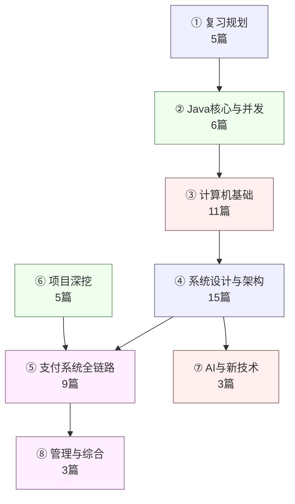
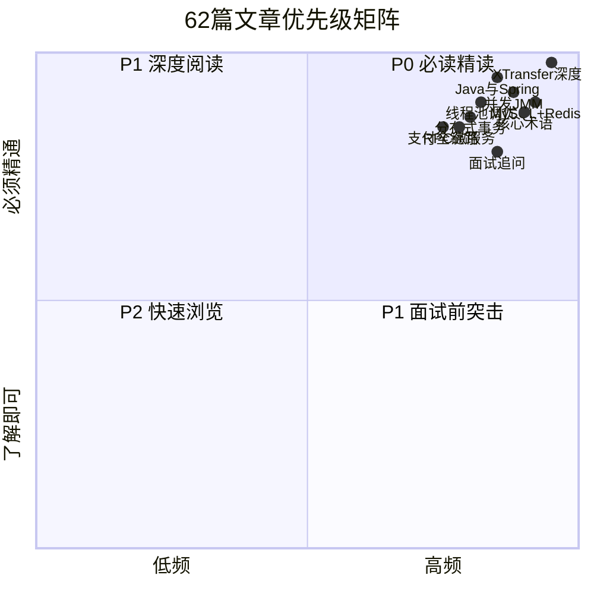
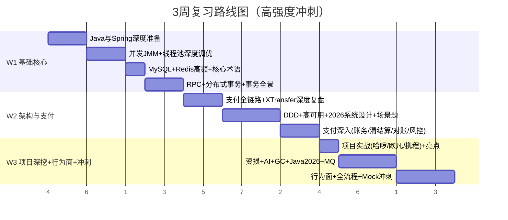
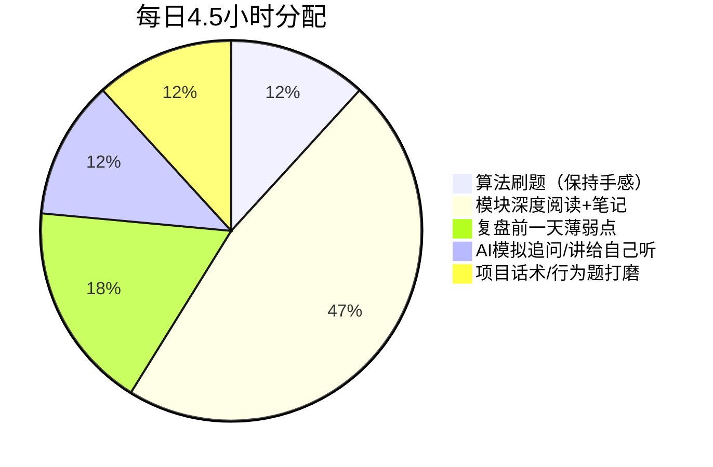
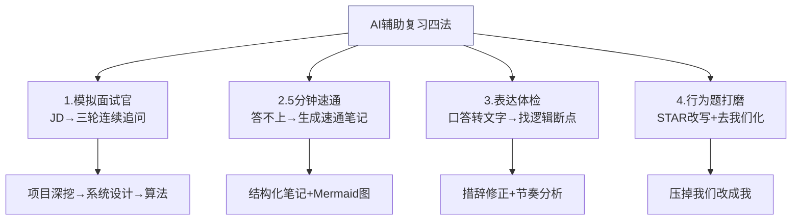

## 为什么需要一份「系统化复习规划」

过去面试最大的问题是 **准备漫无目的**：刷了一堆题却讲不清项目，八股背了又忘，面完发现"复习的和问的不重叠"。

这份规划解决三个核心问题：
1. **读什么**——62篇文章按优先级和模块索引，不遗漏也不浪费时间
2. **什么时候读**——3周节奏精确到每天读哪篇，每天投入多少
3. **怎么验证读透了**——每个模块配自测清单，能用 STAR 讲出来才算过

> 一个关键认知：**技术面只占面试的一半**。另一半是行为面（自我介绍、动机、沟通、复盘）——很多技术很强的人栽在这里。本规划把行为面同样纳入体系。

---

## 一、八大模块全景索引（62篇文章分类）

> 62篇文章按主题分为八大模块，每个模块有明确的复习目标、对应文章清单和产出物。



### 模块①：复习规划（5篇）

> 本模块是「怎么准备面试」的方法论与流程文档，不含技术细节；其余 48 篇技术文章按主题归入模块②-⑪。

| 优先级 | 文章 | 行数 | 核心价值 |
| --- | --- | --- | --- |
| **P0** | [面试准备总览与复习规划](/post/准备-复习总览与进度看板)（本文） | 550+ | 全局索引+3周节奏+行为题+自测清单 |
| P1 | [Java面试网站大全（50+）](/post/准备-Java面试网站大全（50+）) | 914 | 20+博客索引+Top20必读清单 |
| P1 | [面试全流程场景准备（从笔试到入职）](/post/准备-面试全流程场景准备（从笔试到入职）) | 600 | 笔试→技术面→HR面→Offer→入职全流程 |
| P2 | [HR面与薪酬谈判实战（含Offer选择）](/post/准备-HR面与薪酬谈判实战（含Offer选择）) | 524 | 薪酬拆解+谈薪话术+Offer决策 |
| P2 | [英文面试与技术英语表达](/post/准备-英文面试与技术英语表达) | 506 | 英文STAR+系统设计+150词词汇表 |

> 注：原误归入本模块的 [面试高频考点深度追问](/post/准备-面试高频考点深度追问) 属「术语考点」模块（见 P0 清单）、[大厂后端高频面试题汇总（2026）](/post/准备-大厂后端高频面试题汇总（2026）) 属「系统设计」模块（④），已在对应模块与 P0/P1/P2 清单收录，避免重复。

### 模块②：Java核心与并发（6篇）

| 优先级 | 文章 | 行数 | 核心价值 |
| --- | --- | --- | --- |
| **P0** | [Java与Spring深度准备](/post/准备-Java与Spring深度准备) | 1470 | IoC/AOP源码+事务传播+三级缓存 |
| **P0** | [并发编程与JMM深挖](/post/准备-并发编程与JMM深挖) | 806 | JMM模型+锁升级+AQS+虚拟线程 |
| **P0** | [线程池深度调优与高并发实践](/post/准备-线程池深度调优与高并发实践) | 1512 | 伪共享+CAS/Lock-Free+秒杀优化 |
| P1 | [GC深度调优与ZGC实战](/post/准备-GC深度调优与ZGC实战) | 1091 | ZGC染色指针+美团迁移实战 |
| P1 | [Java 2026面试新增考点与风向变化](/post/准备-Java 2026面试新增考点与风向变化) | 1894 | 虚拟线程+ZGC+StringTemplate |
| P1 | [消息队列MQ面试准备](/post/准备-消息队列MQ面试准备) | 1086 | RocketMQ存储+Kafka零拷贝+积压处理 |

### 模块③：计算机基础（11篇）

| 优先级 | 文章 | 行数 | 核心价值 |
| --- | --- | --- | --- |
| **P0** | [面试核心术语详解](/post/准备-面试核心术语详解) | 1436 | CAP/BASE/幂等/最终一致全术语图解 |
| **P0** | [MySQL与Redis高频面试](/post/准备-MySQL与Redis高频面试) | 1337 | EXPLAIN+MVCC+锁体系+Redis集群 |
| P1 | [Redis核心原理与数据结构深度解析](/post/准备-Redis核心原理与数据结构深度解析) | 879 | SDS/六种编码/RDB+AOF/单线程/8大淘汰策略 |
| P1 | [Redis高可用与集群架构实战](/post/准备-Redis高可用与集群架构实战) | 812 | 主从/Sentinel/Redis Cluster/Codis/脑裂防护 |
| P1 | [Redis缓存设计与分布式锁实战](/post/准备-Redis缓存设计与分布式锁实战) | 857 | 一致性/三大坑/Redlock/Redisson/限流 |
| P1 | [MySQL索引原理与查询优化实战](/post/准备-MySQL索引原理与查询优化实战) | 1055 | B+树/覆盖索引/ICP/索引失效12场景/EXPLAIN |
| P1 | [MySQL事务锁机制与MVCC深度解析](/post/准备-MySQL事务锁机制与MVCC深度解析) | 891 | ReadView/临键锁/死锁/XTransfer并发实战 |
| P1 | [MySQL性能调优与高可用架构](/post/准备-MySQL性能调优与高可用架构) | 931 | BufferPool/复制/MGR/8.0新特性/分库分表 |
| P1 | [网络TCP与RPC实践](/post/准备-网络TCP与RPC实践) | 642 | TCP状态机+拥塞控制+QUIC |
| P1 | [程序员面试基础知识大全](/post/准备-程序员面试基础知识大全) | 717 | OS/设计模式/安全/云原生速查 |
| P2 | [后端技术补漏（Web安全·OS·设计模式·云原生·可观测）](/post/准备-后端技术补漏（Web安全·OS·设计模式·云原生·可观测）) | 776 | OWASP+IO模型+K8s+可观测三支柱 |

### 模块④：系统设计与架构（15篇）

| 优先级 | 文章 | 行数 | 核心价值 |
| --- | --- | --- | --- |
| **P0** | [RPC框架与微服务治理](/post/准备-RPC框架与微服务治理) | 1283 | Dubbo SPI+注册中心+Sentinel熔断 |
| **P0** | [分布式事务与一致性](/post/准备-分布式事务与一致性) | 808 | 2PC/TCC/Saga/Seata+选型决策树 |
| **P1** | [事务一致性全景：MySQL本地事务·Spring声明式事务·分布式事务（XTransfer实战）](/post/准备-事务一致性全景：MySQL本地事务·Spring声明式事务·分布式事务（XTransfer实战）) | 1100 | 三层演进框架+连接绑定+传播行为+六大方案+XTransfer 0资损+书单 |
| P1 | [分布式共识协议Raft与Paxos深度解析](/post/准备-分布式共识协议Raft与Paxos深度解析) | 988 | Paxos/Raft/ZAB/etcd选主/XTransfer实战 |
| P1 | [分布式集群架构与一致性哈希](/post/准备-分布式集群架构与一致性哈希) | 900 | 一致性哈希/NWR/脑裂/向量时钟/CRDT |
| P1 | [DDD领域驱动设计实战指南](/post/准备-DDD领域驱动设计实战指南) | 1833 | 美团交易系统四步法+平台化演进 |
| P1 | [高可用容灾与稳定性](/post/准备-高可用容灾与稳定性) | 581 | 多地多活+混沌工程+SLO设计 |
| P1 | [2026系统设计面试演进（AI基础设施+全球化高并发）](/post/准备-2026系统设计面试演进（AI基础设施+全球化高并发）) | 1401 | LLM推理+向量数据库+秒杀漏斗 |
| P1 | [资深后端开放式场景设计题（10年+）](/post/准备-资深后端开放式场景设计题（10年+）) | 1442 | 12场景+追问链路+评分分档 |
| P2 | [支付渠道路由设计](/post/准备-支付渠道路由设计) | 592 | 多维路由+灰度切换+降级熔断 |

### 模块⑤：支付系统全链路（9篇）

| 优先级 | 文章 | 行数 | 核心价值 |
| --- | --- | --- | --- |
| **P0** | [XTransfer跨境支付收款平台深度复盘](/post/准备-XTransfer跨境支付收款平台深度复盘) | 2807 | 状态机+SPI+任务补偿+对账+0资损 |
| **P0** | [支付系统全链路架构](/post/准备-支付系统全链路架构) | 853 | 支付前置→交易→清结算→对账时序 |
| P1 | [支付系统架构与核心链路全景](/post/准备-支付系统架构与核心链路全景) | 738 | 十二字口诀+DDD分层+灰度策略 |
| P1 | [支付系统高频面试题集](/post/准备-支付系统高频面试题集) | 795 | 每题标准回答+深度拓展+追问 |
| P1 | [高可用跨境支付系统设计](/post/准备-高可用跨境支付系统设计) | 852 | 多地多活+三道防线+跨境特有挑战 |
| P1 | [账务账户体系与复式记账](/post/准备-账务账户体系与复式记账) | 514 | 借贷记账+日切+热点账户缓冲 |
| P1 | [清结算体系](/post/准备-清结算体系) | 459 | 清分规则+轧差算法+汇率损益 |
| P1 | [支付对账体系与差错处理](/post/准备-支付对账体系与差错处理) | 443 | 三层对账+T+1/T+2+跨境多时区 |
| P1 | [支付风控与反欺诈体系](/post/准备-支付风控与反欺诈体系) | 481 | 名单/规则/模型三层+AC自动机筛查 |

### 模块⑥：项目深挖（5篇）

| 优先级 | 文章 | 行数 | 核心价值 |
| --- | --- | --- | --- |
| **P0** | [XTransfer跨境支付收款平台深度复盘](/post/准备-XTransfer跨境支付收款平台深度复盘) | 2807 | （同模块⑤，项目深挖视角） |
| P1 | [哈啰工单与薪资系统实战](/post/准备-哈啰工单与薪资系统实战) | 586 | 工单规则引擎+薪资幂等+分库分表 |
| P1 | [欧凡海外直播电商系统实战](/post/准备-欧凡海外直播电商系统实战) | 693 | 多币种+Lua库存+WebSocket+CDN |
| P1 | [携程数据化运营平台实战](/post/准备-携程数据化运营平台实战) | 447 | OLAP选型+实时数仓+数据治理 |
| P1 | [支付项目亮点沉淀](/post/准备-支付项目亮点沉淀) | 497 | 亮点STAR叙事+技术/业务/管理分类 |

### 模块⑦：AI与新技术（4篇）

| 优先级 | 文章 | 行数 | 核心价值 |
| --- | --- | --- | --- |
| P0 | [AI认知与未来（是什么·能做什么·问题·未来工作与生活）](/post/准备-AI认知与未来（是什么·能做什么·问题·未来工作与生活）) | 330 | 架构师视角系统认知AI+人机协作+未来判断 |
| P1 | [AI与LLM工程落地探索](/post/准备-AI与LLM工程落地探索) | 1080 | vLLM+RAG+Agent+MCP+支付AI落地 |
| P1 | [向量检索与RAG实践](/post/准备-向量检索与RAG实践) | 602 | HNSW/IVF/PQ+混合检索+Embedding选型 |
| P2 | [Java面试网站大全（50+）](/post/准备-Java面试网站大全（50+）) | 914 | 20+博客索引+Top20必读清单 |

### 模块⑧：管理与综合（3篇）

| 优先级 | 文章 | 行数 | 核心价值 |
| --- | --- | --- | --- |
| P2 | [团队管理与技术领导力](/post/准备-团队管理与技术领导力) | 552 | 能力模型+DORA+1on1+ADR |
| P2 | [项目管理与工程实践](/post/准备-项目管理与工程实践) | 572 | 敏捷/Scrum+CI/CD+灰度发布 |
| P2 | [资损防控与极端场景应急（事前中后）](/post/准备-资损防控与极端场景应急（事前中后）) | 1127 | 19场景+三道防线+10+案例库 |

---

## 二、P0/P1/P2 优先级矩阵

> **P0 = 面试必考、最高频、必须能脱口而出**；P1 = 高频追问、需要能展开讲；P2 = 加分项、了解即可。



### P0清单（10篇，面试前必须精读，每篇能讲15分钟以上）

| # | 文章 | 理由 |
| --- | --- | --- |
| 1 | [XTransfer跨境支付深度复盘](/post/准备-XTransfer跨境支付收款平台深度复盘) | 核心项目，面试必问，2807行全方位覆盖 |
| 2 | [Java与Spring深度准备](/post/准备-Java与Spring深度准备) | Java生态最核心，IoC/AOP/事务/三级缓存 |
| 3 | [并发编程与JMM深挖](/post/准备-并发编程与JMM深挖) | 10年程序员必考，JMM+锁+AQS+虚拟线程 |
| 4 | [线程池深度调优](/post/准备-线程池深度调优与高并发实践) | 高并发实战，伪共享+CAS+秒杀优化 |
| 5 | [面试核心术语详解](/post/准备-面试核心术语详解) | 术语是面试语言，CAP/幂等/一致性 |
| 6 | [MySQL与Redis高频面试](/post/准备-MySQL与Redis高频面试) | 数据库+缓存是后端基石 |
| 7 | [RPC框架与微服务治理](/post/准备-RPC框架与微服务治理) | 分布式架构核心，Dubbo/Sentinel |
| 8 | [分布式事务与一致性](/post/准备-分布式事务与一致性) | 支付/金融系统必考 |
| 9 | [支付系统全链路架构](/post/准备-支付系统全链路架构) | 支付面试系统性回答框架 |
| 10 | [面试高频考点深度追问](/post/准备-面试高频考点深度追问) | 追问逃生路线图 |

---

## 三、3周复习节奏（高强度冲刺，精确到每天读哪篇）

> 知识量翻3倍后，把原计划压缩为 **3周高强度冲刺**：每周6天精读 + 1天复盘（AI 模拟面试），每日约 4-5 小时。第1周打基础核心（Java/并发/数据库/分布式），第2周攻架构与支付，第3周做项目深挖、行为面与全真 Mock。时间更紧就「保 P0、跳 P2、P1 只读重点章节」。



### 每周详细计划（3周·每周6天精读 + 1天复盘）

#### W1：基础核心（Java / 并发 / 数据库缓存 / 分布式基础）

| 日 | 阅读 | 目标 | 自测 |
| --- | --- | --- | --- |
| 周一 | [Java与Spring深度准备](/post/准备-Java与Spring深度准备)（IoC/AOP/事务） | 画 Bean 生命周期+三级缓存图 | 讲 @Transactional 失效场景 |
| 周二 | Java与Spring（Boot/Cloud/MyBatis）+ [并发编程与JMM深挖](/post/准备-并发编程与JMM深挖)（JMM/synchronized） | 自动装配原理+锁升级 | 讲 happens-before + 偏向锁触发 |
| 周三 | 并发JMM（AQS/工具/虚拟线程）+ [线程池深度调优](/post/准备-线程池深度调优与高并发实践) | CLH 队列 + ThreadPoolExecutor 流程图 | 讲 ReentrantLock 公平/非公平 + 伪共享 |
| 周四 | [MySQL与Redis高频面试](/post/准备-MySQL与Redis高频面试) + [面试核心术语详解](/post/准备-面试核心术语详解) | EXPLAIN + MVCC + ReadView | 讲 CAP/幂等/最终一致实战 |
| 周五 | [RPC框架与微服务治理](/post/准备-RPC框架与微服务治理) + [分布式事务与一致性](/post/准备-分布式事务与一致性) | SPI + 注册中心 + 2PC/TCC/Saga | 讲 Seata AT + 选型决策树 |
| 周六 | [事务一致性全景（XTransfer实战）](/post/准备-事务一致性全景：MySQL本地事务·Spring声明式事务·分布式事务（XTransfer实战）) + [网络TCP与RPC实践](/post/准备-网络TCP与RPC实践) | 三层事务框架 + TCP 11状态机 | 讲连接 ThreadLocal 绑定 + 2MSL |
| 周日 | 周复盘 + AI 模拟面试（技术三轮追问） | — | 录音回放改卡顿 |

#### W2：架构与支付（系统设计 + 支付全链路）

| 日 | 阅读 | 目标 | 自测 |
| --- | --- | --- | --- |
| 周一 | [支付系统全链路架构](/post/准备-支付系统全链路架构) + [XTransfer深度复盘](/post/准备-XTransfer跨境支付收款平台深度复盘)（状态机/SPI） | 全链路时序 + 状态机图 | 讲 SPI 自动发现 |
| 周二 | XTransfer复盘（补偿/对账/架构）+ [支付系统架构与核心链路全景](/post/准备-支付系统架构与核心链路全景) | 0资损三道防线 + 十二字口诀 | 讲灰度/AB/回滚策略 |
| 周三 | [DDD领域驱动设计实战](/post/准备-DDD领域驱动设计实战指南) + [高可用容灾与稳定性](/post/准备-高可用容灾与稳定性) | 四层架构 + 多地多活 | 讲聚合根选择 + SLI/SLO/SLA |
| 周四 | [2026系统设计面试演进](/post/准备-2026系统设计面试演进（AI基础设施+全球化高并发）) + [资深后端开放式场景设计题](/post/准备-资深后端开放式场景设计题（10年+）) | LLM 推理 + 秒杀漏斗 + 场景五步法 | 讲 45 分钟白板设计 |
| 周五 | [高可用跨境支付系统设计](/post/准备-高可用跨境支付系统设计) + [支付系统高频面试题集](/post/准备-支付系统高频面试题集) | 三道防线 + 每题标准答 | 讲热点账户方案 |
| 周六 | [账务账户体系与复式记账](/post/准备-账务账户体系与复式记账) / [清结算体系](/post/准备-清结算体系) / [支付对账体系与差错处理](/post/准备-支付对账体系与差错处理) / [支付风控与反欺诈体系](/post/准备-支付风控与反欺诈体系)（四篇速读） | 复式记账 + 轧差 + 三层对账 + 风控流 | 讲资金安全工程保障 |
| 周日 | 周复盘 + AI 模拟面试（系统设计白板） | — | 录音回放 |

#### W3：项目深挖 + 行为面 + 冲刺

| 日 | 阅读 | 目标 | 自测 |
| --- | --- | --- | --- |
| 周一 | [哈啰工单与薪资系统实战](/post/准备-哈啰工单与薪资系统实战) + [欧凡海外直播电商系统实战](/post/准备-欧凡海外直播电商系统实战) + [携程数据化运营平台实战](/post/准备-携程数据化运营平台实战) + [支付项目亮点沉淀](/post/准备-支付项目亮点沉淀) | 每项目 3 亮点 + 1 难点 | 用 STAR 讲 15 分钟不卡壳 |
| 周二 | [资损防控与极端场景应急](/post/准备-资损防控与极端场景应急（事前中后）) + [支付渠道路由设计](/post/准备-支付渠道路由设计) | 三道防线 SOP + 路由决策树 | 讲应急 T+1 对账 + 补偿 |
| 周三 | [AI与LLM工程落地探索](/post/准备-AI与LLM工程落地探索) + [向量检索与RAG实践](/post/准备-向量检索与RAG实践) | RAG Pipeline + Embedding 选型 | 讲 AI 在支付/风控落地 |
| 周四 | [GC深度调优与ZGC实战](/post/准备-GC深度调优与ZGC实战) + [Java 2026面试新增考点](/post/准备-Java 2026面试新增考点与风向变化) + [消息队列MQ面试准备](/post/准备-消息队列MQ面试准备) | ZGC 染色指针 + 虚拟线程 + 积压处理 | 讲 JDK8→17 迁移坑 |
| 周五 | [面试全流程场景准备](/post/准备-面试全流程场景准备（从笔试到入职）) + [HR面与薪酬谈判实战](/post/准备-HR面与薪酬谈判实战（含Offer选择）) + [英文面试与技术英语表达](/post/准备-英文面试与技术英语表达) | 全流程 + 谈薪话术 + 英文 STAR | 讲 Offer 决策矩阵 |
| 周六 | 全真 Mock 1（技术面）+ Mock 2（系统设计） | 45 分钟白板设计 | 录音复盘薄弱点 |
| 周日 | 查漏补缺 + 行为题话术打磨 + 模拟面试终验 | — | 跑通 ≥3 次 AI 模拟面试 |

## 四、每日投入模板（约4.5h）

> 3周冲刺下，每日投入提升到约 4.5 小时（知识量翻3倍 + 周期压缩）。在职备考可拆为「早45min+午45min+晚3h多段」，周末集中复盘 + AI 模拟面试。



| 时段 | 投入 | 做什么 |
| --- | --- | --- |
| 早 | 45min | 算法1题（按本周题型） |
| 午 | 45min | 复习昨天笔记+查漏 |
| 晚1 | 90min | 本周模块深度阅读+做笔记 |
| 晚2 | 30min | AI模拟追问（把当天读的丢给AI让它追问你） |
| 晚3 | 30min | 项目话术/行为题打磨（录音回放） |

---

## 五、自测检查清单（每个模块通过标准）

> **能用 STAR 讲出来才算过**。不是"读过了"，而是"能讲15分钟+被追问不卡壳"。

### 模块①通过标准

- [ ] 能1.5分钟做自我介绍，留3个钩子
- [ ] 能讲清楚为什么看机会（不贬前司）
- [ ] 准备了3档反问问题（技术/成长/业务）
- [ ] 跑通至少3次AI模拟面试

### 模块②通过标准

- [ ] 能画Spring IoC三级缓存图并讲循环依赖
- [ ] 能画JMM模型图+happens-before规则
- [ ] 能讲synchronized锁升级完整过程
- [ ] 能画ThreadPoolExecutor工作流程图
- [ ] 能讲伪共享原理+解决方案
- [ ] 能讲ZGC染色指针+读屏障原理

### 模块③通过标准

- [ ] 能逐字段解读EXPLAIN输出
- [ ] 能画MVCC版本链+ReadView可见性判断
- [ ] 能讲Redis 5种数据结构的内部编码
- [ ] 能画TCP 11状态机图
- [ ] 能讲CAP/BASE/幂等每个术语的实战案例

### 模块④通过标准

- [ ] 能画Dubbo SPI加载流程图
- [ ] 能画分布式事务选型决策树
- [ ] 能讲DDD四步法+限界上下文
- [ ] 能画多地多活架构图
- [ ] 能45分钟白板设计一个支付系统

### 模块⑤通过标准

- [ ] 能画支付→清结算→对账完整时序图
- [ ] 能讲清算vs结算的区别（含轧差）
- [ ] 能画三层对账架构图
- [ ] 能讲资金安全三道防线
- [ ] 能讲0资损的工程保障（幂等+补偿+对账）

### 模块⑥通过标准

- [ ] 每个项目能讲3亮点+1难点+1失败
- [ ] XTransfer能用STAR讲15分钟不卡壳
- [ ] 能讲跨项目的设计哲学串联

### 模块⑦通过标准

- [ ] 能画RAG完整Pipeline架构图
- [ ] 能讲LLM推理优化（vLLM/PagedAttention）
- [ ] 能讲AI在支付/风控/客服的落地案例

---

## 六、AI辅助复习方法论

> AI 负责「覆盖盲区」与「模拟压力」，但临场表达和工程判断只能自己练。

### 四种AI用法



### AI模拟面试官的Prompt模板

```
你是一个资深Java后端面试官（10年+经验），请按以下流程面试我：

第一轮：项目深挖（15分钟）
- 我会给你我的简历项目概述
- 你按STAR连续追问3-5层，重点关注技术决策的Why
- 每次只问一个问题，等我回答后再追问

第二轮：系统设计（20分钟）
- 你出一个和支付/高并发相关的系统设计题
- 我白板设计，你扮演面试官追问瓶颈和取舍

第三轮：算法（10分钟）
- 你出一道中等难度题
- 我口述思路+写伪代码

每轮结束后给我打分（1-5分）并指出薄弱点。
```

---

## 七、行为面标准回答（15题）

> 行为面不是「背答案」，而是 **提前想清楚、用 STAR 讲真实经历**。下面是我准备的15道标准话术，临场按公司微调。

### Q1：请做个自我介绍（1.5分钟版）

**结构**：一句定位 → 主线经历 → 亮点锚点 → 匹配岗位

> "我是10年经验的后端工程师，专注跨境支付、高可用与资金安全。主线经历：携程（数据平台）→ 哈啰（工单/薪资系统）→ 欧凡（海外直播电商）→ XTransfer（跨境支付收款），一条越做越接近钱、越做越核心的成长线。最近主导收款2.0重构，做到0资损、+30%人效、-80%生产问题，设计了支撑100+渠道的适配架构。贵司在XX方向正好匹配我的经验。"

> **要点**：别背简历。用「我现在能解决什么问题」替代「我做过什么」。结尾抛钩子（0资损、100+渠道）引导面试官往你最熟处挖。

### Q2：为什么看新机会 / 为什么选择我们

**标准回答**：现平台已把支付核心链路做到99.99%可用性，我想在「AI与支付业务深度结合」「更大规模架构治理」上继续突破；贵司在XX方向（提前调研过）正好匹配，我能把跨境支付+高可用+资金安全经验直接复用。

> **要点**：把「为什么走」讲成「想往上走」，把「为什么选你」讲成「我调研过、能贡献」。要具体（团队做什么、我的哪段经历能直接复用）。

### Q3：你的优缺点是什么

**优点（量化）**：落地意识强——习惯用指标定义成功（XTransfer 0资损、+30%人效、-80%生产问题）。
**缺点（真实但可控）**：早期容易在方案上追求完美、想把设计一次做对，现在学会用灰度+小步快跑去验证，避免过度设计——这正是2.0"边跑边治"的落地方式。

> **要点**：缺点要「真实+已改进」，别拿优点包装成缺点。

### Q4：你期望薪资 / 什么时候能到岗

**薪资**：基于当前薪资和市场对标，期望涨幅XX%，更看重成长空间和团队；具体可谈。
**到岗**：离职流程顺利，一个月内可到。

> **要点**：薪资别先报死数给区间；到岗体现确定性。详见[HR面与薪酬谈判实战](/post/准备-HR面与薪酬谈判实战（含Offer选择）)。

### Q5：你有什么想问我的（反问）

准备3档问题：
- **技术**：团队当前支付核心链路最大的架构挑战是什么？
- **成长**：这个岗位1年后在资金安全上的成功标尺是什么？
- **业务**：这块业务未来半年最关键的指标是什么？

> **要点**：反问是展示你「已经在想怎么干活」的机会。别问JD能查到的。

### Q6：你过去最大的失败 / 冲突

**失败**：一次渠道回调幂等边界漏覆盖导致试算偏差，靠T+1对账发现并补偿，事后固化进「资金安全三道防线」事中告警。
**冲突**：2.0重构是否动架构，用资损/故障数据+渐进式试点说服同事。

> **要点**：选「你主导解决」的失败，证明复盘文化和兜底意识。

### Q7：你在项目中遇到过最大的技术挑战

**STAR**：S（收款系统if/else散乱，状态bug频发）→ T（作为领域Owner重构）→ A（引入状态机+事件驱动+SPI+任务补偿）→ R（0资损、+30%人效、100+渠道）。最大的挑战是"在不影响线上资金安全的前提下做架构迁移"——用灰度+双写+回滚兜底。

### Q8：你怎么保证代码质量

三层保障：① 事前——Code Review+静态分析（SonarQube）+单元测试覆盖率>70%；② 事中——灰度发布+实时监控+告警；③ 事后——T+1对账+故障复盘+改进项追踪。本质和资金安全三道防线同构。

### Q9：你怎么处理线上故障

四步：**止血→定位→修复→复盘**。止血优先（限流/降级/回滚），定位用日志/链路追踪/监控看板，修复后验证，复盘写故障报告（时间线+根因+改进项）。我在XTransfer的实践见[资损防控](/post/准备-资损防控与极端场景应急（事前中后）)。

### Q10：你怎么和技术债相处

技术债不是"要不要还"，而是"什么时候还、按什么优先级还"。我的做法：① 把技术债显性化（Tech Debt Backlog）；② 按"资损风险×发生概率"排优先级；③ 每个迭代留20%容量还债；④ 关键债务和新功能捆绑还（动这块代码就顺手还这块的债）。

### Q11：你怎么带团队 / 做技术决策

技术决策用ADR（Architecture Decision Record）记录：上下文→决策→后果。团队管理见[团队管理与技术领导力](/post/准备-团队管理与技术领导力)：1on1结构化模板+SBI反馈模型+DORA效能度量。

### Q12：你怎么学习新技术

三步：① 快速过一遍官方文档+Hello World建立感性认知；② 读源码/设计文档理解原理；③ 在项目里找落地场景实操。AI辅助：让AI生成"5分钟速通笔记"覆盖盲区。详见[AI辅助复习方法论](#六ai辅助复习方法论)。

### Q13：你为什么从上家离开

不讲负面。讲成长：每段经历都有明确的成长主线——携程学数据平台，哈啰学高并发工单，欧凡学海外电商多币种，XTransfer学支付核心链路。现在想往"AI+支付深度结合"方向走。

### Q14：你的职业规划

短期（1-2年）：在跨境支付/金融科技领域深耕，往架构师方向走；中期（3-5年）：成为支付+AI交叉领域的专家，能主导大型系统架构设计；长期：技术领导者，带团队+做有行业影响力的系统。

### Q15：你还有别的Offer吗 / 你的优先级

诚实回答。如果有其他Offer在流程中，说明"正在面几家，但贵司是我的优先选择，因为XX匹配度最高"。如果没有，说"刚开始看机会，但做了充分准备，不是海投"。

> 行为面的底层逻辑：**面试官在招一个「能共事、能扛事、能复盘」的人**。技术决定你能不能进，行为决定你走不走得远。

---

## 八、面试前检查清单

### 面试前24小时

- [ ] 读一遍目标公司的JD，标出3个匹配点
- [ ] 读一遍对应的P0文章（如果是支付岗→XTransfer+支付全链路）
- [ ] 准备1.5分钟自我介绍（录音回放一遍）
- [ ] 准备3档反问问题
- [ ] 查目标公司最近的技术博客/开源项目（展示调研深度）

### 面试前1小时

- [ ] 快速过一遍[面试核心术语详解](/post/准备-面试核心术语详解)
- [ ] 快速过一遍[面试高频考点深度追问](/post/准备-面试高频考点深度追问)的逃生路线图
- [ ] 默写XTransfer项目的3亮点+1难点
- [ ] 检查网络/摄像头/麦克风（线上面）

### 面试前5分钟

- [ ] 深呼吸3次
- [ ] 回忆"确认问题→分层给方案→落到项目→承认边界"四步框架
- [ ] 提醒自己：稳比快重要，不会就坦诚+讲思路

---

## 九、面试后复盘模板

每场面完趁热记：

```markdown
## 面试复盘 - [公司名] [日期]

### 被问到的问题
1. [问题] → 回答质量：好/一般/差
2. [问题] → 回答质量：好/一般/差
...

### 答得不好的点
- [知识点] → 补进哪篇文章的追问库

### 完全没准备到的新题
- [新题] → 建到追问库

### 表达/节奏问题
- [问题] → 下次怎么改进

### 面试官风格分析
- 侧重：项目深挖 / 系统设计 / 算法 / 八股
- 风格：温和引导 / 压力追问 / 开放讨论
- 关注点：[具体关注的技术点]

### 下一步
- [ ] 补短板
- [ ] 更新追问库
- [ ] 调整下一场的准备策略
```

> 复习不是一次性读完，是 **"过一遍 → 面一场 → 补短板 → 再过一遍"** 的螺旋。这个看板 + 各篇的追问库，就是你螺旋上升的载体。

---

## 十、Offer决策矩阵

当拿到多个Offer时，用以下矩阵打分（每项1-5分）：

| 维度 | 权重 | Offer A | Offer B | Offer C |
| --- | --- | --- | --- | --- |
| 薪酬总包（base+年终+股票） | 25% | | | |
| 技术成长（技术栈/架构复杂度） | 25% | | | |
| 业务前景（赛道/增长潜力） | 20% | | | |
| 团队氛围（面试感受/背景调查） | 15% | | | |
| 工作强度（WLB/加班程度） | 10% | | | |
| 通勤/地理位置 | 5% | | | |
| **加权总分** | 100% | | | |

> 详见[HR面与薪酬谈判实战](/post/准备-HR面与薪酬谈判实战（含Offer选择）)的Offer打分实操表。

---

## 十一、知识体系全景图

> 62篇文章的知识结构一览。每个节点都是一篇可独立阅读、又互相串联的文章。

```mermaid
graph TD
    ROOT["程序员面试手记<br/>62篇 · 58500+行"]

    ROOT --> M1["① 复习规划"]
    ROOT --> M2["② Java核心与并发"]
    ROOT --> M3["③ 计算机基础"]
    ROOT --> M4["④ 系统设计与架构"]
    ROOT --> M5["⑤ 支付系统全链路"]
    ROOT --> M6["⑥ 项目深挖"]
    ROOT --> M7["⑦ AI与新技术"]
    ROOT --> M8["⑧ 管理与综合"]

    M1 --> M1A["复习规划(本文)"]
    M1 --> M1B["面试网站大全"]
    M1 --> M1C["面试全流程"]
    M1 --> M1D["HR面+薪酬"]
    M1 --> M1E["英文面试"]

    M2 --> M2A["Java+Spring"]
    M2 --> M2B["并发JMM"]
    M2 --> M2C["线程池调优"]
    M2 --> M2D["GC+ZGC"]
    M2 --> M2E["Java2026"]
    M2 --> M2F["MQ消息队列"]

    M3 --> M3A["核心术语"]
    M3 --> M3B["MySQL+Redis"]
    M3 --> M3C["网络TCP"]
    M3 --> M3D["基础知识"]
    M3 --> M3E["技术补漏"]

    M4 --> M4A["RPC微服务"]
    M4 --> M4B["分布式事务"]
    M4 --> M4C["DDD实战"]
    M4 --> M4D["高可用容灾"]
    M4 --> M4E["2026系统设计"]
    M4 --> M4F["场景设计题"]
    M4 --> M4G["渠道路由"]

    M5 --> M5A["XTransfer复盘"]
    M5 --> M5B["支付全链路"]
    M5 --> M5C["支付架构全景"]
    M5 --> M5D["支付高频题集"]
    M5 --> M5E["高可用跨境"]
    M5 --> M5F["账务复式记账"]
    M5 --> M5G["清结算"]
    M5 --> M5H["对账差错"]
    M5 --> M5I["风控反欺诈"]

    M6 --> M6A["哈啰工单薪资"]
    M6 --> M6B["欧凡海外电商"]
    M6 --> M6C["携程数据平台"]
    M6 --> M6D["支付亮点沉淀"]

    M7 --> M7A["AI与LLM"]
    M7 --> M7B["向量检索RAG"]
    M7 --> M7C["面试网站大全"]

    M8 --> M8A["团队管理"]
    M8 --> M8B["项目管理"]
    M8 --> M8C["资损防控"]

    style ROOT fill:#eef,stroke:#669,stroke-width:3px
    style M5 fill:#fef,stroke:#969,stroke-width:2px
    style M5A fill:#fef,stroke:#969,stroke-width:2px
```



---

## 十二、进度看板（勾选式）

### P0文章（10篇，必须精读）

- [x] 搭建本博客与模块框架
- [x] 创建62篇文章并完成系统化扩展
- [ ] [Java与Spring深度准备](/post/准备-Java与Spring深度准备) — 精读完成
- [ ] [并发编程与JMM深挖](/post/准备-并发编程与JMM深挖) — 精读完成
- [ ] [线程池深度调优](/post/准备-线程池深度调优与高并发实践) — 精读完成
- [ ] [面试核心术语详解](/post/准备-面试核心术语详解) — 精读完成
- [ ] [MySQL与Redis高频面试](/post/准备-MySQL与Redis高频面试) — 精读完成
- [ ] [RPC框架与微服务治理](/post/准备-RPC框架与微服务治理) — 精读完成
- [ ] [分布式事务与一致性](/post/准备-分布式事务与一致性) — 精读完成
- [ ] [支付系统全链路架构](/post/准备-支付系统全链路架构) — 精读完成
- [ ] [XTransfer深度复盘](/post/准备-XTransfer跨境支付收款平台深度复盘) — 精读完成
- [ ] [面试高频考点深度追问](/post/准备-面试高频考点深度追问) — 精读完成

### P1文章（23篇，深度阅读）

- [ ] [GC深度调优与ZGC实战](/post/准备-GC深度调优与ZGC实战)
- [ ] [Java 2026面试新增考点](/post/准备-Java 2026面试新增考点与风向变化)
- [ ] [消息队列MQ面试准备](/post/准备-消息队列MQ面试准备)
- [ ] [网络TCP与RPC实践](/post/准备-网络TCP与RPC实践)
- [ ] [程序员面试基础知识大全](/post/准备-程序员面试基础知识大全)
- [ ] [MySQL索引原理与查询优化实战](/post/准备-MySQL索引原理与查询优化实战)
- [ ] [MySQL事务锁机制与MVCC深度解析](/post/准备-MySQL事务锁机制与MVCC深度解析)
- [ ] [MySQL性能调优与高可用架构](/post/准备-MySQL性能调优与高可用架构)
- [ ] [DDD领域驱动设计实战](/post/准备-DDD领域驱动设计实战指南)
- [ ] [高可用容灾与稳定性](/post/准备-高可用容灾与稳定性)
- [ ] [2026系统设计面试演进](/post/准备-2026系统设计面试演进（AI基础设施+全球化高并发）)
- [ ] [资深后端开放式场景设计题](/post/准备-资深后端开放式场景设计题（10年+）)
- [ ] [支付系统架构与核心链路全景](/post/准备-支付系统架构与核心链路全景)
- [ ] [支付系统高频面试题集](/post/准备-支付系统高频面试题集)
- [ ] [高可用跨境支付系统设计](/post/准备-高可用跨境支付系统设计)
- [ ] [账务账户体系与复式记账](/post/准备-账务账户体系与复式记账)
- [ ] [清结算体系](/post/准备-清结算体系)
- [ ] [支付对账体系与差错处理](/post/准备-支付对账体系与差错处理)
- [ ] [支付风控与反欺诈体系](/post/准备-支付风控与反欺诈体系)
- [ ] [哈啰工单与薪资系统实战](/post/准备-哈啰工单与薪资系统实战)
- [ ] [欧凡海外直播电商系统实战](/post/准备-欧凡海外直播电商系统实战)
- [ ] [携程数据化运营平台实战](/post/准备-携程数据化运营平台实战)
- [ ] [AI与LLM工程落地探索](/post/准备-AI与LLM工程落地探索)

### P2文章（14篇，快速浏览）

- [ ] [后端技术补漏](/post/准备-后端技术补漏（Web安全·OS·设计模式·云原生·可观测）)
- [ ] [支付渠道路由设计](/post/准备-支付渠道路由设计)
- [ ] [向量检索与RAG实践](/post/准备-向量检索与RAG实践)
- [ ] [面试全流程场景准备](/post/准备-面试全流程场景准备（从笔试到入职）)
- [ ] [大厂后端高频面试题汇总](/post/准备-大厂后端高频面试题汇总（2026）)
- [ ] [HR面与薪酬谈判实战](/post/准备-HR面与薪酬谈判实战（含Offer选择）)
- [ ] [英文面试与技术英语表达](/post/准备-英文面试与技术英语表达)
- [ ] [团队管理与技术领导力](/post/准备-团队管理与技术领导力)
- [ ] [项目管理与工程实践](/post/准备-项目管理与工程实践)
- [ ] [资损防控与极端场景应急](/post/准备-资损防控与极端场景应急（事前中后）)
- [ ] [支付项目亮点沉淀](/post/准备-支付项目亮点沉淀)
- [ ] [Java面试网站大全](/post/准备-Java面试网站大全（50+）)
- [ ] [算法刷题路线](/post/准备-算法刷题路线)
- [ ] [算法面试高频题型拆解与频率优先级](/post/准备-算法面试高频题型拆解与频率优先级（基于公开面经统计）)
- [ ] [LeetCode热题Top100题解索引与攻坚路线](/post/准备-LeetCode热题Top100题解索引与攻坚路线)
- [ ] 复习总览与进度看板（本文）

### 综合里程碑

- [ ] 跑通3次AI模拟面试
- [ ] 每个项目能用STAR讲15分钟
- [ ] 能45分钟白板设计支付系统
- [ ] 算法错题本≥30题
- [ ] 行为题话术录音回放≥5次

---

> **【深度拓展】** 这份规划的核心价值不是"列清单"，而是**把62篇文章组织成可追踪的复习系统**。P0/P1/P2优先级让你知道"先读什么"，3周节奏让你知道"什么时候读"，自测清单让你知道"读透了没有"。面试准备最大的敌人不是"不够努力"，而是"努力的方向不对"——这份规划确保你的每一分钟都花在刀刃上。
>
> **【项目支撑】** 我的整个知识体系围绕真实项目展开：XTransfer（跨境支付/0资损/状态机/SPI/补偿/对账）、哈啰（工单/薪资/分库分表）、欧凡（多币种/Lua库存/WebSocket）、携程（OLAP/数据治理）。每篇文章都有【项目支撑】小节把理论和我的真实经历对应。这不是"背八股"，是"把做过的事系统化"——面试官追问任何一层，我都能落到真实代码和真实决策。
>
> 复习的本质是 **"过一遍 → 面一场 → 补短板 → 再过一遍"** 的螺旋。62篇文章 + 本规划 + 各篇追问库，就是这个螺旋的载体。

> 相关阅读：[面试高频考点深度追问](/post/准备-面试高频考点深度追问) · [面试全流程场景准备](/post/准备-面试全流程场景准备（从笔试到入职）) · [HR面与薪酬谈判实战](/post/准备-HR面与薪酬谈判实战（含Offer选择）) · [XTransfer跨境支付收款平台深度复盘](/post/准备-XTransfer跨境支付收款平台深度复盘)

<!-- EXPANDED -->
