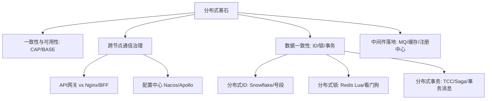
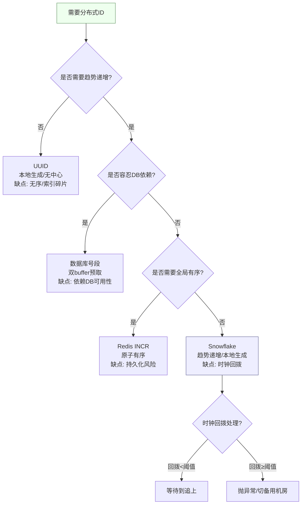
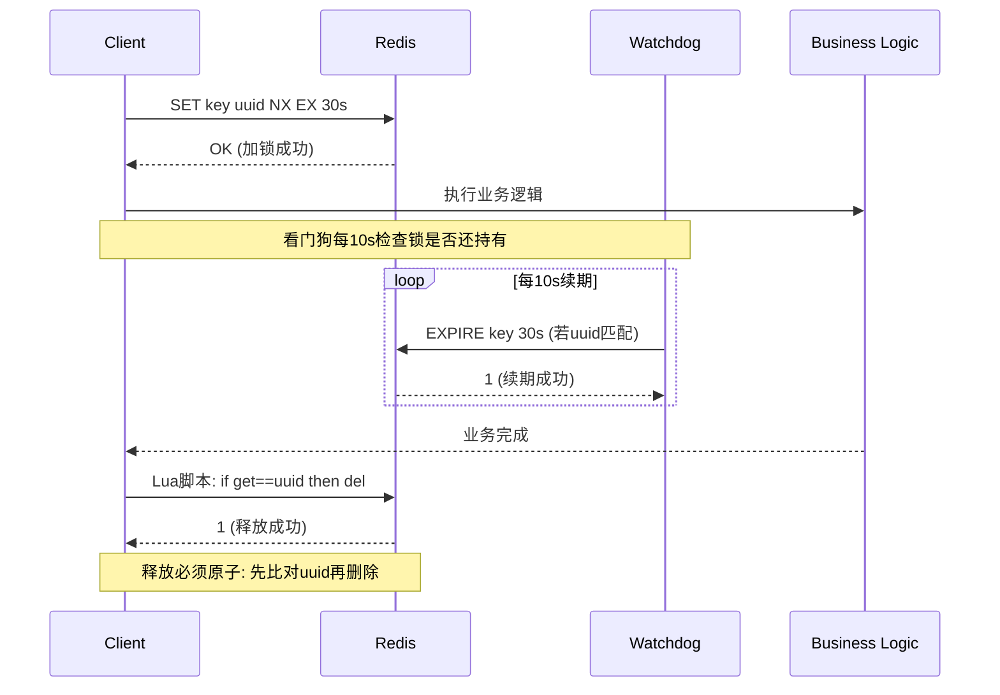
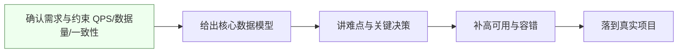
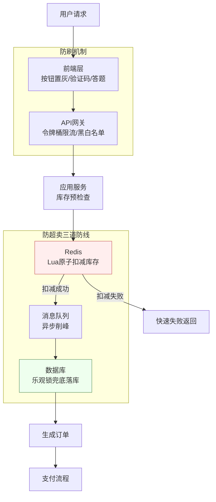
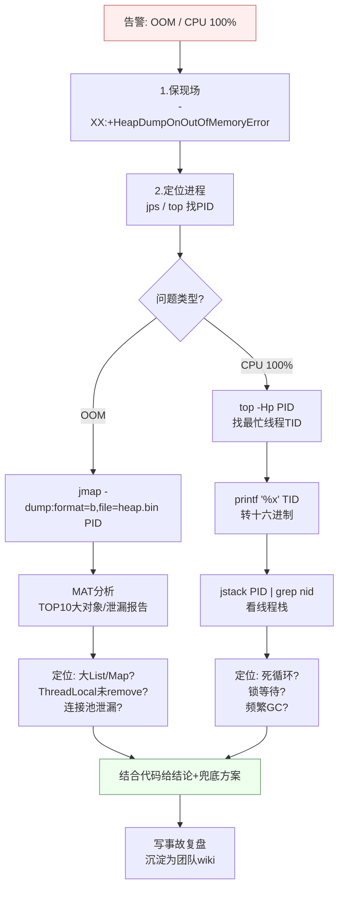
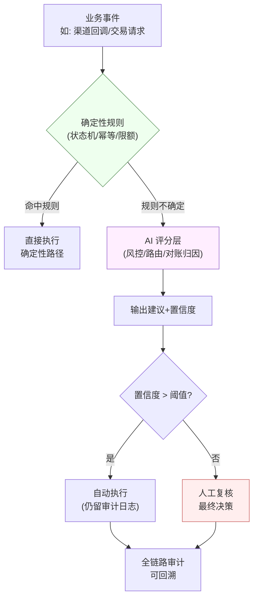
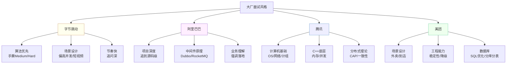

> 内容来自对 2026 年大中小厂面经的归纳（JavaGuide《Java 后端面试重点总结》《分布式系统面试题》《后端高频系统设计&场景题》、牛客 / CSDN / 掘金面经）。本篇是**高频考点总入口**：每个点都链接到本博客对应的深度文档，避免重复，专注"哪些最常考 + 怎么答"。配合《面试高频考点深度追问》《面试核心术语详解》食用更佳。

---

## 一、分布式基石高频（来自 JavaGuide 2026 分布式主线）

> 主线四条：① 一致性与可用性权衡 ② 跨节点通信与治理 ③ 分布式数据一致性（ID / 锁 / 事务）④ 中间件落地。其中**最重要**：API 网关、配置中心、分布式 ID、分布式锁、分布式事务——这几块要花最多时间，且一定要讲"异常路径"。

**分布式基石知识地图**：



### 1.1 分布式 ID（分库分表后必问）
- **为什么不能继续用数据库自增？** 分库分表后各库自增会冲突，且自增 ID 暴露业务规模。
- **方案对比**：
  - **UUID**：本地生成、无中心、但 36 字符长、无序（索引碎片、写入随机 IO）。
  - **数据库号段（segment）**：一次取一段（如 1000 个）内存发号，DB 压力小；缺点依赖 DB 可用性（可双 buffer 预取缓解）。
  - **Redis `INCR`**：原子、有序；依赖 Redis 可用，持久化下可能重复（需 AOF+fsync 或混合策略）。
  - **Snowflake**：41 位时间戳 + 10 位机器 + 12 位序列，趋势递增、本地生成；**致命点：时钟回拨**（NTP 校准 / 机器重启）→ 用 zookeeper / 缓存记录上次时间戳，回拨超阈值直接抛错或等待。
- **考察点**：趋势递增对索引友好；选型看"有序性 / 可用性 / 长度"。支付订单号我们不用纯 Snowflake，而是 `业务前缀 + 日期 + 号段 + 校验位`，兼顾可读、防遍历、分库路由。

> **【深度拓展与项目支撑】**（分布式 ID）选型看「有序性/可用性/长度」三角：UUID 无序长、Snowflake 趋势递增但怕时钟回拨、号段 DB 压力小但依赖 DB、Redis INCR 原子但持久化风险。支付订单号不用纯 Snowflake，而用「业务前缀+日期+号段+校验位」——兼顾可读、防遍历、分库路由。追问「时钟回拨怎么办」：用 zookeeper/缓存记录上次时间戳，回拨超阈值抛错或等待。
> **项目支撑**：XTransfer 收款单号用「业务前缀+日期+号段+校验位」结构，既防遍历又利于分库分片路由与人工排查；号段模式双 buffer 预取缓解 DB 依赖。

**分布式 ID 选型决策流程图**：



**【完整回答模板】**（面试官问"分布式 ID 怎么做"时，按此框架回答）：
> 1. **先说背景**：「分库分表后，各库自增会冲突，且自增 ID 暴露业务规模，所以需要分布式 ID。」
> 2. **给方案矩阵**：「主流四种：UUID、数据库号段、Redis INCR、Snowflake，各有取舍。」
> 3. **对比三维度**：「从有序性、可用性、长度三个维度看——UUID 无序长、号段依赖 DB、Redis 有持久化风险、Snowflake 怕时钟回拨。」
> 4. **给选型结论**：「我们支付场景选的是『业务前缀+日期+号段+校验位』，兼顾可读、防遍历、分库路由，底层用号段双 buffer。」
> 5. **补异常路径**：「时钟回拨用 zk/缓存记录上次时间戳，回拨超阈值抛异常或等待。」

**【面试官追问】**：
- **追问1**：「Snowflake 的机器位只有 10 位，机房多了怎么办？」→ 答：可以用「数据中心 ID + 机器 ID」二级拆分（5+5），或引入 ZooKeeper 动态分配 workerId。
- **追问2**：「号段模式下 DB 挂了怎么办？」→ 答：双 buffer 预取——当前号段用到 10% 时异步拉取下一个号段；DB 短暂不可用有内存号段兜底；彻底挂了走降级（切备用 DB 或临时用 Snowflake）。
- **追问3**：「支付订单号为什么要加校验位？」→ 答：防遍历（攻击者猜不出来）、防输入错误（最后一位 Luhn 校验）、便于人工排查（肉眼可读结构）。

### 1.2 分布式锁进阶（Redis 篇，重点）
- **必须设过期时间**：防止客户端崩了锁永不释放（死锁）。
- **释放必须原子**：`del` 前要先 `get` 比对持有者，两步非原子会误删别人的锁 → 用 **Lua 脚本**一段完成"比对 + 删除"。
- **Redisson 看门狗**：默认 30s 过期，看门狗每 10s 续期（只要锁还持有），解决"业务没执行完锁就过期"。边界：看门狗只在未显式指定 leaseTime 时生效；主从异步复制下主宕机锁可能丢（RedLock 争议大，多数场景用"锁 + 业务幂等"兜底）。
- **可重入**：Redisson 用 Hash 结构记录持有线程与重入次数。
- **更稳妥的组合**：分布式锁只解决"互斥"，关键写仍要加**业务幂等 / 版本号 / 唯一索引**兜底（见《支付系统高频面试题集》幂等 5 方案）。
- **考察点**：过期时间 + 原子释放 + 看门狗 + 锁过期业务没跑完怎么办（续期 / 兜底幂等）。

> **【深度拓展与项目支撑】**（分布式锁）锁三要素：过期时间防死锁、原子释放（Lua 比对+删除）防误删、看门狗续期防业务没跑完锁过期。RedLock 争议大（主从异步复制丢锁），多数场景用「锁 + 业务幂等/版本号/唯一索引」兜底而非依赖锁本身。可重入靠 Hash 记录持有线程+重入次数。
> **项目支撑**：XTransfer 在「同一单并发冲正/退款」高冲突点用 Redisson 锁串行化，但核心是「状态机 CAS + 渠道维度唯一约束」兜底，绝不单独依赖锁（锁失效/超时就击穿）。哈啰薪资批处理、欧凡优惠券发券也遵循「锁只互斥、幂等兜底」原则。

**分布式锁加锁/释放完整流程图**：



**Lua 原子释放锁代码模板**：
```lua
-- distributed_lock_release.lua
-- KEYS[1] = lock key
-- ARGV[1] = client uuid (持有者标识)
if redis.call("get", KEYS[1]) == ARGV[1] then
    return redis.call("del", KEYS[1])
else
    return 0  -- 锁已被其他人持有，不能删
end
```

**【完整回答模板】**（面试官问"Redis 分布式锁怎么实现"时）：
> 1. **加锁三要素**：「SET key uuid NX EX 30s——NX 保证互斥、EX 防死锁、uuid 标识持有者。」
> 2. **释放要原子**：「del 前必须 get 比对 uuid，两步非原子会误删别人的锁，所以用 Lua 脚本一段完成。」
> 3. **看门狗续期**：「Redisson 看门狗每 10s 检查锁还持有就续期到 30s，解决业务没执行完锁过期。」
> 4. **边界与兜底**：「主从异步复制下主宕机可能丢锁（RedLock 争议大），所以关键写操作要加业务幂等/唯一索引兜底，不能只靠锁。」
> 5. **可重入**：「Redisson 用 Hash 结构记录持有线程和重入次数，支持可重入。」

**【面试官追问】**：
- **追问1**：「看门狗什么时候不生效？」→ 答：显式指定了 leaseTime 时看门狗不启动（Redisson 源码里 leaseTime=-1 才触发看门狗）。
- **追问2**：「RedLock 到底该不该用？」→ 答：多数场景不用。RedLock 要求 5 个独立 Redis 节点过半数加锁，性能差且时钟漂移仍有争议（Martin Kleppmann 与 antirez 的经典论战）。工程上用「单 Redis 锁 + 业务幂等兜底」更实用。
- **追问3**：「锁过期了业务还没跑完怎么办？」→ 答：①看门狗续期（Redisson 自动）；②业务幂等兜底（锁失效后重复请求不会造成重复扣款）；③ fencing token 方案（每次加锁带递增序号，下游拒绝旧序号请求）。

### 1.3 一致性哈希 + 虚拟节点
- **解决什么**：普通哈希 `hash(key)%N` 在节点数 N 变化时，几乎全部 key 重新映射 → 缓存雪崩 / 数据大规模迁移。**一致性哈希**把节点和 key 都映射到 0~2^32 环上，key 顺时针找最近节点；节点增减只影响环上相邻一小段。
- **虚拟节点**：物理节点少时分布不均 → 一个物理节点虚拟出多个点散布在环上，让负载更均衡。
- **考察点**：为什么需要（缩容扩容只动部分）；虚拟节点作用（均衡）；和"哈希取模"的本质区别（是否随节点数变化全量重映射）。

> **【深度拓展与项目支撑】**（一致性哈希）普通取模在节点数变化时几乎全量重映射（缓存雪崩/数据迁移），一致性哈希把节点和 key 映射到环上，增减节点只影响相邻一小段；虚拟节点解决物理节点少时分布不均。本质是「最小化重映射范围」。
> **项目支撑**：XTransfer 渠道/分片路由借鉴一致性哈希思想，扩缩容（如新增 VA 渠道）只影响相邻分片，不触发全量数据迁移；配置中心的节点发现也用 Gossip 类机制做成员扩散。

### 1.4 共识算法一句话（Raft / Paxos / ZAB / Gossip）
- **Paxos**：理论完备但难懂难实现，解决"多节点对某个值达成一致"。
- **Raft**：为可理解而生，Leader + 任期 + 日志复制 + 多数派提交；选举 / 日志匹配 / 安全性三条规则清晰，工程首选（etcd / Consul / Nacos 集群用）。
- **ZAB**：ZooKeeper 的原子广播协议，类似 Raft 但为 ZK 定制（崩溃恢复 + 消息广播）。
- **Gossip**：最终一致、去中心化、节点互发"谣言"（感染式传播），适合成员发现 / 状态扩散（Redis Cluster 节点发现、Cassandra）。
- **考察点**：不要求手写，但要能说清"为什么 Raft 易实现""Gossip 适合什么（弱一致、规模大、容忍丢包）"。

> **【深度拓展与项目支撑】**（共识算法）Raft（Leader+任期+日志复制+多数派）工程首选易懂；Paxos 理论完备难实现；ZAB 为 ZK 定制；Gossip 最终一致去中心化适合成员发现。不要求手写，但要讲清「为什么 Raft 易实现」「Gossip 适合什么（弱一致、规模大、容忍丢包）」。
> **项目支撑**：XTransfer 注册中心/配置中心用 Raft 系（Nacos 集群）保证一致；渠道节点发现、配置广播借鉴 Gossip 类感染式扩散。理解这些有助于讲清「支付网关的高可用与一致」。

### 1.5 API 网关 vs Nginx / BFF（边界常考）
- **Nginx**：L4/L7 反向代理、负载均衡、静态资源，偏"流量入口基础设施"。
- **API 网关**（Spring Cloud Gateway）：业务层入口，做**认证鉴权、限流熔断、灰度、协议转换、审计、路由**，是"应用层"的拦截器链。
- **BFF**（Backend For Frontend）：为特定前端聚合多个后端接口，减少前端往返。
- **Spring Cloud Gateway 关键**：`Route`（id + uri + predicates + filters）、**过滤器链**（GlobalFilter / GatewayFilter，pre/post）、集成 Sentinel 做限流、集成 OAuth2 做鉴权。我们支付网关就用 Gateway 做统一鉴权 + 按渠道限流，再转内部 Dubbo。
- **考察点**：网关和 Nginx 边界；Gateway 的路由匹配与过滤器链；为什么网关做限流而不是业务服务自己做（统一入口、集中治理）。

> **【深度拓展与项目支撑】**（API 网关）网关是「应用层拦截器链」：认证鉴权、限流熔断、灰度、协议转换、审计、路由；Nginx 偏流量入口基础设施；BFF 为前端聚合。网关做限流是「统一入口集中治理」，比业务服务各自限流更稳。Gateway 用 Route + 过滤器链 + Sentinel 限流 + OAuth2 鉴权。
> **项目支撑**：XTransfer 支付网关用 Spring Cloud Gateway 做统一鉴权 + 按渠道限流，再转内部 Dubbo；这正是「网关 vs Nginx/BFF」边界的真实落地——Nginx 在前做 L4/L7 与 SSL 卸载，Gateway 做业务拦截，分工清晰。

### 1.6 配置中心（Nacos / Apollo）
- **为什么不能只是配置文件**：改配置要重新打包发布、无法按环境 / 集群差异化、无法动态生效、无审计 / 灰度。
- **配置中心解决**：动态推送（监听 + 长轮询 / 长连接）、灰度发布、版本回滚、权限审计。
- **变更如何生效**：客户端监听 → 服务端推送（或客户端定时拉 + 长轮询）→ 刷新 `Environment` / `@RefreshScope` Bean。
- **考察点**：对比"配置写死 vs 配置中心"；变更推送机制；和注册中心关系（Nacos 二者合一）。

---

> **【深度拓展与项目支撑】**（配置中心）配置中心解决「动态推送 + 灰度 + 回滚 + 审计」，避免改配置重新打包。变更机制：客户端监听 → 服务端推送/长轮询 → 刷新 Environment/@RefreshScope。和注册中心常合一（Nacos）。
> **项目支撑**：XTransfer 把「渠道差异、合规表单字段、限额、路由权重」都配置化（配置中心 + SPI），新渠道只填配置不加代码；哈啰工单/薪资规则用 aviator 表达式配置化热更新；欧凡合规动态表单也是配置驱动——三处都是「配置中心/配置化」思想的体现。

## 二、高频场景设计题（短链 / 秒杀 / 去重 / 登录 / 抽奖 / 延时）

> 面试官一般穿插 1~2 道。套路：**先确认需求与约束（QPS / 数据量 / 一致性）→ 给核心模型 → 讲难点与决策 → 补高可用与容错**。每题附考察点。

**场景设计题通用套路**：



### 2.1 短链系统（short URL）
- **需求**：长 URL → 短码（如 `t.cn/abc123`），可跳转、可统计。
- **核心**：① 发号：用分布式 ID（或 `hash(长URL)` 转 62 进制）生成短码；② 存储：短码 → 长 URL 映射（KV / Redis + DB）；③ 跳转：`302` 临时重定向（便于统计，且可被 CDN / 浏览器区分缓存）；④ 防碰撞：短码已存在则换（自增取模或加盐重 hash）；⑤ 安全：黑名单防钓鱼。
- **考察点**：302 vs 301；短码生成策略（自增转 62 进制最省空间）；高并发下 Redis 缓存映射 + 异步落库。

> **【深度拓展与项目支撑】**（短链）短码生成：自增转 62 进制最省空间；存储 KV/Redis+DB；跳转用 302（可统计、可被 CDN 区分）；防碰撞换码；安全黑名单防钓鱼。追问「302 vs 301」：301 永久缓存浏览器难改，302 临时利于统计与灵活变更。
> **项目支撑**：短链思路与 XTransfer「收款单号可读性 + 号段路由」同源——都是「可路由 + 防遍历 + 易排查」的 ID 设计哲学；欧凡优惠券码也用类似「短码 + 唯一约束」防重发。

**短链系统完整架构图**：


**短码生成 62 进制转换代码模板**：
```java
public class ShortUrlGenerator {
    private static final String CHARS =
        "0123456789abcdefghijklmnopqrstuvwxyzABCDEFGHIJKLMNOPQRSTUVWXYZ";
    private static final int BASE = CHARS.length(); // 62

    // 自增 ID → 62 进制短码
    public static String encode(long id) {
        StringBuilder sb = new StringBuilder();
        while (id > 0) {
            sb.insert(0, CHARS.charAt((int)(id % BASE)));
            id /= BASE;
        }
        // 补齐到 6 位（62^6 ≈ 568亿，足够用）
        while (sb.length() < 6) sb.insert(0, '0');
        return sb.toString();
    }

    // 62 进制短码 → 自增 ID
    public static long decode(String shortCode) {
        long id = 0;
        for (char c : shortCode.toCharArray()) {
            id = id * BASE + CHARS.indexOf(c);
        }
        return id;
    }
}
```

**【面试官追问】**：
- **追问1**：「短码用 hash(长URL) 转 62 进制有什么问题？」→ 答：① hash 碰撞（不同长 URL 可能映射到同一短码，需加盐重 hash）；② hash 值不可预测，无法做趋势递增；③ hash 值长度不固定。所以生产环境更推荐自增 ID 转 62 进制。
- **追问2**：「短链跳转为什么用 302 不用 301？」→ 答：301 是永久重定向，浏览器会缓存，后续直接跳过短链服务——不利于点击统计，且想改目标地址时浏览器缓存不更新。302 每次都走短链服务，可统计、可灵活变更。
- **追问3**：「高并发下短链查询怎么优化？」→ 答：① Redis 缓存热点短码→长URL映射（TTL 1小时）；② 布隆过滤器防穿透（不存在的短码不查 DB）；③ 多级缓存（本地 Caffeine + Redis + DB）。

### 2.2 秒杀系统（结合《高可用跨境支付系统设计》）
- **分层削峰**：① 前端：按钮置灰、答题 / 验证码拦羊毛；② 网关：限流（令牌桶）、黑白名单；③ 服务：库存预热到 Redis、`DECR` 原子扣减、扣减失败快速失败；④ 异步：下单入 MQ，消费者落库（削峰填谷）；⑤ 防超卖：Redis `Lua` 扣减 + DB 乐观锁 / `stock>=0` 兜底；⑥ 防刷：用户维度限购买、订单去重。
- **考察点**：不要在 DB 直接高并发扣库存；Redis 扣减 + MQ 异步 + DB 兜底三件套；热点商品单独隔离。

> **【深度拓展与项目支撑】**（秒杀）套路：前端置灰/答题 → 网关限流 → 库存预热 Redis 原子扣 → MQ 异步落库 → 防超卖（Lua+乐观锁）→ 防刷。核心是「不在 DB 高并发扣库存」，Redis 扣 + MQ 异步 + DB 兜底三件套。追问「热点商品隔离」单独分片防影响其他。
> **项目支撑**：欧凡库存扣减正是秒杀同源——Redis+Lua 原子扣减（GET+判断+DECR）防超卖，扣成功异步落库，DB 乐观锁/`stock>=0` 兜底，Redis 挂降级 DB 行锁。XTransfer 对高并发收款渠道也用「预热 + 异步 + 补偿」削峰。

**秒杀系统完整架构图**：



**Redis Lua 原子扣库存代码模板**：
```lua
-- seckill_deduct.lua
-- KEYS[1] = stock key
-- ARGV[1] = user_id (防重复购买)
-- ARGV[2] = buy_limit
local stock = tonumber(redis.call("get", KEYS[1]))
if stock == nil then return -1 end           -- 商品不存在
if stock <= 0 then return 0 end               -- 库存不足
-- 检查用户是否已购买（Set 去重）
local bought = redis.call("sismember", KEYS[1]..":users", ARGV[1])
if bought == 1 then return -2 end             -- 已购买过
redis.call("decr", KEYS[1])
redis.call("sadd", KEYS[1]..":users", ARGV[1])
return 1  -- 扣减成功
```

**【完整回答模板】**（面试官问"设计一个秒杀系统"时）：
> 1. **先确认约束**：「QPS 多少？商品数？是否允许超卖？库存是否预热？」
> 2. **分层削峰**：「前端置灰+验证码 → 网关令牌桶限流 → 服务层 Redis 原子扣减 → MQ 异步落库。」
> 3. **防超卖三件套**：「Redis Lua 原子扣 + MQ 异步 + DB 乐观锁兜底，三层保证不超卖。」
> 4. **防刷机制**：「用户维度限购（Set 去重）、IP 维度限流、风控黑名单。」
> 5. **容错降级**：「Redis 挂了降级 DB 行锁（牺牲性能保正确）；MQ 积压超阈值直接拒绝新请求；热点商品单独隔离防影响其他。」

**【面试官追问】**：
- **追问1**：「为什么不用 DB 直接扣库存？」→ 答：DB 行锁在高并发下会成为瓶颈（QPS 几百就扛不住），Redis 单线程+内存操作可扛 10w+ QPS。
- **追问2**：「Redis 扣减成功但 MQ 消费失败怎么办？」→ 答：① MQ 消费失败会重试（幂等消费）；② 超过重试次数进死信队列人工处理；③ 定时对账：Redis 扣减记录 vs DB 订单数，不一致则补偿。
- **追问3**：「库存预热什么时候做？」→ 答：活动开始前 5 分钟从 DB 加载到 Redis，并用「预热+校验」双保险——活动期间每次扣减前校验 Redis 连通性，挂了立即降级。

### 2.3 海量数据去重（布隆过滤器）
- **场景**：爬虫 URL 去重、垃圾邮件、缓存穿透防护、大数据集判存在。
- **方案**：**布隆过滤器**（bit 数组 + k 个哈希，有误判率但省空间）；精确去重用 `HashSet`（小数据）或 `HashSet + 分片 / 外部 KV`（大数据）或 **HyperLogLog**（基数估计，不精确去重只计数）。
- **考察点**：布隆过滤器原理（有误判、无漏判）、怎么降误判（加大 bit 数 / 哈希数）、删除难（用 Counting Bloom）。

> **【深度拓展与项目支撑】**（海量去重）布隆过滤器 bit 数组 + k 哈希，有误判无漏判；精确去重用 HashSet/外部 KV；基数估计用 HyperLogLog。追问「怎么降误判」：加大 bit 数/哈希数；「删除难」用 Counting Bloom。布隆常用于缓存穿透防护。
> **项目支撑**：欧凡商品缓存用布隆过滤器防缓存穿透（不存在的商品 key 不查 DB）；XTransfer 对账/去重也用「唯一约束 + 布隆」组合快速判重。携程数仓去重用 HyperLogLog 估算 UV 类指标。

### 2.4 第三方授权登录（OAuth2）
- **流程**：第三方（微信 / Google）授权码模式（authorization code）：客户端跳授权页 → 用户同意 → 重定向回带 `code` → 后端用 `code` 换 `access_token` → 拉用户信息 → 绑定 / 生成本系统账号（JWT）。
- **考察点**：为什么用 code 而不是前端直接拿 token（防泄露、后端换 token 存密）；`state` 参数防 CSRF；token 存哪（HttpOnly Cookie / 后端会话）。

> **【深度拓展与项目支撑】**（OAuth2）授权码模式：客户端跳授权页 → 用户同意 → 重定向带 code → 后端用 code 换 token → 拉信息 → 绑定/生成本系统账号（JWT）。追问题：为什么用 code 不用前端直接拿 token（防泄露、后端换 token 存密）；state 防 CSRF；token 存 HttpOnly Cookie/后端会话。
> **项目支撑**：XTransfer 商户/运营登录、欧凡商户 RBAC 子账户体系都遵循「授权码 + 后端换 token + 敏感操作二次校验」；欧凡「签名防篡改（HMAC）」与 OAuth2 的 token 安全理念一致——都是「不在前端暴露密钥、服务端做鉴权」。

### 2.5 抽奖 / 中奖系统
- **核心**：① 概率模型（权重 / 概率区间）；② 防超发（库存用 Redis 原子扣或 DB 乐观锁）；③ 防刷（用户限次、风控）；④ 发奖异步（MQ）；⑤ 概率可配置 + 审计。
- **考察点**：概率怎么落地（累加区间 + 二分 / random）；高并发下库存一致性。

> **【深度拓展与项目支撑】**（抽奖/中奖）概率模型（权重/区间）+ 防超发（Redis 原子扣/乐观锁）+ 防刷（限次/风控）+ 异步发奖（MQ）+ 可配置+审计。追问「高并发库存一致性」：用 Redis 原子扣 + DB 兜底，发奖幂等（用户+活动唯一）。
> **项目支撑**：欧凡优惠券系统（商品券/平台券，累计数十万订单）正是这套——Redis 原子扣库存防超发，用户+活动唯一约束防重复领，用券全程幂等，券与订单对账保证「发了没用/用了没扣」可发现。策略模式支撑多活动（与 XTransfer SPI 同源）。

### 2.6 延时任务（支付对账 / 渠道回调常用）
- **实现**：① 消息队列**延时消息**（RocketMQ 18 级 / `delay`、RabbitMQ 死信 + TTL）；② **时间轮**（Netty HashedWheelTimer、Kafka 时间轮）；③ **Redis ZSet**（`score=执行时间戳`，定时 `ZRANGEBYSCORE` 捞到期）；④ 数据库轮询（简单但慢）。
- **支付场景**：渠道回调超时未到 → 用延时任务触发"主动查单"；对账差异定时任务。
- **考察点**：各方案取舍（MQ 延时消息量级有限、ZSet 易实现、时间轮高性能）；避免"扫描全表"轮询。

---

> **【深度拓展与项目支撑】**（延时任务）实现：MQ 延时消息（RocketMQ 18 级/RabbitMQ 死信+TTL）、时间轮（Netty/Kafka）、Redis ZSet（score=时间戳捞到期）、DB 轮询。支付场景：渠道回调超时未到 → 延时任务触发主动查单；对账差异定时任务。追问：避免全表扫描轮询，ZSet 易实现、时间轮高性能。
> **项目支撑**：XTransfer「支付中超时 + 延时查单」正是用延时任务做掉单兜底（ZSet/时间轮/延时消息实现），配合回调查单 + T+1 对账三层闭合。哈啰工单 SLA 超时升级/重派也用延时/定时任务。

**延时任务方案对比表**：

| 方案 | 精度 | 性能 | 实现复杂度 | 适用场景 |
| --- | --- | --- | --- | --- |
| RocketMQ 延时消息 | 固定 18 级（1s~2h） | 高（MQ 削峰） | 低（SDK 支持） | 量级可控、精度要求不高 |
| RabbitMQ 死信+TTL | 毫秒级 | 中 | 中（配死信队列+TTL） | 已有 RabbitMQ 栈 |
| Redis ZSet | 秒级 | 中（受 ZRANGEBYSCORE 效率限制） | 低 | 中小规模、快速实现 |
| 时间轮（Netty/Kafka） | 毫秒级 | 极高（O(1) 入槽/出槽） | 高（需自建） | 大规模、高性能要求 |
| DB 轮询 | 秒~分钟级 | 低（全表扫描） | 极低 | 小规模、简单场景 |
| Redis Key 过期通知 | 秒级 | 中（ keyspace notification） | 低 | 量小（通知不可靠，需兜底） |

**Redis ZSet 延时任务代码模板**：
```java
// 投递延时任务
public void delayTask(String taskId, long delaySec) {
    long executeAt = System.currentTimeMillis() + delaySec * 1000;
    redis.zadd("delay_queue", executeAt, taskId);
}

// 消费者定时轮询到期任务
@Scheduled(fixedRate = 1000) // 每秒扫一次
public void consumeDelayTask() {
    long now = System.currentTimeMillis();
    // 取出所有到期任务
    Set<String> tasks = redis.zrangeByScore("delay_queue", 0, now);
    for (String taskId : tasks) {
        // 用 ZREM 返回值保证只有一个消费者处理（分布式抢占）
        Long removed = redis.zrem("delay_queue", taskId);
        if (removed != null && removed > 0) {
            executeTask(taskId); // 执行任务（需幂等）
        }
    }
}
```

**【面试官追问】**：
- **追问1**：「Redis ZSet 延时队列在大数据量下有什么问题？」→ 答：① ZSet 元素过多时 ZRANGEBYSCORE 可能慢（虽 O(logN+M) 但 N 大时仍有开销）；② 可用「分片 ZSet」缓解（按任务类型或时间分片到多个 key）；③ 极端量级换时间轮或 MQ 延时消息。
- **追问2**：「延时任务执行失败了怎么办？」→ 答：① 执行失败重新投递（设最大重试次数，超限进死信）；② 任务幂等设计（重复执行不产生副作用）；③ 支付场景的延时查单任务——即使查单失败，还有 T+1 对账兜底，不会漏掉。
- **追问3**：「时间轮的原理？」→ 答：一个环形数组，每个槽代表一个时间刻度（如 1 秒），任务按到期时间 hash 到对应槽；指针每秒走一格，走到槽位时执行该槽所有任务。多层时间轮（如秒级+分钟级+小时级）类似时钟，支持大跨度延时。Kafka/Netty 都用这个实现高性能延时。

## 三、JVM 线上排查（2026 高热度，详见《Java 与 Spring 深度准备》§1.7）

面试常让你"现场排查一次 OOM / CPU 100%"。背下 SOP（命令级见 Java/Spring 文档）：

- **OOM**：`-XX:+HeapDumpOnOutOfMemoryError` 留现场 → `jps` 拿 PID → `jmap -dump` 导堆 → MAT 看 TOP10 对象 / 泄漏。
- **CPU 100%**：`top -Hp <pid>` 找忙线程 TID → `printf %x` 转十六进制 → `jstack | grep` 看栈 → 定位死循环 / 锁等待 / 频繁 GC。
- **工具**：jps / jstat(`-gcutil`) / jmap / jstack / Arthas(`thread -n 3`、`watch`、`trace`)。
- **考察点**：不是背命令，是"保现场 → 定位进程 → 定位线程 / 对象 → 看栈看堆 → 结合代码给结论 + 兜底"。能讲一个真用过的案例直接加分。

---

> **【深度拓展与项目支撑】**（JVM 线上排查）SOP：保现场（HeapDumpOnOutOfMemoryError）→ 定位进程（jps/jstat）→ 定位线程/对象（top -Hp、jstack、jmap、MAT）→ 结合代码给结论+兜底。Arthas（thread -n 3、watch、trace）可在线诊断。追问：要讲一个真用过的案例直接加分。
> **项目支撑**：XTransfer 支付核心服务 JVM 调优按「对象生命周期+停顿目标」选型（G1 + MaxGCPauseMillis），避免 Full GC 卡资金交易；曾用「ThreadLocal 传 traceId 用完 remove」规避内存泄漏——与 GC 排查同源。哈啰薪资批处理用有界队列防 OOM 也是 JVM 侧经验。

**JVM 排查 SOP 完整流程图**：



**Arthas 常用命令速查表**：

| 命令 | 用途 | 示例 |
| --- | --- | --- |
| `thread -n 3` | 找 CPU 最高的 3 个线程 | `thread -n 3` |
| `thread -b` | 找阻塞线程（死锁检测） | `thread -b` |
| `watch` | 观察方法入参/返回值/异常 | `watch com.xxx.Service method params+returnObj` |
| `trace` | 追踪方法调用链耗时 | `trace com.xxx.Service method` |
| `jad` | 反编译类（确认线上版本） | `jad com.xxx.Service` |
| `dashboard` | 实时面板（线程/内存/GC） | `dashboard` |
| `heapdump` | 导出堆快照 | `heapdump /tmp/heap.hprof` |
| `vmtool` | 查询内存中对象实例 | `vmtool --action getInstances --className java.lang.String` |

**【完整回答模板】**（面试官问"线上 OOM 怎么排查"时）：
> 1. **保现场**：「首先 JVM 启动参数加 `-XX:+HeapDumpOnOutOfMemoryError`，OOM 时自动 dump 堆快照保现场。」
> 2. **定位进程**：「`jps` 找到 PID，`jstat -gcutil PID` 看 GC 情况——如果 Full GC 频繁且老年代 100%，基本确认是内存泄漏。」
> 3. **分析堆**：「`jmap -dump` 导堆快照，用 MAT 分析 TOP10 大对象和泄漏报告——常见是超大 List/Map、ThreadLocal 未 remove、数据库连接池泄漏。」
> 4. **结合代码**：「定位到具体代码后，给修复方案——如 ThreadLocal 用完 remove、有界队列替代无界队列、限制查询批次大小。」
> 5. **兜底**：「加监控告警（堆内存使用率>80% 告警）、限流（防止恶意大查询打爆内存）、降级（内存告急时拒绝非核心请求）。」

**【面试官追问】**：
- **追问1**：「CPU 100% 但没有死循环，可能是什么原因？」→ 答：① 频繁 Full GC（GC 线程占 CPU）→ 看 jstat 的 FGC 列；② 正则表达式回溯爆炸 → 看线程栈是否在 `java.util.regex`；③ 序列化/反序列化大对象 → 看栈是否在 JSON 库。
- **追问2**：「线上不能用 Arthas 怎么办？」→ 答：① `jstack PID > /tmp/thread.dump` 导线程栈离线分析；② `jmap -histo:live PID` 看存活对象 TOP；③ 开 `-XX:+PrintGCDetails` 看 GC 日志。
- **追问3**：「G1 和 CMS 的区别？为什么选 G1？」→ 答：G1 用 Region 分区回收，可预测停顿（`MaxGCPauseMillis`），适合大堆；CMS 用标记-清除有碎片问题，且 Concurrent Mode Failure 会退化为 Serial GC 导致长时间 STW。JDK 9+ 默认 G1。

## 四、2026 面试趋势：AI 工程化占比上升（约 30%）

- 大厂（字节 / 阿里 / 腾讯）面试题中 AI 工程化占比已约 30%，甚至有"不懂 Spring AI 二面难过"的说法。
- **怎么答 AI 题**：别堆名词，用你真用过的点（风控评分、对账差异归因、编码辅助）做锚，讲清范式（Prompt / RAG / 微调）、边界、ROI。
- **支付里的边界**：AI 只做"建议"不做"决策"（不直接决定扣款 / 放行），确定性规则 + 人工兜底。详见《AI 与 LLM 工程落地探索》《向量检索与 RAG 实践》。
- **可以补一句**：我做过用 LLM + RAG 做内部对账知识库，但生产交易链路坚决不让 AI 直接决策，符合金融强合规。

---

> **【深度拓展与项目支撑】**（AI 工程化趋势）AI 题别堆名词，用真用过的点做锚（风控评分、对账差异归因、编码辅助），讲清范式（Prompt/RAG/微调）与边界/ROI。支付里 AI 只建议不决策（强合规、不可逆）。追问：RAG 幻觉怎么治（引用溯源+人工复核）。
> **项目支撑**：我做过 LLM+RAG 内部对账知识库（对账规则/差错案例检索增强），但生产交易链路坚决不让 AI 直接决策扣款/放行。XTransfer 风控是「独立子状态机+确定性规则+人工复核」——AI 只做评分建议，符合金融强合规。这是 AI 题能讲出「真实边界」的素材。

**AI 工程化在支付场景的应用边界图**：



**【面试官追问】**：
- **追问1**：「RAG 的幻觉怎么治？」→ 答：① 引用溯源（回答必须附带原文片段，可追溯到知识库出处）；② 置信度阈值（低于阈值不输出，转人工）；③ 多路召回+交叉验证（多个 chunk 检索结果一致性才采信）；④ 人工复核闭环（AI 输出→人工校验→反馈标注→持续优化）。
- **追问2**：「Spring AI 和 LangChain4j 怎么选？」→ 答：Spring AI 与 Spring 生态集成好（自动配置、Actuator 监控），适合已有 Spring Boot 项目；LangChain4j 功能更全（Agent/Tool/记忆），适合复杂 Agent 场景。支付系统已在 Spring 生态里，选 Spring AI 集成成本低。
- **追问3**：「为什么支付链路不让 AI 直接决策？」→ 答：① 金融强合规——监管要求每笔交易可解释、可审计、可回溯，AI 黑盒无法满足；② 不可逆性——扣款/放行一旦执行无法撤回，AI 幻觉可能造成真金白银资损；③ 确定性保证——支付核心链路必须确定性行为（同样输入同样输出），AI 有概率性。
- **追问4**：「你在 AI 工程化中做了什么？」→ 答：「做了 LLM+RAG 内部对账知识库——把对账规则、历史差错案例向量化检索，帮运营快速定位差异原因。但这个系统只做『建议』不做『决策』——给出可能的差错原因和处置建议，最终由运营确认。生产交易链路完全不走 AI，走确定性规则+状态机。」

## 五、答题与表达技巧（决定你能不能"讲清楚"）

1. **结构化表达**：结论先行 → 分层展开（定义 / 问题 / 代价 / 场景）→ 落到项目 → 承认边界。别铺垫半天不进主题。
2. **对比题四维度**：设计目标 → 实现机制 → 性能 / 一致性 → 适用场景（如 G1 vs CMS、RocketMQ vs Kafka）。
3. **原理题**：讲关键数据结构 / 算法（HashMap 红黑树、AQS 队列、一致性哈希环），别只背结论。
4. **场景题**：先复述需求与约束，再给 1~2 个最深的点，最后补容量与容错（深度 > 广度）。
5. **被追问 / 不会**：确认问题 → 给"我能想到的方案" → 明确说边界（"这块我实践少，但理论上…"）→ 不编造。详见《面试高频考点深度追问》《复习总览与进度看板》（自我介绍 / 反问 / 复盘）。

---

> **【深度拓展与项目支撑】**（答题与表达技巧）结构化表达（结论先行→分层展开→落地→承认边界）是面试「讲清楚」的核心。对比题四维度（目标/机制/性能一致性/场景）、原理题讲关键数据结构/算法、场景题先复述约束再给最深点。被追问不会：确认→给思路→承认边界→不编造。
> **项目支撑**：我把「对比/取舍 + 量化 + 落地踩坑」作为所有答案的统一三层（见《面试高频考点深度追问》「高级感」一题）。XTransfer 经历天然带量化（+30%/-80%/0 资损/100+ 渠道/1000w 笔），讲每个点都能落到真实项目，比纯八股更有说服力。

---

## 六、大厂面试风格分析（字节 / 阿里 / 腾讯 / 美团）

> 不同公司的面试风格差异极大——同样是"分布式锁"，字节可能让你手写 Redisson 看门狗续期逻辑，阿里会追问"你这套方案在生产上线过吗，踩过什么坑"，腾讯可能从 CAP 推演到 ZAB，美团则直接给你一个秒杀场景让你设计。搞清楚目标公司的面试 DNA，才能精准准备。



### 6.1 字节跳动：算法驱动 + 场景设计

- **面试节奏**：一般 3-4 轮技术面，每轮 1 小时，节奏快、追问深。
- **特点**：
  - **算法占比最高**（约 40-50%），每轮至少 1 道 Medium，二面/三面可能上 Hard。不手撕出来基本挂。
  - **场景设计题偏高并发**：短视频推荐、抖音直播弹幕、今日中心 feed 流。
  - **追问风格**：层层深入，不满足于"知道是什么"，要讲"为什么这么设计"。比如你说"用 Kafka"，他会追"Kafka 的 ISR 机制怎么保证不丢消息""为什么用 pull 不用 push"。
  - **不问八股**或只问 1-2 个作为引子，重点看思维和编码。
- **准备策略**：算法刷到 Medium 熟练手写（见《算法刷题路线》LeetCode Top50 清单）；场景设计准备 2-3 个高并发系统（Feed 流 / 弹幕 / 消息已读）。

### 6.2 阿里巴巴：项目深度 + 中间件原理

- **面试节奏**：通常 4-5 轮（含交叉面+HRG），每轮 1-1.5 小时，深度极强。
- **特点**：
  - **项目深挖到源码级**：你说"用了 Dubbo"，他会问"Dubbo 的 SPI 和 Java SPI 区别""Dubbo 服务暴露过程""Dubbo 负载均衡策略有几种"。
  - **中间件原理是标配**：RocketMQ（消息可靠性、顺序消息、事务消息）、Sentinel（限流算法、熔断策略）、Nacos（注册中心 vs 配置中心、Raft 选举）。
  - **业务理解力**：强调"你做的东西对业务有什么价值"，不喜欢纯技术自嗨。
  - **追问风格**：追到你说"不知道"为止，但看你能不能给思路。
- **准备策略**：每个用过的中间件准备 3-5 个深度追问；项目讲"决策+取舍+量化"；熟悉阿里技术栈（Dubbo/RocketMQ/Sentinel/Nacos/Seata）。

### 6.3 腾讯：计算机基础 + 分布式理论

- **面试节奏**：通常 3 轮技术 + 1 轮 HR，部分部门有笔试。
- **特点**：
  - **计算机基础扎实**：OS（进程/线程/内存/调度）、网络（TCP 三次握手/四次挥手/拥塞控制）、计组（缓存行/伪共享）问得细。
  - **C++/Go 偏多**（后端岗），Java 岗也有但不如阿里/美团纯 Java。
  - **分布式理论推演**：CAP/BASE/一致性算法（Raft/Paxos/ZAB）喜欢从理论推到工程落地。
  - **追问风格**：偏学术，喜欢"为什么""本质是什么"。
- **准备策略**：OS/网络基础必须扎实（见《基础知识大全》）；分布式理论能推演（CAP→BASE→Raft→工程选型）；如报 C++/Go 岗需准备对应语言基础。

### 6.4 美团：场景设计 + 工程能力

- **面试节奏**：通常 3 轮技术 + 1 轮 HR，节奏适中。
- **特点**：
  - **场景设计占比高**：外卖订单系统、到店优惠券、骑手调度、商家搜索。
  - **数据库功底**：SQL 优化、索引设计、分库分表方案（美团数据量大）。
  - **工程能力与稳定性**：限流/熔断/降级/监控/告警/预案，强调"线上出问题怎么办"。
  - **追问风格**：务实，喜欢问"你真的做过吗""上线了吗""遇到什么问题"。
- **准备策略**：场景设计准备外卖/到店类系统；数据库深度准备（MySQL 索引/分库分表/读写分离）；工程稳定性（降级/熔断/监控）有真实案例。

### 6.5 不同公司侧重对比表

| 维度 | 字节跳动 | 阿里巴巴 | 腾讯 | 美团 |
| --- | --- | --- | --- | --- |
| **算法权重** | ★★★★★ 最高 | ★★★ 中等 | ★★★ 中等 | ★★★ 中等 |
| **项目深度** | ★★★ 中等 | ★★★★★ 最高 | ★★★ 中等 | ★★★★ 较高 |
| **系统设计** | ★★★★ 高并发/短视频 | ★★★★ 交易/中间件 | ★★★ 中等 | ★★★★★ 外卖/到店 |
| **计算机基础** | ★★★ 中等 | ★★★ 中等 | ★★★★★ 最高 | ★★★ 中等 |
| **中间件原理** | ★★★ 中等 | ★★★★★ 最高 | ★★★ 中等 | ★★★★ 较高 |
| **业务理解** | ★★★ 中等 | ★★★★★ 最高 | ★★★ 中等 | ★★★★ 较高 |
| **工程稳定性** | ★★★ 中等 | ★★★★ 较高 | ★★★ 中等 | ★★★★★ 最高 |
| **面试轮数** | 3-4 轮 | 4-5 轮 | 3-4 轮 | 3-4 轮 |
| **单轮时长** | 60min | 60-90min | 60min | 60min |
| **语言栈** | Go/Python/Java | Java 为主 | C++/Go/Java | Java 为主 |
| **追问风格** | 层层深入、要手写 | 追到源码、追到不知道 | 理论推演、学术范 | 务实、问"真做过吗" |
| **核心淘汰点** | 算法没撕出来 | 项目讲不出深度 | 基础不扎实 | 场景设计没思路 |
| **建议投入比** | 算法 50% / 项目 20% / 设计 20% / 基础 10% | 算法 20% / 项目 40% / 中间件 20% / 设计 20% | 算法 20% / 基础 30% / 分布式 30% / 项目 20% | 算法 20% / 项目 30% / 设计 30% / 数据库 20% |

> **一句话总结**：字节考你"聪不聪明"（算法+思维），阿里考你"深不深"（项目+源码），腾讯考你"扎不扎实"（基础+理论），美团考你"靠不靠谱"（设计+工程）。

### 6.6 各公司高频考点 Top5 速查

| 公司 | Top1 | Top2 | Top3 | Top4 | Top5 |
| --- | --- | --- | --- | --- | --- |
| **字节** | 手撕算法(Medium+) | 高并发系统设计 | Redis 原理 | Go 语言特性 | 消息队列 |
| **阿里** | 项目深挖(到源码) | Dubbo/RocketMQ 原理 | 分布式事务 | JVM 调优 | MySQL 深度 |
| **腾讯** | TCP/IP 网络 | OS 进程/线程 | CAP/Raft 理论 | C++/Go 底层 | Redis 集群 |
| **美团** | 场景设计(外卖/到店) | MySQL 优化/分库分表 | 限流/熔断/降级 | Spring 原理 | 消息队列 |

---

## 七、高频追问汇总（跨公司通用）

> 以下追问在各家公司都高频出现，准备好这些能覆盖 70% 以上的追问场景。

**【面试官追问】分布式系列**：
- 「CAP 理论中，P 是必须的，那 C 和 A 怎么选？」→ 答：分区发生时必须在 C 和 A 之间选——金融/支付选 C（牺牲可用性保一致），社交/推荐选 A（牺牲一致性保可用）。BASE 是 AP 的实践方案（基本可用+软状态+最终一致）。
- 「Raft 的 Leader 选举过程？」→ 答：① 节点初始都是 Follower，超时未收到心跳成为 Candidate；② Candidate 自增 term 投自己一票，向其他节点发 RequestVote；③ 获得多数派选票成为 Leader；④ 之后定时发 AppendEntries 心跳维持地位。关键：随机超时时间防多 Candidate 同时竞选（split vote）。
- 「ZooKeeper 的 ZAB 和 Raft 有什么区别？」→ 答：核心都是 Leader+多数派+日志复制，区别在于：① ZAB 有「崩溃恢复+消息广播」两阶段，Raft 是持续的心跳+日志；② ZAB 的 zxid 包含 epoch+counter，Raft 用 term+log index；③ ZAB 为 ZK 的临时节点/watch 定制，Raft 更通用。

**【面试官追问】数据库系列**：
- 「MySQL 的 MVCC 怎么实现的？」→ 答：每行有隐藏字段（trx_id 创建事务ID、roll_ptr 指向 undo log），ReadView 记录当前活跃事务列表，通过比较 trx_id 和 ReadView 判断版本可见性。RC 级别每次 SELECT 创建新 ReadView（可能读到新提交），RR 级别事务开始时创建一次 ReadView（可重复读）。
- 「MySQL 为什么选 B+ 树不选 B 树/红黑树/跳表？」→ 答：B+ 树非叶子节点不存数据→扇出更大→树更矮→磁盘 IO 更少；叶子节点有序链表→范围查询高效；红黑树太高（每次比较一次 IO），跳表内存场景好但磁盘 IO 不如 B+ 树可控。
- 「分库分表后跨库 JOIN 怎么办？」→ 答：① 业务层面避免跨库 JOIN（数据冗余/字段冗余）；② 广播表（小表每个库都存一份）；② 绑定关系（按同一维度分片让关联数据在同一库）；③ 应用层组装（分别查再内存 JOIN）；④ 使用中间件（ShardingSphere）支持的部分跨库 JOIN。

**【面试官追问】缓存系列**：
- 「缓存和数据库双写一致性怎么保证？」→ 答：① 先更新 DB 再删缓存（Cache Aside，最常用，可能有短暂不一致）；② 延迟双删（删缓存→更新 DB→延迟再删缓存）；③ 订阅 binlog 异步刷缓存（Canal+MQ→缓存，最终一致）；④ 强一致场景用「写时加分布式锁」串行化。支付场景我们用 ①+③ 组合。
- 「缓存雪崩/击穿/穿透的区别和方案？」→ 答：① **穿透**（查不存在的 key 打穿缓存到 DB）→ 布隆过滤器拦截 + 空值缓存短 TTL；② **击穿**（热点 key 过期瞬间大量请求打到 DB）→ 互斥锁重建缓存 + 热点 key 永不过期（后台异步刷新）；③ **雪崩**（大量 key 同时过期）→ 过期时间加随机值 + 多级缓存 + 限流降级。

**【面试官追问】消息队列系列**：
- 「Kafka 怎么保证消息不丢？」→ 答：三端保证——① 生产者端：acks=all + 重试；② Broker 端：min.insync.replicas≥2 + unclean.leader.election.enable=false；③ 消费者端：手动提交 offset（消费成功后再提交）。
- 「RocketMQ 事务消息怎么实现的？」→ 答：两阶段——① 发送半消息（消费者不可见）→ 执行本地事务 → 根据本地事务结果 commit/rollback 半消息；② 如果超时未 commit/rollback，Broker 回查生产者本地事务状态。本质是「本地事务+消息发送的原子性」用半消息+回查实现。
- 「消息重复消费怎么处理？」→ 答：消费者端做幂等——① 业务唯一键去重（Redis SETNX/DB 唯一索引）；② 状态机约束（终态不可逆，重复消息被状态机拒绝）；③ 业务层面设计天然幂等（如金额累加改为 SET 而非 ADD）。

---

> 相关阅读（本博客深度文档）：
> - 分布式事务与一致性（2PC / TCC / Saga / 本地消息表 / 事务消息）
> - RPC 框架与微服务治理（RPC / Dubbo / Spring Cloud / Gateway）
> - 高可用跨境支付系统设计（秒杀 / 设计套路）
> - 支付系统高频面试题集（幂等 / 对账 / 分布式锁兜底）
> - Java 与 Spring 深度准备（JVM 排查 §1.7、事务 / 循环依赖）
> - 面试高频考点深度追问 / 面试核心术语详解（速查）

<!-- EXPANDED -->
