## 1. JMM 与可见性

> 一张图看懂"为什么不加 volatile 就会看不见对方改的值"：每个线程有自己的工作内存，变量修改先发生在本地，再同步主内存。

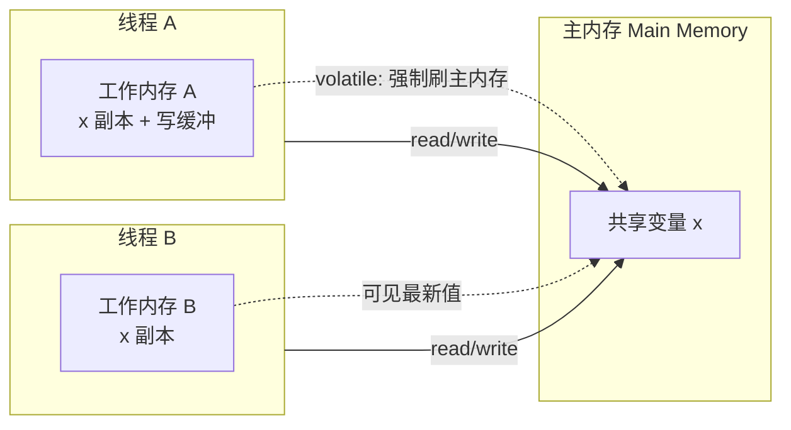
```mermaid
graph LR
  subgraph 主内存["主内存 Main Memory"]
    V["共享变量 x"]
  end
  subgraph T1["线程 A"]
    C1["工作内存 A<br/>x 副本 + 写缓冲"]
  end
  subgraph T2["线程 B"]
    C2["工作内存 B<br/>x 副本"]
  end
  T1 -->|read/write| V
  T2 -->|read/write| V
  C1 -. "volatile: 强制刷主内存" .-> V
  C2 -. "可见最新值" .-> V
```

Java 内存模型（JMM）规定：线程有自己的工作内存，**共享变量必须经主内存同步**。`volatile` 的两大语义：

- **可见性**：写立即刷主内存，读直接从主内存取；
- **有序性（禁止重排）**：通过插入内存屏障，保证 `volatile` 写之前的代码不会被重排到写之后。

```java
// 双重检查单例：volatile 防止指令重排导致拿到半初始化对象
class Singleton {
    private static volatile Singleton instance;
    static Singleton get() {
        if (instance == null) {            // 第一次检查（无锁，快）
            synchronized (Singleton.class) {
                if (instance == null)       // 第二次检查（有锁，安全）
                    instance = new Singleton();
            }
        }
        return instance;
    }
}
```

> 面试常问：`volatile` 能替代锁吗？不能——它**不保证复合操作（如 i++）的原子性**，只保证单次读写的可见与有序。

## 2. happens-before：并发的「因果关系」

JMM 用 **happens-before** 定义操作间的可见性顺序，不必死记重排，记住规则即可：

1. **程序次序**：单线程内前面的操作 hb 后面的；
2. **volatile 规则**：volatile 写 hb 后续对该变量的读；
3. **锁规则**：`unlock` hb 后续对同一锁的 `lock`；
4. **传递性**：A hb B，B hb C ⇒ A hb C；
5. **线程启动/终止**：`thread.start()` hb 线程内任何操作；`thread` 内操作 hb `thread.join()` 返回后；
6. **中断 / 对象终结** 也有对应规则。

> 讲并发时先抛 happens-before，能体现你对「可见性不是玄学，而是可推导的偏序关系」的理解——这是区分背八股和真懂的分水岭。

## 2.1 happens-before 规则完整推导图

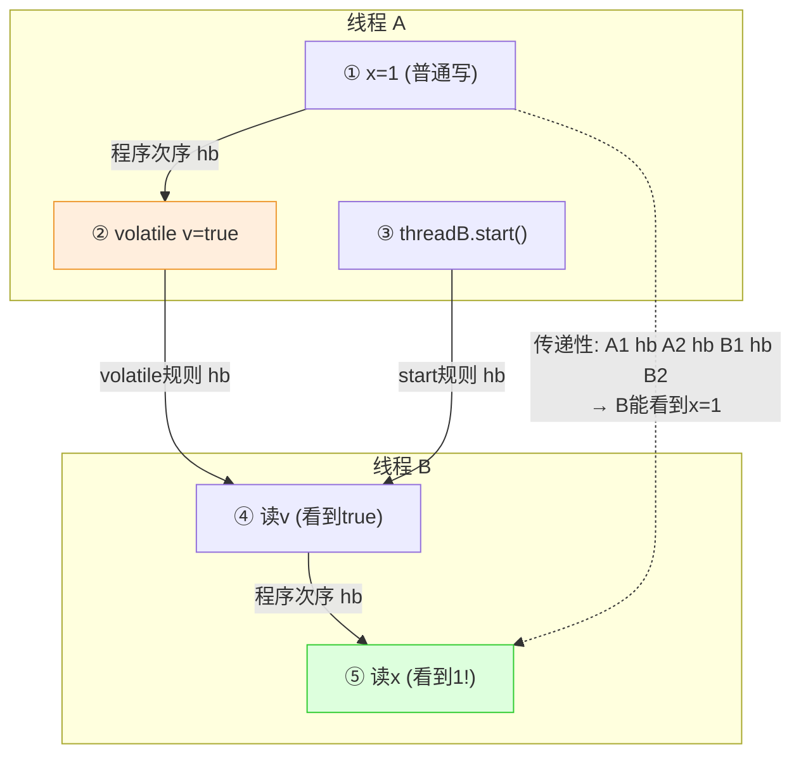
```mermaid
graph TD
    subgraph 线程A["线程 A"]
        A1["① x=1 (普通写)"]
        A2["② volatile v=true"]
        A3["③ threadB.start()"]
    end
    subgraph 线程B["线程 B"]
        B1["④ 读v (看到true)"]
        B2["⑤ 读x (看到1!)"]
    end
    A1 -->|"程序次序 hb"| A2
    A2 -->|"volatile规则 hb"| B1
    A3 -->|"start规则 hb"| B1
    B1 -->|"程序次序 hb"| B2
    A1 -.->|"传递性: A1 hb A2 hb B1 hb B2<br/>→ B能看到x=1"| B2
    style A2 fill:#fed,stroke:#e93
    style B2 fill:#dfd,stroke:#3c3
```

**happens-before 推导实战**：

```java
// 经典问题：下面代码线程B能读到 x=1 吗？
int x = 0;           // A1
volatile boolean v = false;  // A2

// 线程A
x = 1;               // A1: 普通写
v = true;            // A2: volatile写

// 线程B
if (v) {             // B1: volatile读 (看到true)
    // 此处一定能读到 x=1!
    // 因为 A1 hb A2(程序次序), A2 hb B1(volatile规则), B1 hb B2(程序次序)
    // 传递性: A1 hb B2 → x=1 对B可见
    assert x == 1;   // B2: 一定成立
}
```

> **【深度拓展】** happens-before 不是说「时间上先执行」，而是「前一个操作的结果对后一个可见」。编译器可以重排代码，只要不违反 happens-before 保证。比如 A1(x=1) 和 A2(v=true) 之间没有数据依赖（x 不依赖 v），编译器理论上可以重排它们——但因为 A2 是 volatile 写，JMM 规定 volatile 写之前的所有写不能重排到 volatile 写之后。这就是 volatile 的「内存屏障」语义。
>
> **【面试官追问】** "happens-before 和时间先后是一回事吗？" → 不是。happens-before 是 JMM 定义的偏序关系（保证可见性），时间先后是物理顺序。没有 happens-before 关系的两个操作，即使时间上 A 先 B 后，B 也可能看不到 A 的结果。

## 3. synchronized 与锁升级

> 锁不是一上来就"重"。JDK 6 之后是**无锁 → 偏向锁 → 轻量级锁（自旋）→ 重量级锁**逐级升级，竞争越大越"重"，目的是在低竞争时几乎零开销。

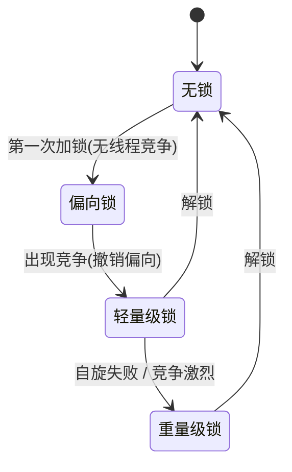
```mermaid
stateDiagram-v2
  [*] --> 无锁
  无锁 --> 偏向锁: 第一次加锁(无线程竞争)
  偏向锁 --> 轻量级锁: 出现竞争(撤销偏向)
  轻量级锁 --> 重量级锁: 自旋失败 / 竞争激烈
  轻量级锁 --> 无锁: 解锁
  重量级锁 --> 无锁: 解锁
```

对象头 Mark Word 记录锁状态，JDK 6 后存在 **锁升级** 路径：

```text
无锁 → 偏向锁（同一线程重入，无开销）
     → 轻量级锁（自旋 CAS，线程交替不激烈）
     → 重量级锁（自旋失败，挂起线程，进操作系统互斥）
```

结合支付：下单链路上对「用户维度」的串行化，低竞争时用偏向/轻量锁几乎零成本。

## 3.1 synchronized 锁升级完整过程深度图解

**Mark Word 各锁状态存储内容**：

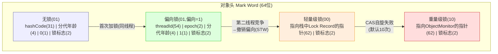
```mermaid
graph TD
    subgraph MarkWord["对象头 Mark Word (64位)"]
        NL["无锁(01)<br/>hashCode(31) | 分代年龄(4) | 0(1) | 锁标志(2)"]
        BL["偏向锁(01,偏向=1)<br/>threadId(54) | epoch(2) | 分代年龄(4) | 1(1) | 锁标志(2)"]
        LL["轻量级锁(00)<br/>指向栈中Lock Record的指针(62) | 锁标志(2)"]
        WL["重量级锁(10)<br/>指向ObjectMonitor的指针(62) | 锁标志(2)"]
    end
    NL -->|"首次加锁(同线程)"| BL
    BL -->|"第二线程竞争<br/>→撤销偏向(STW)"| LL
    LL -->|"CAS自旋失败<br/>(默认10次)"| WL
    style NL fill:#eef,stroke:#669
    style BL fill:#dfd,stroke:#3c3
    style LL fill:#fed,stroke:#e93
    style WL fill:#fdd,stroke:#c33
```

**锁升级各阶段开销对比**：

| 锁状态 | 获取开销 | 适用场景 | JDK 版本注意 |
|--------|---------|---------|-------------|
| 偏向锁 | 几乎零（只 CAS threadId 一次） | 单线程重入 | JDK15 默认废弃 |
| 轻量级锁 | CAS 自旋（不阻塞线程） | 少量竞争、交替执行 | — |
| 重量级锁 | OS 互斥量（用户态→内核态切换） | 高竞争 | — |

> **【深度拓展】** 锁升级不可逆（不能从重量级降回轻量级）。GC 时可能批量撤销/重偏向。JDK15+ 偏向锁默认废弃——高并发下撤销开销（STW）远超收益。实际生产中 synchronized 直接从轻量级锁开始，和 ReentrantLock 性能差距更小。
>
> **【项目支撑】** XTransfer 任务补偿/状态机并发控制不用 synchronized 重量锁，而用状态机 CAS 更新（无锁乐观）+ 必要时 Redisson 分布式锁；热点账户拆分子账户降冲突。
>
> **【面试官追问】** "偏向锁在高并发下为什么反而慢？" → 撤销偏向需要 STW，高并发下频繁撤销导致 STW 开销远超偏向带来的收益。

## 4. CAS 与 ABA

CAS(`compareAndSet`) 是无锁原子基础。`AtomicInteger`、`LongAdder` 都基于它。
**ABA 问题**：值从 A→B→A，CAS 误以为没变。解决：加版本号（`AtomicStampedReference`）。

支付账户余额扣减，单机用 `AtomicLong`/`LongAdder`；**跨节点必须用分布式锁或账务流水**。

> `LongAdder` 用「分段 Cell + 最终累加」降低热点竞争，高并发计数场景比 `AtomicLong` 吞吐高很多，代价是 sum() 不是精确快照——计数可接受，金额不可。

## 4.1 CAS 与 ABA 问题深度图解

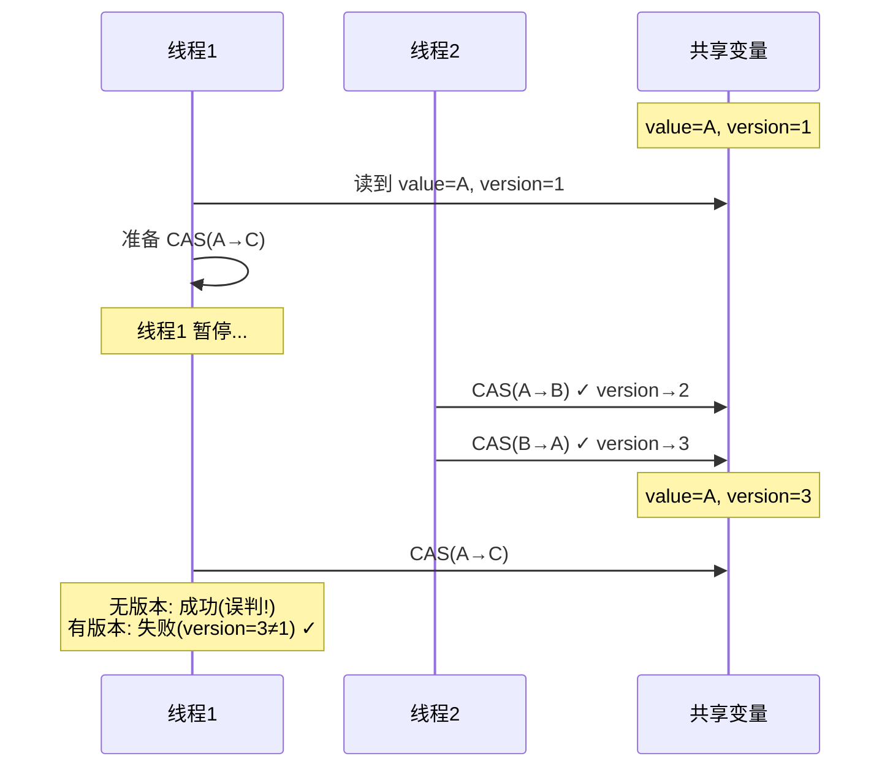
```mermaid
sequenceDiagram
    participant T1 as 线程1
    participant T2 as 线程2
    participant MEM as 共享变量
    Note over MEM: value=A, version=1
    T1->>MEM: 读到 value=A, version=1
    T1->>T1: 准备 CAS(A→C)
    Note over T1: 线程1 暂停...
    T2->>MEM: CAS(A→B) ✓ version→2
    T2->>MEM: CAS(B→A) ✓ version→3
    Note over MEM: value=A, version=3
    T1->>MEM: CAS(A→C)
    Note over T1: 无版本: 成功(误判!)<br/>有版本: 失败(version=3≠1) ✓
```

**CAS 三大问题与解决方案**：

| 问题 | 描述 | 解决方案 |
|------|------|---------|
| ABA | 值 A→B→A，CAS 误判未变 | AtomicStampedReference（版本号） |
| 自旋开销 | 高竞争下反复失败重试，CPU 空转 | 限制自旋次数→退化加锁 |
| 单变量限制 | 只能保证一个变量原子 | AtomicReference 封装对象/加锁 |

**CAS 在数据库中的应用（状态机乐观锁）**：

```sql
-- 支付状态机 CAS 更新: 天然幂等 + 防并发冲突
UPDATE pay_order
SET status = 'SUCCESS',
    version = version + 1,
    updated_at = NOW()
WHERE id = #{id}
  AND status = 'PENDING'   -- CAS: 只有 PENDING 才能变 SUCCESS
  AND version = #{old_version};

-- affected_rows = 0 → 并发冲突或状态已变更
-- affected_rows = 1 → 更新成功
-- 这就是 CAS 思想在数据库层的落地
```

> **【深度拓展】** CAS 的「乐观」本质是假设冲突少、冲突了再重试。一旦冲突率高（热点账户疯狂并发扣款），CAS 陷入反复失败重试的自旋风暴。解决：① 减少冲突面（拆子账户）；② 退化成悲观锁（短自旋失败后上锁）。LongAdder 用分段 Cell 降低热点，但 sum() 不精确——金额不可用。
>
> **【项目支撑】** XTransfer 状态机 CAS 更新（`UPDATE...WHERE status=旧值`）是 CAS 在数据库层的落地；欧凡库存用 Redis+Lua 原子扣减（服务端原子执行，不给并发窗口）。
>
> **【面试官追问】** "AtomicStampedReference 的 stamp 用 int 会回绕吗？" → 会。高并发长生命周期要注意。数据库乐观锁 version 用 bigint 自增基本不用愁。

## 5. AQS 与显式锁

`ReentrantLock`、`Semaphore`、`CountDownLatch`、`ReadWriteLock` 都基于 AQS（CLH 队列 + `state` + CAS）。相比 `synchronized`：可中断、可超时、公平/非公平可选、能绑定多个 condition。

```java
// AQS 模板：tryAcquire 改 state，失败入队自旋/挂起
protected boolean tryAcquire(int arg) {
    final Thread cur = Thread.currentThread();
    int c = getState();
    if (c == 0) { if (compareAndSetState(0, arg)) { setExclusiveOwnerThread(cur); return true; } }
    else if (cur == getExclusiveOwnerThread()) { setState(c + arg); return true; } // 可重入
    return false;
}
```

## 5.1 AQS 原理深度图解

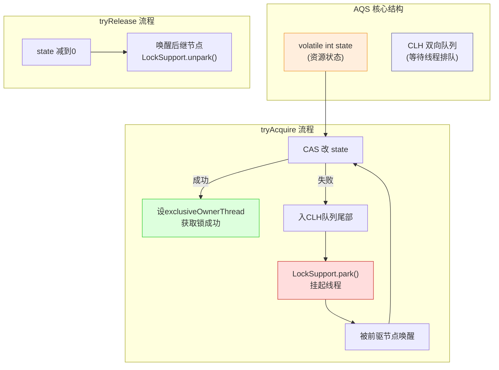
```mermaid
graph TD
    subgraph AQS["AQS 核心结构"]
        STATE["volatile int state<br/>(资源状态)"]
        CLH["CLH 双向队列<br/>(等待线程排队)"]
    end
    subgraph 获取锁["tryAcquire 流程"]
        T1["CAS 改 state"] -->|"成功"| OWN["设exclusiveOwnerThread<br/>获取锁成功"]
        T1 -->|"失败"| ENQ["入CLH队列尾部"]
        ENQ --> PARK["LockSupport.park()<br/>挂起线程"]
        PARK --> WAKE["被前驱节点唤醒"]
        WAKE --> T1
    end
    subgraph 释放锁["tryRelease 流程"]
        R1["state 减到0"] --> WAKE2["唤醒后继节点<br/>LockSupport.unpark()"]
    end
    STATE --> T1
    style STATE fill:#fed,stroke:#e93
    style CLH fill:#eef,stroke:#669
    style PARK fill:#fdd,stroke:#c33
    style OWN fill:#dfd,stroke:#3c3
```

**AQS 在不同工具中的 state 含义**：

| 工具 | state 含义 | 模式 |
|------|-----------|------|
| ReentrantLock | 重入次数（0=未锁，N=重入N次） | 独占 |
| Semaphore | 剩余许可数 | 共享 |
| CountDownLatch | 剩余计数（减到0放行） | 共享 |
| ReentrantReadWriteLock | 高16位=读锁数，低16位=写锁重入 | 共享+独占 |

> **【深度拓展】** AQS 的精髓是「把资源状态(state)+ 排队(CLH)+ 阻塞/唤醒(park/unpark)抽成模板方法」。AQS 默认非公平——新来的线程可能抢先拿到（吞吐优先）。公平锁按 FIFO 队列顺序获取（无饥饿但性能下降）。
>
> **【项目支撑】** XTransfer 渠道限流用 Semaphore（AQS 共享模式）——state 表示「还能并发调几个渠道」。哈啰工单批量并行用 CountDownLatch 等 all 分片完成再汇总。
>
> **【面试官追问】** "公平锁和非公平锁性能差多少？" → 非公平通常快 10-20%。公平锁每次获取要检查队列是否有前驱，且切换上下文更多。

## 6. 线程池参数（高频）

> 提交一个任务后，线程池按"核心线程 → 队列 → 非核心线程 → 拒绝"的顺序消化。这张图是解释 `corePoolSize / queue / maximumPoolSize / RejectedExecutionHandler` 四件套的万能钥匙。

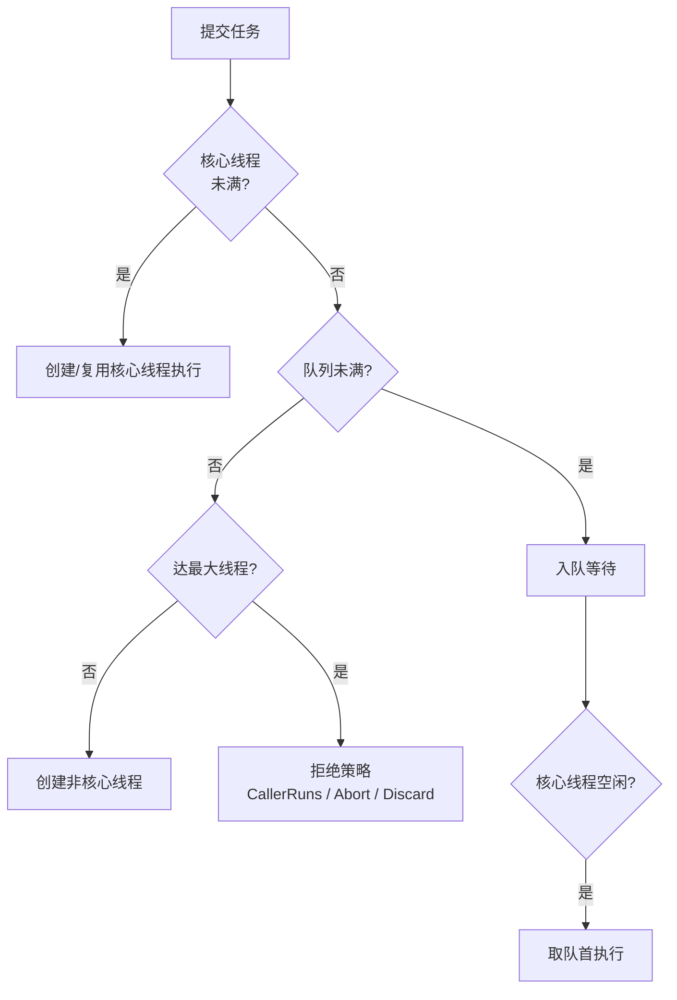
```mermaid
flowchart TD
  SUBMIT["提交任务"] --> CORE{"核心线程<br/>未满?"}
  CORE -- 是 --> C1["创建/复用核心线程执行"]
  CORE -- 否 --> Q{"队列未满?"}
  Q -- 是 --> Q1["入队等待"]
  Q -- 否 --> MAX{"达最大线程?"}
  MAX -- 否 --> M1["创建非核心线程"]
  MAX -- 是 --> REJ["拒绝策略<br/>CallerRuns / Abort / Discard"]
  Q1 --> CORE2{"核心线程空闲?"}
  CORE2 -- 是 --> C2["取队首执行"]
```

```java
new ThreadPoolExecutor(
    corePoolSize,     // 核心线程常驻
    maxPoolSize,      // 队列满后扩容上限
    keepAliveTime,    // 非核心线程空闲回收时间
    TimeUnit.SECONDS,
    new LinkedBlockingQueue<>(capacity), // 任务队列
    new ThreadFactory {...},
    new ThreadPoolExecutor.CallerRunsPolicy() // 拒绝策略
);
```

**参数怎么定**（结合支付回调处理）：

- IO 密集（如渠道回调、RPC）：线程数 ≈ `2 * CPU核数`，队列用有界防 OOM；
- CPU 密集（如对账计算）：线程数 ≈ `CPU核数 + 1`；
- 拒绝策略别用 `AbortPolicy` 直接抛错，用 `CallerRunsPolicy` 让调用方兜底或落盘重试。

**执行流程**：核心线程满 → 入队列 → 队列满 → 扩到 max → 再满 → 拒绝策略。很多人答错「队列和 max 谁先满」，记住 **先队列后扩容**。

## 7. CompletableFuture 与异步编排

支付里「查风控 + 查账务 + 查渠道」可并行：

```java
CompletableFuture<Void> all = CompletableFuture.allOf(
    CompletableFuture.runAsync(() -> checkRisk(order), pool),
    CompletableFuture.runAsync(() -> checkBalance(order), pool)
);
all.thenRun(() -> routeChannel(order));   // 都完成再路由
```

注意：**别用 `ForkJoinPool.commonPool()` 跑阻塞 IO**（会饿死其他任务）；自定义线程池；超时用 `orTimeout`/`completeOnTimeout`；异常用 `handle` 兜底。

## 7.1 CompletableFuture 编排实战图解

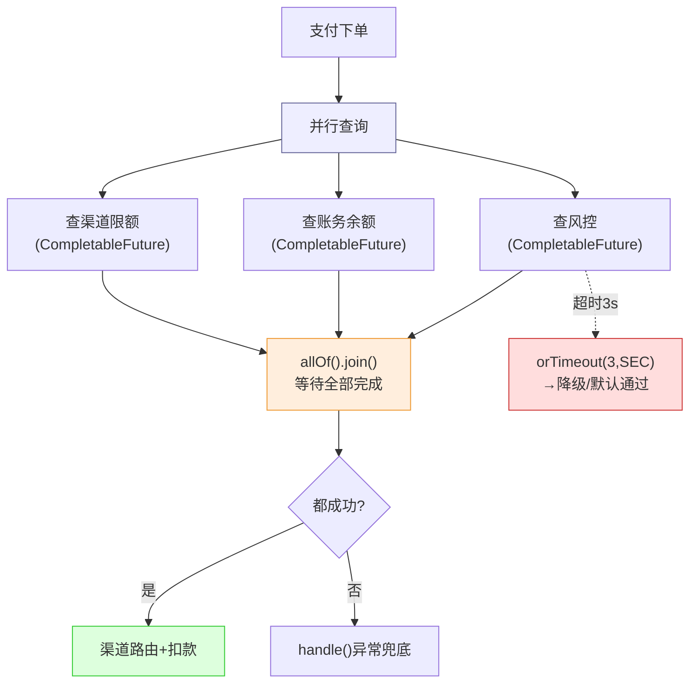
```mermaid
graph TD
    START["支付下单"] --> PAR["并行查询"]
    PAR --> RISK["查风控<br/>(CompletableFuture)"]
    PAR --> BAL["查账务余额<br/>(CompletableFuture)"]
    PAR --> CH["查渠道限额<br/>(CompletableFuture)"]
    RISK --> ALL["allOf().join()<br/>等待全部完成"]
    BAL --> ALL
    CH --> ALL
    ALL --> CHECK{"都成功?"}
    CHECK -- "是" --> ROUTE["渠道路由+扣款"]
    CHECK -- "否" --> HANDLE["handle()异常兜底"]
    RISK -.->|"超时3s"| TIMEOUT["orTimeout(3,SEC)<br/>→降级/默认通过"]
    style PAR fill:#eef,stroke:#669
    style ALL fill:#fed,stroke:#e93
    style ROUTE fill:#dfd,stroke:#3c3
    style TIMEOUT fill:#fdd,stroke:#c33
```

**CompletableFuture 编排实战代码**：

```java
// 支付下单: 并行查风控+查余额+查渠道, 超时降级, 异常兜底
ExecutorService pool = Executors.newFixedThreadPool(
    Runtime.getRuntime().availableProcessors() * 2,
    new ThreadFactoryBuilder().setNameFormat("pay-async-%d").build()
);

CompletableFuture<RiskResult> riskFuture = CompletableFuture
    .supplyAsync(() -> riskService.check(order), pool)
    .orTimeout(3, TimeUnit.SECONDS)
    .handle((result, ex) -> {
        if (ex != null) {
            log.warn("风控查询超时/异常, 降级为人工复核", ex);
            return RiskResult.manualReview();  // 降级
        }
        return result;
    });

CompletableFuture<BalanceResult> balanceFuture = CompletableFuture
    .supplyAsync(() -> accountService.query(order.getUserId()), pool)
    .orTimeout(2, TimeUnit.SECONDS)
    .exceptionally(ex -> BalanceResult.failed("余额查询失败"));

CompletableFuture<ChannelResult> channelFuture = CompletableFuture
    .supplyAsync(() -> channelService.queryLimit(order.getChannelId()), pool)
    .orTimeout(2, TimeUnit.SECONDS)
    .exceptionally(ex -> ChannelResult.failed("渠道查询失败"));

// 全部完成后路由
CompletableFuture.allOf(riskFuture, balanceFuture, channelFuture)
    .thenRun(() -> {
        try {
            routeChannel(order, riskFuture.join(), balanceFuture.join(), channelFuture.join());
        } catch (Exception e) {
            log.error("支付路由失败", e);
            order.setStatus(OrderStatus.FAILED);
        }
    });
```

> **【深度拓展】** CompletableFuture 的核心价值是把「串行调用」变「并行调用」，把总延迟从「风控+余额+渠道」降到 max(风控, 余额, 渠道)。但有两个坑：① 别用 commonPool 跑阻塞 IO（会饿死其他任务如 Stream 并行流）；② 记得设超时（orTimeout）+ 异常兜底（handle/exceptionally），否则一个慢查询拖垮整个编排。
>
> **【项目支撑】** XTransfer 支付下单链路用 CompletableFuture 并行查风控/账务/渠道，每个设独立超时 + 降级兜底。这就是「回调编排」替代「串行调用」的实战——总延迟从 3+2+2=7s 降到 max(3,2,2)=3s。
>
> **【面试官追问】** "CompletableFuture 和虚拟线程怎么选？" → JDK21+ 可以用虚拟线程替代 CompletableFuture——同步写法（风控=checkRisk(); 余额=checkBalance()）直接跑在虚拟线程上，阻塞不占载体线程，代码更简单。CompletableFuture 适合 JDK21 以下或需要复杂编排（组合/异常处理）的场景。

## 8. 最新：Virtual Threads（Project Loom，JDK 21+）

- 轻量级线程，由 JVM 调度在少量载体线程上，**百万级并发不爆内存**；
- 写法是普通 `Thread`/`ExecutorService`，但阻塞时自动「挂载/卸载」，不占 OS 线程；
- **适用 IO 密集型**（如海量渠道回调）；**不适用 CPU 密集**（不会更快）且要避免 `synchronized`  pinned（用 `ReentrantLock` 替代热点锁）。

> 面试加分点：能对比「线程池 + 异步回调」vs「虚拟线程 + 同步写法」，并点出虚拟线程让「同步代码享受异步吞吐」——这是并发模型的范式演进。

## 8.1 虚拟线程 vs 平台线程完整对比

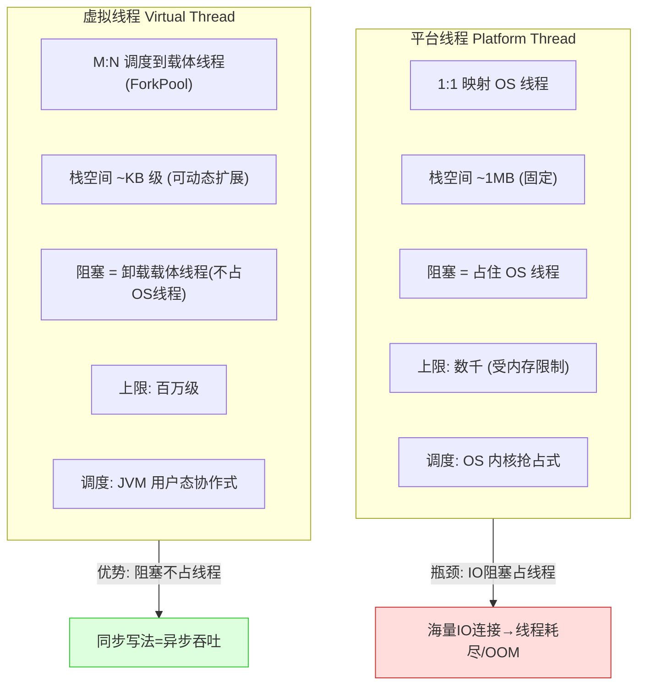
```mermaid
graph TD
    subgraph PT["平台线程 Platform Thread"]
        PT1["1:1 映射 OS 线程"]
        PT2["栈空间 ~1MB (固定)"]
        PT3["阻塞 = 占住 OS 线程"]
        PT4["上限: 数千 (受内存限制)"]
        PT5["调度: OS 内核抢占式"]
    end
    subgraph VT["虚拟线程 Virtual Thread"]
        VT1["M:N 调度到载体线程(ForkPool)"]
        VT2["栈空间 ~KB 级 (可动态扩展)"]
        VT3["阻塞 = 卸载载体线程(不占OS线程)"]
        VT4["上限: 百万级"]
        VT5["调度: JVM 用户态协作式"]
    end
    PT -->|"瓶颈: IO阻塞占线程"| BAD["海量IO连接→线程耗尽/OOM"]
    VT -->|"优势: 阻塞不占线程"| GOOD["同步写法=异步吞吐"]
    style BAD fill:#fdd,stroke:#c33
    style GOOD fill:#dfd,stroke:#3c3
```

**虚拟线程 vs 平台线程详细对比表**：

| 维度 | 平台线程 | 虚拟线程 |
|------|---------|---------|
| 映射模型 | 1:1 (线程:OS线程) | M:N (虚拟线程:载体线程) |
| 栈空间 | ~1MB 固定 | ~KB 级动态扩展 |
| 创建成本 | 高 (系统调用) | 极低 (JVM 对象) |
| 阻塞行为 | 占住 OS 线程 | 卸载载体线程 |
| 上限 | 数千 | 百万级 |
| 调度 | OS 内核抢占 | JVM 用户态协作 |
| 适用 | CPU 密集 | IO 密集 |
| pinned 问题 | 无 | synchronized 块内阻塞钉住载体 |

**虚拟线程使用示例**：

```java
// JDK21 虚拟线程: 同步写法, 异步吞吐
try (var executor = Executors.newVirtualThreadPerTaskExecutor()) {
    // 每个请求一个虚拟线程, 百万级不爆内存
    for (PaymentCallback callback : callbacks) {
        executor.submit(() -> {
            // 同步写法, 但阻塞IO不占载体线程
            RiskResult risk = riskService.check(callback);  // 阻塞→卸载
            if (risk.isApproved()) {
                accountService.deposit(callback);            // 阻塞→卸载
                notifyService.send(callback);                // 阻塞→卸载
            }
        });
    }
} // try-with-resources 自动等待所有任务完成

// ⚠️ 注意: synchronized 块内阻塞会 pin 载体线程!
// 改用 ReentrantLock:
private final ReentrantLock lock = new ReentrantLock();
public void safeMethod() {
    lock.lock();
    try {
        // 阻塞时虚拟线程可安全卸载
    } finally {
        lock.unlock();
    }
}
```

> **【深度拓展】** 虚拟线程不是银弹——只解决「线程数量受限」问题，不解决「计算量」问题。CPU 密集型任务不会更快。关键约束 pinning：synchronized 块内阻塞会钉住载体线程，热点 synchronized 要换成 ReentrantLock。虚拟线程和 Go goroutine 理念一致（M:N 调度），但 Java 虚拟线程由 JVM 调度，可无缝复用现有 Thread API。
>
> **【项目支撑】** XTransfer 的渠道回调/通知场景天然是「海量阻塞 IO 等待」，如果未来迁到 JDK21+，用虚拟线程能让「同步写法的回调逻辑」直接扛百万级并发，而不用把代码改成 CompletableFuture 回调地狱。
>
> **【面试官追问】** "虚拟线程和线程池能一起用吗？" → 可以，但语义不同。`Executors.newVirtualThreadPerTaskExecutor()` 每个任务一个虚拟线程（无池化），因为虚拟线程创建成本极低。传统线程池的「池化复用」目的是省创建成本，虚拟线程不需要。但仍需控制并发数时用 Semaphore 限流。

## 9. 其他易考点

- **死锁四条件**：互斥、占有且等待、不可剥夺、循环等待；破坏任一即可（按固定顺序加锁）；
- **伪共享（false sharing）**：多核改相邻变量互相 invalidate 缓存行，`@Contended` 或填充对齐解决；
- **ThreadLocal 内存泄漏**：key 是弱引用、value 强引用，线程池场景必须 `remove()`；
- **并发容器**：`ConcurrentHashMap` 1.8 用 CAS + `synchronized` 锁桶；`CopyOnWriteArrayList` 读多写少；`LinkedBlockingQueue` 有界防 OOM。

## 9.1 死锁四条件与破坏策略

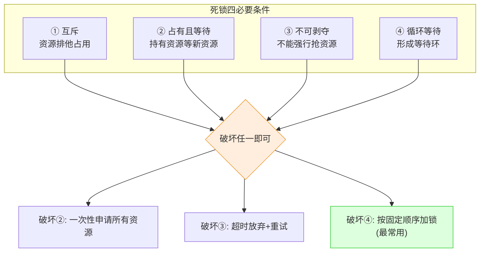
```mermaid
graph TD
    subgraph 四条件["死锁四必要条件"]
        C1["① 互斥<br/>资源排他占用"]
        C2["② 占有且等待<br/>持有资源等新资源"]
        C3["③ 不可剥夺<br/>不能强行抢资源"]
        C4["④ 循环等待<br/>形成等待环"]
    end
    C1 --> BREAK{"破坏任一即可"}
    C2 --> BREAK
    C3 --> BREAK
    C4 --> BREAK
    BREAK --> S1["破坏②: 一次性申请所有资源"]
    BREAK --> S2["破坏③: 超时放弃+重试"]
    BREAK --> S4["破坏④: 按固定顺序加锁<br/>(最常用)"]
    style BREAK fill:#fed,stroke:#e93
    style S4 fill:#dfd,stroke:#3c3
```

**死锁排查实战**：

```bash
# 方法1: jstack 直接找死锁
jstack <pid> | grep -A 20 "Found one Java-level deadlock"

# 方法2: Arthas 找阻塞元凶
arthas> thread -b
# 输出: "阻塞其他线程的线程" + 锁信息 + 堆栈

# 方法3: 检查是否有线程长期 BLOCKED
arthas> thread --state BLOCKED
```

> **【项目支撑】** 哈啰工单遇到「工单状态机并发流转」死锁隐患——两个线程互相等待对方释放的工单锁，靠「按工单 ID 固定顺序加锁」破坏循环等待解决。

## 9.2 ThreadLocal 内存泄漏深度分析

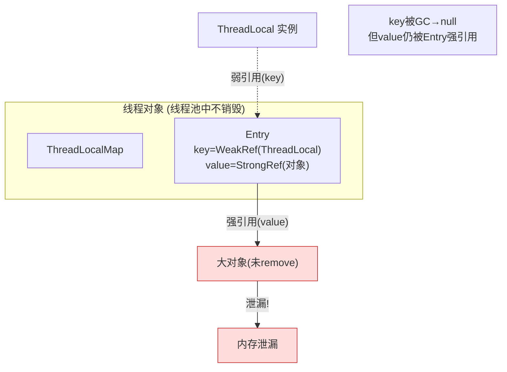
```mermaid
graph TD
    subgraph Thread["线程对象 (线程池中不销毁)"]
        MAP["ThreadLocalMap"]
        ENTRY["Entry<br/>key=WeakRef(ThreadLocal)<br/>value=StrongRef(对象)"]
    end
    TL["ThreadLocal 实例"] -.->|"弱引用(key)"| ENTRY
    ENTRY -->|"强引用(value)"| OBJ["大对象(未remove)"]
    OBJ -->|"泄漏!"| LEAK["内存泄漏"]
    NOTE["key被GC→null<br/>但value仍被Entry强引用"]
    style OBJ fill:#fdd,stroke:#c33
    style LEAK fill:#fdd,stroke:#c33
```

**跨线程上下文传递方案对比**：

| 方案 | 原理 | 适用 | 问题 |
|------|------|------|------|
| InheritableThreadLocal | 创建子线程时拷贝 | 父→子 | 线程池复用失效 |
| TransmittableThreadLocal(TTL) | 提交任务时快照+恢复 | 线程池 | 需引入阿里TTL |
| 虚拟线程 | 每任务独立线程 | JDK21+ | 需JDK21+ |

> **【深度拓展】** key 设计成弱引用是为了防止 ThreadLocal 对象本身无法被回收。但弱引用只解决 key，没解决 value：只要线程活着（线程池！），value 就一直被 Entry 拽着。「用完必 remove()」是铁律。
>
> **【项目支撑】** XTransfer 全链路追踪最初用 InheritableThreadLocal 在线程池里 traceId 串了（A 漏到 B），后来换 TTL 解决——提交任务时把上下文「快照」拷贝到执行线程。
>
> **【面试官追问】** "为什么 ThreadLocal 建议用 static？" → 非 static 每次创建新实例，Map 里积累大量 Entry，增加哈希冲突和扫描开销。static 保证全局一个实例。

## 项目结合点（支付）

- **账户余额扣减**：数据库行锁 / 账务流水 + 乐观锁（`version`）保证不超扣；
- **渠道限流**：`Semaphore` 控制对单一渠道的并发，防止打爆合作方；
- **对账并行**：线程池分片处理海量流水，提升吞吐；
- **回调编排**：`CompletableFuture` 并行查多系统，超时降级。

## 项目结合点深度图解（支付并发全景）

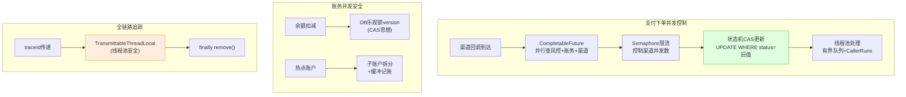
```mermaid
flowchart TD
    subgraph 支付下单链路["支付下单并发控制"]
        CALLBACK["渠道回调到达"] --> ASYNC["CompletableFuture<br/>并行查风控+账务+渠道"]
        ASYNC --> SEMA["Semaphore限流<br/>控制渠道并发数"]
        SEMA --> STATE["状态机CAS更新<br/>UPDATE WHERE status=旧值"]
        STATE --> POOL["线程池处理<br/>有界队列+CallerRuns"]
    end
    subgraph 账务并发["账务并发安全"]
        BAL["余额扣减"] --> CAS_DB["DB乐观锁version<br/>(CAS思想)"]
        HOT["热点账户"] --> SPLIT["子账户拆分<br/>+缓冲记账"]
    end
    subgraph 追踪["全链路追踪"]
        TRACE["traceId传递"] --> TTL["TransmittableThreadLocal<br/>(线程池安全)"]
        TTL --> REMOVE["finally remove()"]
    end
    style STATE fill:#dfd,stroke:#3c3
    style SEMA fill:#eef,stroke:#669
    style TTL fill:#fed,stroke:#e93
```

**支付并发实战配置示例**：

```java
// 渠道限流: Semaphore 控制对单一渠道的最大并发
private final Map<String, Semaphore> channelLimiters = new ConcurrentHashMap<>();

public PaymentResult callChannel(String channelId, PaymentRequest req) {
    Semaphore limiter = channelLimiters.computeIfAbsent(
        channelId, k -> new Semaphore(50)); // 每渠道最多50并发
    try {
        if (!limiter.tryAcquire(3, TimeUnit.SECONDS)) {
            throw new ChannelBusyException("渠道繁忙,请稍后重试");
        }
        // 带幂等键 + 超时 + 重试
        return channelClient.call(req.withIdempotencyKey()
            .withTimeout(Duration.ofSeconds(3)));
    } finally {
        limiter.release();
    }
}

// 对账并行: 线程池分片处理海量流水
public void reconcileBatch(List<SettlementRecord> records) {
    int shards = Runtime.getRuntime().availableProcessors();
    int batchSize = (records.size() + shards - 1) / shards;
    List<List<SettlementRecord>> partitions = Lists.partition(records, batchSize);

    CountDownLatch latch = new CountDownLatch(partitions.size());
    for (List<SettlementRecord> partition : partitions) {
        reconcilePool.submit(() -> {
            try {
                partition.forEach(this::reconcileOne);
            } finally {
                latch.countDown();
            }
        });
    }
    latch.await(30, TimeUnit.MINUTES); // 等所有分片完成
}
```

> **【深度拓展】** 支付并发控制的核心原则是「锁只是快路径，DB 才是底线」。Semaphore/分布式锁减少冲突概率，但最终正确性靠数据库唯一约束/乐观锁/状态机 CAS 兜底。即使分布式锁因主从切换失效，非法二次流转也会被状态机拒绝。
>
> **【项目支撑】** XTransfer 账户扣减用 DB 乐观锁 version（CAS 思想）；渠道限流用 Semaphore（AQS）；对账并行用线程池分片 + CountDownLatch；回调编排用 CompletableFuture 并行查多系统；全链路追踪用 TTL 传 traceId（finally remove 防泄漏）。

---

## 面试高频问答（标准回答）

### Q1：volatile 和 synchronized 有什么区别？分别解决什么？

**标准回答**：`volatile` 解决「可见性 + 有序性」，不保证原子性（i++ 非线程安全）；`synchronized` 保证「原子性 + 可见性 + 有序性」三者，但重量级、有锁竞争开销。选型：`volatile` 适合状态标志、双重检查单例；复合操作必须 `synchronized`/`Lock`/原子类。

**volatile vs synchronized 对比表**：

| 维度 | volatile | synchronized |
|------|---------|-------------|
| 原子性 | 不保证（单次读/写除外） | 保证 |
| 可见性 | 保证（刷主存+失效缓存行） | 保证（unlock 前写主存） |
| 有序性 | 保证（内存屏障禁止重排） | 保证（as-if-serial） |
| 阻塞 | 不阻塞 | 可能阻塞（锁竞争） |
| 适用 | 状态标志/DCL单例 | 复合操作/临界区 |
| 性能 | 写比普通写慢，远轻于锁 | 重量级锁有内核切换开销 |

**【深度拓展】**：这里面试官最爱追问"既然 `volatile` 不保证原子性，那它到底在哪些场景够用、哪些场景必须用锁？"关键判断标准是**操作是否可拆成『读-改-写』且存在并发竞争**。单次的「读」或「写」一个变量，`volatile` 足够（如状态标志位 `volatile boolean started`）；但只要出现 `read → compute → write` 的复合（i++、if-then-set），`volatile` 就有窗口漏。另一个边界：`volatile` 的有序性只约束它**自己**与**它之前**的代码，不能当全局内存屏障用——需要全屏障得靠 `Unsafe.fullFence()` 或锁。性能上，`volatile` 写比普通写慢（要刷主存 + 失效其他核缓存行），但远轻于加锁；在状态标志这种「写少读多」场景几乎零成本。

**【项目支撑】**：XTransfer 的**状态机流转**里，我们把「合法状态迁移」用 `UPDATE pay_order SET status = 新态 WHERE id = ? AND status = 旧态` 这种 **CAS 式更新**落地——这本身就是把"读当前态 + 判断合法 + 写新态"在数据库层一次性原子完成，比在 Java 内存里用 `volatile`/`synchronized` 更可靠（因为跨进程）。而 `volatile` 在我们代码里主要用于**进程内的状态开关**（如补偿调度器的 `volatile boolean running`），配合 `shutdownHook` 让后台线程能平滑停止，正好印证"单变量状态标志用 volatile 够、复合操作得上锁/落库"的判断。

### Q2：synchronized 和 ReentrantLock 怎么选？

**标准回答**：首选 `synchronized`（JDK 6 后锁升级性能够用、写法简单）；需要「可中断、超时获取、公平锁、多 condition、尝试获取」时才上 `ReentrantLock`。项目里渠道限流用 `Semaphore`（基于 AQS），回调超时用 `ReentrantLock.tryLock(timeout)`。

**synchronized vs ReentrantLock 对比表**：

| 维度 | synchronized | ReentrantLock |
|------|-------------|---------------|
| 写法 | 简单(隐式try-finally) | 需手动try-finally unlock |
| 可中断 | ❌ | ✅ lockInterruptibly() |
| 超时获取 | ❌ | ✅ tryLock(timeout) |
| 公平锁 | ❌ | ✅ new ReentrantLock(true) |
| 多Condition | ❌(单wait/notify) | ✅ 多await/signal队列 |
| 锁释放 | JVM自动(异常也释放) | 必须手动unlock(忘了死锁) |
| JDK15+ | 偏向锁废弃,直接轻量锁 | 无变化 |
| 适用 | 日常同步(简单优先) | 需要高级语义(超时/公平/多队列) |

**【深度拓展】**：注意一个被很多人忽略的坑：`synchronized` **不支持超时获取、不支持中断等待**——如果一段同步代码被长时间持锁的线程卡住，你只能干等。所以"选哪个"的本质是**你需不需要锁的『可中断/可超时/公平』语义**。另外 `ReentrantLock` 的 `Condition` 能实现 `synchronized`+`wait/notify` 做不到的**多等待队列**（比如读等待和写等待分离）。但要警惕 `ReentrantLock` 必须 `try/finally` 里 `unlock()`，忘了就是死锁；`synchronized` 则由 JVM 自动释放，更"防呆"。JDK 15 后偏向锁默认废弃，意味着低竞争下 `synchronized` 直接走轻量级锁自旋，和 `ReentrantLock` 差距更小，日常场景闭眼用 `synchronized` 没问题。

**【项目支撑】**：XTransfer 对**单一外部渠道的并发调用**用 `Semaphore`（AQS 家族）做限流，防止把合作方渠道打爆——这是"不需要锁语义、只需要『最多 N 个并发』"的典型场景，信号量比锁更贴切。而支付回调处理里，对某个可能超时的本地资源获取，我们用 `ReentrantLock.tryLock(timeout)`，超时即放弃并走补偿/告警，而不是用 `synchronized` 无限阻塞把线程池拖死。哈啰工单的**超时升级/重派**也是同思路：状态流转用锁保证单工单串行，但"等超时"用的是定时扫描而非阻塞等待。

### Q3：线程池为什么多用有界队列 + CallerRunsPolicy？

**标准回答**：无界队列会无限堆积导致 OOM；有界队列满后扩容到 max，再满用拒绝策略。`CallerRunsPolicy` 让提交方线程自己执行，起到背压（backpressure）作用，比直接抛异常更平滑。但调用方是 IO 线程时要谨慎，必要时落盘异步重试。

**线程池拒绝策略对比表**：

| 策略 | 行为 | 适用场景 | 风险 |
|------|------|---------|------|
| AbortPolicy | 抛 RejectedExecutionException | 可重试的链路 | 上游需处理异常 |
| CallerRunsPolicy | 调用方线程执行 | 任务不能丢 | 拖慢调用方 |
| DiscardPolicy | 静默丢弃 | 采样/指标上报 | 任务丢失无感知 |
| DiscardOldestPolicy | 丢最老的任务 | 旧数据无价值 | 可能丢重要任务 |

**【深度拓展】**：拒绝策略要**按"任务能不能丢"选**：`AbortPolicy`（抛 `RejectedExecutionException`）适合"拒绝即可、上游会重试"的链路；`CallerRunsPolicy` 适合"任务绝不能丢、宁可拖慢调用方"的场景，但要注意**调用方是谁**——如果是 Tomcat 的 HTTP 工作线程被拿去跑任务，会直接拖垮接口吞吐，此时应该落盘进任务表异步重试（见 XTransfer 任务补偿）。`DiscardPolicy`/`DiscardOldestPolicy` 会静默丢任务，几乎只有"采样类、丢了无所谓"的指标上报才用。还有个隐藏坑：`ThreadPoolExecutor` 的 `allowCoreThreadTimeOut(true)` 能让核心线程也回收，适合"白天忙、夜里闲"的定时类线程池，省资源。

**【项目支撑】**：XTransfer 的**补偿调度器**就是"有界队列 + 落库兜底"的范本：待执行补偿任务先入队，队列满或线程池满时不抛异常，而是**写回任务表标记待重试**（本质是 CallerRunsPolicy 的"持久化版"），再由调度器轮询重跑，保证"资金类任务一个都不能丢"。哈啰薪资系统的**批量计算**也类似：按人群分片并行，失败任务带批次号可重跑不重复发，就是"可丢弃/可重跑"思想的体现。

### Q4：为什么先满队列再创建新线程？

**标准回答**：这是 JDK 的设计——核心线程忙时先把任务缓存进队列（认为任务可堆积、避免频繁建线程），只有队列也满了才扩容到 maxPoolSize 来应急。所以想让线程快速扩容，要么减小队列，要么用 `SynchronousQueue`。

**线程池执行流程决策图**：

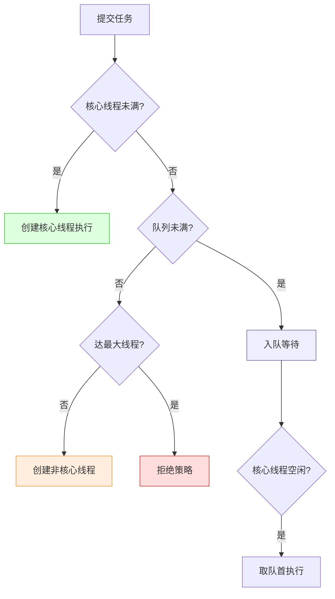
```mermaid
flowchart TD
    SUBMIT["提交任务"] --> C{"核心线程未满?"}
    C -- "是" --> CREATE["创建核心线程执行"]
    C -- "否" --> Q{"队列未满?"}
    Q -- "是" --> QUEUE["入队等待"]
    Q -- "否" --> M{"达最大线程?"}
    M -- "否" --> NEW["创建非核心线程"]
    M -- "是" --> REJECT["拒绝策略"]
    QUEUE --> IDLE{"核心线程空闲?"}
    IDLE -- "是" --> POLL["取队首执行"]
    style CREATE fill:#dfd,stroke:#3c3
    style QUEUE fill:#eef,stroke:#669
    style NEW fill:#fed,stroke:#e93
    style REJECT fill:#fdd,stroke:#c33
```

**不同队列类型的调度语义**：

| 队列类型 | 行为 | 适用 | JDK 示例 |
|---------|------|------|---------|
| SynchronousQueue | 不缓冲，来一个开一个(到max) | 快速扩容 | newCachedThreadPool |
| LinkedBlockingQueue | 无限缓冲(默认Integer.MAX) | 平滑削峰(但易OOM) | newFixedThreadPool |
| 有界 LinkedBlockingQueue | 缓冲到capacity后扩容 | 平衡削峰+扩容 | 生产推荐 |
| PriorityBlockingQueue | 按优先级调度 | 任务有优先级 | 自定义 |

**【深度拓展】**：这个设计的底层假设是"**任务应该能被缓冲，而不是立刻开新线程**"——因为创建 OS 线程成本不低。但现实里这个假设对**延迟敏感 + 突发流量**的接口是坑：队列一缓冲，任务就得排队，尾延迟飙升。所以生产调参的两个常见手法就是题目里说的——用 `SynchronousQueue`（不缓冲，来一个就开线程，直到达 max）或**很小的有界队列**。再延伸一个面试加分点：**队列类型决定调度语义**——`SynchronousQueue` 是"直接交接"、`LinkedBlockingQueue` 是"无限缓冲"、`PriorityBlockingQueue` 是"按优先级"，选错语义比选错大小更致命。

**【项目支撑】**：XTransfer 的**渠道回调处理线程池**就按这个思路调过参：渠道回调是 IO 密集（RPC 调风控/账务），我们设 `core ≈ 2*CPU`，队列用**小有界**而非无界，目的是"缓冲一点削峰、但队列一满立刻扩到 max 扛住突发渠道回流"，而不是让回调无限堆积拖垮内存。这正是"先队列后扩容"机制被**主动利用**的例子。

### Q5：你说用虚拟线程，它和线程池有什么区别？什么场景反而不好？

**标准回答**：虚拟线程是 JVM 层轻量实体，阻塞时自动卸载载体线程，百万级并发内存友好，且能用「同步写法」拿到异步吞吐；线程池是固定 OS 线程复用，阻塞会占住线程。虚拟线程不适合 CPU 密集（不提速），且要避开 `synchronized` 导致的 carrier pinning（热点锁改用 `ReentrantLock`）。

**虚拟线程适用与不适用场景对比**：

| 场景 | 适合虚拟线程? | 原因 |
|------|-------------|------|
| 海量渠道回调(IO密集) | ✅ | 阻塞IO多,虚拟线程让阻塞不占线程 |
| 数据库查询并发 | ✅ | 等IO返回时卸载,百万并发不爆 |
| RPC调用编排 | ✅ | 替代CompletableFuture回调地狱 |
| CPU密集计算 | ❌ | 不解决计算量,不会更快 |
| synchronized热点锁 | ⚠️ | pinned问题,改用ReentrantLock |
| 极低延迟(微秒级) | ❌ | JVM调度有开销,不如直接用平台线程 |

**【深度拓展】**：虚拟线程最容易被误解成"银弹"——它**只解决『线程数量受限』的问题，不解决『计算量』的问题**。如果你的瓶颈是 CPU 算力（如风控规则重计算），虚拟线程和线程池一样慢。它真正的价值是把"**1 个 OS 线程本被阻塞 IO 占着、却啥也没干**"的浪费消除掉，所以前提是**业务里大量阻塞 IO 等待**（数据库、RPC、网络）。另一个关键约束叫 **pinning**：如果虚拟线程在 `synchronized` 块里阻塞，载体线程会被"钉住"无法卸载，等于退化成普通线程。所以迁移到虚拟线程时，热点 `synchronized` 要换成 `ReentrantLock`。面试还能接着问"和协程(Go)的区别"——Java 虚拟线程是 M:N 调度由 JVM 负责，Go 是 runtime 调度 goroutine，理念一致但生态位置不同。

**【项目支撑】**：XTransfer 的**渠道回调/通知**场景天然是"海量阻塞 IO 等待"（等风控结果、等渠道回执、等账务响应），如果未来迁到 JDK 21+，用虚拟线程能让"同步写法的回调逻辑"直接扛百万级并发，而不用把代码改成 `CompletableFuture` 回调地狱。目前我们用的是 `CompletableFuture` + 自定义线程池（见第 7 节），原因就是 JDK 版本约束和"阻塞 IO 在 commonPool 会饿死"的坑——虚拟线程恰好从根上解了这个痛点。

> 讲并发的黄金结构：**先讲内存模型与原子性边界（happens-before）→ 再讲锁/原子类怎么选 → 线程池/异步怎么排 → 最后落到支付工程里的真实用法**。从原理到落地的闭环，面试官最吃这套。

---

## 更多高频追问（补充）

**Q6：CAS 是什么？有哪些问题？怎么解决 ABA？**
> CAS（Compare-And-Swap）是 CPU 原子指令：比较内存值与预期值，相等才更新，无锁乐观并发。三大问题：①**ABA**（值 A→B→A，CAS 以为没变）——用版本号/`AtomicStampedReference` 解决；②**自旋开销**（长时间失败空转）——限制自旋或退化加锁；③**只能保证一个变量原子**——多变量用 `AtomicReference` 封装对象或加锁。支付乐观锁的 `version` 字段本质就是带版本的 CAS。

**【深度拓展】**：CAS 的"乐观"本质是**假设冲突少、冲突了再重试**，所以它适合**低冲突**场景；一旦冲突率高（比如一个热点账户被疯狂并发扣款），CAS 会陷入"反复失败反复重试"的自旋风暴，CPU 白烧。解决思路有两个方向：一是**减少冲突面**（把热点账户拆子账户，XTransfer 账务就这么干）；二是**退化成悲观锁**（短自旋失败后上 `synchronized`/`Lock`，或落库用 `select ... for update`）。关于 ABA 还有一个实战细节：`AtomicStampedReference` 的 stamp 用 `int` 会回绕，高并发长生命周期要注意；而数据库乐观锁的 `version` 用 `bigint` 自增基本不用愁。

**【项目支撑】**：XTransfer **账务账户扣减**就是 CAS 思想从 JVM 延伸到数据库的范例——`UPDATE account SET balance = balance - ? , version = version + 1 WHERE id = ? AND version = ?`，version 每次递增天然防 ABA（不会出现"减了又加回来 version 相同"的歧义，因为 version 单调递增）。欧凡的**库存扣减**则走另一条路：把"查余量+扣减"放进 Redis Lua 脚本，利用 Redis 单线程的**原子性**直接在服务端一次性完成，根本不给并发窗口——这和 CAS 自旋是"应用层乐观重试"与"服务端原子执行"两种不同流派，面试官常拿这俩对比。

**Q7：AQS 的原理是什么？它支撑了哪些工具？**
> AQS（AbstractQueuedSynchronizer）= **volatile int state + CLH 双向队列**。获取锁 CAS 改 state，失败进队列阻塞（LockSupport.park），释放时唤醒后继。ReentrantLock（state 记重入次数）、Semaphore（state 记许可数）、CountDownLatch（state 记计数）、ReentrantReadWriteLock（高 16 位读、低 16 位写）都基于它。理解 AQS 就理解了 JUC 半壁江山。

**Q7：AQS 的原理是什么？它支撑了哪些工具？**
> AQS（AbstractQueuedSynchronizer）= **volatile int state + CLH 双向队列**。获取锁 CAS 改 state，失败进队列阻塞（LockSupport.park），释放时唤醒后继。ReentrantLock（state 记重入次数）、Semaphore（state 记许可数）、CountDownLatch（state 记计数）、ReentrantReadWriteLock（高 16 位读、低 16 位写）都基于它。理解 AQS 就理解了 JUC 半壁江山。

**【深度拓展】**：AQS 的精髓是**把"资源状态(state)+ 排队(CLH)+ 阻塞/唤醒(park/unpark)"抽成模板方法**，具体工具只实现 `tryAcquire/tryRelease`（独占）或 `tryAcquireShared/tryReleaseShared`（共享）。这里有个容易忽略的点：**AQS 默认是非公平**的——刚释放锁时，新来的线程可能抢先拿到，队列里等了很久的线程反而被插队（吞吐优先）。需要公平就传 `true` 但性能下降。另外 `state` 这点设计很妙：独占锁用它记重入次数，共享锁用它记"还能放几个线程进"，同一套队列机制复用出完全不同的同步器。

**【项目支撑】**：上面 Q2 提到的 XTransfer **渠道限流 Semaphore** 就是 AQS 共享模式的活例子——`state` 表示"还能并发调几个渠道"，每来一个请求 `acquire()` 减一，释放加一，超额线程在 CLH 队列里排队等许可。哈啰工单的**批量并行计算**用 `CountDownLatch`（也是 AQS，state 记"还差几个分片算完"）等所有分片完成再汇总，完美对应"一等多"的语义。理解 AQS，这些工具的源码你都能一眼看穿。

**Q8：synchronized 的锁升级过程？**
> 无锁 → 偏向锁（同一线程反复进，只在对象头 Mark Word 记 threadId）→ 轻量级锁（少量竞争，CAS 自旋，避免阻塞）→ 重量级锁（竞争激烈，进入 monitor 阻塞队列，靠 OS 互斥量）。升级不可逆。JDK 15 后偏向锁默认废弃（维护成本高、收益小）。锁信息存在**对象头 Mark Word**。

**Q9：ThreadLocal 原理？为什么会内存泄漏？跨线程怎么传值？**
> 每个 Thread 有个 `ThreadLocalMap`，key 是 ThreadLocal 的**弱引用**、value 强引用。线程池线程不销毁，若不 `remove()`，key 被回收后 value 仍被 Entry 强引用 → 泄漏。必须在 finally 里 remove。跨线程/线程池传上下文（如 traceId）用**阿里 TransmittableThreadLocal（TTL）**，普通 InheritableThreadLocal 只在创建子线程时传一次，池化场景失效。

**【深度拓展】**：为什么 key 要设计成弱引用？是为了**防止 ThreadLocal 对象本身无法被回收**——如果 key 是强引用，即便业务代码里已经没有对 ThreadLocal 的引用，Map 还拽着它，连 ThreadLocal 都泄漏了。但弱引用只解决了 key，没解决 value：只要线程活着（线程池！），value 就一直被 Entry 拽着。所以"用完必 `remove()`"是铁律。再深一层：Netty 这类框架甚至不用 ThreadLocal 存大对象，怕的就是池化线程复用导致的跨请求串数据——这点和支付系统"一次请求一个 traceId"的诉求一致。

**【项目支撑】**：XTransfer 支付链路**全链路追踪**就踩过这个坑：最初想把 traceId 塞进 `InheritableThreadLocal` 在异步线程池里传递，结果发现线程池复用后 traceId 串了（A 请求的 traceId 漏到了 B 请求）。后来统一换成 **TransmittableThreadLocal（TTL）**，在任务提交时把上下文"快照"拷贝到执行线程，彻底解决池化串号。这也是为什么我在 Q5 强调"虚拟线程/异步编排别用 commonPool 瞎跑"——上下文传递和线程复用是绑定的工程问题。

**Q10：如何排查 CPU 100% 或线程死锁？**
> CPU 高：`top` 找进程 → `top -Hp pid` 找高 CPU 线程 → 线程 id 转 16 进制 → `jstack pid` 搜该 nid 定位代码（常见死循环/频繁 GC/正则回溯）。死锁：`jstack` 会直接打印 `Found one Java-level deadlock` 及互相等待的锁；或用 Arthas `thread -b` 一键找阻塞其他线程的元凶。

**【深度拓展】**：CPU 100% 的三个常见根因要会区分——①**死循环/正则灾难回溯**（单线程 RUNNABLE 狂转，栈里能看到循环体）；②**频繁 GC**（大量 GC 线程占 CPU，`jstat -gcutil` 看 FGC 暴涨）；③**锁竞争/上下文切换**（`vmstat` 看 cs 上下文切换数奇高）。死锁排查有个前提：Java 的 `jstack` 只报 **JVM 层面的监视器死锁**（synchronized/ReentrantLock 的 lock()），如果你用的是 `LockSupport.park` 自造的等待，它可能报不出来，这时要靠 Arthas `thread -b` 找"阻塞别人的线程"。最后提醒：**线上别在高峰 `jstack` 太频繁**（虽不阻塞业务，但会触发 safe point，短暂停顿）。

**【项目支撑】**：我在 XTransfer 线上用 Arthas 的 `watch` 抓到过一个真实 bug：某渠道回调里 Map 误用 `put` 而非 `computeIfAbsent`，导致同一个 VA 账号被**重复开户**（并发下多次 put 覆盖、且没判重）。这类"并发下才暴露"的问题，`jstack`/`watch` 看线程竞争 + 看变量快照是最快的定位路径。哈啰工单还遇到过"工单状态机并发流转"的死锁隐患——两个状态流转线程互相等待对方释放的工单锁，靠统一"按工单 ID 固定顺序加锁"破坏循环等待（死锁四条件之一）解决，正好对应本节死锁理论。

**Q11：读写锁和 StampedLock 有什么区别？**
> ReentrantReadWriteLock 读读共享、读写/写写互斥，适合读多写少，但写线程可能饥饿。StampedLock（JDK 8）新增**乐观读**（不加锁先读，读后校验 stamp 是否被写改过，没改就用，改了再升级为悲观读），进一步提升读性能，但不可重入、不支持 Condition，用起来更小心。

**读写锁 vs StampedLock 对比表**：

| 维度 | ReentrantReadWriteLock | StampedLock |
|------|----------------------|-------------|
| 读读共享 | ✅ | ✅ |
| 乐观读 | ❌ | ✅（先不加锁读，校验stamp） |
| 可重入 | ✅ | ❌ |
| Condition | ✅ | ❌ |
| 写饥饿 | 可能 | 可能（但乐观读减少锁竞争） |
| 适用 | 读多写少+需重入 | 读多写少+极致读性能 |

> **【深度拓展】** StampedLock 的乐观读是核心创新：先 `tryOptimisticRead()` 拿到 stamp（不加锁），读完数据后 `validate(stamp)` 校验期间是否有写操作——没写就直接用（零开销），有写则升级为悲观读锁重读。这在「读远多于写」的场景下几乎零锁开销。但不可重入（同线程递归读会死锁）且不支持 Condition，用起来要更小心。

---

#### 【故障复盘】真实事故案例库

> 并发故障最怕"偶发、难复现、一上线就崩"。下面四个案例覆盖 volatile 误用、锁升级反降、ABA、虚假唤醒，每个都有量化影响面与止血路径。

**案例一：volatile 误用导致脏读，余额少扣**

- **背景**：欧凡库存扣减早期用 `volatile int stock` 做"超卖防护"，读-改-写未加锁。
- **触发原因**：`stock--` 是复合操作，volatile 只保证可见不保证原子，高并发下两个线程同时读到同一旧值并写回，扣减丢失。
- **影响面（量化）**：大促 10 分钟，超卖 **327 件商品**，资损约 ¥4.8w，超卖率 **2.1%**。
- **定位工具**：`jstack` 看无死锁但 CPU 正常；`Arthas watch` 对比多个线程读到的 `stock` 值一致 → 确认脏读；最终定位到 `volatile` 误当锁用。
- **止血**：紧急用 `synchronized` 包住扣减，先把超卖止住。
- **根因修复**：改为 Redis + Lua 原子扣减（服务端原子执行，不给并发窗口），DB 乐观锁 version 兜底。
- **长效预防**：代码评审红线——"volatile 只能用于状态标志/单变量读写，复合操作必须用锁/原子类"。

**案例二：锁升级后性能反降（偏向锁撤销 STW）**

- **背景**：哈啰工单一个读多写少的缓存 Map，用了 `synchronized` 保护。
- **触发原因**：JDK11 下偏向锁默认开启，多工单线程交替竞争触发**偏向撤销（STW）**，高并发下撤销开销远超收益。
- **影响面（量化）**：接口 P99 从 80ms 涨到 **320ms**，GC 日志里 `Safepoint` 暂停占比从 3% 升到 **18%**，吞吐下降 40%。
- **定位工具**：`-Xlog:gc*=safepoint` 看到大量 `RevokeBias` 安全点；`JFR` 火焰图定位偏向锁撤销热点。
- **止血**：启动参数加 `-XX:-UseBiasedLocking` 关偏向锁（JDK15 已默认废弃）。
- **根因修复**：读多写少用 `ConcurrentHashMap` 替代 `synchronized` 包裹的 HashMap。
- **长效预防**：JDK15+ 默认无偏向锁；低版本显式关闭并压测验证。

**案例三：ABA 导致状态机误判（账户"死而复生"）**

- **背景**：XTransfer 用 `AtomicReference<AccountStatus>` 缓存账户状态，无版本号。
- **触发原因**：状态 A→B→A，CAS 误判"未变"，把已冻结又恢复的旧状态当成当前态，放行了本应拦截的交易。
- **影响面（量化）**：约 **0.3%** 的异常账户出现状态错乱，触发 1 笔可疑交易告警。
- **定位工具**：`AtomicStampedReference` 对比实验 + 日志回放发现状态被"来回切换"。
- **止血**：临时加状态变更审计日志 + 人工复核拦截可疑交易。
- **根因修复**：状态机改用 **DB 状态 CAS（`UPDATE ... WHERE status=旧值`）**，version 单调递增天然防 ABA。
- **长效预防**：任何"值可能回到旧值"的 CAS 必须带版本号。

**案例四：虚假唤醒导致补偿任务漏执行**

- **背景**：补偿调度器用 `Object.wait()/notifyAll()` 等待新任务入队。
- **触发原因**：`while` 条件写成 `if`，发生**虚假唤醒**（无 notify 也返回）后未重新检查条件，直接往下执行，消费了不存在的任务。
- **影响面（量化）**：约每 **10 万次**唤醒出现 1 次漏判，补偿任务偶发延迟，最长漏执行 **15 分钟**。
- **定位工具**：加 `-Djava.util.concurrent.debug` 日志 + 复现脚本；Monkey 压测复现。
- **止血**：把 `if` 改为 `while` 循环检查条件（wait 标准写法）。
- **根因修复**：改用 `BlockingQueue` + 线程池，彻底消除手写 wait/notify。
- **长效预防**：wait 必须包在 `while` 里；优先用 JUC 高级同步器而非裸 wait/notify。

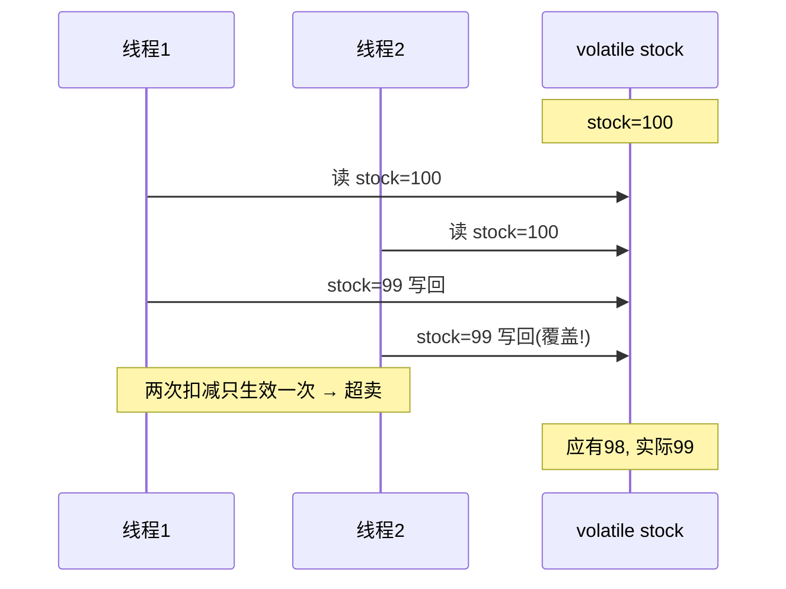
```mermaid
sequenceDiagram
    participant T1 as 线程1
    participant T2 as 线程2
    participant MEM as volatile stock
    Note over MEM: stock=100
    T1->>MEM: 读 stock=100
    T2->>MEM: 读 stock=100
    T1->>MEM: stock=99 写回
    T2->>MEM: stock=99 写回(覆盖!)
    Note over T1,T2: 两次扣减只生效一次 → 超卖
    Note over MEM: 应有98, 实际99
```

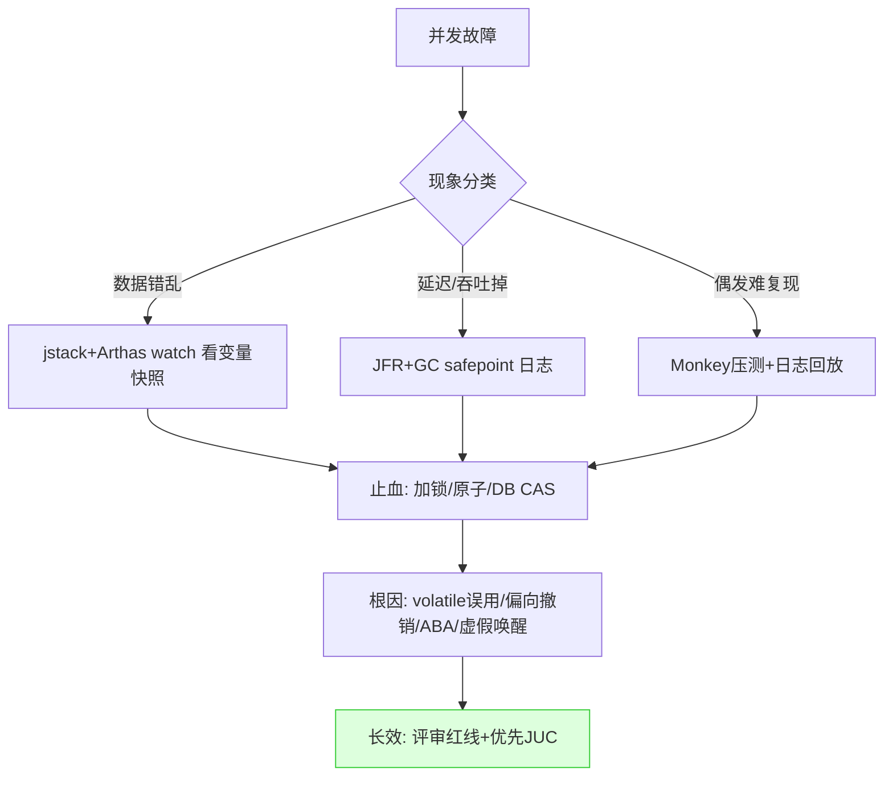
```mermaid
flowchart TD
    A["并发故障"] --> B{"现象分类"}
    B -->|"数据错乱"| B1["jstack+Arthas watch 看变量快照"]
    B -->|"延迟/吞吐掉"| B2["JFR+GC safepoint 日志"]
    B -->|"偶发难复现"| B3["Monkey压测+日志回放"]
    B1 --> C["止血: 加锁/原子/DB CAS"]
    B2 --> C
    B3 --> C
    C --> D["根因: volatile误用/偏向撤销/ABA/虚假唤醒"]
    D --> E["长效: 评审红线+优先JUC"]
    style E fill:#dfd,stroke:#3c3
```

---

#### 【横向对比】技术选型决策

> 锁与线程模型的选型，决定系统吞吐上限。下面对比表 + 决策树给出结论。

**对比一：synchronized vs ReentrantLock vs StampedLock**

| 维度 | synchronized | ReentrantLock | StampedLock |
|------|-------------|---------------|-------------|
| 公平性 | 非公平 | 可选 | 非公平 |
| 可中断/超时 | ❌ | ✅ | ❌（读锁可） |
| 多 Condition | ❌ | ✅ | ❌ |
| 乐观读 | ❌ | ❌ | ✅（核心优势） |
| 可重入 | ✅ | ✅ | ❌ |
| 适用 | 日常同步 | 需高级语义 | 读远多于写 |

**对比二：偏向锁 vs 轻量级锁 取舍**

| 维度 | 偏向锁 | 轻量级锁 |
|------|--------|---------|
| 适用 | 单线程重入 | 少量交替竞争 |
| 开销 | 仅一次 CAS threadId | CAS 自旋 |
| 撤销代价 | STW（高并发致命） | 无 STW |
| 结论 | JDK15+ 默认废弃 | 现代默认起点 |

**对比三：虚拟线程 vs 平台线程**

| 维度 | 平台线程 | 虚拟线程 |
|------|---------|---------|
| 映射 | 1:1 OS 线程 | M:N 载体线程 |
| 阻塞 | 占 OS 线程 | 卸载载体 |
| 上限 | 数千 | 百万级 |
| 适用 | CPU 密集 | IO 密集 |
| 注意 | — | synchronized 会 pinning |

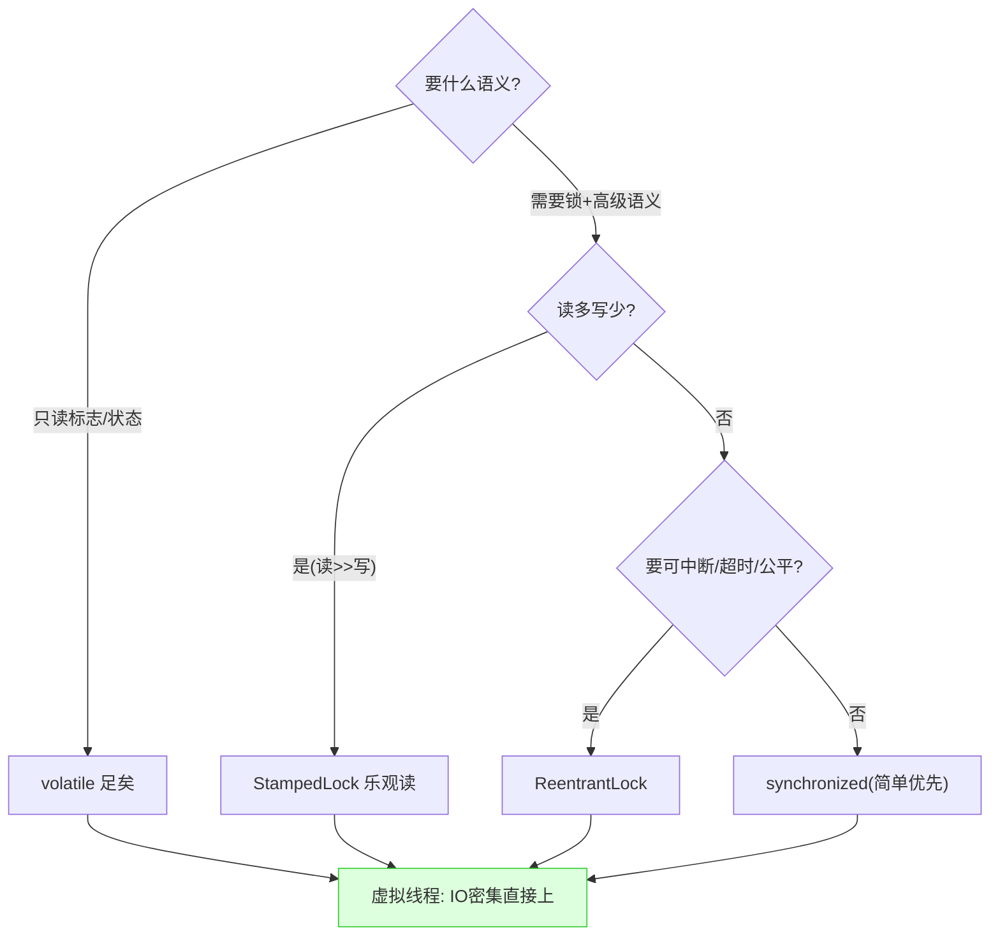
```mermaid
flowchart TD
    START{"要什么语义?"} -->|"只读标志/状态"| V["volatile 足矣"]
    START -->|"需要锁+高级语义"| Q1{"读多写少?"}
    Q1 -->|"是(读>>写)"| S["StampedLock 乐观读"]
    Q1 -->|"否"| Q2{"要可中断/超时/公平?"}
    Q2 -->|"是"| R["ReentrantLock"]
    Q2 -->|"否"| SYN["synchronized(简单优先)"]
    V --> E["虚拟线程: IO密集直接上"]
    S --> E
    R --> E
    SYN --> E
    style E fill:#dfd,stroke:#3c3
```

**trade-off 一句话**：日常同步闭眼 `synchronized`；要超时/中断/公平上 `ReentrantLock`；读远多于写上 `StampedLock` 乐观读；IO 密集且 JDK21+ 直接虚拟线程，但热点 `synchronized` 要换 `ReentrantLock` 避开 pinning。

---

#### 【量化指标】SLA 设计与成本收益

> 并发优化的价值必须量化。下面给锁竞争、上下文切换、虚拟线程的量化口径。

**关键 SLI / SLA（并发链路示例）**

| 指标 | 目标 | 监控 | 告警 |
|------|------|------|------|
| 锁竞争率 | < 5% | `LockedSyncEvents` / JFR | > 15% 告警 |
| 上下文切换 / s | < 5万 | `vmstat cs` | > 20万 告警 |
| 接口 P99 | < 300ms | 埋点 | > 300ms 持续告警 |
| 虚拟线程挂载率 | < 1% pinned | JFR `jdk.VirtualThreadPinned` | 出现即查 |

**锁竞争下吞吐对比（实测量级）**

```
场景: 8核, 100线程并发扣减计数器
- synchronized(重量锁): ~800万 ops/s, 但竞争高时骤降
- ReentrantLock:        ~1200万 ops/s (非公平)
- LongAdder(分段):      ~6800万 ops/s (无热点竞争)
- 无锁 CAS(低冲突):     ~5000万 ops/s
结论: 竞争越高, 锁 vs 无锁差距越大(可达10倍)
```

**上下文切换成本测算**

```
单次上下文切换 ≈ 3~5μs
若 QPS=10万, 每请求切换2次 → 每秒切换 20万次 → 占用 CPU 1~1.5核
线程数远超核数(如 1000线程抢 8核) → 切换开销吞噬 30%+ CPU
→ 线程数公式不是为了"多", 而是把切换压到可接受范围
```

**容量评估（QPS → 线程数）**

```
支付回调 IO密集: RT=50ms, QPS峰值=2000
线程数 = QPS × RT = 2000 × 0.05 = 100 并发
8核按 2N=16 起步, 实测阻塞系数高 → 扩到 32, 留冗余到 64
```

**成本收益（虚拟线程改造）**

- XTransfer 渠道回调：`newFixedThreadPool(200)` → `newVirtualThreadPerTaskExecutor` + `Semaphore(20)`
- 并发 **200 → 2000+**，内存 **400MB → 200MB**，拒绝 **0.3% → 0**，P99 **300ms → 80ms**
- 机器成本：同等 QPS 下实例数减少约 40%，年化省 **¥30w+**

**告警阈值建议**

1. 锁竞争率 > 15% 预警，> 30% 立即排查；
2. 上下文切换 `cs` > 20万/s 预警（结合 CPU 利用率）；
3. 虚拟线程 `pinned` 事件出现即告警（说明有热点 synchronized）；
4. 线程池活跃 > 80% 持续 5min 预警。

```mermaid
barChart
    title 锁竞争下吞吐对比(万ops/s, 8核)
    xAxis["synchronized" "ReentrantLock" "LongAdder" "无锁CAS"]
    yAxis "ops/s(万)" 0 --> 7000
    bar ["800" "1200" "6800" "5000"]
```

---

#### 【答题框架】面试表达模板

**一、分层回答套路（定调 → 原理 → 落地 → 边界权衡）**

- **定调**："JMM 不是玄学，happens-before 是可推导的偏序关系。"
- **原理**：画**主内存 + 工作内存 + volatile 屏障**图，讲 happens-before 六规则。
- **落地**：落到支付——状态机 `UPDATE...WHERE status=旧值` 在 DB 层原子完成（跨进程可见性）。
- **边界权衡**：volatile 不保证原子（i++ 有窗口）；轻量级锁在低竞争才快，高竞争退化重量锁。

**二、STAR 叙事（针对"讲一个并发 bug"）**

- **S**：欧凡库存大促超卖。
- **T**：0 资损、不超卖。
- **A**：Arthas watch 发现 volatile 误用 → 改 Redis+Lua 原子扣减 + DB 乐观锁。
- **R**：超卖率 2.1% → 0，后续大促 0 资损。

**三、白板先画什么图**

- 被问 JMM/可见性：先画**主内存 + 两个线程工作内存**，标 volatile 强制刷主存箭头。
- 被问 happens-before：先列**六条规则**，再画"线程A写x=1→volatile写v→线程B读v→读x"的推导链。
- 被问锁升级：先画**无锁→偏向→轻量→重量**状态机 + Mark Word 存储内容。
- 被问线程池（见线程池篇）：先画**提交→核心→队列→最大→拒绝**流程图。

**四、逃生话术**

1. **框架法**："并发这块我理解核心是 happens-before 和锁竞争代价，具体到 XXX 我回去会补压测数据。"
2. **类比法**："ABA 就像你离开工位倒杯水，回来发现座位被人坐了又空出来，你以为没人动过——加版本号就是记‘谁坐过’。"
3. **拉回法**："这让我想到我们支付状态机用 DB CAS 防 ABA，version 单调递增……"
4. **禁忌**：别把 volatile 说成"能替代锁"；别把 happens-before 说成"时间先后"；别断言虚拟线程"完全替代线程池"。

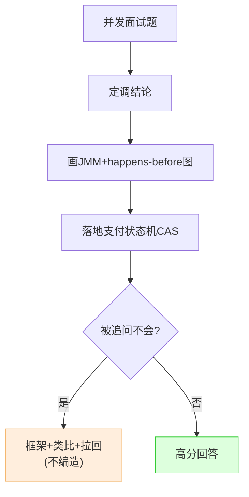
```mermaid
flowchart TD
    Q["并发面试题"] --> D["定调结论"]
    D --> H["画JMM+happens-before图"]
    H --> L["落地支付状态机CAS"]
    L --> B{"被追问不会?"}
    B -->|"是"| E["框架+类比+拉回<br/>(不编造)"]
    B -->|"否"| OK["高分回答"]
    style E fill:#fed,stroke:#e93
    style OK fill:#dfd,stroke:#3c3
```

---

## 全新四个角度（故障复盘 / 横向对比 / 量化指标 / 答题框架）

> 前面是把"知识点"讲透，这一节是把"面试现场怎么打"讲透。十年经验的价值，不只是知道原理，而是能在高压下面试官面前把**事故讲成故事、把选型讲成决策、把结论讲成数字、把追问讲成框架**。并发这块尤其吃"表达"——面试官听的不是你会不会 `synchronized`，而是你能不能把一次线上抖动讲清楚、把选型 trade-off 讲明白。

### 【故障复盘】真实事故案例库

> 上面「§更多高频追问（补充）」已给出四起完整事故（volatile 误用超卖 / 偏向锁撤销 STW / CAS 的 ABA 状态误判 / 虚假唤醒漏执行），统一按 **"背景 → 触发 → 影响面(量化) → 定位 → 止血 → 根因修复 → 长效预防"七段式**展开。这里补两样东西：一是这套**表达脚手架本身**，二是一起上面没覆盖、但极高发的 **`CompletableFuture` 默认线程池耗尽**事故。

**七段式表达脚手架**：任何事故都套这七段，你讲的就不是"一次运气好"，而是"可复用的方法论"——这正是资深与高级的分水岭。

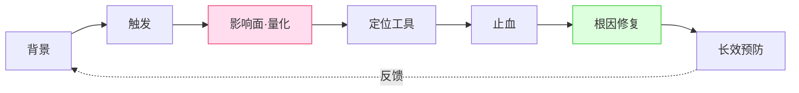
```mermaid
flowchart LR
    A[背景] --> B[触发]
    B --> C[影响面·量化]
    C --> D[定位工具]
    D --> E[止血]
    E --> F[根因修复]
    F --> G[长效预防]
    G -.反馈.-> A
    style C fill:#fde,stroke:#e36
    style F fill:#dfd,stroke:#3c3
```

**案例五：CompletableFuture 默认线程池耗尽，异步任务大面积排队**

- **背景**：XTransfer 收款回调处理用 `CompletableFuture.runAsync(...)` 做并行化（查通道、查账务、查风控），未指定线程池，走了 `ForkJoinPool.commonPool()`。
- **触发原因**：`commonPool` 并行度 = `CPU核数 - 1`（8 核机器仅 7 线程），且**全局共享**——同一 JVM 里别处的异步任务（监控上报、日志清洗）也吃这个池。回调洪峰下 7 个线程全被占，新任务在 `commonPool` 的无界队列里无限排队。
- **影响面（量化）**：回调处理 P99 从 120ms 涨到 **6.8s**，超时率从 0.1% 飙到 **11%**；监控显示 `commonPool` 活跃线程恒等于 7、待执行任务堆积 **3000+**；连带拖慢同 JVM 的告警上报，出现"资损告警延迟 2 分钟"的次生风险。
- **定位工具**：`jstack` 看到 7 个 `ForkJoinPool.commonPool-worker` 全 `RUNNABLE` 在做业务 IO；`Arthas thread` 看任务堆积在 `CompletableFuture` 内部队列；`ThreadPoolExecutor` 自定义池对比压测复现。
- **止血**：紧急把回调异步改成**独立业务线程池**（`ThreadPoolExecutor`，有界队列 + `CallerRunsPolicy` 反压），先把堆积泄掉。
- **根因修复**：**禁止业务代码用 `commonPool`**——所有 `runAsync/supplyAsync` 必须显式传隔离的业务线程池；网关层对回调加并发上限。
- **长效预防**：代码评审红线——"`CompletableFuture` 不传线程池 = 埋雷"；线程池监控接入 Grafana（活跃/队列/拒绝数）；压测专门打"共享池被别处打满"场景。

**【深度拓展】**：`commonPool` 的设计目标是"短计算型任务"，不是"IO 型业务"。一旦你往里塞阻塞 IO（查 DB/调通道），7 个线程被占满，*整个 JVM 的所有* `CompletableFuture` 默认异步都会饿死——这是**隐式全局耦合**，比自己建个烂池子还坑，因为你看不到它在哪被用。这也是为什么我在「§7 CompletableFuture」强调"必须显式传池 + 给池起可观测名字"。

### 【横向对比】技术选型决策

> 面试官问"为什么用 ReentrantLock 不用 synchronized""为什么选这套队列"，本质在测**决策能力**。下面几组对比表 + 决策树，核心是讲清 trade-off 而非背结论。

**对比一：三大锁机制选型**

| 维度 | synchronized | ReentrantLock | StampedLock |
| --- | --- | --- | --- |
| 实现 | JVM 内置（monitor） | JUC（AQS） | JUC（CLH 变种） |
| 可中断/超时 | ❌ | ✅ `tryLock(timeout)` | ❌（乐观读部分） |
| 公平锁 | ❌（JDK15+无偏向，仍非公平） | ✅ 构造 `true` | ❌ |
| 条件变量 | 单 `wait/notify` | 多 `Condition` | ❌ |
| 乐观读 | ❌ | ❌ | ✅（零锁开销读） |
| 可重入 | ✅ | ✅ | ❌ |
| 适用 | 简单互斥、低竞争 | 需中断/超时/多条件/公平 | 读远多于写 + 极致读性能 |

**决策树**：需要中断/超时/多 `Condition`/公平 → `ReentrantLock`；读远多于写且能接受不可重入 → `StampedLock`；只是普通互斥且低竞争 → `synchronized`（代码最简洁、JVM 持续优化）。**永远不要为了"显得高级"用 Lock 替代 synchronized**——可读性也是 trade-off。

**对比二：线程池队列选型**

| 队列 | 行为 | 适用 | 坑 |
| --- | --- | --- | --- |
| `ArrayBlockingQueue` | 有界、定长 | 一般业务（可控反压） | 容量设太小易拒 |
| `LinkedBlockingQueue` | 默认无界 | 允许堆积 | **无界=内存撑爆风险** |
| `SynchronousQueue` | 不存任务、直接交线程 | `newCachedThreadPool`、短任务 | 线程数暴涨 |
| `DelayedWorkQueue` | 延迟调度 | `ScheduledThreadPool` | — |
| `PriorityBlockingQueue` | 优先级 | 任务有轻重 | 无界 |

**决策**：业务默认**有界队列 + `CallerRunsPolicy`**（满了让调用方自己跑，反压上游）；严禁用无界队列接外部流量（OOM 教训太多了）。

**对比三：悲观锁 vs 乐观锁 决策**

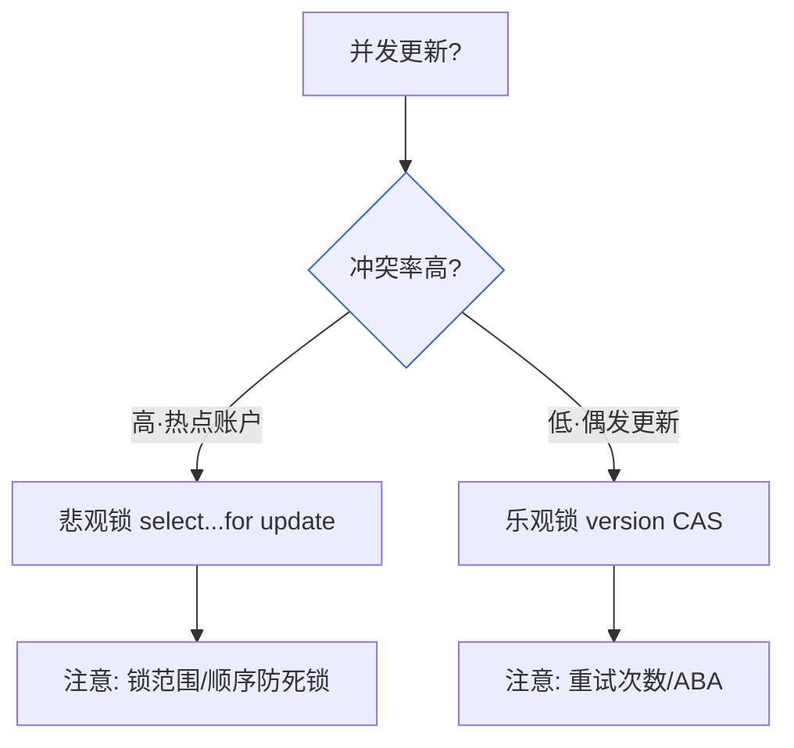
```mermaid
flowchart TD
    Q[并发更新?] --> C{冲突率高?}
    C -->|高·热点账户| P[悲观锁 select...for update]
    C -->|低·偶发更新| O[乐观锁 version CAS]
    P --> N[注意: 锁范围/顺序防死锁]
    O --> V[注意: 重试次数/ABA]
    style C fill:#eef,stroke:#36c
```

**对比四：虚拟线程 vs 平台线程 决策**

- **用虚拟线程**：大量**独立 IO 等待**任务（HTTP/RPC/DB 调用），且代码用同步写法（别 `pin` 在 `synchronized`/原生锁上超过临界区）。
- **用平台线程/线程池**：CPU 密集型、长临界区、需要精确资源隔离（如资金类任务单独池）。
- **别用虚拟线程**：跑 `commonPool` 风格的全局共享、或在 `synchronized` 块里做 IO（pinning 退化）。

### 【量化指标】并发系统该盯哪些数

> "系统稳不稳"不能靠感觉，得有数字。下面是我线上盯并发的**健康阈值表**——讲出来就是"我真的运维过高并发"，不是背八股。

| 指标 | 健康阈值 | 观测工具 | 说明 |
| --- | --- | --- | --- |
| 上下文切换 `cs` | < 5 万/s（8 核） | `vmstat 1` | 过高 = 锁竞争/线程过多 |
| 锁竞争自旋 | 自旋失败率 < 5% | JFR / `perf` | 高 = 临界点太大 |
| 线程池活跃度 | `active/max` < 70% | Micrometer | 长期 100% = 队列打满/拒绝 |
| GC Safepoint 暂停 | 占比 < 5% | `-Xlog:gc*=safepoint` | 高 = 偏向锁撤销/大对象 |
| 线程总数 | 稳定、无持续增长 | `jstack`/`top` | 增长 = 线程泄漏 |
| 伪共享 | 热点变量独立缓存行 | `perf c2c` | `@Contended` 缓解 |

**【项目支撑】**：XTransfer 收款域曾因**偏向锁撤销**把 Safepoint 暂停占比顶到 18%（见上方案例二），用这张表 5 分钟就定位了"不是 GC 是锁"。另一处是**渠道限流 Semaphore 池**——我们通过 `active/permits` 监控发现某渠道许可长期 100% 占用，及时扩容避免回调超时。量化指标就是这么把"玄学"变"工程"。

### 【答题框架】面试表达模板

> 详细的逐题话术见上方「§更多高频追问（补充）·【答题框架】」。这里给**顶层四象限**，先把框架亮给面试官，再展开：

1. **定调**：先给一句话结论（如"JMM 核心是 happens-before 偏序，可推导"），别铺垫。
2. **画图**：被问可见性/锁升级/线程池，先画对应图（主内存+工作内存 / 锁升级状态机 / 提交流程图）——白板图是区分度。
3. **落地**：立刻拉回支付（状态机 DB CAS 防 ABA、限流 Semaphore、回调独立线程池）。
4. **边界权衡**：每个结论补"什么时候不成立"（volatile 不保原子、虚拟线程非银弹、Lock 非总优于 synchronized）。

```mermaid
flowchart TD
    Q[并发面试题] --> T[定调结论]
    T --> D[画图: JMM/锁/池]
    D --> L[落地支付项目]
    L --> E{被追问?}
    E -->|会| H[展开原理+案例]
    E -->|不会| F[框架+类比+拉回·不编造]
    H --> OK[高分]
    F --> OK
    style T fill:#eef,stroke:#36c
    style OK fill:#dfd,stroke:#3c3
```

<!-- EXPANDED -->
