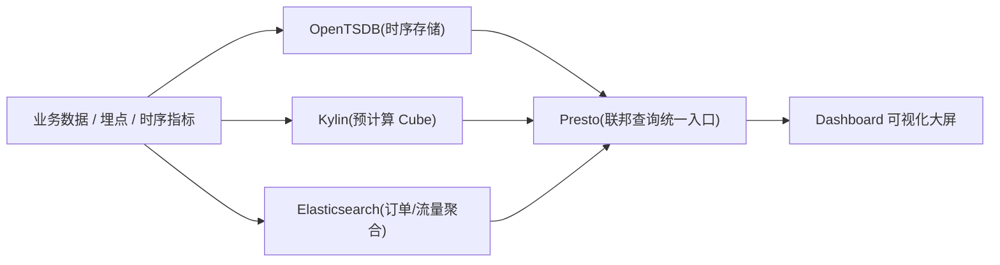
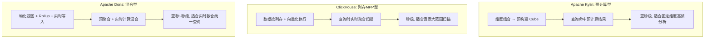
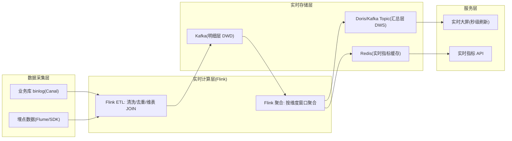
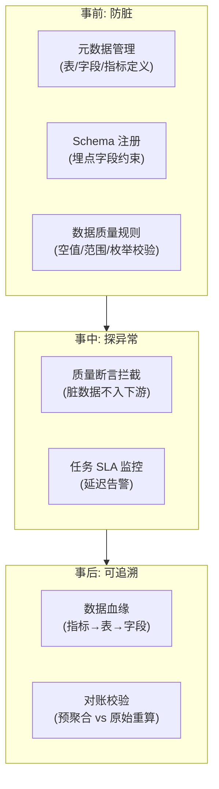
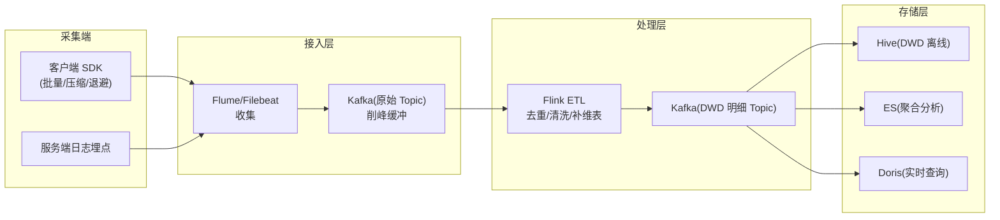

> 第一段经历（校招后起点）。虽然偏「数据应用」，但里面有大量**OLAP、时序数据库、查询优化、Elasticsearch 聚合**的素材，正好补齐「数据侧」知识面，和后面的支付/电商形成互补。

## 1. 业务背景

- **产品**：携程度假**数据化运营平台**——Dashboard + 数据可视化系统。
- **价值**：用可配置图表类型灵活展现数据，帮助分析和监控销售趋势、商品/用户特征、流量转化，降低数据使用成本、提炼数据价值。
- **技术栈**：Spring MVC + MySQL（公司统一 DAL 框架）+ Redis（缓存）+ OpenTSDB + Apache Kylin + Presto + Elasticsearch。

## 2. 站点系统：Spring MVC + MySQL + Redis

- 站点用 **Spring MVC** 开发，存储用 **MySQL**，缓存用 **Redis**；
- 统一使用公司 **DAL 框架**（封装了分库分表、读写分离、SQL 审计），研发不直接写裸 JDBC；
- 这是典型的「**平台部门基础架构约束下的业务开发**」，考查你能否在既定框架内把业务做扎实。

> **面试角度**：面试官可能问「你们为什么用公司 DAL 而不是直接 MyBatis？」答：统一治理（分库分表/读写分离/审计/限流）由框架兜底，业务研发专注逻辑，降低踩坑面，也便于全公司 SQL 规范与性能管控。

**【深度拓展】** 用公司 DAL 而非裸 MyBatis，本质是「**平台部门统一管控 vs 业务灵活度**」的取舍。DAL 把分库分表、读写分离、SQL 审计、限流这些「基础设施级约束」下沉到框架，业务研发不用每人都踩一遍坑——这和 XTransfer「六边形架构把技术细节隔离到适配器」哲学一致：**把易错/易变的技术治理收口，业务只写业务**。

代价是「黑盒」——DAL 帮你做了分表路由，但你也要懂它的路由规则，否则写出跨分片慢 SQL 反而更难排查。应对：吃透 DAL 的分片键/读写分离策略，把慢查询治理交给平台，自己聚焦「业务逻辑 + 合理索引」。

**【面试官还会追问】**
- **追问1：DAL 把分表路由藏起来，我怎么知道我的 SQL 会扫哪些分片？** 应对：理解 DAL 的分片键规则，带分片键的查询走单分片、不带走广播；上线前用 DAL 的 SQL 审计/慢查平台验证执行计划，避免全分片扫描。
- **追问2：DAL 框架有 bug 或升级不兼容，业务方怎么自保？** 应对：框架由平台部门统一维护 + 灰度发布；业务侧用「接口契约测试」锁住行为；关键路径加监控，异常能快速定位是框架还是业务。
- **追问3：如果业务要的查询 DAL 不支持（如复杂跨表）怎么办？** 应对：走读模型/数仓（见第 3、5 节），OLTP 只扛标准 CRUD，复杂分析交给 OLAP，不强行在 DAL 上堆复杂 SQL。

## 3. 时序数据：OpenTSDB 改造 + Kylin + Presto

> 运营平台要"秒级查大屏 + 多维分析"，单靠 MySQL 不行。下面把"数据从产生到可查"的链路画清：原始数据 → 不同引擎按场景加速 → 统一查。



简历原话：「改造 **OpenTSDB** 支持天粒度查询数据，支持秒级快速响应；封装 OpenTSDB 与 **Apache Kylin** 通用接口支持部门通用数据需求，减少开发成本；引入 **Presto** 优化 OpenTSDB 响应速度，将数据查询平均响应时间提升至秒内。」

### 3.1 OpenTSDB（时序数据库）

- OpenTSDB 基于 **HBase** 存储时序数据（metric + tags + timestamp + value），适合海量监控/指标数据；
- 改造点：**支持天粒度查询**（原本可能只到更细粒度，按天聚合查询慢），通过预聚合/降采样让「看天趋势」秒级返回；
- **预聚合（Rollup）**：把高频点按天预计算好，查天级直接读预聚合结果，避免实时扫原始点。

### 3.2 Apache Kylin（预计算 OLAP）

- Kylin 用**空间换时间**：按维度组合**预构建 Cube**，多维分析查询直接命中预计算结果，亚秒级；
- 封装 Kylin 通用接口，部门各业务「配置维度即可查」，减少重复开发。

### 3.3 Presto（联邦查询加速）

- **Presto** 跨数据源（Hive / MySQL / OpenTSDB 等）做**联邦 SQL 查询**，不用搬数据；
- 引入 Presto 优化 OpenTSDB 响应：把部分查询下推/桥接到 Presto，统一 SQL 入口，平均响应压到**秒内**。

```
   前端 Dashboard
        │ SQL(统一接口)
        ▼
   ┌──────────── 查询网关(封装) ────────────┐
   │  Kylin(预计算Cube, 秒级多维)             │
   │  Presto(联邦: Hive/MySQL/OpenTSDB)       │
   │  OpenTSDB(时序, 天粒度预聚合)            │
   └────────────────────────────────────────┘
```

> **面试标准回答（怎么把查询从慢变快）**
> 「三板斧：一是对时序做**预聚合/降采样**（天粒度预计算，查趋势秒回）；二是用 **Kylin 预构建 Cube** 把多维分析空间换时间；三是引入 **Presto** 做联邦查询、统一 SQL 入口并优化执行，把整体平均响应压到秒内。封装通用接口让业务方『配维度即查』，减少重复开发。」

**【深度拓展】** 这三种引擎是「**空间换时间**」思路的三种变体：OpenTSDB 预聚合（Rollup）按时间维度预算、Kylin Cube 按维度组合预算、Presto 联邦是「不搬数据、下推计算」。选型逻辑是「**按查询模式选引擎**」——时序趋势用 OpenTSDB、多维交叉分析用 Kylin、跨源即席查询用 Presto，而不是一个引擎打天下。

和欧凡「ES 在线检索」、哈啰「数仓冷热分离」呼应：都是「**数据按访问模式分而治之**」。携程这类「数据应用」和前面三篇「交易系统」的根本区别是：交易要「强一致 + 资金正确」，数据平台要「口径统一 + 查询快 + 可治理」（见第 6 节 Q6 数据质量）。

**【面试官还会追问】**
- **追问1：Kylin Cube 和 Presto 都快，什么时候用哪个？** 应对：Kylin 适合「固定维度组合的高频多维分析」（Cube 预算好，亚秒）；Presto 适合「临时即席、跨数据源、不固定维度」的查询（现算，秒级）。固定报表用 Kylin， exploratory 用 Presto。
- **追问2：预聚合/预计算的数据和原始数据对不上（口径漂移）怎么办？** 应对：统一指标口径定义（指标中台/语义层），预计算和原始都基于同一口径；定时校验「预聚合结果 vs 原始重算结果」的一致性，漂移告警。
- **追问3：Presto 联邦查询慢在哪一环，怎么优化？** 应对：慢在「跨源数据搬运 + 下推不充分」，优化是「尽量让计算下推到数据源（如 Hive 分区裁剪）、减少跨源 shuffle、结果缓存、控制查询并发防资源打满」。

### 3.4 OLAP 引擎深度对比：Kylin vs ClickHouse vs Doris

> 这三种引擎在度价运营平台选型时都评估过，最终选了 Kylin 做预计算。但面试官常追问「为什么不用 ClickHouse / Doris」，必须能讲清三者差异。



| 维度 | Apache Kylin | ClickHouse | Apache Doris |
| --- | --- | --- | --- |
| 核心原理 | 预计算 Cube（空间换时间） | 列存 + 向量化 + MPP | 物化视图 + Rollup + MPP |
| 查询延迟 | 亚秒（命中预计算） | 秒级（实时扫描聚合） | 亚秒~秒（命中物化视图则快） |
| 数据更新 | 批量构建（Cube build 较重） | 批量写入好，实时写入弱 | **实时写入友好**（Stream Load） |
| 适合场景 | 固定维度组合的高频多维分析 | 大宽表即席查询、日志分析 | 实时数仓、统一 ad-hoc + 报表 |
| 数据量上限 | 中（Cube 膨胀是瓶颈） | **超大**（PB 级列存压缩好） | 大（百 TB 级） |
| 运维复杂度 | 中（Cube 构建/监控） | 中高（分布式集群、副本管理） | 中（FE/BE 架构，相对简单） |
| 生态 | Hadoop 生态（Hive/HBase） | 独立生态，导出工具丰富 | 兼容 MySQL 协议，上手快 |
| 我们的选择 | **选用**（固定报表 + 多维分析） | 未选（当时实时需求少） | 未选（当时 Doris 尚不成熟） |

> **【深度拓展】** 三者的本质差异在「**计算时机**」：
> - **Kylin** = 查询前算好（预计算），查询只是「查表」，所以极快但 Cube 构建重、维度组合有限；
> - **ClickHouse** = 查询时算（MPP 向量化扫描），无需预计算，灵活性高但查超大数据量时延迟上升；
> - **Doris** = 混合（物化视图 + Rollup 做轻量预计算 + 实时计算兜底），兼顾实时写入与查询性能。

选型逻辑是**按查询模式匹配计算时机**：固定高频报表 → Kylin 预计算；即席宽表分析 → ClickHouse；实时数仓统一入口 → Doris。我们度价平台的报表维度固定、更新频率低（T+1 批量），Kylin 的「预计算」最优。如果是今天重建，有实时大屏需求，可能会选 Doris（实时写入 + 物化视图兼顾亚秒查询）。

> **【项目支撑】**（STAR）
> - **S（场景）**：度价运营平台有 50+ 张固定报表，每张涉及 5~10 个维度交叉，单表数据量千万级，运营要求秒级响应。
> - **T（任务）**：选一个 OLAP 引擎让这些固定报表亚秒级返回，同时减少开发成本。
> - **A（行动）**：评估 Kylin / ClickHouse / Doris 后选 Kylin——因为报表维度固定且更新频率低（T+1），预计算 Cube 命中率高；封装通用接口让业务方「配维度即可查」，不用每个报表各写一遍。
> - **R（结果）**：50+ 张报表平均响应从分钟级压到亚秒级；新增报表只需配置维度组合 + 构建 Cube，开发成本下降 60%+。

```sql
-- Kylin Cube 构建示例（维度组合配置）
-- 定义 Cube: 维度 = [日期, 城市, 产品线, 渠道], 度量 = [SUM(订单额), COUNT(订单数)]
CREATE CUBE dprice_daily_cube AS
SELECT
    dt, city, product_line, channel,
    SUM(order_amount), COUNT(order_id)
FROM dwd_order_detail
GROUP BY dt, city, product_line, channel;

-- 查询直接命中预计算结果，亚秒返回
SELECT city, SUM(order_amount) AS total
FROM dprice_daily_cube
WHERE dt BETWEEN '2026-06-01' AND '2026-06-30'
GROUP BY city
ORDER BY total DESC;
```

> **【面试官追问】**
> - **追问1：Kylin Cube 膨胀导致构建太慢怎么办？** 应对：维度剪枝（Aggregation Group 限制组合）、高基数维度（如订单号）不做 Cube 维度、只预计算高频组合、低频走 Presto 兜底。
> - **追问2：如果现在重建，会选 ClickHouse 还是 Doris？** 应对：有实时大屏需求选 Doris（实时写入 + 物化视图）；纯离线大批量宽表分析选 ClickHouse（列存压缩 + 向量化扫描）；固定报表多仍可 Kylin。关键是「按查询模式选引擎」而非「追新」。
> - **追问3：Kylin 和 ClickHouse 能共存吗？** 应对：可以。Kylin 扛固定报表（高频、固定维度），ClickHouse 扛即席分析（灵活、宽表），Presto 做联邦统一入口。按场景分流，不是非此即彼。

## 4. Elasticsearch：订单与流量聚合

简历原话：「订单数据与流量数据使用 **Elasticsearch** 进行查询与聚合分析，负责相关流程的管理以及优化。」

- 订单 / 流量数据量大、查询灵活（按多条件过滤 + 聚合统计），用 ES 的倒排 + 聚合能力；
- 优化点：mapping 设计、分片数、聚合用 `filter` 走 cache、避免深分页、冷热分离。

**【深度拓展】** ES 在这承担的是「**聚合分析**」而非「在线交易检索」（后者见欧凡第 1 节）。两者优化方向相反：欧凡是高并发低延迟单条检索（压 p99、提召回），携程是大数据量聚合（压内存、防高基数爆炸）。携程用 ES 的 `filter` 走 cache、冷热分离，本质和哈啰「冷热分离进数仓」同思路——**热数据快查、冷数据廉价存储**。

高基数聚合（如 terms 聚合大基数字段）是 ES 内存杀手，业界用 `composite` 聚合近似分页替代，避免一次性加载全桶。

**【面试官还会追问】**
- **追问1：ES 聚合结果和 MySQL 对账不上，信哪个？** 应对：MySQL 是源（TP），ES 是分析副本（AP），以 MySQL 为准；不一致查「同步延迟/同步失败」，ES 重建索引兜底。和交易中「DB 为准」同一原则。
- **追问2：ES 单索引太大（TB 级）怎么查不慢？** 应对：按时间 rollover 滚动索引 + 冷热节点分离（热节点 SSD、冷节点大容量）；查询带时间范围只扫相关索引；大聚合走冷节点异步。
- **追问3：ES 和 ClickHouse 怎么选做聚合？** 应对：ES 适合「检索 + 中等聚合 + 灵活过滤」，ClickHouse 适合「超大数据量预聚合/宽表 OLAP」；我们场景用 ES 足够，超大报表可迁 ClickHouse。

### 4.1 实时数仓架构：从 T+1 到秒级

> 当年度价平台升级，运营要求从「T+1 看报表」变为「实时看大屏」。这是从离线数仓向实时数仓的架构升级。



实时数仓和离线数仓的分层一致（ODS → DWD → DWS → ADS），区别是：
- **离线**：Hive/Spark 批处理，T+1 产出，数据全量重算，吞吐大、延迟高（小时级）；
- **实时**：Flink 流处理，秒级/分钟级产出，增量计算，延迟低（秒~分钟级）；

> **【深度拓展】** 实时数仓的核心难点不是「算」，是「**状态管理 + 一致性**」：
> 1. **状态管理**：Flink 聚合算子要维护状态（如按天窗口的累计订单额），状态太大用 RocksDB 后端 + 增量 Checkpoint；
> 2. **一致性（Exactly-Once）**：Flink Checkpoint + 幂等 Sink（如 Doris Stream Load 主键去重、Kafka 事务）保证「不丢不重」；
> 3. **迟到数据处理**：用 Watermark + Allowed Lateness 处理乱序数据，超时的进侧输出补算；
> 4. **维表 JOIN**：实时维表用 Flink 的 Temporal Table Join（查 HBase/Redis 维表），避免维表变更导致计算结果不准。

```java
// Flink 实时聚合示例：按城市+产品线维度，每分钟窗口聚合订单额
DataStream<OrderEvent> orders = env
    .addSource(kafkaSource("order_events"))
    .name("order-source");

orders
    .keyBy(e -> e.getCity() + ":" + e.getProductLine())
    .window(TumblingEventTimeWindows.of(Time.minutes(1)))
    .aggregate(new OrderAmountAggregator())  // SUM(order_amount), COUNT(orders)
    .addSink(dorisSink("dws_city_productline_1min"))  // 写入 Doris 汇总表
    .name("dws-sink");

// 幂等 Sink: Doris 主键 (city, product_line, window_end) 去重，保证 Exactly-Once
```

> **【面试官追问】**
> - **追问1：实时大屏和离线报表数字对不上怎么办？** 应对：建「指标口径中台」统一离线/实时计算口径；跑双链路一致性校验，差异告警；通常实时略小于离线（迟到数据未算），阈值内正常、超阈值查问题。
> - **追问2：Flink 任务挂了大屏断数据怎么办？** 应对：Checkpoint 恢复（从上次 Checkpoint 重启）；Kafka 保留期内重放 offset；超保留期走离线补算回填；大屏降级显示「数据恢复中」。
> - **追问3：实时维表 JOIN 性能怎么保证？** 应对：维表放 Redis/HBase（低延迟随机查）；Flink 用 Async I/O 异步查维表 + 缓存；维表变更走 CDC 广播流实时更新。

## 5. 数据可视化与「数据价值提炼」

- 可配置图表类型（折线/柱状/饼/漏斗等），用户自助拖拽配置；
- 本质是把「数据 → 洞察」的链路产品化，**降低数据使用成本**——这是数据平台的核心价值，不只是写 SQL。

## 5.1 数据治理体系：让数字可信、可查、可追溯

> 数据平台最大的风险不是「慢」，是「数字不对但没人知道哪错了」。数据治理是数据平台的「三道防线」。



数据治理的五个维度（面试可直接背）：

| 维度 | 含义 | 落地手段 |
| --- | --- | --- |
| 完整性 | 数据不丢、行数对得上 | 采集层消息计数 vs 入库行数比对；缺失告警 |
| 准确性 | 数据值是对的 | 枚举值校验、范围校验、业务规则断言 |
| 一致性 | 同一指标多链路结果一致 | 离线/实时双链路对账校验；统一指标口径定义 |
| 及时性 | 数据按时产出 | 任务 SLA 监控 + 延迟告警；大屏数据新鲜度 |
| 可追溯 | 指标能溯源到源数据 | 数据血缘（Atlas/自研），指标→表→字段链路 |

> **【深度拓展】** 数据治理和 XTransfer「资金安全三道防线」是**同一治理思想的不同表述**：
> - 交易防资损：事前幂等/校验 → 事中实时告警 → 事后 T+1 对账；
> - 数据防脏数：事前 Schema 约束/质量规则 → 事中质量断言拦截 → 事后血缘溯源/对账校验。
>
> 本质都是「**不让他错 → 错了立刻知道 → 错了能找回来**」的三段式防线。这说明治理思想是通用的，只是「错」的对象不同（资金 vs 数据）。

> **【项目支撑】**（STAR）
> - **S**：度价平台某天大屏数据突降 30%，运营投诉但没人知道是哪环节数据出问题。
> - **T**：建数据血缘 + 质量监控，让异常能在分钟级定位到源头。
> - **A**：① 上线数据血缘工具（Atlas 自动采集 ETL 依赖链），指标异常时沿血缘向上回溯；② 在关键 ETL 节点加「数据质量断言」（行数/空值率/金额范围），脏数据不入下游直接拦截告警；③ 建任务 SLA 监控，延迟超阈值自动告警。
> - **R**：异常定位从「半天排查」缩短到分钟级沿血缘回溯定位；脏数据被断言拦截不再污染下游报表。

## 5.2 埋点管道设计：高吞吐采集与处理

> 埋点数据是数据平台的「源头活水」。海外用户行为埋点量大、乱序、重复，管道设计直接影响数据质量。



埋点管道的四个核心问题及解法：

1. **去重**：网络重传/客户端重试导致重复埋点。解法：按事件唯一 ID（`event_id`）+ 状态后端去重（Flink Keyed State 记已处理 ID），或窗口内 distinct。
2. **乱序**：用户离线后批量上报，事件时间戳乱。解法：Flink Watermark + Allowed Lateness，迟到数据进侧输出补算，不丢弃。
3. **削峰**：大促时埋点量暴增 10 倍。解法：先入 Kafka 缓冲（Topic 按 event_type 分区），消费端按能力处理；SDK 端做批量聚合 + 退避发送。
4. **精确一次（Exactly-Once）**：不能丢不能重。解法：Flink Checkpoint + 幂等 Sink（Doris 主键去重 / Kafka 事务）。

```java
// Flink 埋点去重 + Watermark 处理乱序示例
DataStream<UserEvent> events = env
    .addSource(kafkaSource("raw_events"))
    // 1. 按事件时间提取 Watermark，允许 5 分钟延迟
    .assignTimestampsAndWatermarks(
        WatermarkStrategy.<UserEvent>forBoundedOutOfOrderness(Duration.ofMinutes(5))
            .withTimestampAssigner((e, t) -> e.getEventTime()))
    // 2. 按 event_id 去重（Keyed State 记已处理 ID）
    .keyBy(UserEvent::getEventId)
    .process(new DedupFunction());  // 重复 event_id 直接丢弃

// DedupFunction: ValueState<Boolean> 存已处理标记
public class DedupFunction extends KeyedProcessFunction<String, UserEvent, UserEvent> {
    private ValueState<Boolean> seen;
    @Override
    public void open(Configuration cfg) {
        seen = getRuntimeContext().getState(
            new ValueStateDescriptor<>("seen", Types.BOOLEAN));
    }
    @Override
    public void processElement(UserEvent e, Context ctx, Collector<UserEvent> out) throws Exception {
        if (seen.value() == null) {  // 首次见到
            seen.update(true);
            out.collect(e);  // 放行
        }
        // 重复的静默丢弃
    }
}
```

> **【深度拓展】** 埋点管道和 XTransfer「渠道回调」有相似的可靠性诉求——都是「外部输入可能丢/重/乱序，必须不漏不重」。XTransfer 用「幂等键 + 任务补偿 + 主动查单」保证不漏不重；埋点管道用「event_id 去重 + Watermark + Checkpoint」保证不漏不重。**分布式下「不丢不重」是通用难题，解法都是幂等 + 补偿 + 对账**，只是场景从支付换到了数据。

> **【面试官追问】**
> - **追问1：埋点量巨大，Kafka 存不下怎么办？** 应对：Topic 按事件类型分区 + 合理保留期（如 3~7 天）；超保留期走离线补算（从客户端本地日志补传）；必要时分集群隔离高低优埋点。
> - **追问2：客户端 SDK 退避策略怎么设计才不雪崩？** 应对：批量发送（攒 100 条/5 秒发一次）+ 随机退避重试（避免重试风暴）+ 本地缓存（断网暂存本地，恢复后补传）；SDK 自带采样率，大促降级。
> - **追问3：埋点数据质量（字段缺失/格式错）怎么控？** 应对：接入层 Schema 注册（字段约束 + 必填校验）；Flink ETL 清洗时丢弃/修复脏数据 + 告警；定期跑数据质量报告，驱动客户端 SDK 修复。

## 6. 面试高频问答（标准回答）

**Q1：OpenTSDB 和 Prometheus 你怎么选？**
考察点：时序库选型。答：OpenTSDB 基于 HBase，适合超大规模长期存储、和 Hadoop 生态打通；Prometheus 适合云原生监控、拉模型、查询语言强。我们当时在 Hadoop 生态里，OpenTSDB 更顺。

**Q2：Kylin 的 Cube 膨胀怎么控制？**
考察点：OLAP 实战。答：控制维度基数、做维度剪枝（Aggregation Group）、只预计算高频组合，避免维度灾难导致 Cube 体积爆炸。

**Q3：Presto 为什么快？适合什么？**
考察点：MPP 查询引擎。答：Presto 是 MPP（大规模并行）引擎，内存计算、流水线执行、下推到数据源，适合交互式联邦查询；但不适合超大 ETL，资源要隔离。

**Q4：ES 做聚合分析要注意什么？**
考察点：ES 优化。答：避免高基数聚合导致内存爆（如 terms 聚合大基数用近似 `composite`）、用 filter 走 cache、控制分片大小、深分页用 search_after。

---

## 更多高频追问（补充）

**Q5：离线数仓和实时数仓的区别？分层怎么设计？**
考察点：数据工程基本功。答：**离线**（T+1，Hive/Spark 批处理，吞吐大、时延高）用于报表/分析；**实时**（Flink/Kafka 流处理，秒级/分钟级）用于监控/大屏/实时指标。分层通用 ODS（原始层）→ DWD（明细层，清洗后）→ DWS（汇总层，按主题聚合）→ ADS（应用层，直接服务报表）。分层的意义是解耦、复用中间层、避免烟囱式重复计算。

**Q6：数据质量和一致性怎么保证？**
考察点：数据治理。答：① **完整性/准确性校验**——行数比对、主键唯一、空值率监控；② **一致性**——离线和实时口径对齐（同一指标两条链路结果要能对上）；③ **及时性**——任务 SLA 监控 + 延迟告警；④ **可追溯**——数据血缘（这个指标由哪些表算来）。异常数据要能定位到上游哪个环节，而不是"数字不对但不知道哪错了"。

**Q7：埋点数据量大、乱序、重复怎么处理？**
考察点：实时流处理。答：① **去重**——按事件唯一 id + 状态后端去重，或用窗口内 distinct；② **乱序**——Flink 用 **Watermark + 允许延迟**处理迟到数据，超时的进侧输出补算；③ **削峰**——先入 Kafka 缓冲，消费端按能力处理；④ **精确一次**——用 checkpoint + 幂等 sink 保证 Exactly-Once。埋点是典型的"高吞吐 + 容乱序 + 要准"的流处理场景。

**Q8：Kylin Cube 构建失败或构建太慢怎么办？**
考察点：OLAP 运维。答：① 失败重试 + 增量构建（只构建新增分区的 Cube Segment，不全量重建）；② 太慢则维度剪枝——Aggregation Group 限制维度组合数、高基数维度不做 Cube 维度；③ 构建任务走独立 YARN 队列隔离资源，不抢分析查询资源；④ 构建超时告警 + 自动降级到 Presto 兜底查询。

**Q9：你们用公司 DAL 框架，如果 DAL 的分表路由和业务查询模式不匹配怎么处理？**
考察点：平台与业务边界。答：① 先理解 DAL 的分片键规则——带分片键走单分片、不带走广播；② 如果业务查询不带分片键（如跨城市统计），走 OLAP 引擎（Kylin/Presto/ES）而非 OLTP；③ 实在需要的灵活查询走读模型/数仓，不在 DAL 上堆复杂跨分片 SQL；④ 上线前用 DAL 的 SQL 审计平台验证执行计划，提前发现全分片扫描。

**Q10：度价平台的指标口径怎么统一管理，避免各部门各算各的？**
考察点：指标治理。答：① 建「指标中台/语义层」——所有指标统一定义（名称、口径、计算公式、来源表），业务方按指标名查询而不是各写 SQL；② 离线和实时共用同一口径定义，预计算和原始重算结果一致；③ 指标变更走审批 + 影响面分析（血缘告诉你哪些报表用了这个指标）；④ 定期跑「指标一致性校验」，双链路结果差异超阈值告警。

**Q11：OpenTSDB 改造天粒度查询的具体改造点是什么？**
考察点：时序数据库优化。答：① 原始数据按原始粒度存储（如分钟级），查天级要扫大量点导致慢；② 改造点：加**预聚合 Rollup**——把分钟级点按天预计算好（MAX/MIN/AVG/SUM），查天级直接读 Rollup 结果，不扫原始点；③ Rollup 按天定时构建（离线 Job），查询时先查 Rollup 表，没有才回退原始；④ 配合 Presto 做 Rollup 的联邦查询，统一 SQL 入口。

```yaml
# 度价平台 OLAP 引擎路由配置示例（按查询模式自动分流）
olap_router:
  rules:
    - name: "固定报表-多维分析"
      condition: "dimensions IN (date, city, product_line, channel)"
      engine: "kylin"
      fallback: "presto"
    - name: "时序趋势-天粒度"
      condition: "granularity = 'daily' AND metric_type = 'timeseries'"
      engine: "opentsdb"
      fallback: "presto"
    - name: "即席查询-跨数据源"
      condition: "cross_source = true"
      engine: "presto"
      fallback: null
    - name: "实时大屏"
      condition: "latency_sla < 5s AND realtime = true"
      engine: "doris"
      fallback: "redis_cache"
  timeout: 30s
  retry: 2
```

> **【深度拓展】** 这套路由配置体现了「**按查询模式选引擎**」的方法论——不是用一个引擎打天下，而是让每种查询走最适合的引擎。和 XTransfer「按渠道/场景动态表单」、欧凡「按数据敏感度选缓存策略」一样，都是**把路由规则外置配置化**，而非硬编码在业务代码里。

**【深度拓展】** 携程篇串起来是「**数据应用全链路**」：采集（埋点/业务库）→ 计算（Flink 实时 / Spark 离线）→ 存储（数仓/OLAP：OpenTSDB/Kylin/Presto/ES）→ 服务（报表/API/看板）。它和前三篇「交易系统」互补——交易追求强一致与资金正确，数据平台追求**口径统一、查询快、可治理**（Q6 数据质量）。

数据质量的「完整性/准确性/一致性/及时性/可追溯」五维（Q6），和 XTransfer「资金安全三道防线」是同一治理思想的不同表述：交易用「事前/事中/事后」防资损，数据用「校验/对账/血缘」防「数字不对但不知哪错」。埋点流处理（Q7）的「去重/乱序/精确一次」和 XTransfer「任务补偿/幂等」、欧凡「幂等表」同源：**分布式下「不丢不重」是通用难题，解法都是幂等 + 补偿 + 对账**。

**【跨项目串联】** 携程篇的「数据平台」和另外三篇「交易系统」形成互补闭环：
- **数据采集 → 数据计算 → 数据服务**：携程的全链路就是交易系统的「数据侧镜像」——交易系统产生数据，数据平台消费数据；
- **OLAP 选型方法论**：Kylin（预计算）/ ClickHouse（列存 MPP）/ Doris（混合）的选型逻辑，和 XTransfer「状态机 vs 2PC vs TCC」的选型一样——都是**按场景约束选方案，而非追新**；
- **实时数仓的 Exactly-Once**：和 XTransfer「任务补偿保最终一致」、欧凡「Lua 原子扣减」、哈啰「Kafka 幂等消费」都是**不同场景下保证「不丢不重」的手段**，底层都是幂等 + 补偿 + 对账；
- **数据治理 vs 资金安全**：数据平台的「五维质量校验 + 血缘溯源」和 XTransfer「三道防线 + T+1 对账」是同一治理思想的不同表述——**不让他错 → 错了立刻知道 → 错了能找回来**。

**【面试官还会追问】**
- **追问1：离线和实时两条链路算出的同一指标对不上，怎么定责？** 应对：建「指标口径中台/语义层」，离线和实时共用同一口径定义；跑「双链路一致性校验」任务，差异超阈值告警，定位是口径还是数据延迟问题。
- **追问2：数据血缘怎么落地，才知道某个异常指标是哪张表算错的？** 应对：用元数据/血缘工具（如 Atlas）自动采集 ETL 依赖；指标异常时沿血缘向上回溯，定位最先出错的节点；关键任务加「数据质量断言」拦截脏数据。
- **追问3：实时链路（Flink）挂了几个小时，补算怎么追？** 应对：Kafka 保留期内的数据重放（reset offset 从故障点重消费）；超出保留期的走离线补算回填；补算完和离线结果对齐校验，保证大屏不缺数。

> 相关阅读：[欧凡海外直播电商系统实战](/post/准备-欧凡海外直播电商系统实战)（ES 检索对照） · [XTransfer 跨境支付收款平台深度复盘](/post/准备-XTransfer跨境支付收款平台深度复盘)（对账/幂等/治理对照） · [程序员面试基础知识大全](/post/准备-程序员面试基础知识大全)

<!-- EXPANDED -->
