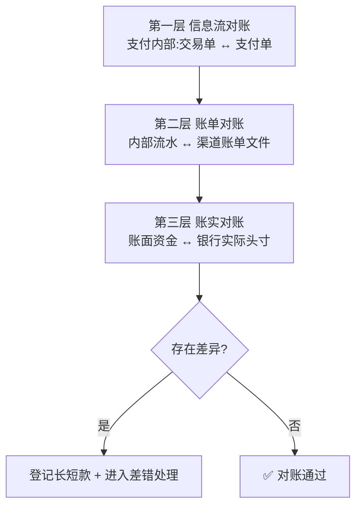
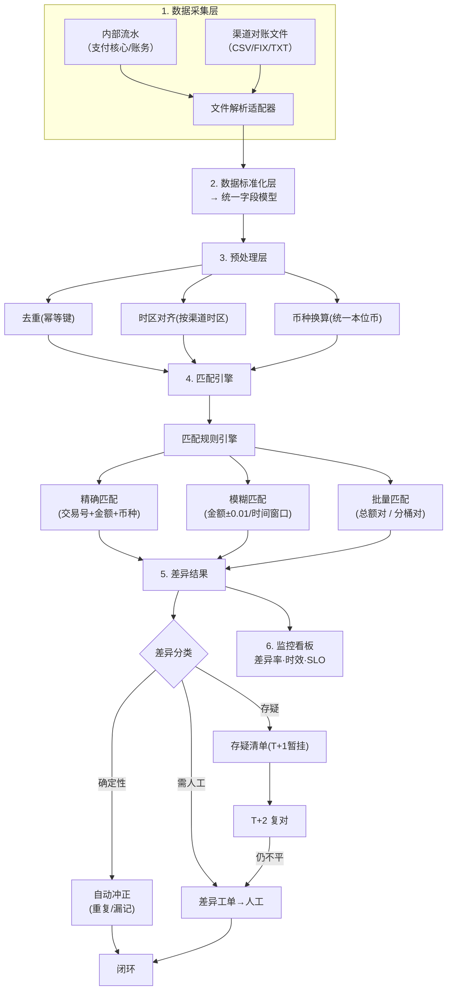
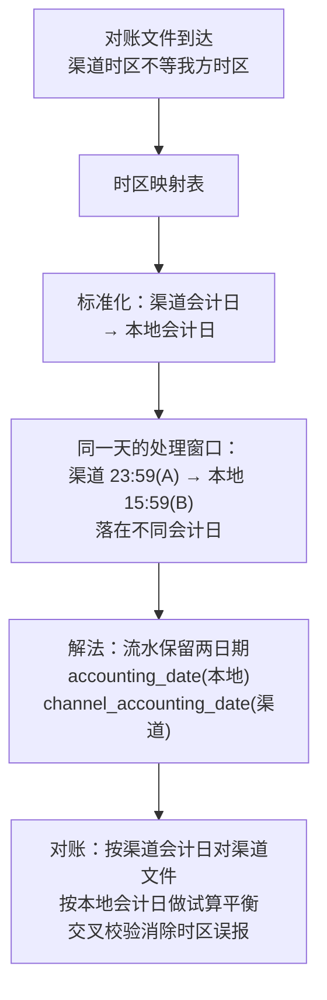

> 对账是连接交易链路与资金安全的"最后抓手"，既关乎技术架构稳定，也关乎业务闭环与合规。本篇综合 **隐墨星辰《账务系统核心设计（进阶版）》** 的三层对账体系与 **腾讯云 JavaEdge 清结算设计**，系统梳理。
> 配合 [清结算体系](/post/准备-清结算体系) 与 [账务账户体系与复式记账](/post/准备-账务账户体系与复式记账) 一起看。

---

## 一、对账解决什么问题

支付系统的本质是"把信息流和资金流都对平"。对账确保：
- 我方流水与渠道流水一致（没多扣、没少收）；
- 我方账单与银行账单一致（没漏打款、没多打款）；
- 我方记录的银行头寸与银行真实余额一致（账实相符）。

做不好 → 长短款、资损、合规风险。

---

## 二、渠道三层对账体系（隐墨星辰）

> 对账是"由内到外、逐层收敛"的过程：先保证自己内部账平，再对渠道账，最后对账上钱。三层缺一层，资金安全就有盲区。



### 第一层：信息流对账
- 我方流水 vs 银行清算文件流水，逐笔核对。
- 核：单号、币种、金额、状态是否都对上。对不上即出现**长短款**。

### 第二层：账单对账
- 我方流水汇总生成"我方账单"，银行流水汇总生成"银行账单"，再对账。
- 场景：共收 100 万，银行分 2 笔打款（98 万 + 2 万）→ 账单层要能对上这种"多对多"。

### 第三层：账实对账
- 我方记录的银行头寸 vs 银行真实余额。
- 场景：我方记头寸 220 万，银行实际只有 200 万 → 账实不符，必须查。

> 口诀：**一层对笔、二层对总、三层对账实**。三层逐级收敛，定位差错在哪一层。

### 二-附：对账管道（Pipeline）架构图

> 对账不只是"跑个比对"——它是一条从文件拉取到差异告警的完整数据管道。



**管道各层职责**：

| 层次 | 核心职责 | 关键技术点 |
|------|---------|-----------|
| 数据采集 | 拉取内外部数据源 | 文件解析适配器（多格式）、断点续传、网络超时重试 |
| 标准化 | 统一字段模型 | 各渠道字段映射表、币种标准化(ISO 4217)、金额精度对齐 |
| 预处理 | 清洗、对齐 | 去重(幂等键)、时区对齐(按渠道会计日)、金额换算 |
| 匹配引擎 | 逐笔/模糊/批量比对 | 规则引擎编排、哈希索引加速、分片并行 |
| 差异处理 | 分类、自动修复、人工 | 确定性→自动冲正、存疑→暂挂、人工→工单 |
| 监控告警 | 时效/质量/SLO | 差异率曲线、处理时效、告警规则 |


---

## 三、对账差异：长短款

| 类型 | 含义 | 举例 |
|------|------|------|
| **长款（我方多钱）** | 渠道清算 > 我方记录 | 支付：我方记 90，渠道清算 100；或我方失败、渠道成功 |
| **短款（我方少钱）** | 渠道清算 < 我方记录 | 支付：我方记 100，渠道清算 90 |
| 退款长/短款 | 同理反向 | 退款我方 100，渠道清算 90 → 退款长款 |

**处理时序**：因我方与渠道有时间差，T+1 对不上的先进"存疑清单"；**T+2 仍对不上**才进入差异处理（避免临时在途款误判）。

### T+1/T+2 对账窗口工程细节

> T+1 对账看起来简单，但把"全世界渠道的文件都按时拉到、按时跑完"是巨大的工程难题。

```mermaid
gantt
  title T+1 对账处理时间线
  dateFormat HH:mm
  axisFormat %H:%M

  section 渠道文件
  微信对账文件就绪     :done, wx1, 02:00, 01:00
  支付宝对账文件就绪   :done, ali1, 03:00, 01:00
  SEPA 对账文件就绪    :active, sepa1, 06:00, 02:00
  SWIFT 对账文件就绪   :swift1, 08:00, 03:00

  section 对账引擎
  文件拉取+解析        :after wx1, 03:00, 02:00
  精确/模糊匹配跑批    :after ali1, 05:00, 03:00
  差异分类+存疑        :07:00, 02:00

  section 人工处理
  T+2 复对+差异工单    :crit, 14:00, 03:00
  SLO 监控+告警       :milestone, 17:00, 0min
```



**关键工程细节**：

1. **文件就绪检测**：渠道不"推"文件，我方要定时拉。需要**文件就绪检测器**——轮询渠道 FTPS/SFTP 目录，检测文件时间戳或校验文件（如 `.ready` 信号文件）。

```python
# 渠道文件就绪检测
def poll_channel_file(channel: str, target_date: str) -> Optional[File]:
    """轮询渠道对账文件，直到就绪或超时"""
    deadline = datetime.now() + timedelta(hours=4)  # 最多等 4 小时

    while datetime.now() < deadline:
        files = channel_client.list_files(f"{channel}/{target_date}/")
        ready_file = next((f for f in files
                          if f.endswith('.ready')), None)
        if ready_file:
            return channel_client.download(ready_file.replace('.ready', ''))
        time.sleep(60 * 5)  # 每 5 分钟重试

    raise FileNotReadyException(f"{channel} T+1 文件超时未就绪")
```

2. **多时区文件到达窗口**：不同渠道按不同时区 T+1——东京渠道 JST 02:00（=CST 01:00），纽约渠道 EST 22:00（=CST次日11:00），差 10 小时。对账引擎要考虑"最早到/最晚到"的时间窗口和兜底策略。

3. **跑批性能**：百万级流水对账不能单线程。按**渠道+会计日**分片并行，每个分片独立跑"精确→模糊→汇总"三层匹配。

4. **T+2 复对策略**：T+1 暂挂的存疑在 T+2 用**最新渠道文件**重新比对——渠道可能在 T+2 补传/修正 T 日的文件。只有 T+2 仍不平才定性为真差异。

5. **假日/非交易日**：T+1 是"下一个工作日+1"还是"自然日+1"？对账日历要维护各渠道的假日表——非交易日没有对账文件，不产生对账任务。


---

## 四、差错处理流程

```
T日交易 → T+1 拉渠道对账文件 → 自动勾对
   ├─ 对平 → 标记完成
   └─ 不平 → 存疑清单（T+1）
          ↓ T+2 复对
       仍不平 → 差异工单（人工/自动）
          ├─ 我方漏记 → 补记账
          ├─ 渠道漏清算 → 发起仲裁/追款
          └─ 重复记账 → 冲正
```

- 差额按"谁的责任"分类：我方系统 bug、渠道延迟、渠道差错、银行端问题。
- 跨境多时区：对账文件到达时间不一，需按渠道时区 + 会计日切处理（见 [账务账户体系与复式记账](/post/准备-账务账户体系与复式记账) 的日切）。

**【为什么 / 真实案例】** 差错处理最怕"**为了平账而平账**"。我在 XTransfer 的要求是：任何差异必须先定性责任再动账，自动冲正只覆盖确定性差额（如系统明确重复记账），责任不清的必须进人工差错队列，绝不能"调一笔让数字平了"就关单——那会掩盖资损根因、还可能把商户的钱调错。跨境场景还要把"时区导致的账期错位"和"汇率折算差异"从真假长短款里剔除，否则会误报。这也是 0 资损能成立的原因：对账不是终点，而是"发现→追因→调平→复盘"的闭环。

### 四-附：对账引擎核心设计

> 对账引擎是对账系统的"心脏"——文件解析适配器 + 规则引擎 + 差异匹配算法，三位一体。

#### 文件解析适配器（Parser Adapter）

渠道对账文件格式千差万别，解析适配器用**策略模式**统一抽象：

```java
// 统一对账记录模型
public class ReconciliationEntry {
    String transactionId;
    String currency;
    BigDecimal amount;
    LocalDate accountingDate;
    String channelCode;
    ReconciliationSide side; // 我方/渠道
}

// 文件解析适配器接口（策略模式）
public interface FileParserAdapter {
    List<ReconciliationEntry> parse(InputStream file);
    Set<String> supportedFormats();
}

// 适配器注册与路由——根据文件扩展名自动选择解析器
public class ParserRegistry {
    Map<String, FileParserAdapter> adapters = new HashMap<>();

    public FileParserAdapter resolve(String fileFormat) {
        return adapters.values().stream()
            .filter(a -> a.supportedFormats().contains(fileFormat))
            .findFirst()
            .orElseThrow(() ->
                new UnsupportedFormatException(fileFormat));
    }
}
```

#### 差异匹配算法

对账本质是**集合匹配**——我方流水 vs 渠道流水，找差集：

```java
public class ReconciliationMatcher {
    // 第一层：精确匹配（交易号 + 金额 + 币种）→ O(N+M)
    public MatchResult exactMatch(List<ReconciliationEntry> inner,
                                   List<ReconciliationEntry> channel) {
        Map<String, ReconciliationEntry> channelIdx =
            channel.stream().collect(toMap(
                e -> key(e.txnId, e.amount, e.currency), f->f));

        MatchResult result = new MatchResult();
        for (var e : inner) {
            String k = key(e.txnId, e.amount, e.currency);
            if (channelIdx.containsKey(k)) {
                result.matched.add(new Pair(e, channelIdx.remove(k)));
            } else {
                result.onlyInner.add(e);  // 我方多记 → 短款嫌疑
            }
        }
        result.onlyChannel.addAll(channelIdx.values()); // 渠道多出 → 长款嫌疑
        return result;
    }

    // 第二层：模糊匹配（金额容差 ±0.01 / 时间窗口 ±1 天）
    // 应对币种换算尾差、跨日清算等场景
    public MatchResult fuzzyMatch(List<ReconciliationEntry> unmatched) {
        // 按金额分组，容差内视为匹配
    }

    // 第三层：汇总匹配（总额对 + 分桶对）
    public boolean batchMatch(MatchContext ctx) {
        return ctx.innerTotal().compareTo(ctx.channelTotal()) == 0;
    }
}
```

#### 跨境多时区对账处理策略

> 跨境对账最难的不是算法，而是"**把同一笔交易在双方系统里对齐**"——时区、会计日、币种换算，任何一个不对齐都会产生假差异。



处理策略：
- **时区映射表**：每渠道维护 UTC 偏移，对账引擎自动换算；
- **双日期字段**：流水存 `accounting_date`（本地）和 `channel_accounting_date`（渠道），各按各的对；
- **汇率折算差异剔除**：币种换算导致的尾差（0.01 级）不算长短款，走汇兑损益；
- **时差在途**：渠道 23:55 的交易我方 00:05 才收到 → 必进存疑清单，T+2 复对。

---

## 五、内部系统实时与离线核对

除与银行渠道对账，支付平台还做**内部系统两两核对**（信息流层面，核状态/金额一致）：

- **离线核对**：生产数据定时清洗到离线库（天表/小时表），批量比对。
- **实时核对**：监听 binlog，数据变更后延时几秒请求双方查询接口比对。

> 对账不仅对外（渠道），也**对内**（支付核心 vs 账务 vs 清结算 之间）。这是"内部弱校验、不产生资损"的落地手段（见 [支付系统架构与核心链路全景](/post/准备-支付系统架构与核心链路全景)）。

---

## 六、对账系统的技术要点

- **幂等**：重跑对账不产生重复差异单。
- **可重跑**：某日对账失败，支持按日重跑。
- **文件解析**：渠道对账文件格式杂（CSV/FIX/固定长），需适配层。
- **差异可视化**：差错看板、T+1/T+2 时效监控、告警。
- **自动冲正**：确定性的重复/漏记差额可自动修复，不确定性走人工。

### 六-附：对账 SLO 指标设计

> 对账系统的 SLO 不是"系统可用率"，而是"**对账完成率 + 差异处理时效 + 资损指标**"三重维度。

| SLO 指标 | 目标 | 测量方式 | 降级阈值 |
|----------|------|----------|---------|
| **对账完成率** | T+1 15:00 前，> 99.5% 渠道文件对账完成 | 按时完成渠道数 / 总渠道数 | < 95% 告警 |
| **差异率** | < 0.01%（万分之 1） | 差异笔数 / 总交易笔数 | > 0.05% 告警 |
| **差异处理时效** | 确定性差异 1h 内自动冲正；人工差异 T+3 内闭环 | 差异工单生命周期 | 超时升级 |
| **误报率** | < 5% 的差异工单最终被标记为"无需处理" | 误报数 / 总工单数 | > 10% 优化规则 |
| **资损金额** | **0 资损（硬底线）** | 确认资损金额累计 | 任何 > 0 即最高优先级 |
| **存疑清单堆积** | < 500 条 | 库存疑条目数 | > 1000 告警 |

```sql
-- 对账 SLO 监控查询：每日差异率
SELECT
  reconciliation_date,
  COUNT(*) AS total_txns,
  SUM(CASE WHEN status = 'matched' THEN 1 ELSE 0 END) AS matched,
  SUM(CASE WHEN status IN ('diff','pending') THEN 1 ELSE 0 END) AS diff_count,
  ROUND(100.0 * SUM(CASE WHEN status IN ('diff','pending') THEN 1 ELSE 0 END)
        / COUNT(*), 4) AS diff_rate_pct
FROM reconciliation_result
WHERE reconciliation_date >= CURRENT_DATE - INTERVAL 7 DAY
GROUP BY reconciliation_date
ORDER BY reconciliation_date DESC;
```


---

## 七、我的 XTransfer 落地

- 渠道三层对账 + 内部实时核对（binlog 监听）。
- 跨境多币种：按币种+会计日分别对账，汇兑损益单列。
- 差错处理接"任务补偿"：对账发现的漏记由补偿任务自动补记账，超阈值升级人工。
- 结果：**0 资损**是底线指标，对账差异率纳入 SLO。

### XTransfer 对账落地细节

**内部实时核对架构**：

```text
支付核心(MySQL) → binlog 监听 → 延时 5s → 对账引擎
账务系统(MySQL) → binlog 监听 → 延时 5s → 对账引擎
                                        → 准实时比对（内部弱校验）
                                        → 差异 → BCP 告警
```

**三层对账的时序保障**：T日交易 → T+1 08:00 对账跑批启动 → T+1 14:00 三层对账完成+差异报告 → T+2 08:00 存疑复对 → T+2 15:00 差异工单 → T+3 人工+补偿闭环。

**任务补偿闭环**：对账发现的"确定漏记"差异（如账务没收到支付成功消息），由任务补偿自动补记账：

```java
public class AutoCompensateTask {
    @EventListener(ReconciliationDiffEvent.class)
    public void handle(ReconciliationDiffEvent event) {
        Diff diff = event.getDiff();
        if (!diff.isDeterministic()) return;

        switch (diff.getType()) {
            case MISSING_INNER:  // 我方漏记 → 自动补记账
                accountingService.book(diff.toEntry());
                break;
            case DUPLICATED:     // 重复记账 → 自动冲正
                accountingService.reverse(diff.getTxnId());
                break;
            default:
                manualQueue.submit(diff); // 不确定性 → 人工
        }
    }
}
```

---

## 八、面试高频追问（本篇）

**Q1：为什么要做三层对账，一层不够吗？**
> A：一层（信息流）只能发现"笔不对"，但发现不了"总账对不上"或"账实不符"。二层查汇总差异（银行分笔打款），三层查头寸真实性。三层逐级收敛定位差错在"笔/总/实"哪一环。

**【深度拓展】** 三层对账的本质是"**由内到外、逐层收敛差错定位**"：第一层对"笔"（我方交易单↔支付单↔渠道流水，逐笔勾），抓的是"某笔记错了"；第二层对"总"（我方账单汇总↔渠道账单汇总，含多对多打款），抓的是"汇总时对不上"；第三层对"实"（账面头寸↔银行真实余额），抓的是"账上记了但银行没真到账/多到了"。缺任何一层都有盲区：只有一层会发现不了"银行分两笔打款但我方按一笔对"的汇总差异；有了一二层但没第三层，会以为账平了实际钱没到账。面试官追问"三层都过了还会有资损吗"——理论上还有"双方都错且错得一致"的极小概率，所以还要配合事前幂等/事中告警，对账不是唯一防线。

**【项目支撑】** XTransfer 渠道三层对账 + 内部实时核对（binlog 监听）齐备；跨境多币种按"币种 + 会计日"分别跑三层，汇兑损益单列。对账差异率纳入 SLO，0 资损是底线——这正是"资金安全三道防线"的第三道（事后回溯比对）。

**Q2：T+1 对账不平就立刻处理吗？**
> A：不。渠道与我方有在途时间差，T+1 不平先入存疑清单，T+2 复对仍不平才进差异处理，避免误判在途款。

**【深度拓展】** "在途款"是对账最易误判的来源：一笔钱 T 日我方已记成功、但渠道 T+1 才清算到账，T+1 对账必不平。直接处理会"假长款/假短款"来回折腾。工程上用"**存疑清单 + T+2 复对 + 时区对齐**"三招：存疑清单暂挂不处理；T+2 复对仍不平才定性；跨境还要按渠道时区 + 会计日切把"同一笔"对齐。还有个细节：退款/冲正类交易的对账窗口更长，因为涉及原交易追溯。面试官追问"存疑清单一直不对平怎么办"——设最长挂起时限（如 T+3/T+5），超时强制进人工差错工单，防止无限挂起掩盖真问题。

**【项目支撑】** XTransfer 对账严格按"T+1 拉渠道文件→存疑→T+2 复对→差异工单"，跨境多时区按渠道时区 + 会计日切处理。差错处理接"任务补偿"：漏记由补偿任务自动补记账，超阈值升级人工，避免存疑清单无限堆积。

**Q3：长款和短款分别怎么处理？**
> A：先定性责任。我方漏记→补记；渠道漏清算→发起追款/仲裁；重复记账→冲正。跨境还要考虑时区与汇兑。

**【深度拓展】** 处理顺序要"**先冻结、后定性、再动手**"：发现差异先挂账（不轻易动余额），查清责任方再决定补记/冲正/追款。最忌"为平账随手调"——那会掩盖根因甚至制造资损。责任定性维度：我方系统 bug（漏记/重记）、渠道延迟（在途）、渠道差错、银行端问题，不同责任走不同 SLA 和流程。跨境还要叠加"时区导致的账期错位"和"汇率折算差异"，不能把汇损当成长短款。面试官追问"长款是不是平台赚了"——不是，长款多为"渠道成功我方漏记"，钱是商户/用户的，必须补记或挂暂收户，私吞即资损+合规问题。

**【项目支撑】** XTransfer 的长短款进差错队列后，明确区分责任：我方漏记由任务补偿自动补记账；渠道少收发起追款；重复记账走红冲。跨境按币种+会计日分别处理，汇兑损益单列，保证差异可追溯、可调平、0 资损。

**Q4：内部对账和外部对账有什么区别？**
> A：外部对渠道（资金流、账实），内部对系统间（信息流、状态金额一致）。内部对账是"弱校验防资损"的手段，外部对账是合规与资金安全底线。

**【深度拓展】** 二者的"严肃程度"不同：外部对账是合规硬要求（监管要看账实相符），必须严谨、可审计、可出具报告；内部对账是"早发现问题"的工程手段，可以准实时、可以容忍一定误报。内部对账的价值在于**把资损消灭在对外暴露前**——支付核心记了一笔、账务没收到消息，内部实时核对（binlog 监听）几秒内就能发现，不用等 T+1 外部对账。它依赖"各系统有统一流水号贯穿"，否则对不上。面试官追问"内部对账频率怎么定"——核心链路（支付↔账务）准实时，非核心（报表↔明细）离线批量即可。

**【项目支撑】** XTransfer 除渠道三层对账外，还做内部系统两两核对：监听 binlog，数据变更后延时几秒请求双方查询接口比对（支付核心 vs 账务 vs 清结算）。这就是"内部弱校验、不产生资损"的落地——和全景图里"支付核心与账务内部弱校验"一脉相承。

**Q5：对账系统怎么保证可重跑、幂等？**
> A：按"对账日期+渠道"做唯一键，重跑先清当日差异再生成；差异单用幂等键防重复；自动冲正只处理确定性差额。

**【深度拓展】** 可重跑是对账系统的"生命线"——对账文件可能缺失、解析可能报错、跑批可能中途挂，必须能按日安全重跑且结果一致。工程要点：①**唯一键**（对账日期+渠道+批次）保证重跑幂等，不清旧差异会重复生成；②**先清后生成**的事务边界；③**差异单幂等键**（原交易号+差异类型）防重复生成工单；④**自动冲正只动确定性差额**（明确的重复记账），不确定性（责任不清）交人工。面试官追问"重跑时原差异已人工处理了一半怎么办"——重跑要区分"已处理/处理中/未处理"状态，只重建未处理的部分，已处理的不回滚，避免覆盖人工结论。

**【项目支撑】** XTransfer 对账以"对账日期+渠道"为唯一键支持按日重跑，差异单带幂等键；自动冲正只处理确定性的重复/漏记，复杂责任判定升级人工。配合任务补偿，漏记类差异能自动补记账闭环，减少人工介入量。

---

## 延伸阅读

- 清结算：[清结算体系](/post/准备-清结算体系)
- 账务复式记账/日切：[账务账户体系与复式记账](/post/准备-账务账户体系与复式记账)
- 架构全景：[支付系统架构与核心链路全景](/post/准备-支付系统架构与核心链路全景)
- 风控：[支付风控与反欺诈体系](/post/准备-支付风控与反欺诈体系)

> 参考来源：隐墨星辰《图解支付账务系统核心设计（进阶版）》、腾讯云 JavaEdge《图解大厂清结算系统设计》。

<!-- EXPANDED -->
