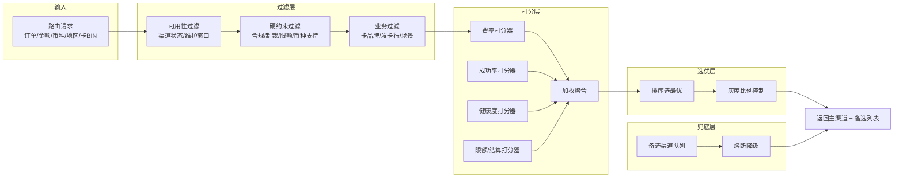
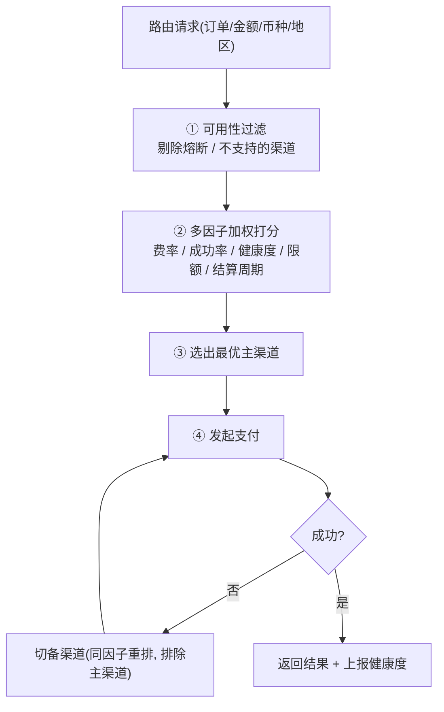
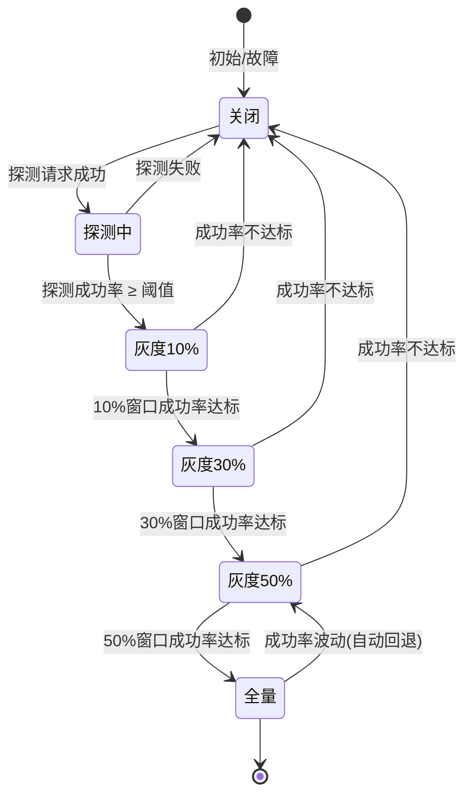
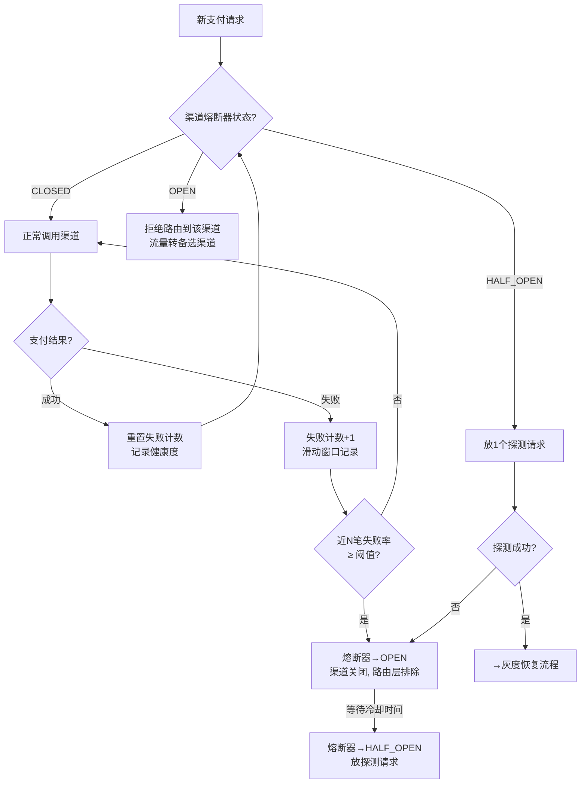
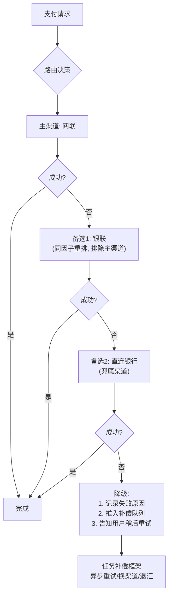

> 渠道路由是支付系统里"既考架构又考业务"的核心模块。本篇以 **隐墨星辰《百图解码支付系统设计与实现》** 的渠道路由篇为主轴，结合我 XTransfer 多渠道 VA 开户的实际路由落地来讲。
> 配合 [支付系统架构与核心链路全景](/post/准备-支付系统架构与核心链路全景) 一起看，效果最佳。

---

## 一、三个常被混为一谈的概念

| 概念 | 职责 | 回答的问题 |
|------|------|-----------|
| **支付方式咨询** | 由收银域提供，组装"可用支付方式列表" | 用户能用哪些方式（余额/招行卡…） |
| **渠道咨询** | 由渠道网关提供，组装"可用渠道列表+属性" | 有没有渠道能支持（招行维护中就置灰） |
| **渠道路由** | 由渠道网关提供，多个渠道可选时挑最优 | 最优的一条渠道是谁 |

> 很多公司把三者混在一起做掉，简单实用但扩展性差。追求扩展性的做法是拆分。

---

## 二、渠道路由的核心作用

当多个渠道都满足业务诉求时，综合 **支付成功率、支付成本、用户体验、渠道状态** 挑最优一条：

1. **提高支付成功率**：不同渠道风险偏好不同，A 渠道失败的交易在 B 渠道可能成功。
2. **优化成本**：渠道费率不同，还有阶梯收费，分流可保持整体成本最优。
3. **提升用户体验**：用户常用渠道成功率更高（渠道风控已认可）。
4. **负载均衡**：把请求合理分到不同渠道，避免单渠道过载。

**应用小场景**：招行信用卡同时接了网联和银联 → 需路由；实名认证也有"信息类渠道路由"；退款一般无路由（原渠道退回）；支付宝只能走支付宝，无路由。

---

## 三、设计原则

- **灵活性**：规则可动态调（有的场景保成本，有的保成功率）。
- **扩展性**：新增渠道、新增决策因子不能写死在代码。
- **高可用**：哪怕内部报错，也要能返回一条可用渠道。
- **性能**：路由决策要快，不能成为支付链路瓶颈。

### 【深度拓展】路由策略引擎架构

路由不是一个"if-else 大函数"，而是一个**策略引擎**，核心是"过滤 → 打分 → 选优 → 兜底"四步管线，每一步可独立扩展。



**打分公式**（加权综合得分）：

```text
Score(c) = w1 × 费率分(c) + w2 × 成功率分(c) + w3 × 健康度分(c) + w4 × 限额分(c)

其中:
  费率分(c)   = (1 - 费率(c) / max费率) × 100     // 费率越低分越高
  成功率分(c) = 近N笔成功率(c) × 100               // 滑动窗口统计
  健康度分(c) = 渠道状态分(关闭=0, 灰度=50, 正常=100)
  限额分(c)   = min(剩余可用限额 / 请求金额, 1) × 100

权重 w1~w4 由业务按阶段目标动态调（大促保成功率→w2↑，平时保成本→w1↑）
```

**Java 代码示例（打分引擎核心）**：

```java
public class ChannelScoreEngine {

    // 打分器列表（可扩展，SPI 机制加载）
    private final List<ChannelScorer> scorers;

    public ChannelScoreEngine(List<ChannelScorer> scorers) {
        this.scorers = scorers;
    }

    /**
     * 对候选渠道打综合分
     * @param candidates 过滤后的候选渠道
     * @param context    路由上下文（金额/卡BIN/币种等）
     * @return 按分数降序排列的渠道列表
     */
    public List<ChannelScore> score(List<Channel> candidates, RouteContext context) {
        return candidates.parallelStream()
            .map(ch -> {
                double total = 0;
                for (ChannelScorer scorer : scorers) {
                    total += scorer.weight(context) * scorer.score(ch, context);
                }
                return new ChannelScore(ch, total);
            })
            .sorted(Comparator.comparingDouble(ChannelScore::getScore).reversed())
            .collect(Collectors.toList());
    }
}

// 费率打分器示例
@Component
public class FeeScorer implements ChannelScorer {
    @Override
    public double score(Channel ch, RouteContext ctx) {
        return (1 - ch.getFeeRate() / ctx.getMaxFeeRate()) * 100;
    }
    @Override
    public double weight(RouteContext ctx) {
        return ctx.getStrategy() == Strategy.COST_FIRST ? 0.5 : 0.2;
    }
}

// 成功率打分器（滑动窗口）
@Component
public class SuccessRateScorer implements ChannelScorer {
    @Autowired
    private ChannelHealthService healthService;

    @Override
    public double score(Channel ch, RouteContext ctx) {
        return healthService.getSuccessRate(ch.getCode(),
            Duration.ofMinutes(5)) * 100;
    }
    @Override
    public double weight(RouteContext ctx) {
        return ctx.getStrategy() == Strategy.SUCCESS_FIRST ? 0.6 : 0.3;
    }
}
```

**【深度拓展】** 打分引擎的关键设计点：
1. **打分器可插拔**——用 SPI 或策略模式，新增决策因子（如"最近 N 笔同一用户成功率"）不需改核心逻辑；
2. **权重动态化**——权重不写死代码，存配置表，业务按阶段调（大促 vs 平时）；
3. **硬约束 vs 软约束分离**——合规/限额是硬约束（一票否决，在过滤层解决），费率/成功率是软约束（打分加权），不能混在一起；
4. **打分要有"时间衰减"**——近 5 分钟成功率比近 1 小时更有参考价值，给近期数据更高权重。

**【项目支撑】** XTransfer 100+ 渠道 VA 开户路由打分 = 成本权重 + 成功率权重 + 合规权重，合规是硬约束在过滤层做，成本和成功率在打分层加权。权重由业务按阶段目标调（大促保成功率、平时保成本），通过配置中心热更。这正是"规则路由 + 离线数据驱动调权"的落地——AI 只给调权建议、不自动决策（强合规场景）。

### 【面试官追问】路由策略引擎为什么不用 Drools 而用 Aviator？

> Drools 功能强大但重：学习曲线陡、规则文件(DRL)难调试、运行时内存开销大。路由规则本质是"简单条件 + 分流比例"的布尔判断，用 Aviator 轻量表达式引擎足够，且能嵌入业务系统。Drools 适合复杂风控规则（几百条交叉规则），路由场景用它是"杀鸡用牛刀"。选型原则：**用最简单的工具解决问题，不为"看起来高级"引入不必要的复杂度**。

---

## 四、业界常见路由形态

> 不论哪种形态，本质都是"**过滤 → 打分 → 选优 → 兜底**"四步。下图是一套可直接落地的路由决策流程。



1. **硬编码取第一个**：上线初期渠道少，先跑通主流程。
2. **基于规则的路由**：预定义规则，灵活可扩展（主流）。
3. **智能路由**：ML + 大数据，按历史与实时状态选最优（高阶）。

---

## 五、基于规则的路由设计（重点）

### 5.1 核心流程

```
唯一渠道判断 → 命中规则? ──否──> 可用渠道随机挑一条
                │是
               命中规则 → 按分流逻辑分流 → 返回唯一渠道
```

### 5.2 分流算法

把各渠道分流比例换算成 0~100 区间，按优先级排序，用 `用户ID取模 / 请求单号取模 / 随机数` 落入区间：

```
int r = 用户ID取模(或单号取模/随机数);
for (渠道 in 分流集合) {
  if ((r -= 渠道比例) <= 0) return 命中渠道;
}
```

- 例：银联 40% / 网联 40% / 直连 20%。若银联挂了，按比例把银联流量分给其余渠道。

### 5.3 规则配置模型

| 表 | 核心字段 | 作用 |
|----|---------|------|
| 路由规则 | 规则ID / 类型 / 表达式 / 优先级 | 规则引擎运算是否命中 |
| 分流配置 | 规则ID / 渠道名 / 分流比例 | 命中后如何分流 |
| 决策因子 | 金额 / 卡BIN / 卡品牌 / 发卡行 / 卡类型 / 业务场景 | 匹配条件 |

- 规则引擎可选 Drools，或更轻量的 **Aviator**（隐墨星辰推荐，路由规则简单，无需重引擎）。

### 5.4 决策因子（路由匹配条件）

金额、卡品牌（VISA/MASTER）、发卡行（CMB/ICBC）、卡类型（借/信用卡）、卡BIN、业务场景字段。

**示例规则**（Aviator 风格）：
- 招行信用卡 → 100% 走网联
- 工行信用卡 < 500 → 网联 40% / 银联 60%
- 工行信用卡 ≥ 500 → 100% 走银联

### 5.5 调优思路

1. **最近支付成功记录优先**：5 天内用银联成功过，再次路由银联（已成功→再成功概率高，余额不足除外）。
2. **按用户 ID 分流（伪随机）**：同一用户更大概率走同一渠道，提成功率与体验。
3. **适当缓存**：加快运算。

### 5.6 【深度拓展】渠道灰度切换机制

新增渠道上线或故障渠道恢复时，不能"一刀切全量"，需用**灰度放量**逐步导入流量，避免恢复后全量打挂又熔断的振荡。



**灰度放量控制代码示例**：

```java
public class ChannelGrayReleaseManager {

    private static final int[] GRAY_STEPS = {0, 10, 30, 50, 100}; // 灰度比例阶梯
    private static final int MIN_SAMPLE = 50; // 最小样本量（避免毛刺误判）
    private static final double SUCCESS_THRESHOLD = 0.95; // 成功率阈值

    /**
     * 判断渠道当前是否可承载本次请求（灰度控制）
     */
    public boolean canRoute(Channel ch, String userId) {
        ChannelGrayState state = getGrayState(ch.getCode());
        int grayPercent = GRAY_STEPS[state.getStepIndex()];

        if (grayPercent == 0) return false;          // 完全关闭
        if (grayPercent == 100) return true;          // 全量开放

        // 按用户ID哈希做灰度分流（同一用户稳定走同一渠道）
        int hash = Math.abs(userId.hashCode()) % 100;
        return hash < grayPercent;
    }

    /**
     * 定时检查灰度窗口，决定升/降级
     */
    @Scheduled(fixedDelay = 60_000)
    public void evaluateGrayStep() {
        for (Channel ch : channelService.getAllChannels()) {
            ChannelGrayState state = getGrayState(ch.getCode());
            SlidingWindowStat stat = healthService.getStat(
                ch.getCode(), Duration.ofMinutes(5));

            if (stat.getTotal() < MIN_SAMPLE) continue; // 样本不足，不调

            if (stat.getSuccessRate() >= SUCCESS_THRESHOLD) {
                state.stepUp();   // 成功率达标 → 放大灰度
            } else {
                state.stepDown(); // 不达标 → 缩小或关闭
            }
        }
    }
}
```

**【深度拓展】** 灰度切换的关键细节：
1. **最小样本量**——灰度初期流量少，1~2 笔失败就把成功率拉到 0，必须设最小样本量（如 50 笔）才触发判定，避免毛刺误杀；
2. **用户 ID 哈希**——灰度按用户 ID 取模，同一用户稳定走同一灰度档，避免"忽走 A 忽走 B"的体验割裂；
3. **阶梯放量**——10% → 30% → 50% → 100%，每档观察窗口（如 5 分钟），不达标自动回退甚至关闭；
4. **探测请求**——灰度初期可发"探测请求"（低成本/模拟交易），不影响真实交易但能验证渠道可用性。

**【项目支撑】** XTransfer 渠道恢复时的灰度探测正是这套机制：先放 1% → 观察 5 分钟 → 成功率达标逐步放大到 100%，不达标继续关闭。配合滑动窗口统计 + 最小样本量双条件，避免单笔失败触发误熔断。这是"渠道健康度"模块的核心能力。

### 5.7 【深度拓展】渠道降级熔断策略

渠道降级不是"关了就完事"，而是一个**有状态的熔断器**，类似 Hystrix 的断路器模式但针对业务渠道。



**熔断器三态详解**：

| 状态 | 含义 | 行为 |
|------|------|------|
| **CLOSED**（关闭） | 渠道正常 | 正常路由，记录健康度 |
| **OPEN**（打开） | 渠道熔断 | 拒绝路由，流量转备选渠道 |
| **HALF_OPEN**（半开） | 探测恢复中 | 放少量探测请求，成功→灰度恢复，失败→重新熔断 |

**熔断参数配置示例**（YAML）：

```yaml
channel-circuit-breaker:
  channels:
    - code: UNIONPAY
      enabled: true
      failure-rate-threshold: 0.3       # 失败率阈值30%
      slow-call-rate-threshold: 0.5     # 慢调用率阈值50%
      slow-call-duration-threshold: 3s  # 慢调用判定阈值
      minimum-number-of-calls: 50       # 最小样本量
      sliding-window-size: 100          # 滑动窗口大小
      sliding-window-type: COUNT_BASED  # 基于计数(或TIME_BASED)
      wait-duration-in-open-state: 30s  # 熔断后冷却时间
      permitted-number-of-calls-in-half-open: 3  # 半开时探测请求数
    - code: NETCONNECT
      enabled: true
      failure-rate-threshold: 0.2
      minimum-number-of-calls: 30
      sliding-window-size: 60
      wait-duration-in-open-state: 60s
```

**【深度拓展】** 渠道熔断器与微服务熔断器的区别：
1. **熔断对象不同**——微服务熔断是保护"自身服务"不被下游拖垮；渠道熔断是"业务择优"，渠道挂了切其他渠道，不是"保护渠道"而是"保护支付成功率"；
2. **恢复策略不同**——微服务熔断恢复后直接全量；渠道恢复需灰度放量（因为渠道是异质的，恢复后成功率不一定稳定）；
3. **多渠道联动**——多个渠道同时熔断时不能把流量全导到剩下一条（会雪崩），需限流 + 降级（如返回"暂不可用"而非硬试）。

**【面试官追问】熔断器参数怎么调？**
> 核心是 `minimum-number-of-calls`（最小样本量）和 `failure-rate-threshold`（失败率阈值）的平衡。样本量太小→毛刺误杀；太大→熔断不及时。实践：高频渠道（万笔/分钟）设窗口 100 笔、阈值 30%；低频渠道（百笔/分钟）设窗口 30 笔、阈值 20%。冷却时间 `wait-duration-in-open-state` 太短→频繁试探增加负载；太长→渠道恢复了也没流量。一般 30s~60s 起步。

---

## 六、自动化渠道开关（高可用关键）

外部渠道常不稳定。用**自动化开关模块**监听支付引擎/渠道网关的支付结果消息，实时计算渠道状态：

1. 初始：完全打开。
2. 指定时间内全失败或成功率低于阈值 → 关闭渠道。
3. 定时探测：失败持续关闭；成功则灰度打开。
4. 灰度成功率不达标 → 继续关闭；达标 → 逐步加大灰度至完全打开。
5. 原理：基于**滑动时间窗口**（时序库或 Redis 自实现）。

> 这正好对应我 XTransfer 的"**渠道健康度 + 任务补偿**"：渠道异常自动降权，补偿任务重试其他渠道。

**【为什么 / 真实案例】** 为什么必须有自动化开关而不是"人工盯盘"？因为跨境 100+ 渠道，任何时刻都可能有渠道因对方系统维护、网络抖动、合规变更而短暂不可用，靠人盯根本来不及，且夜间无人。自动化的价值是"**秒级感知 + 自动切流 + 自动灰度恢复**"，把 MTTR 从小时级压到分钟级。XTransfer 里渠道异常时：滑动窗口判定降级 → 路由层把新请求转给其他健康渠道 → 已发起的失败请求由任务补偿框架按退避重试（可换渠道），整个过程不依赖人工介入，且状态机保证重试不重复入账。这是 2.0 重构"生产问题 -80%"的重要来源之一。

---

## 6.5 【深度拓展】多渠道备选与灾备路由

单渠道故障时，路由层不仅要知道"切哪个渠道"，还要有完整的**备选链路和灾备策略**，确保极端场景下支付不中断。



**备选渠道队列设计**：

```java
public class ChannelFallbackChain {

    /**
     * 构建备选渠道链（有序列表，按打分降序排列，排除已试渠道）
     */
    public List<Channel> buildFallbackChain(RouteContext ctx, Set<String> excludedCodes) {
        return channelService.getAvailableChannels(ctx).stream()
            .filter(ch -> !excludedCodes.contains(ch.getCode()))  // 排除已失败渠道
            .filter(ch -> ch.supports(ctx.getCardBin(), ctx.getAmount(), ctx.getCurrency()))
            .sorted((a, b) -> Double.compare(
                scoreEngine.score(b, ctx), scoreEngine.score(a, ctx)))
            .limit(3)  // 最多备选3条
            .collect(Collectors.toList());
    }

    /**
     * 执行备选链路（主渠道失败后逐个尝试备选）
     */
    public PayResult executeWithFallback(RouteContext ctx) {
        Set<String> tried = new HashSet<>();
        List<Channel> chain = buildFallbackChain(ctx, tried);

        for (Channel ch : chain) {
            tried.add(ch.getCode());
            try {
                PayResult result = channelGateway.pay(ch, ctx);
                if (result.isSuccess()) {
                    return result;
                }
                // 记录失败原因到健康度统计
                healthService.recordFailure(ch.getCode(), result.getErrorCode());
            } catch (Exception e) {
                healthService.recordException(ch.getCode(), e);
            }
        }
        // 全部失败 → 推入补偿队列
        compensateService.enqueue(ctx.toCompensateTask());
        return PayResult.fail("ALL_CHANNELS_FAILED");
    }
}
```

**灾备路由策略矩阵**：

| 故障场景 | 策略 | 恢复方式 |
|---------|------|---------|
| 单渠道熔断 | 流量切同质备选渠道 | 灰度恢复（5.6节） |
| 多渠道同时熔断 | 限流 + 降级（返回"暂不可用"） | 逐个灰度恢复 |
| 全部渠道不可用 | 兜底渠道（直连/备灾通道）+ 补偿队列异步重试 | 渠道恢复后补偿重试 |
| 渠道侧数据延迟 | 不切渠道，但标记"延迟确认" | 对账时核对 |
| 渠道费率临时变更 | 不切渠道，但打分实时更新 | 费率配置热更 |

**【深度拓展】** 灾备路由的核心原则：
1. **不能无限重试**——备选链最多 3 条，全失败则推入补偿队列异步处理，不阻塞用户；
2. **重试要换渠道**——已失败渠道不再尝试，用同因子重新打分排除已试渠道；
3. **补偿保证最终一致**——推入补偿队列的任务由任务补偿框架按退避策略重试，配合状态机保证不重复入账（见[分布式事务与一致性](/post/准备-分布式事务与一致性)）；
4. **兜底渠道**——至少保留一条"高可用、低费率"的直连渠道作为最后手段，哪怕费率不优也要保证支付成功率。

**【项目支撑】** XTransfer 的"渠道健康度 + 任务补偿"正是这套闭环：渠道异常→路由层切备选渠道→已发起但失败的请求由任务补偿框架重试（可换渠道）→状态机保证不重复入账。跨境场景还有"退汇兜底"——当所有渠道都不可用时，资金退回原账户，不滞留。这是 2.0 重构"生产问题 -80%"和"资金安全三道防线"的重要保障。

**【面试官追问】备选渠道全部失败怎么办？**
> 分两步：① **同步兜底**——返回用户"支付暂不可用，请稍后重试"，不阻塞支付链路；② **异步补偿**——把请求推入补偿队列，由任务补偿框架按退避策略重试（指数退避：30s → 1min → 5min → 30min），最多重试 N 次后标记为"需人工介入"并告警。补偿任务要保证幂等（用业务单号做幂等键）且可换渠道。关键原则：**同步链路尽量短，异步补偿兜底，人工兜底兜异步**。

---

## 七、高阶智能路由与我的取舍

- 智能路由难题：①需强算法团队且懂业务；②"成功率提升 2% 但解释不清"；③业务无法直调参。
- 隐墨星辰倾向 **规则路由 + 离线数据分析**：用算法找影响成功率/成本的因子，由业务改规则。
- **我的落地（XTransfer）**：100+ 渠道 VA 开户，路由打分 = 成本权重 + 成功率权重 + 合规权重（受制裁/行业限制）。本质是"规则路由 + 离线数据驱动调权"，与隐墨星辰思路一致。AI 只给调权建议，不自动决策（强合规）。

---

## 八、面试高频追问（本篇）

**Q1：渠道路由和负载均衡有什么区别？**
> A：负载均衡只解决"流量均匀分发、不压垮单点"；路由还要综合成功率、成本、合规、用户体验做**业务择优**。路由是"带业务目标的负载均衡"。

**【深度拓展】** 更精确地说，负载均衡解决"**把请求分给谁**"且目标只是"别压垮某台机器"；路由解决"**该走哪条业务通路**"且目标是"这笔交易成功率最高、成本最低、还合规"。负载均衡的节点是同质的（一台机器挂了另一台能完全替代），路由的渠道是**异质**的（成功率/费率/合规各不相同，不可简单互换）。所以路由要有"业务因子"和"决策逻辑"，而负载均衡只需"健康探测 + 轮询"。面试官追问"路由能不能直接复用负载均衡组件（如 Nginx/ribbon）"——流量分发层可以复用，但"按业务因子择优"的决策必须自建规则引擎，组件替代不了业务决策。

**【项目支撑】** XTransfer 100+ 渠道 VA 开户，每个渠道的成功率/费率/合规属性都不同且动态变化，所以路由层是自建的多因子打分 + 规则引擎，不是简单负载均衡。在对渠道做分流时，我们按"成本 + 实时成功率 + 合规"加权，且合规权重是硬约束（一票否决而非加权），这是跨境场景对负载均衡思路的升级。

**Q2：路由规则写死在代码里会有什么问题？**
> A：新增渠道/调整费率/临时切量都要发版，响应慢、易出错。应配置化 + 规则引擎（Aviator/Drools），业务自助改规则。

**【深度拓展】** 写死代码的三大痛点：①**发布成本高**——调个费率要研发排期、测试、灰度、上线，错过营销窗口；②**风险高**——改路由逻辑容易引入回归，影响全量交易；③**不可解释/不可回滚**——规则藏在代码里，出了问题难快速定位哪条规则、难一键回退。配置化 + 规则引擎的好处是"规则即数据"，可灰度、可审计、可热更、可 A/B。选型上轻量规则用 Aviator（表达式引擎，XTransfer/哈啰都用了），复杂规则用 Drools。面试官追问"规则引擎本身挂了怎么办"——路由层必须能降级：规则加载失败时用上一版缓存规则或返回默认可用渠道，绝不能因规则引擎故障阻塞支付。

**【项目支撑】** 我在哈啰工单系统也用 Aviator 把"工单生成/有效性规则"配置化，业务方改规则不用研发发版；XTransfer 的路由/合规动态表单同样走配置化思路——渠道 → 场景 → 字段集合配置化。两处都是"规则外置、引擎求值"，证明我习惯用配置化对抗易变业务。

**Q3：渠道突然挂了怎么兜底？**
> A：自动化开关基于滑动窗口实时计算渠道成功率，低于阈值自动关闭并灰度探测恢复；路由层在分流时按比例把故障渠道流量转移给其他渠道（见第六节）。

**【深度拓展】** 兜底要分"**自动降级**"和"**自动恢复**"两段，且都要克制。降级：滑动窗口（如近 5 分钟）成功率跌破阈值 → 关闭，但关闭是"熔断"不是"永久拉黑"，要给恢复留口子。恢复：定时探测/灰度放量——先放 1% 流量，成功率达标再逐步放大到 100%，避免"一恢复就全量打挂又熔断"的振荡。工程坑：① 滑动窗口统计要准（避免毛刺误杀，可加最小样本量）；② 多渠道同时挂时不能把所有流量导到剩下一条（雪崩），要限流；③ 探测请求要低成本、不影响真实交易。面试官追问"误杀怎么办"——用最小样本量 + 持续时长双条件，避免单笔失败触发熔断。

**【项目支撑】** XTransfer 的"渠道健康度 + 任务补偿"正是这套：渠道异常时自动化开关基于滑动窗口实时降级，路由把流量转给其他渠道；对已经发起但失败的收款请求，任务补偿框架会重新路由/重试到其他渠道，配合状态机保证不重复入账。这是"路由降级 + 补偿重试"闭环。

**Q4：如何衡量路由做得好不好？**
> A：核心指标：支付成功率、综合支付成本（含渠道费）、渠道负载均衡度、用户体验（常用渠道命中率）。用 A/B 或灰度对比规则变更前后的指标。

**【深度拓展】** 指标之间会**互相打架**，要定优先级：成功率通常是第一优先级（渠道成功率低直接资损/客诉），成本第二，体验第三。还要注意"**幸存者偏差**"——只看整体成功率会掩盖"某类卡 Bin/某地区"成功率差的问题，要按维度下钻。A/B 测路由要小心"样本污染"：同一用户忽走 A 忽走 B 体验割裂，所以常按用户 ID 哈希分流（同一用户稳定走同渠道，也利于成功率）。面试官追问"成功率提升但成本也涨了怎么权衡"——用综合得分（成功率权重×成本权重）做单一目标函数，由业务定权重，而非拍脑袋。

**【项目支撑】** XTransfer 路由打分就是"成本权重 + 成功率权重 + 合规权重"的加权，权重由业务按阶段目标调（大促保成功率、平时保成本）。我们用离线数据分析找各因子影响，再让业务改规则，形成"数据 → 规则 → 指标"的闭环，这也是为什么 2.0 重构能把生产问题降 80%。

**Q5：跨境支付路由和境内有什么不同？**
> A：多一层**合规约束**（制裁名单、行业限制、币种/地区可服务性）和**汇兑**（需选结算币与换汇渠道），路由打分必须含合规权重（见《高可用跨境支付系统设计》）。

**【深度拓展】** 跨境路由的合规权重是**非此即彼的硬约束**——一笔钱如果命中制裁名单或受限行业，不是"减分"而是"直接不可服务"，所以合规因子在路由里通常是"过滤（一票否决）"而非"加权打分"。汇兑维度则要求路由能选"结算币 + 换汇渠道"，且要考虑锁汇时机对汇损的影响。还有"本地清算网络 vs 跨境通道"的层级：先选本地能落地的网络（快、便宜），落不了再走跨境。面试官追问"合规名单更新不及时导致误放怎么办"——合规筛查要在路由前同步做，且名单更新要走实时推送 + 缓存双写，绝不能路由时才发现不合规。

**【项目支撑】** XTransfer 跨境收款的路由打分把合规作为硬约束（受制裁/行业限制一票否决），成功率/成本作为软加权。AI 只给调权建议、不自动决策，因为合规是不可解释即不可接受的。这和"资金安全三道防线"的事前筛查一脉相承。

---

## 【面试官追问】补充高频问题

### Q6：路由决策要多久？性能瓶颈在哪？

> 路由决策必须在 **10ms 以内**完成，否则成为支付链路瓶颈。瓶颈通常在：①规则引擎求值（Aviator 约 1ms，Drools 可能 5~10ms）；②渠道健康度查询（滑动窗口统计，需缓存或内存计算）；③可用渠道过滤（需缓存渠道元数据）。优化手段：规则预编译、健康度 Redis ZSet 实时计算、渠道元数据本地缓存 + 配置中心推送更新。路由结果也需缓存（同一用户短期内复用），但缓存时间要短（如 30s），避免渠道状态变化后还用旧路由。

### Q7：如何做路由的 A/B 测试？

> 路由 A/B 的坑在于"样本污染"——同一用户忽走 A 忽走 B，体验割裂且成功率统计不准。正确做法：按用户 ID 哈希分流（如尾号 0~4 走新策略、5~9 走旧策略），同一用户稳定走同一组。观察指标：整体成功率、综合成本、单用户平均尝试次数、客诉率。A/B 期间要设"止损线"——新策略成功率低于旧策略 2% 立即回退。还要注意"幸存者偏差"——整体成功率可能掩盖某类卡 Bin/地区成功率差，要按维度下钻对比。

### Q8：渠道费率是阶梯收费怎么算打分？

> 阶梯费率（如月交易量 > 1000 万费率降 0.1%）在打分时用"**当前累计交易量对应的边际费率**"而非"平均费率"，因为路由决策影响的是"下一笔"的成本。还需考虑"月度重置"——月初累计量清零，费率回到高档位。工程实现：每日定时从对账系统拉取各渠道累计交易量，更新到费率打分器缓存。

### Q9：路由规则变更导致线上问题怎么快速回滚？

> 三道防线：① **规则版本化**——每次规则变更生成版本号，存配置中心，出问题一键切回上一版；② **灰度发布**——新规则先放 5% 流量，观察 30 分钟无异常再全量；③ **熔断降级**——规则引擎本身异常（加载失败/求值超时）时降级到"缓存上一版规则"或"返回默认可用渠道"，绝不因规则引擎故障阻塞支付。这是"高可用"设计原则在路由层的直接体现。

---

## 路由策略速记卡

```
┌──────────────────────────────────────────────────┐
│           渠道路由四步管线                         │
│  过滤(硬约束) → 打分(软约束) → 选优 → 兜底        │
├──────────────────────────────────────────────────┤
│  硬约束(一票否决): 合规/制裁/限额/币种不支持      │
│  软约束(加权打分): 费率/成功率/健康度/结算周期     │
├──────────────────────────────────────────────────┤
│  熔断三态: CLOSED → OPEN → HALF_OPEN → 灰度恢复   │
├──────────────────────────────────────────────────┤
│  灰度阶梯: 探测 → 10% → 30% → 50% → 100%         │
│  每档观察5分钟 + 最小样本量50笔 + 成功率≥95%       │
├──────────────────────────────────────────────────┤
│  灾备链路: 主渠道 → 备选1 → 备选2 → 兜底 → 补偿队列│
│  最多重试3条, 全失败推补偿异步处理, 不阻塞用户     │
├──────────────────────────────────────────────────┤
│  选型: 规则引擎用Aviator(轻量)不用Drools(过重)     │
│  跨境: 合规=硬约束(一票否决), 不做加权打分         │
│  评测: 成功率第一 > 成本第二 > 体验第三             │
└──────────────────────────────────────────────────┘
```

---

## 延伸阅读

- 架构全景：[支付系统架构与核心链路全景](/post/准备-支付系统架构与核心链路全景)
- 对账：[支付对账体系与差错处理](/post/准备-支付对账体系与差错处理)
- 风控：[支付风控与反欺诈体系](/post/准备-支付风控与反欺诈体系)
- 项目落地：[XTransfer 跨境支付收款平台深度复盘](/post/准备-XTransfer跨境支付收款平台深度复盘)

> 参考来源：隐墨星辰《图解支付系统的渠道路由设计》（《百图解码支付系统设计与实现》第 25 篇）。

<!-- EXPANDED -->
