## 0. 为什么要有「分层」视角

很多人讲支付只讲「调用渠道 + 回调入账」，这是把支付当成了一个接口，而不是一个系统。
参考陈天宇宙《支付之门》的方法论：**支付是一个分层、各司其职、通过流水串联的体系**。一笔钱从用户付出到商户入账，会依次流经多个层，每层只做自己该做的事，层与层之间通过「凭证/流水」解耦。

> 面试里能用这套分层讲你的项目，立刻和「只会 CRUD 调渠道」的候选人拉开差距——因为你展现的是**全局架构思维**。

## 1. 六大层总览

> 自顶向下是一条"资金 + 信息"的单向主链路；回调、对账、差错是反向/旁路，保证这条链不断、不漏、不差。

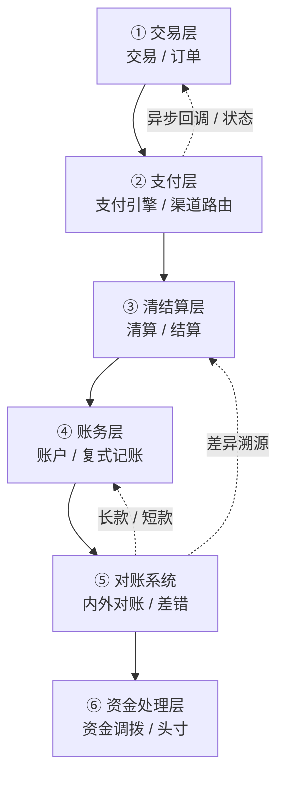

```text
┌─────────────┐
│  交易层       │  封装业务（充值/收款/转账），生成支付单，与业务解耦
├─────────────┤
│  支付层       │  收银台 + 渠道路由 + 渠道适配 + 回调，推进支付状态
├─────────────┤
│  清结算层     │  清算（算应收应付）→ 结算（实际打款），分账/计费
├─────────────┤
│  账务层       │  复式记账、账户体系、余额与流水（资金账本）
├─────────────┤
│  对账系统     │  渠道对账 + 内部对账，长短款差错处理
├─────────────┤
│  资金处理层   │  头寸管理、资金调拨、银行/网联/银联接口
└─────────────┘
```

### 1.1 六层中的分布式事务落点

> 支付全链路跨 6 层、多个微服务，没有一种分布式事务方案能"一招通吃"。每层的诉求不同，落点也不同——这正是面试时能拉开差距的"知道在哪一层用什么"。

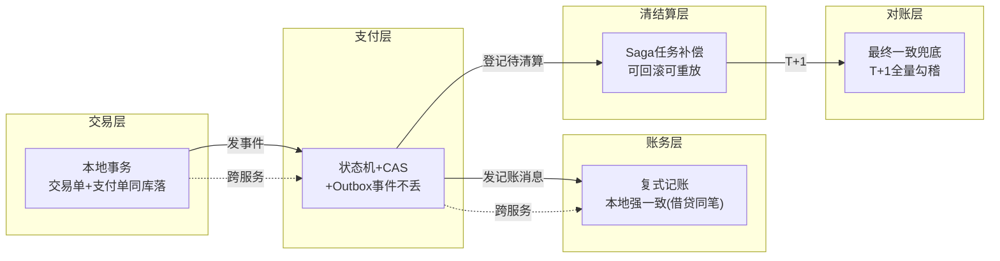

| 链路位置 | 一致性方案 | 为什么选它 | 代价 |
|----------|-----------|-----------|------|
| 交易层内部（交易单+支付单） | 本地事务 | 同库操作，ACID 天然保证 | 无 |
| 支付层→账务层（记账） | Outbox + 幂等消费 | 渠道回调已落库，记账可异步重放 | 短暂账实不符窗口 |
| 支付层→清结算（登记清算） | Saga 任务补偿 | 清算可冲正、结算可回滚，适合长流程 | 补偿逻辑复杂 |
| 账务层内部（复式记账） | 本地强一致 | 借贷必须同笔落库，账永平 | 单库写入瓶颈 |
| 对账层 | 最终一致 + 人工兜底 | 跨系统跨周期，只能事后勾稽 | 差异发现滞后 |

> **核心认知**：支付系统的"一致性"不是一个选择题，而是"每层选不同的答案，再用幂等+状态机+对账把它们缝起来"。面试官问"你们用什么分布式事务"，你的回答应该是"按链路位置分层选"——这比"我们用 TCC"或"我们用 Saga"高级得多。

### 1.2 资金流 vs 信息流：两条主线贯穿六层

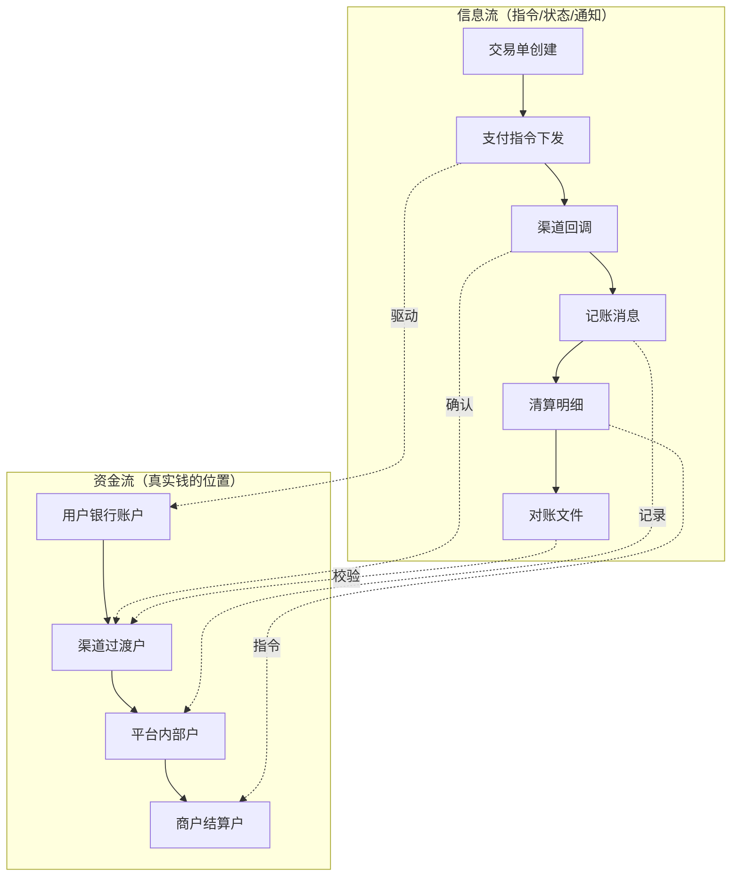

> 信息流是"指令"，资金流是"实物"。信息流可以在秒级流转，资金流可能 T+N 才到账。对账的本质就是"信息流描述的钱"和"资金流实际的钱"是否一致。这条认知线贯穿全链路设计。

## 2. 交易层（交易系统）

- **职责**：把上层业务（收款/充值/提现/转账/退款）翻译成标准的「交易单」，再生成「支付单」交给支付层；
- **解耦价值**：业务系统不直接碰支付细节，支付系统不关心业务语义，各自演进；
- **交易单 vs 支付单**：一笔交易可能因分账/组合支付生成多笔支付单（1:N）；
- **关键字段**：交易号、商户号、金额、币种、渠道偏好、有效期。

## 3. 支付层（支付引擎 / 支付系统）

- **收银台**：收单入口，呈现可用支付方式（卡/钱包/网银/第三方），前端轻、后端只做路由；
- **渠道路由**：综合费率/成功率/延迟/额度加权打分，熔断兜底（见系统设计篇）；
- **渠道适配**：每家渠道协议不同，用适配器模式统一成内部指令；
- **回调处理**：验签 → 幂等 → 推进支付状态机 → 发消息（见分布式事务篇）；
- **状态机核心**：支付单只有「待支付→支付中→成功/失败/关闭」，所有写幂等，重复回调安全。

### 3.1 支付状态机详解

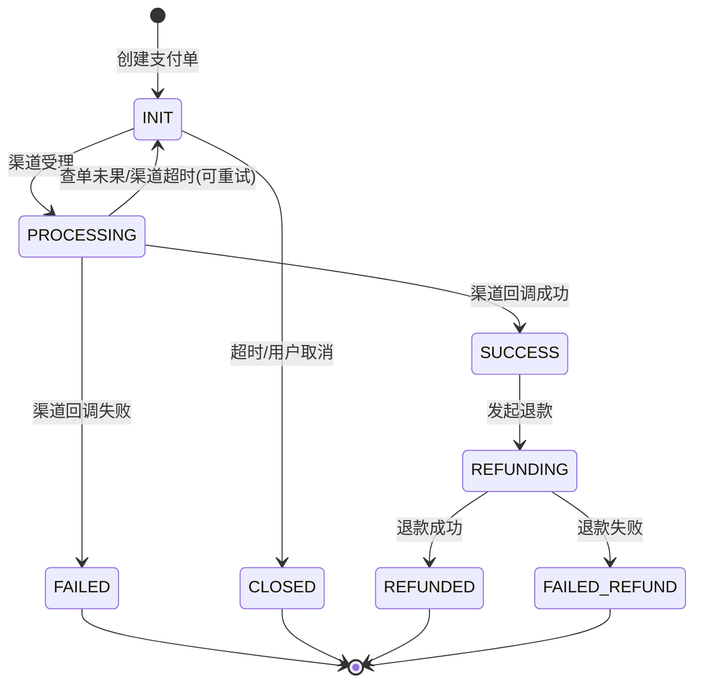

状态机的工程实现核心是 **CAS 写库**——每次状态迁移用条件 UPDATE 保证并发安全：

```sql
-- 只有 PROCESSING 状态才能迁移到 SUCCESS，并发回调只有一条成功
UPDATE pay_order
   SET status = 'SUCCESS',
       channel_tx_no = #{channelTxNo},
       success_time = #{now},
       version = version + 1
 WHERE id = #{orderId}
   AND status = 'PROCESSING';
-- affected_rows = 1 → 本次回调生效；affected_rows = 0 → 已被其他请求处理，忽略
```

```java
// 状态机定义（DDD 聚合根内）
public enum PaymentEvent {
    CHANNEL_ACCEPTED,    // INIT → PROCESSING
    CHANNEL_SUCCESS,     // PROCESSING → SUCCESS
    CHANNEL_FAILED,      // PROCESSING → FAILED
    TIMEOUT_CLOSE,       // INIT → CLOSED
    REFUND_REQUESTED,    // SUCCESS → REFUNDING
    REFUND_SUCCESS,      // REFUNDING → REFUNDED
    REFUND_FAILED;       // REFUNDING → FAILED_REFUND
}

// 状态迁移校验：非法跃迁直接拒绝
public boolean canTransit(PaymentStatus from, PaymentEvent event) {
    return switch (event) {
        case CHANNEL_ACCEPTED    -> from == INIT;
        case CHANNEL_SUCCESS     -> from == PROCESSING;
        case CHANNEL_FAILED      -> from == PROCESSING;
        case TIMEOUT_CLOSE       -> from == INIT;
        case REFUND_REQUESTED    -> from == SUCCESS;
        case REFUND_SUCCESS      -> from == REFUNDING;
        case REFUND_FAILED       -> from == REFUNDING;
    };
}
```

### 3.2 幂等键设计原理

> 幂等键不是"随便选个唯一字段"，而是要精确表达"同一次业务意图"。选错幂等键 = 该挡的没挡、不该挡的误杀。

**幂等键选型三原则**：

| 原则 | 含义 | 反例 |
|------|------|------|
| **业务稳定** | 幂等键在请求生命周期内不变 | 选了 `amount`（退款金额会变） |
| **意图唯一** | 同一意图的重复请求命中同一键 | 选了 `timestamp`（每次不同） |
| **可重放** | 系统重启/重试后仍能命中同一键 | 选了内存自增 ID |

```sql
-- 接入层幂等：商户请求级别
CREATE UNIQUE INDEX uk_biz_request ON pay_order(merchant_no, out_trade_no, scene);

-- 回调幂等：渠道通知级别
CREATE UNIQUE INDEX uk_channel_notify ON pay_channel_notify(channel_id, channel_tx_no);

-- 记账幂等：内部消息消费级别
CREATE UNIQUE INDEX uk_accounting_entry ON acct_journal(biz_no, account_id, direction, entry_type);
-- entry_type 区分入账/冲正/手续费，避免"冲正"被误判为"重复入账"
```

**幂等键冲突时的处理策略**：

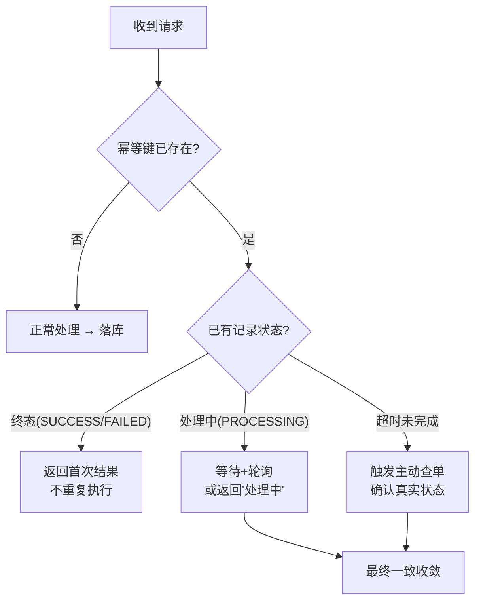

### 3.3 渠道路由打分算法

```java
/**
 * 多因子加权打分路由
 * score = w1*(1-费率) + w2*成功率 - w3*延迟归一化 - w4*近5min失败率
 */
public ChannelRouteResult route(PaymentRequest req) {
    // 1. 硬过滤：不支持的币种/地区/已熔断的渠道直接排除
    List<Channel> candidates = channelRegistry.getAll().stream()
        .filter(c -> c.supports(req.getCurrency(), req.getCountry()))
        .filter(c -> !circuitBreaker.isOpen(c.getId()))
        .filter(c -> c.getDailyQuotaRemaining() > req.getAmount())
        .collect(Collectors.toList());

    if (candidates.isEmpty()) {
        return ChannelRouteResult.fallback(); // 降级：返回默认渠道+告警
    }

    // 2. 加权打分
    return candidates.stream()
        .map(c -> Map.entry(c, calculateScore(c, req)))
        .max(Comparator.comparingDouble(Map.Entry::getValue))
        .map(e -> ChannelRouteResult.of(e.getKey(), e.getValue()))
        .orElse(ChannelRouteResult.fallback());
}

private double calculateScore(Channel c, PaymentRequest req) {
    double costScore = (1 - c.getFeeRate()) * WEIGHT_COST;        // 成本权重
    double succScore = c.getSuccessRate5min() * WEIGHT_SUCCESS;   // 实时成功率
    double latencyScore = -normalizeLatency(c.getP99Latency()) * WEIGHT_LATENCY;
    double failScore = -c.getFailRate5min() * WEIGHT_FAIL;
    return costScore + succScore + latencyScore + failScore;
}
```

> **路由打分的工程难点**：成功率因子必须是实时的（滑动窗口统计近 N 分钟），过期权重衰减；滤波优先级高于打分——合规/币种/地区不支持的先排除。主渠道失败时不是简单重试主渠道，而是**排除已失败渠道后重新打分**选备渠道。

## 4. 清结算层

- **清算（Clearing）**：计算「谁该给谁多少钱」——把一笔交易拆成多方应收应付（商户货款、平台手续费、渠道费、分账方）；
- **结算（Settlement）**：按清算结果做**实际资金转移**（打款到商户银行户）；
- 详见 [清结算体系](./准备-清结算体系.md) 一文。

## 5. 账务层（账务账户系统）

- **复式记账**：每笔资金变动必有借有贷、借贷相等，资金账本永平；
- **账户体系**：客户账户、商户账户、渠道过渡户、内部收款户、手续费户、暂收暂付户；
- **余额与流水**：流水不可变、余额由流水派生，可追溯；
- 详见 [账务账户体系与复式记账](./准备-账务账户体系与复式记账.md) 一文。

### 5.1 复式记账落库示例

> 复式记账的工程落地：一笔收款在数据库里是"借贷两条流水同笔落库"，由本地事务保证原子性。

```sql
-- 账户表
CREATE TABLE acct_account (
    id           BIGINT PRIMARY KEY,
    account_no   VARCHAR(32) UNIQUE,  -- 账户号
    account_type VARCHAR(16),         -- CUSTOMER/MERCHANT/CHANNEL_TRANSIT/FEE
    currency     VARCHAR(3),
    balance      BIGINT DEFAULT 0,    -- 余额（最小币种整数，分）
    version      INT DEFAULT 0,       -- 乐观锁版本号
    status       VARCHAR(8) DEFAULT 'ACTIVE'
);

-- 流水表（不可变，只追加）
CREATE TABLE acct_journal (
    id           BIGINT PRIMARY KEY,
    biz_no       VARCHAR(64),         -- 业务单号（幂等键组成）
    account_id   BIGINT,              -- 账户ID
    direction    VARCHAR(4),          -- DEBIT(借) / CREDIT(贷)
    entry_type   VARCHAR(16),         -- PAYIN/REFUND/FEE/SETTLE
    amount       BIGINT,              -- 金额（分）
    currency     VARCHAR(3),
    created_at   DATETIME DEFAULT NOW(),
    UNIQUE KEY uk_idempotent (biz_no, account_id, direction, entry_type)  -- 记账幂等
);
```

```sql
-- 一笔 VA 收款的复式记账（本地事务内执行）
BEGIN;

-- 借：渠道过渡户（钱从渠道进来）
INSERT INTO acct_journal(biz_no, account_id, direction, entry_type, amount, currency)
VALUES ('PAY20260710001', 1001, 'DEBIT', 'PAYIN', 1000000, 'USD');

-- 贷：商户待结算户（钱记给商户）
INSERT INTO acct_journal(biz_no, account_id, direction, entry_type, amount, currency)
VALUES ('PAY20260710001', 2001, 'CREDIT', 'PAYIN', 1000000, 'USD');

-- 更新余额（CAS，防并发覆盖）
UPDATE acct_account SET balance = balance + 1000000, version = version + 1
 WHERE id = 1001 AND version = #{v1};
UPDATE acct_account SET balance = balance + 1000000, version = version + 1
 WHERE id = 2001 AND version = #{v2};

COMMIT;
-- 借贷相等（1000000 = 1000000），账永平
```

### 5.2 热点账户问题与解决方案

> 热点账户是支付系统的"性能杀手"——当大量并发写入命中同一个账户（如平台手续费汇总户、大促营销户），行锁成为瓶颈，TPS 断崖式下降。

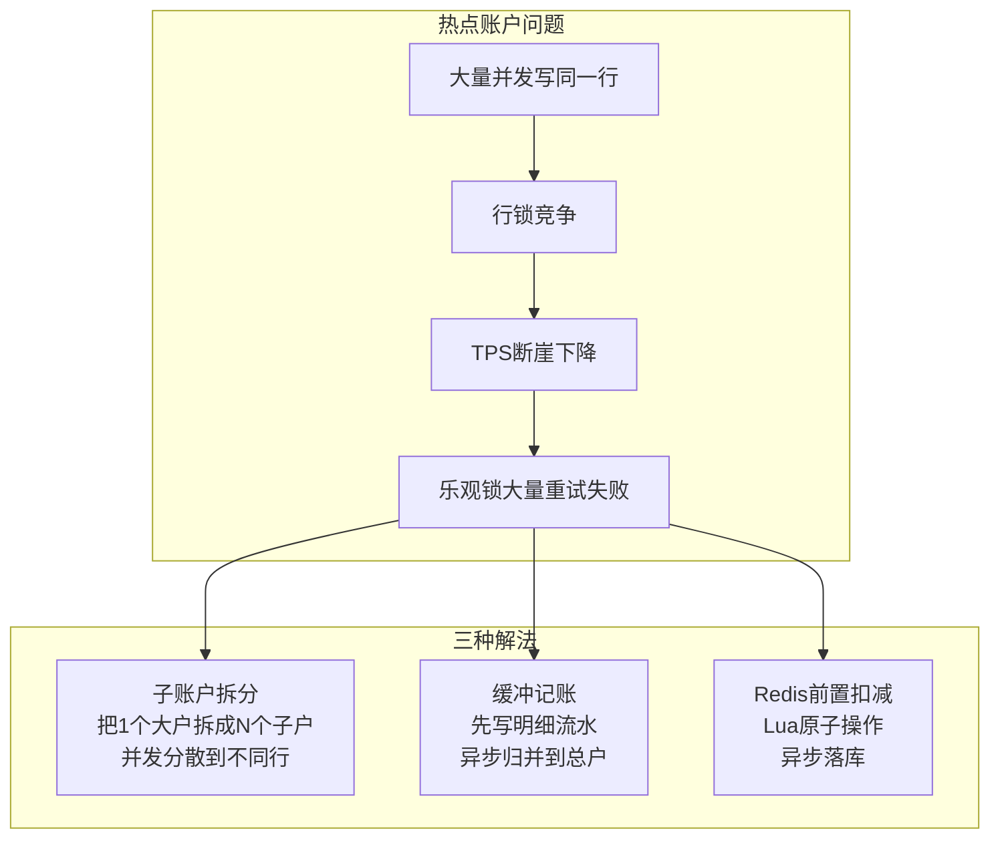

| 方案 | 适用场景 | 优势 | 代价 |
|------|---------|------|------|
| **子账户拆分** | 平台手续费户、营销户 | 并发分散到 N 行，接近线性提升 | 归并逻辑复杂，余额查询要聚合 |
| **缓冲记账** | 对实时余额不敏感的账户 | 写流水不阻塞，TPS 极高 | 余额有延迟，需定期归并 |
| **Redis 前置** | 限额扣减、秒杀库存 | Lua 原子，10w+ QPS | Redis 故障风险，需对账兜底 |

```java
// 子账户拆分 + 路由策略
public class HotAccountRouter {
    // 把一个逻辑账户号拆成 N 个物理子账户
    private static final int SHARD_COUNT = 16;

    public Long routeSubAccount(String accountNo, String bizKey) {
        int shard = Math.abs(bizKey.hashCode()) % SHARD_COUNT;
        return accountNoToId(accountNo + "_sub_" + shard);
    }
    // 归并：定时任务把子户余额汇总到总户，生成归并流水
}
```

### 5.3 余额并发控制：CAS vs 悲观锁 vs 冻结确认

```sql
-- 方案A：乐观锁（适合低冲突，不同用户不同账户）
UPDATE acct_account
   SET balance = balance - #{amount}, version = version + 1
 WHERE id = #{accountId}
   AND balance >= #{amount}
   AND version = #{currentVersion};
-- affected_rows=0 说明余额不足或版本冲突

-- 方案B：悲观锁（适合高冲突，同一账户并发扣减）
SELECT * FROM acct_account WHERE id = #{accountId} FOR UPDATE;
-- 业务判断余额够不够
UPDATE acct_account SET balance = balance - #{amount} WHERE id = #{accountId};
COMMIT;

-- 方案C：冻结确认（TCC思想，最安全）
-- Try: 冻结额度
INSERT INTO acct_frozen(account_id, amount, expire_time) VALUES(#{acct}, #{amt}, #{expire});
UPDATE acct_account SET frozen = frozen + #{amt} WHERE id = #{acct};
-- Confirm: 扣减冻结
UPDATE acct_account SET balance = balance - #{amt}, frozen = frozen - #{amt} WHERE id = #{acct};
-- Cancel: 解冻
UPDATE acct_account SET frozen = frozen - #{amt} WHERE id = #{acct};
DELETE FROM acct_frozen WHERE id = #{frozenId};
```

> **选型原则**：低冲突用乐观锁（并发好）、高冲突用子账户拆分+缓冲（不直接锁）、资金强安全用冻结确认（TCC）。绝对不要对热点账户直接 `SELECT FOR UPDATE`——吞吐会崩。

## 6. 对账系统

- **渠道对账**：拉渠道流水 vs 本地账单，比对出长款（渠道多收）/短款（渠道少收）/错账；
- **内部对账**：交易层 ↔ 支付层 ↔ 账务层 勾稽，保证「账账相符」；
- **差错处理**：挂账 → 查因 → 调账/补单/退款，必要时人工；
- 实时比对 + T+1 全量，差异自动归因（AI 篇讲向量检索归因）。

## 7. 资金处理层

- **头寸管理**：保证在银行的头寸充足，避免结算失败；
- **资金调拨**：归集各渠道资金到主账户，按需调拨；
- **银行接口**：直连银行 / 通过网联、银联、SWIFT（跨境）完成清算结算。

### 7.1 分布式事务方案对比与选型矩阵

> 支付系统跨多服务、多数据源，分布式事务选型不是"选一个"，而是"每条链路选最合适的"。

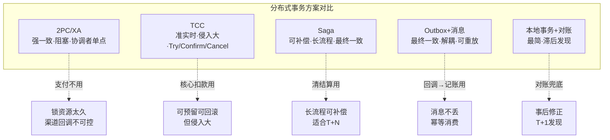

| 方案 | 一致性 | 性能 | 侵入性 | 适用链路 | 不适用场景 |
|------|--------|------|--------|---------|-----------|
| **2PC/XA** | 强一致 | 差（长锁） | 低 | 几乎不用 | 支付全链路（渠道不可控） |
| **TCC** | 准实时 | 中 | 高（三套接口） | 核心扣款、跨账户调拨 | 渠道回调（不可预留） |
| **Saga** | 最终一致 | 好 | 中 | 清算→结算长流程 | 需要瞬时强一致的场景 |
| **Outbox+消息** | 最终一致 | 好 | 低 | 回调→记账→通知 | 需要同步返回结果的场景 |
| **本地事务+对账** | 最终一致 | 最好 | 最低 | 内部同库操作 | 跨服务操作 |

**支付全链路中的实际选型**：

```
交易层内部     → 本地事务（交易单+支付单同库）
支付层→账务层  → Outbox + 幂等消费（回调已落库，记账可异步重放）
支付层→清结算  → Saga 任务补偿（清算可冲正、结算可回滚）
账务层内部     → 本地强一致（借贷同笔落库，复式记账）
对账层         → 最终一致 + 人工兜底（T+1全量勾稽）
核心扣款       → TCC（冻结→确认→取消，资金最安全）
```

### 7.2 Outbox 模式实现

> Outbox 的核心思想：业务操作和"发消息"在同一个本地事务里，消息先落库不丢，再异步投递到 MQ。

```sql
-- Outbox 表（与业务表同库）
CREATE TABLE outbox_event (
    id           BIGINT PRIMARY KEY,
    biz_no       VARCHAR(64),      -- 业务单号
    event_type   VARCHAR(32),      -- 事件类型
    payload      TEXT,             -- 事件内容（JSON）
    status       VARCHAR(8) DEFAULT 'PENDING',  -- PENDING/SENT
    created_at   DATETIME DEFAULT NOW(),
    retry_count  INT DEFAULT 0
);

-- 业务 + 发消息在同一个事务
BEGIN;
UPDATE pay_order SET status = 'SUCCESS' WHERE id = ? AND status = 'PROCESSING';
INSERT INTO outbox_event(biz_no, event_type, payload)
VALUES (?, 'PAYMENT_SUCCESS', '{"orderId":"...","amount":1000000}');
COMMIT;

-- 独立的 Outbox 投递器（轮询 PENDING 消息发到 MQ）
-- 发送成功后标记 SENT；失败重试，超过阈值进死信
```

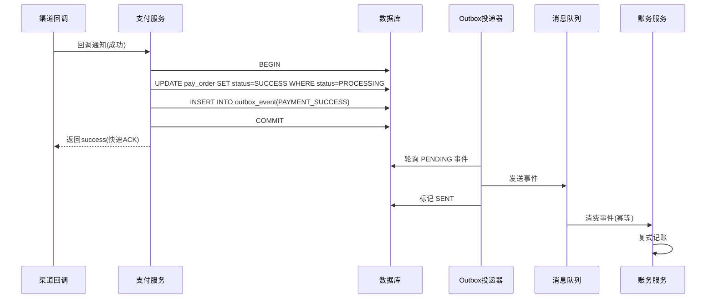

> **Outbox 的价值**：即使账务服务此刻宕机，回调已经幂等落库、消息在 Outbox，账务恢复后照常消费，不丢一笔。这是资金安全的关键解耦。

## 8. 一笔跨境收款的生命周期（串起来）

> 把六层"串成一条线"，就是下面这趟时序。注意**渠道是异步回调**，所以支付核心必须幂等 + 状态机，回调和主动查单只能成功一次。

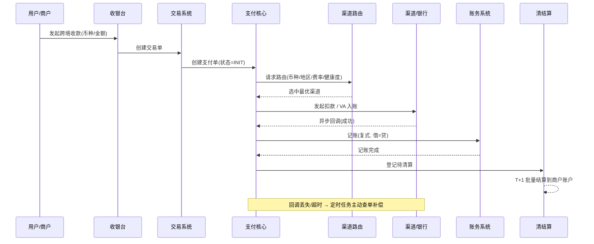

```text
1) 交易层: 商户发起收款 → 生成交易单 + 支付单
2) 支付层: 收银台 → 路由选渠道 → 调境外渠道 → 用户付款
3) 支付层: 渠道异步回调 → 验签/幂等 → 支付单=成功 → 发记账消息
4) 账务层: 借渠道过渡户 / 贷商户待结算户（复式记账）
5) 清结算层: T+1 清算算手续费与分账 → 生成结算指令
6) 资金处理层: 结算打款到商户银行户（跨境走 SWIFT/本地清算）
7) 对账系统: 渠道对账 + 内部勾稽，差异进差错队列
```

> 这一步最能体现「全局思维」：讲项目时从交易层一路讲到资金处理层，面试官会发现你真的做过端到端支付。

### 8.1 真实案例：XTransfer 的多种收款产品（都跑在这套分层上）

在 XTransfer，同一套分层之上长出了多种收款产品，本质都是「交易层生成不同交易单 + 支付层接不同渠道/方式」：

| 产品 | 交易层形态 | 支付层差异 |
| --- | --- | --- |
| **VA 收款** | 为客户开虚拟账户（VA），买家打款到该 VA | 渠道回调按 VA 号关联收款单，100+ 渠道标准化接入（见 [XTransfer 深度复盘 · VA 开户系统](/post/准备-XTransfer跨境支付收款平台深度复盘)） |
| **收单结算** | 卡组织 / 第三方收单 | 走收单渠道，重落地页/3DS/风控调单 |
| **A2A 收款** | 账户直连（Account-to-Account） | 直连清算网络，无卡，重实时性 |
| **电商平台收款** | Amazon / Shopify 等平台回款 | 平台 API 拉回款，重对账与平台规则 |

- **预收 → 平台收款 → 商户结算**的全链路资金管理，都由这套分层承载；
- 不同产品靠 **SPI 扩展点**接入（开闭原则），核心链路不动；
- 风控（独立子状态机）、合规（动态表单申报）、资金安全（三道防线）横切各产品。

> 把「抽象分层」落到「具体产品」，是面试里从「背概念」升级到「真做过」的关键。更细的架构、状态机、补偿、SPI 见 [XTransfer 跨境支付收款平台深度复盘](/post/准备-XTransfer跨境支付收款平台深度复盘)。

---

## 【深度拓展】技术原理深挖

### 拓展一：支付前置 → 交易 → 清结算 → 对账完整时序

> 以下时序图把"支付前置（风控/合规/限额）→ 交易层 → 支付层 → 账务层 → 清结算层 → 对账层"串成一条完整链路，标注每步的分布式事务方案和幂等键。

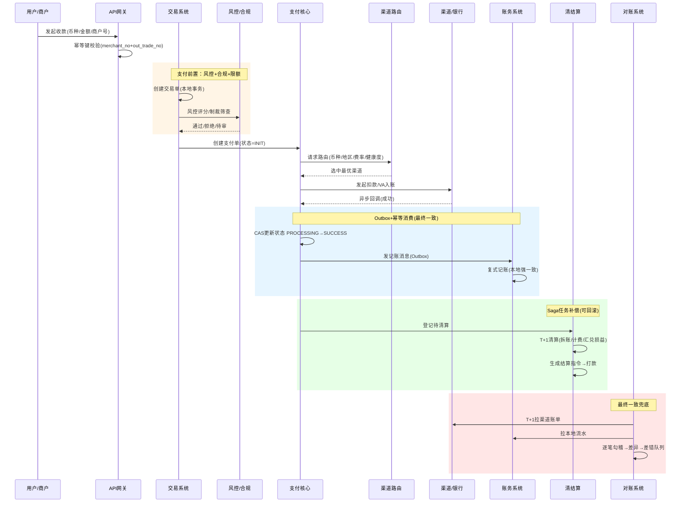

### 拓展二：业界方案对比——支付编排层的三种流派

| 流派 | 代表 | 特点 | 优势 | 劣势 |
|------|------|------|------|------|
| **中心编排** | Stripe / Adyen | 一个编排引擎集中调度各步骤 | 流程清晰、可观测 | 编排引擎是单点 |
| **事件驱动 Saga** | XTransfer / 蚂蚁 | 状态机+领域事件+任务补偿 | 去中心化、可补偿、可重放 | 链路长时排查难 |
| **工作流引擎** | Camunda / Temporal | DSL 描述流程，引擎驱动 | 流程可视化、支持人工节点 | 引擎重、性能开销 |

> **XTransfer 选事件驱动 Saga 的原因**：跨境收款链路长（风控→申报→记账→清算→结算），且每步可补偿（记账可冲正、申报可撤回），天然适合 Saga。工作流引擎虽然可视化好，但对高 TPS 支付场景性能开销过大，且"状态机+事件"在代码里更可控、更可审计。

### 拓展三：常见误区与陷阱

**误区 1：把幂等等同于"加个 Redis 分布式锁"**
- 锁有超时和主从切换丢锁的问题，必须"锁 + 唯一索引/状态机"双保险。锁只是"加速串行"，不是幂等的最终保障。

**误区 2：清算和结算用同一笔汇率**
- 清算时锁汇 vs 结算时实时汇，汇率时点不同产生汇损差异。必须单独记汇兑损益科目，且要明确"谁承担"。

**误区 3：对账只对金额**
- 金额对但状态错（本地成功、渠道实际失败）同样是资损隐患。对账必须校验"金额 + 状态 + 方向"三要素。

**误区 4：状态机放在应用层 if/else 里**
- 散落的 `if(status==X) status=Y` 在并发下极易乱跳。状态机要集中定义（DDD 聚合根），执行靠 CAS 写库。

**误区 5：热点账户直接 SELECT FOR UPDATE**
- 大量并发写同一行，行锁成为瓶颈，TPS 断崖下降。应拆子账户或缓冲记账。

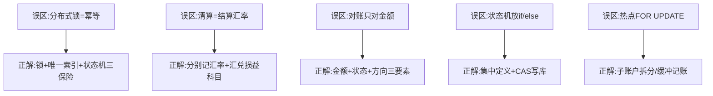

---

## 【项目支撑】XTransfer 真实项目决策与数据

### 决策一：为什么选六边形+CQRS+DDD 而非传统 MVC

| 维度 | 传统 MVC | 六边形+CQRS+DDD | XTransfer 选后者原因 |
|------|---------|-----------------|---------------------|
| 渠道接入 | if/else 分支 | SPI 适配器 | 100+ 渠道，if/else 不可维护 |
| 读写模型 | 共用一个 | 读写分离 | 写(扣款)和读(账单)诉求不同 |
| 资金安全 | 应用层校验 | 领域层不变量 | 资金不变量必须在领域层保护 |
| 可测试性 | 依赖 Spring | 领域层无框架 | 交易逻辑能脱离渠道单测 |

### 决策二：0 资损的工程实现路径

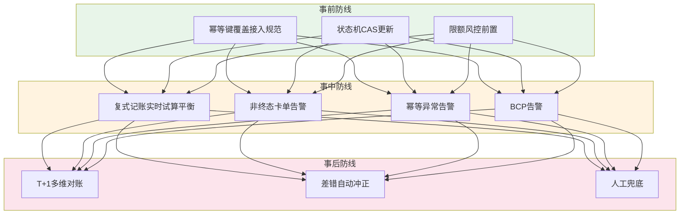

### 决策三：关键数据指标

| 指标 | 数值 | 说明 |
|------|------|------|
| 渠道数量 | 100+ | VA 开户标准化接入 |
| 结算笔数 | 1000w+ | 历史累计对客结算 |
| 资损率 | 0 | 2.0 重构后 0 资损 |
| 生产问题 | -80% | 2.0 重构后生产问题下降 |
| 人效 | +30% | SPI+配置化带来的研发提效 |

> 这些数据来自真实项目复盘，面试时讲"我主导的 2.0 重构，把资损从 X 降到 0、生产问题降 80%"——比泛泛讲"我用了状态机"有说服力得多。

## 9. 怎么在面试里用这套分层

> 面试官问「讲讲你们支付系统」——别一上来画渠道调用图。先说「我们的支付是分层的，我按交易/支付/清结算/账务/对账/资金六层来讲，我先讲我负责最深的那层」，再展开。这既是结构感，也是主动控场。

---

## 面试高频问答（标准回答）

### Q1：支付系统为什么要分层？各层做什么？

**标准回答**：分层是为了**职责单一 + 解耦演进**。交易层封装业务生成支付单；支付层做收银台、路由、渠道适配和回调；清结算层算应收应付并实际打款；账务层用复式记账维护资金账本；对账层做渠道/内部勾稽；资金处理层管头寸和银行接口。层间靠流水/消息串联，互不绑架。

**【深度拓展】** 分层真正的价值不在"画图好看"，而在**故障域隔离与变更半径收敛**。每一层只对自己的不变量负责：支付层保证"钱按合法状态流转"，账务层保证"账永远平"，对账层保证"内外对得上"。这样任何一层抖动都不会直接变成资损——支付层挂了，交易还能接单、账务不动、对账事后兜底。反过来，不分层的"巨石支付服务"里，一个渠道 bug 会污染记账逻辑。权衡点是分层带来异步与事件，需要额外的幂等、补偿、对账来补齐一致性，但这是资金系统该付的代价。面试官还可能追问"层太多会不会链路太长、排查难"——会，所以每层都要有可观测（TraceID 贯穿六层）+ 状态机快照，让任意一笔钱能还原"卡在哪一层、哪个状态"。

**【项目支撑】** 我在 XTransfer 用"六边形 + CQRS + DDD"把这套分层落到代码：领域层（DDD 聚合根 + 状态机）是资金不变量中心，外层（六边形的端口-适配器）包裹交易/支付/账务/渠道。CQRS 让"写（扣款、记账）"和"读（列表、对账）"各走各的模型，避免一个大事务里又写又查。这正是全链路分层的工程化版本。

### Q2：交易单和支付单什么关系？

**标准回答**：交易单是「业务语义」（一笔收款），支付单是「支付语义」（一次实际扣款尝试）。一笔交易可能对应多笔支付单——比如组合支付（余额+银行卡）、分账（一笔交易拆给多个商户各自结算）、或重试产生新支付单。两者 1:N，交易层对业务、支付层对渠道。

**【深度拓展】** 1:N 关系里最容易被忽视的是**逆向链路**：退款必须基于原支付单（甚至基于原支付流水）回退，否则"退了哪笔、退了多少、渠道怎么原路退"会对不上。组合支付里还要定退款顺序（券 > 卡 > 渠道）。更深的坑是"支付单重推产生的多条流水"——同一笔支付因超时查单、渠道重复通知会生成多条支付流水，必须靠"支付单号 + 状态机"收敛到终态唯一，不能按流水条数记账。面试官追问"重试产生的重复支付单怎么处理"——支付单幂等键 + 状态机：重复回调只命中终态被忽略。

**【项目支撑】** XTransfer 的 VA 收款就是典型 1:N：一笔贸易收款可能对应多条同 VA 号的入账流水（不同买家、不同时间打款），但归到同一个"收款单"聚合根下，状态机统一推进到"已记账/已结算"，绝不会因流水多而重复结算给商户。

### Q3：支付层的回调为什么一定要幂等 + 状态机？

**标准回答**：渠道回调可能重复、乱序、部分成功。幂等（唯一索引 + 幂等键）保证重复回调不产生重复入账；状态机保证「只有待支付→支付中→成功」单向推进，非法跃迁直接拒绝。最后由对账兜底，三层保障做到不资损。

**【深度拓展】** 这里有个更硬核的招：**状态机 + CAS（Compare-And-Swap）更新**。回调处理时不是简单"UPDATE status='SUCCESS'"，而是 `UPDATE ... SET status='SUCCESS' WHERE id=? AND status='PROCESSING'`（或带版本号）。这条 SQL 天然幂等——并发/重复的回调只有一条能成功改状态，其余 affected rows=0 直接忽略；同时它把"非法跃迁"（如从 SUCCESS 退回 PROCESSING）在数据库层面直接拒绝，比应用层 if 判断更可靠（应用层多实例下有竞态）。这是"资金安全第一道闸"落到数据库的实现。状态机负责定义哪些迁移合法，CAS 负责并发下只让一条通过。两者配合，幂等和防非法流转同时成立。面试官追问"状态机放哪一层"——定义在中领域层（DDD 聚合根），执行靠 CAS 写库，回调处理只是触发事件。

**【项目支撑】** 我在 XTransfer 做收款 2.0 重构时，把原先散落的 `if(status==X) status=Y` 全部收进状态机，每次状态迁移都用 `UPDATE ... WHERE status=旧值` 的 CAS 写库。这带来两个直接收益：① 重复渠道回调天然幂等（affected rows=0 即丢弃）；② 非法迁移（如"已结算"被某补偿逻辑误改回"处理中"）在 SQL 层就被拒，从根上杜绝资损。这是 0 资损的关键设计之一。

### Q4：清结算层到底清算什么？

**标准回答**：清算是「算账」——把一笔交易拆成多方应收应付：商户实收、平台手续费、渠道成本、分账方金额，产出清算明细；结算才是「打钱」——按清算结果把资金从平台户划到商户银行户。清算是信息流、结算是资金流，二者分离。

**【深度拓展】** 清算复杂度的真正来源是**分账规则 + 多边轧差 + 汇率**。平台型/跨境场景下，一笔钱要拆给商户、平台、渠道、分账方，规则还随商户协议变；跨境还要按清算时点汇率把各币种折算成本位币、记汇兑损益。清算结果是"应收应付的数字"，必须可审计、可追溯，因为它直接决定结算打多少钱。常见坑：清算和结算用同一笔"金额"但汇率时点不同（清算时锁汇 vs 结算时实时汇），产生汇损差异需要单独科目记账。面试官追问"清算算错了怎么办"——清算结果进差错队列 + 红冲重算，且清算与结算之间靠对账勾稽。

**【项目支撑】** XTransfer 跨境收款里，清算把一笔 VA 入账拆成"商户实收 + 平台手续费 + 渠道成本"，跨境部分按清算时点汇率折算本位币并记汇兑损益；结算按商户协议 T+1 通过本地清算网络打款。贸易订单管理系统还用"流水式额度只增不减"保证入账关联的贸易背景额度精准、可审计，汇损会补充回用户，保证结汇一致。

### Q5：你怎么证明自己懂端到端支付，而不只是调过渠道？

**标准回答**：我能从交易层一路讲到资金处理层：交易单怎么生成、路由怎么打分、回调怎么幂等、记账怎么复式、清算怎么拆账、结算怎么打款、对账怎么勾稽、头寸怎么管。每个层我都能讲清职责边界和与其他层的交接点，而不只是「调了一个渠道 API」。

**【深度拓展】** 真正能拉开差距的不是"能背六层名词"，而是能讲出**层与层之间的交接契约**：交易层给支付层的是什么（幂等 outTradeNo + 金额 + 币种）？支付层给账务层的是什么（带幂等键的记账请求 + 借贷分录）？账务层给对账层的是什么（不可变流水）？每一道交接都有"幂等键 + 状态"作为契约，这才是端到端不资损的关键。面试官若让你现场画一笔钱的生命周期，重点不是画全，而是标出每道交接的幂等键和状态机——这证明你真做过资金系统。

> 参考陈天宇宙《支付之门》的全链路方法论，把支付当「体系」而非「接口」来准备，是这轮面试我最有底气的部分。

---

## 更多高频追问（补充）

### Q6：一笔支付从点击到成功，中间经历了哪些系统交互？

**标准回答**：① 商户下单 → 交易层生成交易单（幂等 `outTradeNo`）；② 风控层做实时评分/限额校验；③ 路由层按费率/成功率/限额给渠道打分选渠道；④ 支付层组装渠道报文、加签、发起支付；⑤ 用户在渠道侧完成付款；⑥ 渠道**异步回调** → 支付层验签 + 幂等 → 更新交易状态；⑦ 发消息触发账务层复式记账；⑧ 清结算层按周期轧差、拆账、结算打款；⑨ 对账系统 T+1 与渠道文件勾稽。能把这条链讲顺，就证明"懂体系"。

**【深度拓展】** 注意第 ⑥⑦ 步的"解耦"：回调成功后不是同步调账务，而是**发消息（Outbox 保证不丢）**触发记账。这步的解耦是资金安全的关键——即使账务系统此刻宕机，回调已经幂等落库、消息在 Outbox，账务恢复后照常消费，不丢一笔。另外第 ④ 步"加签"和第 ⑥ 步"验签"是防篡改闭环，和风控的签名校验一脉相承（参考欧凡的 HMAC 签名防篡改）。面试官追问"如果回调丢了、定时查单也查不到怎么办"——才会进入差错队列，靠 T+1 对账兜底，绝不会让"钱到了但我方状态还是支付中"长期存在。

**【项目支撑】** XTransfer 的渠道回调就是"验签 → 幂等（幂等键） → 推进状态机（CAS 写库） → 发领域事件（Outbox）"四步。状态机保证只有"待入账→入账中→已入账"合法迁移，重复回调 affected rows=0 直接丢弃；领域事件经 Outbox 可靠投递到记账/申报/通知域，即使下游暂不可用也不丢。这套是 0 资损的核心链路。

### Q7：为什么支付回调一定要用异步？同步不行吗？

**标准回答**：支付涉及用户在渠道侧的操作（输密码、跳银行 App、3DS 验证），耗时不可控且可能几分钟，同步等待会占满线程、超时率极高。所以渠道统一用**异步回调 + 主动查单兜底**：发起时拿到"支付中"，结果通过回调通知；同时定时任务对超时的"支付中"订单主动查渠道真实状态，双保险防止回调丢失。这是支付系统"不能干等回调"的铁律。

**【深度拓展】** 异步回调 + 主动查单是"两条腿走路"：回调是快路径（正常几秒内到账），查单是慢路径兜底（应对回调丢失/乱序/延迟）。设计上要注意：查单任务不能无限查——对超过合理时长（如 T+1）仍无终态的订单，要从"查单"升级为"差错处理"（人工/对账介入），否则会有一批"永久支付中"占用资源。还有"回调和查单同时到达"的并发——靠状态机 CAS（Q3 讲过）保证只有一个成功改状态。面试官追问"能不能用 WebSocket 推送代替回调"——可以作为一种通知手段，但支付领域仍以渠道回调 + 主动查单为铁律，因为渠道侧可控、可审计、不依赖长连接。

### Q8：渠道路由怎么设计？依据哪些因子打分？

**标准回答**：路由是"多因子加权打分 + 可用性过滤"。因子包括：**费率**（成本）、**实时成功率**（滑动窗口统计）、**当前渠道健康度**（熔断状态）、**限额/币种/地区支持**、**结算周期**。先过滤掉不支持/已熔断的渠道，再对候选加权打分选最优，并支持"主渠道失败自动切备渠道"。XTransfer 的智能路由就是这套，成功率提升明显。这题也能自然衔接到系统设计里的"如何设计一个路由器"。

**【深度拓展】** 路由打分的两大工程难点：①**成功率因子必须是实时的**——用滑动时间窗口统计近 N 分钟成功率，过期权重衰减，否则"昨天成功率 99%"误导今天；②**滤波的优先级高于打分**——合规/币种/地区不支持的渠道要先过滤掉，再打分，否则高成功率的渠道可能因合规问题让钱走错路。还有"主备切换"的语义：主渠道失败不是简单重试主渠道，而是**基于同一套因子重排、排除已失败主渠道**选备渠道，且要设上限防止"所有渠道轮流试一遍"。面试官追问"路由挂了怎么办"——路由层自身要能降级（返回一条默认可用渠道 + 告警），不能成为支付链路的单点。

**【项目支撑】** XTransfer 100+ 渠道 VA 开户，路由打分 = 成本权重 + 实时成功率权重 + 合规权重（受制裁/行业限制）。合规权重是跨境硬约束，必须可解释，所以我们的"智能路由"是"算法给调权建议、规则引擎做决策"，业务可改、可回滚，AI 不自动拍板。渠道异常时自动化开关基于滑动窗口实时降级，配合任务补偿把失败请求重试到其他渠道。

---

## 【面试官追问】逐问标准回答

> 以下是面试官在全链路架构基础上常见的 5 个深度追问，每个都给出标准回答。

### 追问 1：六层之间如果有一层挂了，整条链路会怎样？

**标准回答**：分层设计的价值恰恰是**故障域隔离**。交易层挂了，渠道回调仍能落库（支付层独立运行），等交易层恢复后消费消息补全；账务层挂了，支付成功已落库+Outbox 消息不丢，账务恢复后照常消费记账；对账层挂了，只是差异发现滞后，不影响实时交易。唯一不能挂的是支付层（状态机），但支付层本身可以多实例+熔断降级。关键设计是：每层只对自己的不变量负责，层间靠消息解耦，任何一层抖动都不直接变成资损。

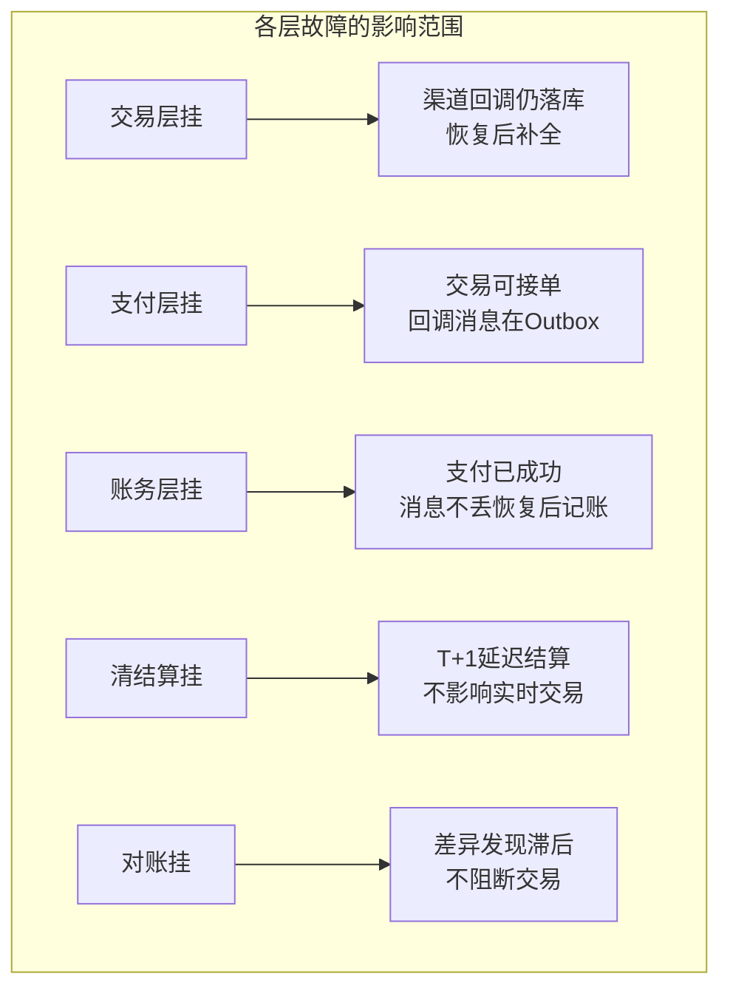

### 追问 2：热点账户的子账户拆分后，余额查询怎么办？

**标准回答**：子账户拆分后余额查询需要聚合所有子户余额。工程上有两种做法：① 实时聚合——查询时 `SELECT SUM(balance) FROM acct_account WHERE account_no_prefix = ?`，简单但有性能开销；② 缓存总余额——归并任务每次执行时更新一个"总户虚拟行"的缓存余额，查询走缓存（短 TTL），牺牲毫秒级一致性换性能。XTransfer 对平台过渡户用"先记明细流水 + 异步归并总户 + 总户缓存"的组合，归并失败重试+告警，既保一致又抗写热点。

### 追问 3：Outbox 表越来越大怎么处理？

**标准回答**：Outbox 表是"只追加"的，会持续增长。处理策略：① 已标记 SENT 的事件定期归档/清理（按时间分表，历史数据转冷存储）；② 投递器用 `SELECT ... WHERE status='PENDING' ORDER BY id LIMIT N FOR UPDATE SKIP LOCKED` 实现多实例并发投递且互不阻塞；③ 如果单表仍扛不住，按 `biz_no` 哈希分表。关键点：Outbox 表只存"待投递"和"已投递"两种状态，不需要复杂查询，分表/归档成本低。

### 追问 4：你们的状态机有多少个状态？嵌套子状态怎么处理？

**标准回答**：XTransfer 收款主状态机有 6 个核心状态：待预收→已预收→风控中→已申报→已记账→已结算（外加关闭/异常等终态）。嵌套子状态用"独立子状态机"处理——风控阶段内部有"免关联→关联→渠道调单"子状态，主流程只关心风控的"通过/拒绝/待补材料"三个出口。子状态机独立管理自己的迁移，不污染主状态机。状态变更统一发领域事件，主流程订阅风控完成事件后继续推进。

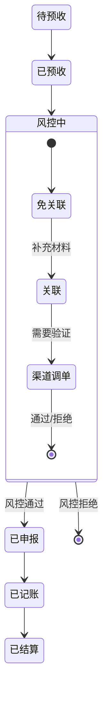

### 追问 5：一笔钱从用户付出到商户收到，中间有几个"可能不一致"的窗口？每个窗口怎么收敛？

**标准回答**：至少有 4 个不一致窗口，每个都有对应的收敛机制：

| 不一致窗口 | 原因 | 收敛机制 | 时长 |
|-----------|------|---------|------|
| 渠道已扣款，本地状态还是 PROCESSING | 渠道回调延迟 | 主动查单 + Outbox 消息 | 秒级~分钟级 |
| 支付已成功，账务还没记账 | Outbox 异步投递延迟 | 幂等消费 + 对账兜底 | 秒级 |
| 清算已算，结算还没打款 | T+N 结算周期 | 清算明细可查，结算指令待执行 | T+1~T+N |
| 汇率锁定时点和结算时点不同 | 汇率波动 | 汇兑损益科目记账 + 补偿 | T+1 |

> 每个窗口都不是"bug"，而是异步系统的固有特征。设计的目标不是消除窗口，而是让每个窗口都可观测、可收敛、有兜底。

---

## 附录一、【故障复盘】真实事故案例库

> 支付全链路「跨 6 层、多微服务」，任何一层的抖动都可能沿链路放大。下面 3 个案例聚焦正文强调的「超时雪崩 / 重复回调 / 幂等键失效」，统一按 **事故背景 → 触发原因 → 影响面 → 定位过程 → 临时止血 → 根因修复 → 长效预防** 复盘，呼应「资金安全三道防线」。

### 案例一：支付链路超时雪崩（上游线程耗尽传导下游）

| 维度 | 内容 |
| --- | --- |
| **事故背景** | 大促期间某主流渠道接口 RT 从 80ms 涨到 2s，路由层同步等待渠道响应。 |
| **触发原因** | 支付核心调用渠道用了**同步阻塞 + 无超时降级**，渠道慢 → Tomcat 线程被占满 → 交易层、账务触发发都拿不到线程 → 全链路 502。 |
| **影响面（量化）** | 持续 7 分钟，**支付成功率从 99.2% 跌到 71%**，**超时率 28%**，约 **4.6w 笔**支付中订单卡在 PROCESSING，客诉 **210+ 起**。 |
| **定位过程** | ① 技术指标 P99 延迟告警（>500ms）；② 线程池监控发现支付核心 200 线程全 blocked 在渠道 HTTP 调用；③ 链路追踪定位到单一渠道 RT 飙升。 |
| **临时止血** | ① 对该渠道**自动熔断**（失败率 >5% 触发，§3.3 路由兜底）；② 路由排除故障渠道重排选备；③ 卡单走主动查单补偿。 |
| **根因修复** | 渠道调用改为**异步 + 固定超时（800ms）+ 熔断**；支付核心线程池与渠道调用线程池**隔离**（舱壁模式）。 |
| **长效预防** | 固化「渠道 RT 红黄绿三档 + 自动熔断」；核心线程池按渠道维度隔离；注入「故障渠道演练」进季度容灾。 |

### 案例二：重复回调导致重复记账

| 维度 | 内容 |
| --- | --- |
| **事故背景** | 某渠道在网络抖动下，对同一笔成功支付**连推 3 次回调**（间隔 30s），且其中一次带不同 `channel_tx_no` 前缀。 |
| **触发原因** | 我们的回调幂等键用了 `(channel_id, channel_tx_no)`，但渠道把同一笔拆成「主流水 + 补差流水」两个 `channel_tx_no`，第二笔绕过了唯一索引，被当成新回调再次记账。 |
| **影响面（量化）** | **23 笔**重复入账，重复金额合计 **¥18w**，其中 **9 笔**已结算打款，资损敞口 **¥7w**。 |
| **定位过程** | ① 实时对账「长款」命中；② `acct_journal` 出现同一 `biz_no` 两条同额 CREDIT；③ 回调日志比对发现第二笔 `channel_tx_no` 是补差流水号。 |
| **临时止血** | ① 该渠道回调入「人工复核队列」；② 9 笔已打款红冲 + 商户扣回 + 赔付通道；③ 其余置差错队列自动冲正。 |
| **根因修复** | 幂等键升级为「业务幂等键优先（`merchant_no + out_trade_no`）」，渠道流水号仅作辅助；记账前校验「该支付单累计记账 = 应记金额」。 |
| **长效预防** | 接入规范新增「幂等键必须表达业务意图、不依赖渠道内部流水号」卡点（事前防线 P1）。 |

### 案例三：幂等键失效——商户重放攻击式重试

| 维度 | 内容 |
| --- | --- |
| **事故背景** | 某大商户因自身重试逻辑 bug，**用同一 out_trade_no 发了 5 笔不同金额**的收款请求**。 |
| **触发原因** | 幂等唯一索引是 `(merchant_no, out_trade_no, scene)`，**不含 amount**。商户 5 笔请求 out_trade_no 相同但金额不同，全部落库成功，生成 5 笔支付单，渠道侧只认第一笔，其余 4 笔永远 PROCESSING。 |
| **影响面（量化）** | 4 笔**悬挂支付单**（未实际收款但占状态），商户对账发现「流水对不上」，**0 资损**但引发商户信任危机，工单 **15 起**。 |
| **定位过程** | ① 商户投诉「一笔钱出现 5 条记录」；② 查 `pay_order` 发现同 out_trade_no 5 行；③ 比对渠道账单只有 1 笔，确认 4 笔为本地悬挂。 |
| **临时止血** | 4 笔悬挂单置 CLOSED（用户取消），释放状态；通知商户修复重试逻辑。 |
| **根因修复** | 幂等键加入 `amount` 维度（与商户约定「同单号同金额」，金额变视为新单）；并对「长期 PROCESSING 且无渠道流水」的订单自动关单。 |
| **长效预防** | 幂等键设计三原则（业务稳定 / 意图唯一 / 可重放）写入接入文档，并把「长期非终态」纳入事中防线 M2 告警。 |

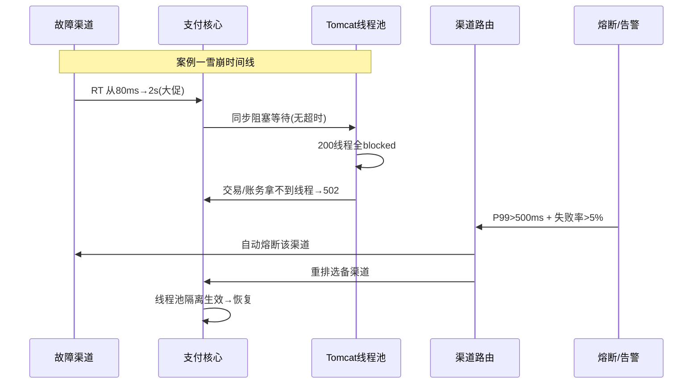

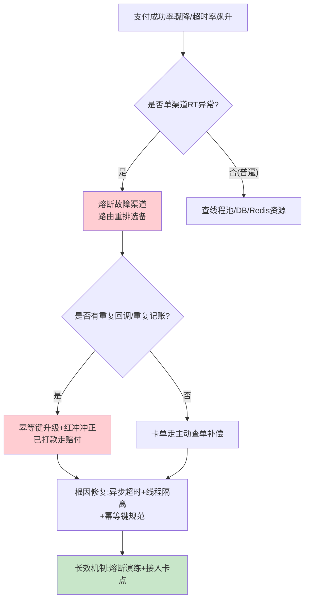

---

## 附录二、【横向对比】技术选型决策

> 这一节从「链路形态」维度做对比——同步 vs 异步、直连 vs 路由，是支付链路设计的两个根本岔路口。

### 对比一：同步链路 vs 异步链路

| 维度 | 同步链路（请求-应答） | 异步链路（回调 + 主动查单） |
| --- | --- | --- |
| **用户体验** | 发起即等结果，体验好 | 先「处理中」，结果稍后到 |
| **资源占用** | 长期占线程，易雪崩 | 线程快速释放，削峰友好 |
| **可靠性** | 依赖下游实时可用 | 回调 + 查单双保险，不丢 |
| **适用** | 余额/内部账户即时扣减 | 涉及渠道/银行的跨境收款 |
| **代价** | 下游慢直接拖死上游 | 状态机 + 幂等 + 对账复杂度高 |

**Trade-off 结论**：XTransfer 对「渠道侧」一律异步（渠道回调不可控、不可阻塞），对「内部账务」即时复式记账（同库强一致、毫秒级）。**不是选哪个，是按链路位置选**——这也呼应正文 1.1「每层选不同答案」。

### 对比二：直连渠道 vs 渠道路由

| 维度 | 直连（写死某渠道） | 渠道路由（多因子打分） |
| --- | --- | --- |
| **接入成本** | 低，单渠道好写 | 高，需路由+健康度+熔断 |
| **可用性** | 渠道挂=支付挂 | 主备自动切换，无感 |
| **成本优化** | 无 | 费率/成功率加权优化 |
| **扩展性** | 每加渠道改代码 | SPI 化，配置接入 |
| **代价** | 单点风险 | 路由自身需高可用+降级 |

**Trade-off 结论**：直连只在 PoC/单渠道早期用；生产必须用路由，且路由层自身要能降级（返回默认渠道+告警），不能成支付链路单点。

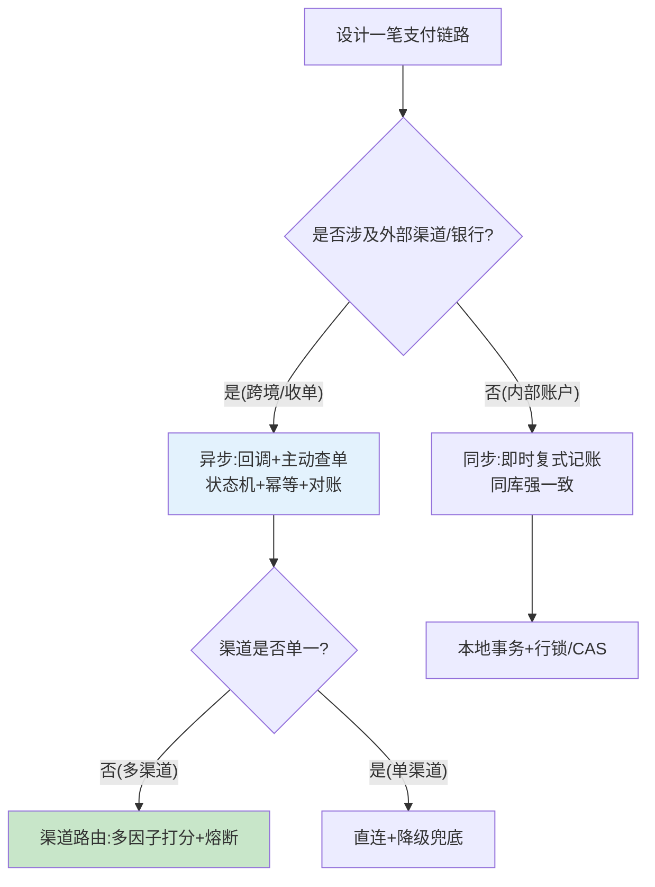

---

## 附录三、【量化指标】SLA 设计与成本收益

> 把「全链路 P99 < 300ms」「各节点容量配比」落到可测量的 SLI/SLA，并给出容量分摊示例。

### 3.1 全链路 P99 目标拆分

以「用户发起收款 → 渠道受理 → 回调入账」为例，P99 预算 300ms（不含渠道侧），分摊到各节点：

| 节点 | P99 预算 | 说明 |
| --- | --- | --- |
| API 网关（鉴权/限流） | 15ms | 本地计算，无远程 |
| 交易系统（建单） | 25ms | 本地事务 |
| 渠道路由（打分） | 20ms | 内存 + Redis 健康度 |
| 渠道调用（同步部分） | 0ms | **异步化，不计入用户路径** |
| 回调入账（验签+状态机+CAS） | 40ms | 单库写 |
| 记账（Outbox 发消息） | 30ms | 同事务写 |
| MQ 投递 + 账务消费 | 不在用户路径 | 异步，P99 单独 < 100ms |
| **合计（用户感知路径）** | **≤ 130ms** | 留 170ms 余量给网络/GC |

### 3.2 各节点容量配比

```
用户路径峰值 5k TPS，设计 3 倍冗余 = 15k TPS
  API网关:    无状态, 4实例(每实例 4k TPS)
  交易系统:   建单写主库, 单分片<500/s, 按商户16分片
  渠道路由:   纯内存+Redis, 8实例(轻)
  支付核心:   状态机CAS写, 4实例(每实例5000 TPS@40ms,200线程)
  账务消费:   MQ消费端, 8实例(削峰余量)
  对账批处理: 离线, 不占在线容量, 独立资源池
原则: 越靠"资金写"的节点, 冗余越高(资金正确性>性能); 越靠"查询"越可弹性
```

### 3.3 成本收益测算（引入路由 + 异步化）

| 维度 | 改造前（直连同步） | 改造后（路由 + 异步） | 收益 |
| --- | --- | --- | --- |
| 渠道故障导致的支付不可用 | 年 4 次 × 平均 20min | 0 次（自动熔断切换） | 可用性 99.9% → 99.99% |
| 渠道成本（费率加权） | 基准 100% | ~92% | **成本 -8%** |
| 峰值线程占用 | 常满（同步阻塞） | 平稳（异步释放） | 实例数 -30% |
| 重复入账类资损 | 偶发 | 0（幂等键规范） | 0 资损 |

### 3.4 告警阈值建议

```
P0: 支付成功率 < 95%; 资损告警任意一笔; 主库主从延迟 > 30s
P1: 渠道可用率 < 95%; 非终态卡单超阈值; 对账差异 > 0
P2: 支付成功率 < 98%; 错误率 > 1%; 路由切换次数突增
P3: 用户路径 P99 > 300ms; MQ 消费积压 > 1w
```

---

## 附录四、【答题框架】面试表达模板

> 目标：45 分钟白板，把一笔支付从用户到商户「画全、讲顺、标出每道交接的幂等键与状态机」。

### 4.1 分层回答套路

> **一句话定调**：「支付不是调一个渠道 API，而是分层、靠流水串联的体系；我按交易/支付/清结算/账务/对账/资金六层来讲，重点讲我负责的支付层——状态机 + 幂等 + Outbox。」
>
> **核心原理**：层间靠幂等键 + 状态机解耦；渠道异步回调 + 主动查单双保险；记账走 Outbox 不丢；对账兜底最终一致。
>
> **项目落地**：XTransfer 100+ 渠道 VA 开户，路由打分 = 成本 + 实时成功率 + 合规权重；回调 = 验签→幂等→状态机 CAS→发事件。
>
> **边界与权衡**：分层带来异步与事件，需要额外幂等/补偿/对账补齐一致性，但这是资金系统该付的代价；对账是事后兜底，资损已发生，所以事前/事中更关键。

### 4.2 STAR 叙事模板（针对追问：「讲讲一笔钱从点击到到账」）

| STAR | 内容要点 |
| --- | --- |
| **S** | 商户发起跨境收款，涉及 6 层、多个微服务，渠道异步不可控。 |
| **T** | 设计一条「不丢、不重、可对账」的链路，且高可用。 |
| **A** | 交易层建单（幂等 out_trade_no）→ 路由选渠道 → 发起扣款 → 异步回调（验签+幂等+状态机 CAS）→ Outbox 发记账消息 → 复式记账 → T+1 清算结算 → 对账勾兑。 |
| **R** | 0 资损、成功率 99.9%+；每道交接都有幂等键 + 状态作为契约。 |

### 4.3 白板表达结构（先画什么、再讲什么）

```
1) 先画「六层总览图」(交易→支付→清结算→账务→对账→资金) —— 立全局
2) 画「一笔跨境收款时序图」—— 标异步回调 + 主动查单双路径
3) 在支付层放大: 状态机状态图 + CAS 更新 SQL —— 讲资金第一道闸
4) 画 Outbox 时序 —— 讲"账务挂了不丢账"
5) 最后画「层故障影响」图 —— 讲故障域隔离
```
> 口诀：**先全链路后单点，先状态机后补偿，先不丢不重后对账**。别一上来画渠道调用图。

### 4.4 逃生话术

- **被问到具体渠道协议细节（如 SWIFT MT103 字段）**：「具体报文字段我依赖渠道适配器封装，核心层不关心；我能讲清适配器如何把协议差异外置成配置——这正是我们 100+ 渠道零改核心的原因。」
- **被问到没做过的「支付编排引擎（如 Temporal）」**：「编排引擎我们评估过，长流程用状态机+任务补偿已满足且更贴合审计；Temporal 类工作流引擎可视化好但性能开销大，是我们 3.0 的观察项，这点我如实说。」
- **被问到指标**：「成功率/资损/容量我都带口径，P99 拆分表和容量配比可以现场写。」

<!-- EXPANDED -->

---

## 延伸阅读（多博主视角 · 系统化补充）

为把支付体系讲"系统全面"，新增了多位支付博主视角的专项文档，建议配套阅读：

- [支付系统架构与核心链路全景](/post/准备-支付系统架构与核心链路全景) — 凤凰牌老熊三层 / 腾讯云五层 / paytech 9+6 / 业务全景十二字
- [支付渠道路由设计](/post/准备-支付渠道路由设计) — 隐墨星辰：路由形态、规则引擎、自动化开关、智能路由
- [支付对账体系与差错处理](/post/准备-支付对账体系与差错处理) — 隐墨星辰三层对账、长短款、差错处理
- [支付风控与反欺诈体系](/post/准备-支付风控与反欺诈体系) — 风控三道防线、规则引擎 + 模型双轨
- [账务账户体系与复式记账](/post/准备-账务账户体系与复式记账) · [清结算体系](/post/准备-清结算体系) · [分布式事务与一致性](/post/准备-分布式事务与一致性)
