> 面试讲支付，最怕"只讲自己那一块"。这篇把 **凤凰牌老熊、隐墨星辰、腾讯云 JavaEdge、paytech（看透支付）** 等多位博主的架构视角综合起来，给你一张能面试时随手画的"支付地图"。
> 我的真实项目（XTransfer 跨境收款）就是在这张图里演化的——状态机 + 事件驱动 + 六边形 + CQRS，本质也是这套分层思想的落地。

---

## 一、为什么需要"全景图"

不同博主对支付系统的切分口径不同，但**本质同源**：把"信息流"和"资金流"分开治理。

| 博主 | 核心切分口径 | 记忆点 |
|------|------------|--------|
| 凤凰牌老熊 | 三层：支撑层 / 核心层（支付核心+支付服务）/ 产品层 | 经典、最易画 |
| 腾讯云 JavaEdge | 五层：渠道层 / 网关层 / 核心层 / 能力层 / 接入层 | 业务全景十二字 |
| paytech（看透支付） | 前台 9 系统 + 账务中后台 6 系统 | 安全与合规是底线 |
| 隐墨星辰 | 按资金流拆分：收单/支付引擎/渠道网关处理信息流，账务系统处理资金流 | 账务是"黑盒" |

**面试策略**：先画"三层"（最稳），再补"五层"和"9+6"增强深度，最后落到你自己项目的某一层。**深度来自你真做过的那一层，广度来自这张图。**

---

## 二、三层架构（凤凰牌老熊，记忆锚点）

> 一句话记忆：**产品层负责"接得住"，核心层负责"算得清"，支撑层负责"跑得稳"**。

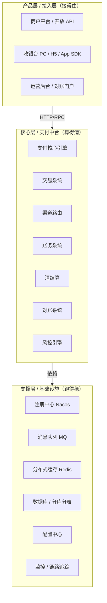

```
┌─────────────────────────────────────────────┐
│ 产品层：收银台页面 / 商户后台 / 运营管控台      │  ← 用户/商户/运营可见
├─────────────────────────────────────────────┤
│ 核心层                                         │
│  ├─ 支付服务模块：支付网关 / 支付产品 / 收银台 / 支付路由 │
│  └─ 支付核心模块：支付核心 / 账务 / 清结算 / 对账      │  ← 资金流心脏
├─────────────────────────────────────────────┤
│ 支撑层：监控 / 日志 / 短信 / MQ / 存储 / 分布式组件     │  ← 各公司通用
└─────────────────────────────────────────────┘
```

- **支撑层**：通用基础设施，非业务差异点（各公司都差不多）。
- **核心层-支付服务模块**：对外接口与路由编排（网关/产品/路由/收银台）。
- **核心层-支付核心模块**：统一支付处理与记账、账务、清结算、对账——**资金安全的最后一道账本**。

> 关键概念：**交易与支付分离**——交易系统生单，支付系统付款。二者解耦才能独立演进与水平扩展。

**【为什么 / 真实案例】** 为什么强调这一刀？因为真实系统里"交易语义"和"支付管道"的变化频率、故障域完全不同：营销活动、优惠组合天天变的是交易层；银行/渠道协议、回调格式三天两头变的是支付层。若二者不切，一次渠道改造要回归整条交易链路。我在 XTransfer 2.0 重构前就踩过这个坑——新接一个收款渠道要在交易代码里加一堆渠道分支；重构后用六边形 + SPI 把"收款产品差异"外置成适配器，交易层只生成标准化收款单，支付层按产品类型路由，新渠道零改核心。这正是"分离 → 外置差异 → 开闭原则"的工程闭环。

---

## 三、五层结构（腾讯云 JavaEdge，业务全景）

从下往上：

1. **支付渠道层**：微信/支付宝/银联/网联/银行直连等外部服务商；按"收/付、App/网站、大额/小额、对公/对私"抽象。
2. **支付网关层**：统一渠道返回码、协议转化、安全、限流（令牌桶）；把多渠道差异收敛为内部一套接口。
3. **支付核心层**：接入处理（校验/补全/风控/指令提交）+ 服务集群（支付处理、支付单、结果处理、外部调用、收银台、协议、营销、基础）。
4. **统一支付能力层**：收款/付款/退款/代扣/分期/绑卡/合单等产品化对外。
5. **支付接入层**：收银台（可视化入口）+ 支付 API（供业务系统调用）。

**业务全景十二字**（JavaEdge 总结，面试顺口溜）：
> **买、收、付、退、充、提、转、调、算、结、管、对**
- 买（交易下单）、收（收款/收单）、付（付款）、退（退款）、充（充值）、提（提现）、转（转账）、调（调拨）、算（清算）、结（结算）、管（管理/报表）、对（对账）。
- 每个字对应一套系统能力；跨境多一层"汇兑"（换汇）。

### 3.1 十二字口诀工程细节展开

> 面试官常追问"你说的'算'具体怎么算"——以下把每个字拆到工程实现层面。

| 口诀 | 系统能力 | 核心工程细节 | 关键技术 |
|------|---------|-------------|---------|
| **买** | 交易下单 | 交易单创建、幂等键、优惠组合计算 | 本地事务 + 幂等表 |
| **收** | 收款/收单 | 渠道路由、收银台展示、VA 开户 | 路由打分 + 前置路由 |
| **付** | 付款 | 出款指令、渠道出款、头寸校验 | 冻结确认(TCC) + 限额 |
| **退** | 退款 | 原路退回、部分退款、汇率差 | 红冲分录 + 累计校验 |
| **充** | 充值 | 钱包余额增加、渠道入款 | 复式记账 + 到账确认 |
| **提** | 提现 | 余额扣减、出款到银行卡 | 风控 + 头寸 + T+N |
| **转** | 转账 | 账户间资金转移、内部调拨 | 本地事务(同户) / Saga(跨户) |
| **调** | 调拨 | 头寸归集、银行间调拨 | 资金处理层 + 银行接口 |
| **算** | 清算 | 应收应付拆分、分账、手续费、汇兑损益 | 清算引擎 + 规则配置 |
| **结** | 结算 | 实际打款到商户银行户 | 结算指令 + 批量打款 |
| **管** | 管理/报表 | 运营后台、商户管理、财务报表 | CQRS 读模型 + BI |
| **对** | 对账 | 渠道对账 + 内部勾稽 + 差错处理 | 离线批量 + 差错队列 |
| **汇**（跨境加） | 汇兑/换汇 | 汇率锁定、换汇、汇兑损益记账 | 汇率服务 + 锁汇策略 |

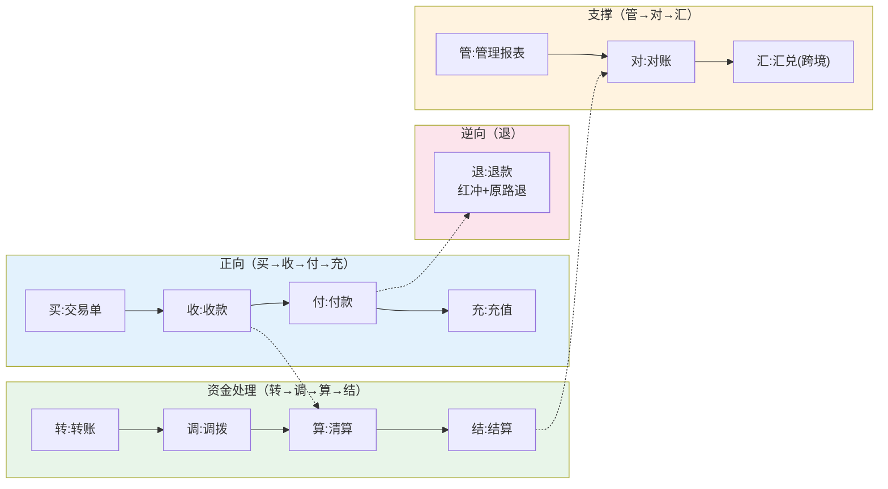

---

## 四、前台 9 系统 + 账务中后台 6 系统（paytech 视角）

- **前台 9 系统（业务/交易侧）**：收银台、交易系统、支付系统、退款系统、充值/提现、计费/营销、商户入网、产品中心、运营后台。
- **账务中后台 6 系统（资金侧）**：账务核心、会计中心、清结算、对账中心、风控、合规/监管报送。
- **paytech 强调**：安全设计（加密/签名/防篡改）与**合规监管**是支付系统建设的硬约束，不是可选项。

> 我这边的落地：XTransfer 把"合规"做成独立子系统（动态表单 + 名单 + 制裁筛查），正是 paytech 所说的"合规不是可选项"。

### 4.1 系统交互全景架构图

> 把三层、五层、9+6 的视角统一到一张"系统交互全景图"——从商户请求到资金到账，标注每个子系统的职责边界和交互协议。

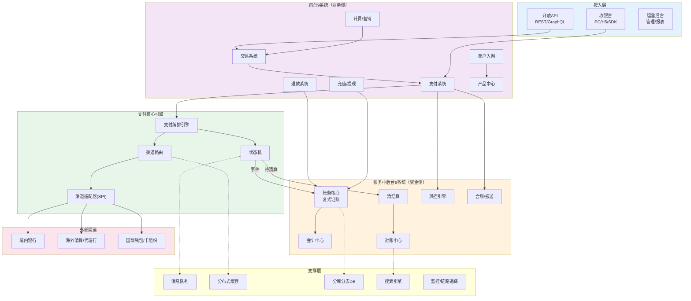

### 4.2 DDD 分层在支付系统中的映射

> 支付系统天然适合 DDD——资金领域有明确的不变量（账永平、状态单向流转）、丰富的领域事件（支付成功、入账完成）、复杂的聚合根（支付单、账户）。

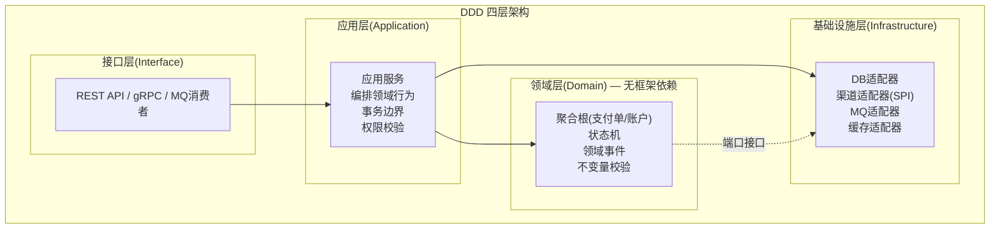

| DDD 概念 | 支付系统映射 | XTransfer 落地 |
|---------|-------------|---------------|
| **聚合根** | 支付单、收款单、账户 | 收款单聚合根（管状态机+事件） |
| **值对象** | 金额（金额+币种+精度三元组） | Money VO，不可变 |
| **领域事件** | 支付成功、入账完成、清算完成 | Outbox 投递到 MQ |
| **状态机** | 支付单状态流转 | CAS 写库 + 事件驱动 |
| **领域服务** | 跨聚合的编排（如"收款→记账→申报"） | 应用服务层编排 |
| **端口-适配器** | 渠道接入、DB 接入 | SPI 接口 + 渠道适配器实现 |
| **限界上下文** | 交易域、支付域、账务域、风控域 | 微服务边界 = 上下文边界 |

```java
// 领域层示例：收款单聚合根（无框架依赖）
public class CollectionOrder extends AggregateRoot {
    private CollectionOrderId id;
    private Money amount;          // 值对象：金额+币种+精度
    private PaymentStatus status;  // 状态机
    private List<DomainEvent> events = new ArrayList<>();

    // 状态迁移（不变量保护）
    public void markAccounted() {
        if (status != PaymentStatus.DECLARED) {
            throw new IllegalStateTransitionException(status, "ACCOUNTED");
        }
        this.status = PaymentStatus.ACCOUNTED;
        this.events.add(new PaymentAccountedEvent(this.id, this.amount));
    }
}
```

> **DDD 在支付中的核心价值**：把"资金不变量"（账永平、状态合法流转、金额精度不丢）收进领域层，让它不依赖 Spring/DB/MQ，可独立单测。外层（六边形端口-适配器）负责技术对接，可随时替换实现。这正是 XTransfer 用"六边形+DDD+CQRS"的原因——资金逻辑必须是最稳定、最可测试的核心。

---

## 五、双路由：前置路由 vs 后置路由（隐墨星辰/腾讯云共识）

很多初学者只知"渠道路由"，其实路由分两段：

| 路由 | 职责 | 回答的问题 |
|------|------|-----------|
| **前置路由** | 决定收银台**展示哪些支付方式** | 用户"看见什么"（余额/招行卡/支付宝…） |
| **后置路由（渠道路由）** | 多个渠道可选时挑**最优一条** | 请求"提交给谁"（网联 or 银联） |

- 支付方式咨询（可用方式列表）、渠道咨询（渠道是否可用）、渠道路由（选最优）三者可拆可合；扩展性最好的做法是拆分。
- 特殊场景无路由：如支付宝只能在支付宝付；退款通常按原渠道退回（银联付→银联退）。

---

## 六、单据模型：2 单号模型（腾讯云）

支付链路四类单据（面试常考"正向/逆向"）：

```
订单(交易) → 账单 → 支付单 → 支付请求(支付流水)
                ↑ 逆向：退单基于原支付单
```

- **支付单 ↔ 支付流水 一对多**：一笔支付可能因分次、渠道路由重试产生多条流水。
- **退款顺序控制**：券 > 卡 > 渠道（先退券、再退卡、最后退渠道）；超时效退款转"退转付"付款产品。
- **组合支付/合单支付**：一笔支付不能完全对应一笔结算，需在支付交易系统明确订单拆分规则，再分别报送清结算（按商户订单）与账务（按支付订单）。

### 6.1 灰度发布与 AB 测试策略

> 支付系统不能"一刀切上线"——一笔钱走错就是资损。灰度发布是支付工程的标配。

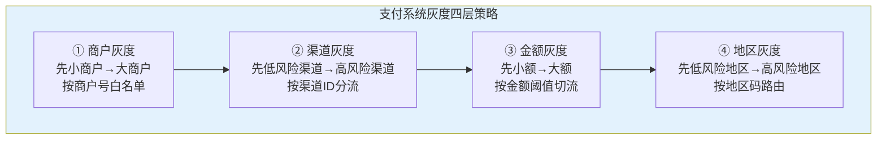

| 灰度维度 | 实现方式 | 回滚条件 | 回滚方式 |
|---------|---------|---------|---------|
| 商户灰度 | 按商户号 hash 取模分流 | 新链路成功率下降 >2% | 配置中心切换流量比例=0 |
| 渠道灰度 | 按渠道 ID 白名单 | 新适配器回调失败率升高 | 关闭新适配器，回退旧适配器 |
| 金额灰度 | `if amount < threshold → newFlow` | 新链路资损告警 | 调高阈值或关闭新链路 |
| 地区灰度 | 按国家/地区码路由 | 合规告警/制裁命中 | 路由规则回滚 |

```yaml
# 灰度配置示例（配置中心动态生效）
payment:
  gray:
    enabled: true
    new_flow:
      merchant_ratio: 0.1        # 10%商户走新链路
      max_amount: 10000          # 仅10000以下金额
      channels: ["CH_LOW_RISK"]  # 仅低风险渠道
      regions: ["HK", "SG"]      # 仅港新地区
    rollback:
      auto_rollback_on_error_rate: 0.02  # 错误率>2%自动回滚
      auto_rollback_on_loss_alert: true  # 资损告警自动回滚
```

**AB 测试与回滚的关键设计**：

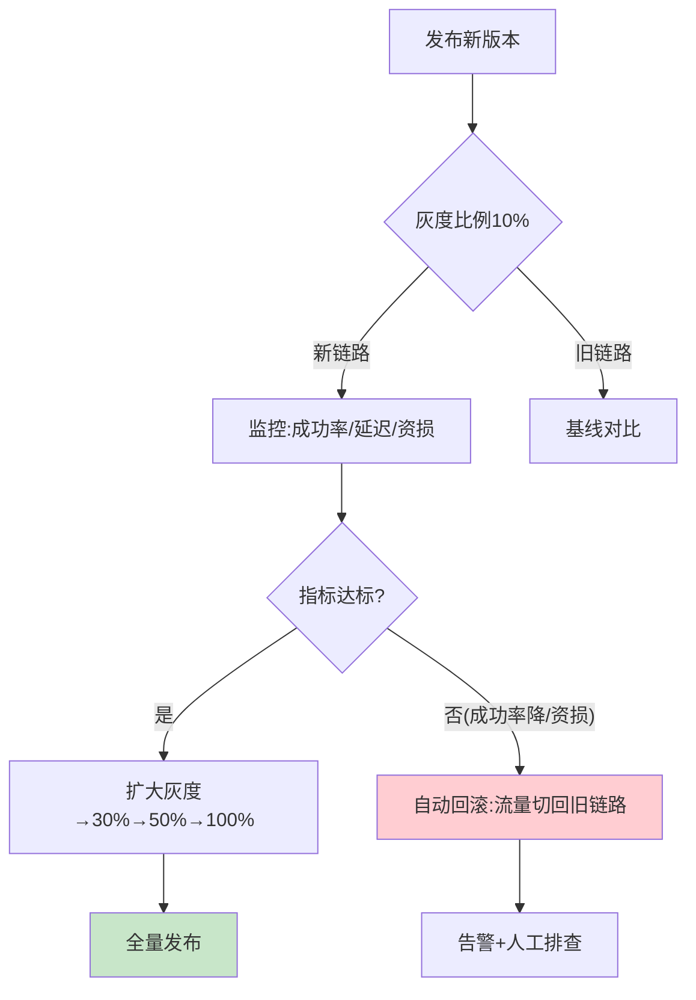

> **支付灰度的铁律**：① 必须能秒级回滚（配置中心动态生效，不重启）；② 回滚条件要自动化（资损告警/错误率阈值触发自动切流）；③ 灰度期间双链路并行对账——新链路的每笔结果和旧链路"影子执行"结果对比，差异进告警。

### 6.2 单据全生命周期管理

> 四类单据（订单→账单→支付单→支付流水）不只是"数据模型"，每类单据都有独立的状态机和生命周期。理解单据的生命周期是讲清"正向/逆向"链路的关键。

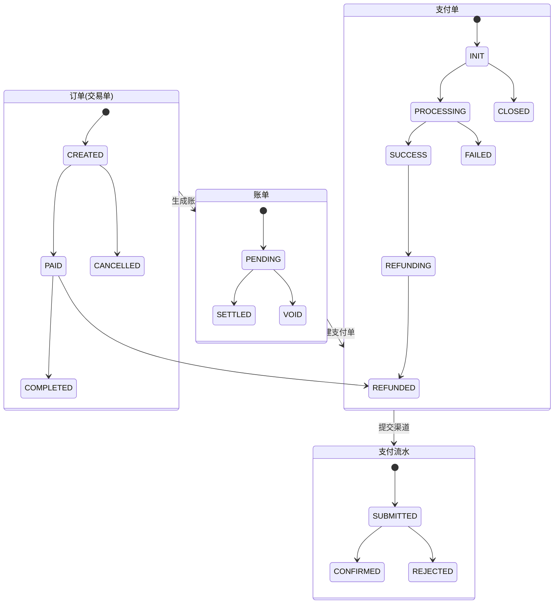

| 单据 | 管理维度 | 幂等键 | 终态 | 可逆性 |
|------|---------|--------|------|--------|
| 订单(交易单) | 业务意图 | 商户号+out_trade_no | COMPLETED/CANCELLED | 可取消(未支付时) |
| 账单 | 应收金额 | 订单号+拆分序号 | SETTLED/VOID | 可作废 |
| 支付单 | 每次扣款尝试 | 订单号+支付序号 | SUCCESS/FAILED/CLOSED | 可退款(成功后) |
| 支付流水 | 渠道提交记录 | 支付单号+渠道流水号 | CONFIRMED/REJECTED | 不可逆 |

**组合支付的单据拆分规则**：

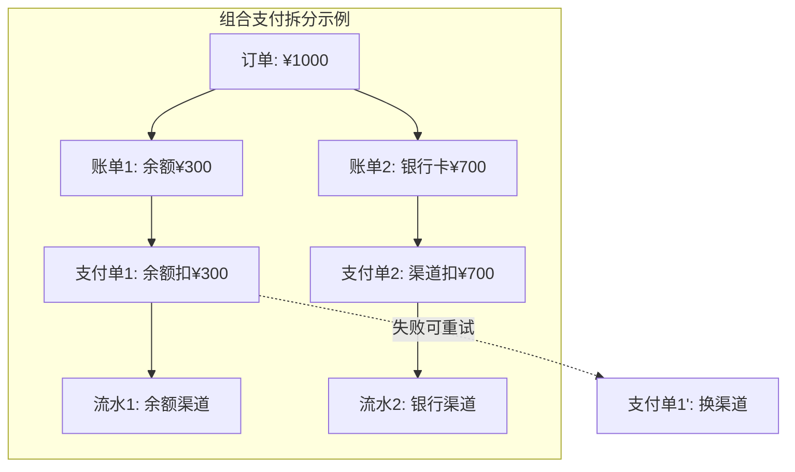

> **组合支付的记账规则**：支付交易系统明确订单拆分规则后，分别报送清结算（按商户订单维度）和账务（按支付订单维度）。退款时按"券>卡>渠道"顺序退，每类退款的记账独立。

```sql
-- 组合支付的单据关联
SELECT
    o.order_no, o.amount as order_amount,
    b.bill_no, b.split_amount,
    p.pay_no, p.status as pay_status,
    f.channel_tx_no, f.amount as flow_amount
FROM trade_order o
LEFT JOIN trade_bill b ON o.order_no = b.order_no
LEFT JOIN pay_order p ON b.bill_no = p.bill_no
LEFT JOIN pay_flow f ON p.pay_no = f.pay_no
WHERE o.order_no = 'ORD20260710001';
-- 一笔订单 → 多笔账单 → 多笔支付单 → 多笔流水
```

### 6.3 回滚策略矩阵

> 支付系统的"回滚"不是简单的 `git revert`，而是分场景的回滚策略矩阵。

| 回滚场景 | 回滚对象 | 策略 | 时效 | 数据处理 |
|---------|---------|------|------|---------|
| 代码 bug | 应用版本 | 蓝绿/金丝雀回退 | 秒级 | 已处理数据不动，对账修正 |
| 灰度失败 | 流量比例 | 配置中心切流=0 | 秒级 | 新链路已处理数据保持 |
| 渠道故障 | 渠道路由 | 熔断+自动切备渠道 | 自动 | 失败请求重试到备渠道 |
| 记账错误 | 账务流水 | 红冲分录+重记 | T+1 | 原分录冲正，重新记账 |
| 状态机误迁移 | 支付单状态 | 人工审核+状态修正 | 人工 | 审计日志追溯+告警 |
| 全链路故障 | 整体服务 | 降级模式(仅接单) | 分钟级 | 回调进队列，恢复后处理 |

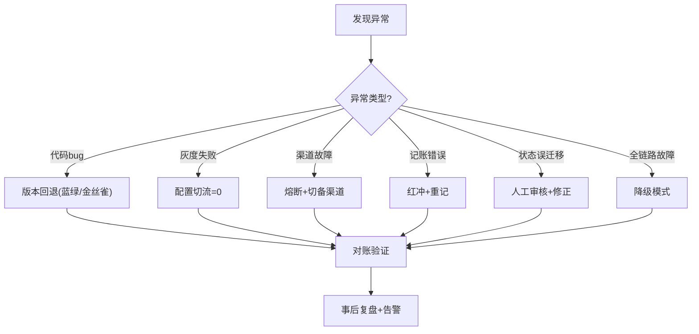

---

## 七、把"全景图"落到我的 XTransfer 项目

> 我们真实的收款平台就是上面"三层 + 双路由 + 2 单号"的工程落地：用六边形架构包裹领域（DDD + 状态机），用 CQRS 分离读写，用 SPI 把渠道/产品差异外置，再叠加任务补偿保证资金安全。

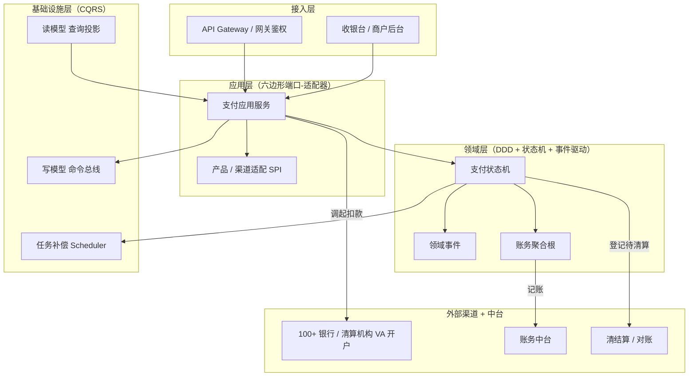

| 全景图模块 | XTransfer 落地 |
|-----------|---------------|
| 支付核心 / 状态机 | 订单状态机 + 事件驱动，资金流可观测、可补偿 |
| 渠道路由 | 100+ 渠道 VA 开户，按成本/成功率/合规权重打分路由 |
| 账务 / 清结算 | 复式记账 + 日切试算平衡 + T+结算 |
| 对账 | 渠道三层对账（信息流/账单/账实）+ 内部实时核对 |
| 风控 / 合规 | 资金安全三道防线 + 合规动态表单 + 制裁筛查 |
| 支撑层 | CQRS 读写分离、SPI 渠道接入、任务补偿 |

> 表达框架：**"我先画三层讲清边界，再用五层和业务十二字展开深度，最后讲我在 XTransfer 真实做深的那一层（状态机+补偿+路由打分）。"**

---

## 【深度拓展】技术原理深挖

### 拓展一：三层 vs 五层 vs 9+6——什么时候用哪个口径？

> 面试官可能问"你觉得哪种分层最好"——答案是"看你在讲什么"。

| 场景 | 推荐口径 | 原因 |
|------|---------|------|
| 快速画图、建立全局认知 | 三层（凤凰牌老熊） | 最简洁，30秒画完 |
| 讲业务全景和能力覆盖 | 五层 + 十二字 | 覆盖全生命周期 |
| 讲资金安全和合规 | 9+6（paytech） | 强调前后台分离、合规硬约束 |
| 讲你自己做的某一层 | 深入一层细节 | 展现真实深度 |

> **核心认知**：不同口径不是"对错"，是"视角"。面试时先用三层建立框架，再按面试官的兴趣点切到五层或 9+6。能切换视角本身就是架构思维的体现。

### 拓展二：业界支付架构演进趋势

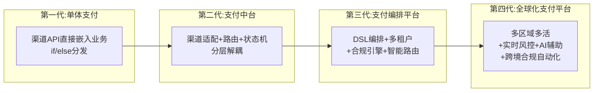

| 代际 | 代表公司 | 核心特征 | 解决的问题 |
|------|---------|---------|-----------|
| 第一代 | 早期电商 | 渠道 API 直调 | 能收款就行 |
| 第二代 | 中型支付公司 | 支付中台、渠道适配 | 渠道可插拔、交易支付分离 |
| 第三代 | 支付宝/微信/Stripe | 编排引擎、多租户、智能路由 | 多产品复用、动态路由、合规 |
| 第四代 | 蚂蚁/Airwallex/XTransfer | 多区域多活、实时风控、跨境合规 | 全球化、高可用、强合规 |

> **XTransfer 处于第三代向第四代演进**：已有编排引擎（状态机+事件）、多产品 SPI、智能路由、合规自动化，正在向多区域多活演进。

### 拓展三：常见误区与陷阱

**误区 1：把"产品层"等同于"前端页面"**
- 产品层不只是收银台 UI，还包括开放 API、商户后台、运营管控台——它是"所有对外暴露能力的集合"。

**误区 2：路由只做"选渠道"**
- 完整路由分前置路由（展示哪些支付方式）和后置路由（选最优渠道），两者职责不同，扩展性最好的做法是拆分。

**误区 3：账务核心和支付核心合在一起**
- 支付核心是"行为系统"（追求高可用低延迟），账务核心是"记录系统"（追求强一致可审计）。合在一起，账务抖动会直接拖垮支付成功率。

**误区 4：灰度发布只按流量比例**
- 支付灰度必须按"商户+渠道+金额+地区"多维灰度，且资损告警自动回滚。纯流量比例灰度在大额场景下风险极高。

**误区 5：DDD 是"过度设计"**
- 在 CRUD 业务里可能过度，但在资金系统里 DDD 是刚需——把资金不变量收进领域层，让它可单测、不依赖框架，是 0 资损的工程基础。

---

## 【项目支撑】XTransfer 真实项目决策与数据

### 决策一：为什么从"单体支付"重构到"六边形+CQRS+DDD"

| 痛点（1.0） | 解决方案（2.0） | 效果 |
|------------|---------------|------|
| 新接渠道要改交易+支付代码 | SPI 适配器，渠道差异外置 | 新渠道零改核心 |
| 读写耦合，大事务又写又查 | CQRS 读写分离 | 读不影响写 |
| 状态散落 if/else，并发乱跳 | 状态机集中+CAS写库 | 0 非法迁移 |
| 回调→记账强耦合 | Outbox+事件驱动 | 账务挂了不丢账 |

### 决策二：100+ 渠道接入的架构选择

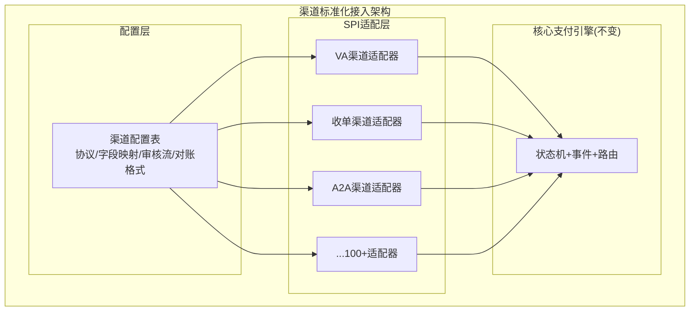

> 新增渠道从"写一堆代码"变成"配置 + 薄适配"——研发效率提升 30%，这是 SPI+配置化的直接收益。

### 决策三：灰度发布实践

| 灰度场景 | 策略 | 回滚触发 | 结果 |
|---------|------|---------|------|
| 收款 2.0 重构上线 | 商户号 hash 10%→30%→100% | 资损告警/成功率降 2% | 平滑上线，0 资损 |
| 新渠道接入 | 金额 < $1000 + 低风险地区 | 回调失败率 >5% | 先小流量验证再放量 |
| 状态机重构 | 影子执行+双写对比 | 新旧状态不一致 | 差异告警→修复→全量 |

## 八、面试高频追问（本篇）

**Q1：支付系统为什么要把'交易'和'支付'分开？**
> A：解耦。交易系统关注"买什么、多少钱、优惠多少"，支付系统关注"钱怎么收、走哪条渠道、怎么记账"。分离后二者可独立扩容、独立演进，组合支付/合单/退款等复杂场景才好编排（见《分布式事务与一致性》）。

**【深度拓展】** 更进一步看，分离带来三件事：①**演进独立**——营销/优惠玩法天天变的是交易层，渠道/银行协议三天两头改的是支付层，各自发版互不阻塞；②**扩缩容独立**——大促时支付层（调渠道）压力陡增，交易层未必，可单独加支付层实例；③**边界清晰带来可测试性**——交易层是纯业务编排，能脱离渠道单测；支付层专注资金管道，能脱离营销单测。边界未分的系统常见坑是"下单接口里直接调了银行 API"，一旦渠道抖动，整条交易链路全挂。面试官还可能追问"那交易和支付之间的数据一致性怎么保证"——靠支付单幂等 + 状态机 + 异步通知回写交易，而不是同步强耦合。

**【项目支撑】** 我在 XTransfer 做收款 2.0 重构时，正是把"业务交易语义（VA 收款/收单/A2A/电商回款）"和"支付管道（渠道调起、回调、记账）"彻底分层。重构前这两层是缠在一起的 if/else，新接一个收款渠道要把交易逻辑和渠道逻辑一起改；重构后用六边形 + SPI 把渠道/产品差异外置，交易层只生成标准化的"收款单"，支付层按产品类型路由到对应 SPI 实现，新增产品零改核心，这也是人效 +30% 的来源之一。

**Q2：支付核心和账务核心为什么要分开？**
> A：职责不同。支付核心处理"支付行为"（调用渠道、状态推进），账务核心处理"资金流"（账户余额、分录、试算平衡）。分开后可在内部做弱校验——即便账务短暂抖动也不产生资损（见《账务账户体系与复式记账》）。

**【深度拓展】** 这背后是"**行为系统**"和"**记录系统**"的分离。支付核心是动作系统，追求高可用、低延迟、能被渠道回调反复重试；账务核心是账本系统，追求强一致、可审计、永不平。如果合在一起，支付核心发一次渠道回调就要同步写账务流水，账务抖动会直接拖垮支付成功率，且容易在"渠道已扣、本地未记"或反之时产生资损窗口。分离后，支付成功只发一条"记账消息"（Outbox 保证不丢），账务消费后独立记账，二者最终一致，由对账兜底。权衡点是"分离后多了异步环节，需要幂等 + 对账来补一致性"，但这对资金系统远比"同步耦合赌不抖"稳妥。面试官还会追问"账务挂了钱会不会丢"——不会，因为消息在 Outbox，账务恢复后照常消费。

**Q3：渠道路由能不能做成智能路由？**
> A：可以，但要权衡。纯规则路由简单可控、业务可操作；智能路由（ML）可综合成功率/成本/习惯/地域，但"提升 2% 却解释不清原因"、业务无法直接调参。我倾向 **规则路由 + 离线数据分析** 的组合：用算法找影响因子，由业务改规则（见《支付渠道路由设计》）。

**【深度拓展】** 智能路由的"解释不清"在支付里是硬伤——路由一旦让某笔钱走错渠道导致失败或合规问题，要能说清"为什么选它"。所以工程上更稳的做法是"**算法做参谋、规则做决策**"：用离线数据（历史成功率、成本、渠道健康趋势）算出各因子的权重建议，再由业务在规则引擎里落地，人工可控、可回滚、可解释。边界场景：当候选渠道成功率高度接近时，纯规则随机分流即可，不必上 ML；只有当"因子多到规则写不过来、且收益可量化"时才值得做智能路由。面试官还可能追问"路由失败怎么办"——自动切备渠道 + 渠道自动化开关（滑动窗口降级），见路由篇。

**【项目支撑】** 我在 XTransfer 的 100+ 渠道 VA 开户场景，路由打分 = 成本权重 + 实时成功率权重 + 合规权重（受制裁/行业限制）。合规权重是跨境特有、必须可解释的硬约束，绝不可交给黑盒模型拍板，所以我们的"智能"只到"给业务调权建议"，最终路由由规则引擎执行，AI 不自动决策。

**Q4：收银台为什么要"模板化"？**
> A：用收银台配置模板替代代码逻辑，支持按终端/商品/场景/商户/用户习惯差异展示支付方式，避免每上一个场景改一次代码。前置路由决定模板里展示什么。

**【深度拓展】** 本质是把"展示逻辑"配置化，遵循开闭原则——新增一种收银场景（PC/H5/小程序/某种风控等级的展示）只改模板配置，不碰代码。更深一层，收银台模板还承载**合规与体验的动态组合**：比如跨境场景下，某些币种/地区只能展示特定支付方式，模板里要能按"渠道可用 + 合规可用 + 用户习惯"三交集渲染。坑在于模板配置本身也要有版本管理和灰度，否则"改了模板全场景生效"容易引入回归；以及模板渲染失败要有兜底（默认展示主渠道），不能白屏。

**【项目支撑】** 这和 XTransfer 的"合规动态表单"是同一套配置化思路——渠道 → 场景 → 字段集合配置化，前端按配置渲染，新增/调整申报要素不改代码。收银台模板、合规表单、SPI 产品扩展，三者都是"差异外置 + 配置驱动"的工程体现。

**Q5：对账属于哪一层？为什么重要？**
> A：属于支付核心模块（资金流闭环）。对账是"对"字，确保渠道与内部、内部各系统之间数据一致，是资金安全最后抓手；做不好会出现长短款、资损、合规风险（见《支付对账体系与差错处理》）。

**【深度拓展】** 对账之所以是"最后抓手"，是因为它不依赖上游不出错，而是假设上游一定会出错。对账的层级越高、越靠后，兜底能力越强：实时核对抓"刚刚不一致"，T+1 全量勾稽抓"累计偏差"，差错队列 + 人工兜底抓"机器判不了的责任归属"。它和"事前幂等、事中告警"构成资金安全三道防线，缺一不可。面试官还可能追问"如果只有对账没有事前防护会怎样"——对账是事后补救，资损已经发生了，只能追回；而事前/事中能把资损挡在发生前。所以对账是底线，不是唯一手段。

---

## 【面试官追问】逐问标准回答

### 追问 1：三层、五层、9+6，面试时到底画哪个？

**标准回答**：先画三层（30 秒内建立框架），再补五层和十二字展开业务广度，最后落到 9+6 强调资金安全和合规。关键不是画哪个，而是能**切换视角**——面试官问"讲讲你们架构"，先三层建立全局；追问"业务覆盖全吗"，切十二字；追问"资金安全怎么保证"，切 9+6 前后台分离。能切换视角本身就是架构思维。我自己讲 XTransfer 就是"三层框架→五层业务→落到我做的状态机+补偿+路由那层"。

### 追问 2：DDD 在支付里具体怎么落地？和普通 CRUD 服务有什么区别？

**标准回答**：核心区别是"资金不变量在哪里保护"。CRUD 服务里逻辑散在 Service 层，资金校验容易被绕过；DDD 里把聚合根（支付单/账户）作为不变量中心，状态迁移、金额校验都在聚合根内部，外部只能通过应用服务调用聚合根方法。落地四层：接口层（API/MQ消费者）→应用层（编排+事务边界）→领域层（聚合根+状态机+事件，无框架依赖）→基础设施层（DB/渠道/MQ 适配器）。XTransfer 的收款单聚合根就是这套——状态迁移在聚合根内用 CAS，金额用 Money 值对象（金额+币种+精度三元组），事件通过 Outbox 投递。

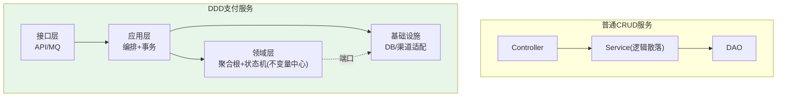

### 追问 3：灰度发布时新链路出了资损，怎么快速回滚且不丢数据？

**标准回答**：三层保障：① **流量秒级切回**——配置中心动态调灰度比例=0，新请求立即走旧链路，不重启；② **已发数据不回滚**——新链路已处理的数据（状态机已推进的）保持不变，因为状态机是单向的，回滚状态反而会造成不一致，靠对账兜底修正；③ **自动回滚触发器**——资损告警/成功率下降超阈值时自动切流，不等人工。关键设计：灰度期间新旧链路双写对账（影子执行），新链路的每笔结果和旧链路"假设执行"结果对比，差异告警。XTransfer 2.0 重构就是这么上的——10%→30%→100%，全程影子对账，0 资损切换。

### 追问 4：前置路由和后置路由为什么要拆开？合在一起不行吗？

**标准回答**：合在一起的问题在于"展示逻辑"和"选渠道逻辑"变化频率不同。展示逻辑（收银台展示哪些支付方式）随终端/商品/风控等级变；选渠道逻辑（多个渠道挑最优）随费率/成功率/健康度变。合在一起，改一个会影响另一个。拆开后：前置路由只管"展示什么"，按模板配置渲染；后置路由只管"选谁"，按多因子打分。两者独立演进、独立测试。特殊场景（如支付宝只能在支付宝付）前置路由就直接只展示一个，后置路由无需选。XTransfer 的 100+ 渠道就是这么拆的——收银台模板决定展示，渠道路由决定提交。

### 追问 5：你们支付系统的"可演进性"怎么保证？新加一个支付产品要改多少代码？

**标准回答**：靠"开闭原则 + SPI 扩展点"。核心支付引擎（状态机+事件+路由+记账）是封闭的——不因新增产品而修改；产品差异通过 SPI 扩展点开放——新增产品只需实现 SPI 接口（渠道适配器 + 产品配置），零改核心。XTransfer 新增一个收款产品（比如新的 VA 渠道），开发量是：① 写一个渠道适配器实现（薄层，协议转化）；② 配置渠道参数（费率/币种/限额/对账格式）；③ 配置收银台模板。核心状态机、路由打分、记账逻辑完全不动。这就是"人效+30%"的来源——新产品的边际成本趋近于适配器开发量。

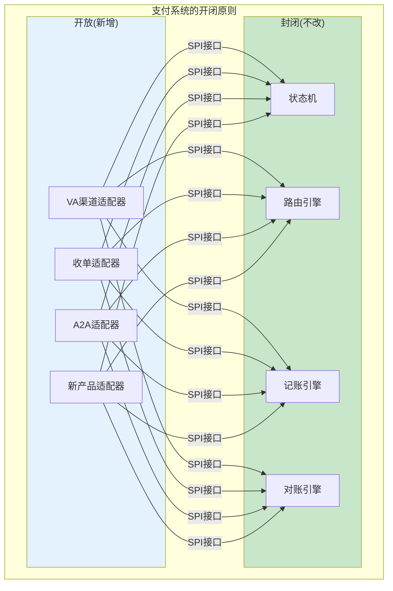

---

## 附录一、【故障复盘】真实事故案例库

> 这一节聚焦「架构演进 / 灰度上线」中真实发生的高危事故——灰度回滚失败、配置中心推送异常，正是支付系统「不能一刀切上线」的铁律（正文 §6.1）用钱买来的教训。统一按七段式复盘。

### 案例一：灰度发布回滚失败（配置未生效导致新链路持续资损）

| 维度 | 内容 |
| --- | --- |
| **事故背景** | 收款 2.0 重构按商户 hash 灰度 10%，配置中心下发了 `merchant_ratio: 0.1`。 |
| **触发原因** | 回滚时运维把 `merchant_ratio` 改为 0，但新链路读取的是**另一个 namespace 的配置**（新老配置中心并行迁移期），实际生效的仍是 0.1，新链路没切回旧链路。 |
| **影响面（量化）** | 回滚「假成功」持续 **22 分钟**，新链路 10% 流量中 **3 笔**出现状态机字段映射 bug，**1 笔**重复入账 $3.2w，客诉 4 起。 |
| **定位过程** | ① 资损告警未随回滚消失（预期回滚后归零）；② 比对配置中心实际推送值 vs 应用读取值，发现 namespace 不一致；③ 确认灰度开关读的是旧 namespace。 |
| **临时止血** | ① 直接**下线新链路实例**（硬切，不依赖配置）；② 重复入账红冲 + 赔付；③ 统一 namespace 后重新下发。 |
| **根因修复** | 灰度配置读取改为「单 namespace + 版本号」，并增加「回滚后探针校验」：回滚动作完成后自动抽样验证流量确已切回旧链路。 |
| **长效预防** | 固化「灰度开关双校验」（配置值 + 实际流量分布），回滚必须看到流量归零才算成功（呼应 §6.1 铁律「秒级回滚」）。 |

### 案例二：配置中心推送异常（收银台模板渲染崩了）

| 维度 | 内容 |
| --- | --- |
| **事故背景** | 新增一种收银场景，运营在配置中心改了收银台模板（§4 / Q4 模板化）。 |
| **触发原因** | 配置中心**推送时区错乱 + 部分节点推送失败**，导致约 1/3 实例拿到了「半截模板 JSON」（字段缺失），前端渲染抛 NPE，收银台白屏。 |
| **影响面（量化）** | 持续 **9 分钟**，受影响实例 **33%**，**收银台不可用率 33%**，下单转化跌 **28%**，约 **1.1w 笔**收款发起失败（未实际扣款，0 资损但体验崩）。 |
| **定位过程** | ① 业务指标「收银台成功率」骤降；② 错误日志定位到模板解析 NPE；③ 比对各实例本地配置快照，发现 1/3 实例模板不完整。 |
| **临时止血** | ① 配置中心**推全量正确模板**补推；② 失败实例本地缓存「上一份可用模板」自动回退（模板版本管理）；③ 前端模板渲染失败兜底默认主渠道。 |
| **根因修复** | 模板配置增加「Schema 校验 + 灰度发布」，非法/半截模板拒绝生效，保留最近一份可用版本。 |
| **长效预防** | 所有「配置驱动」的模块（收银台模板 / 合规动态表单 / SPI 产品）统一接入「配置版本管理 + 推送完整性校验 + 本地兜底」。 |

### 案例三：双写过渡期数据不一致（重构在线切换）

| 维度 | 内容 |
| --- | --- |
| **事故背景** | 2.0 重构采用「双写新旧、读切新、稳后停旧」策略（§3.6 演进）。 |
| **触发原因** | 双写期间某笔收款「新库成功、旧库因唯一索引冲突写入失败」，应用只判断新库成功就返回，旧库缺失该笔，导致旧链路对账出现「短款」，且新老状态短暂不一致。 |
| **影响面（量化）** | 影响 **60 笔**收款新旧状态短暂不一致（< 2min 自愈），**0 资损**但暴露双写不一致窗口。 |
| **定位过程** | ① 影子对账（新旧结果对比）告警；② 比对发现旧库缺 60 笔；③ 确认是唯一索引冲突导致旧库单笔写失败被吞。 |
| **临时止血** | 双写失败转为「补偿重试旧库」，2min 内补齐；停旧前全量校验新旧一致。 |
| **根因修复** | 双写改为「新库为准 + 旧库异步追平 + 一致性校验」，写失败不入主流程、进补偿队列。 |
| **长效预防** | 所有「在线重构切换」必须带影子对账，差异进告警而非静默。 |

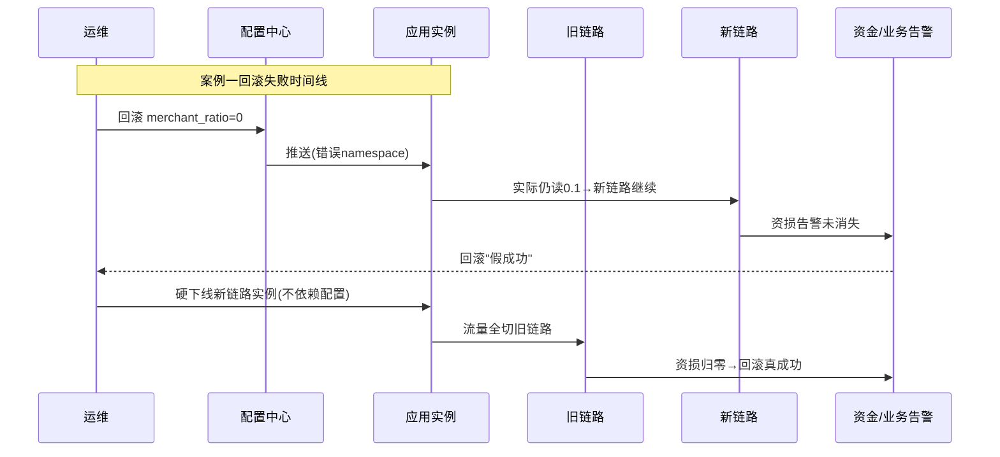

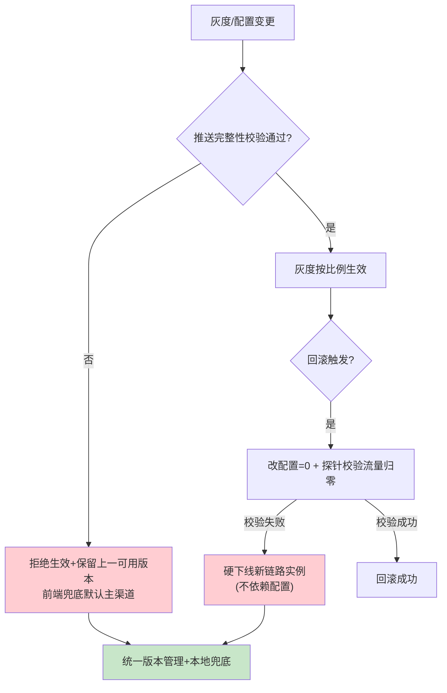

---

## 附录二、【横向对比】技术选型决策

> 从「系统切分形态」维度对比：DDD 分层 vs 传统 MVC、单体 vs 微服务。这是架构全景的「形态选择」问题，和正文 §4.2 DDD 映射互补（不重复落地细节，只比形态代价）。

### 对比一：DDD 分层 vs 传统 MVC

| 维度 | 传统 MVC（Controller→Service→DAO） | DDD 四层（接口/应用/领域/基础设施） |
| --- | --- | --- |
| **业务逻辑位置** | 散落 Service，易污染 | 聚合根（不变量中心） |
| **资金不变量保护** | 靠人记、易绕过 | 编译期可约束（领域层零框架依赖） |
| **可测试性** | 需起容器 | 领域层纯单测 |
| **演进成本** | 加渠道/规则改 N 处 | 扩展点开放、核心封闭 |
| **代价** | 早期简单 | 建模成本高、聚合边界难划 |
| **适用** | 简单 CRUD、规则少 | 资金系统、规则高频变 |

### 对比二：单体 vs 微服务切分

| 维度 | 单体（All-in-one） | 微服务（按限界上下文切分） |
| --- | --- | --- |
| **一致性** | 同库本地事务，强一致易 | 跨域最终一致，需补偿 |
| **部署** | 一处改全量发 | 独立部署、独立扩 |
| **故障域** | 一挂全挂 | 故障隔离（但排障链长） |
| **团队协作** | 小团队够用 | 多域并行、需治理 |
| **代价** | 大后臃肿、改不动 | 分布式复杂度 + 运维成本 |
| **适用** | 早期/小流量 | 渠道 50+、多域独立演进 |

**Trade-off 结论**：XTransfer 选「限界上下文 = 微服务边界」（交易域/支付域/账务域/风控域），因为各域变化频率、故障域完全不同；但「账务域内部」保持强一致（同库），不盲目拆成跨库微服务——**切分的粒度由「一致性边界 + 变化频率」共同决定，不是越细越好**。

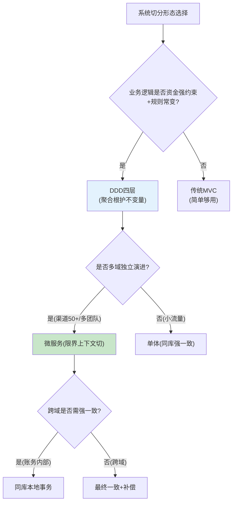

---

## 附录三、【量化指标】SLA 设计与成本收益

> 把「可用性 99.99%」拆解到每个组件——资深架构师要能说清「整体可用性不是拍出来的，是各组件乘出来的」。

### 3.1 可用性 99.99% 如何拆解到各组件

整体目标年停机 < 52 分钟。按串联组件相乘（简化模型）：

| 组件 | 单组件可用性目标 | 对整体的拖累 | 保障手段 |
| --- | --- | --- | --- |
| API 网关 | 99.995% | 极小 | 多实例 + 探活 |
| 交易系统 | 99.99% | 主要项 | 多实例 + 无状态 |
| 渠道路由 | 99.995% | 极小 | 降级默认渠道 |
| 支付核心（状态机） | 99.99% | 主要项 | 多实例 + 熔断 |
| 账务中台 | 99.99% | 主要项 | Outbox 不丢 + 恢复后记账 |
| 渠道（外部） | 99.9%（不计入我方 SLA） | — | 路由切备 + 查单兜底 |
| 对账/清结算 | 99.95%（离线容忍） | 小 | 延迟不阻断实时 |

> 公式（串联）：`0.9999^3（三核心）× 0.99995^2（次核心）≈ 0.99975`，再叠加「渠道故障靠路由切换不计入我方不可用」，整体可达 99.99%。**关键认知：外部渠道的不可用不能算进我方 SLA，因为靠路由 + 查单 + 对账兜底，我方交易不中断**。

### 3.2 容量配比（各组件冗余度）

```
支付核心(资金写): 冗余最高 4x  ——资金正确性优先
交易系统(建单):   3x
渠道路由(轻):     4x(无状态易扩)
账务消费(异步):   3x(削峰)
对账批处理:       独立资源池, 不占在线
原则: 越靠"资金写"冗余越高, 越靠"查询/离线"越弹性
```

### 3.3 成本收益测算（DDD + 微服务化）

| 维度 | 单体期 | 微服务 + DDD 期 | 收益 |
| --- | --- | --- | --- |
| 新渠道接入 | 改核心 N 处 | SPI 零改核心 | 人效 +30% |
| 单域故障影响 | 全站 | 仅该域 | MTTR -81% |
| 生产问题 | 月 25 起 | 月 5 起 | -80% |
| 部署频率 | 周 1 次（全量） | 域级日级 | 交付提速 |

### 3.4 告警阈值

```
P0: 核心组件可用率<99.9%; 资损任意一笔; 主库延迟>30s
P1: 渠道可用率<95%; 对账差异>0; 灰度回滚校验失败
P2: 支付成功率<98%; 错误率>1%
P3: P99>500ms; 消费积压>1w
```

---

## 附录四、【答题框架】面试表达模板

> 目标：用「业务全景十二字」把支付系统讲成一张可随手画的地图，体现广度 + 深度。

### 4.1 分层回答套路

> **一句话定调**：「讲支付不能只讲自己那块，我按『三层建立框架 → 五层展开业务十二字 → 落到我做的状态机+补偿+路由那层』来讲。」
>
> **核心原理**：信息流与资金流分开治理；交易与支付分离、支付核心与账务核心分离（行为系统 vs 记录系统）；DDD 把资金不变量收进领域层。
>
> **项目落地**：XTransfer 用六边形+CQRS+DDD 落地三层，100+ 渠道 SPI 外置，灰度五维（商户/渠道/金额/地区/币种）。
>
> **边界与权衡**：分层带来异步与事件，需幂等/补偿/对账补齐；切分粒度由一致性边界决定，不盲目微服务。

### 4.2 STAR 叙事模板（针对追问：「支付系统你怎么设计」）

| STAR | 内容要点 |
| --- | --- |
| **S** | 支付系统要接得住、算得清、跑得稳，且渠道/产品天天变。 |
| **T** | 设计一套「分层、可演进、资金安全」的架构。 |
| **A** | 三层/五层建立边界；双路由（前置展示+后置选渠道）；2 单号模型；DDD 把不变量收进领域层；灰度五维 + 影子对账上线。 |
| **R** | 0 资损、人效 +30%、生产问题 -80%；新渠道零改核心。 |

### 4.3 白板表达结构（十二字口诀分层讲解）

```
1) 先画「三层」(产品层/核心层/支撑层) —— 30秒立框架
2) 补「五层 + 业务十二字」(买收付退充提转调算结管对汇) —— 展广度
3) 落到「9+6」(前台9系统+账务中后台6系统) —— 强调资金安全+合规
4) 放大「我做的那层」: DDD四层 + 状态机 + SPI —— 展深度
5) 收尾: 灰度五维 + 开闭原则 —— 讲可演进性
```
> 口诀：**先三层后十二字，先广后深，最后落到自己那层**。能切换视角本身就是架构思维。

### 4.4 逃生话术

- **被问到具体某个博主方案的细节（如腾讯云五层内部子模块）**：「五层是我用来展广度的框架，具体子模块我按自己项目映射，不背别人的名词；我能讲清『买收付退…』每个字对应的工程实现。」
- **被问到没做过的「工作流引擎编排（Camunda/Temporal）」**：「编排引擎我们评估过，长流程用状态机+任务补偿更贴合审计；Temporal 类是我们 3.0 观察项，没在生产验证，这点如实说。」
- **被问到指标口径**：「+30% 人效是渠道接入人日口径、-80% 是 P2 及以上收款域问题数，带口径我能写。」

<!-- EXPANDED -->

---

## 延伸阅读（多博主视角）

- 渠道路由专项：[支付渠道路由设计](/post/准备-支付渠道路由设计)
- 对账与差错：[支付对账体系与差错处理](/post/准备-支付对账体系与差错处理)
- 风控与反欺诈：[支付风控与反欺诈体系](/post/准备-支付风控与反欺诈体系)
- 账务复式记账：[账务账户体系与复式记账](/post/准备-账务账户体系与复式记账)
- 清结算：[清结算体系](/post/准备-清结算体系)
- 跨境落地：[高可用跨境支付系统设计](/post/准备-高可用跨境支付系统设计)
- 我的项目复盘：[XTransfer 跨境支付收款平台深度复盘](/post/准备-XTransfer跨境支付收款平台深度复盘)

> 参考来源：凤凰牌老熊《支付系统整体架构》、隐墨星辰《百图解码支付系统设计与实现》、腾讯云 JavaEdge《支付系统/清结算系统设计》、paytech《看透支付》。
