> 支付是后端架构的"终极大关"：**业务不可逆 + 高并发 + 强一致**，一个小 bug 就是资金损失。本文把网络与大厂高频的支付面试题成体系整理，配合《支付系统全链路架构》《账务账户体系与复式记账》《清结算体系》《分布式事务与一致性》一起看。每题给 **标准回答 + 考察点 + 坑**。

**支付面试知识地图**：

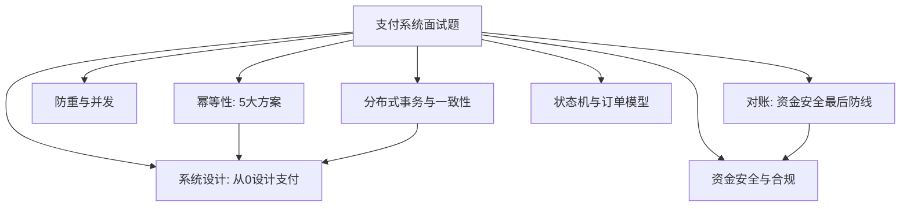

---

## 一、幂等性（支付面试第一考点）

### Q1：支付为什么必然出现重复请求？
- **来源**：用户重复点击、前端超时重试、网关/RPC 自动重试、MQ at-least-once 重复投递、第三方渠道重复回调、对账补单。
- **考察点**：能否穷举来源——说明你真正在生产踩过。

**【深度拓展】** 重复请求的本质是「至少一次投递 + 不可靠网络 + 前端不可信」。很多人只想到用户手抖，但真正危险的是系统侧的自动重试和渠道乱序回调——这些在压测里测不出，只能靠幂等兜底。面试官常追问「你说唯一索引，那唯一键冲突时旧记录还在处理中怎么办」——这恰恰引出状态机必须支持「处理中→终态」的收敛，而不是只靠唯一索引一刀切。

**【项目支撑】** 在 XTransfer，渠道重复回调是常态（部分银行渠道会连推 3 次）。我们用「渠道流水号 + 本地收款单号」建唯一约束，重复回调命中终态直接返回 success 阻止它继续重推；处理中的则触发「主动查单」确认真实状态，避免卡在中间态。

### Q2：幂等的 5 大落地方案？
1. **唯一索引/防重表**：`(商户号, 商户订单号)` 建唯一约束，重复插入直接失败 → 返回已有结果。**最常用、最可靠**。
2. **状态机校验**：支付单状态 `待支付→支付中→成功/失败`，只允许合法流转，重复请求命中终态直接返回。
3. **Token 机制**：下单先发一次性 token，支付时校验并消费（Redis），防表单重复提交。
4. **乐观锁版本号**：`update ... set version=version+1 where version=?`，防并发覆盖。
5. **分布式锁**：Redisson 锁住订单号，串行化处理（配合上面兜底，不单独用）。
- **回答思路**：主用"唯一索引 + 状态机"，Token 防前端重复，锁只是加速串行；**幂等键**要业务唯一且可重放。
- **坑**：只用分布式锁不加唯一索引（锁失效/超时就击穿）；幂等键选了会变的字段。

**【深度拓展】** 5 大方案不是并列选项，而是分层组合：唯一索引/防重表是「最后兜底」，状态机是「业务语义层兜底」，Token 防前端、锁只是「加速串行」。面试常见误答是「上 Redis 分布式锁就幂等了」——锁有超时和主从切换丢锁的问题，必须「锁 + 唯一索引/状态机」双保险。幂等键的选型是关键：要选「业务上稳定且能唯一标识一次意图」的字段（如商户订单号），绝不能选会变的字段（如金额、状态）。

**【项目支撑】** XTransfer 收款核心链路是「防重表（渠道流水号+收款单号唯一约束）+ 状态机 CAS 更新」双保险：状态更新用 `UPDATE ... WHERE status=旧值` 做 CAS，天然幂等且防并发；唯一索引兜住极端重复。锁只在「同一单并发冲正/退款」这种高冲突点用 Redisson 串行化，绝不单独依赖。

### Q3：第三方回调重复通知怎么处理？
- **思路**：回调用"渠道流水号 + 本地支付单号"唯一去重；先查本地状态，已终态直接返回渠道成功（避免它一直重推）；验签防伪造；异步落库 + 幂等更新。
- **考察点**：验签、幂等、快速 ACK；掉单时主动查单补偿。

**【深度拓展】** 回调处理有两条铁律：①**快速 ACK**——收到回调先验签、先落库/快速返回 success，业务逻辑异步做，否则渠道等不到 ACK 会疯狂重推把系统打挂；②**主动查单兜底**——绝不能干等回调，对「支付中」超时的订单用延时任务主动查渠道真实状态。面试官常追问「如果回调 ACK 了但后续处理失败了怎么办」——答案是状态已落、重试幂等、最终靠对账，所以回调处理本身不要做太重。

**【项目支撑】** XTransfer 的渠道回调入口：验签 → 按渠道流水号查重 → 命中终态立即 ACK 渠道；新回调则发领域事件异步驱动状态机流转，处理失败由任务补偿框架重试。掉单由「支付中超时 + 延时查单」覆盖，再不行 T+1 对账补单，三层兜底。

### 幂等性核心概念图解

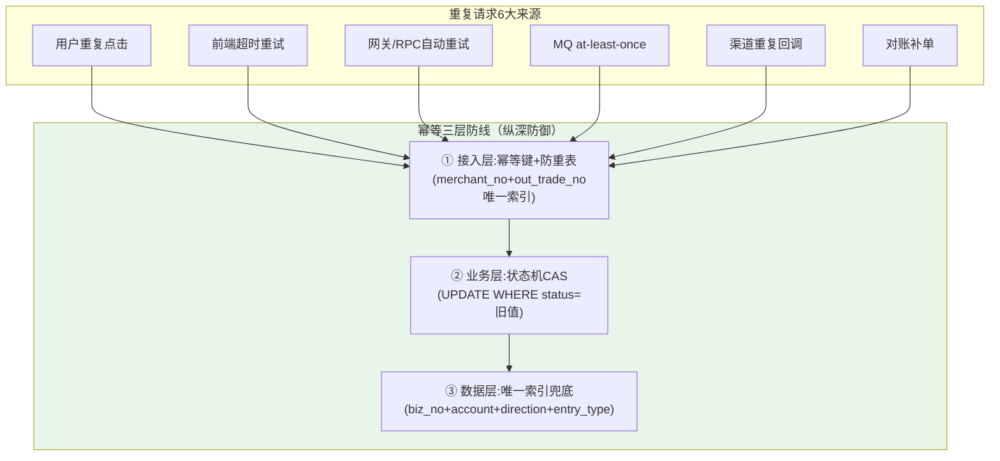

**幂等键冲突处理代码示例**：

```java
public class IdempotentPaymentService {
    @Transactional
    public PaymentResult pay(PaymentRequest req) {
        // 1. 幂等键查重
        Optional<PayOrder> existing = payOrderDao.findByBizKey(
            req.getMerchantNo(), req.getOutTradeNo(), req.getScene());
        if (existing.isPresent()) {
            PayOrder order = existing.get();
            if (order.isTerminal()) {
                // 终态：直接返回首次结果，不重复执行
                return PaymentResult.fromExisting(order);
            }
            // 处理中：返回"处理中"状态，让调用方轮询
            return PaymentResult.processing(order);
        }

        // 2. 插入支付单（唯一索引兜底，并发时抛 DuplicateKeyException）
        PayOrder order;
        try {
            order = payOrderDao.insert(req.toPayOrder());
        } catch (DuplicateKeyException e) {
            // 并发竞争：查回已插入的记录
            return PaymentResult.fromExisting(
                payOrderDao.findByBizKey(req.getMerchantNo(), req.getOutTradeNo(), req.getScene())
                    .orElseThrow(() -> new SystemException("幂等冲突但查不到记录")));
        }

        // 3. 状态机推进 + 发事件
        order.transit(PaymentEvent.CHANNEL_ACCEPTED);
        payOrderDao.casUpdate(order);  // UPDATE ... WHERE status=INIT
        eventBus.publish(new PaymentCreatedEvent(order));
        return PaymentResult.success(order);
    }
}
```

---

## 二、防重与并发

### Q4：如何防止用户重复支付（同一订单付两次）？
- **思路**：交易单维度加"是否已有成功支付单"校验 + 支付单状态机；前端按钮置灰 + Token；同一订单并发下单用唯一约束/锁串行。
- **坑**：只靠前端防重（可绕过）；没有服务端唯一约束。

**【深度拓展】** 防重复支付属于「业务层防重」，和幂等（技术层防重）要叠加。关键边界：同一订单并发发起两笔支付时，不能用「查一下有没有成功单」再决定——查和插之间有并发窗口。正确做法是在「创建支付单」这步用唯一约束/锁串行化，且支付单状态机保证「已成功」后任何新支付尝试直接拒绝。面试官还会追问「换渠道重试算重复支付吗」——不算，那是同一交易单下的不同支付单，靠交易单维度的已支付校验拦。

**【项目支撑】** XTransfer 交易单与支付单 1:N：一笔交易已有一笔成功支付单时，新开支付单的入口处校验交易单状态直接拒；同一支付单并发用 CAS 状态更新 + 渠道维度唯一约束双重兜底。

### Q5：账户扣减的并发安全？
- **方案**：乐观锁（`where balance>=amount and version=?`）适合低冲突；悲观锁 `select for update` 适合高冲突但降并发；余额加缓冲/分片账户抗热点。
- **考察点**：超卖/超扣防护、热点账户（见账务篇）。

**【深度拓展】** 选乐观锁还是悲观锁看冲突率：余额扣减通常冲突率低（不同用户不同账户），乐观锁 + `balance>=amount` 约束足够，且并发好；但**热点账户**（平台手续费汇总户、大促营销户）写入冲突极高，乐观锁会大量重试甚至失败，此时要用「子账户拆分 + 缓冲记账 + 异步归并」降热点。绝对不要对热点账户直接 `select for update` 串行化——吞吐会崩。面试官常追问「CAS 一直失败怎么办」——说明账户是热点，回到拆分/缓冲思路。

**【项目支撑】** 欧凡库存扣减用 Redis+Lua 原子扣减挡住高并发热点（秒杀同源）；XTransfer 账务侧对平台过渡户这类热点用「子账户拆分 + 先记明细流水后异步归并总户」，归并失败重试+告警，既保一致又抗写热点。

### 并发控制方案对比图解

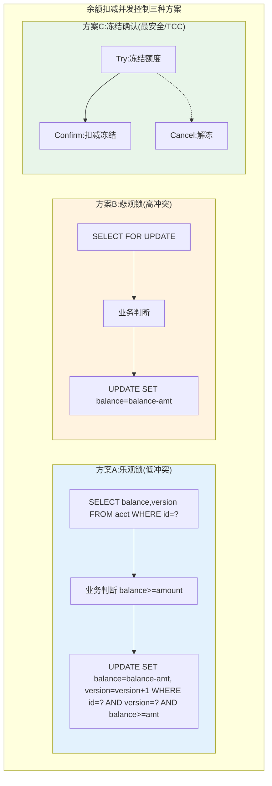

**Redis+Lua 原子扣减（热点场景）**：

```lua
-- Redis Lua 原子扣减脚本（限额/库存场景）
local key = KEYS[1]           -- 限额key
local amount = tonumber(ARGV[1])
local current = tonumber(redis.call('GET', key) or 0)

if current >= amount then
    redis.call('DECRBY', key, amount)
    return 1  -- 扣减成功
else
    return 0  -- 余额不足
end
-- 整个操作在Redis单线程内原子执行，无并发竞态
```

```java
// Java 调用 Lua 原子扣减
public boolean deductQuota(String quotaKey, long amount) {
    Long result = redisTemplate.execute(
        deductScript,
        Collections.singletonList(quotaKey),
        String.valueOf(amount)
    );
    if (result == 1L) {
        // Redis 扣减成功，异步落库
        mqSender.send(new QuotaDeductEvent(quotaKey, amount));
        return true;
    }
    return false;  // 余额不足
}
// Redis 是入口闸（10w+ QPS），DB 是权威账本（异步落库+对账兜底）
```

> **热点账户处理的工程心法**：Redis 前置挡住高并发（Lua 原子），子账户拆分散并发（不同行），缓冲记账降写压力（先流水后归并）。三层组合，单账户 TPS 从几百提升到数万。

---

## 三、对账（资金安全的最后防线）

### Q6：为什么必须对账？怎么做？
- **要点**：系统再可靠也可能掉单/漏记/金额不一致，对账是**兜底**。流程：每日拉渠道账单 → 与本地流水按渠道流水号/金额匹配 → 分类差异 → 差错处理。
- **差异类型**：① 本地有渠道无（掉单/未回调→主动查单补单或冲正）；② 渠道有本地无（漏记→补记）；③ 金额/状态不符（部分退款/手续费→按规则调账）。
- **长款/短款**：长款（渠道多给，挂应付/退回）、短款（渠道少给，挂应收/追款）。
- **考察点**：状态匹配（不只金额）、差错人工处理通道、对账时效影响结算。

**【深度拓展】** 对账最容易被忽视的两点：①**状态要匹配，不只金额**——金额对但状态错（如本地成功、渠道实际失败）同样是资损隐患；②**对账时效影响结算**——对账越晚发现差异，钱可能已结算出去越难追回。差异处理不是简单「以渠道为准」，要分清楚是「我方漏记」「渠道掉单」还是「手续费/部分退款导致的正常差额」，每一类走不同差错流程。长款短款本质是「挂账科目」问题，要能追溯。

**【项目支撑】** XTransfer 把对账作为「资金安全第三道防线」的事后层：T+1 多维对账（交易 vs 记账、我方 vs 渠道、总账 vs 明细），差异自动分类进差错处理队列，能自动冲正的自动冲正、不能的转人工。这正是 2.0 做到 0 资损的闭环之一。

### Q7：亿级流水对账怎么扛？
- **思路**：分片并行对账（按商户/时间分桶）、流式处理、位图/哈希快速比对、只对增量、异构到大数据平台（Spark/Flink）跑批。
- **坑**：单机全量 JOIN；对账拖垮在线库（走从库/离线库）。

**【深度拓展】** 亿级对账绝不能拖垮在线库（主库），要异构到从库/离线数仓（如 Spark/Flink 跑批），且只对增量比对、按商户/时间分桶并行。真正的坑是「对账任务本身成了故障源」——所以要限流、错峰、读写分离。面试官也会追问「实时对账能不能做」——实时靠事件驱动 + 流水比对做近端预警，但最终兜底仍以 T+1 全量为准。

**【项目支撑】** XTransfer 对账走离线数仓批量（不碰主库），配合事中「非终态卡单告警」做实时近端预警，T+1 全量对账做最终闭合。哈啰也有类似思路：工单/薪资冷数据进数仓、主库只留热数据。

### 对账体系架构图解

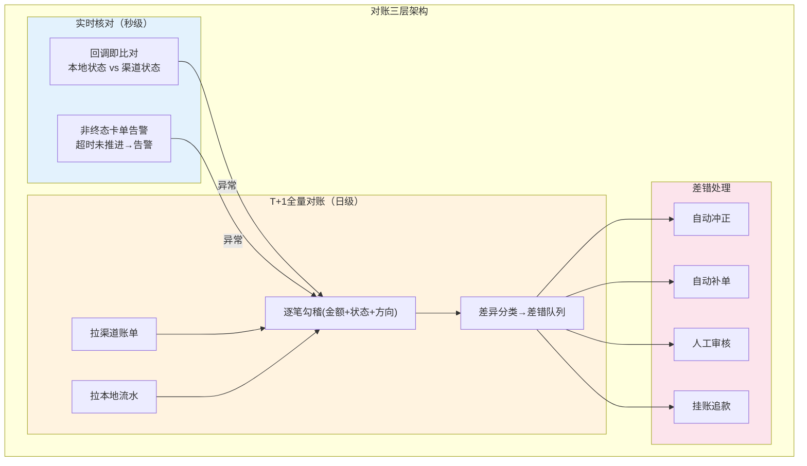

**对账差异分类与处理规则**：

```sql
-- 对账差异分类表
CREATE TABLE recon_diff (
    id           BIGINT PRIMARY KEY,
    recon_date   DATE,
    biz_no       VARCHAR(64),
    diff_type    VARCHAR(16),  -- LOCAL_ONLY/CHANNEL_ONLY/AMOUNT_MISMATCH/STATUS_MISMATCH
    local_amount BIGINT,
    channel_amount BIGINT,
    local_status VARCHAR(16),
    channel_status VARCHAR(16),
    handle_action VARCHAR(16),  -- AUTO_REVERSE/AUTO_SUPPLEMENT/MANUAL/PENDING
    status       VARCHAR(8) DEFAULT 'PENDING'  -- PENDING/HANDLED/CLOSED
);

-- 差异处理规则
-- LOCAL_ONLY（本地有渠道无）: 可能是掉单→主动查单补单或冲正
-- CHANNEL_ONLY（渠道有本地无）: 可能是漏记→补记账
-- AMOUNT_MISMATCH（金额不符）: 可能是手续费/部分退款→调账
-- STATUS_MISMATCH（状态不符）: 可能是回调丢失→查渠道真实状态修正
```

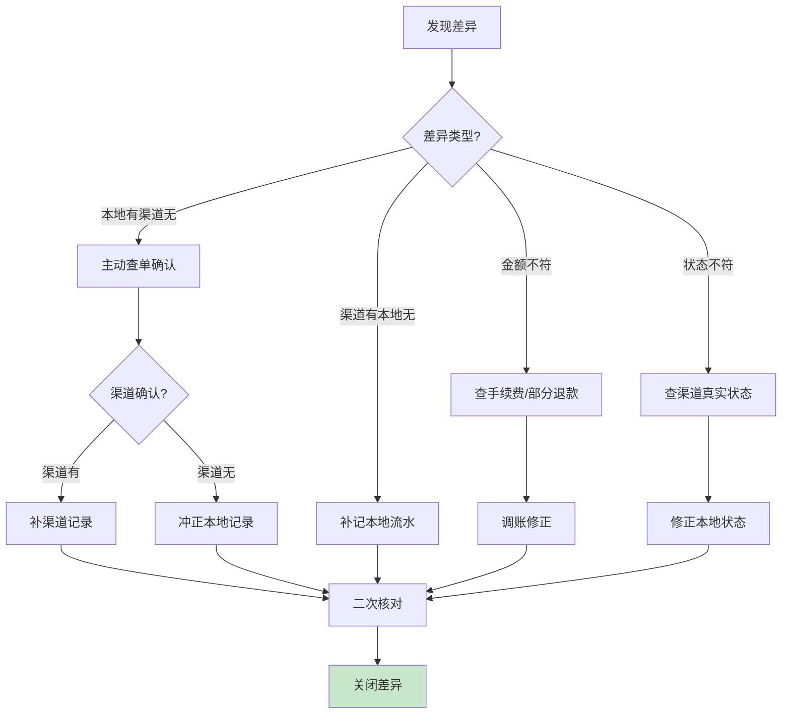

---

## 四、分布式事务与一致性

### Q8：支付里跨服务一致性怎么保证？
- **场景**：扣减账户 + 记账 + 通知 + 更新订单跨多服务。
- **方案**：核心链路用 **TCC**（预冻结→确认扣减→取消解冻）或本地事务 + **事务消息/Outbox** 做最终一致；离线**对账兜底**。
- **考察点**：TCC 空回滚/防悬挂/幂等；为什么不用 2PC（阻塞、性能）；最终一致靠重试 + 对账收敛。（详见《分布式事务与一致性》）

**【深度拓展】** 选型的本质是「流程长度 vs 一致性强度 vs 可用性」的三角权衡。2PC 强一致但锁资源、协调者单点，对「跨风控/申报/账务且渠道回调晚」的收款链路不可用；TCC 侵入大（每个接口三套代码）但准实时；Saga/任务补偿最契合长流程、可补偿、对可用性友好。关键认知：没有「最好的」，只有「最贴合资金流长链路 + 渠道不可控」的。面试官常追问「补偿失败怎么办」——死信转人工 + 资金安全告警，绝不静默。

**【项目支撑】** XTransfer 收款主选「状态机 + 任务补偿（Saga 思想）」而非 2PC/TCC 全量上：本地先落业务 + 任务表，异步重试下游，失败走补偿脚本回滚，配合 Outbox 保证事件不丢，最终靠 T+1 对账收敛。部分核心强约束处有选择用 TCC，但只在必要时。

### Q9：扣了款但记账失败怎么办？
- **思路**：同一本地事务内"扣款 + 写记账流水"保证原子（复式记账）；跨服务则用 TCC/事务消息 + 幂等 + 对账。绝不允许"钱扣了账没记"，宁可**先冻结再确认**。
- **考察点**：资金操作的顺序与可回滚性；补偿设计。

**【深度拓展】** 资金操作的第一原则：**宁可先冻结再确认，绝不「扣了再补」**。所以扣款 + 记账要在「同一本地事务」内（复式记账的借贷同笔落库），跨服务的用 TCC/事务消息。真正的坑是「扣成功、记账异步、中间崩溃」——这会用对账兜底，但窗口期资金账实不符，所以核心链路要 CP。面试官会追问「如果靠对账兜底，那实时账不平怎么办」——事中靠「复式记账实时试算平衡告警」在借贷不平的瞬间就熔断告警，不等到 T+1。

**【项目支撑】** XTransfer 的「资金安全三道防线」事中层就是：复式记账实时试算平衡，一旦借贷不平立即告警熔断；非终态卡单告警、幂等异常告警、BCP 告警一起把问题在前置阶段暴露。这是 0 资损的关键工程手段。

---

## 五、状态机与订单模型

### Q10：为什么用状态机管理支付？
- **要点**：支付状态多且流转严格（待支付/支付中/成功/失败/退款中/已退款/关闭），状态机保证只走合法路径 + 天然幂等（重复请求命中终态返回）。
- **考察点**：状态流转图、非法流转拦截、状态与事件驱动（状态变更发事件）。

**【深度拓展】** 状态机的核心价值在「非法迁移显式拒绝」——这是资金安全的第一道闸。散落的 `if(status==X) status=Y` 分布在各处，并发下极易乱跳（如「已结算」被误回「处理中」）。状态机把「合法状态 + 允许的流转 + 流转触发的动作」集中，且状态更新用 `UPDATE...WHERE status=旧值` 做 CAS，天然幂等 + 防并发。代价是初期建模成本，但对资金流值得。面试官追问「状态机怎么做嵌套/子状态」——XTransfer 风控就是独立子状态机，主流程只关心「通过/拒绝/待补材料」。

**【项目支撑】** XTransfer 收款主状态机管「待预收→已预收→风控中→已申报→已记账→已结算」全生命周期，超 1000w 笔结算都靠它拦非法流转；风控再抽成独立子状态机（免关联→关联→渠道调单）自管阶段。状态变更统一发领域事件驱动下游，解耦且可重放。

### Q11：交易单和支付单为什么 1:N？
- **要点**：一笔交易（一次下单）可多次支付尝试（失败重试、换渠道、组合支付），故一对多。交易单管业务、支付单管每次扣款。
- **考察点**：模型拆分的好处（清晰、可重试、可对账）。

**【深度拓展】** 1:N 的本质是「业务意图」和「资金动作」解耦。一笔交易（一次下单）可能多次支付尝试（失败重试、换渠道、组合支付），如果只有一个单，重试和换渠道会互相覆盖状态、对不上账。拆成交易单（管业务/幂等/已付校验）+ 支付单（管每次扣款/渠道/状态）后，可重试、可对账、可统计各渠道成功率。面试官追问「那退款单算在哪」——通常退款单挂在原交易单下、与原支付单对冲，逆向流程独立建模。

**【项目支撑】** XTransfer 交易单与支付单严格 1:N，VA/收单/A2A/电商各产品都走同一模型；预入账子领域也复用该建模，让「钱先到、贸易背景后补」的预入账场景能被正确对账（预入账单独立聚合根）。

### 状态机与订单模型图解

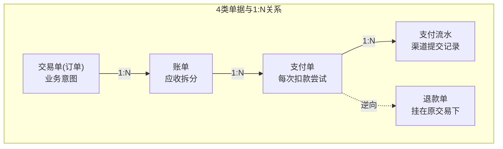

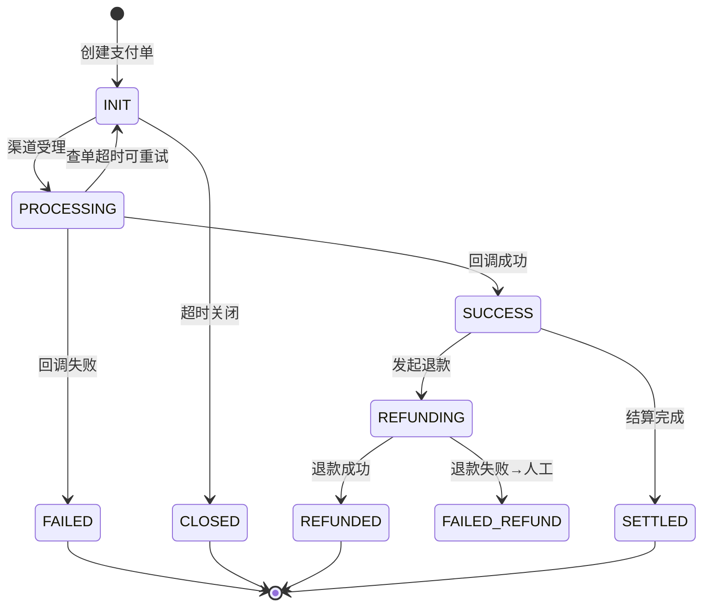

**状态机 CAS 实现代码**：

```sql
-- 状态迁移表：定义合法的迁移路径
CREATE TABLE state_transition (
    current_state VARCHAR(16),
    event         VARCHAR(32),
    next_state    VARCHAR(16),
    PRIMARY KEY (current_state, event)
);
-- 预置合法迁移
INSERT INTO state_transition VALUES
('INIT',       'CHANNEL_ACCEPTED',  'PROCESSING'),
('INIT',       'TIMEOUT_CLOSE',      'CLOSED'),
('PROCESSING', 'CHANNEL_SUCCESS',    'SUCCESS'),
('PROCESSING', 'CHANNEL_FAILED',     'FAILED'),
('PROCESSING', 'QUERY_TIMEOUT',      'INIT'),
('SUCCESS',    'REFUND_REQUESTED',   'REFUNDING'),
('REFUNDING',  'REFUND_SUCCESS',     'REFUNDED'),
('REFUNDING',  'REFUND_FAILED',      'FAILED_REFUND');

-- CAS 状态更新（天然幂等+防非法迁移）
UPDATE pay_order po
   SET po.status = (
       SELECT st.next_state FROM state_transition st
       WHERE st.current_state = po.status AND st.event = #{event}
   ),
   po.version = po.version + 1,
   po.update_time = NOW()
 WHERE po.id = #{orderId}
   AND EXISTS (
       SELECT 1 FROM state_transition st
       WHERE st.current_state = po.status AND st.event = #{event}
   );
-- affected_rows=0 → 非法迁移或已被处理，忽略+告警
```

> **状态机设计的三个层次**：① **定义层**——哪些状态、哪些迁移合法（状态迁移表）；② **执行层**——CAS 写库保证并发安全（`UPDATE WHERE status=旧值`）；③ **事件层**——状态变更发领域事件驱动下游（Outbox 投递）。三层配合，做到"非法迁移拒绝、并发安全、下游解耦"。

---

## 六、资金安全与合规

### Q12：怎么保证金额计算不出错？
- **要点**：金额用**整数最小币种单位（分）**或 `BigDecimal`，**禁用 double/float**（精度丢失）；汇率换算保留精度并明确舍入规则；每笔都可追溯（复式记账 + 不可变流水）。
- **考察点**：为什么不用 double；跨境多币种与汇兑损益。

**【深度拓展】** 金额精度是支付底线。double 是二进制浮点近似，`0.1+0.2≠0.3`，累积误差会让账永远对不平。正确做法：存储用整数最小币种（分/厘，bigint），计算用 BigDecimal 且**必须用字符串构造**（不能用 `new BigDecimal(0.1)`，那已经是近似了），并显式指定舍入模式。跨境多币种更要小心：日元无小数、部分币种 3 位小数，最小单位不同。汇率换算产生汇兑损益，必须记清「谁承担、怎么补」——XTransfer 贸易订单系统就对入账汇损做补充。

**【项目支撑】** XTransfer 所有金额内部以最小币种整数存储，跨境换汇产生的汇损通过贸易订单管理系统的「汇损补充」机制补偿回用户，保证「用户资金一致和结汇」。这也是 0 资损的细活之一。

### Q13：如何避免"二清"违规？
- **思路**：不自建资金池先收后付；用持牌机构"大商户+子商户"模式或分账，平台只发指令不碰资金归集。（见《清结算体系》）
- **考察点**：资金流与信息流分离、合规意识。

**【深度拓展】** 二清的本质是「无牌照机构替商户沉淀资金再结算」，监管红线。规避思路：资金流与信息流分离——平台只做信息流（订单、分账指令），资金由持牌银行/机构「大商户+子商户」模式清分。平台绝不能自建资金池先收后付。面试官常追问「那分账算谁的钱」——分账指令发给持牌方，资金在持牌方监管户内清分，平台不碰资金归集，只收服务费。

**【项目支撑】** XTransfer 作为跨境收款平台，合规是生命线：资金通过持牌通道/银行监管户处理，平台做收款、申报、记账的信息流与指令，贸易背景（贸易订单管理系统）用于合规申报与 AML/KYC，绝不由平台自建资金池。合规动态表单（渠道→场景→字段）也是为此服务。

### Q14：跨境支付有哪些特殊点？
- **要点**：多币种与汇率、汇兑损益、境内外资金通道、结售汇与外汇管制、AML/KYC 反洗钱、合规牌照、T+N 结算周期长、时区与节假日。
- **考察点**：结合你的 XTransfer 跨境收款背景讲差异。

**【深度拓展】** 跨境支付比境内支付多了四个硬约束：①**多币种与汇率**——每笔要记币种 + 换汇 + 汇兑损益；②**合规与牌照**——AML/KYC、外汇管制、结售汇，申报要素随渠道/场景变（XTransfer 用动态表单配置化）；③**长结算周期**——T+N、时区节假日，资金在途久；④**境内外通道**——通道稳定性、掉单、调单都要容错。这些不是「加几个字段」，而是贯穿建模、申报、对账、风控的全链路差异。

**【项目支撑】** XTransfer 正是围绕这些特殊点设计的：贸易订单管理系统提供贸易背景用于合规申报与额度；风控独立子状态机含「渠道调单」阶段；合规动态表单按渠道→场景→字段配置化；标准化 VA 开户系统 100+ 渠道接入境内外银行通道。跨境差异被系统性外置而非散落代码。

### 跨境支付特殊点图解

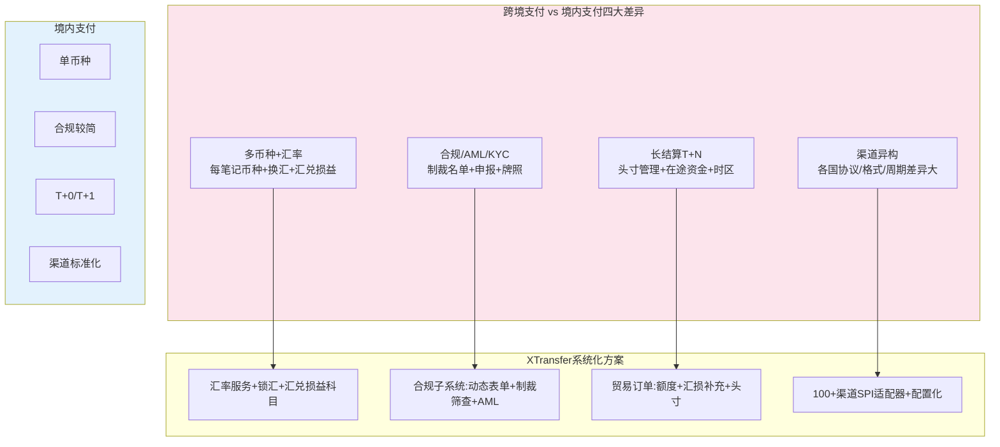

**跨境汇率与汇兑损益记账示例**：

```sql
-- 跨境收款：USD → CNY 换汇
-- 原始: $1000 @ 汇率7.0 = ¥7000
-- 结算时汇率7.2 → 汇兑收益¥200

-- 1. 原始入账（收款时汇率）
INSERT INTO acct_journal(biz_no, account_id, direction, entry_type, amount, currency, fx_rate)
VALUES ('FX001', 1001, 'DEBIT',  'PAYIN',  100000, 'USD', 7.0),  -- 渠道过渡户(USD)
       ('FX001', 2001, 'CREDIT', 'PAYIN',  700000, 'CNY', 7.0);  -- 商户待结算户(CNY)

-- 2. 结算时汇率变动 → 汇兑损益
INSERT INTO acct_journal(biz_no, account_id, direction, entry_type, amount, currency)
VALUES ('FX001', 2001, 'DEBIT',  'FX_GAIN',   20000, 'CNY'),  -- 商户户:汇兑收益
       ('FX001', 3001, 'CREDIT', 'FX_GAIN',   20000, 'CNY');  -- 汇兑损益科目
-- 借贷相等，汇兑损益可追溯
```

> **跨境汇兑的工程关键**：① 锁汇时点要明确（收款时锁 vs 结算时锁）；② 汇率精度要足够（至少 6 位小数）；③ 汇兑损益必须有专门科目记账，不能"消失在账里"；④ 汇损由谁承担要定清楚（平台/商户/用户），XTransfer 通过贸易订单系统"汇损补充"机制补偿回用户。

---

## 七、系统设计题：如何设计一个支付系统？

### Q15：从 0 设计一个支付系统，你怎么答？
- **回答框架（控场）**：
  1. **需求澄清**：C 端/B 端？支付方式？QPS/峰值？一致性要求？跨境？
  2. **容量估算**：日订单量、峰值 TPS、存储量、读写比。
  3. **分层架构**：收银台 → 交易层(订单) → 支付层(渠道路由/渠道适配) → 清结算层 → 账务层(复式记账) → 对账 → 资金处理。（《支付系统全链路架构》六层）
  4. **核心设计点**：幂等、状态机、分布式事务、对账、渠道容灾切换、资金安全（金额精度/复式记账）。
  5. **高可用**：限流熔断降级、多活、消息削峰、监控告警。
  6. **权衡**：一致性 vs 可用性按模块取舍（核心 CP、边缘 AP）。
- **考察点**：需求分析、架构分层、权衡取舍、能否落地到细节。

**【深度拓展】** 系统设计题的得分点是「结构清晰 + 关键决策 + 承认边界」，不是堆组件。多数人卡在「容量估算」和「模块间一致性边界」：比如对账模块要独立、账务必须 CP、通知可以 AP。面试官会顺着你的一句话追问（如「你说状态机，那状态机怎么落地」），所以要预留钩子到自己真做过的点。切忌一上来就写代码。

**【项目支撑】** 我讲「从 0 设计支付」会直接落到 XTransfer 的真实架构：六边形 + CQRS + DDD 分层、状态机管资金流、SPI 扩展收款产品、任务补偿保最终一致、资金安全三道防线。因为这些我都主导过，能一路被追问到细节不露怯。

### Q16：渠道怎么做高可用与智能路由？
- **思路**：多渠道冗余；按成功率/成本/限额/币种动态路由；单渠道成功率下降自动熔断切换；渠道健康检查 + 灰度；对账反哺路由权重。
- **考察点**：路由策略、熔断切换、监控指标（成功率/耗时/成本）。

**【深度拓展】** 渠道路由是「成本/成功率/限额/币种」的多目标优化，不是静态配置。核心是：① 多渠道冗余，单渠道必挂；② 按实时成功率/耗时动态权重，成功率下降自动熔断切换；③ 渠道健康度由监控反哺路由权重（对账发现的差异也要回灌）；④ 要有「灰度 + 回切」机制，新渠道小流量验证。面试官追问「路由权重怎么算」——通常是成功率为主、成本次之、叠加限额/币种硬约束，用加权轮询或打分排序。

**【项目支撑】** XTransfer 标准化 VA 开户 100+ 渠道，正是靠「差异外置 + 配置化 + 渠道适配」支撑路由与接入；SLA 维度的成功率/耗时/成本监控反哺路由，掉单由主动查单 + T+1 对账闭环。新增渠道从「写一堆代码」变成「配置 + 薄适配」。

---

## 八、面试高频问答（标准回答）

**Q：支付系统和普通业务系统最大的区别？**
> 考察点：是否理解支付的本质。回答：三点——**不可逆**（钱付出去难追回，所以要防重、可对账、可冲正）、**强一致**（账不能错，核心链路 CP + 复式记账 + 对账兜底）、**高合规**（资金牌照、二清、AML）。所以设计处处围绕"幂等 + 一致性 + 可追溯 + 合规"。

**【深度拓展】** 这三点其实对应三种「错误代价」：不可逆对应「不能重来」，所以每步都要可冲正/可对账；强一致对应「错不起」，所以核心链路 CP；高合规对应「不能踩红线」，所以信息流/资金流分离。面试官追问「支付一定要强一致吗」——不是，是按模块：记账/扣款 CP，通知/对账/营销 AP。把「分区 + 分层取舍」讲出来，比背三点高级。

**【项目支撑】** XTransfer 的「资金安全三道防线」正是这三点落地：不可逆→对账兜底可冲正；强一致→核心账务 CP + 复式记账；高合规→动态表单申报 + AML/KYC。2.0 做到 0 资损就是这一套跑通的结果。

**Q：一句话说清幂等、防重、对账的关系？**
> 幂等保证"同一请求重复执行结果一致"，防重是"业务上不让同一笔付两次"，对账是"事后核对兜底修正"。三者层层防护：幂等挡技术重试，防重挡业务重复，对账兜底修正漏网。

**【深度拓展】** 三者是「纵深防御」而非「三选一」。常见误答是「我对账兜底就够了」——但漏网的差错越晚发现追回成本越高（钱已结算出去）。所以防护要前移：幂等/防重把 99% 挡在事前，对账只修那 1% 漏网。面试官追问「三者有顺序依赖吗」——有：没有幂等，最终一致方案（事务消息/Saga）根本无法收敛；没有对账，幂等也兜不住「系统 bug 导致的逻辑错」。

**【项目支撑】** XTransfer 事前（幂等键 + 状态机 + 限额）、事中（试算平衡告警）、事后（T+1 多维对账）三层对应「幂等/防重 → 实时平衡 → 对账兜底」，和这三者的关系完全同构。

**Q：如果让你保证"绝对不多扣用户一分钱"，怎么做？**
> 多层：① 幂等键唯一索引（重复请求不重复扣）；② 状态机（终态不再处理）；③ 扣减用乐观锁/冻结确认；④ 复式记账可追溯；⑤ 每日对账 + 差错冲正；⑥ 金额用整数分/BigDecimal 防精度。任何一层漏了，后面还能兜。

**【深度拓展】** 这道题考的是「纵深防御思维」。关键是「任何一层漏了后面还能兜」——单层再完美也有盲区（如幂等挡不住逻辑 bug，对账挡不住实时账不平）。面试官追问「如果六层都过了还是多扣了怎么办」——那靠「差错冲正 + 人工兜底 + 客户赔付通道」，资金系统的底线是「宁可自己垫、不能让用户亏」。另外「冻结确认」比「直接扣」更安全，对应 TCC 的 Try。

**【项目支撑】** XTransfer 2.0 把这套固化成标准：幂等键覆盖进接入规范（源于一次幂等边界漏覆盖导致试算偏差的真实故障）、状态机 CAS 更新、复式记账实时试算、T+1 对账 + 差错冲正。多扣类问题靠这几层在事前/事中兜住，事后靠差错队列 + 人工。

**Q：支付回调没收到怎么办？**
> 主动补偿：定时任务对"支付中"超时订单**主动查单**（查渠道真实状态），成功则补记账、失败则关单，兜底靠对账。绝不干等回调。

**【深度拓展】** 掉单的本质是「异步回调不可靠」。正确架构是「回调 + 主动查单」双通道：回调即时推进，查单兜底超时。查单频率要用**退避策略**（避免打爆渠道），且查单本身要幂等。面试官追问「查单也超时/失败怎么办」——标记异常态 + 告警 + 人工，或进任务补偿死信队列。绝不能让订单永远卡在「支付中」。

**【项目支撑】** XTransfer 用「支付中超时 + 延时查单」做掉单兜底，延时任务由 ZSet/时间轮/延时消息实现；查单结果与本地状态比对，命中则补记账，未果则进异常态告警。再不行 T+1 对账补单，三层闭合。

**Q：AI 能用在支付哪里？不能用在哪里？**
> 能：风控评分、对账差异归因、客诉分类、智能路由建议、异常检测。不能：直接决策扣款/放行（强合规、不可逆，必须确定性规则 + 人工）。原则：**AI 只建议不决策**。（见《AI与LLM工程落地探索》）

**【深度拓展】** 「AI 只建议不决策」是金融合规的硬约束：扣款/放行不可逆、强监管，必须确定性规则 + 人工兜底，不能把资金决策交给概率模型。但 AI 在「提效」上价值大——风控评分辅助、对账差异自动归因、异常检测。面试官追问「RAG 幻觉怎么办」——引用溯源 + 置信度阈值 + 低置信转人工，且绝不进资金主链路。

**【项目支撑】** 我做过用 LLM + RAG 做内部对账知识库（把对账规则/差错案例检索增强），但生产交易链路坚决不让 AI 直接决策。XTransfer 风控是「独立子状态机 + 确定性规则 + 人工复核」，AI 只做评分建议，符合金融强合规。

---

## 更多高频追问（补充）

**Q：金额为什么不能用 float/double？应该用什么？**
> 浮点数是二进制近似，`0.1+0.2 != 0.3`，涉及钱会累积误差、对不平账。正确做法：① 用**整数分/厘**存储（数据库存 `bigint`，单位分）；② 计算用 `BigDecimal` 并显式指定精度和舍入模式（`RoundingMode.HALF_UP` 或按业务定），禁止用 `double` 构造 `BigDecimal`（要用字符串构造）。跨境多币种还要注意不同币种的最小单位不同（日元无小数、部分币种 3 位小数）。

**【深度拓展】** 精度坑比想象中隐蔽：① `new BigDecimal(double)` 构造时精度已丢，必须用 `BigDecimal.valueOf(double)` 或字符串构造；② 除法可能无限小数，必须指定 `scale + RoundingMode` 否则抛异常；③ 比较要用 `compareTo` 而非 `equals`（equals 比精度和值，`0.00`≠`0.0`）；④ 跨境多币种的最小单位不同，建模时「金额 + 币种 + 精度」三元组才完整。面试官追问「汇率怎么算精度」——保留足够精度位换汇，汇损单独记账。

**【项目支撑】** XTransfer 所有金额以最小币种整数存储，跨境换汇产生的汇损由贸易订单管理系统的「汇损补充」机制补偿回用户，确保用户资金一致和结汇，是 0 资损的细活。

**Q：预授权（冻结）和普通支付有什么区别？**
> 预授权是"先冻结额度、后确认扣款"（如酒店押金、租车）。流程：授权冻结一笔额度 → 实际消费时请求"授权完成"扣真实金额（可小于冻结额）→ 未消费则撤销授权解冻。系统上要维护"冻结态"资金，账务上冻结不是真扣、要单独记，且有超时自动解冻。这本质就是资金版的 TCC（Try=冻结、Confirm=扣款、Cancel=解冻）。

**【深度拓展】** 预授权的关键是「冻结态」是一笔独立的资金状态，不是真扣，要单独记且超时自动解冻（否则额度被永久占）。它和 TCC 同构（Try=冻结、Confirm=扣款、Cancel=解冻），所以在分布式事务里天然适配 TCC。面试官追问「冻结期间用户真消费了但授权过期怎么办」——靠「授权完成」的幂等 + 对账校验，超期的走差错处理。

**【项目支撑】** XTransfer 收款链路里渠道受理（PROCESSING）前的冻结态、以及贸易订单额度「流水式只增不减」的冻结/释放，都是预授权思想的体现。VA 收款「钱先到、贸易背景后补」的预入账，本质也是一种带超时与补充材料的「冻结态」管理。

**Q：退款怎么设计？部分退款、超时、原路退回怎么处理？**
> 退款要点：① **幂等**——同一笔退款单唯一，防重复退；② **部分退款**——累计退款金额不能超过原订单，需校验并记录已退总额；③ **原路退回**——退到原支付渠道/账户，跨境还涉及按退款时汇率换汇（可能与支付时汇率不同，产生汇兑损益）；④ **异步 + 查询兜底**——退款也走渠道异步，超时主动查退款状态；⑤ **记账红冲**——退款在账务上是原分录的冲正。退款是支付里"逆向流程"，复杂度不亚于正向。

**【深度拓展】** 退款最易漏的三点：① **部分退款上限**——必须有「已退总额」字段做累加校验，否则重复退/超额退；② **原路退回的跨境汇率差**——退款时汇率 ≠ 支付时汇率，汇损由谁承担要定清楚（通常是商户/平台，不是用户）；③ **逆向对账**——退款也要进对账，否则「退了没扣、扣了没退」的漏网一样是资损。面试官追问「退款和原支付不在同一账务周期怎么办」——退款单独立记账 + 红冲，不依赖原周期。

**【项目支撑】** XTransfer 退款/冲正是复式记账的红冲（原分录对冲），且进 T+1 多维对账；跨境退款的汇损由贸易订单系统「汇损补充」规则承担。预入账子领域的逆向（如预入账撤销/补充材料失败）也走状态机 + 补偿，与正向同源。

**Q：怎么做支付系统的资金安全"三道防线"？**
> 我在 XTransfer 总结的三道防线：① **事前**——强幂等 + 状态机 CAS + 限额风控，从源头防错扣重扣；② **事中**——复式记账实时试算平衡，一旦借贷不平立即告警熔断；③ **事后**——每日多维对账（交易 vs 记账、我方 vs 渠道、总账 vs 明细）+ 差错自动冲正 + 人工兜底。核心理念是"任何单点都可能出错，用多层冗余保证钱不错"。这套讲下来是支付面试的高光时刻。

**【深度拓展】** 三道防线的精髓是「单点都可能错，所以冗余」。事前防「能拦的错」（幂等/状态机/限额），事中防「逻辑错实时暴露」（试算平衡告警），事后修「漏网的错」（对账）。权衡：事前越严性能/体验代价越大，所以限额/风控要可配置、不卡主链路。面试官追问「试算平衡了就一定没错吗」——不一定（借贷同错会被掩盖），所以还要对账（核对外部真值）。两道防线互补。

**【项目支撑】** 这三道防线是我 2.0 重构沉淀的核心方法论，直接对应用户的 0 资损结果：事前把幂等键覆盖写进接入规范（源于一次幂等边界漏覆盖的真实故障），事中复式记账实时试算 + 非终态/幂等异常/BCP 告警，事后 T+1 多维对账 + 差错冲正 + 人工兜底。是支付面试能讲满 5 分钟的高光素材。

---

## 【深度拓展】技术原理深挖

### 拓展一：幂等键设计的理论模型

> 幂等键的本质是"唯一标识一次业务意图"。从理论上看，它需要满足三个属性：

| 属性 | 定义 | 工程实现 | 违反后果 |
|------|------|---------|---------|
| **稳定性** | 键在请求生命周期内不变 | 选业务稳定的字段(商户订单号) | 幂等失效，重复执行 |
| **唯一性** | 不同意图的键不同 | 组合字段(商户号+订单号+场景) | 不同请求被误判为重复 |
| **可重放** | 系统重启后仍能命中 | 持久化到DB(非内存) | 重启后幂等失效 |

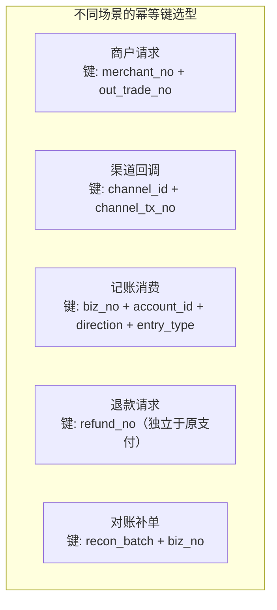

### 拓展二：分布式事务在支付各环节的落点

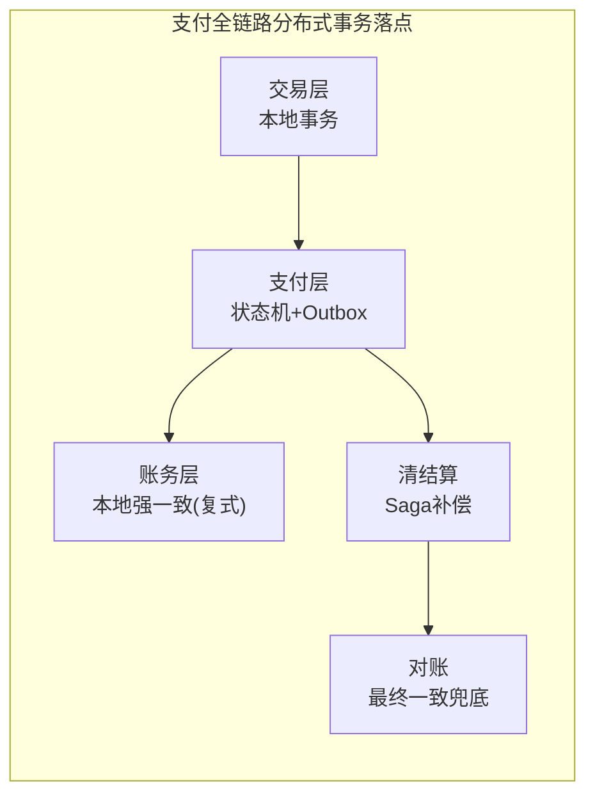

| 环节 | 方案 | 为什么不用其他方案 |
|------|------|------------------|
| 交易单+支付单 | 本地事务 | 同库操作，ACID 天然保证 |
| 回调→记账 | Outbox+幂等消费 | 2PC锁太久；TCC对渠道回调不可预留 |
| 清算→结算 | Saga补偿 | 长流程可补偿，TCC侵入太大 |
| 账务内部 | 本地强一致 | 借贷必须同笔，不能异步 |
| 跨账户调拨 | TCC | 资金最安全，可冻结可回滚 |

### 拓展三：常见误区与陷阱（面试避坑指南）

**误区 1：「上了 Redis 分布式锁就幂等了」**
- 锁有超时（锁过期后重入）和主从切换丢锁的问题。正确做法：锁+唯一索引+状态机三保险。锁只是"加速串行"。

**误区 2：「BigDecimal 就一定不会丢精度」**
- `new BigDecimal(0.1)` 已经丢精度了（0.1 的二进制近似）。必须用 `BigDecimal.valueOf(0.1)` 或 `new BigDecimal("0.1")`。

**误区 3：「对账只对金额就够了」**
- 金额对但状态错（本地成功、渠道失败）同样是资损。必须校验"金额+状态+方向"三要素。

**误区 4：「2PC 最安全，支付应该用 2PC」**
- 2PC 协调者单点+长锁，对"渠道回调不可控"的支付链路不可用。支付选最终一致+对账兜底。

**误区 5：「退款直接退到原渠道就行」**
- 跨境退款时汇率可能变了，产生汇兑损益。必须明确"谁承担汇损"并单独记账。

**误区 6：「AI 可以做支付路由决策」**
- 资金决策不可逆+强合规，AI 只能做"建议"，不能做"决策"。路由必须确定性规则+可解释。

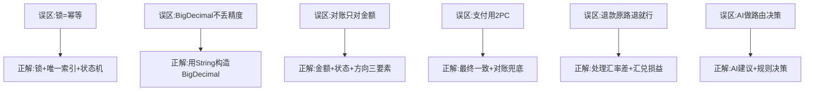

---

## 【项目支撑】XTransfer 真实项目决策与数据

### 决策一：幂等键覆盖的真实故障故事

> 2.0 重构前发生过一次试算偏差——根因是幂等键没有覆盖"冲正"场景。

```
故障场景：
  1. 一笔收款正常入账（biz_no=PAY001, direction=CREDIT, entry_type=PAYIN）
  2. 渠道发起冲正（biz_no=PAY001, direction=DEBIT, entry_type=PAYIN）
  3. 幂等键 = biz_no + account_id + direction + entry_type
  4. 但冲正的 direction=DEBIT ≠ 入账的 direction=CREDIT
  5. 冲正幂等键和入账幂等键不同 → 冲正被当成新入账执行 → 试算不平
```

**修复方案**：幂等键增加 `entry_type` 维度区分"入账/冲正/手续费"，冲正幂等键 = `biz_no + account_id + direction + REVERSE`。修复后写入接入规范，所有新场景必须定义幂等键覆盖范围。

### 决策二：0 资损的量化数据

| 防线 | 覆盖率 | 拦截的问题类型 | 月均拦截量 |
|------|--------|--------------|-----------|
| 事前（幂等+状态机+限额） | 100% | 重复扣款/非法迁移/超额 | ~5000次 |
| 事中（试算平衡+告警） | 100% | 借贷不平/非终态卡单 | ~50次 |
| 事后（T+1对账+冲正） | 100% | 渠道差异/漏记/错记 | ~10次 |
| 人工兜底 | — | 机器判不了的责任归属 | <1次 |

> 三道防线月均拦截 ~5060 次问题，其中 99% 在事前/事中被挡住，只有不到 0.2% 流到事后对账。最终 0 资损。

### 决策三：跨境支付特殊点的系统化解决方案

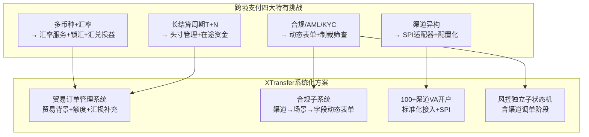

---

## 【面试官追问】逐问标准回答

### 追问 1：你说幂等用唯一索引，那唯一索引冲突时怎么返回首次结果？

**标准回答**：需要把"首次处理结果"落一张业务结果表（biz_no → 结果 JSON）。冲突时不是抛错，而是查回首次结果返回。流程：① 插入支付单时同时写入 `pay_result` 表（biz_no, result_json, status）；② 唯一索引冲突时 catch `DuplicateKeyException`，查 `pay_result` 返回首次结果；③ 如果首次结果还没写完（处理中），返回"处理中"让调用方轮询。关键：幂等和重试必须配对——没有幂等就重试 = double count，这是资损第一来源。

```sql
CREATE TABLE pay_result_cache (
    biz_no    VARCHAR(64) PRIMARY KEY,
    result    TEXT,           -- 结果JSON
    status    VARCHAR(8),     -- PROCESSING/SUCCESS/FAILED
    created_at DATETIME
);
-- 冲突时: SELECT result FROM pay_result_cache WHERE biz_no = ?
```

### 追问 2：状态机 CAS 更新失败时，应该报错还是忽略？

**标准回答**：分两种情况：① **终态重复**（如已 SUCCESS 又来 SUCCESS 回调）→ 忽略，返回首次结果（这是正常的重复回调，不需要告警）；② **非法逆向迁移**（如 SUCCESS→INIT）→ 告警（可能是 bug 或攻击），不能静默吞掉。区分标准：看请求的事件是否在"合法迁移表"里。在表里但 CAS 失败 = 已被处理，忽略；不在表里 = 非法迁移，告警。

### 追问 3：复式记账实时试算平衡，具体怎么实现？

**标准回答**：每次记账后立即校验"借贷是否相等"。实现方式：① 记账事务内，`SUM(DEBIT amount) = SUM(CREDIT amount)` 作为事务后置校验；② 不相等则整个事务回滚 + 告警熔断；③ 另有定时任务做全局试算（所有账户借贷总和 = 0），作为兜底。关键是"实时试算"在事务内做，不等 T+1——这样借贷不平的瞬间就能拦住，而不是等钱已经结算出去才发现。

```sql
-- 事务内实时试算（记账后立即校验）
BEGIN;
INSERT INTO acct_journal(biz_no, account_id, direction, amount) VALUES
('PAY001', 1001, 'DEBIT',  1000000),
('PAY001', 2001, 'CREDIT', 1000000);

-- 试算校验：本笔借贷必须相等
SELECT
    CASE WHEN SUM(CASE direction WHEN 'DEBIT' THEN amount ELSE 0 END)
       = SUM(CASE direction WHEN 'CREDIT' THEN amount ELSE 0 END)
    THEN 1 ELSE 0 END as balanced
FROM acct_journal WHERE biz_no = 'PAY001';
-- balanced=0 → ROLLBACK + 告警
COMMIT;
```

### 追问 4：退款时汇率变了，汇损谁承担？怎么记账？

**标准回答**：通常由商户或平台承担（不是用户）。记账方式：① 按退款时汇率换算退款金额；② 退款金额与原支付金额的汇率差 = 汇兑损益；③ 汇兑损益记入专门的"汇兑损益"科目；④ XTransfer 通过贸易订单管理系统的"汇损补充"机制，把汇损补偿回用户（保证用户资金一致），汇损由平台/商户承担。关键：汇率差必须有明确的科目记账和责任归属，不能"消失在账里"。

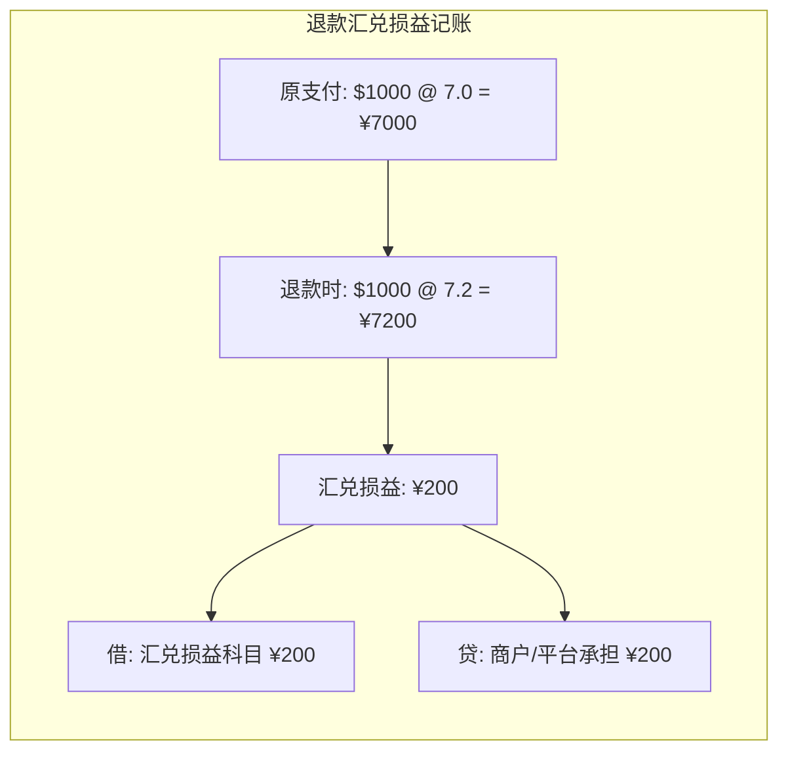

### 追问 5：如果让你从 0 设计一个支付系统的幂等体系，你会怎么分层？

**标准回答**：三层纵深防御：① **接入层**——商户传唯一 `requestId`/`outTradeNo`，网关层做防重放（nonce+timestamp），同时写幂等记录表（PENDING→DONE），重复请求直接返回；② **业务层**——状态机 CAS 更新，`UPDATE WHERE status=旧值`，只有合法迁移才能推进，并发/重复只有一个成功；③ **数据层**——记账用 `biz_no+account+direction+entry_type` 唯一键兜底，重复消息插入失败即视为已处理。三层叠加，任何一层重复都无害。再加 T+1 对账做最终兜底。XTransfer 就是这套，2.0 后 0 资损。

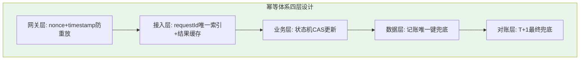

### 追问 6：你们支付系统最大的资损风险点在哪？怎么防？

**标准回答**：最大的风险点是"渠道已扣款但本地状态没更新"的窗口期——用户钱扣了，但我方还是"支付中"。防法：① 主动查单——对"支付中"超时订单用退避策略查渠道真实状态，不干等回调；② Outbox 保证记账消息不丢——即使回调处理到一半崩溃，消息在 Outbox 恢复后照常消费；③ T+1 对账兜底——把所有"渠道有本地无"的差异捞出来补记或冲正。三个机制覆盖了"回调丢失""处理崩溃""状态不一致"三个子场景，缺一不可。

---

## 九、2026 新增高频考点（基于互联网检索 + XTransfer 实战）

> 下面 5 类题是 2025–2026 一线大厂与支付机构面试里**新增/加重**的考点，也是上一版文档偏薄的地方。资料来源：CSDN《Java 支付系统架构设计、安全实践与高并发面试核心考点解析》（金融级稳定性、国密双模、PCI DSS 三级）、钱包行云风控测试题、风控反欺诈 AI 面试（图算法/时间滑窗特征）、支付高并发与风控实践（网关+Redis Lua 令牌桶+Sentinel）等。每题按「标准回答 + 深度拓展 + 项目支撑」展开，并落到 XTransfer 跨境收款的真实实践。

### Q17：支付风控反欺诈体系怎么设计？（事前/事中/事后三道防线）

- **标准回答**：风控要覆盖交易全生命周期，分三层——
  1. **事前（准入/评估）**：KYC 分级、设备指纹、IP/设备/账户历史画像，做基础风险初筛。
  2. **事中（实时拦截）**：支付过程中（下单/支付/提现）用**规则引擎（Drools）+ Redis BloomFilter**做毫秒级欺诈拦截，叠加**风险评分模型**（XGBoost/序列模型）输出风险分，超阈值直接拦截或转人工；跨境场景还要 **3DSecure** 动态验证。
  3. **事后（监控/追损）**：对已完成交易做行为分析、可疑交易上报、团伙挖掘与追损。
- **考察点**：能否把"规则 + 模型 + 人工"三层讲清楚，以及"实时性 vs 误杀率"的权衡。

**【深度拓展】** 2026 风控面试的进阶点在于**特征工程维度**：① **时间滑窗（Velocity）**——"近 1 小时交易频次/金额突变"是工业界标配，要讲多尺度窗口（1h/1d/7d/30d）和 RFM 变体；② **关系/图算法（Graph）**——新用户没有行为序列（冷启动），用无监督社群发现挖黑产团伙（100 个新号设备指纹关联到同一物理设备 = 批量攻击）；③ **数据穿越（Data Leakage）敏感度**——特征不能用未来信息，这是面试加分项。另一关键是**规则热更新**：Drools + Redis 实现规则动态下发，不重启服务。常见误答："上个模型就完事"——真实系统是"硬规则兜底线 + 模型提召回 + 人工兜疑难"。

**【项目支撑】** XTransfer 把风控抽成**独立子状态机**（免关联 → 关联 → 渠道调单），主资金流只关心"通过/拒绝/待补材料"，互不阻塞；规则层是**确定性规则 + 人工复核**（AI 只做评分建议，不直接决策扣款/放行，符合金融强合规）。渠道调单阶段正是为跨境"先放行后核贸易背景"设计的容错态。

**风控反欺诈三层技术栈图解**：

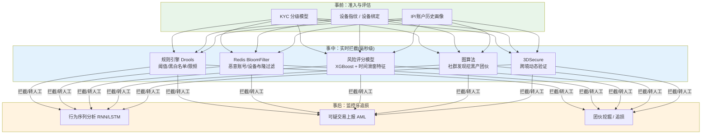

---

### Q18：支付系统怎么扛住高并发？（多级防护体系）

- **标准回答**：从接入到数据构建多级防护：① **接入层**——API 网关（Spring Cloud Gateway / Kong）做路由、限流、熔断，HTTPS + **HMAC-SHA256 签名**防篡改、参数校验、基础风控前置；② **流量控制**——Nginx `limit_req` 限单 IP，集群维度用 **Redis + Lua 令牌桶**做分布式 QPS 控制；③ **服务隔离与降级**——Sentinel/Hystrix 熔断降级，支付核心服务与普通业务**物理隔离**；④ **异步削峰**——支付请求接收与处理解耦，RocketMQ 削峰填谷，关键数据先落本地事务再异步同步；⑤ **网络**——Netty NIO 替代 BIO、连接池（HikariCP）复用、TCP Keepalive。
- **考察点**：能否讲出"接入→流量→服务→异步→数据"的分层，以及可度量指标（TPS≥5000、P99≤200ms、对账差异率 < 0.0001%）。

**【深度拓展】** 高并发的坑不在"加机器"，在**分层与隔离**：① 支付核心链路必须和营销/通知**物理隔离**，否则大促把营销打挂会连带拖垮支付；② 限流要"分布式"——单机关 Nginx 不够，集群要 Redis+Lua 令牌桶统一配额；③ 异步化要配**幂等消费**（见 Q2），否则削峰变丢消息；④ 指标要量化——面试官常问"你系统扛多少 QPS"，要能报 TPS/P99/差异率。还有一点常被忽略：**网络层**（Netty NIO、连接池、TCP Keepalive 避免空闲超时）是支付长连接（如渠道前置机）的关键。

**【项目支撑】** XTransfer 收款面对 100+ 渠道的并发回调与高并发入账，核心做法是"**同步落库（本地事务保证原子）+ 异步领域事件驱动下游**"：渠道回调验签后即 ACK，重逻辑走事件 + 任务补偿，绝不让下游慢调用阻塞资金入账主链路；SPI 适配层把渠道差异外置，新增渠道不影响核心并发模型。

**高并发多级防护体系图解**：

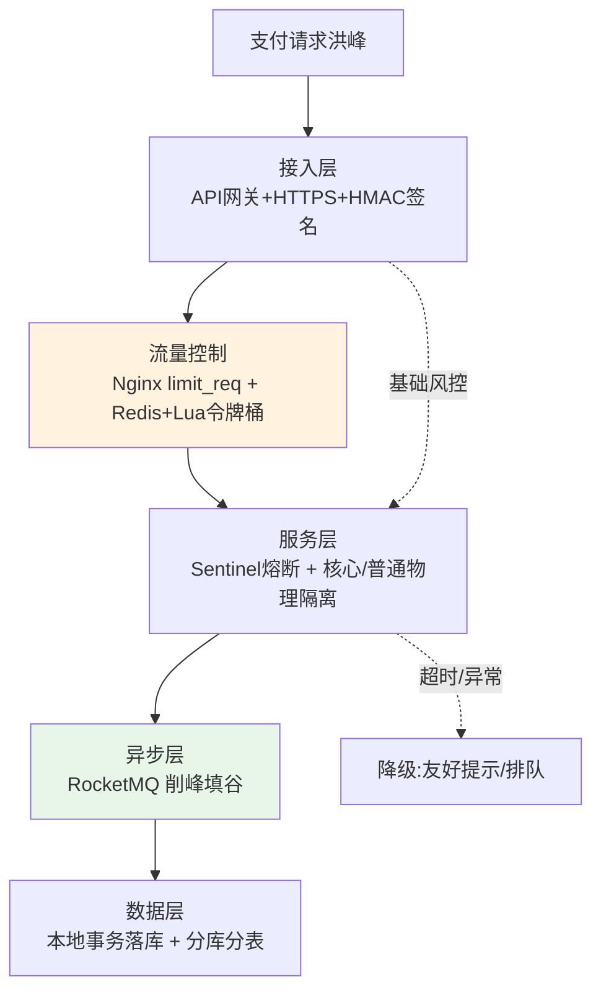

---

### Q19：清结算、对账、分账到底什么关系？头寸怎么管？

- **标准回答**：四者是支付闭环里**不同内涵**的环节——
  - **清算（Clearing）**：交易后计算债权债务、做冲减（"算清楚谁欠谁"），是信息/指令层面。
  - **结算（Settlement）**：资金真正从付款方转移到收款方、最终到账（"钱过去"），受 T+N 周期约束。
  - **分账**：一笔钱按规则分给多个主体（平台/商户/服务商），是资金分配。
  - **对账**：把各方数据（我方 vs 渠道 vs 总账 vs 明细）核对一致，是兜底校验。
  - **头寸管理**：管理"在途资金 / 资金池流动性"，保证结算时有足额头寸可拨，并管理 T+N 周期里的在途占用。余额账户（用户视角余额）与资金池账户（平台归集/过渡）用途不同——资金池必须合规（见 Q13 二清）。
- **考察点**：四者定义区分 + 结算周期/头寸/流动性意识。

**【深度拓展】** 这题考的是**财务闭环认知**，很多人把"清算"和"结算"混为一谈。关键区分：清算是"算账"（可异步、可批量），结算是"动钱"（受监管/周期约束、不可逆）。**头寸**是支付机构特有难点——跨境 T+N 长周期里，资金在途占用头寸，要预判流动性避免"该结算时没钱拨"。余额账户（用户余额）和资金池账户（平台过渡/归集）必须分离且合规，否则踩二清红线。面试官追问"结算失败了钱在哪"——在途挂账 + 差错处理（见 Q6/Q7）。

**【项目支撑】** XTransfer 的贸易订单管理系统（TOMS）管"额度 + 汇损补充 + 头寸"：跨境收款"钱先到、贸易背景后补"的预入账，本质是把"头寸占用"和"合规申报"解耦——预入账子领域独立聚合根管理在途资金，待贸易背景补齐再正式入账，既保流动性又保合规。

**支付闭环四环节与头寸图解**：

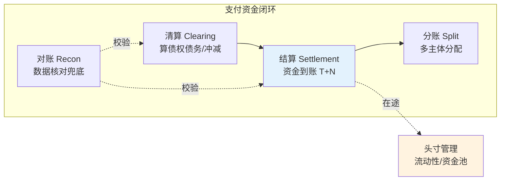

---

### Q20：支付系统怎么保证数据安全与密钥合规？

- **标准回答**：安全要贯穿每一层——① **传输层**：HTTPS + HSTS + OCSP Stapling，跨境用双向 TLS；② **应用层**：JWT + RBAC/ABAC 混合鉴权，敏感操作二次确认（U2F/WebAuthn），审计留痕（WAL 日志 + 区块链存证）；③ **数据层**：TDE 透明数据加密、列级动态脱敏、备份加密且密钥 KMS 托管；④ **算法与密钥**：敏感字段 **AES-GCM + 国密 SM4 双模**，硬件级用 **HSM 加密机**管密钥，接口签名用 RSA / **HMAC-SHA256**（注意参数排序与时间戳防重放）；⑤ **合规**：关键路径覆盖 **PCI DSS 三级**。
- **考察点**：能否分"传输/应用/数据/密钥"四层，并点出 HSM/KMS/国密双模/PCI DSS 等硬指标。

**【深度拓展】** 支付的"安全"不是加个 HTTPS 就完事，而是**纵深 + 可审计 + 合规可证**：① 密钥绝不能硬编码或落地明文——用 HSM 做根密钥、KMS 托管数据密钥（信封加密）；② 国密合规趋势——金融系统要求 SM4 国密支持，常见"AES-GCM + SM4 双模"平滑切换；③ 敏感字段列级脱敏（如卡号只显示后 4 位），且审计要"不可篡改"——WAL + 区块链存证是 2026 面试亮点；④ 防重放——签名必须带 timestamp + nonce，服务端校验时间窗。面试官追问"HSM 和 KMS 区别"——HSM 是硬件加密机（根密钥不出机），KMS 是密钥管理服务（管数据密钥生命周期），两者配合做信封加密。

**【项目支撑】** XTransfer 作为跨境收款平台，敏感信息（账户/证件/卡号）全程加密 + 列级脱敏，密钥经 KMS 托管、关键路径按 PCI DSS 思路收敛；合规动态表单里"渠道 → 场景 → 字段"决定哪些字段加密/脱敏/必报，把安全要求**配置化**而非散落代码。2.0 把"数据安全"作为资金安全三道防线之外的"可信底座"。

**支付安全分层架构图解**：

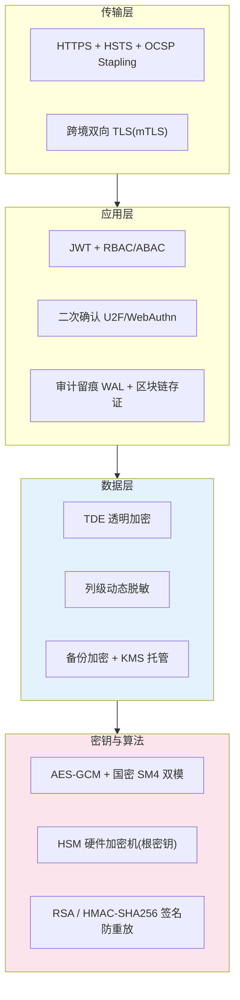

---

### Q21：跨境支付的合规与监管科技（RegTech）怎么做？

- **标准回答**：跨境比境内多了合规硬约束——① **KYC 分级**：按风险等级做客户身份分级；② **AML 反洗钱**：可疑交易识别与上报（如大额/高频/制裁名单命中）；③ **监管报送**：遵循《非银行支付机构网络支付业务管理办法》《JR/T 0197-2020 金融行业信息系统安全等级保护基本要求》等；④ **跨境通道合规**：SWIFT GPI / Stripe Connect / Adyen 等要满足 **PCI-DSS** 数据脱敏，跨境换汇要 **FX 锁汇**防汇率风险，跨境卡交易要 **3DSecure** 验证。
- **考察点**：能否把"合规"从口号落到"KYC/AML/报送/通道标准"四件具体事。

**【深度拓展】** RegTech 是 2026 跨境支付面试的**分水岭**考点。核心是"**把合规做成系统能力而非人肉审核**"：① KYC 分级不是"传个身份证"，而是风险分级 + 持续监控；②  AML 用制裁名单筛查（OFAC/EU 名单）+ 可疑交易规则（结构化 + 模型）；③ 监管报送要素随**渠道 × 场景**变化，必须用"动态表单"配置化（XTransfer 实践）；④ 跨境数据跨境传输要脱敏 + 合规通道。亮点：把"贸易背景"作为合规申报与额度管理的统一数据源（XTransfer 的 TOMS），让"钱"和"背景"闭环。面试官追问"制裁名单更新延迟导致漏筛怎么办"——名单用准实时同步 + 交易落库留痕可回溯 + 事后补筛 + 差错上报。

**【项目支撑】** XTransfer 合规子系统的精髓正是"**差异外置 + 配置化**"：① 合规动态表单按"渠道 → 场景 → 字段"配置申报要素，新增渠道/监管只改配置；② 贸易订单管理系统提供贸易背景，用于合规申报与额度；③ 风控独立子状态机含"渠道调单"阶段，为"先放行后核背景"留容错；④ 制裁名单筛查 + 可疑交易上报接入申报链路。这直接对应"0 资损 + 强合规"的双底线。

**跨境合规与 RegTech 全景图解**：

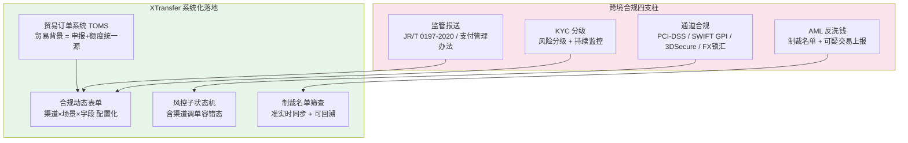

---

### 2026 支付面试趋势速览（给考官的"我跟上时代"信号）

| 趋势 | 面试怎么聊 | 与 XTransfer 的关联 |
|------|-----------|-------------------|
| **AI 赋能风控** | 规则 + 模型 + 人工三层，AI 只评分不决策 | 风控子状态机 + 确定性规则 + 人工复核 |
| **实时支付 Rails** | 实时到账对状态机/对账的改造 | 渠道回调 + 主动查单双通道兜底 |
| **隐私计算 / 跨境数据合规** | 联邦学习做跨机构反欺诈、数据不出域 | 合规动态表单 + 列级脱敏 |
| **稳定币 / CBDC 结算** | 了解其对清算结算时效与合规的影响 | 多币种 + 汇兑损益建模已具备基础 |
| **可观测性与资金安全** | 对账差异率 < 0.0001%、试算平衡实时告警 | 资金安全三道防线 + 实时试算 |

> 一句话总结：2026 的支付面试，地基仍是"幂等 + 状态机 + 对账 + 分布式事务"，但**上层加分项**已经转移到"AI 风控、高并发多级防护、清结算/头寸、国密/HSM/PCI-DSS 安全合规、跨境 RegTech"这五块。把它们和你的 XTransfer 跨境收款实战串起来，就是一份能讲到 5 分钟以上的高光答案。

<!-- EXPANDED -->
