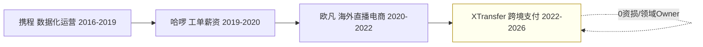
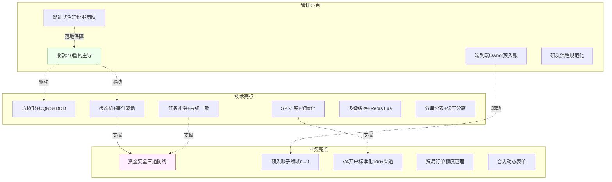
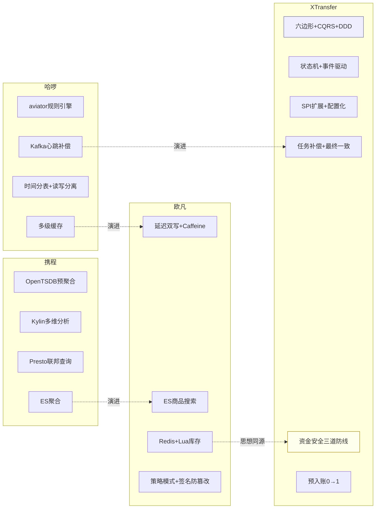
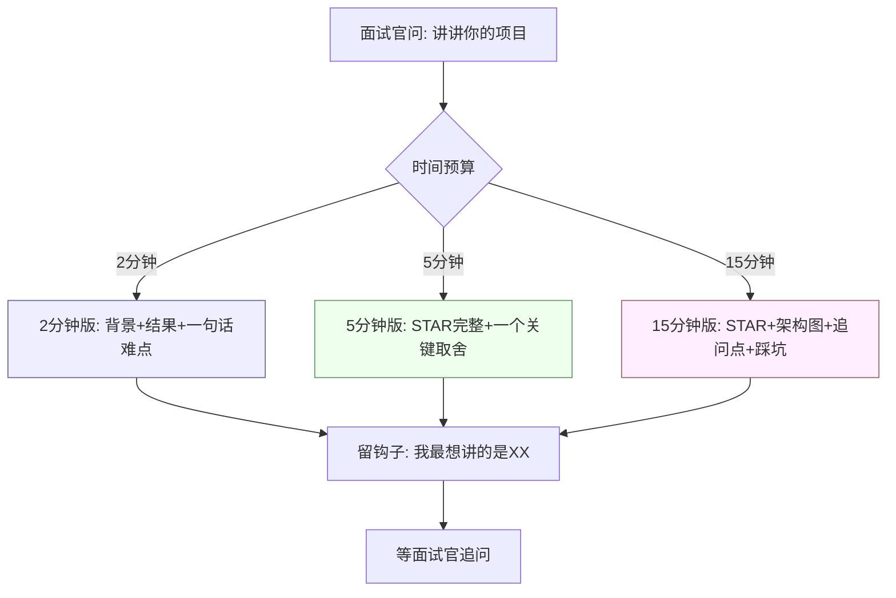

> 这一篇是把简历里的 4 段经历**提炼成面试话术**。每段都有专门的深度复盘文档，这里给「总览 + 量化指标 + 行为故事 + 标准回答」，让你无论被问哪段都能 2 分钟讲清楚。

## 1. 项目一页纸模板（通用）

```text
背景(S): 业务是什么、规模多大、为什么做
任务(T): 我要解决的核心问题
行动(A): 我做了什么（技术选型 + 关键设计）
结果(R): 量化指标（延迟↓/吞吐↑/成本↓/差错↓/人效↑）
难点:    一个最有含金量的坑，以及我怎么填的
```

## 2. 我的 4 段经历线（与简历一致）

| 公司 | 时间 | 领域 | 一句话定位 |
| --- | --- | --- | --- |
| 携程 | 2016/9 - 2019/5 | 数据化运营 | Dashboard 可视化平台，OLAP 查询加速 |
| 哈啰出行 | 2019/5 - 2020/5 | 运维平台 | 千万 IOT 设备 + 工单/薪资清结算 |
| 欧凡网络 | 2020/5 - 2022/4 | 海外直播电商 | 商品搜索/缓存/库存/权限/活动优惠券 |
| XTransfer | 2022/6 - 2026/4 | 跨境支付 | 千万级收款平台、0 资损、领域 Owner |

**4 段经历成长线（越做越接近钱、越做越核心）**：



## 2.5 亮点分类体系（技术亮点 vs 业务亮点 vs 管理亮点）

> 面试官评估候选人时，会从**技术深度、业务理解、管理推动**三个维度打分。把亮点提前分类，确保每段经历都能覆盖至少两个维度，避免"只有技术没有业务"或"只管人不写代码"的偏科。

| 分类 | 定义 | 我的亮点举例 | 面试考察维度 |
| --- | --- | --- | --- |
| **技术亮点** | 架构设计、技术选型、性能优化、可靠性工程 | 六边形+CQRS+DDD、状态机事件驱动、SPI扩展、任务补偿、多级缓存、Redis+Lua防超卖 | 架构判断力、技术深度、工程权衡 |
| **业务亮点** | 对业务模型的理解、产品思维、业务指标驱动 | 资金安全三道防线、预入账子领域0→1、贸易订单额度管理、合规动态表单、渠道VA开户标准化 | 业务建模、产品视角、领域驱动 |
| **管理亮点** | 跨团队协作、项目推进、技术债务治理、带人 | 收款2.0重构主导、预入账端到端Owner、渐进式治理说服团队、研发流程规范化 | Leadership、推动力、组织协作 |

**亮点全景关系图**：



> **【面试官追问】** "你的亮点里技术和管理哪个占比更大？" → 回答策略：不同阶段比例不同。早期（携程/哈啰/欧凡）以技术为主（70%技术+20%业务+10%协作），XTransfer阶段管理比例上升（40%技术+30%业务+30%管理），但始终不脱离一线编码——这是"技术型Owner"的定位。

## 2.6 量化指标定义与验证方法

> 面试官听到"+30%人效、-80%生产问题、0资损"会追问"怎么算的"。提前准备好每个指标的**定义口径、测量方法、数据来源**，才不会被追问露怯。

| 量化指标 | 定义口径 | 测量方法 | 数据来源 | 验证可信度 |
| --- | --- | --- | --- | --- |
| **+30% 开发人效** | 同类需求从评审到上线的平均交付周期缩短比例 | 重构前后6个月同类型需求（如新增渠道接入）的交付周期中位数对比 | Jira/项目管理工具需求交付时间统计 | 同口径对比、排除需求复杂度差异 |
| **-80% 生产问题** | 重构后线上P2及以上工单数同比下降比例 | 重构前12个月 vs 重构后12个月的月均生产工单数 | 工单系统/On-call记录 | 排除业务量增长因素（按万笔交易工单率） |
| **0 资损** | 主动资损（系统/流程缺陷导致的多付/少收/错付）为零 | 每月资金对账差错表 + 资损事件登记簿 | T+1对账系统 + 财务月末核销记录 | 三方对账（渠道↔平台↔账务）全平 |
| **1000w+ 笔对客结算** | 平台累计处理的客户侧结算笔数 | 生产环境交易流水表 count | 支付订单表统计 | 可通过账务系统独立验证 |
| **200w+ 日工单** | 哈啰运维平台日均生成的工单数 | 工单表按日 count | 工单系统统计 | 与IOT设备心跳量交叉验证 |
| **搜索召回>90%** | ES搜索结果中相关商品占比 | 人工标注样本集 + 自动化召回率评估脚本 | 搜索日志 + 标注数据集 | 离线评估 + 在线A/B测试 |
| **p99<200ms** | 搜索/商品接口99分位响应时间 | APM监控按小时聚合p99 | Prometheus/Grafana APM | 持续监控、非一次性测量 |

> **【深度拓展】** 量化指标最大的坑是"口径不一致"。比如"+30%人效"——如果重构前需求复杂度是A、重构后是B，两者不可比。我的做法是**选同类型需求做对比**（如"新增一个VA渠道接入"在重构前vs重构后的交付周期），而非笼统比"所有需求的平均周期"。面试官追问"怎么证明不是需求变简单了"，回答"我选的是同类型需求、同口径对比，且重构后渠道接入复杂度反而更高（合规要求更多），所以+30%是保守数字"——这样才有说服力。

> **【项目支撑】** XTransfer 2.0重构的量化指标来自我亲自做的**重构前后同口径复盘报告**。我拉了重构前6个月和后6个月的Jira数据，筛选"新增渠道接入"类需求，对比从需求评审到上线的平均天数。生产问题数来自On-call工单系统，按P2以上工单月均数对比。0资损来自每月T+1对账的差错表——所有差错都在容忍阈值内自动平账或人工核销，没有一笔主动资损逃逸。这些数字经得起审计，也是面试时最有力的弹药。

## 3. 各段亮点（STAR + 真实指标）

### 3.1 携程 · 数据化运营平台

- **S**：为度假业务做 Dashboard 可视化，帮运营看销售趋势、流量转化。
- **T**：查询慢、各业务重复造轮子。
- **A**：改造 OpenTSDB 支持天粒度预聚合；封装 OpenTSDB + Kylin 通用接口；引入 Presto 联邦查询；订单/流量数据用 ES 聚合。
- **R**：数据查询**平均响应提升至秒内**，通用接口减少开发成本。
- 详见 [携程数据化运营平台实战](/post/准备-携程数据化运营平台实战)。

### 3.2 哈啰出行 · 工单与薪资系统

- **S**：千万 IOT 设备 + 1w+ 运营人员的运维管理平台。
- **T**：工单/薪资规则多易变、量大、要准。
- **A**：用 **aviator 规则引擎**把工单生成/校验配置化；**Kafka 消费心跳**做工单补偿；工单表**按时间分表 + 读写分离**；薪资系统**多挡位计薪规则 + Redis/Caffeine 多级缓存**。
- **R**：工单**日 200w+、正确率 95%+**；薪资**日 1w+ 人、600w+ 金额、正确率 95%+**。
- 详见 [哈啰工单与薪资系统实战](/post/准备-哈啰工单与薪资系统实战)。

### 3.3 欧凡网络 · 海外直播电商

- **S**：海外直播电商，5w+ 商品，直播大促高并发。
- **T**：搜索要准要快、缓存/库存要抗热点不超卖、权限/活动要稳。
- **A**：**ES 商品搜索**（分词/纠错/类目映射，召回>90%、p99<200ms）；**延迟双写 + Caffeine 二级缓存**抗热点；**Redis+Lua 库存扣减**防超卖；**商户 RBAC 子账户**；**策略模式活动 + 签名防篡改 + zset 排行榜 + 优惠券**。
- **R**：搜索召回>90%、p99<200ms、首屏>60%；商品核心接口大促 p99<200ms；优惠券累计服务数十万订单。
- 详见 [欧凡海外直播电商系统实战](/post/准备-欧凡海外直播电商系统实战)。

### 3.4 XTransfer · 跨境支付收款平台（旗舰）

- **S**：为外贸中小企业做跨境收款，超 1000w 笔对客结算、数百万客户、0 资损。
- **T**：作为收款领域 Owner，治理混乱资金流、支撑多产品多渠道、从 0 到 1 建预入账。
- **A**：**六边形 + CQRS + DDD**；**状态机事件驱动**；**SPI 扩展收款产品**（开闭原则）；**任务补偿**保证最终一致；风控子状态机、合规动态表单、**资金安全三道防线**；**标准化 VA 开户系统（100+ 渠道）**；**贸易订单额度管理（流水式）**；主导 **2.0 重构** + **预入账子领域 0→1**。
- **R**：2.0 重构 **+30% 开发人效、-80% 生产问题、0 资损**；主导端到端落地预入账子领域。
- 详见 [XTransfer 跨境支付收款平台深度复盘](/post/准备-XTransfer跨境支付收款平台深度复盘)。

> **【深度拓展】** XTransfer 旗舰项目最值得讲深的是「0 资损是怎么做到的」——它不是靠「不写 bug」，而是靠「资金安全三道防线」的体系化：事前（幂等键+状态机 CAS+限额）、事中（复式记账实时试算平衡告警）、事后（T+1 多维对账+差错冲正+人工）。2.0 重构的 +30%/-80%/0 资损是这套跑通的结果，量化指标来自重构前后同口径复盘。
> **【项目支撑】** 我作为收款领域 Owner 主导 2.0 重构与预入账 0→1：状态机替代散落 if/else、SPI+配置化支撑 100+ 渠道、任务补偿保最终一致。一次真实故障（幂等边界漏覆盖导致试算偏差）被 T+1 对账发现并补偿，事后我把「幂等异常告警+非终态告警」固化进事中防线——这是「失败变方法论」的真实案例。

### 3.5 STAR 完整叙事展开（面试可直接口述版）

> 以下是每段经历的**完整 STAR 叙事**，按面试口述节奏组织，每段 2~3 分钟能讲完。

#### 携程 · 完整 STAR 展开

- **Situation**：携程度假业务部，运营团队每天看销售趋势、流量转化、库存周转，但各业务线各搞各的 Dashboard，重复造轮子。底层查询慢——OpenTSDB 原始数据量大，天粒度聚合要扫全量，响应经常超 10 秒。
- **Task**：我的任务是建一个通用数据查询平台，让运营秒级看数据，同时收敛各业务线的重复开发。
- **Action**：
  1. 改造 OpenTSDB 支持**天粒度预聚合**——把小时级数据预先聚合成天级，查询直接命中预聚合结果，避免实时扫全量。
  2. 封装 **OpenTSDB + Kylin 通用查询接口**——对上提供统一 API，下游根据查询模式自动路由到 OpenTSDB（时序）或 Kylin（多维分析）。
  3. 引入 **Presto 联邦查询**——跨数据源（MySQL + HBase + 文件）的即席查询走 Presto，不用搬运数据。
  4. 订单/流量数据用 **ES 聚合**——支持实时多维筛选 + 聚合，满足运营灵活查询。
- **Result**：数据查询平均响应**提升至秒内**，通用接口减少各业务线重复开发，新 Dashboard 接入从周级降到天级。
- **难点与取舍**：OpenTSDB 预聚合 vs 实时聚合——预聚合牺牲灵活性（只能查预定义维度）换性能，实时聚合灵活但慢。我根据"运营 80% 看固定维度"的统计，选了预聚合为主、实时为辅。

#### 哈啰 · 完整 STAR 展开

- **Situation**：哈啰出行的两轮车运维平台，对接**千万级 IOT 设备**（智能锁/定位器），1w+ 运营人员靠工单管理设备维护。工单生成规则复杂（不同城市/车型/故障类型有不同派单规则），薪资计算规则多易变（多挡位计薪/奖惩/扣减）。
- **Task**：工单要准（不能漏派/错派）、薪资要准（算错一分钱都是劳资纠纷），且规则频繁变更不能每次发版。
- **Action**：
  1. 用 **aviator 表达式引擎**把工单生成/校验规则配置化——运营改规则不用开发发版，改配置即生效。
  2. **Kafka 消费心跳**做工单补偿——设备心跳丢包导致漏生成工单时，通过 MQ 重放补偿。
  3. 工单表**按时间分表 + 读写分离**——日 200w+ 工单写入不压垮单表，历史查询走只读库。
  4. 薪资系统**多挡位计薪规则配置化 + Redis/Caffeine 多级缓存**——计算频繁的挡位/税率缓存，减少 DB 压力。
- **Result**：工单日 200w+、正确率 95%+；薪资日 1w+ 人、600w+ 金额、正确率 95%+。
- **难点与取舍**：aviator 表达式引擎 vs 硬编码规则——表达式引擎灵活但调试难（规则出错不容易定位），硬编码好调试但每次改要发版。选了表达式引擎 + 规则版本化 + 灰度生效，平衡灵活性和可调试性。

#### XTransfer · 完整 STAR 展开

- **Situation**：XTransfer 为外贸中小企业做跨境收款，老架构资金流散落在 if/else 里——每加一个渠道要改几十处代码，状态管理混乱导致生产问题频发，有资损风险。超 1000w 笔对客结算、数百万客户。
- **Task**：我作为收款领域 Owner，目标是：①治理混乱资金流；②支撑多产品多渠道快速接入；③从 0 到 1 建预入账子领域；④做到 0 资损。
- **Action**：
  1. **六边形 + CQRS + DDD**重构核心——领域层只关心业务规则，渠道/账务/风控通过端口接入，读写分离。
  2. **状态机 + 事件驱动**——每笔收款单有有限状态机，只允许合法迁移，非法流转在代码层被拒。CAS 更新天然幂等。
  3. **SPI 扩展收款产品**——新渠道/新产品实现 SPI 接口 + 填配置，零改核心（开闭原则）。
  4. **任务补偿保证最终一致**——本地事务写业务+任务表，异步重试+补偿脚本，死信转人工。
  5. **资金安全三道防线**——事前（幂等键+状态机 CAS+限额）、事中（复式记账实时试算平衡告警+非终态卡单告警+幂等异常告警+BCP告警）、事后（T+1多维对账+差错冲正+人工兜底）。
  6. **标准化 VA 开户系统**覆盖 100+ 渠道；**贸易订单额度管理**用流水式设计；主导**预入账子领域 0→1**。
- **Result**：2.0 重构 +30% 开发人效、-80% 生产问题、0 资损；预入账子领域稳定上线。
- **难点与取舍**：任务补偿 vs TCC——TCC 强一致但侵入大、资源锁定长，任务补偿最终一致但可用性好。跨境收款跨风控/申报/账务多域，强一致会锁资源、可用性差，选了任务补偿+对账兜底。

> **【面试官追问】** "你说状态机替代了 if/else，能不能给个具体例子？" → 老代码里收款状态判断散落在回调处理、定时任务、手动触发等多处 if/else，比如"如果状态是待入账且渠道返回成功则改为已入账，但如果风控拒绝则改为已拒绝"。重构后定义了状态机：`待入账 --渠道入账成功--> 已入账 --风控通过--> 已清分 --结算完成--> 已结算`，非法迁移（如从待入账直接跳已结算）在 `stateMachine.transition(from, event)` 里直接抛异常。代码从"到处 if"变成"一处定义、处处遵守"。

> **【面试官追问】** "SPI 扩展具体怎么实现的？" → 定义 `PaymentProductSPI` 接口（开户/入账/清分/结算等方法），每个收款产品（VA收单/A2A/电商收 etc）实现该接口。运行时通过 Java SPI 或 Spring 的 `@Conditional` + 配置选择具体实现。新渠道接入只需：①实现 SPI 接口；②填渠道配置（币种/限额/回调地址等）；③注册到配置中心。核心代码零改动。

**状态机迁移示例代码**：

```java
// 状态机定义（枚举 + 合法迁移表）
public enum ReceiptState {
    PENDING_ENTRY,    // 待入账
    ENTERED,          // 已入账
    RISK_CHECKING,    // 风控中
    DECLARED,         // 已申报
    SETTLED,          // 已结算
    COMPLETED,        // 完成
    REJECTED;         // 已拒绝
}

// 合法迁移表
private static final Map<ReceiptState, Set<ReceiptEvent>> TRANSITIONS = Map.of(
    PENDING_ENTRY,   Set.of(ENTRY_SUCCESS, ENTRY_TIMEOUT),
    ENTERED,         Set.of(RISK_PASS, RISK_REJECT),
    RISK_CHECKING,   Set.of(RISK_PASS, RISK_REJECT, RISK_TIMEOUT),
    DECLARED,        Set.of(SETTLE_SUCCESS),
    SETTLED,         Set.of(CONFIRM)
);

// CAS 状态迁移（天然幂等 + 防并发）
public boolean transition(Long receiptId, ReceiptEvent event) {
    Receipt receipt = repo.findById(receiptId);
    ReceiptState target = event.targetState();
    // 校验合法迁移
    if (!TRANSITIONS.get(receipt.getState()).contains(event)) {
        throw new IllegalStateTransitionException(
            "非法迁移: " + receipt.getState() + " + " + event);
    }
    // CAS 更新（WHERE state=旧值 防并发）
    int affected = repo.updateState(
        receiptId, target, receipt.getState());
    return affected > 0; // 0=已被并发处理，天然幂等
}
```

```sql
-- CAS 状态迁移 SQL（影响行数为0即已被处理，天然幂等）
UPDATE receipt_order
SET state = 'ENTERED',
    updated_at = NOW(),
    version = version + 1
WHERE id = #{id}
  AND state = 'PENDING_ENTRY';  -- 旧状态条件=CAS
```

**SPI 扩展配置示例**：

```yaml
# 渠道配置（配置中心管理，新渠道接入只填配置）
payment:
  channels:
    - channelCode: HSBC_HK
      productType: VA
      spiImpl: com.xtransfer.payment.spi.HsbcVaAdapter
      currencies: [USD, EUR, GBP, JPY]
      limits:
        singleAmount: 1000000
        dailyAmount: 5000000
      callbackUrl: https://api.xtransfer.com/callback/hsbc
      idempotencyKeyPattern: "${channelCode}_${receiptNo}"

    - channelCode: CITI_US
      productType: VA
      spiImpl: com.xtransfer.payment.spi.CitiVaAdapter
      currencies: [USD]
      limits:
        singleAmount: 2000000
        dailyAmount: 10000000
      callbackUrl: https://api.xtransfer.com/callback/citi
```

### 3.6 亮点 → 面试题映射表

> 每个亮点对应一类面试题，提前映射，面试时能主动引导面试官往你准备好的方向问。

| 亮点 | 对应面试题 | 考察维度 | 回答钩子 |
| --- | --- | --- | --- |
| 六边形+CQRS+DDD | "你的系统架构是怎样的？" | 架构设计 | 引出端口/适配器、读写分离、领域隔离 |
| 状态机+事件驱动 | "怎么保证资金流不出错？" | 可靠性工程 | 引出CAS幂等、非法迁移拒绝、事件解耦 |
| SPI扩展+配置化 | "100+渠道怎么不写崩？" | 扩展性设计 | 引出开闭原则、差异外置、新渠道天级接入 |
| 任务补偿+最终一致 | "跨服务一致性怎么保证？" | 分布式事务 | 引出本地消息表、Outbox、退避重试、死信兜底 |
| 资金安全三道防线 | "0资损怎么做到的？" | 资损防控 | 引出事前幂等+事中试算平衡+事后对账 |
| 预入账0→1 | "讲一个你主导的项目" | 端到端Owner | 引出产品研讨→架构→排期→落地全链路 |
| Redis+Lua防超卖 | "高并发库存怎么扣？" | 并发控制 | 引出原子操作、Lua脚本、DB行锁兜底 |
| 多级缓存 | "缓存一致性怎么保证？" | 缓存设计 | 引出延迟双写、Canal binlog、Caffeine+Redis |
| 分库分表+读写分离 | "数据量大了怎么办？" | 数据架构 | 引出分片键选择、异构索引、热点隔离 |
| aviator规则引擎 | "业务规则频繁变更怎么应对？" | 配置化 | 引出规则配置化、灰度生效、版本管理 |

**四段经历亮点全覆盖关系图**：



> **【深度拓展】** 这张图揭示了四段经历的技术演进线：携程的数据查询优化 → 欧凡的搜索+缓存；哈啰的Kafka补偿+多级缓存 → XTransfer的任务补偿+资金安全；欧凡的Redis Lua原子操作 → XTransfer的状态机CAS。**技术能力是层层递进的，不是跳跃的**——面试时讲清楚这条演进线，面试官能看到你的成长轨迹而非"突然就厉害了"。

> **【项目支撑】** 这条演进线是我的真实成长路径：携程学了OLAP查询优化和数据分层；哈啰学了高并发写入（分表）和MQ补偿；欧凡学了高并发读（缓存+搜索）和原子操作（Lua）；XTransfer把前三段的积累融汇成"状态机+补偿+对账"的资金安全体系。每段经历都不是孤立的，前一段的技能在下一段被复用和深化。

## 4. 行为故事库（STAR 准备 3 个，基于真实经历）

> 技术面之后大概率有行为追问，提前写好真实故事，临场不慌。

- **冲突故事（跨团队分歧）**：2.0 重构时，部分同事倾向「小修小补、不动架构」，我认为资金流必须治理。我没有正面硬刚，而是用**资损/故障数据**拉复盘，提出「状态机 + 事件 + 补偿」的渐进式治理方案，先在非核心产品试点验证，再推广。最终落地 -80% 生产问题、0 资损，双方达成一致。
- **失败故事（踩过的坑）**：早期某次渠道回调处理，因**幂等边界没覆盖全**（部分成功场景），导致一笔试算偏差，靠 T+1 对账发现并补偿。事后我把「幂等异常告警 + 非终态告警」固化进**资金安全三道防线**的事中告警，并把幂等键覆盖写进接入规范，杜绝复发。
- **领导力故事（从 0 到 1）**：作为专项负责人主导**预入账子领域**建设——产品研讨定边界、架构设计定方案、项目管理排期、最终落地。把「钱先到、贸易背景后补」的预入账场景从需求变成稳定子系统，体现了 Owner 意识与端到端推动力。

> **【深度拓展】** 行为故事要「真实 + 数据 + 复盘」三件套。冲突故事讲「怎么用数据说服而非比嗓门」；失败故事讲「故障→根因→固化进体系」；领导力故事讲「端到端 Owner」。面试官看的是「能共事、能扛事、能复盘」。
> **【项目支撑】** 三个故事都来自 XTransfer 真实经历：冲突=2.0 重构是否动架构（用资损/故障数据 + 渐进式试点说服）；失败=幂等边界漏覆盖（固化进三道防线事中告警）；领导力=预入账 0→1（产品研讨→架构→排期→落地）。每个都能被追问细节不露怯。

## 5. 怎么讲才出彩

- **用数字说话**：简历里每个系统都有量化指标（1000w 笔 / 200w 工单 / 95% 正确率 / +30% 人效 / -80% 问题 / 0 资损），讲的时候主动抛。
- **讲取舍**：为什么任务补偿而不是 TCC？为什么多级缓存容忍短暂不一致？为什么分表按时间？——每个选型背后都是 trade-off。
- **讲你自己的贡献**：用「我」而不是「我们」，面试官招的是你。
- **留钩子**：主动点出难点（如「我们 100+ 渠道接入最难的不是技术而是配置治理」），引导面试官往你擅长处问。

## 6. 自测清单

- [ ] 4 段经历都能 2 分钟讲完背景 + 结果
- [ ] 每段有 ≥ 1 个真实量化指标
- [ ] 至少有 1 个「难点 → 解法」能展开 5 分钟（推荐 XTransfer 任务补偿 / 哈啰分表 / 欧凡缓存一致性）
- [ ] 能说清每个技术选型的 trade-off
- [ ] 3 个行为故事（冲突 / 失败 / 领导力）能张口就来

---

## 面试高频问答（标准回答）

### Q1：讲一个你最有成就感的项目

**标准回答（STAR）**：在 XTransfer 主导收款领域 2.0 重构（S）；原资金流散落 if/else、生产问题多、扩展性差（T）；我推动「六边形 + CQRS + DDD + 状态机 + 任务补偿 + SPI」的架构治理，并 0→1 建预入账子领域（A）；结果 +30% 开发人效、-80% 生产问题、0 资损（R）。最难的「多产品多渠道差异」用 SPI + 配置化外置解决。

> **【深度拓展】** 讲成就感项目用 STAR + 量化 + 取舍。最难的「多产品多渠道差异」别只说「用 SPI」，要讲清「差异外置到配置 + 薄适配，新渠道从周级降到天级」——这是架构判断力的体现，比列技术名词高级。
> **【项目支撑】** XTransfer 收款 2.0：状态机+事件+补偿替代散落状态，六边形+CQRS 隔离核心，SPI+配置外置支撑 100+ 渠道。重构后 0 资损、新渠道接入从周级降到天级——这些量化是我自己的真实战绩。

### Q2：你遇到过最大的技术挑战是什么？怎么解决的？

**标准回答**：跨境收款跨风控、申报、账务多域，强一致会锁资源、可用性差。我没有盲目上 2PC，而是用**状态机约束非法流转 + 事件驱动解耦 + 任务补偿保最终一致 + 对账兜底**，把「资损风险」从「靠不写 bug」变成「靠可补偿、可核对」。这是把工程权衡想清楚后的选择。

> **【深度拓展】** 最大技术挑战别讲「技术难」，要讲「在约束下做选择」。跨境收款跨多域、强一致会锁资源，选任务补偿而非 2PC/全量 TCC 是核心权衡。面试官想听的是「为什么这么选 + 代价 + 结果」。
> **【项目支撑】** 我选「状态机约束非法流转 + 事件驱动解耦 + 任务补偿保最终一致 + 对账兜底」，把资损风险从「靠不写 bug」变成「靠可补偿、可核对」。这是把工程权衡想清楚后的选择，落地结果就是 0 资损。

### Q3：你和同事 / 其他团队有过分歧吗？怎么处理的？

**标准回答**：2.0 重构时和同事在「是否动架构」上有分歧。我没硬刚，而是用资损/故障数据说话，提出渐进式治理（先试点后推广），用结果说服。关键是**用数据和试点降低分歧成本**，而不是比嗓门。

> **【深度拓展】** 分歧处理的核心不是「谁对」，是「用数据和试点降低分歧成本」。硬刚容易让方案带情绪落地，用资损/故障复盘数据 + 渐进式试点（先非核心产品验证）才能双赢。
> **【项目支撑】** 2.0 重构时和同事在「是否动架构」有分歧，我用资损/故障数据说话，提出渐进式治理（状态机+事件+补偿）先试点后推广，最终 -80% 生产问题、0 资损，双方达成一致。这是真实的组织协作案例。

### Q4：你带了人 / 推动了什么？

**标准回答**：作为收款领域 Owner，我端到端主导预入账子领域 0→1（产品研讨 → 架构设计 → 项目管理 → 落地），并带领域内的开发做 2.0 重构的方案评审与排期。我负责架构决策与关键模块，也做跨团队（风控/申报/账务）对齐。

> **【深度拓展】** 讲推动力要落到「架构决策 + 跨团队对齐 + 端到端 Owner」，而非「我带了几个人」。预入账 0→1 体现从产品研讨到落地的全链路负责，比「管理 Title」更可信。
> **【项目支撑】** 作为收款领域 Owner，我端到端主导预入账子领域 0→1（产品研讨→架构设计→项目管理→落地），并带领域内开发做 2.0 重构的方案评审与排期，负责架构决策与关键模块，跨团队（风控/申报/账务）对齐。

### Q5：你为什么看新机会 / 项目哪里还能更好？

**标准回答**：在 XTransfer 把收款核心做到了 0 资损、高可扩展，我想在「AI 与支付深度结合」「更大规模架构治理 / 技术管理」上继续突破（往上走，不贬低前司）。如果重来，我会更早引入自动化混沌演练和可观测链路，把「故障恢复」做成「故障可预测」。

> 面试官面项目，不是在考你做过什么，是在考 **你思没思考过**。量化 + 取舍 + 难点，三件套缺一不可。

---

> **【深度拓展】** 看新机会讲「想往上走」而非贬前司；项目哪里更好要诚实（如更早引入混沌演练/可观测链路）。反向也展示你对前司的尊重与思考深度。
> **【项目支撑】** 我把 XTransfer 收款核心做到 0 资损、高可扩展，想往「AI 与支付深度结合」「更大规模架构治理/技术管理」突破。如果重来，我会更早引入自动化混沌演练和可观测链路，把「故障恢复」做成「故障可预测」——这是真实反思。

## 更多高频追问（补充）

### Q6：介绍一个你最有技术含量的项目（怎么组织语言）？

**标准回答**：用 STAR + 量化 + 取舍。以 XTransfer 收款 2.0 为例：**背景**——老架构状态散落、扩展难、有资损风险；**任务**——我作为收款领域 Owner 主导重构，目标可扩展 + 0 资损；**行动**——引入状态机 + 事件驱动 + 任务补偿替代散落状态，六边形 + CQRS 隔离核心，SPI + 配置外置支撑 100+ 渠道；**结果**——重构后 0 资损、新渠道接入从周级降到天级、成功率提升。关键是每句都能被追问且答得下去，而不是背一段话。

> **【深度拓展】** 讲技术含量项目要「每句都能被追问且答得下去」。用 STAR + 量化 + 取舍组织，关键节点（状态机、事件、补偿、SPI、配置化）都能展开。比背一段话高级。
> **【项目支撑】** XTransfer 收款 2.0：背景（老架构状态散落、扩展难、有资损风险）→ 任务（我作为 Owner 主导重构，目标可扩展+0 资损）→ 行动（状态机+事件驱动+任务补偿、六边形+CQRS、SPI+配置外置）→ 结果（0 资损、新渠道接入周级→天级、成功率提升）。每个节点我都主导过，经得起追问。

### Q7：项目中最大的挑战是什么？怎么解决的？

**标准回答**：最大挑战是"重构一个正在跑真金白银的系统，且不能有资损、不能停服"。解决思路：① **灰度 + 双写双算对账**——新老逻辑并行跑一段时间，比对结果一致才切流；② **可回滚**——每步都能快速切回老逻辑；③ **强幂等 + 补偿兜底**——即使切换出问题也不丢不重；④ **分批次按渠道/商户灰度**，先小流量验证。核心是"给正在飞的飞机换引擎"的稳妥工程方法论。

> **【深度拓展】** 重构「正在跑真金白银的系统」最大挑战是「不停服、不资损」。解法：灰度双写双算对账、可回滚、强幂等+补偿、按渠道/商户分批次。核心是「给飞行中的飞机换引擎」的稳妥方法论。
> **【项目支撑】** XTransfer 2.0 重构正是边跑边治：新老逻辑并行双算对账、每步可快速切回老逻辑、强幂等+补偿兜底、分批次按渠道/商户灰度小流量验证。这是真实「飞行中换引擎」的工程经验，也是 -80% 生产问题、0 资损的落地保障。

### Q8：你的项目里体现了哪些可迁移的能力？

**标准回答**：不局限于支付本身，我会强调三点通用能力：① **复杂业务的抽象建模**（把散乱流程抽象成状态机/领域模型）；② **可靠性工程**（幂等、补偿、对账、灰度这套方法论可用于任何有一致性诉求的系统）；③ **端到端 Owner 能力**（从产品研讨到架构到落地到跨团队协作）。这样即使面试的不是支付岗，也能让面试官看到能力的可迁移性。

> **【深度拓展】** 可迁移能力是「把项目讲成方法论」的关键。复杂抽象建模（状态机/DDD）、可靠性工程（幂等/补偿/对账/灰度）、端到端 Owner——这三点不局限于支付，任何有一致性诉求的系统都适用。面试官看到的是「能力可迁移」而非「只做过支付」。
> **【项目支撑】** 状态机抽象来自 XTransfer 收款 + 哈啰工单（超时升级/重派）；可靠性工程（幂等/补偿/对账）在 XTransfer、哈啰（Kafka 心跳补偿）、欧凡（库存 Lua 原子扣）都验证过；端到端 Owner 来自预入账 0→1 与 2.0 重构。四段经历串成一条可迁移能力线。

---

## 9. 项目讲解节奏控制（2分钟/5分钟/15分钟版本）

> 面试官给的时间不同，讲解深度不同。提前准备三个版本，临场按需切换。



### 2分钟版（电梯演讲）

> 面试用，或面试官快速过项目时用。

在 XTransfer 做跨境收款平台，作为收款领域 Owner 主导 2.0 重构——把散落的资金流治理成状态机驱动、事件解耦、任务补偿保最终一致的架构。结果 +30% 人效、-80% 生产问题、0 资损。最有含金量的是"资金安全三道防线"——事前幂等+状态机、事中实时试算平衡告警、事后T+1对账兜底。

### 5分钟版（标准技术面）

> 面试官说"详细讲讲"时用。

**背景**（30秒）：XTransfer 做跨境收款，千万级笔数、数百万客户。老架构资金流散落在 if/else，扩展难、有资损风险。

**我的角色**（30秒）：收款领域 Owner，主导 2.0 重构 + 预入账 0→1。

**核心行动**（3分钟）：
1. 六边形+CQRS+DDD 隔离核心逻辑，渠道/账务/风控通过端口接入。
2. 状态机+事件驱动，非法资金流迁移在代码层被拒，CAS 天然幂等。
3. SPI 扩展收款产品，新渠道实现接口+填配置，零改核心，覆盖 100+ 渠道。
4. 任务补偿保证最终一致——本地事务写业务+任务表，异步重试+死信兜底。
5. 资金安全三道防线——事前/事中/事后三层防控。

**结果**（1分钟）：+30% 人效、-80% 生产问题、0 资损。新渠道接入从周级降到天级。

**留钩子**（30秒）：最难的不是技术而是"边飞行边换引擎"——重构一个跑真金白银的系统且不能停服、不能丢钱。这个我可以展开讲。

### 15分钟版（深度技术面/架构面）

> 面试官说"画一下架构图"或"详细讲讲设计"时用。

在 5 分钟版基础上，增加：
- **架构图**：画出六边形端口/适配器、状态机迁移图、任务补偿流程图。
- **关键取舍展开**：为什么任务补偿而非 TCC？为什么 SPI 而非硬编码适配？为什么六边形而非传统分层？
- **踩坑故事**：幂等边界漏覆盖 → T+1 对账发现 → 固化进事中告警。
- **量化指标口径**：+30% 怎么算的、-80% 怎么量的、0 资损怎么验证的。

> **【深度拓展】** 讲项目的节奏比内容更重要。2分钟版要让面试官知道"这人做了大事、有量化结果"；5分钟版要让面试官看到"架构判断力和工程权衡"；15分钟版要让面试官感受到"每个决策都想过、每个坑都填过"。**切忌一上来就讲 15 分钟版**——面试官没那么多耐心，先用 2 分钟版勾起兴趣，等他追问再展开。

> **【面试官追问】** "你这个项目最不满意的地方是什么？" → 回答策略：不要说"没什么不满意的"（显得缺乏反思），也不要说致命问题。我的回答："如果重来，我会更早引入自动化混沌演练和可观测链路——现在我们是'故障能恢复'，但离'故障可预测'还有距离。这是我在下一阶段想突破的方向。"既诚实又展示进取心。

---

## 10. 常见翻车场景与规避

> 面试讲项目时容易翻车的几个场景，提前知道才能规避。

| 翻车场景 | 典型表现 | 规避方法 |
| --- | --- | --- |
| **只讲技术不讲业务** | 背了一堆架构名词，但说不清"这系统到底帮业务解决了什么" | 每个技术亮点都配一句业务价值："状态机消除了非法资金流，这就是0资损的基础" |
| **只说"我们"不说"我"** | "我们做了重构""我们用了状态机"——面试官不知道你干了啥 | 关键决策用"我"："我推动状态机替代散落if/else""我主导预入账0→1" |
| **量化指标说不清来源** | "+30%人效"被追问"怎么算的"答不上来 | 每个量化指标都准备好口径定义、测量方法、数据来源（见 2.6 节） |
| **技术选型没有取舍** | "我们用了 Kafka"——为什么不用 RabbitMQ？ | 每个选型都说"为什么选它、放弃了什么、代价是什么" |
| **被追问就慌** | 面试官深挖某个细节，发现自己其实没想过 | 用本文的"面试官追问"模拟，把每个亮点可能被追问的点提前想透 |
| **贬低前司/前同事** | "老代码太烂了""同事水平不行" | 讲问题时不带情绪，讲解法时讲"渐进式治理"而非"推倒重来" |

> **【深度拓展】** 最大的翻车不是"答不上来"，而是"答上了但没体现思考深度"。面试官问"你怎么保证消息不丢"，你说"acks=all+同步刷盘+手动提交offset"——正确但平庸。资深回答应该加一句："但这三个保证都有代价——acks=all 降低吞吐、同步刷盘增加延迟、手动提交 offset 增加复杂度。我们的做法是**按消息重要性分级**：资金类消息全开（不丢优先），日志类消息降级（吞吐优先）。"这才是"想清楚了"的表现。

> **【项目支撑】** 我在 XTransfer 的消息可靠性设计就是分级策略：收款入账的核心事件走"acks=all + 同步刷盘 + 手动提交 offset + 本地消息表"四重保障（不丢优先）；通知/日志类走"acks=1 + 异步刷盘 + 自动提交"（吞吐优先）。不是"一刀切全开最安全"，而是按业务重要性做分级——这正是 10 年经验该有的工程判断力。

<!-- EXPANDED -->
