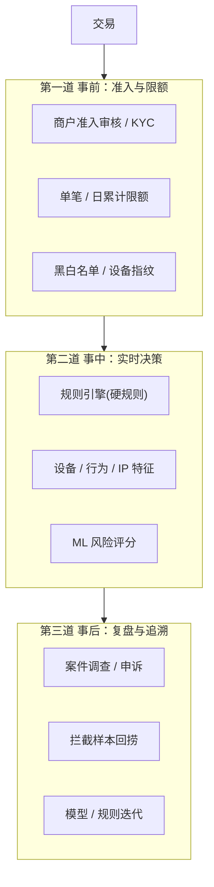
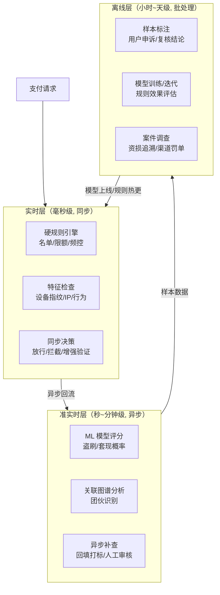
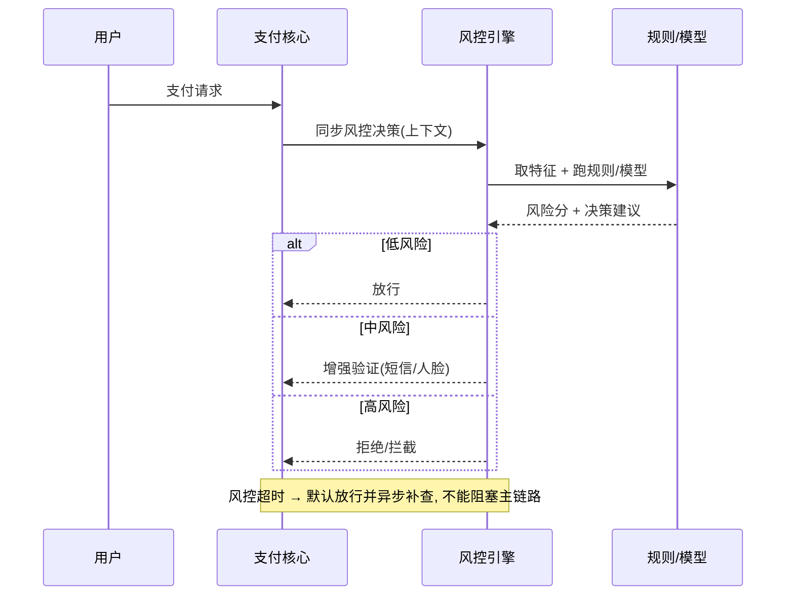
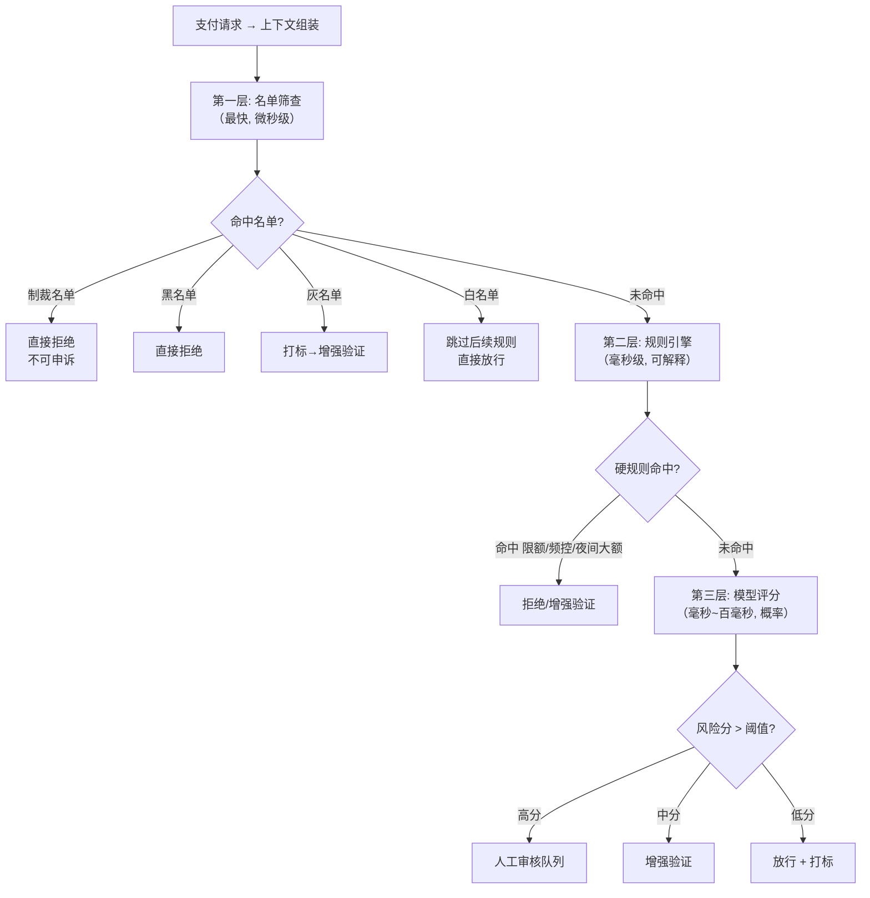
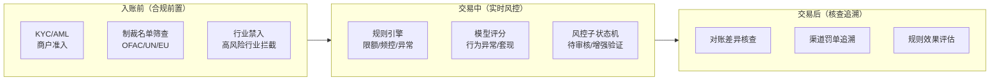

> 风控做不好，轻则资损，重则被渠道罚金、关停通道。本篇综合公开风控实践（微信 AlphaRisk、规则引擎 + 机器学习双轨等），系统梳理支付风控的体系，并联系我 XTransfer 的**资金安全三道防线**。
> 配合 [支付系统架构与核心链路全景](/post/准备-支付系统架构与核心链路全景) 与 [支付对账体系与差错处理](/post/准备-支付对账体系与差错处理) 一起看。

---

## 一、为什么支付必须谈风控

支付系统是"现金流通道"，黑灰产目标明确：盗刷、套现、薅羊毛、洗钱。风控是支付链路的**实时资金护栏**，和账务、对账共同构成资金安全闭环。

> 我的落地原则（XTransfer）：**AI 只建议不决策**——风控评分可由模型给出，但扣款/放行等强合规、不可逆动作必须由确定性规则 + 人工兜底，绝不能让模型"自动拍板"。

---

## 二、风控三道防线（经典模型）

> 事前的"拦"、事中的"判"、事后的"追"——三层叠加，才能既不影响体验，又能兜住资损。



| 防线 | 位置 | 职责 | 时延要求 |
|------|------|------|---------|
| **第一道：事前（准入/验证）** | 交易前 | 实名认证、设备指纹、绑卡验证、名单筛查（制裁/黑名单） | 准实时 |
| **第二道：事中（实时拦截）** | 交易中 | 规则引擎 + 模型实时评分，拦截盗刷/套现/异常交易 | 毫秒级 |
| **第三道：事后（监测/核查）** | 交易后 | 离线模型挖掘、案件核查、资损追回、策略迭代 | 分钟~天 |

> 对应 XTransfer：合规动态表单（事前）+ 风控子状态机实时拦截（事中）+ 对账/差错核查（事后），三层叠加。

### 二-附：实时/准实时/离线三层风控架构

> 风控不是"交易时跑一下"就完了——从实时拦截到离线模型训练，是一条按时间梯度分层的完整 pipeline。



| 层次 | 时延 | 职责 | 技术手段 |
|------|------|------|---------|
| **实时同步** | <50ms | 硬拦截——名单命中/超限额/频控超标/设备异常 | 规则引擎（内存）、布隆过滤器、AC 自动机 |
| **准实时异步** | 1s~分钟 | 软识别——ML 评分、关联图谱、行为异常 | Kafka/流计算、模型推理、图数据库 |
| **离线批处理** | 小时~天 | 训练迭代——样本标注、模型更新、案件追查 | Spark/Flink 批处理、特征平台、A/B 实验 |

> **核心设计原则**：实时层只做"确定性拦截"（可解释、低延迟、不依赖外部服务），准实时做"概率评分"（可慢、可异步），离线做"数据闭环"（训练→评估→上线）。三层不能串、不能混——混了就会"风控慢→支付堵"。


---

## 三、事中实时风控架构（重点）

> 事中风控必须**低延迟、可降级**：风控挂了不能阻塞支付，所以通常是"同步决策 + 异步补查"，命中高风险才拦截，中风险走增强验证。

**【为什么 / 真实案例】** 为什么必须"可降级"？因为风控是支付的依赖方，如果风控服务超时就把支付卡住，等于"风控挂 → 全站不能收款"，这是把资损风险换成了可用性风险，更糟。正确做法是"风控超时默认放行 + 异步补查 + 事后核查"——宁可先放过、事后再追，也不能让正常支付被风控故障拖死。XTransfer 就是这套：硬规则（名单/限额）同步跑、微秒级；模型评分异步回流，风控挂了默认放行并异步补查，可疑交易进风控子状态机的"待审核"态，不阻塞主流程。这和"资金安全三道防线"的事中告警（非终态/幂等异常/BCP 告警）是一体的。



```
交易请求
  → 特征采集（设备/IP/行为/历史/商户/额度）
  → 规则引擎（硬规则：名单、限额、频控）
  → 模型评分（ML：盗刷/套现概率）
  → 决策（放行 / 人工审核 / 拦截 / 降级）
  → 结果回流（样本、特征更新）
```

- **规则引擎**：处理确定性规则（如"新设备+新IP+深夜+大额"直接拦截、单笔/日累计限额、频控）。可热更新，业务自助配置。
- **模型评分**：对欺诈概率打分（GBDT/图神经网络/序列模型），输出风险分供决策。
- **决策层**：规则与评分融合，分级处置（放行/打标/人工/拦截）。

> 典型场景（公开案例）：新设备、新 IP、新银行卡、深夜盗刷 → 规则命中即拦截；模型再对"套现""薅羊毛"做软识别。

### 三-附a：风控引擎三层架构（规则/模型/名单）

> 风控引擎不是一条 if-else，而是"名单 → 规则 → 模型"三层接力，每层职责清晰、性能逐级递增。



```sql
-- 名单表（内存加载, 微秒级匹配）
CREATE TABLE risk_list (
  id BIGINT PRIMARY KEY,
  name VARCHAR(255) NOT NULL,
  name_type ENUM('individual','entity','vessel') NOT NULL,
  country CHAR(2) NOT NULL,
  list_source VARCHAR(64) NOT NULL,
  effective_date DATE NOT NULL,
  INDEX idx_name (name)
);

-- 规则配置表（热更新, 无需重启）
CREATE TABLE risk_rule (
  id BIGINT PRIMARY KEY,
  rule_code VARCHAR(64) UNIQUE NOT NULL,
  priority INT NOT NULL,
  conditions JSON NOT NULL,
  action ENUM('reject','verify','mark','pass') NOT NULL,
  is_active BOOLEAN DEFAULT TRUE
);
-- 示例条件 JSON: {"op":"AND","rules":[
--   {"field":"device_is_new","op":"eq","value":true},
--   {"field":"amount","op":"gt","value":5000},
--   {"field":"hour","op":"between","value":[22,6]}]}
```

### 三-附b：制裁名单筛查技术实现

> 制裁名单筛查是风控第一关——必须"快（不能阻塞交易）+ 准（不能漏）"，且要经得起合规审计。

使用 **AC 自动机（Aho-Corasick）** 做多模式串匹配，一次扫描 O(n) 匹配所有名单条目：

```java
// AC 自动机: 一次扫描匹配所有制裁名单
public class SanctionNameMatcher {
  private final AhoCorasick automaton;

  public SanctionNameMatcher(List<String> sanctionNames) {
    automaton = new AhoCorasick();
    for (String name : sanctionNames) {
      automaton.addPattern(normalize(name).toLowerCase());
    }
    automaton.buildFailureLinks();
  }

  public List<Match> scan(String text) {
    return automaton.search(normalize(text).toLowerCase());
  }

  /** 模糊匹配: 覆盖常见规避手法
   *  - 字符替换: O→0, I→1
   *  - 分隔符: 名·字 vs 名字
   *  - 音译: Mohammed → Muhammad
   */
  public List<Match> scanFuzzy(String text) {
    return automaton.search(normalize(text));
  }
}
```

```python
# 布隆过滤器 + AC 自动机组合: 微秒级延迟
from pybloom_live import ScalableBloomFilter

class SanctionScreener:
    def __init__(self, names: list[str]):
        self.bloom = ScalableBloomFilter(initial_capacity=100000, error_rate=0.001)
        self.trie = AhoCorasick()
        for name in names:
            key = self._normalize(name)
            self.bloom.add(key)
            self.trie.add_pattern(key)
        self.trie.build()

    def check(self, text: str) -> bool:
        key = self._normalize(text)
        if key not in self.bloom:
            return False   # 99.9% 确定不在名单中
        return bool(self.trie.search(key))  # 确认命中
```

> XTransfer 制裁筛查方案：名单条目百万级进布隆过滤器（内存 <100MB），仅布隆命中才查 AC 自动机；模糊匹配覆盖字符替换/音译/缩写等规避手法。

---


| 维度 | 规则引擎 | 机器学习模型 |
|------|---------|-------------|
| 可解释性 | 高（规则可见） | 低（黑盒） |
| 时效 | 实时、可热更 | 训练+上线有周期 |
| 覆盖 | 已知模式 | 未知/变体模式 |
| 维护 | 人工配规则 | 数据驱动迭代 |
| 适合 | 硬拦截、合规红线 | 软评分、概率识别 |

**结论**：双轨并行。规则保住"已知红线 + 可解释合规"，模型补"未知变体 + 概率识别"。两者互补，缺一不可。

### 四-附：关联图谱在反欺诈中的应用

> 套现/洗钱不是"单笔交易异常"，而是"多人多笔多账户之间的拓扑异常"——关联图是发现团伙的最佳工具。

```text
关联图示例（套现网络）：
  账户A(平台)
     ├─ 关联 → 账户B(买家) ← 同一设备
     │           └─ 频繁支付 → 商户C
     ├─ 关联 → 账户D(买家) ← 同一IP
     │           └─ 频繁支付 → 商户C
     └─ 关联 → 账户E(买家) ← 同一银行卡
                 └─ 频繁支付 → 商户C
  结论：A→B/D/E→C 是一个套现团伙
```

| 图特征 | 检测场景 | 信号 |
|--------|----------|------|
| 入度/出度异常 | 商户有大量不同用户小额支付 → 洗钱 | 出度 >> 正常商户 |
| 连通分量 | 多用户共享设备/IP/银行卡 → 团伙 | 大连通分量 |
| 环路检测 | A→B→C→A 资金回环 → 自买自卖 | 有向环路 |
| 社区发现 | 群体行为高度相似 → 机器操控 | 高模块度社区 |

```cypher
-- Neo4j/Cypher: 检测异常资金归集（洗钱）
MATCH (u:User)-[:PAYS]->(m:Merchant)
WHERE m.txn_count_24h > 100 AND m.avg_txn_amount < 100
WITH m, collect(distinct u) as users
WHERE size(users) > 50
RETURN m.id, size(users), m.total_amount_24h
ORDER BY size(users) DESC;
```

### 四-附b：设备指纹与行为特征采集

```java
public class DeviceFingerprint {
    public DeviceProfile collect(HttpServletRequest req) {
        return DeviceProfile.builder()
            .deviceId(hash(req.getHeader("User-Agent")
                + req.getRemoteAddr()))
            .ip(req.getRemoteAddr())
            .geoLocation(geoIP.lookup(req.getRemoteAddr()))
            .isProxy(detectProxy(req))
            .isEmulator(detectEmulator(req))
            .isRooted(detectRoot(req))
            .build();
    }
}
```

```sql
-- 用户行为特征近实时聚合（24h 滚动窗口）
CREATE TABLE user_behavior_profile (
  user_id           BIGINT PRIMARY KEY,
  txn_count_24h     INT DEFAULT 0,
  txn_amount_24h    DECIMAL(20,4) DEFAULT 0,
  distinct_card_24h INT DEFAULT 0,
  distinct_ip_24h   INT DEFAULT 0,
  failed_txn_24h    INT DEFAULT 0,
  device_count_7d   INT DEFAULT 0,
  new_device_flag   BOOLEAN DEFAULT FALSE,
  last_txn_time     TIMESTAMP,
  updated_at        TIMESTAMP DEFAULT CURRENT_TIMESTAMP
);
```

---

## 五、典型风险与对策

| 风险 | 特征 | 对策 |
|------|------|------|
| **盗刷** | 新设备/新IP/异常时间/异地 | 设备指纹 + 规则拦截 + 3DS/短信验证 |
| **套现** | 自买自卖、同一卡高频进出 | 关联图谱 + 额度管控 + 商户风控 |
| **薅羊毛** | 批量小号、优惠裂变异常 | 风控分 + 频控 + 设备/账号聚类 |
| **洗钱** | 拆分交易、多账户归集 | 大额报送 + 名单筛查 + 行为建模 |
| **渠道欺诈** | 渠道端伪造成功通知 | 异步回调验签 + 主动查单（见路由补偿） |

---

## 六、风控与支付链路的集成点

- **收银台/下单**：事前验证、限额展示。
- **支付核心**：事中实时评分 + 拦截（见 [架构全景](/post/准备-支付系统架构与核心链路全景) 风控子系统）。
- **渠道路由**：隐患渠道降权（见 [渠道路由设计](/post/准备-支付渠道路由设计) 自动化开关）。
- **对账/差错**：事后核查资损、追回（见 [对账体系](/post/准备-支付对账体系与差错处理)）。

---

## 七、我的 XTransfer 落地

- **资金安全三道防线**：合规筛查（制裁/行业/名单）→ 风控实时拦截（规则+评分）→ 对账差错核查。
- **风控子状态机**：支付主状态机之外挂"风控子状态"，可疑交易进人工审核态，不阻塞正常流。
- **AI 应用**：风控评分、对账差异归因、客诉分类可用模型；但**扣款/放行决策不交给模型**。
- **结果指标**：拦截准确率、误杀率（影响体验）、资损率、渠道罚金次数。

### 七-附：XTransfer 跨境风控的落地细节

> 跨境风控比境内多一个"合规"维度——制裁名单筛查不是"可选项"，是"没有就不能开展业务的生存前提"。



**跨境特有的合规要求**：

| 合规维度 | 要求 | 技术落地 |
|----------|------|---------|
| **制裁名单** | 实时筛查 OFAC SDN / UN / EU 等名单 | AC 自动机 + 布隆过滤器，微秒级 |
| **行业禁入** | 军火/毒品/赌博等高风险行业禁入 | 行业分类映射表 + MCC 码匹配 |
| **外汇额度** | 个人 5 万美元/年、企业逐笔申报 | 额度累计算法，近实时校验 |
| **大额报送** | 超过阈值的交易上报监管 | 异步报送队列，不阻塞交易 |
| **反洗钱（AML）** | 交易模式分析、可疑交易上报 | NLP 分析交易附言 + 关联图谱 |

```java
// XTransfer 风控子状态机
public enum RiskSubState {
    CLEAR,          // 无风险
    PENDING_REVIEW, // 待人工审核（可疑交易）
    ENHANCED_KYC,   // 需补充材料（如贸易单据）
    FROZEN,         // 已冻结（确认风险/合规要求）
    RELEASED        // 已解冻
}

// 风控决策与主状态机解耦
public RiskDecision evaluate(TradeContext ctx) {
    // 第一关：制裁名单（命中→直接拒绝，不可申诉）
    if (sanctionScreener.isHit(ctx.getPartyName())) {
        return RiskDecision.REJECT_SANCTION;
    }

    // 第二关：硬规则
    Optional<RuleHit> ruleHit = ruleEngine.evaluate(ctx);
    if (ruleHit.isPresent() && ruleHit.get().getAction() == REJECT) {
        return RiskDecision.REJECT_RULE;
    }

    // 第三关：模型评分（异步，不阻塞）
    asyncModelScore(ctx);  // 异步回流
    if (ruleHit.isPresent() && ruleHit.get().getAction() == VERIFY) {
        return RiskDecision.ENHANCED_VERIFY;
    }

    return RiskDecision.PASS;
}
```

> 跨境风控最难的点不是拦截准确率，而是"**合规全覆盖 + 不误伤正常贸易**"——制裁名单要准（不能漏）、但又要能区分"同名不同人"（不能见名单就拦）。XTransfer 的解法是：制裁名单筛查结果分"精确命中"和"模糊命中"，前者直拒、后者进人工复核而非一棍子打死，兼顾合规与体验。

---

## 八、面试高频追问（本篇）

**Q1：规则引擎和模型怎么配合？**
> A：双轨。规则管已知红线 + 合规可解释（硬拦截），模型管未知变体 + 概率识别（软评分）。决策层融合两者：规则命中直接拦截，模型高分进人工/打标。

**【深度拓展】** 双轨的精髓是"**各有不可取代处**"：规则可解释、可热更、能兜底合规红线（如制裁名单命中必须拦，不能让模型说"概率低就放"）；模型能抓规则覆盖不到的变体（如新型套现手法）。融合时有个关键设计——**规则优先级高于模型**：规则命中直接处置，模型只影响"规则没明确拦截"的灰色地带。还要注意"规则膨胀"——规则太多会冲突、难维护，要定期用模型挖掘出的新pattern反哺规则（把高频命中模型pattern固化成规则）。面试官追问"规则和模型结论冲突怎么办"——以规则为准（合规不可妥协），模型结论作为参考打标，冲突样本进人工复盘。

**【项目支撑】** XTransfer 风控就是"规则引擎（硬拦截/合规红线）+ 模型评分（软识别）"双轨，且合规筛查（制裁/行业/名单）作为事前第一道防线，命中即拦截，模型不介入。风控子状态机把"免关联→关联→渠道调单"多阶段统一管理，和主状态机解耦。

**Q2：实时风控要求毫秒级，模型推理慢怎么办？**
> A：① 特征预计算（近实时特征平台）；② 模型轻量化/蒸馏；③ 规则先行快速拦截，模型评分异步回流；④ 分级：硬规则同步拦截，软评分异步处置。

**【深度拓展】** 工程上把这个叫"**同步决策 + 异步补查**"：支付主链路只跑"快路径"——硬规则（名单/限额/频控，微秒级）同步拦截，绝不让模型推理阻塞支付；模型评分异步算，算完回填到交易（打标/进人工审核队列），不影响本次支付体验。特征要"**预计算**"而非"实时算"——设备/IP/行为/历史等特征提前在近实时特征平台算好，决策时直接取，避免现场 JOIN 大表。降级策略必须明确：风控服务超时/不可用 → 默认放行 + 异步补查（不能因风控挂了卡死支付），但补查出的高风险进人工核查。面试官追问"放行后模型说高风险怎么办"——走事后核查/拦截样本回捞，这也是第三道防线的价值。

**【项目支撑】** XTransfer 风控做"同步硬规则 + 异步模型评分"，风控挂了默认放行并异步补查，不阻塞主链路；可疑交易进风控子状态机的"待审核"态，不阻塞正常流，由人工/增强验证处置。这是"风控不能成为支付瓶颈"的落地。

**Q3：误杀（正常用户被拦）怎么平衡？**
> A：看误杀率指标。策略：高风险直接拦截，中风险进人工审核（不打断用户），低风险放行+打标观察；用置信度阈值 + 人工审核兜底，避免"为安全牺牲体验"。

**【深度拓展】** 误杀和漏杀是**一对权衡**：把阈值调严，漏杀少但误杀多（客诉涨、转化率掉）；调松则反之。工程上用"**分级处置**"而非"二分类"来化解：高风险（强特征）→ 直接拦截；中风险 → 增强验证（短信/人脸/3DS），不打断用户只是多一步；低风险 → 放行 + 打标，事后观察。这样把"拦"的代价降到最低。还要监控"误杀率"和"拦截后申诉通过率"来反哺阈值。面试官追问"怎么知道误杀了"——靠申诉通道 + 人工复核的放行结论回流，把"被拦但实际正常"的样本反哺模型和规则，形成闭环。

**【项目支撑】** XTransfer 用风控子状态机区分"拦截/待审核/放行"，中风险交易不硬拦而是进"关联风控/渠道调单"子状态补充材料，用户体验不被一棍子打死；误杀通过申诉 + 人工复核回流修正，这也是"AI 只建议不决策"的合规体现。

**Q4：AI 能直接决定拦截一笔支付吗？**
> A（我的观点）：强合规、不可逆动作不能。AI 只给风险分与建议，最终拦截/放行由确定性规则 + 人工兜底。原则"AI 只建议不决策"（见 [AI 与 LLM 工程落地探索](/post/准备-AI与LLM工程落地探索)）。

**【深度拓展】** 为什么强合规动作不能交给 AI——①**可解释性**：监管要能问"为什么拦这笔"，规则能答、模型难答；②**可逆性**：拦截/扣款是不可逆的强动作，模型判错代价高，必须由确定性逻辑 + 人工兜底；③**责任归属**：模型拍板出问题，责任不清。所以正确姿势是"AI 做参谋（风险分/建议），规则+人做决策"。这不止风控，对账差异归因、客诉分类也可用模型，但凡"涉及钱/合规的不可逆动作"都留给确定性系统。面试官追问"那模型完全没用吗"——不是，模型在"软评分、未知变体识别、样本回捞、策略迭代建议"上极有价值，只是不碰最终裁决权。

**【项目支撑】** XTransfer 的原则就是"AI 只建议不决策"：风控评分、对账差异归因、客诉分类可用模型，但扣款/放行这类强合规、不可逆动作必须由确定性规则 + 人工兜底。这也延伸到路由——AI 只给调权建议，最终路由由规则引擎执行，合规一票否决。

**Q5：风控和渠道路由有什么关系？**
> A：风控结果可反向影响路由——被风控标记的渠道降权或关闭（自动化开关）；路由也能为风控提供渠道历史成功率等特征。二者在"渠道健康度"上闭环。

**【深度拓展】** 二者的闭环本质是共享"**渠道健康度**"这一状态：风控发现某渠道欺诈/伪造成功通知增多 → 标记该渠道风险 → 路由自动化开关降权/关闭；路由的渠道历史成功率、失败模式又反哺风控特征。工程上要有一套"渠道风险画像"被两系统共用，而不是各算各的。还有个反向关系常被忽视：**路由把风险高的交易导到风控更严的渠道/路径**（如大额走需 3DS 的渠道）。面试官追问"风控标记的渠道误伤正常交易怎么办"——降权是"减少分配"不是"完全切断"，且要有恢复机制（滑动窗口灰度），和路由自动化开关一致。

**【项目支撑】** XTransfer 渠道异常时，风控的渠道欺诈识别 + 路由的自动化开关 + 任务补偿的换渠道重试，三者共用"渠道健康度"状态，形成"识别风险→降权→补偿重试→灰度恢复"的闭环，是生产问题 -80% 的协同支撑。

---

## 延伸阅读

- 架构全景：[支付系统架构与核心链路全景](/post/准备-支付系统架构与核心链路全景)
- 渠道路由：[支付渠道路由设计](/post/准备-支付渠道路由设计)
- 对账：[支付对账体系与差错处理](/post/准备-支付对账体系与差错处理)
- 项目落地：[XTransfer 跨境支付收款平台深度复盘](/post/准备-XTransfer跨境支付收款平台深度复盘)
- AI 工程化：[AI 与 LLM 工程落地探索](/post/准备-AI与LLM工程落地探索)

> 参考来源：微信支付 AlphaRisk 公开解析、onlythinking《支付风控系统设计：从规则引擎到机器学习双轨并行》、XTransfer 资金安全三道防线实践。

<!-- EXPANDED -->
