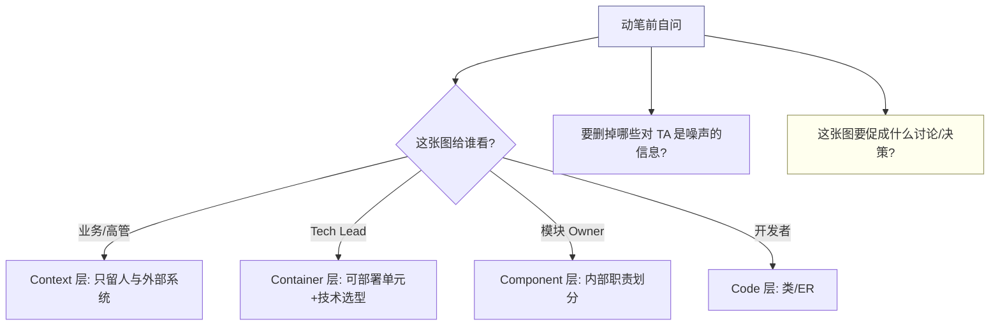
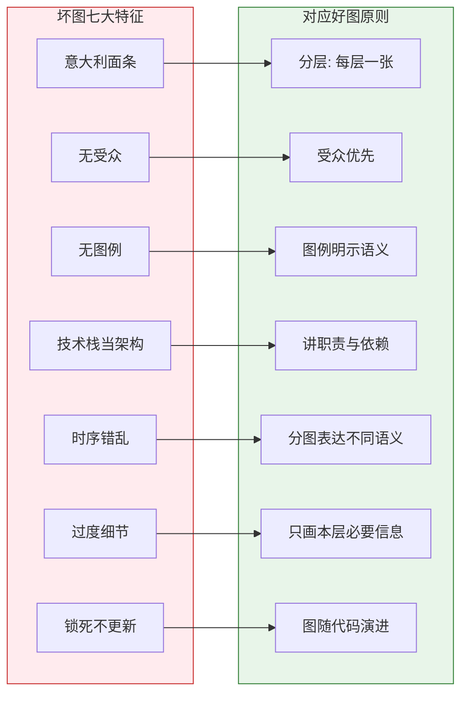
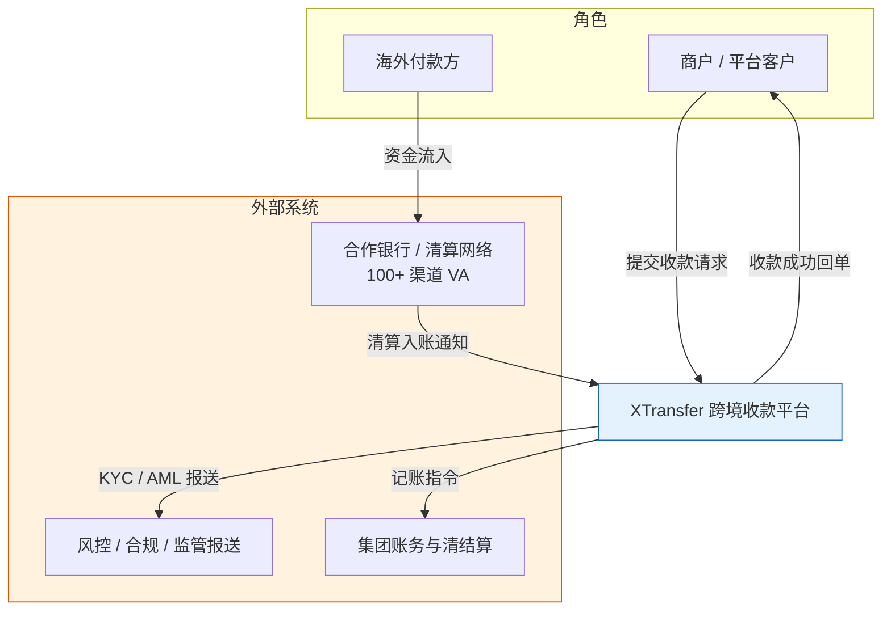
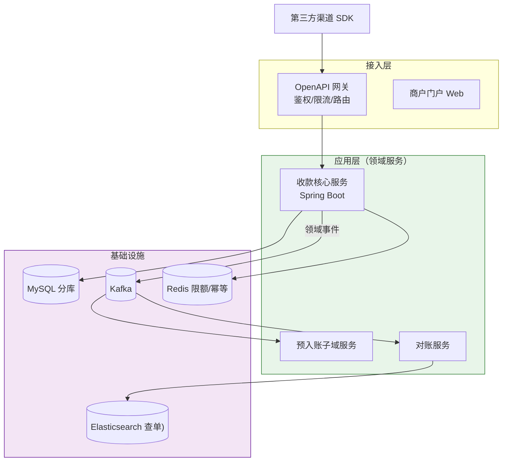
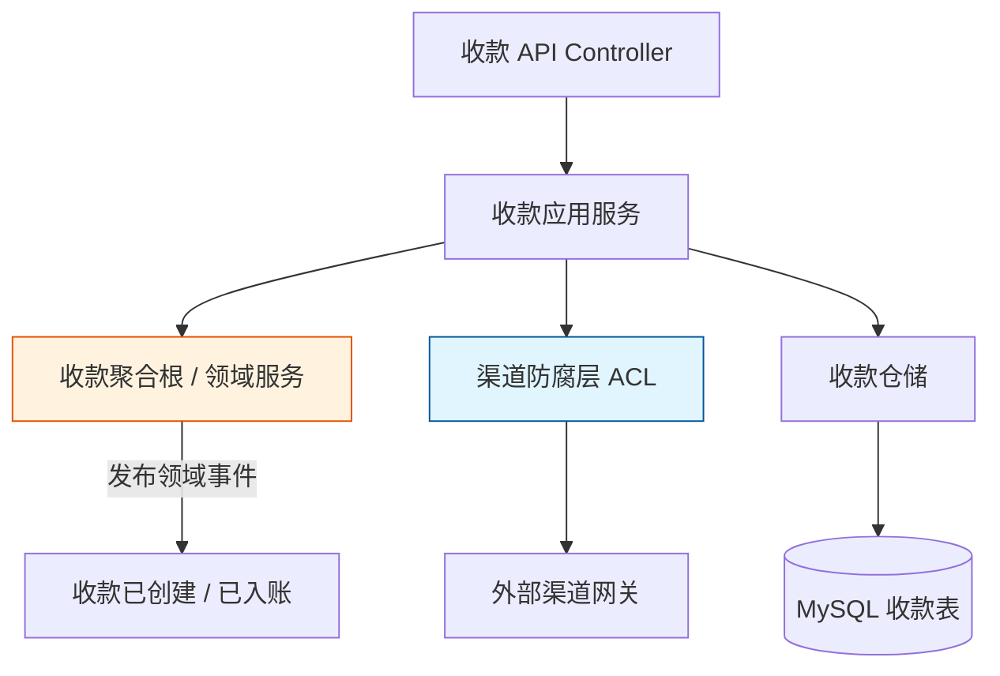
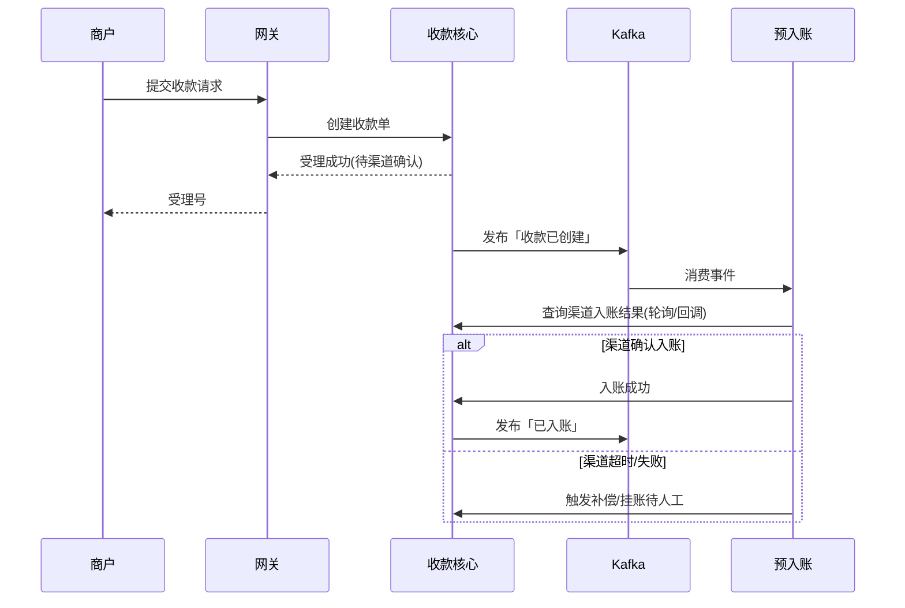
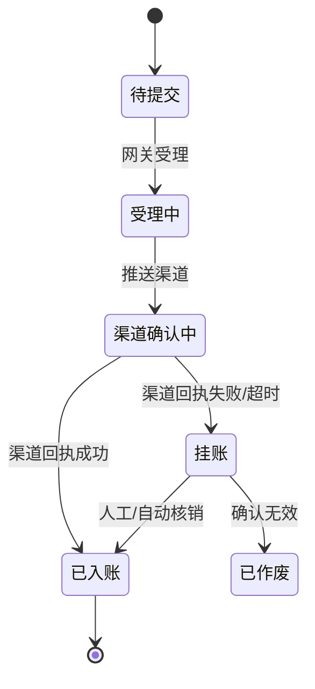
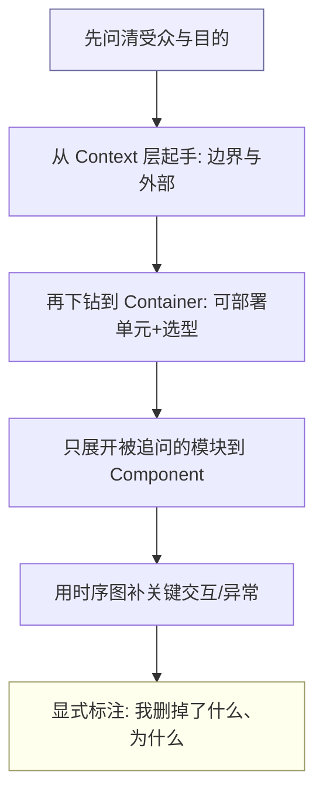

## 写在前面

很多工程师把"画图"当成写文档的附属劳动：需求评审前临时拼一张框线图，框里写"网关""服务""数据库"，箭头乱飞，讲的时候自己都要解释半天。这类图的问题不在于"丑"，而在于**它没有替观看者做任何思考**——看完之后，业务方不知道系统边界在哪，新人不知道该改哪个模块，面试官不知道你的抽象能力。

我在 XTransfer 主导收款领域 2.0 重构时，第一件事不是写代码，而是把"收款上下文图"画给业务、测试、上下游团队看。图被改了七版，但正是这七版对齐，让一个横跨 100+ 渠道、涉及 KYC/AML/账务/清结算的复杂域，在三个月内落地且生产问题下降 80%。

本文不教你怎么用绘图工具，而是讲**架构师该怎么想"画图"这件事**：画给谁看、画到哪一层、删掉什么、保留什么。全程用 C4 模型作为骨架，因为它用"受众 + 抽象层级"替代了"一张大图打天下"的坏习惯。配合《架构建模方法论》《DDD 领域驱动设计实战指南》《资深后端开放式场景设计题》食用更佳。

---

## 一、先建立底层认知：你画的不是系统，是"给特定人看的故事"

画图前先问自己三个问题，这比学任何符号都重要。

### 1.1 受众优先：图是给人看的，不是给系统看的

一张图好不好，唯一的判据是**看的人能不能在 30 秒内得到他想要的**。CTO、业务产品经理、新入职的后端、外部审计，他们要的东西完全不同：

- **业务方/高管**：只关心"系统对外和谁交互、解决什么业务问题"——你要画 Context 层。
- **Tech Lead / 架构师同行**：关心"系统由哪几个可部署单元组成、技术选型是什么"——你要画 Container 层。
- **模块 Owner / 开发者**：关心"我负责的这个服务内部怎么分、依赖谁"——你要画 Component 层。
- **写这块代码的人**：关心"类怎么组织"——这才是 Code 层（类图）。

> 反例：给 CEO 讲技术选型时甩出一张带 40 个类和 12 个箭头的组件图，他什么都记不住，只会觉得"这系统很复杂、很危险"。

### 1.2 删减即设计：图是"省略"的艺术

真实系统有上千个细节。一张好图不是"画得全"，而是**敢于不画**。架构师的功力体现在：知道哪些信息对这个受众是噪声，果断删掉。

- 对业务方：删掉技术栈、删掉缓存、删掉 MQ，只留"人和系统"。
- 对开发者：删掉不相关的上下文系统，聚焦本模块内部。

### 1.3 图是对话，不是交付物

图的价值在"被讨论、被反驳、被修改"的过程中，而不在最终那张 PNG。我在 XTransfer 的上下文图改了七版，每一版都是一次跨团队对齐。所以：**用可以低成本修改的方式画图（代码即图、白板），而不是花两小时调 Visio 的框线对齐**。

---

## 二、框线图的七大反模式

先识别坏图，才能画出好图。以下七种，我在评审里几乎每周都能看到。

### 2.1 意大利面条图（Spaghetti）

所有组件平等地画在一张图里，箭头横穿、回环、交叉。看的人视线无处着陆。根因是**把所有抽象层级混在一起**：网关、某个 DAO、第三方 API、缓存全在一张图。

**解法**：按 C4 分层，每层一张图，每层只保留同级别的抽象。

### 2.2 无受众图

一张图想讨好所有人，结果谁都没看懂。根因是没做 1.1 的受众分析。

### 2.3 无图例 / 无符号约定

箭头是什么意思？实线虚线有区别吗？颜色代表什么？没有图例的图，箭头方向全靠猜。**每条线都必须有含义，且图例明示**。

### 2.4 把技术栈当架构

"我用了 Spring Cloud、Redis、Kafka"——这是技术清单，不是架构。架构讲的是**职责的划分与依赖的方向**。技术栈是实现的细节，不该喧宾夺主。

### 2.5 时序错乱

把"调用关系"和"数据流"和"部署拓扑"画在同一张图，箭头既表示"请求"又表示"消息"又表示"部署包含"。一个箭头承担三种语义，必乱。

**解法**：调用用时序图、部署用部署图、依赖用组件图，分图表达。

### 2.6 过度细节

在 Context 层画到每个表、每个接口。受众被细节淹没，抓不住主干。

### 2.7 "一次性正确"幻觉

把图当终稿，锁死不更新。架构在演进，图不演进，最终图和代码脱节，比没图更糟。

---

## 三、C4 模型：用四层替代"一张大图"

C4 是 Simon Brown 提出的、受 UML 启发但更轻量的建模符号。它的核心思想只有一句话：**像地图一样分层缩放（Context → Container → Component → Code）**，每一层回答不同受众的问题。

### 3.1 为什么是四层

人的短期记忆一次只能处理 7±2 个单元。如果你把 100 个细节铺在一张图上，没人能懂。C4 的每一层都把"下一层"折叠成几个高内聚的块，让当前层只有 5-10 个元素——这恰好落在人能消化的范围。

| 层级 | 回答的问题 | 典型受众 | 一个元素代表 |
|---|---|---|---|
| **Context** | 系统是什么、和谁交互 | 业务/高管/新人 | 人 / 外部系统 |
| **Container** | 系统由哪些可部署单元组成 | Tech Lead / 架构师 | 应用 / 数据库 / MQ |
| **Component** | 某容器内怎么分职责 | 模块 Owner | 一组相关的类/服务 |
| **Code** | 类/接口怎么组织 | 开发者 | 类 / 接口 |

### 3.2 Context 层：XTransfer 跨境收款上下文图

这是给业务方和外部团队看的。只画"人、本系统、外部系统"，不画任何内部技术细节。

**要点**：图里没有"Redis""Kafka""UserService"，因为这些对业务方是噪声。它回答的是"钱从哪来、要报给谁、和谁对账"。

### 3.3 Container 层：收款平台容器图

这是给 Tech Lead 和架构师同行看的。画出可部署单元、技术选型、关键数据流。

**要点**：技术选型（Spring Boot、Kafka、Redis）在这里是合理的，因为受众是技术决策者。箭头区分了"同步调用"（网关→服务）和"异步事件"（服务→MQ），语义清晰。

### 3.4 Component 层：收款核心域组件图

这是给"收款核心服务"的 Owner 和开发者看的。只展开这一个容器，画它内部的职责划分。

**要点**：这里才出现"聚合根""防腐层"等 DDD 概念（详见《DDD 领域驱动设计实战指南》）。它把领域模型直接映射成了组件职责，是建模到代码的桥梁。

### 3.5 Code 层：点到为止

类图只在该模块特别复杂、且受众是写代码的人时才画。多数时候，**Component 层已经足够**，Code 层用 IDE 自动生成即可，不要手工维护一张会过时的类图。

### 3.6 四层怎么选：决策表

| 场景 | 画到哪层 | 理由 |
|---|---|---|
| 需求评审 / 向业务汇报 | Context | 对齐边界与价值，不涉及技术 |
| 技术选型评审 / 招人讲架构 | Container | 看可部署单元与技术债务 |
| 模块拆分 / 交接某服务 | Component | 看内部职责与依赖方向 |
| Code Review 某复杂算法 | Code | 仅限局部 |

---

## 四、C4 之外的四把刀

C4 解决"静态结构"，但架构师还要表达"动态"和"部署"。四把常用刀：

### 4.1 时序图：表达交互与异常路径

面试官最爱看异常路径。时序图能清楚画出"渠道超时怎么办、怎么补偿"。

### 4.2 状态图：表达生命周期

资金类对象（收款单、账务流水）一定有明确状态机，状态图比文字严谨得多。

### 4.3 部署图：表达拓扑与高可用

讲容灾、多活时必须画物理/逻辑部署，标明主备、机房、流量走向。

### 4.4 数据模型图（ER）：表达持久化边界

讲分库分表、聚合持久化时用，链接《架构建模方法论》的数据建模一节。

---

## 五、UML vs C4 vs 其他：取舍对比

| 维度 | UML | C4 | 自由框线图 |
|---|---|---|---|
| 学习成本 | 高（14 种图） | 低（4 层 + 少量符号） | 零 |
| 受众友好 | 差（业务看不懂） | 好（按受众分层） | 视水平 |
| 约束性 | 强（语义严格） | 中（约定但不死板） | 无（易乱） |
| 代码生成 | 部分支持 | Structurizr 可双向 | 不支持 |
| 适合场景 | 详细设计 / 契约 | 架构沟通主流选择 | 临时白板 |

**我的取舍**：架构沟通（90% 场景）用 C4；局部详细设计（如复杂状态机、协议）用 UML 子集（时序/状态/类）；白板讨论用自由框线，但讨论完立刻规整成 C4 再沉淀。

---

## 六、图即代码（Diagrams-as-Code）

架构师该用代码画图，不是用鼠标拖。理由：

1. **可版本化、可 diff、可 review**：图随代码演进，PR 里就能看到架构变更。
2. **单一事实源**：图和数据（如服务列表）同源生成，不易脱节。
3. **可复用**：定义一次元素，多张图引用。

常用工具：

- **Mermaid**：本文所有图即用 Mermaid，Markdown 内联、CI 可渲染，零部署。适合文档型博客与轻量图。
- **PlantUML**：语法更全，适合大型时序/部署图。
- **Structurizr**：C4 的官方载体，可用代码描述 Context/Container/Component，**从同一模型生成多层图**，是 C4 理念的最佳实践，但学习曲线略陡。

> 实践建议：日常文档用 Mermaid（快、内联）；正式架构决策用 Structurizr（模型驱动、多层一致）。两者都进 Git。

---

## 七、画图自检清单（10 条）

画完任何一张图，过一遍这 10 条，能拦住 90% 的坏图：

1. 我写明了**受众**是谁吗？
2. 图里每个元素的抽象**层级一致**吗（没混 Context 和 Code）？
3. 每条线都有**明确语义**且**图例明示**了吗？
4. 有没有**不该出现在这个受众视图里的噪声**？
5. 箭头方向表达的是**调用 / 数据 / 部署**中的哪一种，有没有混用？
6. 技术栈是**服务于职责表达**，还是喧宾夺主？
7. 关键**异常路径**画出来了吗（不只画正常路径）？
8. 这张图能促成什么**讨论或决策**？
9. 它**和代码一致**吗？会在架构演进时更新吗？
10. 用**代码即图**的方式维护，还是锁死的一张 PNG？

---

## 八、面试中怎么画：答题框架 + 常见追问

面试画架构图，考察的不是美术，是**抽象与沟通**。固定套路：

**常见追问与应对**：

- *"你能画得更细吗？"* → 下钻一层即可，主动说"再细就到 Code 层，那是实现细节，我建议用 IDE 看"。体现你懂分层。
- *"为什么这里用 MQ 不用 RPC？"* → 回到受众和取舍：异步解耦、削峰、故障隔离（详见《分布式事务与一致性》）。
- *"这张图和刚才那张重复了？"* → 说明两张图语义不同（一张静态结构、一张动态交互），正中"分图表达"的下怀。

> 心法（同《资深后端开放式场景设计题》）：**先澄清约束，再给主干，永远讲满异常路径，最后给演进**。画图只是把这条主线可视化。

---

## 九、书单与延伸阅读

- 《The Art of Critical Decision-Making》——决策思维（图服务于决策）
- Simon Brown《Software Architecture for Developers》——C4 模型原著
- 《程序员必读之软件架构》——同上中文版，讲"架构师画什么、给谁画"
- Martin Fowler 官网 diagrams 系列——UML 取舍的权威观点
- 延伸：本站《架构建模方法论（从事件风暴到 C4）》《DDD 领域驱动设计实战指南》《资深后端开放式场景设计题（10 年+）》《高可用跨境支付系统设计》

---

## 相关阅读

- [架构建模方法论：从事件风暴到 C4](/post/准备-架构建模方法论（从事件风暴到C4：10年架构师的建模心法）) —— 本文的"上游"：图是建模的输出
- [DDD 领域驱动设计实战指南](/post/准备-DDD领域驱动设计实战指南) —— Component 层里的聚合根、防腐层来源
- [资深后端开放式场景设计题（10 年+）](/post/准备-资深后端开放式场景设计题（10年+）) —— 画图答题的通用框架
- [高可用跨境支付系统设计](/post/准备-高可用跨境支付系统设计) —— XTransfer 案例的架构全貌
