## 写在前面

面试造火箭、工作拧螺丝？对初级工程师也许是。但到了架构师这一层，真正难的从来不是"会不会写某个组件"，而是——**在无数个互相冲突的约束里，做出一个能落地、能扛事、能带人、能被业务认可的决定**。

这篇不是又一份"架构师技能清单"。业界已经有很多清单（GeeksforGeeks、Red Hat、iMocha、JavaGuidePro、腾讯云、史海峰等我都翻过），结论大同小异：技术深度 + 系统设计 + 沟通 + 领导力 + 业务理解。但清单列完，你还是不知道**怎么才算"会"、踩过什么坑、我作为十年 Java 后端 / 跨境支付架构师到底信什么**。

所以本文的定位是：**给你一张"软硬实力全景图"，再对每一项能力做"能力构成 → 真实场景 → 我的反思 → 我的认识 → 怎么练"的五段式拆解**。每一项都配图（Mermaid），都带我自己的反思与判断，不端着、不空谈。末尾再用"架构师自问自答"和"未来架构演进研判"收口——前者是向内问自己，后者是向外看趋势。

配合《架构师高频面试题深度解析》《架构建模方法论》《架构图绘制方法论》《团队管理与技术领导力》食用更佳。

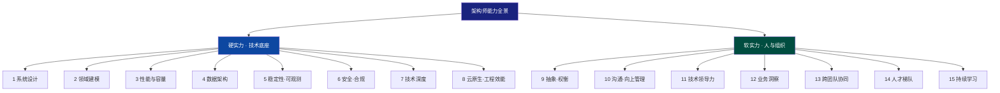

> 一句话总纲：**硬实力决定你够不够格做架构师（下限），软实力决定你能做多高（上限）。但两者的交汇点——"在约束下做有依据的权衡"——才是架构师这一角色的真正内核。**

---

## 能力总览矩阵

| # | 能力 | 类别 | 一句话 | 新手→资深权重变化 | 面试区分度 |
|---|------|------|--------|------------------|-----------|
| 1 | 系统设计 | 硬 | 把模糊需求落成可演进的技术方案 | 25%→35% | ★★★★★ |
| 2 | 领域建模 | 硬 | 把业务语言翻译成可维护的结构 | 15%→20% | ★★★★ |
| 3 | 性能与容量 | 硬 | 量化指标，设计出来而非调出来 | 15%→15% | ★★★★ |
| 4 | 数据架构 | 硬 | 在一致性/延迟/成本三角里选型 | 15%→15% | ★★★★ |
| 5 | 稳定性·可观测 | 硬 | 让系统"出事前能预判、出事时能定位" | 10%→15% | ★★★★★ |
| 6 | 安全·合规 | 硬 | 把资损与监管红线设计进架构 | 8%→10% | ★★★ |
| 7 | 技术深度 | 硬 | 原理级判断力，T 型结构 | 12%→10% | ★★★ |
| 8 | 云原生·工程效能 | 硬 | 让架构能被高效、安全地交付 | 8%→10% | ★★★ |
| 9 | 抽象·权衡 | 软 | 敢写"我放弃了什么" | 15%→25% | ★★★★★ |
| 10 | 沟通·向上管理 | 软 | 把技术方案翻译成业务价值 | 15%→20% | ★★★★ |
| 11 | 技术领导力 | 软 | 靠专业判断力而非职位带人 | 10%→20% | ★★★★★ |
| 12 | 业务洞察 | 软 | 成为"半个行业专家" | 10%→18% | ★★★★ |
| 13 | 跨团队协同 | 软 | 做"技术外交官"，把冲突变校准 | 8%→15% | ★★★★ |
| 14 | 人才梯队 | 软 | 架构的可持续靠人 | 5%→15% | ★★★★ |
| 15 | 持续学习 | 软 | 过滤噪音比追逐新更重要 | 10%→10% | ★★★ |

> 权重数据参考了腾讯云《从 CRUD Boy 到领域专家》中的行业调研（初级架构师技术 60%/系统设计 25%/软 15%；资深技术 40%/系统设计 35%/软 25%），并按我的经验做了归并。重点看**趋势**：越往上走，**系统设计、抽象权衡、技术领导力、业务洞察、跨团队、人才梯队**的权重持续上升——纯技术深度的相对权重反而在降（不是不重要，是"及格线"被拉高了）。

---

# 一、硬实力篇（技术底座）

> 硬实力是"你说了算"的部分——它基本由你自己的学习和实践决定，不依赖别人配合。这是架构师的**入场券**：没有它，后面的软实力再强也只是"嘴强王者"。

---

## 1. 系统设计能力

> **定义**：在规模、一致性、可用性、成本、时间等约束下，把模糊需求落成"可演进、可落地、能扛事"的技术方案的能力。它是架构师的第一性原理能力。

### 1.1 它到底是什么

系统设计不是"画一张图"。它是一套**从约束到方案再到演进**的推演方法：

- **先量化约束**：QPS/日笔数、峰值、一致性要求（强一致 or 最终一致）、可用性 SLA（99.9% or 99.99%）、资损容忍度、上线时间窗。
- **再定主干**：核心链路、关键选型、数据流向、边界划分。
- **然后显式权衡**：为什么这么选，放弃了什么。
- **补全异常路径**：幂等、补偿、降级、兜底、超时、脑裂。
- **最后给演进路线**：V1 最小闭环 → V2 优化 → V3 规模化。

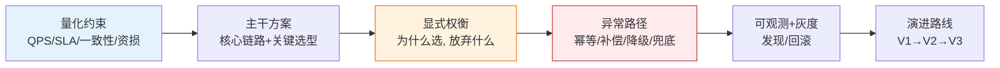

### 1.2 核心能力构成

- **CAP 与 BASE 的真正理解**：不是背定义，而是能针对场景选 CP 还是 AP。跨境支付的核心资金链路必须 CP（强一致、宁可不可用不可错账）；而"交易流水推送""账单通知"可以 AP（最终一致、容忍短暂延迟）。
- **分区容错是前提**：分布式系统 P 不可选，所以问题永远是"C 和 A 怎么折中"，不是"要不要 P"。
- **演进式架构（Evolutionary Architecture）**：拒绝"一步到位设计完美架构"。先单体快速验证，再按业务边界拆。
- **非功能需求（NFR）驱动**：可用性、可扩展性、容错性、可观测性要在方案里显式写清，而不是"到时候再说"。
- **模式库要熟但别迷信**：单体、微服务、事件驱动、CQRS、Saga、Service Mesh……每个都有适用边界。

### 1.3 真实场景

在 XTransfer 做**跨境收款**时，我面对的约束是：日千万笔级、资金零差错、多时区、强监管。我定的主干是"预入账状态机 + 补偿事务 + 渠道异步回调"。关键权衡是：**资金链路用强一致+本地事务，跨系统用最终一致+Saga 补偿**，并为此放弃了"全链路强一致"的幻想（因为渠道侧根本做不到，且会牺牲可用性）。这个权衡被写进 ADR，后续任何争议都回到这份文档，避免了反复扯皮。

### 1.4 我的反思（踩过的坑）

> **【反思】** 早期我做"预入账"时，曾试图在一张巨型状态机里覆盖所有异常分支，结果状态数爆炸、测试成本极高、上线一改就怕。后来才懂：**复杂度要下沉到"补偿 + 对账"兜底，而不是在上层穷举所有异常**。架构师最容易犯的错，是用"把异常写全"来替代"用机制兜底"。

### 1.5 我的认识（10 年架构师的判断）

> **【认识】** 架构师的第一性原理不是"找最优解"，而是"**在约束下做有依据的取舍，并为之负责**"。最优解不存在，合适的解才存在。我越来越相信：**好的系统设计长什么样，取决于它失败时长什么样**——你设计的兜底、补偿、降级、对账，才是架构的真正骨架，主干流程只是骨架上的肉。

### 1.6 怎么练

- 每个设计都强制写"量化约束 + 放弃了什么 + 异常路径"三段。
- 重读《设计数据密集型应用》（DDIA），重点是"不同一致性模型"那几章。
- 把每个生产故障都复盘成"架构哪层没兜底"，反推设计。

---

## 2. 领域驱动建模能力

> **定义**：把复杂的业务语言翻译成边界清晰、可演进、可维护的软件结构的能力。它是"让软件长得像业务"的能力。

### 2.1 它到底是什么

建模不是画 ER 图，而是**建立"业务现实"与"代码结构"之间的映射**。核心抓手：

- **限界上下文（Bounded Context）**：划分系统的"方言边界"。支付系统里"收款域""账务域""清结算域""风控域"各有各的术语，混在一起必乱。
- **事件风暴（Event Storming）**：用领域事件倒推聚合、命令、策略，比自顶向下设计更贴近业务。
- **C4 模型**：系统上下文→容器→组件→代码，四层表达给不同受众。
- **贫血 vs 富血模型**：把行为塞进实体（富血），而不是全丢到 Service 里一堆过程式代码。

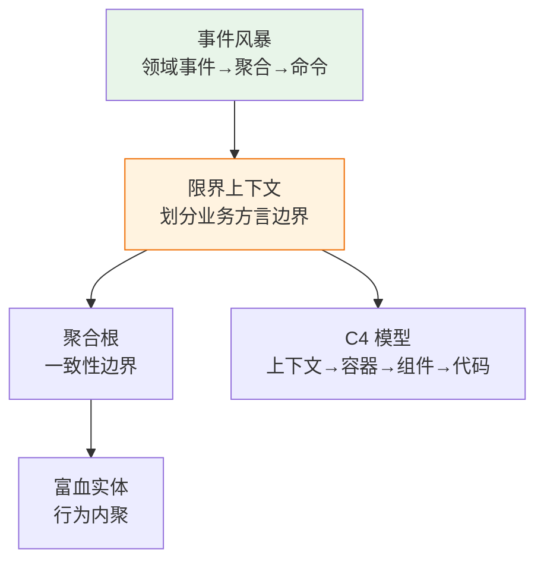

### 2.2 核心能力构成

- **统一语言（Ubiquitous Language）**：和业务、开发说同一套词。我要求团队"账务""账户""余额"必须严格区分，不能混用，否则代码和沟通都会乱。
- **上下文映射（Context Map）**：上下文之间是防腐层（ACL）、共享内核还是合作关系，要显式画出来。
- **聚合设计**：一个事务内只改一个聚合；跨聚合用最终一致。
- **模型演进**：模型不是一次定终身，要随业务认知加深而重构（DDD 的 Refactoring 到更深模型）。

### 2.3 真实场景

XTransfer 的"收款"业务，最初按数据库表结构反向建模（典型贫血模型），结果"状态流转"散落在十几个 Service 里，改一处崩一片。我主导用**事件风暴**重做：以"款项到达""风控通过""入账完成"等领域事件为锚，识别出"收款单"聚合根，把状态机收口到聚合内。之后新增"部分到账""多币种拆分"需求，改动被收敛在聚合边界内，**影响面从 12 个文件降到 2 个**。

### 2.4 我的反思（踩过的坑）

> **【反思】** 我曾迷信"先建完美领域模型再写代码"，结果在需求还模糊时过度设计，模型比业务还复杂，团队看不懂、用不上。教训：**建模是用来对齐认知的，不是用来炫技的**。模型一旦脱离"人和人能讲清楚"，就失去了价值。

### 2.5 我的认识

> **【认识】** 一个**错的模型比没有模型更危险**——因为它假装有结构，让人放松警惕。我判断建模好坏的标准只有一条：**新需求进来时，改动是收敛的还是发散的**。收敛 = 模型对；发散 = 边界画错了。建模能力的高低，最终体现在"你能多早识别出错的边界"。

### 2.6 怎么练

- 下次接需求，先拉业务方做一场事件风暴（便利贴即可），再动键盘。
- 读《领域驱动设计》《实现领域驱动设计》；重读《DDD 领域驱动设计实战指南》（本站）。
- 强制每个聚合写"不变量（Invariant）"——它保证什么永远为真。

---

## 3. 性能优化与容量规划

> **定义**：在架构层就把性能与成本设计进去，并用压测和 SLO 量化验证，而非上线后被流量打挂才救火。

### 3.1 它到底是什么

性能不是"调出来的"，是"设计出来的"。架构师要回答：

- **目标是什么**：P99 < 200ms？TPS > 1000？容量要撑双 11 几倍峰值？
- **瓶颈在哪层**：网络、CPU、IO、锁、GC、慢查询、缓存命中率？
- **怎么验证**：压测（JMeter/Gatling）、容量评估、全链路压测。

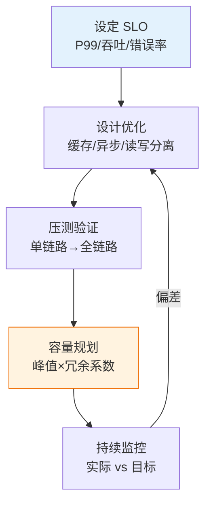

### 3.2 核心能力构成

- **多级缓存**：本地（Caffeine）+ 分布式（Redis）+ CDN，注意击穿/穿透/雪崩。
- **异步化**：非核心路径（通知、日志、统计）扔 MQ，主链路减负。
- **读写分离 / 分库分表**：把热点打散。
- **容量规划公式**：峰值 QPS × 冗余系数（通常 2~3）× 单实例承载 = 所需实例数。
- **降级与限流**：Sentinel/Hystrix，保护核心。

### 3.3 真实场景

支付渠道路由系统，大促前我做了容量规划：历史峰值 800 TPS，预估大促 3 倍 = 2400 TPS，单实例压测上限 1200 TPS，冗余 1.5 倍 → 需 3 个实例。但上线后真实流量在整点出现**脉冲峰值 4000 TPS**（远超预估），触发限流。事后复盘：容量规划漏算了"整点集中发起"的业务模式，应在路由入口做**请求削峰（MQ 缓冲）+ 动态扩容**。

### 3.4 我的反思

> **【反思】** 我踩过最贵的坑是**把压测放到上线后**。某次新链路没压测直接灰度，真实流量一来 MySQL 连接池打满，连锁拖垮相邻服务。从此我的铁律：**任何核心链路，压测不过 = 不许上线**。性能问题的成本，永远是指数级的——上线后救火的成本是设计阶段预防的 10 倍。

### 3.5 我的认识

> **【认识】** 性能优化的第一原则：**先量化，再优化；先定位瓶颈，再动手**。我见过太多人"一慢就加缓存、一慢就加机器"，结果缓存一致性 bug 引发资损。真正的能力是**用证据说话**——火焰图、慢查询日志、trace 链路先告诉我瓶颈在哪一毫秒，而不是拍脑袋。另外，**容量不是算出来的，是压出来的**，公式只是初估，全链路压测才是真相。

### 3.6 怎么练

- 把 JMeter/Gatling 跑通至少一个核心链路，学会看 P99 和吞吐拐点。
- 学 Prometheus + Grafana 看资源曲线，理解"拐点"在哪。
- 建立"SLO 先行"习惯：任何设计先写 SLO，再反推架构。

---

## 4. 数据架构与存储选型

> **定义**：在一致性、延迟、成本、扩展性之间，为不同数据选对存储，并设计其生命周期、一致性与演进路径的能力。

### 4.1 它到底是什么

存储选型本质是在一个"三角"里取舍：

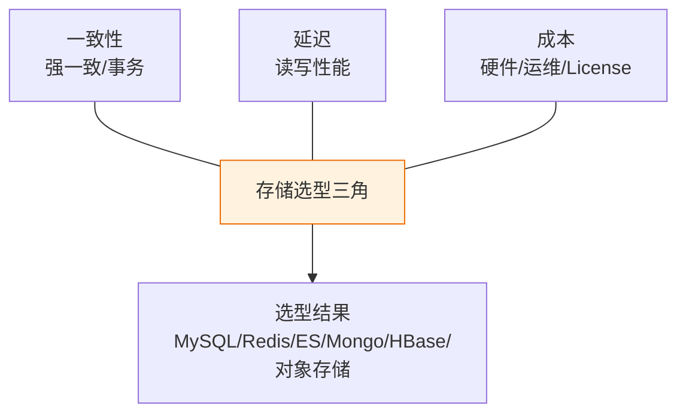

### 4.2 核心能力构成

- **关系型（MySQL）**：强一致、事务、复杂查询。分库分表（ShardingSphere）解决单表过大。
- **缓存（Redis）**：高频读、计数器、分布式锁；**但 Redis 不是数据库**，丢数据、大 key 是雷。
- **文档（MongoDB）**：非结构化、灵活 schema（商品描述、日志）。
- **搜索（ES）**：全文检索、聚合分析。
- **时序/列存（HBase/ClickHouse）**：海量写入、OLAP。
- **数据一致性**：分布式事务（Saga/TCC）、最终一致、对账兜底。

### 4.3 真实场景

XTransfer 的**账务系统**：账户余额必须强一致（MySQL + 本地事务 + 行锁），绝不能用 Redis 当余额库；而"账户流水展示""账单搜索"用 ES；对账单文件用对象存储；风控特征用 Redis 缓存。一次故障是有人把"累计交易额"放 Redis INCR，结果 Redis 重启丢数，对账发现差额。**这条教训写进了团队规范：凡涉及资金数值，必须落库，缓存只做展示副本**。

### 4.4 我的反思

> **【反思】** 我曾为了"性能"把一处本该强一致的状态用 Redis 承载，理由是"读多写少"。结果一次主从切换带来短暂数据不一致，差点造成重复入账。教训刻骨：**一致性要求不是性能优化的可选项，是架构红线**。性能不够，应该去优化读写路径（索引、缓存副本、异步），而不是动一致性底座。

### 4.5 我的认识

> **【认识】** 数据架构里最贵的错误是**"用错存储"**，因为它会在最不该出问题的时候爆。我的判断框架就三句话：**钱相关的，MySQL 落库 + 事务兜底；快相关的，Redis 做副本不做真相；查相关的，ES/列存分出去**。存储选型没有银弹，但"把对的 data 放对的 store"是架构师的基本功。另外，**对账机制是数据架构的最后一道保险**——任何跨存储的最终一致，都要有异步对账兜底。

### 4.6 怎么练

- 画一张"业务数据 → 存储选型 → 一致性要求"的映射表，逼自己显式决策。
- 读《MySQL 性能调优与高可用架构》《Redis 缓存设计与分布式锁实战》（本站）。
- 动手做一次分库分表 + 分布式事务的 Demo。

---

## 5. 稳定性与可观测性工程

> **定义**：让系统在"出事前能预判、出事时能定位、出完能恢复"的能力。它是架构师对"生产环境敬畏心"的工程化表达。

### 5.1 它到底是什么

稳定性不是"不出故障"（那不可能），而是**故障的影响可控、定位快、恢复快**。三支柱：

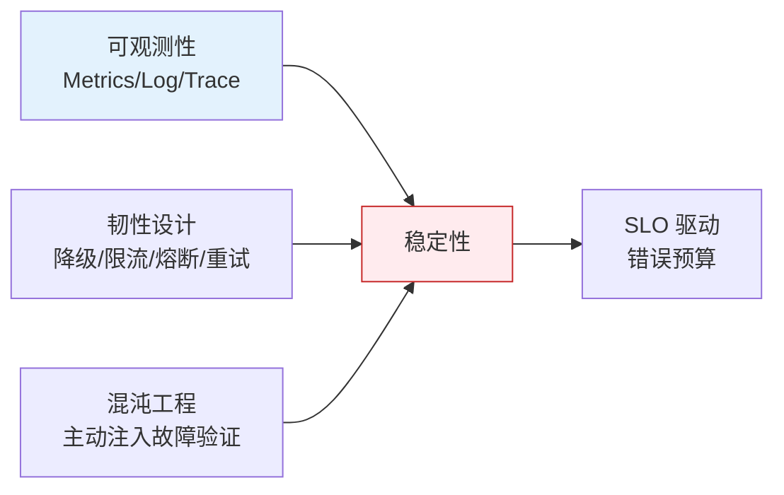

### 5.2 核心能力构成

- **三支柱可观测**：Metrics（Prometheus）、Logging（ELK）、Tracing（SkyWalking/Jaeger）。**没有 trace 的分布式系统等于盲人摸象**。
- **SLO 与错误预算**：用"错误预算"把稳定性量化成可谈判的资源。
- **韧性模式**：限流、熔断、降级、超时、重试（含退避）、舱壁隔离。
- **容灾**：多活/冷备、RTO/RPO、预案手册。
- **混沌工程**：主动 kill 实例、断网络，验证兜底是否真的有效（别等真的挂了才发现兜底是假的）。

### 5.3 真实场景

一次"偶发超时"，开发查了一天没定位。我用 SkyWalking 拉链路，发现请求在**风控服务**偶尔 > 500ms，下钻发现风控依赖的 Redis 有**100MB 大 key**，序列化耗时爆炸。拆小 key 后恢复。另一例：我推动做**混沌演练**，主动 kill 一个支付核心 Pod，结果流量没自动切走（就绪探针配错），当场暴露——这比大促时真的挂了强一万倍。

### 5.4 我的反思

> **【反思】** 我早期对"可观测性"的态度是"能跑就行，出问题再看日志"，结果每次故障都要靠猜、靠人肉比对十几台机器日志，平均定位 2 小时起步。后来我把可观测性当成**架构的一等公民**写进每个方案：没有 trace 的链路不允许上线。定位时间从小时级降到分钟级。**可观测性不是成本，是故障时的救命钱。**

### 5.5 我的认识

> **【认识】** 我对稳定性的核心信念是：**系统一定会出错，架构师的本职是让错误"小、快、可控"**。三句话送给你——① 兜底机制必须**被演练过**才叫存在，否则只是文档里的谎言；② 降级开关要能**不发布就开**，否则大促时你改代码来不及；③ **资损类故障优先级永远最高**，技术债可以排期，钱丢了当场算账。稳定性是架构师信誉的基石，一次资损级事故，十年口碑清零。

### 5.6 怎么练

- 给自己的核心服务配齐 Metrics + 一条 Trace，亲手定位一次慢请求。
- 读《高可用容灾与稳定性》《资损防控与极端场景应急》（本站）。
- 做一次 chaos 演练：kill 一个依赖，看系统表现。

---

## 6. 安全与合规架构

> **定义**：把资损防线与监管红线在架构设计阶段就内置进去，而非事后打补丁。金融/支付领域尤其性命攸关。

### 6.1 它到底是什么

安全合规不是"上 HTTPS 就完事"，而是贯穿全链路的防线：

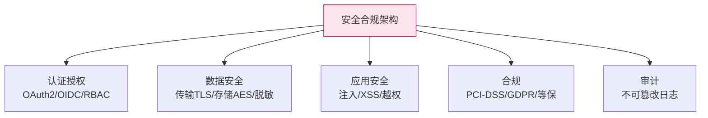

### 6.2 核心能力构成

- **认证授权**：OAuth2/OIDC、RBAC/ABAC，最小权限原则。
- **数据安全**：传输加密（TLS 1.3）、存储加密（AES）、敏感字段脱敏、密钥管理（KMS）。
- **应用安全**：防 SQL 注入、XSS、CSRF、越权（IDOR）、批量泄露。
- **合规框架**：PCI-DSS（支付卡）、GDPR（数据本地化）、等保/人行规定。
- **安全左移**：在架构评审阶段就过安全 checklist，而非上线前才测。

### 6.3 真实场景

跨境支付过**PCI-DSS**时，架构上必须做到：卡号不落库（token 化）、日志脱敏、运维操作双人复核、审计日志不可篡改。我专门设计了一条"敏感数据不出支付域"的防腐层，任何跨域调用都先过脱敏网关。一次内部审计发现某测试环境日志明文打了卡号前 6 后 4，当场整改并加了一道"日志扫描器"自动拦截。

### 6.4 我的反思

> **【反思】** 我曾把"审计日志"当成可有可无的附属，觉得"反正没人看"。直到一次监管检查要求提供某笔交易的完整操作链，我们翻了三天才拼凑出来，被审计点名。教训：**合规不是负担，是架构的硬约束；审计日志不是给机器看的，是给未来的自己和监管看的**。现在任何资金操作，我第一反应就是"这条操作链能不能被审计还原"。

### 6.5 我的认识

> **【认识】** 安全合规的本质是**"把不可接受的风险在设计期就消除"**。我的底线思维：**安全是成本中心，但也是资损与法律的底线——这条线没有商量余地**。具体判断：① 凡是涉及 PII（个人身份信息）/资金，默认加密 + 默认脱敏 + 默认审计；② 合规要求（数据本地化、留痕）要当成 NFR 写进方案，不能"后面补"；③ 安全左移比安全右补便宜 100 倍。**一个被攻破或违规的架构，功能再强也是零分。**

### 6.6 怎么练

- 学 OAuth2/OIDC 流程，能手画授权码模式时序图。
- 读 OWASP Top 10，对每条能讲"架构上怎么防"。
- 了解 PCI-DSS / 等保 2.0 的基本条款，知道它们在架构上的落点。

---

## 7. 技术深度与原理掌握

> **定义**：在 1~2 个领域钻到原理级（源码、JVM、网络协议），形成 T 型结构，使技术判断有"底层依据"而非"听别人说"。

### 7.1 它到底是什么

架构师不必写最多代码，但要懂最深的原理。T 型结构：

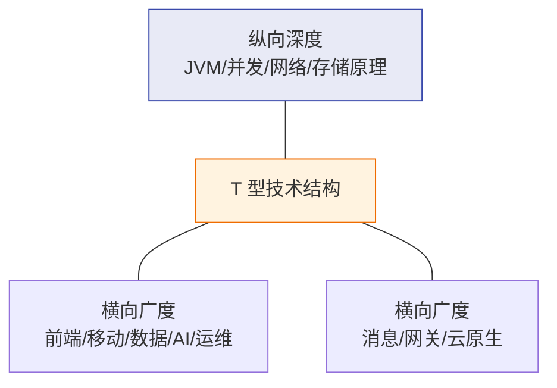

### 7.2 核心能力构成

- **纵向深度**：JVM 内存模型与 GC、并发与 JMM、TCP 细节、MySQL 执行计划、Redis 底层结构——至少 1~2 个领域到"能读源码"级别。
- **横向广度**：前端工程化、移动端、数据工程、AI/LLM、运维——不求精通，但能对话、能判断。
- **原理级判断力**：别人说"用 XX 框架"，你能从原理判断它适不适合，而不是看热度。
- **避免过度迷信新技术**：基于问题选工具，而非基于新鲜感。

### 7.3 真实场景

一次 GC 引发的长尾抖动，运维只会"加内存"。我通过 GC 日志定位是 **G1 的 Mixed GC 跟不上分配速率 + 大对象直接进入 Old 区**，调整为增大 Region、限流大对象、换 ZGC 后 P99 从 800ms 降到 60ms。另一位同事迷信某"新一代网关"宣传的超高吞吐，我没盲从，读了它的线程模型后发现它在长连接场景有锁竞争瓶颈——避免了一个潜在坑。

### 7.4 我的反思

> **【反思】** 我有段时期陷入"广度焦虑"，啥都学一点啥都不深，结果选型时只能"看社区热度"。后来被一个问题打脸：一个并发 bug 我调了两天，组里更资深的人看一眼 JMM 内存屏障就定位了。教训：**没有深度的广度是沙上筑塔**。架构师的"深度"不一定用来写代码，但一定用来在关键时刻拍板。

### 7.5 我的认识

> **【认识】** 技术深度对架构师的意义，不是"显得牛"，而是**让权衡有依据**。当你说"这里用最终一致放弃强一致"，你得懂一致性的底层代价；当你说"用 ZGC"，你得懂它和 G1 的取舍。我的信条：**深度是判断力的来源，广度是沟通的前提**。两者缺一，架构师要么成了"只会下命令不懂行的外行"，要么成了"什么都懂一点但拍不了板的老好人"。

### 7.6 怎么练

- 选 1 个领域（如 JVM 或 MySQL）读到源码级，写笔记。
- 定期参与 Code Review，保持一线手感（见第 14、15 节）。
- 读《Java 与 Spring 深度准备》《GC 深度调优与 ZGC 实战》（本站）。

---

## 8. 云原生与工程效能

> **定义**：懂运维、懂交付，让设计出的架构能被高效、安全、可重复地部署和运维——否则架构成"运维的噩梦"。

### 8.1 它到底是什么

架构师的产出要"能被交付"，所以必须懂交付链路：

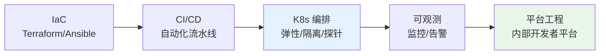

### 8.2 核心能力构成

- **容器与编排**：Docker 镜像最小化、K8s 的 Pod/Deployment/Service/Ingress、资源 limit/request、就绪/存活探针。
- **CI/CD 与 GitOps**：流水线、蓝绿/金丝雀发布、回滚。
- **IaC**：Terraform/Ansible，环境可重建。
- **服务网格**：Istio 做流量治理（灰度、熔断）。
- **Serverless / 函数计算**：事件驱动、波峰波谷场景（见未来演进）。

### 8.3 真实场景

容器化初期，某服务没设 CPU limit，大促时被它吃满节点，把同节点核心支付服务"挤"挂了。我推动**所有 Pod 强制 request/limit + Namespace 级配额 + 核心服务独立节点池（nodeSelector/taint）**。另一次，用**金丝雀发布**把新版本先放 5% 流量，监控到错误率异常立刻自动回滚，避免了全量故障。

### 8.4 我的反思

> **【反思】** 我一度认为"云原生是运维的事，架构师管设计就行"。直到我的一个设计因为没考虑 K8s 的**优雅下线（preStop +  draining）**，发布时瞬间断了正在处理的支付请求，出现少量掉单。教训：**架构师不懂交付，设计就一定有盲区**。现在的铁律：每个架构方案必须回答"它怎么部署、怎么灰度、怎么回滚、怎么隔离"。

### 8.5 我的认识

> **【认识】** 我对云原生的判断是：**它是架构师意志的"交付层"**。再好的架构，如果交付过程靠手工、靠运气，就不可持续。趋势上，**平台工程（Internal Developer Platform）会让架构师的"标准与约束"产品化**——开发者自助拿到符合架构规范的环境和流水线，架构师的意志不再靠"开会强调"落地，而是靠"平台内置"。这是架构师杠杆率的放大器。

### 8.6 怎么练

- 自己用 Docker + K8s 部署一个带探针、配了 limit 的服务。
- 配置一条 GitOps 流水线，体验金丝雀回滚。
- 读《后端技术补漏（云原生·可观测）》（本站）。

---

# 二、软实力篇（人与组织）

> 如果说硬实力让你"够格"，软实力决定你能"走多高、带多大、活多久"。业界有个刺耳但真实的说法：**架构师的成功 30% 靠技术，70% 靠软实力**（百度云《从技术骨干到架构大师》）。我未必完全认同这个比例，但方向没错——越往上，技术越成为"前提"，人和组织的复杂度才是主战场。

---

## 9. 抽象思维与权衡决策

> **定义**：从纷繁细节中抓住本质、建立模型，并在冲突目标间做出"有依据、可解释、敢担责"的取舍的能力。它是架构师最被低估、却最核心的软实力。

### 9.1 它到底是什么

架构的本质是**取舍**。抽象思维让你看见"变与不变"，权衡决策让你在多个"都对"的方案里选一个并说清理由。

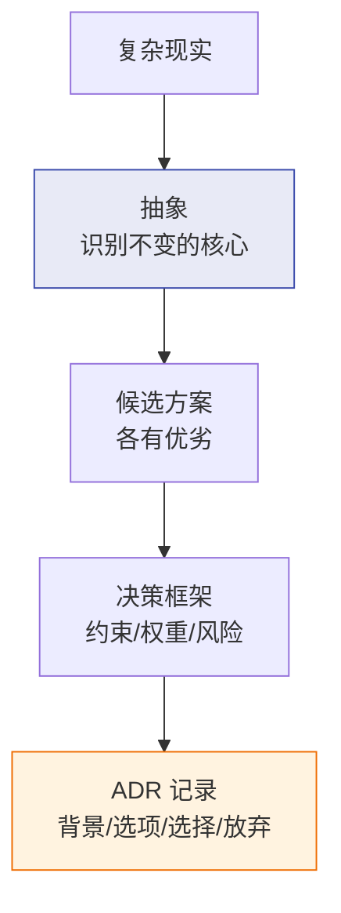

### 9.2 核心能力构成

- **第一性原理思考**：不停在"大家都这么做"，追问"本质约束是什么"。
- **约束识别**：成本、时间、人力、合规、风险，把隐性约束显性化。
- **决策框架**：决策矩阵（按权重打分）、成本效益分析（CBA）、可逆性判断（可逆的快试，不可逆的慎行）。
- **ADR（架构决策记录）**：把"为什么这么选、放弃了什么"写下来，给未来的人留路。

### 9.3 真实场景

团队争论"自研 RPC 还是用现成框架"。我拉了一张决策矩阵：成熟度、人力成本、可控性、迁移风险四项加权。结论是"核心链路用成熟框架保稳定，边缘工具链自研补差异"。并写 ADR 说明"放弃完全自研以控制人力，放弃完全外购以保留定制能力"。半年后有人质疑，翻 ADR 立刻对齐，省了三天会。

### 9.4 我的反思

> **【反思】** 我年轻时做决策喜欢"和稀泥"——把各方意见都塞进去，结果方案四不像、谁都不满意。后来悟到：**不做取舍的方案是最差的方案**。回避决策看似"不得罪人"，实则把代价转嫁给未来和团队。现在我会主动说"我建议砍掉 X，因为 Y 更重要"，哪怕有人不爽。

### 9.5 我的认识

> **【认识】** 我对权衡的最高信条：**敢写"我放弃了什么"的人，才配做架构师**。一份没有"放弃项"的架构方案，要么在撒谎，要么没想清楚。抽象能力的终极体现，是你能把一堆互相矛盾的需求，收敛成"几条不可动摇的红线 + 一堆可让步的优化项"。**架构师不是来找完美答案的，是来为不完美负责的人。**

### 9.6 怎么练

- 每个决策强制写 ADR，含"放弃的选项"。
- 学决策矩阵，给方案打分而非凭感觉。
- 读《架构师高频面试题深度解析》（本站）里的权衡题。

---

## 10. 沟通表达与向上管理

> **定义**：把技术方案"翻译"成不同受众能听懂的语言——对老板讲价值、对产品讲可行、对开发讲意图——并善于向上同步风险、争取资源。

### 10.1 它到底是什么

架构师是"技术外交官"。同一件事，三种讲法：

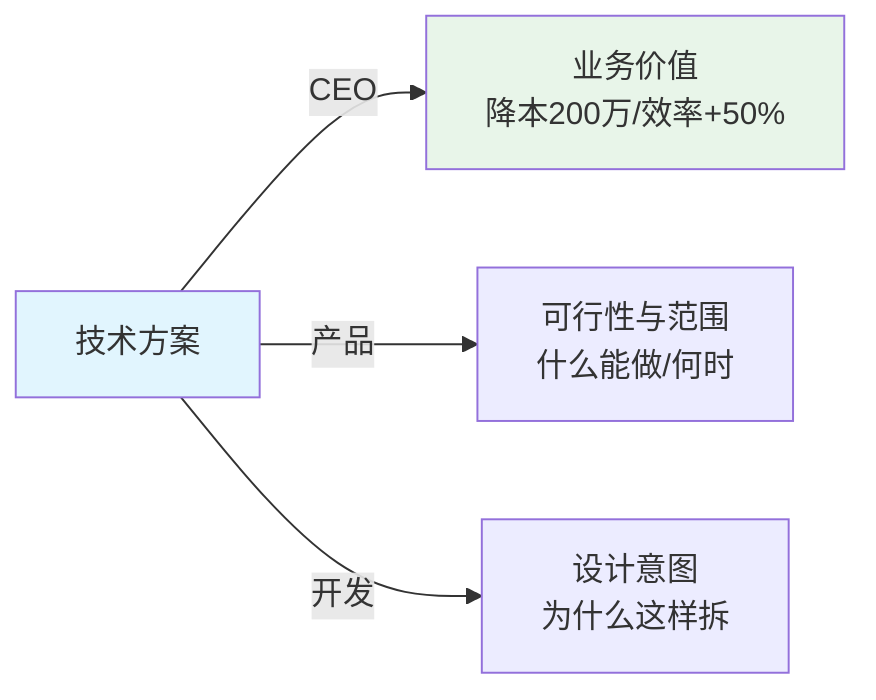

### 10.2 核心能力构成

- **翻译能力**：把"部署 Redis 集群"翻译成"页面加载从 3 秒降到 0.5 秒，留存 +10%"。
- **3 分钟电梯法则**：能向 CEO 3 分钟讲清架构核心价值。
- **可视化沟通**：用 C4/时序图替代大段文字（见《架构图绘制方法论》）。
- **向上管理**：坏消息带方案尽早同步；要资源用"ROI 对比表"而非"技术很难"。
- **定期架构评审会**：拉开发/测试/产品/运维多方对齐。

### 10.3 真实场景

推微服务改造，我给非技术高管看的不是架构图，而是一张**业务价值对比表**：发布周期 2 周→1 天、故障恢复 1 小时→5 分钟、新功能上线速度。高管秒批预算。反之，我曾对老板只说"系统耦合严重需要重构"，被追问"重构能带来什么"时答不上来，预算被砍。

### 10.4 我的反思

> **【反思】** 我踩过最大的沟通坑是**用技术术语堆砌去"说服"业务方**，结果对方一脸懵然后拒绝。后来明白：业务方不在乎你用什么技术，只在乎"更快、更稳、更便宜、更少风险"。当我学会用他们的语言（成本、效率、风险）讲技术，阻力立刻小了。另一个坑是**报喜不报忧**——坏消息捂到最后爆雷，比早点带方案同步惨十倍。

### 10.5 我的认识

> **【认识】** 沟通的终极目标不是"让对方听懂"，而是"让对方**做你想要的决定**"。所以我判断沟通好坏的标准是：**会后有没有产生行动**（批预算、改排期、对齐认知）。架构师最值钱的一次沟通，往往是把"技术必要性"翻译成"商业 ROI"。不会争取资源的架构师，再好的方案也只能烂在文档里。

### 10.6 怎么练

- 下次汇报，先写一句话版本："这个方案帮业务____（指标）提升____。"
- 学用 C4 画给不同层级的图（上下文图给老板，组件图给开发）。
- 练"3 分钟电梯演讲"：给同事讲你的架构，计时。

---

## 11. 技术领导力与影响力

> **定义**：不靠职位权力，而靠专业判断力、技术贡献和标准制定，影响和带动团队把架构落地的能力。

### 11.1 它到底是什么

领导力 ≠ 头衔。架构师的影响力来自"你判断得对、你帮得到人、你定的标准有用"：

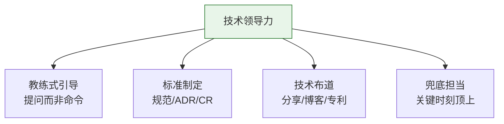

### 11.2 核心能力构成

- **教练式领导**：不直接给答案，用提问引导（"数据需要事务吗？查询结构化吗？"）。
- **技术标准制定**：编码规范、API 规范、索引规范，形成团队共识。
- **技术布道**：内部分享、博客、开源贡献、专利，积累影响力。
- **关键时刻顶上**：出事时你站出来兜底，比平时讲一百句都管用。
- **赋能而非替代**：把经验变成团队资产（文档、CR、复盘）。

### 11.3 真实场景

我不强制推行规范，而是先在一个核心模块做样板（落地 CQRS + 事件溯源），跑通后组织分享，让团队"看见好处"再推广。效率提升被 metric 验证后，规范自己就推行开了。对比早期我"下命令式"推一个框架，被团队阳奉阴违、最后不了了之。

### 11.4 我的反思

> **【反思】** 我曾以为"我是架构师你说做就得做"，结果团队表面配合、私下绕开。教训：**靠职位压出来的执行，质量最差、反弹最狠**。真正的影响力是"我服你判断，所以跟你走"。我后来把"教练式"当习惯——少说"应该这样"，多问"你觉得这里的风险是什么"，团队反而成长更快、更认同方案。

### 11.5 我的认识

> **【认识】** 技术领导力的本质，是**"让正确的事因为你的存在而发生，而不是因为你的命令"**。我的衡量标准：**团队离开你之后，架构是更强了还是崩了？** 如果离开你就乱，说明你建的是"个人依赖"不是"组织能力"。最高级的技术领导力，是培养出能反驳你的架构师——那说明你建的不只是系统，是判断力。

### 11.6 怎么练

- 每周做一次 Code Review，附"为什么"而非只标错。
- 每月输出 1 篇技术文或内部分享。
- 练"教练式提问"：下属来问，先反问三个问题。

---

## 12. 业务洞察与商业思维

> **定义**：深入理解业务目标与行业逻辑，把技术方案和商业价值绑定，成为"懂业务的半个行业专家"。

### 12.1 它到底是什么

脱离业务的架构是空中楼阁。架构师要回答"技术如何支撑 GMV/留存/降本"：

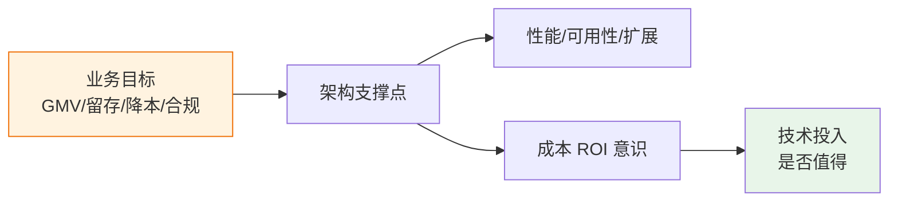

### 12.2 核心能力构成

- **对齐商业指标**：明确架构支撑哪个业务指标（订单高并发 → GMV；低延迟 → 留存）。
- **ROI / 成本意识**：引入 AI 推荐，要算"转化提升收入"是否覆盖开发成本。
- **行业领域知识**：金融重合规与一致性、互联网重迭代与体验、制造业重设备接入与实时。
- **成为半个行业专家**：读行业报告（Gartner、艾瑞）、和业务专家深聊。

### 12.3 真实场景

XTransfer 做生鲜/跨境供应链相关模块时，业务核心目标是"降损耗率"。我据此把架构重点放在"物流轨迹实时追踪 + 库存预警预测"上，损耗率从 15% 降到 8%。如果我只从技术角度追求"高并发"，就完全没打中业务痛点。另一次，业务要"快速上线一个临时统计"，我用脚本 1 小时满足，避免占用核心研发资源——这是 ROI 判断。

### 12.4 我的反思

> **【反思】** 我有过"为技术而技术"的阶段：引入一个复杂的中台，理由是"业界都这么做"，结果业务根本用不上，还背了沉重维护债。教训惨痛：**技术不是目的，是手段**。现在每个技术提案，我第一句话先问"它服务哪个业务目标、ROI 如何"。

### 12.5 我的认识

> **【认识】** 我对业务洞察的判断：**架构师不懂业务，设计就是盲猜**。但"懂业务"不是去抢产品经理的活，而是理解"钱从哪来、风险在哪、优先级怎么排"。我的公式：**架构价值 = 技术正确性 × 业务匹配度**。技术再对，不匹配业务目标，价值归零。越资深的架构师，越要把"商业语言"当成第二母语。

### 12.6 怎么练

- 参加产品规划会，提前知道下季度业务重点。
- 读一份所在行业的 Gartner/艾瑞报告，提炼"对架构的要求"。
- 每个技术方案开头写一句"支撑的业务指标"。

---

## 13. 跨团队协同与冲突管理

> **定义**：在多团队、多利益方冲突中做"技术外交官"，把冲突变成校准，推动方案跨边界落地。

### 13.1 它到底是什么

架构师常夹在"产品要快、研发要稳、运维要省、安全要严"之间。托马斯-基尔曼冲突模型：

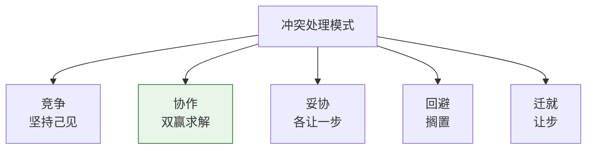

### 13.2 核心能力构成

- **利益冲突识别**：谁要快、谁要稳、谁担风险，先看清地图。
- **协作式解决（双赢）**：用用户故事地图对齐目标，用 ADR 固化决策减少重复讨论。
- **谈判**：在"技术债 vs 业务进度"间找平衡点，而非非黑即白。
- **政治智慧**：识别组织里的关键决策者和隐性规则，借力而非硬刚。
- **技术委员会机制**：把跨部门协作制度化，减少个人扯皮。

### 13.3 真实场景

一次支付重构，安全团队要求全量加密审计（拖慢 2 周），业务要赶大促窗口。我没硬刚任一方，而是谈判出"核心资金链路全量审计 + 非核心链路先脱敏后补审计"的分层方案，双方都接受。某金融项目建了技术委员会，跨部门协作效率提升 35%（业界案例）。

### 13.4 我的反思

> **【反思】** 我年轻时怕冲突，遇到跨团队分歧就回避或上交领导，结果方案被搁置、信任流失。后来明白：**冲突不是坏事，是校准**——它暴露了没对齐的假设。现在的我做"把冲突摊到桌面上，用数据和 ADR 解决"，反而更快达成共识。回避冲突才是真正的不负责。

### 13.5 我的认识

> **【认识】** 我对协同的判断：**架构师最大的敌人不是技术难题，是"没人配合"**。技术方案再好，推不动就是零。我的经验——① 先建立"共同语言和目标"，再谈技术；② 用机制（技术委员会、ADR）替代个人博弈；③ **政治智慧不是圆滑，是看清权力结构后选对推动路径**。真正厉害的架构师，能让反对者觉得自己也是方案的作者。

### 13.6 怎么练

- 学托马斯-基尔曼模型，复盘一次自己怎么处理冲突的。
- 推动一次跨团队架构评审，用 ADR 固化结论。
- 读《团队管理与技术领导力》（本站）的冲突章节。

---

## 14. 人才梯队与组织建设

> **定义**：通过培养、授权、Code Review、复盘，把个人能力变成组织能力，建起能独当一面的梯队——架构的可持续靠人。

### 14.1 它到底是什么

架构再好，人不行也落不了地；人强了，架构才能演进。梯队建设闭环：

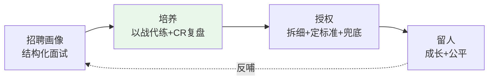

### 14.2 核心能力构成

- **招聘画像**：知道要什么样的人，结构化面试。
- **以战代练**：把子模块交给成员 owner，在实战中培养。
- **Code Review 即教学**：CR 不只是找 bug，是传递架构意图。
- **授权 + 兜底**：拆细授权、定标准、只在红线上把关。
- **复盘文化**：把故障和个人经验变成团队资产。

### 14.3 真实场景

我做收款领域核心开发时习惯自己把状态机写完才放心（事必躬亲，自己成瓶颈）。成为领域 Owner 后被迫学会"拆细授权 + 定标准 + 兜底"：把子模块交给成员 owner，只在资金安全红线把关，用 CR 和复盘把我的经验变团队资产。结果带出了能独当一面的梯队，我自己也解脱出来做更高层的设计。

### 14.4 我的反思

> **【反思】** 我曾以为"我写最快最稳，所以我自己上"，结果自己成单点瓶颈、团队没成长、我一休假系统就慌。这是技术高手转架构师最典型的坑：**把管理当升职奖励，而不是另一种专业**。教训：**你一个人的产出上限很低，团队的产出上限才高**。不放权，是对团队和自己的双重不负责。

### 14.5 我的认识

> **【认识】** 我对人才梯队的信念：**架构师的终极作品不是系统，是人**。一个能在我离开后继续把架构做对、做好的团队，才是我真正的遗产。我的判断标准：① 关键模块有没有"备份 owner"；② 新人能不能在我定的规范下自主决策；③ 团队敢不敢反驳我。这三条都达标，说明组织能力建起来了。

### 14.6 怎么练

- 挑一个成员做"备份 owner"，把某模块授权出去。
- 把 CR 评论从"这里错了"升级为"为什么这样设计更好"。
- 建故障复盘库，每月复盘一次变成团队知识。

---

## 15. 持续学习与趋势判断

> **定义**：在技术快速迭代中保持"学生心态"，但更重要的是——**过滤噪音、判断哪些趋势真值得投入**，而非追逐每一个热点。

### 15.1 它到底是什么

学习是架构师的职业寿命。但"学什么"比"学不学"更重要：

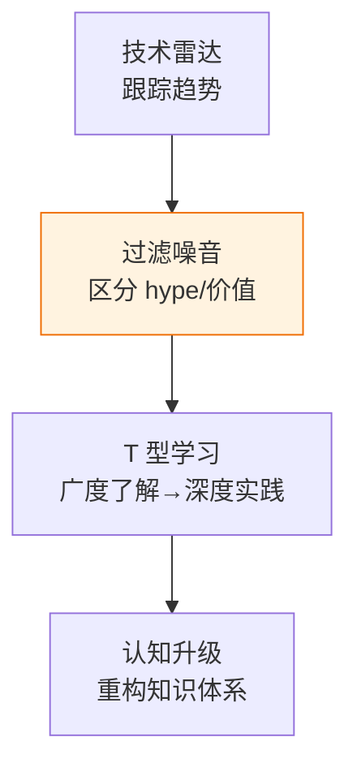

### 15.2 核心能力构成

- **技术雷达**：跟踪 ThoughtWorks 技术雷达、Gartner 曲线，提前布局（如服务网格、AI-Native）。
- **失败复盘库**：把事故当教材，可用性从 99.9%→99.99%（业界案例）。
- **经典打底**：读《架构整洁之道》《DDIA》《凤凰项目》，建立不变的原理层。
- **T 型学习法**：新兴技术先广度了解（概念、场景），再按业务需求深度实践。
- **认知升级**：定期重构自己的知识体系，淘汰过时判断。

### 15.3. 真实场景

5 年前 Docker 还没普及，现在 K8s 成标配。我靠"技术雷达 + 经典原理"两条腿：原理层（分布式、一致性）不过时，让我快速理解新工具；雷达层让我在 Serverless/AI-Native 刚冒头时就建认知，等业务需要时 already ready。反之，我过滤掉过一堆"下一代框架"的 hype，省下大量时间。

### 15.4 我的反思

> **【反思】** 我有过"FOMO（错失恐惧）"——怕落后就啥都学，结果浅尝辄止、原理没扎根，遇到真问题还是不会。教训：**追逐热点不等于学习，建立可迁移的原理层才是真学习**。现在我对新技术默认"先观察一个周期（技术成熟度曲线），再决定是否投入"，避免当小白鼠。

### 15.5 我的认识

> **【认识】** 我对学习的判断有一句狠话：**架构师的职业寿命，取决于他淘汰旧知识的速度，不取决于他吸收新知识的量**。技术迭代快，但底层原理（CAP、一致性、抽象、权衡）十年不变。我的策略是"原理打底、趋势观望、业务驱动深入"——**让业务需求当筛选器**，业务要用了再深钻，不用的保持雷达距离。这样既不脱节，也不被 hype 拖垮。

### 15.6 怎么练

- 订一个技术雷达源（InfoQ / Martin Fowler / ThoughtWorks），每月扫一遍。
- 建"个人知识体系"文档，定期删过时内容。
- 对一个新兴技术（如 AI-Native）做"广度笔记"，等需要时再深。

---

# 三、架构师自问自答（向内）

> 写了 15 项能力，但能力是手段不是目的。作为架构师，有几个**向内的问题**必须自己答得上来。答不上来，能力再多也是"熟练的糊涂"。下面 5 题，是我十年里反复自问、且每次答案都在变的真问题。

## Q1：什么时候该用微服务，什么时候不该？

**我的答案**：按"组织边界"和"演进阶段"决定，而非"技术炫酷"。

- **不该用**：团队 < 10 人、业务边界还模糊、单体就能扛量。过早微服务的代价是分布式事务、运维、调试复杂度指数上升。
- **该用**：业务域清晰可拆、团队按域划分、某模块需独立扩缩容（如支付 vs 风控）。
- **我的判断句**：**"先单体跑通核心链路，等某个模块真被'独立扩展/独立团队/独立发布'的需求逼到痛了，再拆它。"** 演进式拆分，比一步到位安全得多。

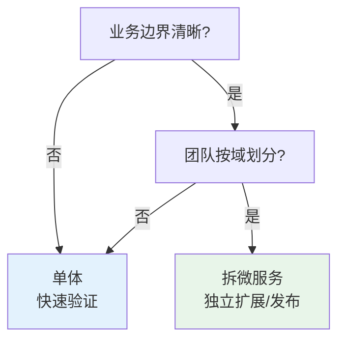

## Q2：怎么判断一个技术决策是对的？

**我的答案**：用"可逆性 + 证据 + 复盘"三件套。

- **可逆性**：可逆的决策（换框架、调参数）快试快错；不可逆的（选型数据库、定核心模型）慎行、用 ADR + 小规模验证。
- **证据**：不靠"我觉得"，靠压测数据、错误率、成本对比。
- **复盘**：决策后看实际指标 vs 预期，错了就调，别硬撑。
- **我的底线**：**没有"放弃项"和"验证指标"的决策，不算决策，是赌运气。**

## Q3：架构师到底要不要写代码？写多少？

**我的答案**：必须保持"手感"，但写对地方、控比例。

- **要写**：核心/困难模块（基础库、中间件封装、关键算法）、PoC 验证、CR 里的关键修改。这些是"判断力落地"的窗口。
- **不写**：堆业务量的 CRUD、和架构判断无关的重复劳动。
- **比例**：随层级上升，手写比例下降但不可归零——**归零 = 失去手感 = 判断开始飘**。我现在的做法是"关键处亲自下场 + 日常靠 CR 和 PoC 保持连接"。

## Q4：业务压力（快上线）和架构质量（长期稳）冲突怎么办？

**我的答案**：分层处理，绝不"非此即彼"。

- **红线不让**：资损、安全、合规——这些没有商量，必须做。
- **债务量化**：把"暂时不做的架构优化"记进**架构债务看板**，标清代价和偿还计划，和业务谈 ROI。
- **演进式还债**：用 V1 最小闭环先上线，V2/V3 逐步补。比"要么完美要么不做"现实得多。
- **我的金句**：**"业务要快，架构师要给'快且不太烂'的方案，而不是'慢但完美'或'快且必爆'的方案。"**

## Q5：怎么衡量一个架构师的价值？

**我的答案**：用五个可量化维度，而不是"他懂多少"。

| 维度 | 量化指标 |
|------|---------|
| 系统稳定性 | 可用性 SLA、故障 MTTR、资损金额 |
| 交付效率 | 发布周期、需求吞吐、回滚率 |
| 成本 | 单位请求成本、资源利用率 |
| 团队成长 | 备份 owner 数、梯队独立交付率 |
| 业务支撑 | 支撑的 GMV/新业务上线速度 |

**我的判断**：**架构师的价值不在"设计了多少华丽架构"，而在"系统稳不稳、团队强不强、业务撑不撑得住"**。这五个指标里，资损和可用性是一票否决项。

---

# 四、未来架构演进研判（向外）

> 能力是当下的，趋势是未来的。作为架构师，不仅要做好今天，还要能判断"3~5 年后架构长什么样、我现在该储备什么"。下面 5 个前瞻问题，是我基于行业资料（GeeksforGeeks、Red Hat、腾讯云、JavaGuidePro 等）和一线实践的综合研判，带我的答案与推理。

## Q1：AI 会取代架构师吗？

**我的研判：不会取代，会重塑角色。**

- **不会取代的原因**：架构决策本质是"在价值冲突中做有依据的取舍"，涉及业务目标、组织政治、风险偏好——这些是 AI 没有上下文也无法担责的部分。AI 能生成方案草图，但"为不完美负责"只能人来做。
- **会重塑的部分**：架构师从"画图者"变成"**意图与约束的定义者 + AI 产出的校验者**"。AI 帮你生成候选架构、补齐异常路径、扫描风险、写 ADR 初稿；你定义业务意图、红线约束，并判断 AI 给的方案是否真能落地。
- **我的结论**：**未来稀缺的不是"会画架构图的人"，是"会定义问题、敢拍板、能为结果负责"的人**。AI 拉高了画图的下限，也拉大了"真架构师"和"画图员"的差距。

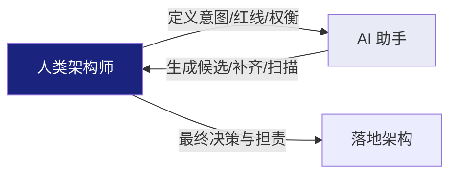

## Q2：AI-Native 架构长什么样？

**我的研判：模型成为"一等公民"的系统。**

- **模型即组件**：推理服务、Embedding、向量库和传统服务并列，都是架构节点。
- **推理链路可观测**：Token 成本、延迟、幻觉率、命中率都要监控（LLMOps）。
- **RAG / Agent 模式**：知识外挂 + 工具调用成为标准交互，而非简单 API。
- **模型版本与 A/B**：模型像代码一样有版本、能灰度、能回滚。
- **护栏（Guardrails）**：防幻觉、防越权、成本熔断，是架构必选项。
- **我的判断**：**AI-Native 不是"加个聊天框"，是把"不确定性"设计进架构**——你要为"模型可能答错"建兜底、为"推理可能很贵"建熔断、为"知识可能过时"建刷新。这恰恰是架构师权衡能力的主场。

## Q3：Serverless / 函数计算能成为主流吗？

**我的研判：混合是务实路线，纯 Serverless 难统天下。**

- **适合**：波峰波谷明显、事件驱动、试错型业务（营销活动、文件处理、IoT 触发）。
- **门槛**：冷启动延迟、有状态难、调试黑盒、厂商锁定。
- **我的判断**：**常驻服务（微服务/K8s）管核心稳态，函数管弹性脉冲**，是未来 3~5 年最现实的混合架构。架构师要会"在什么边界切一刀"，而不是 All-in。

## Q4：平台工程会取代架构师吗？

**我的研判：不取代，是架构师意志的"产品化"。**

- **关系**：架构师定义"标准与约束"（契约、规范、护栏），平台工程团队把它做成**内部开发者平台（IDP）**——开发者自助拿环境、跑流水线、接可观测，无需每次找架构师。
- **价值**：架构师的"标准"从"开会强调"变成"平台内置"，杠杆率指数放大。
- **我的判断**：**平台工程是架构师影响力的放大器，不是替代者**。不会用平台放大自己的架构师，会被"每个需求都要手把手教"拖死。

## Q5：面向 2030，架构师需要哪些新能力？

**我的研判：在 15 项之上，补 5 项"未来能力"。**

| 新能力 | 说明 |
|--------|------|
| AI 协作与提示工程 | 把 AI 当"架构副驾"，会定义意图、会校验产出 |
| 数据治理与隐私 | 数据资产化 + 合规（GDPR/数据出境）成为架构硬约束 |
| 成本工程（FinOps） | 把"每笔请求成本"当架构指标，和性能并列 |
| 合规与伦理 | AI 偏见、算法透明、可解释性进入架构评审 |
| 韧性工程 | 在不确定性（含 AI 不确定性）下设计可恢复系统 |

**我的结语**：**架构师这个角色不会消失，但"只会画图、不懂业务、不带人、不学新"的架构师会消失**。未来的架构师，是"能在人机协作里定义问题、在约束里做有依据取舍、还能把人和平台都带起来"的那种人。这，就是上面 15 项能力 + 自问 + 趋势研判，最终要托起的画像。

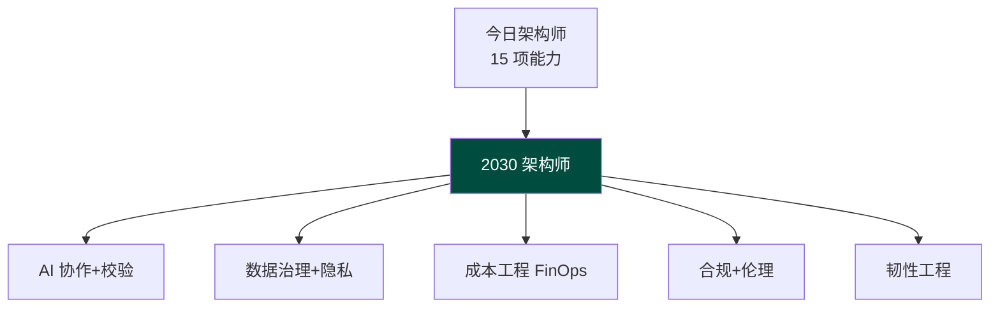

---

## 写在最后

这篇写得长，是因为"架构师能力"这件事本来就长——它不是一张清单能装下的。如果只能带走三句话：

1. **硬实力是下限，软实力是上限，而"在约束下做有依据的取舍"是内核。**
2. **每一项能力，值钱的都不是"知道"，而是"踩过坑后还信的判断"。** 本文里我的反思与认识，比任何定义都重要。
3. **架构师这个角色，最终托起的是"稳的系统、强的人、撑得住的业务"——而不是漂亮的图。**

共勉。继续刷《架构师高频面试题深度解析》《团队管理与技术领导力》《架构建模方法论》，把能力变成面试和战场上的真本事。
