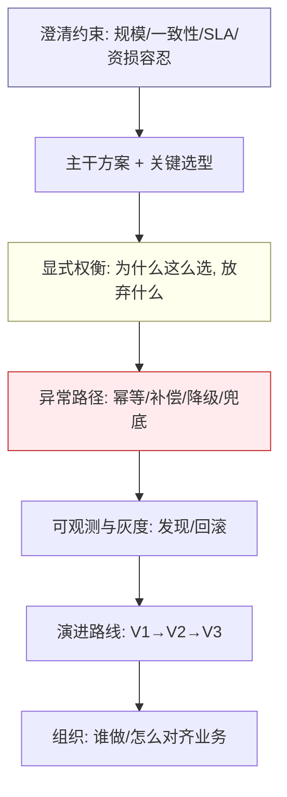
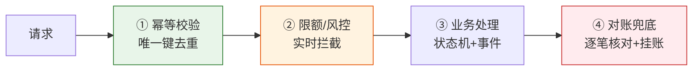
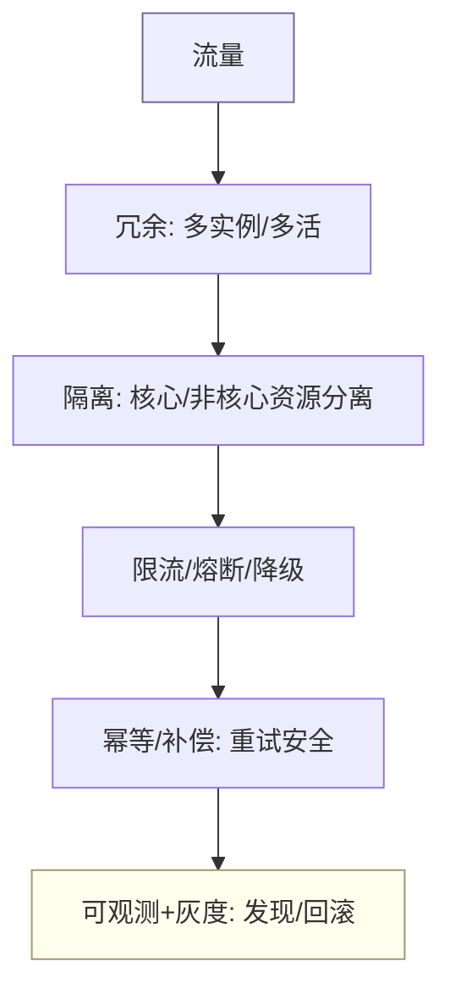
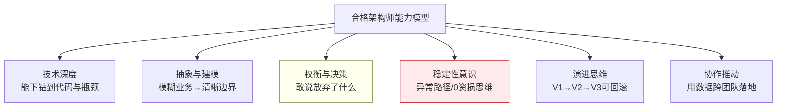

## 写在前面

10 年经验去面架构师，面试官基本不再考"HashMap 原理""MySQL 索引怎么存"——那些是底线，不是区分度。区分度在**判断**：开放、模糊、约束冲突时，你怎么想、怎么权衡、怎么兜底、怎么带人落地。

所以本文不堆知识点，而是给你**16 道架构师级高频题 + 资深回答范式**。每题结构固定：

> **面试官考察点** → **资深回答（含：显式取舍 / 量化 / 反例 / 项目支撑）** → **追问变体**

回答的底层心法只有四条，背下来，应付一切架构题：

1. **先量化约束**：规模（QPS/笔数）、一致性要求、可用性 SLA、资损容忍度、时间窗——没量化就开讲的是扣分项。
2. **显式记录"放弃了什么"**：架构没有最优，只有合适；敢说"我为此放弃了 X"，才是资深。
3. **永远讲满异常路径**：正常路径谁都会，异常路径（超时/脑裂/资损/雪崩）才见功底。
4. **给演进路线**：V1 最小闭环 → V2 优化 → V3 规模化，带验证指标与回滚。

配合《资深后端开放式场景设计题（10 年+）》《架构建模方法论》《架构图绘制方法论》《大厂后端高频面试题汇总》食用更佳。

---

## 一、架构设计思维（Q1–Q4）

### Q1：如何设计一个日千万笔的跨境收款系统？

**面试官考察点**：是否具备"从约束到架构"的完整推演，而非堆组件。

**资深回答**：
- **量化**：日 1000 万笔，峰值 20% 落在 4h → 均值 ~350 TPS，峰值 3–5 倍 ≈ 1000–1700 TPS；每笔约 3 次写 + 1 事件 → DB 写 ~5000 TPS、MQ ~1700 TPS；存储 ~10GB/日。
- **主干分层**：接入网关（鉴权/限流）→ 收款核心（受理即返回，异步入账）→ 领域事件总线（Kafka）→ 预入账/对账等下游上下文。
- **关键取舍**：① **受理与入账解耦**——渠道回调不可控，若同步等渠道会拖垮受理，故"受理即返回 + 异步入账 + 挂账兜底"；② **上下文间最终一致**——收款/账务/清结算拆限界上下文，用事件而非分布式事务，避免渠道抖动拖垮全链路；③ **分库分表按商户+时间**，订单号自带分片路由。
- **放弃什么**：放弃了"受理时即强一致告知商户成功"的体验，换来了链路稳定与 0 资损。
- **项目支撑**：XTransfer 收款 2.0 正是此思路，结果 +30% 人效、-80% 生产问题、0 资损。

**追问**：峰值 10 倍怎么扛？→ 异步化 + 削峰（MQ）+ 渠道侧限流 + 非核心路径降级；压测验证而非拍脑袋。

### Q2：单体到微服务，什么时候该拆、怎么拆？

**面试官考察点**：会不会"为了微服务而微服务"，是否懂拆的时机与边界。

**资深回答**：
- **不该拆的信号**：团队 < 10 人、业务未稳定、交付速度是首要矛盾——单体 + 清晰模块边界（甚至模块化单体）更优。
- **该拆的信号**：一个模块频繁跨团队改、发布相互阻塞、某部分需独立扩缩容（如风控）、技术栈需分化。
- **怎么拆**：以**限界上下文**为边界（不是技术分层），先事件风暴对齐语言，再用绞杀者模式（Strangler Fig）逐步替换，绝不“大爆炸”重写。
- **反例**：按"controller/service/dao"三层拆成三个服务——这是最贵的错误，分布式单体，网络开销 + 事务更难。
- **项目支撑**：XTransfer 把"预入账"从收款里剥离成独立子域（0→1），因它有独立一致性边界与生命周期，剥离后互不阻塞。

**追问**：拆完分布式事务怎么办？→ 见 Q6；能本地事务解决的绝不跨服务。

### Q3：如何做技术选型（自研 vs 开源 vs 云）？

**面试官考察点**：选型是否有方法论，还是"哪个火用哪个"。

**资深回答**——用决策矩阵，四个维度量化打分：

| 维度 | 自研 | 开源 | 云托管 |
|---|---|---|---|
| 差异化价值 | 高（核心壁垒） | 中 | 低 |
| 人力/维护成本 | 高 | 中 | 低 |
| 可控性/定制 | 高 | 中 | 低 |
| 风险 | 高（踩坑自负） | 中 | 供应商锁定 |

- **原则**：核心差异化（如 XTransfer 的渠道路由、风控规则引擎）自研或深度定制；通用能力（MQ、网关、KV）用开源/云，不重复造轮子。
- **显式取舍**：选云托管放弃可控性，换交付速度；选自研放弃速度，换壁垒与可控。
- **反例**：用自研 RPC 替代成熟 gRPC——除非有强诉求，否则是人力浪费。

**追问**：开源组件出了诡异 bug 谁兜？→ 选型时评估社区活跃度、是否有源码能力、是否留逃生通道（可替换抽象层）。

### Q4：如何设计"可演进"的架构？

**面试官考察点**：是否懂"架构是长出来的"，而非一次到位。

**资深回答**：
- **演进式架构四要素**：① 明确的**架构适应度函数**（如"核心链路 P99 < 200ms""0 资损"）作为演进校验；② **模块边界清晰**，依赖指向稳定内核；③ **绞杀者模式**逐步替换旧模块；④ **特性开关 + 灰度**，让大改可秒级回滚。
- **反例**："先上线再说，以后再重构"——没有适应度函数和边界，以后重构成本指数上升。
- **项目支撑**：XTransfer 收款 V0 单体 → V1 拆上下文 → V2 抽预入账子域 → V3 六边形+CQRS，每步都有可验证指标，且旧链路并行运行期才切流。

**追问**：怎么说服业务方给"重构"时间？→ 用资损/故障数据量化技术债成本，把重构包装成"业务连续性保障"而非"技术洁癖"。

---

## 二、技术决策与权衡（Q5–Q8）

### Q5：CAP 在支付场景如何取舍？

**面试官考察点**：是否真懂 CAP 是"分区下"的取舍，而非"三选二"误解。

**资深回答**：
- **澄清**：CAP 只在**网络分区（P）发生时**才需在 C 与 A 间取舍；无分区时两者可兼得。所以现实是 **P 必选**，讨论的是 C vs A。
- **支付场景**：资金相关**优先 C（一致性）**，宁可降级可用性（如渠道对账窗口延长）也不能资损。但"一致性"指**业务一致性**（账平），不是强一致锁全链路。
- **工程落地**：核心账务强一致（本地事务 + 不变式），跨上下文最终一致（事件 + 补偿 + 对账兜底），用"业务可接受的短暂不一致 + 自动核销"换取可用性。
- **项目支撑**：XTransfer 渠道入账失败走"挂账"，保证"账一定平"，而非强一致阻塞受理。

**追问**：CP 系统分区恢复后怎么补数据？→ 事件溯源 + 对账闭环，自动/人工核销。

### Q6：一致性与性能的张力怎么解？

**面试官考察点**：能否用"最终一致 + 补偿"化解"要一致就慢"的伪两难。

**资深回答**：
- **核心手法**：把"强一致边界"缩到最小（单个聚合/本地事务），跨边界用**可靠事件（事务消息/Outbox）**保证最终一致，用**对账**做兜底校验。
- **性能来自异步化**：同步链路只做"受理 + 落库 + 发事件"，重活（风控、清结算、通知）异步消费。
- **反例**：用 2PC 跨三个服务保一致——性能崩、锁资源、一损俱损。
- **量化**：XTransfer 收款受理 P99 控制在百毫秒级，而入账/清结算在秒级最终一致，业务无感。

**追问**：消息丢了怎么办？→ 本地消息表（Outbox）+ 幂等消费 + 定时对账补推，三重保险。

### Q7：高并发下如何保资金安全？

**面试官考察点**：资金安全是支付架构师的命根，看是否体系化。

**资深回答**——四道防线：
1. **幂等**：请求唯一键（订单号+业务动作），重复提交直接返回首次结果。
2. **限额/风控**：单笔/累计额度、频率、设备、黑名单实时拦截。
3. **对账**：渠道 vs 本地、内部各域逐笔核对，差错自动挂账 + 人工。
4. **可追溯**：状态机严格跃迁 + 事件流水，任何资损可回放定位。

**项目支撑**：XTransfer 0 资损 = 上述四道防线 + "受理即返回、入账异步、挂账兜底"的解耦设计共同作用。

### Q8：缓存与数据库一致性怎么处理？

**面试官考察点**：经典题，看是否停留在"先删缓存再更库"的背诵。

**资深回答**：
- **先讲场景**：缓存是**性能优化**，不是数据源；一致性要求分档。
- **通用方案**：写时**先更库、再删缓存（Cache-Aside）**，配合**延迟双删**防并发脏读；读时回填。
- **极端并发**：用"更新库 + 发事件异步删缓存"降低窗口；或短期**写时读穿透到库**（关键资金字段不缓存）。
- **三大坑**：击穿（互斥锁/逻辑过期）、穿透（空值缓存/布隆过滤）、雪崩（随机 TTL/多级缓存）。
- **反例**："先删缓存再更库"在高并发下必脏读，且无法靠"加锁"低成本解决。

**追问**：要求强一致怎么办？→ 那就不该用缓存放该数据，或读时强制回源。

---

## 三、稳定性与演进（Q9–Q12）

### Q9：如何做容量规划？

**面试官考察点**：能否从业务量推演到资源，且估峰值、查单点。

**资深回答**——漏斗法（见《架构建模方法论》容量建模）：日量 → 峰值时段压缩（二八/峰值因子）→ 单笔资源消耗 → 各组件 TPS → 单点排查 → 留 3 倍余量。输出**容量推演表 + 压测目标 + 扩容触发阈值**，不是"应该够"。

**项目支撑**：XTransfer 收款按此推演出瓶颈在"渠道回调"（外部不可控），故建模上解耦，资源上给 MQ/网关留 3 倍余量。

### Q10：高可用设计的核心套路？

**面试官考察点**：是否有一套可复用的稳定性方法论。

**资深回答**——五板斧：
1. **冗余**：无单点（多实例/多机房），关键链路主备。
2. **隔离**：核心/非核心资源隔离（线程池、MQ 分组），故障不扩散。
3. **限流/熔断/降级**：保护自己，过载时牺牲非核心保核心。
4. **幂等/补偿**：任何重试安全。
5. **可观测 + 灰度**：出了问题能**快速发现、快速回滚**。

**项目支撑**：XTransfer 渠道抖动时，因受理与入账解耦 + 挂账兜底，核心受理不受影响——隔离 + 降级的实战体现。

### Q11：技术债怎么管？

**面试官考察点**：是否把技术债当资产管理，而非要么无视要么过度重构。

**资深回答**：
- **量化**：用"故障数/交付速率下降/ onboarding 时长"给技术债定价。
- **节奏**：每个迭代留 15–20% 容量还债；按"利息高低"排优先级（资损风险 > 交付阻塞 > 代码异味）。
- **显式取舍**：业务冲刺期可**主动借债**，但要记账、定还期，不能用"以后重构"模糊掉。
- **反例**：零债洁癖——为完美架构拖慢业务，同样失职。

### Q12：故障复盘怎么写（事前/中/后）？

**面试官考察点**：资深架构师的核心软实力——不让故障白发生。

**资深回答**——三段式：
- **事前**：容量余量、监控覆盖、熔断降级、演练（混沌/攻防）、应急预案。
- **事中**：止血优先（限流/摘流/降级/切备），先恢复再定位；沟通机制（战时群/升级路径）。
- **事后**：5 Why 到根因（非归咎人）、action 有 owner/期限/验证、**改进项进适应度函数**防止复发。
- **项目支撑**：XTransfer 把"0 资损"作为硬适应度函数，每次差错都触发对账/挂账链路加固，故生产问题 -80%。

---

## 四、架构治理与协作（Q13–Q16）

### Q13：怎么开架构评审？

**面试官考察点**：架构师不是画图的人，是"让正确决策发生"的人。

**资深回答**：
- **会前**：RF C/设计文档齐备，关键干系人已 1:1 对齐，避免会上第一次见方案。
- **会中**：用**决策记录（ADR）**显式记录"决策 + 备选 + 放弃了什么 + 后果"，而非只记结论。聚焦**权衡与风险**，不纠结缩进。
- **会后**：决策可追溯、可 review、新人有据可查。
- **反例**：评审变成"挑语法/挑命名"的 code review，或沦为"老大拍板"无记录。

### Q14：如何推动跨团队架构落地？

**面试官考察点**：架构师 50% 是政治——靠数据而非职权推动。

**资深回答**：
- **用数据说话**：用资损/故障/交付阻塞量化痛点，让业务方也想要这个架构。
- **找支点**：先在一个愿意配合的团队试点（POC），用结果扩面，而非全公司一刀切。
- **留逃生通道**：抽象层可替换，降低他人采纳风险。
- **项目支撑**：XTransfer 收款 2.0 先核心域试点，人效/故障数据出来后再推广，阻力小。

### Q15：怎么带人把架构落地（DDD/带教）？

**面试官考察点**：资深与高级的分水岭——能不能让团队长出能力。

**资深回答**：
- **建模工作坊共建**：用事件风暴让团队自己产出模型，而非甩一份设计文档（ownership 来自参与）。
- **代码评审传判据**：不只改代码，讲"为什么这样分聚合""这个边界为什么重要"。
- **给框架不给答案**：定六边形/CQRS 骨架，让成员填领域逻辑，在实战中长能力。
- **项目支撑**：XTransfer 2.0 重构期带教多名成员，领域建模能力下沉到团队，是 +30% 人效的隐性原因。

### Q16：如何判断一个架构师是否合格？

**面试官考察点**：这是面试官反过来考你"知不知道好架构师长什么样"——自省能力。

**资深回答**——能力模型：

不合格信号：只会画大饼不落地、不敢取舍、只在正常路径上谈架构、把团队当执行机器。

---

## 五、收尾：架构师面试的"区分度清单"

把本文 16 题收敛成面试官眼里的高分行为：

| 行为 | 低分 | 高分（资深） |
|---|---|---|
| 约束处理 | 直接给方案 | 先量化规模/SLA/资损容忍 |
| 取舍 | 面面俱到 | 显式记录"放弃了什么" |
| 异常 | 只讲正常路径 | 讲满超时/脑裂/资损/雪崩 |
| 边界 | 技术分层拆服务 | 限界上下文 + 一致性边界 |
| 演进 | 一步到位 | V1→V2→V3 + 指标 + 回滚 |
| 协作 | 自己能写 | 用数据跨团队推动 + 带人 |

> 一句话：**架构师面的是"判断"，不是"知识"。知识可以查，判断只能练——而判断，就藏在每一次"我为此放弃了 X"的清醒里。**

---

## 六、书单与延伸阅读

- Martin Fowler《Patterns of Enterprise Application Architecture》——演进式设计
- 《演进式架构（Building Evolutionary Architectures）》——适应度函数
- Eric Evans《领域驱动设计》——边界与建模
- Google SRE Book——稳定性与复盘方法论
- 延伸：本站《资深后端开放式场景设计题（10 年+）》《架构建模方法论》《架构图绘制方法论》《分布式事务与一致性》《高可用容灾与稳定性》

---

## 相关阅读

- [资深后端开放式场景设计题（10 年+）](/post/准备-资深后端开放式场景设计题（10年+）) —— 开放式场景题的通用答题框架
- [架构建模方法论：从事件风暴到 C4](/post/准备-架构建模方法论（从事件风暴到C4：10年架构师的建模心法）) —— 本文"建模与边界"的方法论来源
- [架构图绘制方法论：C4 模型与架构师的视觉表达](/post/准备-架构图绘制方法论（C4模型与架构师的视觉表达）) —— 把方案画给面试官看
- [分布式事务与一致性](/post/准备-分布式事务与一致性) —— Q5/Q6 的底层原理
- [高可用容灾与稳定性](/post/准备-高可用容灾与稳定性) —— Q10/Q12 的实战
