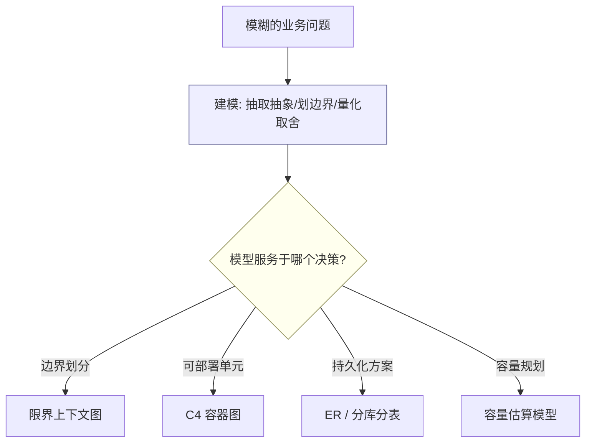
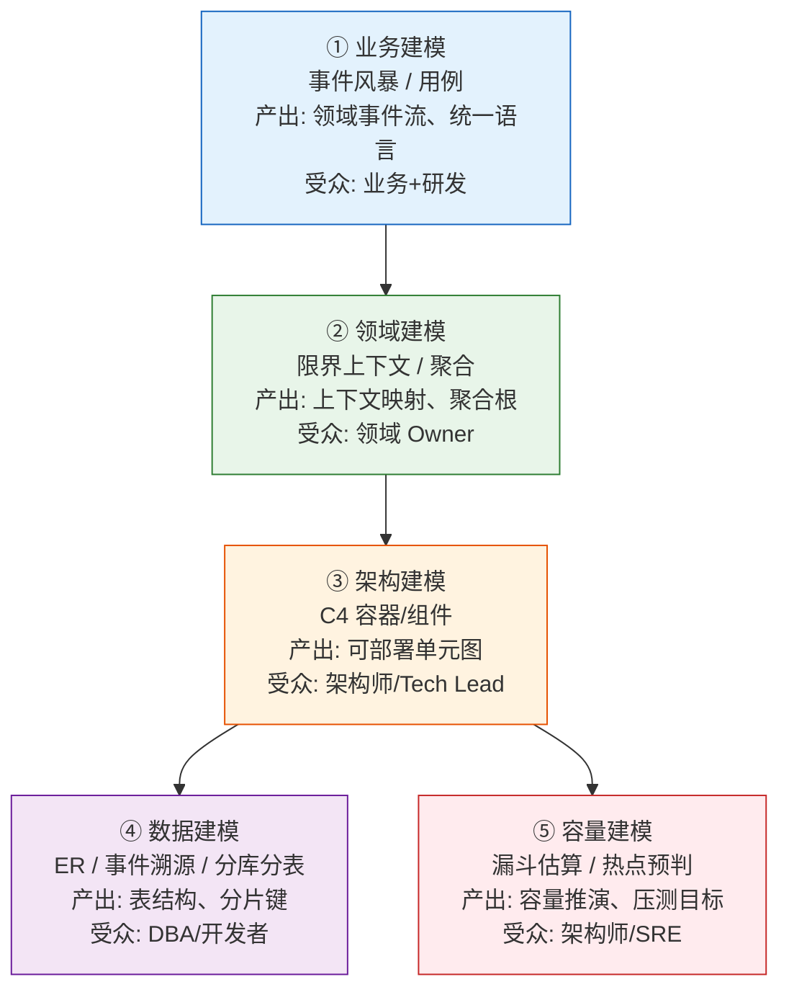
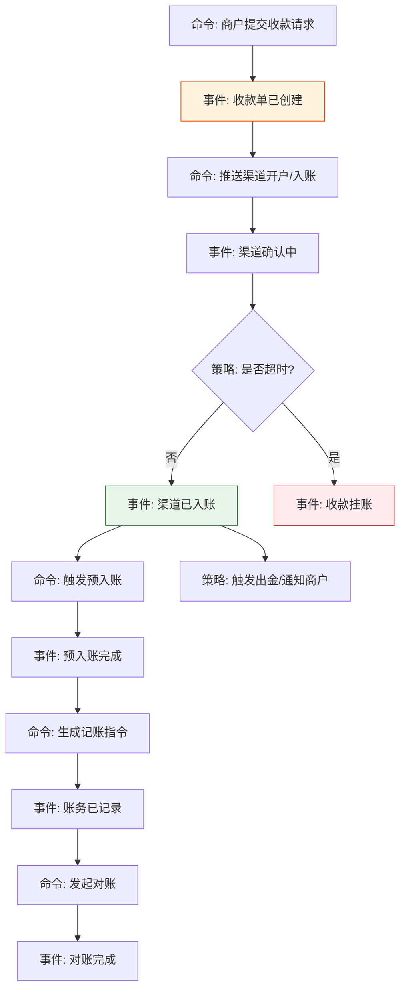
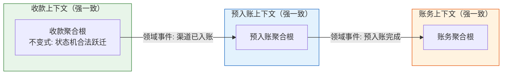
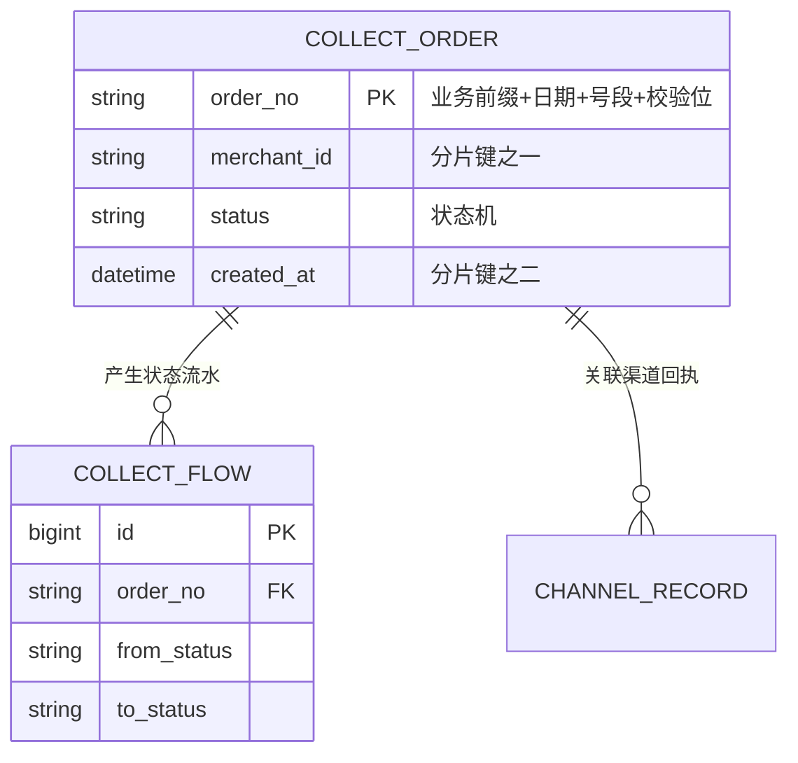
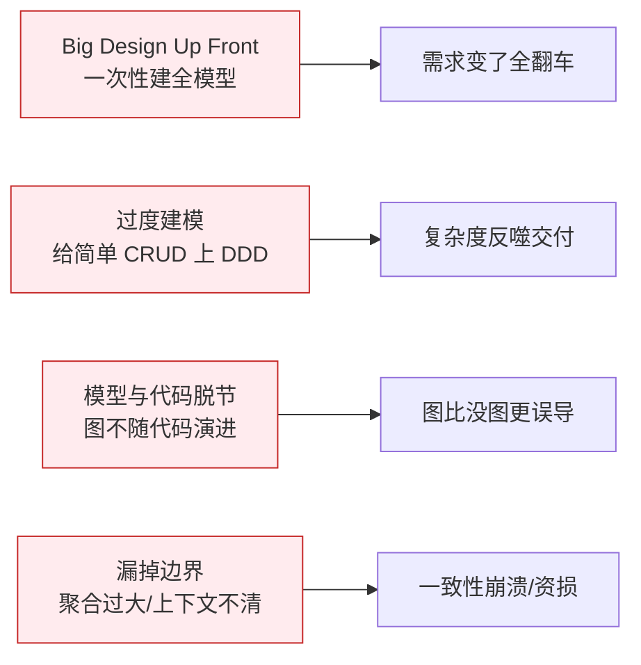
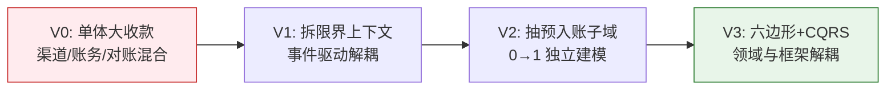

## 写在前面

"建模"这两个字，很多人一听就想到 UML 类图、ER 图。这是把**建模的产出**当成了**建模本身**。

真正的建模，是架构师最值钱的能力：面对一个模糊、跨团队、充满冲突约束的业务问题，你如何**抽取出正确的抽象、划清边界、量化取舍，并让不同角色在同一张地图上对齐**。模型不是真理，是"当前认知下最有用的近似"——它服务于决策，而不是服务于好看。

我在 XTransfer 做收款领域 2.0 重构时，真正的难点不是写代码，而是：100+ 渠道的 VA 开户、预入账、对账、清结算全搅在一起，谁也说不清边界。我们用事件风暴把领域事件贴满一墙，才第一次让业务、测试、研发对"什么是一次收款"达成共识。这次建模直接决定了后续 +30% 人效、-80% 生产问题、0 资损的结果。

本文构建一套**五层建模体系**，把你从"接到需求"到"写出能演进的代码"之间的思考过程显式化，并以 XTransfer 收款域贯穿始终。它是《架构图绘制方法论》的"上游"——图只是建模最终的可视化输出。

---

## 一、架构师眼中的"模型"：三个基本判断

### 1.1 模型是近似，不是真相

没有任何模型能等于现实。地图不是领土。一个把"用户"建模成单一实体、忽略"商户 vs 付款方"差异的模型，在简单场景够用，在跨境支付里就是资损隐患。**建模的第一决策是：在当前粒度下，忽略什么**。

### 1.2 模型有受众与粒度

给 CEO 的模型和给开发者的模型，抽象层级完全不同（这正是 C4 分层思想）。强行用一张图服务所有人，结果是所有人都不满意。

### 1.3 模型服务于决策

建模的产出必须能推动某个决策：划不划限界上下文？分不分库？用不用 MQ？如果一张模型图开完会没人知道下一步干什么，它就是失败的。

---

## 二、五层建模体系总览

把"建模"切成五层，每层有明确产出、受众、工具和典型时机。多数项目不需要五层全做，但架构师心里要有这张地图，知道自己在哪一层、还差哪层。

| 层 | 核心问题 | 常用工具 | 易翻车点 |
|---|---|---|---|
| 业务建模 | 业务到底发生了什么 | 事件风暴、用例图 | 研发替业务拍板 |
| 领域建模 | 边界在哪、谁对一致性负责 | DDD、上下文映射 | 聚合过大/过小 |
| 架构建模 | 怎么拆成可部署单元 | C4 | 按技术分层而非业务 |
| 数据建模 | 怎么持久化、怎么分片 | ER、事件溯源 | 分片键选错 |
| 容量建模 | 扛不扛得住、瓶颈在哪 | 漏斗法、压测 | 只估均值不估峰值 |

---

## 三、业务建模：事件风暴（Event Storming）实战

### 3.1 什么是事件风暴

事件风暴是 Alberto Brandolini 提出的**协作式领域探索工作坊**。核心元素：

- **领域事件（Domain Event）**：业务中"已经发生"的事，命名用过去时，如"收款单已创建""渠道已入账"。橙色便利贴。
- **命令（Command）**：导致事件发生的动作，如"提交收款请求"。蓝色便利贴。
- **聚合（Aggregate）**：命令和事件围绕的"一致性边界"，如"收款单"。黄色便利贴。
- **策略（Policy）**：当某事发生时要自动触发的规则，如"渠道入账成功后自动触发预入账"。
- **读模型（Read Model）**：用户看到的视图，如"收款明细页"。

关键价值：**让业务、测试、研发在同一面墙前用同一套语言贴便利贴**，(domain events) 暴露出大家以为"共识"其实分歧巨大的地方。

### 3.2 XTransfer 收款领域事件风暴（精简版）

下面是收款域一次风暴后收敛出的主干事件流（真实远比这复杂，此处取主干）：

风暴中我们发现的几个**关键认知分歧**（正是建模的价值）：

1. 业务原以为"渠道入账 = 收款成功"，但技术知道中间有"挂账/核销"状态——据此把"已入账"和"预入账完成"拆成两个事件，避免了"钱没真到就通知商户"的资损。
2. "预入账"原本被当成收款的一个步骤，风暴后确认为**独立子域**（后来 0→1 建设），因为它有独立的一致性边界和生命周期。
3. "对账"被显式建模为事件而非后台批处理，使差错处理有了明确触发点。

### 3.3 从风暴到限界上下文划分

把事件流里**高内聚、低耦合**的事件聚到一起，就得到限界上下文。收款域最终拆出：收款上下文、预入账上下文、账务上下文、清结算上下文、对账上下文（详见各专项文章）。划分原则：**上下文内的事件要能靠本地事务保证一致，跨上下文只能靠最终一致（事件/编排）**。

---

## 四、领域建模：限界上下文 + 聚合

这层把业务建模的结果固化成"代码该长什么样"。详细战术见《DDD 领域驱动设计实战指南》，这里只讲建模决策点。

### 4.1 限界上下文是"一致性边界"

上下文内可用强一致（本地事务 + 聚合），上下文间必须接受最终一致。XTransfer 的教训：早期把"收款"和"账务"放在一个事务里，导致渠道抖动就拖垮整个收款链路。拆成上下文 + 事件驱动后，账务慢不影响收款受理。

### 4.2 聚合设计原则（极易错）

- **聚合要小**：一个聚合只对一个不变式（业务规则）负责。把"收款单"和"渠道配置"塞进一个聚合，是常见错误。
- **聚合之间通过 ID 引用，不持有对象**：避免大聚合图。
- **跨聚合一致性用领域事件**，不用分布式事务硬刚。

> 原则：**上下文内用事务保一致，上下文间用事件保最终一致**。这是支付系统"0 资损"的建模根基。

---

## 五、架构建模：用 C4 把领域模型落到容器与组件

领域模型（聚合、上下文）不等价于部署结构。架构建模回答"这些上下文分别跑在哪、怎么通信"。这一步的产出就是 C4 的 Container / Component 图（详见《架构图绘制方法论》）。关键决策：

- **一个上下文 ≠ 一个服务**：小上下文可共部署，大上下文可拆多服务。
- **通信方式映射**：上下文间事件 → MQ；上下文间同步查询 → 防腐层 + RPC。
- **六边形架构**：让领域模型不依赖框架（XTransfer 2.0 采用），便于测试和演进。

---

## 六、数据建模：从聚合到 ER、事件溯源、分库分表

### 6.1 聚合 → 表

一个聚合通常对应一组表，聚合根有主键，值对象可内嵌或独立。收款聚合根 → `t_collect_order` 主表 + 状态流水表。

### 6.2 分库分表：分片键是建模决策

分片键选错是灾难。XTransfer 收款按**商户维度 + 时间**分片：既贴合"商户查自己账单"的读模型，又让热点均匀分布。订单号结构（业务前缀+日期+号段+校验位）本身携带分片路由信息。

### 6.3 事件溯源（Event Sourcing）作为可选建模

对"资金安全"这类强审计域，可把状态变更存为事件序列而非只存当前值，天然防篡改、可回放。XTransfer 关键流水采用"当前态 + 事件流水"双写，兼顾查询效率与审计可追溯。

---

## 七、容量建模：漏斗法估算、热点预判、单点排查

架构师必须能量化。以"日千万笔收款"为例的漏斗估算：

**建模要点**：

1. **估峰值不是估均值**：用二八法则把日量压到峰值时段。
2. **单点排查**：DB 写入、MQ、第三方渠道回调，哪个是单点？XTransfer 的瓶颈在"渠道回调"——外部不可控，于是用"受理即返回 + 异步入账 + 挂账兜底"建模解耦。
3. **留余量**：容量按 3 倍设计，不按 1.1 倍。

---

## 八、四大建模反模式

- **Big Design Up Front**：在需求不明时建完整模型。正确做法：事件风暴只做主干，细节随迭代补全（演进式建模）。
- **过度建模**：给一个简单的后台 CRUD 上全套 DDD，反而拖慢交付。**建模成本要与业务复杂度匹配**。
- **模型与代码脱节**：图锁死不更新。用代码即图（Structurizr/Mermaid 进 Git）缓解。
- **漏掉边界**：聚合过大导致本地事务锁表，或上下文不清导致分布式事务滥用。这是资损的直接来源。

---

## 九、建模驱动演进：模型随业务演化

好模型不是一次建好，而是能跟着业务长。XTransfer 收款模型的演进路径：

演进信号：当某个聚合开始频繁跨团队修改、或某段逻辑被多处复制，就是该"再建模"、再划边界的时候。**架构师的建模能力，体现在能听见这些信号**。

---

## 十、面试官视角：建模高频追问 + 答题框架

| 追问 | 想听的 |
|---|---|
| "你是怎么划分微服务/模块的？" | 限界上下文 + 一致性边界，不是技术分层 |
| "为什么这里用最终一致而不是事务？" | 上下文边界 + 故障隔离 + 资金安全兜底 |
| "聚合怎么设计的，多大合适？" | 小聚合、不变式负责、ID 引用 |
| "怎么估容量？" | 漏斗法 + 峰值 + 单点排查 + 余量 |
| "模型怎么跟着业务演进？" | 演进信号 + 绞杀者模式（见《架构师高频面试题深度解析》） |

**答题框架**：澄清业务 → 业务建模（事件风暴）→ 领域建模（上下文/聚合）→ 架构建模（C4）→ 数据/容量建模 → 显式取舍与演进。这条主线贯穿《资深后端开放式场景设计题》的通用框架。

---

## 十一、书单与延伸阅读

- Eric Evans《领域驱动设计》——聚合、限界上下文原教旨
- Vaughn Vernon《实现领域驱动设计》——战术模式落地
- Alberto Brandolini《Event Storming》——业务建模协作法
- Simon Brown《Software Architecture for Developers》——C4 与架构建模
- 延伸：本站《架构图绘制方法论》《DDD 领域驱动设计实战指南》《支付系统架构与核心链路全景》《高可用跨境支付系统设计》

---

## 相关阅读

- [架构图绘制方法论：C4 模型与架构师的视觉表达](/post/准备-架构图绘制方法论（C4模型与架构师的视觉表达）) —— 本文的"下游"：建模产出如何用图表达
- [DDD 领域驱动设计实战指南](/post/准备-DDD领域驱动设计实战指南) —— 领域建模战术细节
- [支付系统架构与核心链路全景](/post/准备-支付系统架构与核心链路全景) —— XTransfer 建模结果的落地
- [资深后端开放式场景设计题（10 年+）](/post/准备-资深后端开放式场景设计题（10年+）) —— 建模答题的通用框架
