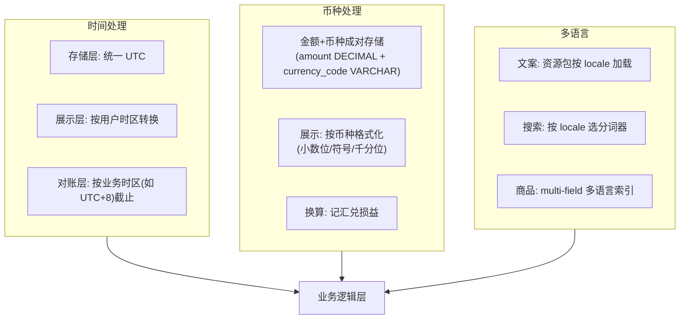
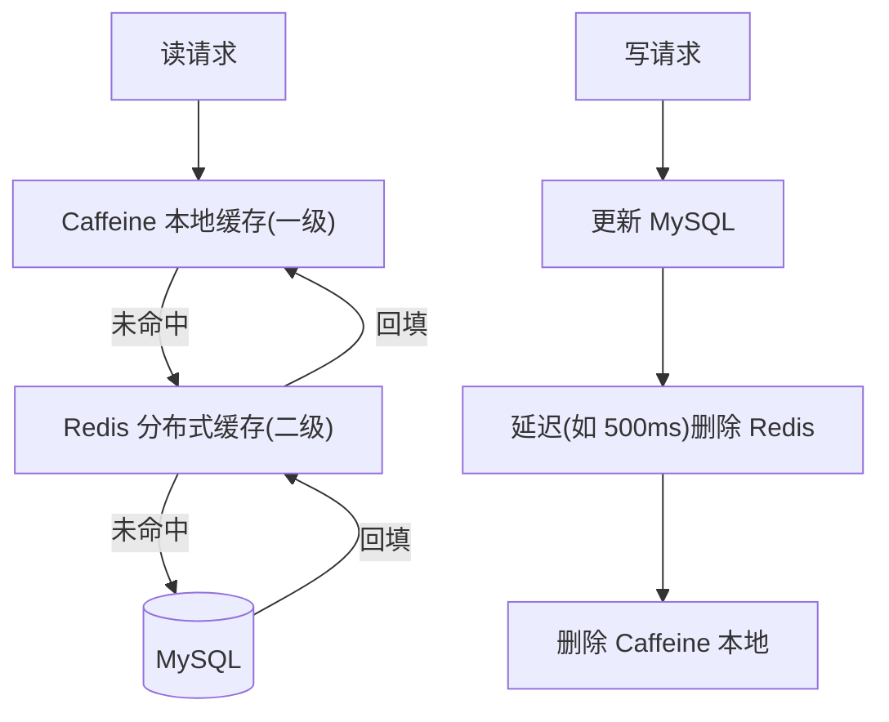
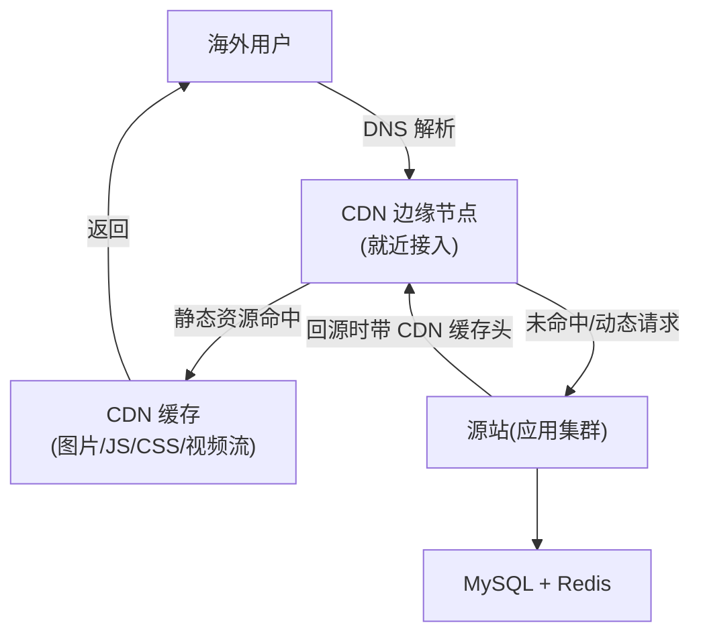
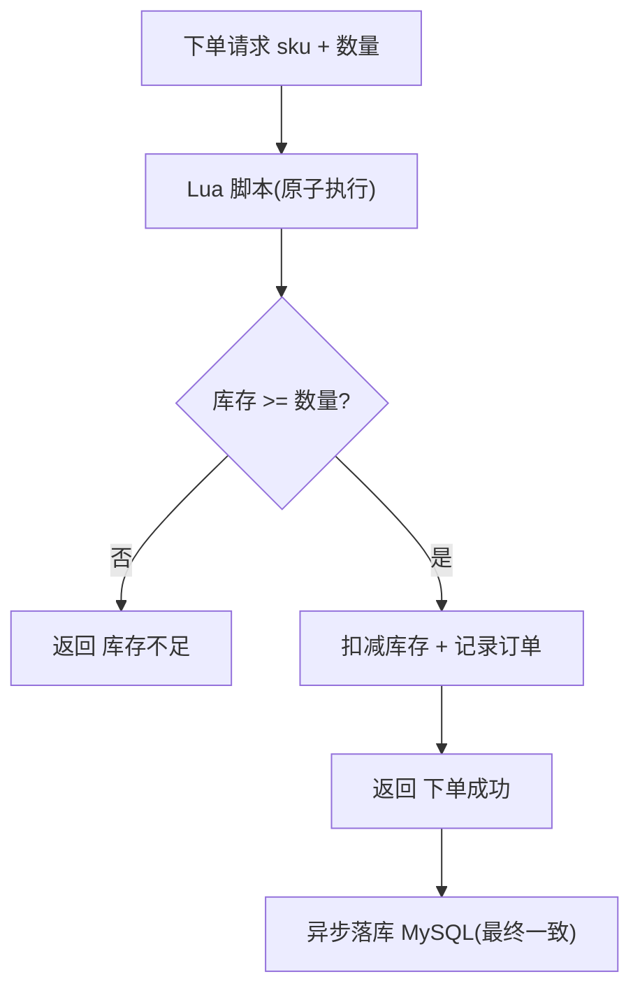
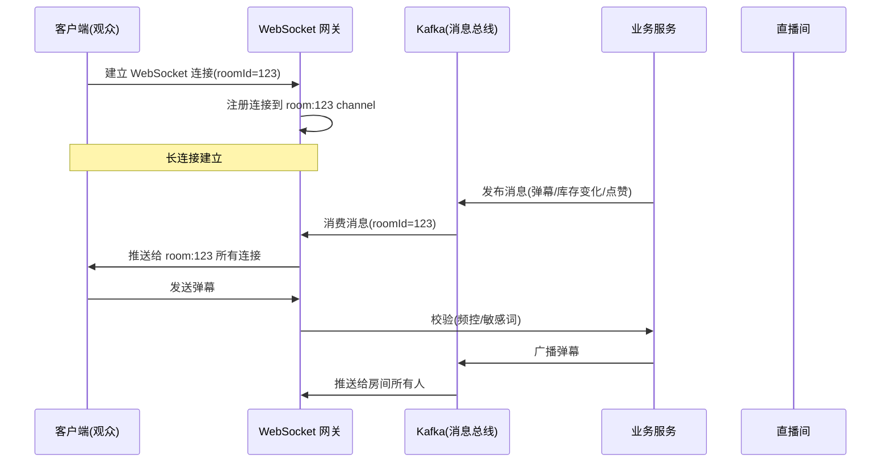
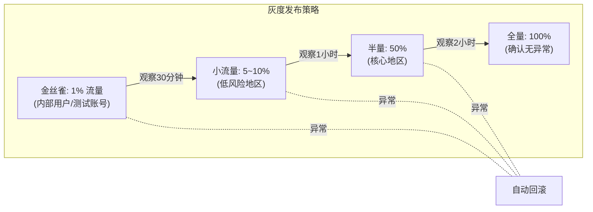

> 第三段经历，电商场景，素材覆盖面极广——**搜索、缓存一致性、热点、库存超卖、权限体系、排行榜、优惠券**，几乎每一点都能对接一道高频八股。

## 1. 商品系统：ES 搜索引擎

简历原话：「商品系统：5w+ 商品的导入、搜索。通过 **ES 构建商品搜索引擎**，通过**分词、纠错、分类映射**等提高搜索精度，**平均召回率大于 90%，搜索耗时 p99<200ms，首屏命中率>60%**。」

### 1.1 召回与性能怎么做的

- **分词**：海外多语言（英/西/葡等）+ 商品名杂糅，自定义分词器 + 同义词词典；
- **纠错（Spell Correction）**：基于编辑距离 / 同音词，用户输入拼错也能召回；
- **分类映射**：query → 类目预测，用类目约束召回，提升精度；
- **性能**：p99<200ms 靠**索引设计（合理分片、mapping 优化）+ 查询裁剪（只查必要字段、用 filter 走 cache）+ 缓存热点 query**；首屏命中率>60% 靠**个性化/热词预取**。

> **面试标准回答（ES 怎么提召回和降延迟）**
> 「召回靠『分词 + 同义词 + 纠错 + 类目映射』四件套把用户意图对齐到商品；延迟靠『mapping 与分片优化 + 用 filter 走 filter cache + 只取所需字段 + 热点 query 缓存』。p99 控制还要避免深分页（用 search_after），以及控制单 query 的 rewrite 复杂度。」

**【深度拓展】** ES 召回的「四件套」本质是**缩短「用户表达」和「商品表达」的语义鸿沟**——海外多语言杂糅，分词/同义词/纠错/类目映射每一层都在做「意图对齐」。p99<200ms 的关键不是堆机器，而是「**减少无效计算**」：filter 走 cache（不评分）、只取所需字段（`_source` 裁剪）、search_after 替掉 from+size 深分页（避免全局排序）。

和携程「Elasticsearch 订单/流量聚合」（第 4 节）同源都用 ES，但场景不同：欧凡是**高并发在线检索**（要 p99 低、召回高），携程是**聚合分析**（要大基数聚合不爆内存）。二者优化方向相反——在线检索压延迟，聚合分析压内存。详见 [携程数据化运营平台实战](/post/准备-携程数据化运营平台实战) 第 4 节。

**【面试官还会追问】**
- **追问1：ES 和 MySQL 各存一份，一致性怎么保证、谁为准？** 应对：MySQL 是源、ES 是副本，走「binlog/Canal 或 MQ 异步同步」最终一致；允许秒级延迟；数据同步失败有补偿（见 2.1 缓存一致性同理）。
- **追问2：召回率 90% 但剩下的长尾怎么补？** 应对：长尾靠「向量召回 / 语义召回」补（embedding + 近似检索），和关键词召回做「多路召回 + 融合排序」；或兜底「类目浏览」路径。
- **追问3：多语言（英/西/葡）分词怎么不串味？** 应对：按 locale 选对应分词器 + 词典；同义词词典按语言维护；混合语种商品走「多分词器字段（multi-field）」分别索引。

### 1.2 数据同步：RocketMQ 异步落库 + 写 ES

简历原话：「消费 **RocketMQ** 的订单、评论以及收藏操作、异步批量落库并写入 es。」

- 商品的变更（订单/评论/收藏影响销量、评分）走 MQ 异步，削峰 + 解耦；
- **批量**写 ES，减少单次写入开销；
- 保证「DB 是源、ES 是副本」的**最终一致**（详见缓存一致性一节 + [分布式事务](/post/准备-分布式事务与一致性)）。

### 1.3 多币种多时区架构：海外电商的「三多」地基

> 海外直播电商和国内最大的区别是「**多语言、多时区、多币种**」。这不是一个功能点，而是贯穿全系统的「地基设计」——后期补改成本极高，必须 day 1 就考虑。



**时间处理三原则**：

```java
// 时间处理: 存储 UTC, 展示按用户时区, 对账按业务时区

// 1. 存储: 所有时间字段存 UTC
// DB: created_at DATETIME DEFAULT CURRENT_TIMESTAMP (UTC)
// Java: Instant / LocalDateTime(UTC)

// 2. 展示: 按用户时区转换
public String formatByUserZone(LocalDateTime utcTime, String userTimezone) {
    ZonedDateTime userTime = utcTime.atZone(ZoneOffset.UTC)
        .withZoneSameInstant(ZoneId.of(userTimezone));
    return DateTimeFormatter.ofPattern("yyyy-MM-dd HH:mm:ss")
        .format(userTime);
}

// 3. 对账截止: 按业务时区(如运营在 UTC+8)
// 例: "T+1对账"按 UTC+8 的 00:00 截切, 而非 UTC 00:00
public LocalDateTime getBatchCutoff(LocalDate batchDate) {
    return batchDate.atStartOfDay(ZoneId.of("Asia/Shanghai"))
        .toInstant().atZone(ZoneOffset.UTC).toLocalDateTime();
}
```

**币种处理**——金额和币种**成对存储**，绝不存裸金额：

```sql
-- 订单表: 金额 + 币种成对, 绝不存裸 DECIMAL
CREATE TABLE shop_order (
    id BIGINT PRIMARY KEY,
    order_no VARCHAR(32) UNIQUE,
    total_amount DECIMAL(12,2) NOT NULL COMMENT '订单金额',
    currency_code VARCHAR(3) NOT NULL DEFAULT 'USD' COMMENT '币种 ISO 4217',
    -- 绝不允许: amount DECIMAL 无 currency (裸金额会导致币种歧义)
    settlement_amount DECIMAL(12,2) COMMENT '结算金额(换算后)',
    settlement_currency VARCHAR(3) DEFAULT 'CNY' COMMENT '结算币种',
    exchange_rate DECIMAL(10,6) COMMENT '结算时汇率',
    INDEX idx_order_no (order_no)
);

-- 不同币种小数位不同: 日元(JPY) 0位, 美元(USD) 2位, 巴林第纳尔(BHD) 3位
-- 应用层按 currency_code 动态格式化, 不在 SQL 层写死 ROUND
```

> **【深度拓展】** 多币种的核心陷阱是「**精度**」——不同币种小数位不同（JPY=0, USD=2, BHD=3），如果全按 2 位存，日元金额会被乘 100，巴林第纳尔会被截断。解法：用 `DECIMAL(12,4)` 存（覆盖 3 位币种 + 1 位缓冲），展示时按币种格式化。汇率波动会导致「下单金额 vs 结算金额」有差额，这个差额就是**汇兑损益**——必须单独记账，和 XTransfer「汇损补充」同源。

> **【面试官追问】**
> - **追问1：用户下单时是 USD，结算时汇率变了怎么处理？** 应对：下单时锁定汇率（订单存 `exchange_rate`），结算用锁定的汇率；汇兑损益由平台承担/承担一部分，单独记「汇兑损益」科目。和 XTransfer 汇损补充同源。
> - **追问2：多时区下「今天」怎么定义？直播大屏按谁的时区统计？** 应对：存储全 UTC；大屏按「运营时区」（如 UTC+8）切日；用户侧展示按用户时区。关键是**对账截止时间统一按业务时区**，不能 UTC+0 和 UTC+8 各算各的。
> - **追问3：商品多语言怎么保证搜索和展示一致？** 应对：ES 用 multi-field（同一商品名按不同分词器建多字段），搜索按用户 locale 选对应字段；文案走资源包按 locale 加载；商品信息变更时所有语言版本同步更新（走 MQ 扇出）。

## 2. 缓存：延迟双写 + Caffeine 二级 + 热点

> 缓存一致性用"**延迟双写（先更 DB，延迟删缓存）+ Caffeine 本地二级**"抗热点。下面把"请求命中路径 + 更新路径"画清楚。



简历原话：「通过 **Redis 以及 Kafka 构建商品缓存，采用延迟双写策略**，确保缓存一致；**识别热点数据，通过 caffeine 搭建二级缓存**，减少直播中热点商品数据对核心 db 以及其他系统的依赖，保障直播和促销中商品核心接口耗时 p99<200ms。」

### 2.1 延迟双写（保证缓存一致）

```
   更新商品(DB) ──▶ 1. 先更 DB
                  2. 发 Kafka(延迟消息)
                          │ 延迟后
                          ▼
                  3. 删除/更新 Redis 缓存
```

- **为什么延迟双写而不是「先更 DB 再删缓存」立即删**： immediate 删除在「并发读写」下仍有极小窗口不一致；延迟双写（或「写 DB + 发延迟消息删缓存」）把不一致窗口进一步收敛，且对「刚写完马上读」的脏读更友好（延迟期间读到旧缓存，随后被纠正）。
- 本质是 **Cache-Aside + 延迟补偿删除**，配合** binlog（Canal）订阅**也是常见做法。

> **面试标准回答（缓存一致性）**
> 「我们采用延迟双写：更新先落 DB，再发延迟消息去删/更新缓存。相比立即删，延迟双写把『并发读写导致短暂脏读』的窗口进一步收敛，且对刚写完立刻读的场景更稳。兜底靠设置合理 TTL + 监听 binlog 做最终一致。是否要强一致？商品详情允许秒级延迟，所以最终一致足够，强一致反而牺牲可用性和性能。」

**【深度拓展】** 「延迟双写」针对的是「**先更新 DB、立即删缓存**」在「读比写快」时仍存在的极小脏读窗口（更新 DB 后、删缓存前，旧请求把旧值重新填回缓存）。延迟删除让「刚更新后的读请求」先命中旧缓存返回、随后被延迟删除纠正，把脏窗口收敛到「延迟期内」。但更彻底的业界做法是 **Canal 监听 binlog 删缓存**——以 binlog 提交时刻为准，避免「业务代码漏发消息」导致缓存永不过期。

和 XTransfer 的 **Outbox**（本地事务写业务 + 事件表，独立投递）思路一致：都是「**用可靠的变更捕获（binlog/事件表）驱动下游失效**」，比「业务代码里顺手发消息」更稳。取舍：binlog 方案对「刚写入立刻读」仍有一致性窗口，所以强一致场景（如库存）不能只靠缓存。

**【面试官还会追问】**
- **追问1：延迟消息本身丢了，缓存永远不删怎么办？** 应对：TTL 兜底（缓存必有过期）；binlog 订阅做「最终一致补偿」；延迟消息用可靠 MQ + 本地消息表确保不丢。
- **追问2：延迟多久合适，会不会拖慢用户看到新数据？** 应对：延迟取「读请求平均耗时」量级（如 500ms~1s），覆盖绝大多数「更新后立刻读」的并发窗口；超过延迟的读已走新值，体验无感。
- **追问3：缓存和 DB 双写，用「先删缓存再更 DB」还是「先更 DB 再删缓存」？** 应对：优先「先更 DB 再删缓存（延迟删除）」，因为删缓存失败比更 DB 失败代价小；删缓存失败有 TTL + binlog 兜底，更 DB 失败则有事务回滚。

### 2.2 二级缓存（Caffeine 本地）抗热点

- 直播 / 大促时某些商品（主播在推的）是**超级热点**，全打 Redis 也会成为瓶颈；
- 用 **Caffeine 做进程内二级缓存**：热点商品命中本地，几乎不触网，p99 稳在 200ms 内；
- **热点识别**：基于访问计数 / 滑动窗口识别热点 key，自动晋升到本地缓存；
- 一致性：本地缓存短 TTL + 失效广播（Redis 失效时发布事件让各节点清本地）。

```
   请求商品 ──▶ Caffeine(本地热点) ─命中─▶ 返回
                   │ miss
                   ▼
                Redis ─命中─▶ 回填 Caffeine ─▶ 返回
                   │ miss
                   ▼
                 DB ─▶ 回填两级
```

> **面试标准回答（为什么二级缓存）**
> 「Redis 虽快，但大促热点 key 仍可能打满网卡/连接。Caffeine 在进程内挡热点，零网络开销，把核心接口 p99 压到 200ms 内、并保护 DB 和 Redis。代价是各节点本地缓存有一致性窗口，靠短 TTL + 失效广播收敛，对商品详情这种允许短暂不一致的场景完全可接受。」

**【深度拓展】** 二级缓存（本地 Caffeine + Redis）是应对「**热点 + 回源风暴**」的标准架构——哈啰薪资系统的「Caffeine + Redis 多级缓存」（第 3.2 节）也是同一套路。差异在一致性容忍度：商品详情允许秒级不一致（短 TTL + 失效广播即可），薪资规则**正确性压倒性能**（失效必须可靠）。这说明「缓存策略由数据敏感度决定」，不是一套通吃。

热点识别用「访问计数 / 滑动窗口」自动晋升本地缓存，本质是**自适应缓存**——避免人工配死热点 key。业界（如 Redis 的 client-side caching、Facebook 的 mcrouter）也都是「服务端/客户端双层 + 失效广播」。

**【面试官还会追问】**
- **追问1：本地缓存一致性窗口内，用户看到旧价格下了单怎么办？** 应对：价格等强一致字段不依赖本地缓存，下单走主库实时校验库存/价格；本地缓存只加速「详情展示」，不参与「交易决策」，展示旧价但下单以 DB 为准。
- **追问2：热点 key 集中在一个节点（本地缓存也救不了）怎么办？** 应对：Redis 侧做 key 分片（如库存拆成多个子库存桶）+ 本地互斥重建防击穿；极端热点用「多副本 + 随机打散读」。
- **追问3：失效广播用 Redis Pub/Sub，消息丢了怎么办？** 应对：短 TTL 兜底；失效走「可靠广播（如 Kafka）或 binlog 驱动」；关键发布用「版本号拉取」双保险，节点定时比对版本。

### 2.3 CDN 缓存策略：海外加速的地基

> 海外用户离服务器远（如拉美用户访问亚洲机房），RTT 200~400ms。CDN 是把静态资源推到离用户最近的边缘节点，把首屏时间从 5 秒压到 2 秒以内。



CDN 策略按资源类型分层：

| 资源类型 | CDN 策略 | 缓存时长 | 失效方式 |
| --- | --- | --- | --- |
| 图片/视频/JS/CSS | 强缓存 | 7~30 天 | 文件名带 hash，发版自动失效 |
| 商品图片 | 中等缓存 | 1~7 天 | 商品更新时主动刷新 |
| 商品详情页(静态部分) | 短缓存 | 1~5 分钟 | TTL 自然过期 |
| 直播流 | 不缓存(走专用 CDN) | - | LL-HLS/WebRTC 推流 |
| 动态接口(库存/下单) | 不缓存 | - | 直接回源 |

```nginx
# CDN 缓存头配置示例(源站 nginx)
# 静态资源: 长 TTL + hash 文件名
location ~* \.(jpg|png|css|js|woff2)$ {
    expires 30d;
    add_header Cache-Control "public, immutable";
    # immutable: 告诉浏览器不发条件请求(304), 直接用本地缓存
}

# 商品图片: 中等 TTL + 可主动刷新
location /images/products/ {
    expires 7d;
    add_header Cache-Control "public, max-age=604800, stale-while-revalidate=86400";
    # stale-while-revalidate: 过期后允许用旧版同时后台刷新
}

# 动态接口: 不缓存
location /api/ {
    add_header Cache-Control "no-cache, no-store, must-revalidate";
    proxy_pass http://backend;
}
```

> **【深度拓展】** CDN 的核心矛盾是「**缓存命中率 vs 数据新鲜度**」——缓存越久命中率越高但数据越旧。解法是 `stale-while-revalidate`：过期后先返回旧数据（不阻塞用户），同时后台回源刷新，下次请求拿到新数据。这对海外场景特别重要：用户 RTT 高，同步回源会让首屏卡住。
>
> 商品详情的「动态部分」（价格/库存）**不走 CDN**——这些是交易决策字段，强一致要求高，走源站实时查。CDN 只加速「静态展示」（图片/文案/规格），这是 §2.2 「本地缓存只加速展示不参与交易决策」原则在 CDN 层的延伸。

> **【项目支撑】**（STAR）
> - **S（场景）**：拉美用户首屏 5+ 秒，跳出率高。
> - **T（任务）**：把首屏压到 2 秒以内。
> - **A（行动）**：① 静态资源全上 CDN（图片/JS/CSS 30 天缓存 + hash 文件名）；② 商品图片 `stale-while-revalidate`（1 天 + 后台刷新）；③ 直播流走专用 CDN + LL-HLS；④ 动态接口不缓存直接回源。
> - **R（结果）**：首屏从 5 秒压到 1.5 秒；CDN 命中率 >90%；源站带宽下降 80%（静态流量被 CDN 挡住）。

> **【面试官追问】**
> - **追问1：CDN 缓存了商品图片，但商品改价了图片上的价格还是旧的怎么办？** 应对：价格不渲染在图片上（图片走 CDN），价格是动态数据走接口实时拉。如果旧版图片确实含价格，则文件名带版本/hash，改价即换图。
> - **追问2：CDN 节点回源风暴（大量节点同时回源）怎么防？** 应对：源站设 `stale-while-revalidate` + 请求合并（多个节点回源时合并为一个）；冷启动预热（提前主动推送缓存到 CDN）；回源限流防雪崩。
> - **追问3：海外多区域部署，用户访问哪个机房？** 应对：GSLB（全局负载均衡）按用户地理位置路由到最近机房；各机房数据通过 CDC/异步复制保持最终一致；强一致操作（下单）走用户主属机房。

## 3. 库存扣减：Redis + Lua 防超卖

> 防超卖的关键是"**判断库存 + 扣减**必须原子**。用 Lua 脚本在 Redis 单线程里一次完成，避免"查完再扣"的并发窗口。下面演示下单扣库存的判定链路。



简历原话：「基于 **redis 和 lua 构建商品库存扣减系统**。」

- 库存是**强一致**要求（不能超卖），用 Redis 原子扣减；
- **Lua 脚本**把「判断库存 + 扣减 + 记录」做成**单命令原子操作**，避免「先查后扣」的并发超卖；
- 扣减成功后异步落库（或定期同步）做持久化与对账。

```
   Lua: if redis.call('GET', stockKey) >= req then
          redis.call('DECRBY', stockKey, req)
          return 1 else return 0 end
```

> **面试标准回答（库存扣减怎么不超卖）**
> 「先查后扣在并发下必然超卖，所以把『查余量 + 扣减』放进一个 Redis Lua 脚本，保证原子。扣减成功再异步落库持久化。要注意：Redis 库存和 DB 库存的最终一致（扣减成功但落库失败要回补），以及Redis 宕机时的降级（本地记日志 + 恢复后核对）。极端情况下用数据库乐观锁/行锁兜底强一致。」

**【深度拓展】** 为什么必须用 Lua 而不是「Redis GET + 应用判断 + DECR」？因为 Redis 是单线程串行执行 Lua，**脚本内多步操作对外部不可中断**，天然原子；而「应用层先 GET 再 DECR」在并发下两步之间会被其他请求插空，必然超卖。这是「把判断 + 动作下沉到存储层原子执行」的典型。

和 XTransfer 的「CAS 更新（`UPDATE … WHERE status=旧值`）」异曲同工——都是用「**原子条件更新**」替代「读-改-写」三段式。区别：库存用 Redis 单线程 + Lua，资金用 DB 行锁 + CAS，根因是**并发规模和存储介质不同**。

业界（如秒杀、淘宝库存）标准做法就是「Redis 预扣 + DB 落账 + 超时回补」，我们和主流一致。关键是「**预扣 + 支付超时回补**」机制——下单扣了库存但 15 分钟未支付要回补，否则库存被占死。

**【面试官还会追问】**
- **追问1：Redis 扣成功了，但异步落库 MySQL 失败了，库存数对不上怎么办？** 应对：落库失败记补偿日志 + 告警，恢复后「Redis 实际扣减量」与「DB 已落量」核对回补；Redis 库存以「DB 为准定期校准」（如每日对账），不一致以 DB 修正 Redis。
- **追问2：库存预热到 Redis，但 Redis 主从切换丢了几条扣减怎么办？** 应对：Redis 用「写主 + 异步复制」，扣减后返回成功以「主库写入」为准；主从切换的极小丢失用「DB 行锁兜底 + 对账」兜；核心库存以 DB 最终一致。
- **追问3：大促库存被刷（黄牛脚本抢光），怎么防？** 应对：下单前置风控（频控/人机验证/账号信用）+ 一人一单（用户维度幂等）+ 库存分桶防单点；异常订单超时未支付自动回补。

### 3.1 Lua 脚本库存扣减深度分析

> 为什么必须用 Lua？为什么不能用「Redis GET + 应用判断 + DECR」？为什么不能用 `WATCH/MULTI/EXEC`？下面逐层拆解。

**方案对比**：

| 方案 | 原子性 | 性能 | 复杂度 | 问题 |
| --- | --- | --- | --- | --- |
| GET + 判断 + DECR | ❌ 非原子 | 高 | 低 | 并发下两步之间被插空，必然超卖 |
| WATCH/MULTI/EXEC | ✅ 乐观锁 | 中（冲突重试） | 中 | 高并发下冲突率高，重试风暴 |
| **Lua 脚本** | ✅ 原子 | 高 | 中 | **最优**：单线程串行执行，天然原子 |
| Redis + DB 双扣 | ✅ | 低 | 高 | 两次操作，性能差，适合非热点 |

```lua
-- 完整库存扣减 Lua 脚本(原子执行)
-- KEYS[1]: 库存key (stock:{skuId})
-- KEYS[2]: 已售key (sold:{skuId})  -- 用于对账
-- ARGV[1]: 请求数量
-- ARGV[2]: 用户ID(用于一人一单校验)
-- ARGV[3]: 用户购买记录key (bought:{userId}:{skuId})

-- 1. 一人一单校验(可选)
if redis.call('SISMEMBER', KEYS[3], ARGV[2]) == 1 then
    return -2  -- 已购买过, 拒绝
end

-- 2. 查库存
local stock = tonumber(redis.call('GET', KEYS[1]))
if stock == nil then
    return -3  -- 库存不存在(未预热)
end

-- 3. 判断库存是否充足
local req = tonumber(ARGV[1])
if stock < req then
    return 0  -- 库存不足
end

-- 4. 扣减库存 + 记录已售 + 记录用户购买
redis.call('DECRBY', KEYS[1], req)
redis.call('INCRBY', KEYS[2], req)  -- 已售量(对账用)
redis.call('SADD', KEYS[3], ARGV[2])  -- 记录用户已购

-- 5. 设置用户购买记录过期时间(如活动结束后自动清除)
redis.call('EXPIRE', KEYS[3], 86400)

return 1  -- 扣减成功
```

```java
// Java 调用 Lua 脚本(预加载 + 传参)
public class StockService {
    private RedisTemplate redis;
    private String stockDeductScript;  // 预加载的 Lua 脚本(SHA 缓存)

    @PostConstruct
    public void init() {
        // 预加载脚本, 拿到 SHA1, 后续用 EVALSHA 执行(减少网络传输)
        stockDeductScript = redis.scriptLoad(
            "if redis.call('SISMEMBER', KEYS[3], ARGV[2]) == 1 then return -2 end ...");
    }

    public DeductResult deduct(Long skuId, int quantity, Long userId) {
        String stockKey = "stock:" + skuId;
        String soldKey = "sold:" + skuId;
        String boughtKey = "bought:" + userId + ":" + skuId;

        Long result = (Long) redis.execute(
            RedisScript.of(stockDeductScript, Long.class),
            Arrays.asList(stockKey, soldKey, boughtKey),
            String.valueOf(quantity),
            String.valueOf(userId)
        );

        switch (result.intValue()) {
            case 1:  return DeductResult.success();
            case 0:  return DeductResult.outOfStock();
            case -2: return DeductResult.alreadyBought();
            case -3: return DeductResult.stockNotPreheated();
            default: return DeductResult.unknown();
        }
    }
}
```

> **【深度拓展】** Lua 脚本的原子性来自 Redis 单线程模型——**脚本执行期间 Redis 不会处理其他命令**，所以脚本内的多步操作对外不可中断。但这也意味着**脚本不能太重**（执行时间 >50ms 会阻塞所有其他请求），所以脚本只做「判断 + 扣减 + 记录」轻量操作，不做循环/大数据扫描。
>
> 库存分桶防热点：单个 SKU 是超级热点时，一个 `stock:{skuId}` key 会被打爆（单 key 热）。解法是把库存拆成 N 个桶（`stock:{skuId}:0` ~ `stock:{skuId}:N`），扣减时随机选桶，不足时再借其他桶。和 Redis Cluster 的 hash tag 机制配合，分桶可以分布到不同节点，把热点打散。
>
> 和 XTransfer「CAS 更新（`UPDATE … WHERE status=旧值`）」异曲同工——都是用「**原子条件更新**」替代「读-改-写」三段式。区别：库存用 Redis 单线程 + Lua，资金用 DB 行锁 + CAS，根因是并发规模和存储介质不同。

> **【面试官追问】**
> - **追问1：Lua 脚本执行期间 Redis 被阻塞，如果脚本卡死怎么办？** 应对：设置 `lua-time-limit`（默认 5 秒），超时发 `SCRIPT KILL`；脚本只做轻量操作不卡死；分桶降低单 key 压力。
> - **追问2：库存分桶后，某桶卖完了但其他桶还有，怎么处理？** 应对：脚本内先选桶扣减，不足时遍历其他桶（最多 N 次）；或者「预扣 + 后台均衡」（先随机桶预扣，后台定期均衡各桶）。
> - **追问3：Redis 集群模式下 Lua 脚本涉及多个 key 怎么保证同分片？** 应对：用 hash tag `{skuId}` 强制同 SKU 的 stock/sold/bought key 落同一分片（如 `stock:{skuId}:0`），否则 `CROSSSLOT` 报错。

## 4. 后台系统：商户账户体系（RBAC 子账户）

简历原话：「构建**商户系统账户体系，实现子账户细粒度权限分配**，为数百家商户提供支持。搭建运营平台，为运营人员提供**多模块权限控制**，为 5w+ 商品提供审核与复核等。」

- **子账户 + 细粒度权限**：一个商户主账号下挂多个子账号，每个子账号按**角色（RBAC）**分配不同操作权限（查看/编辑/提现/审核）；
- **多模块权限控制**：运营平台按模块 + 动作做权限点，角色聚合权限点；
- **审核与复核**：5w+ 商品的上下架/改价走「操作 + 复核」双人机制，防误操作与违规。

> **面试标准回答（权限模型怎么设计）**
> 「用 RBAC：用户 → 角色 → 权限点（模块 + 动作）。商户主账号管子账号，子账号按角色拿最小必要权限。权限点在网关/方法注解统一拦截，数据权限（只能看自己商户的数据）用行级过滤。关键点：权限变更要实时生效（或短缓存）、敏感操作留审计、复核类操作走双岗。」

**【深度拓展】** RBAC 的「用户→角色→权限点」三层是对「ACL（直接给用户授权）」的升级——角色作为中间层，让「批量授权 / 岗位变动」变简单。和 XTransfer「资金安全」（最小权限 + 审计）同源：都是「**最小必要权限 + 操作留痕 + 敏感动作双岗**」。区别在 XTransfer 是「资金操作审计」，欧凡是「商户/商品操作审计 + 复核」，对象是不同，哲学一致。

「数据权限（只能看自己商户）」用行级过滤而非硬编码——和「合规动态表单」「SPI」同一家族：**把易变规则外置**，商户隔离逻辑不散落业务代码。

**【面试官还会追问】**
- **追问1：RBAC 管不了「同商户内 A 运营不能看 B 运营的草稿」这种数据级权限怎么办？** 应对：RBAC 之上叠加「数据归属 / 行级策略」，用「资源 owner + 可见范围」过滤；复杂场景用 ABAC（属性基访问控制）按属性动态判定。
- **追问2：权限变更要实时生效，但缓存了权限怎么破？** 应对：权限变更发失效事件清缓存；或权限校验走「短 TTL 缓存 + 版本号」，变更即升版本强失效；关键操作（提现/改价）强制实时校验不缓存。
- **追问3：子账号被盗号，怎么止损？** 应对：登录风控（异地/设备异常告警）+ 操作频控 + 关键操作二次验证（短信/令牌）+ 审计追溯；异常会话强制下线。

### 4.1 WebSocket 实时推送：直播互动的核心管道

> 直播间的「弹幕、点赞、在线人数、库存变化」都需要实时推送给观众。轮询不现实（1w 人轮询 = 1w QPS），WebSocket 是双向长连接的标准解法。



WebSocket 推送的核心设计：

1. **连接管理**：网关层维护「房间 → 连接列表」映射；单机连接数控制（如 5w/机），超出水平扩容。
2. **消息总线**：业务服务不直接推送，而是发 Kafka 消息（带 `roomId`），WebSocket 网关消费后推送给该房间所有连接。解耦 + 削峰。
3. **频控 + 敏感词**：客户端发的弹幕先校验频控（每人 3 秒 1 条）+ 敏感词过滤，再广播。
4. **降级**：WebSocket 不可用时降级为 SSE（Server-Sent Events）或长轮询。

```java
// WebSocket 推送核心代码
@ServerEndpoint("/ws/live/{roomId}")
public class LiveWebSocket {
    // 房间 → 连接集合(线程安全)
    private static final ConcurrentHashMap<String, CopyOnWriteArraySet<Session>> rooms = new ConcurrentHashMap<>();
    private KafkaConsumer<String, LiveMessage> kafkaConsumer;
    private RateLimiter rateLimiter;  // 频控

    @OnOpen
    public void onOpen(Session session, @PathParam("roomId") String roomId) {
        rooms.computeIfAbsent(roomId, k -> new CopyOnWriteArraySet<>()).add(session);
        // 推送在线人数
        pushToRoom(roomId, new LiveMessage("online_count", rooms.get(roomId).size()));
    }

    @OnMessage
    public void onMessage(String message, @PathParam("roomId") String roomId, Session session) {
        // 1. 频控: 每人 3 秒 1 条
        if (!rateLimiter.tryAcquire(session.getId())) {
            session.sendText("{\"type\":\"rate_limited\"}");
            return;
        }
        // 2. 敏感词过滤
        String filtered = sensitiveFilter.filter(message);
        // 3. 发到 Kafka(不直接推送, 走消息总线解耦)
        kafkaProducer.send("live_message_" + roomId,
            new LiveMessage("danmaku", filtered, session.getId()));
    }

    // Kafka 消费 → 推送给房间所有人
    @KafkaListener(topics = "live_message_*")
    public void onLiveMessage(LiveMessage msg) {
        pushToRoom(msg.getRoomId(), msg);
    }

    private void pushToRoom(String roomId, LiveMessage msg) {
        Set<Session> sessions = rooms.get(roomId);
        if (sessions == null) return;
        String json = JSON.toJSONString(msg);
        for (Session s : sessions) {
            try {
                s.getAsyncRemote().sendText(json);  // 异步发送不阻塞
            } catch (Exception e) {
                sessions.remove(s);  // 连接已断, 移除
            }
        }
    }
}
```

> **【深度拓展】** WebSocket 推送的核心矛盾是「**实时性 vs 扩展性**」——单机连接数有限（如 5w），超过要水平扩容，但跨机推送需要消息总线。解法是「Kafka 扇出」：业务发一条消息到 Kafka，所有 WebSocket 网关消费后推给自己管理的连接。这和 XTransfer「领域事件 + 事件驱动」思路一致——**用消息解耦生产者和消费者，支持水平扩容**。

> **【面试官追问】**
> - **追问1：10w 人同时在线一个直播间，单台 WebSocket 机器扛不住怎么办？** 应对：水平扩容——多台网关机器各管一部分连接，跨机推送走 Kafka 扇出；连接按用户 hash 分配到固定机器（粘性）；监控连接数 + 自动扩缩容。
> - **追问2：弹幕高峰（万级 QPS）推不出去怎么办？** 应对：批量推送（攒 100ms 推一批，减少 send 调用）；丢弃低优消息（点赞可采样，弹幕必推）；Kafka 削峰缓冲。
> - **追问3：WebSocket 连接断了怎么自动重连？** 应对：客户端指数退避重连；服务端心跳检测（30 秒无心跳断开释放资源）；重连后推送「断线期间的重要消息」（如库存售罄通知）。

### 4.2 灰度发布：海外电商的安全上线策略

> 海外用户跨时区，发版不能「一刀切」——如果白天亚洲用户在线时发版出 bug，影响的是实时交易。灰度发布把风险控制在「小流量验证 → 逐步放大」。



灰度发布的维度选择：

| 维度 | 适合场景 | 示例 |
| --- | --- | --- |
| 按用户 ID hash | 随机灰度，覆盖面均匀 | `userId % 100 < 5` → 灰度 5% |
| 按地区 | 先低风险地区再核心 | 先东南亚 → 再拉美 → 再欧洲 |
| 按时间 | 避开高峰，凌晨灰度 | 凌晨 2 点灰度，白天观察 |
| 按商户 | 新功能先部分商户 | 大商户最后灰度 |
| 按功能开关 | feature flag 控制功能可见性 | 新结算流程只对白名单用户开放 |

```java
// 灰度发布路由(基于配置中心动态切换)
public class GrayReleaseRouter {
    private ConfigCenter configCenter;  // 动态配置

    public boolean isGrayUser(Long userId) {
        int grayPercent = configCenter.getInt("gray.release.percent", 0);  // 0~100
        if (grayPercent == 0) return false;  // 未开启灰度
        if (grayPercent == 100) return true;  // 全量
        return userId % 100 < grayPercent;  // 按 userId hash 灰度
    }
}

// API 网关层路由
public class GrayGatewayFilter implements GatewayFilter {
    private GrayReleaseRouter router;
    private LoadBalancer loadBalancer;

    @Override
    public Mono<Void> filter(ServerWebExchange exchange, GatewayFilterChain chain) {
        Long userId = extractUserId(exchange);
        if (router.isGrayUser(userId)) {
            // 灰度流量 → 新版本实例
            exchange.getAttributes().put("target_version", "v2-gray");
        } else {
            // 正常流量 → 旧版本实例
            exchange.getAttributes().put("target_version", "v1-stable");
        }
        return chain.filter(exchange);
    }
}
```

> **【深度拓展】** 灰度发布的本质是「**把故障爆炸半径从全量缩小到小流量**」。和 XTransfer「渠道级灰度 + 熔断」同源——都是「小范围验证 → 确认安全 → 逐步放大」。区别在：
> - XTransfer 按「渠道/产品」灰度（先接小渠道再接大渠道）；
> - 欧凡按「用户/地区」灰度（先小地区再核心地区）。
>
> 常见误区：① 灰度不设自动回滚——出了问题靠人发现靠人切回，损失大；② 灰度时间太短——有些 bug 要跑几小时才暴露（如内存泄漏），灰度至少观察 1 小时；③ 灰度比例跳跃太大——从 1% 直接跳到 50%，中间缺缓冲。解法都是「**小步快跑 + 自动监控 + 一键回滚**」。

> **【面试官追问】**
> - **追问1：灰度期间新旧版本数据兼容怎么处理？** 应对：DB 改动只加不删（加字段/加表，不删不改字段含义）；新版本兼容旧数据（读时容忍旧格式）；灰度结束后再清理旧格式。
> - **追问2：灰度发现性能下降（如新版 RT 翻倍），怎么快速定位？** 应对：灰度实例和稳定实例并行监控对比（RT/QPS/错误率）；APM（如 SkyWalking）追踪慢链路；回滚后离线分析。
> - **追问3：灰度回滚后，灰度期间产生的数据怎么办？** 应对：灰度只影响「读路由/逻辑处理」，写数据格式新旧兼容（只加不删），回滚后旧版本能正确处理灰度期间产生的数据。

## 5. 活动 / 优惠券系统：策略模式 + 签名 + 排行榜

简历原话：「活动系统：**基于策略模式**为多款活动游戏提供支持，**基于签名实现接口数据防篡改**，提高系统安全性；**基于 redis sorted sets 实现基于时间与分数的排行榜**，根据每日分数计算相关优惠券并发券。搭建优惠券系统，提供商品券与平台券逻辑，累计为数十万订单提供支持。」

### 5.1 策略模式

- 每款活动（签到 / 抽奖 / 任务）是独立策略，统一接口，新增活动只加策略类（开闭原则，和 XTransfer 的 SPI 一脉相承）。

### 5.2 签名防篡改

- 客户端请求带 **sign = HMAC(params + secret)**，服务端验签，防止参数被篡改（如改金额、改中奖）。

### 5.3 Redis Sorted Sets 排行榜

- 用 `ZADD` 按（时间 + 分数）算综合分，`ZREVRANGE` 取 Top N；
- 每日分数定时结算，按名次发券；
- 并发发券要**幂等**（同一用户同一活动只发一次）+ **防超发**（库存用 Redis 原子扣）。

### 5.4 优惠券系统

- 商品券（限定商品可用）/ 平台券（全场可用），各自规则与叠加逻辑；
- 数十万订单量级，发券 / 用券都要幂等 + 库存原子扣。

> **面试标准回答（优惠券怎么防超发和重复领）**
> 「防超发靠 Redis 原子扣减库存（Lua）；防重复领取靠『用户 + 活动』唯一约束 / 分布式锁 / 幂等表；用券时校验有效期、门槛、叠加规则，并全程幂等（同一订单用同一券只生效一次）。券和订单的对账保证『发了没用、用了没扣』能被发现。」

**【深度拓展】** 优惠券系统的两个核心难题「**防超发 + 防重复**」和库存扣减（第 3 节）本质是同一原子性问题——都是「资源有限 + 高并发竞争」，都用「Redis 原子扣 + 唯一约束/幂等表」解决。策略模式（5.1）和 XTransfer 的 SPI 一脉相承：每款活动一个策略类，新增活动只加类（开闭原则），不碰核心。

「券和订单对账」是对账思想的轻量版——和 XTransfer「T+1 多维护对账」同源：**最终一致必须有对账兜底**，否则「发了没用、用了没扣」会默默丢钱/丢券。

**【面试官还会追问】**
- **追问1：券叠加规则（满减+折扣+平台券）怎么算才不出错？** 应对：规则引擎化（同哈啰 aviator 思路），叠加顺序固定（先单品折扣→平台券→满减），每一步算完快照留痕，便于申诉追溯；计算结果走校验（不超过订单金额）。
- **追问2：发券接口被重放攻击（同一请求发多次）怎么办？** 应对：签名防篡改（5.2）+ nonce 一次性 + 时间戳防重放 + 「用户+活动」幂等表，三重防重。
- **追问3：券过期/退款，库存怎么回补、对账怎么平？** 应对：退款触发券回补（Redis 原子加回 + 状态置失效）；对账按「发放-使用-过期-退款」四态平衡，不平则纠错。

## 6. 面试高频问答（标准回答）

**Q1：ES 召回率 90%+ 但还有 10% 搜不到，你怎么查？**
考察点：搜索问题排查。答：看是「分词没切出词」「同义词缺失」「类目映射错」「拼写纠错没命中」，逐步加词典/纠错规则，并做 query 日志抽样分析。

**Q2：缓存和 DB 不一致，你们怎么兜底？**
考察点：缓存一致性实战。答：延迟双写 + TTL + binlog 订阅最终一致（见 2.1），容忍秒级不一致。

**Q3：库存用 Redis，Redis 挂了怎么办？**
考察点：降级与一致性。答：Redis 挂时降级到 DB 行锁/乐观锁强一致扣减，并记补偿日志，恢复后核对；平时 Redis 与 DB 定时对账。

**Q4：排行榜用 zset，分数怎么设计、并发怎么保证？**
考察点：Redis 数据结构实战。答：score 用「时间权重 + 行为分」综合；并发用 `ZINCRBY` 原子自增；取榜用 `ZREVRANGE`；大榜可分段或按日结算。

**Q5：签名防篡改具体怎么实现？**
答：约定 secret，客户端把参数按固定序拼接 + 时间戳 + nonce，HMAC 生成 sign；服务端重算比对，并校验时间戳防重放、nonce 防复用。

---

## 更多高频追问（补充）

**Q6：直播带货的库存扣减怎么防超卖？**
考察点：高并发库存。答：库存预热到 Redis，用 **Lua 脚本原子扣减**（`GET + 判断 + DECR` 保证原子），扣成功才进 MQ 异步落库；DB 层再加乐观锁/`stock>=0` 约束兜底；预扣 + 支付超时回补库存。核心是"把高并发的库存竞争挡在 Redis，DB 只做最终一致落地"，与秒杀同源。

**Q7：海外场景网络差、时延高，怎么优化用户体验？**
考察点：跨地域架构。答：① **就近接入**——CDN + 边缘节点分发静态资源和直播流；② **多地域部署 + 就近路由**——用户请求路由到最近机房；③ **弱网优化**——接口做超时重试 + 降级、图片按网络自适应清晰度、关键操作离线缓存补偿；④ **直播流**用低延迟协议（如 LL-HLS/WebRTC）+ 多码率自适应。海外和跨境支付一样，"地域 + 网络"是绕不开的约束。

**Q8：多时区、多语言、多币种在系统上怎么处理？**
考察点：国际化工程。答：① **时间**——存储统一 UTC，展示按用户时区转换，对账截止按业务时区；② **多语言**——文案外置资源包，按 locale 加载，避免硬编码；③ **多币种**——金额和币种成对存储，展示按币种格式化（小数位/符号不同），换算记汇兑损益。这套"三多"能力和跨境支付的国际化诉求高度一致。

**Q9：直播带货的高并发读怎么扛？首屏怎么快？**
考察点：高并发读优化。答：① 首屏靠 CDN（静态资源 30 天 + hash 文件名）；② 商品详情靠 Caffeine 本地缓存（热点直播商品命中纳秒级）；③ 接口级降级（直播页只查必要字段，不返全量）；④ 读多写少场景用读写分离，列表走从库。关键是「**能缓存的尽量缓存，不能缓存的走从库，交易决策才走主库**」。

**Q10：WebSocket 推送和 HTTP 轮询怎么选？你们为什么用 WebSocket？**
考察点：实时通信方案。答：轮询不适合直播——1w 人每秒轮询就是 1w QPS，浪费严重。WebSocket 双向长连接，服务端推送不用客户端请求，1w 人只需 1w 个连接（而非 1w QPS）。降级方案是 SSE（单向推送够用）或长轮询（兼容性好但延迟高）。直播互动选 WebSocket 是标准做法。

**【深度拓展】** 欧凡篇的素材串起来是一条「**电商高并发标准链路**」：ES 检索（找商品）→ 二级缓存 + 延迟双写（看商品）→ Lua 库存（抢商品）→ 优惠券/策略（促转化）→ RBAC（管后台）→ 签名（防篡改）→ WebSocket 推送（直播互动）→ CDN 加速（海外体验）→ 灰度发布（安全上线）。每一点都能独立成题，也都能和别篇联动：缓存一致性（2.1）和 XTransfer Outbox 同源、库存原子性和 XTransfer CAS 同源、策略模式和 XTransfer SPI 同源、灰度发布和 XTransfer 渠道灰度同源、多币种汇兑和 XTransfer 汇损补充同源。

多币种/汇兑损益（Q8）直接呼应 XTransfer 的「汇损补充」——跨境和海外电商都逃不开「金额 + 币种成对存储 + 汇兑损益核算」，这是国际化系统的硬骨头。WebSocket 推送的「Kafka 扇出解耦」和 XTransfer「领域事件 + 事件驱动」、哈啰「Kafka 心跳消费」同源——都是**用消息解耦生产者和消费者，支持水平扩容**。

**【面试官还会追问】**
- **追问1（缓存）：延迟双写 + 二级缓存，三层（DB/Redis/Caffeine）数据都不一致时先信谁？** 应对：以 DB 为准（源），Redis/Caffeine 都是加速副本；最终一致靠 binlog/TTL 收敛；交易决策（下单/价格）强制走 DB，不信任缓存。
- **追问2（库存）：预售/搭售场景下库存不是简单减一怎么办？** 应对：库存抽象成「占用/预扣/实扣」状态机 + 组合扣减（多 SKU 事务性扣减，任一不足整体回滚），复用 Lua 原子 + 事务消息。
- **追问3（排行榜）：zset 榜单被刷（作弊刷分）怎么识别？** 应对：分数来源做风控（异常行为识别）+ 分数加权（去噪）+ 定期人工/规则复核 Top，作弊账号清零并拉黑。
- **追问4（WebSocket）：直播结束后的历史弹幕怎么存？** 应对：直播结束后弹幕从 Redis 迁到 ES/HBase（按直播间 + 时间检索）；Redis 只保热数据（当前直播中）；冷数据走离线存储 + 回放查询。
- **追问5（灰度）：灰度期间新旧版本同时写 DB，数据格式冲突怎么办？** 应对：DB 只加不删（新版本加字段，旧版本忽略新字段）；逻辑层兼容旧数据（读时容忍缺字段）；灰度结束后统一补齐新字段。
- **追问6（CDN）：CDN 节点缓存了被下架的商品图片，用户还能看到怎么办？** 应对：商品下架时主动刷新 CDN 缓存（调 CDN API 刷新）；图片 URL 带商品状态（如 `status=offshelf` 的图走 404）；TTL 兜底（即使不刷新，1~7 天后自然过期）。

**【跨项目串联】** 欧凡篇和另外三篇项目的设计思想有多处交叉呼应：
- **缓存一致性**（延迟双写 + binlog） ↔ XTransfer Outbox（都是「用可靠的变更捕获驱动下游失效」）
- **Lua 原子扣减** ↔ XTransfer CAS 更新（都是「原子条件更新」替代「读-改-写」三段式）
- **策略模式** ↔ XTransfer SPI（都是开闭原则的落地，新增只加类不改核心）
- **多级缓存**（Caffeine + Redis） ↔ 哈啰薪资缓存（同一套路，差异在一致性容忍度）
- **多币种汇兑损益** ↔ XTransfer 汇损补充（国际化系统的硬骨头，金额+币种成对存储）
- **灰度发布** ↔ XTransfer 渠道灰度（都是「小流量验证 → 逐步放大 + 一键回滚」）
- **WebSocket Kafka 扇出** ↔ 哈啰 Kafka 心跳消费、XTransfer 领域事件（都是消息解耦 + 水平扩容）

```yaml
# 海外电商多区域部署配置示例
regions:
  southeast-asia:
    zones: ["sg-1", "sg-2"]
    primary_db: "sg-1"
    cdn_provider: "cloudfront"
    default_currency: "SGD"
    timezone: "Asia/Singapore"
  latin-america:
    zones: ["br-1", "mx-1"]
    primary_db: "br-1"
    cdn_provider: "cloudflare"
    default_currency: "BRL"
    timezone: "America/Sao_Paulo"
  cross_region_sync:
    method: "cdc"  # Change Data Capture 异步复制
    lag_sla: "5s"  # 跨区域数据延迟 SLA
    fallback: "eventual_consistency"  # 强一致操作走用户主属机房
```

这说明**优秀的架构设计有共性**——不同业务场景下，解决同类问题的方法论是相通的。面试时把这些串联讲出来，比单独说「我用了 Redis」有说服力得多。

> 相关阅读：[XTransfer 跨境支付收款平台深度复盘](/post/准备-XTransfer跨境支付收款平台深度复盘)（原子性/对账/国际化对照） · [分布式事务与一致性](/post/准备-分布式事务与一致性) · [哈啰出行：工单与薪资系统实战](/post/准备-哈啰工单与薪资系统实战)（多级缓存对照）

<!-- EXPANDED -->
