消息队列是后端面试的**必考题**，权重几乎与 MySQL/Redis 同级。它既是「中间件原理题」，又是「系统设计题」的弹药库（削峰、解耦、最终一致性都离不开它）。本文给出一条**由浅入深的学习路径**和一份**高频题集**，并在最后结合我的真实项目说明怎么在面试里把 MQ 讲出深度。

---

## 一、面试准备路径（由浅入深）

> 每天 1~1.5 小时，按下面 10 步推进，第 7 步之后开始刷后面「高频题集」。

### 第 1 步：先把"为什么用 MQ"讲清楚

> MQ 的三大价值：**异步**（不阻塞主流程）、**削峰**（挡住流量洪峰）、**解耦**（生产者不依赖消费者）。一张图记住。

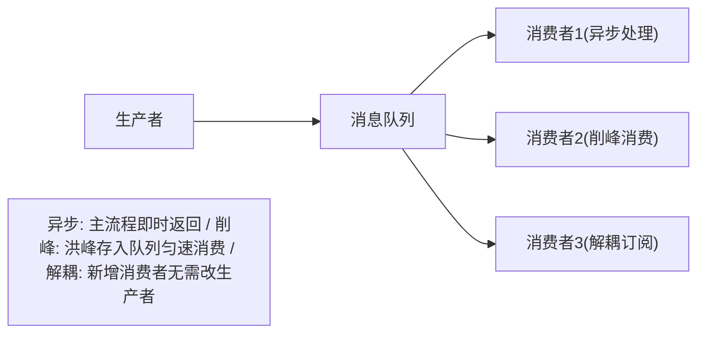
三种核心价值，每个都要能举出自己项目的例子：
- **异步**：主链路只做核心动作，非核心（短信、积分、风控通知）丢给 MQ 异步做，降低 RT。
- **解耦**：生产者不用关心谁消费，新增消费者不改动生产者。典型：支付成功后要通知 5 个下游系统。
- **削峰**：大促瞬时流量先进 MQ 缓冲，下游按自己能力匀速消费，保护 DB。
- 副作用（必须同步会说）：**一致性变弱（最终一致）、复杂度升高、多了个要保活的组件**。

### 第 2 步：四类 MQ 的选型对比（面试常直接问"为什么选 Kafka 不选 RabbitMQ"）
| 维度 | Kafka | RocketMQ | RabbitMQ | Pulsar |
| --- | --- | --- | --- | --- |
| 定位 | 高吞吐日志/流式 | 业务级、事务消息强 | 低延迟、灵活路由 | 云原生、存算分离 |
| 吞吐量 | 极高 | 高 | 中 | 高 |
| 延迟 | ms 级 | ms 级 | 微秒~ms | ms 级 |
| 顺序性 | 分区内有序 | 队列有序 | 队列有序 | 分区有序 |
| 事务消息 | Kafka 事务 | 原生事务消息 | 无（靠确认） | 支持 |
| 延迟消息 | 不支持（自研） | 原生支持 | 靠插件/死信 | 支持 |
| 典型场景 | 日志、埋点、流计算 | 电商交易、金融 | 业务解耦、任务队列 | 多租户、云 |

记忆法：**吞吐选 Kafka，事务/延迟选 RocketMQ，灵活路由选 RabbitMQ，云原生选 Pulsar**。

### 【深度拓展】RocketMQ 存储架构源码级剖析

#### CommitLog：消息存储的核心
- RocketMQ 采用混合型存储，所有 Topic 的消息都写入同一个 CommitLog，1G一个文件
- 写入流程：Producer → CommitLog → ReputMessageService 异步构建 ConsumeQueue + IndexFile
- Mermaid 图：CommitLog 写入与分发流程

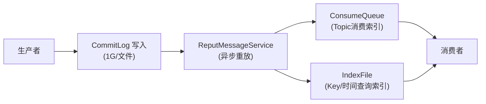

#### ConsumeQueue 定长设计
- 每个条目20字节：8字节commitLogOffset + 4字节msgSize + 8字节tagHashCode
- 单文件30万条目 ≈ 5.72MB，支持数组式随机访问
- Topic 默认4个 MessageQueue，每个有独立 ConsumeQueue 目录

#### RocketMQ 4.9.1 性能优化 30% 的提升点
- 自旋锁替换 synchronized（putRequest操作）
- 去除 GroupTransferService 中多余的锁（doWaitTransfer）
- 降低锁的范围（offsetMsgId 生成并行化）
- 参数调整：sendMessageThreadPoolNums 从1改为CPU核数，useReentrantLockWhenPutMessage 默认改为 true

#### 消息高可用设计
- Producer 端延迟容错（MQFaultStrategy）：根据延迟级别设置 Broker 不可用时长
- 两种选队列算法：selectOneMessageQueue（多线程随机递增取模）、pickOneAtLeast（不是最差随机法）
- Consumer 端 RebalanceService 每20s执行一次，平均分配算法

#### 【深度拓展】RocketMQ vs Kafka 存储架构对比

| 维度 | Kafka | RocketMQ |
|---|---|---|
| 存储模型 | 每个 Partition 独立 Log 文件 | 所有 Topic 共享 CommitLog（混合存储） |
| 索引方式 | Offset 索引 + 时间戳索引 | ConsumeQueue（定长索引）+ IndexFile（Hash 索引） |
| 消息查询 | 按 Offset 二分查找 Segment | 按 CommitLog Offset 随机访问 ConsumeQueue |
| 优劣 | Partition 数多时文件句柄暴增 | 统一写入顺序 IO 性能稳定，但 ConsumeQueue 需异步构建 |
| 适用场景 | Topic 少但吞吐极高 | Topic/Queue 多（电商多业务线） |

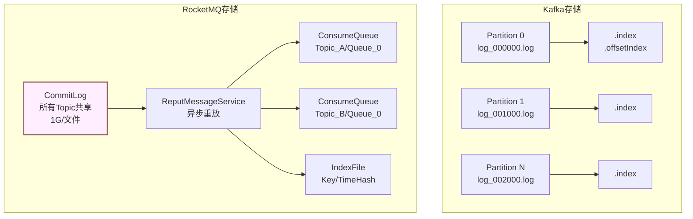

#### 【深度拓展】RocketMQ 消息查询的三种方式

1. **按 CommitLog Offset 查询**：ConsumeQueue 存的是 CommitLog 的物理偏移量，直接定位 → 最快
2. **按时间戳查询**：ConsumeQueue 每个文件存了 minTimestamp/maxTimestamp，先二分定位文件，再在文件内二分定位 → 适合"查某时刻附近的消息"
3. **按 Key 查询**：IndexFile 用 Hash 索引（类似 HashMap），key → slot → 链表 → CommitLog Offset → 适合"按业务 key 查消息"

### 第 3 步：消息可靠性（贯穿全程的主线）
把"一条消息的一生"拆成三段，每段都可能丢：
1. **生产者 → Broker**：网络抖动/宕机丢。→ 用**确认机制**（Kafka acks=all + 重试；RocketMQ 同步发送 + 重试）。
2. **Broker 存储**：Broker 宕机丢页缓存未刷盘。→ **刷盘策略**（同步刷盘/异步刷盘）+ **多副本**（ISR 同步复制）。
3. **Broker → 消费者**：消费失败/宕机丢。→ **手动提交 offset（先处理业务再提交）** + **消费幂等**。
核心结论：**做到不丢失 = 生产确认 + 多副本同步刷盘 + 手动提交 offset**，但要为吞吐和复杂度买单。

#### 【深度拓展】消息可靠性完整链路图

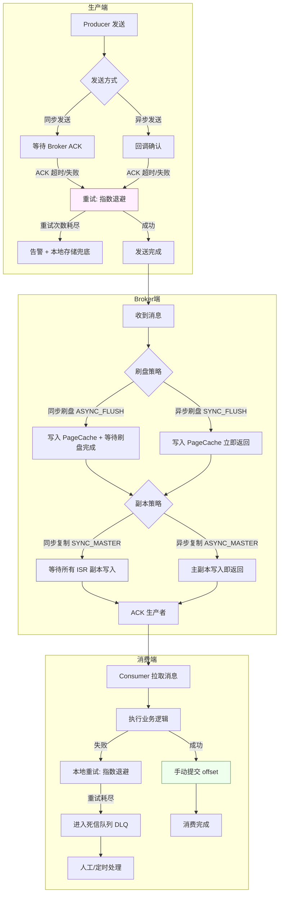

#### 【深度拓展】Kafka 生产者可靠性配置

```yaml
# Kafka Producer 可靠性配置
producer:
  bootstrap.servers: "broker1:9092,broker2:9092,broker3:9092"
  acks: "all"                    # 等待所有 ISR 副本确认
  retries: 3                     # 发送失败重试次数
  max.in.flight.requests.per.connection: 5  # 幂等时最大飞行请求数
  enable.idempotence: true       # 开启幂等（防重试导致重复）
  delivery.timeout.ms: 120000    # 发送总超时（含重试）
  request.timeout.ms: 30000      # 单次请求超时
  retry.backoff.ms: 1000         # 重试退避间隔
  compression.type: "lz4"        # 压缩（省带宽）
  batch.size: 16384              # 批量大小
  linger.ms: 10                  # 批量等待时间

# Broker 端配置
broker:
  min.insync.replicas: 2         # 最少同步副本数（配合 acks=all）
  default.replication.factor: 3  # 默认副本因子
  log.flush.interval.messages: 10000  # 同步刷盘消息数
  log.flush.interval.ms: 1000    # 同步刷盘间隔
  unclean.leader.election.enable: false  # 禁止非 ISR 副本当选 leader（防丢消息）
```

#### 【深度拓展】消费端手动提交 offset 代码

```java
// Kafka 消费端：先处理业务再手动提交 offset
Properties props = new Properties();
props.put("bootstrap.servers", "broker1:9092");
props.put("group.id", "payment-group");
props.put("enable.auto.commit", "false");  // 关闭自动提交
props.put("auto.offset.reset", "earliest");
props.put("max.poll.records", 100);        // 单次拉取最大记录数

KafkaConsumer<String, String> consumer = new KafkaConsumer<>(props);
consumer.subscribe(Arrays.asList("payment-events"));

while (true) {
    ConsumerRecords<String, String> records = consumer.poll(Duration.ofMillis(1000));
    for (ConsumerRecord<String, String> record : records) {
        try {
            // 1. 先执行业务逻辑（幂等）
            processPaymentEvent(record.value());
            // 2. 业务成功后手动提交 offset
            consumer.commitSync();  // 同步提交（更可靠）
        } catch (Exception e) {
            // 3. 业务失败：不提交 offset，下次重新拉取
            log.error("处理失败，不提交offset: {}", record.offset(), e);
            // 重试逻辑或进入死信
            if (isRetryExhausted(record)) {
                sendToDLQ(record);  // 进死信队列
                consumer.commitSync();  // 跳过这条，提交 offset
            }
        }
    }
}
```

### 第 4 步：消息顺序性
- **局部有序**即可，不需要全局有序。方案：**相同业务键（如订单号）hash 到同一分区/队列**，单分区内天然有序。
- 坑：单分区内如果消费者用**多线程并发处理**，顺序就乱了——必须单线程或按序分发。
- Kafka 的 `key` 决定分区；RocketMQ 的 `MessageQueue` 选择。

### 第 5 步：重复消费与幂等
- 原因：生产者重试、消费者 rebalance、offset 提交前崩溃，都会**至少一次（at-least-once）**。
- 幂等方案（按成本从低到高）：
  1. **业务去重表 / 唯一索引**：用 msgId 或业务唯一键插一张表，重复插入直接忽略。
  2. **Redis setnx**：处理前 `setnx(msgId, 1)`，失败即跳过。
  3. **状态机**：消费前校验"当前状态是否已经处理过该事件"。
- 我项目里的真实做法见文末「结合我的项目」。

### 第 6 步：消息积压与消费能力
- 先定位：是**生产太快**还是**消费太慢**（消费慢常见：业务逻辑重、DB 慢、单线程）。
- 解决：
  - 临时**扩容消费者实例/线程**（Kafka 受分区数上限约束，分区不够要先扩分区）。
  - 把**非核心逻辑异步化**或批处理。
  - 紧急时**借临时 topic + 多倍消费者**快速消费 backlog，再切回。
- 防积压：监控 lag（Kafka 的 `consumer lag`），设告警阈值。

#### 【深度拓展】消息积压处理全景图

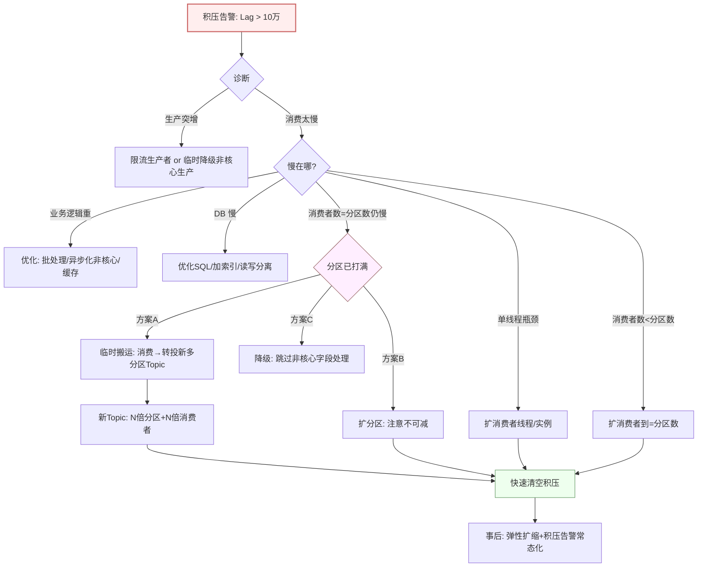

#### 【深度拓展】积压处理方案对比

| 方案 | 适用场景 | 优点 | 缺点 | 恢复速度 |
|---|---|---|---|---|
| 扩消费者实例 | 消费者数 < 分区数 | 简单直接 | 受分区数上限约束 | 快 |
| 扩分区 | 分区数不够 | 提高并行上限 | 不可逆（不能减分区），历史消息重分配 | 中 |
| 临时搬运转投 | 分区已打满，需临时加速 | 灵活，用完即弃临时Topic | 架构复杂，需保证消息不丢不重 | 最快 |
| 降级非核心逻辑 | 业务逻辑太重 | 快速降低单条耗时 | 牺牲功能完整性 | 快 |
| 批处理优化 | 单条处理RT高 | 减少IO次数，提升吞吐 | 需要改消费逻辑，有延迟窗口 | 中 |

#### 【深度拓展】积压监控与告警配置

```yaml
# Kafka 消费者 Lag 监控配置（基于 Burrow 或 Kafka Exporter）
monitoring:
  consumer_lag:
    metric: "kafka_consumergroup_lag"
    alert_rules:
      - name: "lag_warning"
        condition: "lag > 10000"
        for: "5m"
        severity: "warning"
        notify: ["im", "email"]
      - name: "lag_critical"
        condition: "lag > 100000"
        for: "2m"
        severity: "critical"
        notify: ["phone", "im", "email"]
      - name: "lag_growing"
        condition: "rate(lag[5m]) > 0 AND lag > 1000"
        for: "10m"
        severity: "warning"
        notify: ["im"]
        description: "积压持续增长，消费速度跟不上生产速度"
```

### 第 7 步：死信队列 / 延迟队列 / 重试
- **死信队列（DLQ）**：消费 N 次仍失败的消息进入 DLQ，避免阻塞主队列，后续人工/定时处理。
- **延迟队列**：
  - RabbitMQ：TTL + 死信 Exchange 实现（消息过期变死信转发到延迟队列）。
  - RocketMQ：原生 `delayLevel`，支持 1s/5s/.../2h。
  - Kafka：无原生延迟，常用**时间轮 / 外部调度**或**延迟 topic + 扫描**，或挂 DB 定时扫。
- **重试**：本地重试（指数退避）→ 失败进重试队列/DLQ。

### 第 8 步：分布式事务消息（面试高频）

> 事务消息 = "本地事务" 与 "消息投递" 的一致性。RocketMQ 用**半消息 + 回查**保证：本地事务成了才投递，超时则 Broker 主动回查。

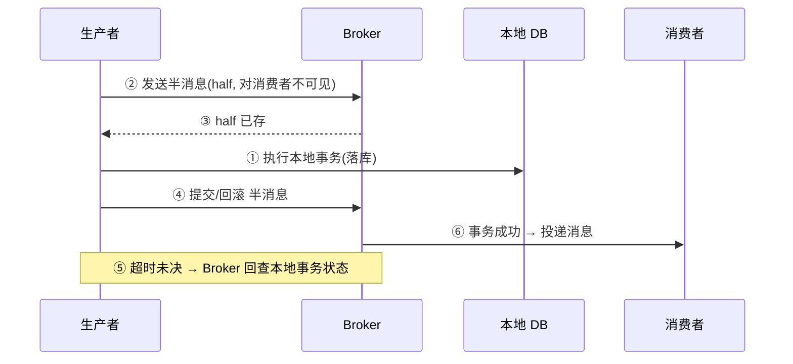
- **RocketMQ 事务消息**：half message → 执行本地事务 → 提交/回滚 → 回查（弥补本地事务执行后宕机）。保证"本地事务成功 ⇔ 消息发出去"。
- **Kafka 事务 + exactly-once**：`enable.idempotence` + `transactional.id`，保证"生产端幂等 + 消费-转换-生产原子"。但跨系统的最终一致仍靠下游幂等。
- **本地消息表**（我项目主用）：本地事务和写消息表同库事务，定时任务轮询发送，失败重试——简单可靠，不强依赖 MQ 的事务能力。
- 这三种的取舍见「高频题集」Q9。

#### 【深度拓展】RocketMQ 事务消息代码实现

```java
// RocketMQ 事务消息生产者
public class TransactionProducer {
    public static void main(String[] args) {
        TransactionMQProducer producer = new TransactionMQProducer("tx_group");
        producer.setNamesrvAddr("127.0.0.1:9876");

        // 设置事务回查监听器（Broker 超时未收到二次确认时调用）
        producer.setTransactionListener(new TransactionListener() {
            @Override
            public LocalTransactionState executeLocalTransaction(Message msg, Object arg) {
                // 执行本地事务（如扣减库存、记账）
                try {
                    businessService.doLocalTransaction(msg);
                    return LocalTransactionState.COMMIT_MESSAGE;
                } catch (Exception e) {
                    return LocalTransactionState.ROLLBACK_MESSAGE;
                }
            }

            @Override
            public LocalTransactionState checkLocalTransaction(MessageExt msg) {
                // Broker 回查：根据 msg 查本地事务状态
                // 必须幂等！可能被调用多次
                String txId = msg.getUserProperty("txId");
                boolean committed = businessService.checkTransactionCommitted(txId);
                if (committed) {
                    return LocalTransactionState.COMMIT_MESSAGE;
                } else if (businessService.checkTransactionRolledBack(txId)) {
                    return LocalTransactionState.ROLLBACK_MESSAGE;
                }
                return LocalTransactionState.UNKNOW;  // 继续等待，下次再查
            }
        });

        producer.start();

        // 发送事务消息
        Message msg = new Message("PayTopic", "支付成功消息",
            ("支付流水:" + txId).getBytes());
        msg.putUserProperty("txId", txId);
        TransactionSendResult result = producer.sendMessageInTransaction(msg, null);
        // half message 已发送，本地事务在 executeLocalTransaction 中执行
    }
}
```

#### 【深度拓展】本地消息表代码实现

```java
// 本地消息表方案 —— 业务与消息同库事务
@Transactional
public void processPayment(String orderId, BigDecimal amount) {
    // 1. 业务操作（同库事务）
    paymentMapper.updateStatus(orderId, "PAID", amount);

    // 2. 写本地消息表（同库事务，保证要么都成功要么都回滚）
    MessageRecord record = new MessageRecord();
    record.setMsgId(UUID.randomUUID().toString());
    record.setTopic("PAYMENT_SUCCESS");
    record.setBody(JSON.toJSONString(new PayEvent(orderId, amount)));
    record.setStatus("PENDING");  // 待发送
    record.setRetryCount(0);
    record.setCreatedAt(new Date());
    messageRecordMapper.insert(record);
    // 事务提交后，record 已落库
}

// 定时任务：扫描待发送消息并投递
@Scheduled(fixedDelay = 5000)  // 每5秒扫描
public void scanAndSend() {
    List<MessageRecord> pending = messageRecordMapper.selectByStatus("PENDING", 100);
    for (MessageRecord record : pending) {
        try {
            rocketMQTemplate.convertAndSend(record.getTopic(), record.getBody());
            messageRecordMapper.updateStatus(record.getId(), "SENT");
        } catch (Exception e) {
            // 发送失败：增加重试次数，下次继续扫描
            messageRecordMapper.incrementRetryCount(record.getId());
            if (record.getRetryCount() >= MAX_RETRY) {
                messageRecordMapper.updateStatus(record.getId(), "FAILED");
                alertService.notify("消息发送失败", record);
            }
        }
    }
}
```

### 第 9 步：底层原理（拉开差距的关键）
面试官想看你是否懂"为什么快""为什么可靠"：
- **顺序写磁盘**：append-only log，比随机写快一个数量级。
- **零拷贝（sendfile）**：broker 把文件直接发网卡，省去内核态⇄用户态拷贝。
- **PageCache**：写入先进 OS 缓存，批量刷盘；读也走缓存。
- **分区/分段 + 稀疏索引**：每个分区一个 log，按 offset 二分定位 segment，再读具体消息。
- **副本与 ISR**：leader 处理读写，follower 从 leader 拉取；**ISR（In-Sync Replicas）**是和 leader 保持同步的副本集合；`acks=all` 要等 ISR 都写入才算成功。**HW（高水位）**是已提交位移，**LEO（Log End Offset）**是日志末端。
- **消费模型**：Kafka 是 **pull**（消费者主动拉，能控流），RabbitMQ 是 **push**（broker 推，需 prefetch 限流）。

#### 【深度拓展】Kafka 存储架构详解

```mermaid
flowchart TD
    subgraph 一个Partition的存储结构
        P[Partition: topic-0] --> S1[Segment 0\n00000000000000000000.log\n00000000000000000000.index\n00000000000000000000.timeindex]
        S1 --> S2[Segment 1\n00000000000000123456.log\n00000000000000123456.index]
        S2 --> S3[Segment N\n当前活跃Segment\n(log4j.appender滚动)]
        S3 --> ACTIVE[新消息append到这里\n顺序写磁盘]
    end
    subgraph 查找过程
        Q[根据 offset 查消息] --> B1[二分定位 Segment]
        B1 --> B2[在 .index 中二分找最近的索引项]
        B2 --> B3[定位到 .log 的物理位置]
        B3 --> B4[顺序扫描到目标 offset]
    end
    subgraph 零拷贝流程
        Z1[用户态: 读取请求] --> Z2[内核态: sendfile系统调用]
        Z2 --> Z3[PageCache → 网卡DMA]
        Z3 --> Z4[跳过用户态拷贝]
    end
    style ACTIVE fill:#efe,stroke:#696,stroke-width:2px
    style Z2 fill:#eef,stroke:#669
```

#### 【深度拓展】Kafka 副本同步机制（ISR/HW/LEO）

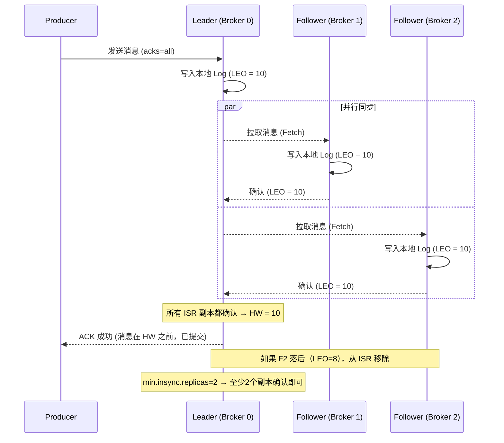

| 概念 | 含义 | 关键点 |
|---|---|---|
| LEO (Log End Offset) | 每个副本的日志末端 offset | 每个副本独立维护 |
| HW (High Watermark) | 所有 ISR 副本中最小的 LEO | 消费者只能读到 HW 之前 |
| ISR (In-Sync Replicas) | 与 Leader 保持同步的副本集合 | 落后太多的副本被移出 ISR |
| OSR (Out-of-Sync Replicas) | 未同步的副本集合 | 不可参与 acks=all 确认 |
| AR (All Replicas) | ISR + OSR = 全部副本 | 分区的完整副本集 |

#### 【深度拓展】零拷贝技术对比

| 技术 | 系统调用 | 数据拷贝次数 | 适用场景 |
|---|---|---|---|
| 传统 read+write | read() + write() | 4 次（含 2 次用户态↔内核态） | 通用 IO |
| mmap + write | mmap() + write() | 3 次（减少一次内核→用户态拷贝） | 小文件、随机读 |
| sendfile | sendfile() | 2 次（全程内核态，零用户态拷贝） | 大文件顺序传输（Kafka/RocketMQ） |
| sendfile + SG-DMA | sendfile() + DMA | 0 次（数据不经过 CPU 拷贝） | 硬件支持 scatter-gather |

> **面试加分点**：Kafka 用 sendfile 实现零拷贝，数据从 PageCache 直接通过 DMA 传到网卡，**全程不经过用户态**，这就是 Kafka 高吞吐的核心秘密之一。

### 第 10 步：生产实战与踩坑（形成自己的故事）
把下面"结合我的项目"两件事讲成 STAR，面试几乎必加分。

---

## 二、高频题集（标准回答 + 考察点）

> 每题给出：**回答要点** + **面试官考察点** + **易错坑**。

### Q1：为什么用消息队列？典型场景？
**答**：三大价值——①异步（非核心链路异步化降 RT）；②解耦（生产者不依赖消费者）；③削峰（缓冲大促流量保护 DB）。场景如：支付成功后异步通知风控/短信/积分；订单事件驱动库存/物流；日志采集。
**考察点**：是否真的用过、能否区分场景。
**坑**：只说"解耦"不举例子；不说副作用。

**【深度拓展】**
- **"异步"省的是 RT，但引入了"最终一致"的代价**：支付主链路同步 RPC 拿结果（强一致），把"通知/记账/风控"丢给 MQ 异步——RT 从"同步串起所有下游"降到"只做核心动作"。代价是这些动作变成最终一致，要靠幂等 + 对账兜底（这正是 XTransfer 任务补偿的存在意义）。
- **"解耦"的另一面是"链路变长、难调试"**：生产者不知道下游成没成，排障要从"一个调用栈"变成"跨多个消费者 + MQ 控制台"。所以可观测（TraceId 透传）+ 死信 + 对账缺一不可。
- **"削峰"保护的是最脆弱的 DB**：大促瞬时流量先进 MQ，消费端按自己能力匀速处理，DB 不被冲垮。但 MQ 也有容量上限，极端洪峰会"生产者发不进去"，所以要配合限流 + 拒绝了之（宁可拒单不雪崩）。
- **面试官追问**："MQ 和 RPC 怎么选？" → 见本文高频问答末尾 + RPC 篇；"消息丢了谁负责？" → 见 Q3 三段防护。

**【项目支撑】**
XTransfer 收款链路：核心入账同步 RPC 拿结果，入账后的"风控通知/记账/申报"全部走 MQ 异步（解耦 + 削峰 + 最终一致），失败靠任务补偿 + 死联/死信兜底。欧凡商品变更（订单/评论/收藏）也走 RocketMQ 异步批量落库 + 写 ES，削峰解耦。哈啰 IOT 设备心跳走 Kafka，丢包靠 MQ 重放补偿。

### Q2：引入 MQ 会带来什么问题？
**答**：①系统可用性下降（多一个故障点）；②一致性变弱（最终一致，有短暂不一致窗口）；③复杂度上升（要处理丢失/重复/积压）；④运维成本。需要用监控、幂等、补偿来兜底。
**考察点**：有没有"权衡意识"，不是无脑吹。

### Q3：如何保证消息不丢失？
**答**：三段防护——①生产端 `acks=all`/同步发送 + 失败重试；②Broker 多副本同步复制 + 同步刷盘；③消费端**先执行业务再手动提交 offset**。Kafka 还要避免"自动提交 offset 但业务没跑完"。
**考察点**：是否理解"消息一生三段都可能丢"。
**坑**：以为 `acks=1` 就够；忘了消费端 offset 提交时机。

### Q4：如何保证消息顺序性？
**答**：业务上只需**局部有序**。让同一业务键（订单号）路由到同一分区/队列，分区内天然有序；消费端该分区用单线程或按序分发，不并发乱序处理。
**考察点**：懂不懂"全局有序不现实、局部有序够用"。
**坑**：声称"全局有序"；消费端多线程把单分区顺序打乱。

### Q5：如何保证不重复消费（幂等）？
**答**：MQ 通常只保证 at-least-once，所以消费端必须幂等。常用：①msgId/业务唯一键防重表 + 唯一索引；②Redis `setnx`；③状态机校验"是否已处理该事件"。
**考察点**：是否知道"重复是常态、幂等是责任"。
**坑**：把锅甩给 MQ 说"不会重复"。

**【深度拓展】**
- **"重复是常态"的工程含义**：生产者重试、broker 重投、consumer rebalance、offset 提交前崩溃——任何一环都会让同一条消息被消费两次。所以消费逻辑默认按"会重复"写，绝不做"假设只来一次"的非幂等动作（如 `count++` 不落幂等键）。
- **三种幂等手段的取舍**：①防重表 + 唯一索引最可靠（DB 强约束，能查能审），适合资金；②Redis setnx 快但依赖 Redis 可用、且有过期问题；③状态机校验最优雅（"已到终态直接忽略"），但前提是业务有状态机。XTransfer 三样一起用。
- **"消费成功但 offset 没提交"的陷阱**：业务处理成功、准备提交 offset 时崩溃 → 重启后同消息再消费一次。所以"业务处理"和"幂等标记"要在同一事务/同一存储，避免"处理了但没标记幂等"。
- **面试官追问**："exactly-once 能不能做到？" → 见 Q15，端到端几乎做不到，靠 at-least-once + 幂等等效实现。

**【项目支撑】**
XTransfer 任务补偿消费者处理每一条消息都带幂等键：状态机 CAS（`UPDATE ... WHERE status=旧`）保证重复事件被忽略，记账用 `biz_no+方向` 唯一索引兜底，重复投递无害。哈啰 Kafka 心跳消费用"同车辆同窗口去重键"做幂等，乱序/重复心跳不影响工单生成。

### Q6：消息积压了怎么办？
**答**：先定位消费慢原因（重逻辑/DB 慢/单线程）。再：①扩容消费者实例（Kafka 受分区数限制，需先扩分区）；②优化消费逻辑（批处理/异步化非核心）；③紧急临时 topic + 多倍消费者快速清 backlog。日常靠监控 lag 设告警。
**考察点**：有无实战排障思路。
**坑**：只说"加机器"，不提分区上限约束。

### Q7：Kafka 为什么这么快？
**答**：①顺序写磁盘（append-only）；②零拷贝 sendfile 发数据；③PageCache 批量读写；④批量发送 + 压缩（snappy/lz4）；⑤分区并行。
**考察点**：原理深度。
**坑**：只说"快"，讲不出具体机制。

**【深度拓展】Kafka 高性能六大技术**

```mermaid
flowchart TD
    FAST[Kafka 高性能] --> T1[顺序写磁盘\nappend-only log]
    FAST --> T2[零拷贝 sendfile\nPageCache→网卡DMA]
    FAST --> T3[PageCache 读写缓存\n写入先入缓存批量刷盘\n读取命中缓存避免磁盘IO]
    FAST --> T4[批量发送 + 压缩\nproducer端batch+snappy/lz4\n减少网络IO次数]
    FAST --> T5[分区并行\npartition=并行单位\n水平扩展吞吐]
    FAST --> T6[稀疏索引\noffset→segment物理位置\n二分查找O(logN)]
    style FAST fill:#eef,stroke:#669,stroke-width:2px
```

| 技术 | 原理 | 量化收益 |
|---|---|---|
| 顺序写磁盘 | 磁盘顺序写 ~600MB/s vs 随机写 ~100KB/s | 6000 倍差距 |
| 零拷贝 sendfile | 数据从 PageCache 直达网卡 DMA，不经用户态 | 减少 2 次 CPU 拷贝 + 2 次上下文切换 |
| PageCache | 写入先进 OS 缓存，批量刷盘；读命中缓存免磁盘 IO | 缓存命中率 > 80% 时读性能 ≈ 内存 |
| 批量+压缩 | producer 端 batch.size + linger.ms 攒批，snappy/lz4 压缩 | 网络请求减少 5-10 倍 |
| 分区并行 | partition = 并行单位，N 个 partition = N 倍并行 | 线性扩展（受磁盘/网络上限约束） |
| 稀疏索引 | .index 文件每隔 4KB 存一个 offset→position 映射 | 查找 O(logN)，索引文件小 |

**【面试官追问】**
- "PageCache 在什么场景下效果不好？" → 消费者落后很多（读旧数据）时缓存未命中，退化为磁盘读；消费者多于生产者时缓存被频繁驱逐。
- "sendfile 和 mmap 有什么区别？" → sendfile 全程内核态（适合大文件传输），mmap 映射到用户态内存（适合随机读+小文件），Kafka 读写分别用两者。
- "为什么不用纯内存存储？" → 内存成本高且重启丢数据；磁盘顺序写性能接近内存且持久化可靠。

### Q8：死信队列和延迟队列怎么实现？
**答**：**死信队列**：消费多次失败转入 DLQ（RabbitMQ 靠 `x-dead-letter-exchange`，RocketMQ 靠重试队列/死信 topic），后续人工或定时处理，避免阻塞主队列。**延迟队列**：RabbitMQ 用 TTL+死信 Exchange；RocketMQ 原生 `delayLevel`；Kafka 无原生，靠时间轮/外部调度/延迟 topic 扫描。
**考察点**：对各自 MQ 特性的熟悉度。

### Q9：RocketMQ 事务消息原理？和本地消息表怎么选？
**答**：RocketMQ 事务消息：发 half message → 执行本地事务 → 提交/回滚 → **回查**（本地事务执行后若 broker 没收到结果，会回查状态，弥补宕机）。保证"本地事务成功 ⇔ 消息发出"。**本地消息表**：本地事务与写消息表同库，定时任务轮询发送+重试。
**选型**：RocketMQ 事务消息依赖该 MQ 且回查要幂等；本地消息表不依赖 MQ 事务能力、简单可靠、易排查；我们**跨多系统最终一致用本地消息表 + 幂等**（见文末），强绑定 RocketMQ 且要求"发送即一致"才用事务消息。
**考察点**：是否理解两种方案的适用边界。

**【深度拓展】**
- **事务消息的"回查"是灵魂**：half message 已落 broker 但本地事务结果未知（比如本地事务执行完、发 commit 前宕机），broker 会主动回查生产者"你那笔事务到底成没成"。这就要求本地事务状态可查（不能靠内存），且回查本身幂等。
- **本地消息表的"轮询扫描"成本**：要起定时任务扫"待发送/失败"消息重投，有延迟（秒~分钟级），且扫描频率 vs DB 压力要权衡。好处是"消息表能直接查"——资金场景排障时一眼看到"哪条没发出去"，比黑盒的 MQ 内部状态友好。
- **两者不是非此即彼**：XTransfer 用"本地消息表（业务侧最终一致）+ Outbox（事件不丢）"组合，事务消息只在强绑 RocketMQ 且要"发送即一致"时用。核心原则：**资金场景要"看得见、可审计、可补偿"**。
- **面试官追问**："如果本地事务成功但消息表写入失败？" → 同库事务，要么都成要么都回滚；"Outbox 和本地消息表区别？" → Outbox 是把"事件"和"业务"同事务写，再由独立投递者读出发送，避免"业务成消息没发"的窗口。

**【项目支撑】**
XTransfer 收款链路跨风控/申报/账务多域，主选"本地消息表 + 状态机 + 任务补偿 + Outbox"：本地事务写业务 + 任务/事件表，异步调度器按退避重试，失败走补偿脚本/死信转人工，下游幂等保证重复无害。资金场景要"看得见"，所以我们没主用 RocketMQ 事务消息——消息表能直接查库排障，这是 0 资损的支撑之一。

### Q10：Kafka 分区、副本、ISR、HW、LEO？
**答**：**分区**是并行单位，一个 topic 多个 partition；**副本**中一个 leader 多个 follower；**ISR**是和 leader 同步的副本集合；`acks=all` 要 ISR 全写成功。**LEO** 是日志末端 offset，**HW** 是已提交（所有 ISR 都有的）高水位，消费者只能读到 HW 之前。
**考察点**：副本机制、不丢消息原理。

### Q11：Kafka rebalance 是什么？有什么问题？
**答**：消费者组内成员变化（上下线/订阅变更）时，重新分配分区的过程。期间**全组暂停消费（stop-the-world）**，频繁 rebalance 影响吞吐。优化：合理 `session.timeout`/`heartbeat.interval`、`Cooperative-Sticky` 增量再均衡、避免消费超时触发踢出。
**考察点**：是否踩过 rebalance 坑。

**【深度拓展】Rebalance 问题与优化**

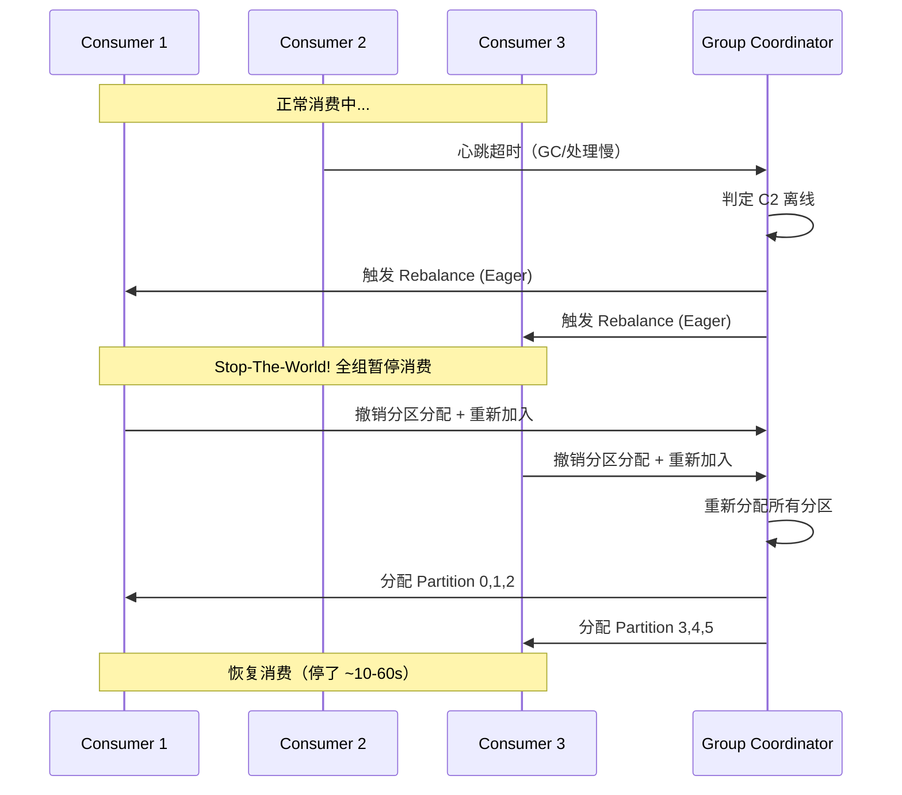

| Rebalance 策略 | 说明 | 停顿时间 | 适用版本 |
|---|---|---|---|
| Eager（全量） | 撤销所有分区 → 重新分配 | 长（全组 STW） | Kafka < 2.4 默认 |
| Cooperative-Sticky（增量） | 只撤销变化的分区，其余不动 | 短（部分停顿） | Kafka >= 2.4 |

**优化配置**：
```yaml
# Kafka Consumer Rebalance 优化
consumer:
  partition.assignment.strategy: "org.apache.kafka.clients.consumer.CooperativeStickyAssignor"
  session.timeout.ms: 30000        # 心跳超时（默认10s，消费慢时调大）
  heartbeat.interval.ms: 3000      # 心跳间隔（默认3s）
  max.poll.interval.ms: 300000     # 两次poll最大间隔（默认5分钟，处理慢调大）
  max.poll.records: 100            # 单次poll最大记录数（处理慢调小）
```

**常见 Rebalance 陷阱**：
1. **消费太慢触发踢出**：`max.poll.interval.ms` 内没调 poll → 被判定为死亡 → 触发 rebalance → 其他消费者接手 → 更多消息积压 → 恶性循环
2. **GC 停顿**：Full GC 导致心跳超时 → 被 coordinator 判定离线 → rebalance
3. **网络抖动**：心跳包丢失 → 误判离线 → rebalance

### Q12：消费模型 pull 还是 push？
**答**：Kafka 是 **pull**——消费者按自己节奏拉，能背压控流、批量拉取；缺点是要轮询（靠 `fetch.min.bytes` 等长批）。RabbitMQ 是 **push**——broker 主动推，靠 `prefetch count` 限流防打爆消费者。
**考察点**：两种模型取舍。

### Q13：RabbitMQ 交换机类型和镜像队列？
**答**：四种交换机——Direct（精确路由键）、Topic（通配符）、Fanout（广播）、Headers（头匹配）。**镜像队列**是老版本高可用方案（队列镜像到多节点），新版本推荐 Quorum Queue（基于 Raft，更强一致）。
**考察点**：RabbitMQ 熟悉度（如果简历写 RabbitMQ 必问）。

### Q14：如何设计一个消息队列？（系统设计题）
**答**：核心组件——①Producer（批量/压缩/重试/路由）；②Broker（分区日志、顺序写、PageCache、副本 ISR、索引）；③Consumer（pull、消费组、rebalance、offset）；④存储（commit log + 稀疏索引 + 零拷贝）；⑤高可用（多副本 + 故障切换）；⑥可靠性（ack + 刷盘 + 手动提交）。可点出我们项目里"任务补偿框架"对消息失败的兜底思路。
**考察点**：架构抽象能力。

**【深度拓展】**
- **存储是核心差异点**：append-only commit log + 顺序写 + PageCache + 零拷贝（sendfile）= 高吞吐的底层。稀疏索引（offset → segment 物理位置）支持快速定位。这是 Kafka/RocketMQ 都遵循的范式。
- **pull vs push 的设计取舍**：pull（Kafka）让消费者按能力拉、天然背压，但需轮询；push（RabbitMQ）实时但需 prefetch 限流防打爆消费者。设计 MQ 要选一个并处理好其短板。
- **高可用 = 副本 + ISR + 故障切换**：leader 读写、follower 拉取、ISR 同步集合、`acks=all` 等 ISR 全写。故障切换要保证"已提交消息不丢"（HW 之前可见）。
- **可靠性三段（见 Q3）必须内建**：生产确认 + 多副本刷盘 + 手动提交 offset。消费失败兜底 = 重试 + 死信队列（本文项目节 XTransfer 任务补偿）。
- **面试官追问**："顺序消息怎么支持？" → 同 key 路由同分区/队列，单分区单线程（见 Q4/Q13）；"消息重试和死信怎么设计？" → 消费失败进重试队列，超阈值进 DLQ（见 Q8/真实项目节）。

**【项目支撑】**
我们 XTransfer 的"任务补偿框架"本质就是一个建在 MQ 之上的"可靠消费 + 失败兜底"层：每条关键动作落任务表（待执行/执行中/成功/失败/人工），补偿消费者按退避重试，超阈值转死信/人工，配合状态机保证最终一致。这正好对应"设计一个 MQ"里"消费失败兜底"那块——我们没造轮子造 MQ，而是基于 MQ 造了可靠的补偿语义。

### Q15：Exactly-once 到底能不能做到？
**答**：严格意义的端到端 exactly-once 在分布式里极难，业界通常做法是 **at-least-once 投递 + 消费端幂等 = 效果上的 exactly-once**。Kafka 的 EOS 只对"自身读写"有效，跨系统最终一致仍靠下游幂等。
**考察点**：是否被"exactly-once"话术误导。

### Q16：你们项目里 MQ 用在哪？
**答**（结合真实项目，见文末）：①XTransfer 用 **MQ + 状态机实现任务补偿**，支付/入账等长流程里某一节点失败，靠 MQ 重试 + 补偿任务达成最终一致；②哈啰用 **Kafka 做设备心跳补偿**，IOT 千万设备心跳丢包时通过 MQ 重放补偿；③支付回调通过 MQ 触发**异步对账**。
**考察点**：能不能把八股落到自己项目。

**【深度拓展】**
- **"用在哪"要讲出"为什么是 MQ 而不是 RPC"**：XTransfer 长流程用 MQ，因为节点间本就是异步、可失败、需重试的（渠道回调晚、风控不可控），同步 RPC 贯穿会被最慢下游拖死；对账用 MQ 是因为"回调 RT"和"核对"解耦，回调立刻返回、核对慢慢跑。
- **"补偿"和"重试"的区别**：朴素重试是"业务里 while 循环"，补偿是把"待执行动作"落表、由独立调度器重试——可追溯、可观测、可死信、可人工。XTransfer 的 0 资损很大程度来自这个区别。
- **选型对应业务**：金融交易/事务消息选 RocketMQ；日志/埋点/流计算/设备心跳（超高吞吐）选 Kafka。我们在 XTransfer 重"事务消息/顺序/不丢"用 RocketMQ 思路，哈啰 IOT 心跳用 Kafka 扛吞吐。
- **面试官追问**："MQ 和 RPC 在你们架构里怎么配合？" → 核心交易同步 RPC 拿结果，衍生动作 MQ 异步（见 RPC 篇 + 支付系统设计篇）。

**【项目支撑】**
三段经历里 MQ 是"最终一致"的 backbone：XTransfer（任务补偿 + 异步对账 + Outbox 事件不丢）、哈啰（Kafka 千万设备心跳补偿）、欧凡（RocketMQ 商品变更异步落库 + 写 ES）。我把这些讲成 STAR，比背八股有用十倍——这正是下面"三、结合我的真实项目"的内容。

---

## 三、结合我的真实项目（面试加分弹药）

> 把下面两件事讲成 STAR，比背八股有用十倍。

> **【深度拓展】怎么把 MQ 讲出"资深感"**：别只说"用了 Kafka/RocketMQ"。要讲清三层——①**选型理由**（为什么这场景用这个 MQ）；②**可靠性设计**（不丢=生产确认+副本刷盘+手动提交 offset；不重=消费幂等；不积压=监控 lag）；③**失败兜底**（重试 + 死信 + 任务补偿 + 对账）。资金系统还要加一句"消息表能直接查库排障，所以资金场景要看得见"。下面三段就是按这个框架组织的。

### 1. XTransfer：MQ + 状态机实现任务补偿（最终一致性）
- **背景**：跨境支付"收款入账"是长流程（VA 开户 → 资金入账 → 风控审核 → 通知），任一步可能失败，不能让资金卡住。
- **做法**：每一步是一个**状态机节点**，节点失败不产生"失败终态"，而是**投递一条补偿任务消息到 MQ**，由补偿消费者按退避策略重试；重试仍失败进**死信/人工干预队列**。配合**本地消息表**，保证"本地状态已落库 ⇔ 补偿任务已注册"。
- **结果**：长流程最终一致，资金不卡单；配合对账实现 **0 资损**。详见 [XTransfer 跨境支付收款平台深度复盘](./准备-XTransfer跨境支付收款平台深度复盘.md) 与 [分布式事务与一致性](./准备-分布式事务与一致性.md) 的"任务补偿（XTransfer 实战）"一节。

### 2. 哈啰：Kafka 心跳补偿（IOT 千万设备）
- **背景**：两轮车运维平台对接千万级 IOT 设备，设备心跳上报丢包/乱序，影响设备在线状态判断与工单派发。
- **做法**：设备心跳先进 **Kafka**；消费端做**去重 + 顺序补偿**——对乱序心跳用 watermark 对齐，对丢包心跳通过**重放补偿任务**在窗口内补齐在线状态；消费慢时按分区扩容 + 批处理，避免 lag 堆积。
- **结果**：设备在线状态准确率显著提升，工单派发不再因心跳抖动误判。详见 [哈啰工单与薪资系统实战](./准备-哈啰工单与薪资系统实战.md)。

### 3. 欧凡/支付回调：MQ 触发异步对账
- 支付渠道回调先落库并投递 MQ，由对账消费者异步跑**渠道流水 vs 内部流水**的核对，差异进差错队列。把"同步回调处理"和"异步核对"解耦，回调 RT 大幅下降。

### 【项目支撑】三段经历 MQ 使用对比

| 维度 | XTransfer | 哈啰 | 欧凡 |
|---|---|---|---|
| MQ 选型 | RocketMQ | Kafka | RocketMQ |
| 核心场景 | 任务补偿/异步对账/Outbox | IOT设备心跳补偿 | 商品变更异步落库/写ES |
| 为什么选 | 事务消息/顺序/不丢/可审计 | 超高吞吐（千万设备） | 延迟消息/顺序消费 |
| 可靠性方案 | 本地消息表+状态机+补偿 | 去重+重放补偿+watermark | 消费幂等+死信+对账 |
| 幂等方案 | 状态机CAS+唯一索引 | 同车辆同窗口去重键 | 商品ID+版本号防重 |
| 积压处理 | 按退避重试+死信转人工 | 分区扩容+批处理 | 消费者扩容+降级 |
| 量化结果 | 0资损/人效+30% | 设备状态准确率显著提升 | 回调RT下降60%+ |

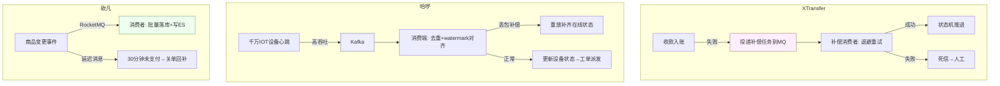

### 【面试官追问】项目深挖常见追问

| 追问 | 回答要点 |
|---|---|
| "XTransfer 为什么不用 RocketMQ 事务消息而用本地消息表？" | 资金场景要"看得见"——消息表能直接查库排障，比 MQ 内部黑盒状态友好；且不依赖特定 MQ |
| "哈啰千万设备心跳的 Kafka 分区怎么设计的？" | 按设备 ID hash 分区，保证同一设备的心跳进同一分区，顺序消费避免乱序 |
| "欧凡商品变更写 ES 为什么不直接写而走 MQ？" | 削峰——大促时商品变更 QPS 暴增，直接写 ES 会把 ES 打挂；MQ 缓冲后批量写入更稳定 |

---

## 四、面试表达框架（临场直接套）

被问到 MQ，按这个顺序讲，显得有体系：

> 1. **为什么用**：异步/解耦/削峰，举自己项目例子。
> 2. **选型**：Kafka vs RocketMQ vs RabbitMQ，结合场景。
> 3. **可靠性三段**：生产确认 + 多副本刷盘 + 手动提交 offset。
> 4. **顺序与幂等**：局部有序 + 消费幂等（防重表/状态机）。
> 5. **异常兜底**：积压扩容、死信、延迟、事务消息/本地消息表。
> 6. **原理压轴**：顺序写、零拷贝、PageCache、ISR。
> 7. **落到项目**：XTransfer 任务补偿 / 哈啰 Kafka 心跳补偿。

---

## 五、一句话速记

- **不丢**：acks=all + 副本同步 + 手动提交 offset。
- **不重**：消费端幂等（防重表 / 状态机）。
- **有序**：同一业务键进同一分区，单分区单线程。
- **不积压**：监控 lag + 扩分区扩消费者 + 优化消费逻辑。
- **事务**：RocketMQ 事务消息 / 本地消息表 + 回查。
- **快**：顺序写 + 零拷贝 + PageCache + 批量压缩。
- **选型**：吞吐选 Kafka，事务/延迟选 RocketMQ，灵活路由选 RabbitMQ。
- **死信**：消费失败超阈值进 DLQ，不阻塞主队列，人工兜底。
- **延迟**：RocketMQ 原生 delayLevel，Kafka 自研时间轮。
- **背压**：Kafka pull 天然背压，RabbitMQ 用 prefetch 限流。

### MQ 面试考点权重分布

| 考点 | 出现频率 | 难度 | 准备优先级 |
|---|---|---|---|
| 为什么用 MQ / 场景 | 极高 | 低 | P0 |
| 如何保证不丢 | 极高 | 中 | P0 |
| 如何保证幂等 | 高 | 中 | P0 |
| 如何保证顺序 | 高 | 中 | P1 |
| Kafka 为什么快 | 高 | 高 | P1 |
| 事务消息原理 | 中 | 高 | P1 |
| 消息积压处理 | 中 | 中 | P1 |
| 分区/副本/ISR/HW/LEO | 中 | 高 | P2 |
| 设计一个 MQ | 低 | 极高 | P2 |
| rebalance 优化 | 低 | 中 | P2 |

---

## 面试高频问答（标准回答）

**Q：MQ 和 RPC 有什么区别，什么时候用哪个？**
A：RPC 是**同步、强一致、要等结果**（适合"必须马上拿到返回值"的核心链路）；MQ 是**异步、解耦、最终一致**（适合通知、事件驱动、削峰）。经验：核心交易链路同步 RPC 拿结果，交易完成后的衍生动作（通知/记账/风控）用 MQ。

**Q：Kafka 和 RocketMQ 你怎么选？**
A：日志/埋点/流计算、超高吞吐选 Kafka；电商交易、需要**事务消息/延迟消息/强顺序**选 RocketMQ。我们金融场景重"事务消息 + 顺序 + 不丢"，RocketMQ 更顺手；设备心跳/日志类用 Kafka 扛吞吐。

**Q：消费失败怎么处理，会阻塞吗？**
A：先本地重试（指数退避）；超过阈值进**死信队列**，不阻塞主队列；死信后续人工或定时任务处理。前提是消费逻辑**幂等**，重试才安全。

**Q：你说用本地消息表，如果本地事务成功但消息没发出去怎么办？**
A：本地消息表与业务数据**同库同事务**落地"待发送"状态；有**定时任务轮询**未发送/发送失败的消息重新投递，直到成功；下游幂等保证重复投递无害。这就是"最大努力通知 + 兜底扫描"。

**Q：Kafka 为什么不用 push 而用 pull？**
A：pull 让消费者按自己能力拉取，天然支持**背压**和批量；push 容易把慢消费者打爆，需要额外 prefetch 限流。代价是 pull 有轮询延迟，靠 `fetch.min.bytes`/`max.wait` 平衡。

**Q：分区数设多少合适？**
A：受"消费并行度 ≤ 分区数"约束，分区数决定了最大消费者数；但分区过多会增加副本同步、文件句柄、rebalance 开销。按**峰值吞吐 / 单分区处理能力**估算，并预留扩容空间，设成可整倍数扩容的值（如 12/24）。

**Q：MQ 消息体多大合适？**
A：Kafka 建议单条 < 1MB（默认 `max.message.bytes=1MB`），RocketMQ 默认 4MB。消息体过大影响序列化/网络传输/磁盘写入性能，大消息建议拆分或用引用（消息只存 ID，消费者去 DB/对象存储拉取）。支付场景消息体一般 < 10KB（订单+金额+渠道信息）。

**Q：如何实现消息的优先级？**
A：Kafka/RocketMQ 原生不支持优先级队列。方案：①按优先级拆多个 Topic/队列（高优先级独立队列，消费者优先消费）；②RabbitMQ 原生支持 `x-max-priority`（0-255，数字越大优先级越高）；③在消息体中带优先级字段，消费者自行排序（不推荐，破坏 FIFO）。

**Q：消费者如何做背压（Backpressure）？**
A：Kafka pull 模式天然背压——消费者按自己能力拉取，慢了就不拉；通过 `max.poll.records` 控制单次拉取量。RabbitMQ push 模式用 `prefetch count` 限制未 ACK 消息数，消费者处理完才接收新的。流式处理（如 Flink）有专门的背压机制（基于网络缓冲区的反压信号）。

---

## 更多高频追问（补充）

**Q：消息积压了几百万条怎么快速处理？**
A：先定位是"消费慢"还是"生产突增"。应急方案：① 若消费者数 < 分区数，直接扩容消费者到与分区数持平；② 若已打满分区，临时写一个"搬运"消费者，只做"快速消费 + 转投到一个新的多分区 topic"，再用大量消费者并行处理新 topic（分区数是并行度上限，绕不开就先扩分区/转 topic）；③ 排查是否有单条消息处理卡死（下游 RT 高、锁竞争），必要时降级把非核心逻辑异步化。事后要做的是把消费能力做成可弹性扩缩，并加积压告警（Lag 监控）。

**Q：RocketMQ 的事务消息原理？和本地消息表怎么选？**
A：RocketMQ 事务消息两阶段：① 发送 half 消息（对消费者不可见）；② 执行本地事务；③ 根据本地事务结果 commit/rollback；④ 若 broker 长时间没收到二次确认，会**回查**生产者的本地事务状态。它把"本地事务 + 消息发送"的原子性内建到 MQ。**对比本地消息表**：本地消息表实现简单、不依赖特定 MQ、可观测性强（表里能查），但要自己写轮询扫描；事务消息省去了消息表和扫描任务，但强依赖 RocketMQ 且回查逻辑要幂等。支付里我们更偏向**本地消息表**，因为对账/排障时能直接查库，资金场景要"看得见"。

**Q：Kafka 和 RocketMQ 在顺序消息上的差异？**
A：Kafka 靠**分区内有序**，同一 key 路由到同一分区即可保证局部顺序（全局顺序需单分区，牺牲吞吐）。RocketMQ 有 `MessageQueueSelector` 把同一业务 key（如同一笔订单）投到同一队列，消费端用顺序消费模式（同队列串行）。两者本质都是"同一 key → 同一队列 → 串行消费"。支付里同一笔交易的"创建→支付→退款"状态流转必须顺序，就用 orderId 做 key。

**Q：如何保证消息不丢？三个环节分别怎么做？**
A：① **生产端**——同步发送 + 确认（Kafka `acks=all`、RocketMQ 同步刷盘 + 同步复制），失败重试；② **Broker 端**——多副本 + 持久化，`min.insync.replicas>=2` 防止单点丢；③ **消费端**——**先处理成功再提交位点/ack**，绝不自动提交后再处理（否则处理失败就丢）。三个环节缺一不可，且要配合幂等应对由此带来的重复。

**Q：延迟消息怎么实现？**
A：RocketMQ 原生支持固定延迟级别（1s/5s/…/2h），4.x 是级别制、5.x 支持任意时刻；Kafka 无原生延迟，常用"分级 topic + 时间轮"或外部调度。支付里"下单后 30 分钟未支付自动关单""渠道回调超时后延迟重试"都用延迟消息，比定时轮询数据库更省资源。

**Q：MQ 和 RPC 什么时候用哪个？**
A：**RPC 同步、强一致、要立即拿结果**（如实名校验、扣款）；**MQ 异步、削峰、解耦、最终一致**（如支付成功后发通知/记账/发券）。判断口诀：调用方**需要结果且能等** → RPC；**不需要立即结果或下游可延迟处理** → MQ。支付主链路用 RPC，主链路完成后的"扩散动作"全部走 MQ，既快又稳（详见 [RPC 框架与微服务治理](./准备-RPC框架与微服务治理.md)）。

---

## 六、MQ 选型决策矩阵（面试直接用）

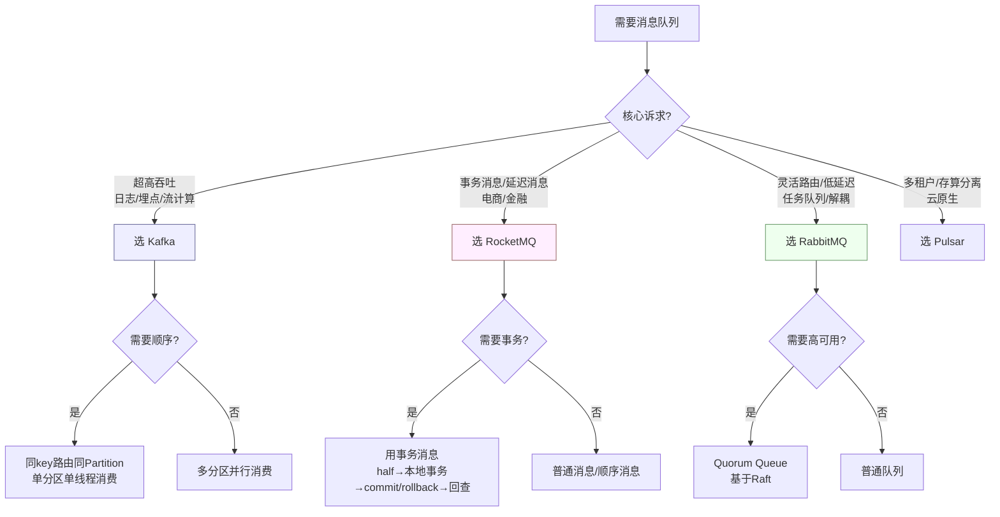

### 四大 MQ 深度对比表

| 维度 | Kafka | RocketMQ | RabbitMQ | Pulsar |
|---|---|---|---|---|
| **开发语言** | Scala/Java | Java | Erlang | Java |
| **存储模型** | Partition 独立 Log | 共享 CommitLog | Erlang DETS/HiPE | 存算分离（BookKeeper） |
| **吞吐量** | 100万+/s | 10万+/s | 万级/s | 10万+/s |
| **延迟** | ms 级 | ms 级 | 微秒~ms | ms 级 |
| **顺序性** | 分区内有序 | 队列有序 | 队列有序 | 分区有序 |
| **事务消息** | 事务API（EOS） | 原生事务消息 | 无 | 支持 |
| **延迟消息** | 不支持（需自研） | 原生支持（18级） | 插件/死信 | 支持 |
| **消息回溯** | 按 offset/time | 按 time/key | 不支持 | 支持 |
| **消息堆积** | 磁盘堆积（TB级） | 磁盘堆积 | 内存限制（堆积后性能下降） | 磁盘堆积 |
| **多租户** | 弱 | 弱 | 中 | 强（原生多租户） |
| **运维复杂度** | 中 | 中 | 低 | 高（依赖 BookKeeper + ZooKeeper） |
| **典型用户** | LinkedIn/字节/美团 | 阿里/滴滴/蚂蚁 | 中小型互联网 | Twitter/Splunk/ StreamNative |

---

## 七、顺序/事务/延迟消息原理与实现

### 顺序消息

```mermaid
flowchart LR
    subgraph 生产端
        P1[消息A: orderId=1001] --> H1[Hash(orderId) % 队列数]
        P2[消息B: orderId=1001] --> H1
        P3[消息C: orderId=1002] --> H2[Hash(orderId) % 队列数]
        H1 --> Q1[队列0: A→B 顺序保证]
        H2 --> Q2[队列1: C]
    end
    subgraph 消费端
        Q1 --> C1[消费者0: 单线程顺序消费 A→B]
        Q2 --> C2[消费者1: 消费 C]
    end
    style H1 fill:#eef,stroke:#669
    style C1 fill:#efe,stroke:#696
```

| 实现 | Kafka | RocketMQ |
|---|---|---|
| 路由方式 | `ProducerRecord` 的 key 决定分区 | `MessageQueueSelector` 选择队列 |
| 消费保证 | 单分区单消费者 | `MessageListenerOrderly`（顺序消费模式） |
| 性能影响 | 全局有序需单分区（牺牲并行） | 局部有序不影响其他队列并行 |
| 坑 | 消费端多线程打乱顺序 | 顺序消费时某条消息卡住阻塞整队列 |

### 事务消息

| 方案 | 原理 | 优点 | 缺点 | 适用场景 |
|---|---|---|---|---|
| RocketMQ 事务消息 | half→本地事务→commit/rollback→回查 | 发送即一致，无扫描延迟 | 强依赖 RocketMQ，回查需幂等 | 强绑 RocketMQ 的交易系统 |
| 本地消息表 | 业务+消息表同库事务→定时扫描投递 | 不依赖 MQ 事务能力，可查可审计 | 秒级延迟，需扫描任务 | 资金/金融系统（要可审计） |
| Kafka 事务 (EOS) | transactional.id + 幂等 + 事务边界 | 精确一次（自身读写） | 跨系统仍需幂等 | Kafka Streams 内部 exactly-once |
| Saga 模式 | 每步有补偿动作，失败时反向补偿 | 适合长流程 | 实现复杂，补偿逻辑多 | 跨服务长流程（如清结算） |

### 延迟消息

| 实现 | 原理 | 精度 | 复杂度 |
|---|---|---|---|
| RocketMQ delayLevel | 18个固定级别（1s/5s/10s/.../2h），消息按级别存入延迟队列，到时间重投 | 级别粒度 | 低（原生支持） |
| RocketMQ 5.x 任意延迟 | 时间轮算法，支持任意时刻延迟 | 毫秒级 | 中 |
| Kafka 时间轮 | 自研时间轮 + 延迟 Topic，到时间投递 | 毫秒级 | 高（需自研） |
| RabbitMQ TTL+DLX | 消息设 TTL，过期变死信转发到目标队列 | 秒级（TTL 精度有限） | 中 |
| Redis ZSet | score=到期时间戳，定时扫描到期消息投递 | 秒级 | 中（需处理重启丢消息） |
| 数据库轮询 | 定时扫 `execute_at <= now()` 的记录 | 分钟级 | 低（最简单但性能差） |

**支付场景延迟消息使用**：
- 下单后 30 分钟未支付 → 自动关单 + 回补库存（RocketMQ delayLevel=14 = 30min）
- 渠道回调超时 → 延迟 5 分钟后主动查询渠道结果（delayLevel=2 = 5s 重试查询）
- 风控审核超时 → 延迟 1 小时后自动放行或升级人工（delayLevel=16 = 1h）

---

## 八、MQ 可靠性投递完整链路图

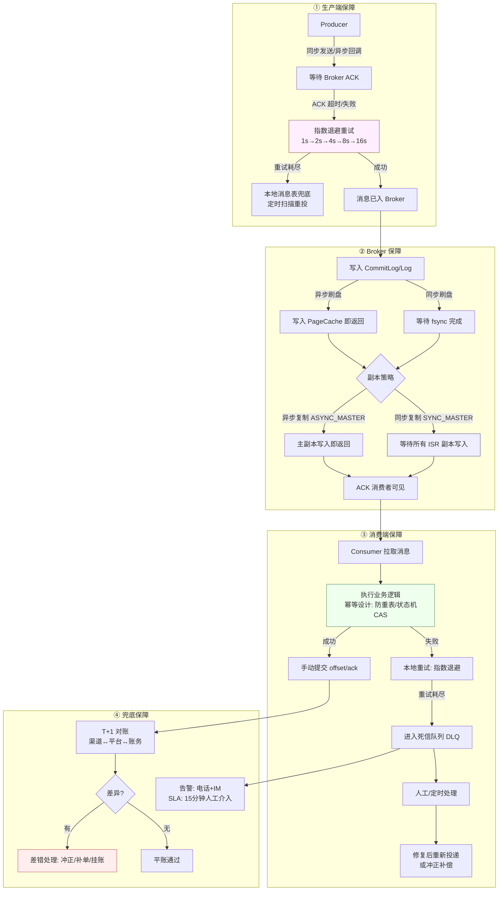

### 可靠性保障配置速查

| 环节 | Kafka 配置 | RocketMQ 配置 | 说明 |
|---|---|---|---|
| 生产确认 | `acks=all` | 同步发送 + `retryTimesWhenSendFailed=3` | 等 ISR 全确认 |
| 幂等生产 | `enable.idempotence=true` | 默认支持（基于 msgId） | 防重试导致重复 |
| 刷盘策略 | `log.flush.interval.messages` | `flushDiskType=SYNC_FLUSH` | 同步刷盘更可靠 |
| 副本同步 | `min.insync.replicas=2` | `brokerRole=SYNC_MASTER` | 至少 2 副本同步 |
| 消费提交 | `enable.auto.commit=false` | `consumeMode=CONSUME_ACTIVELY` | 手动提交 offset |
| 死信处理 | 自建 DLQ Topic | `%DLQ%consumerGroup` | 自动进入死信 Topic |

---

## 九、面试速答模板

### 30 秒版（电梯演讲）

> MQ 三大价值：异步降 RT、解耦减少依赖、削峰保护 DB。选型上吞吐选 Kafka，事务/延迟选 RocketMQ，灵活路由选 RabbitMQ。可靠性靠"生产确认 + 多副本刷盘 + 手动提交 offset + 消费幂等"。我项目里用 MQ + 状态机 + 任务补偿实现支付链路最终一致，0 资损。

### 2 分钟版（技术面）

> 先讲为什么用 MQ（三大价值 + 副作用），再讲选型（Kafka vs RocketMQ vs RabbitMQ），然后讲可靠性三段防护（生产确认 + Broker 副本刷盘 + 消费端手动提交 offset + 幂等），接着讲顺序性（同 key 路由同分区单线程消费）和积压处理（扩消费者/扩分区/临时转投），最后落到项目（XTransfer 任务补偿 + 哈啰 Kafka 心跳补偿）。

### 5 分钟版（系统设计面）

> 在 2 分钟版基础上，展开底层原理（顺序写 + 零拷贝 + PageCache + ISR/HW/LEO）、事务消息（RocketMQ half→本地事务→commit/rollback→回查 vs 本地消息表）、死信/延迟队列实现、rebalance 优化、容量推演（分区数 = 峰值吞吐 / 单分区处理能力），最后画一张完整架构图。

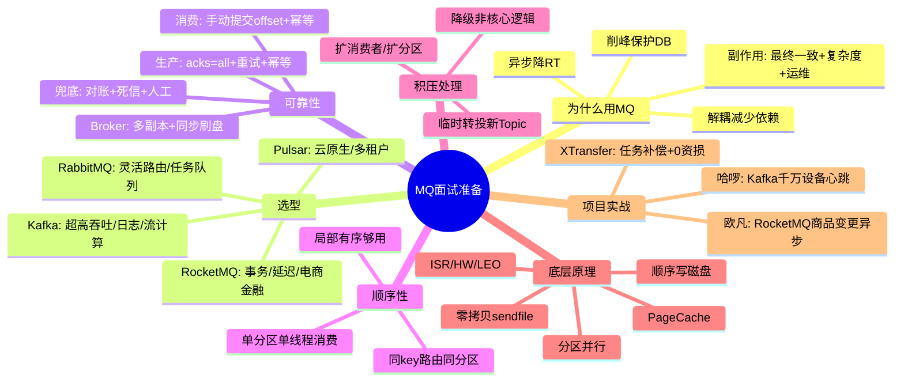

---

*相关阅读*：[分布式事务与一致性](./准备-分布式事务与一致性.md)（本地消息表/Outbox/任务补偿详解）；[RPC 框架与微服务治理](./准备-RPC框架与微服务治理.md)（MQ vs RPC 选型）；[支付系统全链路架构](./准备-支付系统全链路架构.md)（MQ 在支付系统中的角色）；[XTransfer 跨境支付收款平台深度复盘](./准备-XTransfer跨境支付收款平台深度复盘.md)（任务补偿实战）。

<!-- EXPANDED -->
