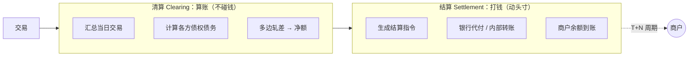
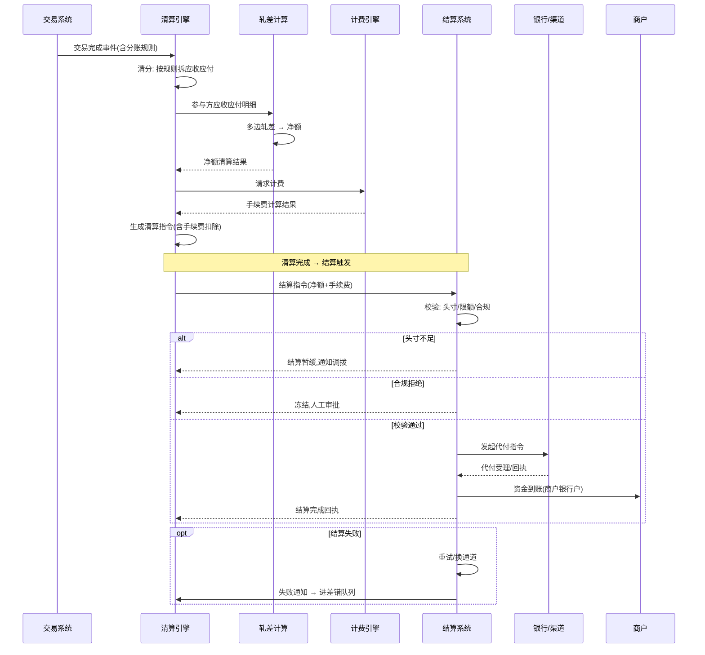
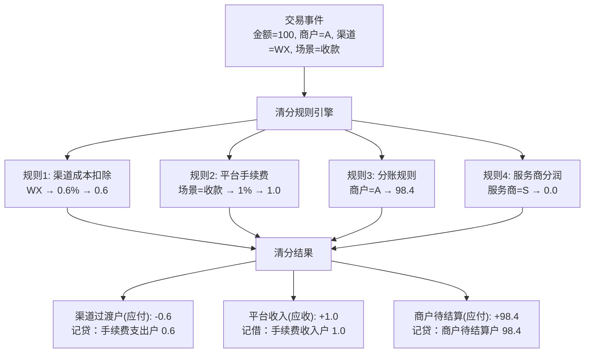
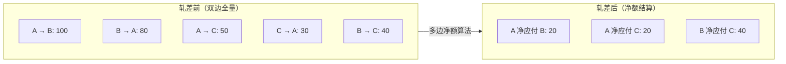
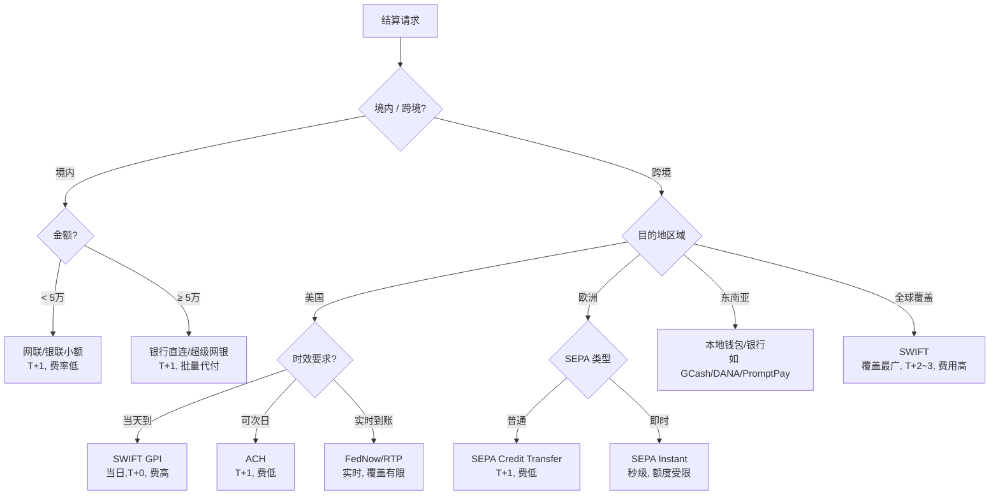
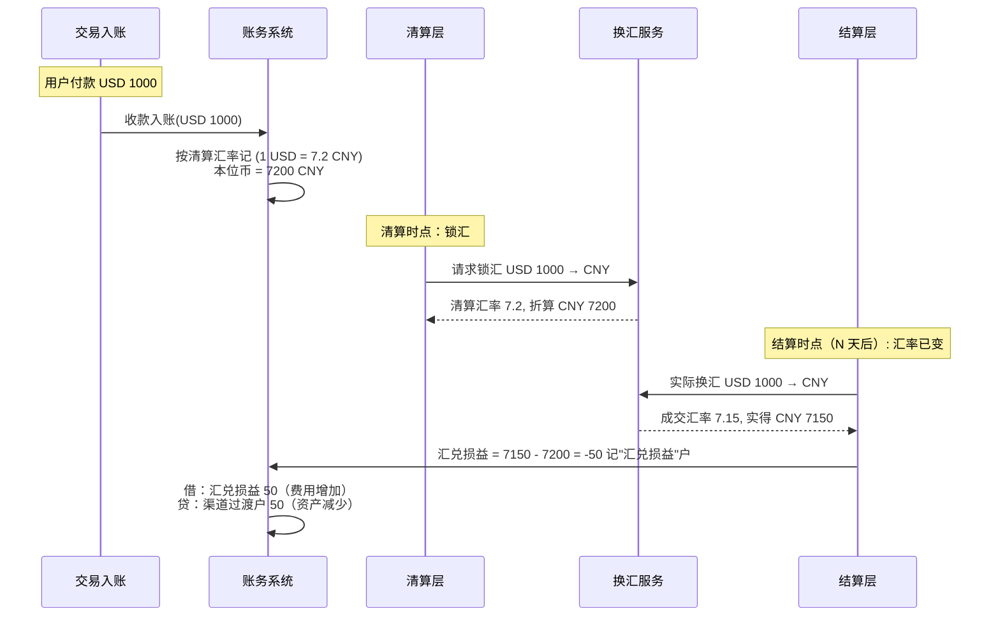

## 1. 清算 vs 结算（面试必考题）

> 一句话：**清算是"算账"（不碰钱），结算是"打钱"（动头寸）**。下面用一张图把两者的边界和先后关系说清。



这是清结算里最容易混淆、也最常被追问的一对概念：

| 维度 | 清算（Clearing） | 结算（Settlement） |
| --- | --- | --- |
| 本质 | **算账**（信息流） | **打钱**（资金流） |
| 做什么 | 计算各方应收应付 | 实际资金转移 |
| 产物 | 清算明细 / 指令 | 资金到账 |
| 时机 | 交易后即时/批量算 | 按周期（T+1 等）执行 |
| 风险 | 算错 | 钱没到账 / 头寸不足 |

一句话：**清算决定「谁该给谁多少」，结算把这笔钱真的转过去**。两者分离是支付风控和监管的基本要求。

### 1.1 清算→结算完整时序图

> 从交易完成到资金到账的端到端链路，每个参与方的动作、状态转换、异常分支。



## 2. 清算流程

```text
交易完成 → 交易清分(按交易拆规则)
  → 生成参与方应收应付(商户/平台/渠道/分账方)
  → 多边净额轧差(互欠的对冲，只结算净额)
  → 产出清算文件/指令
```

- **清分**：按业务规则把一笔交易拆成多条应收应付；
- **轧差（Netting）**：A 欠 B 100、B 欠 A 80，只结算净额 20，减少资金流动和手续费；
- 平台型支付里，清分还涉及**分账规则**（一笔钱分给多个商户/服务商）。

### 2.1 清分规则引擎设计

> 清分是清算的第一步，本质是把"一笔交易"拆成"谁应收多少、谁应付多少"。规则引擎是清分的核心编排器。



**规则引擎设计要点**：

```yaml
# 清分规则配置示例（业务可配置）
clearing_rules:
  - rule_id: "channel_cost"
    priority: 1
    match:
      channel: "WECHAT"
      scene: "PAYMENT"
    action:
      type: "rate_deduction"
      rate: 0.006         # 0.6%
      cap: null           # 无封顶
      floor: 0.01         # 保底 0.01
    output:
      from_account: "merchant_settle"   # 从哪扣
      to_account: "channel_cost"        # 记到哪

  - rule_id: "platform_fee"
    priority: 2
    match:
      scene: "PAYMENT"
    action:
      type: "rate_deduction"
      rate: 0.01          # 1%
    output:
      from_account: "merchant_settle"
      to_account: "platform_revenue"

  - rule_id: "split_to_merchant"
    priority: 99           # 最低优先级, 剩余全部归商户
    action:
      type: "remainder"    # 取剩余
    output:
      to_account: "merchant_settle"
```

```java
// 清分规则引擎核心逻辑
public ClearingResult executeClearing(Trade trade) {
    ClearingContext ctx = new ClearingContext(trade.getAmount());

    // 按优先级执行所有匹配的规则
    for (ClearingRule rule : ruleEngine.match(trade).sortByPriority()) {
        RuleResult result = rule.execute(trade, ctx);
        ctx.apply(result);  // 累加到上下文
    }

    // 校验：所有拆分金额之和 = 原交易金额
    ctx.validateSplitSumEqualsOriginal();

    // 生成应收应付分录
    return ctx.buildClearingEntries();
}
```

### 2.2 多边轧差（Netting）算法详解

> 轧差是清结算提效的数学核心——把 N × (N-1) 条资金流动压缩到 O(N) 条净额结算。



**三种轧差算法对比**：

| 算法 | 描述 | 复杂度 | 适用场景 |
|------|------|--------|----------|
| **双边轧差** | 两两互欠对冲，只算 A vs B 的净额 | O(N²) 简单 | 两方参与 |
| **多边轧差（分散式）** | 所有参与方围成一圈，各自计算净应收/应付 | O(N) | 小规模多方，无中心对手方 |
| **中心对手方（CCCP）** | 所有方向 CCP 轧差，CCP 统一净额结算 | O(N) + CCP 风险 | 交易所/大平台 |

**多边轧差核心算法**：

```java
// 多边轧差：计算每个参与方的净应收/应付
public class MultilateralNetting {
    public Map<String, BigDecimal> calculateNetPosition(
            List<Obligation> obligations) {
        // 参与方 → 净头寸（正=应收，负=应付）
        Map<String, BigDecimal> netPosition = new HashMap<>();

        for (Obligation obl : obligations) {
            // 应付方减少净头寸
            netPosition.merge(obl.getDebtor(),
                obl.getAmount().negate(), BigDecimal::add);
            // 应收方增加净头寸
            netPosition.merge(obl.getCreditor(),
                obl.getAmount(), BigDecimal::add);
        }

        // 校验：全量净头寸之和 = 0（轧差守恒）
        BigDecimal sum = netPosition.values().stream()
            .reduce(BigDecimal.ZERO, BigDecimal::add);
        if (sum.compareTo(BigDecimal.ZERO) != 0) {
            throw new NettingException("轧差不守衡: " + sum);
        }

        return netPosition;
    }
}
```

**轧差的工程约束**：
- **不可跨币种**：USD 和 EUR 不能轧（汇率非固定），先换汇后轧；
- **不可跨会计日**：T 日的应收应付和 T+1 日的不轧（对账隔离）；
- **合规资金隔离**：冻结/争议资金不参与轧差；
- **轧差可追溯**：净额结算后保留原始明细→净额的映射关系，对账用。

## 3. 结算流程与周期

- **结算周期**：T+0（实时，少见/贵）、T+1（次日，主流）、D+1（自然日+1）、按周/月（大商户协议）；
- **结算动作**：按清算指令，从平台备付金/银行头寸划到商户银行户；
- **结算通道**：境内走银行直连 / 网联 / 银联；跨境走 SWIFT / 本地清算网络（如 SEPA、ACH）；
- **结算单**：商户侧生成对账单，供其对账。

### 3.1 结算通道选型决策树

> 结算通道的选择直接影响"成本、到账速度、覆盖范围"——选错通道可能多付 10x 手续费或多等 3 天。



**通道选型关键维度**：

| 维度 | 决策因素 | 示例 |
|------|---------|------|
| **费率模型** | 按笔(flat) vs 按比例(rate) vs 混合 | SWIFT 按笔+A %、ACH 几毛美金 |
| **到账时效** | T+0/T+1/T+N | 大额优选快速通道, 小额容忍慢 |
| **覆盖范围** | 本地清算网络 vs 全球网络 | SEPA 限于欧洲, SWIFT 覆盖 200+ 国家 |
| **额度限制** | 单笔上限/日累计上限 | SEPA Instant 通常限 10 万欧元 |
| **合规要求** | AML/KYC 审查的严格程度 | 制裁国家通道自动排除 |
| **渠道健康度** | 历史成功率/掉单率 | 接入路由自动化开关 |

```python
# 结算通道选型伪代码
def select_settlement_channel(request):
    channels = get_available_channels(request.currency, request.region)

    # 硬过滤：制裁国家/不合规通道直接排除
    channels = filter_compliance(channels, request.merchant)

    # 按优先级排序：金额 + 时效 + 成本
    for channel in channels.sorted_by('priority'):
        if channel.supports_amount(request.amount) \
           and channel.meets_timeline(request.timeline) \
           and channel.is_healthy():  # 渠道健康度 > 阈值
            return channel

    # 降级：放宽时效约束
    return channels.first()  # 保底通道
```

### 3.2 跨境汇率损益的完整处理链路

> 汇率损益是跨境结算的"固定成本"——要做好它，必须从入账到结算全链路追踪汇率变化。



**汇率损益的记账分录**：

```text
# T日 收款入账（按清算时点汇率）
借：渠道过渡户(USD)   1000.00   (资产增加)
  贷：商户待结算(USD)   1000.00   (负债增加)

# 本位币折算（1 USD = 7.2 CNY）
借：渠道过渡户(CNY)   7200.00   (本位币资产)
  贷：商户待结算(CNY)   7200.00   (本位币负债)

# T+N日 实际结算（1 USD = 7.15 CNY，亏损 50）
借：商户待结算(USD)   1000.00   (清偿负债)
  贷：汇兑损益(USD)       6.94   (亏损 = 50/7.2)
  贷：银行存款(USD)     993.06   (实到金额)
```

> 核心原则：**汇率锁定时机要明确、汇兑损益要能逐笔追溯、不能混入普通手续费**——三者缺一，月底一大笔汇损说不清来源。

## 4. 资金归集与分账

- **资金归集**：把分散在各渠道的资金定期归集到平台主账户/备付金户，统一调度；
- **分账（Split）**：一笔交易按协议拆给多方（如平台抽成 + 服务商 + 商户），清分阶段算好、结算阶段分别打款；
- **二清合规**：平台不能「大商户模式」截留资金（二清违规），必须持牌或用合规分账方案（银行/机构存管）。

> 合规点是加分项：能讲「二清风险」「持牌/存管」说明你不只懂技术，懂业务边界。

## 5. 计费与手续费

- 费率模型：按比例（如 0.6%）、按笔、阶梯、封顶/保底；
- 计费在清分阶段计入（平台手续费户），结算时从商户应收中扣除；
- 跨境还有**换汇费、跨境通道费**。

## 6. 差错与调整

- **长款**：渠道多收了钱（渠道账 > 我方账）→ 需退用户/挂账；
- **短款**：渠道少收了钱 → 需补单/追款/调账；
- **汇率损益**：跨境多币种，清算与结算间汇率波动产生汇兑损益，需记账处理；
- 差错统一进 [对账系统](./准备-支付系统全链路架构.md) 的差错队列，调账用红冲/补记。

## 7. 跨境特殊点

- **多币种账户**：各币种独立账务，避免混币；
- **汇率**：收款/结算时锁定汇率或按清算时点，损益入账；
- **合规与风控**：AML/KYC、制裁名单筛查、外汇额度；
- **资金冻结/解冻**：风控或 dispute 时冻结商户待结算户部分余额，结案后解冻或扣划。

## 8. 项目结合（跨境收款）

在 XTransfer：收款成功后进入清结算层，按「商户实收 + 平台手续费 + 渠道成本」清分，跨境部分按清算时点汇率折算本位币并记汇兑损益；结算按商户协议 T+1 通过本地清算网络打款；资金日间归集到主账户保证头寸；任何长短款进对账差错队列，调账走红冲。整体做到「算得清、付得出、对得平」。

---

## 面试高频问答（标准回答）

### Q1：清算和结算到底有什么区别？

**标准回答**：清算是「算账」——计算各方应收应付、做轧差，产出清算指令，是**信息流**；结算是「打钱」——按清算结果把资金从平台户划到商户银行户，是**资金流**。清算决定「谁该给谁多少」，结算执行它。两者分离是风控和监管要求。

**【深度拓展】** 两者分离的深层原因是**风险时点不同**：清算算错，最多是"数字错了"，可重算、可红冲，不碰真钱；结算打错，钱就真的转出去了，追回成本高、还可能违规。所以工程上清算可以批量、异步、允许重算，结算必须强校验、可审计、T+N 受控执行。还有一个常考细节：**清算和结算可能用不同汇率/不同时点**——跨境清算时锁汇、结算时实时汇，差额记汇兑损益。面试官追问"能不能清算完立刻结算（T+0）"——可以但贵且风险高，一般只对高信任大商户协议 T+0，主流是 T+1 给平台留出对账与头寸调度窗口。

**【项目支撑】** XTransfer 收款成功后先进入清算层拆"商户实收+平台手续费+渠道成本"，跨境部分按清算时点汇率折算本位币并记汇兑损益；结算按商户协议 T+1 通过本地清算网络打款。算清和打钱分两阶段，给头寸归集与对账留出窗口，保证"算得清、付得出、对得平"。

### Q2：什么是轧差？为什么要轧差？

**标准回答**：轧差（Netting）是把多方互欠的金额对冲，只结算净额。比如 A 欠 B 100、B 欠 A 80，净额只结算 20。好处是**减少实际资金流动次数和金额**，降低手续费和流动性占用，是清结算层提效的核心手段。

**【深度拓展】** 轧差分"双边轧差"和"多边净额"（中心对手方 CCCP），支付里常见按商户/渠道维度把一天多笔应收应付对冲成净额。但要注意**轧差不能跨不可对冲的边界**：不同币种不能轧（要先换汇）、不同会计日一般也不轧（对账隔离）、合规受限资金不能和自由资金轧。工程上轧差结果必须能追溯到每笔原始清算明细，否则对账时"净额对不上"无法还原。面试官追问"轧差后某笔原始交易要退款怎么办"——退款走冲正，重新参与下一周期轧差，不能从已结算净额里直接扣。

**【项目支撑】** XTransfer 贸易订单关联场景中，一笔入账可能对应多笔贸易背景、多方分账，清算层按商户协议做多边轧差把资金流动降到净额；但跨境多币种严格按币种分别轧差、分别试算平衡，不混币，避免汇率和合规风险。

### Q3：什么是二清？为什么是违规的？

**标准回答**：二清指无牌机构以「大商户」模式截留、二次清算商户资金（先把钱收到自己账户再分给商户），脱离监管、有卷款跑路风险，属违规。合规做法是持牌或接入银行/机构**存管 + 合规分账**，资金不落地平台自有账户。

**【深度拓展】** 二清的本质问题是**资金池脱离持牌监管**——平台既做业务又管钱，有挪用和跑路空间，故监管严禁。合规分账（银行/持牌支付机构存管）的核心是"资金不进平台自有账户，平台只发指令"，资金流和信息流分离、由持牌方执行。工程上合规分账要求：① 每笔资金有清晰"商户归属"（不进大账户混着）；② 分账指令可审计；③ 平台无法单方面转移资金。面试官追问"我有支付牌照还算二清吗"——持牌机构自己做清结算合规，二清特指"无牌"截留；但即便持牌，资金归集也要符合备付金管理要求。

**【项目支撑】** XTransfer 作为持牌跨境收款平台，资金通过合规的渠道过渡户、商户待结算户分层管理，结算由持牌/合规通道执行，平台只做清算指令和分账规则，资金不落地自有账户，从根本上规避二清风险。

### Q4：跨境结算和境内有什么不同？

**标准回答**：多了三件事——**多币种账户**（各币种独立账务）、**汇率**（清算与结算间有汇兑损益，需记账）、**合规**（AML/KYC、制裁筛查、外汇额度）。通道也不同：境内走网联/银联，跨境走 SWIFT 或本地清算网络，结算周期和费用更高。

**【深度拓展】** 跨境真正复杂度在"**合规前置**"和"**时区/会计日切**"。合规不是结算时才检查，而是在收款/入账环节就做 AML/KYC、制裁名单筛查、外汇额度校验（见风控篇资金安全三道防线的事前）。时区差异导致渠道对账文件到达时间不一，会计日切要按渠道时区+本地会计日处理，否则"今天的账"和"渠道的账"对不上。还有"本地清算网络 vs SWIFT"取舍：本地快、便宜但覆盖有限；SWIFT 覆盖广但慢、贵。面试官追问"汇率波动导致结算金额和清算不一致怎么办"——按规则锁汇（清算时点或结算时点），差额记汇兑损益科目，绝不让账不平。

**【项目支撑】** XTransfer 跨境收款对多币种独立建账、分别试算平衡，不混币轧差；汇率损益单独记"汇兑损益"科目；合规筛查（制裁/行业/名单）作为入账前置，不在结算时才补。贸易订单的汇损还会补充回用户，保证结汇一致。

### Q5：长款短款怎么处理？

**标准回答**：长款是渠道多收（渠道账 > 我方账），需退用户或挂暂收户待查；短款是渠道少收，需补单/追款/调账。统一进对账差错队列，处理方式是红冲或补记分录，并触发追因。关键是不掩盖、可追溯、可调平。

**【深度拓展】** 长短款处理第一原则是**先定性责任再动手**：我方 bug（漏记/重记）→ 红冲/补记；渠道延迟（在途款）→ 不急着调，等 T+2 复对；渠道差错 → 发起追款/仲裁；银行端问题 → 走差错工单。最忌"为平账随手调一笔"——那会掩盖真问题、甚至制造资损。工程上差错队列要区分"确定性可自动修复"（明确重复记账→自动冲正）和"不确定性需人工"（渠道少收的责任判定）。面试官追问"长款是我方多钱，是不是赚了"——不是，长款往往是"渠道成功但我方记失败"，钱是商户的，必须挂暂收户待查或补记给商户，私吞即资损+合规问题。

**【项目支撑】** XTransfer 三层对账发现的差错进"任务补偿"体系：漏记由补偿任务自动补记账，超阈值升级人工；跨境按币种+会计日分别对账，汇兑损益单列，保证差异率纳入 SLO、0 资损是底线。

> 清结算是支付里「既考技术又考业务」的硬骨头。清算/结算区分、轧差、二清合规、跨境汇兑——把这些讲顺，支付架构这一关就稳了。

---

## 更多高频追问（补充）

### Q6：清算和结算到底有什么区别？

**考察点**：概念边界，很多人混为一谈。

**标准回答**：**清算（Clearing）**是"算账"——计算各方应收应付、做轧差（Netting），确定"谁该给谁多少钱"，输出的是清算结果（数字）；**结算（Settlement）**是"付钱"——按清算结果实际发起资金划拨，输出的是资金流。顺序是先清后结。举例：一天内 A 付 B 100、B 付 A 30，清算轧差后结论是"A 净付 B 70"，结算只需划一笔 70，减少资金划拨次数和成本。

### Q7：什么是二清？为什么合规上要避免二清？

**标准回答**：二清（二次清算）指没有支付牌照的机构，先把用户资金归集到自己账户，再自行分发给商户——资金脱离持牌机构监管，存在挪用/跑路风险，监管严禁。合规做法是**分账/代付**：资金由持牌机构直接结算到各商户账户，平台只做"指令"不碰资金（如银行/持牌支付公司的分账产品）。跨境场景还要叠加外汇/牌照资质。这题体现你有合规意识，是支付人的必修课。

### Q8：跨境场景的换汇和汇兑损益怎么记账？

**标准回答**：跨境涉及多币种，收款币种和结算币种不同就要换汇。关键点：① **汇率锁定时机**——下单锁汇还是结算时汇，影响风险归属；② **汇兑损益**——实际成交汇率与记账汇率的差额，要单独记"汇兑损益"科目；③ **多币种账户**——按币种分别记账、分别试算平衡，不能混币轧差。XTransfer 跨境收款里换汇和汇兑损益的记账是账务复杂度的核心来源之一。

**【深度拓展】** 汇率锁定时机的选择本质是"**汇损风险归谁**"：下单锁汇 → 平台承担从下单到结算的汇率波动（对商户是确定性），但平台可能亏；结算时汇 → 风险与商户共担或转嫁。工程上要在"记账汇率"和"成交汇率"之间留清晰的损益科目，且损益要能追溯到每笔交易（否则月底一大笔汇损说不清来源）。多币种分别试算平衡还要注意"本位币折算汇率"一致性——同一笔交易在不同报表用不同折算率会平不了。面试官追问"汇损怎么补给用户"——在清算层把汇损作为独立条目补充回用户账户，保证用户结汇金额一致，这也是 XTransfer 的真实做法。

**【项目支撑】** XTransfer 的贸易订单管理系统对"入账涉及的汇率损失提供补充"：清算时按清算时点汇率折算本位币并记汇兑损益，汇损会补充回用户，保证用户资金一致和结汇准确。多币种独立建账、分别试算平衡，不混币，是 0 资损在跨境账务侧的保障。

---

## 延伸阅读（多博主视角 · 系统化补充）

清结算与账务、对账密不可分，配套阅读：

- [支付对账体系与差错处理](/post/准备-支付对账体系与差错处理) — 三层对账、长短款、差错处理（对账是清结算闭环的最后一环）
- [支付系统架构与核心链路全景](/post/准备-支付系统架构与核心链路全景) — 腾讯云清结算架构、热点账户、业务全景十二字
- [账务账户体系与复式记账](/post/准备-账务账户体系与复式记账) · [分布式事务与一致性](/post/准备-分布式事务与一致性) · [支付系统高频面试题集](/post/准备-支付系统高频面试题集)

<!-- EXPANDED -->
