> 无论多高级的岗位，面试都会回归基础。这里把**数据结构 / 算法 / 操作系统 / 数据库 / 设计模式 / 编码字符集**逐节梳理，每节给出**详细内容 + 重点考察点**。这是"地基"，地基不牢，上层再花哨也站不住。

---

## 一、数据结构

> 数据结构是算法的载体。先建立"树状归类"认知：线性、树、图、哈希四大类，每类再细分。面试追问时按这个骨架展开不会乱。

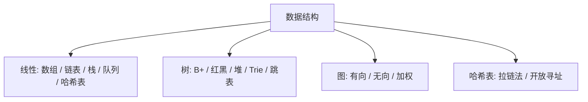

### 1.1 线性结构
- **数组**：连续内存，随机访问 O(1)，插入删除 O(n)，扩容拷贝开销。考察：为什么下标访问快？动态数组扩容（1.5/2 倍）的摊还成本。
- **链表**：离散内存，插入删除 O(1)（已知节点），访问 O(n)。单/双/循环。考察：反转链表、快慢指针判环、相交、归并两个有序链表。
- **栈**：LIFO，应用：函数调用、括号匹配、表达式求值、DFS、撤销。考察：用栈实现队列、最小栈。
- **队列**：FIFO，应用：BFS、缓冲、生产者消费者。双端（Deque）、优先队列（堆）。考察：用队列实现栈、滑动窗口最大值（单调队列）。

### 1.2 哈希表
- **原理**：哈希函数 + 数组；冲突解决：链地址（拉链）、开放寻址（线性/二次探测、再哈希）。
- **负载因子**：冲突概率与空间的权衡（Java 0.75）。
- **考察**：哈希函数设计、冲突解决、为什么 String 适合做 key（不可变 + 缓存 hashCode）、HashMap 扩容（见 Java 篇）。

### 1.3 树
- **二叉树**：遍历（前/中/后序递归+迭代、层序）。
- **二叉搜索树 BST**：左<根<右，查找 O(h)；退化成链 O(n)。
- **平衡树 AVL**：左右子树高差≤1，严格平衡，查找快、插入慢。
- **红黑树**：近似平衡（黑高平衡），插入删除旋转少，Java TreeMap/TreeSet、HashMap 树化、epoll 用它。考察：五大性质、与 AVL 取舍（查找略慢但增删快，适合频繁写）。
- **B 树 / B+ 树**：多路、矮胖，为磁盘设计；B+ 树非叶只存键、叶用链表连，**范围查询友好**，数据库/文件系统索引标配。考察：为什么不用红黑树做索引（树太高、IO 多、范围差）。
  - **【深度拓展 / 项目支撑】** XTransfer 千万级对客结算流程，单表数据量与查询压力都大，索引设计直接决定对账/查询性能：范围统计（按时间/渠道）走 B+ 树叶子链表顺序扫，避免回表靠**覆盖索引**；高频等值查询（按订单号）靠聚簇/唯一索引。哈啰工单表则**按创建时间分表**（分表本质是「横向把 B+ 树拆小」），报表走从库，主库只扛写入和实时查询——分表 + 读写分离都是围绕「磁盘 IO 与索引」做的工程取舍。
- **堆（优先队列）**：完全二叉树，大顶/小顶，插入删除 O(log n)，TopK/中位数/定时任务。考察：堆排序、数据流中位数（双堆）。

### 1.4 图
- **表示**：邻接矩阵（稠密）、邻接表（稀疏）。
- **遍历**：DFS（栈/递归）、BFS（队列）。
- **最短路**：Dijkstra（非负权，优先队列 O(E log V)）、Bellman-Ford（可负权，判负环）、Floyd（多源）。
- **最小生成树**：Prim、Kruskal（并查集）。
- **拓扑排序**： Kahn（入度）、DFS；判有向无环（DAG）。应用：依赖编译、渠道路由顺序。
- **并查集**：路径压缩 + 按秩合并，近 O(1)；连通分量、Kruskal。
- **考察**：Dijkstra 为什么不能负权？拓扑排序怎么判环？

### 1.5 跳表（Skip List）
- **原理**：有序链表加多层索引，查找 O(log n)，Redis ZSet 底层。考察：和红黑树比（实现简单、并发友好、范围好）。
  - **【深度拓展 / 项目支撑】** 欧凡直播电商用 **Redis Sorted Sets（跳表）** 做「基于时间与分数的排行榜」，`ZADD` 按综合分写入、`ZINCRBY` 原子自增、`ZREVRANGE` 取 Top N，每日结算后按名次发券——这正是跳表「范围好、并发友好」的落地。相比红黑树，跳表插入只需改相邻层指针、且天然支持区间扫描，适合排行榜「取前 N + 分数区间」的场景。

**重点考察点汇总**：各结构**时间复杂度**（必背）、**工程取舍**（内存/性能/实现难度）、**Java/Redis 里的实现**、**典型算法题映射**。

---

## 二、算法基础

### 2.1 复杂度
- **大 O**：渐进上界，忽略常数与低阶；常见 O(1)/O(log n)/O(n)/O(n log n)/O(n²)/O(2ⁿ)。
- **空间复杂度**：额外空间。
- **摊还分析**：动态数组扩容、动态扩容哈希。
- **考察**：手写复杂度（二分、快排、堆排、BFS）；递归复杂度（主定理粗略判断）。

### 2.2 递归与分治
- **递归**：终止条件、递推关系、栈深度（可能栈溢出→改迭代/尾递归）。
- **分治**：拆子问题（归并排序、快排、最近点对）。
- **考察**：递归转迭代、递归爆栈怎么办。

### 2.3 排序（必背）
| 排序 | 平均 | 最坏 | 空间 | 稳定 | 特点 |
| --- | --- | --- | --- | --- | --- |
| 冒泡 | O(n²) | O(n²) | O(1) | 稳定 | 教学 |
| 插入 | O(n²) | O(n²) | O(1) | 稳定 | 小数据/近乎有序 |
| 选择 | O(n²) | O(n²) | O(1) | 不稳定 | |
| 快排 | O(n log n) | O(n²) | O(log n) | 不稳定 | 随机基准防退化 |
| 归并 | O(n log n) | O(n log n) | O(n) | 稳定 | 外部排序 |
| 堆排 | O(n log n) | O(n log n) | O(1) | 不稳定 | TopK |
| 计数/桶/基数 | O(n+k) | | O(n+k) | 稳定 | 整数/范围有限 |

- **考察**：快排为什么最坏 O(n²)（已排序+固定基准）→ 随机/三数取中；稳定性含义与用处；归并和快排适用（归并可外部、稳定；快排内存小、缓存友好）。

### 2.4 查找
- 顺序 O(n)、二分 O(log n)（有序、边界：找第一个/最后一个等于、找插入位）、哈希 O(1)、二叉搜索树 O(h)。
- **考察**：二分写法（循环不变量）、整数溢出（mid = l + (r-l)/2）、四种变形。

### 2.5 贪心 / DP / 回溯
- **贪心**：每步局部最优（区间调度、哈夫曼、Dijkstra）；需证最优子结构与贪心选择性。
- **DP**：重叠子问题 + 最优子结构；状态定义是关键（背包、最长上升子序列、编辑距离、股票系列、正则匹配）。考察：状态转移怎么想、空间优化（滚动数组）。
- **回溯**：DFS + 撤销选择（子集、全排列、N 皇后、组合总和）。考察：剪枝、去重（排序+used）。

**重点考察点**：DP 状态设计（面试官看你能不能把问题抽象成状态）、回溯去重、二分边界、复杂度口算。

---

## 三、操作系统

### 3.1 进程 / 线程 / 协程
- **进程**：资源分配单位，独立地址空间，切换开销大（保存页表/寄存器）。
- **线程**：CPU 调度单位，同进程共享内存，切换只保存寄存器/栈，开销小；共享带来竞态。
- **协程（goroutine/虚拟线程）**：用户态，轻量，切换在用户态（无内核陷入），海量并发。
- **考察**：进程线程区别？上下文切换成本（进程换页表 TLB 刷，线程不换地址空间）？协程为什么快？
  - **【深度拓展 / 项目支撑】** 高并发服务端本质在「减少阻塞等待」：欧凡直播电商用 **Redis + Lua 原子扣减**挡住库存并发竞争，哈啰用 **Kafka 消费千万 IOT 设备心跳**做异步解耦——都是把「同步阻塞」换成「事件驱动/消息驱动」。Java 21 虚拟线程把「每请求一线程」的成本打到接近协程，是未来高并发服务的演进方向；但支付核心链路我更看重「确定性 + 可观测」，不会为并发而并发。

### 3.2 内存管理
- **虚拟内存**：每个进程独立地址空间，MMU 映射物理页；好处：隔离、扩容量（换页）、共享库。
- **分页**：固定大小页（4KB），页表 + TLB（快表）加速；多级页表省空间。
- **分段**：按逻辑段（代码/数据/堆/栈），可变长。
- **缺页中断**：访问未映射页→内核调页（从磁盘读入）；**颠簸/抖动**：频繁缺页，性能骤降（调小并发或加内存）。
- **考察**：虚拟内存干嘛？TLB 干嘛？分页 vs 分段？大页（HugePage）为什么快（TLB 命中高）？

### 3.3 页面置换算法
- **OPT**（理想，往后看）、**FIFO**（可能 Belady 异常）、**LRU**（最近最少，近似实现：时钟/CLOCK）、**LFU**。
- **考察**：LRU 怎么实现（哈希+双向链表，O(1)）、为什么 LRU 不是最优、CLOCK 原理。

### 3.4 死锁
- **四必要条件**：互斥、占有并等待、不可剥夺、循环等待。
- **处理**：预防（破坏任一条件，如一次性申请全部资源/可剥夺/顺序加锁）、避免（银行家算法）、检测+解除（剥夺/回滚）。
- **考察**：银行家算法干嘛？怎么预防（资源按顺序申请最常用，如数据库锁按 id 升序）？死锁 vs 活锁（一直让）？

### 3.5 进程调度
- **批处理**：FCFS、SJF（短作业优先）。
- **交互**：时间片轮转（RR）、优先级（饥饿→老化提权）、多级反馈队列（MLFQ，自动调优先级，兼顾响应与吞吐）。
- **考察**：多级反馈队列为什么好（IO 密集型短任务优先、CPU 密集降级）？

### 3.6 I/O 模型
- **阻塞/非阻塞**（等数据就绪）、**同步/异步**（等数据复制由谁做：同步自己拷、异步内核拷完通知）。
- 组合：BIO（同步阻塞）、NIO（同步非阻塞，多路复用 select/poll/epoll）、AIO（异步）。
- **考察**：五种 I/O 模型？epoll 为什么高效（见术语篇/网络篇）？同步≠阻塞。

#### I/O 模型 Mermaid 对比图

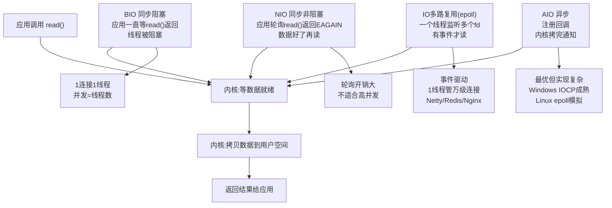

**epoll 为什么高效**：
- **select/poll 缺点**：每次调用要传所有 fd 列表给内核，内核线性扫描所有 fd，O(n) 复杂度；fd 上限（select 默认 1024）。
- **epoll 优势**：① `epoll_ctl` 注册时把 fd 挂到内核红黑树（注册 O(1)）；② `epoll_wait` 只返回"有事件"的 fd（就绪列表），O(1) 复杂度；③ 支持 ET（边缘触发，只通知一次）和 LT（水平触发，只要有数据就通知）。
- **Reactor 模式**：基于 epoll 的事件驱动模型——主线程监听 accept，有新连接时把 socket fd 注册到 epoll，工作线程从就绪队列取事件处理。Netty/Redis/Nginx 都用 Reactor。

**【面试官追问】**
- "BIO 和 NIO 的本质区别？" → BIO 等"数据就绪+数据拷贝"都阻塞线程；NIO "数据就绪"不阻塞（返回 EAGAIN），但"数据拷贝"仍需应用自己做（同步）。
- "epoll 的 ET 和 LT 模式区别？" → LT 只要有数据就一直通知（容易触发但不会漏）；ET 只在状态变化时通知一次（高效但必须读完，否则下次不通知）。Netty 默认用 LT（更安全），Nginx 用 ET（更高效）。
- "为什么 Redis 单线程能扛高并发？" → Redis 是 IO 多路复用（epoll）+ 内存操作，单线程避免了锁竞争，瓶颈在内存和网络带宽而非 CPU。

#### 进程状态转换图

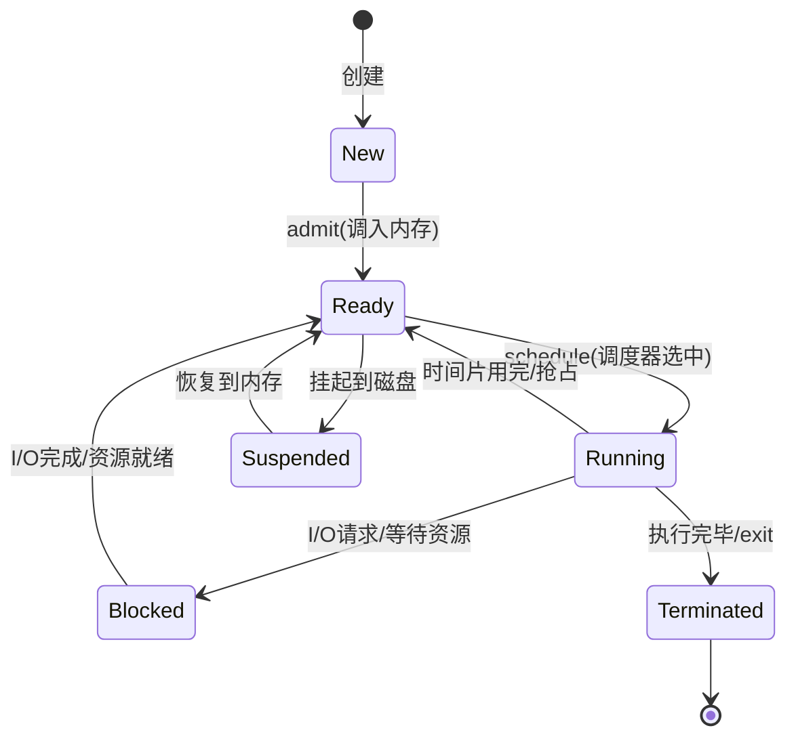

**进程调度策略对比**：

| 策略 | 原理 | 优点 | 缺点 | 适用 |
| --- | --- | --- | --- | --- |
| FCFS | 先来先服务 | 简单公平 | 短任务等长任务 | 批处理 |
| SJF | 最短作业优先 | 平均等待最短 | 可能饥饿 | 批处理 |
| RR | 时间片轮转 | 公平响应 | 上下文切换开销 | 交互式 |
| 优先级 | 按优先级 | 重要先做 | 低优先级饥饿 | 实时系统 |
| MLFQ | 多级反馈队列 | 兼顾响应与吞吐 | 参数复杂 | 通用OS |

**【深度拓展】虚拟内存工作原理**

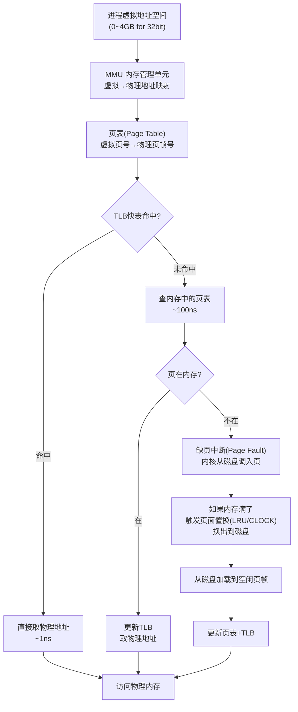

**【面试官追问】**
- "为什么需要虚拟内存？" → ① 进程隔离（每个进程有独立地址空间，互不干扰）；② 扩展可用内存（不常用页换出到磁盘，内存够用更多进程）；③ 共享库（多个进程共享同一份代码页）。
- "TLB 命中率为什么重要？" → TLB miss 要查内存中的页表（~100ns），TLB hit 只需 ~1ns。命中率从 99% 降到 90% 性能差好几倍。大页（HugePage 2MB）让一个 TLB 表项映射更多内存，提高命中率。
- "什么是颠簸（Thrashing）？" → 进程频繁缺页，CPU 大部分时间在换页而非执行。根因是物理内存不足 + 并发进程过多。解法：加内存或降低并发度。

### 3.7 其他
- **中断与系统调用**：用户态→内核态（中断/ syscall/异常），成本（上下文+TLB）。
- **信号**：异步通知（SIGKILL 不可捕获、SIGTERM 可捕获优雅退出）。
- **考察**：用户态内核态切换成本？为什么频繁 syscall 慢？

---

## 四、数据库（以 MySQL/InnoDB 为主）

### 4.1 索引
- **B+ 树**（见数据结构）：聚簇 vs 非聚簇、回表、覆盖索引、最左前缀、索引下推（ICP）、联合索引顺序（区分度高的在前/范围列放最后）。
- **哈希索引**：Memory 引擎，等值快无序。
- **自适应哈希**（InnoDB 对热点页自动建）。
- **考察**：为什么联合索引要最左前缀？覆盖索引怎么省 IO？索引越多越好吗（写放大、选错）？

### 4.2 事务与隔离
- **ACID**：原子（undo）、一致（约束+应用）、隔离（锁+MVCC）、持久（redo）。
- **隔离级别**：读未提交（脏读）、读已提交（不可重复读）、可重复读（InnoDB 默认，快照读防幻读）、串行化（锁表）。
- **MVCC**：undo log 版本链 + ReadView，RC 每次读新 View、RR 首次读建 View。快照读（普通 SELECT）免锁，当前读（SELECT ... FOR UPDATE / 写）走锁。
- **考察**：RR 怎么防幻读（Next-Key Lock + 快照）？MVCC 能完全防幻读吗（当前读仍靠锁）？

### 4.3 锁
- **行锁/表锁**：InnoDB 行锁（锁索引），无索引则升级表锁。
- **间隙锁/Next-Key**：RR 防幻读，锁记录+间隙。
- **意向锁**：表级，标识"行上有锁"，协调表锁与行锁。
- **死锁**：两个事务交叉持锁；InnoDB 检测+回滚代价小者。考察：怎么避免（按固定顺序加锁、缩短事务、降低隔离）。
  - **【深度拓展 / 项目支撑】** 死锁「循环等待」的破坏在支付里是硬要求：XTransfer 转账/结算跨账户时，**统一按账户 id 升序加锁**（A→B 和 B→A 同时发生也先锁小 id），从根上消除循环等待；再配合缩短事务（状态机只改必要字段）、锁等待超时 + InnoDB 死锁检测兜底。这也呼应本文第七节「死锁四条件，怎么在支付里避免」的回答——理论和项目要能对上。

### 4.4 日志
- **redo log**：物理日志，崩溃恢复（WAL，先写日志再改页），循环写，保证持久性。
- **undo log**：逻辑回滚、MVCC 版本链。
- **binlog**：server 层，逻辑日志，主从复制、归档；与 redo 两阶段提交保证主从一致。
- **考察**：WAL 干嘛？两阶段提交（prepare→写 binlog→commit）？崩溃恢复怎么用 redo+binlog 对齐？
  - **【深度拓展 / 项目支撑】** binlog 不只是主从复制：**欧凡**用 Canal 订阅 binlog 做「缓存最终一致」的兜底（DB 改了，binlog 流触发删/更新 Redis 与 Caffeine），和我博客里「延迟双写 + binlog 订阅」的缓存一致性方案一致；**携程**数据平台用埋点/业务数据进 Kafka 再落数仓，思路和「把变更当事件流」同源。WAL 的「先写日志再改页」也是 XTransfer 资金「不可变流水 + 可重放」的思想基础——出问题能靠日志回溯到一致态。

### 4.5 SQL 与优化
- **执行顺序**：FROM→JOIN→WHERE→GROUP→HAVING→SELECT→ORDER→LIMIT。
- **慢 SQL 优化**：EXPLAIN 看 type/key/rows/Extra；避免 SELECT *、函数包裹列、隐式类型转换（索引失效）；分页深翻（游标/延迟关联）；JOIN 驱动表选择。
- **分库分表**：垂直（按业务拆、字段拆）、水平（按 id/时间/地域 hash）；问题：跨片查询/分布式事务/全局 ID（雪花）/扩容。
- **考察**：EXPLAIN 各字段含义？深分页怎么优化？分库后怎么查（基因法/冗余/ES）？
  - **【深度拓展 / 项目支撑】** 哈啰工单表就是**按创建时间水平分表**的真实案例：绝大多数查询带时间范围，天然落到分片；少量按车辆 ID 的查询走**异构索引表（车辆 ID → 时间分片）或 ES**，冷数据进数仓（Hive）减轻 OLTP。XTransfer 的 VA 开户/收款也面临「100+ 渠道、单表膨胀」，靠「渠道差异配置化 + 分表 + 读写分离」组合拳。深分页用「延迟关联/游标」而非 `LIMIT offset, n`——offset 大时 MySQL 要扫很多行再丢，性能塌方。

### 4.6 范式与反范式
- **三范式**：列原子、主键依赖、无传递依赖。反范式（冗余）为性能（读多写少、报表）。考察：为什么要冗余（避免 JOIN、提速）？

---

## 五、设计模式（23 种核心 + 应用）

> 23 种模式按"创建 / 结构 / 行为"三类记最稳。下面一张图做归类锚点，面试被问"用过哪些模式"时按图索骥。

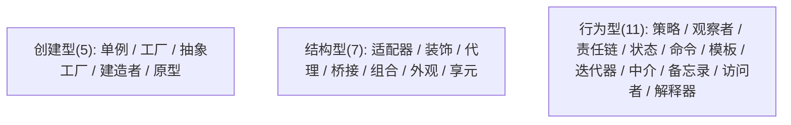

### 5.1 创建型
- **单例**：私有构造 + 静态实例；**DCL + volatile**（防指令重排半初始化）；枚举单例（防反射/序列化，最佳）。考察：为什么 DCL 要 volatile？
- **工厂方法 / 抽象工厂**：解耦创建；Spring BeanFactory。
- **建造者 Builder**：复杂对象分步构建（StringBuilder、OkHttp、Stream）。
- **原型**：克隆（深浅拷贝）。

### 5.2 结构型
- **代理**：控制访问（Spring AOP、RPC 客户端、MyBatis Mapper）。考察：静态 vs 动态代理。
- **适配器**：接口转换（旧系统对接、InputStreamReader）。
- **装饰器**：动态加职责（Java IO 套娃、Collections.synchronizedList）。
- **桥接**：抽象与实现分离（多维度变化）。
- **外观 Facade**：统一入口（对外 API 网关）。
- **组合**：树形结构（菜单、DOM）。
- **享元 Flyweight**：共享细粒度对象（Integer 缓存 -128~127、字符串池、连接池）。

### 5.3 行为型
- **策略**：算法族可替换（排序/压缩/渠道路由策略）。考察：和 if-else 比（开闭原则）。
- **观察者**：一对多通知（Spring 事件、MQ、GUI）。考察：同步 vs 异步观察者。
- **模板方法**：骨架固定、步骤延迟（JDBCTemplate、HttpServlet.service）。
- **责任链**：链式处理（Servlet Filter、Netty Pipeline、风控规则链）。
- **状态**：状态驱动行为（支付单状态机、订单流转）。考察：和策略区别（状态自转换）。
- **命令**：请求封装（Undo、MQ 消息）。
- **迭代器/中介者/访问者/备忘录/解释器**：了解即可。

### 5.4 在框架中的落地（考察重点）
- Spring：工厂（BeanFactory）、单例（默认 scope）、代理（AOP）、模板（JdbcTemplate）、观察者（事件）、责任链（拦截器/Filter）、适配器（HandlerAdapter）。
- JDK：装饰器（IO）、享元（Integer 缓存）、迭代器（Collection）、动态代理（Proxy）。
- 支付项目：策略（渠道路由）、状态（支付单生命周期）、责任链（风控/校验）、建造者（请求组装）。
  - **【深度拓展 / 项目支撑】** 支付项目里模式是「为了解决真实痛点」而非炫技：
    - **状态模式 → 支付单/风控子状态机**：资金流转有强约束（不能从「已结算」跳回「已预收」），用状态机把「合法迁移」显式建模，非法跳转直接拒绝——这是资金安全的第一道闸（XTransfer 主状态机 + 风控独立子状态机）。
    - **策略 / SPI → 渠道路由与收款产品接入**：XTransfer 用 **SPI** 比策略模式更彻底——连「注册」都自动发现（Java SPI 的 `META-INF/services`），新增 VA/收单/A2A/电商产品只加实现类、零改核心，符合开闭原则；欧凡活动系统用策略模式支持多款活动游戏，同源思路。
    - **责任链 → 风控/校验规则链**：哈啰工单用 aviator 规则引擎把「生成/有效性规则」配置化，本质也是一条可编排的规则责任链；XTransfer 风控多阶段（免关联→关联→渠道调单）由独立子状态机驱动，各阶段内部是一串校验动作。
    - 关键话术：**模式服务于「开闭/单一职责/可演进」，讲不清为什么用这个模式就别说**——面试官看的是「问题→模式→收益」的闭环，不是背 23 种名字。

**考察点**：别只背定义，要能说"在哪个框架/项目里见过、怎么用、为什么用这个模式"。

### 5.5 设计模式 23 种速查表

| # | 类型 | 模式 | 一句话 | 框架落地 |
| --- | --- | --- | --- | --- |
| 1 | 创建 | **单例** | 全局唯一实例 | Spring Bean(默认) |
| 2 | 创建 | **工厂方法** | 子类决定创建哪个对象 | Spring BeanFactory |
| 3 | 创建 | **抽象工厂** | 创建一系列相关对象 | 跨数据库的DAO工厂 |
| 4 | 创建 | **建造者** | 分步构建复杂对象 | StringBuilder/OkHttp |
| 5 | 创建 | **原型** | 克隆已有对象 | Java Cloneable |
| 6 | 结构 | **适配器** | 接口转换 | InputStreamReader |
| 7 | 结构 | **桥接** | 抽象与实现分离 | JDBC Driver |
| 8 | 结构 | **组合** | 树形结构统一 | DOM/菜单树 |
| 9 | 结构 | **装饰器** | 动态加职责 | Java IO/FilterInputStream |
| 10 | 结构 | **外观** | 统一入口 | API Gateway |
| 11 | 结构 | **享元** | 共享细粒度对象 | Integer缓存/连接池 |
| 12 | 结构 | **代理** | 控制访问 | Spring AOP/MyBatis Mapper |
| 13 | 行为 | **责任链** | 链式处理 | Servlet Filter/Netty Pipeline |
| 14 | 行为 | **命令** | 请求封装为对象 | Runnable/Undo |
| 15 | 行为 | **解释器** | 语言解释 | 正则引擎/SpEL |
| 16 | 行为 | **迭代器** | 遍历不暴露内部 | Collection.iterator() |
| 17 | 行为 | **中介者** | 对象间通信中介 | 消息中间件 |
| 18 | 行为 | **备忘录** | 保存恢复状态 | Serializable/快照 |
| 19 | 行为 | **观察者** | 一对多通知 | Spring事件/MQ |
| 20 | 行为 | **状态** | 状态驱动行为 | 支付单状态机 |
| 21 | 行为 | **策略** | 算法族可替换 | 渠道路由策略 |
| 22 | 行为 | **模板方法** | 骨架固定步骤可变 | JdbcTemplate/HttpServlet |
| 23 | 行为 | **访问者** | 双分派 | ASM字节码访问 |

**设计模式关系图**：

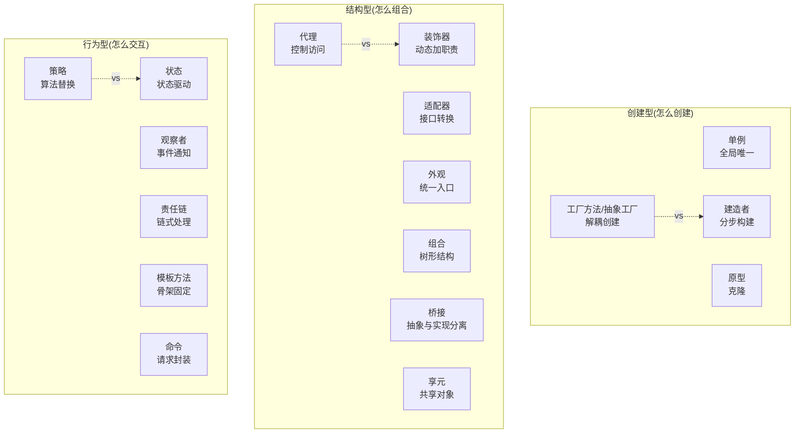

**易混淆模式对比**：
- **策略 vs 状态**：策略由客户端选择算法（无状态切换）；状态是对象自己根据当前状态决定行为（状态自转换）。策略像"切换工具"，状态像"机器自动换档"。
- **代理 vs 装饰器**：代理控制访问（如权限/缓存）；装饰器增强功能（如IO套娃）。结构相同但意图不同。
- **工厂 vs 建造者**：工厂一步创建对象（`create(type)`）；建造者分步构建（`builder.a().b().build()`），适合复杂对象。

**【面试官追问】**
- "你在项目里用过哪些设计模式？" → 至少说3个且有真实场景：策略（渠道路由）、状态（支付单生命周期）、责任链（风控校验链）。不要背"我用了23种"。
- "策略模式和 if-else 有什么区别？" → 策略把每个分支封装成独立类，符合开闭原则（新增策略不改调用方）；if-else 每次新增分支都要改原代码。
- "Spring 用了哪些设计模式？" → 工厂（BeanFactory）、单例（默认scope）、代理（AOP）、模板方法（JdbcTemplate）、观察者（ApplicationEvent）、责任链（Interceptor/Filter链）、适配器（HandlerAdapter）。

---

## 六、编码、字符集与杂项

### 6.1 字符编码
- **ASCII**（1B）、**Unicode**（码点，非编码）、**UTF-8**（变长 1~4B，兼容 ASCII，中文 3B）、**UTF-16**（Java char 内部）、**GBK**（中文 2B，旧系统）。
- **坑**：UTF-8 中文 3 字节、emoji 4 字节（MySQL utf8mb4 才支持）；乱码多是编解码不一致。
- **考察**：UTF-8 为什么省空间？为什么要 utf8mb4？大小端（BOM）？

### 6.2 浮点与精度
- **float/double**：IEEE-754，二进制无法精确表示十进制小数（0.1+0.2≠0.3）。
- **BigDecimal**：金融必用，用 String 构造避免精度丢失，指定 RoundingMode、scale。
- **考察**：为什么金额不能用 double？BigDecimal 怎么构造（new BigDecimal("0.1") 而非 0.1）？
  - **【深度拓展 / 项目支撑】** 金额精确是支付系统的命根：XTransfer 千万级结算全程用 BigDecimal（或数据库 decimal）做金额运算，且入账涉及换汇要核算**汇率损失**并补偿回用户，保证「用户资金一致」。哈啰薪资系统算薪也要精确到分、规则变更可复核。踩过的坑：除法不指定 scale/RoundingMode 会抛 `ArithmeticException`；跨系统传递金额用「最小货币单位整数（分）」比浮点/BigDecimal 字符串更防错；展示层再格式化为币种符号。

### 6.3 时间与时区
- **UTC / 时间戳（epoch）**：存储用 UTC 时间戳或 ISO8601+时区；展示按用户时区转。
- **坑**：服务器时区不一致、夏令时、跨年跨月边界。
- **考察**：国际化系统时间怎么存（UTC）？Java 8 时间 API（Instant/LocalDateTime/ZonedDateTime）？
  - **【深度拓展 / 项目支撑】** 多时区是跨境支付的硬约束：XTransfer 收付款跨多国，存储统一 **UTC 时间戳 / ISO8601+时区**，展示按用户/业务时区转换，对账截止按业务时区（如渠道本地 T+1）。欧凡海外直播电商同样面对「多时区 + 多语言 + 多币种」：时间存 UTC、文案外置资源包按 locale 加载、金额与币种成对存储并记汇兑损益。携程运营大屏也要按时区正确聚合，否则「日活」口径会错——这正是它「口径统一、数据质量」要解决的。

### 6.4 位运算
- 与&、或|、异或^（交换/去重）、取反~、移位<< >>。
- **应用**：权限位掩码、布隆过滤器、哈希扰动、状态压缩。
- **考察**：n & (n-1) 干嘛（去最低位1，判 2 的幂）？a ^ b ^ a = b（找单数）？

### 6.5 序列化
- **JDK Serializable**（重、慢、版本 UID）、**JSON**（可读、跨语言、体积大）、**Protobuf/Thrift**（二进制、快、强 schema）、**Hessian**（RPC 常用）。
- **考察**：为什么 RPC 用 Protobuf 不用 JSON（体积/速度）？兼容性（加字段不改 tag）？

---

## 七、面试高频问答（标准回答）

**Q：数据结构这么多，面试最该背熟哪些复杂度？**
> 考察点：是否抓重点。思路：数组/链表/栈/队列/哈希 O(1) 操作；BST/堆 O(log n)；图遍历 O(V+E)；排序 O(n log n)；DP 看状态维数。重点不在背，在能根据场景选结构并说清取舍（如"排行榜用堆/跳表，范围查询用 B+ 树"）。

**Q：进程和线程到底差在哪，开销差在哪？**
> 思路：进程独立地址空间、线程共享；切换时进程要切页表（刷 TLB、可能缺页），线程只切寄存器+栈，所以线程切换便宜得多；但线程共享内存带来同步问题。延伸到协程（用户态、更便宜）。

**Q：为什么索引用 B+ 树不用哈希/红黑树？**
> 思路：哈希只能等值、不能范围、哈希冲突；红黑树二叉、树高 log 但每个节点只占一条、范围查询要中序遍历且缓存不友好；B+ 树多路、矮、叶子链表、范围查询一条链扫完、非叶不存数据→单页能放更多键→IO 少。数据库瓶颈在磁盘 IO，所以选 B+。

**Q：死锁四条件，怎么在支付里避免？**
> 思路：破坏"循环等待"最实用——**所有事务按固定顺序加锁**（如按账户 id 升序），或缩短事务、降低隔离级别、设置锁等待超时 + 死锁检测。结合"转账 A→B 和 B→A 同时发生时，统一先锁小 id 账户"。

**Q：设计模式怎么学才不像背八股？**
> 思路：① 按"问题→方案→框架实例"记（如"创建对象复杂→Builder，见 OkHttp"）；② 面试讲自己项目用的（渠道路由=策略、支付单=状态、风控=责任链）；③ 强调"为开闭/单一职责服务"，不是为用而用。

**Q：为什么金额要用 BigDecimal 不用 double？**
> 思路：double 是二进制浮点，0.1 无法精确表示，累加误差放大；金融必须精确→BigDecimal（十进制、可设精度与舍入）；构造用字符串避免 new BigDecimal(0.1) 把已损精度带进去；除法要指定 scale 和 RoundingMode 否则抛异常。

---

## 八、更多高频追问（补充）

**Q：数组和链表的区别？为什么 ArrayList 大多比 LinkedList 快？**
> 数组内存连续、随机访问 O(1)、CPU 缓存友好，插入删除 O(n)；链表插入删除 O(1)（已知位置）、随机访问 O(n)、有指针开销、缓存不友好。实践中 ArrayList 90% 场景更快，因为**缓存局部性**碾压了链表的理论优势；只有频繁在头部/中间增删且不随机访问时 LinkedList 才有优势。

**Q：HashMap 链表什么时候转红黑树？为什么不直接用红黑树？**
> 链表长度 ≥8 **且** 数组容量 ≥64 才转红黑树（否则优先扩容），退化到 6 转回链表。不直接用树是因为：数据量小时链表更省内存、插入更快；红黑树是弱平衡（插删最多 3 次旋转），比 AVL 写更快，只有极端哈希冲突时才需要 O(log n) 兜底。

**Q：常见排序算法的稳定性和复杂度？快排为什么快？**
> 快排/堆排/希尔**不稳定**，归并/插入/冒泡**稳定**。快排平均 O(n log n)、原地、常数小、缓存友好，所以工程默认（Java 对象排序用稳定的 TimSort=归并+插入，基本类型用双轴快排）。快排最坏 O(n²)（已排序 + 固定基准），用随机基准/三数取中规避。

**Q：数据库三大范式是什么？为什么支付/电商常反范式？**
> 1NF 字段原子；2NF 消除部分依赖；3NF 消除传递依赖。反范式（冗余字段/快照）是为减少 join、提升读性能，如订单表冗余商品名和价格快照（商品改价不影响历史订单），代价是写时维护一致性。OLTP 偏范式，读多/报表场景常反范式。

**【深度拓展 / 项目支撑】** 反范式在支付/电商里是「正确性 + 可追溯」的需要，不是偷懒：XTransfer 贸易订单/额度用**流水式处理（只增不减、不可变快照）**，像账务流水一样可追溯，避免「当前状态被覆盖后查不到历史」；哈啰薪资计算**保存计算时的规则和输入快照**，便于申诉追溯——都是「写时冗余一份当时真相」。欧凡订单冗余商品快照同理。代价是「快照与源要一致」，靠写入时同步或事件补偿维护，这正是 XTransfer「任务补偿 + 事件驱动」要兜底的。

**Q：LRU 怎么 O(1) 实现？Redis 的 LRU 有何不同？**
> HashMap + 双向链表：访问就把节点移到头部，容量满淘汰尾部，get/put 均 O(1)（可直接用 LinkedHashMap）。Redis 用**近似 LRU**：随机采样若干 key 淘汰其中最久未用的，用少量内存换近似效果；4.0 后还支持 LFU（按访问频率）。

**【深度拓展 / 项目支撑】** 缓存淘汰在真实高并发里是日常：哈啰薪资系统用 **Redis + Caffeine 多级缓存**加速规则匹配，Caffeine 本地缓存靠 W-TinyLFU 淘汰（比 LRU 更抗扫描）；欧凡直播电商用 **Caffeine 二级缓存挡热点商品**，热点 key 自动晋升本地、靠短 TTL + 失效广播收敛一致性窗口。教训：本地缓存各节点不一致窗口要靠「主动失效 + 短 TTL」收敛，且失效必须可靠——否则「改了规则还在用旧缓存算薪/展示」，这正是哈啰「多级缓存怎么保证一致」那道追问的现场。

**Q：字符编码 UTF-8 和 Unicode 是什么关系？乱码怎么产生的？**
> Unicode 是字符集（码点），UTF-8/UTF-16 是编码方式（码点→字节）。UTF-8 变长（1~4 字节）、兼容 ASCII、网络传输主流。乱码源于**编码与解码用了不同字符集**（如 UTF-8 存、GBK 读）。统一全链路 UTF-8、DB 用 utf8mb4（支持 emoji/4 字节）可避免。

---

## 九、网络安全（OAuth2 / JWT / HTTPS）

### 9.1 HTTPS 基础

**TLS 握手流程**：

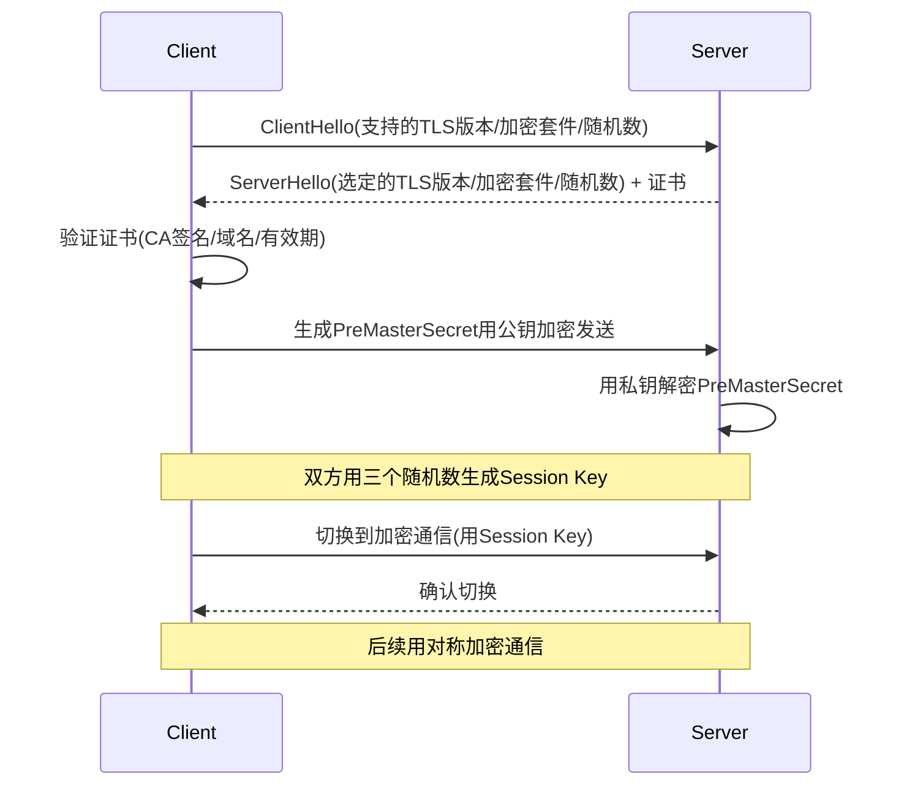

**对称 vs 非对称加密**：
- **非对称**（RSA/ECDSA）：公钥加密、私钥解密。用于密钥交换和数字签名。慢，不适合大量数据。
- **对称**（AES/ChaCha20）：同一密钥加密解密。快，用于数据传输。密钥通过非对称加密交换。
- **TLS 结合两者**：非对称交换对称密钥，对称加密传输数据。

### 9.2 OAuth2 授权流程

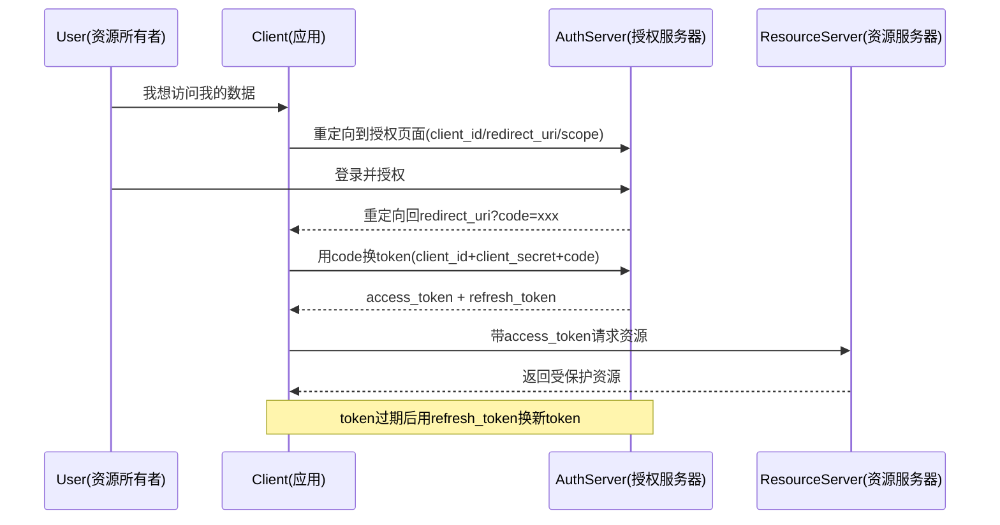

**四种授权模式**：
| 模式 | 流程 | 适用 | 安全性 |
| --- | --- | --- | --- |
| **Authorization Code** | 授权码→换token | Web应用 | **最常用** |
| Implicit | 直接返回token | SPA(已不推荐) | 低 |
| Password | 用户名密码直接换token | 内部应用 | 中 |
| Client Credentials | client_id+secret | 服务间调用 | 中 |

### 9.3 JWT（JSON Web Token）

```text
JWT结构: header.payload.signature

header: {"alg": "HS256", "typ": "JWT"} → Base64编码
payload: {"sub": "user123", "role": "admin", "exp": 1735689600} → Base64编码
signature: HMAC-SHA256(base64(header) + "." + base64(payload), secret)

最终JWT: xxxxx.yyyyy.zzzzz
```

**JWT vs Session**：
| 维度 | JWT | Session |
| --- | --- | --- |
| 存储 | 客户端（无状态） | 服务端内存/Redis |
| 扩展 | 天然支持分布式 | 需共享Session存储 |
| 注销 | 难（需黑名单） | 简单（删Redis） |
| 大小 | 较大（含payload） | 小（只存sessionId） |
| 适用 | API/Microservices | 传统Web应用 |

**【深度拓展】JWT 的坑**
- **无法主动注销**：JWT 签发后在过期前一直有效，服务端"删"不了。解法：维护黑名单（存 Redis）或用短期 token + refresh token。
- **Payload 不加密**：JWT 的 payload 是 Base64 编码（不是加密），不能放敏感信息。需要加密用 JWE。
- **密钥轮换**：secret 泄露 = 所有 token 伪造。要支持密钥轮换（kid 标识不同密钥版本）。

**【面试官追问】**
- "OAuth2 和 JWT 的关系？" → OAuth2 是授权框架（定义了怎么获取 token），JWT 是 token 格式（定义了 token 长什么样）。OAuth2 的 token 可以是 JWT 也可以是不透明 token。
- "HTTPS 能防什么？不能防什么？" → 防窃听/篡改/冒充（中间人）；不能防客户端被植入木马、不能防服务端 SQL 注入/XSS。
- "CSRF 怎么防？" → CSRF Token（服务端生成一次性令牌）、SameSite Cookie、Referer 校验。

**【项目支撑】**
XTransfer 跨境支付系统的安全：对外 API 用 HTTPS + OAuth2（商户授权获取 access_token）；内部微服务间用 JWT（无状态、可校验）；支付敏感操作需要多重认证（商户认证 + 操作员认证 + OTP）。JWT 短期有效（15分钟）+ refresh token 续期，避免长期 token 泄露风险。

---

## 十、云原生（Docker / K8s / Service Mesh）

### 10.1 Docker 容器化

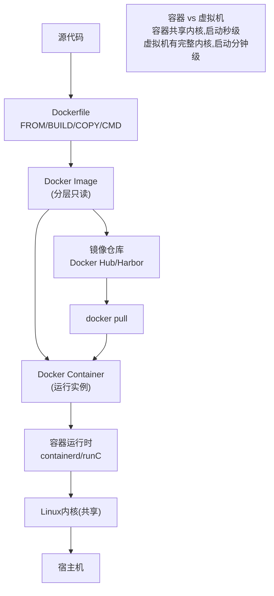

**Docker 核心概念**：
- **镜像（Image）**：分层只读文件系统，包含应用+依赖+运行环境。
- **容器（Container）**：镜像的运行实例，在镜像层上加一层可写层。
- **Dockerfile**：构建镜像的脚本（FROM → RUN → COPY → CMD）。
- **Namespace 隔离**：PID/NET/IPC/MNT/UTS 命名空间实现进程/网络/文件系统隔离。
- **Cgroup 资源限制**：CPU/内存/IO 限制，防止单容器占满宿主机。

### 10.2 Kubernetes 核心架构

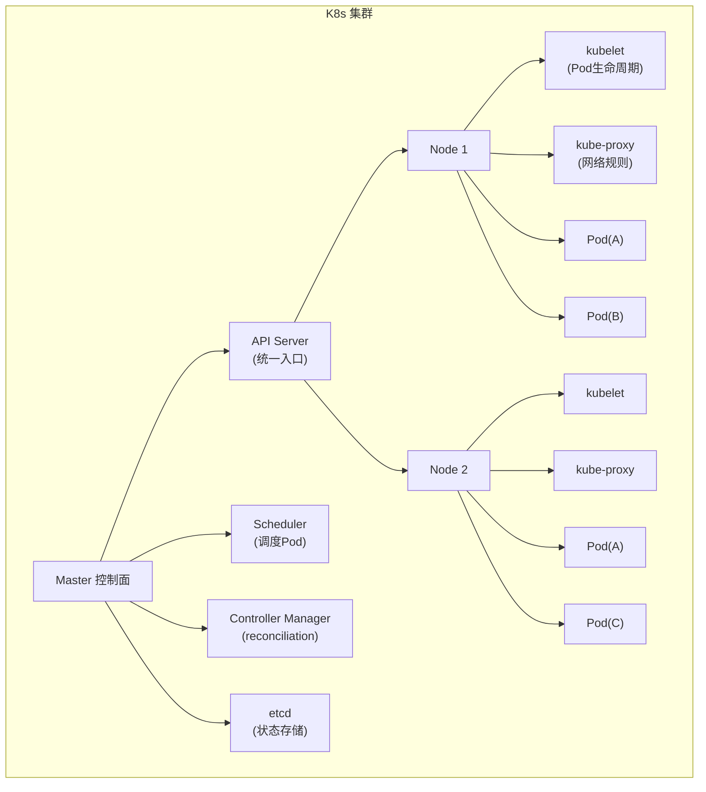

**K8s 核心概念**：

| 概念 | 含义 | 类比 |
| --- | --- | --- |
| **Pod** | 最小调度单元，1+容器共享网络/存储 | 物理机上一个进程组 |
| **Deployment** | 声明式管理Pod副本数+滚动更新 | "我要3个实例在跑" |
| **Service** | 固定IP+DNS，负载均衡到后端Pod | Nginx upstream |
| **Ingress** | HTTP路由规则（域名→Service） | API Gateway |
| **ConfigMap/Secret** | 配置/敏感信息注入 | 外部化配置 |
| **HPA** | 水平Pod自动伸缩（按CPU/QPS） | 自动扩缩容 |

**【深度拓展】K8s 的声明式模型**
- **声明式 vs 命令式**：命令式说"做这个操作"，声明式说"我要这个状态"。K8s 用声明式——你说"我要3个Pod"，Controller 持续对比期望状态和实际状态，不一致就自动调整（reconciliation loop）。
- **滚动更新**：`Deployment` 更新时逐个替换 Pod——先起新版，健康检查通过后杀旧版。配合 readiness probe 确保新版就绪才导流。
- **自愈**：Pod 挂了 Controller 自动重启；Node 挂了 Pod 自动迁移到其他 Node。

### 10.3 Service Mesh（Istio）

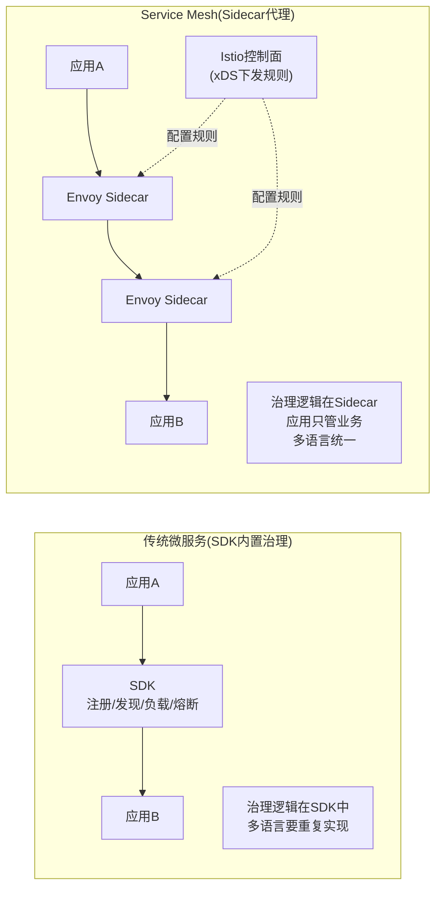

**Service Mesh 核心价值**：
- **业务无侵入**：限流/熔断/链路追踪/mTLS 全在 Sidecar，应用代码不感知。
- **多语言统一**：Java/Go/Python 都用同一套 Sidecar，治理能力跨语言一致。
- **流量管理**：灰度发布（按百分比/Header 路由）、熔断、重试、超时——全在 Sidecar 配置。

**代价**：Sidecar 增加一跳网络（+1~3ms延迟）、运维复杂度高。

**【面试官追问】**
- "你们用 K8s 吗？" → XTransfer 用 K8s 做容器编排：Deployment 管理服务实例、HPA 按QPS自动扩缩容、ConfigMap 管理配置。Service 做内部服务发现+负载均衡。
- "Service Mesh 用了吗？" → 没有大规模用，Dubbo + Sentinel 已覆盖治理需求。但关注 Istio Proxyless 模式（Dubbo 3 支持）作为未来方向。
- "Docker 和虚拟机的区别？" → 容器共享内核（启动秒级、资源省）；虚拟机有完整OS（隔离更强、启动慢、资源多）。微服务用容器，需要强隔离用虚拟机。

**【项目支撑】**
XTransfer 收款 2.0 用 K8s 容器化部署：按业务域拆分 Deployment（收款/风控/账务/渠道），HPA 按业务 QPS 自动扩缩容，大促前手动预扩容保底。配置用 Nacos（不用 ConfigMap，因为需要热更新）。

---

## 十一、可观测性三支柱

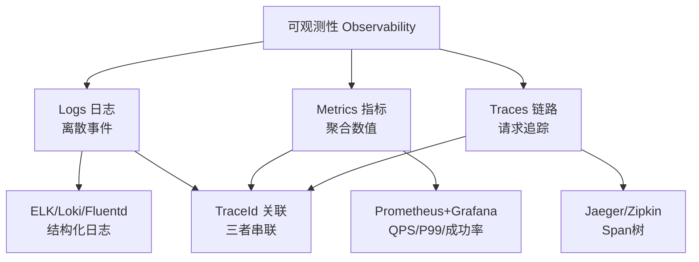

| 支柱 | 回答什么 | 数据特征 | 典型工具 | 支付场景 |
| --- | --- | --- | --- | --- |
| **Logs** | "出了什么错" | 离散事件、高基数 | ELK/Loki | 错误日志、审计日志 |
| **Metrics** | "系统状态如何" | 聚合数值、低基数 | Prometheus/Grafana | QPS/P99/成功率 |
| **Traces** | "请求经历了什么" | 调用链 | Jaeger/Zipkin | 跨服务调用链路 |

**三者配合**：Metrics 发现异常（P99飙升）→ Traces 定位在哪（哪个服务/哪个Span慢）→ Logs 查根因（错误日志详情）。TraceId 把三者串联。

**【面试官追问】**
- "日志和指标的区别？" → 日志是离散事件（每请求一条），指标是聚合值（每秒QPS）。日志高基数（每条不同），指标低基数（有限维度组合）。
- "为什么需要链路追踪？" → 日志散在各服务，不知道哪条属于同一次请求。TraceId 把一次请求跨服务的所有Span串起来，看到完整调用树。
- "全链路追踪怎么做采样？" → 正常流量采样1%~10%（省存储），异常/慢请求全量采样。资金系统对"出问题的那笔"要能查到完整链路。

**【项目支撑】**
XTransfer 用 Micrometer 做全链路追踪：TraceId 在 Dubbo Filter/HTTP Header/MQ 消息属性间透传，异步线程用 TTL 保住上下文。每笔收款单的 TraceId 贯穿"渠道回调→风控→记账→对账"，出问题能秒级定位卡在哪一环。这是 2.0 重构后生产问题降 80% 的"可观测性"支撑。

---

## 十二、速记卡（面试前扫一遍）

| 关键词 | 一句话记忆 |
| --- | --- |
| B+树索引 | 矮胖多路+叶子链表，范围查询友好，数据库标配 |
| 虚拟内存 | 进程隔离+扩展可用内存，MMU映射，缺页中断 |
| IO多路复用 | epoll事件驱动，1线程管万连接，Netty/Redis/Nginx |
| 死锁四条件 | 互斥/占有等待/不可剥夺/循环等待 |
| MVCC | undo版本链+ReadView，快照读免锁 |
| WAL | 先写日志再改页，崩溃恢复的基础 |
| 设计模式 | 创建5+结构7+行为11=23，别背定义要讲落地 |
| OAuth2 | 授权码模式最常用，token换资源 |
| JWT | 无状态token，payload不加密，难主动注销 |
| K8s声明式 | "我要3个Pod" → Controller自动调谐 |
| 可观测三柱 | Logs+Metrics+Traces，TraceId串联 |

<!-- EXPANDED -->
