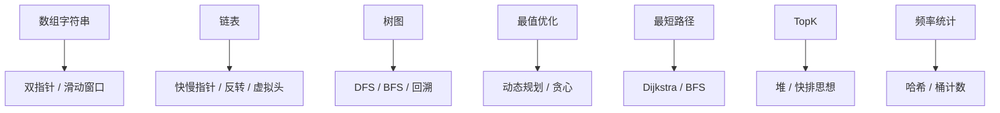
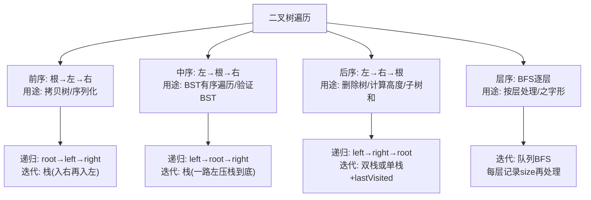
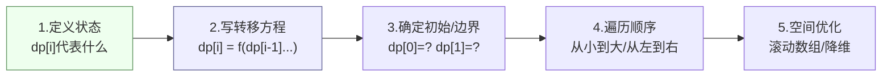
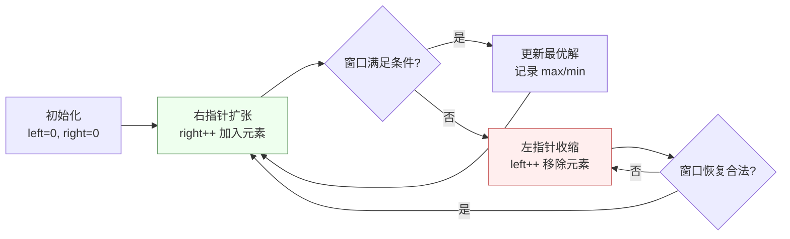
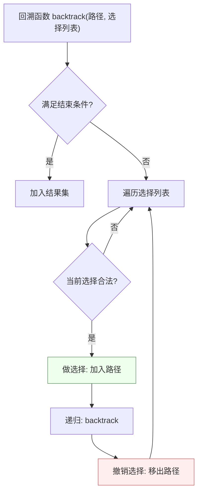
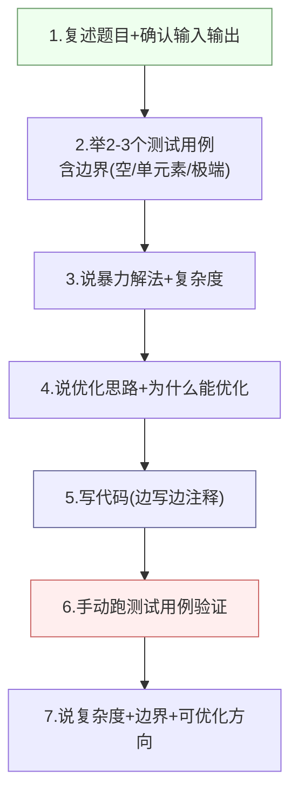
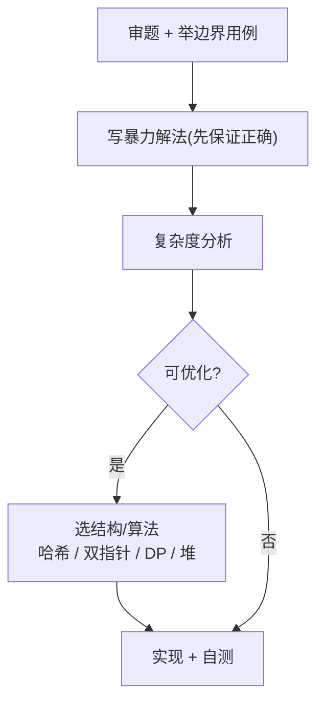

## 方法：按「题型」而非「题号」刷

每刷一道，问自己三件事：**这题属于哪类模型？最优复杂度是多少？能不能 5 分钟手写出来？**

## 高频题型清单

> 刷题按"题型"而非"题号"。下面把常见题型映射到对应的算法模型，面试看到业务描述能立刻"对号入座"。



| 题型 | 必会（点链接直达） | 支付映射 |
| --- | --- | --- |
| 数组 / 双指针 | [两数之和](https://leetcode.cn/problems/two-sum/)、[接雨水](https://leetcode.cn/problems/trapping-rain-water/) | 对账差异匹配（两边流水对齐） |
| 哈希 | [无重复字符的最长子串](https://leetcode.cn/problems/longest-substring-without-repeating-characters/)、[前 K 个高频元素](https://leetcode.cn/problems/top-k-frequent-elements/) | 交易去重、渠道统计 |
| 链表 | [反转链表](https://leetcode.cn/problems/reverse-linked-list/)、[环形链表](https://leetcode.cn/problems/linked-list-cycle/) | — |
| 树 / 堆 | [二叉树的中序遍历](https://leetcode.cn/problems/binary-tree-inorder-traversal/)、[数据流的中位数](https://leetcode.cn/problems/find-median-from-data-stream/) | 交易峰值（滑动窗口 + 堆） |
| 图 | [网络延迟时间（Dijkstra）](https://leetcode.cn/problems/network-delay-time/)、[课程表（拓扑排序）](https://leetcode.cn/problems/course-schedule/) | 渠道路由（成本最小路径） |
| DP | [零钱兑换（完全背包）](https://leetcode.cn/problems/coin-change/)、[编辑距离](https://leetcode.cn/problems/edit-distance/) | 限额组合优化 |
| 回溯 | [子集](https://leetcode.cn/problems/subsets/)、[全排列](https://leetcode.cn/problems/permutations/) | 营销权益组合 |
| 二分 | [查找区间（边界查找）](https://leetcode.cn/problems/find-first-and-last-position-of-element-in-sorted-array/) | 风控阈值搜索 |

### 补充必练（系统设计类编码题，面试高频）

- [LRU 缓存](https://leetcode.cn/problems/lru-cache/)（LinkedHashMap / 双向链表 + 哈希）
- [用栈实现队列 / 用队列实现栈](https://leetcode.cn/problems/implement-queue-using-stacks/)
- [合并 K 个有序链表](https://leetcode.cn/problems/merge-k-sorted-lists/)（堆）
- [岛屿数量](https://leetcode.cn/problems/number-of-islands/)（DFS/BFS/并查集）
- [完全平方数](https://leetcode.cn/problems/perfect-squares/)（BFS 最短路 / 完全背包）

## 各题型 Mermaid 图解与 Java 代码模板

### 1. 二叉树遍历（前/中/后/层序）

**二叉树遍历方式图解**：



```java
// 前序遍历（迭代版）
public List<Integer> preorderTraversal(TreeNode root) {
    List<Integer> res = new ArrayList<>();
    Deque<TreeNode> stack = new ArrayDeque<>();
    if (root != null) stack.push(root);
    while (!stack.isEmpty()) {
        TreeNode node = stack.pop();
        res.add(node.val);
        if (node.right != null) stack.push(node.right); // 先入右
        if (node.left != null) stack.push(node.left);   // 再入左（先出左）
    }
    return res;
}

// 中序遍历（迭代版，一路左压栈到底）
public List<Integer> inorderTraversal(TreeNode root) {
    List<Integer> res = new ArrayList<>();
    Deque<TreeNode> stack = new ArrayDeque<>();
    TreeNode cur = root;
    while (cur != null || !stack.isEmpty()) {
        while (cur != null) { stack.push(cur); cur = cur.left; } // 一路向左
        cur = stack.pop();
        res.add(cur.val);
        cur = cur.right;
    }
    return res;
}

// 层序遍历（BFS）
public List<List<Integer>> levelOrder(TreeNode root) {
    List<List<Integer>> res = new ArrayList<>();
    if (root == null) return res;
    Queue<TreeNode> queue = new LinkedList<>();
    queue.offer(root);
    while (!queue.isEmpty()) {
        int size = queue.size();
        List<Integer> level = new ArrayList<>();
        for (int i = 0; i < size; i++) {  // 按层处理
            TreeNode node = queue.poll();
            level.add(node.val);
            if (node.left != null) queue.offer(node.left);
            if (node.right != null) queue.offer(node.right);
        }
        res.add(level);
    }
    return res;
}
```

### 2. 动态规划状态转移图解

**DP 解题四步法**：



**经典 DP 状态转移方程速查表**：

| 题型 | 状态定义 | 转移方程 | 经典题 |
| --- | --- | --- | --- |
| 一维 DP | `dp[i]` = 前 i 个的最优解 | `dp[i] = max/min(dp[i-1]+x, ...)` | 爬楼梯/打家劫舍 |
| 二维 DP | `dp[i][j]` = 前 i 个容量 j 的最优 | `dp[i][j] = max(dp[i-1][j], dp[i-1][j-w]+v)` | 0-1背包 |
| 完全背包 | `dp[i][j]` = 前 i 个容量 j 的最优 | `dp[i][j] = max(dp[i-1][j], dp[i][j-w]+v)` | 零钱兑换 |
| 区间 DP | `dp[i][j]` = 区间 [i,j] 的最优 | `dp[i][j] = min(dp[i][k]+dp[k+1][j])` | 戳气球/矩阵链乘 |
| 编辑距离 | `dp[i][j]` = s1[0..i] 到 s2[0..j] 的距离 | `dp[i][j] = min(dp[i-1][j]+1, dp[i][j-1]+1, dp[i-1][j-1]+cost)` | 编辑距离 |
| LIS | `dp[i]` = 以 i 结尾的最长上升子序列 | `dp[i] = max(dp[j])+1 (j<i, nums[j]<nums[i])` | 最长上升子序列 |
| LCS | `dp[i][j]` = s1[0..i] 和 s2[0..j] 的 LCS | `dp[i][j] = dp[i-1][j-1]+1 或 max(dp[i-1][j], dp[i][j-1])` | 最长公共子序列 |

```java
// 零钱兑换（完全背包）— 求最少硬币数
public int coinChange(int[] coins, int amount) {
    int[] dp = new int[amount + 1];
    Arrays.fill(dp, amount + 1); // 初始化为"不可达"
    dp[0] = 0;
    for (int i = 1; i <= amount; i++) {
        for (int coin : coins) {
            if (coin <= i) {
                dp[i] = Math.min(dp[i], dp[i - coin] + 1);
            }
        }
    }
    return dp[amount] > amount ? -1 : dp[amount];
}
// 时间 O(amount * coins.length)，空间 O(amount)

// 编辑距离
public int minDistance(String word1, String word2) {
    int m = word1.length(), n = word2.length();
    int[][] dp = new int[m + 1][n + 1];
    for (int i = 0; i <= m; i++) dp[i][0] = i; // 删除 i 个
    for (int j = 0; j <= n; j++) dp[0][j] = j; // 插入 j 个
    for (int i = 1; i <= m; i++) {
        for (int j = 1; j <= n; j++) {
            if (word1.charAt(i - 1) == word2.charAt(j - 1)) {
                dp[i][j] = dp[i - 1][j - 1]; // 字符相同，无需操作
            } else {
                dp[i][j] = 1 + Math.min(dp[i - 1][j - 1],  // 替换
                               Math.min(dp[i - 1][j],       // 删除
                                        dp[i][j - 1]));     // 插入
            }
        }
    }
    return dp[m][n];
}
// 时间 O(m*n)，空间 O(m*n) → 可优化到 O(n) 滚动数组
```

### 3. 滑动窗口图解

**滑动窗口核心思想**：



```java
// 模板1: 最长满足条件的子数组（如无重复字符的最长子串）
public int lengthOfLongestSubstring(String s) {
    Map<Character, Integer> window = new HashMap<>();
    int left = 0, maxLen = 0;
    for (int right = 0; right < s.length(); right++) {
        char c = s.charAt(right);
        window.put(c, window.getOrDefault(c, 0) + 1);
        while (window.get(c) > 1) {  // 有重复，收缩
            char d = s.charAt(left++);
            window.put(d, window.get(d) - 1);
        }
        maxLen = Math.max(maxLen, right - left + 1);
    }
    return maxLen;
}

// 模板2: 最短满足条件的子数组（如和≥target的最短子数组）
public int minSubArrayLen(int target, int[] nums) {
    int left = 0, sum = 0, minLen = Integer.MAX_VALUE;
    for (int right = 0; right < nums.length; right++) {
        sum += nums[right];           // 扩张
        while (sum >= target) {       // 满足条件，收缩
            minLen = Math.min(minLen, right - left + 1);
            sum -= nums[left++];      // 收缩左边界
        }
    }
    return minLen == Integer.MAX_VALUE ? 0 : minLen;
}
```

### 4. 回溯法模板



```java
// 全排列（回溯模板）
public List<List<Integer>> permute(int[] nums) {
    List<List<Integer>> res = new ArrayList<>();
    backtrack(nums, new ArrayList<>(), new boolean[nums.length], res);
    return res;
}
void backtrack(int[] nums, List<Integer> path, boolean[] used, List<List<Integer>> res) {
    if (path.size() == nums.length) {  // 结束条件
        res.add(new ArrayList<>(path)); // 注意要拷贝
        return;
    }
    for (int i = 0; i < nums.length; i++) {
        if (used[i]) continue;  // 剪枝
        path.add(nums[i]);      // 做选择
        used[i] = true;
        backtrack(nums, path, used, res);
        path.remove(path.size() - 1); // 撤销选择
        used[i] = false;
    }
}

// 子集（回溯另一变体）
public List<List<Integer>> subsets(int[] nums) {
    List<List<Integer>> res = new ArrayList<>();
    backtrack(nums, 0, new ArrayList<>(), res);
    return res;
}
void backtrack(int[] nums, int start, List<Integer> path, List<List<Integer>> res) {
    res.add(new ArrayList<>(path));  // 每个节点都是一个子集
    for (int i = start; i < nums.length; i++) {
        path.add(nums[i]);
        backtrack(nums, i + 1, path, res);
        path.remove(path.size() - 1);
    }
}
```

### 5. 二分查找模板

```java
// 模板1: 精确查找（左闭右闭 [left, right]）
public int search(int[] nums, int target) {
    int left = 0, right = nums.length - 1;
    while (left <= right) {
        int mid = left + (right - left) / 2; // 防溢出
        if (nums[mid] == target) return mid;
        else if (nums[mid] < target) left = mid + 1;
        else right = mid - 1;
    }
    return -1;
}

// 模板2: 查找左边界（第一个 >= target）
public int lowerBound(int[] nums, int target) {
    int left = 0, right = nums.length; // 左闭右开 [left, right)
    while (left < right) {
        int mid = left + (right - left) / 2;
        if (nums[mid] < target) left = mid + 1;
        else right = mid;  // 收缩右边界（不减1）
    }
    return left; // left == right，即第一个 >= target 的位置
}

// 模板3: 二分答案（如"最小的最大值"类问题）
// 例: 在数组中分成 m 段，使各段和的最大值最小
public int splitArray(int[] nums, int m) {
    long left = 0, right = 0;
    for (int n : nums) { left = Math.max(left, n); right += n; }
    while (left < right) {
        long mid = left + (right - left) / 2;
        if (canSplit(nums, m, mid)) right = mid; // 能分，尝试更小
        else left = mid + 1;                     // 不能分，放大
    }
    return (int) left;
}
boolean canSplit(int[] nums, int m, long maxSum) {
    int count = 1; long curSum = 0;
    for (int n : nums) {
        if (curSum + n > maxSum) { count++; curSum = n; }
        else curSum += n;
    }
    return count <= m;
}
```

## 复杂度速记（张口就来）

| 结构 / 算法 | 时间 | 空间 |
| --- | --- | --- |
| 二分 | O(log n) | O(1) |
| 哈希读写 | O(1) 均摊 | O(n) |
| 堆（插入/取顶） | O(log n) | O(n) |
| 快排（平均/最差） | O(n log n) / O(n²) | O(log n) |
| 归并 | O(n log n) | O(n) |
| Dijkstra（二叉堆） | O(E log V) | O(V) |
| BFS/DFS | O(V+E) | O(V) |

> 面试铁律：**先说暴力复杂度，再讲优化**，并解释「为什么能优化」（如双指针靠单调性、堆靠局部极值）。

**扩展复杂度速查表**（面试常被追问的数据结构操作复杂度）：

| 结构 / 算法 | 访问 | 查找 | 插入 | 删除 | 空间 |
| --- | --- | --- | --- | --- | --- |
| 数组 | O(1) | O(n) | O(n) | O(n) | O(n) |
| 链表（单） | O(n) | O(n) | O(1) | O(1) | O(n) |
| 哈希表 | — | O(1) 均摊 | O(1) 均摊 | O(1) 均摊 | O(n) |
| 二叉搜索树（平衡） | — | O(log n) | O(log n) | O(log n) | O(n) |
| 二叉搜索树（最差） | — | O(n) | O(n) | O(n) | O(n) |
| 跳表 | — | O(log n) | O(log n) | O(log n) | O(n) |
| 堆（二叉） | — | O(n) | O(log n) | O(log n) | O(n) |
| 红黑树 | — | O(log n) | O(log n) | O(log n) | O(n) |
| B+ 树 | — | O(log n) | O(log n) | O(log n) | O(n) |

**排序算法复杂度速查表**：

| 算法 | 平均时间 | 最差时间 | 空间 | 稳定 | 特点 |
| --- | --- | --- | --- | --- | --- |
| 冒泡 | O(n²) | O(n²) | O(1) | 稳定 | 简单但慢 |
| 选择 | O(n²) | O(n²) | O(1) | 不稳定 | 交换次数少 |
| 插入 | O(n²) | O(n²) | O(1) | 稳定 | 小数据/近乎有序快 |
| 快排 | O(n log n) | O(n²) | O(log n) | 不稳定 | 实践最快，缓存友好 |
| 归并 | O(n log n) | O(n log n) | O(n) | 稳定 | 稳定排序，外部排序 |
| 堆排 | O(n log n) | O(n log n) | O(1) | 不稳定 | 原地排序，不稳定 |
| 计数 | O(n+k) | O(n+k) | O(k) | 稳定 | k 为值域大小 |
| 基数 | O(d·n) | O(d·n) | O(n+d) | 稳定 | d 为位数 |

> **面试常问**：为什么快排平均最快？→ 缓存友好（顺序访问）+ 常数因子小 + 原地排序。为什么最差 O(n²)？→ 每次选到最差 pivot（已有序数组取首/尾），可用随机 pivot 或三数取中缓解。

## LeetCode 高频题 Top50 分类清单

> 以下清单综合牛客/脉脉/LeetCode 面试高频统计，按题型分类，标注难度和频率。**建议至少刷完 ★★★ 及以上的题**。

### 数组 / 双指针 / 滑动窗口

| # | 题目 | 难度 | 频率 | 模型 |
| --- | --- | --- | --- | --- |
| 1 | [两数之和](https://leetcode.cn/problems/two-sum/) | Easy | ★★★★★ | 哈希 |
| 11 | [盛最多水的容器](https://leetcode.cn/problems/container-with-most-water/) | Medium | ★★★★ | 对撞双指针 |
| 15 | [三数之和](https://leetcode.cn/problems/3sum/) | Medium | ★★★★ | 排序+双指针 |
| 42 | [接雨水](https://leetcode.cn/problems/trapping-rain-water/) | Hard | ★★★★★ | 双指针/单调栈 |
| 121 | [买卖股票最佳时机](https://leetcode.cn/problems/best-time-to-buy-and-sell-stock/) | Easy | ★★★★ | 一次遍历 |
| 209 | [长度最小子数组](https://leetcode.cn/problems/minimum-size-subarray-sum/) | Medium | ★★★ | 滑动窗口 |
| 239 | [滑动窗口最大值](https://leetcode.cn/problems/sliding-window-maximum/) | Hard | ★★★★ | 单调队列 |

### 哈希 / 字符串

| # | 题目 | 难度 | 频率 | 模型 |
| --- | --- | --- | --- | --- |
| 3 | [无重复字符最长子串](https://leetcode.cn/problems/longest-substring-without-repeating-characters/) | Medium | ★★★★★ | 滑动窗口 |
| 49 | [字母异位词分组](https://leetcode.cn/problems/group-anagrams/) | Medium | ★★★ | 哈希 |
| 76 | [最小覆盖子串](https://leetcode.cn/problems/minimum-window-substring/) | Hard | ★★★ | 滑动窗口 |
| 347 | [前K个高频元素](https://leetcode.cn/problems/top-k-frequent-elements/) | Medium | ★★★★ | 堆/桶排序 |
| 56 | [合并区间](https://leetcode.cn/problems/merge-intervals/) | Medium | ★★★★ | 排序+贪心 |

### 链表

| # | 题目 | 难度 | 频率 | 模型 |
| --- | --- | --- | --- | --- |
| 206 | [反转链表](https://leetcode.cn/problems/reverse-linked-list/) | Easy | ★★★★★ | 迭代/递归 |
| 21 | [合并两个有序链表](https://leetcode.cn/problems/merge-two-sorted-lists/) | Easy | ★★★★ | 虚拟头节点 |
| 141 | [环形链表](https://leetcode.cn/problems/linked-list-cycle/) | Easy | ★★★★ | 快慢指针 |
| 142 | [环形链表II](https://leetcode.cn/problems/linked-list-cycle-ii/) | Medium | ★★★★ | 快慢指针找入口 |
| 148 | [排序链表](https://leetcode.cn/problems/sort-list/) | Medium | ★★★ | 归并排序 |
| 160 | [相交链表](https://leetcode.cn/problems/intersection-of-two-linked-lists/) | Easy | ★★★ | 双指针 |

### 树 / DFS / BFS

| # | 题目 | 难度 | 频率 | 模型 |
| --- | --- | --- | --- | --- |
| 94 | [中序遍历](https://leetcode.cn/problems/binary-tree-inorder-traversal/) | Easy | ★★★★ | 栈/递归 |
| 102 | [层序遍历](https://leetcode.cn/problems/binary-tree-level-order-traversal/) | Medium | ★★★★ | BFS队列 |
| 104 | [二叉树最大深度](https://leetcode.cn/problems/maximum-depth-of-binary-tree/) | Easy | ★★★★ | DFS/递归 |
| 226 | [翻转二叉树](https://leetcode.cn/problems/invert-binary-tree/) | Easy | ★★★ | 递归 |
| 236 | [最近公共祖先](https://leetcode.cn/problems/lowest-common-ancestor-of-a-binary-tree/) | Medium | ★★★★ | 后序DFS |
| 98 | [验证BST](https://leetcode.cn/problems/validate-binary-search-tree/) | Medium | ★★★ | 中序验证 |
| 200 | [岛屿数量](https://leetcode.cn/problems/number-of-islands/) | Medium | ★★★★★ | DFS/BFS/并查集 |

### 动态规划

| # | 题目 | 难度 | 频率 | 模型 |
| --- | --- | --- | --- | --- |
| 70 | [爬楼梯](https://leetcode.cn/problems/climbing-stairs/) | Easy | ★★★★ | 一维DP |
| 198 | [打家劫舍](https://leetcode.cn/problems/house-robber/) | Medium | ★★★★ | 一维DP |
| 322 | [零钱兑换](https://leetcode.cn/problems/coin-change/) | Medium | ★★★★★ | 完全背包 |
| 300 | [最长上升子序列](https://leetcode.cn/problems/longest-increasing-subsequence/) | Medium | ★★★★ | 二分优化DP |
| 72 | [编辑距离](https://leetcode.cn/problems/edit-distance/) | Medium | ★★★★★ | 二维DP |
| 5 | [最长回文子串](https://leetcode.cn/problems/longest-palindromic-substring/) | Medium | ★★★ | 区间DP/中心扩展 |
| 64 | [最小路径和](https://leetcode.cn/problems/minimum-path-sum/) | Medium | ★★★ | 网格DP |

### 回溯 / 排列组合

| # | 题目 | 难度 | 频率 | 模型 |
| --- | --- | --- | --- | --- |
| 46 | [全排列](https://leetcode.cn/problems/permutations/) | Medium | ★★★★★ | 回溯 |
| 78 | [子集](https://leetcode.cn/problems/subsets/) | Medium | ★★★★ | 回溯 |
| 39 | [组合总和](https://leetcode.cn/problems/combination-sum/) | Medium | ★★★★ | 回溯+剪枝 |
| 22 | [括号生成](https://leetcode.cn/problems/generate-parentheses/) | Medium | ★★★★ | 回溯 |
| 79 | [单词搜索](https://leetcode.cn/problems/word-search/) | Medium | ★★★ | DFS回溯 |

### 二分 / 堆 / 栈

| # | 题目 | 难度 | 频率 | 模型 |
| --- | --- | --- | --- | --- |
| 33 | [搜索旋转排序数组](https://leetcode.cn/problems/search-in-rotated-sorted-array/) | Medium | ★★★★ | 二分变体 |
| 34 | [查找区间](https://leetcode.cn/problems/find-first-and-last-position-of-element-in-sorted-array/) | Medium | ★★★★ | 二分边界 |
| 215 | [第K大元素](https://leetcode.cn/problems/kth-largest-element-in-an-array/) | Medium | ★★★★★ | 堆/快排partition |
| 295 | [数据流中位数](https://leetcode.cn/problems/find-median-from-data-stream/) | Hard | ★★★★ | 双堆 |
| 20 | [有效括号](https://leetcode.cn/problems/valid-parentheses/) | Easy | ★★★★ | 栈 |
| 155 | [最小栈](https://leetcode.cn/problems/min-stack/) | Medium | ★★★ | 辅助栈 |

### 图 / 设计题

| # | 题目 | 难度 | 频率 | 模型 |
| --- | --- | --- | --- | --- |
| 207 | [课程表](https://leetcode.cn/problems/course-schedule/) | Medium | ★★★★ | 拓扑排序 |
| 743 | [网络延迟时间](https://leetcode.cn/problems/network-delay-time/) | Medium | ★★★ | Dijkstra |
| 146 | [LRU缓存](https://leetcode.cn/problems/lru-cache/) | Medium | ★★★★★ | 哈希+双向链表 |
| 460 | [LFU缓存](https://leetcode.cn/problems/lfu-cache/) | Hard | ★★★ | 双哈希+双链表 |

## 面试白板编程技巧

> 白板编码和 IDE 编码完全不同——没有自动补全、没有调试器、面试官全程看着你写。以下是白板面的实战技巧。

**白板编程 SOP**：



**白板技巧清单**：

| 技巧 | 说明 | 示例 |
| --- | --- | --- |
| 先沟通再写码 | 花 2 分钟确认需求和思路，再动手 | "我理解题目是求...，对吗？" |
| 先暴力后优化 | 先给 O(n²) 暴力保正确，再优化 | "暴力是双重循环 O(n²)，优化用哈希到 O(n)" |
| 边写边说 | 不要沉默写码，边写边解释思路 | "这里我用双指针，left 指向..." |
| 变量命名要清晰 | 白板上看不出类型，名字要好懂 | 用 `left/right/maxLen` 而非 `l/r/m` |
| 留白空间 | 白板空间有限，先规划好布局 | 先写函数签名，再写主体，最后写边界 |
| 手动跑用例 | 写完务必手跑一遍测试用例 | "我跑一下 [1,2,3] target=3 这个用例" |
| 主动说复杂度 | 不等问，主动说时间和空间复杂度 | "时间 O(n)，空间 O(1)" |
| 承认不会就给思路 | 不会的题别硬编，给你能想到的方向 | "这题我没刷过，但如果是我会先考虑..." |

**白板常犯错误**：
- **上来就写**：不确认需求就开写，写到一半发现理解错了——先复述需求。
- **沉默 5 分钟**：面试官看不到你的思路——边想边说，"Let me think aloud"。
- **不测边界**：空数组、n=0、n=1、负数、溢出——写完主动跑边界。
- **擦了重写**：白板擦不干净会很乱——先想好再写，少修改。
- **纠结语法**：少个分号不影响——面试官看的是逻辑不是语法。

**【深度拓展】** 白板编程面试官真正在看什么：① **沟通能力**——能不能把思路说清楚；② **代码风格**——命名、缩进、注释是否清晰；③ **边界意识**——有没有考虑空/单元素/溢出；④ **调试能力**——跑用例发现错误能不能快速定位修复；⑤ **复杂度意识**——写完能不能自己分析时间和空间。所以白板的核心不是"能不能写对"，而是"能不能在压力下把思维过程完整展示出来"。

**【项目支撑】** 我在真实面试中白板写 LRU 时，先花了 1 分钟画图确认数据结构（HashMap + 双向链表），再花 3 分钟写代码，最后手跑测试用例发现一个边界 bug（容量为 1 时删除尾部后忘记更新 head），当场修复——面试官后来反馈说"跑用例发现 bug 并修复"比"一次写对"更加分，因为这展示了真实的调试能力。

## 例题：滑动窗口求交易峰值

> 给定每笔交易时间戳与金额，求任意 1 分钟窗口内的最大交易额。

```java
// 固定窗口 + 单调队列维护窗口最大值
int maxInWindow(int[] amt, int[] ts, int windowSec) {
    Deque<Integer> dq = new ArrayDeque<>(); // 存金额下标，递减
    int ans = 0;
    for (int r = 0; r < amt.length; r++) {
        while (!dq.isEmpty() && amt[dq.peekLast()] <= amt[r]) dq.pollLast();
        dq.offerLast(r);
        // 移出窗口左侧
        while (ts[dq.peekFirst()] < ts[r] - windowSec) dq.pollFirst();
        ans = Math.max(ans, amt[dq.peekFirst()]);
    }
    return ans;
}
```
复杂度：时间 `O(n)`，空间 `O(n)`。讲清「为什么用单调队列」「窗口左边界怎么滑」即可拿分。

**【项目支撑】** 这个模型对应**交易/工单峰值监控**的真实需求：哈啰工单系统日处理 **200w+** 工单，要实时监控「最近 N 分钟工单量是否超阈值」触发告警；XTransfer 也要监控「某渠道最近窗口成功率突降」（对应线上事故里 10 分钟止血的告警来源）。滑动窗口 + 单调队列能在**流式数据**上 O(1)/元素维护窗口极值，比每次全量扫描更适合高吞吐实时场景。我讲这题时会补一句：「真实系统里窗口是时间驱动的流式数据，通常用滑动窗口 + 衰减计数或 Flink 窗口实现，但算法内核就是这里讲的单调队列思想。」

## 例题：渠道路由 = Dijkstra

把渠道当图节点、单笔成本当边权，选「综合成本最低」的渠道就是最短路：

```text
节点: 收单网关 → 渠道A(费率1.2%, 慢) / 渠道B(费率0.9%, 快)
边权: 费率 + 延迟惩罚 + 失败率惩罚
目标: 单笔综合成本最小（可加约束：渠道B 每日额度 capped）
```

**【项目支撑】** 这正是 XTransfer「100+ 渠道」接入后的真实路由问题：VA/收单/A2A/电商平台回款每条路径的费率、到账延迟、历史失败率都不同，要在「成本最低」和「可用性最高」之间权衡。线上事故里「某渠道大促超时，熔断切备用渠道」本质就是这套成本模型的**在线重算 + 降级**。讲这题我会点出边界：真实路由还要叠加「渠道每日额度上限（容量约束）」「合规白名单（节点可达性）」，所以工程上是「Dijkstra 求基础最优 + 约束过滤 + 实时成功率反馈动态调整」，不是纯算法题。

## 通用解题模板（白板套路）

> 白板解题有固定套路：**先暴力保对 → 分析复杂度 → 选数据结构优化 → 自测边界**。下面流程照着走，面试官看的是"思路是否清晰、是否考虑边界"。



```text
1) 复述问题 + 确认输入输出 + 给一个样例
2) 想暴力（O(?)），讲清正确性
3) 找优化突破口：排序？哈希？双指针？单调性？最优子结构？
4) 选数据结构 + 写代码（边界：空/单元素/重复/溢出）
5) 跑样例 + 算复杂度 + 说测试case
```

## 错题本模板（每条必记）

```text
题: [接雨水](https://leetcode.cn/problems/trapping-rain-water/)
模型: 双指针 / 单调栈
卡点: 没想到从左右最大值取 min
复杂度: 时间 O(n) 空间 O(1)
复现: 2026-07-10 手写通过
```

## 关键提醒

- **白板手写**比在 IDE 里跑更重要，面试多半是白板；
- 先说 **暴力解法**，再优化，展示思考路径；
- 复杂度必须张口就来，这是区分「刷过」和「懂」的分水岭。

---

## 面试高频问答（标准回答）

### Q1：接雨水最优解怎么来的？为什么双指针对？

**标准回答**：核心观察是位置 `i` 的盛水量 = `min(left_max, right_max) - height[i]`。暴力是左右各扫一遍存 max（O(n) 空间）；优化用双指针：维护 `left_max/right_max`，哪边小就处理哪边（因为小的一侧已被更矮的边界限制），O(1) 空间 O(n) 时间。讲清「为什么小的一侧决定了上限」是关键得分点。

### Q2：LRU 怎么实现？为什么用哈希 + 双向链表？

**标准回答**：get/put 都要 O(1)。哈希表 O(1) 定位节点，双向链表维护「最近使用」顺序（头新尾旧），淘汰时删尾。注意「移动到头」要 O(1)，所以必须双向（能改前驱指针）。Java 用 `LinkedHashMap(accessOrder=true)` 或手写。

### Q3：Dijkstra 为什么不能处理负权边？

**标准回答**：Dijkstra 基于「已确定最短路的节点不会再被更新」的贪心假设；负权边可能让已确定的最短路被后续更短路径推翻，导致错误。负权用 Bellman-Ford / SPFA。渠道路由边权非负（费率+延迟+失败率），所以 Dijkstra 适用。

### Q4：TopK 用什么？为什么不用全排序？

**标准回答**：全排序 O(n log n) 浪费。TopK 用大小为 K 的 **最小堆**：遍历时维护堆，O(n log K)；或快排的 partition 变体（平均 O(n)）。数据量大到内存放不下时用「分治 + 外部排序」或「计数/桶」。

**【项目支撑】** TopK 在支付/电商里无处不在：欧凡用 **Redis Sorted Sets（zset）** 实现「基于时间与分数的排行榜」，按每日分数 `ZREVRANGE` 取 Top N 发优惠券——zset 的底层就是跳表 + 字典，取 TopK 近似 O(log n)；哈啰工单按「运营人员处理量 / 正确率」做 Top 排名用于绩效与激励。讲这题我会对比「内存最小堆（单实例）」vs「zset（分布式、跨实例共享）」的取舍——数据在 Redis 且要多人实时看榜时，zset 比本地堆更合适。

### Q5：你怎么把算法和业务结合讲？

**标准回答**：我习惯把每类题型映射到支付场景——双指针/哈希对应用到对账差异匹配，堆+滑动窗口对交易峰值监控，Dijkstra 对渠道路由成本最优，完全背包对限额组合优化。这样面试官听到的不是背题，而是「把业务问题抽象成模型」的能力，这也是算法题的区分点。

**【深度拓展】** 把算法映射到业务不是为了「秀经历」，而是展示**抽象建模能力**——面试官想看的是「你拿到一个业务描述，能不能识别它本质是哪类算法模型」。进阶打法：每个映射要说清「**约束为何匹配**」，比如渠道路由边权必须非负才能用 Dijkstra，如果加入「渠道每日额度上限」这种约束，就退化成「带容量约束的最短路」，可能要换 LP 或贪心+回溯。再进一步，能讲「**模型不够用时怎么办**」才是高分——对账如果千万级流水，内存装不下双指针，就得换「分治 + 外部排序」或「布隆过滤器去重 + 流式比对」。

**【项目支撑】** 我的映射全部来自真实系统，讲起来有底气：
- **对账差异匹配（双指针/哈希）**：XTransfer 事后 T+1 对账——把「平台流水」和「渠道流水」按交易号排序后双指针对齐，未匹配上的就是差异工单；这直接支撑「0 资损」的事后闭环。
- **渠道路由（Dijkstra/贪心）**：XTransfer 接 100+ 渠道（VA/收单/A2A/电商），选渠道时综合「费率 + 延迟 + 失败率」求综合成本最优，边权非负，Dijkstra 适用；智能路由切换（事故里熔断切备用渠道）也是这套成本模型的在线变体。
- **限额组合优化（完全背包/DP）**：贸易订单管理系统的「额度管理」——入账关联订单时要在额度约束下做最优组合，本质是背包类决策。
- **营销权益/优惠券（回溯/组合）**：欧凡优惠券系统——商品券/平台券的叠加与组合发放，规模数十万订单，发券/用券都靠 Redis 原子扣 + 幂等保证不超发不重复领。

> 算法不是背题，是 **把业务问题抽象成模型** 的能力。我特意把每类题型都映射到支付场景，这样讲起来有血有肉。

---

## 更多高频追问（补充）

### Q6：动态规划怎么想？和贪心、回溯的区别是什么？

**考察点**：能否说清"状态定义 + 转移方程 + 边界"三要素，而不是背题。

**标准回答**：DP 的核心是**无后效性**——当前状态只依赖之前的状态。解题四步：① 定义状态（`dp[i]` 表示什么）；② 写转移方程；③ 确定初始/边界；④ 定遍历顺序。贪心是"每步取局部最优且能证明全局最优"（如 Dijkstra、区间调度），不回头；回溯是"穷举 + 剪枝"（如全排列、N 皇后），会撤销选择。判断口诀：**求最优解且有重叠子问题 → DP；能证明局部最优即全局 → 贪心；求所有可行方案 → 回溯**。支付里"限额组合优化"是完全背包（DP），"渠道路由选最优"是贪心（Dijkstra）。

### Q7：二分查找的边界怎么写不出错？

**标准回答**：关键是**统一区间定义**。我固定用左闭右闭 `[left, right]`：循环条件 `left <= right`，`mid = left + (right-left)/2`（防溢出），命中返回，否则 `left=mid+1` 或 `right=mid-1`。找"左边界/第一个 >= target"用左闭右开变体，收缩时 `right=mid`。写之前先明确"要找的是精确值、第一个满足、还是最后一个满足"，边界就不会乱。二分不止用于数组，还能"二分答案"（如"最小的最大值"类题）。

### Q8：链表反转、判环、找中点这三板斧？

**标准回答**：① 反转——三指针 `prev/cur/next` 迭代，或递归；② 判环——快慢指针（Floyd），快指针追上慢指针即有环，再从头和相遇点同速走可找环入口；③ 找中点——快慢指针，快走两步慢走一步，快到尾时慢在中点。这三个是链表题的基础组合，合并 K 个有序链表、回文链表都由它们拼出来。对账里"两条流水链表归并"就是合并有序链表的变体。

### Q9：滑动窗口和双指针什么时候用？

**标准回答**：数组/字符串上**求连续子区间**（最长无重复子串、和为 target 的最短子数组）→ 滑动窗口：右指针扩张、条件不满足时左指针收缩，O(n)。**有序数组上求配对/去重**（两数之和、盛水最多的容器）→ 对撞双指针。**原地删除/移动**（移除元素、快慢去重）→ 同向双指针。识别信号是"连续"和"有序"。交易峰值监控的"最近 N 秒最大量"就是滑动窗口。

### Q10：手撕 LRU 怎么做到 O(1)？

**标准回答**：`HashMap + 双向链表`。HashMap 存 key→节点，实现 O(1) 定位；双向链表维护访问顺序，头部是最近使用、尾部是最久未用。`get` 命中后把节点移到头部；`put` 时若超容量删尾部节点。用双向链表是为了删除节点时能 O(1) 拿到前驱。Java 里 `LinkedHashMap` 重写 `removeEldestEntry` 也能实现，但面试常要求手写。这题几乎是"必考现场编码"，我会提前默写到肌肉记忆。

**【项目支撑】** LRU 思想直接对应我两段真实缓存实践：欧凡用 **Caffeine（本地 LRU/LFU 二级缓存）+ Redis** 抗直播热点商品，Caffeine 的淘汰策略本质就是 LRU 变体；哈啰薪资系统用 **Redis + Caffeine 多级缓存**加速计薪规则匹配。讲这题我会点出工程落地的差异：手写 LRU 是「单进程、容量固定」的理想模型，真实系统里要处理「本地缓存各节点不一致窗口（靠短 TTL + 失效广播收敛）」「缓存穿透/击穿/雪崩」——算法题考的是「O(1) get/put 的数据结构」，工程考的是「一致性与可用性」。这也呼应了博客里《欧凡实战》缓存一致性一节。

---

## 高频追问补充（面试官深入问）

### Q11：并查集怎么用？什么时候用？

**标准回答**：并查集解决「动态连通性」问题——判断两个元素是否属于同一集合、合并两个集合。核心操作：`find`（找根节点，路径压缩优化到接近 O(1)）和 `union`（合并两个集合，按秩合并优化）。经典应用：岛屿数量（连通块计数）、朋友圈/省份数量、冗余连接（检测环）、最小生成树 Kruskal 算法。讲清「路径压缩 + 按秩合并」能让复杂度降到近似 O(α(n))，α 是反阿克曼函数，n 很大时 α<5。

### Q12：单调栈和单调队列的区别？

**标准回答**：**单调栈**维护栈内元素单调性，用于「找下一个更大/更小元素」（如每日温度、接雨水柱状图变体）；**单调队列**维护队列内元素单调性，用于「滑动窗口最值」（如滑动窗口最大值）。区别：栈只能操作一端（用于「向后看」），队列两端都能操作（用于「窗口滑动时移除过期元素」）。两者本质都是「利用单调性避免无效比较」。

### Q13：前缀和怎么用？差分数组呢？

**标准回答**：**前缀和**用于「区间求和」——预处理 O(n)，每次查询 O(1)（`sum[i..j] = prefix[j+1] - prefix[i]`）；**差分数组**用于「区间更新」——对 [l,r] 加 val 只需 `diff[l]+=val, diff[r+1]-=val`，最后前缀还原。支付场景里「某渠道某时段累计交易额」就可用前缀和 O(1) 查询。

### Q14：快速排序的 partition 思想怎么用到 TopK？

**标准回答**：快排的 partition 每次把数组分成「比 pivot 小的左半 + pivot + 比 pivot 大的右半」，如果 pivot 恰好落在第 K 大的位置，就直接返回。平均每次排除一半，复杂度 O(n)；最差（每次选到最差 pivot）退化到 O(n²)，用随机 pivot 缓解。和堆的区别：堆适合「流式数据 TopK」（内存只需 K 大小），partition 适合「静态数据 TopK」（数据在内存里）。

### Q15：怎么判断一道题该用 BFS 还是 DFS？

**标准回答**：
- **BFS**（广度优先）：用队列，适合「最短路径/最少步数」（层序遍历、单词接龙、迷宫最短路）、「逐层处理」（层序遍历、之字形）。特点：找最短路径天然适配（第一次到达即最短），但空间 O(V)。
- **DFS**（深度优先）：用栈/递归，适合「所有路径/所有方案」（全排列、子集、N 皇后）、「连通性/拓扑」（岛屿数量、课程表）。特点：空间 O(h)（h 为深度），但找最短路径需要遍历所有可能。
- **口诀**：求最短/最少 → BFS；求所有方案/连通性 → DFS。

**【面试官追问】**：
- **追问1**：「BFS 怎么记录路径？」→ 答：用 `parent` 数组/Map 记录每个节点的来源，到达终点后回溯重建路径。
- **追问2**：「DFS 递归栈溢出怎么办？」→ 答：① 改为迭代版（显式栈）；② 尾递归优化（如果语言支持）；③ 限制递归深度+转迭代。
- **追问3**：「双向 BFS 什么时候用？」→ 答：当起点和终点都已知时（如单词接龙），从两端同时 BFS 向中间搜索，能大幅减少搜索空间——单 BFS 是 O(b^d)，双向是 O(b^(d/2))。

<!-- EXPANDED -->
