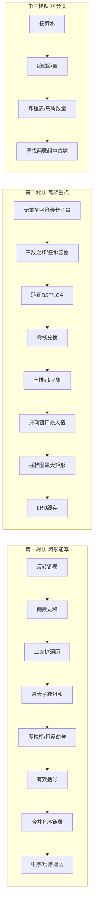

## 为什么需要"频率优先级"而不是"题号顺序"

多数候选人刷题的失败不是不努力，而是**平均用力**：在低频技巧题上耗了 30% 的时间，结果高频的数组/链表/树在面试紧张时反而翻车。公开面经数据高度一致地指向一个结论——**面试手撕题高度集中在少数题型**，把 P0 题型刷到"闭眼能写"，比刷完 500 题但每类都半生不熟，通过率高得多。

本文的所有频率结论，来自以下公开数据源的交叉印证（口径与局限见文末）：

- **mianshiya 算法题库**：按知识点拆分的考察重点清单（图/BFS-DFS/Dijkstra/拓扑/前缀和/字符串/KMP/树/栈/位运算/差分/数学/DP 等）。
- **牛客《各大厂高频题目汇总》**：按阿里/腾讯/字节等分公司、标"出现频率 ≥ 70%"与"中频 40–70%"两档，附具体题号与百分比。
- **CSDN《30 天搞定字节跳动算法面试》**：基于 `bytedance_6months.csv` 的频率加权统计，给出字节题型优先级与难度分布（Hard 占 32%、平均频率是 Medium 的 2.7 倍）。
- **CSDN《2025 互联网 IT 面试通关指南》**：题型题量分布（树 18、DP 20、查找排序 16、字符串 14、数学 10、位运算 8、图论 7、回溯 9、贪心 6）。
- **牛客《字节跳动面试爱考的高频算法题》**：汇总 389 篇面经、207 道题；95 道高频题（出现 ≥3 次）占比高达 80.16%，"无重复字符的最长子串"被考 25 次。

> 关键结论先行：**出现频率 ≥3 次的题只占题库很小的比例，却覆盖了 80%+ 的真实面试**。所以"按频率优先级刷"≈"用 20% 的题量覆盖 80% 的战场"。

## 一、频率优先级总表（P0 / P1 / P2）

> 频率档位定义：**P0 = 几乎每场必现**（出现频率估 70%+）；**P1 = 高频**（40–70%）；**P2 = 中低频/技巧题**（<40%，多用于区分度或特定岗位）。"综合出现频率"为多源归一后的相对值，仅供排序参考，非精确统计。

```mermaid
graph TD
    P0["P0 必考题型"] --> A1["数组 / 双指针 / 滑动窗口"]
    P0 --> A2["哈希表"]
    P0 --> A3["链表"]
    P0 --> A4["二叉树 / 递归 / DFS-BFS"]
    P0 --> A5["动态规划（基础）"]
    P1["P1 高频题型"] --> B1["字符串处理"]
    P1 --> B2["回溯 / 全排列子集"]
    P1 --> B3["栈 / 单调栈"]
    P1 --> B4["贪心"]
    P1 --> B5["二分查找"]
    P1 --> B6["堆 / TopK"]
    P2["P2 中低频 / 技巧"] --> C1["图论（拓扑 / 并查集 / Dijkstra）"]
    P2 --> C2["位运算"]
    P2 --> C3["前缀和 / 差分"]
    P2 --> C4["设计题（LRU / Trie）"]
    P2 --> C5["矩阵 / 模拟"]
    P2 --> C6["数学 / 数论"]
    P2 --> C7["高级 DP（区间 / 状态压缩）"]
```

| 优先级 | 题型 | 综合出现频率 | 面试权重 | 代表题（高频） | 备考建议 |
| --- | --- | --- | --- | --- | --- |
| **P0** | 数组 / 双指针 / 滑动窗口 | ★★★★★ | 极高 | 两数之和、盛水容器、三数之和、接雨水、滑动窗口最大值、最小覆盖子串 | 模板化到肌肉记忆；**边界（空/单元素/重复）必须一次性写对** |
| **P0** | 哈希表 | ★★★★★ | 极高 | 两数之和、字母异位词分组、最长连续序列、和为 K 的子数组 | 空间换时间是第一反应；注意 HashMap 的 equals/hashCode |
| **P0** | 链表 | ★★★★★ | 极高 | 反转链表、环形链表、合并有序链表、删除倒数 N 节点、LRU | 虚拟头节点、快慢指针、递归三板斧必须熟 |
| **P0** | 二叉树 / 递归 / DFS-BFS | ★★★★★ | 极高 | 中序/层序遍历、验证 BST、LCA、最大路径和、序列化 | 递归与迭代两种写法都要会；BST 性质是送分点 |
| **P0** | 动态规划（基础） | ★★★★☆ | 高 | 爬楼梯、最大子数组和、打家劫舍、零钱兑换、买卖股票 | 状态定义 → 转移 → 初始化 → 空间优化，四步法固定 |
| **P1** | 字符串处理 | ★★★★☆ | 高 | 无重复字符最长子串、最长回文子串、编辑距离、字符串解码 | 双指针/KMP/中心扩展/栈，按"模式"选工具 |
| **P1** | 回溯 / 全排列子集 | ★★★★ | 高 | 全排列、子集、组合总和、括号生成、N 皇后 | 路径-选择-撤销模板；剪枝是区分度 |
| **P1** | 栈 / 单调栈 | ★★★★ | 高 | 有效括号、每日温度、柱状图最大矩形 | 单调栈"找左右第一个更大/更小"是核心套路 |
| **P1** | 贪心 | ★★★☆ | 中高 | 跳跃游戏、划分字母区间、合并区间 | 先证明贪心正确性（局部最优→全局最优）再写 |
| **P1** | 二分查找 | ★★★☆ | 中高 | 搜索旋转排序数组、在排序数组找区间、寻找两个数组中位数 | 边界 `[left,right]` vs `[left,right)` 必须固定一种 |
| **P1** | 堆 / TopK | ★★★☆ | 中高 | 第 K 大元素、前 K 高频元素、数据流中位数 | 大顶/小顶堆配合；TopK 优先想堆而非全排序 |
| **P2** | 图论（拓扑/并查集/Dijkstra） | ★★★ | 中 | 课程表（拓扑）、岛屿数量（并查集/DFS）、网络延迟（Dijkstra） | 拓扑排序、并查集模板固定；Dijkstra 主流考朴素+堆优化 |
| **P2** | 位运算 | ★★☆ | 中 | 只出现一次的数字、寻找重复数 | 异或/掩码/lowbit；状态压缩偶尔考 |
| **P2** | 前缀和 / 差分 | ★★☆ | 中 | 和为 K 的子数组、矩阵区域和 | 一维/二维前缀和模板；差分处理区间修改 |
| **P2** | 设计题（LRU/Trie） | ★★☆ | 中 | LRU 缓存、实现 Trie | 组合基础结构（双向链表+哈希 / 多叉树） |
| **P2** | 矩阵 / 模拟 | ★★ | 中低 | 螺旋矩阵、旋转图像、矩阵置零、腐烂的橘子 | 按层遍历、方向数组；BFS 多用于"扩散"类 |
| **P2** | 数学 / 数论 | ★★ | 中低 | 阶乘/质数筛/快速幂/GCD | 大数注意溢出；快速幂模板 |
| **P2** | 高级 DP（区间/状态压缩） | ★★ | 低（高阶岗） | 最长公共子序列、编辑距离、区间 DP | 仅冲刺高阶/特定岗位时投入 |

## 二、P0 必考题型逐类拆解

### 2.1 数组 / 双指针 / 滑动窗口

面试里"数组"是容器，真正考的是**用什么指针策略**。三件套：

- **对撞双指针**（有序数组）：两数之和变种、盛水容器、三数之和、接雨水（可单调栈可双指针）。
- **快慢双指针**（原地修改/去重）：移动零、删除重复、环形链表。
- **滑动窗口**（子串/子数组最值）：无重复字符最长子串、最小覆盖子串、滑动窗口最大值（需单调队列）。

> 一句话模板：**窗口合法性用哈希/计数维护 → 收缩左边界 → 在合法时更新答案**。先把"什么时候动 left"想清楚，比背题重要。

### 2.2 哈希表

频率之王。核心套路：**把 O(n²) 的查找降为 O(1)**。

- 两数之和：边遍历边存 `target - x` 的下标。
- 最长连续序列：用 HashSet 判断 `x-1` 是否存在以避免重复起点。
- 和为 K 的子数组：前缀和 + HashMap 计数 `(presum, 出现次数)`。

> 易错点：自定义对象作 key 必须正确重写 `equals` / `hashCode`（Java）；HashMap 并发用 `ConcurrentHashMap`。

### 2.3 链表

**虚拟头节点（dummy）** 解决头节点特殊化；**快慢指针** 解决中点/环/倒数第 N；**递归** 解决反转/复制。

- 反转链表（迭代三指针 / 递归）必会两种。
- 环形链表 II：快慢相遇后，一指针回 head 同步走，相遇即入口（Floyd 证明）。
- LRU 缓存：双向链表 + 哈希，是链表与设计的交叉高频题。

### 2.4 二叉树 / 递归 / DFS-BFS

树是"递归思想"的试金石。必须同时会**递归（隐式栈）与迭代（显式栈/队列）**。

- 遍历：前/中/后（递归+迭代）、层序（BFS）。
- BST：中序有序是验证 BST 的本质；第 K 小 = 中序第 K 个。
- LCA：递归返回"左右是否各找到一个"，或利用 BST 性质。
- 最大路径和：后序遍历，每条路径取 `max(左,右,0)+val`。

### 2.5 动态规划（基础）

四步法固定：**定义状态 → 写转移方程 → 初始化边界 → 空间优化**。

- 线性 DP：爬楼梯、最大子数组和、打家劫舍。
- 背包：零钱兑换（完全背包）、分割等和子集（0/1 背包）。
- 序列 DP：最长递增子序列（可二分优化）、最长公共子序列、编辑距离。

> 进阶提醒：编辑距离、区间 DP 属 P2 高阶，P0 阶段先把"背包 + 线性 + 序列"三类模板刷透。

## 三、P1 高频题型要点

- **字符串**：无重复子串/最小覆盖子串（滑动窗口）；最长回文子串（中心扩展 / Manacher）；编辑距离（DP）；字符串解码（栈+递归）。KMP 在部分大厂仍会问，作为 P2 了解。
- **回溯**：`路径-选择列表-撤销` 模板；全排列/子集/组合是母题，N 皇后、分割回文串是变体；**剪枝**是区分度关键。
- **栈 / 单调栈**：有效括号（栈匹配）；每日温度/柱状图最大矩形（单调栈找"左右第一个更值"）。单调栈是"一眼认题型"的硬通货。
- **贪心**：跳跃游戏（维护最远可达）、划分字母区间（记录字符最后出现位置）。面试先口述"为什么贪心正确"，否则容易被追问推翻。
- **二分**：本质是在"单调性"上找边界；搜索旋转数组、找区间、两数组中位数都靠它。固定 `[left, right]` 闭区间写法最稳。
- **堆 / TopK**：第 K 大（快速选择或堆）、前 K 高频（小顶堆）、数据流中位数（双堆）。TopK 默认想堆，别上来就全排序。

## 四、P2 中低频与技巧题（区分度来源）

这类题**不决定你过不过，但决定你能不能拿"强推"**。时间紧可后置：

- **图论**：课程表（拓扑排序 Kahn/DFS 三色）、岛屿数量（DFS/BFS/并查集）、网络延迟（Dijkstra）。并查集模板必背。
- **位运算**：异或消重（`a^a=0`）、`n & (n-1)` 去最低位 1、`n & -n` 取 lowbit。
- **前缀和 / 差分**：区间和 O(1) 查询、区间修改 O(1) 打标记。
- **设计题**：LRU、Trie、最小栈——本质是"基础数据结构组合 + 不变式维护"。
- **矩阵 / 模拟**：螺旋遍历（层边界收缩）、旋转图像（先转置再翻转行）。
- **数学 / 数论**：快速幂（二进制拆分）、素数筛、GCD（辗转相除）。
- **高级 DP**：区间 DP、状态压缩 DP、树形 DP——仅冲刺高阶岗投入。

## 五、公司侧重点对照（公开面经归纳）

> 以下为公开面经的高频共识，个体差异大，仅作"复习侧重"参考，不代表官方标准。

| 公司 | 重点考察领域 | 偏好/特殊点 | 频率最高的几类 |
| --- | --- | --- | --- |
| 阿里 | 动态规划 / 系统设计 | 重代码规范性、工程素养 | DP、哈希、树、链表 |
| 腾讯 | 树结构 / 字符串处理 | 重问题转化能力、总监面 | 二叉树、字符串、栈、LRU |
| 字节跳动 | 数组 / 链表 / 算法优化 | 4 轮技术面（含交叉面）、极重时间复杂度优化；Hard 占比偏高 | 双指针/滑动窗口、DP、字符串、树图 |
| 美团 | 数学 / 实际业务题 | 重工程实践能力、业务建模 | 数学、贪心、数组 |
| 携程（参考） | 数组 / 字符串 / 基础数据结构 | 偏业务系统，算法中规中矩 | 哈希、链表、栈 |

## 六、"20 个必刷家族"攻坚顺序（按频率加权）

把题型收敛成 20 个"母题家族"，按频率×区分度排序，**前 12 个必须在面试前刷到闭眼能写**：

| 序 | 家族（母题） | 覆盖题型 | 频率档 |
| --- | --- | --- | --- |
| 1 | 反转链表 | 链表/递归 | P0 |
| 2 | 两数之和 | 哈希/数组 | P0 |
| 3 | 二叉树遍历（前中后层序） | 树/DFS-BFS | P0 |
| 4 | 最大子数组和 | 线性 DP | P0 |
| 5 | 爬楼梯 / 打家劫舍 | 线性 DP | P0 |
| 6 | 有效括号 | 栈 | P1 |
| 7 | 合并两个有序链表 | 链表 | P0 |
| 8 | 中序 / 层序遍历 | 树/BFS | P0 |
| 9 | 无重复字符最长子串 | 滑动窗口 | P0 |
| 10 | 三数之和 / 盛最多水的容器 | 双指针 | P0 |
| 11 | 验证 BST / LCA | 树/递归 | P0 |
| 12 | 零钱兑换 | 背包 DP | P0 |
| 13 | 全排列 / 子集 | 回溯 | P1 |
| 14 | 滑动窗口最大值 | 单调队列 | P1 |
| 15 | 柱状图中最大的矩形 | 单调栈 | P1 |
| 16 | LRU 缓存 | 设计/链表 | P2 |
| 17 | 接雨水 | 双指针/单调栈/DP | P0 |
| 18 | 编辑距离 | 序列 DP | P2 |
| 19 | 课程表 / 岛屿数量 | 图/拓扑/并查集 | P2 |
| 20 | 寻找两个正序数组的中位数 | 二分 | P1 |

**时间分配建议**（以 3 周冲刺为例）：第 1 周刷完 1–12（每天 1–2 个家族，每个家族 3–5 道变体）；第 2 周 13–16 + 补齐对应《LeetCode 热题 Top 100》分类；第 3 周 17–20 冲刺区分度 + 模拟面试白板。

## 七、与已有文档的衔接

- 本文回答"**先刷哪类、为什么**"（频率优先级）→ 配套《[算法刷题路线](/post/准备-算法刷题路线)》给出"**每类怎么刷、支付场景如何映射**"→ 再配套《[LeetCode 热题 Top 100 题解索引与攻坚路线](/post/准备-LeetCode热题Top100题解索引与攻坚路线)》拿到"**100 道具体题的分类清单与路线**"。
- 三者关系：**优先级（本文）→ 题型模板（《算法刷题路线》）→ 题单（《Top 100》）**。

> 白板四步法回顾（来自《算法刷题路线》）：① 2 分钟明确输入输出与约束；② 5 分钟画流程图/伪代码并做复杂度分析；③ 15 分钟模块化编码（异常处理+命名）；④ 3 分钟补测试用例（正常/边界/异常）。频率高的题，往往卡在第 ② 步的"复杂度先说清楚"。

## 附：频率口径与局限性

1. 本文"频率"为**多份公开面经的交叉归一估计**，非官方统计；不同年份、城市、岗位差异显著。
2. 字节跳动数据（Hard 占 32%、平均频率是 Medium 2.7 倍）来自特定 csv 样本，偏"重难题"，不代表所有公司。
3. 出现频率高 ≠ 简单；如"接雨水""编辑距离"频率不低但实现难度高，仍建议作为 P0/P2 分别对待。
4. 行动建议：**以 P0 为底盘，P1 拉满，P2 视目标公司/岗位投放**，并用《Top 100》题库做"按类覆盖"的查漏。
