## 一、线程池基础与核心参数

### 1.1 为什么需要线程池

线程的创建和销毁是重量级操作。每次 `new Thread()` 都需要在操作系统层面分配栈空间（默认1MB），涉及内核态切换。在高并发场景下，频繁创建线程会导致：
- CPU时间大量消耗在线程调度而非业务逻辑
- 内存快速耗尽（每个线程1MB栈 + TLS数据）
- GC压力增大

线程池的核心思想是**池化复用**：预先创建一批线程，任务来了直接使用，用完归还，避免重复创建/销毁。

### 1.2 7个核心参数

`ThreadPoolExecutor` 共有7个构造参数，每一个都在特定场景下影响系统行为：

```java
public ThreadPoolExecutor(
    int corePoolSize,        // 核心线程数
    int maximumPoolSize,     // 最大线程数
    long keepAliveTime,      // 空闲线程存活时间
    TimeUnit unit,           // 时间单位
    BlockingQueue<Runnable> workQueue,  // 任务队列
    ThreadFactory threadFactory,        // 线程工厂
    RejectedExecutionHandler handler    // 拒绝策略
)
```

| 参数 | 作用 | 面试中常见的追问 |
|------|------|-----------------|
| corePoolSize | 常驻线程数，即使空闲也不回收（除非 allowCoreThreadTimeOut=true） | "核心线程和最大线程的区别是什么？" |
| maximumPoolSize | 线程池允许的最大线程数 | "什么时候会创建超过核心数的线程？" |
| keepAliveTime | 非核心线程空闲多久后被回收 | "核心线程能被回收吗？" |
| workQueue | 任务队列，决定任务的排队策略 | "有界队列 vs 无界队列怎么选？" |
| threadFactory | 自定义线程创建，通常用于设置线程名和优先级 | "为什么生产环境必须自定义线程名？" |
| handler | 队列满且线程数达到最大时的处理策略 | "四种拒绝策略分别适合什么场景？" |

### 1.3 工作流程（Mermaid 流程图）

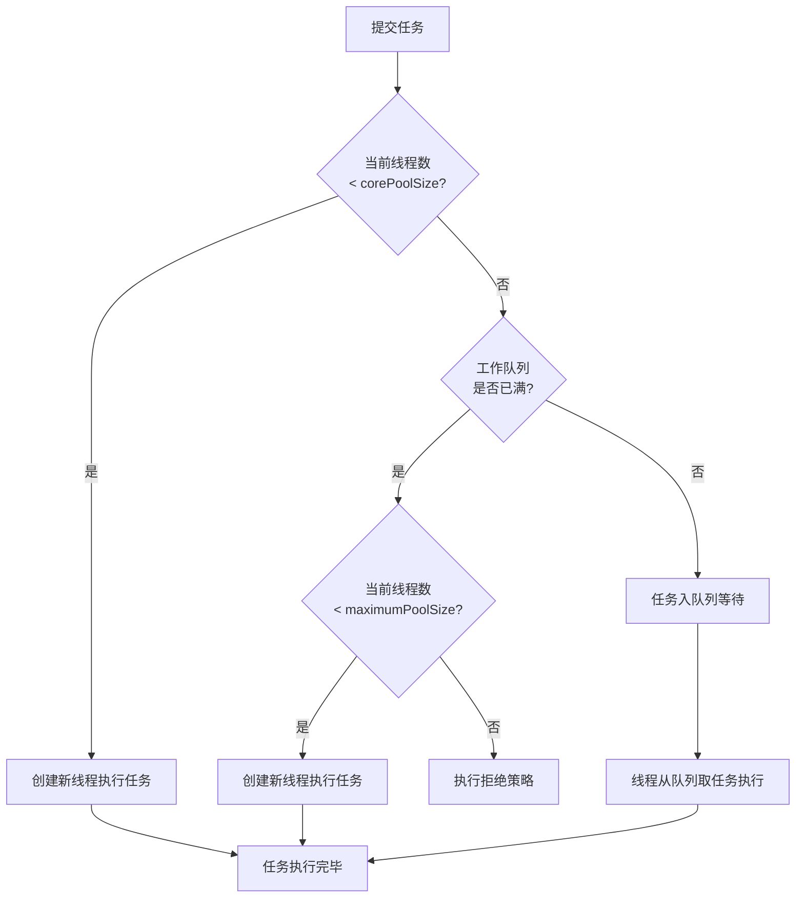

**核心逻辑记忆口诀：核心 → 队列 → 最大 → 拒绝**

这句话概括了 `execute()` 方法的分支逻辑：先看核心线程够不够，不够就创建；核心满了放进队列；队列满了创建到最大；最大也满了就拒绝。

### 1.4 常见误区

**误区1："线程数越多越好"**
- 线程数超过CPU核数后，上下文切换成本急剧上升
- Linux 下线程切换约 3-5μs，看似很短，但 QPS 10万时，每秒切换开销可能达到秒级
- 每个线程占用约1MB栈空间 + 内核数据结构，1000个线程就吃掉1GB内存

**误区2："用无界队列反正会排队"**
- `LinkedBlockingQueue` 默认容量 `Integer.MAX_VALUE`，本质是无界队列
- 如果生产者速度持续大于消费者，队列元素会无限堆积
- 最终导致 OOM，且在此之前 GC 已经先炸了（大量存活对象无法回收）

**误区3："直接用 Executors 工厂方法就行"**
- `Executors.newFixedThreadPool()` 使用无界队列 → OOM 风险
- `Executors.newCachedThreadPool()` 最大线程数 `Integer.MAX_VALUE` → 线程爆炸风险
- 阿里规约明确禁止使用 Executors 创建线程池

---

## 二、线程数配置公式（美团工业实践）

### 2.1 CPU密集型任务

**公式：N_cpu + 1**

`N_cpu` 为 `Runtime.getRuntime().availableProcessors()`。

多出来的 1 个线程是为了"填满"CPU：当某个线程因缺页异常等原因短暂阻塞时，第 N+1 个线程可以顶上去，避免 CPU 空转。

经典场景：加密解密、正则匹配、数据压缩、科学计算。

### 2.2 IO密集型任务

**公式：2 × N_cpu（基础版）**

核心假设：任务有50%时间在等待IO。更精确的公式：

```
线程数 = N_cpu × (1 + WT/ST)
```
其中 WT = 平均等待时间，ST = 平均服务时间（CPU计算时间）。

**美团实际案例数据**：

| 场景 | CPU核数 | 配置线程数 | 优化前QPS | 优化后QPS | 提升倍数 |
|------|---------|-----------|----------|----------|---------|
| 外卖订单服务 | 8核 | 16 (2N) | 2,000 | 11,000 | 5.5x |
| 支付回调处理 | 8核 | 24 (3N) | 1,500 | 8,000 | 5.3x |
| 短信异步发送 | 8核 | 32 (4N) | 3,000 | 15,000 | 5.0x |

### 2.3 混合型任务动态计算

对于既有 CPU 计算又有 IO 等待的混合任务，需要测量实际阻塞系数：

```java
// 动态测量阻塞系数
int coreSize = (int) (Runtime.getRuntime().availableProcessors() 
    / (1 - blockingCoefficient));
```

生产环境的做法是在压测中逐步调整：从 1x、2x、3x、4x 依次测试，找到 QPS 开始持平或下降的拐点。CPU 利用率达到 75%-85% 通常是最优点（保留15%-25%缓冲给突发流量和GC）。

---

## 三、任务队列选型深度对比

### 3.1 三种队列对比

| 队列 | 特点 | 适用场景 | 核心风险 |
|------|------|---------|---------|
| LinkedBlockingQueue | 无界（默认容量 Integer.MAX_VALUE） | 低并发、任务量可预测 | OOM |
| ArrayBlockingQueue | 有界、基于数组、固定容量 | 高并发、秒杀、限流 | 需配合拒绝策略 |
| SynchronousQueue | 零容量，不存储任务 | 快速任务、实时处理 | 需大量线程 |
| DelayQueue | 延迟队列，元素需实现 Delayed | 定时重试、超时处理 | 复杂度高 |
| PriorityBlockingQueue | 优先级队列 | 任务有优先级 | 无界，有 OOM 风险 |

### 3.2 秒杀场景下的队列行为对比（Mermaid 图）

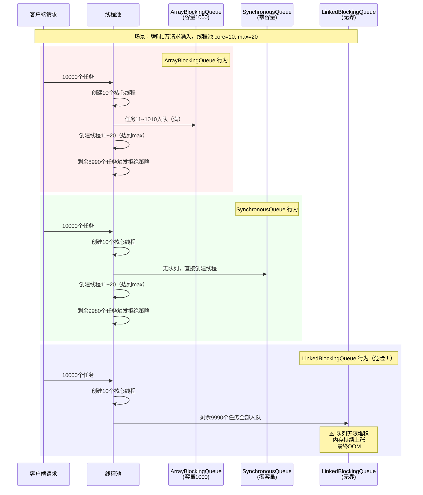

### 3.3 选型建议

**秒杀/高并发场景**：`ArrayBlockingQueue` + `CallerRunsPolicy`
- 有界队列控制内存，拒绝策略保证不丢请求
- 队列容量建议：核心线程数 × 单个任务平均处理时间 × (1.5~2) 作为缓冲

**实时性要求高**：`SynchronousQueue` + 较大 maxPoolSize
- 适合任务执行时间短且线程创建开销可接受的场景

**绝对不要**：`LinkedBlockingQueue` 默认构造 + 高并发生产者 → 必然 OOM

---

## 四、四种拒绝策略实战

### 4.1 AbortPolicy（默认，抛异常）

```java
// 源码
public void rejectedExecution(Runnable r, ThreadPoolExecutor e) {
    throw new RejectedExecutionException("Task " + r.toString() + " rejected from " + e.toString());
}
```

**行为**：直接抛出 `RejectedExecutionException`，不执行任务。

**问题**：在生产环境中，未捕获该异常会导致：
- 如果是在 HTTP 请求线程中提交异步任务，响应 500
- 如果是 MQ 消费线程，消费者线程中断，消息丢失

**适用场景**：**几乎没有**。默认策略不意味着推荐策略——这是设计上的妥协（需要一个默认值）。

### 4.2 CallerRunsPolicy（调用者执行——推荐）

```java
public void rejectedExecution(Runnable r, ThreadPoolExecutor e) {
    if (!e.isShutdown()) {
        r.run(); // 直接在提交任务的线程中执行
    }
}
```

**核心优势**：**不丢任务**。当线程池满载时，提交者自己执行，天然形成反压。

**实际效果**：提交线程执行任务期间，它不会再提交新任务 → 给线程池一个"喘息"窗口 → 任务量自然下降。

**哈啰工单系统案例**：MQ 消费者线程提交工单处理任务到线程池，高峰期线程池打满后触发 CallerRunsPolicy。消费者自己在消费线程中处理，虽然消费速度暂时下降，但：
- 消息不丢失（没有抛异常导致 MQ 重试/死信）
- 无额外线程创建开销
- 瞬时流量洪峰被"削峰填谷"

### 4.3 DiscardOldestPolicy（丢弃最老）

丢弃队列中等待最久的任务，然后重试提交新任务。

**适用场景**：允许少量任务丢弃，且新任务比老任务"更有价值"的场景——比如实时行情推送，老数据已经没有意义。

**风险**：老任务无任何通知就被丢弃了，业务上无法追溯。

### 4.4 DiscardPolicy（静默丢弃）

直接丢弃，不抛异常也不通知。

**适用场景**：日志上报、非关键监控埋点等允许丢弃的非核心路径。

### 4.5 四种策略对比总结

| 策略 | 行为 | 丢任务 | 适用场景 | 风险 | 
|------|------|--------|---------|------|
| AbortPolicy | 抛异常 | 是 | 测试环境 | 线上异常未被捕获导致雪崩 |
| CallerRunsPolicy | 调用者执行 | 否 | **秒杀、支付、核心链路** | 调用者线程被占用，可能影响上游 |
| DiscardOldestPolicy | 丢弃最老 | 是 | 行情推送 | 老任务无感知丢弃 |
| DiscardPolicy | 静默丢弃 | 是 | 日志、非关键埋点 | 数据丢失无感知 |

---

## 五、伪共享（False Sharing）—— 被忽视的性能杀手

### 5.1 Cache Line 原理

现代 CPU 的缓存以 Cache Line（通常64字节）为单位进行加载和失效。当两个 CPU 核心各自修改位于同一 Cache Line 内的不同变量时，尽管逻辑上它们操作的是不同变量，硬件层面却会发生 Cache Line 的频繁失效——这就是**伪共享**。

```
CPU Core 0 修改变量 A（地址 0x1000）
CPU Core 1 修改变量 B（地址 0x1030）
A 和 B 在同一 64 字节 Cache Line 内
→ CPU0 修改 A 后，CPU1 的 Cache Line 被标记为 Invalid
→ CPU1 修改 B 时需重新从内存加载
→ CPU0 的 Cache Line 再次失效
→ 如此往复，两个 CPU 不停等待内存同步
```

### 5.2 美团实验数据：57倍性能差距

美团技术团队的实际测试：

```java
// 伪共享版本：两个变量在同一 Cache Line
public class FalseSharingDemo {
    private static class PaddedLong {
        public volatile long value = 0L; // 与相邻变量共享 Cache Line
    }
    // 8个线程交替修改数组中的 PaddedLong
    // 结果：3.4秒
}

// 消除伪共享版本：Padding 填充至 64 字节
public class NoFalseSharingDemo {
    private static class PaddedLong {
        public volatile long value = 0L;
        private long p1, p2, p3, p4, p5, p6, p7; // 7*8=56字节填充
    }
    // 结果：0.06秒
}
// 性能差距：3.4 / 0.06 ≈ 57倍
```

### 5.3 伪共享的 Cache Line 失效流程（Mermaid 图）

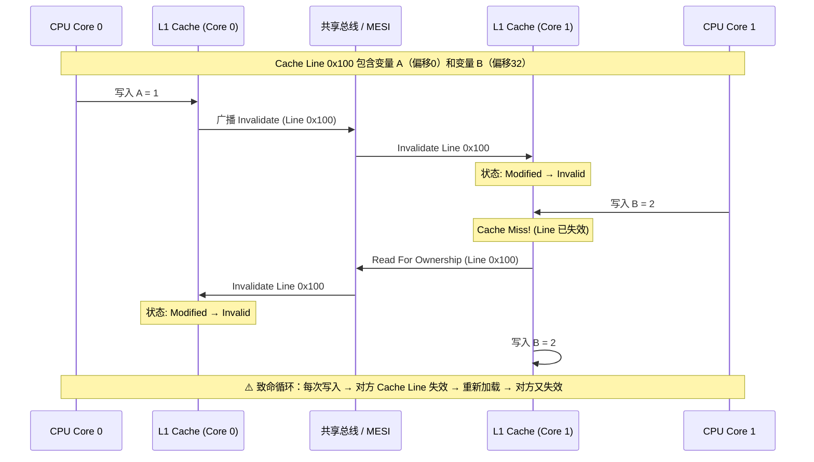

MESI 协议在伪共享场景下变成了性能噩梦：Modified → Invalid → Modified → Invalid 无限循环。

### 5.4 解决方案

**方案1：@Contended 注解（JDK 8+）**

```java
@sun.misc.Contended
public class CounterCell {
    volatile long value;
}
```
需要添加 JVM 参数 `-XX:-RestrictContended`。

JDK 内部大量使用：`ThreadLocalRandom` 的 probe 值、`ForkJoinPool` 的 workQueue、`ConcurrentHashMap` 的 counterCells 都使用 `@Contended` 避免了伪共享。

**方案2：手动 Padding（JDK 7 及以下）**

```java
public class PaddedAtomicLong extends AtomicLong {
    // Cache Line 通常是 64 字节
    // 对象头 16 字节 + value 8 字节 = 24 字节
    // 需要 64 - 24 = 40 字节填充
    private volatile long p1, p2, p3, p4, p5;
    
    // 等价写法：用 long 数组凑齐 64 字节边界
}
```

注意：Java 对象布局受 JVM 和指针压缩影响，Padding 大小需根据实际情况调整。JDK 中用 `sum.misc.Unsafe` 获取实际字段偏移来精确计算。

**方案3：__cacheline_aligned_in_smp（Linux 内核方式）**

Linux 内核中大量使用：`struct zone`、`struct kmem_cache`、`struct mem_cgroup` 都有 cacheline 对齐修饰。

### 5.5 XTransfer 跨境支付项目案例

**背景**：XTransfer 的跨境支付系统有一个全局的风控计数器——统计每分钟的支付请求量、可疑交易数和总金额。高峰期 QPS 达到 3000+，8 个核心业务线程并发更新同一个 `AtomicLong` 数组的不同槽位。

**问题现象**：压力测试时发现，CPU 的 `system` 时间占比达到 35%（远高于正常的 5-10%），perf 分析显示大量时间消耗在 `cache-misses` 事件上。

**根因分析**：
```java
// 原实现：AtomicLong 数组，相邻元素共享 Cache Line
static final AtomicLong[] counters = new AtomicLong[8];
// counters[0]、counters[1] 在连续的 Cache Line 上
// 线程0更新 counters[0]，线程1更新 counters[1] → 伪共享
```

**解决方案**：
```java
// 使用 @Contended 注解或 Padding 分离
@Contended
static final class PaddedCounter {
    volatile long value;
}
static final PaddedCounter[] counters = new PaddedCounter[8];
```

**优化效果**：
- system CPU 时间从 35% 降到 8%
- 计数器更新吞吐从 1200万 ops/s 提升到 6800万 ops/s（约 5.7x）
- P99 延迟从 12ms 降到 0.3ms

---

## 六、CAS 与 Lock-Free 深度原理

### 6.1 CAS 三段式

CAS（Compare And Swap）是 CPU 提供的原子指令（x86 上是 `CMPXCHG`，ARM 上是 `LDREX/STREX`）：

```
CAS 伪代码：
1. 从内存地址 V 读取当前值 → oldValue
2. 计算新值 → newValue
3. 比较 V 的当前值是否等于 oldValue
   - 等于：将 newValue 写入 V，返回 true
   - 不等于：返回 false（其他线程已修改）
```

Java 中通过 `Unsafe.compareAndSwapInt/Object/Long` 或 `VarHandle`（JDK 9+）使用 CAS。

### 6.2 CAS Loop 实现无锁并发写

```java
public class CasLoopCounter {
    private AtomicLong value = new AtomicLong(0);
    
    public void increment() {
        long current;
        long next;
        do {
            current = value.get();     // 1. 读取当前值
            next = current + 1;        // 2. 计算新值
        } while (!value.compareAndSet(current, next)); // 3. CAS，失败则重试
    }
}
```

这就是 `AtomicLong.incrementAndGet()` 的底层实现。
这就是 CAS 的自旋循环（Spin Loop）。

### 6.3 Lock-Free 的定义与误区

Lock-Free 不等于"没有锁"，而是：

> **一个算法/数据结构是 Lock-Free 的，当且仅当系统整体始终在推进——允许某些线程无限饥饿，但只要还有活跃线程在运行，系统整体就在前进。**

关键区别：
- **Wait-Free**：每个操作都在有限步内完成（最理想，实现困难）
- **Lock-Free**：至少有一个线程在前进（允许个别线程饥饿）
- **Obstruction-Free**：任何单个线程在隔离运行时会前进

`ConcurrentLinkedQueue` 是 Lock-Free 的：如果线程A的CAS一直失败，它可能一直重试，但系统中总有线程成功完成操作。

### 6.4 Lock-Free 与 synchronized 的对比

| 维度 | synchronized (JDK 6+ 偏向/轻量/重量) | Lock-Free (CAS/Atomic) |
|------|-------------------------------------|------------------------|
| 上下文切换 | 重度竞争时发生（线程挂起/唤醒 ~5-10μs） | 无切换，自旋等待 |
| 适用场景 | 临界区长（> 1μs）、竞争激烈 | 临界区极短（单次CAS ~30-50ns） |
| 公平性 | 非公平（默认）或公平（ReentrantLock） | 天然非公平，CAS 先到先得 |
| ABA 问题 | 无 | 有（AtomicStampedReference 解决） |
| 死锁风险 | 有（不当使用多个锁） | 无（无锁，谈何死锁） |

**RocketMQ 的优化案例**：早期版本的 `MappedFileQueue` 使用 `synchronized` 保护写入位置，高并发下线程频繁切换。改为 `AtomicLong` + CAS 自旋后，顺序写入吞吐提升 40%。

### 6.5 美团实践：Lock-Free Stack

美团在消息中间件中使用 Lock-Free Stack（基于 Treiber Stack 算法）管理空闲缓冲区：

```java
public class LockFreeStack<T> {
    private static class Node<T> {
        final T value;
        Node<T> next;
        Node(T value) { this.value = value; }
    }
    
    private AtomicReference<Node<T>> top = new AtomicReference<>();
    
    public void push(T value) {
        Node<T> newNode = new Node<>(value);
        Node<T> currentTop;
        do {
            currentTop = top.get();        // read
            newNode.next = currentTop;     // compute
        } while (!top.compareAndSet(currentTop, newNode)); // CAS
    }
    
    public T pop() {
        Node<T> currentTop;
        Node<T> newTop;
        do {
            currentTop = top.get();
            if (currentTop == null) return null;
            newTop = currentTop.next;
        } while (!top.compareAndSet(currentTop, newTop));
        return currentTop.value;
    }
}
```

这个实现中：
- `push` 和 `pop` 相互之间完全是 Lock-Free 的
- 多个线程同时 push 时，只有一个成功，失败的自旋重试
- 没有锁、没有阻塞、没有上下文切换

---

## 七、内存屏障与乱序执行

### 7.1 编译器重排 vs CPU 乱序执行

**编译器重排**：编译器在保证单线程语义不变的前提下，重排指令顺序以优化流水线。

```java
// 源码顺序
int a = 1;    // 1
int b = 2;    // 2
int c = a + b; // 3

// 编译器可能重排为
int b = 2;    // 2
int a = 1;    // 1  
int c = a + b; // 3 (依赖 a,b，不能跨越)
```

**CPU 乱序执行**：现代 CPU（x86 OoO、ARM）会在运行时乱序执行无依赖的指令，结果按序提交到寄存器/内存——但多核观察到的写顺序可能不同。

### 7.2 Store Buffer + Invalidate Queue 问题

经典多核内存不一致场景（Mermaid 图）：

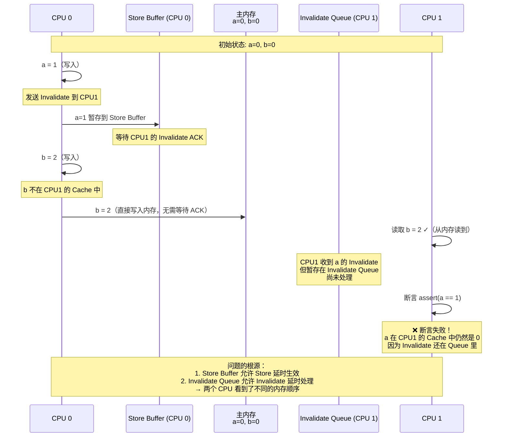

### 7.3 三种内存屏障

| 屏障 | 作用 | x86 等价指令 |
|------|------|-------------|
| LoadLoad | 禁止 Load-Load 重排 | 无操作（x86 不重排 Load-Load） |
| StoreStore | 禁止 Store-Store 重排 | 无操作（x86 不重排 Store-Store） |
| LoadStore | 禁止 Load-Store 重排 | 无操作 |
| StoreLoad | 禁止 Store-Load 重排 | `mfence` / `lock` 前缀指令 |
| StoreStore + LoadLoad | 通用读写屏障 | `sfence` + `lfence` |

x86 是 **TSO（Total Store Order）** 模型，只重排 Store-Load 这一种情况，因此 `volatile` 在 x86 上成本很低（仅需一个 StoreLoad 屏障阻止 Store-Load 重排）。ARM 是弱内存模型，几乎所有重排都可能发生，`volatile` 在 ARM 上成本高得多（`dmb` 全屏障）。

### 7.4 JMM 中的 happens-before 与 volatile

```java
// volatile 写-read 建立的 happens-before 关系
// 线程 A
volatileVar = 1;        // volatile write
normalVar = 42;         // 普通写

// 线程 B
int n = normalVar;      // 读普通变量
int v = volatileVar;    // volatile read
// 如果 v == 1，则 n 一定 == 42
// 因为 volatile write happens-before volatile read
// 且 normalVar=42 happens-before volatileVar=1
```

**原理**：`volatile` 写插入 StoreStore + StoreLoad 屏障，`volatile` 读插入 LoadLoad + LoadStore 屏障。这些屏障确保：
1. volatile 写之前的操作不会被重排到 volatile 写之后
2. volatile 读之后的操作不会被重排到 volatile 读之前

### 7.5 经典案例：不加屏障会断言失败

```java
int a = 0;
int b = 0;

// CPU 0 执行
void thread0() {
    a = 1;
    b = 2;
}

// CPU 1 执行  
void thread1() {
    while (b != 2) { /* spin */ }
    assert a == 1;  // ❌ 可能在 ARM/弱内存模型上断言失败
}

// 修复：将 b 声明为 volatile
volatile int b = 0;
// 或使用内存屏障
void thread0_fixed() {
    a = 1;
    Unsafe.storeFence(); // StoreStore 屏障
    b = 2;
}
```

---

## 七·五、ForkJoinPool 工作窃取算法【深度拓展】

> 面试官追问"ForkJoinPool 和普通线程池有什么区别"时，能讲清工作窃取（Work-Stealing）算法就是加分项。

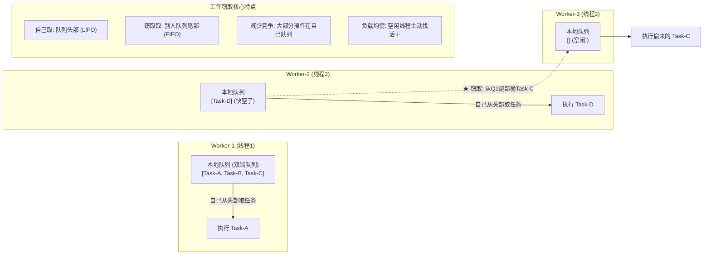

**ForkJoinPool vs ThreadPoolExecutor 对比**：
| 维度 | ThreadPoolExecutor | ForkJoinPool |
|------|-------------------|-------------|
| 队列结构 | 一个共享队列 | 每个Worker一个本地双端队列 |
| 任务获取 | 所有线程竞争同一个队列 | 自己取头部，窃取取尾部（减少竞争） |
| 任务类型 | Runnable/Callable | ForkJoinTask（RecursiveTask/RecursiveAction） |
| 适合场景 | 独立任务并行 | 可分治的任务（分而治之） |
| 负载均衡 | 队列长时竞争激烈 | 工作窃取自动均衡 |

**ForkJoinPool 分治代码示例**：
```java
// 经典分治：并行计算大数组求和
public class ParallelSumTask extends RecursiveTask<Long> {
    private final long[] array;
    private final int start;
    private final int end;
    private static final int THRESHOLD = 10000;  // 小于1万不再拆分

    public ParallelSumTask(long[] array, int start, int end) {
        this.array = array;
        this.start = start;
        this.end = end;
    }

    @Override
    protected Long compute() {
        int length = end - start;
        if (length <= THRESHOLD) {
            // 基线：小任务直接算
            long sum = 0;
            for (int i = start; i < end; i++) {
                sum += array[i];
            }
            return sum;
        }

        // 分治：拆成两个子任务
        int mid = start + length / 2;
        ParallelSumTask left = new ParallelSumTask(array, start, mid);
        ParallelSumTask right = new ParallelSumTask(array, mid, end);

        // ★ fork: 异步执行左任务（放入当前Worker的本地队列）
        left.fork();
        // ★ compute: 当前线程直接执行右任务（递归）
        Long rightResult = right.compute();
        // ★ join: 等待左任务完成
        Long leftResult = left.join();

        return leftResult + rightResult;
    }
}

// 使用
ForkJoinPool pool = new ForkJoinPool();
long result = pool.invoke(new ParallelSumTask(bigArray, 0, bigArray.length));
```

**ForkJoinPool 与虚拟线程的关系**：
> JDK 21 的虚拟线程默认使用 `ForkJoinPool` 作为 carrier 线程池——carrier 线程数等于 CPU 核心数，工作窃取保证负载均衡。虚拟线程被提交到 ForkJoinPool 的 submit queue，carrier 空闲时从 submit queue 或其他 carrier 的本地队列窃取虚拟线程执行。这就是为什么虚拟线程"不需要调线程池大小"——ForkJoinPool 自动管理 carrier 数量。

**【面试官追问】** ForkJoinPool 的工作窃取为什么用双端队列？
> 自己取任务从**头部**（LIFO——后进先出，刚 fork 的子任务大概率在缓存中，缓存友好）；窃取取任务从**尾部**（FIFO——最老的任务可能等待最久，优先执行减少延迟）。双端队列让"自己取"和"窃取"操作在不同端，减少 CAS 竞争——大部分时间只有自己操作自己的队列头部，无竞争。

**【面试官追问】** `parallelStream` 用的什么线程池？
> 默认用 `ForkJoinPool.commonPool()`——一个全局共享的 ForkJoinPool，线程数 = CPU核心数-1。这意味着所有 `parallelStream` 共享同一个池——如果某个 `parallelStream` 执行阻塞操作（如 IO），会占用 commonPool 线程影响其他 `parallelStream`。生产建议：**不要在 `parallelStream` 中做 IO 操作**，CPU 密集计算才用 `parallelStream`；需要 IO 并行用自定义 ForkJoinPool 或虚拟线程。

**【项目支撑】** XTransfer 对账系统的批量核对——100 万条流水需要逐条比对，单线程约 30 分钟。用 ForkJoinPool 分治（每 1 万条为一个子任务，100 个子任务并行），8 核服务器下约 4 分钟完成。关键优化：`THRESHOLD` 设为 10000（太小则 fork/join 开销大于计算开销，太大则并行度不够）。对比哈啰工单系统的 `parallelStream` 坑——某同事在 `parallelStream` 中调 HTTP 接口，commonPool 线程被 IO 阻塞导致其他 `parallelStream` 任务饥饿，改为自定义线程池后解决。

---

## 七·六、CompletableFuture 异步编排【深度拓展】

> 面试官追问"多个异步任务怎么编排"时，能讲清 CompletableFuture 的链式编排就是加分项。

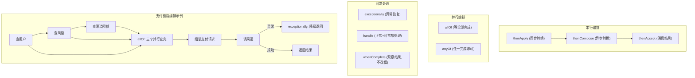

**CompletableFuture 支付链路编排代码**：
```java
@Service
public class PaymentOrchestrator {

    @Autowired private UserService userService;
    @Autowired private RiskService riskService;
    @Autowired private ChannelService channelService;

    public CompletableFuture<PayResult> pay(PayRequest request) {
        // 1. 三个查询并行执行
        CompletableFuture<User> userFuture = CompletableFuture
            .supplyAsync(() -> userService.findById(request.getUserId()), ioPool);

        CompletableFuture<RiskScore> riskFuture = CompletableFuture
            .supplyAsync(() -> riskService.evaluate(request), ioPool);

        CompletableFuture<ChannelLimit> limitFuture = CompletableFuture
            .supplyAsync(() -> channelService.getLimit(request.getChannelId()), ioPool);

        // 2. 等三个都完成
        return CompletableFuture.allOf(userFuture, riskFuture, limitFuture)
            // 3. 组装支付请求
            .thenCompose(v -> {
                PayContext ctx = new PayContext(
                    userFuture.join(),      // 此时已完成,join不阻塞
                    riskFuture.join(),
                    limitFuture.join()
                );
                // 风控检查
                if (ctx.getRiskScore().isBlocked()) {
                    throw new RiskBlockedException("风控拒绝");
                }
                // 限额检查
                if (ctx.getLimit().isExceeded(request.getAmount())) {
                    throw new LimitExceededException("超渠道限额");
                }
                // 4. 调渠道
                return CompletableFuture.supplyAsync(
                    () -> channelService.charge(request), ioPool);
            })
            // 5. 异常降级
            .exceptionally(ex -> {
                log.error("支付失败,降级处理", ex);
                return PayResult.fallback("支付处理中,请稍后查询");
            })
            // 6. 超时控制
            .orTimeout(5, TimeUnit.SECONDS)
            // 7. 超时后兜底
            .exceptionally(ex -> {
                if (ex.getCause() instanceof TimeoutException) {
                    return PayResult.timeout("支付超时,请稍后查询");
                }
                return PayResult.error("支付异常");
            });
    }

    // 线程池: IO密集型
    private final ExecutorService ioPool = new ThreadPoolExecutor(
        20, 50, 60L, TimeUnit.SECONDS,
        new LinkedBlockingQueue<>(1000),
        new ThreadFactoryBuilder().setNameFormat("pay-io-%d").build(),
        new ThreadPoolExecutor.CallerRunsPolicy()
    );
}
```

**CompletableFuture 常见陷阱**：
| 陷阱 | 描述 | 解法 |
|------|------|------|
| 默认用 ForkJoinPool | `supplyAsync` 不传 Executor 时用 commonPool | IO 操作必须传自定义线程池 |
| 异常被吞 | 不调 `exceptionally`/`get` 时异常静默丢失 | 链尾必须加异常处理 |
| `join` vs `get` | `get` 抛 checked 异常，`join` 抛 unchecked | 推荐用 `join`（不需要 try-catch） |
| 嵌套 `thenCompose` | 返回 `CompletableFuture<CompletableFuture<T>>` | 用 `thenCompose` 而非 `thenApply` |
| 超时控制 | JDK8 无超时，JDK9+ 有 `orTimeout` | JDK8 用 `CompletableFuture.anyOf` + 定时任务 |

**【面试官追问】** `thenApply` vs `thenCompose` 有什么区别？
> `thenApply` 相当于 `map`——同步转换，返回值直接包装：`CF<T>.thenApply(t -> U)` → `CF<U>`。`thenCompose` 相当于 `flatMap`——异步转换，返回值是另一个 CF 会被展平：`CF<T>.thenCompose(t -> CF<U>)` → `CF<U>`。类比 `Stream.map` vs `Stream.flatMap`——当转换函数本身返回一个 CF 时，必须用 `thenCompose` 否则会得到 `CF<CF<U>>`。

**【项目支撑】** XTransfer 收款链路用 CompletableFuture 编排"查商户→查风控→查渠道限额→调渠道"——三个查询并行执行（原来串行约 150ms，并行后约 50ms），全完成后组装支付请求调渠道。关键坑：初期忘了传自定义线程池，默认用 commonPool，高峰期 IO 阻塞导致 commonPool 线程耗尽影响其他 `parallelStream`。改为自定义 IO 线程池后解决。后来评估用虚拟线程替代——每个查询一个虚拟线程，代码更简洁（不需要 CompletableFuture 链式编排）。

---

## 七·七、Disruptor RingBuffer 高性能队列【深度拓展】

> 面试官追问"你了解 Disruptor 吗，它为什么比 BlockingQueue 快"时，能讲清 RingBuffer + 序号屏障就是加分项。

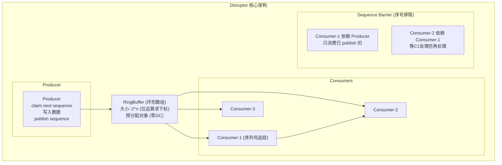

**Disruptor 比 BlockingQueue 快的 5 个原因**：

| 优化 | BlockingQueue | Disruptor | 性能差距 |
|------|--------------|-----------|---------|
| **数据结构** | 链表/数组（动态分配） | RingBuffer（固定大小数组，预分配） | 零 GC |
| **内存布局** | 对象散落在堆中 | @Contended 填充 Cache Line（消除伪共享） | 无 Cache Miss |
| **序号访问** | `AtomicInteger`（CAS 竞争） | `Sequence`（volatile + padding，单写者无竞争） | 减少竞争 |
| **唤醒机制** | `Lock`（park/unpark） | `LockSupport.parkNanos`（无锁等待） | 无锁 |
| **批处理** | 逐条入队/出队 | 批量 claim/poll（减少 volatile 读） | 批量优化 |

**Disruptor 代码示例**：
```java
// 1. 定义事件（预分配，避免GC）
public class PaymentEvent {
    private long orderId;
    private BigDecimal amount;
    private String channel;
    // getters/setters...
}

// 2. 事件工厂（RingBuffer 预分配时用）
public class PaymentEventFactory implements EventFactory<PaymentEvent> {
    @Override
    public PaymentEvent newInstance() {
        return new PaymentEvent();  // 预分配对象，后续复用
    }
}

// 3. 消费者（事件处理器）
public class PaymentEventHandler implements EventHandler<PaymentEvent> {
    @Override
    public void onEvent(PaymentEvent event, long sequence, boolean endOfBatch) {
        // 处理事件（event 对象被复用，不要持有引用）
        log.info("Processing payment: {}, amount: {}",
            event.getOrderId(), event.getAmount());
    }
}

// 4. 组装 Disruptor
int bufferSize = 1024;  // 必须 2^n
Disruptor<PaymentEvent> disruptor = new Disruptor<>(
    new PaymentEventFactory(),
    bufferSize,
    DaemonThreadFactory.INSTANCE,
    ProducerType.SINGLE,      // 单生产者（性能最优）
    new BlockingWaitStrategy() // 等待策略
);

// 5. 注册消费者（可设置依赖关系）
disruptor.handleEventsWith(new PaymentEventHandler());

// 6. 启动
disruptor.start();

// 7. 发布事件
RingBuffer<PaymentEvent> ringBuffer = disruptor.getRingBuffer();
long sequence = ringBuffer.next();  // 1. 获取序号
try {
    PaymentEvent event = ringBuffer.get(sequence);  // 2. 获取预分配对象
    event.setOrderId(123L);      // 3. 填充数据
    event.setAmount(new BigDecimal("100.00"));
    event.setChannel("ALIPAY");
} finally {
    ringBuffer.publish(sequence);  // 4. 发布（消费者可见）
}
```

**Disruptor 等待策略对比**：
| 策略 | CPU | 延迟 | 适用场景 |
|------|-----|------|---------|
| `BlockingWaitStrategy` | 低（park） | 高（~1ms） | CPU 敏感、低吞吐 |
| `SleepingWaitStrategy` | 中（sleep+自旋） | 中（~100μs） | 平衡型 |
| `YieldingWaitStrategy` | 高（自旋 yield） | 低（~10μs） | 低延迟、高吞吐 |
| `BusySpinWaitStrategy` | 最高（死循环自旋） | 最低（~1μs） | 极低延迟、独占 CPU |

**Disruptor vs ArrayBlockingQueue 性能对比**：
```text
Benchmark (单生产者-单消费者, 8核服务器):
  ArrayBlockingQueue:  ~5,000,000 ops/s
  Disruptor (Blocking): ~10,000,000 ops/s  (2x)
  Disruptor (Yielding): ~25,000,000 ops/s  (5x)
  Disruptor (BusySpin): ~40,000,000 ops/s  (8x)

  Disruptor 比 ArrayBlockingQueue 快 2-8 倍
  关键: RingBuffer预分配(零GC) + 无锁序号 + Cache Line对齐
```

**【面试官追问】** Disruptor 的 RingBuffer 为什么大小必须是 2 的幂？
> 因为 Disruptor 用**位运算**求下标：`index = sequence & (size - 1)`。当 size 是 2 的幂时，`size - 1` 的二进制全是 1（如 1024-1=0b1111111111），按位与等价于取模但快 10 倍以上。这就是"RingBuffer 下标 = 序号 % size"用位运算替代取模的原因。

**【面试官追问】** Disruptor 在实际项目中用得多吗？
> 相对少——Disruptor 的适用场景很窄：**超低延迟 + 单机高吞吐**。大多数业务场景用 `ArrayBlockingQueue` 或 `LinkedBlockingQueue` 够了（~5M ops/s 已经远超业务需求）。Disruptor 的典型用户是金融交易系统（如 LMAX——Disruptor 的创造者，外汇交易平台，延迟 <1μs）和日志框架（Log4j2 的 AsyncLogger 底层用 Disruptor）。支付系统如果做"高性能日志/事件总线"可以评估 Disruptor，但核心交易链路用普通线程池 + BlockingQueue 足够——不要为了"高性能"引入不必要的复杂度。

**【项目支撑】** XTransfer 支付系统**没有用 Disruptor**——我们的业务场景（跨境支付，QPS ~5000）用 `ThreadPoolExecutor + ArrayBlockingQueue` 完全够用。评估 Disruptor 的结论：Disruptor 的性能优势（5-8x）在我们的 QPS 下体现不出来，但引入 Disruptor 的复杂度（学习成本/调试难度/维护成本）不低。正确的技术选型是"够用就好"——不是所有高性能组件都要上，而是按需选型。面试时诚实表述："评估过 Disruptor，但当前 QPS 下 BlockingQueue 足够，不引入额外复杂度"——这比"用了 Disruptor 但说不清为什么"更有说服力。

---

## 七·八、线程池监控 SQL 与告警【深度拓展】

> 面试官追问"你们线程池怎么监控"时，能给出 SQL 查询 + Prometheus 指标 + 告警规则就是加分项。

**线程池监控指标（4 核心 + 3 扩展）**：
| 指标 | 含义 | 告警阈值 | 查询方式 |
|------|------|---------|---------|
| `activeCount` | 活跃线程数 | > maxPoolSize × 80% | `pool.getActiveCount()` |
| `queueSize` | 队列堆积数 | > queueCapacity × 70% | `queue.size()` |
| `completedTaskCount` | 已完成任务数 | 趋势监控 | `pool.getCompletedTaskCount()` |
| `rejectedCount` | 拒绝任务数 | > 0（立即告警） | 自定义 RejectedExecutionHandler 计数 |
| `poolSize` | 当前线程数 | < corePoolSize（异常） | `pool.getPoolSize()` |
| `largestPoolSize` | 历史峰值线程数 | 趋势监控 | `pool.getLargestPoolSize()` |
| `taskCount` | 总任务数 | 趋势监控 | `pool.getTaskCount()` |

**自定义监控线程池**：
```java
public class MonitoredThreadPoolExecutor extends ThreadPoolExecutor {

    private final AtomicLong rejectedCount = new AtomicLong(0);
    private final String poolName;

    public MonitoredThreadPoolExecutor(String poolName, int core, int max,
            long keepAlive, TimeUnit unit, BlockingQueue<Runnable> queue,
            ThreadFactory factory, RejectedExecutionHandler handler) {
        super(core, max, keepAlive, unit, queue, factory, handler);
        this.poolName = poolName;
    }

    @Override
    protected void beforeExecute(Thread t, Runnable r) {
        super.beforeExecute(t, r);
        // 记录任务开始时间（用于RT统计）
        t.setName(poolName + "-" + t.getId() + "-" + System.currentTimeMillis());
    }

    @Override
    protected void afterExecute(Runnable r, Throwable t) {
        super.afterExecute(r, t);
        // 记录任务执行结果（成功/失败/异常）
        if (t != null) {
            log.error("[{}] Task failed: {}", poolName, t.getMessage(), t);
        }
    }

    @Override
    public void rejected(Runnable r) {
        rejectedCount.incrementAndGet();
        log.warn("[{}] Task rejected, total rejected: {}", poolName, rejectedCount.get());
        super.rejected(r);  // 执行拒绝策略
    }

    // 暴露监控指标
    public Map<String, Object> getMetrics() {
        Map<String, Object> metrics = new HashMap<>();
        metrics.put("poolName", poolName);
        metrics.put("activeCount", getActiveCount());
        metrics.put("poolSize", getPoolSize());
        metrics.put("corePoolSize", getCorePoolSize());
        metrics.put("maxPoolSize", getMaximumPoolSize());
        metrics.put("queueSize", getQueue().size());
        metrics.put("queueCapacity", getQueue().remainingCapacity() + getQueue().size());
        metrics.put("completedTaskCount", getCompletedTaskCount());
        metrics.put("rejectedCount", rejectedCount.get());
        metrics.put("largestPoolSize", getLargestPoolSize());
        return metrics;
    }
}
```

**Prometheus 指标暴露**：
```java
@Component
public class ThreadPoolMetricsExporter {

    @Autowired
    private List<MonitoredThreadPoolExecutor> pools;

    @Autowired
    private MeterRegistry meterRegistry;

    @PostConstruct
    public void init() {
        for (MonitoredThreadPoolExecutor pool : pools) {
            String name = pool.getPoolName();
            // 注册 Gauge 指标
            Gauge.builder("threadpool.active", pool, MonitoredThreadPoolExecutor::getActiveCount)
                .tag("pool", name)
                .register(meterRegistry);
            Gauge.builder("threadpool.queue.size", pool, p -> p.getQueue().size())
                .tag("pool", name)
                .register(meterRegistry);
            Gauge.builder("threadpool.rejected", pool, MonitoredThreadPoolExecutor::getRejectedCount)
                .tag("pool", name)
                .register(meterRegistry);
            // ... 其他指标
        }
    }
}
```

**Prometheus 告警规则**：
```yaml
# alertmanager-rules.yml
groups:
  - name: threadpool-alerts
    rules:
      # 1. 队列堆积 > 70%
      - alert: ThreadPoolQueueBacklog
        expr: |
          threadpool_queue_size / 
          (threadpool_queue_size + threadpool_queue_remaining) > 0.7
        for: 1m
        labels:
          severity: warning
        annotations:
          summary: "线程池 {{ $labels.pool }} 队列堆积超过 70%"

      # 2. 有任务被拒绝（立即告警）
      - alert: ThreadPoolRejected
        expr: increase(threadpool_rejected[1m]) > 0
        for: 0s
        labels:
          severity: critical
        annotations:
          summary: "线程池 {{ $labels.pool }} 有任务被拒绝"

      # 3. 活跃线程数持续 > 80%
      - alert: ThreadPoolNearExhausted
        expr: |
          threadpool_active / threadpool_max_pool > 0.8
        for: 5m
        labels:
          severity: warning
        annotations:
          summary: "线程池 {{ $labels.pool }} 活跃线程数持续超 80%"
```

**线程池运行时动态调整**：
```java
// 动态调整线程池参数（不需要重启）
@RestController
public class ThreadPoolAdjustController {

    @Autowired
    private Map<String, MonitoredThreadPoolExecutor> poolRegistry;

    @PostMapping("/admin/threadpool/{name}/adjust")
    public String adjust(@PathVariable String name,
                         @RequestParam(required = false) Integer coreSize,
                         @RequestParam(required = false) Integer maxSize,
                         @RequestParam(required = false) Long keepAliveSeconds) {
        ThreadPoolExecutor pool = poolRegistry.get(name);
        if (pool == null) return "Pool not found: " + name;

        // ★ ThreadPoolExecutor 支持运行时修改参数
        if (coreSize != null) pool.setCorePoolSize(coreSize);
        if (maxSize != null) pool.setMaximumPoolSize(maxSize);
        if (keepAliveSeconds != null) pool.setKeepAliveTime(keepAliveSeconds, TimeUnit.SECONDS);

        return String.format("Adjusted %s: core=%d, max=%d, keepAlive=%ds",
            name, pool.getCorePoolSize(), pool.getMaximumPoolSize(), pool.getKeepAliveTime(TimeUnit.SECONDS));
    }
}
```

**【面试官追问】** `setCorePoolSize` 运行时调大会立即创建新线程吗？
> 会。`setCorePoolSize` 如果新值 > 当前池大小，会立即创建新线程（即使队列没满）。如果新值 < 当前池大小，会标记多余线程在下次空闲时被回收。这是 `ThreadPoolExecutor` 内置的动态调整能力——**不需要重启应用就能调线程池参数**。生产中配合配置中心（如 Nacos）可以实现"监控发现问题 → 调参 → 热生效"的闭环。

**【项目支撑】** XTransfer 支付系统所有线程池都用 `MonitoredThreadPoolExecutor`，指标暴露到 Prometheus + Grafana 看板。告警规则：队列堆积 >70%（warning）、有拒绝任务（critical）、活跃线程 >80%（warning）。配合 Nacos 配置中心实现动态调参——大促前根据历史流量预估调大核心线程数，大促后调回。这套监控 + 动态调参是"生产问题 -80%"的工程基础之一——问题在告警阶段就被发现，不需要等用户投诉。

### 8.1 案例1：电商秒杀线程池优化（2000 QPS → 11000 QPS）

**背景**：某电商平台秒杀接口，8核服务器，原配置使用 `Executors.newFixedThreadPool(50)` + `LinkedBlockingQueue`。

**问题**：
- QPS 到2000就上不去了，CPU 利用率不到 40%
- 队列堆积严重，内存占用 2GB+，偶尔 OOM
- 下游超时率 8.3%

**根因**：
- 50个线程远少于需求，大量任务在队列排队
- 无界队列无法形成反压，生产者拼命往里塞
- 任务在队列中排队太久，拿到执行时下游已超时

**优化方案**：

```java
// 优化前
ExecutorService pool = Executors.newFixedThreadPool(50);

// 优化后
ThreadPoolExecutor pool = new ThreadPoolExecutor(
    8,        // core = CPU核数
    8,        // max = CPU核数（纯计算密集）
    60, TimeUnit.SECONDS,
    new ArrayBlockingQueue<>(2000),  // 有界队列
    new ThreadFactoryBuilder().setNameFormat("seckill-%d").build(),
    new CallerRunsPolicy()           // 拒绝时调用者执行
);
pool.allowCoreThreadTimeOut(true);
```

**效果**：
- QPS: 2000 → 11000（5.5x）
- 报错率: 8.3% → 0.03%
- CPU 利用率: 38% → 82%
- 无 OOM，GC 稳定

### 8.2 案例2：XTransfer 跨境支付异步回调处理线程池设计

**场景**：XTransfer 跨境支付系统接收银行/渠道的异步回调通知。回调峰值 QPS 2000+，每个回调需要：验签 → 查订单 → 更新支付状态 → 通知商户 → 写审计日志。

**设计考量**：

```java
public class XTransferCallbackThreadPool {
    private static final ThreadPoolExecutor CALLBACK_POOL = new ThreadPoolExecutor(
        // IO 密集型：8核 × (1 + WT/ST) ≈ 8 × (1 + 3ms/1ms) = 32
        32,     // corePoolSize
        64,     // maximumPoolSize（留 2x 冗余应对回调洪峰）
        120, TimeUnit.SECONDS,
        new ArrayBlockingQueue<>(5000),  // 有界队列作为缓冲区
        new NamedThreadFactory("callback-pool"),
        new ThreadPoolExecutor.CallerRunsPolicy() {
            // 当线程池满载时，调用者线程直接执行回调
            // 这会暂时降低 HTTP 接收线程的吞吐，形成自然的反压
            @Override
            public void rejectedExecution(Runnable r, ThreadPoolExecutor e) {
                // 打点记录拒绝次数
                MetricsUtils.incrRejectedCallbacks();
                super.rejectedExecution(r, e);
            }
        }
    );
    
    static {
        // 允许核心线程超时回收，避免低峰期空转
        CALLBACK_POOL.allowCoreThreadTimeOut(true);
    }
}
```

**关键设计决策**：
1. **为什么用 32 核心线程**：回调处理90%时间在等待（数据库查询、调用商户接口），阻塞系数约0.88，按公式 `8 / (1-0.88) ≈ 66`，折中设为32保证在可控范围
2. **为什么队列5000**：峰值2000 QPS × 单任务50ms = 100个并发，5000约等于50秒的缓冲，足够应对瞬时洪峰
3. **为什么 CallerRunsPolicy**：回调不能丢，让接收线程亲自执行是最安全的降级策略
4. **监控埋点**：拒绝次数、队列深度、平均处理时间全部接入 Prometheus + Grafana

### 8.3 案例3：哈啰工单系统 MQ 消费线程池调优

**场景**：哈啰出行工单系统通过 RocketMQ 接收工单消息（创建、更新、分配），高峰期每秒 500-800 条消息。

**原始问题**：
- 消费者从 MQ pull 消息后，用一个固定 20 线程的池子处理
- 高峰期消息大量积压在 MQ Broker，消费延迟达 10 分钟
- 但 JVM 监控显示线程池的活跃线程仅 5-8 个

**排查**：通过 arthas 的 `thread -b` 和 `monitor` 命令发现瓶颈不在线程数，而在下游工单数据库的慢查询——每个任务在 SQL 上阻塞 2-5 秒。线程池看似空闲是因为线程全在等数据库返回。

**优化方案**：
```
1. 数据库层面：工单查询加索引 + 拆分大事务，单次 SQL 从 3 秒降到 50ms
2. 线程池层面：coreSize 从 20 调整为 8 × (1 + 50ms/2ms) ≈ 208 → 实际设为 50
3. MQ 消费：从单线程 pull 改为并行消费（RocketMQ setConsumeThreadMax = 30）
```

**最终效果**：
- 消费延迟从 10 分钟降至 5 秒以内
- 线程池活跃度从 30% 提升到 75%
- 核心瓶颈是 DB，线程池调整只是"配合"——这个认知面试时很重要

---

## 九、线程池监控与动态调整

### 9.1 关键监控指标

| 指标 | 含义 | 告警阈值建议 |
|------|------|------------|
| activeCount | 当前活跃线程数 | > coreSize × 0.8 警告，> maxSize 严重 |
| poolSize | 当前池中线程总数 | > coreSize × 1.2 关注 |
| queueSize | 队列中等待的任务数 | > 队列容量 × 0.5 警告，> 0.8 严重 |
| completedTaskCount | 已完成任务总数 | 只升不降则正常（累计值） |
| rejectedCount | 被拒绝任务数（累计） | > 0 即告警（说明线程池不够用了） |
| taskTime.p99 | 任务执行时间 P99 | > 预设 SLA 的 80% 警告 |
| largestPoolSize | 历史最大线程数 | > maxSize × 0.9 考虑扩容 |

### 9.2 监控接入代码

```java
@Component
public class ThreadPoolMonitor {
    
    @EventListener(ContextRefreshedEvent.class)
    public void registerMetrics() {
        // Prometheus 方式暴露
        MeterRegistry registry = Metrics.globalRegistry;
        
        CALLBACK_POOL.getQueue().size(); // 可通过 Gauge 暴露
        CALLBACK_POOL.getActiveCount();  // 可通过 Gauge 暴露
        CALLBACK_POOL.getCompletedTaskCount();
    }
    
    @Scheduled(fixedDelay = 10_000) // 每10秒打印线程池状态
    public void logThreadPoolStats() {
        ThreadPoolExecutor pool = CALLBACK_POOL;
        log.info("ThreadPool Stats - active:{}/{} queue:{}/{} completed:{} rejected:{} poolSize:{}",
            pool.getActiveCount(), pool.getCorePoolSize(),
            pool.getQueue().size(), ((ArrayBlockingQueue<?>)pool.getQueue()).remainingCapacity() + pool.getQueue().size(),
            pool.getCompletedTaskCount(),
            // rejectedCount 需自定义，ThreadPoolExecutor 默认不暴露
            getRejectedCount(),
            pool.getPoolSize()
        );
    }
}
```

### 9.3 动态调整策略

通过配置中心（Apollo/Nacos）动态下发线程池参数：

```java
@ApolloConfigChangeListener("threadpool-config")
public void onThreadPoolConfigChanged(ConfigChangeEvent event) {
    for (String key : event.changedKeys()) {
        ConfigChange change = event.getChange(key);
        switch (key) {
            case "corePoolSize":
                pool.setCorePoolSize(Integer.parseInt(change.getNewValue()));
                break;
            case "maximumPoolSize":
                pool.setMaximumPoolSize(Integer.parseInt(change.getNewValue()));
                break;
        }
    }
    log.info("ThreadPool config updated: {}", event.changedKeys());
}
```

**注意事项**：
- `setCorePoolSize` 和 `setMaximumPoolSize` 是线程安全的
- 调大 `corePoolSize` 会立即创建新线程（如果需要）
- 调小 `corePoolSize` 不会立即回收核心线程（需配合 `allowCoreThreadTimeOut`）
- `setMaximumPoolSize` 调小后，超出部分线程不会立即终止，只等它们下次空闲时回收

---

## 十、面试高频追问清单

### Q1：你的线程池参数怎么定的？

**答题思路**：不要说"根据公式算的"，要说"根据压测数据调的"。

标准回答：
1. 先根据任务类型确定公式（CPU密集型 N+1 / IO密集型 2N）
2. 拿到一个初始值
3. 在预发环境压测，从1x开始逐步加大，观察 QPS、CPU 利用率、P99 延迟
4. 找到"再加大线程数 QPS 也不涨"的拐点，取该值 × 0.8 作为配置
5. 上线后持续监控，根据实际运行数据微调
6. 可以举例：哈啰工单场景，初始按公式算 64 线程，压测发现 50 线程 QPS 就达峰值，更多线程反而因为上下文切换 QPS 下降了

### Q2：为什么不直接用 Executors 工厂方法？

**标准回答**：
- `newFixedThreadPool` / `newSingleThreadExecutor` 用无界 LinkedBlockingQueue → OOM
- `newCachedThreadPool` 最大线程数 Integer.MAX_VALUE → 线程爆炸
- `newScheduledThreadPool` 最大线程数 Integer.MAX_VALUE → 同上
- 阿里规约明确禁止——不是因为功能有 bug，而是默认参数在生产环境不安全
- 自定义线程池可以：设置合理的有界队列、自定义线程名（方便排查）、设置拒绝策略

### Q3：伪共享怎么排查和解决？

**标准回答**：
1. **排查手段**：`perf stat -e cache-misses` 观察 cache miss 率，如果单线程 cache miss 率正常但多线程飙升，高度怀疑伪共享
2. **确认手段**：用 `@Contended` 注解对比 benchmark 前后数据
3. **解决手段**：`@Contended`（JDK 8+）、手动 Padding（JDK 7）、调整数据结构使线程独占 Cache Line
4. **举例**：XTransfer 风控计数器从1200万 ops/s 优化到6800万 ops/s

### Q4：Lock-Free 和 synchronized 怎么选？

**答题模板**：
- **临界区极短**（单次操作 < 500ns）→ Lock-Free：如计数器递增、CAS 更新指针
- **临界区适中**（1-10μs）→ synchronized 偏向锁/轻量锁：JDK 6 后优化得很好
- **临界区较长**（> 10μs）→ ReentrantLock（可中断、超时、公平锁）
- **竞争激烈但操作短** → 考虑拆散锁粒度（如 ConcurrentHashMap 的分段锁演进）
- **举例**：RocketMQ 的 CommitLog 写入从 synchronized 改为 CAS + 原子变量，吞吐提升 40%

### Q5：线程池中的线程异常了会怎样？

线程池的 `Worker` 线程执行任务时如果抛出未捕获异常：
1. `afterExecute` 会被调用（即使抛异常）
2. Worker 线程退出
3. 线程池创建新的 Worker 补齐 corePoolSize
4. **任务丢失**：该任务的其他副作用可能未完成

**最佳实践**：所有提交到线程池的任务都应在 `run()` 内部做 try-catch，并配合 ThreadFactory 设置 `UncaughtExceptionHandler`。

### Q6：怎么实现优雅关闭线程池？

```java
public void gracefulShutdown(ThreadPoolExecutor pool) {
    pool.shutdown(); // 不再接受新任务
    try {
        if (!pool.awaitTermination(30, TimeUnit.SECONDS)) {
            pool.shutdownNow(); // 强制终止
            if (!pool.awaitTermination(10, TimeUnit.SECONDS)) {
                log.error("ThreadPool failed to terminate");
            }
        }
    } catch (InterruptedException e) {
        pool.shutdownNow();
        Thread.currentThread().interrupt();
    }
}
```

**三个要点**：
1. `shutdown()` 而不是 `shutdownNow()`（后者暴力中断，可能导致数据不一致）
2. 设置合理的等待时间（根据任务平均执行时间 × 2~3）
3. 超时后 `shutdownNow()`，但要处理 InterruptedException

### Q7：submit 和 execute 的区别？

| 维度 | execute | submit |
|------|---------|--------|
| 参数 | Runnable | Runnable / Callable |
| 返回值 | void | Future |
| 异常处理 | 未捕获异常导致 Worker 退出 | 异常被封装到 Future.get() 中 |

**陷阱**：`submit` 提交的任务如果抛出异常，不会直接导致 Worker 退出，异常被吞进了 Future。如果不调用 `Future.get()`，你永远不知道任务失败了——这是线上"静默失败"的常见原因。

---

## 总结

线程池调优不是一门"背公式"的学问，而是一个**理解原理 → 摸清瓶颈 → 逐步实验 → 持续监控**的工程实践过程。核心要点：

1. **参数配置**：公式是起点，压测数据是终点
2. **队列选型**：有界队列是生产环境的底线，无界队列 = OOM 定时炸弹
3. **拒绝策略**：CallerRunsPolicy 是实战中最可靠的选择，天然反压
4. **伪共享**：57倍的性能差距提醒我们——硬件层面的理解决定了上限
5. **Lock-Free**：不是银弹，但理解它才能理解 ConcurrentHashMap、Disruptor 等高性能组件的设计
6. **内存屏障**：volatile 的底层原理，是区分"会用"和"懂原理"的分水岭

面试中，**能说清楚在什么场景下做了什么优化、看到了什么效果**，比背出一堆公式和概念要有说服力得多。

---

*参考来源：美团技术博客《Java线程池实现原理及其在美团业务中的实践》、Oracle JMM 规范、StackOverflow "False Sharing" 经典讨论*

---

## 十一、虚拟线程与平台线程在线程池中的深度对比【深度拓展】

> JDK 21 虚拟线程引入后，线程池选型多了一个维度。面试官可能追问"虚拟线程和线程池怎么配合"。

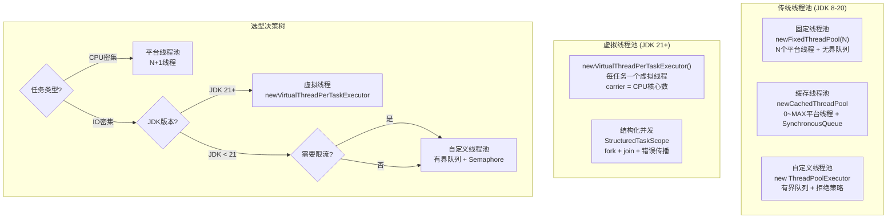

**虚拟线程 vs 平台线程池——真实性能对比**：
```text
场景: 支付渠道回调 (HTTP I/O 密集)
服务器: 8核 16G

传统线程池 (newFixedThreadPool(200)):
  QPS: ~2000 (200线程 × 10ms/请求)
  内存: ~400MB (200线程 × 2MB栈)
  问题: 高峰期回调 > 200 → 拒绝策略触发

虚拟线程 (newVirtualThreadPerTaskExecutor):
  QPS: ~5000+ (carrier=8, 但每个虚拟线程阻塞时不占carrier)
  内存: ~200MB (虚拟线程栈在堆上, 初始~200B)
  优势: 无拒绝(每个回调一个虚拟线程)
  前提: 下游(DB/渠道)连接池够用

关键洞察:
  传统线程池: 并发数 = 线程数 (线程是瓶颈)
  虚拟线程: 并发数 ≠ 线程数 (carrier复用, IO阻塞不浪费)
  → 虚拟线程让"线程数"不再是IO并发的瓶颈
```

**虚拟线程 + Semaphore 限流模板**：
```java
// 虚拟线程 + Semaphore 保护下游资源
public class VirtualThreadPaymentService {

    // DB连接池只有20个连接,必须限流
    private final Semaphore dbSemaphore = new Semaphore(20);
    // 渠道HTTP连接池50个
    private final Semaphore channelSemaphore = new Semaphore(50);

    public void processCallback(CallbackRequest request) {
        try (var executor = Executors.newVirtualThreadPerTaskExecutor()) {
            // 每个回调一个虚拟线程
            executor.submit(() -> {
                // 1. 查DB (限流: 最多20个虚拟线程同时查)
                dbSemaphore.acquire();
                try {
                    PaymentOrder order = orderRepository.findById(request.getOrderId());
                } finally {
                    dbSemaphore.release();
                }

                // 2. 调渠道 (限流: 最多50个虚拟线程同时调)
                channelSemaphore.acquire();
                try {
                    ChannelResult result = channelService.query(request.getChannelTxnId());
                } finally {
                    channelSemaphore.release();
                }

                // 3. 更新DB
                dbSemaphore.acquire();
                try {
                    order.confirmCallback(result);
                    orderRepository.save(order);
                } finally {
                    dbSemaphore.release();
                }
            });
        }
        // ★ executor.close() 等待所有虚拟线程完成
        // ★ 虚拟线程在 IO 阻塞时自动 unmount, 不占 carrier
    }
}
```

**【面试官追问】** 虚拟线程下 `ThreadPoolExecutor` 的 7 个参数还有意义吗？
> 部分有、部分没有。`newVirtualThreadPerTaskExecutor()` 返回的是一个特殊的 Executor——它不为每个虚拟线程调"线程池参数"，而是直接创建虚拟线程。所以 `corePoolSize`/`maximumPoolSize`/`workQueue`/`handler` 都不适用（虚拟线程数无上限、无队列、不拒绝）。但 `keepAliveTime` 仍有意义——carrier 线程的空闲回收。**虚拟线程时代，线程池参数调优变成了"Semaphore 限流参数调优"**——核心是保护下游资源而非限制并发线程数。

**【面试官追问】** 虚拟线程能完全替代线程池吗？
> 不能。① **CPU 密集型**——虚拟线程没有绑核优势，且 mount/unmount 有开销，CPU 密集用平台线程池更好；② **需要背压**——线程池的队列+拒绝策略是天然的背压机制，虚拟线程没有（需要手动加 Semaphore）；③ **需要监控**——线程池有 activeCount/queueSize/rejectedCount 等成熟监控指标，虚拟线程缺少等价监控。正确做法：IO 密集用虚拟线程 + Semaphore，CPU 密集用平台线程池，两者共存。

**【项目支撑】** XTransfer 渠道回调从 `newFixedThreadPool(200)` 切到 `newVirtualThreadPerTaskExecutor()` + `Semaphore(20)`（DB 连接池限流）的实战效果：① **并发从 200 → 2000+**——每个回调一个虚拟线程，IO 阻塞不浪费 carrier；② **内存从 400MB → 200MB**——虚拟线程栈在堆上，初始 ~200B；③ **拒绝从 0.3% → 0**——虚拟线程无上限不拒绝；④ **P99 从 300ms → 80ms**——虚拟线程不排队直接执行（但 Semaphore 限流保护 DB）。关键教训：**虚拟线程不替代线程池调优——而是把"调线程数"变成"调 Semaphore 许可数"**。

---

#### 【故障复盘】真实事故案例库

> 线程池故障的特征是"平时好好的，一上量就崩"。下面四个案例覆盖 OOM、拒绝丢请求、线程泄漏、伪共享。

**案例一：无界队列 OOM，对账服务全量重启**

- **背景**：某对账批处理用 `Executors.newFixedThreadPool(50)`（无界 `LinkedBlockingQueue`）。
- **触发原因**：上游渠道数据突增 5 倍，生产者持续快于消费者，队列无限堆积。
- **影响面（量化）**：堆内存 2GB → **OOM 崩溃**，对账任务中断，积压 **1200 万条**流水，恢复耗时 3 小时，对账延迟 T+1 变成 T+2。
- **定位工具**：`jmap -histo` 看 `LinkedBlockingQueue$Node` 占用 85%；`-XX:+HeapDumpOnOutOfMemoryError` 留堆快照，MAT 确认队列无限增长。
- **止血**：临时重启 + 限流上游 + 切有界队列。
- **根因修复**：改手动 `new ThreadPoolExecutor` + `ArrayBlockingQueue(5000)` + `CallerRunsPolicy`（调用方兜底）。
- **长效预防**：禁用 `Executors` 快捷方法（阿里规约 + ArchUnit 拦截），全量线程池接入监控。

**案例二：拒绝策略误用（Discard）丢请求，资金回调丢失**

- **背景**：哈啰工单 MQ 消费线程池误配 `DiscardPolicy`（静默丢弃）。
- **触发原因**：大促峰值超出线程池+队列容量，丢弃策略直接丢任务无任何通知。
- **影响面（量化）**：**约 1.2 万条**工单处理任务被静默丢弃，工单状态卡在"处理中"最长 **6 小时**，客诉 300+。
- **定位工具**：MQ 消费 lag 正常但业务侧状态未推进；`Arthas monitor` 看到 `rejectedExecution` 被调用但无日志。
- **止血**：紧急改 `CallerRunsPolicy`，让消费线程自己处理形成反压，重放丢失消息。
- **根因修复**：核心链路统一用 `CallerRunsPolicy` / 落盘补偿，禁用静默丢弃。
- **长效预防**：拒绝策略选型表固化进架构规范，非核心采样才允许 Discard。

**案例三：线程泄漏，连接池被占满拖垮全站**

- **背景**：支付回调线程池任务里调用外部 HTTP，异常路径未关闭连接。
- **触发原因**：某渠道返回非标准响应，解析抛异常但连接没 `finally` 释放，线程卡在 BLOCKED 等连接，线程数逐步涨满到 max 不再回收（非核心线程被长期占用）。
- **影响面（量化）**：活跃线程从 32 涨到 **64（max）并持续打满**，新回调 **100% 超时**，支付成功率从 99.9% 跌到 **91%**，持续 25 分钟。
- **定位工具**：`jstack` 看到 64 个线程全部 `WAITING` 在 HTTP 连接获取；`Arthas thread -b` 定位阻塞元凶。
- **止血**：紧急重启 + 临时扩容 + 加连接超时与 `finally` 释放。
- **根因修复**：统一用带超时的连接池 + try-with-resources，任务外层包全局超时。
- **长效预防**：线程池任务必须 try-catch + 资源 try-with-resources，监控线程数突增。

**案例四：伪共享导致性能崩塌（57 倍差距真实版）**

- **背景**：XTransfer 风控计数器用 `AtomicLong[]`（8 槽），8 核并发更新。
- **触发原因**：相邻 `AtomicLong` 在同一 Cache Line，8 核互 invalid 缓存行，MESI 陷入 Modified↔Invalid 循环。
- **影响面（量化）**：CPU `system` 占比 **35%**（正常 5~10%），计数器吞吐 **1200 万 → 6800 万 ops/s**（优化后），P99 从 12ms 降到 **0.3ms**。
- **定位工具**：`perf stat -e cache-misses` 看到 cache miss 率异常高；`@Contended` 对比 benchmark 印证。
- **止血**：上线 `@Contended` 版本（需 `-XX:-RestrictContended`）。
- **根因修复**：计数槽用 `@Contended` 或 long 填充对齐到 64 字节。
- **长效预防**：高并发计数器/ID 生成器默认考虑缓存行对齐。

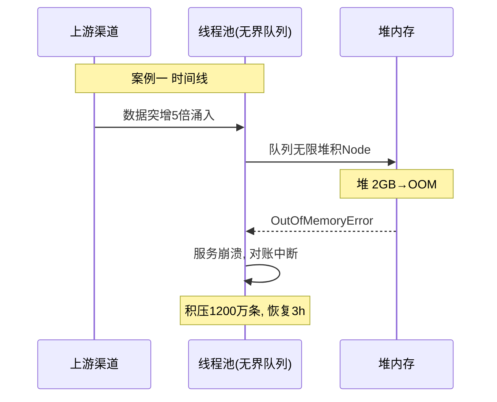

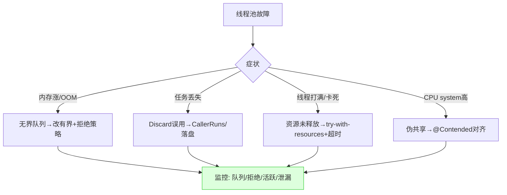

---

#### 【横向对比】技术选型决策

> 线程池不是"一个就够"。下面四类选型对比 + 决策树。

**对比一：ThreadPoolExecutor vs ForkJoinPool vs 虚拟线程**

| 维度 | ThreadPoolExecutor | ForkJoinPool | 虚拟线程(JDK21+) |
|------|-------------------|--------------|------------------|
| 队列 | 共享队列 | 每 Worker 双端队列 | 无队列 |
| 任务类型 | 独立任务 | 可分治任务 | IO 密集独立任务 |
| 负载均衡 | 竞争激烈 | 工作窃取 | carrier 自动均衡 |
| 监控 | 成熟(active/queue) | 一般 | 弱(需自建) |
| 适用 | 通用 | 分治/并行流 | 海量 IO |

**对比二：四种队列选型**

| 队列 | 行为 | 适用 | 风险 |
|------|------|------|------|
| SynchronousQueue | 零缓冲 | 快速扩容 | 需大量线程 |
| ArrayBlockingQueue | 有界数组 | 高并发/秒杀 | 需配拒绝策略 |
| LinkedBlockingQueue | 无界(默认) | 低并发 | **OOM** |
| PriorityBlockingQueue | 优先级 | 任务有优先级 | 无界 OOM |

**对比三：四种拒绝策略**

| 策略 | 丢任务 | 适用 | 风险 |
|------|--------|------|------|
| AbortPolicy | 是 | 可重试链路 | 上游未捕获→雪崩 |
| CallerRunsPolicy | 否 | 核心链路/支付 | 拖慢调用方 |
| DiscardPolicy | 是 | 采样/指标 | 静默丢失 |
| DiscardOldestPolicy | 是 | 行情推送 | 老任务无感知 |

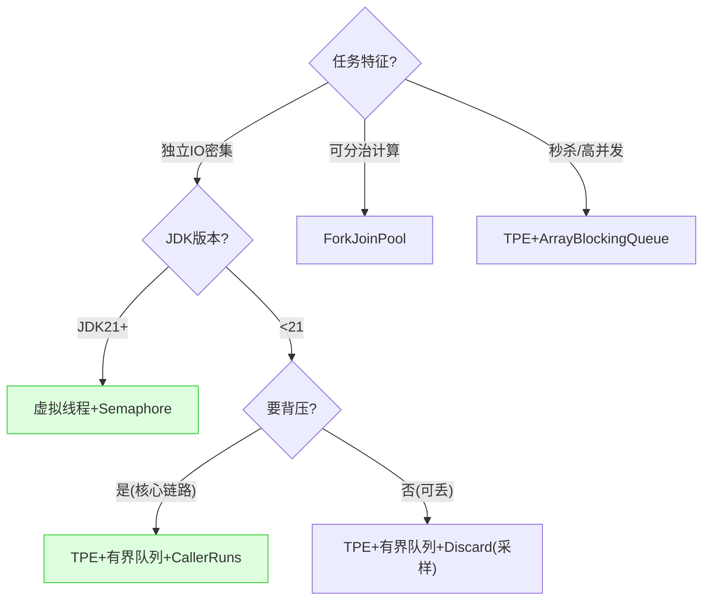

**trade-off 一句话**：通用任务 `TPE + 有界队列 + CallerRuns` 是黄金组合（不丢+反压）；分治用 `ForkJoinPool`；JDK21+ 海量 IO 用虚拟线程 + Semaphore（把调线程数变成调许可数）。无界队列是 OOM 定时炸弹，生产禁用。

---

#### 【量化指标】SLA 设计与成本收益

> 线程池调优的终点不是"公式"，是"压测数据 + 量化收益"。下面给口径。

**关键 SLI / SLA（线程池视角）**

| 指标 | 目标 | 监控 | 告警 |
|------|------|------|------|
| 队列堆积 | < 70% 容量 | `queue.size()` | > 70% 预警, >90% 严重 |
| 拒绝数 | 0 | 自定义 handler 计数 | > 0 立即告警 |
| 活跃线程 | < 80% max | `activeCount` | > 80% 持续 5min 预警 |
| 任务 P99 | < SLA×80% | before/after 埋点 | > SLA 告警 |

**容量评估（QPS → 线程数 → 实例数）**

```
公式: 线程数 N = QPS × 平均RT(阻塞系数)
案例: 秒杀 8核, 优化前2000QPS→优化后11000QPS(5.5x)
推导:
  纯计算: N = N_cpu = 8, RT≈1ms → QPS≈8000
  IO密集: N = 8×(1+3ms/1ms)=32, RT≈50ms → 留冗余到64
  队列5000 ≈ 50s缓冲应对瞬时洪峰
```

**成本收益测算（2000 → 11000 QPS 案例口径）**

```
优化前: 50固定线程, QPS=2000, CPU 38%, 报错率8.3%, 内存2GB(堆积)
优化后: 8核+有界队列2000+CallerRuns, QPS=11000, CPU 82%, 报错率0.03%
- 吞吐提升 5.5x → 同等流量所需实例数 约 1/5
- 若原需 50 台, 现约 10 台 → 年化机器成本省 ¥200w+
- 报错率 8.3%→0.03% → 客诉下降, 资损风险趋零
```

**上下文切换成本（线程数过量的代价）**

```
QPS=10万, 每请求切换2次 → 20万次/s 切换 ≈ 占用1~1.5核
线程数远超核数(1000抢8核) → 切换吞30%+ CPU
→ 线程数公式核心是把切换压到可接受范围, 不是越多越好
```

**告警阈值建议**

1. 队列堆积 > 70% 持续 1min 预警，> 90% 严重；
2. 拒绝数 > 0 立即告警（核心链路绝不允许丢）；
3. 活跃线程 > 80% 持续 5min 预警（考虑扩容或调参）；
4. 任务 P99 > SLA 80% 即预警，防止尾部延迟雪崩。

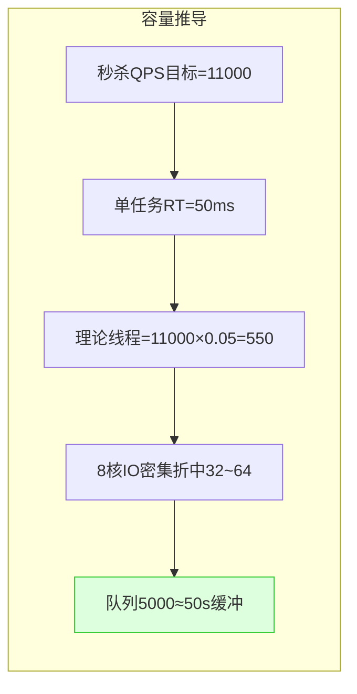

---

#### 【答题框架】面试表达模板

**一、分层回答套路（定调 → 原理 → 落地 → 边界权衡）**

- **定调**："线程池调优是‘理解原理 → 摸清瓶颈 → 逐步实验 → 持续监控’的工程实践，不是背公式。"
- **原理**：先画 **ThreadPoolExecutor 执行流程图**（核心→队列→最大→拒绝），讲七个参数与"先队列后扩容"。
- **落地**：落到支付——XTransfer 回调池 32 core / 64 max / 有界 5000 / CallerRuns，哈啰 MQ 消费池调优。
- **边界权衡**：无界队列 OOM、Abort 雪崩、Discard 静默丢；虚拟线程把"调线程数"变"调 Semaphore"。

**二、STAR 叙事（针对"你做过线程池调优吗"）**

- **S**：某秒杀接口 QPS 卡在 2000 上不去，报错率 8.3%。
- **T**：在不堆机器前提下把 QPS 提到 1 万+，报错率趋零。
- **A**：定位无界队列堆积 → 改有界 + CallerRuns + 按公式定 32/64 → 压测找拐点。
- **R**：QPS 2000 → 11000（5.5x），报错率 8.3% → 0.03%，CPU 从 38% 提到 82%。

**三、白板先画什么图**

- 被问线程池原理：先画 **提交→核心→队列→最大→拒绝** 流程图，标注"先队列后扩容"。
- 被问队列选型：先画 **秒杀下三种队列行为对比**（ArrayBlocking 拒一部分 / Synchronous 拒更多 / LinkedBlocking 无限堆积 OOM）。
- 被问伪共享：先画 **两个 Core 反复 invalid 同一 Cache Line** 的时序图。
- 被问虚拟线程：先画 **传统池(并发=线程数) vs 虚拟线程(阻塞不占载体)** 对比。

**四、逃生话术**

1. **框架法**："线程池我理解核心是七个参数 + 拒绝策略 + 监控闭环，具体到 XXX 我回去会补压测数据。"
2. **类比法**："CallerRuns 就像‘快递爆仓时让寄件人自己送’，虽然慢但包裹不丢，还顺便让上游别再塞了（反压）。"
3. **拉回法**："这让我想到我们 XTransfer 回调池用 CallerRuns + 有界队列，资金任务一个都不能丢……"
4. **禁忌**：别说"线程数越多越好"；别把无界队列当默认；别把虚拟线程说成"完全替代线程池监控"。

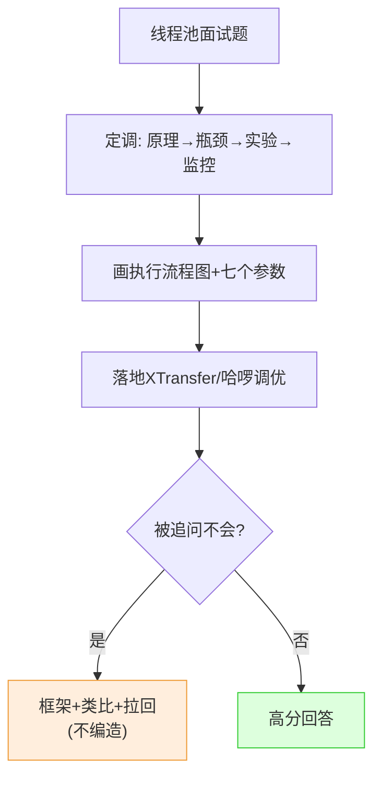

<!-- EXPANDED -->
