## 1. TCP 连接管理

> 握手是"建立双向收发能力"，挥手是"全双工各自关闭"。下面时序把 SYN/FIN/ACK 的来龙去脉画清楚。

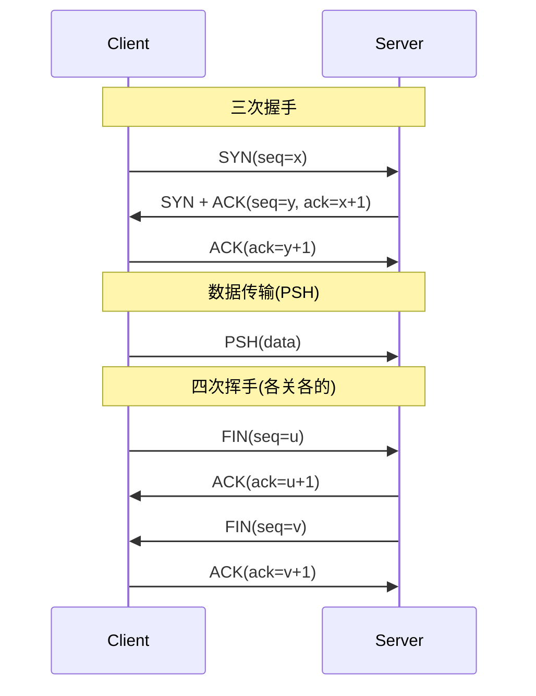

- **三次握手**：防止历史连接、确认双方收发能力；SYN 携带 ISN，双方各确认一次；
- **四次挥手**：全双工关闭，被动方可能还有数据要发，故 ACK 与 FIN 分开；
- **TIME_WAIT**：主动关闭方等待 2MSL，确保最后的 ACK 到达、旧报文消亡。高并发短连接服务器 `TIME_WAIT` 过多会耗尽端口——解法：`tcp_tw_reuse`、长连接、或 `SO_REUSEADDR`。

> 追问：为什么不是两次握手？→ 防止已失效的连接请求突然又传到服务器，造成资源浪费/脏连接。

## 1.1 TCP 状态机完整图解

> 面试官常问「画出 TCP 状态机」或「TIME_WAIT 和 CLOSE_WAIT 分别是谁的」。下面是完整状态转换图。

```mermaid
stateDiagram-v2
    [*] --> CLOSED
    CLOSED --> SYN_SENT: 客户端: connect()<br/>发送SYN
    CLOSED --> LISTEN: 服务端: bind()+listen()
    LISTEN --> SYN_RCVD: 收到SYN, 回SYN+ACK
    SYN_SENT --> ESTABLISHED: 收到SYN+ACK, 回ACK
    SYN_RCVD --> ESTABLISHED: 收到ACK
    ESTABLISHED --> FIN_WAIT_1: 主动关闭: send FIN
    FIN_WAIT_1 --> FIN_WAIT_2: 收到对端ACK
    FIN_WAIT_2 --> TIME_WAIT: 收到对端FIN, 回ACK
    TIME_WAIT --> CLOSED: 等待2MSL后关闭
    ESTABLISHED --> CLOSE_WAIT: 收到对端FIN, 回ACK
    CLOSE_WAIT --> LAST_ACK: 应用调close(), 发FIN
    LAST_ACK --> CLOSED: 收到对端ACK
    note right of TIME_WAIT: 主动关闭方<br/>2MSL原因:<br/>①最后ACK可能丢→等对端重发FIN<br/>②旧报文消亡→不复用端口
    note right of CLOSE_WAIT: 被动关闭方<br/>收到FIN但应用没close()<br/>→连接泄漏!比TIME_WAIT更危险
    note right of SYN_RCVD: 半连接队列<br/>SYN Flood攻击目标
```

**TIME_WAIT 深度分析**：

| 维度 | 分析 |
|------|------|
| 为什么 2MSL | MSL=报文最大生存时间。① 等对端重发 FIN（ACK 丢了的话）；② 让本连接残留报文消亡 |
| 端口耗尽 | 客户端（主动关闭方）TIME_WAIT 占本地端口，高并发短连接耗尽 → Cannot assign requested address |
| CLOSE_WAIT | 服务端收到 FIN 但没调 close() → 代码 bug（连接泄漏），比 TIME_WAIT 更危险 |
| 优化策略 | 根治用长连接；缓解用 tcp_tw_reuse（客户端安全复用）；tcp_tw_recycle 已废弃（NAT 出问题） |

**TIME_WAIT 优化配置**：

```bash
# /etc/sysctl.conf
net.ipv4.tcp_tw_reuse = 1          # 客户端安全复用TIME_WAIT
net.ipv4.tcp_fin_timeout = 30      # FIN_WAIT_2超时(默认60s)
net.ipv4.tcp_max_tw_buckets = 5000 # TIME_WAIT上限
# 根治: 长连接+连接池,不从源头产生大量TIME_WAIT
# 注意: tcp_tw_recycle 在4.12内核后已移除(NAT下导致丢包)
```

## 2. 拥塞控制（常问）

慢启动（指数探）→ 拥塞避免（线性增）→ 快重传（收到 3 个重复 ACK 即重传，不等超时）→ 快恢复。核心是把「丢包」当拥塞信号，逐步探明可用带宽。

> 补充：现代还有 **BBR**（基于带宽/延迟建模，而非丢包驱动），长肥管道（高 BDP）下比传统 Reno/CUBIC 更稳，gRPC 跨境调用可受益。

## 2.1 TCP 拥塞控制算法完整图解

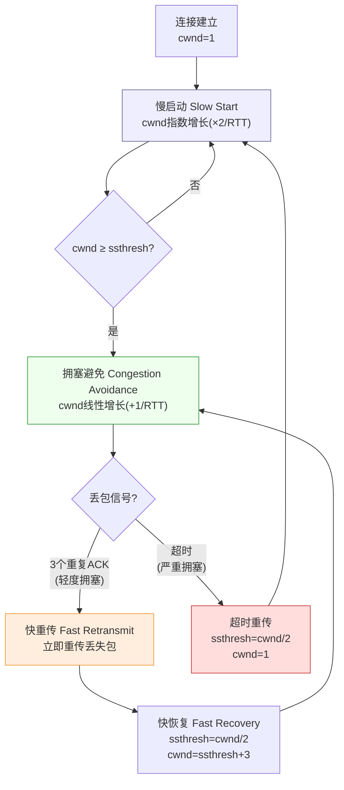

**四种拥塞控制算法对比**：

| 算法 | 拥塞信号 | cwnd 调整 | 特点 | 适用场景 |
|------|---------|-----------|------|---------|
| Reno | 丢包(3 dupACK/超时) | 减半/归1 | 经典，广泛部署 | 通用 |
| CUBIC | 丢包 | 三次函数增长 | Linux默认，高BDP友好 | 高带宽 |
| BBR | 带宽+RTT建模 | 估算最优窗口 | 不依赖丢包，抗抖动 | 跨境长肥管道 |
| Vegas | 延迟变化 | 基于RTT | 早早检测，但公平性差 | 研究用 |

**拥塞控制 vs 流量控制对比**：

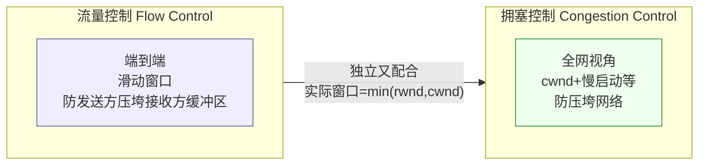

> **【深度拓展】** 传统 Reno/CUBIC 以「丢包」为拥塞信号，在高延迟长肥管道（高 BDP）下利用率低——因为丢包前带宽已满但 cwnd 还在涨。BBR 主动建模「瓶颈带宽 + 最小 RTT」，不依赖丢包，跨境 gRPC 调用吞吐更稳。
>
> **【项目支撑】** XTransfer 跨境支付链路高延迟，BBR 拥塞控制可提升跨境传输效率。欧凡海外直播弱网优化也受益于 BBR。
>
> **【面试官追问】** "慢启动为什么是指数增长？" → 初始不知道可用带宽，指数增长快速探测；到 ssthresh 后切线性（拥塞避免）避免过冲。

## 3. 流量控制 vs 拥塞控制

- **流量控制**（滑动窗口）：端到端，防止发送方压垮接收方缓冲区；
- **拥塞控制**：全网视角，防止压垮网络。两者独立又配合。

## 3.1 滑动窗口机制图解

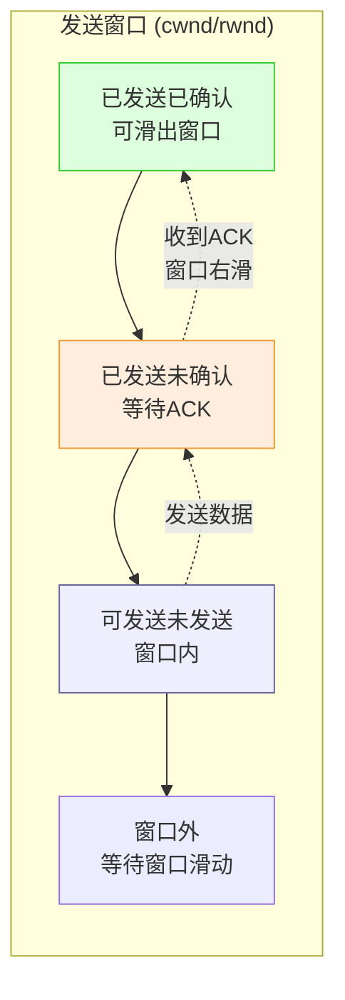

**流量控制 vs 拥塞控制对比**：

| 维度 | 流量控制 | 拥塞控制 |
|------|---------|---------|
| 视角 | 端到端（两台机器间） | 全网（路由器/链路） |
| 目标 | 不压垮接收方缓冲区 | 不压垮网络 |
| 机制 | 滑动窗口（rwnd） | cwnd（慢启动等） |
| 实际窗口 | min(rwnd, cwnd) | min(rwnd, cwnd) |

> **【深度拓展】** 实际发送窗口 = min(rwnd, cwnd)，即取接收方通告窗口和拥塞窗口的较小值。rwnd 由接收方通过 ACK 通告（缓冲区剩余空间），cwnd 由发送方根据拥塞算法动态调整。
>
> **【面试官追问】** "零窗口怎么办？" → 接收方缓冲区满时通告 rwnd=0，发送方停止发送但定期发窗口探测（zero window probe），等接收方缓冲区释放后恢复。

## 4. 粘包 / 拆包

TCP 是字节流，无消息边界。应用层需自己界定消息：

| 方案 | 做法 | 适用 |
| --- | --- | --- |
| 定长 | 每条固定长度 | 简单但浪费 |
| 分隔符 | 特殊字符（如 `\n`） | 不适合二进制 |
| 长度域 | **包头存 body 长度** | 最常用（Netty `LengthFieldBasedFrameDecoder`） |

## 4.1 粘包/拆包图解与 Netty 实现

**粘包/拆包发生场景图**：

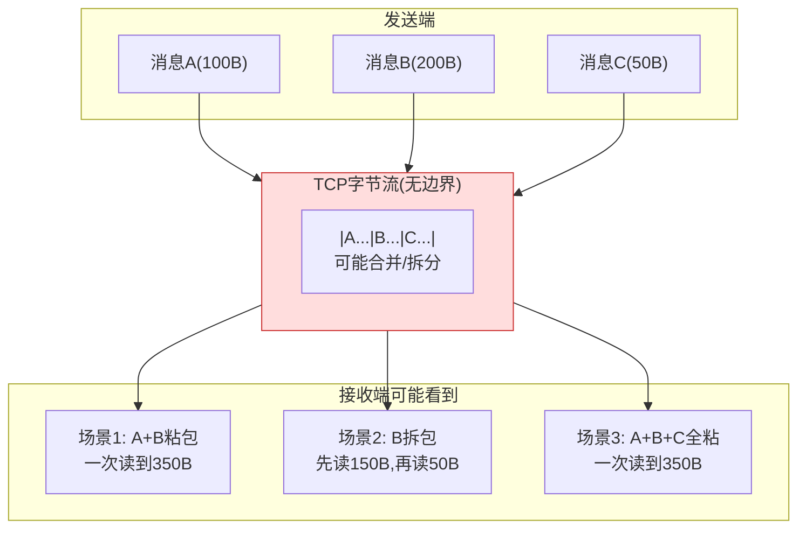

**Netty 长度域解码器实现**：

```java
// 自定义RPC协议: 魔数(4B) + 版本(1B) + 消息类型(1B) + 序列化(1B) + 长度(4B) + body(NB)
// LengthFieldBasedFrameDecoder 自动按长度域拆包

ChannelPipeline pipeline = ch.pipeline();
pipeline.addLast(new LengthFieldBasedFrameDecoder(
    1024 * 1024,  // maxFrameLength: 最大帧长(防OOM)
    7,            // lengthFieldOffset: 长度域偏移(跳过魔数+版本+类型+序列化)
    4,            // lengthFieldLength: 长度域本身4字节
    0,            // lengthAdjustment: 长度值就是body长度,无需调整
    0             // initialBytesToStrip: 不跳过头部(业务需要读头)
));
pipeline.addLast(new RpcRequestDecoder());  // 自定义解码器
pipeline.addLast(new RpcResponseEncoder()); // 自定义编码器
```

> **【深度拓展】** 粘包的「长度域」是工业标准：Dubbo/自定义 RPC 协议都用「包头长度字段 + body」。UDP 有边界不会粘包，但不可靠。HTTP/Protobuf 自带消息边界（Content-Length/帧头），不需要额外处理。
>
> **【项目支撑】** XTransfer 渠道对接用自定义 RPC 协议（Dubbo 协议），底层就是长度域拆包。对外 HTTP 接口天然有 Content-Length 边界，不需要自己处理粘包。

## 5. HTTPS / TLS

- TLS 1.2：非对称（ECDHE）协商 **会话密钥** → 对称加密传数据；证书链 + CA 防中间人；
- **TLS 1.3**：握手 1-RTT（甚至 0-RTT 复用），砍掉不安全套件，前向安全（FS）默认开启；
- 支付场景常加 **证书钉扎（certificate pinning）** 防伪造证书。

> 为什么不全用非对称？→ 非对称慢百倍，仅用于协商密钥，数据走对称（AES-GCM）。

## 5.1 TLS 1.2 vs TLS 1.3 握手对比图

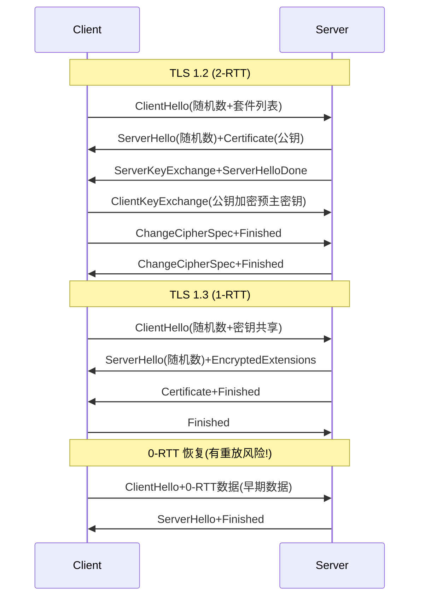

**TLS 安全机制对比表**：

| 维度 | TLS 1.2 | TLS 1.3 |
|------|---------|---------|
| 握手 RTT | 2-RTT | 1-RTT (0-RTT 恢复) |
| 密钥交换 | RSA/ECDHE | 仅 ECDHE (前向安全) |
| 加密套件 | CBC/GCM 等(含不安全) | 仅 AEAD (GCM/ChaCha20) |
| 压缩 | 支持 (有 CRIME 漏洞) | 砍掉 |
| RSA 密钥交换 | 支持 (非前向安全) | 砍掉 |
| 0-RTT | 不支持 | 支持 (有重放风险) |

> **【深度拓展】** 前向安全（FS）为什么重要：ECDHE 每次会话密钥不同，即使服务器私钥日后泄露，也无法解密历史流量。RSA 密钥交换（非 FS）一旦私钥泄露，历史流量全裸。TLS 1.3 默认 FS。
>
> **【项目支撑】** XTransfer 对接境外渠道的回调/通知强制 HTTPS + 证书校验，关键渠道还做证书钉扎防中间人伪造；内部 Dubbo/Triple 服务间用 mTLS 做服务身份认证。欧凡客户端接口签名（HMAC）防篡改，和 TLS 的「防窃听 + 防篡改」是同一安全诉求的不同层。
>
> **【面试官追问】** "0-RTT 重放风险怎么防？" → 0-RTT 早期数据可能被攻击者截获重发。解法：① 服务端记录已见 0-RTT 请求去重（需缓存）；② 0-RTT 只用于幂等 GET/HEAD，非幂等写强制走 1-RTT。

## 6. IO 多路复用：select/poll/epoll

> 核心差别：select/poll 每次都要**全量扫描**所有 fd（O(n)）；epoll 用**红黑树管 fd + 就绪链表回调**（O(1)），是高并发网络编程的基石（Redis/Nginx 都靠它）。

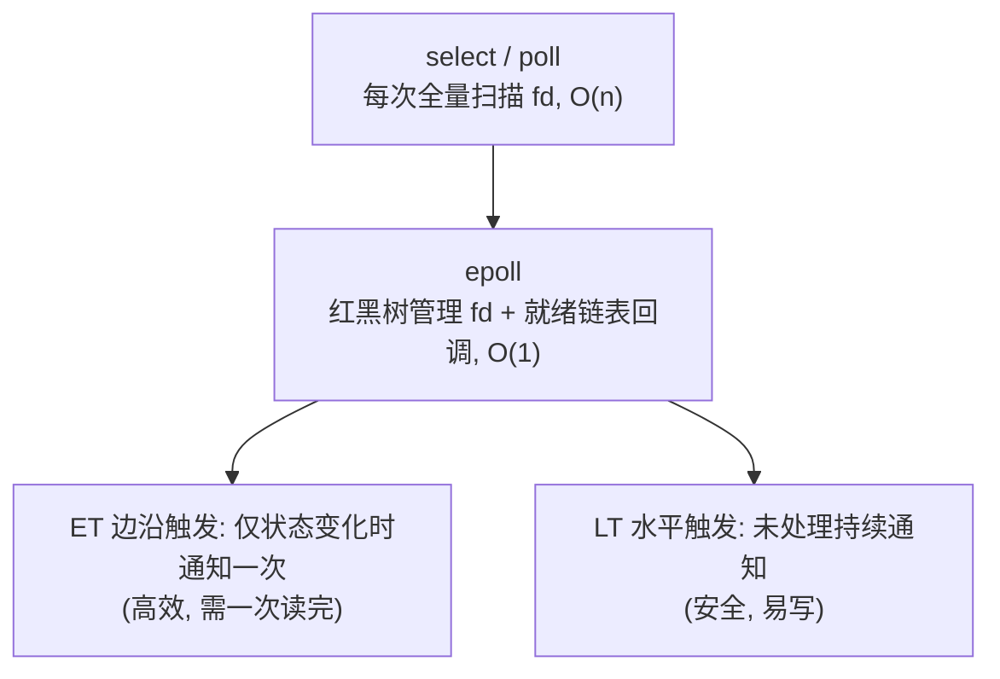

- `select/poll`：遍历 fd，O(n)，fd 上限低；
- `epoll`：内核回调 + 红黑树/就绪链表，O(1) 事件驱动，**支撑 C10K/C10M**；
- 边缘触发（ET）vs 水平触发（LT）：ET 性能高但必须一次读尽，否则丢事件。

> 这是「一个线程扛十万连接」的底层原理，Netty/Redis/Nginx 都基于此。

## 6.1 select vs poll vs epoll 深度对比

| 维度 | select | poll | epoll |
|------|--------|------|-------|
| 数据结构 | bitmap | 链表 | 红黑树+就绪链表 |
| fd 上限 | 1024 (FD_SETSIZE) | 无上限 | 无上限 |
| 时间复杂度 | O(n) 遍历 | O(n) 遍历 | O(1) 事件回调 |
| fd 拷贝 | 每次全量拷贝到内核 | 每次全量拷贝 | 只注册时拷贝一次 |
| 工作方式 | 水平触发 | 水平触发 | 水平+边缘可选 |
| 适用场景 | 连接少 | 连接少 | 高并发(C10K/C10M) |

**epoll 内部原理图解**：

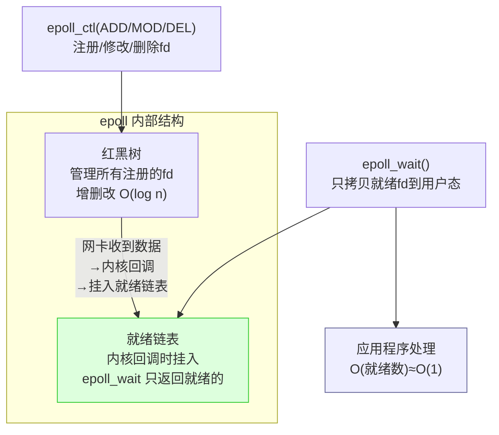

**Netty Reactor 模型与 epoll 的关系**：

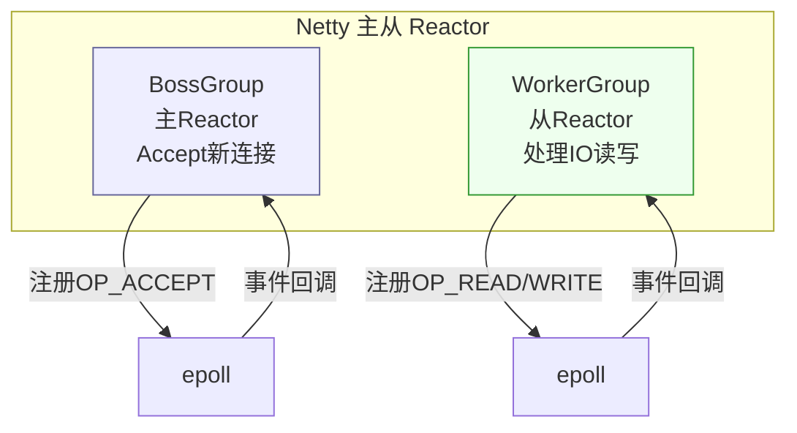

> **【深度拓展】** epoll 为什么是 O(1)：fd 注册时加入红黑树（增删改 O(log n)），事件就绪时由内核回调挂到就绪链表，`epoll_wait` 只返回就绪的（O(就绪数)）。fd 越多差距越大。Windows 用 IOCP（完成端口，proactor 模型）。
>
> **【项目支撑】** XTransfer 内部 Dubbo/Netty 通信底层就是 epoll 事件驱动 + 长连接多路复用；Redis（欧凡库存扣减、哈啰薪资缓存）的网络层也是 epoll。理解 epoll 才能解释「为什么一个 Redis 单线程能扛几万 QPS」——事件驱动 + 内存操作，没有线程切换开销。

## 7. HTTP/2 与 HTTP/3

- **HTTP/2**：单连接多路复用（stream + 帧 + 流 ID），解决 HTTP/1.1 队头阻塞（应用层）；
- **HTTP/3（QUIC）**：基于 **UDP**，内置 TLS 1.3，连接迁移（换 IP 不掉线）、0-RTT、无 TCP 队头阻塞——**跨境/弱网支付回调更稳**。

## 7.1 HTTP/1.1 → HTTP/2 → HTTP/3 演进对比图

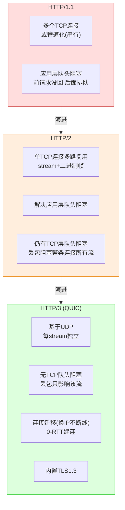

**HTTP/2 vs HTTP/3 对比表**：

| 维度 | HTTP/2 | HTTP/3 (QUIC) |
|------|--------|---------------|
| 传输层 | TCP | UDP |
| 队头阻塞 | TCP层有（丢包阻塞所有流） | 无（每流独立） |
| 连接迁移 | 不支持（四元组标识） | 支持（连接ID标识） |
| 握手 | TCP 3次 + TLS 1-2次 | 1-RTT/0-RTT（内置TLS1.3） |
| 加密 | 可选（h2通常加密） | 强制（TLS1.3内置） |
| 弱网表现 | 差（TCP队头阻塞） | 好（无队头阻塞+连接迁移） |

> **【深度拓展】** 两层「队头阻塞」要分清：HTTP/1.1 的在应用层（请求串行），HTTP/2 解决了它但底层 TCP 丢包仍阻塞整条连接，HTTP/3 换 QUIC（UDP）每个 stream 独立。QUIC 的「连接迁移」对跨境重要：TCP 由四元组标识，手机切网络 IP 变了连接就断；QUIC 用连接 ID，换 IP 不断线。
>
> **【项目支撑】** XTransfer 跨境对接境外渠道，弱网/高延迟场景优先用 HTTP/2（gRPC/Triple 多路复用省握手）；欧凡海外直播面向海外用户，同样吃到「多地域 + 就近接入 + 弱网协议优化」红利。
>
> **【面试官追问】** "0-RTT 有什么风险？" → 0-RTT 数据有重放攻击风险（攻击者截获重发），不能用于非幂等写。这又回到「幂等」——和支付篇呼应。

## 8. RPC 框架怎么选

```text
Dubbo   ：阿里系，注册中心 + 丰富治理（限流/熔断/灰度），Java 生态成熟
gRPC    ：HTTP/2 + Protobuf，跨语言、性能好，云原生友好
自研/Thrift：极致性能或特殊协议需求
```

**Protobuf vs JSON**：Protobuf 二进制、体积小、序列化快、强类型（需 schema）；JSON 可读、易调试、前后端友好。内部高频调用用 Protobuf。

**支付内部实践**：核心交易用 gRPC（Protobuf 强类型 + 多路复用），对外渠道用 HTTP + 异步回调。

> 想深入 Dubbo / Spring Cloud 的架构、对比与高频题，见 [RPC 框架与微服务治理](./准备-RPC框架与微服务治理.md)。

## 8.1 RPC 框架核心架构图解

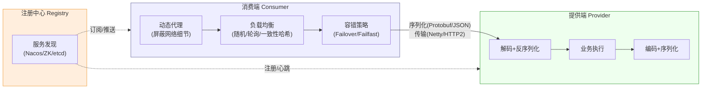

**Dubbo vs gRPC 对比表**：

| 维度 | Dubbo | gRPC |
|------|-------|------|
| 协议 | Dubbo TCP (自定义) | HTTP/2 |
| 序列化 | Hessian2/Protobuf/JSON | Protobuf (强制) |
| 跨语言 | 有限 (Triple协议改善) | 原生跨语言 |
| 服务治理 | 丰富(限流/熔断/灰度/路由) | 基础(需配合Istio/xDS) |
| 注册中心 | Nacos/ZK/etcd | xDS/Consul |
| 生态 | Java成熟 | 云原生友好 |
| 适用 | Java微服务内部 | 跨语言/云原生 |

> **【深度拓展】** RPC 和 HTTP API 的区别：RPC 屏蔽网络细节（像调本地方法），包含序列化、传输、服务发现、负载均衡、容错。HTTP API 是协议层面的请求-响应。gRPC 基于 HTTP/2 但加了 Protobuf + stub 生成 + 拦截器，是「HTTP/2 上的 RPC」。
>
> **【项目支撑】** XTransfer 内部用 Dubbo（SPI + 注册中心 + 负载均衡 + 容错），支付网关 Gateway 转内部 Dubbo。核心交易用 gRPC/Triple（Protobuf 强类型 + 多路复用），对外渠道用 HTTP + 异步回调。
>
> **【面试官追问】** "gRPC vs Dubbo 怎么选？" → Java 单体微服务选 Dubbo（治理成熟）；跨语言/云原生选 gRPC；混合用 Dubbo Triple 协议（兼容 gRPC + 保留 Dubbo 治理）。

## 9. 项目结合点

- **渠道对接**：支付结果异步回调 → 验签 → 落库 → 发 MQ 解耦，避免同步长等候把线程占满；
- **超时与重试**：调用渠道设合理超时（如 3s），配合**幂等**做安全重试（见分布式事务篇）；
- **心跳保活**：长连接网关定时心跳，断连快速 failover 到备用渠道；
- **弱网优化**：跨境链路优先 HTTP/3/QUIC，降低握手与重传开销。

## 9.1 网络问题排查工具链

> 面试官常问「线上网络不通/慢怎么排查」。下面是完整工具链和排查流程。

**网络排查工具链图**：

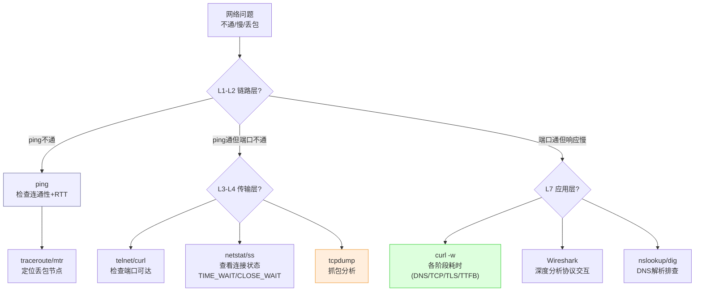

**常用排查命令速查表**：

| 场景 | 工具 | 命令示例 | 看什么 |
|------|------|---------|--------|
| 连通性 | ping | `ping -c 10 target.com` | 丢包率、RTT |
| 路由追踪 | mtr | `mtr -n target.com` | 每跳丢包+延迟 |
| 端口可达 | telnet/curl | `curl -v telnet://host:port` | 能否建立TCP |
| 连接状态 | ss/netstat | `ss -tnp | grep TIME_WAIT` | 连接状态分布 |
| 抓包 | tcpdump | `tcpdump -i eth0 port 443 -w out.pcap` | 协议交互细节 |
| DNS | dig | `dig +trace target.com` | 解析链路+耗时 |
| HTTP各阶段 | curl | `curl -w "@fmt" -o /dev/null -s url` | DNS/TCP/TLS/TTFB耗时 |
| 内核参数 | sysctl | `sysctl net.ipv4.tcp_tw_reuse` | TCP调优参数 |

```bash
# curl 各阶段耗时分析(支付渠道调用慢时常用)
curl -w @"
DNS:        %{time_namelookup}s
TCP连接:    %{time_connect}s
TLS握手:    %{time_appconnect}s
首字节:     %{time_starttransfer}s
总耗时:     %{time_total}s
"@ -o /dev/null -s https://api.payment-channel.com/health

# 输出示例:
# DNS:        0.012s
# TCP连接:    0.035s   ← 海外TCP握手慢
# TLS握手:    0.180s   ← TLS额外1-RTT
# 首字节:     0.250s   ← 服务端处理慢?
# 总耗时:     0.260s
```

**连接状态异常排查**：

```bash
# 统计各状态连接数(发现TIME_WAIT过多或CLOSE_WAIT泄漏)
ss -tn | awk '{print $1}' | sort | uniq -c | sort -rn
# 输出示例:
#  15234 TIME_WAIT     ← 主动关闭方,高并发短连接(考虑长连接)
#    342 ESTABLISHED
#     87 CLOSE_WAIT    ← 危险!代码收到FIN没close()(连接泄漏)
#     12 SYN_SENT
```

> **【深度拓展】** 网络排查的核心方法论是「分层定位」：L1-L2（ping/traceroute）→ L3-L4（telnet/ss/tcpdump）→ L7（curl/dig/wireshark）。先定位是哪层的问题，再用对应工具深挖。支付场景特别关注「curl 各阶段耗时」——能区分是 DNS 慢、TCP 握手慢、TLS 慢还是服务端处理慢。
>
> **【项目支撑】** XTransfer 跨境渠道调用慢时，用 `curl -w` 定位是 TLS 握手慢（跨境 RTT 高）还是服务端处理慢。欧凡海外直播用 mtr 定位跨国链路丢包节点。
>
> **【面试官追问】** "CLOSE_WAIT 多怎么排查？" → 说明代码收到对端 FIN 但没调 close()。用 `ss -tnp | grep CLOSE_WAIT` 找到对应进程，查代码哪里漏了 close()。比 TIME_WAIT 更危险（是代码 bug）。

> **【深度拓展 · 网络如何支撑资金系统】**：网络层对支付的价值不在"背协议"，而在三点——①**连接管理**（长连接 + 池化，规避 TIME_WAIT、省握手）；②**失败设计**（超时 + 幂等 + 重试 + 查单，应对"超时不可判定"）；③**弱网适配**（HTTP/2 多路复用 + QUIC + BBR，跨境高延迟长肥管道更稳）。这三点串起来就是"对依赖的敬畏 + 对失败的设计"，和高可用篇的方法论一脉相承。

---

## 面试高频问答（标准回答）

### Q1：三次握手、四次挥手分别做什么？为什么挥手是四次？

**标准回答**：握手三次是为了双方确认彼此的收发能力并同步初始序列号；挥手四次因为 TCP 全双工，被动方收到 FIN 后可能还有数据要发，所以先回 ACK，等自己数据发完再发 FIN，于是 ACK 与 FIN 不能合并，成为四次。

**【深度拓展】**
- **为什么是"三次"不是"两次"**：两次握手无法防止"已失效的旧连接请求"突然到达服务器——服务器会误以为是新连接，分配资源、发数据，客户端却不认（它根本没发起），造成服务器资源空耗（SYN 泛洪类问题）。三次握手让双方都确认过对方"本次"的 ISN，旧请求被丢弃。
- **为什么是"四次"不是"三次"**：FIN 只表示"我没数据要发了"，不代表"我也不收了"。被动方可能还有数据要发，所以必须先 ACK（我知道你要关了），等自己发完再 FIN。若被动方无数据，可捎带（ACK+FIN 合并）成为"三次挥手"的变种，但标准模型是四次。
- **ISN 为什么随机**：防止历史报文被误认为新连接的合法数据（序列号预测攻击）。这点和"为什么不用固定 ISN"同源。
- **面试官追问**："SYN 泛洪怎么防？" → SYN Cookie（不直接分配资源，用加密 cookie 验证第三次 ACK）；"握手期间客户端挂了怎么办？" → 服务端超时释放半连接（SYN Timeout）。

**【项目支撑】**
XTransfer 支付网关对接境外渠道用长连接 + 连接池，握手开销被摊薄；渠道回调走 HTTP 异步，连接管理靠连接池而非短连接，从源头规避了大量 TIME_WAIT。这正是对"握手成本"的工程化回应（见 Q2）。

### Q2：TIME_WAIT 有什么用？太多怎么办？

**标准回答**：主动关闭方保持 2MSL，确保对端收到最后的 ACK，并让网络中残留的旧报文过期。太多会占满端口：用长连接复用、开启 `tcp_tw_reuse`、或 `SO_REUSEADDR`。支付网关用长连接 + 连接池基本规避。

**【深度拓展】**
- **2MSL 的两个作用**：①确保"最后的 ACK"若丢失，被动方重发 FIN 时主动方还在（能再回 ACK）；②让本连接的"残留报文"在网络中彻底消亡，避免被复用端口的新连接误收。MSL 是"报文最大生存时间"，2 倍留足余量。
- **TIME_WAIT 多的真实危害**：客户端侧（短连接调用方）会耗尽「本地端口」（主动关闭方才进 TIME_WAIT），导致"Cannot assign requested address"，新连接建不了。服务端侧（被关方）通常进 CLOSE_WAIT（更危险的"连接泄漏"信号）。
- **根治 vs 缓解**：缓解用 `tcp_tw_reuse`（客户端安全复用 TIME_WAIT  socket）、`SO_REUSEADDR`；根治是"别用短连接"——长连接复用让连接数恒定，根本不产生海量 TIME_WAIT。微服务内部 Dubbo 长连接、DB 连接池都是这个思路。
- **面试官追问**："CLOSE_WAIT 多说明什么？" → 代码里"收到 FIN 但没调 close"（连接泄漏），比 TIME_WAIT 更危险；"tcp_tw_reuse 和 recycle 区别？" → recycle 已废弃（NAT 下出问题），reuse 安全。

**【项目支撑】**
XTransfer 支付网关对渠道用长连接 + 连接池，单连接多路复用，连接数恒定，从根上规避海量 TIME_WAIT；DB/RPC 连接池同理。欧凡直播电商的高并发商品接口也靠连接池复用，而非每次请求建短连接——这正是"用长连接根治 TIME_WAIT"的落地。

### Q3：HTTPS 为什么既要非对称又要对称？

**标准回答**：非对称加密慢但能安全交换密钥，对称加密快适合大量数据传输。所以握手阶段用非对称（ECDHE）协商出会话密钥，之后数据用对称（AES-GCM）加密，兼顾安全与性能。

**【深度拓展】**
- **为什么不全用非对称**：RSA/ECC 加解密比 AES 慢百倍，且长明文非对称有长度限制。所以非对称只用于"协商出对称密钥"（几字节），之后海量数据全走对称——这是性能与安全的经典权衡。
- **前向安全（FS）为什么重要**：ECDHE 是"临时密钥交换"，每次会话密钥不同，即使服务器私钥日后泄露，也无法解密历史流量。RSA 密钥交换（非 FS）一旦私钥泄露，历史流量全裸。TLS 1.3 默认 FS。
- **支付场景的额外加固**：证书钉扎（certificate pinning）——客户端预置可信证书指纹，即使遭遇伪造 CA 证书也能识破；双向 mTLS 在微服务间做"服务身份认证"（见 RPC 篇 Dubbo/SC 安全）。
- **面试官追问**："TLS 1.3 比 1.2 快在哪？" → 握手 1-RTT（1.2 是 2-RTT）、0-RTT 复用、砍掉不安全套件；"对称加密 AES-GCM 和 CBC 区别？" → GCM 带认证（防篡改），CBC 需额外 MAC，且曾有 POODBLE/BEAST 漏洞。

**【项目支撑】**
XTransfer 对接境外渠道的回调/通知强制 HTTPS + 证书校验，关键渠道还做证书钉扎防中间人伪造；内部 Dubbo/Triple 服务间用 mTLS 做服务身份认证。欧凡客户端接口签名（HMAC）防篡改，和 TLS 的"防窃听 + 防篡改"是同一安全诉求的不同层。

### Q4：epoll 和 select 的本质区别？ET 和 LT 怎么选？

**标准回答**：select 每次都要把全量 fd 拷贝进内核并遍历，O(n)；epoll 内核用红黑树管理 fd、就绪事件用回调放进链表，O(1)。ET 边缘触发性能高但必须一次性读/写到 EAGAIN，否则会丢事件，编码更难；LT 更安全，一般默认。Netty 类框架内部基于 ET 做精细控制。

**【深度拓展】**
- **epoll 为什么是 O(1)**：select/poll 每次调用都要把"全量 fd 集合"从用户态拷贝进内核、内核遍历所有 fd 找就绪的（O(n)）；epoll 用红黑树存 fd（增删改 O(log n)），就绪事件由内核回调挂到"就绪链表"，`epoll_wait` 只返回就绪的（O(就绪数)≈O(1)）。fd 越多，差距越大（C10K/C10M 的基石）。
- **ET vs LT 的取舍是"性能 vs 易写"**：ET 只在状态变化时通知一次，必须循环读写到 EAGAIN，否则漏事件（高并发框架爱用，吞吐高）；LT 只要没处理就一直通知，安全但可能反复唤醒。Netty/Nginx 内部基于 ET 做精细控制 + 自己的缓冲管理。
- **和用户态框架的关系**：Redis/Nginx/Netty 都基于 epoll（Linux），配合"单线程/少量线程 + 事件循环"，一个线程扛十万连接。这正是 RPC（Netty 传输层）、Redis（网络层）高并发的底层原理。
- **面试官追问**："epoll 惊群怎么办？" → SO_REUSEPORT 让多进程各持独立监听 socket，内核做负载均衡，避免惊群；"Windows 用什么？" → IOCP（完成端口，proactor 模型）。

**【项目支撑】**
XTransfer 内部 Dubbo/Netty 通信底层就是 epoll 事件驱动 + 长连接多路复用，一个 IO 线程扛大量渠道连接；Redis（欧凡库存扣减、哈啰薪资缓存）的网络层也是 epoll。理解 epoll 才能解释"为什么一个 Redis 单线程能扛几万 QPS"——事件驱动 + 内存操作，没有线程切换开销。

### Q5：HTTP/2 解决了什么？HTTP/3 又解决了什么？

**标准回答**：HTTP/2 用多路复用解决 HTTP/1.1 的「队头阻塞（应用层）」和连接数爆炸；HTTP/3 把传输层换成 QUIC（基于 UDP + TLS1.3），进一步解决了 TCP 层的队头阻塞和连接迁移问题，弱网/跨境更稳。

**【深度拓展】**
- **两层"队头阻塞"要分清**：HTTP/1.1 的队头阻塞在"应用层"（一个连接里请求串行，前一个没回后面排队）；HTTP/2 多路复用解决它，但底层还是一条 TCP，TCP 某个包丢了对整条连接的所有流都阻塞（TCP 层队头阻塞）。HTTP/3 换 QUIC（UDP），每个 stream 独立，丢包只影响自己那个流。
- **QUIC 的"连接迁移"为什么对跨境重要**：TCP 连接由"四元组"标识，手机切换网络（WiFi→4G）IP 变了连接就断，要重握手。QUIC 用"连接 ID"标识，换 IP 不断线——这对"跨境弱网/移动端"是质变。
- **0-RTT 的代价**：QUIC/TLS1.3 的 0-RTT 省一次往返，但 0-RTT 数据有"重放攻击"风险（不能用于非幂等写）。这又回到"幂等"——和支付篇呼应。
- **面试官追问**："为什么不全用 HTTP/3？" → 普及度/中间件兼容性/部分网络对 UDP 限流；"HTTP/2 在 RPC 里怎么用？" → gRPC/Triple 就是 HTTP/2 + Protobuf。

**【项目支撑】**
XTransfer 跨境对接境外渠道，弱网/高延迟场景下我们优先用 HTTP/2（gRPC/Triple 多路复用省握手）+ 在更极端的弱网选 QUIC 思路降低重传与队头阻塞；欧凡海外直播电商面向海外用户，同样吃到了"多地域 + 就近接入 + 弱网协议优化"的红利。这正是"网络协议选型跟着业务场景走"的体现。

> 讲网络别停在「三次握手」，要落到：**我的服务怎么扛高并发连接（epoll/长连接）、怎么处理超时与重试（幂等）、怎么防粘包（长度域）、弱网怎么选协议（HTTP/2/QUIC）**——这才是工程视角。

**【深度拓展 · 粘包/超时/弱网专项】**
- **粘包的"长度域"是工业标准**：Netty 的 `LengthFieldBasedFrameDecoder` 读"包头长度字段"再截取 body，Dubbo/自定义 RPC 协议都这么干（对应 RPC 篇"从 0 设计 RPC 的协议 header"）。UDP 有边界不会粘包，但不可靠。
- **超时重试 + 幂等是铁三角**：渠道调用超时不代表失败，重试必须幂等（见 RPC 篇 Q6、支付篇幂等三层）。XTransfer 渠道调用一律带幂等键 + 合理超时（如 3s）+ 指数退避重试。
- **弱网优化的层次**：协议层（HTTP/2 多路复用、QUIC）→ 传输层（BBR 拥塞控制，跨境长肥管道更稳）→ 应用层（超时重试 + 降级 + 异步补偿）。

**【项目支撑】**
XTransfer 渠道对接四件事是固定范式：异步回调（验签→落库→发 MQ 解耦，不占线程）→ 合理超时 + 幂等重试 → 长连接心跳保活 + failover → 弱网优先 HTTP/2/QUIC。哈啰 IOT 设备心跳、欧凡海外直播的弱网优化，都是同一套"对失败/弱网的设计"思想。

---

## 更多高频追问（补充）

**Q6：TCP 和 UDP 的区别？各自适合什么场景？**
> TCP 面向连接、可靠有序、有流量/拥塞控制，开销大，适合支付/文件/网页等要求可靠的场景；UDP 无连接、不保证到达和顺序、头部小、延迟低，适合音视频、直播、DNS、游戏、QUIC（在 UDP 上自己实现可靠）。跨境弱网选 HTTP/3(QUIC) 就是"用 UDP 换掉 TCP 的队头阻塞"。

**Q7：TCP 粘包/拆包为什么发生？怎么解决？**
> TCP 是**字节流**没有消息边界，Nagle 算法合并小包、接收缓冲区分批读，导致一次读到多条或半条消息。解决：①固定长度；②分隔符（如 \n）；③**长度字段 + 消息体**（最常用，Netty LengthFieldBasedFrameDecoder）；④用现成协议（HTTP/Protobuf 自带边界）。UDP 有边界不会粘包。

**Q8：从浏览器输入 URL 到页面显示发生了什么？（经典综合题）**
> DNS 解析（浏览器/系统/路由/递归查询）→ 建立 TCP 连接（三次握手）→ TLS 握手（HTTPS）→ 发送 HTTP 请求 → 服务端处理返回响应 → 浏览器解析 HTML、请求 CSS/JS/图片 → 渲染（构建 DOM/CSSOM → 布局 → 绘制）→ 断开或复用连接。能顺带讲 CDN、缓存、Keep-Alive 加分。

**Q9：拥塞控制的四个阶段？BBR 有什么不同？**
> 慢启动（指数涨）→ 拥塞避免（线性涨）→ 快重传（收到 3 个重复 ACK 立即重传）→ 快恢复。传统算法（Reno/CUBIC）**以丢包为拥塞信号**，在高延迟长肥管道下利用率低。BBR 主动建模**带宽和 RTT**，不依赖丢包，跨境高 BDP 链路吞吐更稳，gRPC 跨境调用可受益。

**Q10：长连接和短连接怎么选？如何保活？**
> 短连接每次请求建/拆连，简单但握手开销大、TIME_WAIT 多；长连接复用省开销、适合高频调用（RPC/DB 连接池/消息推送），但要管理连接状态和空闲回收。保活：TCP KeepAlive（内核级、间隔长）或**应用层心跳**（更灵活、能带业务探测），断连快速重连/failover。支付网关对渠道用长连接 + 心跳 + 连接池。

**Q11：RPC 超时了，请求到底执行了没有？怎么办？**
> 无法确定——可能请求没到、到了没处理、处理了响应丢了。所以**超时 + 重试必须配合幂等**：给请求带唯一 id，服务端幂等去重，重试才安全。非幂等写（扣款）宁可失败让用户重试，也不要盲目重试导致重复扣款（见分布式事务篇）。

**【深度拓展】**
- **"超时"在分布式里无法判定结果**：这是分布式系统的基本事实（FLP/不确定性）。所以架构上不能依赖"超时=失败"，而要靠"幂等 + 可查询 + 可补偿"——超时后去查状态（查单），查不到再决定重试或挂起。
- **三种结局的处理**：①没到→重试安全（但也要幂等，防止"重发时第一次其实到了"）；②到了没处理→重试安全（幂等去重）；③处理了响应丢→重试会重复，必须幂等（如"已 SUCCESS 直接返回首次结果"）。XTransfer 状态机 CAS 正是为第③种场景而生。
- **超时设太短 vs 太长**：太短→把"正常慢请求"误杀成失败，引发无谓重试/用户重试；太长→线程/连接被占，雪崩。要基于下游 P99 + 自己线程预算设，并配熔断。
- **面试官追问**："怎么知道重试会不会重复扣款？" → 看幂等键是否覆盖"同一笔业务的同一动作"，扣款类用 biz_no + 动作类型做唯一约束（见支付篇幂等三层）。

**【项目支撑】**
XTransfer 调境外渠道一律"合理超时 + 幂等键 + 指数退避重试 + 超时后查单确认"，渠道重复回调/重复查单命中状态机终态直接忽略，绝不会重复入账。这把"超时不可判定"这个分布式难题，用"幂等 + 状态机 + 查单"在工程上闭环了——是 0 资损的关键设计之一。

<!-- EXPANDED -->
